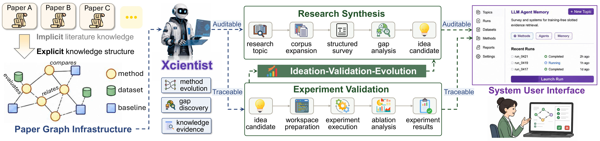

<p align="center">
 
</p>

<h2 align="center">Externalizing Research Synthesis and Validation in AI Scientists through a Research Harness</h2>

<p align="center">
  <a href="https://kotohanon.github.io/Xcientist/"></a>
  <a href="https://arxiv.org/pdf/2606.18874"></a>
  
  <a href="https://www.python.org/downloads/release/python-3120/"></a>
</p>

<div align="center">

**[English](README.md) | [简体中文](README_CN.md)**

</div>

<p align="center">
  
</p>

## 目录

- [仓库结构](#repository-map)
- [整体流程](#how-the-pieces-fit-together)
- [环境要求](#prerequisites)
- [安装](#installation)
- [环境变量](#environment-variables)
- [可选本地资源](#optional-local-assets)
- [快速开始](#quick-start)
  - [最快上手](#fastest-path)
  - [运行 Survey Agent](#run-survey-agent)
  - [运行 Idea Agent](#run-idea-agent)
  - [运行 Experiment Agent](#run-experiment-agent)
  - [运行 Blog Agent](#run-blog-agent)
  - [运行原型 Pipeline](#run-the-prototype-pipeline)
- [配置说明](#configuration-guide)
- [引用](#citation)

Xcientist 是一个面向科研流程的多 Agent 系统，目标是把一个研究主题逐步推进为综述材料、结构化 idea、可执行实验，以及技术博客文章。当前仓库主要由四个核心 Agent 组成：

- `Survey Agent`：检索论文、构建主题聚类并生成 survey 结果。
- `Idea Agent（LigAgent）`：基于 survey 检索、图谱 reference 和 Memory-Guided MCTS，把主题或成熟想法转成研究 proposal。
- `Experiment Agent（SuperAgent）`：准备实验工作空间、生成代码、执行实验，并整合迭代结果。
- `Blog Agent`：读取实验工作空间，生成技术博客文章、配图和质量检查结果。

仓库中还包含一个 `Survey -> Idea -> Experiment -> Blog` 的原型 pipeline、统一配置，以及可复用的 memory 子系统。

<a id="repository-map"></a>
## 🗂️ 仓库结构

```text
Xcientist/
├── README.md / README_CN.md       # 项目文档
├── pyproject.toml / uv.lock        # Python 包配置与 uv 锁文件
├── requirements.txt                # 兼容用途的依赖列表
├── run_survey.sh                   # `xcientist survey` 包装脚本
├── run_idea.sh                     # `xcientist idea` 包装脚本
├── run_experiment.sh               # `xcientist experiment` 包装脚本
├── run_blog.sh                     # `xcientist blog` 包装脚本
├── run_pipeline.sh                 # `xcientist pipeline` 包装脚本
├── scripts/                        # 安装与环境辅助脚本
│   ├── install_base.sh
│   ├── install_heavy.sh
│   ├── install_mcp_wrappers.sh
│   └── sync_claude_anthropic_env.py
├── src/
│   ├── __main__.py                 # `python -m src` 入口
│   ├── cli.py                      # 统一 `xcientist` CLI
│   ├── config/
│   │   ├── __init__.py             # 统一配置加载器
│   │   └── default.yaml            # 主配置文件
│   ├── pipeline/                   # Survey -> Idea -> Experiment -> Blog loop
│   ├── agents/
│   │   ├── survey_agent/           # 论文检索、聚类、survey 生成
│   │   ├── idea_agent/             # LigAgent idea / proposal 生成
│   │   ├── experiment_agent/       # SuperAgent 实验编排
│   │   └── blog_agent/             # 技术博客生成
│   └── memory/                     # 共享 vector / symbolic memory API
├── graph/                          # 图检索服务与索引脚本
├── database/                       # 检索工作流使用的本地缓存
├── assets/                         # 项目图片与静态资源
└── workspace/                      # 默认运行工作空间，本地创建/使用
```

<a id="how-the-pieces-fit-together"></a>
## 🔄 整体流程

```text
研究主题
  -> Survey Agent
     输出：survey.md + survey.json
  -> Idea Agent
     输出：idea_result.json
  -> Experiment Agent
     输出：workspace、results、ablation_results.json
  -> Blog Agent
     输出：blog workspace、文章草稿、生成配图
```

`src/pipeline/run_loop.py` 可以自动串起 `Survey -> Idea -> Experiment -> Blog` 全流程，但如果你需要定位问题，逐个 Agent 运行通常更直观。

<a id="prerequisites"></a>
## ✅ 环境要求

- `uv`
- Python `3.12`
- `Experiment Agent` 需要 `node` 和 `npx` 来启动 MCP server
- 运行不同 Agent 所需的 API key
- 图检索和 memory 能力依赖仓库外的本地数据或模型
   - 论文图相关资源(我们将在下个月尽快发布！)，将它们放入 `<repo_root>/data/processed`
   - 向量模型下载：
   ```
   mkdir -p models/bge-m3
   mkdir -p models/all-MiniLM-L6-v2
   modelscope download -- model baai/bge-m3 --local_dir <repo_root>/models/bge-m3
   modelscope download --model sentence-transformers/all-MiniLM-L6-v2 --local_dir <repo_root>/models/all-MiniLM-L6-v2
   ```
<a id="installation"></a>
## ⚙️ 安装

推荐使用 `uv`：

```bash
git clone --depth 1 https://github.com/OpenDFM/Xcientist.git
uv sync
source .venv/bin/activate
cp .env.example .env
xcientist doctor
```

常见分组安装方式：

```bash
# 仅安装基础 CLI / 配置 / API 工作流
uv sync

# 安装 memory 与本地模型相关能力
uv sync --group memory --group ml

# 安装 PDF 解析相关依赖
uv sync --group pdf

# 安装 Blog Agent 完整工作流：PDF 解析 + 图像生成 / OCR / 去文字
uv sync --group pdf --group blog

# 安装完整本地环境
uv sync --all-groups
```

如果你希望给 `Experiment Agent` 预先安装本地 MCP wrapper：

```bash
xcientist install-mcp-wrappers
```

`environment.yml` 仍然保留，作为兼容旧环境或全量环境的备选方案；但 `Survey + Idea + Experiment + Blog + Pipeline` 的主路径现在是 `uv sync`。依赖现在已经拆组，默认安装保持轻量，本地模型与 PDF 解析这类重依赖按需安装。
激活环境后，`xcientist`、`xcientist-survey`、`xcientist-idea` 这类 CLI 命令会直接出现在当前 shell 中。

<a id="environment-variables"></a>
## 🔐 环境变量

不同 Agent 读取的变量名并不完全一致，实际使用中最建议先配置这些：

```bash
export OPENAI_API_KEY=...
export OPENAI_BASE_URL=...
export SEMANTIC_SCHOLAR_API_KEY=...
export ANTHROPIC_API_KEY=...
export ANTHROPIC_BASE_URL=...
export SERPER_API_KEY=...
export GITHUB_AI_TOKEN=...
export JINA_API_KEY=...
export TAVILY_API_KEY=...
export HF_TOKEN=...
```

说明：

- 如果你使用自定义 OpenAI-compatible 接口，最好同时设置 `OPENAI_API_BASE` 和 `OPENAI_BASE_URL`。
- CLI 会优先读取仓库根目录 `.env`，同时兼容旧的 `src/config/.env`。
- 当前主配置文件是 `src/config/default.yaml`。
- Survey、Idea、Experiment、Blog 在统一配置之外，仍有各自的运行约定。

<a id="optional-local-assets"></a>
## 📦 可选本地资源

部分检索路径依赖不在仓库中的本地资源：

- `data/processed/graph.db`
- `data/processed/core_component_summary_vector_store/`
- `models/bge-m3/`
- `models/all-MiniLM-L6-v2/`

如果要启用 graph-backed retrieval，可在仓库根目录启动图服务：

```bash
uvicorn graph.server:app --host 127.0.0.1 --port 8000
```

健康检查：

```bash
curl http://127.0.0.1:8000/health
```

<a id="quick-start"></a>
## 🚀 快速开始

第一次建议先这样做：

```bash
uv sync --group memory --group ml
source .venv/bin/activate
cp .env.example .env
xcientist doctor
```

当 doctor 通过、graph/db 和模型到位后，再按下面的命令运行。

<a id="fastest-path"></a>
### 最快上手

使用我们提供的 `Training-Free Memory System for LLM Agents` 样例：

仅生成 survey：

```bash
xcientist survey --topic "Training-Free Memory System for LLM Agents"
```

基于我们提供的样例 survey 做 ideation：

```bash
xcientist idea --topic "Training-Free Memory System for LLM Agents"
```

基于我们提供的样例 idea 做 experiment：

```bash
xcientist experiment --experiment agent_memory --idea-json <repo_root>/src/agents/idea_agent/example/idea_result.json
```

基于该样例 experiment workspace 启动 blog：

```bash
xcientist blog --experiment agent_memory --source-workspace <repo_root>/workspace/training-free-memory-example
```

如果还需要进一步调整配置，请修改 `src/config/default.yaml`。

<a id="run-survey-agent"></a>
### 1. 运行 Survey Agent

推荐入口：

```bash
xcientist survey
```

直接覆盖 topic：

```bash
xcientist survey --topic <your_topic_name>
```

典型输出：

- `src/agents/survey_agent/outputs/.../survey.md`
- `src/agents/survey_agent/outputs/.../survey.json`
- `src/agents/survey_agent/outputs/.../evaluation.txt`

<a id="run-idea-agent"></a>
### 2. 运行 Idea Agent

推荐入口：

```bash
xcientist idea
```

直接覆盖 topic：

```bash
xcientist idea --topic <your_topic_name>
```

默认会使用 `src/config/default.yaml`，并在 `src/agents/idea_agent/runs/` 下创建运行目录，写出 `idea_result.json` 和日志。

<a id="run-experiment-agent"></a>
### 3. 运行 Experiment Agent

推荐入口：

```bash
xcientist experiment --experiment my_exp --idea-json /abs/path/to/idea_result.json
```

仅准备工作空间：

```bash
xcientist experiment --experiment my_exp --idea-json /abs/path/to/idea_result.json --prepare-only
```

直接入口：

```bash
python -m src.agents.experiment_agent.main --experiment my_exp --resume --verbose
```

默认工作空间在 `workspace/<experiment_id>/`，常见产物包括：

- `idea.json`
- `project/`
- `dataset_candidate/`
- `results/`
- `agent_reports/`
- `ablation_results.json`

<a id="run-blog-agent"></a>
### 4. 运行 Blog Agent

`Blog Agent` 会基于已有实验工作空间生成技术博客文章。

推荐入口：

```bash
xcientist blog --experiment my_exp
```

默认 workspace root 是 `<repo_root>/workspace` 时，上面的命令会读取：

```bash
<repo_root>/workspace/my_exp
```

也可以显式传入这个实验工作空间：

```bash
xcientist blog --experiment my_exp --source-workspace <repo_root>/workspace/my_exp
```

如果实验工作空间不在 blog agent 的默认源路径下，可以显式传入：

```bash
xcientist blog --experiment my_exp --source-workspace /abs/path/to/experiment_workspace
```

恢复已有 blog workspace：

```bash
xcientist blog --experiment my_exp --resume
```

`./run_blog.sh` 仍保留为兼容包装脚本，会转发到同一个 `xcientist blog` 命令。

<a id="run-the-prototype-pipeline"></a>
### 5. 运行原型 Pipeline

使用 `src/config/default.yaml` 里的 topic 启动完整集成链路：

```bash
xcientist pipeline
```

启动时直接覆盖研究主题：

```bash
xcientist pipeline --topic "Training-Free Memory System for LLM Agents"
```

使用自定义配置文件：

```bash
xcientist pipeline --config /abs/path/to/config.yaml --topic "Your Research Topic"
```

<a id="configuration-guide"></a>
## 🧭 配置说明

当前配置布局是混合式的：

| 区域 | 主要来源 |
|------|----------|
| 全局项目配置 | `src/config/default.yaml` |
| Survey Agent | `src/config/default.yaml` 的 `survey:` 段，以及 `src/agents/survey_agent/config/*.yaml` |
| Idea Agent | `src/config/default.yaml` 的 `idea:` 段 |
| Experiment Agent | `src/config/default.yaml` 的 `experiment:` 段和环境变量 |
| Blog Agent | `src/config/default.yaml` 的 `blog:` 段，以及需要时设置 `BLOG_AGENT_SOURCE_WORKSPACE` |
| Pipeline | `src/config/default.yaml` 的 `pipeline:` 段 |

如果你是第一次配置这个项目，优先阅读和修改 `src/config/default.yaml`。

<a id="citation"></a>
## 引用

如果你在研究中使用了 Xcientist，请引用：

```bibtex
@article{wang2026externalizing,
  title={Externalizing Research Synthesis and Validation in AI Scientists through a Research Harness},
  author={Wang, Zijian and Li, Hanqi and Yang, Ziyue and Hu, Zijian and Zuo, Shenghan and Zhang, Yunzhe and Ma, Da and Luo, Danyu and Wang, Chenrun and Peng, Jing and others},
  journal={arXiv preprint arXiv:2606.18874},
  year={2026}
}
```
