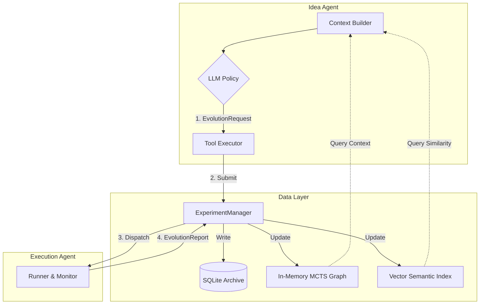

# Research Agent System Design: The Evolution Engine
> Version: 1.1.0 (Data-Centric Rewrite)
> Date: 2024-12-24
> Context: Automated Scientific Discovery (OpenEvolve)

## 1. 架构总览 (High-Level Architecture)

本系统将科学发现建模为一个 **MCTS (蒙特卡洛树搜索)** 过程。Idea Agent 是策略网络 (Policy Network)，Experiment Agent 是环境 (Environment) 和价值网络 (Value Network)。

为了支持这一过程，数据层不仅仅是“存储”，而是**“导航系统”**。



---

## 2. 数据层设计 (The Data Layer)

数据层由三部分组成：**全量归档 (Archive)**、**拓扑图索引 (Graph Index)**、**语义索引 (Semantic Index)**。

### 2.1 全量归档 (Archive - SQLite)
**定位**：Source of Truth。存储所有运行过的实验，包括失败的。

**Schema Definition (`src/experiment/schema.sql`)**:
```sql
CREATE TABLE experiments (
    -- 身份与族谱
    id TEXT PRIMARY KEY,                  -- UUID or Hash of (Parent + Code Patch)
    parent_id TEXT,                       -- 指向父节点，Root 为 NULL
    
    -- 核心载荷 (JSON Blob)
    proposal_snapshot TEXT,               -- 完整的 Proposal JSON (复现用)
    code_patch TEXT,                      -- 相对于 Parent 的 Diff (或全量代码)
    
    -- 科学元数据 (用于搜索和验证)
    hypothesis TEXT,                      -- "Adding LayerNorm will fix gradient explosion"
    success_criteria TEXT,                -- "Val Acc > 85%"
    
    -- 实验结果
    status TEXT,                          -- 'PENDING', 'RUNNING', 'SUCCESS', 'CRASH', 'DIVERGED'
    summary TEXT,                         -- 自然语言结论: "LayerNorm worked but slowed down training."
    metrics_json TEXT,                    -- {"val_acc": 0.88, "train_loss": 0.12}
    
    -- 物理工件
    artifacts_path TEXT,                  -- "/workspace/experiments/exp_8a7b2/"
    
    -- 时间戳
    created_at DATETIME DEFAULT CURRENT_TIMESTAMP
);

CREATE INDEX idx_parent ON experiments(parent_id);
CREATE INDEX idx_status ON experiments(status);
```

### 2.2 拓扑图索引 (Graph Index - MCTS)
**定位**：导航地图。维护实验之间的父子关系和**价值统计量**。常驻内存，定期 Dump。

**Node Structure (Python Object)**:
```python
class MCTSNode:
    id: str
    parent: Optional[MCTSNode]
    children: List[MCTSNode]
    
    # --- MCTS 统计量 ---
    visit_count: int = 0          # N: 被访问/探索过多少次
    value_sum: float = 0.0        # W: 累积价值 (Based on Metrics)
    mean_value: float = 0.0       # Q = W / N
    
    # --- 状态标记 ---
    status: str                   # 'SUCCESS' (可扩展), 'CRASH' (死胡同), 'PRUNED' (剪枝)
    meta: Dict                    # 轻量级元数据: {'acc': 0.88, 'hypothesis': '...'}
    
    def uct_score(self, c_param=1.41):
        # Upper Confidence Bound for Trees
        if self.visit_count == 0:
            return float('inf')
        return self.mean_value + c_param * sqrt(log(self.parent.visit_count) / self.visit_count)
```

### 2.3 语义索引 (Semantic Index - Vector DB)
**定位**：查重与灵感检索。

*   **Embedding Object**: `Text = Hypothesis + Summary`
*   **Metadata**: `{"exp_id": "...", "outcome": "SUCCESS/FAILURE"}`
*   **Query**: Idea Agent 提问 "Has anyone tried Dropout?" -> 检索出 `Exp_042 (Failed), Exp_099 (Success)`。

---

## 3. 交互协议 (Protocols)

### 3.1 请求：EvolutionRequest (Idea -> Manager)
Idea Agent 提交的不只是代码，是一个**带有预期的实验请求**。

```python
class EvolutionRequest(BaseModel):
    experiment_id: str
    parent_id: Optional[str]
    
    # 实验内容
    proposal: Proposal  # 包含 code, methodology 等
    
    # 科学契约 (核心)
    hypothesis: str     # "I expect X to improve Y"
    
    # 资源约束
    resources: Dict[str, Any] = {"timeout": 600}
```

### 3.2 响应：EvolutionReport (Manager -> Idea)
Experiment Agent 执行后的结案陈词。

```python
class EvolutionReport(BaseModel):
    experiment_id: str
    
    # 状态
    status: str         # SUCCESS / CRASH / DIVERGED
    
    # 结论 (由 ExpAgent 生成)
    summary: str        # "Hypothesis CONFIRMED. Acc improved by 2%."
    
    # 量化指标 (用于更新 MCTS Value)
    metrics: Dict[str, float]
    
    # 失败详情 (仅在 status!=SUCCESS 时存在)
    error_feedback: Optional[OptimizationBatch] 
```

---

## 4. 工具定义 (Tools for Idea Agent)

Idea Agent 通过以下 Tool 与数据层交互。每个 Tool 背后都有明确的数据流。

#### Tool 1: `get_lineage(experiment_id)`
*   **场景**: "我现在在哪？之前的尝试都发生了什么？"
*   **数据流**:
    1.  查 **Graph Index**: 找到 `experiment_id` 对应的 Node。
    2.  **Backtrack**: 沿着 `parent` 指针回溯到 Root。
    3.  查 **Archive**: 获取路径上每个节点的 `summary` 和 `metrics`。
*   **输出**:
    ```text
    Path: Root -> Exp_A(Base) -> Exp_B(Add RNN) -> Exp_C(Add Attn)
    Trend: Loss decreased [0.9 -> 0.6 -> 0.4]. Memory usage [1GB -> 1.2GB -> 3GB].
    Current Status: Exp_C is a LEAF node.
    ```

#### Tool 2: `explore_frontier(n=5)`
*   **场景**: "我现在该去哪？有哪些还没探索完的有潜力分支？"
*   **数据流**:
    1.  查 **Graph Index**: 遍历所有 Leaf Nodes。
    2.  **Filter**: 排除 `CRASH` 或 `PRUNED` 的节点。
    3.  **Sort**: 按 `uct_score` 或 `mean_value` 排序。
*   **输出**:
    ```json
    [
      {"id": "exp_101", "score": 0.92, "desc": "ResNet-50 Base (High Potential)"},
      {"id": "exp_105", "score": 0.85, "desc": "ViT Base (Needs more tuning)"}
    ]
    ```

#### Tool 3: `search_memory(query)`
*   **场景**: "我们要不要试一下 LayerNorm？之前试过吗？"
*   **数据流**:
    1.  查 **Semantic Index**: `vector_search(query, top_k=3)`。
    2.  返回匹配的 Experiment 摘要。
*   **输出**:
    ```text
    Found 2 related experiments:
    1. Exp_055: "Adding LayerNorm before activation" -> FAILED (Diverged).
    2. Exp_089: "Adding RMSNorm" -> SUCCESS (Acc +1%).
    ```

#### Tool 4: `read_node_details(experiment_id, detail_level)`
*   **场景**: "Exp_055 为什么失败了？我想看具体报错。"
*   **数据流**:
    1.  查 **Archive**: `SELECT * FROM experiments WHERE id=...`
    2.  如果 `detail_level='full'`: 读取 `artifacts_path` 下的 Log 文件。
*   **输出**: 完整的 Traceback 或 Metrics JSON。

---

## 5. 实现路径 (Implementation Roadmap)

1.  **Schema Definition (`schema.py`)**:
    *   定义 `EvolutionRequest`, `EvolutionReport` (Pydantic)。
    *   定义 `MCTSNode` 结构。
2.  **Database Engine (`database.py`)**:
    *   实现 SQLite 初始化和 CRUD。
    *   实现 `archive_experiment(report)`。
3.  **Graph Manager (`mcts.py`)**:
    *   实现 `update_graph(report)`: 根据 Report 更新节点 Value 和 Visit Count。
    *   实现 `get_lineage()` 和 `get_frontier()` 逻辑。
4.  **Integration (`main.py`)**:
    *   将 Idea Agent 的 Tool 绑定到上述 Manager 的方法上。
    *   在 Experiment Agent 跑完后，自动触发 `update_graph`。

