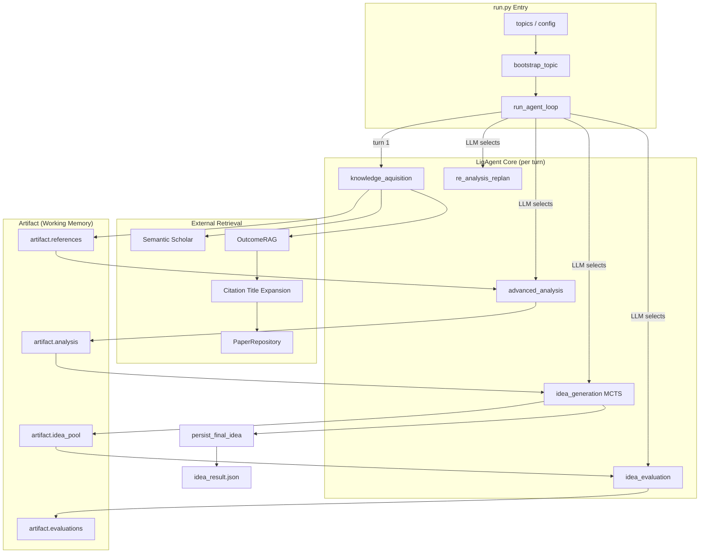

# LigAgent — Idea Agent System

> Version: 2.0.0
> Date: 2026-02-21
> Context: Automated Scientific Idea Discovery (LigAgent)

---

## Table of Contents

1. [Architecture Overview](#1-architecture-overview)
2. [Agent Lifecycle](#2-agent-lifecycle)
3. [Artifact / Working Memory](#3-artifact--working-memory)
4. [Five-Action Protocol](#4-five-action-protocol)
5. [Memory-Guided MCTS](#5-memory-guided-mcts)
6. [Idea Persistence (persist_final_idea)](#6-idea-persistence-persist_final_idea)
7. [Long-Term Memory](#7-long-term-memory)
8. [Configuration Reference](#8-configuration-reference)
9. [Output Artifacts](#9-output-artifacts)
10. [Quickstart Guide](#10-quickstart-guide)

---

## 1. Architecture Overview

LigAgent models research-idea generation as a closed loop of **"Knowledge Acquisition → Analysis → MCTS Search → Evaluation → Persistence"**.
The core driver is a **Memory-Guided MCTS** engine.
External literature retrieval (Semantic Scholar) and survey-level RAG (Survey Agent OutcomeRAG) are unified as "context fuel."

When `run.mature_idea` is set in the config, the agent enters **Contract mode**: the MCTS root is initialised from the mature idea and all expansions are constrained not to drift from its mechanism.



---

## 2. Agent Lifecycle

### 2.1 Entry Point — `run.py`

`run.py` is the sole entry point. It:

1. Loads the merged config via `load_idea_agent_config()`.
2. Applies API-key env-vars from config (`OPENAI_API_KEY`, `S2_API_KEY`, etc.).
3. Expands topics + parallelism into `(topic, replica_index)` pairs.
4. Spawns a `ProcessPoolExecutor` and calls `_run_topic` for every pair.
5. Each worker writes its output to `<output_root>/<slug-timestamp-uuid>/`.

### 2.2 `_run_topic` (worker)

1. Creates `<run_dir>/logs/` directory.
2. Initialises file logger → `logs/ligagent.log`.
3. Instantiates `LigAgent(run_dir, rag_config, config)`.
4. Calls `agent.bootstrap_topic(topic)` — generates a background brief and primes `artifact["topic"]` and `artifact["retrieval_keywords"]`.
5. Calls `run_agent_loop(agent, max_turns, logger)`.

### 2.3 `run_agent_loop`

```
Turn 1  →  action = "knowledge_aquisition"  (always forced)
Turn N  →  action = agent.select_action(artifact["steps"][-1])   (LLM decides)
```

Each turn calls `agent.perform_action(action)`, which appends a step summary string to `artifact["steps"]`.

---

## 3. Artifact / Working Memory

`artifact` is a plain Python dict, initialised by `artifact_init()`, and is the single source of truth throughout one run.

```python
artifact = {
    "topic":               [],   # list of active topic strings (appended by bootstrap / replan)
    "run_topic":           "",   # original topic string from launcher
    "survey":              "",   # (reserved) survey text
    "background_knowledge":[],   # LLM-generated background brief(s)
    "analysis":            [],   # structured analysis entries (from advanced_analysis)
    "references":          [],   # list-of-lists of curated paper dicts
    "rag_query":           [],   # refined OutcomeRAG queries
    "rag_hits":            [],   # {"query": ..., "hits": [...]} per retrieval round
    "rag_contents":        [],   # extracted survey subsection texts
    "paper_contents":      {},   # paperId → parsed-content metadata
    "idea_pool":           [],   # MCTS winner dicts per idea_generation call
    "evaluations":         [],   # standalone evaluation results
    "retrieval_keywords":  [],   # keyword strings used for Semantic Scholar
    "dialogue":            {},   # (reserved) dialogue history
    "steps":               [],   # human-readable step summaries
    "artifact_structure":  {},   # (reserved) structural metadata
}
```

---

## 4. Five-Action Protocol

### 4.1 `knowledge_aquisition`

**Always the first action of a run.**

#### Standard path (no mature_idea)

1. **Semantic Scholar seed** — `run_tool("semantic_search", query=retrieval_keywords[-1], limit=N)` returns up to N papers.
2. **Keynote generation** — `PaperRepository.prepare_papers()` parses the seed papers; keynotes are extracted by `IdeaPaperAnalyzer.ensure_keynotes()`.
3. **RAG query generation** — LLM synthesises a focused query from the seed keynotes (`generate_rag_query`).
4. **OutcomeRAG retrieval** — `OutcomeRAG.retrieve(rag_query, top_k=5)` reads Survey Agent outputs and returns relevant subsections.
5. **Citation expansion** — `collect_rag_citations` extracts citation titles from subsections; `search_papers_from_citations` maps titles back to paperIds via `PaperRepository.search_papers_by_title()`.
6. **Enrichment** — `safely_enrich_papers_with_content` fetches full text for seed + cited papers (with configurable timeout).
7. **Filtering** — `filter_and_compress_papers` scores and retains top-k papers.
8. **Writes** — `artifact["references"]`, `artifact["rag_query"]`, `artifact["rag_hits"]`, `artifact["rag_contents"]`, `artifact["paper_contents"]`.

#### Contract path (mature_idea set)

RAG query is generated directly from `mature_idea` (skips Semantic Scholar seed). Only OutcomeRAG + citation expansion are performed.

---

### 4.2 `advanced_analysis`

- **Input** — `artifact["references"][-1]`
- **Process** — LLM analyses curated papers, extracts key methods, pain points, and future directions.
- **Writes** — `artifact["analysis"]`, `artifact["background_knowledge"]`.

---

### 4.3 `idea_generation`

Runs **Memory-Guided MCTS** (see §5) on the current analysis + idea pool.

- **Input** — `artifact["analysis"]`, `artifact["idea_pool"]`, `artifact["paper_contents"]`, `artifact["background_knowledge"]`, optionally `run.mature_idea`.
- **Writes** — `artifact["idea_pool"]` (best MCTS node), `artifact["evaluations"]`.
- **Side effect** — triggers `persist_final_idea` (see §6), which writes `idea_result.json`.

---

### 4.4 `idea_evaluation`

Standalone evaluation of `artifact["idea_pool"][-1]` using LLM scoring. Updates `idea_pool[-1]["evaluation"]`.

---

### 4.5 `re_analysis_replan`

Triggered when the current search direction is exhausted.

- **Input** — `artifact["idea_pool"][-1]`, current `topic`, current `retrieval_keywords`.
- **Writes** — appends new entries to `artifact["topic"]` and `artifact["retrieval_keywords"]`, enabling the next `knowledge_aquisition` to search a fresh angle.

---

## 5. Memory-Guided MCTS

### 5.1 Core Data Structures

```python
@dataclass
class IdeaState:
    title: str
    abstract: str
    core_contribution: str
    method: str
    experiments: str
    risks: str
    tags: List[str]
    operator: str          # edit operator that produced this state
    target_defects: List[str]
    rationale: str
    components: List[str]  # structured mechanism components (1–5)
    edit_plan: Optional[Dict]
    skill_metrics: Dict
    # signature hash is computed automatically via __post_init__

class IdeaNode:
    state: IdeaState
    parent: Optional[IdeaNode]
    children: List[IdeaNode]
    visits: int
    value_sum: float
    evaluation: Optional[IdeaEvaluation]

    def uct_value(self, parent_visits, c):
        return (value_sum / visits) + c * sqrt(log(parent_visits) / visits)
```

### 5.2 Evaluation Signal

```python
@dataclass
class IdeaEvaluation:
    novelty:      float   # weight 0.30
    impact:       float   # weight 0.25
    feasibility:  float   # weight 0.20
    clarity:      float   # weight 0.15
    conciseness:  float   # weight 0.10
    risk:         float   # penalty  0.20
    confidence:   float   # gates LTM write-back

    @property
    def composite(self):
        return (0.30*novelty + 0.25*impact + 0.20*feasibility
                + 0.15*clarity + 0.10*conciseness - 0.20*risk)
```

### 5.3 Search Loop

```
Root ← build_root_state(analysis, idea_pool, context, [mature_idea])
for iter in range(max_iterations):
    node  = select(root)          # UCT traversal
    child = expand(node)          # LLM proposes state via EDIT_OPERATORS
    score = simulate(child)       # LLM evaluates; cache if identical signature
    backpropagate(child, score)
    maybe_record_experience(child, min_confidence_for_memory)
best  = best_candidate(root)      # highest composite score
```

### 5.4 Key Mechanisms

| Mechanism | Detail |
|-----------|--------|
| **Edit operators** | `REFINE`, `PIVOT`, `COMPOSE`, `SIMPLIFY`, `SCOPE`, `EXTEND` — LLM selects the most appropriate operator at each expansion |
| **Component editing** | Each idea is decomposed into 1–5 mechanism `components`; `apply_edit_plan_to_components` applies atomic edits |
| **Evaluation cache** | Identical `IdeaState.signature` → reuse cached `IdeaEvaluation`; avoid redundant LLM calls |
| **Pareto candidates** | `pareto_candidates` selects top-k nodes by composite score before final selection |
| **Contract mode** | Root state derived from `mature_idea`; expansion restricted to incremental changes within the declared mechanism |
| **Anti-pattern guard** | `ANTI_PATTERN_CONSTRAINTS` blocks previously failed patterns via `format_defect_registry` |
| **LTM write-back** | Only when `evaluation.confidence > min_confidence_for_memory` (default `0.6`) |

---

## 6. Idea Persistence (`persist_final_idea`)

Called automatically at the end of `idea_generation` once the best MCTS node is selected.

```
best_entry
    ├─ build_algorithm_spec(...)            → structured algorithm/method description
    ├─ synthesize_reference_summaries(...)  → curated reference list with summaries
    ├─ suggest_datasets(...)                → dataset recommendations with match scores
    ├─ suggest_baselines(...)               → baseline recommendations with match scores
    └─ generate_idea_introduction(...)      → LaTeX-ready introduction paragraph

payload → artifact["idea_result"] → idea_result.json
```

### Output schema (`idea_result.json`)

```json
{
  "title": "...",
  "abstract": "...",
  "introduction": "...",
  "algorithm": ["step 1 ...", "step 2 ..."],
  "reference_papers": [{"title": "...", "summary": "..."}],
  "datasets": [{"name": "...", "usage": "...", "scores": {"match": 4}}],
  "baselines": [{"name": "...", "scores": {"match": 40}}],
  "mcts_evolution": {
    "best_path": "...",
    "iterations": [{"iteration": 0, "title": "...", "score": 1.2}]
  },
  "idea_contract": "..."
}
```

> `idea_contract` is only present in Contract mode runs.

---

## 7. Long-Term Memory

LTM is powered by a `FAISSMemorySystem` + `SymbolicMemorySystem` (via the `memory` package).

| Store | Purpose |
|-------|---------|
| **Semantic** | Field knowledge and prior successful ideas |
| **Episodic** | Anti-patterns and defect records |
| **Procedural** | Fix recipes for known defect classes |

Write-back condition: `evaluation.confidence > mcts.min_confidence_for_memory` (default `0.6`).

Memory bundles are injected into MCTS expansion prompts via `MemoryBundle`, providing "corrective priors" that bias the search away from known failure modes.

---

## 8. Configuration Reference

### 8.1 `config/run/default.yaml` — Runtime parameters

```yaml
run:
  topics:
    - "Diffusion Models for Reinforcement Learning in Games"
  max_turns: 4          # max agent turns per topic
  parallelism: 1        # concurrent workers (1 = serial)
  output_root: "runs"   # relative to idea_agent root
  console_logs: true    # echo logs to stdout
  rag_config: "src/agents/survey_agent/config/outcomeRAG.yaml"

  # Optional — enables Contract mode
  mature_idea: "..."

  # API credentials (can also be set via environment variables)
  openai_api_key: "..."
  openai_base_url: "..."
  s2_api_key: "..."
  s2_api_timeout: "60"
  serper_api_key: "..."
  serper_api_endpoint: "..."
  mineru_model_source: "modelscope"
```

### 8.2 `config/mcts/default.yaml` — MCTS search parameters

```yaml
mcts:
  max_iterations: 128
  max_depth: 3
  branching_factor: 3
  exploration_constant: 1.15
  generation_model: "gpt-5-mini"
  evaluation_model: "gpt-5.2"
  generation_temperature: 0.7
  evaluation_temperature: 0.001
  generation_max_tokens: 8192
  evaluation_max_tokens: 8192
  min_confidence_for_memory: 0.6   # LTM write-back threshold
  pareto_top_k: 5
  # Composite score weights
  novelty_weight: 0.30
  impact_weight: 0.25
  feasibility_weight: 0.20
  clarity_weight: 0.15
  conciseness_weight: 0.10
  risk_weight: 0.20
```

### 8.3 `config/dataset/default.yaml` & `config/baseline/default.yaml`

Control retrieval and scoring for dataset/baseline suggestions in `persist_final_idea`.

### 8.4 `config/agent/` — Agent-level parameters

Controls `model`, `chat_max_retries`, `chat_retry_backoff`, `semantic_search_limit`, `idea_context_limit`, `paper_enrichment_timeout_sec`, `action_selection_attempts`.

---

## 9. Output Artifacts

Each topic run produces an isolated directory:

```
runs/
└── <topic-slug>-<YYYYMMDD-HHmmss-μs>-<uuid8>/
    ├── idea_result.json   # final idea + MCTS trace
    └── logs/
        └── ligagent.log   # full run log
```

> When `parallelism > 1` with a single topic, the run_id also includes a `-rNN` replica suffix (e.g. `-r01`, `-r02`).

---

## 10. Quickstart Guide

### Step 1 — Configure API keys

Edit `src/agents/idea_agent/config/run/default.yaml`:

```yaml
run:
  openai_api_key: "sk-..."
  openai_base_url: "https://api.example.com/v1"
  s2_api_key: "..."
  serper_api_key: "..."
```

### Step 2 — Set your topic

```yaml
run:
  topics:
    - "Graph Reasoning for LLMs"
```

### Step 3 — (Optional) Point RAG at existing survey output

```yaml
run:
  rag_config: "src/agents/survey_agent/config/outcomeRAG.yaml"
  # ensure save_path / save_json_path inside that file point to real survey outputs
```

### Step 4 — Run

```bash
# From project root
./run_idea.sh
# or
python src/agents/idea_agent/run.py
```

### What happens step by step

1. **Bootstrap** — LLM generates a background brief; `retrieval_keywords` is primed.
2. **`knowledge_aquisition`** — Semantic Scholar seed → RAG query → OutcomeRAG → citation expansion → enrich → filter → `artifact["references"]` populated.
3. **`advanced_analysis`** — LLM identifies key methods, pain points, open questions → `artifact["analysis"]`.
4. **`idea_generation`** — Memory-Guided MCTS runs; winner written to `artifact["idea_pool"]`.
5. **`persist_final_idea`** — Algorithm spec, references, datasets, baselines, and introduction are synthesised → `idea_result.json` written.
6. **Subsequent turns** — LLM selects `idea_evaluation` to refine, or `re_analysis_replan` to pivot topic, until `max_turns` is reached.

---