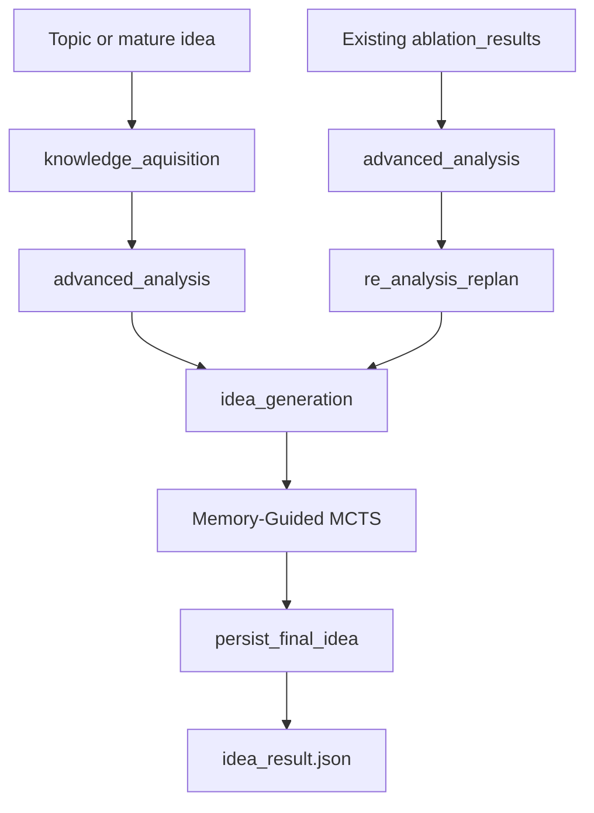

# LigAgent — Idea Agent

LigAgent is the idea-generation subsystem in ResearchAgent. It turns a topic or a mature seed idea into a structured research proposal by combining survey-grounded retrieval, graph-backed Core reference selection, structured analysis, Memory-Guided MCTS, and final idea materialization.

## Overview

The current implementation is built around five principles:

- **Conditional stage workflow** rather than a free-form action loop.
- **Contract mode** when a user provides `run.mature_idea`.
- **Root-domain locking** so theory transfer does not silently change the idea's home field.
- **Preset-driven search posture** through `idea_taste_mode`.
- **Dual memory guidance**: vector snippets for prompting and symbolic priors for operator selection / evaluation calibration.

At a high level:



The main workflow is chosen dynamically:

- If `artifact["ablation_results"]` is empty: `knowledge_aquisition -> advanced_analysis -> idea_generation`
- If `artifact["ablation_results"]` already exists: `advanced_analysis -> re_analysis_replan -> idea_generation`

There is no old "five-action controller" in the main path anymore. The authoritative logic lives in `utils/workflow/ligagent_flow.py`.

## Runtime Workflow

### `knowledge_aquisition`

Cold-start retrieval stage.

- Generates a focused query from `artifact["retrieval_keywords"]` or directly from `mature_idea`
- Uses that query against OutcomeRAG to retrieve survey sections
- If survey citations are available, uses citation titles to retrieve `Core` nodes from `graph.db`
- Otherwise falls back to using the query directly against the graph server
- Selects a compact batch of Core references for downstream analysis and MCTS context

Writes:

- `artifact["references"]`
- `artifact["rag_query"]`
- `artifact["rag_hits"]`
- `artifact["rag_contents"]`

### `advanced_analysis`

Turns selected Core references plus survey snippets into a structured analysis entry.

- Extracts key methods, pain points, open questions, and search seeds
- Appends reusable background lines into `artifact["background_knowledge"]`

Writes:

- `artifact["analysis"]`
- `artifact["background_knowledge"]`

### `re_analysis_replan`

Activated only when `artifact["ablation_results"]` is present.

- Revises the active topic framing
- May update `artifact["mature_idea"]`
- Refreshes retrieval keywords for another pass

### `idea_generation`

Builds MCTS context from:

- `artifact["analysis"]`
- `artifact["latest_candidate"]`
- `artifact["background_knowledge"]`
- reference context built from selected Core references plus survey RAG snippets
- optional `artifact["mature_idea"]`

Then it:

1. injects symbolic priors,
2. if `run."LigAgent-Pro"` is `false`, runs one `MemoryGuidedMCTS.search(...)` using the configured `idea_taste_mode`,
3. if `run."LigAgent-Pro"` is `true`, prepares one shared root context, runs all five idea taste presets in parallel from that same root, keeps one best candidate per mode, and sends them to a GPT-5.4 fusion agent,
4. re-evaluates the fused candidate under a fixed referee mode,
5. persists the final idea through `persist_final_idea(...)`.

## Artifact and Outputs

`artifact` is the single mutable state container for one LigAgent run. Important fields from `agent/artifacts.py`:

| Field | Meaning |
|------|---------|
| `topic` | active topic history |
| `run_topic` | original launcher topic |
| `mature_idea` | contract root or replanned mature idea |
| `refinement_scope` | optional hard boundary describing which subsystem or edit surface LigAgent may refine |
| `background_knowledge` | analysis-derived background lines |
| `analysis` | structured analysis entries |
| `references` | selected Core-reference batches from `graph.db` |
| `rag_query`, `rag_hits`, `rag_contents` | OutcomeRAG query plus retrieved survey sections |
| `latest_candidate` | current best canonical idea payload from `idea_generation` |
| `ligagent_pro_candidates` | raw per-mode best candidates collected by LigAgent-Pro |
| `fusion_result` | latest fusion-agent output plus the evaluated fused candidate |
| `evaluations` | evaluation payloads collected during idea generation |
| `retrieval_keywords` | current retrieval strings |
| `workflow_trace`, `workflow_state`, `operation_trace` | execution metadata |

If an `idea_taste_mode` preset resolves successfully, `LigAgent.__init__` also adds:

- `artifact["idea_taste_mode"]`
- `artifact["idea_taste_label"]`

Each `latest_candidate` entry is richer than the final public JSON. It stores:

- canonical idea fields such as `title`, `abstract`, `method`, `components`
- `evaluation`
- `search_score`
- `search_path`
- `pareto_candidates`
- `search_trace`
- optional provenance such as `idea_source`, `source_modes`, and `fusion_metadata`

The persisted `idea_result.json` is intentionally smaller and proposal-oriented:

- `title`
- `abstract`
- `introduction`
- `components`
- `algorithm`
- `reference_papers`
- `mcts_evolution`
- if the final idea is fused: `fusion_evolution`
- optional provenance such as `idea_source`, `source_modes`, and `fusion_metadata`
- optional `idea_contract`

`mcts_evolution` is retained for backward compatibility. When the final idea comes from the fusion agent, `fusion_evolution` is the fusion-specific field that describes component selection, conflict resolution, and the post-fusion evaluation pass.

## Memory-Guided MCTS

### Root State and Root-Domain Lock

`build_root_state(...)` initializes the MCTS root from one of three sources:

1. `mature_idea` if contract mode is active
2. the `latest_candidate` if present
3. a baseline seed synthesized from analysis/background knowledge

Before the real search starts, `MemoryGuidedMCTS.search(...)` classifies the root into one or two fixed domains. These are stored on every `IdeaState` as `root_domains`.

This matters because:

- every child idea keeps the same `root_domains`
- the skill-instantiation prompt explicitly forbids domain drift
- `theory-transfer-injection` may use other domains as references, but not as the new home domain

### Core Search Objects

Important runtime structures:

- `IdeaState`: current idea snapshot, components, defects, `root_domains`, `edit_plan`, `skill_metrics`
- `IdeaNode`: MCTS node with parent/children/visits/value/evaluation
- `IdeaEvaluation`: multi-metric score with composite aggregation
- `EditPlan`: skill-compiled atomic component edits plus validation protocols

### Defects and Skills

The search space is organized around a canonical defect registry plus a small set of edit-operator skills.

Current built-in skills:

| Skill | Main Use |
|------|----------|
| `mechanism-commit-innovation` | commit to one concrete mechanism-level novelty |
| `alternative-path-contrast` | introduce a fallback or rare-regime path |
| `surgical-modularity` | localized modular replace/rewire edits |
| `multi-scale-coordinator` | coordination across scales/layers |
| `hierarchical-decomposition` | replace flat flow with explicit hierarchy |
| `feedback-closed-loop` | turn open loop into monitored adaptation |
| `theory-transfer-injection` | import a transferable principle from another domain |
| `speculative-execution-with-repair` | optimistic path plus repair/rollback |

The evaluator returns only canonical defect tags from `utils/mcts/defect_registry.py`. The root node is evaluated once before the first expansion so the search does not remain stuck with the placeholder defect `unexplored_gap`.

### Idea Taste Presets

`idea_taste_mode` is no longer "evaluation weights only". It now affects three layers:

1. **evaluation weights** through `apply_idea_taste_preset(...)`
2. **skill selection bias** through `SkillCatalog.select_skills(...)`
3. **component-generation guidance** through the skill-instantiation prompt

Current presets:

| Preset | Intended posture |
|------|-------------------|
| `moonshot_inventor` | one bold mechanism with outsized upside |
| `bridge_builder` | cross-domain transfer with explicit adaptation |
| `steady_engineer` | minimal, stable, easy-to-integrate ideas |
| `ambitious_realist` | default high-upside posture with discipline |
| `evidence_first` | lightest mechanism that can be validated cleanly |

Each preset defines:

- `weights`
- `skill_bias`
- `instantiation_guidance`

### Expand Step

`expand_node_with_skills(...)` is where most of the new behavior lives.

For each node being expanded:

1. **Retrieve vector memory**
   - `VectorMemoryAccessor.retrieve_bundle(...)` returns field knowledge, anti-patterns, and fix recipes.

2. **Select candidate skills**
   - `SkillCatalog.select_skills(...)` scores every skill using:
     - `defect_score`
     - `skill_prior`
     - `preset_bias`
   - Current weighted formula:

   ```text
   selection_total =
       0.60 * defect_score +
       0.20 * skill_prior +
       0.20 * preset_bias
   ```

3. **Compile plans**
   - `compile_plan(...)` turns a skill blueprint into `ComponentEdit` operations and validation protocols
   - rule constraints learned in `SkillUsagePrior` are appended to plan guardrails

4. **Instantiate the plan**
   - the prompt now includes:
     - `idea_taste_mode`
     - `idea_taste_label`
     - `taste_guidance`
     - fixed `root_domains`
   - taste guidance is a soft preference only; it cannot override the plan, defects, or guardrails

5. **Special handling for `theory-transfer-injection`**
   - build a transfer query from the current idea + edit plan
   - retrieve cross-domain paper-graph nodes outside the root domains
   - skip child creation if no eligible transfer references meet the threshold
   - pass transfer query and retrieved cross-domain references into instantiation

6. **Materialize the child**
   - `component_mapping` and `edit_reasons` from the LLM output rewrite the generic plan into a concrete idea
   - child `skill_metrics` now records:
     - `idea_taste_mode`
     - `skill_selection_breakdown`

In the current implementation, symbolic memory no longer participates in skill ordering or action priors during expand. It is only used later in `simulate_node_value(...)` as component-ablation evidence for the evaluator.

### Simulate / Evaluate

`simulate_node_value(...)` builds the evaluation prompt from:

- topic
- mature idea
- latest analysis
- current run idea pool snapshot
- reference context
- compact compiled edit plan
- trimmed candidate idea
- canonical defect registry
- retrospective symbolic-memory hints

Important evaluation details:

- evaluator output is parsed into `IdeaEvaluation`
- component novelty may be re-scored by `ComponentNoveltyScorer`
- if protocol score is missing, it is inferred from the edit plan
- results are cached by `(IdeaState.signature, prompt_hash)`

### Backpropagation and Learning Signals

After simulation:

- the rollout score is backpropagated through the path
- `update_skill_prior_from_evaluation(...)` updates `SkillUsagePrior`
- the run trace records operator, defects, rationale, score, path, evaluation payload, signature, edit plan, and `skill_metrics`

### Experience Write-Back

If `evaluation.confidence > min_confidence_for_memory`, the node becomes a write-back experience.

Each experience includes:

- defect summary
- chosen skill/operator
- lift estimate
- title/context
- feedback
- edit plan

Experiences are persisted into the long-term memory stack through `SlotProcess`.

## Configuration

Primary config files:

- `config/run/default.yaml`
- `config/mcts/default.yaml`
- `config/fusion/default.yaml`

Most important runtime keys:

### `run/default.yaml`

- `topics`
- `LigAgent-Pro`
- `output_root`
- `console_logs`
- `rag_config`
- `mature_idea`
- `refinement_scope`
- API credentials and retrieval endpoints

### `mcts/default.yaml`

Key search controls:

- `max_iterations`
- `max_depth`
- `branching_factor`
- `exploration_constant`
- `idea_taste_mode`
- `generation_model`
- `evaluation_model`
- `generation_temperature`
- `evaluation_temperature`
- `component_novelty_*`
- `theory_transfer_retrieval_top_k`
- `theory_transfer_similarity_threshold`
- `symbolic_memory_path`
- `skill_prior_success_threshold`

### `fusion/default.yaml`

- `enabled`
- `only_when_ligagent_pro`
- `model`
- `temperature`
- `max_tokens`
- `min_candidates`

At the time of writing, the checked-in default preset is `evidence_first`.

## Quickstart

```bash
./run_idea.sh
# or
PYTHONPATH=. python src/agents/idea_agent/run.py
```

Outputs are written under:

```text
src/agents/idea_agent/runs/<topic-slug>-<timestamp>-<uuid>/
```

The two most important artifacts are:

- `idea_result.json`
- `logs/ligagent.log`

For top-level project usage, see the repository root `README.md`.
