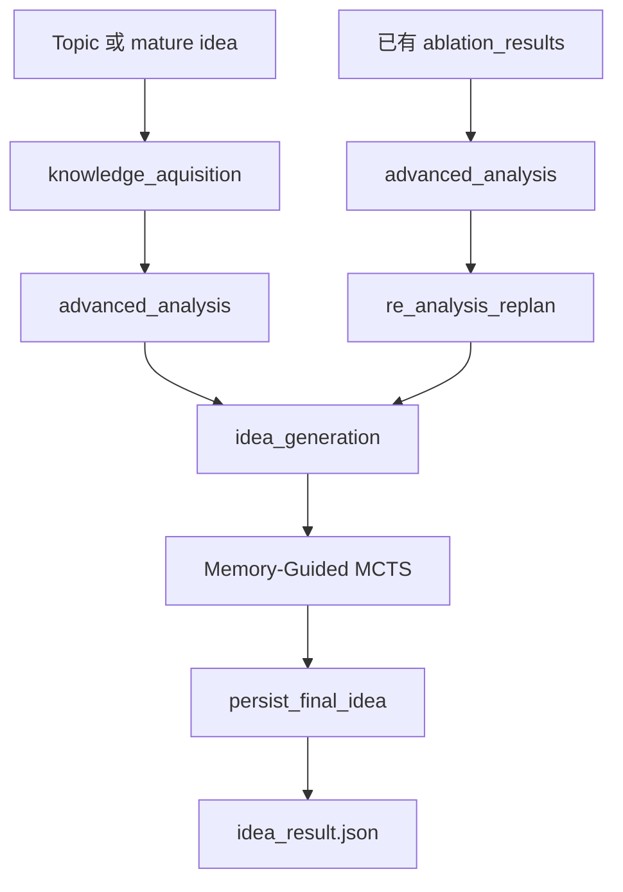

# LigAgent — Idea Agent 系统说明

LigAgent 是 ResearchAgent 中负责想法生成的子系统。它把一个研究主题，或者用户提供的成熟想法，转成结构化研究 proposal，核心手段是 survey 检索、graph Core reference 选择、结构化分析、Memory-Guided MCTS 搜索和最终 idea materialization。

## 概览

当前实现围绕五个原则组织：

- **条件分支 workflow**，而不是自由轮询的动作循环
- **Contract 模式**，用于 `run.mature_idea`
- **根领域锁定**，避免 theory transfer 悄悄把 idea 带到别的领域
- **Preset 驱动的搜索姿态**，由 `idea_taste_mode` 控制
- **双重记忆引导**：向量记忆负责文本提示，符号记忆负责算子先验和评估校准

高层流程如下：



主流程由 `utils/workflow/ligagent_flow.py` 决定：

- 若 `artifact["ablation_results"]` 为空：`knowledge_aquisition -> advanced_analysis -> idea_generation`
- 若 `artifact["ablation_results"]` 已存在：`advanced_analysis -> re_analysis_replan -> idea_generation`

现在的主流程里已经没有旧版那种“五动作控制器”了，文档应以这条条件 workflow 为准。

## 运行时工作流

### `knowledge_aquisition`

冷启动检索阶段。

- 根据 `artifact["retrieval_keywords"]` 或 `mature_idea` 生成聚焦 query
- 用该 query 在 OutcomeRAG 上检索 survey 片段
- 如果拿到了 survey citations，就用 citation titles 去 `graph.db` 检索 `Core` 节点
- 否则直接用 query 去 graph server 检索
- 选出一小批 Core references，供下游分析和 MCTS 使用

写入：

- `artifact["references"]`
- `artifact["rag_query"]`
- `artifact["rag_hits"]`
- `artifact["rag_contents"]`

### `advanced_analysis`

把选中的 Core references 和 survey 片段转成结构化分析。

- 提炼关键机制、痛点、开放问题和后续搜索种子
- 把可复用背景知识追加到 `artifact["background_knowledge"]`

写入：

- `artifact["analysis"]`
- `artifact["background_knowledge"]`

### `re_analysis_replan`

只在 `artifact["ablation_results"]` 存在时进入。

- 重写当前 topic framing
- 可能更新 `artifact["mature_idea"]`
- 更新检索关键词，为下一轮 retrieval 做准备

### `idea_generation`

它会从以下上下文构造 MCTS 输入：

- `artifact["analysis"]`
- `artifact["latest_candidate"]`
- `artifact["background_knowledge"]`
- 由 Core references 和 survey 片段组成的 reference context
- 可选的 `artifact["mature_idea"]`

随后执行：

1. 注入 symbolic priors
2. 如果 `run."LigAgent-Pro"` 为 `false`，按当前配置的 `idea_taste_mode` 跑一次 `MemoryGuidedMCTS.search(...)`
3. 如果 `run."LigAgent-Pro"` 为 `true`，先准备一份共享 root context，再从这同一个 root 并行跑五种 preset，各取一个 mode best，然后交给 GPT-5.4 fusion agent
4. 对 fused candidate 用固定 referee mode 再复评一次
5. 通过 `persist_final_idea(...)` 生成最终 `idea_result.json`

## Artifact 与输出

`artifact` 是整次 LigAgent 运行的唯一可变状态容器。`agent/artifacts.py` 里最关键的字段包括：

| 字段 | 含义 |
|------|------|
| `topic` | 当前 topic 历史 |
| `run_topic` | launcher 传入的原始 topic |
| `mature_idea` | contract root 或 replanning 后的成熟想法 |
| `background_knowledge` | 分析阶段生成的背景知识 |
| `analysis` | 结构化分析结果 |
| `references` | 从 `graph.db` 选出的 Core reference 批次 |
| `rag_query`、`rag_hits`、`rag_contents` | OutcomeRAG 查询和检索出的 survey 片段 |
| `latest_candidate` | `idea_generation` 产出的当前最佳 canonical idea payload |
| `ligagent_pro_candidates` | LigAgent-Pro 收集到的各 mode raw best candidates |
| `fusion_result` | 最新 fusion-agent 输出和复评后的 fused candidate |
| `evaluations` | `idea_generation` 阶段累计得到的评估结果 |
| `retrieval_keywords` | 当前检索关键词 |
| `workflow_trace`、`workflow_state`、`operation_trace` | 执行元数据 |

如果 `idea_taste_mode` 成功解析，`LigAgent.__init__` 还会补充：

- `artifact["idea_taste_mode"]`
- `artifact["idea_taste_label"]`

每个 `latest_candidate` entry 会保留比最终 JSON 更多的信息：

- canonical idea 字段：`title`、`abstract`、`method`、`components` 等
- `evaluation`
- `search_score`
- `search_path`
- `pareto_candidates`
- `search_trace`
- 可选 provenance：`idea_source`、`source_modes`、`fusion_metadata`

最终持久化出来的 `idea_result.json` 是更小的 proposal 导出结果，主要包含：

- `title`
- `abstract`
- `introduction`
- `components`
- `algorithm`
- `reference_papers`
- `mcts_evolution`
- 若最终 idea 来自 fusion：`fusion_evolution`
- 可选 provenance：`idea_source`、`source_modes`、`fusion_metadata`
- 可选的 `idea_contract`

`mcts_evolution` 仍然保留，用于兼容旧读取方；当最终 idea 是 fused idea 时，`fusion_evolution` 才是更准确描述 fusion 过程的字段，它会突出 component 选择、冲突消解和 fusion 后复评。

## Memory-Guided MCTS

### 根状态与根领域锁定

`build_root_state(...)` 会从三个来源之一初始化根节点：

1. 如果存在 `mature_idea`，直接用它作为 contract root
2. 否则，如果已有 `latest_candidate`，用它作为起点
3. 否则，用分析结果和背景知识合成一个 baseline seed

真正搜索开始前，`MemoryGuidedMCTS.search(...)` 会先给根节点分类出 1 到 2 个固定领域，并把它们写入每个 `IdeaState` 的 `root_domains`。

这个设计会约束后续几件事：

- 每个 child idea 都继承同一组 `root_domains`
- skill instantiation prompt 明确禁止领域漂移
- `theory-transfer-injection` 可以参考别的领域，但不能把 idea 的 home domain 改掉

### 核心搜索对象

主要运行时结构有：

- `IdeaState`：当前 idea 快照，含 components、defects、`root_domains`、`edit_plan`、`skill_metrics`
- `IdeaNode`：MCTS 节点，持有 parent / children / visits / value / evaluation
- `IdeaEvaluation`：多指标评估结果
- `EditPlan`：skill 编译后的原子 component 编辑计划和验证协议

### 缺陷标签与技能库

搜索空间建立在 canonical defect registry 和一组 edit-operator skills 上。

当前内置 skill 包括：

| Skill | 主要用途 |
|------|----------|
| `mechanism-commit-innovation` | 锁定一个明确的机制级创新 |
| `alternative-path-contrast` | 引入 fallback / rare-regime 路径 |
| `surgical-modularity` | 做局部可消融的模块化改动 |
| `multi-scale-coordinator` | 协调多尺度 / 多层级决策 |
| `hierarchical-decomposition` | 把平面流程改成显式层次结构 |
| `feedback-closed-loop` | 从 open loop 变成可监控的反馈闭环 |
| `theory-transfer-injection` | 从别的领域注入可迁移原则 |
| `speculative-execution-with-repair` | 乐观路径加 repair / rollback |

Evaluator 只允许返回 `utils/mcts/defect_registry.py` 里的 canonical defect tags。根节点会在第一次 expand 前先跑一次 evaluator，用真实 `detected_defects` 替换掉占位符 `unexplored_gap`。

### Idea Taste Presets

现在的 `idea_taste_mode` 已经不只是“调评估权重”。

它同时影响三层：

1. **evaluation weights**：通过 `apply_idea_taste_preset(...)`
2. **skill selection bias**：通过 `SkillCatalog.select_skills(...)`
3. **component generation guidance**：通过 skill-instantiation prompt

当前可用 preset：

| Preset | 搜索姿态 |
|------|----------|
| `moonshot_inventor` | 追求单个大胆机制和超额上限 |
| `bridge_builder` | 偏向跨领域迁移和适配 |
| `steady_engineer` | 偏向小而稳、容易落地的改动 |
| `ambitious_realist` | 高上限但保持基本可实现性 |
| `evidence_first` | 优先最容易被严格验证的机制 |

每个 preset 现在都定义：

- `weights`
- `skill_bias`
- `instantiation_guidance`

### Expand 阶段

`expand_node_with_skills(...)` 是当前最关键的搜索入口。

对每个待扩展节点，会按顺序执行：

1. **检索向量记忆**
   - `VectorMemoryAccessor.retrieve_bundle(...)` 返回 field knowledge、anti-patterns 和 fix recipes

2. **选择候选 skill**
   - `SkillCatalog.select_skills(...)` 对每个 skill 计算：
     - `defect_score`
     - `skill_prior`
     - `preset_bias`
   - 当前权重公式是：

   ```text
   selection_total =
       0.60 * defect_score +
       0.20 * skill_prior +
       0.20 * preset_bias
   ```

3. **编译 plan**
   - `compile_plan(...)` 把 skill blueprint 编译成 `ComponentEdit` 和验证协议
   - `SkillUsagePrior` 中学到的 `rule_constraints` 会追加到 plan guardrails

4. **实例化 plan**
   - prompt 现在会显式注入：
     - `idea_taste_mode`
     - `idea_taste_label`
     - `taste_guidance`
     - 固定的 `root_domains`
   - taste guidance 只是软约束，不能覆盖 plan、target defects 或 guardrails

5. **`theory-transfer-injection` 的特殊处理**
   - 先根据当前 idea 和 edit plan 构造 transfer query
   - 再从 root domains 之外检索 paper-graph nodes
   - 若没有满足阈值的跨领域 reference，则直接跳过该 child
   - 若成功检索，则把 transfer query 和 cross-domain references 一起注入 instantiation prompt

6. **物化 child state**
   - 用 LLM 返回的 `component_mapping` 和 `edit_reasons` 把 generic plan 改成 concrete idea
   - child 的 `skill_metrics` 现在会额外记录：
     - `idea_taste_mode`
     - `skill_selection_breakdown`

当前实现里，symbolic memory 不再参与 expand 阶段的 skill 排序或 action prior；它只在 `simulate_node_value(...)` 里作为 component-ablation evidence 提供给 evaluator。

### Simulate / Evaluate 阶段

`simulate_node_value(...)` 会构造 evaluator prompt，输入包括：

- topic
- mature idea
- 最新 analysis
- 当前 run 的 idea pool snapshot
- reference context
- 紧凑版 compiled edit plan
- 精简版 candidate idea
- canonical defect registry
- retrospective symbolic-memory hints

评估阶段的几个关键点：

- evaluator 输出会被解析成 `IdeaEvaluation`
- novelty 可能会被 `ComponentNoveltyScorer` 覆盖重算
- 如果 protocol score 缺失，会根据 edit plan 兜底估算
- 评估结果按 `(IdeaState.signature, prompt_hash)` 缓存

### 回传与经验学习

在 simulation 之后：

- rollout 分数会沿路径回传
- `update_skill_prior_from_evaluation(...)` 会更新 `SkillUsagePrior`
- trace 会记录 operator、defects、rationale、score、path、evaluation、signature、edit plan 和 `skill_metrics`

### Experience 写回

当 `evaluation.confidence > min_confidence_for_memory` 时，当前节点会被写成一条经验。

每条经验包含：

- defect 摘要
- 选中的 skill / operator
- lift estimate
- title / context
- feedback
- edit plan

这些经验最终通过 `SlotProcess` 写回到长期记忆系统。

## 配置

主要配置文件有两份：

- `config/run/default.yaml`
- `config/mcts/default.yaml`
- `config/fusion/default.yaml`

### `run/default.yaml`

最重要的键包括：

- `topics`
- `LigAgent-Pro`
- `output_root`
- `console_logs`
- `rag_config`
- `mature_idea`
- API 凭据和检索端点

### `mcts/default.yaml`

最重要的搜索相关键包括：

- `max_iterations`
- `max_depth`
- `branching_factor`
- `exploration_constant`
- `idea_taste_mode`
- `generation_model`
- `evaluation_model`
- `generation_temperature`
- `evaluation_temperature`
- `component_novelty_*`
- `theory_transfer_retrieval_top_k`
- `theory_transfer_similarity_threshold`
- `symbolic_memory_path`
- `skill_prior_success_threshold`

### `fusion/default.yaml`

- `enabled`
- `only_when_ligagent_pro`
- `model`
- `temperature`
- `max_tokens`
- `min_candidates`

截至当前代码版本，仓库中的默认 preset 是 `evidence_first`。

## Quickstart

```bash
./run_idea.sh
# 或
PYTHONPATH=. python src/agents/idea_agent/run.py
```

输出目录：

```text
src/agents/idea_agent/runs/<topic-slug>-<timestamp>-<uuid>/
```

最关键的两个产物是：

- `idea_result.json`
- `logs/ligagent.log`

项目级使用方式请参考仓库根目录的 `README_CN.md`。
