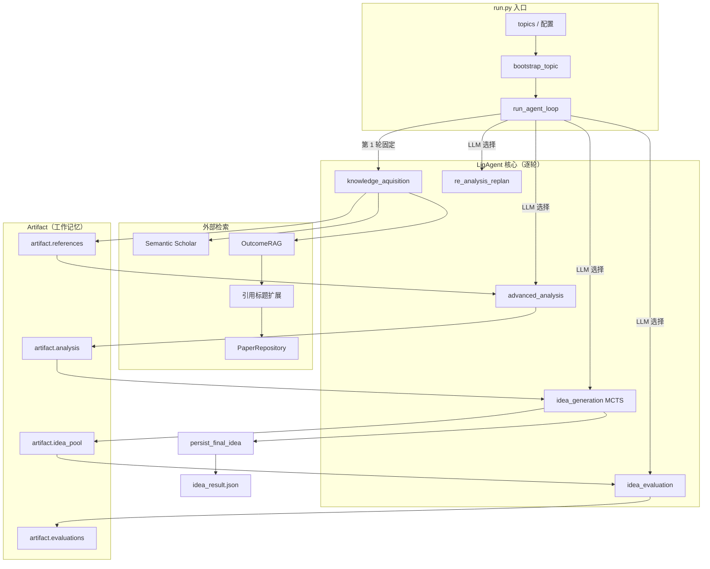

---

# LigAgent — Idea Agent 系统文档（中文版）

> 版本：2.0.0
> 日期：2026-02-21

---

## 目录

1. [架构总览](#1-架构总览)
2. [Agent 生命周期](#2-agent-生命周期)
3. [Artifact（工作记忆）](#3-artifact工作记忆)
4. [五阶段行为协议](#4-五阶段行为协议)
5. [Memory-Guided MCTS](#5-memory-guided-mcts-1)
6. [想法持久化（persist_final_idea）](#6-想法持久化persist_final_idea)
7. [长期记忆（LTM）](#7-长期记忆ltm)
8. [配置参数说明](#8-配置参数说明)
9. [输出产物](#9-输出产物)
10. [快速上手指南](#10-快速上手指南)

---

## 1. 架构总览

LigAgent 将研究想法生成建模为**"知识获取 → 分析 → MCTS 搜索 → 评估 → 持久化"**的闭环流程。核心驱动是 **Memory-Guided MCTS** 引擎，外部文献检索（Semantic Scholar）与 Survey Agent 的 OutcomeRAG 被统一作为"上下文燃料"注入。

当 `run.mature_idea` 配置不为空时，进入**合约模式（Contract mode）**：MCTS 根节点由成熟想法派生，所有扩展均受合约约束，机制不得漂移。



---

## 2. Agent 生命周期

### 2.1 入口 — `run.py`

1. 通过 `load_idea_agent_config()` 加载合并后的配置。
2. 将配置中的 API Key 写入环境变量（`OPENAI_API_KEY`、`S2_API_KEY` 等）。
3. 将 topics × parallelism 展开为 `(topic, replica_index)` 对。
4. 启动 `ProcessPoolExecutor`，为每个 topic 对调用 `_run_topic` worker。
5. 每个 worker 的输出独立写入 `<output_root>/<slug-timestamp-uuid>/`。

### 2.2 `_run_topic`（worker）

1. 创建 `<run_dir>/logs/` 目录。
2. 初始化文件日志 → `logs/ligagent.log`。
3. 实例化 `LigAgent(run_dir, rag_config, config)`。
4. 调用 `agent.bootstrap_topic(topic)` —— LLM 生成背景摘要，初始化 `artifact["topic"]` 和 `artifact["retrieval_keywords"]`。
5. 调用 `run_agent_loop(agent, max_turns, logger)`。

### 2.3 `run_agent_loop`

```
第 1 轮  →  action = "knowledge_aquisition"（固定）
第 N 轮  →  action = agent.select_action(artifact["steps"][-1])（LLM 决定）
```

每轮调用 `agent.perform_action(action)`，并将步骤摘要字符串追加到 `artifact["steps"]`。

---

## 3. Artifact（工作记忆）

`artifact` 是一个普通 Python dict，通过 `artifact_init()` 初始化，是整次运行的唯一状态载体。

```python
artifact = {
    "topic":               [],   # 活跃 topic 列表（bootstrap / replan 追加）
    "run_topic":           "",   # 启动器传入的原始 topic
    "survey":              "",   # （保留）survey 文本
    "background_knowledge":[],   # LLM 生成的背景摘要
    "analysis":            [],   # advanced_analysis 产出的结构化分析
    "references":          [],   # 经筛选的论文列表（列表嵌套）
    "rag_query":           [],   # 精炼后的 OutcomeRAG 查询
    "rag_hits":            [],   # {"query": ..., "hits": [...]} 每轮检索结果
    "rag_contents":        [],   # 从 survey 子章节抽取的文本
    "paper_contents":      {},   # paperId → 解析内容元数据
    "idea_pool":           [],   # 每次 idea_generation 产出的最优 MCTS 节点
    "evaluations":         [],   # 独立评估结果
    "retrieval_keywords":  [],   # 传给 Semantic Scholar 的检索词
    "dialogue":            {},   # （保留）对话历史
    "steps":               [],   # 每轮行为的摘要字符串
    "artifact_structure":  {},   # （保留）结构元数据
}
```

---

## 4. 五阶段行为协议

### 4.1 `knowledge_aquisition`（知识获取）

**每次运行的第一个动作，固定执行。**

#### 标准路径（无 mature_idea）

1. **Semantic Scholar 种子检索** — 用 `retrieval_keywords[-1]` 检索最多 N 篇论文。
2. **关键点生成** — `PaperRepository.prepare_papers()` 解析种子论文；`IdeaPaperAnalyzer.ensure_keynotes()` 提取关键点。
3. **RAG 查询生成** — LLM 根据关键点综合生成精炼查询（`generate_rag_query`）。
4. **OutcomeRAG 检索** — `OutcomeRAG.retrieve(rag_query, top_k=5)` 读取 Survey Agent 输出，返回相关子章节。
5. **引用扩展** — `collect_rag_citations` 从子章节抽取引用标题；`search_papers_from_citations` 通过 `PaperRepository.search_papers_by_title()` 反查 paperId。
6. **内容丰富** — `safely_enrich_papers_with_content` 获取种子 + 引用论文全文（有可配置超时）。
7. **筛选压缩** — `filter_and_compress_papers` 按相关性打分，保留 top-k。
8. **写入** — `artifact["references"]`、`artifact["rag_query"]`、`artifact["rag_hits"]`、`artifact["rag_contents"]`、`artifact["paper_contents"]`。

#### 合约路径（mature_idea 不为空）

跳过 Semantic Scholar 种子检索，直接由 `mature_idea` 生成 RAG 查询，仅执行 OutcomeRAG + 引用扩展。

---

### 4.2 `advanced_analysis`（深度分析）

- **输入** — `artifact["references"][-1]`
- **流程** — LLM 分析已筛选论文，提取关键方法、痛点与未来方向。
- **写入** — `artifact["analysis"]`、`artifact["background_knowledge"]`。

---

### 4.3 `idea_generation`（想法生成）

运行 **Memory-Guided MCTS**（详见 §5）。

- **输入** — `artifact["analysis"]`、`artifact["idea_pool"]`、`artifact["paper_contents"]`、`artifact["background_knowledge"]`、可选 `run.mature_idea`。
- **写入** — `artifact["idea_pool"]`（最优 MCTS 节点）、`artifact["evaluations"]`。
- **副作用** — 触发 `persist_final_idea`（详见 §6），写出 `idea_result.json`。

---

### 4.4 `idea_evaluation`（独立评估）

对 `artifact["idea_pool"][-1]` 进行 LLM 评分，更新 `idea_pool[-1]["evaluation"]`。

---

### 4.5 `re_analysis_replan`（重新规划）

当前搜索方向已耗尽时触发。

- **输入** — 当前 `idea_pool[-1]`、`topic`、`retrieval_keywords`。
- **写入** — 向 `artifact["topic"]` 和 `artifact["retrieval_keywords"]` 追加新条目，下一轮 `knowledge_aquisition` 将从新角度出发。

---

## 5. Memory-Guided MCTS

### 5.1 核心数据结构

```python
@dataclass
class IdeaState:
    title: str
    abstract: str
    core_contribution: str
    method: str
    experiments: str
    risks: str
    tags: List[str]
    operator: str          # 产生本节点的编辑算子
    target_defects: List[str]
    rationale: str
    components: List[str]  # 结构化机制组件（1–5 个）
    edit_plan: Optional[Dict]
    skill_metrics: Dict
    # signature 哈希值由 __post_init__ 自动计算

class IdeaNode:
    state: IdeaState
    visits: int
    value_sum: float
    evaluation: Optional[IdeaEvaluation]

    def uct_value(self, parent_visits, c):
        return (value_sum / visits) + c * sqrt(log(parent_visits) / visits)
```

### 5.2 评估信号

```python
@dataclass
class IdeaEvaluation:
    novelty:      float  # 权重 0.30
    impact:       float  # 权重 0.25
    feasibility:  float  # 权重 0.20
    clarity:      float  # 权重 0.15
    conciseness:  float  # 权重 0.10
    risk:         float  # 惩罚项 -0.20
    confidence:   float  # 控制 LTM 写回门控

    @property
    def composite(self):
        return (0.30*novelty + 0.25*impact + 0.20*feasibility
                + 0.15*clarity + 0.10*conciseness - 0.20*risk)
```

### 5.3 搜索主循环

```
root ← build_root_state(analysis, idea_pool, context, [mature_idea])
for iter in range(max_iterations):
    node  = select(root)          # UCT 树遍历
    child = expand(node)          # LLM 通过编辑算子提议新状态
    score = simulate(child)       # LLM 评估；签名相同则复用缓存
    backpropagate(child, score)
    maybe_record_experience(child, min_confidence_for_memory)
best = best_candidate(root)       # 取综合得分最高节点
```

### 5.4 关键机制

| 机制 | 说明 |
|------|------|
| **编辑算子** | `REFINE`、`PIVOT`、`COMPOSE`、`SIMPLIFY`、`SCOPE`、`EXTEND` — LLM 在每次扩展时选择最合适的算子 |
| **组件编辑** | 每个想法分解为 1–5 个机制 `components`；`apply_edit_plan_to_components` 执行原子编辑 |
| **评估缓存** | 相同 `IdeaState.signature` → 复用已有 `IdeaEvaluation`，避免重复 LLM 调用 |
| **帕累托候选** | `pareto_candidates` 在最终选择前按综合得分筛出 top-k |
| **合约模式** | 根节点由 `mature_idea` 派生；扩展限制为指定机制内的增量改动 |
| **反模式防护** | `ANTI_PATTERN_CONSTRAINTS` 通过 `format_defect_registry` 屏蔽已知失败模式 |
| **LTM 写回** | 仅当 `evaluation.confidence > min_confidence_for_memory`（默认 0.6）时写入 |

---

## 6. 想法持久化（`persist_final_idea`）

在 `idea_generation` 结束、最佳 MCTS 节点确定后自动触发。

```
best_entry
    ├─ build_algorithm_spec(...)            → 结构化算法/方法描述
    ├─ synthesize_reference_summaries(...)  → 带摘要的精选参考文献列表
    ├─ suggest_datasets(...)                → 推荐数据集（含匹配度评分）
    ├─ suggest_baselines(...)               → 推荐基线方法（含匹配度评分）
    └─ generate_idea_introduction(...)      → LaTeX 格式的引言段落

payload → artifact["idea_result"] → idea_result.json
```

### 输出 Schema（`idea_result.json`）

```json
{
  "title": "...",
  "abstract": "...",
  "introduction": "...",
  "algorithm": ["第 1 步 ...", "第 2 步 ..."],
  "reference_papers": [{"title": "...", "summary": "..."}],
  "datasets": [{"name": "...", "usage": "...", "scores": {"match": 4}}],
  "baselines": [{"name": "...", "scores": {"match": 40}}],
  "mcts_evolution": {
    "best_path": "...",
    "iterations": [{"iteration": 0, "title": "...", "score": 1.2}]
  },
  "idea_contract": "..."
}
```

> `idea_contract` 字段仅在合约模式运行结果中存在。

---

## 7. 长期记忆（LTM）

LTM 由 `FAISSMemorySystem` + `SymbolicMemorySystem`（`memory` 包）驱动。

| 存储 | 用途 |
|------|------|
| **语义存储（Semantic）** | 领域知识与历史成功想法 |
| **情节存储（Episodic）** | 反模式与缺陷记录 |
| **程序存储（Procedural）** | 已知缺陷的修复方案 |

写回条件：`evaluation.confidence > mcts.min_confidence_for_memory`（默认 0.6）。

`MemoryBundle` 在 MCTS 扩展提示中注入"修正先验"，使搜索偏离已知失败模式。

---

## 8. 配置参数说明

### 8.1 `config/run/default.yaml` — 运行时参数

```yaml
run:
  topics:
    - "Diffusion Models for Reinforcement Learning in Games"
  max_turns: 4          # 每个 topic 最多运行轮次
  parallelism: 1        # 并发 worker 数（1 = 串行）
  output_root: "runs"   # 相对于 idea_agent 根目录
  console_logs: true    # 是否同时输出到 stdout
  rag_config: "src/agents/survey_agent/config/outcomeRAG.yaml"

  # 可选 — 开启合约模式
  mature_idea: "..."

  # API 凭据（也可通过环境变量覆盖）
  openai_api_key: "..."
  openai_base_url: "..."
  s2_api_key: "..."
  s2_api_timeout: "60"
  serper_api_key: "..."
  serper_api_endpoint: "..."
  mineru_model_source: "modelscope"
```

### 8.2 `config/mcts/default.yaml` — MCTS 搜索参数

```yaml
mcts:
  max_iterations: 128           # 最大 MCTS 迭代次数
  max_depth: 3                  # 树的最大深度
  branching_factor: 3           # 每次扩展的子节点数
  exploration_constant: 1.15    # UCT 探索系数
  generation_model: "gpt-5-mini"
  evaluation_model: "gpt-5.2"
  generation_temperature: 0.7
  evaluation_temperature: 0.001
  generation_max_tokens: 8192
  evaluation_max_tokens: 8192
  min_confidence_for_memory: 0.6   # LTM 写回置信度门控
  pareto_top_k: 5
  # 综合得分权重
  novelty_weight: 0.30
  impact_weight: 0.25
  feasibility_weight: 0.20
  clarity_weight: 0.15
  conciseness_weight: 0.10
  risk_weight: 0.20
```

### 8.3 `config/dataset/default.yaml` & `config/baseline/default.yaml`

控制 `persist_final_idea` 中数据集与基线推荐的检索和打分行为。

### 8.4 `config/agent/` — Agent 级参数

控制 `model`、`chat_max_retries`、`chat_retry_backoff`、`semantic_search_limit`、`idea_context_limit`、`paper_enrichment_timeout_sec`、`action_selection_attempts`。

---

## 9. 输出产物

每个 topic 运行产生一个独立目录：

```
runs/
└── <topic-slug>-<YYYYMMDD-HHmmss-μs>-<uuid8>/
    ├── idea_result.json   # 最终想法 + MCTS 搜索轨迹
    └── logs/
        └── ligagent.log   # 完整运行日志
```

> 当 `parallelism > 1` 且只有一个 topic 时，run_id 还会附加 `-rNN` 副本后缀（如 `-r01`、`-r02`）。

---

## 10. 快速上手指南

### 第一步 — 配置 API Key

编辑 `src/agents/idea_agent/config/run/default.yaml`：

```yaml
run:
  openai_api_key: "sk-..."
  openai_base_url: "https://api.example.com/v1"
  s2_api_key: "..."
  serper_api_key: "..."
```

### 第二步 — 设置研究话题

```yaml
run:
  topics:
    - "Graph Reasoning for LLMs"
```

### 第三步 — （可选）指定 RAG Survey 输出

```yaml
run:
  rag_config: "src/agents/survey_agent/config/outcomeRAG.yaml"
  # 确保该文件中的 save_path / save_json_path 指向真实存在的 survey 输出
```

### 第四步 — 运行

```bash
# 在项目根目录执行
./run_idea.sh
# 或
python src/agents/idea_agent/run.py
```

### 运行流程详解

1. **Bootstrap** — LLM 生成背景摘要，初始化检索词。
2. **`knowledge_aquisition`** — Semantic Scholar 种子 → RAG 查询 → OutcomeRAG → 引用扩展 → 丰富内容 → 筛选 → `artifact["references"]` 就绪。
3. **`advanced_analysis`** — LLM 识别关键方法、痛点、开放问题 → `artifact["analysis"]`。
4. **`idea_generation`** — Memory-Guided MCTS 运行；最优节点写入 `artifact["idea_pool"]`。
5. **`persist_final_idea`** — 综合算法描述、参考文献、数据集、基线和引言 → 写出 `idea_result.json`。
6. **后续轮次** — LLM 选择 `idea_evaluation`（精化）或 `re_analysis_replan`（转换方向），直至 `max_turns` 耗尽。
