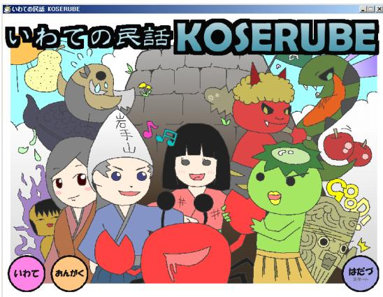
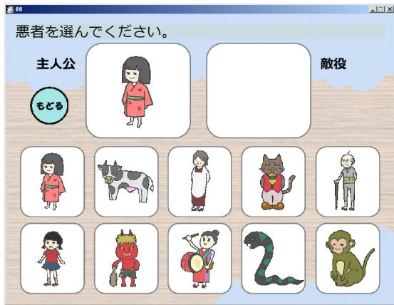
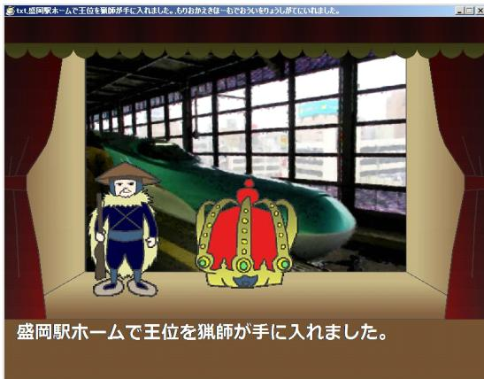
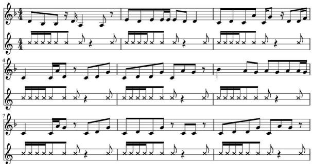
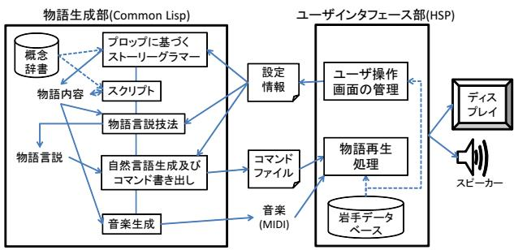
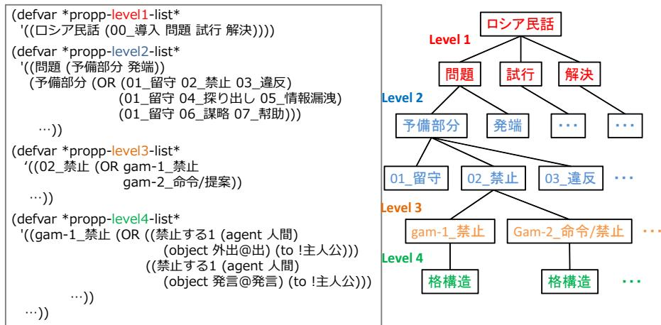

# 民話風物語生成・表現システムKOSERUBE第一版 $\textcircled{7}$ 開発

# Development of a Generation/Expression System of Narratives in the Style of a Folk Tale, KOSERUBE Version 1

秋元 泰介 岩手県立大学大学院ソフトウェア情報学研究科  
Taisuke Akimoto Graduate School of Software and Information Science, Iwate Prefectural Universityg236i001@s.iwate-pu.ac.jp  
今渕 祥平 （同 上）  
Shohei Imabuchi g231k005@s.iwate-pu.ac.jp  
遠藤 順 （同 上）  
Jun Endo g231k007@s.iwate-pu.ac.jp  
小野 淳平 （同 上）  
Jumpei Ono g231i006@s.iwate-pu.ac.jp  
栗澤 康成 （同 上）  
Yasunari Kurisawa g231k013@s.iwate-pu.ac.jp  
鎌田 まみ 株式会社電子工学センター  
Mami Kamada Electronic Engineering Centerg031gmiri@yahoo.co.jp  
小方 孝 岩手県立大学ソフトウェア情報学部  
Takashi Ogata Faculty of Software and Information Science, Iwate Prefectural Universityt-ogata@iwate-pu.ac.jp

keywords: integrated narrative generation system, KOSERUBE, Propp-based story grammar, music generation

# Summary

KOSERUBE (version 1) is a system that automatically generates stories and discourses in the style of a folk tale with its characters, places and objects relating to Iwate Prefecture. The system also expresses sentences and music, and automatically edits visual objects relating to the generated narratives. The user can operate and appreciate the process through a visual interface. In the context of our narrative generation system research, KOSERUBE mainly uses Propp-based story grammar as the major automatic generation mechanism. In this paper, first, we give a system overview covering the user interface and the narrative generation mechanism depending on Propp-based story grammar. Next, we present the results of a questionnaire survey and a demonstration at an exhibition to identify relevant issues and discuss the expansion of the system to the second version. One of the important issues identified is the processing of the narratives for consistency and naturalness. In the questionnaire survey results, both positive and negative opinions about jumps or gaps in a narrative appeared. For the development of version 2, our aim is to implement both mechanisms for managing narrative consistency and those for deviating from it. We also discuss other topics regarding the next version. Overall, we propose a new type of multimedia content system with an automatic narrative generation system.

# 1. ま え が き

「いわての民話KOSERUBE（第一版）」（以下，KOSE-RUBE）とは，岩手県に因んだ登場人物や場所や物が登場する民話風物語を自動生成し，上演するシステムの初版である．インタフェース画面を通じてユーザが物語のパターンや登場人物等を選択すると，システムは，それをもとに物語の概念表現，文表現及び音楽を自動生成し，それらを静止画や動画と共に自動編集した紙芝居風の物語表現を表示する．なお KOSERUBE（こせるべ）とは岩手方言で「（物語を）拵えよう・作ろう」を意味する

筆者らは，人工知能と物語論・文学理論を融合した学際的アプローチによる「物語生成システム」の研究を行って来たが，現在は物語の構造的諸要素の操作やその制御の役割を担う多数の独立的モジュールの有機的統合∗1による統合物語生成システム [Akimoto 12b] の構築を目指して作業を進めている（ここで「統合」とは，物語内容・物語言説・物語表現に渡る物語生成フェーズの統合，それぞれに含まれる異なるタイプの生成技法の統合，言語・映像・音楽等表現メディアの統合，そしてこれらをひとつのシステムに統合することを意味する．さらに，情報的方法と文学理論の知識の統合も意味する）．同時に，その機構を利用した応用システムの開発も進めて来た [小方 10]．KOSERUBE は新たに構想を開始した，子供が楽しめるような娯楽的コンテンツとしての応用システムである．ユーザ自身が対話的に選択した登場人物や語り手等の要素を使用して，システムが毎回異なる物語を生成し，ユーザが生成された物語を紙芝居を見る感覚で楽しめるようにすることを主な狙いとする．統合物語生成システムは，様々な物語生成の技法の統合により多様な物語の構造とテクストを柔軟に生成出来ることをコンセプトとするが，KOSERUBE はその現在の技術水準を利用してユーザにとって比較的理解し易い物語が生成される娯楽的な機構を狙う．そのためには，物語の全体構造（ストーリーライン）がしっかりとしていることが重要であると考える．そこで，統合物語生成システム中に用意された，プロップの文学理論 [Propp 69]（以下，プロップ理論）を利用した方法を主に用いる．プロップ理論とは，ロシア魔法昔話というジャンルの民話を 100 編程分析し，それらに共通する構造や特性を整理したものである．それを形式化・ストーリーグラマー化したこの方法（以下，原則として「プロップに基づくストーリーグラマー」と呼ぶ）は，大局的ストーリーラインを生成するのに向いている．統合物語生成システムは未完成のもので，その応用としてKOSERUBEも様々な点で不完全なものであるが，本稿では概念表現・文・音楽・映像の自動化システムとして曲がりなりにも稼動するシステムのプロトタイプを示すことで，今後の発展に向けた議論や課題整理を行う．

物語生成システム研究において，応用研究はその有効性を示すのと同時に，評価のための調査をし易くし，問題点や課題を明確化することにも貢献する．また，開発を通じて表現的・内容的な改善案や理論先行ではない実験的なアイディアを試すことも出来る．物語生成には言語的概念の高度な使用や文学的な良さ・面白さの定義等，困難な問題が多数含まれるため，理論主導の統合物語生成システムの開発と応用主導のシステム開発の双方から並行してアプローチすることには大きな効用がある

以下，関連研究（2 節），統合物語生成システムの概要（3 節），KOSERUBE 第一版の紹介（ $4 { \sim } 5$ 節），第一版の評価実験（6 節），評価結果に基づく第二版の構想（7節），全体のまとめ（8 節）という順で述べて行く

# 2. 関 連 研 究

AI や情報技術を利用した物語関連の研究の中で，物語の生成や表現に関連するものとして，物語生成システムとinteractive storytelling（あるいは digital storytelling）のふたつが主に挙げられる．前者が物語を自動生成するシステムの開発を主な目標とするのに対して，後者はユーザが物語世界に入り込み，それをインタラクティブに体験するタイプの物語を作り出すシステムである．KOSERUBEは前者に位置付けられる．初期設定のインタフェース上ではユーザがインタラクティブに情報を選択することが出来るが，それ以降の生成・上演は自動で行われる

まず，物語生成システムの関連研究について述べる（この分野の全般的調査は [小方 11] を参照）．これまで，[Meehan 80] による階層型プランニングの応用をはじめ，ストーリースキーマ（ストーリーグラマーと呼ばれることもある），事例ベース推論，自然言語生成，オントロジー等の人工知能技術と関連した数々のシステムが提案されて来た．この種の手法的な広がりに加え，複数の手法を複合的に用いたシステムも開発されて来た（[Turner94, Bringsjord 00] 等）．これらに対する KOSERUBE の特徴を幾つかの観点から述べる．まず，物語生成システム研究における代表的な方法として利用されて来た階層型プランニングと認知科学におけるストーリースキーマの方法・考え方を紹介し，それらと本研究で用いるプロップに基づくストーリーグラマーとの違いを述べる．階層型プランニングは，規定された世界モデルにおいてある初期状態から目標状態に至るための行動計画を，幾つかの下位目標に分割・単純化して行くことによって導く方法である．物語生成システムにおいては，これによって得られる登場人物達の行動列がストーリーと見なされる[Meehan 80] をはじめ多くのシステムがこの方法をベースとしている．この方法を使うと問題解決型の物語の構造が形成されるが，それは登場人物の行動連鎖としては合理的でも，物語の全体構造として考えると微視的なものに留まりがちである．一方のストーリースキーマは，認知科学において，人間が物語を理解する際のスキーマとして提案された理論である（[Rumelhart 75] 等）．ストーリースキーマは，物語文章を「設定」「エピソード「事象」等のカテゴリに基づき階層的に分割した統語構造を表す「統語規則」と，「動機」「因果」等の意味関係に基づく意味構造を表す「意味規則」から成る．これによって比較的巨視的な物語の全体構造を扱うことも出来るが，ストーリースキーマの研究で重視されているのは，物語を理解する人間の認知的機構の解明であり，「目標－計画」のようなプランニング型知識や「状態－反応」のような微視的な人間行動の規則のような物語全体にとっては局所的な知識が物語の理解に果す役割の方に研究の重点が置かれている

プロップに基づくストーリーグラマーの詳細は5.2節で述べるが，これは実際の民話における事象展開のパターンを階層的な規則集合として定義したものであり，上述のふたつと比較して，より直接的にス $\vdash - \lor - \emptyset$ 巨視的構造を定義するのに有効なものである．それによって生成されるのは大局的な粗筋レベルのストーリー構造であり，[小方 92]がプロップ理論に基づいて定義したストーリーグラマー（本稿のものとは多少異なる）で生成された構造における下位事象をプランニングやスクリプトによる方法で展開・詳細化する案を示しているように，両者は寧ろ相補的なもので，プロップに基づくストーリーグラマーがストーリー全体の巨視的構造を与えるのに対して，プランニングによる方法はその微視的構造を展開するものと位置付けられている．ストーリースキーマもそのような位置付けにおいて捉えられる

もうひとつの違いは，階層型プランニングやストーリースキーマが具体的な知識内容ではなく，事象や行動の抽象的な展開規則を与えるのに対して，プロップに基づくストーリーグラマーが具体的なス $\vdash - \lor - \emptyset$ 知識内容を定義している点である．すなわち，階層型プランニングやストーリースキー $\curvearrowleft$ 場合，規定された規則の形式に沿って如何なる具体的知識内容を使用するかによって多様なストーリーが生成されるが，プロップに基づくストーリーグラマーの場合は，「加害」をはじめとする「機能」の下位に予め具体的知識内容が定義される．上述のストーリースキーマと関連付けて言えば，おおよそ，「エピソード」の内容になり得る具体的なストーリーの大局的構造が定義されているということになる．この意味では，前者の方がより普遍的な方法ということになるが，ストーリーの全体構造を作るためには，民俗学や文学の領域で得られた内容的知識が必要・有効であり，「物語の全体構造がしっかりとしていること」というKOSERUBE の目的に後者はより合致すると言える．ここから両者の方法の融合といった将来の研究課題も開けるだろう

プロップ理論を応用した物語生成システムの研究として，[Peinado05]はプロップの基幹概念である「機能」と登場人物の役割をオントロジーとして利用してロシア民話風プロットを生成する KIIDS というシステムを開発した．これに対して本研究は，上記と同じく「機能」を利用するが，プロップ理論におけるその他の概念（「副機能」，「機能間の対」等）も導入している．それに加えて物語言説の機構が結合されていること，概念表現や文だけでなく映像・音楽のマルチメディア表現も自動生成すること，さらに視覚的なユーザインタフェースの面でも工夫を凝らしていること等の特徴を持つ

また，物語生成は，自然言語生成において，文章で表現される内容を構成する処理であるコンテントプランニングと捉えることも出来る．しかし，統合物語生成システムは，必ずしも散文の文章のプランニングに限定されたものではなく，表層表現として音楽や映像も想定している．このことは，表層表現レベルとは区別される物語の概念構造のレベルに関して，コンテントプランニングとは異なる考え方に基づいて研究を進めているということを意味する．具体的には，物語の内容構造のレベルを物語内容（ $( 7 1 - 1 ) -$ ）と物語言説に明確に二分割し，それぞれを構成する物語独自の技法をコンテントプランニングと比較して詳細・体系的に準備することを試みている．例えば，物語言説の技法として，Genetteの物語言説論 [Genette 72] を援用し，その形式化を図っており，「如何に語るか」における概念的レベルにこのように詳細に系統立てて接近する試みは，明らかに通常のコンテントプランニングとは異なる特徴である．さらに，文章生成が主に対象とする論説的な文章のための談話関係も物語内容のための技法の一部に位置付けている．このような理由で，本研究は通常の文章生成研究とは大きく差別化される特徴を有すると言える

一方，interactive storytelling の研究領域では，[Mateas03] による Fac¸ade や，[Crawford 13] による Erasmatron及び Storytron，[Montfort 07] による interactive fictionシステムなど，様々なシステムがこれまで開発されて来た．[Crawford 13] は，interactive storytelling におけるストーリーエンジンのタイプを Event-based，Clock-based，Plot-based の 3 種類に大別している．Event-based エンジンは，主にユーザが選択した事象を契機にストーリーが展開するタイプの方法，Clock-basedエンジンは，システム内部の時間進行による状態変化を踏まえてユーザとシステム側とのインタラクションを管理する方法である．TALE-SPIN[Meehan 80] 等の物語生成システムは Plot-based エンジンと呼ばれている．Crawford は，Plot-based タイプ$\phi$ 方法は基本的に non-interactive であるため interactivestorytellingにとってあまり重要ではないこと，それが実際に interactive storytelling に導入された事例がないことを述べている．筆者らも，物語生成システムとinteractivestorytellingは基本的な発想から異なる研究領域として捉えている

# 3. 統合物語生成システムの概要

統合物語生成システムの概要を述べる（より詳細な説明は [Akimoto 12b] を参照）．まず物語の生成過程を物語内容，物語言説，物語表現の3 段階に分ける．物語内容は「何を語るか」の側面を表す概念構造であり，事象概念が一種の談話的関係により結合された木構造と，事象の背後にある状態の列からなる．事象概念は，動詞概念とその深層格からなるフレーム構造により表現する深層格は，agent（主体），counter-agent（客体），object（対象物），instrument（道具），location（場所），from（始発地点），to（終着地点），time（時間）の8種類である．time には事象背後の状態を参照する記号が，それ以外の深層格には人・物・場所を表すインスタンスが格納される．インスタンスは，後述する名詞概念辞書に含まれる概念から生成される．状態は，各インスタンスの属性情報を管理する知識体系に相当する．属性は，スロット名と値の対の集合として表される．次の物語言説は，「如何に語るか」の側面を表し，物語内容を実際のテクストの表現のための概念構造に変換したものであり，物語内容と同様木構造で表す．最後の物語表現は自然言語，映像，音楽による表層的表現である．物語生成は，以上の概念構造及び表層表現を操作する技法の集合によって行われる．

一方，機能的な観点からは，システムは知識ベース（概念辞書や物語知識ベース），物語技法，制御機構の 3 つの部分に分けられる

筆者らが独自に開発を進めている概念辞書[Oishi 12]は，物語を構成する素材となる概念情報を提供する．動詞概念辞書，名詞概念辞書，修飾（形容詞・形容動詞）概念辞書の3 つがあり，各々は，上位下位関係による階層構造を持ち，現状で，名詞概念約 120000 個，動詞概念約12000個，修飾概念約2000個が格納されている．個々の終端動詞概念は，文型パターン，必須の深層格及び各々の格の値の制約条件を定義する．制約条件は，その格が取り得る値の範囲を，名詞概念辞書の中間概念により指定する．文型パターンは，その動詞文の基本形を定義し，主に文生成に用いられる

次の物語技法は，上述の物語内容，物語言説，物語表現の各段階の構造を生成・操作するための手続きもしくは規則形式の技法である．物語内容と物語言説は木構造で表現される概念構造に対する構造生成・構造変換という共通枠組みの中で多数の技法が統合される．物語内容の技法が事象進行を作ることであるのに対して，物語言説の技法は物語内容を様々な語 $\flat \oslash$ 構造に変換する．例えば，後から起こった事柄を先に語ることによって，「それはナゼ？」といった受け手の疑問を呼び起こすことが出来る．物語言説の主な目標は上述の構造変換によるこ$\oslash$ 種の修辞的効果の実現である．構造化の方式は統一されているため，新たな知識や技法を適宜追加・拡張して行くことが可能である．物語技法は実際の処理において，物語の断片等コンテンツの知識を格納した物語知識ベースを利用する．後述するプロップに基づくストーリーグラマーもその一種である

  
図 1 タイトル画面

最後の制御機構は，物語技法の実際の使用方法を決定し，また生成処理全体を制御・管理する機構である．処理決定は主に，目標とする物語の構造や内容を指示する生成パラメータ集合に基づき行われる

統合物語生成システムの開発状況であるが，主要な部分は Common Lisp で開発され，物語内容から物語表現に至る一連の生成処理が自動化されている．処理機構は，独自に定義した関数約 550個からなり，これと上述の各種知識ベースが結合されている

# 4. KOSERUBE（第一版）の概要

ユーザインタフェースとシステム構成の各観点からKOSERUBE の概要を説明する

# 4 1 ユーザインタフェース

システムを起動すると，キャラクター達がポーズをとって並んだ画像を背景とするタイトル画面が表示される（図1）．これ以降ユーザはマウスを使って操作する．タイトル画面の「はだづ」（岩手方言で「始める」）ボタンをクリックすると，システムの簡単な解説画面を経て，次の 3種類の情報をそれぞれの選択画面で順に選択する $\textcircled{1}$ 主人公と敵役（図 2）：後述の 34 種類のキ $\Rsh$ ラクターから無作為に選出された 10 種類の中から各ひとつ． $\textcircled{2}$ 物語の長さまたは型：「短い」「中位」「長い」「鶴女房風の何れかひとつ． $\textcircled{3}$ 語り手：「座敷わらし」「おばあさん「宮沢賢治」「猿」「南部鉄器」の何れかひとつ．その他のインタフェース画面として，岩手県内各地の写真付き紹介や，タイトル画面及び上の各選択画面で流れるBGMの切り替えを行う画面も用意されている

その後，システムによって物語・文・音楽が一括生成され，舞台風の画像と共に紙芝居風に上演される（図 3）

  
図 2 主要登場人物（二人）選択画面

  
図 3 物語上演画面

基本的には，物語を構成する事象が，ひとつずつ順番に文（字幕と朗読）・画像（キャラクター，物，背景）・音楽により表現される．これらに加えて，回想や予言により過去や未来に時間が移る時歌舞伎の舞台風に一旦垂れ幕を下ろす，主な登場人物が現れる際紹介的な描写や説明の文を吹き出しとして挿入する等の演出を加えた

図 4 に物語文の生成例をまとめた形で示す∗2．主人公は「猟師」，敵役は「大蛇」，物語の長さは「長い」，語り手は「おばあさん」である．猟師が大蛇との戦いを経て王位を得る物語内容が回想の物語言説によって語られる文表現には岩手の方言が所々に使われている．図 5 はこれに合せて自動生成された音楽を楽譜に直したものである．本システムでは，これらの出力結果は常に異なる

# 4 2 KOSERUBE のシステム構成と処理手順

図 6 は KOSERUBE のシステム構成と処理手順を示す．システムは，主に物語生成部とユーザインタフェース部に分かれ，それぞれ Common Lisp，HSP（Hot SoupProcessor．スクリプト型のプログラミングツール）で開発されている．両者は入出力ファイルを通じて相互に結合される．

  
図 5 生成された音楽の楽譜化（物語終盤の「解決」部分）

  
図 6 KOSERUBE のシステム構成

物語に登場するキャラクター（34 種類），物（21 種類），場所（85種類）それぞれの名称（例「宮沢賢治」），説明文（例「岩手県を代表する童話作家です」），描写に使用する外見情報（キャラクターのみ），画像の各情報が「岩手データベース」に格納される．他に，物語に登場する可能性のある「馬」等23種類の要素の画像も用意した．なお主要なキャラクターや，場所やその他の要素の一部は，筆者らが独自に考案・描画した

さらに，これら各要素を次の方法で名詞概念辞書と結び付けた．まず，「人間」「具体物」「場所」という中間概念それぞれの下に，「人間[岩手]」「具体物[岩手]」「場所[岩手]」という独自の中間概念を追加した．そして，各々のキャラクター，物，場所に対応する終端概念を独自に作成し，それらを「人間[岩手]」「具体物[岩手]」「場所[岩手]」の各中間概念の下に追加した

物語生成部は，3 節で述べた統合物語生成システムの全体を組み込んでいるが，民話風の物語を生成するために，使用する機構や処理順序を限定する等の変更を加えている．以下は，その処理手順である $\textcircled{1}$ プロップに基づくストーリーグラマーの方法により，事象を含む物語内容の木構造を生成する． $\textcircled{2}$ その中の特定の事象を対象としてスクリプト（抽象的な事象をより具体的な事象列に変換する技法）を用いた詳細化を行う．以上が物語[物語の冒頭で終結部分が語られ，猟師（主人公）がそれに至る物語内容全体の回想を始める]盛岡駅ホームで王位を猟師が手に入れました。これから猟師による回想が始まります。

[物語序盤「問題」部分．大蛇（敵対者）に命令された猿が姫神さん（被害者）を海に落とす．それを知った猟師が冒険へ旅立つ．]お墓で病で親がめおどす（死ぬ）。猟師が悲しみました。この猟師は逞しい。御所野縄文公園で大蛇が山の女神の姫神さんを捜しました。この大蛇はでっけぇ（でかい）。御所野縄文公園で大蛇が姫神さんを大蛇さ（に）おしぇる（教える）。北山崎で大蛇は猿に対して山の女神を海さ（に）落とすことを命令しました。命令を猿が実行しました。十六羅漢で猟師が被害をおべる（知る）。冒険を猟師が思い立ちました。冒険へ猟師が旅立ちました。猟師が釜石さ（に）向かいました。

[物語中盤「試行」部分．山梨（呪具）が猟師を大蛇の居場所に案内し，そこで猟師が大蛇に勝利する．]  
釜石で巨人が南部鉄器を取り合いました。巨人は猟師がわっぷする（分配する）ことを猟師さ（に）頼みました。猟師がわっぷする（分配する）。巨人を猟師が仲直りさせました。猟師が山梨を見つけました。猟師が山梨を入手しました。猟師を敵地さ（に）山梨がおづげぇする（案内する）。この山梨はんめぇ（おいしい）。猟師が敵地さ（に）向かいました。早池峰ダムから大迫 2 へ山梨が移動しました。早池峰ダムから大迫 2 さ（に）猟師が移動しました。大迫 2 で猟師が大蛇を罵って、大蛇が猟師を罵りました。猟師が大蛇を怒って、猟師さ（に）大蛇がうろたえて、大蛇が葉っぱを吹き飛ばして、大蛇を猟師が吹き飛ばしました。大蛇が暴れました。猟師が傷を負いました。猟師が大蛇より腕試で優位に立って、猟師が勝利を誇りました。大蛇が悔しささ（に）泣きました。大蛇が猟師より逃げました。[物語終盤「解決」部分．姫神さんが水を飲んで生き返る．大蛇や羅刹鬼（ニセ主人公）が悪さを行なうが宮沢賢治（派遣者）が処罰する．最後に猟師が冒頭で語られたように王位を得る．]  
水を姫神さんが浴びて、この姫神さんは美しい。大迫 2 で姫神さんが水を飲みました。目を姫神さんが開けて、姫神さんが目覚めました。大迫 2 より猟師が脱出しました。大蛇が猟師をぼう（追う）。馬さ（に）猟師が変身しました。大蛇から猟師が逃げました。十六羅漢へ猟師が着きました。赤鬼の羅刹鬼が南部鉄器を童話作家の宮沢賢治さ（に）求めました。この羅刹鬼は好戦的だ。十六羅漢で猟師さ（に）傷がありました。宮沢賢治が猟師の傷を見ました。十六羅漢で傷によって猟師が知られました。姫神さんが真実をしゃべる（語る）。羅刹鬼の嘘偽りがばれました。盛岡駅ホームで宮殿を盛岡駅ホームへ猟師が建てました。猟師が宮殿さ（に）住みました。十六羅漢で大蛇が宮沢賢治さ（に）謝罪しました。大蛇を収容所さ（に）宮沢賢治が閉じ込めました。盛岡駅ホームで王位を猟師が手に入れました。

内容生成に相当する． $\textcircled { 3 } \textcircled { \div } \textcircled { \oslash }$ 物語内容の木構造に対して，物語言説技法による構造変換を行う． $\textcircled {4 } \textcircled { \div } \textcircled { \oslash }$ 物語言説から，後述するコマンドファイルを書き出す． $\textcircled{5}$ 処理 $\textcircled{2} O D$ 結果 $\phi$ 物語内容から音楽を生成する

以上により生成されたコマンドファイルには，事象を基本単位として，画面上での画像や文の表示，音楽 $\supset { } _ { 7 }$ イルの切り替え等に関する各種命令（ $\exists \lnot \lor \lor \ltimes \nmid $ ）が順次的に記述され，物語再生処理機構はこれを先頭から実行して行くことで物語を上演する．事象の進行と同期して，生成された音楽（ $( \mathbf { M I D I } > \supset \mathcal { I } \mathcal { I } ) \mathcal { V } .$ ）が再生される．音楽ファイルは物語内容の大局的構造 $\oslash$ 部分毎（プロップに基づくストーリーグラマーにおける「問題」「試行」「解決」）に分けて生成され，事象進行に合せて再生ファイルが切り替わる．その他，幕や「それから四日たちました」のようなメタ的記述等の演出も同様にコマンドの中に記述される

個々の事象には，主に次のことを意味するコマンドがまとめて記述される．まず，事象概念から変換された文を画面下に，描写や説明が付与される場合は，その文を吹き出しにそれぞれ配置し，同時に音声読み上げソフトにより朗読する．これと同時に，事象中の深層格に対応する画像を配置する．各画像の描画位置は，agentは舞台下手，counter-agent は上手というようにほぼ固定している．location（場所）の画像は舞台の背景に表示され，前の事象から場所が変化した時に更新される．さらに，「飛び去る 1」という事象の場合に agent 画像を上方向に動かす等，21種類の動詞概念に対して簡単なアニメーションを付与するコマンドも用意した

# 5. KOSERUBE における物語生成機構

まず，統合物語生成システムに加えた変更や工夫について述べ，次にその中で中核的な役割を担うプロップに基づくストーリーグラマーについて述べる

# 5 1 統合物語生成システムからの変更点

統合物語生成システムに対して，物語生成全体の処理手順及び使用する機能を限定していること，名詞概念辞書に岩手データベースに対応する独自の概念を追加したこと，専用の映像表現機構を追加したことは，4.2 節で述べた通りである．その他の主な変更点を以下にまとめる

# $\ S \bf { 1 }$ 文生成

文生成の基本的方法は，動詞概念辞書の文型パターン（例えば「N1がN2を食べる。」）を雛形として，その名詞項（N1やN2）に深層格の値を挿入する基本形生成と，それに対して幾つかの要素（語尾，文字表記，語順，接続表現）の変形を行う機構からなる[熊谷 12]．KOSERUBEでは，これに加えて表現的な自然さや面白さのために，独自に作成した方言辞書を用いて文の要素（動詞や名詞）を岩手方言に変換する機能や，難しい動詞を簡単な表現に変換する機能等を追加した

# $\ S 2$ 音楽生成

統合物語生成システムにおける音楽生成機構は，物語$\oslash$ 概念構造と音楽構造との構造的対応付けに基づき，両者$\oslash$ 間を相互変換することを基本的な発想とする[Akimoto12c]．音楽は物語の概念構造に対応する木構造で表現する．これは，各終端部分を小節に相当する一定の持続を持つ単位とし，中間節点を下位の部分間の構造的な重要度を表す主従関係（「主‐従」「従‐主」の2種類）とするKOSERUBE は，物語内容から音楽を生成する機構を用いるが，その処理の流れは次の通りである $\textcircled{1}$ 物語における各関係を音楽における主従関係の何れか一方に対応付けた規則に基づき，物語内容から音楽構造の中間節点を決定する． $\textcircled{2}$ 音楽構造の中間節点の種類に基づき下位部分の和声を決定する規則によって，各終端部分の和声を決定する（音楽全体の和声進行が決まる）． $\textcircled{3}$ 物語の終端にある各事象を音楽の終端要素に変換する．ここで，ひとつの事象は，音楽における一組のモチーフに対応付けられ，モチーフの並びが音楽となる．各モチーフの音程は，処理 $\textcircled{2}$ で決定した和声に調和するように調節される．各々のモチーフは物語内容中の各人物・物・場所に対応付けられる．モチーフの提供方法には，処理 $\textcircled{3}$ において自動生成する方法と予め用意したものを使用する方法の2種類があるが，KOSERUBEでは後者を用い，岩手地方の8 曲の民謡（南部牛追い唄等）から曲の一部を手作業で書き出すことで，約 $4 0 \ \mathcal { O }$ モチーフを用意した．なお，前者の方法としては，乱数を用いて確率的に音符列を作る方法を実装している

さらに，物語の進行に合せて音楽に変化をつけるための次の工夫をしている．5.2節で述べるように，プロップに基づくストーリーグラマーは，「問題」「試行」「解決」$\mathcal { O } 3 \supset \mathcal { O } \mathcal { O }$ 大局的部分からなる物語内容を生成する．この部分毎に，メロディの楽器とテンポを変化させ，さらに異なるパターンの太鼓演奏を付与する．太鼓のパターンは，岩手民謡を題材に手作業で作成したものから選択される．

# $\ S \Im$ 語り手による物語言説及び文表現の変化

統合物語生成システムにおける制御の基本発想は，物語の語り手と聴き手をそれぞれ独立した機構としてシステム中に位置付け，両者の相互作用を通じて生成を継続的に進める[Akimoto 12a]というものである．語り手は，聴き手が持 $\supset$ 要求（どのような物語を求めているか）を物語の生成目標として設定し，それをもとに生成処理を駆動する．要求 $=$ 生成目標は「複雑性」や「隠蔽性」等のパラメータとその値として記述される．一方の聴き手は，徐々に飽きて物語に対する満足度の水準を下げて行く聴き手の満足度がある閾値を下回ると，語り手は敢えて聴き手の要求から離反した生成目標を設定し生成を行うすると，聴き手の満足度が上昇し，それと共に要求も生成目標に合せて変化する．以上のプロセスの反復を通じて，自動的に物語が生成されて行く．一方，KOSERUBEの第一版ではこの方式をそのまま使ってはいないが，語り手キャラクターという新しい要素を用意して語り手を単純化し，それぞれの語り手キャラクターが物語言説及び文生成において使用する技法・機構の種類や適用箇所を表1 のように決めた．今後第二版では，上述の聴き手を実際のユーザとし，その反応（生成された物語を採点する等）を通じて語り手キャラクターの技法も変化するような仕組みを試みる予定である

表 1 各語り手が使用する物語言説技法と文生成方法  

<table><tr><td rowspan=1 colspan=1>B</td><td rowspan=1 colspan=1></td><td rowspan=1 colspan=1>$xfra}$</td></tr><tr><td rowspan=1 colspan=1>3L</td><td rowspan=1 colspan=1>E#</td><td rowspan=1 colspan=1></td></tr><tr><td rowspan=1 colspan=1>1h</td><td rowspan=1 colspan=1>ST:A.TKB.#3</td><td rowspan=1 colspan=1>3</td></tr><tr><td rowspan=1 colspan=1>AR</td><td rowspan=1 colspan=1>-.PT</td><td rowspan=1 colspan=1>3</td></tr><tr><td rowspan=1 colspan=1>$\fr{}$</td><td rowspan=1 colspan=1>6&gt;4.PAT</td><td rowspan=1 colspan=1>-XT-$-&gt;AT</td></tr><tr><td rowspan=1 colspan=1>$T </td><td rowspan=1 colspan=1>&lt;5&gt;k4.PT</td><td rowspan=1 colspan=1>FT</td></tr></table>

※上記に加えて，すべての語り手が物語言説技法の休止法を使用する．適用箇所は，7 種類の登場人物（5.2 節で述べる）の各々が最初に登場する部分とする

用意されている物語言説技法は，時間順序変換の技法4 種類の他，物語内容のある部分を省略する「省略法」，物語内容において一度生起した事象を複数回語る「反復法」，描写を挿入する「休止法」の 7 種類である．描写とは，物語に登場する人物または物に対する修飾的情報の表現を意味し，例えば図4 中の「この姫神さんは美しい」という部分がこれに当たる．物語言説においては，修飾概念辞書中の形容詞または形容動詞を述語とする格構造により表現される．時間順序変換の技法は，過去に遡る「後説法」と未来を先取りする「先説法」の大きく 2種類に分かれ，さらにそれぞれが，移動の対象となる部分が本来の位置に残されているか否かによって二分される．文表現は，主に字幕の文の文字表記に違いを持たせた．なお，朗読は何れの語り手においても文全体を平仮名表記に変換した文を読み上げる．これに加えて，語り手が「おばあさん」の場合，文表現の単調さを減らすために語順のパターンを一文毎に選択し∗3，方言が登録された名詞や動詞は方言に言い換えるという規則を加えた

# 5·2 プロップに基づくストーリーグラマー

プロップ理論 [Propp 69] を組織化したストーリーグラマー（プロップに基づくストーリーグラマー） $\phi$ 概要を説明する（詳細は[Imabuchi 12]）．最も重要な概念は「機能」であり，これは「結果から見られた登場人物の行為を意味する．例えば，「AがBを誘拐する」「AがBから何かを盗む」等は，その表面的・具体的な現れ方は異なるが，何れも「AがBに対して加害行為を行う」という機能においては同一である．プロップは31種類の「機能（「加害」「闘い」「結婚」等）を定義し，物語におけるその順序は原則的に同じであると述べた．また，登場人物の担う「機能」の範囲に基づきその役割を主人公，敵対者，被害者，派遣者，贈与者，呪具，ニセ主人公の7 種類に分けた

以上を中心に体系的に組織化したプロップに基づくストーリーグラマーの一部の図解及びデータ記述を図 $7 6 z$ 示す．これは，物語内容における事象展開を，以下の 4つの階層からなる書き換え規則の集合として定義・記述したものであり，下層に進むほど物語構造の記述が詳細化する．

レベル $\textcircled{1}$ 物語内容全体を，「問題」「試行」「解決」の 3つの要素に展開する（これらに加えて先頭に「導入という要素があるが，これは実質使用していない）  
レベル $\textcircled{2}$ 上 $\mathcal { O } 3 \supset \mathcal { O } \mathcal { O }$ 要素をより細か $\cdot 8 \supset \mathcal { O }$ 要素（「予備部分」「発端」「予備試練」「闘いと勝利」「難題解決」「問題解消」「到着と試練」「終結」）に展開し，さらにそれらを上述 $\oslash$ 「機能」列に展開する．「機能の総数は 31 である  
レベル $\textcircled{3}$ 「機能」を，その具体的な手段である「副機能」に展開する．「副機能」の総数は198 である  
レベル $\textcircled{4}$ 「副機能」を，ひとつの動詞概念とその深層格の値を指定する格情報からなる格構造に展開する格構造の総数は238 である

なお，レベル $\textcircled{2}$ ～ $\textcircled{4}$ に含まれる規則の多くは要素の選択を含むため，次に述べる展開処理において一度に得られる要素は何れも全要素の中の一部となる

プロップに基づくストーリーグラマーの処理機構としてトップダウン・ボトムアップ・ハイブリッドの各機構が用意されているが，KOSERUBE はレベル $\textcircled{1}$ から-4 へとトップダウンに展開する機構のみを用いる．「長さ」と「7種類の役割（主人公，敵対者他）に対応する登場人物それぞれの名称及び名詞概念」を入力とする．KOSERUBEにおいて，後者のうちの主人公と敵対者はインタフェース上での「主要登場人物選択」により決定し，それ以外の人物はシステムがランダムに選択する．同様に前者は「長さ」選択により決定される．「長さ」が3（長い）の場合はストーリーグラマー全体を展開し，2（中位）の場合はレベル $\textcircled{1}$ における $3 \textless \textcircled { < } \textcircled { > }$ 要素 $\phi$ 中のひとつを脱落させ，1（短い） $\oslash$ 場合はレベル $\textcircled{2}$ における $8  \mathcal { O }$ 要素の中の何れか $4 $ を脱落させる．「長さ」を3とした場合はおおむね $2 0 { \sim } 4 0$ 個の事象からなる事象列が生成され，2及び 1 の場合は，それぞれその 3 分の 2，2 分の 1 程度$\oslash$ 数の事象が生成される

レベル $\textcircled{4}$ を展開して格構造が得られたら，それを入力として事象生成機構を呼び出す．この機構は，入力の格構造 $\phi$ 各深層格に，格情報により指定されたインスタンスあるいは事象概念を挿入してひとつの事象概念を生成する．格情報には，登場人物の役割，名詞概念名，特定の事象概念の3 種類が存在する．登場人物の役割の場合は指定された役割（「主人公」等）に対応する人物のインスタンスを挿入し，名詞概念名の場合は指定された概念の下位に属するひとつの終端名詞概念をインスタンス化して挿入する．最後の特定の事象概念とは，事象の格の値に何らかの事象概念を定数として指定するものであり，「敵対者が主人公に「主人公が蒸し風呂に浸かること」を課する」のように，指定された事象概念（上の「主人公が蒸し風呂に浸かる」に相当）を挿入する

また，[唐須 88]は，プロップの「機能」論を一般化して日本昔話が構成出来ることを示した．これを参考に，プロップに基づくストーリーグラマーのレベル $\textcircled{1}$ とレベル $\textcircled{2}$ を「鶴女房」風に組み替えたものも用意した．具体的には，レベル $\textcircled{1}$ の規則は，物語内容全体を「物語」と$\therefore 5 a < 0 )$ 要素に展開し，他方レベル $\textcircled{2} O D$ 規則は，「物語」を $7 \textless \textcircled { > } \textcircled { > }$ 「機能」列（欠如，難題，解決，不幸・欠如の解消，禁止，違反，欠如）に展開する．これを用いると，10個前後の事象からなる事象列が生成される．これは「物語の長さまたは型」の選択画面で「鶴女房風」が選択された場合に使用される∗4

# 5·3 物語生成の多様性について

KOSERUBE は，4.2 節や 5 節で述べたように，使用する機構や順序を限定しているため，本来の統合物語生成システムに対して，生成される物語が絞られるが，物語内容・物語言説・物語表現 $\oslash$ 各水準において，生成の多様性が生じる．5.2 節で述べたプロップに基づくストーリーグラマーを例に取ると，レベル $\textcircled{1} O D$ 展開は1パターンに固定されるが，レベル $\textcircled{2}$ では24パターンの「機能列に展開される．具体的には，最初 $\phi 8 \supset \phi$ 要素 $\sim \phi$ 展開においては，レベル $\textcircled{1}$ で得られる「試行」を展開する際に「予備試練 「闘 $\zeta \setminus \zeta$ 勝利」または「予備試練」 「難題解決」 $\oslash$ 何れかが選択されるため 2 パターン，次の「機能」列 $\curvearrowleft$ 展開に含まれる選択肢の数はそれぞれ「予備部分」は3，「発端」 $\boldsymbol { \underline { \boldsymbol { \gamma } } }$ 「問題解消」はそれぞれ2，その他 $\phi 5 \supset$ は何れも1である（ $( 2 \times 3 \times 2 \times 2 = 2 4 )$ ）．さらにレベル $\textcircled{3} O D$ 展開において，現状で用意された「副機能」の総数は $1 9 8 \ \mp$ あるため，31個の「機能」の各々から展開される「副機能」は平均（198/31）で6.39通 $\ u \ u \times \ u \times \ u \times \ u \times \ u \times \ u \times \ u \times \ u \times \ u \times \ u \times \ u \times \ u \times \ u \times \ u \times \ u \times \ u \times \ u \times \ u \times \ u \times \ u \times \ u \ u \times \ u \times \ u $ ，レベル-4 に用意された格構造の総数は238であり，「副機能」から展開される格構造は平均（238/198）1.20通りである．さらに，格構造からの事象概念生成では，個々の深層格の格情報（登場人物の役割，名詞概念名，特定の事象概念の何れか）に基づき値を決定するが，ここでも多数の選択肢が存在する．例えば，ある格構造の object格に「具体物 [岩手]」と指定されていた場合，その格の値には，KOSERUBE用に用意した21種類の物の概念の中のひとつがランダムに選択される．なお，大規模な名詞概念辞書の利用については，生成の多様性を生む一方で，あまり一般的ではない概念が物語に登場するという問題がある．生成の質の向上だけを考慮した場合概念や語彙の数をより少なく絞り込んだ方が良いと考えられるが，統合物語生成システムでは，奇異な概念や語彙の生成も基本的に可能にした上で，その範囲を調節出来る機構を目指している．KOSERUBE の場合，格の値の参照範囲を主に専用に追加した岩手に関連する要素に限定してその種の問題が生じないようにしているが，それでも一般的でない概念が現れる場合もある．それに対しては，5.1節§1で述べたように文生成の段階で平易な表現に言い換える工夫を行っている

  
図 7 プロップに基づくストーリーグラマーの図解及びデータ記述例（一部）

# 6. 評価と発展への考察

娯楽的用途を狙うKOSERUBEの総合的な目標（評価基準）は，コンテンツ自体が受け手にとって面白いかどうかである．しかし，「面白さ」自体の明確な基準が決まらない．またKOSERUBE は，物語の概念構造から3種の表層表現に至る多数 $\oslash$ 要素を複合したシステムであり，多面的な評価が必要となる．そこでまずは，受け手の反応を定性的に取得し，その分析を通じてシステムの有効性や問題点を把握するというアプローチが有効であると考える（この結果は第二版の設計にも生かされる）．このような観点から行った 2 種類の実験を 6.1 節と 6.2 節で述べる．ひとつはアンケート調査である．被験者は全員大学生であるが，主に20歳以下で入学後約2カ月程度しかたっていない．もうひとつはミュージアムでの展示である．主に子供を対象とし，より実践に近い形でユーザの反応を得ることが狙いである．6.3 節では，これらの結果を踏まえて問題点の整理を行う．また，ここで挙がったひとつの基本的問題は，物語の一貫性の欠如であり，この原因分析のために行った評価について 6.4 節で述べる．

# 6 1 アンケート調査

学生 163 名（情報系だが AI に関する知識は殆んどない）を対象としたアンケート調査を行った．主な焦点は，物語の生成過程・結果の面白さや分かり易さに関する反応を調査することであり，図 8 に示す $8 \supset \mathcal { O }$ 質問を設けた．実験はひとつの教室で全被験者が同時に行った．教室前面のスクリーンに KOSERUBE の画面を映写し，システムの解説や実演・操作はすべて説明者が行う（被験者はシステムの操作を行わない）．上述の質問項目が書かれたアンケート用紙は，実験開始前に全員に配布しておく．実験の手順は次の通りである．まず，説明者がシステムの機能や操作方法を実演する．そして，一回目の生成結果を上演する．その際，上演される物語の内容に注目するようにと口頭で指示をした．上演後，被験者に質問 $\textcircled{1}$ から $\textcircled{3}$ に回答するように指示し，被験者が回答を記入する（回答時間 2 分）．同様に，上演中の音楽に注目するように指示した後二回目 $\oslash$ 生成・上演を行い，そ$\phi$ 後被験者に質問 $\textcircled{4}$ と $\textcircled{5}$ に回答するように指示し，被験者が回答を記入する（回答時間 2 分）．最後に，インタフェースに着目するように指示をして三回目の生成・上演を行い，被験者に質問 $\textcircled{6}$ と $\textcircled{7}$ に回答するように指示し，

$\textcircled{1}$ 上演された物語は面白かったですか? ｛1. 面白くない，2. あまり面白くない，3. 少し面白い，4. 面白い｝  
$\textcircled{2}$ 物語について，面白かった点を記入してください  
$\textcircled{3}$ 物語について，改善したほうが良いと感じた点やアイディアを記入してください  
$\textcircled{4}$ 上演された音楽について面白かった点を記入してください$\textcircled{5}$ 上演された音楽について，改善したほうが良いと感じた点やアイディアを記入してください  
$\textcircled{6}$ 開始から上演までの画面操作は分かりやすかったですか? ｛1.分かりにくい，2. やや分かりにくい，3. 少し分かりやすい，4. 分かりやすい｝  
$\textcircled{7}$ インタフェース全体を通じての感想やコメント等を自由に記述してください  
$\textcircled{8}$ 最後に全体を通じた感想やコメントを記述してください

被験者が回答を記入する（回答時間 1 分）．最後に，被験者に質問 $\textcircled{8}$ に回答するように指示し，被験者が回答を記入する（回答時間 1 分）．そ $\oslash$ 後用紙を回収して実験を終了する．なお，一～三回目 $\oslash$ 生成結果はそれぞれ異なる．

アンケートの結果を表2にまとめる（質問 $\textcircled{8}$ は省略）数値による回答（質問 $\textcircled{1} \geq \textcircled{6}$ ）については，各回答の度数と割合及び全体の平均値を示す．それ以外は，回答（コ$\times \textgreater \textmd h$ ）が対象とする要素を大分類とし，さらに各大分類中で類似する回答をまとめたものを小分類として整理した．各小分類の後の括弧内の数値はその回答の件数である．なお，意味の理解出来ない回答や質問の趣旨から大きく外れる回答は無効とし，回答が一件のみの小分類は，一部有用なものを除いて表から省いた

まず画面操作の分かり易さ（問 $\textcircled{6}$ ）に関しては平均で4段階中 $3 . 4 8 ~ \mathrm { \textmu }$ 高い評価が得られたことから，次に計画している第二版で $= 4 7 \times 2 1$ 内容を踏まえてこれを発展させて行くことを基本方針とする．これに対して，物語そのものの面白さ（問 $\textcircled{1}$ ）の数値評価は平均 $2 . 3 0 ~ \mathrm { \textmu }$ 低かった．音楽については「民話の雰囲気に合う」という好意的評価が多かった一方で「多様性の向上」 $\oslash$ 要望が大きかった．しかし特に検討すべきは物語の内容に関してであり，特徴的なのは，物語に飛躍や意外性がありシュールでギ $\Rsh$ グ的な側面があることが面白い点として挙がったが，同じ結果が他方で否定的評価にもつながったことである．これらを含め，今後の第二版への発展に向けた考察・議論を 6.3 節で行う

# 6·2 展 示

山口情報芸術センターで行われたメディアと AI に関するワークショップ（人工知能学会主催，2012年6月11日）において，KOSERUBE $\oslash$ 展示を行った [阿部 12]来場者は主に研究者，一般人，子供（幼稚園から小学校低学年が主）である．特に子供が多く集まり，登場人物$\oslash$ 選択に関する興味，舞台上演中スク $1 ) - \supset \mathcal { O }$ 前に立っての物語への熱心な参加等，思いがけない反応も得ることが出来た．全体として，子供達はかなり熱中してシステムを操作・鑑賞しているように見えた．また，物語生成システムが簡単な物語内容を用いた応用システム，例えば初等英語学習システム等への応用を可能とする段階に達しつつあるとの意見を得ることも出来た．但し，上記のアンケート調査とも重なるが，子供達の興味を惹き付けたのは視覚的なインタフェースや音楽であり，物語そのものの朗読や文表示に興味を集中させることはうまく行っていないように筆者らには感じられた

# 6 3 問題点と課題 $\pmb { \phi }$ 整理・考察

主に物語そのものの質や常識的な意味での分り易さという点から問題と課題を整理する

# $\ S \bf { 1 }$ 概念構造生成における問題点と課題

物語内容に関する主な問題は，事象進行に飛躍（唐突に起こる事象や前後の文脈から辻褄の合わない事象）が存在することである．これは，プロップに基づくストーリーグラマーが大局的事象展開を定義する一方で，個々$\oslash$ 事象間のつながり等の細部に粗さを含むことに起因する．6.4節では，この問題を分析するために行った評価実験について述べる．さらに，生成される物語に主題やポイントが見られず，それが単なる事象の羅列になってしまっているということであり，その解決のためにはより深い考察と技法の考案が求められる

一方，物語言説に関しては，時間順序の変化（回想や予言）が，受け手に適切に認知されないことによって，事象の並びに飛躍や重複があると受け取られたと考えられる．これは演出・表現上の工夫によって解決出来ると考えられる．しかしより本質的な問題点は，時間順序変換等の言説技法を使用する目的や効果を考慮せず，恣意的に使用しているに過ぎない点であり，これは上述の主題や焦点の欠如とも関連する

# $\ S 2$ 物語表現上の問題点と課題

文生成の側面は従来の自然言語生成研究も参考に今後充実させて行く必要があるが，ここではこれとは別に，文表現の工夫としての語り手の設定を取り上げる．実演・展示では，特に「南部鉄器」や「猿」のような人間以外の語り手に受容者の興味が集まったが，現状の方法は工夫が足りず幻滅を引き起すという事態が見られた．そこでこの語り手による文表現の違いの改善を次の主な課題とする．

# 6 4 物語内容の意味的一貫性に関する評価

物語内容の意味的な一貫性という観点から，具体的な問題点を洗い出し，その原因と解決策を検討するための評価実験を行った

被験者は 20 代の大学生の男女計 8 名である．実験は，実験方法や注意事項の説明（用紙 1），評価対象の物語文（用紙2），回答用紙（用紙3）の3種類の用紙を用いて行った．用紙1 には，「物語文を読んで，意味的な一貫性という観点から問題点を指摘すること」，「各文が表している事象 $\oslash$ 意味に着目し，文 $\oslash$ 表現は評価対象に含めないこと」という指示の他，回答用紙の記入方法（下の用紙 $3 \textcircled{ O}$ 説明を参照）等が記述されている．用紙 2 の物語文は，図 $4 6 2$ 示した生成文（手作業による解説文は含まない）から物語言説の要素（冒頭の 2 文及び描写文）を除去し，各事象概念の意味が正しくかつ違和感なく読み取れるように手作業で修正したものである．全体で52の事象からなり，ひとつの事象を一文とし，方言は標準語に，語尾はですます調にそれぞれ統一した．また，一文（ $=$ 事象）毎に改行を入れ，それぞれの先頭に通し番号（e1,e2, …）を振った（例：「e5. 大蛇が北山崎で猿に、姫神さんを海に落とすように命令しました。（改行）e6.猿が命令を実行しました。」）．被験者は，次のAとBの項目に回答する．回答用の用紙3 には，ひとつの問題点について欄 A と欄 B のふたつ回答欄が用意されている（全30 件分用意）．欄Aには，物語中で問題があると判定した部分の単位を，「a.事象単体」「b.二事象間（連続／非連続両方含む）」「c. それ以上」「d. その他（上 $\mathcal { O } 3 \supset$ 以外）」の中からひとつを記号で記入させる．これは主に被験者の物語に対する着目点を誘導することを目的とする．欄Bには，物語 $\oslash \chi ^ { * } \oslash$ 部分が， $\yen 0$ ような理由で違反していると判定したかを文章で具体的に記述させる

表 2 アンケート結果のまとめ  

<table><tr><td rowspan=1 colspan=1>F</td><td rowspan=1 colspan=1>A3</td><td rowspan=1 colspan=1>(</td></tr><tr><td rowspan=1 colspan=1>①</td><td rowspan=1 colspan=1>-</td><td rowspan=1 colspan=1>1. 39(23.9%), 2. 57(35.6%), 3. 46(28.2%), 4. 21(12.9%). F] : 2.30</td></tr><tr><td rowspan=4 colspan=1>②</td><td rowspan=1 colspan=1>+33x</td><td rowspan=1 colspan=1>{-/-}(97-58</td></tr><tr><td rowspan=1 colspan=1>$2-1-</td><td rowspan=1 colspan=1>(23)/XF-1-(18)/XF--(17/X-1-31-.3(14)</td></tr><tr><td rowspan=1 colspan=1> </td><td rowspan=1 colspan=1>13(1032</td></tr><tr><td rowspan=1 colspan=1></td><td rowspan=1 colspan=1>12{(7</td></tr><tr><td rowspan=6 colspan=1>3</td><td rowspan=1 colspan=1>+&gt;3x-</td><td rowspan=1 colspan=1>&gt;-16&gt;-4</td></tr><tr><td rowspan=1 colspan=1>$x{-1</td><td rowspan=1 colspan=1>2F-1-5(37/X-1-#-(24/$23/XF--(15/(11/</td></tr><tr><td rowspan=1 colspan=1>7¥r{</td><td rowspan=1 colspan=1>7(36/56</td></tr><tr><td rowspan=1 colspan=1>H</td><td rowspan=1 colspan=1>5/{-/OMAGE3 }(2)</td></tr><tr><td rowspan=1 colspan=1>$\frax}$</td><td rowspan=1 colspan=1>15/5</td></tr><tr><td rowspan=1 colspan=1> </td><td rowspan=1 colspan=1>(33(1110</td></tr><tr><td rowspan=3 colspan=1>④</td><td rowspan=1 colspan=1>H</td><td rowspan=1 colspan=1>(59)(18) /(17/,(13),(10/{/}(8/ (3</td></tr><tr><td rowspan=1 colspan=1>Jx</td><td rowspan=1 colspan=1>(11/(5)</td></tr><tr><td rowspan=1 colspan=1></td><td rowspan=1 colspan=1>1</td></tr><tr><td rowspan=4 colspan=1>5</td><td rowspan=1 colspan=1> </td><td rowspan=1 colspan=1>(11 /  $ (((4)</td></tr><tr><td rowspan=1 colspan=1></td><td rowspan=1 colspan=1>E48{3E3}(5</td></tr><tr><td rowspan=1 colspan=1></td><td rowspan=1 colspan=1>BGM39) /(28)/O(17)//</td></tr><tr><td rowspan=1 colspan=1>Z</td><td rowspan=1 colspan=1>(14/36/3(5/#)</td></tr><tr><td rowspan=1 colspan=1>6</td><td rowspan=1 colspan=1>-</td><td rowspan=1 colspan=1>1. 9(5.6%), 2. 6(3.8%), 3. 43(26.9%), 4. 102(63.8%). F] : 3.48</td></tr><tr><td rowspan=7 colspan=1>7</td><td rowspan=1 colspan=1></td><td rowspan=1 colspan=1>{1</td></tr><tr><td rowspan=1 colspan=1></td><td rowspan=1 colspan=1>F(5)</td></tr><tr><td rowspan=1 colspan=1>F</td><td rowspan=1 colspan=1>(5/#(3/#(2)</td></tr><tr><td rowspan=1 colspan=1> </td><td rowspan=1 colspan=1>4//{/3}(2</td></tr><tr><td rowspan=1 colspan=1></td><td rowspan=1 colspan=1>&lt;{</td></tr><tr><td rowspan=1 colspan=1>1~X7I-X</td><td rowspan=1 colspan=1>35-355</td></tr><tr><td rowspan=1 colspan=1>524</td><td rowspan=1 colspan=1>25/(2/{#/-}(15/7/-/{///#}</td></tr></table>

以上の用紙を各被験者に配布した後，説明者が用紙 1に書かれた内容を口頭で説明し，その後被験者が各自で回答を行う．回答時間は40分間とし，被験者はその間自由に物語文を読むことが出来る

実験の結果，全被験者分合計112件の回答が得られたこれらを欄Bの記述（理由）が類似するもの毎に分類し，各分類にその内容を示す名称を付けた．表 3 にその結果をまとめる

以上の各問題に対して，物語内容生成のどの段階に問題があるか及びどの段階で対処すべきかという観点から整理する．なお，Iの原因は，登場人物や場所等の要素が物語において持 $\supset$ 役割の説明が示されないことであると考えられる．本システムでは説明は物語言説の機能としているのでここでは省略する∗6

まず，A は事象単体に関する問題であり，この主な原因として，5.2節で述べたプロップに基づくストーリーグラマー最下層の格構造において，深層格に不適切な格情報が設定されていることが考えられる．表 $3 \textcircled{ \scriptsize { \cdot } }$ Aの例に対応する「知る」の格構造 $\oslash$ object格には，「被害」という名詞概念が定数として指定されている．本来は，このobject格には「e6.猿が命令を実行しました。」（大蛇の命令に従い，猿が姫神さんを海に落とす）という事象が挿入されるべきであるが，現在のシステムには，格情報として物語内容中の他の事象を指定する方法が用意されていない．格情報として，特定の「機能」に対応する事象（上述の例の場合は「加害」）を指定する方法を追加すれば上の問題は解決する．また，A には格構造の定義上の誤り（本来必要な格が定義されていない等）も含まれるため，その修正も行う．次の B に挙げたような事象は民話では許容されるため，これは問題としては扱わない

表 3 物語内容の意味的一貫性に関する問題点の分類  

<table><tr><td rowspan=1 colspan=1></td><td rowspan=1 colspan=1>5</td><td rowspan=1 colspan=1>1#</td><td rowspan=1 colspan=1>131</td></tr><tr><td rowspan=1 colspan=1>A</td><td rowspan=1 colspan=1>T$</td><td rowspan=1 colspan=1>24</td><td rowspan=1 colspan=1>7.+ #T</td></tr><tr><td rowspan=1 colspan=1>B</td><td rowspan=1 colspan=1>#</td><td rowspan=1 colspan=1>2</td><td rowspan=1 colspan=1>.39</td></tr><tr><td rowspan=1 colspan=1>C</td><td rowspan=1 colspan=1>##24</td><td rowspan=1 colspan=1>21</td><td rowspan=1 colspan=1>10.TH</td></tr><tr><td rowspan=1 colspan=1>D</td><td rowspan=1 colspan=1>$$\fra 3 }$</td><td rowspan=1 colspan=1>8</td><td rowspan=1 colspan=1>5.e6.$</td></tr><tr><td rowspan=1 colspan=1>E</td><td rowspan=1 colspan=1>$</td><td rowspan=1 colspan=1>15</td><td rowspan=1 colspan=1>e1.e2.:3</td></tr><tr><td rowspan=1 colspan=1>F</td><td rowspan=1 colspan=1>$</td><td rowspan=1 colspan=1>4</td><td rowspan=1 colspan=1>20.e21.</td></tr><tr><td rowspan=1 colspan=1>G</td><td rowspan=1 colspan=1></td><td rowspan=1 colspan=1>11</td><td rowspan=1 colspan=1>32.~37.38LTH</td></tr><tr><td rowspan=1 colspan=1>H</td><td rowspan=1 colspan=1></td><td rowspan=1 colspan=1>12</td><td rowspan=1 colspan=1>e2.e3.T</td></tr><tr><td rowspan=1 colspan=1>I</td><td rowspan=1 colspan=1>3·$354</td><td rowspan=1 colspan=1>15</td><td rowspan=1 colspan=1>#OT</td></tr></table>

$\mathrm { C } { \sim } \mathrm { H }$ は事象の流れに関連する問題であり，これに対しては次の3 種類の解決策が考えられる．ひとつ目は，ストーリーグラマーのレベル $\textcircled{2}$ の改訂である．表3に示した G の例は，e38 の前に，大蛇が猟師を追いかけるきっかけとなる事象（例えば「大蛇が，猟師が姫神さんを連れ出したことを知る」）を挿入することで繋がりが生まれる．このような「機能」間を円滑に結ぶ方法を，[Propp69] は「つなぎの技法」と呼んでいる．現状で，ストーリーグラマーのレベル $\textcircled{2}$ では「機能」列のみが作られるが，ここに「機能」間をつなぐための要素（つなぎの技法）を追加することで一貫性の改善が見込める．また，C，F，H 等の問題もこの方法による改善が見込める．ふたつ目は，他の物語技法を利用して事象列を補うという方法である．第一版では，スクリプトを用いて抽象的な事象を具体的な事象列に変換する方法を取り入れている統合物語生成システムには，その他にもある事象の理由や結果となる事象を生成する技法が用意されている．Cや D の問題（理由や結果の欠如）は，この方法で補うことが出来ると思われる．また，[Propp 69] は，「機能」あるいは事象の駆動原因となる動機を付与する方法について述べており，これを技法としてシステムに取り込むことも考えている． $_ 3 \supset$ 目は，統合物語生成システムにおいて開発を進めている，物語内容の一貫性をミクロな水準で管理する役割を持つ，「状態」を利用した方法である（7.1節で詳しく述べる）．第二版では， $_ { 3 \supset }$ 目の「状態を利用した方法の導入を試みる

# 7. KOSERUBE 第二版の構想

今後KOSERUBE第二版の開発を計画しているが，以上の考察に基づき，そこで拡張を予定している項目を以下に述べる．なおこれら以外にも，5.1 節§3 で述べたユーザの反応を生成の制御に反映させる方法 $\phi$ 導入や岩手データベースの内容の拡充，演出方法の改善等幾つかの拡張を予定している

# 7·1 状態を利用した物語内容の一貫性向上

3節でも触れたように，状態は物語に現れるインスタンスの属性情報を時間軸上で管理する知識である．ここで，状態と事象の間には次のような相互関係がある $\textcircled{1}$ 事象は状態に何らかの変化を引き起こす．例えば，「猟師が盛岡駅から大迫へ行く」という事象は，猟師の「居場所という属性を，「盛岡駅」から「大迫」に変化させる． $\textcircled{2}$ ある時点で可能な事象はその時の状態によって制限される．例えば，「猟師と大蛇が大迫で戦う」という事象は，前提として猟師と大蛇が「大迫に居る」という状態を必要とし，猟師が「盛岡駅に居る」場合は上の事象は不可能と判断される

統合物語生成システムにおける物語内容生成フェーズには，各動詞概念（現状約2000種類）に対して，上記ふたつの情報すなわち事象によって生じる状態変化及び事象の前提となる状態を定義した「状態－事象変換知識ベース」と，これを利用して事象から状態を生成する「状態管理機構」が含まれている[Akimoto 13]．また，状態管理機構には，事象列中に上の $\textcircled{2}$ に違反する事象があった場合，それを満たす状態を新たに生成して付加する「補完機能」も含まれる．KOSERUBE 第二版ではこの状態管理機構を結合し，プロップに基づくストーリーグラマーによる事象列の生成後そこに含まれる飛躍を埋めるための事象（列）を補完する機能を追加する予定である

# 7 2 物語内容の一貫性と逸脱

前節で述べた一貫性を向上させる一方で，事象間の飛躍やギャップがシュールで面白かったという結果がアンケート結果からは得られており，その種の機能は第二版でも実現したいと考えている．第一版ではシステムの不備から結果的にその種の効果が得られたが，第二版では上述のような事象間の常識的な意味での一貫性を保持する機構の上に，より意識的にそこからの逸脱を可能とする仕組みを目指す．そのための分析や考察が必要であるが，筆者らは，[Zhang 12] において，テレビ広告における商品の現れ方の分析を通じて，受け手に商品を印象付ける方法を，商品の規範的な使用方法・使用状況からの逸脱技法として背景の異化，人物の状態異化等の9 種類に分類した．さらに，これらの各技法を，統合物語生成システムの動詞概念辞書における各動詞概念の制約条件を緩和あるいは変化させることで，物語中の要素を思いがけないものに異化する処理として実装した．例えば，「アイスクリーム」のテレビ広告において，「高校生が昼間部屋でアイスクリームを食べる」という事象はあり得るが，この主体（agent）の制約条件（「人」）の範囲を変え（例えば「無生物」），その値を「高校生」から「人形」に変換すると，「人形が昼間部屋でアイスクリームを食べる」という現実的にはあり得ない事象が生成される（実際の処理は概念表現の水準で行われる）．これは，基本的に単一の事象に対する変換処理であるが，[Zhang 11] はまた，上述の方法を応用したシナリオ生成の一案として次の方法を提案した．日常的な事象を何度か生成した後に，それに対して異化の技法を適用した事象を生成する．それを契機に制約条件を異化後 $\phi$ 値の上位概念に書き換える．それ以降は変化後 $\oslash$ 制約条件により事象を生成する例えば，「男が道路で車を運転する． （場所異化）男が食道で車を運転する． （「運転する」 $\oslash$ 場所の制約条件を「消化器」とする） 男が胃腸で車を運転する．…というように，異化を契機にシナリオの文脈が変化する．

この方法を拡張し，物語全体の事象進行の中でより効果的な形で逸脱（異化）を行うための仕組みとして，KOSERUBE 第二版に導入することを検討したい．その具体的な一案であるが，民話の典型的な構造として，主人公が日常的な世界から異質な世界に移動し，帰還するという構造がある．例えば，KOSERUBE が使用するプロップに基づくストーリーグラマーでは，主人公が敵地へ行き被害者を救出後に帰郷するという流れがそれに当たる．この空間移動を契機に，それ以降に現れる動詞概念の制約条件を緩和あるいは変化させることで，敵地での事象列が異化される

# 7 3 物語言説構造を理解容易にするための演出

[小方 01]は，映画における物語言説上の時間順序の変化を受け手に認知させる方法を，「誰が」「何（の表現媒体）で」示すかという観点から整理し，「登場人物」が「回想（言葉）」や「夢（映像）」によって過去の事象であることを示す等の諸方法に分類した．これをKOSERUBEにも応用出来る．第一版でも，幕や言葉による時間順序変化の説明を試みたが，より分かり易いものにするために，第二版では，舞台上の事象進行は物語内容の順序通りとし，過去や未来の事象はその中に台詞や映像によって多重的に挿入するという方法を導入する予定である．例えば，登場人物が台詞によって過去の事象を語る方法や，登場人物が睡眠中に見る夢として未来の事象を表す映像を舞台上に挿入する等が考えられる．[遠藤 03]は，マンガの特徴を一コマの中に物語言説技法を多重的に凝縮表現出来る点に求め，それを動的に実現するハイパーコミックを開発しているが，上記の案はそれとも関連する

その他物語言説の機構に関しては，例えば事象の反復の際少しずつ内容を変形させる処理を加えて物語に変化を起す等，実現が容易な諸種の発展が考えられる

# 7 4 物語における主題や焦点

物語における主題や焦点をもっとはっきりさせ，読み手の興味を強めまた物語理解を容易にする方策を検討する必要がある．簡単に試みられる方法として，特定の「機能」やその対を物語の中心要素とし，その部分の記述の厚みを増す／その部分を言説上最初に持って来る／その部分を反復させる等のことが考えられる．また，岩手地方の民話のパターンをストーリーグラマーに組み込み，キャラクターや場所等の要素とより親和性のある物語を可能とすることも考えられる．この問題は統合物語生成システム全体の問題でもある

# 7 5 文生成：語り手選択による表現決定の改訂

第一版における，語り手による文表記の違いというアイディアを発展させより効果的なものにするために，まずは表記の違いが受け手にもたらす効果の違いを検証する．現在，様々な文字種を組み合せた表現（「名詞と動詞：漢字，他：平仮名」「助詞：片仮名，他：平仮名」等，全37パターン）を被験者に提示し，「理解し易さ」「面白さ」「美しさ」の各項目について3段階で点数を付けるという方法で実験を進めている．この結果から，「面白い表現にしたい場合は“名詞：漢字，動詞：ローマ字”（例えば「男が強気を miseru」）」のような規則化を行い，これを例えば「猿」と対応させるような方法で，各語り手の表現方法に反映させる予定である．視覚的なユーザインタフェースや音楽生成の充実によって一見たどたどしい物語生成の質であってもそれなりの応用システムの作成は可能だということは本研究から得られた見通しであるが，しかしユーザに直接触れる文の質的向上が最重要な課題であることに変わりはない．従来から進めている，動詞概念辞書に記述された文型パターンに依拠する基本文からの，語順変更・語尾付与・複文化等の文法処理の他，描写文と説明文の機能も強化して行く予定である．さらに会話や独白の導入も検討すべきである

# 7 6 映像生成：アニメーション機能の拡張

映像表現機構では，KOSERUBE 第一版のために開発した機構を，逆に統合物語生成システムの映像表現機構として拡張する作業を現在進めている．この中で，動詞概念辞書中の各動詞概念に対して，キャラクターや物の画像の上下左右移動や拡大縮小操作を組み合せたアニメーションを付与する作業を行っている．現状では3078種類の動詞概念（主に物理的行為）に対するアニメーションが定義されている．例えば，「出立する 1」に対して「画面水平方向右に等速に移動する」のような簡単な定義を与える．第二版では，この統合物語生成システムにおける映像表現機構をそのまま導入することで，より多くの事象に適用可能なものとする

# 7 7 音楽生成：曲の多様性向上等のための拡張

まず音楽の多様性拡張のために，音楽素材として使用するモチーフ及び太鼓パターンの数を増やすと共に，生成や変奏の技法を増やす．さらに，音楽素材を，各キャラクターにゆかりのある民謡や童謡から収集し，音楽生成において物語に登場するキャラクターに合せて関連のあるモチーフを選択する機構を加える．例えば「カッパが主人公の物語では主に遠野地方の民謡のモチーフを使用する等である．これによって，物語の内容と音楽との意味的対応付けを図る

# 7 8 その他の問題の改定

1 節で述べたように，KOSERUBE の開発は，現状の統合物語生成システムを前提とするボトムアップな側面を含んでいるため，現在のシステムには理論的・方法的に未整理の要素も含まれる．以下に幾つかの問題点とその解決策を示す．まず，4.1節で述べたユーザ選択画面の「 $\textcircled{2}$ 物語の長さまたは型」には，「長さ」と「型」という概念的に異なる要素が同列に並べられている．これらを区別して，「型」を選択後に「長さ」を選択するという二段階の選択方式に変更する．また，5.2節で述べたプロップに基づくストーリーグラマーの展開処理における長さの調節処理は，レベル $\textcircled{1}$ または $\textcircled{2}$ における要素の脱落という方法であるが，これによって生成される物語内容は事象展開に大幅な飛躍を含むため，物語内容生成の方法としては不適切である（この種の省略は本来物語言説の処理に含まれる）．ユーザによる「長さ」選択に応じた物語の長さの調節は，物語内容生成におけるスクリプトの使用回数の調節や，物語言説における要約や省略の技法の制御による方法に改訂する

# 8. あ と が き

筆者らが研究・開発を進めて来た統合物語生成システムを利用したシステムKOSERUBEの第一版を提案したKOSERUBE は，主にプロップに基づくストーリーグラマーや幾つかの物語言説技法を利用して物語内容と物語言説の概念構造を生成し，さらにそれを文・映像・音楽の複合により画面上で上演する．評価として，本システムの聴衆へのアンケート調査や展示から，主に物語・インタフェース・音楽に関する多様な意見や感想が得られた特に物語に関しては，現状では主に偶然によって生じる事象進行やキャラクター設定における飛躍や矛盾が，一方で物語の理解しにくさというマイナスの結果を帰結すると同時に，他方でそれが面白さにもつながっているという興味深い結果が得られた．本研究における結果を踏まえて第二版の開発に着手するが，この問題に対しては，物語の一貫性を管理する機構をシステムに組み込むと同時に，それに対する意図的な逸脱・異化機構も実現する予定である．本稿では，以上をはじめとする第二版に向けた発展項目を最後に整理した．KOSERUBE は，物語自動生成機能を内蔵した新しいタイプのマルチメディアコンテンツの試みでもあり，本稿において物語生成システムの応用のひとつの可能性を示すことが出来た

# 参 考 文 献

[阿部 12] 阿部 明典: メディアと人工知能に関する Workshop 報 告, 人工知能学会誌, Vol.27, No.6, pp. 676-678 (2012) [Akimoto 12a] Akimoto, T. and Ogata, T.: A narratological approach for narrative discourse: Implementation and evaluation of the system based on Genette and Jauss, Proc. of the 34th Annual Conference of the Cognitive Science Society, pp. 1272-1277 (2012) [Akimoto 12b] Akimoto, T. and Ogata, T.: Macro structure and basic methods in the integrated narrative generation system by introducing narratological knowledge, Proc. of the 11th IEEE International Conference on Cognitive Informatics & Cognitive Computing, pp. 253-262 (2012) [Akimoto 12c] Akimoto, T., Endo, J., and Ogata, T.: The expansion of paths in the mutual transformation mechanism of music and narrative, Proc. of the 11th IEEE International Conference on Cognitive Informatics & Cognitive Computing, pp. 230-239 (2012) [Akimoto 13] Akimoto, T., Kurisawa, Y., and Ogata, T.: A mechanism for managing the progression of events by states in integrated narrative generation system, Proc. of the 2nd International Conference on Engineering and Applied Science, pp. 1605-1614 (2013) [Bringsjord 00] Bringsjord, S. and Ferrucci, D. A.: Artificial Intelligence and Literary Creativity: Inside the Mind of BRUTUS, a Storytelling Machine, Lawrence Erlbaum (2000) [Crawford 13] Crawford, C.: Chris Crawford on Interactive Storytelling, Second Edition, New Riders (2013) [遠藤 03] 遠藤 泰弘, 小方 孝: ンガの言説技法を統合する枠組み としてのハイパーコミック, マンガ研究, Vol.4, pp. 113-132 (2003) [Genette 72] Genette, G.: Discours du Recit, Essai de M ´ ethode, Fig- ´

ures III, Seuil (1972) (花輪 光, 和泉 凉一 訳: 物語のディスクール, 水声社 (1985))   
[Imabuchi 12] Imabuchi, S. and Ogata, T.: A story generation system based on Propp theory: As a mechanism in an integrated narrative generation system, Lecture Notes in Artificial Intelligence 7614 (Isahara H, Kanzaki K. Eds.), Springer-Verlag, pp. 312-321 (2012)   
[熊谷 12] 熊谷 真哉, 船越 宗, 秋元 泰介, 小方 孝: 言語辞書の構築 と簡易物語文生成機構, 人工知能学会全国大会（第 26 回）論文 集, 1N1-OS-1a-3 (2012)   
[Mateas 03] Mateas, M. and Stern, A.: Fac¸ade: An experiment in building a fully-realized interactive drama, Game Developer’s Conference: Game Design Track, Vol.2 (2003)   
[Meehan 80] Meehan, J. R.: The Metanovel: Writing Stories by Computer, Garland Publishing (1980)   
[Montfort 07] Montfort, N.: Generating Narrative Variation in Interactive Fiction, A Dissertation in Computer and Information Science, University of Pennsylvania (2007)   
[小方 92] 小方 孝, 寺野 隆雄: EBL を用いた物語生成システムに おけるあらすじの詳細化, 人工知能学会・電子情報通信学会合同 研究会資料 SIG-KBS-9104, pp. 117-124 (1992)   
[小方 01] 小方 孝, 向山 和臣: 映像の言説分析, 情報処理学会人文 科学とコンピュータ研究会報告, Vol.2001, No.6, pp. 9-16 (2001)   
[小方 10] 小方 孝, 金井 明人: 物語論の情報学序説―物語生成の 思想と技術を巡って―, 学文社 (2010)   
[小方 11] 小方 孝: 「物語論の情報学」の実践としての物語生成 システム, 知能と情報, Vol.23, No.5, pp. 676-685 (2011)   
[Oishi 12] Oishi, K., Kurisawa, Y., Kamada, M., Fukuda, I., Akimoto, T., and Ogata, T.: Building conceptual dictionary for providing common knowledge in the integrated narrative generation system, Proc. of the 34th Annual Conference of the Cognitive Science Society, pp. 2126-2131 (2012)   
[Peinado 05] Peinado, F. and Gervas, P.: Creativity issues in plot gen- ´ eration, Workshop on Computational Creativity, Working Notes, 19th International Joint Conference on AI, pp. 45-52 (2005)   
[Propp 69] Propp, V. (Пропп, В. Я.): Мо ${ \textrm { p } } \Phi$ ология сказки, Изд.2 е, Москва: Наука (1969) (北 岡 誠司, 福田 美智代 訳: 昔話の形態学, 白馬書房 (1987))   
[Rumelhart 75] Rumelhart, D. E.: Notes on a schema for stories, In Bobrow, D. G. & Collins, A. (Eds.), Representation and Understanding: Studies in Cognitive Science, Academic Press (1975) (淵一博 監 訳: 人工知能の基礎―知識の表現と理解―, 近代科学社 (1978))   
[唐須 88] 唐須 教光: 文化の言語学, 勁草書房 (1988)   
[Turner 94] Turner, S. R.: The Creative Process: A Computer Model of Storytelling and Creativity, Lawrence Erlbaum (1994)   
[Zhang 11] Zhang, Y., Ono, J., and Ogata, T.: An advertising rhetorical mechanism for single event combined with conceptual dictionary in narrative generation system, Proc. of the 7th International Conference on Natural Language Processing and Knowledge Engineering, pp. 340-343 (2011)   
[Zhang 12] Zhang, Y., Ono, J., and Ogata, T.: Single event and scenario generation based on advertising rhetorical techniques using the conceptual dictionary in narrative generation system, Proc. of the Fourth IEEE International Conference on Digital Game and Intelligent Toy Enhanced Learning, pp. 162-164 (2012)

# 著 者 紹 介

# 秋元 泰介（学生会員）

2007 年 3 月岩手県立大学ソフトウ $\pm$ ア情報学部ソフトウェア情報学科卒業．2010 年 3 月同大学院ソフトウ $\pm$ ア情報学研究科ソフトウ $\pm$ ア情報学専攻博士前期課程修了．現在，同大学院ソフトウェア情報学研究科ソフトウ $\pm$ ア情報学専攻博士後期課程在学中．人工知能や自然言語処理の技術を用いた物語生成・表現及びその応用に関する研究に従事日本認知科学会，言語処理学会，日本知能情報ファジィ学会各会員．

# 今渕 祥平（学生会員）

2012 年 3 月岩手県立大学ソフトウ $\pm$ ア情報学部ソフトウェア情報学科卒業．現在，同大学院ソフトウ $\pm$ ア情報学研究科ソフトウェア情報学専攻博士前期課程在学中．文学理論を応用した物語生成に関する研究に従事．日本認知科学会会員．

# 遠藤 順（学生会員）

2012 年 3 月岩手県立大学ソフトウ $\pm$ ア情報学部ソフトウェア情報学科卒業．現在，同大学院ソフトウ $\pm$ ア情報学研究科ソフトウェア情報学専攻博士前期課程在学中．人工知能等の技術を用いた物語生成の表現に関する研究に従事．日本認知科学会会員

# 小野 淳平

2010 年 3 月岩手県立大学ソフトウ $\pm$ ア情報学部ソフトウェア情報学科卒業．現在，同大学院ソフトウ $\pm$ ア情報学研究科ソフトウェア情報学専攻博士前期課程在学中．物語生成システムの研究に関心を持ち，特に物語の映像表現や物語生成のための知識獲得・知識構築に関する研究に従事．日本認知科学会会員

# 栗澤 康成

2012 年 3 月岩手県立大学ソフトウ $\pm$ ア情報学部ソフトウェア情報学科卒業．現在，同大学院ソフトウ $\pm$ ア情報学研究科ソフトウェア情報学専攻博士前期課程在学中．物語生成のための概念辞書などの知識ベースに関する研究に従事日本認知科学会会員

# 鎌田 まみ

2010 年 3 月岩手県立大学宮古短期大学部経営情報学科卒業．同年 4 月岩手県立大学ソフトウ $\pm$ ア情報学部ソフトウェア情報学科に編入学．2013 年 3 月同大学を卒業．同年 4 月に株式会社電子工学センターに入社．在学中は物語生成システムの研究に興味を持ち，文表現，特に文字表記に関する研究に従事．言語処理学会会員

# 小方 孝（正会員）

1983 年早稲田大学社会科学部卒業．以降 1990 年まで民間企業で AI 等ソフトウェア開発・研究に従事．1992 年筑波大学大学院経営・政策科学研究科経営システム科学専攻修了．1995 年東京大学大学院工学系研究科先端学際工学専攻修了，博士（工学）．同年より 1997 年まで東京大学先端科学技術研究センター研究員，1997 年より山梨大学工学部電子情報工学科助教授．後所属が同学部コンピュータ・メディア工学科，大学院医学工学総合研究部に変る

2005 年より岩手県立大学ソフトウェア情報学部教授，現在に至る．物語生成システムの体系的な研究開発に従事．その構想と哲学を『物語論の情報学序説―物語生成の思想と技術を巡って―』（2010，学文社．金井明人と共著）にまとめた日本認知科学会「文学と認知・コンピュータ II 研究分科会」主査