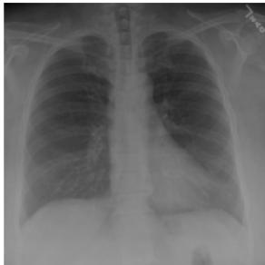
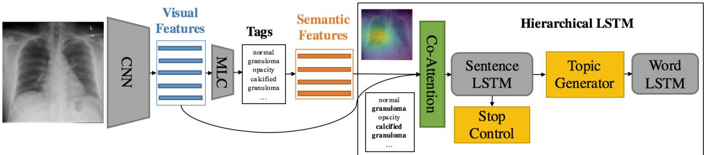

# On the Automatic Generation of Medical Imaging Reports

Baoyu Jing†\* Pengtao Xie†\* Eric P. Xing† †Petuum Inc, USA \*School of Computer Science, Carnegie Mellon University, USA {baoyu.jing, pengtao.xie, eric.xing}@petuum.com

# Abstract

Medical imaging is widely used in clinical practice for diagnosis and treatment. Report-writing can be error-prone for unexperienced physicians, and timeconsuming and tedious for experienced physicians. To address these issues, we study the automatic generation of medical imaging reports. This task presents several challenges. First, a complete report contains multiple heterogeneous forms of information, including findings and tags. Second, abnormal regions in medical images are difficult to identify. Third, the reports are typically long, containing multiple sentences. To cope with these challenges, we (1) build a multi-task learning framework which jointly performs the prediction of tags and the generation of paragraphs, (2) propose a co-attention mechanism to localize regions containing abnormalities and generate narrations for them, (3) develop a hierarchical LSTM model to generate long paragraphs. We demonstrate the effectiveness of the proposed methods on two publicly available datasets.

# 1 Introduction

Medical images, such as radiology and pathology images, are widely used in hospitals for the diagnosis and treatment of many diseases, such as pneumonia and pneumothorax. The reading and interpretation of medical images are usually conducted by specialized medical professionals. For example, radiology images are read by radiologists. They write textual reports (Figure 1) to narrate the findings regarding each area of the body examined in the imaging study, specifically

Impression: No acute cardiopulmonary abnormality.

Findings: There are no focal areas of consolidation. No suspicious pulmonary opacities. Heart size within normal limits. No pleural effusions. There is no evidence of pneumothorax. Degenerative changes of the thoracic spine.

  
Figure 1: An exemplar chest $\mathbf { X }$ -ray report. In the impression section, the radiologist provides a diagnosis. The findings section lists the radiology observations regarding each area of the body examined in the imaging study. The tags section lists the keywords which represent the critical information in the findings. These keywords are identified using the Medical Text Indexer (MTI).

MTI Tags: degenerative change

whether each area was found to be normal, abnormal or potentially abnormal.

For less-experienced radiologists and pathologists, especially those working in the rural area where the quality of healthcare is relatively low, writing medical-imaging reports is demanding. For instance, to correctly read a chest $\mathbf { X }$ -ray image, the following skills are needed (Delrue et al., 2011): (1) thorough knowledge of the normal anatomy of the thorax, and the basic physiology of chest diseases; (2) skills of analyzing the radiograph through a fixed pattern; (3) ability of evaluating the evolution over time; (4) knowledge of clinical presentation and history; (5) knowledge of the correlation with other diagnostic results (laboratory results, electrocardiogram, and respiratory function tests).

For experienced radiologists and pathologists, writing imaging reports is tedious and timeconsuming. In nations with large population such as China, a radiologist may need to read hundreds of radiology images per day. Typing the findings of each image into computer takes about $5 { \cdot } 1 0 \mathrm { m i n }$ - utes, which occupies most of their working time. In sum, for both unexperienced and experienced medical professionals, writing imaging reports is unpleasant.

This motivates us to investigate whether it is possible to automatically generate medical image reports. Several challenges need to be addressed. First, a complete diagnostic report is comprised of multiple heterogeneous forms of information. As shown in Figure 1, the report for a chest xray contains impression which is a sentence, findings which are a paragraph, and tags which are a list of keywords. Generating this heterogeneous information in a unified framework is technically demanding. We address this problem by building a multi-task framework, which treats the prediction of tags as a multi-label classification task, and treats the generation of long descriptions as a text generation task.

Second, how to localize image-regions and attach the right description to them are challenging. We solve these problems by introducing a co-attention mechanism, which simultaneously attends to images and predicted tags and explores the synergistic effects of visual and semantic information.

Third, the descriptions in imaging reports are usually long, containing multiple sentences. Generating such long text is highly nontrivial. Rather than adopting a single-layer LSTM (Hochreiter and Schmidhuber, 1997), which is less capable of modeling long word sequences, we leverage the compositional nature of the report and adopt a hierarchical LSTM to produce long texts. Combined with the co-attention mechanism, the hierarchical LSTM first generates high-level topics, and then produces fine-grained descriptions according to the topics.

Overall, the main contributions of our work are:

• We propose a multi-task learning framework which can simultaneously predict the tags and generate the text descriptions. • We introduce a co-attention mechanism for localizing sub-regions in the image and generating the corresponding descriptions. • We build a hierarchical LSTM to generate long paragraphs.

• We perform extensive experiments to show the effectiveness of the proposed methods.

The rest of the paper is organized as follows. Section 2 reviews related works. Section 3 introduces the method. Section 4 present the experimental results and Section 5 concludes the paper.

# 2 Related Works

Textual labeling of medical images There have been several works aiming at attaching “texts” to medical images. In their settings, the target “texts” are either fully-structured or semi-structured (e.g. tags, templates), rather than natural texts. Kisilev et al. (2015) build a pipeline to predict the attributes of medical images. Shin et al. (2016) adopt a CNN-RNN based framework to predict tags (e.g. locations, severities) of chest x-ray images. The work closest to ours is recently contributed by (Zhang et al., 2017), which aims at generating semi-structured pathology reports, whose contents are restricted to 5 predefined topics.

However, in the real-world, different physicians usually have different writing habits and different x-ray images will represent different abnormalities. Therefore, collecting semi-structured reports is less practical and thus it is important to build models to learn from natural reports. To the best of our knowledge, our work represents the first one that generates truly natural reports written by physicians, which are usually long and cover diverse topics.

Image captioning with deep learning Image captioning aims at automatically generating text descriptions for given images. Most recent image captioning models are based on a CNN-RNN framework (Vinyals et al., 2015; Fang et al., 2015; Karpathy and Fei-Fei, 2015; Xu et al., 2015; You et al., 2016; Krause et al., 2017).

Recently, attention mechanisms have been shown to be useful for image captioning (Xu et al., 2015; You et al., 2016). Xu et al. (2015) introduce a spatial-visual attention mechanism over image features extracted from intermediate layers of the CNN. You et al. (2016) propose a semantic attention mechanism over tags of given images. To better leverage both the visual features and semantic tags, we propose a co-attention mechanism for report generation.

Instead of only generating one-sentence caption for images, Krause et al. (2017) and Liang et al. (2017) generate paragraph captions using a hierarchical LSTM. Our method also adopts a hierarchical LSTM for paragraph generation, but unlike Krause et al. (2017), we use a co-attention network to generate topics.

  
Figure 2: Illustration of the proposed model. MLC denotes a multi-label classification network. Semantic features are the word embeddings of the predicted tags. The boldfaced tags “calcified granuloma” and “granuloma” are attended by the co-attention network.

# 3 Methods

# 3.1 Overview

A complete diagnostic report for a medical image is comprised of both text descriptions (long paragraphs) and lists of tags, as shown in Figure 1. We propose a multi-task hierarchical model with coattention for automatically predicting keywords and generating long paragraphs. Given an image which is divided into regions, we use a CNN to learn visual features for these patches. Then these visual features are fed into a multi-label classification (MLC) network to predict the relevant tags. In the tag vocabulary, each tag is represented by a word-embedding vector. Given the predicted tags for a specific image, their word-embedding vectors serve as the semantic features of this image. Then the visual features and semantic features are fed into a co-attention model to generate a context vector that simultaneously captures the visual and semantic information of this image. As of now, the encoding process is completed.

Next, starting from the context vector, the decoding process generates the text descriptions. The description of a medical image usually contains multiple sentences, and each sentence focuses on one specific topic. Our model leverages this compositional structure to generate reports in a hierarchical way: it first generates a sequence of high-level topic vectors representing sentences, then generates a sentence from each topic vector. Specifically, the context vector is inputted into a sentence LSTM, which unrolls for a few steps and produces a topic vector at each step. A topic vector represents the semantics of a sentence to be generated. Given a topic vector, the word LSTM takes it as input and generates a sequence of words to form a sentence. The termination of the unrolling process is controlled by the sentence LSTM.

# 3.2 Tag Prediction

The first task of our model is predicting the tags of the given image. We treat the tag prediction task as a multi-label classification task. Specifically, given an image $I$ , we first extract its features $\{ \mathbf { v } _ { n } \} _ { n = 1 } ^ { \bar { N } } \in \mathbb { R } ^ { D }$ from an intermediate layer of a CNN, and then feed $\{ { \bf v } _ { n } \} _ { n = 1 } ^ { N }$ into a multi-label classification (MLC) network to generate a distribution over all of the $L$ tags:

$$
\begin{array} { r } { \mathbf { p } _ { 1 , p r e d } ( \ r _ { i } = 1 | \{ \mathbf { v } _ { n } \} _ { n = 1 } ^ { N } ) \propto \exp ( \mathrm { M L C } _ { i } ( \{ \mathbf { v } _ { n } \} _ { n = 1 } ^ { N } ) ) } \end{array}
$$

where $\mathbf { l } \in \mathbb { R } ^ { L }$ is a tag vector, $\mathbf { l } _ { i } = 1 / 0$ denote the presence and absence of the $i$ -th tag respectively, and $\mathrm { { M L C } } _ { i }$ means the $i$ -th output of the MLC network.

For simplicity, we extract visual features from the last convolutional layer of the VGG-19 model (Simonyan and Zisserman, 2014) and use the last two fully connected layers of VGG-19 for MLC.

Finally, the embeddings of the $M$ most likely tags $\{ \mathbf { a } _ { m } \} _ { m = 1 } ^ { M } \in \mathbb { R } ^ { E }$ are used as semantic features for topic generation.

# 3.3 Co-Attention

Previous works have shown that visual attention alone can perform fairly well for localizing objects (Ba et al., 2015) and aiding caption generation (Xu et al., 2015). However, visual attention does not provide sufficient high level semantic information. For example, only looking at the right lower region of the chest $\mathbf { X }$ -ray image (Figure 1) without accounting for other areas, we might not be able to recognize what we are looking at, not to even mention detecting the abnormalities. In contrast, the tags can always provide the needed high level information. To this end, we propose a co-attention mechanism which can simultaneously attend to visual and semantic modalities.

In the sentence LSTM at time step $s$ , the joint context vector co-attention ne $\mathbf { c t x } ^ { ( s ) } \in \mathbb { R } ^ { C }$ e, $f _ { c o _ { a t t } } ( \{ \mathbf { v } _ { n } \} _ { n = 1 } ^ { N }$ $\{ \mathbf { a } _ { m } \} _ { m = 1 } ^ { M }$ h(s−1)), where $\mathbf { h } _ { s e n t } ^ { ( s - 1 ) } \ \in \ \mathbb { R } ^ { H }$ is the sentence LSTM hidden state at time step $s - 1$ . The coattention network $f _ { c o _ { a t t } }$ uses a single layer feedforward network to compute the soft visual attentions and soft semantic attentions over input image features and tags:

$$
\begin{array} { r } { \alpha _ { \mathbf { v } , n } \propto \exp ( \mathbf { W } _ { \mathbf { v } _ { a t t } } \operatorname { t a n h } ( \mathbf { W } _ { \mathbf { v } } \mathbf { v } _ { n } + \mathbf { W } _ { \mathbf { v } , \mathbf { h } } \mathbf { h } _ { s e n t } ^ { ( s - 1 ) } ) ) } \\ { \alpha _ { \mathbf { a } , m } \propto \exp ( \mathbf { W } _ { \mathbf { a } _ { a t t } } \operatorname { t a n h } ( \mathbf { W } _ { \mathbf { a } } \mathbf { a } _ { m } + \mathbf { W } _ { \mathbf { a } , \mathbf { h } } \mathbf { h } _ { s e n t } ^ { ( s - 1 ) } ) ) } \end{array}
$$

where $\mathbf { W _ { v } }$ , ${ \bf W } _ { { \bf v } , { \bf h } }$ , and $\mathbf { W } _ { \mathbf { v } _ { a t t } }$ are parameter matrices of the visual attention network. $\mathbf { W _ { a } }$ , $\mathbf { W _ { a , h } }$ and $\mathbf { W _ { a } } _ { a t t }$ are parameter matrices of the semantic attention network.

The visual and semantic context vectors are computed as:

$$
\mathbf { v } _ { a t t } ^ { ( s ) } = \sum _ { n = 1 } ^ { N } \alpha _ { \mathbf { v } , n } \mathbf { v } _ { n } , \quad \mathbf { a } _ { a t t } ^ { ( s ) } = \sum _ { m = 1 } ^ { M } \alpha _ { \mathbf { a } , m } \mathbf { a } _ { m } .
$$

There are many ways to combine the visual and semantic context vectors such as concatenation and element-wise operations. In this paper, we first concatenate these two vectors as $[ \bar { \mathbf { v } } _ { a t t } ^ { ( s ) } ; \mathbf { a } _ { a t t } ^ { ( s ) } ]$ and then use a fully connected layer $\mathbf { W } _ { f c }$ to obtain a joint context vector:

$$
\mathbf { c t } \mathbf { x } ^ { ( s ) } = \mathbf { W } _ { f c } [ \mathbf { v } _ { a t t } ^ { ( s ) } ; \mathbf { a } _ { a t t } ^ { ( s ) } ] .
$$

# 3.4 Sentence LSTM

The sentence LSTM is a single-layer LSTM that takes the joint context vector ctx $\in \ \mathbb { R } ^ { C }$ as its input, and generates topic vector $\textbf { t } \in \ \mathbb { R } ^ { K }$ for word LSTM through topic generator and determines whether to continue or stop generating captions by a stop control component.

Topic generator We use a deep output layer (Pascanu et al., 2014) to strengthen the context information in topic vector $\mathbf { t } ^ { ( s ) }$ , by combining the hidden state h(s) sent and the joint context vector $\mathbf { c t x } ^ { ( s ) }$ of the current step:

$$
\mathbf { t } ^ { ( s ) } = \operatorname { t a n h } ( \mathbf { W _ { t , h _ { s e n t } } } \mathbf { h } _ { s e n t } ^ { ( s ) } + \mathbf { W _ { t , c t x } } \mathbf { c } \mathbf { t } \mathbf { x } ^ { ( s ) } )
$$

where $\mathbf { W _ { t , h _ { s e n t } } }$ and $\mathbf { W _ { t , c t x } }$ are weight parameters.

Stop control We also apply a deep output layer to control the continuation of the sentence LSTM. The layer takes the previous and current hidden state $\mathbf { h } _ { s e n t } ^ { ( s - 1 ) }$ , h(s)sent as input and produces a distribution over $\{ S T O P { = } 1 , C O N T I N U E { = } 0 \}$ :

$$
\begin{array} { r l } & { p ( S T O P | \mathbf { h } _ { s e n t } ^ { ( s - 1 ) } , \mathbf { h } _ { s e n t } ^ { ( s ) } ) \propto } \\ & { \exp \{ \mathbf { W } _ { s t o p } \operatorname { t a n h } ( \mathbf { W } _ { s t o p , s - 1 } \mathbf { h } _ { s e n t } ^ { ( s - 1 ) } + \mathbf { W } _ { s t o p , s } \mathbf { h } _ { s e n t } ^ { ( s ) } ) \} } \end{array}
$$

where $\mathbf { W } _ { s t o p }$ , $\mathbf { W } _ { s t o p , s - 1 }$ and $\mathbf { W } _ { s t o p , s }$ are parameter matrices. If $p ( S T O P | \mathbf { h } _ { s e n t } ^ { ( s - 1 ) } , \mathbf { h } _ { s e n t } ^ { ( s ) } )$ is greater than a predefined threshold (e.g. 0.5), then the sentence LSTM will stop producing new topic vectors and the word LSTM will also stop producing words.

# 3.5 Word LSTM

The words of each sentence are generated by a word LSTM. Similar to (Krause et al., 2017), the topic vector t produced by the sentence LSTM and the special START token are used as the first and second input of the word LSTM, and the subsequent inputs are the word sequence.

The hidden state $\mathbf { h } _ { w o r d } \ \in \ \mathbb { R } ^ { H }$ of the word LSTM is directly used to predict the distribution over words:

$$
p ( w o r d \vert \mathbf { h } _ { w o r d } ) \propto \exp ( \mathbf { W } _ { o u t } \mathbf { h } _ { w o r d } )
$$

where $\mathbf { W } _ { o u t }$ is the parameter matrix. After each word-LSTM has generated its word sequences, the final report is simply the concatenation of all the generated sequences.

# 3.6 Parameter Learning

Each training example is a tuple $( I , 1 , \mathbf { w } )$ where $I$ is an image, l denotes the ground-truth tag vector, and w is the diagnostic paragraph, which is comprised of $S$ sentences and each sentence consists of $T _ { s }$ words.

Given a training example $( I , 1 , \mathbf { w } )$ , our model first performs multi-label classification on $I$ and produces a distribution $\mathbf { p } _ { 1 , p r e d }$ over all tags. Note that l is a binary vector which encodes the presence and absence of tags. We can obtain the ground-truth tag distribution by normalizing l: ${ \bf p } _ { 1 } = 1 / | | \mathbf { l } | | _ { 1 }$ . The training loss of this step is a cross-entropy loss $\ell _ { t a g }$ between $\mathbf { p } _ { \mathrm { l } }$ and $\mathbf { p } _ { 1 , p r e d }$ .

Next, the sentence LSTM is unrolled for $S$ steps to produce topic vectors and also distributions over $\{ S T O P , C O N T I N U E \}$ : $p _ { s t o p } ^ { s }$ . Finally, the $S$ topic vectors are fed into the word LSTM to generate words $\mathbf { w } _ { s , t }$ . The training loss of caption generation is the combination of two cross-entropy losses: $\ell _ { s e n t }$ over stop distributions $p _ { s t o p } ^ { s }$ and $\ell _ { w o r d }$ over word distributions $p _ { s , t }$ . Combining the pieces together, we obtain the overall training loss:

$$
\begin{array} { l } { { \displaystyle \ell ( I , { \bf l } , { \bf w } ) = \lambda _ { t a g } \ell _ { t a g } } } \\ { ~ + \lambda _ { s e n t } \sum _ { s = 1 } ^ { S } \ell _ { s e n t } ( p _ { s t o p } ^ { s } , I \{ s = S \} ) } \\ { ~ + \lambda _ { w o r d } \sum _ { s = 1 } ^ { S } \sum _ { t = 1 } ^ { T _ { s } } \ell _ { w o r d } ( p _ { s , t } , w _ { s , t } ) } \end{array}
$$

In addition to the above training loss, there is also a regularization term for visual and semantic attentions. Similar to ( $\mathrm { X u }$ et al., 2015), let $\pmb { \alpha } \in \mathbb { R } ^ { N \times S }$ and $\beta \in \mathbb { R } ^ { M \times S }$ be the matrices of visual and semantic attentions respectively, then the regularization loss over $_ \alpha$ and $\beta$ is:

$$
\ell _ { r e g } = \lambda _ { r e g } [ \sum _ { n } ^ { N } ( 1 - \sum _ { s } ^ { S } \alpha _ { n , s } ) ^ { 2 } + \sum _ { m } ^ { M } ( 1 - \sum _ { s } ^ { S } \beta _ { m , s } ) ^ { 2 } ]
$$

Such regularization encourages the model to pay equal attention over different image regions and different tags.

# 4 Experiments

In this section, we evaluate the proposed model with extensive quantitative and qualitative experiments.

# 4.1 Datasets

We used two publicly available medical image datasets to evaluate our proposed model.

IU X-Ray The Indiana University Chest XRay Collection (IU X-Ray) (Demner-Fushman et al., 2015) is a set of chest x-ray images paired with their corresponding diagnostic reports. The dataset contains 7,470 pairs of images and reports. Each report consists of the following sections: impression, findings, tags1, comparison, and indication. In this paper, we treat the contents in impression and findings as the target captions2 to be generated and the Medical Text Indexer (MTI) annotated tags as the target tags to be predicted (Figure 1 provides an example).

We preprocessed the data by converting all tokens to lowercases, removing all of non-alpha tokens, which resulting in 572 unique tags and 1915 unique words. On average, each image is associated with 2.2 tags, 5.7 sentences, and each sentence contains 6.5 words. Besides, we find that top 1,000 words cover $9 9 . 0 \%$ word occurrences in the dataset, therefore we only included top 1,000 words in the dictionary. Finally, we randomly selected 500 images for validation and 500 images for testing.

PEIR Gross The Pathology Education Informational Resource (PEIR) digital library3 is a public medical image library for medical education. We collected the images together with their descriptions in the Gross sub-collection, resulting in the PEIR Gross dataset that contains 7,442 imagecaption pairs from 21 different sub-categories. Different from the IU X-Ray dataset, each caption in PEIR Gross contains only one sentence. We used this dataset to evaluate our model’s ability of generating single-sentence report.

For PEIR Gross, we applied the same preprocessing as IU X-Ray, which yields 4,452 unique words. On average, each image contains 12.0 words. Besides, for each caption, we selected 5 words with the highest tf-idf scores as tags.

# 4.2 Implementation Details

We used the full VGG-19 model (Simonyan and Zisserman, 2014) for tag prediction. As for the training loss of the multi-label classification (MLC) task, since the number of tags for semantic attention is fixed as 10, we treat MLC as a multilabel retrieval task and adopt a softmax crossentropy loss (a multi-label ranking loss), similar to (Gong et al., 2013; Guillaumin et al., 2009).

Table 1: Main results for paragraph generation on the IU X-Ray dataset (upper part), and single sentence generation on the PEIR Gross dataset (lower part). BLUE-n denotes the BLEU score that uses up to n-grams.   

<table><tr><td>Dataset</td><td>Methods</td><td>BLEU-1</td><td>BLEU-2</td><td>BLEU-3</td><td>BLEU-4</td><td>METEOR</td><td>ROUGE</td><td>CIDER</td></tr><tr><td rowspan="7">IU X-Ray</td><td>CNN-RNN (Vinyals et al., 2015)</td><td>0.316</td><td>0.211</td><td>0.140</td><td>0.095</td><td>0.159</td><td>0.267</td><td>0.111</td></tr><tr><td>LRCN (Donahue et al., 2015)</td><td>0.369</td><td>0.229</td><td>0.149</td><td>0.099</td><td>0.155</td><td>0.278</td><td>0.190</td></tr><tr><td>Soft ATT (Xu et al., 2015)</td><td>0.399</td><td>0.251</td><td>0.168</td><td>0.118</td><td>0.167</td><td>0.323</td><td>0.302</td></tr><tr><td>ATT-RK (You et al., 2016)</td><td>0.369</td><td>0.226</td><td>0.151</td><td>0.108</td><td>0.171</td><td>0.323</td><td>0.155</td></tr><tr><td>Ours-no-Attention</td><td>0.505</td><td>0.383</td><td>0.290</td><td>0.224</td><td>0.200</td><td>0.420</td><td>0.259</td></tr><tr><td>Ours-Semantic-only</td><td>0.504</td><td>0.371</td><td>0.291</td><td>0.230</td><td>0.207</td><td>0.418</td><td>0.286</td></tr><tr><td>Ours-Visual-only</td><td>0.507</td><td>0.373</td><td>0.297</td><td>0.238</td><td>0.211</td><td>0.426</td><td>0.300</td></tr><tr><td rowspan="7">PEIR Gross</td><td>Ours-CoAttention</td><td>0.517</td><td>0.386</td><td>0.306</td><td>0.247</td><td>0.217</td><td>0.447</td><td>0.327</td></tr><tr><td>CNN-RNN (Vinyals et al., 2015)</td><td>0.247</td><td>0.178</td><td>0.134</td><td>0.092</td><td>0.129</td><td>0.247</td><td>0.205</td></tr><tr><td>LRCN (Donahue et al., 2015)</td><td>0.261</td><td>0.184</td><td>0.136</td><td>0.088</td><td>0.135</td><td>0.254</td><td>0.203</td></tr><tr><td>Soft ATT (Xu et al., 2015)</td><td>0.283</td><td>0.212</td><td>0.163</td><td>0.113</td><td>0.147</td><td>0.271</td><td>0.276</td></tr><tr><td>ATT-RK (You et al., 2016)</td><td>0.274</td><td>0.201</td><td>0.154</td><td>0.104</td><td>0.141</td><td>0.264</td><td>0.279</td></tr><tr><td>Ours-No-Attention</td><td>0.248</td><td>0.180</td><td>0.133</td><td>0.093</td><td>0.131</td><td>0.242</td><td>0.206</td></tr><tr><td>Ours-Semantic-only</td><td>0.263</td><td>0.191</td><td>0.145</td><td>0.098</td><td>0.138</td><td>0.261</td><td>0.274</td></tr><tr><td></td><td>Ours-Visual-only Ours-CoAttention</td><td>0.284 0.300</td><td>0.209 0.218</td><td>0.156 0.165</td><td>0.105 0.113</td><td>0.149 0.149</td><td>0.274 0.279</td><td>0.280 0.329</td></tr></table>

In paragraph generation, we set the dimensions of all hidden states and word embeddings as 512. For words and tags, different embedding matrices were used since a tag might contain multiple words. We utilized the embeddings of the 10 most likely tags as the semantic feature vectors $\{ \mathbf { a } _ { m } \} _ { m = 1 } ^ { M = 1 0 }$ . We extracted the visual features from the last convolutional layer of the VGG-19 network, which yields a $1 4 \times 1 4 \times 5 1 2$ feature map.

We used the Adam (Kingma and Ba, 2014) optimizer for parameter learning. The learning rates for the CNN (VGG-19) and the hierarchical LSTM were 1e-5 and 5e-4 respectively. The weights $( \lambda _ { t a g }$ , $\lambda _ { s e n t }$ , $\lambda _ { w o r d }$ and $\lambda _ { r e g . }$ ) of different losses were set to 1.0. The threshold for stop control was 0.5. Early stopping was used to prevent over-fitting.

# 4.3 Baselines

We compared our method with several stateof-the-art image captioning models: CNN-RNN (Vinyals et al., 2015), LRCN (Donahue et al., 2015), Soft ATT (Xu et al., 2015), and ATT-RK (You et al., 2016). We re-implemented all of these models and adopt VGG-19 (Simonyan and Zisserman, 2014) as the CNN encoder. Considering these models are built for single sentence captions and to better show the effectiveness of the hierarchical LSTM and the attention mechanism for paragraph generation, we also implemented a hierarchical model without any attention: Oursno-Attention. The input of Ours-no-Attention is the overall image feature of VGG-19, which has a dimension of 4096. Ours-no-Attention can be viewed as a CNN-RNN (Vinyals et al., 2015) equipped with a hierarchical LSTM decoder. To further show the effectiveness of the proposed coattention mechanism, we also implemented two ablated versions of our model: Ours-Semanticonly and Ours-Visual-only, which takes solely the semantic attention or visual attention context vector to produce topic vectors.

# 4.4 Quantitative Results

We report the paragraph generation (upper part of Table 1) and one sentence generation (lower part of Table 1) results using the standard image captioning evaluation tool 4 which provides evaluation on the following metrics: BLEU (Papineni et al., 2002), METEOR (Denkowski and Lavie, 2014), ROUGE (Lin, 2004), and CIDER (Vedantam et al., 2015).

For paragraph generation, as shown in the upper part of Table 1, it is clear that models with a single LSTM decoder perform much worse than those with a hierarchical LSTM decoder. Note that the only difference between Ours-no-Attention and CNN-RNN (Vinyals et al., 2015) is that Oursno-Attention adopts a hierarchical LSTM decoder while CNN-RNN (Vinyals et al., 2015) adopts a single-layer LSTM. The comparison between these two models directly demonstrates the effectiveness of the hierarchical LSTM. This result is not surprising since it is well-known that a single-layer LSTM cannot effectively model long sequences (Liu et al., 2015; Martin and Cundy, 2018). Additionally, employing semantic attention alone (Ours-Semantic-only) or visual attention alone (Ours-Visual-only) to generate topic vectors does not seem to help caption generation a lot. The potential reason might be that visual at

# Ground Truth

No active disease. The heart and lungs v  o and expanded. Heart and mediastinum normal.

# Ours-CoAttention

No active disease. The heart and lungs v u  c expanded. Cardiomediastinal silhouette is within normal limits. No pleural effusion or pneumothorax is seen. No pleural effusion. No cavitary or pneumothorax.

# Ours-no-Attention

The lungs are clear bilaterally. The are grossly normal. No focal lung consolidation. No acute bony abnormality. cm nodule within the right lower lobe on the lateral view. No pneumothorax or pleural effusion. No acute bony abnormality. The heart is not enlarged. The lungs are clear. No acute bony abnormality.

# Soft Attention

No acute cardiopulmonary abnormality. The lungs are clear bilaterally. Specifically no evidence of focal airspace consolidation pleural effusion or pneumothorax.Cardio mediastinal silhouette is unremarkable. Visualized osseous structures of the thorax are without acute abnormality.

No acute cardiopulmonary findings. Heart size is not enlarged. No focal airspace consolidation suspicious pulmonary opacity large pleural effusion or pneumothorax. No focal areas of consolidation. Degenerative changes of spin Th mo exa  the hydropneumothorax. Lungs are clear. There is no focal airspace consolidation pleural effusion or pneumothorax.

The lungs are clear bilaterally. The are grossly normal. No pleural effusion. The heart is normal in size and contour. The lungs are clear. There are no acute bony findings.

No acute cardiopulmonary abnormality. The lungs are clear bilaterally. There is no pleural effusion or pneumothorax. The heart and mediastinum are normal. There is no focal air space opacity to suggest a pneumonia.

The lungs are clear bilaterally. The are grossly normal. No acute bony abnormality. The lungs are otherwise clear. No acute osseous abnormality. No acute osseous abnormality. The heart and mediastinum are normal. There is no focal air space opacity.

No acute cardiopulmonary abnormality. The lungs are clear bilaterally. There is no focal airspace consolidation. No pleural effusion or pneumothorax. Heart ize and pulonay vascularity appear within normal limits.

No acute cardiopulmonary abnormality. The lungs are clear bilaterally. The are grossly normal. No focal airspace consolidation. No pneumothorax or pleural effusion. Heart size and pulmonary vascularity within normal limits. There is no pneumothorax or pleural effusion.

No acute cardiopulmonary abnormality. There is no focal airspace consolidation. No pneumothorax or pleural effusion. No acute bony abnormality. Heart size is normal.

tention can only capture the visual information of sub-regions of the image and is unable to correctly capture the semantics of the entire image. Semantic attention is inadequate of localizing small abnormal image-regions. Finally, our full model (Ours-CoAttention) achieves the best results on all of the evaluation metrics, which demonstrates the effectiveness of the proposed co-attention mechanism.

For the single-sentence generation results (shown in the lower part of Table 1), the ablated versions of our model (Ours-Semantic-only and Ours-Visual-only) achieve competitive scores compared with the state-of-the-art methods. Our full model (Ours-CoAttention) outperforms all of the baseline, which indicates the effectiveness of the proposed co-attention mechanism.

# 4.5 Qualitative Results

# 4.5.1 Paragraph Generation

An illustration of paragraph generation by three models (Ours-CoAttention, Ours-no-Attention and Soft Attention models) is shown in Figure 3.

We can find that different sentences have different topics. The first sentence is usually a high level description of the image, while each of the following sentences is associated with one area of the image (e.g. “lung”, “heart”). Soft Attention and Oursno-Attention models detect only a few abnormalities of the images and the detected abnormalities are incorrect. In contrast, Ours-CoAttention model is able to correctly describe many true abnormalities (as shown in top three images). This comparison demonstrates that co-attention is better at capturing abnormalities.

For the third image, Ours-CoAttention model successfully detects the area (“right lower lobe”) which is abnormal (“eventration”), however, it fails to precisely describe this abnormality. In addition, the model also finds abnormalities about “interstitial opacities” and “atheroscalerotic calcification”, which are not considered as true abnormality by human experts. The potential reason for this mis-description might be that this $\mathbf { X }$ -ray image is darker (compared with the above images), and our model might be very sensitive to this change.

<table><tr><td>A</td><td></td><td>AA</td><td>1 </td><td>7</td><td>7</td><td>2</td></tr><tr><td>degenerative change; obstruction</td><td>normal; degenerative change; nodule; calci- fied granuloma; hyper expansion; granuloma- tous disease; granu- loma; pneumonia;</td><td>normal;degenerative change; nodule; calci- fied granuloma; hyper expansion; granuloma- tous disease; granu- loma; pneumonia; scar-</td><td>normal; degenerative change; nodule; calci- fied granuloma; hyper expansion; granuloma- tous disease; granu- loma; pneumonia; scar- ring; sternotomy</td><td>normal; degenerative change; nodule; calci- fied granuloma; hyper expansion; granuloma- tous disease; granu- loma; pneumonia; scar- ring; sternotomy</td><td>normal; degenerative change; nodule; calci- fied granuloma; hyper expansion; granuloma- tous disease; granu- loma; pneumonia; scar- ring; sternotomy</td><td>normal; degenerative change; nodule; calci- fied granuloma; hyper expansion; granuloma- tous disease; granu- loma; pneumonia; scar- ring; sternotomy</td></tr><tr><td></td><td>scarring; sternotomy No acute intrathoracic abnormality.</td><td>ring; sternotomy No bony abnormality.</td><td>The cardio mediastinal silhouette is within nor- mal limits for appear- ance.</td><td>No focal areas of pul- monary consolidation.</td><td>Breast motion.</td><td>There is an age indeter- minate deformity of a mid-thoracic vertebral body.</td></tr></table>

<table><tr><td></td><td></td><td>normal; cardiomegaly;</td><td></td><td></td><td></td><td></td></tr><tr><td>calcified granuloma; granulomas</td><td>normal; cardiomegaly; nodule; degenerative change; granulomatous disease; opacity; calci- fied granuloma; ate- lectasis; lymph nodes;</td><td>nodule; degenerative change; granuloma- tous disease; opacity; calcified granuloma; at- electasis; lymph nodes;</td><td>normal; cardiomegaly; nodule;degenerative change; granulomatous disease; opacity; calci- fied granuloma; atelec- tasis; lymph nodes; hi-</td><td>normal; cardiomegaly; nodule;degenerative change; granuloma- tous disease; opacity; calcified granuloma; at- electasis; lymph nodes;</td><td>normal; cardiomegaly; nodule; degenerative change; granulomatous disease; opacity; calci- fied granuloma; ate- lectasis; lymph nodes;</td><td>normal; cardiomegaly; nodule; degenerative change; granulomatous disease; opacity, calci- fied granuloma; ate- lectasis; lymph nodes;</td></tr><tr><td></td><td>hiatal hernia Clear lungs.</td><td>hiatal hernia Lungs are clear .</td><td>atal hernia Left lower lung vol- umes is clear.</td><td>hiatal hernia The heart is normal size.</td><td>hiatal hernia A there is no focal air- space disease.</td><td>hiatal hernia There is mild blunting of cost phrenic.</td></tr></table>

<table><tr><td>A</td><td></td><td></td><td>7</td><td></td><td></td><td></td></tr><tr><td>normal</td><td>normal; calcified gran- uloma; granuloma- tous disease; granu- loma; scarring; opac- ity; degenerative change; sternotomy;</td><td>normal; calcified gran- uloma; granulomatous disease; granuloma; scarring; opacity; de- generative change; sternotomy; thorac ic</td><td>normal; calcified gran- uloma; granulomatous disease; granuloma; scarring; opacity; de- generative change; sternotomy; thoracic</td><td>normal; calcified gran- uloma; granulomatous disease; granuloma; scarring; opacity; de- generative change; sternotomy; thoracic</td><td>normal; calcified gran- uloma; granulomatous disease; granuloma; scarring; opacity; de- generative change; sternotomy; thoracic</td><td>normal; calcified gran- uloma; granuloma- tous disease; granu- loma; scarring; opacity; degenerative change; sternotomy; thoracic</td></tr><tr><td></td><td>thoracic aorta; nodule Right upper lobe infil- trate.</td><td>aorta; nodule Lungs are clear.</td><td>aorta; nodule Stable heart size and aortic contours.</td><td>aorta;nodule No acute displaced rib fractures.</td><td>aorta; nodule No focal airspace opac- ities or consolidation.</td><td>aorta; nodule No visualized of pneu- mothorax.</td></tr></table>

Figure 4: Visualization of co-attention for three examples. Each example is comprised of four things: (1) image and visual attentions; (2) ground truth tags and semantic attention on predicted tags; (3) generated descriptions; (4) ground truth descriptions. For the semantic attention, three tags with highest attention scores are highlighted. The underlined tags are those appearing in the ground truth.

The image at the bottom is a failure case of Ours-CoAttention. However, even though the model makes the wrong judgment about the major abnormalities in the image, it does find some unusual regions: “lateral lucency” and “left lower lobe”.

Table 2: Portion of sentences which describe the normalities and abnormalities in the image.   

<table><tr><td>Method</td><td>Normality</td><td>Abnormality</td><td>Total</td></tr><tr><td>Soft Attention</td><td>0.510</td><td>0.490</td><td>1.0</td></tr><tr><td>Ours-no-Attention</td><td>0.753</td><td>0.247</td><td>1.0</td></tr><tr><td>Ours-CoAttention</td><td>0.471</td><td>0.529</td><td>1.0</td></tr><tr><td>Ground Truth</td><td>0.385</td><td>0.615</td><td>1.0</td></tr></table>

To further understand models’ ability of detecting abnormalities, we present the portion of sentences which describe the normalities and abnormalities in Table 2. We consider sentences which contain “no”, “normal”, “clear”, “stable” as sentences describing normalities. It is clear that OursCoAttention best approximates the ground truth distribution over normality and abnormality.

# 4.5.2 Co-Attention Learning

Figure 4 presents visualizations of co-attention. The first property shown by Figure 4 is that the sentence LSTM can generate different topics at different time steps since the model focuses on different image regions and tags for different sentences. The next finding is that visual attention can guide our model to concentrate on relevant regions of the image. For example, the third sentence of the first example is about “cardio”, and the visual attention concentrates on regions near the heart. Similar behavior can also be found for semantic attention: for the last sentence in the first example, our model correctly concentrates on “degenerative change” which is the topic of the sentence. Finally, the first sentence of the last example presents a mis-description caused by incorrect semantic attention over tags. Such incorrect attention can be reduced by building a better tag prediction module.

# 5 Conclusion

In this paper, we study how to automatically generate textual reports for medical images, with the goal to help medical professionals produce reports more accurately and efficiently. Our proposed methods address three major challenges: (1) how to generate multiple heterogeneous forms of information within a unified framework, (2) how to localize abnormal regions and produce accurate descriptions for them, (3) how to generate long texts that contain multiple sentences or even paragraphs. To cope with these challenges, we propose a multi-task learning framework which jointly predicts tags and generates descriptions. We introduce a co-attention mechanism that can simultaneously explore visual and semantic information to accurately localize and describe abnormal regions. We develop a hierarchical LSTM network that can more effectively capture long-range semantics and produce high quality long texts. On two medical datasets containing radiology and pathology images, we demonstrate the effectiveness of the proposed methods through quantitative and qualitative studies.

generation. IBM Journal of Research and Development, 59(2/3):2–1, 2015.

Hoo-Chang Shin, Kirk Roberts, Le Lu, Dina DemnerFushman, Jianhua Yao, and Ronald M Summers. Learning to read chest x-rays: recurrent neural cascade model for automated image annotation. In Proceedings of the IEEE Conference on Computer Vision and Pattern Recognition, pages 2497–2506, 2016.

Zizhao Zhang, Yuanpu Xie, Fuyong Xing, Mason McGough, and Lin Yang. Mdnet: A semantically and visually interpretable medical image diagnosis network. In Proceedings of the IEEE Conference on Computer Vision and Pattern Recognition, pages 6428–6436, 2017.

Oriol Vinyals, Alexander Toshev, Samy Bengio, and Dumitru Erhan. Show and tell: A neural image caption generator. In Proceedings of the IEEE conference on computer vision and pattern recognition, pages 3156–3164, 2015.

Hao Fang, Saurabh Gupta, Forrest Iandola, Rupesh K Srivastava, Li Deng, Piotr Dollar, Jianfeng Gao, Xi- ´ aodong He, Margaret Mitchell, John C Platt, et al. From captions to visual concepts and back. In Proceedings of the IEEE conference on computer vision and pattern recognition, pages 1473–1482, 2015.

Andrej Karpathy and Li Fei-Fei. Deep visual-semantic alignments for generating image descriptions. In Proceedings of the IEEE Conference on Computer Vision and Pattern Recognition, pages 3128–3137, 2015.

Kelvin Xu, Jimmy Ba, Ryan Kiros, Kyunghyun Cho, Aaron Courville, Ruslan Salakhudinov, Rich Zemel, and Yoshua Bengio. Show, attend and tell: Neural image caption generation with visual attention. In International Conference on Machine Learning, pages 2048–2057, 2015.

Quanzeng You, Hailin Jin, Zhaowen Wang, Chen Fang, and Jiebo Luo. Image captioning with semantic attention. In Proceedings of the IEEE Conference on Computer Vision and Pattern Recognition, pages 4651–4659, 2016.

# References

Louke Delrue, Robert Gosselin, Bart Ilsen, An Van Landeghem, Johan de Mey, and Philippe Duyck. Difficulties in the interpretation of chest radiography. In Comparative Interpretation of CT and Standard Radiography of the Chest, pages 27–49. Springer, 2011.

Sepp Hochreiter and Jurgen Schmidhuber. Long short- ¨ term memory. Neural computation, 9(8):1735– 1780, 1997.

Pavel Kisilev, Eugene Walach, Ella Barkan, Boaz Ophir, Sharon Alpert, and Sharbell Y Hashoul. From medical image to automatic medical report

Jonathan Krause, Justin Johnson, Ranjay Krishna, and Li Fei-Fei. A hierarchical approach for generating descriptive image paragraphs. In The IEEE Conference on Computer Vision and Pattern Recognition (CVPR), July 2017.

Xiaodan Liang, Zhiting Hu, Hao Zhang, Chuang Gan, and Eric P. Xing. Recurrent topic-transition gan for visual paragraph generation. In The IEEE International Conference on Computer Vision (ICCV), Oct 2017.

K. Simonyan and A. Zisserman. Very deep convolutional networks for large-scale image recognition. CoRR, abs/1409.1556, 2014.

Jimmy Ba, Volodymyr Mnih, and Koray Kavukcuoglu. Multiple object recognition with visual attention. ICLR, 2015.

Razvan Pascanu, Caglar Gulcehre, Kyunghyun Cho, and Yoshua Bengio. How to construct deep recurrent neural networks. ICLR, 2014.

Dina Demner-Fushman, Marc D Kohli, Marc B Rosenman, Sonya E Shooshan, Laritza Rodriguez, Sameer Antani, George R Thoma, and Clement J McDonald. Preparing a collection of radiology examinations for distribution and retrieval. Journal of the American Medical Informatics Association, 23(2): 304–310, 2015.

Jeffrey Donahue, Lisa Anne Hendricks, Sergio Guadarrama, Marcus Rohrbach, Subhashini Venugopalan, Kate Saenko, and Trevor Darrell. Long-term recurrent convolutional networks for visual recognition and description. In Proceedings of the IEEE conference on computer vision and pattern recognition, pages 2625–2634, 2015.

Yunchao Gong, Yangqing Jia, Thomas Leung, Alexander Toshev, and Sergey Ioffe. Deep convolutional ranking for multilabel image annotation. ICLR, 2013.

Matthieu Guillaumin, Thomas Mensink, Jakob Verbeek, and Cordelia Schmid. Tagprop: Discriminative metric learning in nearest neighbor models for image auto-annotation. In Computer Vision, 2009 IEEE 12th International Conference on, pages 309– 316. IEEE, 2009.

Diederik P Kingma and Jimmy Ba. Adam: A method for stochastic optimization. arXiv preprint arXiv:1412.6980, 2014.

Kishore Papineni, Salim Roukos, Todd Ward, and WeiJing Zhu. Bleu: a method for automatic evaluation of machine translation. In Proceedings of the 40th annual meeting on association for computational linguistics, pages 311–318. Association for Computational Linguistics, 2002.

Michael Denkowski and Alon Lavie. Meteor universal: Language specific translation evaluation for any target language. In Proceedings of the ninth workshop on statistical machine translation, pages 376–380, 2014.

Chin-Yew Lin. Rouge: A package for automatic evaluation of summaries. In Text summarization branches out: Proceedings of the ACL-04 workshop, volume 8. Barcelona, Spain, 2004.

Ramakrishna Vedantam, C Lawrence Zitnick, and Devi Parikh. Cider: Consensus-based image description evaluation. In Proceedings of the IEEE conference on computer vision and pattern recognition, pages 4566–4575, 2015.

Pengfei Liu, Xipeng Qiu, Xinchi Chen, Shiyu Wu, and Xuanjing Huang. Multi-timescale long short-term memory neural network for modelling sentences and documents. In Proceedings of the 2015 conference on empirical methods in natural language processing, pages 2326–2335, 2015.

Eric Martin and Chris Cundy. Parallelizing linear recurrent neural nets over sequence length. ICLR, 2018.