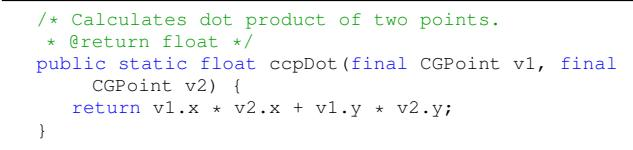
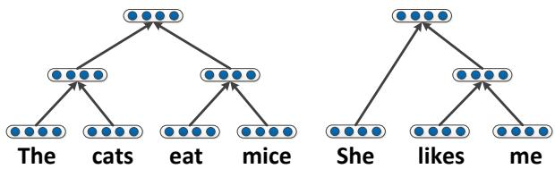
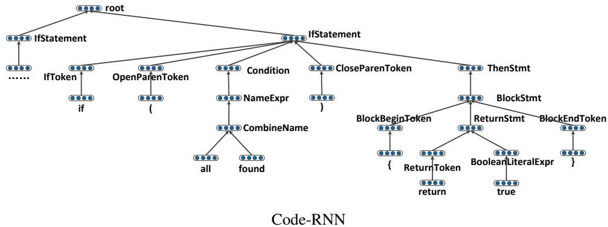
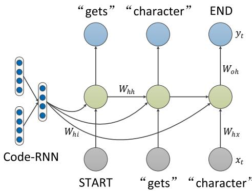
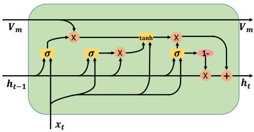
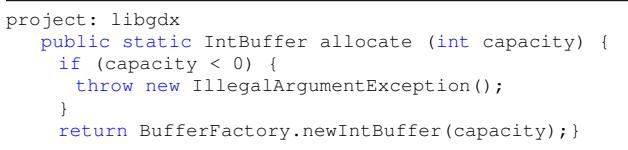

# Automatic Generation of Text Descriptive Comments for Code Blocks

Yuding Liang and Kenny Q. Zhu∗

liangyuding@sjtu.edu.cn,kzhu@cs.sjtu.edu.cn

Shanghai Jiao Tong University

800 Dongchuan Road, Shanghai, China 200240

August 22, 2018

# Abstract

We propose a framework to automatically generate descriptive comments for source code blocks. While this problem has been studied by many researchers previously, their methods are mostly based on fixed template and achieves poor results. Our framework does not rely on any template, but makes use of a new recursive neural network called Code-RNN to extract features from the source code and embed them into one vector. When this vector representation is input to a new recurrent neural network (Code-GRU), the overall framework generates text descriptions of the code with accuracy (Rouge-2 value) significantly higher than other learning-based approaches such as sequence-to-sequence model. The CodeRNN model can also be used in other scenario where the representation of code is required. 1

# 1 Introduction

Real-world software development involves large source code repositories. Reading and trying to understand other people’s code in such repositories is a difficult and unpleasant process for many software developers, especially when the code is not sufficiently commented. For example, if the Java method in Fig. 1 does not have the comment in the beginning, it will take the programmer quite some efforts to grasp the meaning of the code. However, with a meaningful sentence such as “calculates dot product of two points” as a descriptive comment, programmer’s productivity can be tremendously improved.

  
Figure 1: source code example

A related scenario happens when one wants to search for a piece of code with a specific functionality or meaning. Ordinary keyword search would not work because expressions in programs can be quite different from natural languages. If methods are annotated with meaningful natural language comments, then keyword matching or even fuzzy semantic search can be achieved.

Even though comments are so useful, programmers are not using them enough in their coding. Table 1 shows the number of methods in ten actively developed Java repositories from Github, and those of which annotated with a descriptive comment. On average, only $1 5 . 4 \%$ of the methods are commented.

To automatically generate descriptive comments from source code, one needs a way of accurately representing the semantics of code blocks. One potential solution is to treat each code block as a document and represent it by a topic distribution using models such as LDA [3]. However, topic models, when applied to source code, have several limitations:

Table 1: Ten Active Projects on Github   

<table><tr><td rowspan=1 colspan=1>Project</td><td rowspan=1 colspan=1>Description</td><td rowspan=1 colspan=1># of bytes</td><td rowspan=1 colspan=1># of Java Files</td><td rowspan=1 colspan=1># of Methods</td><td rowspan=1 colspan=1># Methods Commented</td></tr><tr><td rowspan=1 colspan=1>Activiti</td><td rowspan=1 colspan=1>a light-weight workflow and Business Process Management (BPM) Platform</td><td rowspan=1 colspan=1>168M</td><td rowspan=1 colspan=1>2939</td><td rowspan=1 colspan=1>15875</td><td rowspan=1 colspan=1>1080</td></tr><tr><td rowspan=1 colspan=1>aima-java</td><td rowspan=1 colspan=1>Java implementation of algorithms from &quot;Artificial Intelligence - A Modern Approach&quot;</td><td rowspan=1 colspan=1>182M</td><td rowspan=1 colspan=1>889</td><td rowspan=1 colspan=1>4078</td><td rowspan=1 colspan=1>1130</td></tr><tr><td rowspan=1 colspan=1>neo4j</td><td rowspan=1 colspan=1>the worlds leading Graph Database.</td><td rowspan=1 colspan=1>270M</td><td rowspan=1 colspan=1>4125</td><td rowspan=1 colspan=1>24529</td><td rowspan=1 colspan=1>1197</td></tr><tr><td rowspan=1 colspan=1>cocos2d</td><td rowspan=1 colspan=1>cocos2d for android, based on cocos2d-android-0.82</td><td rowspan=1 colspan=1>78M</td><td rowspan=1 colspan=1>512</td><td rowspan=1 colspan=1>3677</td><td rowspan=1 colspan=1>1182</td></tr><tr><td rowspan=1 colspan=1>rhino</td><td rowspan=1 colspan=1>a Java implementation of JavaScript.</td><td rowspan=1 colspan=1>21M</td><td rowspan=1 colspan=1>352</td><td rowspan=1 colspan=1>4610</td><td rowspan=1 colspan=1>1195</td></tr><tr><td rowspan=1 colspan=1>spring-batch</td><td rowspan=1 colspan=1>a framework for writing offline and batch applications using Spring and Java</td><td rowspan=1 colspan=1>56M</td><td rowspan=1 colspan=1>1742</td><td rowspan=1 colspan=1>7936</td><td rowspan=1 colspan=1>1827</td></tr><tr><td rowspan=1 colspan=1>Smack</td><td rowspan=1 colspan=1>an open source, highly modular, easy to use, XMPP client library written in Java</td><td rowspan=1 colspan=1>41M</td><td rowspan=1 colspan=1>1335</td><td rowspan=1 colspan=1>5034</td><td rowspan=1 colspan=1>2344</td></tr><tr><td rowspan=1 colspan=1>guava</td><td rowspan=1 colspan=1>Java-based projects: collections, caching, primitives</td><td rowspan=1 colspan=1>80M</td><td rowspan=1 colspan=1>1710</td><td rowspan=1 colspan=1>20321</td><td rowspan=1 colspan=1>3079</td></tr><tr><td rowspan=1 colspan=1>jersey</td><td rowspan=1 colspan=1>a REST framework that provides JAX-RS Reference Implementation and more.</td><td rowspan=1 colspan=1>73M</td><td rowspan=1 colspan=1>2743</td><td rowspan=1 colspan=1>14374</td><td rowspan=1 colspan=1>2540</td></tr><tr><td rowspan=1 colspan=1>libgdx</td><td rowspan=1 colspan=1>a cross-platform Java game development framework based on OpenGL (ES)</td><td rowspan=1 colspan=1>989M</td><td rowspan=1 colspan=1>1906</td><td rowspan=1 colspan=1>18889</td><td rowspan=1 colspan=1>2828</td></tr></table>

A comment here refers to the description at the beginning of a method, with more than eight words.

• a topic model treats documents as a bag of words and ignores the structural information such as programming language syntax and function or method calls in the code;   
• the contribution of lexical semantics to the meaning of code is exaggerated;   
• comments produced can only be words but not phrases or sentences.

One step toward generating readable comments is to use templates [16,28]. The disadvantage is that comments created by templates are often very similar to each other and only relevant to parts of the code that fit the template. For example, the comment generated by McBurney’s model for Fig. 1 is fairly useless: “This method handles the ccp dot and returns a float. ccpDot() seems less important than average because it is not called by any methods.”

To overcome these problems, in this paper, we propose to use Recursive Neural Network (RNN) [26, 27] to combine the semantic and structural information from code. Recursive NN has previously been applied to parse trees of natural language sentences, such as the example of two sentences in Fig. 2. In our problem, source codes can be accurately parsed into their parse trees, so recursive NN can be applied in our work readily. To this end, we design a new recursive NN called Code-RNN to extract the features from the source code.

  
Figure 2: The Recursive Neural Networks of Two Sentences

Using Code-RNN to train from the source code, we can get a vector representation of each code block and this vector contains rich semantics of the code block, just like word vectors [18]. We then use a Recurrent Neural Network to learn to generate meaningful comments. Existing recurrent NN does not take good advantage of the code block representation vectors. Thus we propose a new GRU [6] cell that does a better job.

In sum, this paper makes the following contributions:

• by designing a new Recursive Neural Network, Code-RNN, we are able to describe the structural information of source code;   
• with the new design of a GRU cell, namely CodeGRU, we make the best out of code block representation vector to effectively generate comments for source codes;   
• the overall framework achieves remarkable accuracy (Rouge-2 value) in the task of generating descriptive

comments for Java methods, compared to state-ofthe-art approaches.

# 2 Framework

In this section, we introduce the details of how to represent source code and how to use the representation vector of source code to generate comments.

# 2.1 Code Representation

We propose a new kind of recursive neural network called Code-RNN to encapsulate the critical structural information of the source code. Code-RNN is an arbitrary tree form while other recursive neural nets used in NLP are typically binary trees. Fig. 3 shows an example of CodeRNN for a small piece of Java code.

In Code-RNN, every parse tree of a program is encoded into a neural network, where the structure of the network is exactly the parse tree itself and each syntactic node in the parse tree is represented by a vector representation. 2 One unique internal node “CombineName” indicates a compound identifier that is the concatenation of several primitive words, for example, “allFound” can be split into “all” and “found”. More on the semantics of identifier will be discussed later in this section.

There are two models for the Code-RNN, namely Sum Model and Average Model:

1. Sum Model

$$
V = V _ { n o d e } + f ( \mathbf { W } \times \sum _ { c \in C } V _ { c } + \mathbf { b } )
$$

# 2. Average Model

$$
V = V _ { n o d e } + f ( \mathbf { W } \times { \frac { 1 } { n } } \sum _ { c \in C } V _ { c } + \mathbf { b } )
$$

Here $V$ is the vector representation of sub-tree rooted at $N ; V _ { n o d e }$ is the vector that represents the syntactic type of $N$ itself, e.g., IfStatement; $C$ is the set of all child nodes of $N$ ; $V _ { c }$ is the vector that represents a subtree rooted at $c$ , one of $N$ ’s children. During the training, $W$ and $b$ are tuned. $V$ , $V _ { n o d e }$ and $V _ { c }$ are calculated based on the structure of neural network. $f$ is $R E L U$ activation function.

These equations are applied recursively, bottom-up through the Code-RNN at every internal node, to obtain the vector representation of the root node, which is also the vector of the entire code piece.

# Identifier Semantics

In this work, we adopt two ways to extract the semantics from the identifiers. One is to split all the long forms to multiple words and the other one is to recover the full words from abbreviations.

Table 2 shows some example identifiers and the results of splitting. Many identifiers in the source code are combination of English words, with the first letter of the word in upper case, or joined together using underscores. We thus define simple rules to extract the original English words accordingly. These words are further connected by the “CombineName” node in the code-RNN.

Table 3 shows some abbreviations and their intended meaning. We can infer the full-versions by looking for longer forms in the context of the identifier in the code. Specifically, we compare the identifier with the word list generated from the context of the identifier to see whether the identifier’s name is a substring of some word from the list, or is the combination of the initial of the words in the list. If the list contains only one word, we just check if the identifier is part of that word. If so, we conclude that the identifier is the abbreviation of that word with higher probability. If the list contains multiple words, we can collect all the initials of the words in the list to see whether the identifier is part of this collection. Suppose the code fragment is

We search for the original words of “dm” as follows. Since “dm” is not the substring of any word in the context, we collect the initials of the contextual words in a list: “m” “dm” and “cm”. Therefore, “dm” is an abbreviation of “DoubleMatrix”.

  
Figure 3: Code-RNN Example

Table 2: Example of Split Identifiers   

<table><tr><td rowspan=1 colspan=1>Identifier</td><td rowspan=1 colspan=1>Words</td></tr><tr><td rowspan=1 colspan=1>contextInitialize</td><td rowspan=1 colspan=1>context, initialize</td></tr><tr><td rowspan=1 colspan=1>apiSettings</td><td rowspan=1 colspan=1>api, settings</td></tr><tr><td rowspan=1 colspan=1>buildDataDictionary</td><td rowspan=1 colspan=1>build, data, dictionary</td></tr><tr><td rowspan=1 colspan=1>add_result</td><td rowspan=1 colspan=1>add, result</td></tr></table>

Table 3: Example of Abbreviation   

<table><tr><td rowspan=1 colspan=1>Abbreviation</td><td rowspan=1 colspan=1>Origin</td><td rowspan=1 colspan=1>Context</td></tr><tr><td rowspan=1 colspan=1>val</td><td rowspan=1 colspan=1>value</td><td rowspan=1 colspan=1>key.value()</td></tr><tr><td rowspan=1 colspan=1>cm</td><td rowspan=1 colspan=1>confusion, matrix</td><td rowspan=1 colspan=1>new ConfusionMatrix()</td></tr><tr><td rowspan=1 colspan=1>conf</td><td rowspan=1 colspan=1>configuration</td><td rowspan=1 colspan=1>context.getConfiguration()</td></tr><tr><td rowspan=1 colspan=1>rnd</td><td rowspan=1 colspan=1>random</td><td rowspan=1 colspan=1>RandomUtils.getRandom()</td></tr></table>

# Training

Each source code block in the training data has a class label. Our objective function is:

$$
\arg \operatorname* { m i n } C r o s s E n t r o p y ( s o f t m a x ( W _ { s } V _ { m } + b _ { s } ) , V _ { l a b e l } )
$$

where $V _ { m }$ is the representation vector of source code, $V _ { l a b e l }$ is an one-hot vector to represent the class label. $W _ { s }$ and $b _ { s }$ are parameters for softmax function and will be tuned during training. We use AdaGrad [7] to apply unique learning rate to each parameter.

# 2.2 Comment Generation

utilize the code block representation vector in Recurrent NN is that we can not feed the code block representation vector to the Recurrent NN cell directly. We thus propose a variation of the GRU based RNN. Fig. 4 shows our comment generation process.

Existing work [8, 17, 30] has used Recurrent Neural Network to generate sentences. However, one challenge to

  
Figure 4: Comment Generation

We use pre-trained model Code-RNN to get the representation vector of the input code block $V _ { m }$ . This vector $V _ { m }$ is fixed during training of comment generation model. Then we feed code block vector into the RNN (Recurrent Neural Network) model at every step. For example in Fig. 4, we input the START token as the initial input of model and feed the code block vector into the hidden layer. After calculating the output of this step, we do the back-propagation. Then at step two, we input the word “gets” and feed the code block vector $V _ { m }$ into hidden layer again, and receive the $h _ { t - 1 }$ from the step one. We repeat the above process to tune all parameters. The equations of comment generation model are listed below.

$$
\begin{array} { r l } & { z _ { t } = \sigma ( W _ { z } \cdot [ h _ { t - 1 } , x _ { t } ] ) } \\ & { r _ { t } = \sigma ( W _ { r } \cdot [ h _ { t - 1 } , x _ { t } ] ) } \\ & { c _ { t } = \sigma ( W _ { c } \cdot [ h _ { t - 1 } , x _ { t } ] ) } \\ & { \tilde { h } _ { t } = t a n h ( W \cdot [ r _ { t } * h _ { t - 1 } , c _ { t } * V _ { m } , x _ { t } ] ) } \\ & { h _ { t } = ( 1 - z _ { t } ) * h _ { t - 1 } + z _ { t } * \tilde { h } _ { t } } \\ & { y _ { t } = s o f t m a x ( W _ { o h } h _ { t } + b _ { o } ) } \end{array}
$$

where $V _ { m }$ is the code block representation vector, $h _ { t - 1 }$ is the previous state and $x _ { t }$ is the input word of this step.

To better use the code block vectors, our model differs from existing RNNs, particularly in the definition of $c _ { t }$ in the Equation 6 and 7. The new RNN cell, illustrated in Fig. 5, aims to strengthen the effect of code block vectors. This modified GRU is hereinafter called Code-GRU. Code block vector contains all information of code block but not all information is useful at all steps. Therefore, we add a new gate called choose gate to determine which dimension of code block vector would work in Code-GRU. In Fig 5, the left gate is the choose gate, and the other two gates are the same as the original GRU.

  
Figure 5: Structure of Code-GRU

During test time, we input the “START” token at first and choose the most probable word as the output. Then from the second step the input words of every step are the output words of previous one step until the output is “END” token. So that we can get an automatically generated comment for code blocks in our model.

To gain better results, we also apply the beam search while testing. We adopt a variant of beam search with a length penalty described in [32]. In this beam search model, there are two parameters: beam size and weight for the length penalty. We tune these two parameters on the validation set to determine which values to use. Our tuning ranges are:

• weight for the length penalty: [0, 0.1, 0.2, 0.3, 0.4, 0.5, 0.6, 0.7, 0.8, 0.9, 1.0]

# 3 Evaluation

Our evaluation comes in two parts. In the first part, we evaluate Code-RNN model’s ability to classify different source code blocks into $k$ known categories. In the second part, we show the effectiveness of our comment generation model by comparing with several state-of-the-art approaches in both quantitative and qualitative assessments. The source code of our approach as well as all data set is available at https://adapt.seiee.sjtu.edu. cn/CodeComment/.

# 3.1 Source Code Classification

# Data Set

The goal is to classify a given Java method (we only use the body block without name and parameters) into a predefined set of classes depending on its functionality. Our data set comes from the Google Code Jam contest $( 2 0 0 8 { \sim } 2 0 1 6 )$ ), which there are multiple problems, each associated with a number of correct solutions contributed by programmers. 3 Each solution is a Java method. The set of solutions for the same problem are considered to function identically and belong to the same class in this work. We use the solutions (10,724 methods) of 6 problems as training set and the solutions (30 methods) of the other 6 problems as the test set. Notice that the problems in the training data and the ones in the test data do not overlap. We specifically design the data set this way because, many methods for the same problem tend to use the same or similar set of identifiers, which is not true in real world application. The details of training set and test set are shown in Table 4.

Table 4: Data Sets for Source Code Clustering   

<table><tr><td rowspan=1 colspan=2></td><td rowspan=1 colspan=1>Problem</td><td rowspan=1 colspan=1>Year</td><td rowspan=1 colspan=1># of methods</td></tr><tr><td rowspan=6 colspan=2>Training Set</td><td rowspan=1 colspan=1></td><td rowspan=1 colspan=2>Cookie Clicker Alpha</td></tr><tr><td rowspan=1 colspan=1>Counting Sheep</td><td rowspan=1 colspan=1>2016</td><td rowspan=1 colspan=1>1722</td></tr><tr><td rowspan=1 colspan=1>Magic Trick</td><td rowspan=1 colspan=1>2014</td><td rowspan=1 colspan=1>2234</td></tr><tr><td rowspan=1 colspan=1>Revenge of the Pancakes</td><td rowspan=1 colspan=1>2016</td><td rowspan=1 colspan=1>1214</td></tr><tr><td rowspan=1 colspan=1>Speaking in Tongues</td><td rowspan=1 colspan=1>2012</td><td rowspan=1 colspan=1>1689</td></tr><tr><td rowspan=1 colspan=1>Standing Ovation</td><td rowspan=1 colspan=1>2015</td><td rowspan=1 colspan=1>2226</td></tr><tr><td rowspan=6 colspan=2>Test Set</td><td rowspan=1 colspan=1>All Your Base</td><td rowspan=1 colspan=1>2009</td><td rowspan=1 colspan=1>5</td></tr><tr><td rowspan=1 colspan=1>Consonants</td><td rowspan=1 colspan=1>2013</td><td rowspan=1 colspan=1>5</td></tr><tr><td rowspan=1 colspan=1>Dijkstra</td><td rowspan=1 colspan=1>2015</td><td rowspan=1 colspan=1>5</td></tr><tr><td rowspan=1 colspan=1>GoroSort</td><td rowspan=1 colspan=1>2011</td><td rowspan=1 colspan=1>5</td></tr><tr><td rowspan=1 colspan=1>Osmos</td><td rowspan=1 colspan=1>2013</td><td rowspan=1 colspan=1>5</td></tr><tr><td rowspan=1 colspan=1>Part Elf</td><td rowspan=1 colspan=1>2014</td><td rowspan=1 colspan=1>5</td></tr></table>

better uniformly than the baselines that use only word semantics or only structural information. Therefore, in the rest of this section, we will use Code-RNN(avg) model to create vector representation for a given method to be used for comment generation. The F1 score for each individual problem is also included in Table 6.

Table 5: Purity, Average F1 and Accuracy   

<table><tr><td></td><td>Purity</td><td>F1</td><td>Accuracy</td></tr><tr><td>LEA</td><td>0.400</td><td>0.3515</td><td>0.3667</td></tr><tr><td>LES</td><td>0.3667</td><td>0.2846</td><td>0.3667</td></tr><tr><td>CRA(ni)</td><td>0.4667</td><td>0.4167</td><td>0.4667</td></tr><tr><td>CRS(ni)</td><td>0.4667</td><td>0.4187</td><td>0.4667</td></tr><tr><td>CRA</td><td>0.533</td><td>0.4774</td><td>0.5</td></tr><tr><td>CRS</td><td>0.4667</td><td>0.3945</td><td>0.4333</td></tr></table>

LEA $=$ Language Embedding Average model; LES $=$ Language Embedding Sum model; CRA $=$ Code-RNN Average model; CRS $=$ Code-RNN Sum model; $( \mathrm { n i } ) =$ no identifier.

# Baselines

We compare Code-RNN with two baseline approaches. The first one is called language embedding $( L E )$ and only treats the source code as a sequence of words, minus the special symbols (e.g., $\cdot \$ 3$ , “ $( ^ { , , } , ^ { \cdots } + ^ { , , } , \cdot \cdot )$ . All concatenated words are preprocessed into primitive words as previously discussed. Then the whole code can be represented by either the sum $( L E S )$ or the average $( L E A )$ of word vectors of this sequence, trained in this model.This approach basically focuses on the word semantics only and ignores the structural information from the source code.

The second baseline is a variant of Code-RNN, which preprocesses the code parse tree by consistently replacing the identifier names with placeholders before computing the overall representation of the tree. This variant focuses on the structural properties only and ignores the word semantics.

# Result of Classification

At test time, when a method is classified into a class label, we need to determine which test problem this class label refers to. To that end, we compute the accuracy of classification for all possible class label assignment and use the highest accuracy as the one given by a model.

Table 5 shows the purity of the produced classes, the F1 and accuracy of the 6-class classification problem by different methods. It is clear that Code-RNN (avg) perform

Table 6: F1 scores of individual problems   

<table><tr><td></td><td>Dijkstra</td><td>Part Elf</td><td>All Your Base</td><td>GoroSort</td><td>Consonants</td><td>Osmos</td></tr><tr><td>LEA</td><td>0.25</td><td>0.33</td><td>0.43</td><td>0.33</td><td>0.4</td><td>0.36</td></tr><tr><td>LES</td><td>0.33</td><td>0</td><td>0.53</td><td>0</td><td>0.53</td><td>0.31</td></tr><tr><td>CRA(ni)</td><td>0.6</td><td>0</td><td>0.44</td><td>0.40</td><td>0.56</td><td>0.5</td></tr><tr><td>CRS(ni)</td><td>0.62</td><td>0.29</td><td>0.67</td><td>0.5</td><td>0.44</td><td>0</td></tr><tr><td>CRA</td><td>0.67</td><td>0</td><td>0.6</td><td>0.57</td><td>0.53</td><td>0.52</td></tr><tr><td>CRS</td><td>0.73</td><td>0</td><td>0.44</td><td>0.55</td><td>0.4</td><td>0.25</td></tr></table>

# 3.2 Comment Generation Model

# Data Set

We use ten open-source Java code repositories from GitHub for this experiment (see Table 1). In each of these repositories we extract descriptive comment and the corresponding method pairs. Constructor methods are excluded from this exercise. These pairs are then used for training and test. Notice that all the method names and parameters are excluded from training and test.

# Baselines

We compare our approach with four baseline methods.

• Moses4 is a statistical machine translation system. We regard the source codes as the source language and the comments as the target, and use Moses to translate from the source to the target.

• CODE-NN [11] is the first model to use neural network to create sentences for source code. In this model author used LSTM and attention mechanism to generate sentences. The original data set for CODE-NN are StackOverFlow thread title and code snippet pairs. 5. In this experiment, we use the comment-code pair data in place of the title-snippet data.

• We apply the sequence-to-sequence (seq2seq) model used in machine translation [4] and treat the code as a sequence of words and the comment as another sequence.

• A. Karpathy and L. Fei-Fei [12] proposed a meaningful method to generate image descriptions. It also used Recurrent NN and representation vector, so we apply this method to comment generation model. The main equations are:

$$
\begin{array} { r l } & { b _ { v } = W _ { h i } V _ { m } } \\ & { h _ { t } = f ( W _ { h x } x _ { t } + W _ { h h } h _ { t - 1 } + b _ { h } + b _ { v } ) } \\ & { y _ { t } = s o f t m a x ( W _ { o h } h _ { t } + b _ { o } ) } \end{array}
$$

where $W _ { h i }$ , $W _ { h x }$ , $W _ { h h }$ , $W _ { o h }$ , $x _ { i }$ and $b _ { h } , b _ { o }$ are parameters to be learned, and $V _ { m }$ is the method vector. We call this model Basic RNN.

Moses and CODE-NN has its own terminate condition. Seq2Seq, Basic RNN and our model run 800 epochs during training time. For one project, we separate the commented methods into three parts: training set, validation set and test set. We tune the hyper parameter on the validation set. The results of ten repositories are shown in Table 7.

# Evaluation Metric

We evaluate the quality of comment generation by the Rouge method [14]. Rouge model counts the number of overlapping units between generated sentence and target sentence. We choose Rouge-2 score in this paper where word based 2-grams are used as the unit, as it is the most commonly used in evaluating automatic text generation such as summarization.

Table 7: Rouge-2 Values for Different Methods   

<table><tr><td></td><td>neo4j</td><td>cocos2d</td><td>jersey</td><td>aima- guava java</td><td></td><td>Smack Activiti</td><td></td><td>spring- batch</td><td>libgdx</td><td>rhino</td></tr><tr><td>MOSES 0.076</td><td></td><td>0.147</td><td>0.081</td><td>0.144 0.134</td><td></td><td>0.145</td><td>0.104</td><td>0.147</td><td>0.212</td><td>0.082</td></tr><tr><td>CODE- NN</td><td>0.077</td><td>0.136</td><td>0.105</td><td>0.124 0.153</td><td></td><td>0.135</td><td>0.103</td><td>0.184</td><td>0.208</td><td>0.171</td></tr><tr><td>Seq2seq 0.039</td><td></td><td>0.115</td><td>0.183</td><td>0.108 0.152</td><td></td><td>0.109</td><td>0.158</td><td>0.171</td><td>0.247</td><td>0.169</td></tr><tr><td>Basic RNN*</td><td>0.133</td><td>0.152</td><td>0.214</td><td>0.207</td><td>0.156</td><td>0.150</td><td>0.203</td><td>0.237</td><td>0.218</td><td>0.163</td></tr><tr><td>Code- GRU*</td><td>0.141</td><td>0.158</td><td></td><td>0.230 0.209 0.164</td><td></td><td>0.162</td><td>0.200</td><td>0.213</td><td>0.233</td><td>0.165</td></tr></table>

\*: both models use the method representation vector from Code-RNN.

# Examples of Generated Comment

Fig. 6 shows the comments generated by the competing methods for three example Java methods coming from different repositories. Because we delete all punctuation from the training data, the generated comments are without punctuation. Nonetheless, we can see that comments by our Code-GRU model are generally more readable and meaningful.

In the first example, we can see that CODE-NN, Seq2Seq and Basic RNN’s results are poor and have almost nothing to do with the Gold comment. Even though both MOSES produces a sequence of words that look similar to the Gold in the beginning, the rest of the result is less readable and does not have any useful information. For example, “if the lock state matches the given” is output repeatedly. MOSES also produces strange terms such as “wbit” and “runit” just because they appeared in the source code. In the contrast, Code-GRU’s result is more readable and meaningful.

In the second example, there is not any useful word in the method body so the results of MOSES, CODENN and Seq2Seq are bad. Code-RNN can extract the structural information of source code and embed it into a vector, so both models that use this vector, namely Basic RNN and Code-GRU, can generate the relevant comments.

In the third example, although all results change the type of the value, that is, Basic RNN changes “int” to “char” while Code-GRU changes to “long”. “long” and “int” are both numerical types while “char” is not. Thus Code-GRU is better than Basic RNN. For the result of Seq2Seq, although “float” is also a numerical type, it is for real numbers, and not integers.

<table><tr><td rowspan=1 colspan=1>Gold</td><td rowspan=1 colspan=1>if the lock state matches the given stamp performs one of thefollowing actions if the stamp represents holding a write lockreleases it and UNK a read lock or if a read lock returns it orif an optimistic read acquires a read lock and returns a readstamp only if immediately available this method returns zeroin all other cases</td></tr><tr><td rowspan=1 colspan=1>MOSES</td><td rowspan=1 colspan=1>if the lock state matches the given if the lock state matchesthe given gets of processing sbits state matches the givensbits string of the lock hold abits l 1 break component of rfullthat runs sets of processing of runit or create a new patternif this inc reader overflow l create a human readable descrip-tion of component of wbit break if the lock of processing ofwbit runit h whead by the given status release the given ac-tion if the sum associated with the given component 1 lockstate matches the given action wbit get returns break 1</td></tr><tr><td rowspan=1 colspan=1>CODE-NN</td><td rowspan=1 colspan=1>returns code true if the lock is not a link org glassfish jerseyserver mvc</td></tr><tr><td rowspan=1 colspan=1>Seq2Seq</td><td rowspan=1 colspan=1>UNK a new item to the list of superclass timeout version</td></tr><tr><td rowspan=1 colspan=1>Basic RNN*</td><td rowspan=1 colspan=1>get a UNK to a link javax ws rs core UNK</td></tr><tr><td rowspan=1 colspan=1>Code-GRU*</td><td rowspan=1 colspan=1>if the lock state matches the given stamp performs one ofthe following actions if the stamp represents holding a writelock returns it or if a read lock if the write lock is availablereleases the read lock and returns a write stamp or if an opti-mistic read returns</td></tr></table>

<table><tr><td rowspan=1 colspan=1>Gold</td><td rowspan=1 colspan=1>Calculates dot product of two points</td></tr><tr><td rowspan=1 colspan=1>MOSES</td><td rowspan=1 colspan=1>subtract another subtract another the given vector</td></tr><tr><td rowspan=1 colspan=1>CODE-NN</td><td rowspan=1 colspan=1>rotates two points</td></tr><tr><td rowspan=1 colspan=1>Seq2Seq</td><td rowspan=1 colspan=1>returns the closest long to the specified value</td></tr><tr><td rowspan=1 colspan=1>Basic RNN*</td><td rowspan=1 colspan=1>calculates cross product of two points</td></tr><tr><td rowspan=1 colspan=1>Code-GRU*</td><td rowspan=1 colspan=1>calculates cross product of two points</td></tr></table>

Figure 6: Examples of generated comments and corresponding code snippets   

<table><tr><td rowspan=1 colspan=1>Gold</td><td rowspan=1 colspan=1>creates an int buffer based on a newly allocated int array</td></tr><tr><td rowspan=1 colspan=1>MOSES</td><td rowspan=1 colspan=1>based on the creates a new backing buffer</td></tr><tr><td rowspan=1 colspan=1>CODE-NN</td><td rowspan=1 colspan=1>creates a byte buffer based on a newly allocated char array</td></tr><tr><td rowspan=1 colspan=1>Seq2Seq</td><td rowspan=1 colspan=1>creates a float buffer based on a newly allocated float array</td></tr><tr><td rowspan=1 colspan=1>Basic RNN*</td><td rowspan=1 colspan=1>creates a char buffer based on a newly allocated char array</td></tr><tr><td rowspan=1 colspan=1>Code-GRU*</td><td rowspan=1 colspan=1>creates a long buffer based on a newly allocated long array</td></tr></table>

# 4 Related Work

Mining of source code repositories becomes increasingly popular in recent years. Existing work in source code mining include code search, clone detection, software evolution, models of software development processes, bug localization, software bug prediction, code summarization and so on. Our work can be categorized as code summarization and comment generation.

Sridhara et al. [28] proposed an automatic comment generator that identifies the content for the summary and generates natural language text that summarizes the methods overall actions based on some templates. Moreno et al. [20] also proposed a template based method but it is used on summarizing Java classes. McBurney and McMillan [16] presented a novel approach for automatically generating summaries of Java methods that summarize the context surrounding a method, rather than details from the internals of the method. These summarization techniques [10, 20, 22, 29] work by selecting a subset of the statements and keywords from the code, and then including information from those statements and keywords in the summary. To improve them, Rodeghero et al. [24] presented an eye-tracking study of programmers during source code summarization, a tool for selecting keywords based on the findings of the eye-tracking study.

These models are invariably based on templates and careful selection of fragments of the input source code. In contrast, our model is based on learning and neural network. There are also some models that apply learning methods to mine source code.

Movshovitz-Attias and Cohen [21] predicted comments using topic models and n-grams. Like source code summarization, Allamanis et al. [2] proposed a continuous embedding model to suggest accurate method and class names.

Iyer et al. [11] proposed a new model called CODE-NN that uses Long Short Term Memory (LSTM) networks with attention to produce sentences that can describe C# code snippets and SQL queries. Iyer et al.’s work has strong performance on two tasks, code summarization and code retrieval. This work is very similar to our work, in that we both use the Recurrent NN to generate sentences for source code. What differs is that we propose a new type of Recurrent NN. Adrian et al. [13] utilized the information of identifier names and comments to mine topic of source code repositories. Punyamurthula [23] used call graphs to extract the metadata and dependency information from the source code and used this information to analyze the source code and get its topics.

In other related domains of source code mining, code search is a popular research direction. Most search engines solve the problem by keyword extraction and signature matching. Maarek et al. [15] used keywords extracted from man pages written in natural language and their work is an early example of approaches based on keywords. Rollins and Wing [25] proposed an approach to find code with the signatures present in code. Mitchell [19] combined signature matching with keyword matching. Then Garcia et al. [9] focused on querying for semantic characteristics of code and proposed a new approach which combines semantic characteristics and keyword matching.

Cai [5] proposed a method for code parallelization through sequential code search. That method can also be used for clone detection. Williams and Hollingsworth [31] described a method to use the source code change history of a software project to drive and help to refine the search for bugs. Adhiselvam et al. [1] used MRTBA algorithm to localize bug to help programmers debug. The method proposed in this paper can also benefit natural language search for code fragments.

# 5 Conclusion

In this paper we introduce a new Recursive Neural Network called Code-RNN to extract the topic or function of the source code. This new Recursive Neural Network is the parse tree of the source code and we go through all the tree from leaf nodes to root node to get the final representation vector. Then we use this vector to classify the source code into some classes according to the function, and classification results are acceptable. We further propose a new kind of GRU called Code-GRU to utilize the vector created from Code-RNN to generate comments. We apply Code-GRU to ten source code repositories and gain the best result in most projects. This frame work can also be applied to other programming languages as long as we have access to the parse tree of the input program.

As future work, we can add call graphs into our model, so that Code-RNN can contain invocation information and extract more topics from source code.

# Acknowledgement

This work was supported by Oracle-SJTU Joint Research Scheme, NSFC Grant No. 9164620571421002 and 61373031, and SJTU funding project 16JCCS08. Hongfei Hu contributed to the identifier semantics part of the work.

# References

[1] A Adhiselvam, E Kirubakaran, and R Sukumar. An enhanced approach for software bug localization using map reduce technique based apriori (mrtba) algorithm. Indian Journal of Science and Technology, 8(35), 2015.

Computer Vision and Pattern Recognition, pages 3128–3137, 2015.

[2] Miltiadis Allamanis, Earl T Barr, Christian Bird, and Charles Sutton. Suggesting accurate method and class names. In ESEC/FSE, pages 38–49. ACM, 2015.

[13] Adrian Kuhn, Stephane Ducasse, and Tudor G ´ ´ırba. Semantic clustering: Identifying topics in source code. Information and Software Technology, 49(3):230–243, 2007.

[3] David M Blei, Andrew $\mathrm { ~ Y ~ N ~ g ~ } _ { \mathrm { ~ \normalfont ~  ~ } }$ , and Michael I Jordan. Latent dirichlet allocation. Journal of machine Learning research, 3(Jan):993–1022, 2003.

[4] Denny Britz, Anna Goldie, Thang Luong, and Quoc Le. Massive Exploration of Neural Machine Translation Architectures. ArXiv e-prints, March 2017.

[5] Bowen Cai. Code parallelization through sequential code search. In ICSE-C, pages 695–697. ACM, 2016.

[6] Kyunghyun Cho, Bart Van Merrienboer, Dzmitry ¨ Bahdanau, and Yoshua Bengio. On the properties of neural machine translation: Encoder-decoder approaches. arXiv preprint arXiv:1409.1259, 2014.

[7] John Duchi, Elad Hazan, and Yoram Singer. Adaptive subgradient methods for online learning and stochastic optimization. Journal of Machine Learning Research, 12(Jul):2121–2159, 2011.

[8] Jeffrey L Elman. Finding structure in time. Cognitive science, 14(2):179–211, 1990.

[9] Isabel Garcia-Contreras, Jose F Morales, and Manuel V Hermenegildo. Semantic code browsing. arXiv preprint arXiv:1608.02565, 2016.

[14] Chin-Yew Lin. Rouge: A package for automatic evaluation of summaries. In Text summarization branches out: Proceedings of the ACL-04 workshop, volume 8. Barcelona, Spain, 2004.

[15] Yoelle S Maarek, Daniel M Berry, and Gail E Kaiser. ¨ An information retrieval approach for automatically constructing software libraries. IEEE Transactions on software Engineering, 17(8):800–813, 1991.

[16] Paul W McBurney and Collin McMillan. Automatic documentation generation via source code summarization of method context. In ICPC, pages 279– 290. ACM, 2014.

[17] Tomas Mikolov, Martin Karafiat, Lukas Burget, Jan ´ Cernocky, and Sanjeev Khudanpur. Recurrent neu- \` ral network based language model. In Interspeech, volume 2, page 3, 2010.

[18] Tomas Mikolov, Ilya Sutskever, Kai Chen, Greg S Corrado, and Jeff Dean. Distributed representations of words and phrases and their compositionality. In Advances in neural information processing systems, pages 3111–3119, 2013.

[19] Neil Mitchell. Hoogle overview. The Monad. Reader, 12:27–35, 2008.

[10] Sonia Haiduc, Jairo Aponte, Laura Moreno, and Andrian Marcus. On the use of automated text summarization techniques for summarizing source code. In WCRE, pages 35–44. IEEE, 2010.

[11] Srinivasan Iyer, Ioannis Konstas, Alvin Cheung, and Luke Zettlemoyer. Summarizing source code using a neural attention model. In ACL, pages 2073–2083, 2016.

[20] Laura Moreno, Jairo Aponte, Giriprasad Sridhara, Andrian Marcus, Lori Pollock, and K VijayShanker. Automatic generation of natural language summaries for java classes. In ICPC, pages 23–32. IEEE, 2013.

[21] Dana Movshovitz-Attias and William W Cohen. Natural language models for predicting programming comments. 2013.

[12] Andrej Karpathy and Li Fei-Fei. Deep visualsemantic alignments for generating image descriptions. In Proceedings of the IEEE Conference on [22] Gail Cecile Murphy. Lightweight structural summarization as an aid to software evolution. PhD thesis, 1996.

[23] Sravani Punyamurthula. Dynamic model generation and semantic search for open source projects using big data analytics. PhD thesis, Faculty of the University Of Missouri-Kansas City in partial fulfillment Of the requirements for the degree MASTER OF SCIENCE By SRAVANI PUNYAMURTHULA B. Tech, Jawaharlal Nehru Technological University, 2015.

[32] Yonghui Wu, Mike Schuster, Zhifeng Chen, Quoc V Le, Mohammad Norouzi, Wolfgang Macherey, Maxim Krikun, Yuan Cao, Qin Gao, Klaus Macherey, et al. Google’s neural machine translation system: Bridging the gap between human and machine translation. arXiv preprint arXiv:1609.08144, 2016.

[24] Paige Rodeghero, Collin McMillan, Paul W McBurney, Nigel Bosch, and Sidney D’Mello. Improving automated source code summarization via an eyetracking study of programmers. In ICSE, pages 390– 401. ACM, 2014.

[25] Eugene J Rollins and Jeannette M Wing. Specifications as search keys for software libraries. In ICLP, pages 173–187. Citeseer, 1991.

[26] Richard Socher, Cliff C Lin, Chris Manning, and Andrew $\mathrm { ~ Y ~ N ~ g ~ }$ . Parsing natural scenes and natural language with recursive neural networks. In ICML, pages 129–136, 2011.

[27] Richard Socher, Jeffrey Pennington, Eric H Huang, Andrew $\mathrm { ~ Y ~ N ~ g ~ }$ , and Christopher D Manning. Semisupervised recursive autoencoders for predicting sentiment distributions. In EMNLP, pages 151–161. Association for Computational Linguistics, 2011.

[28] Giriprasad Sridhara, Emily Hill, Divya Muppaneni, Lori Pollock, and K Vijay-Shanker. Towards automatically generating summary comments for java methods. In ASE, pages 43–52. ACM, 2010.

[29] Giriprasad Sridhara, Lori Pollock, and K VijayShanker. Generating parameter comments and integrating with method summaries. In ICPC, pages 71–80. IEEE, 2011.

[30] Ilya Sutskever, James Martens, and Geoffrey E Hinton. Generating text with recurrent neural networks. In ICML, pages 1017–1024, 2011.

[31] Chadd C Williams and Jeffrey K Hollingsworth. Automatic mining of source code repositories to improve bug finding techniques. IEEE Transactions on Software Engineering, 31(6):466–480, 2005.