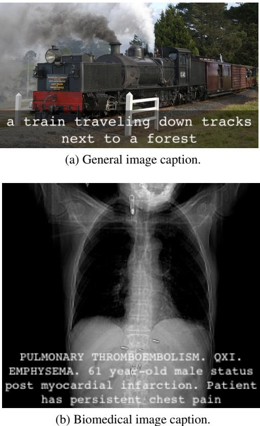

# A Survey on Biomedical Image Captioning

Vasiliki Kougia, John Pavlopoulos, Ion Androutsopoulos Department of Informatics, Athens University of Economics and Business, Greece {kouyiav,annis,ion}@aueb.gr

# Abstract

Image captioning applied to biomedical images can assist and accelerate the diagnosis process followed by clinicians. This article is the first survey of biomedical image captioning, discussing datasets, evaluation measures, and state of the art methods. Additionally, we suggest two baselines, a weak and a stronger one; the latter outperforms all current state of the art systems on one of the datasets.

# 1 Introduction

Radiologists or other physicians may need to examine many biomedical images daily, e.g. PET/CT scans or radiology images, and write their findings as medical reports (Figure 1b). Methods assisting physicians to focus on interesting image regions (Shin et al., 2016) or to describe findings (Jing et al., 2018) can reduce medical errors (e.g., suggesting findings to inexperienced physicians) and benefit medical departments by reducing the cost per exam (Bates et al., 2001; Lee et al., 2017).

Despite the importance of biomedical image captioning, related resources are not easily accessible, hindering the emergence of new methods. The publicly available datasets are only three and not always directly available.1 Also, there is currently no assessment of simple baselines to determine the lower performance boundary and estimate the difficulty of the task. By contrast, complex (typically deep learning) systems are compared to other complex systems, without establishing if they surpass baselines (Zhang et al., 2017b; Wang et al., 2018). Furthermore, current evaluation measures are adopted directly from generic image captioning, ignoring the more challenging nature of the biomedical domain (Cohen and Demner-Fushman, 2014) and thus the potential benefit from employing other measures (Kilickaya et al., 2016). Addressing these limitations is crucial for the fast development of the field.

  
Figure 1: Example of a caption produced by the model of Vinyals et al. (2015) for a non-biomedical image (1a), and example of a radiology image with its associated caption (1b) from the Pathology Education Informational Resource (PEIR) Digital Library.

This paper is the first overview of biomedical image captioning methods, datasets, and evaluation measures. Section 2 describes publicly available datasets. To increase accessibility and ensure consistent results across systems, we provide code to download and preprocess all the datasets. Section 3 describes biomedical image captioning methods and attempts to compare their results, with the caveat that only two works use the same dataset (Shin et al., 2016; Jing et al., 2018) and can be directly compared. Section 4 describes evaluation measures that have been used and introduces two baselines. The first one is based on word frequencies and provides a low performance boundary. The second one is based on image retrieval and the assumption that similar images have similar diagnoses; we show that it is a strong baseline outperforming the state of the art in at least one dataset. Section 7 discusses related (mostly deep learning) biomedical image processing methods for other tasks, such as image classification and segmentation. Section 8 highlights limitations of our work and proposes future directions.

# 2 Datasets

Datasets for biomedical image captioning comprise medical images and associated texts. Publicly available datasets contain X-rays (IU X-RAY in Table 1), clinical photographs (PEIR GROSS in Table 1), or a mixture of X-rays and photographs (ICLEF-CAPTION in Table 1). The associated texts may be single sentences describing the images, or longer medical reports based on the images (e.g., as in Figure 1b). Current publicly available datasets are rather small (IU X-RAY, PEIR GROSS) or noisy (e.g., IMAGE-CLEF, which is the largest dataset, was created by automatic means that introduced a lot of noise). We do not include in Table 1 datasets like the one of Wang et al. (2017), because their medical reports are not publicly available.2 Furthermore, we observe that all three publicly available biomedical image captioning datasets suffer from two main shortcomings:

• There is a great class imbalance, with most images having no reported findings.

• The wide range of diseases leads to very scarce occurrences of disease-related terms, making it difficult for models to generalize.

# IU X-RAY

Demner-Fushman et al. (2015) presented an approach for developing a collection of radiology examinations, including images and narrative reports by radiologists. The authors suggested an accurate anonymization approach for textual radiology reports and provided public access to their dataset through the Open Access Biomedical Image Search Engine (OpenI).3 The images are 7,470 frontal and lateral chest X-rays, and each radiology report consists of four sections. The ‘comparison’ section contains previous information about the patient (e.g., preceding medical exams); the ‘indication’ section contains symptoms (e.g., hypoxia) or reasons of examination (e.g., age); ‘findings’ lists the radiology observations; and ‘impression’ outlines the final diagnosis. A system would ideally generate the ‘findings’ and ‘impression’ sections, possibly concatenated (Jing et al., 2018).

The ‘impression’ and ‘findings’ sections of the dataset of Demner-Fushman et al. (2015) were used to manually associate each report with a number of tags (called manual encoding), which were Medical Subject Heading (MESH)4 and RadLex5 terms assigned by two trained coders. Additionally, each report was associated with automatically extracted tags, produced by Medical Text Indexer6 (called MTI encoding). These tags allow systems to learn to initially generate terms describing the image and then use the image along with the generated terms to produce the caption. Hence, this dataset, which is the only one in the field with manually annotated tags, has an added value. From our processing, we found that 104 reports contained no image, 489 were missing ‘findings’, 6 were missing ‘impression’, and 25 were missing both ‘findings’ and ‘impression’; the 40 image-caption-tags triplets corresponding to the latter 25 reports were discarded in our later experiments. We shuffled the instances of the dataset (image-text-tags triplets) and used 6,674 of them as the training set (images from the $90 \%$ of the reports), with average caption length 38 words and vocabulary size 2,091. Only 2,745 training captions were unique, because $59 \%$ of them were the same in more than one image (e.g., similar images with the same condition). Table 1 provides more information about the datasets and their splits.

# PEIR GROSS

The Pathology Education Informational Resource (PEIR) digital library is a public access image database for use in medical education.7 Jing et al. (2018), who were the first to use images from this database, employed 7,442 teaching images of gross lesions (i.e., visible to the naked eye) from 21 PEIR pathology sub-categories, along with their associated captions.8 We developed code that downloads the images for this dataset (called PEIR GROSS) and preprocesses their respective captions, which we release for public use.9 The dataset is split to 6,698 train and 745 test instances (Table 1).10 The vocabulary size from the train captions is 4,051 with average caption length 17 words. From the 6,698 train captions only 632 were duplicates (i.e., the same caption for more than one images), which explains why this dataset has a much larger vocabulary than IU X-RAY, despite the fact that captions are shorter.

<table><tr><td rowspan=1 colspan=1>Dataset</td><td rowspan=1 colspan=1>Images</td><td rowspan=1 colspan=1>Tags</td><td rowspan=1 colspan=1>Texts</td></tr><tr><td rowspan=1 colspan=1>IU X-RAYPEIR GROSSICLEF-CAPTION</td><td rowspan=1 colspan=1>7,470 x-rays7,442 teaching images232,305 medical images</td><td rowspan=1 colspan=1>MESH &amp; MTI extracted termstop TF-IDF caption wordsUMLS concepts</td><td rowspan=1 colspan=1>3,955 reports7,442 sentences232,305 sentences</td></tr></table>

Table 1: Biomedical image captioning publicly available datasets. Images are annotated with tags, which may be medical terms (IU X-RAY) or words from the captions (PEIR GROSS). A text may be linked to a single image (PEIR GROSS & ICLEF-CAPTION) or multiple ones (IU X-RAY). It may comprise a single sentence (PEIR GROSS) or multiple sentences (ICLEF-CAPTION, IU X-RAY). The lower table shows the number of training and test instances (image-text-tags triples) in each dataset, as used in our experiments. We excluded 40 out of the 7,470 IU X-RAY instances, as discussed in the main text.   

<table><tr><td>Dataset</td><td>Training Instances</td><td>Test Instances</td><td>Total</td></tr><tr><td>IU X-RAY</td><td>6,674</td><td>756</td><td>7,430</td></tr><tr><td>PEIR GROSS</td><td>6,698</td><td>745</td><td>7,443</td></tr><tr><td>ICLEF-CAPTION</td><td>200,074</td><td>22,231</td><td>232,305</td></tr></table>

# ICLEF-CAPTION

This dataset was released in 2017 for the Image Concept Detection and Caption Prediction (ICLEF-CAPTION) task (Eickhoff et al., 2017) of IMAGE-CLEF (de Herrera et al., 2018). The dataset consists of 184,614 biomedical images and their captions, extracted from biomedical articles on PubMed Central (PMC).11 The organizers used an automatic method, based on a biomedical image type hierarchy (Muller et al. ¨ , 2012), to classify the 5.8M extracted images as clinical or not and also discard compound ones (e.g., images consisting of multiple X-rays), but their estimation was that the overall noise in the dataset would be as high as $10 \%$ or $20 \%$ (Eickhoff et al., 2017).

In 2018, the ICLEF-CAPTION organizers employed a Convolutional Neural Network (CNN), to classify the same $5 . 8 \mathbf { M }$ images based on their type and to extract the non-compound clinical ones, leading to 232,305 images along with their respective captions (de Herrera et al., 2018). Although they reported that compound images were reduced, they noted that noise still exists, with nonclinical images present (e.g., images of maps). Additionally, a wide diversity between the types of the images has been reported (Liang et al., 2017). The length of the captions varies from 1 to 816 words (Su et al., 2018; Liang et al., 2017). Only $1 . 4 \%$ of the captions are duplicates (associated with more than one image), probably due to the wide image type diversity. The average caption length is 21 words and the vocabulary size is 157,256. A further 10k instances were used for testing in 2018, but they are not publicly available. Hence, in our experiments we split the 235,305 instances into training and test subsets ( Table 1).

For tag annotation, the organizers used QUICKUMLS (Soldaini and Goharian, 2016) to identify concepts of the Unified Medical Language System (UMLS) in the caption text, extracting 111,155 unique concepts from the 222,305 captions. Each image is linked to 30 UMLS concepts, on average, while fewer than 6k have one or two associated concepts and there are images associated with even thousands of concepts. The organizers observe the existence of noise and note that irrelevant concepts have been extracted, mainly due to the fully automatic extraction process.

# 3 Methods

Varges et al. (2012) employed Natural Language Generation to assist medical professionals turn cardiological findings (e.g., from diagnostic imaging procedures) into fluent and readable textual descriptions. From a different perspective, Schlegl et al. (2015) used both the image and the textual report as input to a CNN, trained to classify images with the help of automatically extracted semantic concepts from the textual report. Kisilev et al. (2015a,b) employed a radiologist to mark an image lesion, and a semi-automatic segmentation approach to define the boundaries of that lesion. Then, they used structured Support Vector Machines (Tsochantaridis et al., 2004) to generate semantic tags, originating from a radiology lexicon, for each lesion. In subsequent work they used a CNN to rank suspicious regions of diagnostic images and, then, generate tags for the top ranked regions, which can be embedded in diagnostic sentence templates (Kisilev et al., 2016).

Shin et al. (2016) were the first to apply a CNNRNN encoder-decoder approach to generate captions from medical images. They used the IU XRAY dataset and a Network in Network (Lin et al., 2013) or GoogLeNet (Szegedy et al., 2015) as the encoder of the images, obtaining better results with GoogLeNet. The encoder was pretrained to predict (from the images) 17 classes, corresponding to MESH terms that were frequent in the reports and did not co-occur frequently with other MESH terms. An LSTM (Hochreiter and Schmidhuber, 1997) or GRU (Cho et al., 2014) was used as the RNN decoder to generate image descriptions from the image encodings. In a second training phase, the mean of the RNNs state vectors (obtained while describing each image) was used as an improved representation of each training image. The original 17 classes that had been used to pretrain the CNN were replaced by 57 finer classes, by applying k-means clustering to the improved vector representations of the training images. The CNN was then retrained to predict the 57 new classes and this led to improved BLEU (Papineni et al., 2002) scores for the overall CNN-RNN system. The generated descriptions, however, were not evaluated by humans. Furthermore, the generated descriptions were up to 5 words long and looked more like bags of terms (e.g., ‘aorta thoracic, tortuous, mild’), rather than fluent coherent reports.

Zhang et al. (2017b) were the first to employ an attention mechanism in biomedical image to text generation, with their MDNET.12 MDNET used RESNET (He et al., 2016) for image encoding, but extending its skip connections to address vanishing gradients. The image representation acts as the starting hidden state of a decoder LSTM, enhanced with an attention mechanism over the image. (During training, this attention mechanism is also employed to detect diagnostic labels.) The decoder is cloned to generate a fixed number of sentences, as many as the symptom descriptions. This model performed slightly better than a state of the art generic image captioning model (Karpathy and Fei-Fei, 2015) in most evaluation measures.

Jing et al. (2018) segment each image to equally sized patches and use VGG-19 (Simonyan and Zisserman, 2014) to separately encode each patch as a ‘visual’ feature vector. A Multi-Layer Perceptron (MLP) is then fed with the visual feature vectors of each image (representing its patches) and predicts terms from a pre-determined term vocabulary. The word embeddings of the predicted terms of each image are treated as ‘semantic’ feature vectors representing the image. The decoder, which produces the image description, is a hierarchical RNN, consisting of a sentencelevel LSTM and a word-level LSTM. The sentencelevel LSTM produces a sequence of embeddings, each specifying the information to be expressed by a sentence of the image description (acting as a topic). For each sentence embedding, the wordlevel LSTM then produces the words of the corresponding sentence, word by word. More precisely, at each one of its time-steps, the sentencelevel LSTM of Jing et al. examines both the visual and the semantic feature vectors of the image. Following previous work on image captioning, that added attention to encoder-decoder approaches (Xu et al., 2015; You et al., 2016; Zhang et al., 2017b), an attention mechanism (an MLP fed with the current state of the sentence-level

LSTM and each one of the visual feature vectors of the image) assigns attention scores to the visual feature vectors, and the weighted sum of the visual feature vectors (weighted by their attention scores) becomes a visual ‘context’ vector, specifying which patches of the image to express by the next sentence. Another attention mechanism (another MLP) assigns attention scores to the semantic feature vectors (that represent the terms of the image), and the weighted sum of the semantic feature vectors (weighted by attention) becomes the semantic context vector, specifying which terms of the image to express by the next sentence. At each time-step, the sentence-level LSTM considers the visual and semantic context vectors, produces a sentence embedding and updates its state, until a stop control instructs it to stop. Given the sentence embedding, the word-level LSTM produces the words of the corresponding sentence, again until a special ‘stop’ token is generated. Jing et al. showed that their model outperforms models created for general image captioning with visual attention (Vinyals et al., 2015; Donahue et al., 2015; Xu et al., 2015; You et al., 2016).

Wang et al. (2018) adopted an approach similar to that of Jing et al. (2018), using a RESNET-based CNN to encode the images and an LSTM decoder to produce image descriptions, but their LSTM is flat, as opposed to the hierarchical LSTM of Jing et al. (2018). Wang et al. also demonstrated that it is possible to extract additional image features from the states of the LSTM, much as Jing et al. (2018), but using a more elaborate attention-based mechanism, combining textual and visual information. Wang et al. experimented with the same OpenI dataset that Shin et al. and Jing et al. used. However, they did not provide evaluation results on OpenI and, hence, no direct comparison can be made against the results of Shin et al. and Jing et al. Nevertheless, focusing on experiments that generated paragraph-sized image descriptions, the results of Wang et al. on the (not publicly available) CHEST X-RAY dataset (e.g., BLEU-1 0.2860, BLEU-2 0.1597) are much worse than the OpenI results of Jing et al. (e.g., BLEU-1 0.517, BLEU-2 0.386), possibly because of the flat (not hierarchical) LSTM decoder of Wang et al.13

ICLEF-CAPTION run successfully for two consecutive years (Eickhoff et al., 2017; de Herrera et al., 2018) and stopped in 2019. Participating systems (see Table 3) used image similarity to retrieve images similar to the one to be described, then aggregating the captions of the retrieved images; or they employed an encoder-decoder architecture; or they simply classified each image based on UMLS concepts and then aggregated the respective UMLS ‘semantic groups’14 to form a caption. Liang et al. (2017) used a pre-trained VGGNET CNN encoder and an LSTM decoder, similarly to Karpathy and Fei-Fei (2015). They trained three such models on different caption lengths and used an SVM classifier to choose the most suitable decoder for the given image. Furthermore, they used a 1-Nearest Neighbor method to retrieve the caption of the most similar image and aggregated it with the generated caption. Zhang et al. (2018), who achieved the best results in 2018, used the Lucene Image Retrieval software (LIRE) to retrieve images from the training set and then simply concatenated the captions of the top three retrieved images to obtain the new caption. Abacha et al. (2017) used GoogLeNet to detect UMLS concepts and returned the aggregation of their respective UMLS semantic groups as a caption. Su et al. (2018) and Rahman (2018) also employed different encoder-decoder architectures.

Gale et al. (2018) argued that existing biomedical image captioning systems fail to produce a satisfactory medical diagnostic report from an image, and to provide evidence for a medical decision. They focused on classifying hip fractures in pelvic X-rays, and argued that the diagnostic report of such narrow medical tasks could be simplified to two sentence templates; one for positive cases, including 5 placeholders to be filled by descriptive terms, and a fixed negative one. They used DENSENET (Huang et al., 2017) to get image embeddings and a two-layer LSTM, with attention over the image, to generate the constrained textual report. Their results, shown in Table 2, are very high, but this is expected due to the extremely simplified and standardized ground truth reports. (Gale et al. report an improvement of more than 50 BLEU points when employing this assumption.) The reader is also warned that the results of Table 2 are not directly comparable, since they are obtained from very different datasets.

<table><tr><td rowspan=1 colspan=1>Method</td><td rowspan=1 colspan=1>Dataset</td><td rowspan=1 colspan=1>B1</td><td rowspan=1 colspan=1>B2</td><td rowspan=1 colspan=1>B3</td><td rowspan=1 colspan=1>B4</td><td rowspan=1 colspan=1>MET</td><td rowspan=1 colspan=1>ROU</td><td rowspan=1 colspan=1>CID</td></tr><tr><td rowspan=1 colspan=1>Shin et al. (2016)</td><td rowspan=1 colspan=1>IU X-RAY</td><td rowspan=1 colspan=1>78.5</td><td rowspan=1 colspan=1>14.4</td><td rowspan=1 colspan=1>4.7</td><td rowspan=1 colspan=1>0.0</td><td rowspan=1 colspan=1>-</td><td rowspan=1 colspan=1>-</td><td rowspan=1 colspan=1>-</td></tr><tr><td rowspan=2 colspan=1>Jing et al. (2018)</td><td rowspan=1 colspan=1>IU X-RAY</td><td rowspan=1 colspan=1>51.7</td><td rowspan=1 colspan=1>38.6</td><td rowspan=1 colspan=1>30.6</td><td rowspan=1 colspan=1>24.7</td><td rowspan=1 colspan=1>21.7</td><td rowspan=1 colspan=1>44.7</td><td rowspan=1 colspan=1>32.7</td></tr><tr><td rowspan=1 colspan=1>PEIR GROSS</td><td rowspan=1 colspan=1>30.0</td><td rowspan=1 colspan=1>21.8</td><td rowspan=1 colspan=1>16.5</td><td rowspan=1 colspan=1>11.3</td><td rowspan=1 colspan=1>14.9</td><td rowspan=1 colspan=1>27.9</td><td rowspan=1 colspan=1>32.9</td></tr><tr><td rowspan=1 colspan=1>Wang et al. (2018)</td><td rowspan=1 colspan=1>CHEST X-RAY 14†</td><td rowspan=1 colspan=1>28.6</td><td rowspan=1 colspan=1>15.9</td><td rowspan=1 colspan=1>10.3</td><td rowspan=1 colspan=1>7.3</td><td rowspan=1 colspan=1>10.7</td><td rowspan=1 colspan=1>22.6</td><td rowspan=1 colspan=1>-</td></tr><tr><td rowspan=1 colspan=1>Zhang et al. (2017b)</td><td rowspan=1 colspan=1>BCIDR†</td><td rowspan=1 colspan=1>91.2</td><td rowspan=1 colspan=1>82.9</td><td rowspan=1 colspan=1>75.0</td><td rowspan=1 colspan=1>67.7</td><td rowspan=1 colspan=1>39.6</td><td rowspan=1 colspan=1>70.1</td><td rowspan=1 colspan=1>2.04</td></tr><tr><td rowspan=1 colspan=1>Gale et al. (2018)</td><td rowspan=1 colspan=1>FRONTAL PELVIC X-RAYS†</td><td rowspan=1 colspan=1>91.9</td><td rowspan=1 colspan=1>83.8</td><td rowspan=1 colspan=1>76.1</td><td rowspan=1 colspan=1>67.7</td><td rowspan=1 colspan=1>-</td><td rowspan=1 colspan=1>-</td><td rowspan=1 colspan=1>-</td></tr></table>

Table 2: Evaluation of biomedical image captioning methods with BLEU-1/-2/-3/-4 (B1, B2, B3, B4), METEOR (MET), ROUGE-L (ROU), and CIDER (CID) percentage scores. Zhang et al. (2017a) and Han et al. (2018) also performed biomedical captioning, but did not provide any evaluation results. Datasets with $\dagger$ are not publicly available; BDIDR consists of 1,000 pathological bladder cancer images, each with 5 reports; FRONTAL PELVIC XRAYS comprises 50,363 images, each supplemented with a radiology report, but simplified to a standard template; CHEST X-RAY 14 is publicly available, but without its medical reports.

Table 3: Top-5 participating systems at the ICLEFCAPTION competition, ranked based on average BLEU $( \% )$ , the official evaluation measure. Systems used an encoder-decoder (ED), image retrieval (IR), or classified UMLS concepts (CLS). We exclude 2017 systems employing external resources, which may have seen test data during training (Eickhoff et al., 2017). 2018 models were limited to use only pre-trained CNNs.   

<table><tr><td>Team</td><td>Year</td><td>Approach</td><td>BLEU</td></tr><tr><td>Liang et al. Zhang et al.</td><td>2017</td><td>ED+IR</td><td>26.00</td></tr><tr><td rowspan="3">Abacha et al.</td><td>2018</td><td>IR</td><td>25.01</td></tr><tr><td>2017</td><td>CLS</td><td>22.47</td></tr><tr><td>2018</td><td>ED</td><td>17.99</td></tr><tr><td>Su et al. Rahman</td><td>2018</td><td>ED</td><td>17.25</td></tr></table>

# 4 Evaluation

The most common evaluation measures in biomedical image captioning are BLEU (Papineni et al., 2002), ROUGE (Lin, 2004) and METEOR (Banerjee and Lavie, 2005), which originate from machine translation and summarization. The more recent CIDER measure (Vedantam et al., 2015), which was designed for general image captioning (Kilickaya et al., 2016), has been used in only two biomedical image captioning works (Zhang et al., 2017b; Jing et al., 2018). SPICE (Anderson et al., 2016), which was also designed for general image captioning (Kilickaya et al., 2016), has not been used in any biomedical image captioning work we are aware of. Below, we describe each measure separately and discuss its advantages and limitations with respect to biomedical image captioning.

BLEU is the most common measure (Papineni et al., 2002). It measures word n-gram overlap between the generated and the ground truth caption.

A brevity penalty is added to penalize short generated captions. BLEU-1 considers unigrams (i.e., words), while BLEU-2, -3, -4 consider bigrams, trigrams, and 4-grams respectively. The average of the four variants was used as the official measure in ICLEF-CAPTION.

METEOR (Banerjee and Lavie, 2005) extended BLEU-1 by employing the harmonic mean of precision and recall (F-score), biased towards recall, and by also employing stemming (Porter stemmer) and synonymy (WordNet). To take into account longer subsequences, it includes a penalty of up to $50 \%$ when no common n-grams exist between the machine-generated description and the reference.

ROUGE-L (Lin et al., 2013) is the ratio of the length of the longest common subsequence between the machine-generated description and the reference human description, to the size of the reference (ROUGE-L recall); or to the generated description (ROUGE-L precision); or a combination of the two (ROUGE-L F-measure). We note that several ROUGE variants exist, based on different ngram lengths, stemming, stopword removal, etc., but ROUGE-L is the most commonly used variant in biomedical image captioning so far.

CIDER (Vedantam et al., 2015) measures the cosine similarity between n-gram TF-IDF representations of the two captions (words are also stemmed). This is calculated for unigrams to 4- grams and their average is returned as the final evaluation score. The intuition behind using TFIDF is to reward frequent caption terms while penalizing common ones (e.g., stopwords). However, biomedical image captioning datasets contain many scientific terms (e.g., disease names) that are common across captions (or more generally document collections), which may be mistakenly penalized. We also noticed that the scores returned by the provided CIDER implementation may exceed $100 \%$ .15 We exclude CIDER results, since these issues need to be investigated further.

SPICE (Anderson et al., 2016) extracts tuples from the two captions (machine-generated, reference), containing objects, attributes and/or relations; e.g., (patient), (has, pain), (male, patient). Precision and recall are computed using WordNet synonym matching between the two sets of tuples, and the F1 score is returned. The creators of SPICE report improved results over both METEOR and CIDER, but it has been noted that results depend on parsing quality (Kilickaya et al., 2016). When experimenting with the provided implementation16 of this measure, we noticed that it failed to parse long texts to evaluate them. Similarly to CIDER, we exclude SPICE from further analysis below.

Word Mover’s Distance (WMD) (Kusner et al., 2015) computes the minimum cumulative cost required to move all word embeddings of one caption to aligned word embeddings of the other caption.17 It completely ignores, however, word order, and thus readability, which is one of the main assessment dimensions in the biomedical field (Tsatsaronis et al., 2015). Other previously discussed n-gram based measures also largely ignore word order, but at least consider local order (inside n-grams). WMD scores are included in Table 4 as similarity values $\mathrm { w } \mathrm { { M S } } = ( 1 + \mathrm { { w } \mathrm { { M D } } ) ^ { - 1 } }$ .

# 5 Baselines

# 5.1 Frequency Baseline

The first baseline we propose (FREQUENCY) uses the frequency of words in the training captions to always generate the same caption. The most frequent word always becomes the first word of the caption, the next most frequent word always becomes the second word of the caption, etc. The number of words in the generated caption is the average length of training captions. Systems should at least outperform this simplistic baseline and its score should be low across datasets.

# 5.2 Nearest Neighbor Baseline

The second baseline (NEAREST-NEIGHBOR) is based on the intuition that similar biomedical images have similar diagnostic captions; this would also explain why image retrieval systems perform well in biomedical image captioning (Table 3). We use RESNET- $1 8 ^ { 1 8 }$ to encode images, and cosine similarity to retrieve similar training images. The caption of the most similar retrieved image is returned as the generated caption of a new image. This baseline can be improved by employing an image encoder trained on biomedical images, such as X-rays (Rajpurkar et al., 2017).

# 6 Experimental Results

As shown in Table 4, FREQUENCY scores high when evaluated with BLEU-1 and WMS, probably because these measures are based on unigrams. FREQUENCY, which simply concatenates the most common words of the training captions, is rewarded every time the most common words appear in the reference captions.

To our surprise, NEAREST-NEIGHBOR outperforms not only FREQUENCY, but also the state of the art in PEIR GROSS, in all evaluation measures (Table 4). This could be explained by the fact that PEIR GROSS images are phototographs of medical conditions, not X-rays, and thus they may be handled better by the RESNET-18 encoder of NEAREST-NEIGHBOR. In future work, we intend to experiment with an encoder trained on medical images (e.g., CHEXNET).19

In IU X-RAY, NEAREST-NEIGHBOR scores low in all measures, possibly because in this case the images are X-rays and the RESNET-18 encoder fails to handle them properly. Again, by experimenting with a different encoder, trained on Xrays, this baseline might be improved.

In ICLEF-CAPTION, both of our baselines perform poorly, and much worse than the best system (cf. Table 3), which achieved average BLEU $26 \%$ . This is partially explained by the size of this dataset (Section 2), which contains multiple different images and captions. Moreover, this dataset was created automatically and includes noise and a great diversity of image types (e.g., irrelevant, generic images such as maps) and captions.

Table 4: Evaluation of FREQUENCY and NEAREST-NEIGHBOR on all datasets, with BLEU-1/-2/-3/-4 (B1, B2, B3, B4), METEOR (MET), ROUGE (ROU), Word Mover’s Similarity (WMS) percent scores. Best results to date per dataset are also included (state of the art). In ICLEF-CAPTION, only the average BLEU has been reported (26.00).   

<table><tr><td rowspan=1 colspan=1>Dataset</td><td rowspan=1 colspan=1>Baseline</td><td rowspan=1 colspan=1>B1</td><td rowspan=1 colspan=1>B2</td><td rowspan=1 colspan=1>B3</td><td rowspan=1 colspan=1>B4</td><td rowspan=1 colspan=1>MET</td><td rowspan=1 colspan=1>ROU</td><td rowspan=1 colspan=1>WMS</td></tr><tr><td rowspan=3 colspan=1>PEIR GROSS</td><td rowspan=1 colspan=1>FREQUENCY</td><td rowspan=1 colspan=1>29.4</td><td rowspan=1 colspan=1>6.9</td><td rowspan=1 colspan=1>0.0</td><td rowspan=1 colspan=1>0.0</td><td rowspan=1 colspan=1>12.2</td><td rowspan=1 colspan=1>17.9</td><td rowspan=1 colspan=1>23.6</td></tr><tr><td rowspan=1 colspan=1>NEAREST-NEIGHBOR</td><td rowspan=1 colspan=1>34.6</td><td rowspan=1 colspan=1>26.2</td><td rowspan=1 colspan=1>20.6</td><td rowspan=1 colspan=1>15.6</td><td rowspan=1 colspan=1>18.1</td><td rowspan=1 colspan=1>34.7</td><td rowspan=1 colspan=1>27.5</td></tr><tr><td rowspan=1 colspan=1>State of the art</td><td rowspan=1 colspan=1>30.0</td><td rowspan=1 colspan=1>21.8</td><td rowspan=1 colspan=1>16.5</td><td rowspan=1 colspan=1>11.3</td><td rowspan=1 colspan=1>14.9</td><td rowspan=1 colspan=1>27.9</td><td rowspan=1 colspan=1>−</td></tr><tr><td rowspan=3 colspan=1>IU X-RAY</td><td rowspan=1 colspan=1>FREQUENCY</td><td rowspan=1 colspan=1>44.2</td><td rowspan=1 colspan=1>7.8</td><td rowspan=1 colspan=1>0.0</td><td rowspan=1 colspan=1>0.0</td><td rowspan=1 colspan=1>17.6</td><td rowspan=1 colspan=1>18.7</td><td rowspan=1 colspan=1>30.2</td></tr><tr><td rowspan=1 colspan=1>NEAREST-NEIGHBOR</td><td rowspan=1 colspan=1>28.1</td><td rowspan=1 colspan=1>15.2</td><td rowspan=1 colspan=1>9.1</td><td rowspan=1 colspan=1>5.7</td><td rowspan=1 colspan=1>12.5</td><td rowspan=1 colspan=1>20.9</td><td rowspan=1 colspan=1>26.0</td></tr><tr><td rowspan=1 colspan=1>State of the art</td><td rowspan=1 colspan=1>78.5</td><td rowspan=1 colspan=1>38.6</td><td rowspan=1 colspan=1>30.6</td><td rowspan=1 colspan=1>24.7</td><td rowspan=1 colspan=1>21.7</td><td rowspan=1 colspan=1>44.7</td><td rowspan=1 colspan=1>−</td></tr><tr><td rowspan=3 colspan=1>ICLEF-CAPTION</td><td rowspan=1 colspan=1>FREQUENCY</td><td rowspan=1 colspan=1>18.2</td><td rowspan=1 colspan=1>1.9</td><td rowspan=1 colspan=1>0.1</td><td rowspan=1 colspan=1>0.0</td><td rowspan=1 colspan=1>4.6</td><td rowspan=1 colspan=1>11.1</td><td rowspan=1 colspan=1>22.1</td></tr><tr><td rowspan=1 colspan=1>NEAREST-NEIGHBOR</td><td rowspan=1 colspan=1>7.5</td><td rowspan=1 colspan=1>3.0</td><td rowspan=1 colspan=1>1.7</td><td rowspan=1 colspan=1>1.2</td><td rowspan=1 colspan=1>4.1</td><td rowspan=1 colspan=1>8.6</td><td rowspan=1 colspan=1>20.7</td></tr><tr><td rowspan=1 colspan=1>State of the art</td><td rowspan=1 colspan=4>26.00</td><td rowspan=1 colspan=1>−</td><td rowspan=1 colspan=1></td><td rowspan=1 colspan=1>−</td></tr></table>

# 7 Related Fields

Deep learning methods have been widely applied to biomedical images and address various biomedical imaging tasks (Litjens et al., 2017). Below, we briefly describe the tasks that are most related to biomedical image captioning, namely biomedical image classification, detection, segmentation, retrieval, as well as general image captioning.

The most related field is image captioning for general images. This is not a new task (Duygulu et al., 2002), but recent work leverages big datasets and has achieved impressive results on generating natural language captions (Karpathy and Fei-Fei, 2015). The work of $\mathrm { X u }$ et al. (2015) was the first to incorporate attention to the encoder-decoder architecture for image captioning. Appart from improving performance, attention over images helps visualize how the model decides to generate each word and improves interpretability. Image captioning can also be addressed jointly with other tasks, such as video captioning (Donahue et al., 2015) or image tagging (Shin et al., 2016).

Biomedical image classification aims at classifying a biomedical image as normal or abnormal, or assigning multiple disease labels (Rajpurkar et al., 2017, 2018). Also, it may refer to classifying an abnormality as malignant or benign (Esteva et al., 2017), or assigning other labels (e.g, labels showing the severity of a lesion). A related task is biomedical image detection, which is used to localize and highlight organs or wider anatomical regions (de Vos et al., 2016) as well as specific abnormalities (Dou et al., 2016). This task is performed as a first step to assist other tasks, such as image classification or segmentation (Bi et al.,

# 2017; Rajpurkar et al., 2017).

Biomedical image segmentation aims to divide a biomedical image to different regions representing organs or abnormalities, which can be used for further medical analysis, to learn their features, or classification. The most popular CNN-based architecture is U-NET (Ronneberger et al., 2015), a version of the network of Long et al. (2015), altered to produce more precise outputs. Later works (O.¨ C¸ ic¸ek et al., 2016; Milletari et al., 2016) extended U-NET for 3D image segmentation.

Biomedical image retrieval facilitates searching images in large biomedical databases, based on certain features like symptoms, diseases, and medical cases in general (Liu et al., 2016). Related tasks are also image registration, which performs a spatial alignment of the images (Miao et al., 2016; Yang et al., 2016), biomedical image generation (Bahrami et al., 2016), and resolution enhancement of 2D and 3D biomedical images (Oktay et al., 2016).

# 8 Limitations and Future Work

This paper is a first step towards a more extensive survey of biomedical image captioning methods. We plan to improve it in several ways. Firstly, we hope to investigate to a larger extent the differences between generic image captioning and biomedical image captioning. For example, generic image captioning aims to describe an image, whereas biomedical captioning should ideally help in diagnosis; parts of the image with no diagnostic interest are typically not discussed in a medical report. This investigation may also shed more light to the discussion of appropriate evaluation measures for biomedical image captioning, and the extent to which evaluation measures from generic image captioning, summarizaton, or machine translation are appropriate.

Secondly, we hope to distill key features from current biomedical image captioning methods (e.g., methods that first tag the images and then generate captions from both the images and their tags vs. methods that directly generate captions; methods that retrieve similar images vs. methods that do not; types of pretraining used in image encoders and text decoders). This will allow us to provide a more structured and coherent presentation of current methods and highlight possible choices that have not been explored so far.

Thirdly, we plan to consult physicians (e.g., radiologists, nuclear doctors) to obtain a better view of their real-life needs and the degree to which current methods are aligned with their needs. We would also like to contribute to a roadmap of future activities towards integrating biomedical image captioning methods in real-life diagnostic procedures and clinical diagnosis systems.

# Acknowledgments

We are grateful to the anonymous reviewers, who suggested several of the future possible improvements mentioned above. We also thank Dr. Dimitrios Papamichail for discussions that motivated us to consider biomedical image captioning.

# References

A. B. Abacha, A. Garc´ıa Seco de Herrera, S. Gayen, D. Demner-Fushman, and S. Antani. 2017. NLM at ImageCLEF 2017 caption task. In CLEF CEUR Workshop, Dublin, Ireland.   
P. Anderson, B. Fernando, M. Johnson, and S. Gould. 2016. SPICE: Semantic propositional image caption evaluation. In ECCV, pages 382–398, Amsterdam, Netherlands.   
K. Bahrami, F. Shi, I. Rekik, and D. Shen. 2016. Convolutional neural network for reconstruction of 7Tlike images from 3T MRI using appearance and anatomical features. In Deep Learning and Data Labeling for Medical Applications, pages 39–47, Athens, Greece.   
S. Banerjee and A. Lavie. 2005. METEOR: An automatic metric for MT evaluation with improved correlation with human judgments. In ACL Workshop on Intrinsic and Extrinsic Evaluation Measures for Machine Translation and/or Summarization, pages 65–72, Ann Arbor, MI, USA.   
D. W. Bates, M. Cohen, L. L. Leape, J. M. Overhage, M. M. Shabot, and T. Sheridan. 2001. Reducing the frequency of errors in medicine using information technology. Journal of the American Medical Informatics Association, 8(4):299–308.   
L. Bi, J. Kim, A. Kumar, L. Wen, D. Feng, and M. Fulham. 2017. Automatic detection and classification of regions of FDG uptake in whole-body PET-CT lymphoma studies. Computerized Medical Imaging and Graphics, 60:3–10.   
X. Chen, H. Fang, T.-Y. Lin, R. Vedantam, S. Gupta, P. Dollr, and C. L. Zitnick. 2015. Microsoft COCO captions: Data collection and evaluation server. arXiv:1504.00325.   
K. Cho, B. van Merrienboer, C. Gulcehre, D. Bahdanau, F. Bougares, H. Schwenk, and Y. Bengio. 2014. Learning phrase representations using RNN encoder–decoder for statistical machine translation. In EMNLP, pages 1724–1734, Doha, Qatar.   
K. B. Cohen and D. Demner-Fushman. 2014. Biomedical Natural Language Processing. John Benjamins.   
D. Demner-Fushman, M. D. Kohli, M. B. Rosenman, S. E. Shooshan, L. Rodriguez, S. Antani, G. R. Thoma, and C. J. McDonald. 2015. Preparing a collection of radiology examinations for distribution and retrieval. Journal of the American Medical Informatics Association, 23(2):304–310.   
J. Donahue, L. Anne Hendricks, S. Guadarrama, M. Rohrbach, S. Venugopalan, K. Saenko, and T. Darrell. 2015. Long-term recurrent convolutional networks for visual recognition and description. In CVPR, pages 2625–2634, Boston, MA, USA.   
Q. Dou, H. Chen, L. Yu, L. Zhao, J. Qin, D. Wang, V. CT. Mok, L. Shi, and P.-A. Heng. 2016. Automatic detection of cerebral microbleeds from MR images via 3D convolutional neural networks. IEEE Transactions on Medical Imaging, 35(5):1182– 1195.   
P. Duygulu, K. Barnard, J. F. G. de Freitas, and D. A. Forsyth. 2002. Object recognition as machine translation: Learning a lexicon for a fixed image vocabulary. In ECCV, pages 97–112, Florence, Italy.   
C. Eickhoff, I. Schwall, A. Garc´ıa Seco de Herrera, and H. Muller. 2017. Overview of ImageCLEFcap- ¨ tion 2017 - Image caption prediction and concept extraction tasks to understand biomedical images. In CLEF CEUR Workshop, Dublin, Ireland.   
A. Esteva, B. Kuprel, R. A. Novoa, J. Ko, S. M. Swetter, H. M. Blau, and S. Thrun. 2017. Dermatologistlevel classification of skin cancer with deep neural networks. Nature, 542(7639):115–118.   
W. Gale, L. Oakden-Rayner, G. Carneiro, A. P. Bradley, and L. J. Palmer. 2018. Producing radiologist-quality reports for interpretable articial intelligence. arXiv:1806.00340.

Z. Han, B. Wei, S. Leung, J. Chung, and S. Li. 2018. Towards automatic report generation in spine radiology using weakly supervised framework. In International Conference on Medical Image Computing and Computer-Assisted Intervention, pages 185– 193, Granada, Spain.

K. He, X. Zhang, S. Ren, and J. Sun. 2016. Deep residual learning for image recognition. In CVPR, pages 770–778, Las Vegas, USA.

A. Garc´ıa Seco de Herrera, C. Eickhoff, V. Andrearczyk, and H. Muller. 2018. Overview of the Im- ¨ ageCLEF 2018 caption prediction tasks. In CLEF CEUR Workshop, Avignon, France.

S. Hochreiter and J. Schmidhuber. 1997. Long shortterm memory. Neural Computation, 9(8):1735– 1780.

G. Huang, Z. Liu, L. Van Der Maaten, and K. Q. Weinberger. 2017. Densely connected convolutional networks. In CVPR, pages 4700–4708, Hawaii, HI, USA.

B. Jing, P. Xie, and E. Xing. 2018. On the automatic generation of medical imaging reports. In ACL, pages 2577–2586, Melbourne, Australia.

A. Karpathy and L. Fei-Fei. 2015. Deep visualsemantic alignments for generating image descriptions. In CVPR, pages 3128–3137, Boston, MA, USA.

M. Kilickaya, A. Erdem, N. Ikizler-Cinbis, and E. Erdem. 2016. Re-evaluating automatic metrics for image captioning. In EACL, pages 199–209, Valencia, Spain.

P. Kisilev, E. Sason, E. Barkan, and S. Hashoul. 2016. Medical image captioning: Learning to describe medical image findings using multi-task-loss CNN. In Deep Learning for Precision Medicine, Riva del Garda, Italy.

P. Kisilev, E. Walach, E. Barkan, B. Ophir, S. Alpert, and S. Y. Hashoul. 2015a. From medical image to automatic medical report generation. IBM Journal of Research and Development, 59(2):1–7.

P. Kisilev, E. Walach, S. Y. Hashoul, E. Barkan, B. Ophir, and S. Alpert. 2015b. Semantic description of medical image findings: Structured learning approach. In British Machine Vision Conference, pages 1–11, Swansea, UK.

M. Kusner, Y. Sun, N. Kolkin, and K. Weinberger. 2015. From word embeddings to document distances. In ICML, pages 957–966, Lille, France.

J.-G. Lee, S. Jun, Y.-W. Cho, H. Lee, G. B. Kim, J. B. Seo, and N. Kim. 2017. Deep learning in medical imaging: General overview. Korean Journal of Radiology, 18(4):570–584.

S. Liang, X. Li, Y. Zhu, X. Li, and S. Jiang. 2017. ISIA at the ImageCLEF 2017 image caption task. In CLEF CEUR Workshop, Dublin, Ireland.

C.-Y. Lin. 2004. ROUGE: A package for automatic evaluation of summaries. In Text Summarization Branches Out ACL Workshop, pages 74–81, Barcelona, Spain.

M. Lin, Q. Chen, and S. Yan. 2013. Network in network. arXiv:1312.4400.

G. Litjens, T. Kooi, B. E. Bejnordi, A. A. A. Setio, F. Ciompi, M. Ghafoorian, J. A.W.M. Van Der Laak, B. Van Ginneken, and C. I. Sanchez. 2017. A survey ´ on deep learning in medical image analysis. Medical Image Analysis, 42:60–88.

X. Liu, H. R. Tizhoosh, and J. Kofman. 2016. Generating binary tags for fast medical image retrieval based on convolutional nets and radon transform. In IJCNN, pages 2872–2878, Vancouver, Canada.

J. Long, E. Shelhamer, and T. Darrell. 2015. Fully convolutional networks for semantic segmentation. In CVPR, pages 3431–3440, Boston, MA, USA.

S. Miao, Z. J. Wang, and R. Liao. 2016. A CNN regression approach for real-time 2D/3D registration. IEEE transactions on medical imaging, 35(5):1352– 1363.

F. Milletari, N. Navab, and S. Ahmadi. 2016. V-Net: Fully convolutional neural networks for volumetric medical image segmentation. In International Conference on 3D Vision (3DV), pages 565–571, California, CA, USA.

H. Muller, J. Kalpathy-Cramer, D. Demner-Fushman, ¨ and S. Antani. 2012. Creating a classification of image types in the medical literature for visual categorization. In Medical Imaging 2012: Advanced PACS-based Imaging Informatics and Therapeutic Applications, San Diego, CA, USA.

O. C¸ ic¸ek, A. Abdulkadir, S. S. Lienkamp, T. Brox, and ¨ O. Ronneberger. 2016. 3D U-Net: Learning dense volumetric segmentation from sparse annotation. In Medical Image Computing and Computer-Assisted Intervention, pages 424–432, Athens, Greece.

O. Oktay, W. Bai, M. Lee, R. Guerrero, K. Kamnitsas, J. Caballero, A. de Marvao, S. Cook, D. ORegan, and D. Rueckert. 2016. Multi-input cardiac image super-resolution using convolutional neural networks. In International Conference on Medical Image Computing and Computer-Assisted Intervention, pages 246–254, Athens, Greece.

K. Papineni, S. Roukos, T. Ward, and W.-J. Zhu. 2002. BLEU: A method for automatic evaluation of machine translation. In ACL, pages 311–318, Philadelphia, PA, USA.

Md M. Rahman. 2018. A cross modal deep learning based approach for caption prediction and concept detection by CS Morgan State. In CLEF CEUR Workshop, Avignon, France.

P. Rajpurkar, J. Irvin, R. L. Ball, K. Zhu, B. Yang, H. Mehta, et al. 2018. Deep learning for chest radiograph diagnosis: A retrospective comparison of the CheXNeXt algorithm to practicing radiologists. PLOS Medicine, 15(11):1–17.

P. Rajpurkar, J. Irvin, K. Zhu, B. Yang, H. Mehta, et al. 2017. CheXNet: Radiologist-level pneumonia detection on chestX-rays with deep learning. arXiv:1711.05225.

O. Ronneberger, P. Fischer, and T. Brox. 2015. UNet: Convolutional networks for biomedical image segmentation. In Medical Image Computing and Computer-Assisted Intervention, pages 234– 241, Munich, Germany.

T. Schlegl, S. M. Waldstein, W.-D. Vogl, U. SchmidtErfurth, and G. Langs. 2015. Predicting semantic descriptions from medical images with convolutional neural networks. In Information Processing in Medical Imaging, pages 437–448, Isle of Skye, UK.

H.-C. Shin, K. Roberts, L. Lu, D. Demner-Fushman, J. Yao, and R. M. Summers. 2016. Learning to read chest X-rays: Recurrent neural cascade model for automated image annotation. In CVPR, pages 2497– 2506, Las Vegas, USA.

K. Simonyan and A. Zisserman. 2014. Very deep convolutional networks for large-scale image recognition. arXiv:1409.1556.

L. Soldaini and N. Goharian. 2016. QuickUMLS: a fast, unsupervised approach for medical concept extraction. In MedIR.

Y. Su, F. Liu, and M. P. Rosen. 2018. UMass at ImageCLEF caption prediction 2018 task. In CLEF CEUR Workshop, Avignon, France.

C. Szegedy, W. Liu, Y. Jia, P. Sermanet, S. Reed, D. Anguelov, D. Erhan, V. Vanhoucke, and A. Rabinovich. 2015. Going deeper with convolutions. In CCVPR, pages 1–9, Boston, MA, USA.

G. Tsatsaronis, G. Balikas, P. Malakasiotis, I. Partalas, M. Zschunke, M. R. Alvers, D. Weissenborn, A. Krithara, S. Petridis, D. Polychronopoulos, et al. 2015. An overview of the BIOASQ large-scale biomedical semantic indexing and question answering competition. BMC Bioinformatics, 16(1):138.

I. Tsochantaridis, T. Hofmann, T. Joachims, and Y. Altun. 2004. Support vector machine learning for interdependent and structured output spaces. In ICML, pages 104–114, Banff, Alberta, Canada,.

S. Varges, H. Bieler, M. Stede, L. C. Faulstich, K. Irsig, and M. Atalla. 2012. SemScribe: Natural language generation for medical reports. In LREC, pages 2674–2681, Istanbul, Turkey.

R. Vedantam, Z. C. L. Zitnick, and D. Parikh. 2015. CIDEr: Consensus-based image description evaluation. In CVPR, Boston, MA, USA.

O. Vinyals, A. Toshev, S. Bengio, and D. Erhan. 2015. Show and tell: A neural image caption generator. In CVPR, pages 3156–3164, Boston, MA, USA.

B. D. de Vos, J. M. Wolterink, P. A. de Jong, M. A. Viergever, and I. Isgum. 2016. 2D image classifica- ˇ tion for 3D anatomy localization: Employing deep convolutional neural networks. In Medical Imaging: Image Processing.

X. Wang, Y. Peng, L. Lu, Z. Lu, M. Bagheri, and R. M. Summers. 2017. ChestX-ray8: Hospital-scale chest X-ray database and benchmarks on weaklysupervised classification and localization of common thorax diseases. In CVPR, pages 2097–2106, Hawaii, HI, USA.

X. Wang, Y. Peng, L. Lu, Z. Lu, and R. M. Summers. 2018. TieNet: Text-image embedding network for common thorax disease classification and reporting in chest X-rays. In CCPVR, pages 9049–9058, Quebec City, Canada.

K. Xu, J. Ba, R. Kiros, K. Cho, A. Courville, R. Salakhudinov, R. Zemel, and Y. Bengio. 2015. Show, attend and tell: Neural image caption generation with visual attention. In ICML, pages 2048– 2057, Lille, France.

X. Yang, R. Kwitt, and M. Niethammer. 2016. Fast predictive image registration. In Deep Learning and Data Labeling for Medical Applications, pages 48– 57, Athens, Greece.

Q. You, H. Jin, Z. Wang, C. Fang, and J. Luo. 2016. Image captioning with semantic attention. In CVPR, pages 4651–4659, Las Vegas, NV, USA.

Y. Zhang, X. Wang, Z. Guo, and J. Li. 2018. ImageSem at ImageCLEF 2018 caption task: Image retrieval and transfer learning. In CLEF CEUR Workshop, Avignon, France.

Z. Zhang, P. Chen, M. Sapkota, and L. Yang. 2017a. TandemNet: Distilling knowledge from medical images using diagnostic reports as optional semantic references. In International Conference on Medical Image Computing and Computer Assisted Intervention, pages 320–328, Quebec City, Canada.

Z. Zhang, Y. Xie, F. Xing, M. McGough, and L. Yang. 2017b. MDNet: A semantically and visually interpretable medical image diagnosis network. In CCPVR, pages 6428–6436, Honolulu, HI, USA.