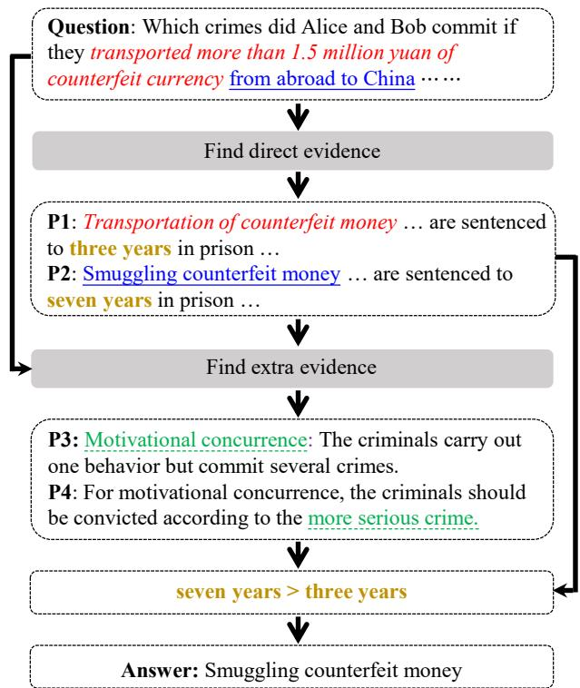
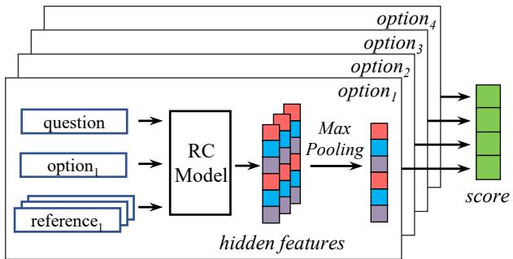

# JEC-QA: A Legal-Domain Question Answering Dataset

Haoxi Zhong,∗1 Chaojun Xiao,∗1 Cunchao Tu,1 Tianyang Zhang,2 Zhiyuan $\mathbf { L i u } ^ { \dag 1 }$ , Maosong Sun1

1Department of Computer Science and Technology Institute for Artificial Intelligence, Tsinghua University, Beijing, China Beijing National Research Center for Information Science and Technology, China 2Beijing Powerlaw Intelligent Technology Co., Ltd., China zhonghaoxi $@$ yeah.net, {xcjthu,tucunchao} $@$ gmail.com, zty $@$ powerlaw.ai, $\{ \mathrm { l z y } , \mathrm { s m s } \} @$ tsinghua.edu.cn

# Abstract

We present JEC-QA, the largest question answering dataset in the legal domain, collected from the National Judicial Examination of China. The examination is a comprehensive evaluation of professional skills for legal practitioners. College students are required to pass the examination to be certified as a lawyer or a judge. The dataset is challenging for existing question answering methods, because both retrieving relevant materials and answering questions require the ability of logic reasoning. Due to the high demand of multiple reasoning abilities to answer legal questions, the state-of-the-art models can only achieve about $2 8 \%$ accuracy on JEC-QA, while skilled humans and unskilled humans can reach $8 1 \%$ and $6 4 \%$ accuracy respectively, which indicates a huge gap between humans and machines on this task. We will release JEC-QA and our baselines to help improve the reasoning ability of machine comprehension models. You can access the dataset from http://jecqa.thunlp.org/.

# Introduction

Legal Question Answering (LQA) aims to provide explanations, advice or solutions for legal issues. A qualified LQA system can not only provide a professional consulting service for unskilled humans but also help professionals to improve work efficiency and analyze real cases more accurately, which makes LQA an important NLP application in the legal domain. Recently, many researchers attempt to build LQA systems with machine learning techniques (Fawei et al. 2018) and neural network (Do et al. 2017). Despite these efforts in employing advanced NLP models, LQA is still confronted with the following two major challenges. The first is that there is less qualified LQA dataset which limits the research. The second is that the cases and questions in the legal domain are very complex and rigorous. As shown in Table 1, most questions in LQA can be divided into two typical types: the knowledge-driven questions (KD-questions) and case-analysis questions (CAquestions). KD-questions focus on the understanding of specific legal concepts, while CA-questions concentrate more on the analysis of real cases. Both types of questions require

#

Knowledge-Driven Question: Which of the following belong to the “property” of Civil Law?

$\times \mathrm { ~ A ~ }$ . Trademark. $\times \textbf { B }$ . The star on the sky.   
$\times \mathbf { C }$ . Gold teeth. $\checkmark$ D. Fish in the pond.

Case-Analysis Question: Alice owed Bob 3,000 yuan. Alice proposed to pay back with 10,000 yuan of counterfeit money. Bob agreed and accepted it. Which crimes did Alice commit?

#

X A. Crime of selling counterfeit money.   
$\times \textbf { B }$ . Crime of using counterfeit money.   
$\times \mathbf { C }$ . Crime of embezzlement.   
$\times \textrm { D }$ . Alice did not constitute a crime.

Table 1: Two typical examples of KD-questions and CAquestions in LQA. All examples we show in the paper are translated from Chinese for illustration.

sophisticated reasoning ability and text comprehension ability, which makes LQA a hard task in NLP.

To push forward the development of LQA, we present JEC-QA in this paper, the largest and more challenging LQA dataset. JEC-QA collects questions from the National Judicial Examination of China (NJEC) and websites for the examination. NJEC is the legal professional certification examination for those who want to be a lawyer or a judge in China. Every year, only around $1 0 \%$ of participants can pass the exam, proving it difficult even for skilled humans.

There are three main properties of JEC-QA: (1) JECQA contains 26,365 multiple-choice questions in total, with four options for each question. The number of questions in JEC-QA is 50 times larger than the previous largest LQA dataset (Kim et al. 2016). (2) JEC-QA provides a database including all the legal knowledge required by the examination. The database is collected from the National Unified Legal Professional Qualification Examination Counseling Book and Chinese legal provisions. (3) JEC-QA provides extra labels for questions, including the type of questions (KD-questions or CA-questions) and the reasoning abilities required by the questions. The meta information labeled by skilled humans will be useful for depth-analysis of LQA.

  
Figure 1: An illustration of the logic that a person answers a question in JEC-QA. P1 to P4 are 4 relevant paragraphs retrieved from the legal database. The first two are definitions of two crimes. The last two describe a legal concept and sentencing criterion.

JEC-QA can be addressed following the setting of OpenQA (Chen et al. 2017; Wang et al. 2018b; Wang et al. 2018c; Lin et al. 2018). That is, we need to retrieve relevant articles from the databases and apply reading comprehension models to answer questions. Distinct from existing question answering datasets (Yang, Yih, and Meek 2015; Richardson, Burges, and Renshaw 2013; Hermann et al. 2015; Rajpurkar et al. 2016; Trischler et al. 2016; Lai et al. 2017), JEC-QA requires multiple reasoning abilities to answer the questions including word matching, concept understanding, numerical analysis, multi-paragraph reading, and multi-hop reasoning. The detailed analysis can be found in the section of Reasoning Types.

To get a better understanding of these reasoning abilities, we show a question of JEC-QA in Fig. 1 describing a criminal behavior which results in two crimes. The models must understand “Motivational Concurrence” to reason out extra evidence rather than lexical-level semantic matching. Moreover, the models must have the ability of multi-paragraph reading and multi-hop reasoning to combine the direct evidence and the extra evidence to answer the question, while numerical analysis is also necessary for comparing which crime is more serious. We can see that answering one question will need multiple reasoning abilities in both retrieving and answering, makes JEC-QA a challenging task.

To investigate the challenges and characteristics of LQA, we design a unified OpenQA framework and implement seven representative neural methods of reading comprehension. By evaluating the performance of these methods on JEC-QA, we show that even the best method can only achieve about $2 5 \%$ and $2 9 \%$ on KD-questions and CAquestions respectively, while skilled humans and unskilled humans can reach $8 1 \%$ and $6 4 \%$ accuracies on JEC-QA. The experimental results show that existing OpenQA methods suffer from the inability of complex reasoning on JEC-QA as they cannot well understand legal concepts and handle multi-hop reasoning.

In summary, JEC-QA is the largest LQA dataset, and it is more challenging compared with existing datasets due to the requirements of multiple reasoning abilities and legal knowledge. JEC-QA will benefit the research of question answering and legal analysis. We also show the performance of existing methods, conduct an in-depth analysis of JEC-QA and outlook the future research direction. You can access the dataset from http://jecqa.thunlp.org/.

# Related Work

# Reading Comprehension

There have been numerous reading comprehension datasets proposed in recent years, such as CNN/DailyMail (Hermann et al. 2015), MCTest (Richardson, Burges, and Renshaw 2013), SQuAD (Rajpurkar et al. 2016), WikiQA (Yang, Yih, and Meek 2015) and NewsQA (Trischler et al. 2016). Deep reading comprehension models (Seo et al. 2017; Wang et al. 2017; Wang and Jiang 2016; Dhingra et al. 2017; Yih et al. 2015) have achieved promising results on these early datasets. Besides, recent works like TrivialQA (Joshi et al. 2017), MS-MARCO (Nguyen et al. 2016) and DuReader (He et al. 2018b) contain multiple passages for each question, while RACE (Lai et al. 2017), HotpotQA (Yang et al. 2018) and ARC (Clark et al. 2018) datasets require the ability of reasoning. Based on these datasets, researchers (Wang et al. 2018a; Wang et al. 2018b; Wang et al. 2018d; Clark and Gardner 2018) propose to aggregate information from all passages. These datasets take a step towards a more challenging reading comprehension task, but still have a limitation that the answers can be extracted from the passages directly with semantic matching. As a result, existing RC systems are still lack of reasoning ability and language understanding (Jia and Liang 2017).

# Open-domain Question Answering

OpenQA is first proposed by (Green Jr et al. 1961), which aims to answer questions with external knowledge bases, such as collected documents (Voorhees and others 1999), web-pages (Kwok, Etzioni, and Weld 2001; Chen and Van Durme 2017) or structured knowledge bases (Berant et al. 2013; Bordes et al. 2015; Yu et al. 2017).

Most OpenQA models contain two steps: reading material retrieval and answer extraction/selection (Chen et al. 2017; Dhingra et al. 2017; Cui et al. 2017). Without documentlevel annotations, they retrieve documents with unsupervised information retrieval methods, e.g., TF-IDF or BM25 retriever. However, these models focus on the lexical similarity between articles and questions rather than semantic relevance. Recent approaches (Lin et al. 2018; Wang et al. 2018c; Clark and Gardner 2018) tend to rerank passages retrieved in the first step and filter out noisy contents. Although these methods can surpass human performance in certain situations, they are still lack of reasoning ability (Rajpurkar, Jia, and Liang 2018).

# Legal Intelligence

Owing to the massive quantity of high-quality textual data in the legal domain, employing NLP techniques to solve legal intelligence problems has been more and more popular in recent years, e.g., generating court views to interpret charge results (Ye et al. 2018), retrieving relevant or similar cases (Chen, Liu, and Ho 2013; Raghav, Reddy, and Reddy 2016), predicting charges or identifying applicable articles (Luo et al. 2017; Hu et al. 2018; He et al. 2018a; Zhong et al. 2018; Xiao et al. 2018; Shen et al. 2018).

Meanwhile, answering legal questions has been a long-standing challenge for applications of legal intelligence. Kim et al.; Kim et al. (2016; 2018) held a legal question answering competition, where rule-based systems (Fawei et al. 2018) and neural models (Do et al. 2017) were applied to this task.

In spite of this, we are still far away from applicable LQA systems, due to the poor performance, reasoning ability, and interpretability. We collect JEC-QA from NJEC, which can serve as a good benchmark of the reasoning ability of legal domain question answering models.

# Dataset Construction and Analysis

# Dataset Construction

Questions. We collect 2, 700 multiple-choice questions from the 2009 to 2017 national judicial and 30, 371 practice exercises from websites. After removing duplicated questions, there are 26,365 questions in JEC-QA.

Table 2: The statistics of question types in JEC-QA.   

<table><tr><td></td><td>KD-questions</td><td>CA-questions</td><td>Total</td></tr><tr><td>Single</td><td>4, 603</td><td>8, 738</td><td>13, 341</td></tr><tr><td>Multi</td><td>5, 158</td><td>7, 866</td><td>13, 024</td></tr><tr><td>All</td><td>9,761</td><td>16, 604</td><td>26, 365</td></tr></table>

Each question in JEC-QA contains a question description and four candidate options. There are single-answer and multi-answer questions in JEC-QA. Meanwhile, we can also classify the questions into Knowledge-Driven Questions (KD-questions) and Case-Analysis Questions (CAquestions). KD-questions pay attention to the definition and interpretation of legal concepts, while CA-questions require analysis for the actual scenarios. Answering both types of questions requires reasoning ability. More detailed statistics of question types are summarized in Table 2.

Table 3: The statistics of questions, options, and reading paragraphs in JEC-QA.   

<table><tr><td></td><td>Questions</td><td>Options</td><td>Paragraphs</td></tr><tr><td>Count</td><td>26,365</td><td>105,460</td><td>79,433</td></tr><tr><td>Average Length</td><td>47.01</td><td>14.52</td><td>58.42</td></tr><tr><td>Max Length</td><td>547</td><td>153</td><td>2, 738</td></tr><tr><td>Vocab Size</td><td>29, 268</td><td>29, 987</td><td>47, 808</td></tr><tr><td>Total Vocab Size</td><td colspan="3">70,110</td></tr></table>

Database. As mentioned in introduction, all necessary knowledge for the examination is involved in the National Unified Legal Professional Qualification Examination Counseling Book and Chinese legal provisions. The book contains 15 topics and 215 chapters with highly hierarchically formed contents. To guarantee the retrieval quality, we convert this papery book into structured electronic edition manually instead of using OCR (Optical Character Recognition) tools. For Chinese legal provisions, we include 3, 382 different legal provisions in our database. The details of the database can be found in Table 3.

# Reasoning Types

We summarize 5 different reasoning types required for answering questions in JEC-QA from JEC-QA and previous works (Lai et al. 2017; Clark et al. 2018), and the examples are shown in Table 4.

(1) Word Matching. This is the simplest type of reasoning. The models only need to check which options are matched with the relevant paragraphs and the relevant paragraphs can be easily retrieved by simple search strategies as the contexts are highly consistent. Questions that require this type of reasoning are similar to the ones in traditional reading comprehension datasets.

(2) Concept Understanding. As our dataset is built on the legal domain, models need to understand legal concepts to answer these questions. As shown in the 2-nd example in Table 4, models need to understand the meanings of “principal offender” to choose the correct answer.

(3) Numerical Analysis. This type of reasoning requires models to perform arithmetic operations. As shown in the 3- rd example in Table 4, models must calculate $1 2 \times \frac { 1 } { 3 } = 4 < 5$ to answer it.

(4) Multi-Paragraph Reading. The settings for previous single-paragraph reading tasks guarantee that enough evidence can be found within one paragraph. However, as shown in the 4-th example in Table 4, specific questions in JEC-QA require reading multiple paragraphs to gather enough evidence, which makes JEC-QA more challenging compared to traditional reading comprehension tasks.

(5) Multi-Hop Reasoning. Multi-hop reasoning means that we need multiple steps of logical reasoning to get the answers. Multi-hop reasoning is common in our real lives, but it is hard for existing methods to provide an interpretable reasoning process. Here we show an example of multi-hop reasoning in Fig. 1. Answering this question need to make several steps of reasoning, including concept understanding, numerical analysis, and multi-paragraph reading. From Table 4, we observe that more than $6 6 \%$ CA-questions require multi-hop reasoning ability, which leads great challenges to existing reading comprehension models.

Table 4: Percentages and examples of questions in JEC-QA that require different types of reasoning. We only list one correct option in the table. One question may require multiple reasoning abilities so the sum of percentages is over $1 0 0 \%$ .   

<table><tr><td>Reasoning Type</td><td>KD-Q</td><td>CA-Q</td><td>All</td><td>Examples</td></tr><tr><td>Word Matching</td><td>65.9%</td><td>23.9%</td><td>40.5%</td><td>Question: Which option is a form of state compensation? Option: Monetary awards Paragraph: Monetary awards is a form of state compensation.</td></tr><tr><td>Concept Understanding</td><td>36.4%</td><td>42.8%</td><td>40.2%</td><td>Question: Who is the principal offender according to Criminal Law? Option: Bob, the leader of a robbery group, who ordered his subordinates to commit robbery on multiple occasions, but was never personally involved. Paragraph: The principal offender is the person in a group of offenders who leads, organizes, and carries out the main part of a criminal act.</td></tr><tr><td>Numerical Analysis</td><td>4.6%</td><td>14.9%</td><td>10.8%</td><td>Question: In which of the following circumstances should an extraordinary general meeting of shareholders be convened? Option: The registered capital of the company is 12 million yuan, and the unrecovered loss is 5 million. Paragraph: In the following circumstances, an extraordinary general meeting of shareholders should be convened: (1) When the unrecovered losses amount</td></tr><tr><td>Multi-Paragraph Read- 19.7% 29.4% 2 ing</td><td></td><td></td><td>25.5%</td><td>to one-third of the total paid-up share capital; .…. Question: Which statement is true about corporate crimes? Option: Corporates can be the subject of bank fraud. Paragraph 1: Article 200 of Criminal Law: The punishment of fraud offenses committed by corporates. If a corporate commits any crimes specified in arti- cles 192, 194, or 195 of this section, it shall be fined.</td></tr><tr><td>Multi-Hop Reasoning</td><td>8.33%</td><td>66.2%</td><td>43.2%</td><td>Paragraph 2: Article 194 of Criminal Law: Bank fraud... Shown in Fig. 1.</td></tr></table>

In conclusion, we summarize that all 5 types of reasoning above are essential for answering questions in JEC-QA and models need to handle these reasoning issues to achieve a promising performance in JEC-QA.

# Experiments

In this section, we conduct detailed experiments and analysis to investigate the performance of existing question answering models on JEC-QA. Following the settings of OpenQA, we first retrieve relevant paragraphs and then employ question answering models to give answers.

# Retrieve Strategy

To retrieve relevant materials from the database, we apply ElasticSearch1 to build a search engine containing the whole database. As the text materials are hierarchically structured, we store the contents into the search engine with metainformation, such as tags, chapter titles, and section titles. Because different options may focus on various aspects even within the same question, we need to retrieve reading paragraphs for each option separately.

To reduce noisy data and narrow the scope during retrieving, we need to identify the topic (e.g., constitution, criminal law) of the questions. There are 15 topics in total, and we employ 3 representative models, including BERT (Devlin et al. 2018), TextCNN (Kim 2014), and DPCNN (Johnson and

Zhang 2017). From 10, 008 labeled instances, we randomly select 1, 956 instances for testing and the rest for training. The performance of topic classification is shown in Table 5.   
Table 5: Accuracy $( \% )$ of topic classification.   

<table><tr><td>Method</td><td>Top-1</td><td>Top-2</td><td>Top-3</td></tr><tr><td>TextCNN</td><td>77.97</td><td>87.14</td><td>91.46</td></tr><tr><td>DPCNN</td><td>75.16</td><td>87.40</td><td>92.71</td></tr><tr><td>BERT</td><td>75.31</td><td>88.60</td><td>93.10</td></tr></table>

From the experimental results, we can see that the top-1 accuracy of topic classification is unsatisfactory, and the increment is little from top-2 to top-3 (only about $5 \%$ ). In order to reach a balance of performance and speed, we employ BERT as our topic classifier to select the top-2 relevant topics and retrieve $K$ most relevant reading paragraphs for each topic. Besides, we also retrieve $K$ extra reading paragraphs from Chinese legal provisions. In total, we retrieve $3 K$ paragraphs for each option. We choose $K = 6$ for experiments and we will discuss the reason in Comparative Analysis.

To evaluate the performance of our retrieve strategy, we randomly select 377 questions as Annotation Set for manual annotation and annotate each question with 3 labels, including (1) All Hit (AH): all relevant paragraphs are successfully fetched. (2) Partial Miss (PM): some relevant paragraphs are missing. (3) All Miss (AM): no relevant paragraphs exist in the fetched results.

The evaluation results are listed in Table 6. From this table, we observe that around $4 6 \%$ of the questions can be answered correctly based on retrieved materials. The hit rate of

<table><tr><td>Type</td><td>AH</td><td>PM</td><td>AM</td></tr><tr><td>All questions KD-questions CA-questions</td><td>45.69 59.55 38.76</td><td>35.77 28.09 39.61</td><td>18.54 12.36 21.63</td></tr><tr><td>Word Matching Concept Understanding Numerical Analysis Multi-Paragraph Reading Multi-Hop Reasoning</td><td>62.22 42.54 38.89 38.82 38.89</td><td>26.67 35.82 33.33 48.24 37.50</td><td>11.11 21.64 27.78 12.94 23.61</td></tr></table>

Table 6: Evaluation results $( \% )$ of the retrieval strategy.

KD-questions is significantly higher than CA-questions as KD-questions are usually related to specific concepts, which leads to easier retrieval. Among different types of reasoning, the performance in word-matching questions achieves the highest hit rate of $6 2 \%$ as the questions are highly consistent with reading paragraphs. The hit rates for other types achieve substantially lower scores due to the demand for sophisticated reasoning ability.

# Experiment Settings

We employ a controlled experimental setting to ensure a fair comparison among various question answering models. Moreover, we use fastText (Joulin et al. 2017) to pretrain word embeddings on a large-scale legal domain dataset (Xiao et al. 2018). For all models, the dimension of word embeddings is $w = 2 0 0$ and the hidden size of model layers is $d = 2 5 6$ .

As the original tasks of our baselines are various, we design a unified OpenQA framework for them. More specifically, the input for the framework is a triplet $( q , o , r )$ representing the question, options, and reading paragraphs fetched in the retrieving step. $q$ is a sequence of words $( q _ { 1 } , q _ { 2 } , \ldots , q _ { | q | } )$ . $o$ is a tuple of $n = 4$ word sequences expressed as $( ( \overbrace { o _ { 1 , 1 } } , o _ { 1 , 2 } , \ldots , o _ { 1 , | o _ { 1 } | } ) , \ldots , ( o _ { n , 1 } , \ldots , o _ { n , | o _ { n } | } ) )$ , corresponding to $n$ options. Suppose there are $\textit { m } = \ 1 8$ reading paragraphs for each option, then $r _ { i , j }$ denotes the $j$ -th reading paragraph for the $i$ -th option, i.e., $\begin{array} { r l } { r _ { i , j } } & { { } = } \end{array}$ $( r _ { i , j , 1 } , r _ { i , j , 2 } , . . . , r _ { i , j , | r _ { i , j } | } )$ , where $i \in [ 1 , n ]$ and $j \in [ \bar { 1 } , m ]$ .

For the output, we have two different tasks, i.e., answering single-answer questions and all questions. For single-answer questions, the models need to perform the single-label classification and output a score vector $s c o r e ^ { s i n \mathbf { \breve { g } } l e } \in \mathbb { R } ^ { n }$ for each question, denoting the probability of each option being correct. For all questions, the models need to output a score vector score $a l l$ of length $2 ^ { n } - 1$ for each question. Experimental results show that it’s slightly better than using a score vector with legnth $n$ . These values denote the probability of each possible combination of options.

Note that some models cannot be directly applied to our task, so we slightly modify them in the following steps:

(1) If the original model only takes the questions and the reading paragraphs as input without options, we apply the model on the concatenation of the question and each option, and obtain a score $s _ { i }$ for the $i$ -th option. Then the score vector is represented as $s c o r e ^ { s i n g l e } = [ s _ { 1 } , s _ { 2 } , . . . , s _ { n } ]$

  
Figure 2: The unified framework for models on JEC-QA.

(2) If the original model is designed to extract answers from reading paragraphs, we modify the output layer into a linear layer that outputs the score of the $i$ -th option, $s _ { i }$ .

(3) If the original model cannot be applied to multiparagraph reading task, we apply the model on each reading paragraph of each option separately and the model will output the hidden representation $h _ { i , j } ~ \in ~ \mathbb { R } ^ { d }$ for the $j$ - th reading paragraph of the $i$ -th option. We then employ max-pooling over all representations from the same option to obtain the hidden representation $h _ { i } ^ { \prime }$ for the $i$ -th option that we have $h _ { i } ^ { \prime } = [ h _ { i , 1 } ^ { \prime } , h _ { i , 2 } ^ { \prime } , \ldots , h _ { i , d } ^ { \prime } ]$ where $h _ { i , j } ^ { \prime } =$ $\operatorname* { m a x } \left( h _ { i , k , j } \mid \forall 1 \leq k \leq m \right)$ . Finally, we pass $h _ { i } ^ { \prime }$ through a linear layer to obtain the score $s _ { i }$ for the $i$ -th option.

(4) We add a linear layer with input score $s i n g l e$ to obtain scoreall for answering all questions.

Besides, we adopt BertAdam (Devlin et al. 2018) for Bert and Adam (Kingma and Ba 2015) for all other models. Meanwhile, for all experiments, we randomly select $2 0 \%$ of the data as the test dataset. You can get more details from the website of the dataset.

# Baselines

We implement 7 representative reading comprehension and question answering models as our baselines, including:

Co-matching (Wang et al. 2018a) achieves promising result on the RACE dataset (Lai et al. 2017). The model matches reading paragraphs with questions and options with attention mechanism and uses the attention values to score options. This is a single-paragraph reading comprehension model for single-answer questions.

BERT (Devlin et al. 2018) is the model which contains multiple bidirectional Transformer (Vaswani et al. 2017) layers and has been fully pre-trained on large scaled datasets. As a single-paragraph reading comprehension model, BERT achieves state-of-the-art performance in most reading comprehension datasets including SQUAD (Rajpurkar et al. 2016). We employ the base form of BERT pre-trained on Chinese documents in our experiments.

SeaReader (Zhang et al. 2018) is proposed to answer questions in clinical medicine using knowledge extracted from publications in the medical domain. The model extracts information with question-centric attention, document-centric attention, and cross-document attention, and then uses a gated layer for denoising.

<table><tr><td></td><td colspan="2">KD-questions</td><td colspan="2">CA-questions</td><td colspan="2">All</td></tr><tr><td></td><td>Single</td><td>All</td><td>Single</td><td>All</td><td>Single</td><td>All</td></tr><tr><td>Unskilled Humans Skilled Humans</td><td>76.92</td><td>71.11</td><td>62.50</td><td>58.00</td><td>70.00</td><td>64.21</td></tr><tr><td></td><td>80.64</td><td>77.46</td><td>86.84</td><td>84.72</td><td>84.06</td><td>81.12</td></tr><tr><td>Co-matching (Wang et al. 2018a)</td><td>39.62</td><td>25.37</td><td>48.91</td><td>28.61</td><td>46.47</td><td>26.06</td></tr><tr><td>BERT (Devlin et al. 2018)</td><td>38.05</td><td>21.13</td><td>38.89</td><td>23.72</td><td>39.56</td><td>22.51</td></tr><tr><td>SeaReader (Zhang et al. 2018)</td><td>39.29</td><td>24.11</td><td>45.32</td><td>26.01</td><td>40.50</td><td>23.77</td></tr><tr><td>Multi-Matching (Tang, Cai, and Zhuo 2019)</td><td>41.96</td><td>23.63</td><td>46.18</td><td>29.06</td><td>42.98</td><td>28.63</td></tr><tr><td>CSA (Chen et al. 2019)</td><td>32.44</td><td>-</td><td>34.76</td><td></td><td>21.03</td><td>-</td></tr><tr><td>CBM (Clark and Gardner 2018)</td><td>40.35</td><td>22.54</td><td>37.37</td><td>22.50</td><td>38.69</td><td>22.53</td></tr><tr><td>DSQA (Lin et al. 2018)</td><td>34.15</td><td>18.41</td><td>42.72</td><td>23.25</td><td>42.63</td><td>22.69</td></tr></table>

Table 7: Evaluation results (accuracy $\%$ ) of different models on JEC-QA. Results marked “-” indicates that the model cannot converge within 256 epochs.

Multi-Matching (Tang, Cai, and Zhuo 2019) employs Evidence-Answer Matching and Question-Passage-Answer Matching module to form matching information, and merges them together to obtain the scores of candidate answers.

Convolutional Spatial Attention (CSA) (Chen et al. 2019) first generates enriched representations of passages, candidate answers, and questions with attention mechanism, and then applies CNN-MaxPooling operation to summarize adjacent attention information.

Confidence-based Model (CBM) (Clark and Gardner 2018) is a simple and effective method for multi-paragraph reading comprehension task. They propose a pipeline method for single-paragraph reading comprehension and apply a confidence-based method to adapt the model to the multi-paragraph setting.

Distantly Supervised Question Answering (DSQA) (Lin et al. 2018) is an effective method for open-domain question answering, which decomposes the QA process into three steps: filter out noisy documents, extract correct answers and select the best answer.

# Experimental Results

We evaluate the performance of all models on JEC-QA, with settings of single-answer question and all question answering. Besides, we also evaluate the performance in KDquestions and CA-questions separately. In addition, we evaluate the performance of skilled and unskilled humans. Humans read the same paragraphs fetched by the search strategy as models do. Unskilled humans are those who do not have legal experience while skilled humans are those in legal professions. The experimental results are shown in Table 7.

From these results, we observe that even the bestperformed model can only achieve an accuracy of $2 8 . 6 3 \%$ on all questions, while there is still a huge gap to $6 4 \%$ accuracy for unskilled humans. We should note that unskilled humans read the same reading materials as models and they have no advanced knowledge about legal questions, so the gap mainly comes from the insufficiency of model reasoning ability. Meanwhile, compared with skilled humans, unskilled humans perform significantly worse than skilled humans on CA-questions. The reason is that retrieved reading paragraphs are insufficient to provide enough evidence, as shown in Table 6, so the gap between unskilled and skilled humans mainly comes from the quality of retrieval.

Table 8: Performance of Co-matching on different questions.   

<table><tr><td rowspan=1 colspan=1></td><td rowspan=1 colspan=1>KD-Q</td><td rowspan=1 colspan=1>CA-Q</td><td rowspan=1 colspan=1>All</td></tr><tr><td rowspan=2 colspan=1>Word MatchingConcept UnderstandingNumerical AnalysisMulti-Paragraph ReadingMulti-Hop Reasoning</td><td rowspan=2 colspan=1>20.2030.3516.6723.3325.00</td><td rowspan=1 colspan=1>28.00</td><td rowspan=1 colspan=1>31.91</td></tr><tr><td rowspan=1 colspan=1>20.8325.7119.4418.62</td><td rowspan=1 colspan=1>28.2430.0030.5130.30</td></tr><tr><td rowspan=1 colspan=1>All HitPartial MissAll Miss</td><td rowspan=1 colspan=1>22.3429.7321.05</td><td rowspan=1 colspan=1>24.4724.0016.36</td><td rowspan=1 colspan=1>31.7126.7629.79</td></tr></table>

Comparing the performance between KD-questions and CA-questions, we reveal that most models achieve better performance on CA-questions. Although a higher proportion of CA-questions require multi-hop reasoning ability, the concepts in CA-questions are always simpler ones, e.g., robbery, theft, or murder. The results also demonstrate that existing methods performs poorly in concept comprehension.

# Comparative Analysis

We also perform a deeper analysis on the well-performed Co-matching by evaluating it on Annotation Set and the experimental results are listed in Table 8. From the results we can see that existing methods can only answer about $3 2 \%$ of questions correctly even when there is enough evidence in reading paragraphs, which means that the models cannot understand the reading materials at all. Moreover, we can see that the model performs extremely bad on multi-paragraph reading and multi-hop reasoning questions of CA-questions. It means existing models cannot do multi-paragraph reading and multi-hop reasoning on real cases properly.

Besides, we also perform experiments with different value of $K$ on single KD-questions, and the experimental results are shown in Table 9. From the results, we can see that more reading paragraphs cannot help the models to answer the questions better, as important articles have already been fetched even $K$ is small. It proves that the bad performance of models is because the insufficiency of reasoning ability rather than the quality of retrieval. As a larger value of $K$ cannot help with the accuracy, we select $K = 6$ to reach a balance of speed and performance.

Table 9: Performance of Co-matching with different $K$ .   

<table><tr><td>K =</td><td>1</td><td>3</td><td>6</td><td>12</td><td></td><td>18 | 24</td></tr><tr><td>Accuracy</td><td>30.1</td><td>37.9</td><td>39.6</td><td>40.7</td><td></td><td>40.7 | 40.7</td></tr></table>

of reading comprehension and QA models, and also making advances for legal question answering.

In the future, we will explore how to improve the reasoning ability of question answering model and integrate legal knowledge into question answering, which are necessary for answering questions in JEC-QA.

# Acknowledgements

This work is supported by the National Key Research and Development Program of China (No. 2018YFC0831900) and the National Natural Science Foundation of China (NSFC No. 61572273, 61661146007).

# Case Study

As shown in Table 10, we select an example to give an intuitive illustration on dealing with multi-hop reasoning. For most reading comprehension models, they choose all the options as their answers. Even without reading the statement, we can find that the option D conflicts with the other three options. Existing methods cannot handle conflicting options. Moreover, if we ignore option D, these models still choose all the remaining options, while the correct answer only contains option C. The models can easily find the evidence of option A, B, C from the statement with one-hop reasoning. However, if we read the related paragraphs, we will find the fact that Bob is under the age of 16, which will filter out the options A and B. We can learn that existing reading comprehension models already have the ability of one-hop reasoning, but multi-hop reasoning is still challenging for them.

Table 10: A multi-hop reasoning example.   

<table><tr><td>Question: Bob is a male born on February 27, 1987. Bob stole from Alice a total of 5, 000 yuan in cash, one laptop (worth 13, 000 yuan), and other small jewelry on February 27, 2003. While Bob was climbing back over the wall, Bob was seen by Catherine. To escape, Bob quickly took a dag- ger from his pocket and stabbed in Catherine&#x27;s heart, killing Catherine. So how should Bob&#x27;s behavior be handled?</td></tr><tr><td>Options: × (A). The crime of robbery. × (B). The crime of theft. ✓ (C). The ground of intentional homicide. × (D). Bob does not constitute a crime.</td></tr><tr><td>Paragraphs: 1. A person who has reached the age of 14 and under 16 will not constitute the crime of robbery and theft. 2. Calculation of age. .. For example, you are 14 years old from the next day after your 14-th birthday.</td></tr></table>

# Conclusion

In this work, we present JEC-QA as a new and challenging dataset for LQA, and JEC-QA is the largest dataset in LQA. Both retrieving documents and answering questions in JEC-QA require multiple types of reasoning ability, and our experimental results show that existing state-of-the-art models cannot perform well on JEC-QA. We hope our JEC-QA can benefit researchers on improving the reasoning ability

# References

[Berant et al. 2013] Berant, J.; Chou, A.; Frostig, R.; and Liang, P. 2013. Semantic parsing on freebase from question-answer pairs. In Proceedings of EMNLP.   
[Bordes et al. 2015] Bordes, A.; Usunier, N.; Chopra, S.; and Weston, J. 2015. Large-scale simple question answering with memory networks. arXiv preprint arXiv:1506.02075.   
[Chen and Van Durme 2017] Chen, T., and Van Durme, B. 2017. Discriminative information retrieval for question answering sentence selection. In Proceedings of EACL.   
[Chen et al. 2017] Chen, D.; Fisch, A.; Weston, J.; and Bordes, A. 2017. Reading wikipedia to answer open-domain questions. In Proceedings of ACL.   
[Chen et al. 2019] Chen, Z.; Cui, Y.; Ma, W.; Wang, S.; and Hu, G. 2019. Convolutional spatial attention model for reading comprehension with multiple-choice questions. In Proceedings of AAAI. [Chen, Liu, and Ho 2013] Chen, Y.-L.; Liu, Y.-H.; and Ho, W.-L. 2013. A text mining approach to assist the general public in the retrieval of legal documents. Journal of ASIS&T 64(2):280–290. [Clark and Gardner 2018] Clark, C., and Gardner, M. 2018. Simple and effective multi-paragraph reading comprehension. In Proceedings of ACL.   
[Clark et al. 2018] Clark, P.; Cowhey, I.; Etzioni, O.; Khot, T.; Sabharwal, A.; Schoenick, C.; and Tafjord, O. 2018. Think you have solved question answering? try arc, the ai2 reasoning challenge. arXiv preprint arXiv:1803.05457.   
[Cui et al. 2017] Cui, Y.; Chen, Z.; Wei, S.; Wang, S.; Liu, T.; and Hu, G. 2017. Attention-over-attention neural networks for reading comprehension. In Proceedings of ACL.   
[Devlin et al. 2018] Devlin, J.; Chang, M.-W.; Lee, K.; and Toutanova, K. 2018. Bert: Pre-training of deep bidirectional transformers for language understanding. arXiv preprint arXiv:1810.04805.   
[Dhingra et al. 2017] Dhingra, B.; Liu, H.; Yang, Z.; Cohen, W. W.; and Salakhutdinov, R. 2017. Gated-attention readers for text comprehension. In Proceedings of ACL.   
[Do et al. 2017] Do, P.-K.; Nguyen, H.-T.; Tran, C.-X.; Nguyen, M.-T.; and Nguyen, M.-L. 2017. Legal question answering using ranking svm and deep convolutional neural network. arXiv preprint arXiv:1703.05320.   
[Fawei et al. 2018] Fawei, B.; Pan, J. Z.; Kollingbaum, M.; and Wyner, A. Z. 2018. A methodology for a criminal law and procedure ontology for legal question answering. In Proceedings of JIST.   
[Green Jr et al. 1961] Green Jr, B. F.; Wolf, A. K.; Chomsky, C.; and Laughery, K. 1961. Baseball: an automatic question-answerer. In Proceedings of IRE-AIEE-ACM. [He et al. 2018a] He, C.; Peng, L.; Le, Y.; and He, J. 2018a. Secaps: A sequence enhanced capsule model for charge prediction. arXiv preprint arXiv:1810.04465.   
[He et al. 2018b] He, W.; Liu, K.; Liu, J.; Lyu, Y.; Zhao, S.; Xiao, X.; Liu, Y.; Wang, Y.; Wu, H.; She, Q.; et al. 2018b. Dureader: a chinese machine reading comprehension dataset from real-world applications. In Proceedings of ACL workshop.   
[Hermann et al. 2015] Hermann, K. M.; Kocisky, T.; Grefenstette, E.; Espeholt, L.; Kay, W.; Suleyman, M.; and Blunsom, P. 2015. Teaching machines to read and comprehend. In Proceedings of NIPS.   
[Hu et al. 2018] Hu, Z.; Li, X.; Tu, C.; Liu, Z.; and Sun, M. 2018. Few-shot charge prediction with discriminative legal attributes. In Proceedings of COLING.   
[Jia and Liang 2017] Jia, R., and Liang, P. 2017. Adversarial examples for evaluating reading comprehension systems. In Proceedings of EMNLP.   
[Johnson and Zhang 2017] Johnson, R., and Zhang, T. 2017. Deep pyramid convolutional neural networks for text categorization. In Proceedings of ACL.   
[Joshi et al. 2017] Joshi, M.; Choi, E.; Weld, D. S.; and Zettlemoyer, L. 2017. Triviaqa: A large scale distantly supervised challenge dataset for reading comprehension. arXiv preprint arXiv:1705.03551.   
[Joulin et al. 2017] Joulin, A.; Grave, E.; Bojanowski, P.; Douze, M.; Jegou, H.; and Mikolov, T. 2017. Fasttext. zip: Compressing ´ text classification models. In Proceedings of ICLR.   
[Kim et al. 2016] Kim, M.-Y.; Goebel, R.; Kano, Y.; and Satoh, K. 2016. Coliee-2016: evaluation of the competition on legal information extraction and entailment. In Proceedings of JURISIN. [Kim et al. 2018] Kim, M.-Y.; Lu, Y.; Rabelo, J.; and Goebel, R. 2018. Coliee-2018: Evaluation of the competition on case law information extraction and entailment.   
[Kim 2014] Kim, Y. 2014. Convolutional neural networks for sentence classification. In Proceedings of EMNLP.   
[Kingma and Ba 2015] Kingma, D., and Ba, J. 2015. Adam: A method for stochastic optimization. In Proceedings of ICLR. [Kwok, Etzioni, and Weld 2001] Kwok, C.; Etzioni, O.; and Weld, D. S. 2001. Scaling question answering to the web. ACM Transactions on Information Systems.   
[Lai et al. 2017] Lai, G.; Xie, Q.; Liu, H.; Yang, Y.; and Hovy, E. 2017. RACE: Large-scale reading comprehension dataset from examinations. In Proceedings of EMNLP.   
[Lin et al. 2018] Lin, Y.; Ji, H.; Liu, Z.; and Sun, M. 2018. Denoising distantly supervised open-domain question answering. In Proceedings of ACL.   
[Luo et al. 2017] Luo, B.; Feng, Y.; Xu, J.; Zhang, X.; and Zhao, D. 2017. Learning to predict charges for criminal cases with legal basis. In Proceedings of EMNLP.   
[Nguyen et al. 2016] Nguyen, T.; Rosenberg, M.; Song, X.; Gao, J.; Tiwary, S.; Majumder, R.; and Deng, L. 2016. Ms marco: A human generated machine reading comprehension dataset. arXiv preprint arXiv:1611.09268.   
[Raghav, Reddy, and Reddy 2016] Raghav, K.; Reddy, P. K.; and Reddy, V. B. 2016. Analyzing the extraction of relevant legal judgments using paragraph-level and citation information. In Proceedings of ECAI.   
[Rajpurkar et al. 2016] Rajpurkar, P.; Zhang, J.; Lopyrev, K.; and Liang, P. 2016. Squad: $^ { 1 0 0 , 0 0 0 + }$ questions for machine comprehension of text. In Proceedings of EMNLP. [Rajpurkar, Jia, and Liang 2018] Rajpurkar, P.; Jia, R.; and Liang, P. 2018. Know what you don’t know: Unanswerable questions for squad. In Proceedings of ACL.   
[Richardson, Burges, and Renshaw 2013] Richardson, M.; Burges, C. J.; and Renshaw, E. 2013. Mctest: A challenge dataset for the open-domain machine comprehension of text. In Proceedings of EMNLP.   
[Seo et al. 2017] Seo, M.; Kembhavi, A.; Farhadi, A.; and Hajishirzi, H. 2017. Bidirectional attention flow for machine comprehension. In Proceedings of ICLR.   
[Shen et al. 2018] Shen, Y.; Sun, J.; Li, X.; Zhang, L.; Li, Y.; and Shen, X. 2018. Legal article-aware end-to-end memory network for charge prediction. In Proceedings of ICCSE.   
[Tang, Cai, and Zhuo 2019] Tang, M.; Cai, J.; and Zhuo, H. H. 2019. Multi-matching network for multiple choice reading comprehension. In Proceedings of AAAI.   
[Trischler et al. 2016] Trischler, A.; Wang, T.; Yuan, X.; Harris, J.; Sordoni, A.; Bachman, P.; and Suleman, K. 2016. Newsqa: A machine comprehension dataset. arXiv preprint arXiv:1611.09830. [Vaswani et al. 2017] Vaswani, A.; Shazeer, N.; Parmar, N.; Uszkoreit, J.; Jones, L.; Gomez, A. N.; Kaiser, Ł.; and Polosukhin, I. 2017. Attention is all you need. In Proceedings of NIPS.   
[Voorhees and others 1999] Voorhees, E. M., et al. 1999. The trec-8 question answering track report. In Proceedings of Trec.   
[Wang and Jiang 2016] Wang, S., and Jiang, J. 2016. Machine comprehension using match-lstm and answer pointer. arXiv preprint arXiv:1608.07905.   
[Wang et al. 2017] Wang, W.; Yang, N.; Wei, F.; Chang, B.; and Zhou, M. 2017. Gated self-matching networks for reading comprehension and question answering. In Proceedings of ACL. [Wang et al. 2018a] Wang, S.; Yu, M.; Chang, S.; and Jiang, J. 2018a. A co-matching model for multi-choice reading comprehension. In Proceedings of ACL.   
[Wang et al. 2018b] Wang, S.; Yu, M.; Guo, X.; Wang, Z.; Klinger, T.; Zhang, W.; Chang, S.; Tesauro, G.; Zhou, B.; and Jiang, J. 2018b. $\mathbb { R } ^ { \breve { 3 } }$ : Reinforced reader-ranker for open-domain question answering. In Proceedings of AAAI.   
[Wang et al. 2018c] Wang, S.; Yu, M.; Jiang, J.; Zhang, W.; Guo, X.; Chang, S.; Wang, Z.; Klinger, T.; Tesauro, G.; and Campbell, M. 2018c. Evidence aggregation for answer re-ranking in opendomain question answering. In Proceedings of ICLR.   
[Wang et al. 2018d] Wang, Y.; Liu, K.; Liu, J.; He, W.; Lyu, Y.; Wu, H.; Li, S.; and Wang, H. 2018d. Multi-passage machine reading comprehension with cross-passage answer verification. In Proceedings of ACL.   
[Xiao et al. 2018] Xiao, C.; Zhong, H.; Guo, Z.; Tu, C.; Liu, Z.; Sun, M.; Feng, Y.; Han, X.; Hu, Z.; Wang, H.; et al. 2018. Cail2018: A large-scale legal dataset for judgment prediction. arXiv preprint arXiv:1807.02478.   
[Yang et al. 2018] Yang, Z.; Qi, P.; Zhang, S.; Bengio, Y.; Cohen, W.; Salakhutdinov, R.; and Manning, C. D. 2018. Hotpotqa: A dataset for diverse, explainable multi-hop question answering. In Proceedings of EMNLP.   
[Yang, Yih, and Meek 2015] Yang, Y.; Yih, W.-t.; and Meek, C. 2015. Wikiqa: A challenge dataset for open-domain question answering. In Proceedings of EMNLP.   
[Ye et al. 2018] Ye, H.; Jiang, X.; Luo, Z.; and Chao, W. 2018. Interpretable charge predictions for criminal cases: Learning to generate court views from fact descriptions. In Proceedings of NAACL. [Yih et al. 2015] Yih, W.-t.; Chang, M.-W.; He, X.; and Gao, J. 2015. Semantic parsing via staged query graph generation: Question answering with knowledge base. In Proceedings of ACL. [Yu et al. 2017] Yu, M.; Yin, W.; Hasan, K. S.; Santos, C. d.; Xiang, B.; and Zhou, B. 2017. Improved neural relation detection for knowledge base question answering. In Proceedings of ACL. [Zhang et al. 2018] Zhang, X.; Wu, J.; He, Z.; Liu, X.; and Su, Y. 2018. Medical exam question answering with large-scale reading comprehension. In Proceedings of AAAI.   
[Zhong et al. 2018] Zhong, H.; Zhipeng, G.; Tu, C.; Xiao, C.; Liu, Z.; and Sun, M. 2018. Legal judgment prediction via topological learning. In Proceedings of EMNLP.