# Evaluation of Text Generation: A Survey

Asli Celikyilmaz Facebook AI Research

Elizabeth Clark University of Washington

eaclark7@cs.washington.edu

Jianfeng Gao Microsoft Research

jfgao@microsoft.com

# Abstract

The paper surveys evaluation methods of natural language generation (NLG) systems that have been developed in the last few years. We group NLG evaluation methods into three categories: (1) human-centric evaluation metrics, (2) automatic metrics that require no training, and (3) machine-learned metrics. For each category, we discuss the progress that has been made and the challenges still being faced, with a focus on the evaluation of recently proposed NLG tasks and neural NLG models. We then present two examples for task-specific NLG evaluations for automatic text summarization and long text generation, and conclude the paper by proposing future research directions.1

# 1. Introduction

Natural language generation (NLG), a sub-field of natural language processing (NLP), deals with building software systems that can produce coherent and readable text (Reiter & Dale, 2000a) NLG is commonly considered a general term which encompasses a wide range of tasks that take a form of input (e.g., a structured input like a dataset or a table, a natural language prompt or even an image) and output a sequence of text that is coherent and understandable by humans. Hence, the field of NLG can be applied to a broad range of NLP tasks, such as generating responses to user questions in a chatbot, translating a sentence or a document from one language into another, offering suggestions to help write a story, or generating summaries of time-intensive data analysis.

The evaluation of NLG model output is challenging mainly because many NLG tasks are open-ended. For example, a dialog system can generate multiple plausible responses for the same user input. A document can be summarized in different ways. Therefore, human evaluation remains the gold standard for almost all NLG tasks. However, human evaluation is expensive, and researchers often resort to automatic metrics for quantifying day-to-day progress and for performing automatic system optimization. Recent advancements in deep learning have yielded tremendous improvements in many NLP tasks. This, in turn, presents a need for evaluating these deep neural network (DNN) models for NLG.

Celikyilmaz, Clark, & Gao

In this paper we provide a comprehensive survey of NLG evaluation methods with a focus on evaluating neural NLG systems. We group evaluation methods into three categories: (1) human-centric evaluation metrics, (2) automatic metrics that require no training, and (3) machine-learned metrics. For each category, we discuss the progress that has been made, the challenges still being faced, and proposals for new directions in NLG evaluation.

# 1.1 Evolution of Natural Language Generation

NLG is defined as the task of building software systems that can write (e.g., producing explanations, summaries, narratives, etc.) in English and other human languages2. Just as people communicate ideas through writing or speech, NLG systems are designed to produce natural language text or speech that conveys ideas to its readers in a clear and useful way. NLG systems have been used to generate text for many real-world applications, such as generating weather forecasts, carrying interactive conversations with humans in spoken dialog systems (chatbots), captioning images or visual scenes, translating text from one language to another, and generating stories and news articles.

NLG techniques range from simple template-based systems that generate natural language text using rules to machine-learned systems that have a complex understanding of human grammar3. The first generation of automatic NLG systems uses rule-based or datadriven pipeline methods. In their book, Reiter & Dale (2000b) presented a classical threestage NLG architecture. The first stage is document planning, which determines the content and its order and generates a text plan outlining the structure of messages. The second is the micro-planning stage, when referring expressions that identify objects like entities or places are generated, along with the choice of words to be used and how they are aggregated. Collating similar sentences to improve readability with a natural flow also occurs in this stage. The last stage is realization, in which the actual text is generated, using linguistic knowledge about morphology, syntax, semantics, etc. Earlier work has focused on modeling discourse structures and learning representations of relations between text units for text generation (McKeown, 1985; Marcu, 1997; Ono et al., 1994; Stede & Umbach, 1998), for example using Rhetorical Structure Theory (Mann & Thompson, 1987) or Segmented Discourse Representation Theory (Asher & Lascarides, 2003). There is a large body of work that is based on template-based models and has used statistical methods to improve generation by introducing new methods such as sentence compression, reordering, lexical paraphrasing, and syntactic transformation, to name a few (Sporleder, 2005; Steinberger, 2006; Knight, 2000; Clarke & Lapata, 2008; Quirk et al., 2004).

These earlier text generation approaches and their extensions play an important role in the evolution of NLG research. Following this earlier work, an important direction that several NLG researchers have focused on is data-driven representation learning, which has gained attention with the availability of more data sources. Availability of large datasets, treebanks, corpora of referring expressions, as well as shared tasks have been beneficial in the progress of several NLG tasks today (Gkatzia et al., 2015; Gatt et al., 2007; Mairesse et al., 2010; Konstas & Lapata, 2013; Konstas & Lapara, 2012).

The last decade has witnessed a paradigm shift towards learning representations from large textual corpora in an unsupervised manner using deep neural network (DNN) models. Recent NLG models are built by training DNN models, typically on very large corpora of human-written texts. The paradigm shift starts with the use of recurrent neural networks (Graves, 2013) (e.g., long short-term memory networks (LSTM) (Hochreiter & Schmidhuber, 1997), gated recurrent units (GRUs) (Cho et al., 2014), etc.) for learning language representations, and later sequence-to-sequence learning (Sutskever et al., 2014), which opens up a new chapter characterised by the wide application of the encoder-decoder architecture. Although sequence-to-sequence models were originally developed for machine translation, they were soon shown to improve performance across many NLG tasks. These models’ weakness of capturing long-span dependencies in long word sequences motivated the development of attention networks (Bahdanau et al., 2015) and pointer networks (Vinyals et al., 2015). The Transformer architecture (Vaswani et al., 2017), which incorporates an encoder and a decoder, both implemented using the self-attention mechanism, is being adopted by new state-of-the-art NLG systems. There has been a large body of research in recent years that focuses on improving the performance of NLG using large-scale pre-trained language models for contextual word embeddings (Peters et al., 2018; Devlin et al., 2018; Sun et al., 2019; Dong et al., 2019), using better sampling methods to reduce degeneration in decoding (Zellers et al., 2019; Holtzman et al., 2020), and learning to generate tex t with better discourse structures and narrative flow (Yao et al., 2018; Fan et al., 2019b; Dathathri et al., 2020; Rashkin et al., 2020).

Neural models have been applied to many NLG tasks, which we will discuss in this paper, including:

• summarization: common tasks include single or multi-document tasks, query-focused or generic summarization, and summarization of news, meetings, screen-plays, social blogs, etc.   
• machine translation: sentence- or document-level.   
• dialog response generation: goal-oriented or chit-chat dialog.   
• paraphrasing   
• question generation   
• long text generation: most common tasks are story, news, or poem generation.   
• data-to-text generation: e.g., table summarization.   
• caption generation from non-textual input: input can be tables, images, or sequences of video frames (e.g., in visual storytelling), to name a few.

# 1.2 Why a Survey on Evaluation of Natural Language Generation

Text generation is a key component of language translation, chatbots, question answering, summarization, and several other applications that people interact with everyday. Building language models using traditional approaches is a complicated task that needs to take into account multiple aspects of language, including linguistic structure, grammar, word usage, and reasoning, and thus requires non-trivial data labeling efforts. Recently, Transformerbased neural language models have been shown to be very effective in leveraging large amounts of raw text corpora from online sources (such as Wikipedia, search results, blogs, Reddit posts, etc.). For example, one of most advanced neural language models, GPT-2/3 (Radford et al., 2019; Brown et al., 2020), can generate long texts that are almost indistinguishable from human-generated texts (Zellers et al., 2019; Brown et al., 2020). Empathetic social chatbots, such as XiaoIce (Zhou et al., 2020), seem to understand human dialog well and can generate interpersonal responses to establish long-term emotional connections with users.

Many NLG surveys have been published in the last few years (Gatt & Krahmer, 2018; Zhu et al., 2018; Zhang et al., 2019a). Others survey specific NLG tasks or NLG models, such as image captioning (Bernardi et al., 2016; Kilickaya et al., 2017; Hossain et al., 2018; Li et al., 2019; Bai & An, 2018), machine translation (Dabre et al., 2020; Han & Wong, 2016; Wong & Kit, 2019), summarization (Deriu et al., 2009; Shi et al., 2018), question generation (Pan et al., 2019), extractive key-phrase generation (Cano & Bojar, 2019), deep generative models (Pelsmaeker & Aziz, 2019; Kim et al., 2018), text-to-image synthesis (Agnese et al., 2020), and dialog response generation (Liu et al., 2016; Novikova et al., 2017; Deriu et al., 2019; Dusek et al., 2019; Gao et al., 2019), to name a few.

There are only a few published papers that review evaluation methods for specific NLG tasks, such as image captioning (Kilickaya et al., 2017), machine translation (Goutte, 2006), online review generation (Garbacea et al., 2019), interactive systems (Hastie & Belz, 2014a), and conversational dialog systems (Deriu et al., 2019), and for human-centric evaluations (Lee et al., 2019; Amidei et al., 2019b). The closest to our paper is the NLG survey paper of Gkatzia & Mahamood (2015), which includes a section on NLG evaluation metrics.

Different from this work, our survey is dedicated to NLG evaluation, with a focus on the evaluation metrics developed recently for neural text generation systems, and provides an in-depth analysis of existing metrics to-date. To the best of our knowledge, our paper is the most extensive and up-to-date survey on NLG evaluation.

# 1.3 Outline of The Survey

We review NLG evaluation methods in three categories in Sections 2-4:

• Human-Centric Evaluation. The most natural way to evaluate the quality of a text generator is to involve humans as judges. Naive or expert subjects are asked to rate or compare texts generated by different NLG systems or to perform a Turing test (Turing, 1950) to distinguish machine-generated texts from human-generated texts.

Some human evaluations may require the judging of task-specific criteria (e.g., evaluating that certain entity names appear correctly in the text, such as in health report summarization), while other human evaluation criteria can be generalized for most text generation tasks (e.g., evaluating the fluency or grammar of the generated text).

• Untrained Automatic Metrics. This category, also known as automatic metrics, is the most commonly used in the research community. These evaluation methods compare machine-generated texts to human-generated texts (reference texts) based on the same input data and use metrics that do not require machine learning but are simply based on string overlap, content overlap, string distance, or lexical diversity, such as $n$ -gram match and distributional similarity. For most NLG tasks, it is critical to select the right automatic metric that measures the aspects of the generated text that are consistent with the original design goals of the NLG system.

• Machine-Learned Metrics. These metrics are often based on machine-learned models, which are used to measure the similarity between two machine-generated texts or between machine-generated and human-generated texts. These models can be viewed as digital judges that simulate human judges. We investigate the differences among these evaluations and shed light on the potential factors that contribute to these differences.

To see how these evaluation methods are applied in practice, we look at the role NLG shared tasks have played in NLG model evaluation (Section 5) and at how evaluation metrics are applied in two NLG subfields (Section 6): automatic document summarization and longtext generation. Lastly, we conclude the paper with future research directions for NLG evaluation (Section 7).

# 2. Human-Centric Evaluation Methods

Whether a system is generating an answer to a user’s query, a justification for a classification model’s decision, or a short story, the ultimate goal in NLG is to generate text that is valuable to people. For this reason, human evaluations are typically viewed as the most important form of evaluation for NLG systems and are held as the gold standard when developing new automatic metrics. Since automatic metrics still fall short of replicating human decisions (Reiter & Belz, 2009; Krahmer & Theune, 2010; Reiter, 2018), many NLG papers include some form of human evaluation. For example, Hashimoto et al. (2019) report that 20 out of 26 generation papers published at ACL2018 presented human evaluation results.

While human evaluations give the best insight into how well a model performs in a task, it is worth noting that human evaluations also pose several challenges. First, human evaluations can be expensive and time-consuming to run, especially for the tasks that require extensive domain expertise. While online crowd-sourcing platforms such as Amazon Mechanical Turk have enabled researchers to run experiments on a larger scale at a lower cost, they come with their own problems, such as maintaining quality control (Ipeirotis et al., 2010; Mitra et al., 2015). Second, even with a large group of annotators, there are some dimensions of generated text quality that are not well-suited to human evaluations, such as diversity (Hashimoto et al., 2019). Thirdly, there is a lack of consistency in how human evaluations are run, which prevents researchers from reproducing experiments and comparing results across systems. This inconsistency in evaluation methods is made worse by inconsistent reporting on methods; details on how the human evaluations were run are often incomplete or vague. For example, Lee et al. (2021) find that in a sample of NLG papers from ACL and INLG, only 57% of papers report the number of participants in their human evaluations.

In this section, we describe common approaches researchers take when evaluating generated text using only human judgments, grouped into intrinsic (§2.1) and extrinsic (§2.2) evaluations (Belz & Reiter, 2006). However, there are other ways to incorporate human subjects into the evaluation process, such as training models on human judgments, which will be discussed in Section 4.

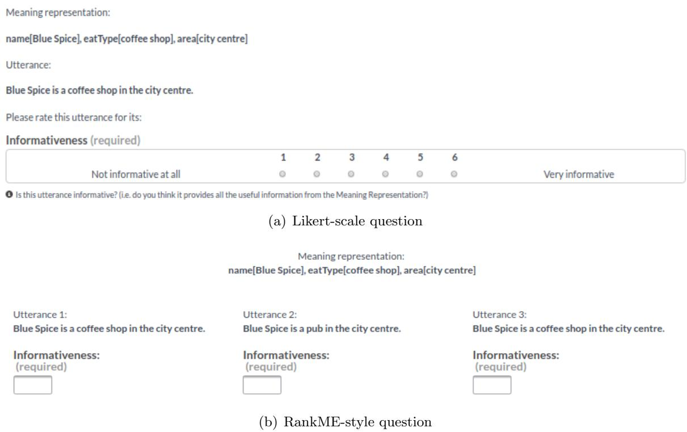  
Figure 1: Two different methods for obtaining intrinsic evaluations of text generated from a meaning representation. Image Source: (Novikova et al., 2018), https://github.com/ jeknov/RankME

# 2.1 Intrinsic Evaluation

An intrinsic evaluation asks people to evaluate the quality of generated text, either overall or along some specific dimension (e.g., fluency, coherence, correctness, etc.). This is typically done by generating several samples of text from a model and asking human evaluators to score their quality.

The simplest way to get this type of evaluation is to show the evaluators the generated texts one at a time and have them judge their quality individually. They are asked to vote whether the text is good or bad, or to make more fine-grained decisions by marking the quality along a Likert or sliding scale (see Figure 1(a)). However, judgments in this format can be inconsistent and comparing these results is not straightforward; Amidei et al. (2019b) find that analysis on NLG evaluations in this format is often done incorrectly or with little justification for the chosen methods.

To more directly compare a model’s output against baselines, model variants, or humangenerated text, intrinsic evaluations can also be performed by having people choose which of two generated texts they prefer, or more generally, rank a set of generated texts. This comparative approach has been found to produce higher inter-annotator agreement (CallisonBurch et al., 2007) in some cases. However, while it captures models’ relative quality, it does not give a sense of the absolute quality of the generated text. One way to address this is to use a method like RankME (Novikova et al., 2018), which adds magnitude estimation (Bard et al., 1996) to the ranking task, asking evaluators to indicate how much better their chosen text is over the alternative(s) (see Figure 1(b)). Comparison-based approaches can become prohibitively costly (by requiring lots of head-to-head comparisons) or complex (by requiring participants to rank long lists of output) when there are many models to compare, though there are methods to help in these cases. For example, best-worst scaling (Louviere et al., 2015) has been used in NLG tasks (Kiritchenko & Mohammad, 2016; Koncel-Kedziorski et al., 2019) to simplify comparative evaluations; best-worst scaling asks participants to choose the best and worst elements from a set of candidates, a simpler task than fully ranking the set that still provides reliable results.

Almost all text generation tasks today are evaluated with intrinsic human evaluations. Machine translation is one of the text generation tasks in which intrinsic human evaluations have made a huge impact on the development of more reliable and accurate translation systems, as automatic metrics are validated through correlation with human judgments. One metric that is most commonly used to judge translated output by humans is measuring its adequacy, which is defined by the Linguistic Data Consortium as “how much of the meaning expressed in the gold-standard translation or source is also expressed in the target translation”4. The annotators must be bilingual in both the source and target languages in order to judge whether the information is preserved across translation. Another dimension of text quality commonly considered in machine translation is fluency, which measures the quality of the generated text only (e.g., the target translated sentence), without taking the source into account. It accounts for criteria such as grammar, spelling, choice of words, and style. A typical scale used to measure fluency is based on the question “Is the language in the output fluent?”. Fluency is also adopted in several text generation tasks including document summarization (Celikyilmaz et al., 2018; Narayan et al., 2018), recipe generation (Bosselut et al., 2018), image captioning (Lan et al., 2017), video description generation (Park et al., 2018), and question generation (Du et al., 2017), to name a few.

While fluency and adequacy have become standard dimensions of human evaluation for machine translation, not all text generation tasks have an established set of dimensions that researchers use. Nevertheless, there are several dimensions that are common in human evaluations for generated text. As with adequacy, many of these dimensions focus on the content of the generated text. Factuality is important in tasks that require the generated text to accurately reflect facts described in the context. For example, in tasks like datato-text generation or summarization, the information in the output should not contradict the information in the input data table or news article. This is a challenge to many neural NLG models, which are known to “hallucinate” information (Holtzman et al., 2020; Welleck et al., 2019); Maynez et al. (2020) find that over 70% of generated single-sentence summaries contained hallucinations, a finding that held across several different modeling approaches. Even if there is no explicit set of facts to adhere to, researchers may want to know how well the generated text follows rules of commonsense or how logical it is. For generation tasks that involve extending a text, researchers may ask evaluators to gauge the coherence or consistency of a text—how well it fits the provided context. For example, in story generation, do the same characters appear throughout the generated text, and do the sequence of actions make sense given the plot so far?

Other dimensions focus not on what the generated text is saying, but how it is being said. As with fluency, these dimensions can often be evaluated without showing evaluators any context. This can be something as basic as checking for simple language errors by asking evaluators to rate how grammatical the generated text is. It can also involve asking about the overall style, formality, or tone of the generated text, which is particularly important in style-transfer tasks or in multi-task settings. Hashimoto et al. (2019) ask evaluators about the typicality of generated text; in other words, how often do you expect to see text that looks like this? These dimensions may also focus on how efficiently the generated text communicates its point by asking evaluators how repetitive or redundant it is.

Note that while these dimensions are common, they may be referred to by other names, explained to evaluators in different terms, or measured in different ways (Lee et al., 2021). Howcroft et al. (2020) found that $2 5 \%$ of generation papers published in the last twenty years failed to mention what the evaluation dimensions were, and less than half included definitions of these dimensions. More consistency in how user evaluations are run, especially for well-defined generation tasks, would be useful for producing comparable results and for focused efforts for improving performance in a given generation task. One way to enforce this consistency is by handing over the task of human evaluation from the individual researchers to an evaluation platform, usually run by people hosting a shared task or leaderboard. In this setting, researchers submit their models or model outputs to the evaluation platform, which organizes and runs all the human evaluations. For example, GENIE (Khashabi et al., 2021) and GEM (Gehrmann et al., 2021) both include standardized human evaluations for understanding models’ progress across several generation tasks. ChatEval is an evaluation platform for open-domain chatbots based on both human and automatic metrics (Sedoc et al., 2019), and TuringAdvice (Zellers et al., 2020) tests models’ language understanding capabilities by having people read and rate the models’ ability to generate advice.

Of course, as with all leaderboards and evaluation platforms, with uniformity and consistency come rigidity and the possibility of overfitting to the wrong objectives. Discussions of how to standardize human evaluations should take this into account. A person’s goal when producing text can be nuanced and diverse, and the ways of evaluating text should reflect that.

# 2.2 Extrinsic Evaluation

An extrinsic evaluation measures how successful the system is in a downstream task. Extrinsic evaluations are the most meaningful evaluation as they show how a system actually performs in a downstream setting, but they can also be expensive and difficult to run (Reiter & Belz, 2009). For this reason, intrinsic evaluations are more common than extrinsic evaluations (Gkatzia & Mahamood, 2015; van der Lee et al., 2019) and have become increasingly so, which van der Lee et al. (2019) attribute to a recent shift in focus on NLG subtasks rather than full systems.

An NLG system’s success can be measured from two different perspectives: a user’s success in a task and the system’s success in fulfilling its purpose (Hastie & Belz, 2014b). Extrinsic methods that measure a user’s success at a task look at what the user is able to take away from the system, e.g., improved decision making or higher comprehension accuracy (Gkatzia & Mahamood, 2015). For example, Young (1999), which Reiter & Belz (2009) point to as one of the first examples of extrinsic evaluation of generated text, evaluate automatically generated instructions by the number of mistakes subjects made when they followed them. System success-based extrinsic evaluations, on the other hand, measure an NLG system’s ability to complete the task for which it has been designed. For example, Reiter et al. (2003) generate personalized smoking cessation letters and report how many recipients actually gave up smoking. Post-editing, most often seen in machine translation (Aziz et al., 2012; Denkowski et al., 2014), can also be used to measure a system’s success by measuring how many changes a person makes to a machine-generated text.

Extrinsic human evaluations are commonly used in evaluating the performance of dialog systems (Deriu et al., 2019) and have made an impact on the development of the dialog modeling systems. Various approaches have been used to measure the system’s performance when talking to people, such as measuring the conversation length or asking people to rate the system. The feedback is collected by real users of the dialog system (Black et al., 2011; Lamel et al., 2000; Zhou et al., 2020) at the end of the conversation. The Alexa Prize $^ { 5 }$ follows a similar strategy by letting real users interact with operational systems and gathering the user feedback over a span of several months. However, the most commonly used human evaluations of dialog systems is still via crowdsourcing platforms such as Amazon Mechanical Turk (AMT) (Serban et al., 2016a; Peng et al., 2020; Li et al., 2020; Zhou et al., 2020). Jurcicek et al. (2011) suggest that using enough crowdsourced users can yield a good quality metric, which is also comparable to the human evaluations in which subjects interact with the system and evaluate afterwards.

# 2.3 The Evaluators

For many NLG evaluation tasks, no specific expertise is required of the evaluators other than a proficiency in the language of the generated text. This is especially true when fluency-related aspects of the generated text are the focus of the evaluation. Often, the target audience of an NLG system is broad, e.g., a summarization system may want to generate text for anyone who is interested in reading news articles or a chatbot needs to carry out a conversation with anyone who could access it. In these cases, human evaluations benefit from being performed on as wide a population as possible.

Evaluations can be performed either in-person or online. An in-person evaluation could simply be performed by the authors or a group of evaluators recruited by the researchers to come to the lab and participate in the study. The benefits of in-person evaluation are that it is easier to train and interact with participants, and that it is easier to get detailed feedback about the study and adapt it as needed. Researchers also have more certainty and control over who is participating in their study, which is especially important when trying to work with a more targeted set of evaluators. However, in-person studies can also be expensive and time-consuming to run. For these reasons, in-person evaluations tend to include fewer participants, and the set of people in proximity to the research group may not accurately reflect the full set of potential users of the system. In-person evaluations may also be more susceptible to response biases, adjusting their decisions to match what they believe to be the researchers’ preferences or expectations (Nichols & Maner, 2008; Orne, 1962).

To mitigate some of the drawbacks of in-person studies, online evaluations of generated texts have become increasingly popular. While researchers could independently recruit participants online to work on their tasks, it is common to use crowdsourcing platforms that

Celikyilmaz, Clark, & Gao

have their own users whom researchers can recruit to participate in their task, either by paying them a fee (e.g., Amazon Mechanical Turk $_ 6$ ) or rewarding them by some other means (e.g., LabintheWild $^ 7$ , which provides participants with personalized feedback or information based on their task results). These platforms allow researchers to perform large-scale evaluations in a time-efficient manner, and they are usually less expensive (or even free) to run. They also allow researchers to reach a wider range of evaluators than they would be able to recruit in-person (e.g., more geographical diversity). However, maintaining quality control online can be an issue (Ipeirotis et al., 2010; Oppenheimer et al., 2009), and the demographics of the evaluators may be heavily skewed depending on the user base of the platform (Difallah et al., 2018; Reinecke & Gajos, 2015). Furthermore, there may be a disconnect between what evaluators online being paid to complete a task would want out of an NLG system and what the people who would be using the end product would want.

Not all NLG evaluation tasks can be performed by any subset of speakers of a given language. Some tasks may not transfer well to platforms like Amazon Mechanical Turk where workers are more accustomed to dealing with large batches of microtasks. Specialized groups of evaluators can be useful when testing a system for a particular set of users, as in extrinsic evaluation settings. Researchers can recruit people who would be potential users of the system, e.g., students for educational tools or doctors for bioNLP systems. Other cases that may require more specialized human evaluation are projects where evaluator expertise is important for the task or when the source texts or the generated texts consist of long documents or a collection of documents. Consider the task of citation generation (Luu et al., 2020): given two scientific documents A and B, the task is to generate a sentence in document A that appropriately cites document B. To rate the generated citations, the evaluator must be able to read and understand two different scientific documents and have general expert knowledge about the style and conventions of academic writing. For these reasons, Luu et al. (2020) choose to run human evaluations with expert annotators (in this case, NLP researchers) rather than crowdworkers.

# 2.4 Inter-Evaluator Agreement

8 While evaluators $^ { 9 }$ often undergo training to standardize their evaluations, evaluating generated natural language will always include some degree of subjectivity. Evaluators may disagree in their ratings, and the level of disagreement can be a useful measure to researchers. High levels of inter-evaluator agreement generally mean that the task is well-defined and the differences in the generated text are consistently noticeable to evaluators, while low agreement can indicate a poorly defined task or that there are not reliable differences in the generated text.

Nevertheless, measures of inter-evaluator agreement are not frequently included in NLG papers. Only $1 8 \%$ of the 135 generation papers reviewed in Amidei et al. (2019a) include agreement analysis (though on a positive note, it was more common in the most recent papers they studied). When agreement measures are included, agreement is usually low in generated text evaluation tasks, lower than what is typically considered “acceptable” on most agreement scales (Amidei et al., 2018, 2019a). However, as Amidei et al. (2018) point out, given the richness and variety of natural language, pushing for the highest possible inter-annotator agreement may not be the right choice when it comes to NLG evaluation.

While there are many ways to capture the agreement between annotators (Banerjee et al., 1999), we highlight the most common approaches used in NLG evaluation. For an in-depth look at annotator agreement measures in natural language processing, refer to Artstein & Poesio (2008).

# 2.4.1 Percent agreement

A simple way to measure agreement is to report the percent of cases in which the evaluators agree with each other. If you are evaluating a set of generated texts $X$ by having people assign a score to each text $x _ { i }$ , then let $a _ { i }$ be the agreement in the scores for $x _ { i }$ (where $a _ { i } = 1$ if the evaluators agree and $a _ { i } = 0$ if they don’t). Then the percent agreement for the task is:

$$
P _ { a } = \frac { \sum _ { i = 0 } ^ { | X | } a _ { i } } { | X | }
$$

So $P _ { a } = 0$ means the evaluators did not agree on their scores for any generated text, while $P _ { a } = 1$ means they agreed on all of them.

However, while this is a common way people evaluate agreement in NLG evaluations (Amidei et al., 2019a), it does not take into account the fact that the evaluators may agree purely by chance, particularly in cases where the number of scoring categories are low or some scoring categories are much more likely than others (Artstein & Poesio, 2008). We need a more complex agreement measure to capture this.

# 2.4.2 Cohen’s $\kappa$

Cohen’s $\kappa$ (Cohen, 1960) is an agreement measure that can capture evaluator agreements that may happen by chance. In addition to $P _ { a }$ , we now consider $P _ { c }$ , the probability that the evaluators agree by chance. So, for example, if two evaluators ( $e _ { 1 }$ and $e _ { 2 }$ ) are scoring texts $X$ with a score from the set $S$ , then $P _ { c }$ would be the odds of them both scoring a text the same:

$$
P _ { c } = \sum _ { s \in S } P ( s | e _ { 1 } ) * P ( s | e _ { 2 } )
$$

For Cohen’s $\kappa$ , $P ( s | e _ { i } )$ is estimated using the frequency with which the evaluator $e _ { i }$ assigned each of the scores across the task.10 Once we have both $P _ { a }$ and $P _ { c }$ , Cohen’s $\kappa$ can then be calculated as:

$$
\kappa = { \frac { P _ { a } - P _ { c } } { 1 - P _ { c } } }
$$

Celikyilmaz, Clark, & Gao

# 2.4.3 Fleiss’ $\kappa$

As seen in Equation 2, Cohen’s $\kappa$ measures the agreement between two annotators, but often many evaluators have scored the generated texts, particularly in tasks that are run on crowdsourcing platforms. Fleiss’ $\kappa$ (Fleiss, 1971) can measure agreement between multiple evaluators. This is done by still looking at how often pairs of evaluators agree, but now considering all possible pairs of evaluators. So now $a _ { i }$ , which we defined earlier to be the agreement in the scores for a generated text $x _ { i }$ , is calculated across all evaluator pairs:

$$
a _ { i } = { \frac { \sum _ { s \in S } \# { \mathrm { ~ o f ~ e v a l u a t o r ~ p a i r s ~ w h o ~ s c o r e ~ } } x _ { i } { \mathrm { ~ a s ~ } } s } { \mathrm { ~ t o t a l ~ } \# { \mathrm { ~ o f ~ e v a l u a t o r ~ p a i r s ~ } } } }
$$

Then we can once again define $P _ { a }$ , the overall agreement probability, as it is defined in Equation 1—the average agreement across all the texts.

To calculate $P _ { c }$ , we estimate the probability of a judgment $P ( s | e _ { i } )$ by the frequency of the score across all annotators. So if $r _ { s }$ is the proportion of judgments that assigned a score $s$ , then the likelihood of two annotators assigning score $s$ by chance is $r _ { s } * r _ { s } = r _ { s } ^ { 2 }$ . Then our overall probability of chance agreement is:

$$
P _ { c } = \sum _ { s \in S } r _ { s } ^ { 2 }
$$

With these values for $P _ { a }$ and $P _ { c }$ , we can use Equation 3 to calculate Fleiss’ $\kappa$ .

# 2.4.4 Krippendorff’s $\alpha$

Each of the above measures treats all evaluator disagreements as equally bad, but in some cases, we may wish to penalize some disagreements more harshly than others. Krippendorff’s $\alpha$ (Krippendorff, 1970), which is technically a measure of evaluator disagreement rather than agreement, allows different levels of disagreement to be taken into account.11

Like the $\kappa$ measures above, we again use the frequency of evaluator agreements and the odds of them agreeing by chance. However, we will now state everything in terms of disagreement. First, we find the probability of disagreement across all the different possible score pairs $( s _ { m } , s _ { n } )$ , which are weighted by whatever value $w _ { m , n }$ we assign the pair. So:

$$
P _ { d } = \sum _ { m = 0 } ^ { | S | } \sum _ { n = 0 } ^ { | S | } w _ { m , n } \sum _ { i = 0 } ^ { | X | } { \frac { \# { \mathrm { ~ o f ~ e v a l u a t o r ~ p a i r s ~ t h a t ~ a s s i g n ~ } } x _ { i } { \mathrm { ~ a s ~ } } \left( s _ { m } , s _ { n } \right) } { \mathrm { t o t a l ~ } \# { \mathrm { ~ o f ~ e v a l u a t o r ~ p a i r s ~ } } } }
$$

(Note that when $m = = n$ , i.e., the pair of annotators agree, $w _ { m , n }$ should be 0.)

Next, to calculate the expected disagreement, we make a similar assumption as in Fleiss’ $\kappa$ : the random likelihood of an evaluator assigning a score $s _ { i }$ can be estimated from the overall frequency of $s _ { i }$ . If $r _ { m , n }$ is the proportion of all evaluation pairs that assign scores

$s _ { m }$ and $s _ { n }$ , then we can treat it as the probability of two evaluators assigning scores $s _ { m }$ and $s _ { n }$ to a generated text at random. So $P _ { c }$ is now:

$$
P _ { c } = \sum _ { m = 0 } ^ { | S | } \sum _ { n = 0 } ^ { | S | } w _ { m , n } r _ { m , n }
$$

Finally, we can calculate Krippendorff’s $\alpha$ as:

$$
\alpha = 1 - \frac { P _ { d } } { P _ { c } }
$$

# 3. Untrained Automatic Evaluation Metrics

With the increase of the numbers of NLG applications and their benchmark datasets, the evaluation of NLG systems has become increasingly important. Arguably, humans can evaluate most of the generated text with little effort12. However, human evaluation is costly and time-consuming to design and run, and more importantly, the results are not always repeatable (Belz & Reiter, 2006). Thus, automatic evaluation metrics are employed as an alternative in both developing new models and comparing them against state-of-the-art approaches. In this survey, we group automatic metrics into two categories: untrained automatic metrics that do not require training (this section), and machine-learned evaluation metrics that are based on machine-learned models (Section 4).

Untrained automatic metrics for NLG evaluation are used to measure the effectiveness of the models that generate text, such as in machine translation, image captioning, or question generation. These metrics compute a score that indicates the similarity (or dissimilarity) between an automatically generated text and human-written reference (gold standard) text. Untrained automatic evaluation metrics are fast and efficient and are widely used to quantify day-to-day progress of model development, e.g., comparing models trained with different hyperparameters. In this section we review untrained automatic metrics used in different NLG applications and briefly discuss the advantages and drawbacks of commonly used metrics. We group the untrained automatic evaluation methods, as in Table 1, into five categories:

• $n$ -gram overlap metrics distance-based metrics diversity metrics content overlap metrics grammatical feature based metrics13

We cluster some of these metrics in terms of different efficiency criteria (where applicable) in Table $2 ^ { 1 4 }$ . Throughout this section, we will provide a brief description of the selected

Celikyilmaz, Clark, & Gao

untrained metrics as depicted in Table 1, discuss about how they are used in evaluating different text generation tasks and provide references for others for further read. We will highlight some of their strengths and weaknesses in bolded sentences.

# 3.1 $\mathbf { \nabla } ^ { \prime \prime }$ -gram Overlap Metrics for Content Selection

$n$ -gram overlap metrics are commonly used for evaluating NLG systems and measure the degree of “matching” between machine-generated and human-authored (ground-truth) texts. In this section we present several $\boldsymbol { n }$ -gram match features and the NLG tasks they are used to evaluate.

f-score. Also called F-measure, the f-score is a measure of accuracy. It balances the generated text’s precision and recall by the harmonic mean of the two measures. The most common instantiation of the f-score is the f1-score ( $F _ { 1 }$ ). In text generation tasks such as machine translation or summarization, f-score gives an indication as to the quality of the generated sequence that a model will produce (Melamed et al., 2003; Aliguliyev, 2008). Specifically for machine translation, f-score-based metrics have been shown to be effective in evaluating translation quality.

bleu. The Bilingual Evaluation Understudy (bleu) is one of the first metrics used to measure the similarity between two sentences (Papineni et al., 2002). Originally proposed for machine translation, it compares a candidate translation of text to one or more reference translations. bleu is a weighted geometric mean of $n$ -gram precision scores.

It has been argued that although bleu has significant advantages, it may not be the ultimate measure for improved machine translation quality (Callison-Burch & Osborne, 2006). While earlier work has reported that bleu correlates well with human judgments (Lee & Przybocki, 2005; Denoual & Lepage, 2005), more recent work argues that although it can be a good metric for the machine translation task (Zhang et al., 2004) for which it is designed, it doesn’t correlate well with human judgments for other generation tasks (such as image captioning or dialog response generation). Reiter (2018) reports that there’s not enough evidence to support that bleu is the best metric for evaluating NLG systems other than machine translation. Caccia et al. (2018) found that generated text with perfect bleu scores was often grammatically correct but lacked semantic or global coherence, concluding that the generated text has poor information content.

Outside of machine translation, bleu has been used for other text generation tasks, such as document summarization (Graham, 2015), image captioning (Vinyals et al., 2014), human-machine conversation (Gao et al., 2019), and language generation (Semeniuta et al., 2019). In Graham (2015), it was concluded that bleu achieves strongest correlation with human assessment, but does not significantly outperform the best-performing rouge variant. A more recent study has demonstrated that $n$ -gram matching scores such as bleu can be an insufficient and potentially less accurate metric for unsupervised language generation (Semeniuta et al., 2019).

Text generation research, especially when focused on short text generation like sentencebased machine translation or question generation, has successfully used bleu for benchmark analysis with models since it is fast, easy to calculate, and enables a comparison with other models on the same task. However, bleu has some drawbacks for NLG tasks where contextual understanding and reasoning is the key (e.g., story generation (Fan et al., 2018; Martin et al., 2017) or long-form question answering (Fan et al., 2019a)). It considers neither semantic meaning nor sentence structure. It does not handle morphologically rich languages well, nor does it map well to human judgments (Tatman, 2019). Recent work by Mathur et al. (2020) investigated how sensitive the machine translation evaluation metrics are to outliers. They found that when there are outliers in tasks like machine translation, metrics like bleu lead to high correlations yielding false conclusions about reliability of these metrics. They report that when the outliers are removed, these metrics do not correlate as well as before, which adds evidence to the unreliablity of bleu.

Table 1: Untrained automatic and retrieval-based metrics based on string match, string distance, or context overlap. The acronyms for some of the NLP sub-research fields that each metric is commonly used to evaluate text generation are: MT: Machine Translation, IC: Image Captioning, SR: Speech Recognition, SUM: Summarization, DG: Document or Story Generation, Visual-Story Generation, QG: Question Generation, RG: Dialog Response Generation. EMD:Earth Mover’s Distance; Sim.: Similarity.   

<table><tr><td>F-SCORE</td><td>Metric</td><td>Property</td><td>MT</td><td>IC</td><td>SR</td><td>SUM</td><td>DG</td><td>QG</td><td>RG</td></tr><tr><td rowspan="6">ds[ wa-</td><td></td><td>precision and recall n-gram precision</td><td>✓ ✓</td><td>✓ ✓</td><td>✓</td><td>✓</td><td>✓ ✓</td><td>✓ ✓</td><td>✓ √</td></tr><tr><td>BLEU METEOR</td><td>n-gram w/ synonym match</td><td>✓</td><td>✓</td><td></td><td></td><td>✓</td><td></td><td></td></tr><tr><td>CIDER</td><td>tf-idf weighted n-gram sim.</td><td></td><td>✓</td><td></td><td></td><td></td><td></td><td></td></tr><tr><td>NIST</td><td>n-gram precision</td><td>✓</td><td></td><td></td><td></td><td></td><td></td><td></td></tr><tr><td>GTM HLEPOR</td><td>n-gram metrics unigrams harmonic mean</td><td>✓</td><td></td><td></td><td></td><td></td><td></td><td></td></tr><tr><td>RIBES MASI</td><td>unigrams harmonic mean attribute overlap</td><td>✓</td><td></td><td></td><td></td><td></td><td></td><td></td></tr><tr><td rowspan="6"></td><td>WER TER</td><td>% of insert,delete, replace</td><td></td><td></td><td>✓</td><td></td><td></td><td></td><td></td></tr><tr><td></td><td>translation edit rate</td><td>✓</td><td></td><td></td><td></td><td></td><td></td><td></td></tr><tr><td>ROUGE</td><td>n-gram recall</td><td></td><td></td><td></td><td></td><td></td><td></td><td></td></tr><tr><td>DICE</td><td>attribute overlap</td><td></td><td></td><td></td><td></td><td></td><td></td><td></td></tr><tr><td>EDIT DIST. MEANT 2.0</td><td>cosine similarity</td><td>✓</td><td></td><td></td><td>V</td><td></td><td></td><td></td></tr><tr><td>-snse</td><td></td><td>vector based similarity</td><td>✓</td><td></td><td></td><td></td><td></td><td></td><td></td></tr><tr><td rowspan="4">peseq</td><td></td><td></td><td>✓</td><td></td><td></td><td></td><td></td><td></td><td></td><td></td></tr><tr><td>YISI WMD</td><td>weighted similarity EMD on words</td><td></td><td></td><td></td><td>✓</td><td></td><td></td><td></td><td></td></tr><tr><td>SMD</td><td>EMD on sentences</td><td></td><td>✓ ✓</td><td>V</td><td></td><td></td><td></td><td></td><td></td></tr><tr><td>FrÉChET</td><td>distributional similarity</td><td></td><td>✓</td><td></td><td></td><td></td><td></td><td></td><td></td></tr><tr><td rowspan="2">Ccottn Jra Pa</td><td>PYRAMID SPICE</td><td>content selection scene graph similarity</td><td></td><td></td><td>✓</td><td></td><td></td><td></td><td></td><td></td></tr><tr><td>SPIDER</td><td>scene graph similarity</td><td></td><td>✓ ✓</td><td></td><td></td><td></td><td></td><td></td><td></td></tr><tr><td colspan="2">Lsi</td><td>richness of vocabulary</td><td></td><td></td><td>L</td><td></td><td></td><td></td><td></td><td></td></tr></table>

We will present other metrics that address some of these shortcomings throughout this paper.

Celikyilmaz, Clark, & Gao

rouge. Recall-Oriented Understudy for Gisting Evaluation (rouge) (Lin, 2004) is a set of metrics for evaluating automatic summarization of long texts consisting of multiple sentences or paragraphs. Although mainly designed for evaluating single- or multi-document summarization, it has also been used for evaluating short text generation, such as machine translation (Lin & Och, 2004), image captioning (Cui et al., 2018), and question generation (Nema & Khapra, 2018; Dong et al., 2019). rouge includes a large number of distinct variants, including eight different $n$ -gram counting methods to measure $n$ -gram overlap between the generated and the ground-truth (human-written) text: rouge- $\{ { \bf 1 } / { \bf 2 } / { \bf 3 } / { \bf 4 } \}$ measures the overlap of unigrams/bigrams/trigrams/four-grams (single tokens) between the reference and hypothesis text (e.g., summaries); rouge-l measures the longest matching sequence of words using longest common sub-sequence (LCS); rouge-s (less commonly used) measures skip-bigram $^ { 1 5 }$ -based co-occurrence statistics; rouge-su (less commonly used) measures skip-bigram and unigram-based co-occurrence statistics.

Compared to bleu, rouge focuses on recall rather than precision and is more interpretable than bleu (Callison-Burch & Osborne, 2006). Additionally, rouge includes the mean or median score from individual output text, which allows for a significance test of differences in system-level rouge scores, while this is restricted in bleu (Graham & Baldwin, 2014; Graham, 2015). However, rouge’s reliance on $n$ -gram matching can be an issue, especially for long-text generation tasks (Kilickaya et al., 2017), because it doesn’t provide information about the narrative flow, grammar, or topical flow of the generated text, nor does it evaluate the factual correctness of the text compared to the corpus it is generated from.

meteor. The Metric for Evaluation of Translation with Explicit ORdering (meteor) (Lavie et al., 2004; Banerjee & Lavie, 2005) is a metric designed to address some of the issues found in bleu and has been widely used for evaluating machine translation models and other models, such as image captioning (Kilickaya et al., 2017), question generation (Nema & Khapra, 2018; Du et al., 2017), and summarization (See et al., 2017; Chen & Bansal, 2018; Yan et al., 2020). Compared to bleu, which only measures precision, meteor is based on the harmonic mean of the unigram precision and recall, in which recall is weighted higher than precision. Several metrics support this property since it yields high correlation with human judgments (Lavie & Agarwal, 2007).

meteor has several variants that extend exact word matching that most of the metrics in this category do not include, such as stemming and synonym matching. These variants address the problem of reference translation variability, allowing for morphological variants and synonyms to be recognized as valid translations. The metric has been found to produce good correlation with human judgments at the sentence or segment level (Agarwal & Lavie, 2008). This differs from bleu in that meteor is explicitly designed to compare at the sentence level rather than the corpus level.

cider. Consensus-based Image Description Evaluation (cider) is an automatic metric for measuring the similarity of a generated sentence against a set of human-written sentences using a consensus-based protocol. Originally proposed for image captioning (Vedantam et al., 2014), cider shows high agreement with consensus as assessed by humans. It enables a comparison of text generation models based on their “human-likeness,” without having to create arbitrary calls on weighing content, grammar, saliency, etc. with respect to each other.

The cider metric presents three explanations about what a hypothesis sentence should contain: (1) $\boldsymbol { n }$ -grams in the hypothesis sentence should also occur in the reference sentences, (2) If an $n$ -gram does not occur in a reference sentence, it shouldn’t be in the hypothesis sentence, (3) $\boldsymbol { n }$ -grams that commonly occur across all image-caption pairs in the dataset should be assigned lower weights, since they are potentially less informative. While cider has been adopted as an evaluation metric for image captioning and has been shown to correlate well with human judgments on some datasets (PASCAL-50S and ABSTRACT-50S datasets) (Vedantam et al., 2014), recent studies have shown that metrics that include semantic content matching such as spice can correlate better with human judgments (Anderson et al., 2016; Liu et al., 2017).

nist. Proposed by the US National Institute of Standards and Technology, nist (Martin & Przybocki, 2000) is a method similar to bleu for evaluating the quality of text. Unlike bleu, which treats each $\boldsymbol { n }$ -gram equally, nist heavily weights $\boldsymbol { n }$ -grams that occur less frequently, as co-occurrences of these $n$ -grams are more informative than common $\boldsymbol { n }$ -grams (Doddington, 2002).

gtm. The gtm metric (Turian & Melamed, 2003) measures $\boldsymbol { n }$ -gram similarity between the model-generated hypothesis translation and the reference sentence by using precision, recall and F-score measures.

hlepor. Harmonic mean of enhanced Length Penalty, Precision, $n$ -gram Position difference Penalty, and Recall (hlepor), initially proposed for machine translation, is a metric designed for morphologically complex languages like Turkish or Czech (Han et al., 2013a). Among other factors, hlepor uses part-of-speech tags’ similarity to capture syntactic information.

ribes. Rank-based Intuitive Bilingual Evaluation Score (ribes) (Isozaki et al., 2010) is another untrained automatic evaluation metric for machine translation. It was developed by NTT Communication Science Labs and designed to be more informative for Asian languages–—like Japanese and Chinese—since it doesn’t rely on word boundaries. Specifically, ribes is based on how the words in generated text are ordered. It uses the rank correlation coefficients measured based on the word order from the hypothesis (model-generated) translation and the reference translation.

dice and masi. Used mainly for referring expression generation evaluation, dice (Gatt et al., 2008) measures the overlap of a set of attributes between the human-provided referring expression and the model-generated expressions. The expressions are based on an input image (e.g., the large chair), and the attributes are extracted from the expressions, such as the type or color (Chen & van Deemter, 2020). The masi metric (Gatt et al., 2008), on the other hand, adapts the Jaccard coefficient, which biases it in favour of similarity when a set of attributes is a subset of the other attribute set.

# 3.2 Distance-Based Evaluation Metrics for Content Selection

A distance-based metric in NLG applications uses a distance function to measure the similarity between two text units (e.g., words, sentences). First, we represent two text units using vectors. Then, we compute the distance between the vectors. The smaller the distance, the more similar the two text units are. This section reviews distance-based similarity measures where text vectors can be constructed using discrete tokens, such as bag of words (§3.2.1) or embedding vectors (§3.2.2). We note that even though the embeddings that are used by these metrics to represent the text vectors are pre-trained, these metrics are not trained to mimic the human judgments, as in the machine-learned metrics that we summarize in Section 4.

Table 2: Clustering several of the untrained metrics based on different criteria.   

<table><tr><td>Evaluation Criteria</td><td>Evaluation Metric</td></tr><tr><td>measures semantic similarity (content)</td><td>PYRAMID, SPICE, SPIDER, YISI, SPS, TE</td></tr><tr><td>measures diversity</td><td>WMD, SMD, TTR, SELF-BLEU</td></tr><tr><td>measures fluency</td><td>BLEU, ROUGE, NIST</td></tr><tr><td>punishes length differences</td><td>F-SCORE, BLEU, NIST, ROUGE</td></tr><tr><td>punishes grammatical errors</td><td>METEOR, NIST</td></tr><tr><td>correlates well with human judgments</td><td>METEOR, SPICE, TER</td></tr></table>

# 3.2.1 Edit Distance-Based Metrics

Edit distance, one of the most commonly used evaluation metrics in natural language processing, measures how dissimilar two text units are based on the minimum number of operations required to transform one text into the other. We summarize some of the well-known edit distance measures below.

wer Word error rate (wer) has been commonly used for measuring the performance of speech recognition systems, as well as to evaluate the quality of machine translation systems (Tom´as et al., 2003). Specifically, wer is the percentage of words that need to be inserted, deleted, or replaced in the translated sentence to obtain the reference sentence, i.e., the edit distance between the reference and hypothesis sentences.

wer has some limitations. For instance, while its value is lower-bounded by zero, which indicates a perfect match between the hypothesis and reference text, its value is not upperbounded, making it hard to evaluate in an absolute manner (Mccowan et al., 2004). It is also reported to suffer from weak correlation with human evaluation. For example, in the task of spoken document retrieval, the wer of an automatic speech recognition system is reported to poorly correlate with the retrieval system performance (Kafle & Huenerfauth, 2017).

ter Translation edit rate (ter) (Snover et al., 2006) is defined as the minimum number of edits needed to change a generated text so that it exactly matches one of the references, normalized by the average length of the references. While ter has been shown to correlate well with human judgments in evaluating machine translation quality, it suffers from some limitations. For example, it can only capture similarity in a narrow sense, as it only uses a single reference translation and considers only exact word matches between the hypothesis and the reference. This issue can be partly addressed by constructing a lattice of reference translations, a technique that has been used to combine the output of multiple translation systems (Rosti et al., 2007).

# 3.2.2 Vector Similarity-Based Evaluation Metrics

In NLP, embedding-based similarity measures are commonly used in addition to $\boldsymbol { n }$ -grambased similarity metrics. Embeddings are real-valued vector representations of character or lexical units, such as word-tokens or $\boldsymbol { n }$ -grams, that allow tokens with similar meanings to have similar representations. Even though the embedding vectors are learned using supervised or unsupervised neural network models, the vector-similarity metrics we summarize below assume the embeddings are pre-trained and simply used as input to calculate the metric.

meant 2.0 The vector-based similarity measure meant uses word embeddings and shallow semantic parses to compute lexical and structural similarity (Lo, 2017). It evaluates translation adequacy by measuring the similarity of the semantic frames and their role fillers between the human references and the machine translations.

yisi Inspired by the meant score, yisi $^ { 1 6 }$ (Lo, 2019) is proposed to evaluate the accuracy of machine translation model outputs. It is based on the weighted distributional lexical semantic similarity, as well as shallow semantic structures. Specifically, it extracts the longest common character sub-string from the hypothesis and reference translations to measure the lexical similarity.

Word Mover’s Distance (wmd) Earth mover’s distance (emd), also known as the Wasserstein metric (Rubner et al., 1998), is a measure of the distance between two probability distributions. Word mover’s distance (wmd; Kusner et al., 2015) is a discrete version of emd that calculates the distance between two sequences (e.g., sentences, paragraphs, etc.), each represented with relative word frequencies. It combines item similarity $^ { 1 7 }$ on bag-of-word (BOW) histogram representations of text (Goldberg et al., 2018) with word embedding similarity. In short, wmd has several intriguing properties:

• It is hyperparameter-free and easy to use.   
• It is highly interpretable as the distance between two documents can be broken down and explained as the sparse distances between few individual words.   
• It uses the knowledge encoded within the word embedding space, which leads to high retrieval accuracy.

Empirically, wmd has been instrumental to the improvement of many NLG tasks, specifically sentence-level tasks, such as image caption generation (Kilickaya et al., 2017) and natural language inference (Sulea, 2017). However, while wmd works well for short texts, its cost grows prohibitively as the length of the documents increases, and the BOW approach can be problematic when documents become large as the relation between sentences is lost. By only measuring word distances, the metric cannot capture information conveyed in the group of words, for which we need higher-level document representations (Dai et al., 2015).

Sentence Mover’s Distance (smd) Sentence Mover’s Distance (smd) is an automatic metric based on wmd to evaluate text in a continuous space using sentence embeddings (Clark et al., 2019; Zhao et al., 2019). smd represents each document as a collection of sentences or of both words and sentences (as seen in Figure 2), where each sentence embedding is weighted according to its length. smd measures the cumulative distance of moving the sentences embeddings in one document to match another document’s sentence embeddings. On a summarization task, smd correlated better with human judgments than rouge (Clark et al., 2019).

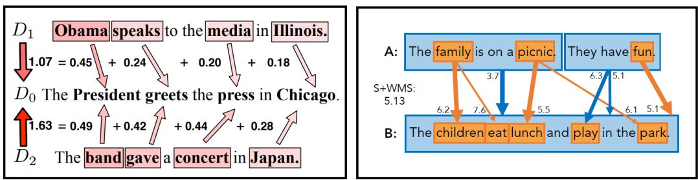  
Figure 2: (LEFT) Illustration of Word Mover’s Distance (WMD). Picture source: (Kusner et al., 2015); (RIGHT) Illustration of Sentence Mover’s Distance (SMD). Picture source: (Clark et al., 2019).

Zhao et al. (2019) proposed a new version of smd that attains higher correlation with human judgments. Similar to smd, they used word and sentence embeddings by taking the average of the token-based embeddings before the mover’s distance is calculated. They also investigated different contextual embeddings models including ELMO and BERT by taking the power mean (which is an embedding aggregation method) of their embeddings at each layer of the encoding model.

# 3.3 $\mathbf { \nabla } ^ { \prime \prime }$ -gram-Based Diversity Metrics

The lexical diversity score measures the breadth and variety of the word usage in writing (Inspector, 2013). Lexical diversity is desirable in many NLG tasks, such as conversational bots (Li et al., 2018), story generation (Rashkin et al., 2020), question generation (Du et al., 2017; Pan et al., 2019), and abstractive question answering (Fan et al., 2019). Nevertheless, diversity-based metrics are rarely used on their own, as text diversity can come at the cost of text quality (Montahaei et al., 2019a; Hashimoto et al., 2019; Zhang et al., 2021), and some NLG tasks do not require highly diverse generations. For example, Reiter et al. (2005) reported that a weather forecast system was preferred over human meteorologists as the system produced report has a more consistent use of certain classes of expressions relating to reporting weather forecast.

In this section we review some of the metrics designed to measure the quality of the generated text in terms of lexical diversity.

Type-Token Ratio (ttr) is a measure of lexical diversity (Richards, 1987), mostly used in linguistics to determine the richness of a writer’s or speaker’s vocabulary. It is computed as the number of unique words (types) divided by the total number of words (tokens) in a given segment of language.

Although intuitive and easy to use, ttr is sensitive to text length because the longer the document, the lower the likelihood that a token will be a new type. This causes the ttr to drop as more words are added. To remedy this, a diversity metric, hd-d (hyper-geometric distribution function), was proposed to compare texts of different lengths (McCarthy & Jarvis, 2010).

Measuring diversity using $n$ -gram repetitions is a more generalized version of ttr, which has been use for text generation evaluation. Li et al. (2016) has shown that modeling mutual information between source and targets significantly decreases the chance of generating bland responses and improves the diversity of responses. They use bleu and distinct word unigram and bigram counts to evaluate the proposed diversity-promoting objective function for dialog response generation.

Self-bleu Zhu et al. (2018) proposed self-bleu as a diversity evaluation metric, which calculates a bleu score for every generated sentence, treating the other generated sentences as references. The average of these bleu scores is the self-bleu score of the text, where a lower self-bleu score implies higher diversity. Several NLG papers have reported that self-bleu achieves good generation diversity (Zhu et al., 2018; Chen et al., 2018a; Lu et al., 2018). However, others have reported some weakness of the metric in generating diverse output (Caccia et al., 2018) or detecting mode collapse (Semeniuta et al., 2019) in text generation with GAN (Goodfellow et al., 2014) models.

# 3.4 Explicit Semantic Content Match Metrics

Semantic content matching metrics define the similarity between human-written and modelgenerated text by extracting explicit semantic information units from text beyond $n$ -grams. These metrics operate on semantic and conceptual levels and are shown to correlate well with human judgments. We summarize some of them below.

pyramid The pyramid method is a semi-automatic evaluation method (Nenkova & Passonneau, 2004) for evaluating the performance of document summarization models. Like other untrained automatic metrics that require references, this untrained metric also requires human annotations. It identifies summarization content units (SCUs) to compare information in a human-generated reference summary to the model-generated summary. To create a pyramid, annotators select sets of text spans that express the same meaning across summaries, and each SCU is a weighted according to the number of summaries that express the SCU’s meaning.

The pyramid metric relies on manual human labeling effort, which makes it difficult to automate. peak: Pyramid Evaluation via Automated Knowledge Extraction (Yang et al., 2016) was presented as a fully automated variant of pyramid model, which can automatically assign the pyramid weights and was shown to correlate well with human judgments.

spice Semantic propositional image caption evaluation (spice) (Anderson et al., 2016) is an image captioning metric that measures the similarity between a list of reference human written captions $S = \{ s _ { 1 } , \cdots , s _ { m } \}$ of an image and a hypothesis caption $c$ generated by a model. Instead of directly comparing the captions’ text, spice parses each caption to derive an abstract scene graph representation, encoding the objects, attributes, and relationships detected in image captions (Schuster et al., 2015), as shown in Figure 3. spice then computes the f-score using the hypothesis and reference scene graphs over the conjunction of logical tuples representing semantic propositions in the scene graph to measure their similarity. spice has been shown to have a strong correlation with human ratings.

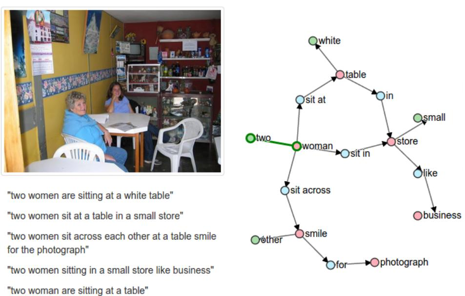  
Figure 3: Illustration of Scene Graph Extraction for measuring the spice metric. A scene graph (right) is parsed from a set of reference image captions on the left. Picture source: (Anderson et al., 2016).

Compared to $\boldsymbol { n }$ -gram matching methods, spice can capture a broader sense of semantic similarity between a hypothesis and a reference text by using scene graphs. However, even though spice correlates well with human evaluations, a major drawback is that it ignores the fluency of the generated captions (Sharif et al., 2018).

spider Liu et al. (2017) proposed spider, which is a linear combination of spice and cider. They show that optimizing spice alone often results in captions that are wordy and repetitive because while scene graph similarity is good at measuring the semantic similarity between captions, it does not take into account the syntactical aspects of texts. Thus, a combination of semantic graph similarity (like spice) and $\boldsymbol { n }$ -gram similarity measure (like cider) yields a more complete quality evaluation metric. However, the correlation of spider and human evaluation is not reported.

# 3.4.1 Semantic Similarity Models used as Evaluation Metrics

Other text generation work has used the confidence scores obtained from semantic similarity methods as an evaluation metric. Such models can evaluate a reference and a hypothesis text based on their task-level semantics. The most commonly used methods based on the sentence-level similarity are as follows:

• Semantic Textual Similarity (STS) is concerned with the degree of equivalence in the underlying semantics of paired text (Agirre et al., 2016). STS is used as an evaluation metric in text generation tasks such as machine translation, summarization, and dialogue response generation in conversational systems. The official score is based on weighted Pearson correlation between predicted similarity and human-annotated similarity. The higher the score, the better the the similarity prediction result from the algorithm (Maharjan et al., 2017; Cer et al., 2017b).

• Paraphrase identification (PI) considers if two sentences express the same meaning (Dolan & Brockett, 2005; Barzilay & Lee, 2003). PI is used as a text generation evaluation score based on the textual similarity (Kauchak & Barzilay, 2006) of a reference and hypothesis by finding a paraphrase of the reference sentence that is closer in wording to the hypothesis output. For instance, given the pair of sentences:

reference: “However, Israel’s reply failed to completely clear the U.S. suspicions.” hypothesis: “However, Israeli answer unable to fully remove the doubts.”

PI is concerned with learning to transform the reference sentence into:

paraphrase: “However, Israel’s answer failed to completely remove the U.S. suspicions.”

which is closer in wording to the hypothesis. In Jiang et al. (2019), a new paraphrasing evaluation metric, tiger, is used for image caption generation evaluation. Similarly, Liu et al. (2019a) introduce different strategies to select useful visual paraphrase pairs for training by designing a variety of scoring functions.

• Textual entailment (TE) is concerned with whether a hypothesis can be inferred from a premise, requiring understanding of the semantic similarity between the hypothesis and the premise (Dagan et al., 2006; Bowman et al., 2015). It has been used to evaluate several text generation tasks, including machine translation (Pad´o et al., 2009), document summarization (Long et al., 2018), language modeling (Liu et al., 2019b), and video captioning (Pasunuru & Bansal, 2017).

• Machine Comprehension (MC) is concerned with the sentence matching between a passage and a question, pointing out the text region that contains the answer (Rajpurkar et al., 2016). MC has been used for tasks like improving question generation (Yuan et al., 2017; Du et al., 2017) and document summarization (Hermann et al., 2015).

# 3.5 Syntactic Similarity-Based Metrics

A syntactic similarity metric captures the similarity between a reference and a hypothesis text at a structural level to capture the overall grammatical or sentence structure similarity.

In corpus linguistics, part of speech (POS) tagging is the process of assigning a partof-speech tag (e.g., verb, noun, adjective, adverb, and preposition, etc.) to each word in a sentence, based on its context, morphological behaviour, and syntax. POS tags have been commonly used in machine translation evaluation to evaluate the quality of the generated translations. tesla (Dahlmeier et al., 2011) was introduced as an evaluation metric to combine the synonyms of bilingual phrase tables and POS tags, while others use POS $n$ - grams together with a combination of morphemes and lexicon probabilities to compare the target and source translations (Popovic et al., 2011; Han et al., 2013b). POS tag information has been used for other text generation tasks such as story generation (Agirrezabal et al., 2013), summarization (Suneetha & Fatima, 2011), and question generation (Zerr, 2014).

Syntactic analysis studies the arrangement of words and phrases in well-formed sentences. For example, a dependency parser extracts a dependency tree of a sentence to represent its grammatical structure. Several text generation tasks have enriched their evaluation criteria by leveraging syntactic analysis. In machine translation, Liu & Gildea (2005) used constituent labels and head-modifier dependencies to extract structural information from sentences for evaluation, while others use shallow parsers (Lo et al., 2012) or dependency parsers (Yu et al., 2014, 2015). Yoshida et al. (2014) combined a sequential decoder with a tree-based decoder in a neural architecture for abstractive text summarization.

# 4. Machine-Learned Evaluation Metrics

Many of the untrained evaluation metrics described in Section 3 assume that the generated text has significant word (or $n$ -gram) overlap with the ground-truth text. However, this assumption does not hold for NLG tasks that permit significant diversity and allow multiple plausible outputs for a given input (e.g., a social chatbot). Table 3 shows two examples from the dialog response generation and image captioning tasks, respectively. In both tasks, the model-generated outputs are plausible given the input, but they do not share any words with the ground-truth output.

One solution to this problem is to use embedding-based metrics, which measure semantic similarity rather than word overlap, as in Section 3.2.2. But embedding-based methods cannot help in situations when the generated output is semantically different from the reference, as in the dialog example. In these cases, we can build machine-learned models (trained on human judgment data) to mimic human judges to measure many quality metrics of output, such as factual correctness, naturalness, fluency, coherence, etc. In this section we survey the NLG evaluation metrics that are computed using machine-learned models, with a focus on recent neural models.

# 4.1 Sentence Semantic Similarity Based Evaluation

Neural approaches to sentence representation learning seek to capture semantic meaning and syntactic structure of sentences from different perspectives and topics and to map a sentence onto an embedding vector using neural network models. As with word embeddings, NLG models can be evaluated by embedding each sentence in the generated and reference texts.

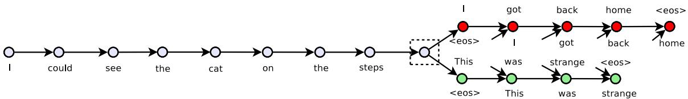  
Figure 4: Illustration of Skip-Thoughts Vectors Model for sentence representation learning (Image Source: (Kiros et al., 2015)).

Table 3: Demonstration of issues with using automatic evaluation metrics that rely on $n$ - gram overlap using two short-text generation tasks: dialog response generation and image captioning. The examples are adapted from Liu et al. (2016) and Kilickaya et al. (2017).   

<table><tr><td rowspan=1 colspan=1></td><td rowspan=1 colspan=1>Dialog Response Generation</td><td rowspan=1 colspan=1>Image Captioning</td></tr><tr><td rowspan=1 colspan=1>Context</td><td rowspan=1 colspan=1>Speaker A: Hey John, what doyou want to do tonight?Speaker B: Why don&#x27;t we go seea movie?</td><td rowspan=1 colspan=1></td></tr><tr><td rowspan=1 colspan=1>Ground-Truth</td><td rowspan=1 colspan=1>Response: Nah, I hate thatstuff, let&#x27;s do something active.</td><td rowspan=1 colspan=1>Caption: a man wearing a redlife jacket is sitting in a canoe ona lake</td></tr><tr><td rowspan=1 colspan=1>Model/Distorted Output</td><td rowspan=1 colspan=1>Response: Oh sure! Heard thefilm about Turing is out!</td><td rowspan=1 colspan=1>Caption: a guy wearing a lifevest is in a small boat on a lake</td></tr><tr><td rowspan=1 colspan=1>BLEU</td><td rowspan=1 colspan=1>0.0</td><td rowspan=1 colspan=1>0.20</td></tr><tr><td rowspan=1 colspan=1>ROUGE</td><td rowspan=1 colspan=1>0.0</td><td rowspan=1 colspan=1>0.57</td></tr><tr><td rowspan=1 colspan=1>WMD</td><td rowspan=1 colspan=1>0.0</td><td rowspan=1 colspan=1>0.10</td></tr></table>

Extending word2vec (Mikolov et al., 2013) to produce word or phrase embeddings, one of the earliest sentence embeddings models, Deep Semantic Similarity Model (dssm) (Huang et al., 2013) introduced a series of latent semantic models with a deep structure that projects two or more text streams (such as a query and multiple documents) into a common low-dimensional space where the relevance of one text towards the other text can be computed via vector distance. The skip-thought vectors model (Kiros et al., 2015) exploits the encoder-decoder architecture to predict context sentences in an unsupervised manner (see Figure 4). Skip-thought vectors allow us to encode rich contextual information by taking into account the surrounding context, but are slow to train. fastsent (Hill et al., 2016) makes training efficient by representing a sentence as the sum of its word embeddings, but also dropping any knowledge of word order. A simpler weighted sum of word vectors (Arora et al., 2019) weighs each word vector by a factor similar to the tf-idf score, where more frequent terms are weighted less. Similar to fastsent, it ignores word order and surrounding sentences. Extending dssm models, infersent (Conneau et al., 2017) is an effective model, which uses lstm-based Siamese networks, with two additional advantages over the fastsent. It encodes word order and is trained on a high-quality sentence inference dataset. On the other hand, quick-thought (Logeswaran & Lee, 2018) is based on an unsupervised model of universal sentence embeddings trained on consecutive sentences. Given an input sentence and its context, a classifier is trained to distinguish a context sentence from other contrastive sentences based on their embeddings.

The recent large-scale pre-trained language models (PLMs) such as elmo and bert use contextualized word embeddings to represent sentences. Even though these PLMs outperform the earlier models such as dssms, they are more computationally expensive to use for evaluating NLG systems. For example, the sentence similarity metrics that use Transformerbased encoders, such as bert model (Devlin et al., 2018) and its extension roberta (Liu et al., 2019c), to obtain sentence representations are designed to learn textual similarities in sentence-pairs using distance-based similarity measures at the top layer as learning signal, such as cosine similarity similar to dssm. But both are much more computationally expensive than dssm due to the fact that they use a much deeper NN architecture, and need to be fine-tuned for different tasks. To remedy this, Reimers & Gurevych (2019) proposed sentbert, a fine-tuned bert on a “general” task to optimize the BERT parameters, so that a cosine similarity between two generated sentence embeddings is strongly related to the semantic similarity of the two sentences. Then the fine-tuned model can be used to evaluate various NLG tasks. Focusing on machine translation task, esim also computes sentence representations from bert embeddings (with no fine-tuning), and later computes the similarity between the translated text and its reference using metrics such as the average recall of its reference (Chen et al., 2017; Mathur et al., 2019).

# 4.2 Regression-Based Evaluation

Shimanaka et al. (2018) proposed a segment-level machine translation evaluation metric named ruse. They treat the evaluation task as a regression problem to predict a scalar value to indicate the quality of translating a machine-translated hypothesis $t$ to a reference translation $r$ . They first do a forward pass on the GRU (gated-recurrent unit) based on an encoder to generate $t$ and represent $r$ as a $d$ -dimensional vector. Then, they apply different matching methods to extract relations between $t$ and $r$ by (1) concatenating $( \vec { t } , \vec { r } )$ ; (2) getting the element-wise product $( \vec { t } * \vec { r } )$ ; (3) computing the absolute element-wise distance $| \vec { t } - \vec { r } |$ (see Figure 5). ruse is demonstrated to be an efficient metric in machine translation shared tasks in both segment-level (how well the metric correlates with human judgments of segment quality) and system-level (how well a given metric correlates with the machine translation workshop official manual ranking) metrics.

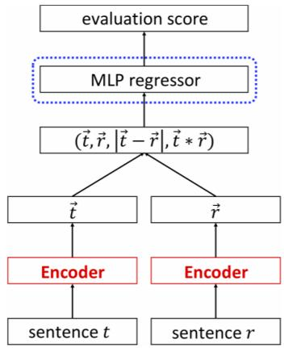  
Figure 5: The sketch of the ruse metric. Image source (Logeswaran & Lee, 2018).

# 4.3 Evaluation Models with Human Judgments

For more creative and open-ended text generation tasks, such as chit-chat dialog, story generation, or online review generation, current evaluation methods are only useful to some degree. As we mentioned in the beginning of this section, word-overlap metrics are ineffective as there are often many plausible references in these scenarios and collecting them all is impossible. Even though human evaluation methods are useful in these scenarios for evaluating aspects like coherency, naturalness, or fluency, aspects like diversity or creativity may be difficult for human judges to assess as they have no knowledge about the dataset that the model is trained on (Hashimoto et al., 2019). Language models can learn to copy from the training dataset and generate samples that a human judge will rate as high in quality, but may fail in generating diverse samples (i.e., samples that are very different from training samples), as has been observed in social chatbots (Li et al., 2016; Zhou et al., 2020). A language model optimized only for perplexity may generate coherent but bland responses. Such behaviours are observed when generic pre-trained language models are used for downstream tasks ‘as-is’ without fine-tuning on in-domain datasets of related downstream tasks. A commonly overlooked issue is that conducting human evaluation for every new generation task can be expensive and not easily generalizable.

To calibrate human judgments and automatic evaluation metrics, model-based approaches that use human judgments as attributes or labels have been proposed. Lowe et al. (2017) introduced a model-based evaluation metric, adem, which is learned from human judgments for dialog system evaluation, specifically response generation in a chatbot setting. Using Twitter data (each tweet response is a reference, and its previous dialog turns are its context), they have different models (such as RNNs, retrieval-based methods, or other human responses) generate responses and ask humans to judge the appropriateness of the generated response given the context. For evaluation they use a higher quality labeled Twitter dataset (Ritter et al., 2011), which contains dialogs on a variety of topics.

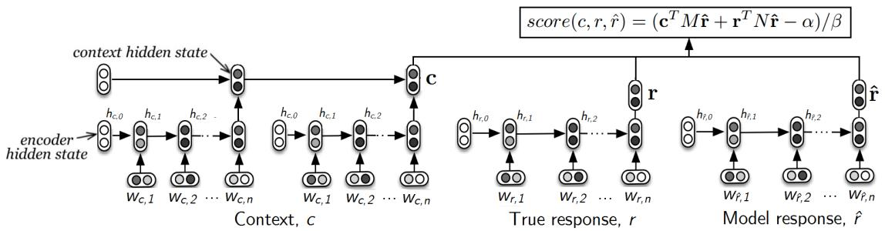  
Figure 6: The ADEM evaluation model. Image source (Lowe et al., 2017).

Using this score-labeled dataset, the adem evaluation model is trained as follows: First, a latent variational recurrent encoder-decoder model (vhred) (Serban et al., 2016b) is pretrained on a dialog dataset to learn to represent the context of a dialog. vhred encodes the dialog context into a vector representation, from which the model generates samples of initial vectors to condition the decoder model to generate the next response. Using the pre-trained vhred model as the encoder, they train adem as follows (see Figure 6). First, the dialog context, $c$ , the model generated response $\hat { r }$ , and the reference response $r$ are fed to vhred to get their embedding vectors, $\mathbf { c }$ , $\hat { \mathbf { r } }$ and $\mathbf { r }$ . Then, each embedding is linearly projected so that the model response $\hat { \mathbf { r } }$ can be mapped onto the spaces of the dialog context and the reference response to calculate a similarity score. The similarity score measures how close the model responses are to the context and the reference response after the projection, as follows:

$$
s c o r e ( c , \hat { r } , r ) = ( \mathbf { c } ^ { T } M \hat { \mathbf { r } } + \mathbf { r } ^ { T } N \hat { \mathbf { r } } - \alpha ) / \beta
$$

adem is optimized for squared error loss between the predicted score and the human judgment score with L-2 regularization in an end-to-end fashion. The trained evaluation model is shown to correlate well with human judgments. adem is also found to be conservative and give lower scores to plausible responses.

With the motivation that a good evaluation metric should capture both the quality and the diversity of the generated text, Hashimoto et al. (2019) proposed a new evaluation metric named Human Unified with Statistical Evaluation (huse), which focuses on more creative and open-ended text generation tasks, such as dialog and story generation. Unlike the adem metric, which relies on human judgments for training the model, huse combines statistical evaluation and human evaluation metrics in one model, as shown in Figure 7.

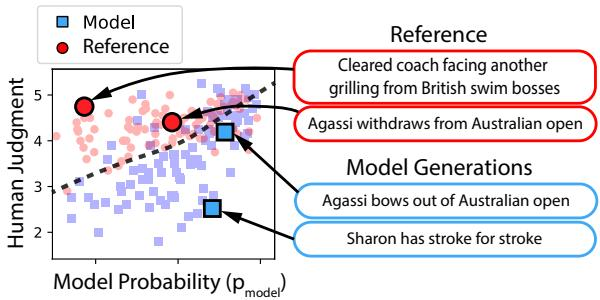  
Figure 7: huse can identify samples with defects in quality (Sharon has stroke for stroke) and diversity (Cleared coach facing). Image Source: (Hashimoto et al., 2019).

huse considers the conditional generation task that, given a context $x$ sampled from a prior distribution $p ( x )$ , outputs a distribution over possible sentences $p _ { m o d e l } ( y | x )$ . The evaluation metric is designed to determine the similarity of the output distribution $p _ { m o d e l }$ and a human generation reference distribution ${ p } _ { r e f }$ . This similarity is scored using an optimal discriminator that determines whether a sample comes from the reference or hypothesis (model) distribution (Figure 7). For instance, a low-quality text is likely to be sampled from the model distribution. The discriminator is implemented approximately using two probability measures: (i) the probability of a sentence under the model, which can be estimated using the text generation model, and (ii) the probability under the reference distribution, which can be estimated based on human judgment scores. On summarization and chitchat dialog tasks, huse has been shown to be effective to detect low-diverse generations that humans fail to detect.

# 4.4 BERT-Based Evaluation

Given the strong performance of bert (Devlin et al., 2018) across many tasks, there has been work that uses bert or similar pre-trained language models for evaluating NLG tasks, such as summarization and dialog response generation. Here, we summarize some of the recent work that fine-tunes bert to use as evaluation metrics for downstream text generation tasks.

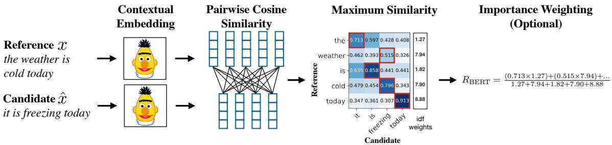  
Figure 8: Illustration of bertscore metric. Image Source: Zhang et al. (2020a).

One of the bert-based models for semantic evaluation is bertscore (Zhang et al., 2020a). As illustrated in Figure 8, it leverages the pre-trained contextual embeddings from bert and matches words in candidate and reference sentences by cosine similarity. bertscore has been shown to correlate well with human judgments on sentence-level and system-level evaluations. Moreover, bertscore computes precision, recall, and F1 measures, which are useful for evaluating a range of NLG tasks.

Kan´e et al. (2019) presented a bert-based evaluation method called roberta-sts to detect sentences that are logically contradictory or unrelated, regardless whether they are grammatically plausible. Using roberta (Liu et al., 2019c) as a pre-trained language model, roberta-sts is fine-tuned on the STS-B dataset (Cer et al., 2017a) to learn the similarity of sentence pairs on a Likert scale. Another evaluation model is fine-tuned on the MultiGenre Natural Language Inference Corpus (Williams et al., 2018) in a similar way to learn to predict logical inference of one sentence given the other. Both model-based evaluators, roberta-sts and its extension, have been shown to be more robust and correlate better with human evaluation than automatic evaluation metrics such as bleu and rouge.

Another recent bert-based machine-learned evaluation metric is bleurt (Sellam et al., 2020), which was proposed to evaluate various NLG systems. The evaluation model is trained as follows: A checkpoint from bert is taken and fine-tuned on synthetically generated sentence pairs using automatic evaluation scores such as bleu or rouge, and then further fine-tuned on system-generated outputs and human-written references using human ratings and automatic metrics as labels. The fine-tuning of bleurt on synthetic pairs is an important step because it improves the robustness to quality drifts of generation systems. As shown in the plots in Figure 9, as the NLG task gets more difficult, the ratings get closer as it is easier to discriminate between “good” and “bad” systems than to rank “good” systems. To ensure the robustness of their metric, they investigate with training datasets with different characteristics, such as when the training data is highly skewed or out-of-domain. They report that the training skew has a disastrous effect on bleurt without pre-training; this pre-training makes bleurt significantly more robust to quality drifts.

As discussed in Section 2, humans can efficiently evaluate the performance of two models side-by-side, and most embedding-based similarity metrics reviewed in the previous sections are based on this idea. Inspired by this, the comparator evaluator (Zhou & Xu, 2020) was proposed to evaluate NLG models by learning to compare a pair of generated sentences by fine-tuning bert. A text pair relation classifier is trained to compare the task-specific quality of a sample hypothesis and reference based on the win/loss rate. Using the trained model, a skill rating system is built. This system is similar to the player-vs-player games in which the players are evaluated by observing a record of wins and losses of multiple players. Then, for each player, the system infers the value of a latent, unobserved skill variable that indicates the records of wins and losses. On story generation and open domain dialogue response generation tasks, the comparator evaluator metric demonstrates high correlation with human evaluation.

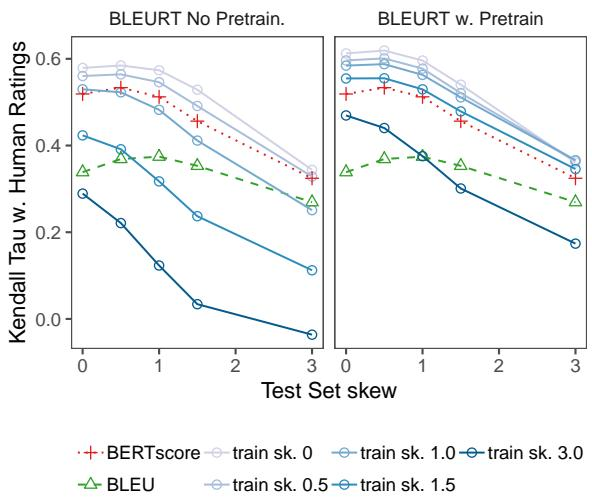  
Figure 9: Agreement between bleurt and human ratings for different skew factors in train and test. Image Source: Sellam et al. (2020)

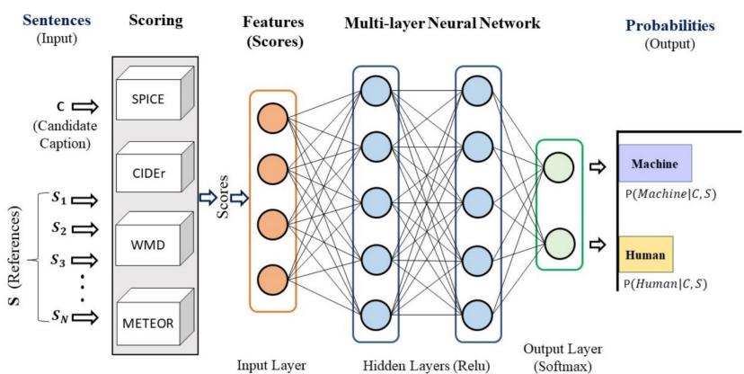  
Figure 10: Composite Metrics model architecture. Image Source: (Sharif et al., 2018).

# 4.5 Evaluating Factual Correctness

An important issue in text generation systems is that the model’s generation could be factually inconsistent, caused by distorted or fabricated facts about the source text. Especially in document summarization tasks, the models that abstract away salient aspects, have been shown to generate text with up to 30% factual inconsistencies (Kryscinski et al., 2019b; Falke et al., 2019; Zhu et al., 2020). There has been a lot of recent work that focuses on building models to verify the factual correctness of the generated text, focusing on semantically constrained tasks such as document summarization or image captioning, some of which we summarize here.

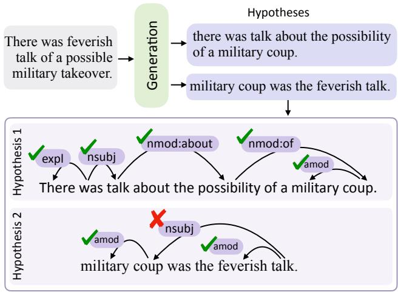  
Figure 11: Illustration of dependency arc entailment formulation using a filtered set of Stanford Enhanced Dependencies. Image Source: (Goyal $\&$ Durrett, 2020).

Some recent evaluation metrics have addressed factual correctness via entailment-based models (Falke et al., 2019; Maynez et al., 2020; Duˇsek & Kasner, 2020). However, these sentence-level, entailment-based approaches do not capture which part of the generated text is non-factual. Goyal $\&$ Durrett presented a new localized entailment-based approach using dependency trees to reformulate the entailment problem at the dependency arc level. Specifically, they align the the semantic relations yielded by the dependency arcs (see Figure 11) in the generated output summary to the input sentences. Their dependency arc entailment model improves factual consistency and shows stronger correlations with human judgments in generation tasks such as summarization and paraphrasing.

Models adhering to the facts in the source have started to gain more attention in “conditional” or “grounded” text generation tasks, such as document summarization (Kryscinski et al., 2019b) and data-to-text generation (Reiter, 2007; Lebret et al., 2016a; Sha et al., 2017; Puduppully et al., 2018; Wang, 2019; Nan et al., 2021). In one of the earlier works on structured data-to-text generation, Wiseman et al. (2017) dealt with the coherent generation of multi-sentence summaries of tables or database records. In this work, they first trained an auxiliary model as relation extraction classifier (entity-mention pairs) based on information extraction to evaluate how well the text generated by the model can capture the information in a discrete set of records. Then the factual evaluation is based on the alignment between the entity-mention predictions of this classifier against the source database records. Their work was limited to a single domain (basketball game tables and summaries) and assumed that the tables has similar attributes, which can be limiting for open-domain data-to-text generation systems.

Dhingra et al. (2019) extended this approach and introduced the parent measure. Their evaluation approach first aligns the entities in the table and the reference and generated text with a neural attention-based model and later measures similarities on word overlap, entailment and other metrics over the alignment. They conduct a large scale human evaluation study which yielded that parent correlates with human judgments better than several n-gram match and information extraction based metrics they used for evaluation. Parikh et al. proposed a new controllable text generation task, totto, which generates a sentence to describe a highlighted cell in a given table and extended the parent to adapt to their tasks so the metric takes into account the highlighted cell in the table.

Factual consistency evaluations have also appeared in multi-modal generation tasks, such as image captioning. In one such work (Chen et al., 2018b), a new style-focused factual rnn-type decoder is constructed to allow the model to preserve factual information in longer sequences without requiring additional labels. In this model, they query a reference model to adaptively learn to add factual information into the model.

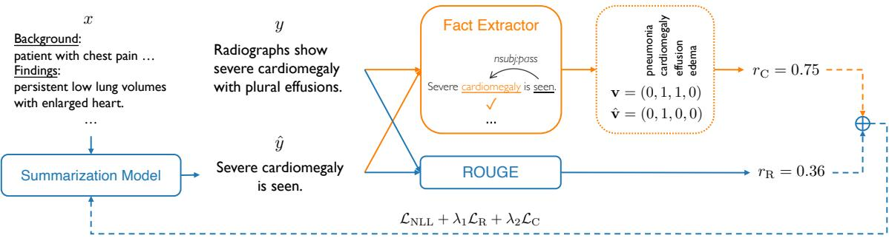  
Figure 12: Illustration of the training strategy of the factually correct summarization model. Image Source: (Zhang et al., 2019b).

Zhang et al. (2019b) proposed a way to tackle the problem of factual correctness in summarization models. Focusing on summarizing radiology reports, they extend pointer networks for abstractive summarization by introducing a reward-based optimization that trains the generators to obtain more rewards when they generate summaries that are factually aligned with the original document. Specifically, they design a fact extractor module so that the factual accuracy of a generated summary can be measured and directly optimized as a reward using policy gradient, as shown in Figure 12. This fact extractor is based on an information extraction module and extracts and represents the facts from generated and reference summaries in a structured format. The summarization model is updated via reinforcement learning using a combination of the NLL (negative log likelihood) loss, a rouge-based loss, and a factual correctness-based loss ( $\begin{array} { r } { L o s s { = } \mathcal { L } _ { N L L } { + } \lambda _ { 1 } \mathcal { L } _ { r o u g e } { + } \lambda _ { 2 } \mathcal { L } _ { f a c t } \rangle } \end{array}$ . Their work suggests that for domains in which generating factually correct text is crucial, a carefully implemented information extraction system can be used to improve the factual correctness of neural summarization models via reinforcement learning.

To evaluate the factual consistency of the text generation models, Eyal et al. (2019b) presented a question-answering-based parametric evaluation model named Answering Performance for Evaluation of Summaries (apes) (see Figure 13). Their evaluation model is designed to evaluate document summarization and is based on the hypothesis that the quality of a generated summary is associated with the number of questions (from a set of relevant ones) that can be answered by reading the summary.

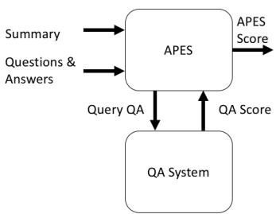  
Figure 13: APES evaluation flow. Image Source: (Hashimoto et al., 2019).

To build such an evaluator to assess the quality of generated summaries, they introduce two components: (a) a set of relevant questions for each source document and (b) a question-answering system. They first generate questions from each reference summary by masking each of the named entities present in the reference based on the method described in Hermann et al. (2015). For each reference summary, this results in several triplets in the form (generated summary, question, answer), where question refers to the sentence containing the masked entity, answer refers to the masked entity, and the generated summary is generated by their summarization model. Thus, for each generated summary, metrics can be derived based on the accuracy of the question answering system in retrieving the correct answers from each of the associated triplets. This metric is useful for summarizing documents for domains that contain lots of named entities, such as biomedical or news article summarization.

# 4.6 Composite Metric Scores

The quality of many NLG models like machine translation and image captioning can be evaluated for multiple aspects, such as adequacy, fluency, and diversity. Many composite metrics have been proposed to capture a multi-dimensional sense of quality. Sharif et al. (2018) presented a machine-learned composite metric for evaluating image captions. The metric incorporates a set of existing metrics such as meteor, wmd, and spice to measure both adequacy and fluency. They evaluate various combinations of the metrics they chose to compose and and show that their composite metrics correlate well with human judgments.

Li $\&$ Chen (2020) propose a composite reward function to evaluate the performance of image captions. The approach is based on refined Adversarial Inverse Reinforcement Learning (rAIRL), which eases the reward ambiguity (common in reward-based generation models) by decoupling the reward for each word in a sentence. The proposed composite reward is shown on MS COCO data to achieve state-of-the-art performance on image captioning. Some examples generated from this model that uses the composite reward function are shown in Figure 14. They have shown that their metric not only generates grammatical captions but also correlates well with human judgments.

Celikyilmaz, Clark, & Gao

MLE: a piece of cake sitting on top of a plate. RL: a piece of cake on a plate. GAN: a half eaten dessert on a plate.

MLE: a bunch of   
boats that are   
sitting in the water. RL: a group of   
boats are in the   
water.   
GAN: many   
sailboats are lined up in the harbor. MLE: a kitchen with a stove , stove and   
microwave.   
RL: a kitchen with a   
stove and a microwave. GAN: a kitchen with   
wooden cabinets and stainless steel   
appliances.

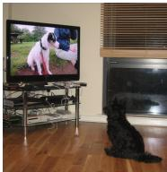

  
Figure 14: (Top four images) Example image captions using different learning objectives: MLE: maximum likelihood learning, GAN: Generative Adversarial Networks, RL: Reward-based reinforcement learning. (Bottom image) Example generations from Adversarial Inverse Reinforcement Learning (rAIRL). Image Source: (Li & Chen, 2020).

# 5. Shared Tasks for NLG Evaluation

Shared tasks in NLG are designed to boost the development of sub-fields and continuously encourage researchers to improve upon the state-of-the-art. With shared tasks, the same data and evaluation metrics are used to efficiently benchmark models. NLG shared tasks are common not only because language generation is a growing research field with numerous unsolved research challenges, but also because many NLG generation tasks do not have an established evaluation pipeline. NLG researchers are constantly proposing new shared tasks as new datasets and tasks are introduced to support efficient evaluation of novel approaches in language generation. Even though shared tasks are important for NLG research and evaluation, there are potential issues that originate from the large variability and a lack of standardisation in the organisation of shared tasks, not just for language generation but for language processing in general. In (Parra Escart´ın et al., 2017), some of these ethical concerns are discussed.

In this section we survey some of the shared tasks that focus on the evaluation of text generation systems that are aimed at comparing and validating different evaluation measures.

# 5.1 Generating Referring Expressions

The Attribute Selection for Generating Referring Expressions (GRE) (asgre) Challenge (Gatt & Belz, 2008) was one of the first shared-task evaluation challenges in NLG. It was designed for the content determination of the GRE task, selecting the properties to describe an intended referent. The goal of this shared task was to evaluate the submitted systems on minimality (the proportion of descriptions in the system-generated output that are maximally brief compared to the original definition),uniqueness and humanlikeness.

# 5.2 Embedded Text Generation

To spur research towards human-machine communication in situated settings, Generating Instructions in Virtual Environments (GIVE) has been introduced as a challenge and an evaluation testbed for NLG (Koller et al., 2009). In this challenge a human player is given a task to solve in a simulated 3D space. A generation module’s task is to guide the human player, using natural language instructions. Only the human user can effect any changes in the world, by moving around, manipulating objects, etc. This challenge evaluates NLG models on referring expression generation, aggregation, grounding, realization, and user modeling. This challenge has been organized in four consecutive years (Striegnitz et al., 2011).

# 5.3 Regular Expression Generation (REG) in Context

The goal in this task is to map a representation of an intended referent in a given textual context to a full surface form. The representation of the intended referring expression maybe one from possible list of referring expressions for that referent and/or a set of semantic and syntactic properties. This challenge has been organized under different sub-challenges: GREC-Full has focused on improving the referential clarity and fluency of the text in which systems were expected to replace regular expressions and where necessary to produce as clear, fluent and coherent a text as possible (Belz & Kow, 2010). The GREC-NEG Task at Generation Challenges 2009 (Belz et al., 2009) evaluated models in select correct coreference chains for all people entities mentioned in short encyclopaedic texts about people collected from Wikipedia.

# 5.4 Regular Expression Generation from Attribute Sets

This task tries to answer the following question: Given a symbol corresponding to an intended referent, how do we work out the semantic content of a referring expression that uniquely identifies the entity in question? (Bohnet & Dale, 2005). The input to these models consists of sets of attributes (e.g., {type=lamp, colour=blue, size=small}), where at least one attribute set is labelled the intended referent, and the remainder are the distractors. Then the task is to build a model that can output a set of attributes for the intended referent that uniquely distinguishes it from the distractors. Gatt et al. (2008) have introduced the tune Corpus and the tuna Challenge based on this corpus that covered a variety of tasks, including attribute selection for referring expressions, realization and end-to-end referring expression generation.

Celikyilmaz, Clark, & Gao

# 5.5 Deep Meaning Representation to Text (SemEval)

SemEval is a series of NLP workshops organized around the goal of advancing the current state of the art in semantic analysis and to help create high-quality annotated datasets to approach challenging problems in natural language semantics. Each year a different shared task is introduced for the teams to evaluate and benchmark models. For instance, Task 9 of the SemEval 2017 challenge was (sem, 2017) on text generation from AMR (Abstract Meaning Representation), which has focused on generating valid English sentences given AMR (Banarescu et al., 2013) annotation structure.

# 5.6 WebNLG

The WebNLG challenge introduced a text generation task from RDF triples to natural language text, providing a corpus and common benchmark for comparing the microplanning capacity of the generation systems that deal with resolving and using referring expressions, aggregations, lexicalizations, surface realizations and sentence segmentations (Gardent et al., 2017). A second challenge has taken place in 2020 (Zhou & Lampouras, 2020), three years after the first one, in which the dataset size increased (as did the coverage of the verbalisers) and more categories and an additional language were included to promote the development of knowledge extraction tools, with a task that mirrors the verbalisation task.

# 5.7 E2E NLG Challenge

Introduced in 2018, E2E NLG Challenge (Duˇsek et al., 2018) provided a high quality and large quantity training dataset for evaluating response generation models in spoken dialog systems. It introduced new challenges such that models should jointly learn sentence planning and surface realisation, while not requiring costly alignment between meaning representations and corresponding natural language reference texts.

# 5.8 Data-to-Text Generation Challenge

Most existing work in data-to-text (or table-to-text) generation focused on introducing datasets and benchmarks rather than organizing challanges. Some of these earlier works include: eathergov (Liang et al., 2009), robocup (Chen & Mooney, 2008), rotowire (Wiseman et al., 2017), e2e (Novikova et al., 2016), wikibio (Lebret et al., 2016b) and recently totto (Parikh et al., 2020). Banik et al. introduced a text generation from knowledge base18 challenge in 2013 to benchmark various systems on the content realization stage of generation. Given a set of relations which form a coherent unit, the task is to generate complex sentences that are grammatical and fluent in English.

# 5.9 GEM Benchmark

Introduced in ACL 2021, the gem benchmark $^ { 1 9 }$ (Gehrmann et al., 2021) aims to measure the progress in NLG, while continuously adding new datasets, evaluation metrics and human

evaluation standards. gem provides an environment by providing easy testing of different NLG tasks and evaluation strategies.

# 6. Examples of Task-Specific NLG Evaluation

In the previous sections, we reviewed a wide range of NLG evaluation metrics individually. However, these metrics are constantly evolving due to rapid progress in more efficient, reliable, scalable and sustainable neural network architectures for training neural text generation models, as well as ever growing compute resources. Nevertheless, it is not easy to define what really is an “accurate,” “trustworthy” or even “efficient” metric for evaluating an NLG model or task. Thus, in this section we present how these metrics can be jointly used in research projects to more effectively evaluate NLG systems for real-world applications. We discuss two NLG tasks, automatic document summarization and longtext generation, that are sophisticated enough that multiple metrics are required to gauge different aspects of the generated text’s quality.

Table 4: Metrics mentioned in each example text generation project.   

<table><tr><td>Summarization Evaluation Metrics</td><td>Long-Text Generation Evaluation Metrics</td></tr><tr><td>ROUGE, BLEU, F-SCORE, SERA, ... model-based factual correctness metrics Q/A based factuality metrics human-based evaluations</td><td>ROUGE, BLEU, F-SCORE, ... entity based evaluation syntactic measures for writing style human-based evaluations</td></tr></table>

# 6.1 Automatic Document Summarization Evaluation

A text summarization system aims to extract useful content from a reference document and generate a short summary that is coherent, fluent, readable, concise, and consistent with the reference document. There are different types of summarization approaches, which can be grouped by their tasks into (i) generic text summarization for broad topics; (ii) topicfocused summarization, e.g., a scientific article, conversation, or meeting summarization; and (iii) query-focused summarization, such that the summary answers a posed query. These approaches can also be grouped by their method: (i) extractive, where a summary is composed of a subset of sentences or words in the input document; and (ii) abstractive, where a summary is generated on-the-fly and often contains text units that do not occur in the input document. Depending on the number of documents to be summarized, these approaches can also be grouped into single-document or multi-document summarization.

Evaluation of text summarization, regardless of its type, measures the system’s ability to generate a summary based on: (i) a set of criteria that are not related to references (Dusek et al., 2017), (ii) a set of criteria that measure its closeness to the reference document, or (iii) a set of criteria that measure its closeness to the reference summary. Figure 15 shows the taxonomy of evaluation metrics (Steinberger & Jezek, 2009) in two categories: intrinsic and extrinsic, which will be explained below.

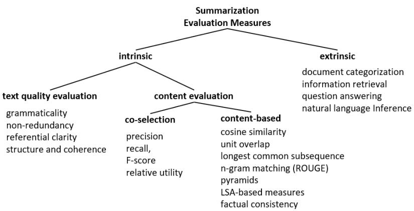  
Figure 15: Taxonomy of summarization evaluation methods. Extended from Steinberger & Jezek (2009).

# 6.1.1 Intrinsic Methods

Intrinsic evaluation of generated summaries can focus on the generated text’s content, text quality, and factual consistency, each discussed below.

Content. Content evaluation compares a generated summary to a reference summary using automatic metrics. The most widely used metric for summarization is rouge, though other metrics, such as bleu and f-score, are also used. Although rouge has been shown to correlate well with human judgments for generic text summarization, the correlation is lower for topic-focused summarization like extractive meeting summarization (Liu & Liu, 2008). Meetings are transcripts of spontaneous speech, and thus usually contain disfluencies, such as pauses (e.g., ‘um,’ ‘uh,’ etc.), discourse markers (e.g., ‘you know,’ ‘i mean,’ etc.), repetitions, etc. Liu & Liu (2008) find that after such disfluencies are cleaned, the rouge score is improved. They even observed fair amounts of improvement in the correlation between the rouge score and human judgments when they include the speaker information of the extracted sentences from the source meeting to form the summary.

Quality. Evaluating generated summaries based on quality has been one of the challenging tasks for summarization researchers. As basic as it sounds, since the definition of a “good quality summary” has not been established and finding the most suitable metrics to evaluate quality remains an open research area. Below are some criteria of text, which are used in recent papers as human evaluation metrics to evaluate the quality of generated text in comparison to the reference text.

• Coherence and Cohesion measure how clearly the ideas are expressed in the summary (Lapata & Barzilay, 2005). In particular, the idea that, in conjunction with cohesion, which is to hold the context as a whole, coherence should measure how well the text is organised and “hangs together.” Consider the examples in Table 5, from the scientific article abstract generation task. The models must include factual information, but it must also be presented in the right order to be coherent.

<table><tr><td rowspan=1 colspan=1>Gold</td><td rowspan=1 colspan=1>We investigate mutual benefits between syntax and semantic roles using neuralnetwork models, by studying a parsing-,SRL pipeline, a SRL-i,parsing pipeline,and a simple joint model by embedding sharing. The integration of syntactic andsemantic features gives promising results in a Chinese Semantic Treebank...</td></tr><tr><td rowspan=1 colspan=1>PGen</td><td rowspan=1 colspan=1>In this paper, we propose a novel approach to learn syntactic and semanticrole labeling models to semantic role labeling (wsd). In the first neural networkmodels induce non-linear feature features from word and part-of-speech (pos)parsing. We show that semantic features can be used to learn...</td></tr><tr><td rowspan=1 colspan=1>Co-OpNet</td><td rowspan=1 colspan=1>In this paper, we explore the use of neural network models to jointly train se-mantic role labelers and parsers for semantic role labeling (srl). We firstpropose a simple neural srl model that uses a neural long shortterm memory(lstm)-based parser to represent the output of an srl system...</td></tr></table>

Table 5: Example of gold and generated abstracts from baseline Pointer Networks $^ +$ Coverage See et al. (2017) (PGen) and a recently proposed model, Co-OpNet (Gabriel et al., 2021), in the NLP scientific domain. Coherence issues and factual errors in generated abstracts are highlighted in italics. Correct terminology and transitional phrases that contribute to coherent flow are also highlighted by properly delineating sections of abstracts in bold and italics. (Table Source: (Gabriel et al., 2021).

• Readability and Fluency, associated with non-redundancy, are linguistic quality metrics used to measure how repetitive the generated summary is and how many spelling and grammar errors there are in the generated summary (Lapata, 2003).

• Focus indicates how many of the main ideas of the document are captured, while avoiding superfluous details.

• Informativeness, which is mostly used to evaluate question-focused summarization, measures how well the summary answers a question. Auto-regressive generation models trained to generate a short summary text given a longer document(s) may yield shorter summaries due to reasons relating to bias in the training data or type of the decoding method (e.g., beam search can yield more coherent text compared to top-k decoding but can yield shorter text if a large beam size is used) (Huang et al., 2017). Thus, in comparing different model generations, the summary text length has also been used as an informativeness measure since a shorter text typically preserves less information (Singh & Jin, 2016).

These quality criterion are widely used as evaluation metrics for human evaluation in document summarization. They can be used to compare a system-generated summary to a source text, a human-generated summary, or to another system-generated summary.

Factual Consistency. One thing that is usually overlooked in document summarization tasks is evaluating the generated summaries’ factual correctness. It has been shown in many recent work on summarization that models frequently generate factually incorrect text. This is partially because the models are not trained to be factually consistent and can generate about anything related to the prompt, Table 6 shows a sample summarization model output, in which the claims made are not consistent with the source document (Kryscinski et al., 2019b). Zhang et al.

<table><tr><td rowspan=1 colspan=2>Source article fragments</td></tr><tr><td rowspan=1 colspan=1>(CNN) The mother of a quadriplegic man whopolice say was left in the woods for days can-not be extradited to face charges in Philadelphiauntil she completes an unspecified &quot;treatment,&quot;Maryland police said Monday. The MontgomeryCounty (Maryland) Department of Police tookNyia Parler, 41, into custody Sunday (...)</td><td rowspan=1 colspan=1>(CNN) The classic video game &quot;Space Invaders&quot;was developed in Japan back in the late 1970&#x27;sand now their real-life counterparts are thetopic of an earnest political discussion in Japan&#x27;scorridors of power. Luckily, Japanese can sleepsoundly in their beds tonight as the govern-ment&#x27;s top military official earnestly revealedthat (...)</td></tr><tr><td rowspan=1 colspan=2>Model generated claims</td></tr><tr><td rowspan=1 colspan=1>Quadriplegic man Nyia Parler, 41, left in woodsfor days can not be extradited.</td><td rowspan=1 colspan=1>Video game &quot;Space Invaders&quot; was developed inJapan back in 1970.</td></tr></table>

Table 6: Examples of factually incorrect claims output by summarization models. Green text highlights the support in the source documents for the generated claims; red text highlights the errors made by summarization models. Table Source (Kryscinski et al., 2019b).

It is imperative that the summarization models are factually consistent and that any conflicts between a source document and its generated summary (commonly referred to as faithfulness (Durmus et al., 2020; Wang et al., 2020b)) can be easily measured, especially for domain-specific summarization tasks like patient-doctor conversation summarization or business meeting summarization. As a result, factual-consistency-aware and faithful text generation research has drawn a lot of attention in the community in recent years (Kryscinski et al., 2019a,b; Zhang et al., 2019b; Wang et al., 2020a; Durmus et al., 2020; Wang et al., 2020b). A common approach is to use a model-based approach, in which a separate component is built on top of a summarization engine that can evaluate the generated summary based on factual consistency, as discussed in Section 4.5.

# 6.1.2 Extrinsic Summarization Evaluation Methods

Extrinsic evaluation metrics test the generated summary text by how it impacts the performance of downstream tasks, such as relevance assessment, reading comprehension, and question answering. Cohan & Goharian (2016) propose a new metric, sera (Summarization Evaluation by Relevance Analysis), for summarization evaluation based on the content relevance of the generated summary and the human-written summary. They find that this metric yields higher correlation with human judgments compared to rouge, especially on the task of scientific article summarization. Eyal et al. (2019a) and Wang et al. (2020a) measure the performance of a summary by using it to answer a set of questions regarding the salient entities in the source document.

# 6.2 Long Text Generation Evaluation

A long text generation system aims to generate multi-sentence text, such as a single paragraph or a multi-paragraph document. Common applications of long-form text generation are document-level machine translation, story generation, news article generation, poem generation, summarization, and image description generation, to name a few. This research area presents a particular challenge to state-of-the-art approaches that are based on statistical neural models, which are proven to be insufficient to generate coherent long text. As an example, in Figure 16 and 17 we show two generated text from two long-text generation models, Grover (Zellers et al., 2019) and PlotMachines (Rashkin et al., 2020). Both of these controlled text models are designed to generate a multi-paragraph story given a list of attributes (in these examples a list of outline points are provided), and the models should generate a coherent long story related to the outline points. These examples demonstrate some of the cohesion issues with these statistical models. For instance, in the Grover output, the model often finishes the story and then starts a new story partway through the document. In contrast, PlotMachines adheres more to a beginning-middle-ending structure. For example, GPT-2 (Radford et al., 2018) can generate remarkably fluent sentences, and even paragraphs, for a given topic or a prompt. However, as more sentences are generated and the text gets longer, it starts to wander, switching to unrelated topics and becoming incoherent (Rashkin et al., 2020).

Evaluating long-text generation is a challenging task. New criteria need to be implemented to measure the quality of long generated text, such as inter-sentence or interparagraph coherence in language style and semantics. Although human evaluation methods are commonly used, we focus our discussion on automatic evaluation methods in this section.

# 6.2.1 Evaluation via Discourse Structure

Text with longer context (e.g., documents, longer conversations, debates, movies scripts, etc.) usually consist of sections (e.g., paragraphs, sets, topics, etc.) that constitute some structure, and in natural language generation such structures are referred to as discourse (Jurafsky & Martin, 2009). Considering the discourse structure of the generated text is crucial in evaluating the system. Especially in open-ended text generation, the model needs to determine the topical flow, structure of entities and events, and their relations in a narrative flow that is coherent and fluent. One of the major tasks in which discourse plays an important role is document-level machine translation (Gong et al., 2015). Hajlaoui & Popescu-Belis (2013) present a new metric called Accuracy of Connective Translation (ACT) (Meyer et al., 2012) that uses a combination of rules and automatic metrics to compare the discourse connection between the source and target documents. Joty et al. (2017), on the other hand, compare the source and target documents based on the similarity of their discourse trees.

# 6.2.2 Evaluation via Lexical Cohesion

Lexical cohesion is a surface property of text and refers to the way textual units are linked together grammatically or lexically. Lexical similarity (Lapata & Barzilay, 2005) is one of the most commonly used metrics in story generation. Roemmele et al. (2017) filter the $n$ -grams based on lexical semantics and only use adjectives, adverbs, interjections, nouns, pronouns, proper nouns, and verbs for lexical similarity measure. Other commonly used metrics compare reference and source text on word- (Mikolov et al., 2013) or sentence-level (Kiros et al., 2015) embedding similarity averaged over the entire document. Entity coreference is another metric that has been used to measure coherence (Elsner & Charniak,

# Grover

cops (film) police officers throughout constructed short films national film registry united states library • pork pie hat propped

: mentioned (partially) at least once : mentioned multiple times

red: outline points bold: are a few notable places where the model seems to end the story and start telling a new one (note: Grover often inserts “1:” at the beginning of stories copying a section header that frequently

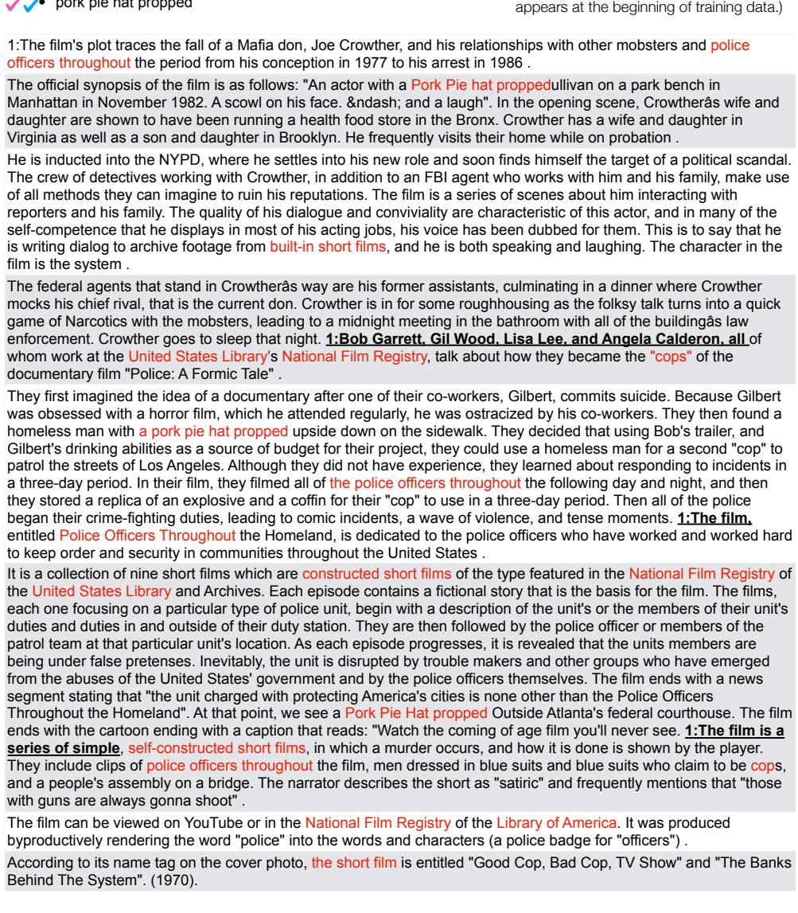

Figure 16: Example document generated using Grover. Red text indicates where plot points are mentioned, while bold text marks the beginning of a new story. (Table Source (Rashkin et al., 2020).)

# PlotMachines

• cops (film) • police officers throughout constructed short films • national film registry • united states library • pork pie hat propped

the film is set in a united states library , located at an old - fashioned desk and surrounded by bookshelves . it consists of three stories with police officers throughout each story . there are two versions : one for each floor ; the other for every room . the narrator ( played by john wayne ) explains that he has constructed short films to help people who need them . these include " cops " , " policemen " , " robbers " , " criminals " , " murderers " , " killers " , " terrorists " , " gangsters " , " assassins " , " revolutionaries " , " anarchists " , " traitors " , " villains " , " murderers " , and " rapists " .

they have erected a large statue of napoleon , but when questioned why they did n't capture him yet , they simply say that their boss wanted to make sure that his men would never find out where he hid the money . after hearing the news , they decide to go undercover and infiltrate the bank owned by the president of the state department . while infiltrating the vault , they discover that the robbery will take place over a long period of time . during the heist , the group discovers that the leader of the gang is actually a member of the national film registry , known only as the chief of security . the head of the operation is named mr hoover , and the rest of the team are called " cops "

the plan works perfectly until the thieves break into the museum using a concealed tunnel . they steal all the books and papers , leaving the prisoners free to escape . the prison guards chase after them , but the boys manage to hide themselves under desks and chairs before escaping . the boys return home to tell their parents about the incident . their mother is shocked and angry , believing that her sons ' actions led to the death penalty . she scolds them for running away without telling anyone . they explain that they just ran away because they could no longer stand living in fear .

finally , the thief reveals herself as mrs robinson , the librarian of the united states library . she informs the heroes that she knows everything about them and even helped them escape . she wants to show them something . she shows them a picture of the famous hero , william shakespeare , who died fighting the nazis . the four friends wonder what happened to him . the policeman returns and takes the photo . the others realize that the policeman is none other than william shakespeare himself . the policeman claims that he killed shakespeare because he knew too much information about the nazi regime . he leaves .

the film features a detailed description of the structure of the library , including its construction and layout . the illustrations are based upon actual events . the buildings featured in the pictures depicted are modeled after those found in real life such as stonehenge , atlantis , mount rushmore , the great pyramid , etc . the photographs depict the entire town of granville , california , and the surrounding countryside . the map used in the documentary is described as having been taken from 1899 to 1947 . the location of granville is shown in the film .

Figure 17: Example document generated using PlotMachines. Red text indicates where plot points are mentioned. (Table Source (Rashkin et al., 2020).)

2008). An entity should be referred to properly in the text and should not be used before introduced. Roemmele et al. (2017) capture the proportion of the entities in the generated sentence that are co-referred to an entity in the corresponding context as a metric of entity co-reference, in which a higher co-reference score indicates higher coherence.

In machine translation, Wong & Kit (2019) introduce a feature that can identify lexical cohesion at the sentence level via word-level clustering using WordNet (Miller, 1995) and stemming to obtain a score for each word token, which is averaged over the sentence. They find that this new score improves correlation of bleu and ter with human judgments. Other work, such as Gong et al. (2015), uses topic modeling together with automatic metrics like bleu and meteor to evaluate lexical cohesion in machine translation of long text. Chow et al. (2019) investigate the position of the word tokens in evaluating the fluency of the generated text. They modify wmd by adding a fragmentation penalty to measure the fluency of a translation for evaluating machine translation systems.

# 6.2.3 Evaluation via Writing Style

Gamon (2004) show that an author’s writing is consistent in style across a particular work. Based on this finding, Roemmele et al. (2017) propose to measure the quality of generated text based on whether it presents a consistent writing style. They capture the category distribution of individual words between the story context and the generated following sentence using their part-of-speech tags of words (e.g., adverbs, adjectives, conjunctions, determiners, nouns, etc.).

Text style transfer reflects the creativity of the generation model in generating new content. Style transfer can help rewrite a text in a different style, which is useful in creative writing such as poetry generation (Ghazvininejad et al., 2016). One metric that is commonly used in style transfer is the classification score obtained from a pre-trained style transfer model (Fu et al., 2018). This metric measures whether a generated sentence has the same style as its context.

# 6.2.4 Evaluation with Multiple References

One issue of evaluating text generation systems is the diversity of generation, especially when the text to evaluate is long. The generated text can be fluent, valid given the input, and informative for the user, but it still may not have lexical overlap with the reference text or the prompt that was used to constrain the generation. This issue has been investigated extensively (Li et al., 2016; Montahaei et al., 2019b; Holtzman et al., 2020; Welleck et al., 2019; Gao et al., 2019). Using multiple references that cover as many plausible outputs as possible is an effective solution to improving the correlation of automatic evaluation metrics (such as adequacy and fluency) with human judgments, as demonstrated in machine translation (Han, 2018; L¨aubli et al., 2020) and other NLG tasks.

# 7. Conclusions and Future Directions

Text generation is central to many NLP tasks, including machine translation, dialog response generation, document summarization, etc. With the recent advances in neural language models, the research community has made significant progress in developing new

NLG models and systems for challenging tasks like multi-paragraph document generation or visual story generation. With every new system or model comes a new challenge of evaluation. This paper surveys the NLG evaluation methods in three categories:

• Human-Centric Evaluation. Human evaluation is the most important for developing NLG systems and is considered the gold standard when developing automatic metrics. But it is expensive to execute, and the evaluation results are difficult to reproduce.   
• Untrained Automatic Metrics. Untrained automatic evaluation metrics are widely used to monitor the progress of system development. A good automatic metric needs to correlate well with human judgments. For many NLG tasks, it is desirable to use multiple metrics to gauge different aspects of the system’s quality.   
• Machine-Learned Evaluation Metrics. In the cases where the reference outputs are not complete, we can train an evaluation model to mimic human judges. However, as pointed out in Gao et al. (2019), any machine-learned metrics might lead to potential problems such as overfitting and ‘gaming of the metric.’

We conclude this paper by summarizing some of the challenges of evaluating NLG systems:

Detecting machine-generated text and fake news. As language models get stronger by learning from increasingly larger corpora of human-written text, they can generate text that is not easily distinguishable from human-authored text. Due to this, new systems and evaluation methods have been developed to detect if a piece of text is machine- or human-generated. A recent study (Schuster et al., 2019) reports the results of a fact verification system to identify inherent bias in training datasets that cause fact-checking issues. In an attempt to combat fake news, Vo & Lee (2019) present an extensive analysis of tweets and a new tweet generation method to identify fact-checking tweets (among many tweets), which were originally produced to persuade posters to stop tweeting fake news. Gehrmann et al. introduced GLTR, which is a tool that helps humans to detect if a text is written by a human or generated by a model. Other research focuses on factually correct text generation, with a goal of providing users with accurate information. Massarelli et al. (2019) introduce a new approach for generating text that is factually consistent with the knowledge source. Kryscinski et al. (2019b) investigate methods of checking the consistency of a generated summary against the document from which the summary is generated. Zellers et al. (2019) present a new controllable language model that can generate an article with respect to a given headline, yielding more trustworthy text than human-written text of fake information. Nevertheless, large-scale language models (even controllable ones), have a tendency to hallucinate and generate nonfactual information, which the model designers should measure and prevent. Future work should focus on the analysis of the text generated from large-scale language models, emphasize careful examination of such models in terms of how they learn and reproduce potential biases that in the training data (Sheng et al., 2020; Bender et al., 2021).

Celikyilmaz, Clark, & Gao

• Making evaluation explainable. Explainable AI refers to AI and machine learning methods that can provide human-understandable justifications for their behaviour (Ehsan et al., 2019). Evaluation systems that can provide reasons for their decisions are beneficial in many ways. For instance, the explanation could help system developers to identify the root causes of the system’s quality problems such as unintentional bias, repetition, or factual inconsistency. The field of explainable AI is growing, particularly in generating explanations of classifier predictions in NLP tasks (Ribeiro et al., 2016, 2018; Thorne et al., 2019). Text generation systems that use evaluation methods that can provide justification or explanation for their decisions will be more trusted by their users. Future NLG evaluation research should focus on developing easy-to-use, robust, and explainable evaluation tools.

• Improving corpus quality. Creating high-quality datasets with multiple reference texts is essential for not only improving the reliability of evaluation but also for allowing the development of new automatic metrics that correlate well with human judgments (Belz & Reiter, 2006). Among many important critical aspects of building corpora for natural language generation tasks, the accuracy, timeliness, completeness, cleanness and unbiasedness of the data plays a very important role. The collected corpus (whether created manually or automatically through retrieval or generation) must be accurate so the generation models can serve for the downstream tasks more efficiently. The corpora used for language generation tasks should be relevant to the corresponding tasks so intended performance can be achieved. Missing information, information biased toward certain groups, ethnicities, religions, etc. could prevent the models from gathering accurate insights and could damage the efficiency of the task performance (Eckart et al., 2012; McGuffie & Newhouse, 2020; Barbaresi, 2015; Bender et al., 2021; Gehrmann et al., 2021).

• Standardizing evaluation methods. Most untrained automatic evaluation metrics are standardized using open source platforms like Natural Language Toolkit (NLTK)20 or spaCy $^ { 2 1 }$ . Such platforms can significantly simplify the process of benchmarking different models. However, there are still many NLG tasks that use task-specific evaluation metrics, such as metrics to evaluate the contextual quality or informativeness of generated text. There are also no standard criteria for human evaluation methods for different NLG tasks.

It is important for the research community to collaborate more closely to standardize the evaluation metrics for NLG tasks that are pursued by many research teams. One effective way to achieve this is to organize challenges or shared tasks, such as the Evaluating Natural Language Generation Challenge $^ { 2 2 }$ and the Shared Task on NLG Evaluation23.

• Developing effective human evaluations. For most NLG tasks, there is little consensus on how human evaluations should be conducted. Furthermore, papers often leave out important details on how the human evaluations were run, such as who the evaluators are and how many people evaluated the text (van der Lee et al., 2019). Clear reporting of human evaluations is very important, especially for replicability purposes.

We encourage NLG researchers to design their human evaluations carefully, paying attention to best practices described in NLG and crowdsourcing research, and to include the details of the studies and data collected from human evaluations, where possible, in their papers. This will allow new research to be consistent with previous work and enable more direct comparisons between NLG results. Human evaluationbased shared tasks and evaluation platforms can also provide evaluation consistency and help researchers directly compare how people perceive and interact with different NLG systems.

• Evaluating ethical issues. There is still a lack of systematic methods for evaluating how effectively an NLG system can avoid generating improper or offensive language. The problem is particularly challenging when the NLG system is based on neural language models whose output is not always predictable. As a result, many social chatbots, such as XiaoIce (Zhou et al., 2020), resort to hand-crafted policies and editorial responses to make the system’s behavior predictable. However, as pointed out by Zhou et al. (2020), even a completely deterministic function can lead to unpredictable behavior. For example, a simple answer “Yes” could be perceived as offensive in a given context. For these reasons and others, NLG evaluations should also consider the ethical implications of their potential responses and applications. We should also note that the landscape and focus of ethics in AI in general is constantly changing due to new advances in neural text generation, and as such, continuing development of ethical evaluations of the machine-generated content is crucial for new advances in the field.

We encourage researchers working in NLG and NLG evaluation to focus on these challenges moving forward, as they will help sustain and broaden the progress we have seen in NLG so far.

# References

Proceedings of the 11th international workshop on semantic evaluation (SemEval-2017). Vancouver, Canada, August 2017. Association for Computational Linguistics.

Abhaya Agarwal and Alon Lavie. Meteor, mbleu and mter: Evaluation metrics for highcorrelation with human rankings of machine translation output. In Proceedings of the Third Workshop on Statistical Machine Translation, StatMT ’08, pp. 115–118, USA, 2008. Association for Computational Linguistics. ISBN 9781932432091.

Eneko Agirre, Aitor Gonzalez-Agirre, Inigo Lopez-Gazpio, Montse Maritxalar, German Rigau, and Larraitz Uria. Semeval-2016 task 2: Interpretable semantic textual similarity. pp. 512–524, 01 2016.

Celikyilmaz, Clark, & Gao

Manex Agirrezabal, Bertol Arrieta, Aitzol Astigarraga, and Mans Hulden. POS-tag based poetry generation with WordNet. In Proceedings of the 14th European Workshop on Natural Language Generation, pp. 162–166, Sofia, Bulgaria, August 2013. Association for Computational Linguistics. URL https://www.aclweb.org/anthology/W13-2121.

Jorge Agnese, Jonathan Herrera, Haicheng Tao, and Xingquan Zhu. A survey and taxonomy of adversarial neural networks for text-to-image synthesis. In WIREs Data Mining and Knowledge Discovery. Wiley, Feb 2020. doi: 10.1002/widm.1345. URL http://dx.doi. org/10.1002/widm.1345.

Ramiz Aliguliyev. Using the f-measure as similarity measure for automatic text summarization. In Vychislitel’nye Tekhnologii, volume 13, 01 2008.

Jacopo Amidei, Paul Piwek, and Alistair Willis. Rethinking the agreement in human evaluation tasks. In COLING, 2018.

Jacopo Amidei, Paul Piwek, and Alistair Willis. Agreement is overrated: A plea for correlation to assess human evaluation reliability. In INLG, 2019a.

Jacopo Amidei, Paul Piwek, and Alistair Willis. The use of rating and Likert scales in Natural Language Generation human evaluation tasks: A review and some recommendations. In INLG, 2019b. URL https://www.inlg2019.com/assets/papers/57_Paper.pdf.

Peter Anderson, Basura Fernando, Mark Johnson, and Stephen Gould. SPICE: semantic propositional image caption evaluation. In ECCV, 2016. URL http://arxiv.org/abs/ 1607.08822.

Sanjeev Arora, Yingyu Liang, and Tengyu Ma. A simple but tough-to-beat baseline for sentence embeddings. January 2019. 5th International Conference on Learning Representations, ICLR 2017 ; Conference date: 24-04-2017 Through 26-04-2017.

Ron Artstein and Massimo Poesio. Inter-coder agreement for computational linguistics. In Computational Linguistics, volume 34, pp. 555–596, 2008.

N. Asher and A. Lascarides. Logics of Conversation. Cambridge University Press, 2003.

W. Aziz, Sheila Castilho, and Lucia Specia. Pet: a tool for post-editing and assessing machine translation. In LREC, 2012.

Dzmitry Bahdanau, Kyunghyun Cho, and Yoshua Bengio. Neural machine translation by jointly learning to align and translate. In ICLR, 2015.

Shuang Bai and Shan An. Va survey on automatic image caption generation. In Neuro Computing, pp. 291–304, 10 2018.

Laura Banarescu, Claire Bonial, Shu Cai, Madalina Georgescu, Kira Griffitt, Ulf Hermjakob, Kevin Knight, Philipp Koehn, Martha Palmer, and Nathan Schneider. Abstract Meaning Representation for sembanking. In Proceedings of the 7th Linguistic Annotation Workshop and Interoperability with Discourse, pp. 178–186, Sofia, Bulgaria, August 2013. Association for Computational Linguistics. URL https://www.aclweb.org/anthology/ W13-2322.

Mousumi Banerjee, Michelle Hopkins Capozzoli, Laura A. McSweeney, and Debajyoti Sinha. Beyond kappa: A review of interrater agreement measures. In The Canadian Journal of Statistics, 1999.

Satanjeev Banerjee and Alon Lavie. METEOR: An automatic metric for MT evaluation with improved correlation with human judgments. In Proceedings of the ACL Workshop on Intrinsic and Extrinsic Evaluation Measures for Machine Translation and/or Summarization, pp. 65–72, Ann Arbor, Michigan, June 2005. Association for Computational Linguistics. URL https://www.aclweb.org/anthology/W05-0909.

Eva Banik, Claire Gardent, and Eric Kow. The KBGen challenge. In Proceedings of the 14th European Workshop on Natural Language Generation, pp. 94–97, Sofia, Bulgaria, August 2013. Association for Computational Linguistics. URL https://www.aclweb. org/anthology/W13-2111.

Adrien Barbaresi. Ad hoc and general-purpose corpus construction from web sources. June 2015. URL https://tel.archives-ouvertes.fr/tel-01167309.

Ellen Gurman Bard, Dan Robertson, and Antonella Sorace. Magnitude estimation of linguistic acceptability. In Language, volume 72, pp. 32–68. Linguistic Society of America, 1996. URL http://www.jstor.org/stable/416793.

Regina Barzilay and Lillian Lee. Learning to paraphrase: An unsupervised approach using multiple-sequence alignment. In HLT-NAACL 2003: Main Proceedings, pp. 16–23, 2003.

Anja Belz and Eric Kow. The GREC challenges 2010: Overview and evaluation results. In Proceedings of the 6th International Natural Language Generation Conference, 2010.

Anja Belz and Ehud Reiter. Comparing automatic and human evaluation of nlg systems. In 11th Conference of the European Chapter of the Association for Computational Linguistics, Trento, Italy, April 2006. Association for Computational Linguistics. URL https://www.aclweb.org/anthology/E06-1040.

Anja Belz, Eric Kow, and Jette Viethen. The GREC named entity generation challenge 2009: Overview and evaluation results. In Proceedings of the 2009 Workshop on Language Generation and Summarisation (UCNLG+Sum 2009), pp. 88–98, Suntec, Singapore, August 2009. Association for Computational Linguistics.

Emily M. Bender, Timnit Gebru, Angelina McMillan-Major, and Shmargaret Shmitchell. On the dangers of stochastic parrots: Can language models be too big? In Proceedings of the 2021 ACM Conference on Fairness, Accountability, and Transparency, FAccT ’21, pp. 610–623, New York, NY, USA, 2021. Association for Computing Machinery. ISBN 9781450383097. doi: 10.1145/3442188.3445922. URL https://doi.org/10.1145/ 3442188.3445922.

Raffaella Bernardi, Ruket C¸ akici, Desmond Elliott, Aykut Erdem, Erkut Erdem, Nazli Ikizler-Cinbis, Frank Keller, Adrian Muscat, and Barbara Plank. Automatic description generation from images: A survey of models, datasets, and evaluation measures. In CoRR, volume abs/1601.03896, 2016. URL http://arxiv.org/abs/1601.03896.

Celikyilmaz, Clark, & Gao

Alan Black, Susanne Burger, Alistair Conkie, Helen Hastie, Simon Keizer, Oliver Lemon, Nicolas Merigaud, Gabriel Parent, Gabriel Schubiner, Blaise Thomson, Jason Williams, Kai Yu, Steve Young, and Maxine Eskenazi. Spoken dialog challenge 2010: Comparison of live and control test results. pp. 2–7, 01 2011.

Bernd Bohnet and Robert Dale. Viewing referring expression generation as search. pp. 1004–1009, 01 2005.

Antoine Bosselut, Asli Celikyilmaz, Xiaodong He, Jianfeng Gao, Po-Sen Huang, and Yejin Choi. Discourse-aware neural rewards for coherent text generation. In 2018 Conference of the North American Chapter of the Association for Computational Linguistics - Human Language Technologies (NAACL-HLT 2018), July 2018.

Tom Brown, Benjamin Mann, Nick Ryder, Melanie Subbiah, Jared D Kaplan, Prafulla Dhariwal, Arvind Neelakantan, Pranav Shyam, Girish Sastry, Amanda Askell, Sandhini Agarwal, Ariel Herbert-Voss, Gretchen Krueger, Tom Henighan, Rewon Child, Aditya Ramesh, Daniel Ziegler, Jeffrey Wu, Clemens Winter, Chris Hesse, Mark Chen, Eric Sigler, Mateusz Litwin, Scott Gray, Benjamin Chess, Jack Clark, Christopher Berner, Sam McCandlish, Alec Radford, Ilya Sutskever, and Dario Amodei. Language models are few-shot learners. In H. Larochelle, M. Ranzato, R. Hadsell, M. F. Balcan, and H. Lin (eds.), Advances in Neural Information Processing Systems, volume 33, pp. 1877–1901. Curran Associates, Inc., 2020. URL https://proceedings.neurips.cc/paper/2020/ file/1457c0d6bfcb4967418bfb8ac142f64a-Paper.pdf.

Massimo Caccia, Lucas Caccia, William Fedus, Hugo Larochelle, Joelle Pineau, and Laurent Charlin. Language gans falling short. In CoRR, volume abs/1811.02549, 2018. URL http://arxiv.org/abs/1811.02549.

Chris Callison-Burch and Miles Osborne. Re-evaluating the role of bleu in machine translation research. In In EACL, pp. 249–256, 2006.

Chris Callison-Burch, Cameron Fordyce, Philipp Koehn, Christof Monz, and Josh Schroeder. Meta- evaluation of machine translation. In Proceedings of the Second Workshop on Statistical Machine Translation, pp. 136–158, Prague, Czech Republic, June 2007. Association for Computational Linguistics. URL https://www.aclweb.org/anthology/ W07-0718.

Erion Cano and Ondrej Bojar. Keyphrase generation: A multi-aspect survey. In Proceedings of the 58th Annual Meeting of the Association for Computational Linguistics. Association for Computational Linguistics, 2019.

Asli Celikyilmaz, Antoine Bosselut, Xiaodong He, and Yejin Choi. Deep communicating agents for abstractive summarization. In 2018 Conference of the North American Chapter of the Association for Computational Linguistics - Human Language Technologies (NAACL-HLT 2018), July 2018.

Daniel Cer, Mona Diab, Eneko Agirre, I˜nigo Lopez-Gazpio, and Lucia Specia. Semeval-2017 task 1: Semantic textual similarity multilingual and cross-lingual focused evaluation. In

Proceedings of the 10th International Workshop on Semantic Evaluation (SemEval 2017), 2017a.

Daniel M. Cer, Mona T. Diab, Eneko Agirre, I˜nigo Lopez-Gazpio, and Lucia Specia. Semeval-2017 task 1: Semantic textual similarity - multilingual and cross-lingual focused evaluation. In CoRR, volume abs/1708.00055, 2017b. URL http://arxiv.org/abs/ 1708.00055.

David L. Chen and Raymond J. Mooney. Learning to sportscast: A test of grounded language acquisition. In Proceedings of the 25th International Conference on Machine Learning, ICML ’08, pp. 128–135, New York, NY, USA, 2008. Association for Computing Machinery. ISBN 9781605582054. doi: 10.1145/1390156.1390173. URL https://doi. org/10.1145/1390156.1390173.

Guanyi Chen and Kees van Deemter. Lessons from computational modelling of reference production in Mandarin and English. In Proceedings of the 13th International Conference on Natural Language Generation, pp. 263–272, Dublin, Ireland, December 2020. Association for Computational Linguistics. URL https://www.aclweb.org/anthology/2020. inlg-1.33.

Liqun Chen, Shuyang Dai, Chenyang Tao, Haichao Zhang, Zhe Gan, Dinghan Shen, Yizhe Zhang, Guoyin Wang, Ruiyi Zhang, and Lawrence Carin. Adversarial text generation via feature mover’s distance. In S. Bengio, H. Wallach, H. Larochelle, K. Grauman, N. CesaBianchi, and R. Garnett (eds.), Advances in Neural Information Processing Systems 31, pp. 4666–4677. Curran Associates, Inc., 2018a. URL http://papers.nips.cc/paper/ 7717-adversarial-text-generation-via-feature-movers-distance.pdf.

Qian Chen, Xiaodan Zhu, Zhen-Hua Ling, Si Wei, Hui Jiang, and Diana Inkpen. Enhanced LSTM for natural language inference. In Proceedings of the 55th Annual Meeting of the Association for Computational Linguistics (Volume 1: Long Papers), pp. 1657–1668, Vancouver, Canada, July 2017. Association for Computational Linguistics. doi: 10.18653/ v1/P17-1152. URL https://www.aclweb.org/anthology/P17-1152.

Tianlang Chen, Zhongping Zhang, Quanzeng You, Chen Fang, Zhaowen Wang, Hailin Jin, and Jiebo Luo. ”factual” or ”emotional”: Stylized image captioning with adaptive learning and attention, 2018b.

Yen-Chun Chen and Mohit Bansal. Fast abstractive summarization with reinforce-selected sentence rewriting. In Proceedings of the 56th Annual Meeting of the Association for Computational Linguistics (Volume 1: Long Papers), pp. 675–686, Melbourne, Australia, July 2018. Association for Computational Linguistics. doi: 10.18653/v1/P18-1063. URL https://www.aclweb.org/anthology/P18-1063.

Kyunghyun Cho, Bart van Merri¨enboer, Caglar Gulcehre, Dzmitry Bahdanau, Fethi Bougares, Holger Schwenk, and Yoshua Bengio. Learning phrase representations using RNN encoder–decoder for statistical machine translation. In Proceedings of the 2014 Conference on Empirical Methods in Natural Language Processing (EMNLP), pp. 1724–1734, Doha, Qatar, October 2014. Association for Computational Linguistics. URL https://www.aclweb.org/anthology/D14-1179.

Celikyilmaz, Clark, & Gao

Julian Chow, Lucia Specia, and Pranava Madhyastha. WMDO: Fluency-based word mover’s distance for machine translation evaluation. In Proceedings of the Fourth Conference on Machine Translation (Volume 2: Shared Task Papers, Day 1), pp. 494– 500, Florence, Italy, August 2019. Association for Computational Linguistics. URL https://www.aclweb.org/anthology/W19-5356.

Elizabeth Clark, Asli Celikyilmaz, and Noah A. Smith. Sentence mover’s similarity: Automatic evaluation for multi-sentence texts. In ACL, 2019.

J. Clarke and M. Lapata. Global inference for sentence compression: An integer linear programming approach. In Journal of Artificial Intelligence Research, volume 31, pp. 399–429, 2008.

Arman Cohan and Nazli Goharian. Revisiting summarization evaluation for scientific articles. In CoRR, volume abs/1604.00400, 2016. URL http://arxiv.org/abs/1604.00400.

Jacob Cohen. A coefficient of agreement for nominal scales. In Educational and Psychological Measurement, volume 20, pp. 37–, 04 1960.

Jacob Cohen. Weighted kappa: Nominal scale agreement provision for scaled disagreement or partial credit. In Psychological Bulletin, volume 70, pp. 213–220, 1968. doi: 10.1037/ h0026256. URL https://doi.org/10.1037/h0026256.

Alexis Conneau, Douwe Kiela, Holger Schwenk, Lo¨ıc Barrault, and Antoine Bordes. Supervised learning of universal sentence representations from natural language inference data. In Proceedings of the 2017 Conference on Empirical Methods in Natural Language Processing, pp. 670–680, Copenhagen, Denmark, September 2017. Association for Computational Linguistics. URL https://www.aclweb.org/anthology/D17-1070.

Yin Cui, Guandao Yang, Andreas Veit, Xun Huang, and Serge J. Belongie. Learning to evaluate image captioning. In CoRR, volume abs/1806.06422, 2018. URL http: //arxiv.org/abs/1806.06422.

Raj Dabre, Chenhui Chu, and Anoop Kunchukuttan. A comprehensive survey of multilingual neural machine translation, 2020.

Daniel Dahlmeier, Chang Liu, and Hwee Tou Ng. Tesla at wmt 2011: Translation evaluation and tunable metric. In Proceedings of WMT, 2011.

Andrew M. Dai, Christopher Olah, and Quoc V. Le. Document embedding with paragraph vectors. In NeurIPS Deep Learning Workshop, 2015.

Sumanth Dathathri, Andrea Madotto, Janice Lan, Jane Hung, Eric Frank, Piero Molino, Jason Yosinski, and Rosanne Liu. Plug and play language models: A simple approach to controlled text generation. In ICLR, 2020.

Michael J. Denkowski, Chris Dyer, and A. Lavie. Learning from post-editing: Online model adaptation for statistical machine translation. In EACL, 2014.

Etienne Denoual and Yves Lepage. BLEU in characters: Towards automatic MT evaluation in languages without word delimiters. In Companion Volume to the Proceedings of Conference including Posters/Demos and tutorial abstracts, 2005. URL https: //www.aclweb.org/anthology/I05-2014.

Jan Deriu, Alvaro Rodrigo, Arantxa Otegi, Guillermo Echegoyen, Sophie Rosset, Eneko ´ Agirre, and Mark Cieliebak. Evaluation metrics for text summarization. In Computing and Informatics, volume 28/2, 2009. URL http://www.cai.sk/ojs/index.php/cai/ article/viewFile/37/24.

Jan Deriu, Alvaro Rodrigo, Arantxa Otegi, Guillermo Echegoyen, Sophie Rosset, Eneko ´ Agirre, and Mark Cieliebak. Survey on evaluation methods for dialogue systems. In CoRR, volume abs/1905.04071, 2019. URL http://arxiv.org/abs/1905.04071.

Jacob Devlin, Ming-Wei Chang, Kenton Lee, and Kristina Toutanova. BERT: pretraining of deep bidirectional transformers for language understanding. In CoRR, volume abs/1810.04805, 2018. URL http://arxiv.org/abs/1810.04805.

Bhuwan Dhingra, Manaal Faruqui, Ankur Parikh, Ming-Wei Chang, Dipanjan Das, and William W Cohen. Handling divergent reference texts in table-to-text generation. In Proc. of ACL, 2019.

Djellel Eddine Difallah, Elena Filatova, and Panagiotis G. Ipeirotis. Demographics and dynamics of mechanical turk workers. In Proceedings of the Eleventh ACM International Conference on Web Search and Data Mining, 2018.

George Doddington. Automatic evaluation of machine translation quality using n-gram co-occurrence statistics. pp. 138–145, 01 2002.

Bill Dolan and Chris Brockett. Automatically constructing a corpus of sentential paraphrases. In Third International Workshop on Paraphrasing (IWP2005), January 2005.

Li Dong, Nan Yang, Wenhui Wang, Furu Wei, Xiaodong Liu, Yu Wang, Jianfeng Gao, Ming Zhou, and Hsiao-Wuen Hon. Unified language model pre-training for natural language understanding and generation. In CoRR, volume abs/1905.03197, 2019. URL http: //arxiv.org/abs/1905.03197.

Xinya Du, Junru Shao, and Claire Cardie. Learning to ask: Neural question generation for reading comprehension. In CoRR, volume abs/1705.00106, 2017. URL http://arxiv. org/abs/1705.00106.

Esin Durmus, He He, and Mona Diab. FEQA: A question answering evaluation framework for faithfulness assessment in abstractive summarization. In Proceedings of the 58th Annual Meeting of the Association for Computational Linguistics, pp. 5055–5070, Online, July 2020. Association for Computational Linguistics. doi: 10.18653/v1/2020.acl-main. 454. URL https://www.aclweb.org/anthology/2020.acl-main.454.

Ondˇrej Duˇsek and Zdenˇek Kasner. Evaluating semantic accuracy of data-to-text generation with natural language inference. In Proceedings of the 13th International Conference on

Celikyilmaz, Clark, & Gao

Natural Language Generation, pp. 131–137, Dublin, Ireland, December 2020. Association for Computational Linguistics. URL https://www.aclweb.org/anthology/2020. inlg-1.19.

Ondrej Dusek, Jekaterina Novikova, and Verena Rieser. Referenceless quality estimation for natural language generation. In CoRR, volume abs/1708.01759, 2017. URL http: //arxiv.org/abs/1708.01759.

Ondˇrej Duˇsek, Jekaterina Novikova, and Verena Rieser. Findings of the E2E NLG challenge. In Proceedings of the 11th International Conference on Natural Language Generation, pp. 322–328, Tilburg University, The Netherlands, November 2018. Association for Computational Linguistics. doi: 10.18653/v1/W18-6539. URL https: //www.aclweb.org/anthology/W18-6539.

Ondrej Dusek, Jekaterina Novikova, and Verena Rieser. Evaluating the state-of-the-art of end-to-end natural language generation: The E2E NLG challenge. In CoRR, volume abs/1901.07931, 2019. URL http://arxiv.org/abs/1901.07931.

Thomas Eckart, Uwe Quasthoff, and Dirk Goldhahn. The influence of corpus quality on statistical measurements on language resources. In Proceedings of the Eighth International Conference on Language Resources and Evaluation (LREC’12), pp. 2318–2321, Istanbul, Turkey, May 2012. European Language Resources Association (ELRA). URL http: //www.lrec-conf.org/proceedings/lrec2012/pdf/476_Paper.pdf.

Upol Ehsan, Pradyumna Tambwekar, Larry Chan, Brent Harrison, and Mark O. Riedl. Automated rationale generation: A technique for explainable ai and its effects on human perceptions. In Proceedings of the 24th International Conference on Intelligent User Interfaces. ACM, Mar 2019. ISBN 9781450362726. doi: 10.1145/3301275.3302316. URL http://dx.doi.org/10.1145/3301275.3302316.

M. Elsner and E. Charniak. Coreference-inspired coherence modeling. In Proceedings of the 46th Annual Meeting of the Association for Computational Linguistics on Human Language Technologies: Short Papers, 2008.

Matan Eyal, Tal Baumel, and Michael Elhadad. Question answering as an automatic evaluation metric for news article summarization. In Proceedings of the 2019 Conference of the North. Association for Computational Linguistics, 2019a. URL http: //dx.doi.org/10.18653/v1/n19-1395.

Matan Eyal, Tal Baumel, and Michael Elhadad. Question answering as an automatic evaluation metric for news article summarization. In Proceedings of the 2019 Conference of the North American Chapter of the Association for Computational Linguistics: Human Language Technologies, Volume 1 (Long and Short Papers), pp. 3938–3948, Minneapolis, Minnesota, June 2019b. Association for Computational Linguistics. URL https://www.aclweb.org/anthology/N19-1395.

Tobias Falke, Leonardo F. R. Ribeiro, Prasetya Ajie Utama, Ido Dagan, and Iryna Gurevych. Ranking generated summaries by correctness: An interesting but challenging application for natural language inference. In Proceedings of the 57th Annual Meeting of the Association for Computational Linguistics, pp. 2214–2220, Florence, Italy, July 2019. Association for Computational Linguistics. doi: 10.18653/v1/P19-1213. URL https://www.aclweb.org/anthology/P19-1213.

Angela Fan, Mike Lewis, and Yann N. Dauphin. Hierarchical neural story generation. In CoRR, volume abs/1805.04833, 2018. URL http://arxiv.org/abs/1805.04833.

Angela Fan, Yacine Jernite, Ethan Perez, David Grangier, Jason Weston, and Michael Auli. ELI5: long form question answering. In CoRR, volume abs/1907.09190, 2019a. URL http://arxiv.org/abs/1907.09190.

Angela Fan, Mike Lewis, and Yann N. Dauphin. Strategies for structuring story generation. In CoRR, volume abs/1902.01109, 2019b. URL http://arxiv.org/abs/1902.01109.

JL Fleiss. Measuring nominal scale agreement among many raters. Psychological bulletin, 76(5):378–382, November 1971. ISSN 0033-2909. doi: 10.1037/h0031619. URL https: //doi.org/10.1037/h0031619.

Zhenxin Fu, Xiaoye Tan, Nanyun Peng, Dongyan Zhao, and Rui Yan. Style transfer in text: Exploration and evaluation. In Thirty-Second AAAI Conference on Artificial Intelligence (AAAI-18), 2018.

Saadia Gabriel, Antoine Bosselut, Ari Holtzman, Kyle Lo, Asli Celikyilmaz, and Yejin Choi. In Cooperative Generator-Discriminator Networks for Abstractive Summarization with Narrative Flow, 2021. URL http://arxiv.org/abs/1907.01272.

Michael Gamon. Linguistic correlates of style: authorship classification with deep linguistic analysis features. In Association for Computational Linguistics, 2004.

Jianfeng Gao, Michel Galley, and Lihong Li. Neural approaches to conversational ai. In Foundations and Trends® in Information Retrieval, volume 13, pp. 127–298. Now Publishers, Inc., 2019.

Cristina Garbacea, Samuel Carton, Shiyan Yan, and Qiaozhu Mei. Judge the judges: A large-scale evaluation study of neural language models for online review generation. In CoRR, volume abs/1901.00398, 2019. URL http://arxiv.org/abs/1901.00398.

Claire Gardent, Anastasia Shimorina, Shashi Narayan, and Laura Perez-Beltrachini. The WebNLG challenge: Generating text from RDF data. In Proceedings of the 10th International Conference on Natural Language Generation, pp. 124–133, Santiago de Compostela, Spain, September 2017. Association for Computational Linguistics. URL https://www.aclweb.org/anthology/W17-3518.

Albert Gatt and Anja Belz. Attribute selection for referring expression generation: New algorithms and evaluation methods. In Proceedings of the Fifth International Natural Language Generation Conference, INLG ’08, pp. 50–58, USA, 2008. Association for Computational Linguistics.

Albert Gatt and Emiel Krahmer. Survey of the state of the art in natural language generation: Core tasks, applications and evaluation. In Journal of Artificial Intelligence Research, volume 61, pp. 65–170, 2018.

Albert Gatt, Ielka Van Der Sluis, and Kees Van Deemter. Evaluating algorithms for the generation of referring expressions using a balanced corpus. In In Proceedings of the 11th European Workshop on Natural Language Generation, pp. 07, 2007.

Albert Gatt, Anja Belz, and Eric Kow. The TUNA challenge 2008: Overview and evaluation results. In Proceedings of the Fifth International Natural Language Generation Conference. Association for Computational Linguistics, 2008.

Sebastian Gehrmann, Hendrik Strobelt, and Alexander Rush. GLTR: Statistical detection and visualization of generated text. In Proceedings of the 57th Annual Meeting of the Association for Computational Linguistics: System Demonstrations, pp. 111–116, Florence, Italy, July 2019. Association for Computational Linguistics. doi: 10.18653/v1/P19-3019. URL https://www.aclweb.org/anthology/P19-3019.

Sebastian Gehrmann, Tosin P. Adewumi, Karmanya Aggarwal, Pawan Sasanka Ammanamanchi, Aremu Anuoluwapo, Antoine Bosselut, Khyathi Raghavi Chandu, Miruna Clinciu, Dipanjan Das, Kaustubh D. Dhole, Wanyu Du, Esin Durmus, Ondvrej Duvsek, Chris C. Emezue, Varun Gangal, Cristina Garbacea, T. Hashimoto, Yufang Hou, Yacine Jernite, Harsh Jhamtani, Yangfeng Ji, Shailza Jolly, Dhruv Kumar, Faisal Ladhak, Aman Madaan, Mounica Maddela, Khyati Mahajan, Saad Mahamood, Bodhisattwa Prasad Majumder, Pedro Henrique Martins, Angelina McMillan-Major, S. Mille, Emiel van Miltenburg, Moin Nadeem, S. Narayan, V. Nikolaev, Rubungo Andre Niyongabo, S. Osei, Ankur P. Parikh, Laura Perez-Beltrachini, Niranjan Ramesh Rao, Vikas Raunak, Juan Diego Rodr´ıguez, Sashank Santhanam, Jo˜ao Sedoc, Thibault Sellam, Samira Shaikh, Anastasia Shimorina, Marco Antonio Sobrevilla Cabezudo, Hendrik Strobelt, Nishant Subramani, W. Xu, Diyi Yang, Akhila Yerukola, and Jiawei Zhou. The gem benchmark: Natural language generation, its evaluation and metrics. In ArXiv, volume abs/2102.01672, 2021.

M. Ghazvininejad, X. Shi, Y. Choi, and K. Knight. Generating topical poetry. In EMNLP, 2016.

Dimitra Gkatzia and Saad Mahamood. A snapshot of NLG evaluation practices 2005 - 2014. In Proceedings of the 15th European Workshop on Natural Language Generation (ENLG), pp. 57–60, Brighton, UK, September 2015. Association for Computational Linguistics. URL https://www.aclweb.org/anthology/W15-4708.

Dimitra Gkatzia, Verena Rieser, Phil Bartie, and William Mackaness. From the virtual to the real world: Referring to objects in real-world spatial scenes. In Proceedings of the 2015 Conference on Empirical Methods in Natural Language Processing, pp. 1936–1942. Association for Computational Linguistics, 2015. ISBN 9781941643327. doi: 10.18653/ v1/D15-1224. 2015 Conference on Empirical Methods in Natural Language Processing, EMNLP 2015 ; Conference date: 17-09-2015 Through 21-09-2015.

Yoav Goldberg, Graeme Hirst, Yang Liu, , and Meng Zhang. Neural network methods for natural language processing. In Computational Linguistics, volume 44(1), 2018.

Zhengxian Gong, Min Zhang, and Guodong Zhou. Document-level machine translation evaluation with gist consistency and text cohesion. In Association for Computational Linguistics, pp. 33–40, 2015.

Ian J. Goodfellow, Jean Pouget-Abadie, Mehdi Mirza, Bing Xu, David Warde-Farley, Sherjil Ozair, Aaron Courville, and Yoshua Bengio. Generative adversarial networks. In arXiv 1406.2661, 2014.

Cyril Goutte. Automatic evaluation of machine translation quality. 2006.

Tanya Goyal and Greg Durrett. Evaluating factuality in generation with dependencylevel entailment. In Findings of the Association for Computational Linguistics: EMNLP 2020, pp. 3592–3603, Online, November 2020. Association for Computational Linguistics. doi: 10.18653/v1/2020.findings-emnlp.322. URL https://www.aclweb.org/anthology/ 2020.findings-emnlp.322.

Yvette Graham. Re-evaluating automatic summarization with BLEU and 192 shades of ROUGE. In Proceedings of the 2015 Conference on Empirical Methods in Natural Language Processing, pp. 128–137, Lisbon, Portugal, September 2015. Association for Computational Linguistics. URL https://www.aclweb.org/anthology/D15-1013.

Yvette Graham and Timothy Baldwin. Testing for significance of increased correlation with human judgment. In Proceedings of the 2014 Conference on Empirical Methods in Natural Language Processing (EMNLP), pp. 172–176, Doha, Qatar, October 2014. Association for Computational Linguistics. URL https://www.aclweb.org/anthology/D14-1020.

Alex Graves. Generating sequences with recurrent neural networks. In CoRR, volume abs/1308.0850, 2013. URL http://arxiv.org/abs/1308.0850.

Najeh Hajlaoui and Andrei Popescu-Belis. Assessing the accuracy of discourse connective translations: Validation of an automatic metric. In Proceedings of the 14th International Conference on Computational Linguistics and Intelligent Text Processing, 2013.

Aaron L.-F Han and Derek Wong. Machine translation evaluation: A survey. In https://arxiv.org/abs/1605.04515, 05 2016.

Aaron L.-F Han, Derek Wong, Lidia Chao, Liangye He, Yi Lu, Junwen Xing, and Xiaodong Zeng. Mt summit13.language-independent model for machine translation evaluation with reinforced factors. 09 2013a.

Aaron L.F. Han, Derek Wong, Lidia Chao, Liangye He, and Yi Lu. Unsupervised quality estimation model for english to german translation and its application in extensive supervised evaluation. In The Scientific World Journal, 2013b.

Lifeng Han. Machine translation evaluation resources and methods: A survey. In IPRC-2018 - Ireland Postgraduate Research Conference, 2018.

Celikyilmaz, Clark, & Gao

Tatsunori Hashimoto, Hugh Zhang, and Percy Liang. Unifying human and statistical evaluation for natural language generation. In Proceedings of the 2019 Conference of the North American Chapter of the Association for Computational Linguistics: Human Language Technologies, Volume 1 (Long and Short Papers), pp. 1689–1701, Minneapolis, Minnesota, June 2019. Association for Computational Linguistics. URL https://www.aclweb.org/anthology/N19-1169.

Helen Hastie and Anja Belz. A comparative evaluation methodology for NLG in interactive systems. In Proceedings of the Ninth International Conference on Language Resources and Evaluation (LREC’14), pp. 4004–4011, Reykjavik, Iceland, May 2014a. European Language Resources Association (ELRA). URL http://www.lrec-conf.org/proceedings/ lrec2014/pdf/1147_Paper.pdf.

Helen F. Hastie and Anja Belz. A comparative evaluation methodology for nlg in interactive systems. In LREC, 2014b.

Karl Moritz Hermann, Tom´as Kocisk´y, Edward Grefenstette, Lasse Espeholt, Will Kay, Mustafa Suleyman, and Phil Blunsom. Teaching machines to read and comprehend. In CoRR, volume abs/1506.03340, 2015. URL http://arxiv.org/abs/1506.03340.

Felix Hill, Kyunghyun Cho, and Anna Korhonen. Learning distributed representations of sentences from unlabelled data. In CoRR, volume abs/1602.03483, 2016. URL http: //arxiv.org/abs/1602.03483.

Sepp Hochreiter and J¨urgen Schmidhuber. Long short-term memory. In Neural Computation, volume 9, pp. 1735–1780, 1997.

Ari Holtzman, Jan Buys, Maxwell Forbes, and Yejin Choi. The curious case of neural text degeneration. In ICLR, volume abs/1904.09751, 2020.

Md. Zakir Hossain, Ferdous Sohel, Mohd Fairuz Shiratuddin, and Hamid Laga. A comprehensive survey of deep learning for image captioning. In CoRR, volume abs/1810.04020, 2018. URL http://arxiv.org/abs/1810.04020.

David M. Howcroft, Anya Belz, Miruna Adriana Clinciu, Dimitra Gkatzia, Sadid A. Hasan, Saad Mahamood, S. Mille, Emiel van Miltenburg, Sashank Santhanam, and Verena Rieser. Twenty years of confusion in human evaluation: Nlg needs evaluation sheets and standardised definitions. In INLG, 2020.

Liang Huang, Kai Zhao, and Mingbo Ma. When to finish? optimal beam search for neural text generation (modulo beam size). In Proceedings of the 2017 Conference on Empirical Methods in Natural Language Processing. Association for Computational Linguistics, 2017. doi: 10.18653/v1/d17-1227. URL http://dx.doi.org/10.18653/v1/D17-1227.

Po-Sen Huang, Xiaodong He, Jianfeng Gao, Li Deng, Alex Acero, and Larry Heck. Learning deep structured semantic models for web search using click-through data. ACM International Conference on Information and Knowledge Management (CIKM), October 2013. URL https://www.microsoft.com/en-us/research/publication/ learning-deep-structured-semantic-models-for-web-search-using-clickthrough-data/

Xuedong Huang, Fileno Alleva, Hsiao wuen Hon, Mei yuh Hwang, and Ronald Rosenfeld. The sphinx-ii speech recognition system: An overview. 7:137–148, 1992.

Text Inspector. Measure lexical diversity, 2013. URL https://textinspector.com/help/ lexical-diversity/.

Panagiotis G. Ipeirotis, F. Provost, and Jing Wang. Quality management on amazon mechanical turk. In HCOMP ’10, 2010.

Hideki Isozaki, Tsutomu Hirao, Kevin Duh, Katsuhito Sudoh, and Hajime Tsukada. Automatic evaluation of translation quality for distant language pairs. In Proceedings of the 2010 Conference on Empirical Methods in Natural Language Processing, pp. 944– 952, Cambridge, MA, October 2010. Association for Computational Linguistics. URL https://www.aclweb.org/anthology/D10-1092.

Ming Jiang, Qiuyuan Huang, Lei Zhang, Xin Wang, Pengchuan Zhang, Zhe Gan, Jana Diesner, and Jianfeng Gao. Tiger: Text-to-image grounding for image caption evaluation. In EMNLP 2019, November 2019.

Shafiq Joty, Francisco Guzman, Lluis Marquez, and Preslav Nakov. Discourse structure in machine translation evaluation. In Computational Linguistics, volume 43(4), pp. 683–722, 2017.

Daniel Jurafsky and James H. Martin. Speech and language processing: An introduction to natural language processing, computational linguistics, and speech recognition. In Speech and Language Processing. Prentice-Hall, Inc., Upper Saddle River, NJ, USA, 2009.

Filip Jurcicek, Simon Keizer, Milica Gasic, Fran¸cois Mairesse, Blaise Thomson, Kai Yu, and Steve Young. Real user evaluation of spoken dialogue systems using amazon mechanical turk. pp. 3061–3064, 01 2011.

Sushant Kafle and Matt Huenerfauth. Evaluating the usability of automatically generated captions for people who are deaf or hard of hearing. In Proceedings of the 19th International ACM SIGACCESS Conference on Computers and Accessibility, pp. 165–174, New York, NY, USA, 2017. Association for Computing Machinery. ISBN 9781450349260.

Hassan Kan´e, Yusuf Kocyigit, Pelkins Ajanoh, Ali Abdalla, and Mohamed Coulibali. Towards neural language evaluators. In Neurips 2019 Document Intelligence Workshop, 2019.

David Kauchak and Regina Barzilay. Paraphrasing for automatic evaluation. In Human Language Technology Conference of the North American Chapter of the Association of Computational Linguistics, 2006.

Daniel Khashabi, Gabriel Stanovsky, Jonathan Bragg, Nicholas Lourie, Jungo Kasai, Yejin Choi, Noah A. Smith, and Daniel S. Weld. Genie: A leaderboard for human-in-the-loop evaluation of text generation. In ArXiv, volume abs/2101.06561, 2021.

Celikyilmaz, Clark, & Gao

Mert Kilickaya, Aykut Erdem, Nazli Ikizler-Cinbis, and Erkut Erdem. Re-evaluating automatic metrics for image captioning. In Proceedings of the 15th Conference of the European Chapter of the Association for Computational Linguistics: Volume 1, Long Papers. Association for Computational Linguistics, 2017. doi: 10.18653/v1/e17-1019. URL http://dx.doi.org/10.18653/v1/e17-1019.

Yoon Kim, Sam Wiseman, and Alexander M. Rush. A tutorial on deep latent variable models of natural language. In CoRR, volume abs/1812.06834, 2018. URL http:// arxiv.org/abs/1812.06834.

Svetlana Kiritchenko and Saif M. Mohammad. Capturing reliable fine-grained sentiment associations by crowdsourcing and best–worst scaling. In Proceedings of the 2016 Conference of the North American Chapter of the Association for Computational Linguistics: Human Language Technologies, pp. 811–817, San Diego, California, June 2016. Association for Computational Linguistics. URL https://www.aclweb.org/anthology/N16-1095.

Ryan Kiros, Yukun Zhu, Ruslan Salakhutdinov, Richard S. Zemel, Antonio Torralba, Raquel Urtasun, and Sanja Fidler. Skip-thought vectors. In CoRR, volume abs/1506.06726, 2015. URL http://arxiv.org/abs/1506.06726.

D. Knight, K.—Marcu. Statistics-based summarization – step one: Sentence compression. In In Proceeding of The 17th National Conference of the American Association for Artificial Intelligence, pp. 703–710, 2000.

Alexander Koller, Donna Byron, Justine Cassell, Robert Dale, Johanna Moore, Jon Oberlander, and Kristina Striegnitz. The software architecture for the first challenge on generating instructions in virtual environments. In Proceedings of the Demonstrations Session at EACL 2009, pp. 33–36, Athens, Greece, April 2009. Association for Computational Linguistics. URL https://www.aclweb.org/anthology/E09-2009.

Rik Koncel-Kedziorski, Dhanush Bekal, Yi Luan, Mirella Lapata, and Hannaneh Hajishirzi. Text generation from knowledge graphs with graph transformers. In ArXiv, volume abs/1904.02342, 2019.

I Konstas and M. Lapara. Unsupervised concept-to-text generation with hypergraphs. In Proceedings of the 2012 Conference of the North American Chapter of the Association for Computational Linguistics: Human Language Technologies, pp. 752–761, 2012.

I. Konstas and M. Lapata. A global model for concept-to-text generation. In Journal of Artificial Intelligence Research, volume 48, pp. 305–346, 2013.

E. Krahmer and M. Theune. Empirical Methods in Natural Language Generation: Dataoriented Methods and Empirical Evaluation. LNCS sublibrary: Artificial intelligence. Springer, 2010. ISBN 9783642155727. URL https://books.google.com/books?id= aifpm9shAw8C.

Klaus Krippendorff. Estimating the reliability, systematic error and random error of interval data. In Educational and Psychological Measurement, volume 30, pp. 61–70, 1970.

Wojciech Kryscinski, Nitish Shirish Keskar, Bryan McCann, Caiming Xiong, and Richard Socher. Neural text summarization: A critical evaluation. In Proceedings of the 2019 Conference on Empirical Methods in Natural Language Processing and the 9th International Joint Conference on Natural Language Processing (EMNLP-IJCNLP), pp. 540– 551, Hong Kong, China, November 2019a. Association for Computational Linguistics. URL https://www.aclweb.org/anthology/D19-1051.

Wojciech Kryscinski, Bryan McCann, Caiming Xiong, and Richard Socher. Evaluating the factual consistency of abstractive text summarization. 2019b.

M. J. Kusner, Y. Sun, N. I. Kolkin, and K. Q. Weinberger. From word embeddings to document distances. In ICML, 2015.

Lori Lamel, Sophie Rosse, Jean-Luc Gauvain, Samir Bennacef, Matine Garnier-Rizet, and Bernard Prouts. The limsi arise system. In Speech Communication, pp. 339–353, 2000.

Weiyu Lan, Xirong Li, and Jianfeng Dong. Fluency-guided cross-lingual image captioning. In ACL Multimedia, volume abs/1708.04390, 2017. URL http://arxiv.org/abs/1708. 04390.

Mirella Lapata. Probabilistic text structuring: Experiments with sentence ordering. In proceedings of the annual meeting of the Association for Computational Linguistics, The Association of Computational Linguistics, 2003.

Mirella Lapata and Regina Barzilay. Automatic evaluation of text coherence: Models and representations. In In Kaelbling, L.P., Saffiotti, A., eds.: IJCAI, Professional Book Center, 2005.

Alon Lavie and Abhaya Agarwal. Meteor: An automatic metric for mt evaluation with high levels of correlation with human judgments. In Proceedings of the Second Workshop on Statistical Machine Translation, StatMT ’07, pp. 228–231, USA, 2007. Association for Computational Linguistics.

Alon Lavie, Kenji Sagae, and Shyamsundar Jayaraman. The significance of recall in automatic metrics for mt evaluation. In AMTA, 2004.

R´emi Lebret, David Grangier, and Michael Auli. Generating text from structured data with application to the biography domain. In CoRR, volume abs/1603.07771, 2016a.

R´emi Lebret, David Grangier, and Michael Auli. Neural text generation from structured data with application to the biography domain. In Proceedings of the 2016 Conference on Empirical Methods in Natural Language Processing, pp. 1203–1213, Austin, Texas, November 2016b. Association for Computational Linguistics. doi: 10.18653/v1/D16-1128. URL https://www.aclweb.org/anthology/D16-1128.

Audrey J. Lee and Mark A. Przybocki. Nist 2005 machine translation evaluation official results. 2005.

Celikyilmaz, Clark, & Gao

C. Lee, Albert Gatt, Emiel van Miltenburg, and E. Krahmer. Human evaluation of automatically generated text: Current trends and best practice guidelines. In Comput. Speech Lang., volume 67, pp. 101151, 2021.

Chris Van Der Lee, Albert Gatt, Emiel van Miltenburg, Sander Wubben, and Emiel Krahmer. Best practices for the human evaluation of automatically generated text. In INLG, 2019. URL https://www.inlg2019.com/assets/papers/98_Paper.pdf.

Jinchao Li, Qi Zhu, Baolin Peng, Lars Liden, Runze Liang, Ryuichi Takanobu, Shahin Shayandeh, Swadheen Shukla, Zheng Zhang, Minlie Huang, and Jianfeng Gao. Multidomain task-oriented dialog challenge ii. In The Ninth Dialog System Technology Challenge, 2020.

Jiwei Li, Michel Galley, Chris Brockett, Jianfeng Gao, and Bill Dolan. A diversity-promoting objective function for neural conversation models. In Proceedings of the 2016 Conference of the North American Chapter of the Association for Computational Linguistics: Human Language Technologies, pp. 110–119, San Diego, California, June 2016. Association for Computational Linguistics. URL https://www.aclweb.org/anthology/N16-1014.

Nannan Li and Zhenzhong Chen. Learning compact reward for image captioning. In arXiv 2003.10925, 2020.

Sheng Li, Zhiqiang Tao, and Yun Fu. Visual to text: Survey of image and video captioning. In IEEE Transactions on Emerging Topics in Computational Intelligence, volume PP, pp. 1–16, 01 2019. doi: 10.1109/TETCI.2019.2892755.

Zhongyang Li, Xiao Ding, and Ting Liu. Generating reasonable and diversified story ending using sequence to sequence model with adversarial training. In Proceedings of the 27th International Conference on Computational Linguistics, pp. 1033–1043, Santa Fe, New Mexico, USA, August 2018. Association for Computational Linguistics. URL https: //www.aclweb.org/anthology/C18-1088.

Percy Liang, Michael Jordan, and Dan Klein. Learning semantic correspondences with less supervision. In Proceedings of the Joint Conference of the 47th Annual Meeting of the ACL and the 4th International Joint Conference on Natural Language Processing of the AFNLP, pp. 91–99, Suntec, Singapore, August 2009. Association for Computational Linguistics. URL https://www.aclweb.org/anthology/P09-1011.

Chin-Yew Lin. ROUGE: A package for automatic evaluation of summaries. In Text Summarization Branches Out, pp. 74–81, Barcelona, Spain, July 2004. Association for Computational Linguistics. URL https://www.aclweb.org/anthology/W04-1013.

Chin-Yew Lin and Franz Josef Och. Automatic evaluation of machine translation quality using longest common subsequence and skip-bigram statistics. In Proceedings of the 42nd Annual Meeting of the Association for Computational Linguistics (ACL-04), pp. 605–612, Barcelona, Spain, July 2004. URL https://www.aclweb.org/anthology/P04-1077.

Chia-Wei Liu, Ryan Lowe, Iulian Serban, Mike Noseworthy, Laurent Charlin, and Joelle Pineau. How NOT to evaluate your dialogue system: An empirical study of unsupervised evaluation metrics for dialogue response generation. In Proceedings of the 2016 Conference on Empirical Methods in Natural Language Processing, pp. 2122–2132, Austin, Texas, November 2016. Association for Computational Linguistics. URL https://www.aclweb. org/anthology/D16-1230.

Ding Liu and Daniel Gildea. Syntactic features for evaluation of machine translation. In Proceedings of the ACL Workshop on Intrinsic and Extrinsic Evaluation Measures for Machine Translation and/or Summarization, pp. 25–32, Ann Arbor, Michigan, June 2005. Association for Computational Linguistics. URL https://www.aclweb.org/anthology/ W05-0904.

Feifan Liu and Yang Liu. Correlation between rouge and human evaluation of extractive meeting summaries. In Proceedings of the 46th Annual Meeting of the Association for Computational Linguistics on Human Language Technologies: Short Papers, HLT-Short ’08, pp. 201–204, USA, 2008. Association for Computational Linguistics.

Lixin Liu, Jiajun Tang, Xiaojun Wan, and Zongming Guo. Generating diverse and descriptive image captions using visual paraphrases. 2019a.

Siqi Liu, Zhenhai Zhu, Ning Ye, Sergio Guadarrama, and Kevin Murphy. Improved image captioning via policy gradient optimization of spider. pp. 873–881, 10 2017.

Xiaodong Liu, Pengcheng He, Weizhu Chen, and Jianfeng Gao. Multi-task deep neural networks for natural language understanding. In ACL 2019, June 2019b. URL https://www.microsoft.com/en-us/research/publication/ multi-task-deep-neural-networks-for-natural-language-understanding-2/.

Yinhan Liu, Myle Ott, Naman Goyal, Jingfei Du, Mandar Joshi, Danqi Chen, Omer Levy, Mike Lewis, Luke Zettlemoyer, and Veselin Stoyanov. Roberta: A robustly optimized BERT pretraining approach. In CoRR, volume abs/1907.11692, 2019c. URL http: //arxiv.org/abs/1907.11692.

Chi-Kiu Lo. Meant 2.0: Accurate semantic mt evaluation for any output language. In WMT, 2017.

Chi-kiu Lo. YiSi - a unified semantic MT quality evaluation and estimation metric for languages with different levels of available resources. In Proceedings of the Fourth Conference on Machine Translation (Volume 2: Shared Task Papers, Day 1), pp. 507– 513, Florence, Italy, August 2019. Association for Computational Linguistics. doi: 10.18653/v1/W19-5358. URL https://www.aclweb.org/anthology/W19-5358.

Chi-Kiu Lo, Anand Karthik Tumuluru, and Dekai Wu. Fully automatic semantic mt evaluation. In WMT@NAACL-HLT, 2012.

Lajanugen Logeswaran and Honglak Lee. An efficient framework for learning sentence representations. In International Conference on Learning Representations, 2018. URL https://openreview.net/forum?id=rJvJXZb0W.

Celikyilmaz, Clark, & Gao

Dang Hoang Long, Minh-Tien Nguyen, Ngo Xuan Bach, Le-Minh Nguyen, and Tu Minh Phuong. An entailment-based scoring method for content selection in document summarization. In Proceedings of the Ninth International Symposium on Information and Communication Technology, pp. 122–129, New York, NY, USA, 2018. Association for Computing Machinery.

Jordan J. Louviere, Terry N. Flynn, and A. A. J. Marley. Best-Worst Scaling: Theory, Methods and Applications. Cambridge University Press, 2015.

Ryan Lowe, Michael Noseworthy, Iulian Vlad Serban, Nicolas Angelard-Gontier, Yoshua Bengio, and Joelle Pineau. Towards an automatic turing test: Learning to evaluate dialogue responses. In ACL, 2017. URL http://arxiv.org/abs/1708.07149.

Sidi Lu, Yaoming Zhu, Weinan Zhang, Jun Wang, and Yong Yu. Neural text generation: Past, present and beyond. In CoRR, volume abs/1803.07133, 2018. URL http://arxiv. org/abs/1803.07133.

Kelvin Luu, Rik Koncel-Kedziorski, Kyle Lo, Isabel Cachola, and Noah A. Smith. Citation text generation. ArXiv, abs/2002.00317, 2020.

Samuel L¨aubli, Sheila Castilho, Graham Neubig, Rico Sennrich, Qinlan Shen, and Antonio Toral. A set of recommendations for assessing human–machine parity in language translation. In Journal of Artificial Intelligence Research, volume 67, 03 2020.

Nabin Maharjan, Rajendra Banjade, Dipesh Gautam, Lasang J. Tamang, and Vasile Rus. DT Team at SemEval-2017 task 1: Semantic similarity using alignments, sentence-level embeddings and Gaussian mixture model output. In Proceedings of the 11th International Workshop on Semantic Evaluation (SemEval-2017), Vancouver, Canada, August 2017. Association for Computational Linguistics. URL https://www.aclweb.org/anthology/ S17-2014.

F. Mairesse, M. Gasic, F. Jurcicek, S. Keizer, B. Thompson, K. Yu, and S. Young. Phrasebased statistical language generation using graphical models and active learning. In Proceedings of the 2010 Conference of the Association for Computational Linguistics, 2010.

W.C. Mann and S.A. Thompson. Rhetorical structure theory: Description and construction of text structures. In In: Kempen G. (eds) Natural Language Generation. NATO ASI Series (Series E: Applied Sciences), volume 135, 1987.

Daniel Marcu. From discourse structures to text summaries. In Proceedings of ACL’97/EACL’97 Workshop on Intelligent Scalable Text Summarization, pp. 80–88, 1997.

A. Martin and M. Przybocki. The nist 1999 speaker recognition evaluation - an overview, 2000.

Lara J. Martin, Prithviraj Ammanabrolu, William Hancock, Shruti Singh, Brent Harrison, and Mark O. Riedl. Event representations for automated story generation with deep neural nets. In CoRR, volume abs/1706.01331, 2017. URL http://arxiv.org/abs/ 1706.01331.

Luca Massarelli, Fabio Petroni, Aleksandra Piktus, Myle Ott, Tim Rockt¨aschel, Vassilis Plachouras, Fabrizio Silvestri, and Sebastian Riedel. How decoding strategies affect the verifiability of generated text, 2019.

Nitika Mathur, Timothy Baldwin, and Trevor Cohn. Putting evaluation in context: Contextual embeddings improve machine translation evaluation. In Proceedings of the 57th Annual Meeting of the Association for Computational Linguistics, pp. 2799–2808, Florence, Italy, July 2019. Association for Computational Linguistics. doi: 10.18653/v1/P19-1269. URL https://www.aclweb.org/anthology/P19-1269.

Nitika Mathur, Timothy Baldwin, and Trevor Cohn. Tangled up in bleu: Reevaluating the evaluation of automatic machine translation evaluation metrics. In Association for Computational Linguistics (ACL 2020), 2020.

Joshua Maynez, Shashi Narayan, Bernd Bohnet, and Ryan T. McDonald. On faithfulness and factuality in abstractive summarization. In ArXiv, volume abs/2005.00661, 2020.

P.M. McCarthy and S. Jarvis. Mtld, vocd-d, and hd-d: A validation study of sophisticated approaces to lexical diversity assessment. In Behaviour Research Methods, volume 42(2), pp. 381–392, 2010. URL https://link.springer.com/article/10.3758/BRM.42.2. 381.

Iain Mccowan, Darren Moore, John Dines, Daniel Gatica-Perez, Mike Flynn, Pierre Wellner, and Herve Bourlard. On the use of information retrieval measures for speech recognition evaluation. 01 2004.

Kris McGuffie and Alex Newhouse. The radicalization risks of gpt-3 and advanced neural language models. 2020.

Kathleen R. McKeown. Text generation. using discourse strategies and focus constraints to generate natural language text. In Studies in natural language processing, 1985.

I. Melamed, Ryan Green, and Joseph Turian. Precision and recall of machine translation. 2003.

Thomas Meyer, Andrei Popescu-Belis, Najeh Hajlaoui, and Andrea Gesmundo. Machine translation of labeled discourse connectives. In Proceedings of the Tenth Conference of the Association for Machine Translation in the Americas, 2012.

Tomas Mikolov, Ilya Sutskever, Kai Chen, Greg Corrado, and Jeffrey Dean. Distributed representations of words and phrases and their compositionality. In CoRR, volume abs/1310.4546, 2013. URL http://arxiv.org/abs/1310.4546.

George A. Miller. Wordnet: A lexical database for english. In Association for Computing Machinery, volume 38, pp. 39–41, New York, NY, USA, November 1995.

Celikyilmaz, Clark, & Gao

Tanushree Mitra, Clayton J. Hutto, and Eric Gilbert. Comparing person- and processcentric strategies for obtaining quality data on amazon mechanical turk. In Proceedings of the 33rd Annual ACM Conference on Human Factors in Computing Systems, 2015.

Ehsan Montahaei, Danial Alihosseini, and Mahdieh Soleymani Baghshah. Jointly measuring diversity and quality in text generation models. In CoRR, volume abs/1904.03971, 2019a. URL http://arxiv.org/abs/1904.03971.

Ehsan Montahaei, Danial Alihosseini, and Mahdieh Soleymani Baghshah. Jointly measuring diversity and quality in text generation models. In NeuralGen Workshop at NAACL 2019, volume abs/1904.03971, 2019b. URL http://arxiv.org/abs/1904.03971.

Linyong Nan, Dragomir Radev, Rui Zhang, Amrit Rau, Abhinand Sivaprasad, Chiachun Hsieh, Xiangru Tang, Aadit Vyas, Neha Verma, Pranav Krishna, Yangxiaokang Liu, Nadia Irwanto, Jessica Pan, Faiaz Rahman, Ahmad Zaidi, Mutethia Mutuma, Yasin Tarabar, Ankit Gupta, Tao Yu, Yi Chern Tan, Xi Victoria Lin, Caiming Xiong, Richard Socher, and Nazneen Fatema Rajani. Dart: Open-domain structured data record to text generation. 2021.

Shashi Narayan, Shay B. Cohen, and Mirella Lapata. Ranking sentences for extractive summarization with reinforcement learning. In 2018 Conference of the North American Chapter of the Association for Computational Linguistics - Human Language Technologies (NAACL-HLT 2018), July 2018.

Preksha Nema and Mitesh M. Khapra. Towards a better metric for evaluating question generation systems. In CoRR, volume abs/1808.10192, 2018. URL http://arxiv.org/ abs/1808.10192.

Ani Nenkova and Rebecca Passonneau. Evaluating content selection in summarization: The pyramid method. pp. 145–152, 01 2004.

Austin Lee Nichols and Jon K. Maner. The good-subject effect: investigating participant demand characteristics. In The Journal of general psychology, volume 135 2, pp. 151–65, 2008.

Jekaterina Novikova, Oliver Lemon, and Verena Rieser. Crowd-sourcing NLG data: Pictures elicit better data. In Proceedings of the 9th International Natural Language Generation conference, pp. 265–273, Edinburgh, UK, September 5-8 2016. Association for Computational Linguistics. doi: 10.18653/v1/W16-6644. URL https://www.aclweb. org/anthology/W16-6644.

Jekaterina Novikova, Ondˇrej Duˇsek, Amanda Cercas Curry, and Verena Rieser. Why we need new evaluation metrics for NLG. In Proceedings of the 2017 Conference on Empirical Methods in Natural Language Processing, pp. 2241–2252, Copenhagen, Denmark, September 2017. Association for Computational Linguistics. URL https: //www.aclweb.org/anthology/D17-1238.

Jekaterina Novikova, Ondˇrej Duˇsek, and Verena Rieser. RankME: Reliable human ratings for natural language generation. In Proceedings of the 2018 Conference of the North

American Chapter of the Association for Computational Linguistics: Human Language Technologies, Volume 2 (Short Papers), pp. 72–78, New Orleans, Louisiana, June 2018. Association for Computational Linguistics. URL https://www.aclweb.org/anthology/ N18-2012.

Kenji Ono, Kazuo Sumita, and Seiji Miike. Abstract generation based on rhetorical structure extraction. In Proceedings of the International Conference on Computational Linguistics (COLING’94), 1994.

Daniel M Oppenheimer, Tom Meyvis, and Nicolas Davidenko. Instructional manipulation checks: Detecting satisficing to increase statistical power. In Journal of experimental social psychology, volume 45, pp. 867–872. Elsevier, 2009.

Martin T. Orne. On the social psychology of the psychological experiment: With particular reference to demand characteristics and their implications. 1962.

Sebastian Pad´o, Michel Galley, Dan Jurafsky, and Christoper Manning. Textual entailment features for machine translation evaluation. pp. 37–41, 01 2009.

Liangming Pan, Wenqiang Lei, Tat-Seng Chua, and Min-Yen Kan. Recent advances in neural question generation. 2019. URL http://arxiv.org/abs/1905.08949.

Kishore Papineni, Salim Roukos, Todd Ward, and Wei-Jing Zhu. Bleu: a method for automatic evaluation of machine translation. In Proceedings of the 40th Annual Meeting of the Association for Computational Linguistics. Association for Computational Linguistics, 2002.

Ankur P. Parikh, Xuezhi Wang, Sebastian Gehrmann, Manaal Faruqui, Bhuwan Dhingra, Diyi Yang, and Dipanjan Das. Totto: A controlled table-to-text generation dataset, 2020.

Jae Sung Park, Marcus Rohrbach, Trevor Darrell, and Anna Rohrbach. Adversarial inference for multi-sentence video description. In CoRR, volume abs/1812.05634, 2018. URL http://arxiv.org/abs/1812.05634.

Carla Parra Escart´ın, Wessel Reijers, Teresa Lynn, Joss Moorkens, Andy Way, and ChaoHong Liu. Ethical considerations in NLP shared tasks. In Proceedings of the First ACL Workshop on Ethics in Natural Language Processing, pp. 66–73, Valencia, Spain, April 2017. Association for Computational Linguistics. doi: 10.18653/v1/W17-1608. URL https://www.aclweb.org/anthology/W17-1608.

Ramakanth Pasunuru and Mohit Bansal. Multi-task video captioning with video and entailment generation. In CoRR, volume abs/1704.07489, 2017. URL http://arxiv.org/ abs/1704.07489.

Tom Pelsmaeker and Wilker Aziz. Effective estimation of deep generative language models. In CoRR, volume abs/1904.08194, 2019. URL http://arxiv.org/abs/1904.08194.

Baolin Peng, Chenguang Zhu, Chunyuan Li, Xiujun Li, Jinchao Li, Michael Zeng, and Jianfeng Gao. Few-shot natural language generation for task-oriented dialog. In arXiv 2002.12328, February

Celikyilmaz, Clark, & Gao

2020. URL https://www.microsoft.com/en-us/research/publication/ few-shot-natural-language-generation-for-task-oriented-dialog/.

Matthew E. Peters, Mark Neumann, Mohit Iyyer, Matt Gardner, Christopher Clark, Kenton Lee, and Luke Zettlemoyer. Deep contextualized word representations. In Proc. of NAACL, 2018.

Maja Popovic, David Vilar, Eleftherios Avramidis, and Aljoscha Burchardt. Evaluation without references: Ibm1 scores as evaluation metrics. In Proceedings of the Sixth Workshop on Statistical Machine Translation, pp. 99–103, 07 2011.

Ratish Puduppully, Li Dong, and Mirella Lapata. Data-to-text generation with content selection and planning. In CoRR, volume abs/1809.00582, 2018.

Chris Quirk, Chris Brockett, and William Dolan. Monolingual machine translation for paraphrase generation. In EMNLP, 2004.

Alec Radford, Karthik Narasimhan, Tim Salimans, and Ilya Sutskever. Improving language understanding by generative pre-training. In URL https://s3-us-west-2. amazonaws. com/openai-assets/researchcovers/languageunsupervised/language understanding paper. pdf, 2018.

Alec Radford, Jeff Wu, Rewon Child, David Luan, Dario Amodei, and Ilya Sutskever. Language models are unsupervised multitask learners. 2019.

Pranav Rajpurkar, Jian Zhang, Konstantin Lopyrev, and Percy Liang. Squad: 100,000+ questions for machine comprehension of text. In Proceedings of the 2016 Conference on Empirical Methods in Natural Language Processing (EMNLP). Association for Computational Linguistics, 2016.

Hannah Rashkin, Asli Celikyilmaz, Yejin Choi, and Jianfeng Gao. Plotmachines: Outlineconditioned generation with dynamic plot state tracking. In arxiv, 2020.

Nils Reimers and Iryna Gurevych. Sentence-bert: Sentence embeddings using siamese bertnetworks, 2019.

Katharina Reinecke and Krzysztof Z. Gajos. Labinthewild: Conducting large-scale online experiments with uncompensated samples. In CSCW ’15, 2015.

Ehud Reiter. An architecture for data-to-text systems. In Proceedings of the Eleventh European Workshop on Natural Language Generation, ENLG ’07, pp. 97–104, USA, 2007. Association for Computational Linguistics.

Ehud Reiter. A structured review of the validity of BLEU. In Computational Linguistics, volume 44, pp. 393–401, September 2018. URL https://www.aclweb.org/anthology/ J18-3002.

Ehud Reiter. Ehud reiter’s blog, 2019. URL https://ehudreiter.com/blog-index/.

Ehud Reiter and Anja Belz. An investigation into the validity of some metrics for automatically evaluating natural language generation systems. In Computational Linguistics, volume 35, pp. 529–558, 2009.

Ehud Reiter and Robert Dale. Building natural language generation systems. USA, 2000a. Cambridge University Press. ISBN 0521620368.

Ehud Reiter and Robert Dale. Building applied natural language generation systems. In Cambridge University Press, Cambridge, UK, 2000b.

Ehud Reiter, Roma Robertson, and Liesl Osman. Lessons from a failure: Generating tailored smoking cessation letters. In Artif. Intell., volume 144, pp. 41–58, 2003.

Ehud Reiter, Somayajulu Sripada, Jim Hunter, Jin Yu, and Ian Davy. Choosing words in computer-generated weather forecasts. In Artificial Intelligence, volume 167, pp. 137 – 169, 2005.

Marco T´ulio Ribeiro, Sameer Singh, and Carlos Guestrin. ”why should I trust you?”: Explaining the predictions of any classifier. In CoRR, volume abs/1602.04938, 2016. URL http://arxiv.org/abs/1602.04938.

Marco Tulio Ribeiro, Sameer Singh, and Carlos Guestrin. Anchors: High-precision modelagnostic explanations. In AAAI, 2018.

Brian Richards. Type/token ratios: what do they really tell us? In Journal of child language, volume 14, pp. 201–9, 07 1987.

Alan Ritter, Colin Cherry, and Bill Dolan. Data-driven response generation in social media. In Empirical Methods in Natural Language Processing (EMNLP), January 2011. URL https://www.microsoft.com/en-us/research/publication/ data-driven-response-generation-in-social-media/.

M. Roemmele, A. Gordon, and R. Swanson. Evaluating story generation systems using automated linguistic analyses. In Workshop on Machine Learning for Creativity, at the 23rd SIGKDD Conference on Knowledge Discovery and Data Mining (KDD 2017), 2017.

Antti-veikko I. Rosti, Spyros Matsoukas, and Richard Schwartz. Improved word-level system combination for machine translation. In In Proc. of ACL 2007, pp. 312–319, 2007.

Y. Rubner, C. Tomasi, and L. Guibas. A metric for distributions with applications to image databases. In IEEE, 1998.

Sebastian Schuster, Ranjay Krishna, Angel Chang, Li Fei-Fei, and Christopher D. Manning. Generating semantically precise scene graphs from textual descriptions for improved image retrieval. In Proceedings of the Fourth Workshop on Vision and Language, pp. 70– 80, Lisbon, Portugal, September 2015. Association for Computational Linguistics. URL https://www.aclweb.org/anthology/W15-2812.

Celikyilmaz, Clark, & Gao

Tal Schuster, Darsh Shah, Yun Jie Serene Yeo, Daniel Roberto Filizzola Ortiz, Enrico Santus, and Regina Barzilay. Towards debiasing fact verification models. In Proceedings of the 2019 Conference on Empirical Methods in Natural Language Processing and the 9th International Joint Conference on Natural Language Processing (EMNLP-IJCNLP). Association for Computational Linguistics, 2019. doi: 10.18653/v1/d19-1341. URL http: //dx.doi.org/10.18653/v1/d19-1341.

William A. Scott. Reliability of content analysis: The case of nominal scale coding. In The Public Opinion Quarterly, volume 19, pp. 321–325. [Oxford University Press, American Association for Public Opinion Research], 1955. URL http://www.jstor.org/stable/ 2746450.

Jo˜ao Sedoc, Daphne Ippolito, Arun Kirubarajan, Jai Thirani, Lyle Ungar, and Chris Callison-Burch. Chateval: A tool for chatbot evaluation. In NAACL-HLT, 2019.

Abigail See, Peter J. Liu, and Christopher D. Manning. Get to the point: Summarization with pointer-generator networks. In Proceedings of the 55th Annual Meeting of the Association for Computational Linguistics (Volume 1: Long Papers), pp. 1073– 1083, Vancouver, Canada, July 2017. Association for Computational Linguistics. URL https://www.aclweb.org/anthology/P17-1099.

Thibault Sellam, Dipanjan Das, and Ankur P. Parikh. Bleurt: Learning robust metrics for text generation, 2020.

Stanislau Semeniuta, Aliaksei Severyn, and Sylvain Gelly. On accurate evaluation of GANs for language generation. In ICLR, 2019. URL https://openreview.net/forum?id= rJMcdsA5FX.

Iulian Vlad Serban, Tim Klinger, Gerald Tesauro, Kartik Talamadupula, Bowen Zhou, Yoshua Bengio, and Aaron C. Courville. Multiresolution recurrent neural networks: An application to dialogue response generation. In CoRR, volume abs/1606.00776, 2016a. URL http://arxiv.org/abs/1606.00776.

Iulian Vlad Serban, Alessandro Sordoni, Ryan Lowe, Laurent Charlin, Joelle Pineau, Aaron C. Courville, and Yoshua Bengio. A hierarchical latent variable encoder-decoder model for generating dialogues. In CoRR, volume abs/1605.06069, 2016b. URL http: //arxiv.org/abs/1605.06069.

Lei Sha, Lili Mou, Tianyu Liu, Pascal Poupart, Sujian Li, Baobao Chang, and Zhifang Sui. Order-planning neural text generation from structured data. In CoRR, volume abs/1709.00155, 2017.

Naeha Sharif, Lyndon White, Mohammed Bennamoun, and Syed Afaq Ali Shah. Learningbased composite metrics for improved caption evaluation. In Proceedings of ACL 2018, Student Research Workshop, pp. 14–20, Melbourne, Australia, July 2018. Association for Computational Linguistics. URL https://www.aclweb.org/anthology/P18-3003.

Emily Sheng, Kai-Wei Chang, Prem Natarajan, and Nanyun Peng. Towards Controllable Biases in Language Generation. In Findings of the Association for Computational Linguistics: EMNLP 2020, pp. 3239–3254, Online, November 2020. Association for Computational Linguistics. doi: 10.18653/v1/2020.findings-emnlp.291. URL https://www.aclweb.org/anthology/2020.findings-emnlp.291.

Tian Shi, Yaser Keneshloo, Naren Ramakrishnan, and Chandan K. Reddy. Neural abstractive text summarization with sequence-to-sequence models. In CoRR, volume abs/1812.02303, 2018. URL http://arxiv.org/abs/1812.02303.

Hiroki Shimanaka, Tomoyuki Kajiwara, and Mamoru Komachi. RUSE: Regressor using sentence embeddings for automatic machine translation evaluation. In Proceedings of the Third Conference on Machine Translation: Shared Task Papers, pp. 751–758, Belgium, Brussels, October 2018. Association for Computational Linguistics. URL https://www. aclweb.org/anthology/W18-6456.

Anastasia Shimorina. Human vs automatic metrics: on the importance of correlation design. 2021.

Abhisek Singh and Wei Jin. Ranking summaries for informativeness and coherence without reference summaries. In Proceedings of the Twenty-Ninth International Florida Artificial Intelligent Research Society Conference, 2016.

Matthew Snover, Bonnie Dorr, Richard Schwartz, Linnea Micciulla, and John Makhoul. A study of translation edit rate with targeted human annotation. In In Proceedings of Association for Machine Translation in the Americas, pp. 223–231, 2006.

M. Sporleder, C.—Lapata. Discourse chunking and its application to sentence compression. In Proceedings of HLT/EMNLP, pp. 257–264, 2005.

Manfred Stede and Carla Umbach. Dimlex: A lexicon of discourse markers for text generation and understanding. In Proceedings of the 36th Annual Meeting of the Association for Computational Linguistics and 17th International Conference on Computational Linguistics - Volume 2, ACL ’98/COLING ’98, pp. 1238–1242, USA, 1998. Association for Computational Linguistics.

Josef Steinberger and Karel Jezek. Evaluation measures for text summarization. In Computing and Informatics, volume 28, pp. 251–275, 01 2009.

K. Steinberger, J.—Jezek. Sentence compression for the lsa-based summarizer. In Proceedings of the 7th International Conference on Information Systems Implementation and Modelling, pp. 141–148, 2006.

Kristina Striegnitz, Denis Alexandre, Andrew Gargett, Alexander Garoufi, Konstantina Koller, and Mariet Theune. Report on the second challenge on generating instructions in virtual environments (give-2.5). In Proceedings of 13th European Workshop on Natural Language Generation ENLG, 2011.

Octavia-Maria Sulea. Recognizing textual entailment in Twitter using word embeddings. In 2nd Workshop on Evaluating Vector-Space Representations for NLP, 2017.

Celikyilmaz, Clark, & Gao

Yu Sun, Shuohuan Wang, Yu-Kun Li, Shikun Feng, Hao Tian, Hua Wu, and Haifeng Wang. ERNIE 2.0: A continual pre-training framework for language understanding. In CoRR, volume abs/1907.12412, 2019. URL http://arxiv.org/abs/1907.12412.

Manne Suneetha and Sheerin Fatima. Extraction based automatic text summarization system with hmm tagger. In International Journal of Soft Computing and Engineering, volume ISSN: 2231-2307, pp. 2231–2307, 08 2011.

Ilya Sutskever, Oriol Vinyals, and Quoc V. Le. Sequence to sequence learning with neural networks. In CoRR, volume abs/1409.3215, 2014. URL http://arxiv.org/abs/1409. 3215.

Rachel Tatman. Evaluating text output in nlp: Bleu at your own risk, 2019. URL https://towardsdatascience.com/ evaluating-text-output-in-nlp-bleu-at-your-own-risk-e8609665a213.

James Thorne, Andreas Vlachos, Christos Christodoulopoulos, and Arpit Mittal. Generating token-level explanations for natural language inference. In CoRR, volume abs/1904.10717, 2019. URL http://arxiv.org/abs/1904.10717.

Jes´us Tom´as, Josep Angel Mas, and Francisco Casacuberta. A quantitative method for \` machine translation evaluation. In Proceedings of the EACL 2003 Workshop on Evaluation Initiatives in Natural Language Processing: are evaluation methods, metrics and resources reusable?, pp. 27–34, Columbus, Ohio, April 2003. Association for Computational Linguistics. URL https://www.aclweb.org/anthology/W03-2804.

L. Shen Turian, J. P. and I. D. Melamed. Evaluation of machine translation and its evaluation. In In Proceedings of MT Summit IX, New Orleans, U.S.A., 2003.

A. M. Turing. Computing Machinary and Intelligence. In Mind, volume LIX, pp. 433–460, 1950. URL https://doi.org/10.1093/mind/LIX.236.433.

Chris van der Lee, Albert Gatt, Emiel van Miltenburg, Sander Wubben, and Emiel Krahmer. Best practices for the human evaluation of automatically generated text. In Proceedings of the 12th International Conference on Natural Language Generation, 2019. URL https: //www.aclweb.org/anthology/W19-8643.

Ashish Vaswani, Noam Shazeer, Niki Parmar, Jakob Uszkoreit, Llion Jones, Aidan N Gomez, Lukasz Kaiser, and Illia Polosukhin. Attention is all you need. In NeurIPS, pp. 5998–6008, 2017.

Ramakrishna Vedantam, C. Lawrence Zitnick, and Devi Parikh. Cider: Consensus-based image description evaluation. In CoRR, volume abs/1411.5726, 2014. URL http:// arxiv.org/abs/1411.5726.

Oriol Vinyals, Alexander Toshev, Samy Bengio, and Dumitru Erhan. Show and tell: A neural image caption generator. In CoRR, volume abs/1411.4555, 2014. URL http: //arxiv.org/abs/1411.4555.

Oriol Vinyals, Meire Fortunato, and Navdeep Jaitly. Pointer networks. 2015.

Nguyen Vo and Kyumin Lee. Learning from fact-checkers: Analysis and generation of factchecking language. In Proceedings of the 42nd International ACM SIGIR Conference on Research and Development in Information Retrieval, SIGIR’19, pp. 335–344, New York, NY, USA, 2019. Association for Computing Machinery. ISBN 9781450361729. doi: 10.1145/3331184.3331248. URL https://doi.org/10.1145/3331184.3331248.

Alex Wang, Kyunghyun Cho, and Mike Lewis. Asking and answering questions to evaluate the factual consistency of summaries. 2020a.

Hongmin Wang. Revisiting challenges in data-to-text generation with fact grounding. In Proceedings of the 12th International Conference on Natural Language Generation, pp. 311–322, Tokyo, Japan, October–November 2019. Association for Computational Linguistics. doi: 10.18653/v1/W19-8639. URL https://www.aclweb.org/anthology/ W19-8639.

Zhenyi Wang, Xiaoyang Wang, Bang An, Dong Yu, and Changyou Chen. Towards faithful neural table-to-text generation with content-matching constraints. In Proceedings of the 58th Annual Meeting of the Association for Computational Linguistics. Association for Computational Linguistics, 2020b. doi: 10.18653/v1/2020.acl-main.101. URL http: //dx.doi.org/10.18653/v1/2020.acl-main.101.

Sean Welleck, Ilia Kulikov, Stephen Roller, Emily Dinan, Kyunghyun Cho, and Jason Weston. Neural text generation with unlikelihood training. 2019.

Adina Williams, Nikita Nangia, and Samuel Bowman. A broad-coverage challenge corpus for sentence understanding through inference. In Proceedings of the 2018 Conference of the North American Chapter of the Association for Computational Linguistics: Human Language Technologies, Volume 1 (Long Papers), pp. 1112–1122. Association for Computational Linguistics, 2018. URL http://aclweb.org/anthology/N18-1101.

Sam Wiseman, Stuart M. Shieber, and Alexander M. Rush. Challenges in data-to-document generation, 2017.

Billy T. M. Wong and Chunyu Kit. Extending machine translation evaluation metrics with lexical cohesion to document level. In Proceedings of the 2012 Joint Conference on Empirical Methods in Natural Language Processing and Computational Natural Language Learning, pp. 1060–1068, 2019.

Yu Yan, Weizhen Qi, Yeyun Gong, Dayiheng Liu, Nan Duan, Jiusheng Chen, Ruofei Zhang, and Ming Zhou. Prophetnet: Predicting future n-gram for sequence-to-sequence pretraining. In ArXiv, volume abs/2001.04063, 2020.

Qian Yang, Rebecca J. Passonneau, and Gerard de Melo. Peak: Pyramid evaluation via automated knowledge extraction. In Proceedings of the Thirtieth AAAI Conference on Artificial Intelligence (AAAI-16), 2016.

Lili Yao, Nanyun Peng, Ralph M. Weischedel, Kevin Knight, Dongyan Zhao, and Rui Yan. Plan-and-write: Towards better automatic storytelling. In CoRR, volume abs/1811.05701, 2018. URL http://arxiv.org/abs/1811.05701.

Celikyilmaz, Clark, & Gao

Yasuhisa Yoshida, Jun Suzuki, Tsutomu Hirao, and Masaaki Nagata. Dependency-based discourse parser for single-document summarization. In Proceedings of the 2014 Conference on Empirical Methods in Natural Language Processing (EMNLP), pp. 1834– 1839, Doha, Qatar, October 2014. Association for Computational Linguistics. URL https://www.aclweb.org/anthology/D14-1196.

R. Michael Young. Using grice’s maxim of quantity to select the content of plan descriptions. In Artif. Intell., volume 115, pp. 215–256, 1999.

Hui Yu, Xiaofeng Wu, Jun Xie, Wenbin Jiang, Qun Liu, and Shouxun Lin. RED: A reference dependency based MT evaluation metric. In Proceedings of COLING 2014, the 25th International Conference on Computational Linguistics: Technical Papers, pp. 2042–2051, Dublin, Ireland, August 2014. Dublin City University and Association for Computational Linguistics. URL https://www.aclweb.org/anthology/C14-1193.

Hui Yu, Xiaofeng Wu, Wenbin Jiang, Qun Liu, and ShouXun Lin. An automatic machine translation evaluation metric based on dependency parsing model. 08 2015.

Xingdi Yuan, Tong Wang, Caglar Gulcehre, Alessandro Sordoni, Philip Bachman, Saizheng Zhang, Sandeep Subramanian, and Adam Trischler. Machine comprehension by text-totext neural question generation. In Proceedings of the 2nd Workshop on Representation Learning for NLP, pp. 15–25. Association for Computational Linguistics, August 2017. URL https://www.aclweb.org/anthology/W17-2603.

Rowan Zellers, Ari Holtzman, Hannah Rashkin, Yonatan Bisk, Ali Farhadi, Franziska Roesner, and Yejin Choi. Defending against neural fake news. In NeurIPS, 2019.

Rowan Zellers, Ari Holtzman, Elizabeth Clark, Lianhui Qin, Ali Farhadi, and Yejin Choi. Evaluating machines by their real-world language use. In ArXiv, volume abs/2004.03607, 2020.

Jacob Zerr. Question generation using part of speech information. FINAL REPORT FOR REU PROGRAM AT UCCS, 2014. URL http://cs.uccs.edu/\~jkalita/work/reu/ REU2014/FinalPapers/Zerr.pdf.

Hugh Zhang, Daniel Duckworth, Daphne Ippolito, and Arvind Neelakantan. Trading off diversity and quality in natural language generation. In Proceedings of the Workshop on Human Evaluation of NLP Systems (HumEval), Online, April 2021. Association for Computational Linguistics. URL https://www.aclweb.org/anthology/2021.humeval-1.3.

Qiuyun Zhang, Bin Guo, Hao Wang, Yunji Liang, Shaoyang Hao, and Zhiwen Yu. Aipowered text generation for harmonious human-machine interaction: Current state and future directions. In CoRR, volume abs/1905.01984, 2019a. URL http://arxiv.org/ abs/1905.01984.

Tianyi Zhang, Varsha Kishore, Felix Wu, Kilian Q. Weinberger, and Yoav Artzi. Bertscore: Evaluating text generation with bert. In International Conference on Learning Representations, 2020a. URL https://openreview.net/forum?id=SkeHuCVFDr.

Ying Zhang, Stephan Vogel, and Alex Waibel. Interpreting bleu/nist scores: How much improvement do we need to have a better system. In In Proceedings of Proceedings of Language Resources and Evaluation (LREC-2004, pp. 2051–2054, 2004.

Yuhao Zhang, Derek Merck, Emily Bao Tsai, Christopher D. Manning, and Curtis P. Langlotz. Optimizing the factual correctness of a summary: A study of summarizing radiology reports. In arXiv 1911.02541, 2019b.

Yuhao Zhang, Derek Merck, Emily Tsai, Christopher D. Manning, and Curtis Langlotz. Optimizing the factual correctness of a summary: A study of summarizing radiology reports. In Proceedings of the 58th Annual Meeting of the Association for Computational Linguistics, pp. 5108–5120, Online, July 2020b. Association for Computational Linguistics. doi: 10.18653/v1/2020.acl-main.458. URL https://www.aclweb.org/anthology/ 2020.acl-main.458.

Wei Zhao, Maxime Peyrard, Fei Liu, Yang Gao, Christian M. Meyer, and Steffen Eger. Moverscore: Text generation evaluating with contextualized embeddings and earth mover distance. In EMNLP, 2019.

Giulio Zhou and Gerasimos Lampouras. WebNLG challenge 2020: Language agnostic delexicalisation for multilingual RDF-to-text generation. In Proceedings of the 3rd International Workshop on Natural Language Generation from the Semantic Web (WebNLG+), pp. 186–191, Dublin, Ireland (Virtual), 12 2020. Association for Computational Linguistics. URL https://www.aclweb.org/anthology/2020.webnlg-1.22.

Li Zhou, Jianfeng Gao, Di Li, and Heung-Yeung Shum. The design and implementation of xiaoice, an empathetic social chatbot. In Computational Linguistics, volume 46. MIT Press, 2020.

Wangchunshu Zhou and Ke Xu. Learning to compare for better training and evaluation of open domain natural language generation models, 2020.

Chenguang Zhu, William Hinthorn, Ruochen Xu, Qingkai Zeng, Michael Zeng, Xuedong Huang, and Meng Jiang. Boosting factual correctness of abstractive summarization, 2020.

Yaoming Zhu, Sidi Lu, Lei Zheng, Jiaxian Guo, Weinan Zhang, Jun Wang, and Yong Yu. Texygen: A benchmarking platform for text generation models. In CoRR, volume abs/1802.01886, 2018. URL http://arxiv.org/abs/1802.01886.