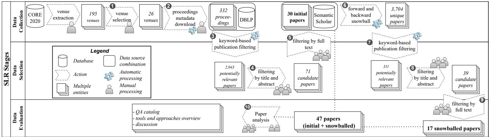
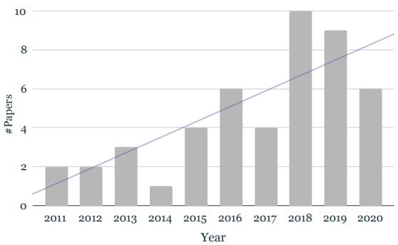
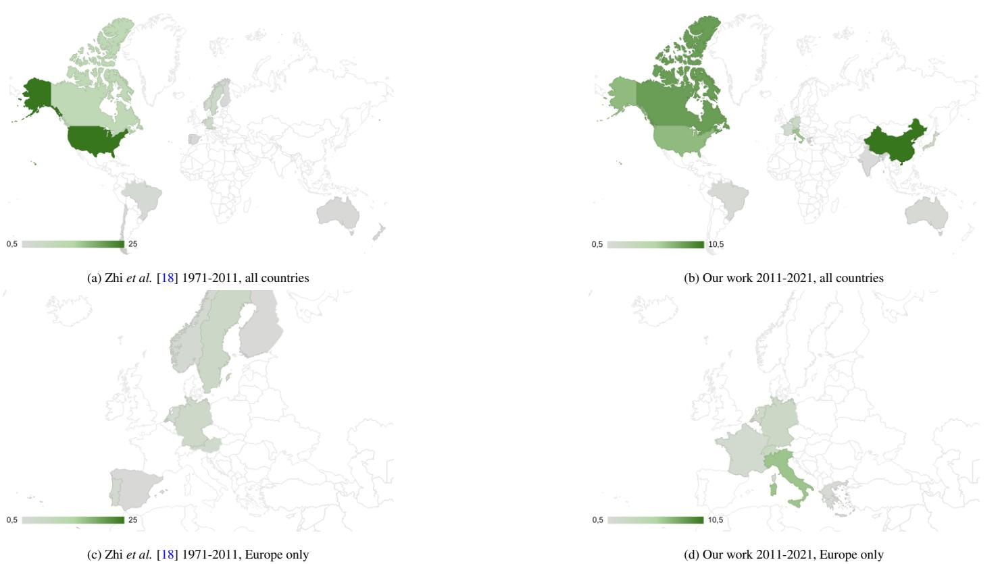
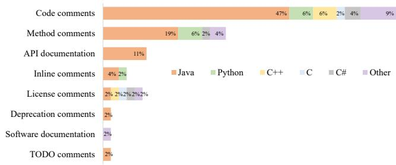
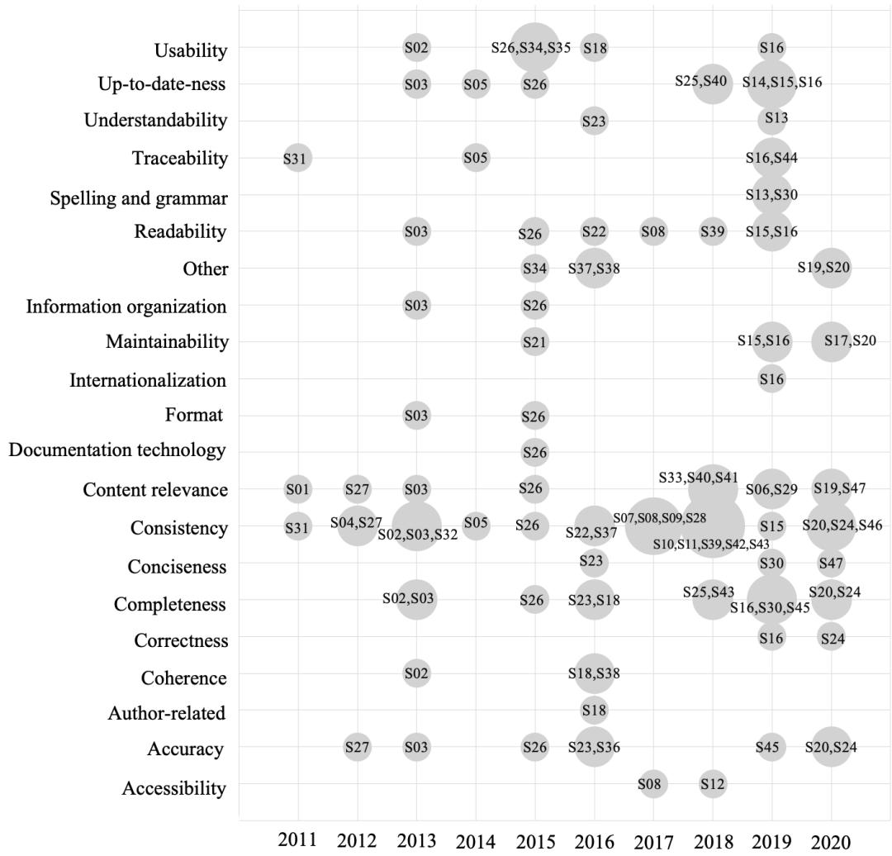
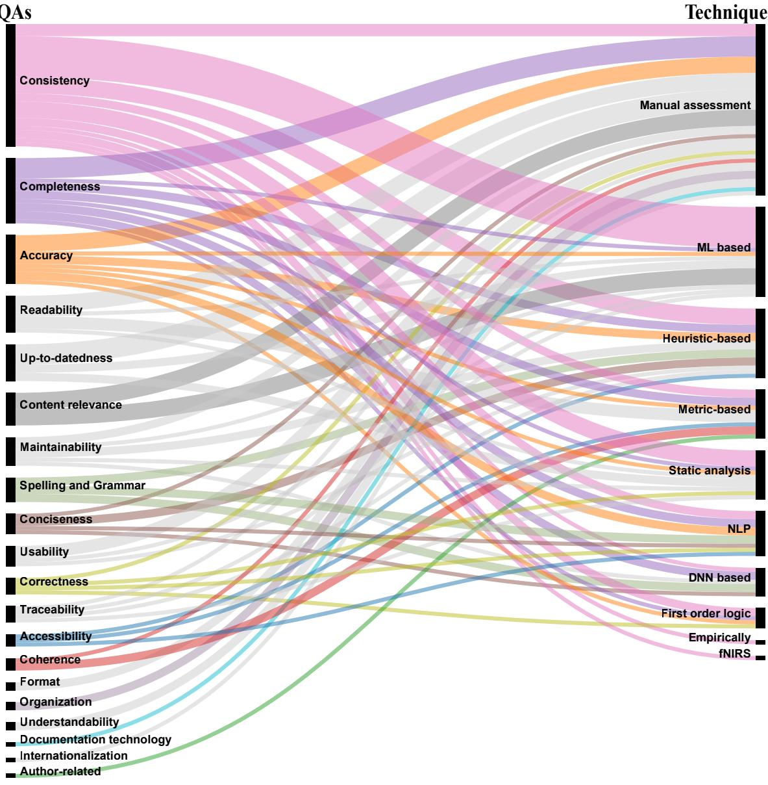
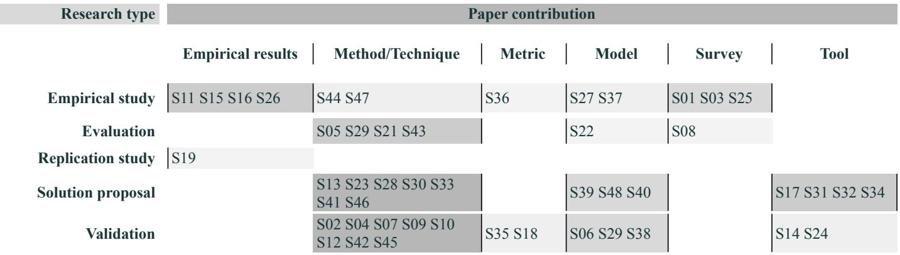
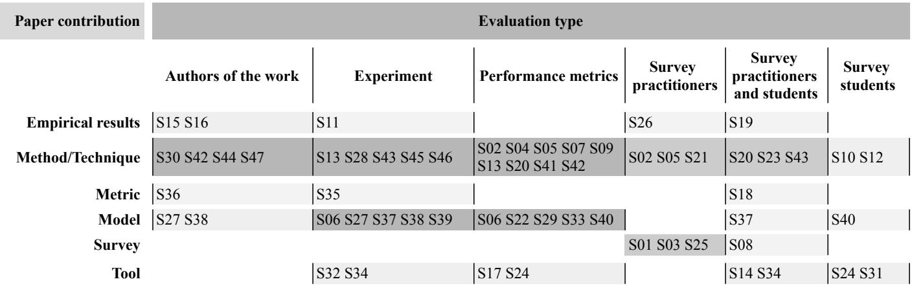

# A Decade of Code Comment Quality Assessment: A Systematic Literature Review

Pooja Rania, Arianna Blasib, Nataliia Stulovaa, Sebastiano Panichellac, Alessandra Gorlad, Oscar Nierstrasza aSoftware Composition Group, University of Bern, Bern, Switzerland bUniversità della Svizzera italiana, Lugano, Switzerland cZurich University of Applied Science, Zurich, Switzerland dIMDEA Software Institute, Madrid, Spain

# Abstract

Code comments are important artifacts in software systems and play a paramount role in many software engineering (SE) tasks related to maintenance and program comprehension. However, while it is widely accepted that high quality matters in code comments just as it matters in source code, assessing comment quality in practice is still an open problem. First and foremost, there is no unique definition of quality when it comes to evaluating code comments. The few existing studies on this topic rather focus on specific attributes of quality that can be easily quantified and measured. Existing techniques and corresponding tools may also focus on comments bound to a specific programming language, and may only deal with comments with specific scopes and clear goals (e.g., Javadoc comments at the method level, or in-body comments describing TODOs to be addressed).

In this paper, we present a Systematic Literature Review (SLR) of the last decade of research in SE to answer the following research questions: (i) What types of comments do researchers focus on when assessing comment quality? (ii) What quality attributes (QAs) do they consider? (iii) Which tools and techniques do they use to assess comment quality?, and (iv) How do they evaluate their studies on comment quality assessment in general?

Our evaluation, based on the analysis of 2353 papers and the actual review of 47 relevant ones, shows that (i) most studies and techniques focus on comments in Java code, thus may not be generalizable to other languages, and (ii) the analyzed studies focus on four main QAs of a total of 21 QAs identified in the literature, with a clear predominance of checking consistency between comments and the code. We observe that researchers rely on manual assessment and specific heuristics rather than the automated assessment of the comment quality attributes, with evaluations often involving surveys of students and the authors of the original studies but rarely professional developers.

Keywords: code comments, documentation quality, systematic literature review

# 1. Introduction

Software systems are often written in several programming languages [1], and interact with many hardware devices and software components [2, 3]. To deal with such complexity and to ease maintenance tasks, developers tend to document their software with various artifacts, such as design documents and code comments [4]. Several studies have demonstrated that high quality code comments can support developers in software comprehension, bug detection, and program maintenance activities [5, 6, 7]. However, code comments are typically written using natural language sentences, and their syntax is neither imposed by a programming language’s grammar nor checked by its compiler. Additionally, static analysis tools and linters provide limited syntactic support to check comment quality. Therefore, writing high-quality comments and maintaining them in projects is a responsibility mostly left to developers [8, 9].

The problem of assessing the quality of code comments has gained a lot of attention from researchers during the last decade [10, 11, 12, 13, 14]. Despite the research community’s interest in this topic, there is no clear agreement on what quality means when referring to code comments. Having a general definition of quality when referring to code comments is hard, as comments are diverse in purpose and scope.

Problem Statement. Maintaining high-quality code comments is vital for software evolution activities, however, assessing the overall quality of comments is not a trivial problem. As developers use various programming languages, adopt project-specific conventions to write comments, embed different kinds of information in a semi-structured or unstructured form [15, 13], and lack quality assessment tools for comments, ensuring comment quality in practice is a complex task. Even though specific comments follow all language-specific guidelines in terms of syntax, it is still challenging to determine automatically whether they satisfy other quality aspects, such as whether they are consistent or complete with respect to the code or not [16]. There are various such aspects, e.g., readability, content relevance, and correctness that should be considered when assessing comments, but tools do not support all of them. Therefore, a comprehensive study of the specific attributes that influence code comment quality and techniques proposed to assess them is essential for further improving comment quality tools.

Previous mapping and literature review studies have collected numerous quality attributes (QAs) that are used to assess the quality of software documentation based on their importance and effect on the documentation quality. Ding et al. [17] focused specifically on software architecture and requirement documents, while Zhi et al. [18] analyzed code comments along with other types of documentation, such as requirement and design documents. They identified 16 QAs that influence the quality of software documentation. However, the identified QAs are extracted from a body of literature concerning relatively old studies (i.e., studies conducted prior to the year 2011) and are limited in the context of code comments. For instance, only $10 \%$ of the studies considered by Zhi et al. concern code comments. Given the increasing attention that researchers pay to comment quality assessment, it is essential to know which QAs, tools and techniques they propose to assess code comment quality.

To achieve this objective, we perform an SLR on studies published in the last decade, i.e., 2011-2020. We review 2353 studies and find 47 to be relevant to assessing comment quality. From these we extract the programming language, the types of analyzed comments, QAs for comments, techniques to measure them, and the preferred evaluation type to validate their results.

We observe that (i) most of the studies and techniques focus on comments in Java code, (ii) many techniques that are used to assess QAs are based on heuristics and thus may not be generalizable to other languages, (iii) a total of 21 QAs are used across studies, with a clear dominance of consistency, completeness, accuracy, and readability, and (iv) several QAs are often assessed manually rather than with the automated approaches. We find that the studies are typically evaluated by measuring performance metrics and surveying students rather than by performing validations with practitioners. This shows that there is much room for improvement in the state of the art of comment quality assessment.

The contributions of this paper are:

i) an SLR of a total of 2353 papers, of which we review the 47 most relevant ones, focusing on QAs mentioned and research solutions proposed to assess code comment quality,   
ii) a catalog of 21 QAs of which four QAs are often investigated, while the majority is rarely considered in the studies, and of which 10 are new with respect to the previous study by Zhi et al. [18],   
iii) a catalog of methods used to measure these 21 QAs in research studies,   
iv) an overview of the approaches and tools proposed to assess

comment quality, taking into account the types of comments and the programming languages they consider,

v) a discussion of the challenges and limitations of approaches and tools proposed to assess different and complementary comment QAs, and

vi) a publicly available dataset including all validated data, and steps to reproduce the study in the replication package.1

Paper structure. The rest of the paper is organized as follows. In section 2 we highlight our motivation and rationale behind each research question, and we present our methodology, including the different steps performed to answer our research questions. In section 3 we report the study results. We discuss the results in section 4 and their implications and future direction in section 5. We highlight the possible threats to validity for our study in section 6. Then section 7 summarizes the related work, in relation to the formulated research questions. Finally, section 8 concludes our study, outlining future directions.

# 2. Study Design

The main objective of our study is to present an overview of the state of the art in assessing the quality of code comments. Specifically, we aim to highlight the QAs mentioned in the literature, and the techniques used so far to assess comment quality. To this end, we carry out an SLR, following the widely accepted guidelines of Kitchenham et al. [19] and Keele [20]. The first step in this direction is to specify the research questions related to the topic of interest [19]. The following steps focus on finding a set of relevant studies that are related to the research questions based on an unbiased search strategy.

# 2.1. Research questions

Our goal is to foster research that aims at building code comment assessment tools. To achieve this goal, we conduct an SLR, investigating the literature of the last decade to identify comment related QAs and solutions that address related challenges. We formulate the following research questions:

• $\mathbf { R Q _ { 1 } }$ : What types of comments do researchers focus on when assessing comment quality? Motivation: Comments are typically placed at the beginning of a file, usually to report licensing or author information, or placed preceding a class or function to document the overview of a class or function and its implementation details. Depending on the specific type of comment used in source code and the specific programming language, researchers may use different techniques to assess them. These techniques may not be generalizable to other languages. For example, studies analyzing class comments in object-oriented programming languages may need extra effort to generalize the comment assessment approach to functional programming languages. We, therefore, investigate the comment types researchers target.

• $\mathbf { R } \mathbf { Q } _ { 2 }$ : What QAs do researchers consider in assessing comment quality?

Motivation: QAs may solely concern syntactic aspects of the comments (e.g., syntax of comments), writing style (e.g., grammar), or content aspects (e.g., consistency with the code). Researchers may use different terminology for the same QA and thus these terms must be mapped across studies to obtain a unifying view of them, for instance, if the accuracy QA is defined consistently across studies or another terminology is used for it. We collect all the possible QAs that researchers refer to and map them, if necessary, following the methodology of Zhi et al.. Future studies that aim to improve specific aspects of comment quality evaluation can use this information to design their tools and techniques.

• $\mathbf { R Q } _ { 3 }$ : Which tools and techniques do researchers use to assess comment QAs?

Motivation: Researchers may assess QAs manually, or may use sophisticated tools and techniques based on simple heuristics or complex machine learning (ML) to assess them automatically. We aim to identify if there are clear winning techniques for this domain and collect various metrics and tools used for this purpose.

• $\mathbf { R Q } _ { 4 }$ : What kinds of contribution do studies often make?

Motivation: Engineering researchers usually motivate their research based on the utility of their results. Auyang clarifies that engineering aims to apply scientific methods to real world problems [21]. However, software engineering currently lacks validation [22]. With this question, we want to understand what types of solution researchers contribute to improving automatic comment quality assessment, such as metrics, methods, or tools. This RQ can provide insight into specific kinds of solutions for future work.

• $\mathbf { R Q } _ { 5 }$ : How do researchers evaluate their comment quality assessment studies?

Motivation: Researchers may evaluate their comment assessment approaches, e.g., by surveying developers, or by using a dataset of case studies. However, how often they involve professional developers and industries in such studies is unknown.

# 2.2. Search Strategy

After formulating the research questions, the next steps focus on finding relevant studies that are related to the research questions. In these steps, we

1. construct search keywords in subsection 2.2.1,   
2. choose the search timeline in subsection 2.2.2,   
3. collect sources of information in subsection 2.2.3,   
4. retrieve studies in subsection 2.2.4,   
5. select studies based on the inclusion/exclusion criteria in subsection 2.2.5, and   
6. evaluate the relevant studies to answer the research questions in subsection 2.2.6.

# 2.2.1. Search Keywords

Kitchenham et al. recommended formulating individual facets or search units based on the research questions [19]. These search units include abbreviations, synonyms and other spellings, and they are combined using boolean operators. Pettricrew et al. suggested PIO (population, interventions, and outcome) criterion to define such search units [23].

The populations include terms related to the standards. We first examine the definitions of documentation and comment in IEEE Standard Glossary of Software Engineering Terminology (IEEE Standard 610.12-1990) to collect the main keywords. According to the definition, we identify the keywords comment, documentation, and specification and add them to the set $K _ { 1 }$ . We further add frequently mentioned comment-related keywords, such as $A P I$ , annotation, and summar to the set $K _ { 1 }$ .

The interventions include terms that are related to software methodology, tools, technology, or procedures. With respect to quality assessment, we define the intervention keywords to be quality, assess, metric, measure, score, analy, practice, structur, study, or studied and add them to the set $K _ { 2 }$ .

Note that we add common variations of the words manually, for example, we add “summar” keyword to the set to cover both “summary” and “summarization”. We do not use any NLP libraries to stem words due to two main reasons, (i) to reduce the noisy matches, and (ii) the words from the title and abstract of the papers are not preprocessed (stemmed or lemmatized), therefore stemming the keywords might not find the exact or prefix matches. For example, using the porter stemming approach, the word “study” will be stemmed to “studi” and we might miss the papers with “study” word. To avoid such cases, we add common variations of this word study and studied to our search keywords.

The outcomes include terms that are related to factors of significance to developers (e.g., reduced cost, reduced time to assess quality). Since it is not a required unit to restrict the search scope, and our focus is on all kinds of quality assessment approaches, we exclude the outcomes in our search keywords. However, to narrow down our search and exclude irrelevant papers, such those about code reviews or testing, or non-technical papers, we formulate another set of keywords, $K _ { 3 }$ . In this set, we include code review, test, keynote, invited, and poster, to exclude entries of non-technical papers that were not filtered out using the heuristics on the number of pages.

  
Figure 1: SLR stages to collect relevant papers

Table 1: keywords selected according to PIO criterion   

<table><tr><td>Criteria</td><td>keywords</td></tr><tr><td>Populations (K1)</td><td>comment, documentation, specifica-</td></tr><tr><td rowspan="4">Interventions (K2)</td><td>tion, API, annotation, and summar</td></tr><tr><td>quality, assess, metric, measure,</td></tr><tr><td>score, analy, practice, structur, study,</td></tr><tr><td>and studied</td></tr></table>

Hence, using the final set of keywords (also given in Table 1), we select a paper if its title and abstract match the keywords from $K _ { 1 }$ and $K _ { 2 }$ but not from $K _ { 3 }$ where the prefix function is used to match the keywords in the paper.

# 2.2.2. Timeline

We focus our SLR on the last decade (i.e., January 2011- December 2020) since Zhi et al. investigated the works on software documentation quality — including code comments — from 1971 to 2011 [18]. Our results can thus be used to observe the evolution of comment quality assessment, but, more importantly, they naturally complement the existing body of knowledge on the topic.

We then proceed to the main steps i.e., retrieving the paper data, selecting venues, and identifying the relevant papers for our comment context.

# 2.2.3. Data collection

Concretely, our data collection approach comprises three main steps, i.e., literature data collection, data selection, and data evaluation, which we sketch in Figure 1 and present in further detail as follows:

We now describe how we automatically collect the data from the literature, explaining the rationale behind our selection of venues and our automatic keyword-based filtering to identify the likely relevant papers regarding comment quality assessment. We justify the need for another step of data gathering based on the snowball approach in Section 2.2.5. Finally, we present our criteria for the careful evaluation of the relevant papers in Sec 2.2.6.

Venue Selection. Code comment analysis, generation, usage, and maintenance are of primary interest to the SE research community. Thus, in order to systematically review the literature on the comment quality assessment, we start by focusing on the SE venues. We use the latest 2020 updated version of the conference and journal database of the CORE ranking portal as a primary data source to identify all the potentially relevant SE venues.2 The portal provides assessments of major conferences and journals in the computing disciplines, and it is a well-established and regularly-validated registry maintained by the academic community. We extract all ranked journals in SE (search code 803) from the CORE portal3 and all top conferences and workshops in the SE field (search code 4612).4 This process gives us an initial list of 85 journal and 110 conference venues. We select in step $\bullet 2 6$ software engineering (SE) conferences and journals from 195 candidate venues based on the likelihood of finding relevant papers in their proceedings.

We focus on $\mathbf { A } ^ { * }$ and A conferences and journals, and add conferences of rank B or $\textrm { C }$ if they are co-located with previously selected $\mathbf { A } ^ { * }$ and A conferences to have venues, such as the IEEE/ACM International Conference on Program Comprehension (ICPC) or the IEEE International Workshop on Source Code Analysis and Manipulation (SCAM) that focus on source code comprehension and manipulation.

We prune venues that may not contain relevant contributions to source code comments. Specifically, we exclude a venue if its ten years of proceedings contain fewer than five occurrences of the words documentation or comment. This way, we exclude conferences, such as IEEE International Conference on Engineering of Complex Computer Systems (ICECCS), Foundations of Software Science and Computational Structures (FoSSaCS), and many others that primarily focus on other topics, such as verification or programming languages. Thus, we reduce our dataset to 20 conferences and six journals, as shown in Table 2.

In Table 2, the column Type specifies whether a venue is a conference (C) or a journal (J), and the column Rank denotes the corresponding CORE rank of the venue as of April 2021. The column Selection indicates the data collection phase in which the venue was first selected. The column Papers per venue indicates the total number of papers selected from this venue, both during the direct search and the snowball search.

We consider only full papers (published in a technical track and longer than five pages) since they are likely to be an extended or mature version of the papers published in other tracks,

such as NIER, ERA, or Poster.

# 2.2.4. Data Retrieval

We retrieve in step $\pmb { \theta }$ the proceedings from January 2011 to December 2020 of the selected venues from the DBLP digital library. From each paper, we collect its metadata using the GitHub repository5, such as the title, authors, conference track (if present), its page length, and its Digital Object Identifier (DOI), directly from DBLP for a total of 17554 publications. For each paper, the DOI is resolved and its abstract is collected from the publisher webpage.

Keyword-based filtering. We apply in step $\bullet$ a keyword-based search (given in subsubsection 2.2.1) using a prefix function to the retrieved proceedings to select potentially relevant papers. We account for possible upper- and lowercase letters in the keywords, and sometimes use variations of keywords (e.g., singular and plural forms).

Our filtering will get papers (whose title and abstract include keywords from $K _ { 1 }$ and $K _ { 2 }$ but not from $K _ { 3 }$ ) that explicitly mention concepts we are interested in, e.g., “A Human Study of Comprehension and Code Summarization” from ICPC 2020 [24] is matched by keywords summar from $K _ { 1 }$ in the title and quality from $K _ { 2 }$ in the abstract, but will exclude papers not sufficiently close to our research subject, e.g., “aComment: mining annotations from comments and code to detect interrupt related concurrency bugs” from ICSE 2011 has two keywords comment and annotation from $K _ { 1 }$ but none from the $K _ { 2 }$ .

The final set of keywords we use for filtering is the result of an iterative approach: we manually scan the full venue proceedings metadata to make sure the set of keywords did not prune relevant papers, and we refine the set of keywords during several iterative discussions. This iterative approach gives us confidence that our keyword-based filtering approach does not lead to false negatives for the selected venues. After applying the keyword-based filtering, we identify 2043 studies as potentially-relevant papers from a total of 17554, which we review manually.

Table 2: Included Journals, Conferences, and Workshops.   

<table><tr><td>Venue</td><td>Abbreviation</td><td>Rank</td><td>Type</td><td>Selection</td><td>Papers per venue</td></tr><tr><td>ACM Computing Surveys</td><td>CSUR</td><td>A*</td><td>J</td><td>search</td><td></td></tr><tr><td>ACM Transactions on Software Engineering and Methodology</td><td>TOSEM</td><td>A*</td><td>J</td><td>search</td><td></td></tr><tr><td>IEEE Transactions on Software Engineering</td><td>TSE</td><td>A*</td><td>J</td><td>search</td><td>5</td></tr><tr><td>Empirical Software Engineering: an international journal</td><td>EMSE</td><td>A</td><td>J</td><td>search</td><td>6</td></tr><tr><td>Journal of Systems and Software</td><td>JSS</td><td>A</td><td>J</td><td>search</td><td>2</td></tr><tr><td>Information and Software Technology</td><td>IST</td><td>A</td><td>J</td><td>search</td><td>1</td></tr><tr><td>ACM SIGSOFT Symposium on the Foundations of Software Engineering</td><td>ESEC/FSE</td><td>A*</td><td>C</td><td>search</td><td>3</td></tr><tr><td>International Conference on Software Engineering</td><td>ICSE</td><td>A*</td><td>C</td><td>search</td><td>6</td></tr><tr><td>Architectural Support for Programming Languages and Operating Systems</td><td>ASPLOS</td><td>A*</td><td>C</td><td>search</td><td></td></tr><tr><td>Computer Aided Verification</td><td>CAV</td><td>A*</td><td>C</td><td>search</td><td></td></tr><tr><td>International Conference on Functional Programming</td><td>ICFP</td><td>A*</td><td>C</td><td>search</td><td></td></tr><tr><td>ACM Conference on Object Oriented Programming Systems Languages and Applications</td><td>OOPSLA</td><td>A*</td><td>C</td><td>search</td><td>1</td></tr><tr><td>ACM-SIGPLAN Conference on Programming Language Design and Implementation</td><td>PLDI</td><td>A*</td><td>C</td><td>search</td><td></td></tr><tr><td>ACM-SIGACT Symposium on Principles of Programming Languages</td><td>POPL</td><td>A*</td><td>C</td><td>search</td><td></td></tr><tr><td>Measurement and Modeling of Computer Systems</td><td>SIGMETRICS</td><td>A*</td><td>C</td><td>search</td><td></td></tr><tr><td>Automated Software Engineering Conference</td><td>ASE</td><td>A</td><td>C</td><td>search</td><td>2</td></tr><tr><td>International Conference on Evaluation and Assessment in Software Engineering</td><td>EASE</td><td>A</td><td>C</td><td>search</td><td>1</td></tr><tr><td>International Symposium on Empirical Software Engineering and Measurement</td><td>ESEM</td><td>A</td><td>C</td><td>search</td><td>1</td></tr><tr><td>IEEE International Conference on Software Maintenance and Evolution</td><td>ICSME</td><td>A</td><td>C</td><td>search</td><td>2</td></tr><tr><td>IEEE International Working Conference on Mining Software Repositories</td><td>MSR</td><td>A</td><td>C</td><td>search</td><td>1</td></tr><tr><td>International Symposium on Software Reliability Engineering</td><td>ISSRE</td><td>A</td><td>C</td><td>search</td><td></td></tr><tr><td>IEEE International Working Conference on Software Visualisation</td><td>VISSOFT</td><td>B</td><td>C</td><td>search</td><td></td></tr><tr><td>IEEE International Conference on Global Software Engineering</td><td>ICGSE</td><td>C</td><td>C</td><td>search</td><td></td></tr><tr><td>IEEE International Conference on Program Comprehension</td><td>ICPC</td><td>C</td><td>C</td><td>search</td><td>5</td></tr><tr><td>International Workshop on Modelling in Software Engineering</td><td>MISE</td><td>C</td><td>C</td><td>search</td><td></td></tr><tr><td>IEEE International Workshop on Source Code Analysis and Manipulation</td><td>SCAM</td><td>C</td><td>C</td><td>search</td><td>1</td></tr><tr><td>International Conference on Web Information Systems and Applications</td><td>WISA</td><td>-</td><td>C</td><td>snowball</td><td>1</td></tr><tr><td>Software Quality Journal</td><td>-</td><td>C</td><td>J</td><td>snowball</td><td>1</td></tr><tr><td>Software: Practice and Experience</td><td>SPE</td><td>B</td><td>J</td><td>snowball</td><td>1</td></tr><tr><td>ACM Symposium on Applied Computing</td><td>SAC</td><td>B</td><td>C</td><td>snowball</td><td>1</td></tr><tr><td>IEEE Workshop on Machine Learning Techniques for Software Quality Evaluation</td><td>MaLTeSQuE</td><td>-</td><td>C</td><td>snowball</td><td>1</td></tr><tr><td>Journal of Software: Evolution and Process</td><td>JSEP</td><td>B</td><td>J</td><td>snowball</td><td>1</td></tr><tr><td>Asia-Pacific Symposium on Internetware</td><td>Internetware</td><td>-</td><td>C</td><td>snowball</td><td>1</td></tr><tr><td>IEEE International Joint Conference on Neural Networks</td><td>IJCNN</td><td>A</td><td>C</td><td>snowball</td><td>1</td></tr><tr><td>International Computer Software and Applications Conference</td><td>COMPSAC</td><td>B</td><td>C</td><td>snowball</td><td>1</td></tr><tr><td>Asia-Pacific Software Engineering Conference</td><td>APSEC</td><td>B</td><td>C</td><td>snowball</td><td>1</td></tr><tr><td>International journal of software engineering and knowledge engineering</td><td>SEKE</td><td></td><td>J</td><td>snowball</td><td>1</td></tr></table>

# 2.2.5. Data selection

We analyze $\pmb { \ 0 }$ the 2043 selected papers following the protocol where four authors or evaluators manually evaluate the papers based on the inclusion and exclusion criterion to ensure that they indeed assess comment quality.

# Inclusion criteria

I1 The topic of the paper is about code comment quality. I2 The study presents a model/technique/approach to assess code comments or software documentation including code comments.

# Exclusion criteria

E1 The paper is not in English.   
E2 It does not assess any form of quality aspects of comments e.g., content, style, or language used.   
E3 It is not published in a technical track.   
E4 It is a survey paper.   
E5 It is not a peer reviewed paper, or it is a pre-print.   
E6 It covers other documentation artifacts, i.e., not comments.   
E7 It is shorter than 5 pages.

Manual analysis. The selected papers were equally divided among four evaluators (i.e., two Ph.D. candidates and two faculty members) based on years of publications so that each evaluator gets papers from all venues, e.g., the first author evaluate proceedings from 2011 to 2013. We make sure that evaluators do not take decisions on papers they co-authored to avoid conflicts of interest. Each evaluator has at least two years of experience in the domain of comment analysis. Each paper is reviewed by three evaluators. The evaluators follow a threeiteration-based process to evaluate the assigned papers. In the first iteration, the first evaluator independently assesses the relevance of a paper based on the criteria by inspecting each paper’s title and abstract, to make an initial guess, then inspecting its conclusion to reach the final decision. In the next iteration, another evaluator reviews the paper and validates the previous decision by adding the label “agrees/disagrees with the first evaluator”. With this process, every publication selected in the final set is reviewed by at least two researchers. In case they do not agree, the third evaluator reviews it [25], and the final decision is taken based on the majority voting mechanism.

We decide, for instance, to include the study by Hata et al. [26], even though it only talks about links in comments. Though it does not explicitly describe any quality aspect of comments, it mentions the traceability of the links, which is a QA we consider in our study. All studies considered in our SLR together with their evaluation (the agreement and disagreement for each study) are available in our replication package.

Thus, we reduce 2043 papers to 71 candidate papers (i.e., $3 \%$ ) with a fair agreement according to Cohen’s Kappa $k { = } 0 . 3 6 )$ ). For all candidate papers, we read in step $\bullet$ their introduction, conclusion, and the study design (if needed), and discuss them amongst ourselves to ensure their relevance. During this analysis process, some additional papers were found to be irrelevant. For example, the study by Aghajani et al. seems relevant based on the title and abstract, but does not really evaluate code comments, and we thus discarded it [27]. With this process, 41 papers in total were discarded, reducing the relevant paper set to 30 papers.

Data gathering for snowballing. To include further relevant papers that we might have missed with the venue-based approach, we perform in step $\bullet$ a forward and backward snowballing approach for the 30 papers and retrieve a total of 3704 unique papers.

<table><tr><td>Snowball papers</td><td>Total</td><td>Unique</td><td>Selected</td></tr><tr><td>from citations</td><td>2610</td><td>1624</td><td>741</td></tr><tr><td>from references</td><td>3369</td><td>2080</td><td>2021</td></tr></table>

The column Total reports the total number of references and citations collected. The Unique column reports a total number of unique items (i.e., since relevant papers cover similar topics many references, and citations are shared across our set of studies). Finally, the column Selected reports the total number of unique references and citations whose publication year falls within our time frame range, i.e., 2011-2020.

Data selection from snowballing. We repeat in step $\textcircled{4}$ the same keyword-based filtering to these 3704 papers, as described in subsubsection 2.2.3. As a result, 311 papers were added for manual analysis. We repeat in step $\pmb { \Theta }$ the three-iteration based manual analysis process and find 39 additional candidate papers to analyze. After the second round of discussion $\bullet$ we keep 17 additional relevant papers. We find a total of 47 papers shown in Table 3 published in the venues shown in Table 2. In Table 3, the column Study $I D$ indicates the ID assigned to each paper, the column Title presents the title of the paper, and the column Year indicates the years in which the paper is published.

To further ensure the relevance of our search strategy, we search our keywords on popular publication databases, such as ACM, IEEE Xplore, Wiley etc. We search for our keywords in titles and abstracts.6 We retrieve 13 144 results from IEEE Xplore, and 10 567 from ACM for the same timeline (2011- 2020). We inspect first 200 results (sorted by relevance criterion on the publisher webpage) from each of these databases. We apply our inclusion and exclusion criterion to find the extent to which our venue selection criteria might have missed relevant papers. Our results from ACM show that $19 \%$ of the these papers are already covered by our search strategy but only $5 \%$ of them fulfilled our inclusion criterion. Nearly $81 \%$ of the papers are excluded due to their non-SE venue. Among these papers, $80 \%$ are unrelated to the code comment quality aspect while $1 \%$ of papers (two papers) that are related to code comments are missed due to two main reasons, (i) the venue not being indexed in CORE2020, and (ii) the paper being from a non-technical track. Similarly, the results from IEEE show that $30 \%$ of the papers are already covered by our search strategy but only $5 \%$ of them fulfilled the inclusion criterion. Nearly $69 \%$ of the papers are excluded due to their non-SE venue and unrelated to code comment quality aspect. We also find $1 \%$ papers that are relevant to our topic of interest but excluded due to the length criteria, specifically one of the paper is a poster paper and another is a short paper.

# 2.2.6. Data Evaluation

We work in step $\bullet$ on the full versions of the 47 relevant papers to identify the QAs and the approaches to assess comments. In case we cannot retrieve the full PDF version of a paper, we use university resources to access it. This affects only one paper by Sun et al., which requires payment to access the full version [41]. In case we cannot access a paper via any resource, we remove it from our list. We find no such inaccessible study.

We report all papers in an online shared spreadsheet on Google Drive to facilitate their analysis collaboratively. For each paper we extract common metadata, namely Publication year, Venue, Title, Authors, Authors’ country, and Authors’ affiliation. We then extract various dimensions (described in the following paragraphs) formulated to answer all research questions.

# 2.3. Data extraction for research questions

To answer RQ1 (What types of comments do researchers focus on when assessing comment quality?), we record the Comment scope dimension. It lists the scope of comments under assessment such as class, API, method (function), package, license, or inline comments. In case the comment type is not mentioned, we classify it as “code comments”. Additionally, we identify the programming languages whose comments are analyzed, and record this in the Language analyzed dimension.

To answer RQ2 (What QAs do researchers consider in assessing comment quality?), we identify various QAs researchers mention to assess comment quality. This reflects the various quality aspects researchers perceive as important to have high-quality comments. Table 4 lists the QAs in the Quality attribute (QA) column and their brief summary in the Description column. Of these QAs, several are mentioned by

Table 3: Included studies   

<table><tr><td>Study ID</td><td>Title</td><td>Year</td><td>Reference</td></tr><tr><td>S01</td><td>How Good is Your Comment? A Study of Comments in Java Programs.</td><td>2011</td><td>[28]</td></tr><tr><td>S02</td><td>Quality Analysis of Source Code comments.</td><td>2013</td><td>[11]</td></tr><tr><td>S03</td><td>Evaluating Usage and Quality of Technical Software Documentation: An Empirical Study.</td><td>2013</td><td>[29]</td></tr><tr><td>S04</td><td>Inferring Method Specifications from Natural Language API Descriptions.</td><td>2012</td><td>[30]</td></tr><tr><td>S05</td><td>Using Traceability Links to Recommend Adaptive Changes for Documentation Evolution.</td><td>2014</td><td>[31]</td></tr><tr><td>S06</td><td>On Using Machine Learning to Identify Knowledge in API Reference Documentation.</td><td>2019</td><td>[32]</td></tr><tr><td>S07</td><td>Detecting Fragile Comments.</td><td>2017</td><td>[12]</td></tr><tr><td>S08</td><td>Automatically Assessing Code Understandability: How Far are We?</td><td>2017</td><td>[33]</td></tr><tr><td>S09</td><td>Analyzing APIs Documentation and Code to Detect Directive Defects.</td><td>2017</td><td>[16]</td></tr><tr><td>S10</td><td>The Effect of Poor Source Code Lexicon and Readability on Developers&#x27; Cognitive Load.</td><td>2018</td><td>[34]</td></tr><tr><td>S11</td><td>A Large-Scale Empirical Study on Linguistic Antipatterns Affecting APIs.</td><td>2018</td><td>[35]</td></tr><tr><td>S12</td><td>Improving API Caveats Accessibility by Mining API Caveats Knowledge Graph.</td><td>2018</td><td>[3]</td></tr><tr><td>S13</td><td>A Learning-Based Approach for Automatic Construction of Domain Glossary from Source Code and Documentation.</td><td>2019</td><td>[37]</td></tr><tr><td>S14</td><td>A Framework for Writing Trigger-Action Todo Comments in Executable Format.</td><td>2019</td><td>[38]</td></tr><tr><td>S15</td><td>A Large-Scale Empirical Study on Code-Comment Inconsistencies.</td><td>2019</td><td>[14]</td></tr><tr><td>S16</td><td>Software Documentation Issues Unveiled.</td><td>2019</td><td>[39]</td></tr><tr><td>S17</td><td>The Secret Life of Commented-Out Source Code.</td><td>2020</td><td>[40]</td></tr><tr><td>S18</td><td>Code Comment Quality Analysis and Improvement Recommendation: An Automated Approach</td><td>2016</td><td>[41]</td></tr><tr><td>S19</td><td>A Human Study of Comprehension and Code Summarization.</td><td>2020</td><td>[24]</td></tr><tr><td>S20</td><td>CPC: Automatically Classifying and Propagating Natural Language Comments via Program Analysis.</td><td>2020</td><td>[42]</td></tr><tr><td>S21</td><td>Recommending Insightful Comments for Source Code using Crowdsourced Knowledge.</td><td>2015</td><td>[43]</td></tr><tr><td>S22</td><td>Improving Code Readability Models with Textual Features.</td><td>2016</td><td>[44]</td></tr><tr><td>S23</td><td>Automatic Source Code Summarization of Context for Java Methods.</td><td>2016</td><td>[45]</td></tr><tr><td>S24</td><td>Automatic Detection and Repair Recommendation of Directive Defects in Java API Documentation.</td><td>2020</td><td>[46]</td></tr><tr><td>S25</td><td>Measuring Program Comprehension: A Large-Scale Field Study with Professionals.</td><td>2018</td><td>[47]</td></tr><tr><td>S26</td><td>Usage and Usefulness of Technical Software Documentation: An Industrial Case Study</td><td>2015</td><td>[48]</td></tr><tr><td>S27</td><td>What Should Developers be Aware of? An Empirical Study on the Directives of API Documentation.</td><td>2012</td><td>[49]</td></tr><tr><td>S28</td><td>Analysis of License Inconsistency in Large Collections of Open Source Projects.</td><td>2017</td><td>[50]</td></tr><tr><td>S29</td><td>Classifying Code Comments in Java Software Systems.</td><td>2019</td><td>[51]</td></tr><tr><td>S30</td><td>Augmenting Java Method Comments Generation with Context Information based on Neural Networks.</td><td>2019</td><td>[52]</td></tr><tr><td>S31</td><td>Improving Source Code Lexicon via Traceability and Information Retrieval.</td><td>2011</td><td>[53]</td></tr><tr><td>S32</td><td>Detecting API Documentation Errors.</td><td>2013</td><td>[54]</td></tr><tr><td>S33</td><td>Analyzing Code Comments to Boost Program Comprehension</td><td>2018</td><td>[55]</td></tr><tr><td>S34</td><td>Recommending Reference API Documentation.</td><td>2015</td><td>[56]</td></tr><tr><td>S35</td><td>Some Structural Measures of API Usability</td><td>2015</td><td>[57]</td></tr><tr><td>S36</td><td>An Empirical Study of the Textual Similarity between Source Code and Source Code Summaries.</td><td>2016</td><td>[58]</td></tr><tr><td>S37</td><td>Linguistic Antipatterns: What They are and How Developers Perceive Them.</td><td>2016</td><td>[59]</td></tr><tr><td>S38</td><td>Coherence of Comments and Method Implementations: A Dataset and An Empirical Investigation</td><td>2016</td><td>[60]</td></tr><tr><td>S39</td><td>A Comprehensive Model for Code Readability</td><td>2018</td><td>[61]</td></tr><tr><td>S40</td><td>Automatic Detection of Outdated Comments During Code Changes</td><td>2018</td><td>[62]</td></tr><tr><td>S41</td><td>Classifying Python Code Comments Based on Supervised Learning</td><td>2018</td><td>[63]</td></tr><tr><td>S42</td><td>Investigating Type Declaration Mismatches in Python</td><td>2018</td><td>[64]</td></tr><tr><td>S43</td><td>The Exception Handling Riddle: An Empirical Study on the Android API.</td><td>2018</td><td>[65]</td></tr><tr><td>S45</td><td>Migrating Deprecated API to Documented Replacement: Patterns and Tool</td><td>2019</td><td>[66]</td></tr><tr><td>S46</td><td>A Topic Modeling Approach To Evaluate The Comments Consistency To Source Code</td><td>2020</td><td>[67]</td></tr><tr><td>S47</td><td>Comparing Identifiers and Comments in Engineered and Non-Engineered Code: A Large-Scale Empirical Study</td><td>2020</td><td>[68]</td></tr></table>

Table 4: RQ2 QAs mentioned by Zhi et al. (highlighted in bold) and other works   

<table><tr><td>Quality Attribute (QA)</td><td>Synonyms</td><td>Description</td></tr><tr><td>QAs mentioned by Zhi et al. Accessibility</td><td>availability, information hid-</td><td>whether comment content can be accessed or retrieved by developers or not</td></tr><tr><td></td><td>ing, easiness to find</td><td></td></tr><tr><td>Readability Spelling and grammar</td><td>clarity</td><td>the extent to which comments can be easily read by other readers grammatical aspect of the comment content</td></tr><tr><td>Trustworthiness</td><td>natural language quality</td><td>the extent to which developers perceive the comment as trustworthy</td></tr><tr><td>Author-related</td><td></td><td>identity of the author who wrote the comment</td></tr><tr><td>Correctness</td><td></td><td>whether the information in the comment is correct or not</td></tr><tr><td>Completeness</td><td>adequacy</td><td>how complete the comment content is to support development and maintenance</td></tr><tr><td></td><td></td><td>tasks or whether there is missing information in comments or not</td></tr><tr><td>Similarity Consistency</td><td>uniqueness, duplication uniformity, integrity</td><td>how similar the comment is to other code documents or code the extent to which the comment content is consistent with other documents or</td></tr><tr><td>Traceability</td><td></td><td>code the extent to which any modification in the comment can be traced, including</td></tr><tr><td></td><td></td><td>who performed it</td></tr><tr><td>Up-to-datedness Accuracy</td><td>preciseness</td><td>how the comment is kept up-to-date with software evolution accuracy or preciseness of the comment content. If the documentation is too</td></tr><tr><td></td><td></td><td>abstract or vague and does not present concrete examples, then it can seem im-</td></tr><tr><td>Information organization</td><td></td><td>precise. how the information inside a comment is organized in comments</td></tr><tr><td>Format</td><td>including visual models, use of examples</td><td>quality of documents in terms of writing style, description perspective, use of diagrams or examples, spatial arrangement, etc.</td></tr><tr><td>QAs mentioned by other works</td><td></td><td></td></tr><tr><td>Coherence</td><td></td><td>how comment and code are related to each other, e.g., method comment should be related to the method name(S02, S38)</td></tr><tr><td>Conciseness</td><td></td><td>the extent to which comments are not verbose and do not contain unnecessary</td></tr><tr><td>Content relevance</td><td></td><td>information (S23, S30, S47) how relevant the comment or part of the comment content is to a particular pur-</td></tr><tr><td></td><td></td><td>pose (documentation, communication) (S01, S03, S29, S41, S47)</td></tr><tr><td>Maintainability Understandability</td><td></td><td>the extent to which comments are maintainable (S15-S17,S20-S21) the extent to which comments contribute to understanding the system (S19, S23)</td></tr><tr><td>Usability</td><td>Usefulness</td><td>to which extent the comment can be used by readers to achieve their objectives</td></tr><tr><td></td><td></td><td>(S02, S16, S34, S35)</td></tr><tr><td>Documentation technology</td><td></td><td>whether the technology to write, generate, store documentation is current or not</td></tr><tr><td>Internationalization</td><td></td><td>the extent to which comments are correctly translated in other languages (S16)</td></tr><tr><td>Other</td><td></td><td>the study does not mention any QA and cannot be mapped to any of the above attributes</td></tr></table>

Zhi et al. in their work [18], and are highlighted by the bold text compared to QAs mentioned in other works. As Zhi et al. considered various types of documentation, such as requirement and architectural documents, not all attributes fit exactly into our study. For instance, the category “Format” includes the format of the documentation (e.g., UML, flow chart) in addition to the other aspects such as writing style of the document, use of diagrams etc. Although the format of the documentation is not applicable in our case due to our comment-specific interest, we keep other applicable aspects (writing style, use of diagram) of this QA. In addition to their QAs, we include any additional attribute mentioned in our set of relevant papers. If a study uses different terminology but similar meaning to QAs in our list, we map such QAs to our list and update the list of possible synonyms as shown in the column Synonyms in Table 4. In case we cannot map a study to the existing QAs, we map it to the Other category.

For the cases where the studies do not mention any specific QA and mention comment quality analysis in general, we map the study to the list of existing QAs or classify it as Other based on their goal behind the quality analysis. For example, Pascarella et al. identify various information types in comments to support developers in easily finding relevant information for code comprehension tasks and to improve the comment quality assessment [13]. They do not mention any specific QA, but based on their study goal of finding relevant information easily, we map their study to the content relevance QA. Similarly, we map other comment classification studies such as S06, S29, S33, and S41 to the content relevance attribute. At the same time, the studies on linguistic anti-patterns (LAs) are mapped to the consistency attribute, given that LAs are practices that lead to lexical inconsistencies among code elements, or between code and associated comments [59, 34, 35]. Additionally, the studies that mention the negation of the QAs such as inconsistency, incorrectness, or incompleteness are mapped to their antonyms as consistency, correctness, or completeness, respectively to prevent duplication.

RQ3 (Which tools and techniques do researchers use to assess comment QAs?) concerns various methods researchers use or propose to assess comment QAs, for instance, whether they use machine-learning based methods to assess comment quality or not.

Technique type. This identifies whether the technique used to assess a QA is based on natural language processing (NLP), heuristics, static analysis, metrics, machinelearning (ML), or deep neural network (DNN) approaches. The rationale is to identify which QAs are often assessed manually or using a specific automated approach. For instance, if the study uses specific heuristics related to the programming environment to assess a QA, it is classified as heuristic-based technique, if it uses abstract syntax tree (AST) based static analysis approaches, then it is assigned to static analysis, and if it uses machine-learning or deeplearning-based techniques (including any or both of the supervised or unsupervised learning algorithms), then it is classified as ML-based, or DNN-based respectively. A study can use mixed techniques to assess a specific QA and thus can be assigned to multiple techniques for the corresponding QA. We often find cases where the studies do not use any automated technique to measure a QA and instead ask other developers to assess it manually, so we put such cases into the manual assessment category. In case the study mentions a different technique, we extend the dimension values.

• Metrics or tools. This further elaborates specific metrics, or tools the studies propose or use to assess a QA. A study can use an existing metric or can propose a new one. Similarly, one metric can be used to assess multiple QAs. We identify such metrics to highlight popular metrics amongst researchers.

RQ4 (What kinds of contribution do studies often make?) captures the nature of the study and the type of contribution researchers use or propose to assess comment quality. We first identify the nature of research of a study and then identify the type of contribution it provides. This can reflect the kind of research often conducted to assess comment quality and the kind of contribution they make to support developers in assessing comment quality, for instance, what kind of solutions the Solution Proposal research often propose, such as a method, metric, model, or tool.

To capture this information, we formulate the following dimensions:

• Research type. This identifies the nature of the research approach used in the studies, such as empirical, validation, evaluation, solution proposal, philosophical, opinion, or experience paper [69, 70]. The dimension values are described in detail in Table 5.

• Paper contribution. This dimension describes the type of contribution the study provides in terms of a method/technique, tool, process, model, metric, survey, or empirical results [70]. The dimension values are described in detail in Table 5. If we cannot categorize it into any of these, we mark it “Other”.

• Tool availability. This reflects whether the tool proposed in the study is accessible or not at the time of conducting our study. González et al. identified the reproducibility aspects characterizing empirical software engineering studies [71] in which availability of the artifact (the tool proposed in the study, or the dataset used to conduct the study) is shown as an important aspect to facilitate the replication and extension of the study. Therefore, we record the availability of the proposed tool in this dimension and the availability of the dataset in the following dimension.

• Dataset availability. This reflects if the dataset used in the empirical study is accessible or not.

RQ5 (How do researchers evaluate their comment quality assessment studies?) concerns how various kinds of research (Research type dimension described in the previous RQ), and various kinds of contribution (Paper contribution dimension) are evaluated in the studies. For example, it helps us to observe that if a study proposes a new method/technique to assess comments, then the authors also conduct an experiment on opensource projects to validate the contribution, or they consult the project developers, or both. We capture the type of evaluation in the Evaluation type dimension, and its purpose in Evaluation purpose. The rationale behind capturing this information is to identify the shortcomings in their evaluations, e.g., how often the studies proposing a tool are validated with practitioners.

• Evaluation type. It states the type of evaluation the studies conduct to validate their approaches, such as conducting an experiment on open-source projects (Experiment), or surveying students, practitioners, or both. For the automated approaches, we consider various performance metrics, also known as Information Retrieval (IR) metrics, that are used to assess the machine/deep learning-based models, such as Precision, Recall, F1 Measure, or Accuracy under the performance metrics. In case the approach is validated by the authors of the work, we identify the evaluation type as Authors of the work.

• Evaluation purpose. It states the motivation of evaluation by authors such as evaluate the functionality, efficiency, applicability, usability, accuracy, comment quality in general, or importance of attributes.

# 3. Results

As mentioned in subsubsection 2.2.5, we analyze 47 relevant papers in total. Before answering our four RQs, we present a brief overview of the metadata (publishing venues) of the papers.

Table 2 highlights the publication venues of these papers. Most studies were published in top-tier software engineering conferences (e.g., ICSE) and journals, especially the ones with a focus on empirical studies (e.g., EMSE). This means that the SE community agrees that assessing comment quality is an important topic deserving of research effort. Figure 2 shows the paper distribution over the past decade, indicating a clear trend of increasing interest of the SE research community in comment quality assessment. Figure 3 shows the author distribution of the selected papers by the institution. For the timeline 1971-2011, we rely on the geographical statistics data from the replication package of our reference study by Zhi et al. [18], while for the period 2011-2021, and we collect these statistics as follows. For each paper, the primary affiliations of all authors are taken into account. If people from different countries co-authored a paper, we calculate the proportion of a country’s contribution for each paper so that each paper gets a total score of one to avoid over-representing papers. For example, if five authors of a paper belong to Switzerland and one belongs to Spain, we assign $5 / 6$ score for Switzerland and $1 / 6$ for Spain for the paper. Comparison with the previous data allows us to see the evolution of the field, with more even distribution of researchers nowadays and (unsurprising) rise of contributions from southeast Asia, specifically from China.

Table 5: Type of research approach studies use and type of contributions studies make   

<table><tr><td>Dimension</td><td>Category</td><td>Description</td></tr><tr><td>Research type</td><td>Empirical</td><td>This research ask focuses on understandingandhighlightigvarious problems by analyzing relevant projects, or surveying developers. These papers often provide empirical insights rather than a concrete technique.</td></tr><tr><td></td><td>Validation</td><td>This reearch tsk focuson vestigating the propertie o a tecniue hat is nove ands not yet plementin practice, e.g., techniques used for mathematical analysis or lab experimentation</td></tr><tr><td></td><td>Evaluation</td><td>The papevetiate he niques hat eplente  practic nd thvaluatins nduce  w the result  the lati tr   prs an cons nd thus el erers i - nique.</td></tr><tr><td></td><td>Solution Proposal</td><td>The paper proposes a novel or a significant extension of an existing technique for a problem and describes its applicability, intended use, components, and how e components ft together using  mall example r argumen-</td></tr><tr><td></td><td>Philosophical</td><td>tation. These papers present a new view to look at the existing problems by proposing a taxonomy or a conceptual a </td></tr><tr><td></td><td>Opinion</td><td>The paper deribe he uthor&#x27;ion  terms  how thi hould b done,    cerai tenis good or bad. They do not rely on research methodologies and related work.</td></tr><tr><td></td><td>Experience</td><td> p    has been done in practice. They do not propose a new technique and are not scientific experiments.</td></tr><tr><td>Contribution type</td><td>Empirical</td><td>The pape provide empirical results baseon analyzinelevant projects tounderstand and highlights the pro- lems related to comment quality.</td></tr><tr><td></td><td>Method/technique</td><td>The paper provides a novel or significant extension of an existing approach.</td></tr><tr><td></td><td>Model</td><td>Provides txonomy  dcribe thebservations  n tomat mode bas on machine/dee le</td></tr><tr><td></td><td>Metric</td><td>Provides a new metric to assess specific aspects of comments.</td></tr><tr><td></td><td>Survey</td><td>Conducts survey to understand a specific problem and contribute insights from developers.</td></tr><tr><td></td><td>Tool</td><td>Develops a tool to analyze comments.</td></tr></table>

  
Figure 2: Relevant papers by years

Finding 1. The trend of analyzing comment quality has increased in the last decade (2011-2020), in part due to more researchers from southeast Asia working on the topic.

# 3.1. $R Q _ { 1 }$ : What types of comments do researchers focus on when assessing comment quality?

To describe the rationale behind code implementation, various programming languages use source code comments. Our results show that researchers focus more on some programming languages compared to others as shown in Figure 4. This plot highlights the types of comments on the y-axis; each stack in the bar shows the ratio of the studies belonging to a particular language. For instance, the majority $(87 \% )$ of the studies focus on code comments from Java, whereas only $15 \%$ of the studies focus on code comments from Python, and $10 \%$ of them focus on $\mathbf { C } \#$ and $\mathrm { C } { + } { + }$ . These results are in contrast to popular languages indicated by various developer boards, such as GitHub, Stack Overflow, or TIOBE. For instance, the TIOBE index show Python and C languages more popular than Java.7 Similarly, the developer survey of 2019 and 2020 by Stack Overflow show that Java stands fifth after JavaScript, HTML/CSS, SQL, and Python among the most commonly used programming languages.8 We find only one study (S44) that seems to address the comment quality aspect in JavaScript. Given the emerging trend of studies leveraging natural-language information in JavaScript code [72, 73], more research about comment quality may be needed in this environment. It indicates that researchers need to analyze comments of other languages to verify their proposed approaches and support developers of other languages.

Finding 2. $87 \%$ of the studies analyze comments from Java while other languages have not yet received enough attention from the research community.

As code comments play an important role in describing the rationale behind source code, various programming languages use different types of comments to describe code at various abstraction levels. For example, Java class comments should present high-level information about the class, while method comments should present implementation-level details [74]. We find that half of the studies $5 1 \%$ of the studies) focus on all types of comments whereas the other half focus on specific types of comments, such as inline, method, or TODO comments. However, we also see in Figure 4 that studies frequently focus on method comments and API documentation. This proves the effort the research community is putting into improving API quality. While some attention is given to often overlooked kinds of comments, such as license comments (S28,S33), TODO comments (S14), inline comments (S17), and deprecation comments (S45), no relevant paper seems to focus specifically on the quality of class or package comments. Recently Rani et al. studied the characteristics of class comments of Smalltalk in the Pharo environment9 and highlighted the contexts they differ from Java and Python class comments, and why the existing approaches (based on Java, or Python) need heavy adaption for Smalltalk comments [75, 76]. This may encourage more research in that direction, possibly for other programming languages.

  
Figure 3: Relevant papers by countries

  
Figure 4: Types of comments per programming language

Finding 3. Even though $50 \%$ of the studies analyze all types of code comments, the rest focus on studying a specific type of comments such as method comments, or API comments, indicating research interest in leveraging a particular type of comment for specific development tasks.

Previous work by Zhi et al. showed that a majority of studies analyze just one type of system [18]. In contrast, our findings suggest that the trend of analyzing comments of multiple languages and systems is increasing. For example, $80 \%$ of the studies analyzing comments from Python and all studies analyzing comments from $\mathrm { C } { + } { + }$ also analyze comments from Java. Only Pascarella et al. (S42) and Zhang et al. (S41) focus solely on Python [64, 63]. However, Zhang et al. (S41) perform the comment analysis work in Python based on the Java study (S29) by Pascarella et al. [63, 13]. Such trends also reflect the increasing use of polyglot environments in software development [77]. The “Other” label in Figure 4 comprises language-agnostic studies, e.g., S16 or the studies considering less popular languages, e.g., S28 focuses on COBOL. We find only one study (S44) that analyzes comments of six programming languages et al. [26].

Finding 4. The trend of analyzing multiple software systems of a programming language, or of several languages, shows the increasing use of polyglot environments in software projects.

# 3.2. $R Q _ { 2 }$ : Which QAs are used to assess code comments?

To characterize the attention that the relevant studies reserve to each QA over the past decade, Figure 5 shows all the QAs on the y-axis and the corresponding years on the $\mathbf { X }$ -axis. Each bubble in the plot indicates both the number of papers by the size of the bubble and IDs of the studies. Comparing the y-axis with the QAs in Table 4 demonstrates that our analysis finds new QAs with respect to the previous work of Zhi et al. The 10 additional QAs are: usefulness, use of examples, usability, references, preciseness, natural language quality, maintainability, visual models, internationalization, documentation technology, content relevance, conciseness, coherence, and availability. However, not all QAs reported by Zhi et al. for software documentation quality (highlighted in bold in Table 4) are used in comment quality assessment. In particular, we find no mention of trustworthiness, and similarity QAs even though previous works have highlighted the importance of both QAs to have high-quality documentation [78, 79, 80]. Also, Maalej et al. showed in their study that developers trust code comments more than other kinds of software documentation [81], indicating the need to develop approaches to assess the trustworthiness of comments.

Finding 5. Compared to the previous work by Zhi et al., we find 10 additional QAs researchers use to assess code comment quality.

Although several QAs received attention in 2013, the detailed analysis shows that there were mainly two studies (S02, S03) covering several QAs. There is only one study published in 2014 (S05), while 2015 sees the first studies focusing on assessing comment quality. One in particular, S26, attempts to cover multiple QAs. The plot also shows which QAs receive the most attention. A few QAs such as completeness, accuracy, content relevance, readability are often investigated. The QA consistency is by far the one that receives constant and consistent attention across the years, with several in 2017 (S07, S08, S09, S29) and 2018 (S10, S11, S39, S42, S43). Indeed, the problem of inconsistency has been studied from multiple points of view, such as inconsistency between code and comments that may emerge after code refactoring (S07), or the inconsistencies revealed by so-called linguistic antipatterns (S11, S37). Unsurprisingly, the plot shows that up-to-dateness increasingly has received attention in the last three years of the decade, given that comments that are not updated together with code are also a cause of inconsistency (S15, S16).

A few attributes are rarely investigated, for instance the QAs investigated only by at most two studies over the past decade are format, understandability, spelling $\boldsymbol { \mathcal { E } } _ { \mathcal { F } }$ grammar, organization, internationalization, documentation technology, coherence, conciseness, author related and accessibility. More research would be needed to assess whether such attributes are intrinsically less important than others for comments according to practitioners.

Finding 6. While QAs such as consistency and completeness are frequently used to assess comment quality, others are rarely investigated, such as conciseness and coherence.

Another aspect to analyze is whether researchers perceive the QAs as being the same or not. For example, do all studies mean the same by consistency, conciseness, accuracy of comments? We therefore collect the definition of each QA considered in the study. We find that for various QAs researchers refer to the same QA but using different terminology. We map such cases to the Synonyms column presented in Table 4. From this analysis we find that not all studies precisely define the QAs, or they refer to their existing definitions while evaluating comments using them. For instance, the studies (S01, S04, S13, S17, S20, S29, S41) do not mention the specific QAs or their definition. We put such studies, classifying comment content with the aim to improve comment quality, under content relevance. On the other hand, in some studies researchers mention the QAs but not their definition. For instance, S26 refers to various existing studies for the QA definitions but which QA definition is extracted from which study is not very clear. Lack of precise definitions of QAs or having different definitions for the same QAs can create confusion among developers and researchers while assessing comment quality. Future work needs to pay attention to either refer to the existing standard definition of a QA or define it clearly in the study to ensure the consistency and awareness across developer and scientific communities. In this study, we focus on identifying the mention of QAs and their definition if given, and not on comparing and standardizing their definition. Such work would require not only the existing definitions available in the literature for QAs but also collecting how researchers use them in practice, and what developers perceive from each QA for source code comments, which is out of scope for this work. However, we provide the list of QAs researchers use for comment quality assessment to facilitate future work in mapping their definition and standardizing them for code comments.

  
Figure 5: Frequency of various comment quality QAs over year

Although each QA has its own importance and role in comment quality, they are not measured in a mutually exclusive way. We find cases where a specific QA is measured by measuring another QA. For example, accuracy is measured by measuring the correctness and completeness of comment, such as “the documentation is incorrect or incomplete and therefore no longer accurate documentation of an API.” (S24) Similarly, up-to-dateness is measured through consistency of comments (S40) or consistency is evaluated and improved using traceability (S31). This indicates the dependency of various QAs on each other, and improving one aspect of comments can automatically improve other related aspects. However, which techniques are used to measure which QAs is not yet known.

Finding 7. Many studies miss a clear definition of the QAs they use in their studies. This poses various challenges for developers and researchers, e.g., understanding what a specific QA means, mapping a QA to other similar QAs, and adapting the approaches to assess the QA to a certain programming environment.

3.3. $R Q _ { 3 }$ : Which tools and techniques do researchers use to assess comment QAs?

With respect to each QA, we first identify which techniques have been used to measure them. We use the dimension Technique type to capture the type of techniques. Figure 6 shows that the majority of the QAs are measured by asking developers to manually assess it (manual assessment). For instance, QAs such as coherence, format, organization, understandability, and usability are often assessed manually. This indicates the need and opportunities to automate the measurement of such QAs.

A significant number of studies experimented with various automated approaches based on machine or deep learning approaches, but they focus on specific QAs and miss other QAs such as natural language quality, conciseness, correctness, traceability, coherence etc. Similarly, another significant portion of studies uses heuristic-based approaches to measure various QAs. The limitation of such heuristic-based approaches is their applicability to other software systems and programming languages. More studies are required to verify the generalizability of such approaches.

Finding 8. Manual assessment is still the most frequently-used technique to measure various QAs. Machine learning based techniques are the preferred automated approach to asses QAs, but the majority of them focus on specific QAs, such as consistency, content relevance, and up-to-dateness, while ignoring other QAs.

We find that the majority of the machine learning-based approaches are supervised ML approaches. These approaches require labeling the data and are therefore expensive in terms of time and effort. To avoid the longer training time and memory consumption of ML strategies, Kallis et al. used fastText to classify the issues reports on GitHub [82]. The fastText tool uses linear models and has achieved comparable results in classification to various deep-learning based approaches. A recent study by Minaee et al. shows that deep learning-based approaches surpassed common machine learning-based models in various text analysis areas, such as news categorization and sentiment analysis [83]. We also find some studies that use deep learning-based techniques partly (S06, S13, S20) along with machine learning techniques for a few QAs, such as assessing conciseness, spelling and grammar, and completeness. However, there are still many QAs that are assessed manually and require considerable effort to support developers in automatically assessing comment quality.

Finding 9. In the case of automated approaches to assess various QAs of comments, we observe that deep-learning based approaches are not yet explored even though various studies showed that they surpassed ML-based approaches in text analysis areas.

We see that machine learning-based approaches are used more often than deep-learning approaches, but whether it is due to their high accuracy, easy interpretation, or need for a small dataset is unclear and requires further investigation.

In addition to identifying general techniques, we collect which metrics and tools have been used to measure various QAs. Table 6 shows various QAs in the column $Q A s$ , and metrics and tools used for each QA in the column Metrics, and Tools respectively. The description of the collected metrics is presented in Table 7. We can see that out of 21, only $1 0 \mathrm { \ : Q A s }$ have metrics defined for them.

A software metric is a function that takes some software data as input and provides a numerical value as an output. The output provides the degree to which the software possesses a certain attribute affecting its quality [84]. To limit the incorrect interpretation of the metric, threshold values are defined. However, the threshold value may change according to the type of comments analyzed, and the interpretation of the metric output may vary in turn. We report threshold values, if present, for the collected metrics.

For readability QA, researchers were often found to be using the same metric (S08, S22, S39). As developers spend significant amount of time reading code, including comments, having readable comment can help them in understanding code eas

Table 6: Metrics and tools used for various quality attributes.

Note: the description of each metric is given in Table 7 ier. Yet readability remains a subjective concept. Several studies, such as S08, S22, S39 identified various syntactic and textual features for source code and comments. However, in context of code comments, they focus on the Flesch-Kincaid index method, which is typically used to assess readability of natural language text. Since comments often consist of a mix of source code and natural language text, such methods can have disadvantages. For example, developers can refer to the same code concept differently in comments, and they can structure their information differently. Thus, formulating metrics that consider the special context of code comments can improve the the assessment of readability of comments.

<table><tr><td>QAs Metrics</td><td></td><td>Tools</td></tr><tr><td>Accessibility</td><td>S08: Accessibility_1, Accessibility_2</td><td>S12: Text2KnowledgeGraph</td></tr><tr><td>Readability</td><td>S08: Readability_1</td><td></td></tr><tr><td></td><td>S22: Readability_1</td><td></td></tr><tr><td></td><td>S39: Readability_1</td><td></td></tr><tr><td>Spelling and Grammar</td><td>S13: SpellGrammar_1</td><td></td></tr><tr><td>Correctness</td><td></td><td>S24: Drone</td></tr><tr><td>Completeness</td><td>S18: Completeness_1, Author_1</td><td>S24: Drone</td></tr><tr><td></td><td>S02: Completeness_2</td><td>S45: DAAMT</td></tr><tr><td>Consistency</td><td>S43: Completeness_3</td><td></td></tr><tr><td></td><td>S08: Consistency_1</td><td>S07: Fraco</td></tr><tr><td></td><td>S22: Consistency_1</td><td>S06: RecoDoc, AdDoc</td></tr><tr><td></td><td>S39: Consistency_1</td><td>S24: Drone</td></tr><tr><td></td><td>S46: Consistency_2</td><td>S31: Coconut</td></tr><tr><td></td><td>S28: LicenseConsistency_1</td><td>S09: Zhou et. al</td></tr><tr><td></td><td></td><td>S37: LAPD</td></tr><tr><td>Traceability</td><td></td><td>S42: PyID</td></tr><tr><td></td><td></td><td>S06: RecoDoc</td></tr><tr><td>Up-to-datedness</td><td></td><td>S31: Coconut</td></tr><tr><td></td><td></td><td>S06: RecoDoc, AdDoc</td></tr><tr><td>Accuracy</td><td></td><td>S14: Trigit</td></tr><tr><td></td><td>S36: Accuracy_1</td><td>S24: Drone</td></tr><tr><td>Coherence</td><td>S02. Coherence_1, Coherence_2</td><td>S45: DAAMT</td></tr><tr><td></td><td>S18: Coherence_3</td><td></td></tr><tr><td></td><td>S38: Coherence_4</td><td></td></tr><tr><td>Maintainability</td><td></td><td>S17: Pham et. al.</td></tr><tr><td>Understandability</td><td>S21: Coherence_4</td><td></td></tr><tr><td></td><td>S13: Understandability_1</td><td></td></tr><tr><td>Usability</td><td>S35: Usability_1</td><td>S34: Krec</td></tr></table>

  
Figure 6: Types of techniques used to analyze various QAs

Another popular metric is Consistency_1 used for assessing consistency between comments and code (S08, S22, S39). This metric measures the overlap between the terms of method comments and method body. These studies assume that the higher the overlap, better the readability of that code. Similarly, metrics (coherence_1 , coherence_3, coherence_4) used for measuring the coherence QA suggest higher overlap between comments and code. However, having too many overlapping words can defy the purpose of comments and can lead to redundant comments. Using such metrics, a comment containing only rationale information about a method or class might be qualified as an incoherent or inconsistent comment whereas such comments can be very helpful in providing additional important information. Although metrics can help developers easily estimate the quality of comments, their sensitivity towards various QAs can degrade comment quality overall. More research is required to know the implication of given metrics on various QAs or combinations of QAs.

Table 7: Description of each metric listed in Table 6   

<table><tr><td>Metrics</td><td>Description</td></tr><tr><td>Accessibility_1</td><td>MIDQ: (Documentable items of a method + readability of comments)/2. [S08]</td></tr><tr><td>Accessibility_2</td><td>AED: Identiy all Stack overflow discussions that have &quot;how to&quot; words and the class name in the tite. [S08]</td></tr><tr><td>Accuracy_1</td><td>    silarity, sente animilarity, an wor rdr milarity, L (Lightwe Smanti Similarity. [S36]</td></tr><tr><td>Author_1</td><td>A </td></tr><tr><td>Coherence_1</td><td>T The value should be between 0 and 0.5 to have a coherent comment. [S02]</td></tr><tr><td>Coherence_2</td><td>The length of comments should be between 2 words to 30 words. [S02]</td></tr><tr><td>Coherence_3</td><td>method&#x27;s words. The value should be above or equal to 0.5. [S18]</td></tr><tr><td>Coherence_4</td><td>T  lexical similarity is computed using cosine similarity. [S38]</td></tr><tr><td>Completeness_1</td><td>method invocation) and have 30 LOC. [S18]</td></tr><tr><td>Completeness_2</td><td>How many of the public classes, types, and methods have a comment preceding them. [S02]</td></tr><tr><td>Completeness_3 Consistency_1</td><td>a    e n   u o </td></tr><tr><td></td><td>CIC with a higerdability eve of that code. [08, S22, 39]</td></tr><tr><td>Consistency_2 LicenseConsistency_1</td><td>TheKulaLvhan et  bils [S </td></tr><tr><td></td><td>the GPL family. [S28]</td></tr><tr><td>Readability_1</td><td>Flesch reading-ease test. [S08, S22, S39]</td></tr><tr><td>SpellGrammar_1 Understandability_1</td><td>T    . </td></tr><tr><td></td><td>[S13]</td></tr><tr><td>Usability_1</td><td>ADI  declaration. [S35]</td></tr></table>

# 3.4. $R Q _ { 4 }$ : What kinds of contribution do studies often make?

Research types. As a typical development cycle can contain various research tasks, such as investigation of a problem, or validation of a solution, we collect which types of research are performed for the comment quality assessment domain, and what kinds of solutions researchers often contribute. We categorize the papers according to the research type dimension and show its results in Figure 7. The results show that the studies often conduct validation research (investigating the properties of a solution) followed by the solution proposal (offering a proof-of-concept method or technique). However, very few studies focus on evaluation research (investigating the problem or a technique implementation in practice). We find only one study performing a replication study (S19). Given the importance of research replicability in any field, future work needs to focus more on evaluating the proposed solution and testing their replicability in this domain.

  
Figure 7: Types of contribution for each research type

  
Figure 8: Types of evaluation for each paper contribution type

Paper contribution types. By categorizing the papers according to the paper contribution definition, Figure 7 and Figure 8 show that over $44 \%$ of papers propose an approach (method/technique) to assess code comments. A large part $( 7 5 \% )$ of them are heuristics-based approaches, e.g., Zhou et al. and Wang et al. present such NLP based heuristics (S9, S13). A few approaches rely on manual assessments. As an example, consider how taxonomies assessing comment quality have emerged [14, 39]. Models are the second contribution by frequency, which makes sense considering the increasing trend of leveraging machine learning during the considered decade: $60 \%$ of the relevant papers proposing models are based on such approaches. The label Empirical results comprises studies which mainly offer insights through authors’ observations (e.g., S11, S15, S16, S19, S26). Finally, given the important role that metrics have in software engineering [85, 86], it is valuable to look into metrics that are proposed or used to assess code comment quality as well. For example, three studies (S18, S35, and S36) contribute metrics for completeness, accuracy, or coherence whereas other studies use existing established metrics, e.g., S08, S22, or S39 compute the readability of comments using the metric named the Flesch-Kincaid index.

Tool availability. Previous work indicates the developers’ effort in seeking tools to assess documentation quality, and highlights the lack of such tools [39]. In our study, we find that $32 \%$ of the studies propose tools to assess specific QAs, mainly for detecting inconsistencies between code and comments. Of these studies proposing tools, $60 \%$ provide a link to them. The lack of a direct link in the remaining $40 \%$ can hinder the reproducibility of such studies.

Dataset availability. In terms of dataset availability, $49 \%$ of the studies provide a link to a replication package. Of the remaining papers, some provide a link to the case studies they analyze (typically open-source projects) [28], build on previously existing datasets [61], or mention the reasons why they could not provide a dataset. For instance, Garousi et al. indicated the company policy as a reason to not to share the analyzed documentation in their case study [48].

Finding 11. Nearly $50 \%$ of the studies still are lacking on the replicability dimension, with their respective dataset or tool often not publicly accessible.

3.5. $R Q _ { 5 }$ : How do researchers evaluate their comment quality assessment studies?

Figure 8 shows how authors evaluate their contributions. We see that code comment assessment studies generally lack a systematic evaluation, surveying only students, or conducting case studies on specific projects only. Most of the time, an experiment is conducted without assessing the results through any kind of external expertise judgment. Hence, only $30 \%$ of the relevant studies survey practitioners to evaluate their approach. This tendency leads to several disadvantages. First, it is difficult to assess the extent to which a certain approach may overfit specific case studies while overlooking others. Second, approaches may be unaware of the real needs and interests of project developers. Finally, the approaches may tend to focus too little on real-world software projects (such as large software products evolving at a fast pace in industrial environments). Similarly, when a new method or technique or comment classification model is proposed, it is often assessed based on conventional performance metrics, such as Precision, Recall, or F1 (S02, S04, S07, S29, S41 etc.) and rarely are the results verified in an industry setting or with practitioners.

Finding 12. Many code comment assessment studies still lack systematic industrial evaluations for their proposed approaches, such as evaluating the metric, model, or method/technique with practitioners.

# 4. Discussion

Below we detail our observations about state of the art in comment quality analysis together with implications and suggestions for future research.

Comment Types. The analysis of the comment quality assessment studies in the last decade shows that the trend of analyzing comments from multiple languages and systems is increasing compared to the previous decade where a majority of the studies focus on one system [18]. It reflects the increasing use of polyglot environments in software development [77]. Additionally, while in the past researchers focused on the quality of code comments in general terms, there is a new trend of studies that narrow their research investigation to particular comment types (methods, TODOs, deprecation, inline comments), indicating the increasing interest of researchers in supporting developers in providing a particular type of information for program comprehension and maintenance tasks.

Emerging QAs. Our analysis of the last decade of studies on code comment assessment shows that new QAs (coherence, conciseness, maintainability, understandability etc.), which were not identified in previous work [18], are now being investigated and explored by researchers. This change can be explained by the fact that while in the past researchers focused on the quality of code comments in general terms, in the last decade there has been a new trend of studies that narrow their research investigation to specific comment types (methods, TODOs, deprecation, inline comments) and related QAs.

Mapping QAs. As a consequence of this shift of focus towards specific comment types, the same QAs used in prior studies can assume different definition nuances, depending on the kind of comments considered. For instance, let us consider how the QA up-to-dateness, referred to in studies on code-comment inconsistency, assumes a different interpretation in the context of

TODO comments. A TODO comment that becomes outdated describes a feature that is not being implemented, which means that such a comment should be addressed within some deadline, and then removed from the code base (S14) when either the respective code is written and potentially documented with a different comment, or the feature is abandoned altogether. At the same time, more research nowadays is conducted to understand the relations between different QAs.

Mapping taxonomies. In recent years, several taxonomies concerning code comments have been proposed, however, all of them are characterized by a rather different focus, such as the scope of the comments (S02), the information embedded in the comment (S29, S41), the issues related to specific comment types (S06, S33, S40 ), as well as the programming language they belong to. This suggests the need for a comprehensive code comment taxonomy or model that maps all these aspects and definitions in a more coherent manner to have a better overview of developer commenting practices across languages. Rani et al. adapted the code comment taxonomies of Java and Python (S29, S41) for class comments of Java and Python [76]. They mapped the taxonomies to Smalltalk class comments and found that developers write similar kinds of information in class comments across languages. Such a mapping can encourage building language-independent approaches for other aspects of comment quality evaluation.

# 5. Implication for Future studies

Besides the aspects discussed above, future studies on code comment assessment should be devoted to filling the gaps of the last decade of research as well as coping with the needs of developers interested in leveraging comment assessment tools in different program languages.

Investigating specific comment types (RQ1). Several works showed the importance of different types of comments to achieve specific development tasks and understanding about code. Although, the trend of analyzing specific comment types has increased over the last decade, there are still comment types (e.g., class and package comments) that need more attention.

Generalizing across languages (RQ1). Given the preponderance of studies focusing on the Java language, and considering that statistics from various developer boards (StackOverflow, GitHub) suggest that there are other popular languages as well (e.g., Python and JavaScript), more studies on analyzing various types of comments in these languages are needed. Interesting questions in this direction could concern the comparison of practices (e.g., given Python is often considered to be “self-explainable”, do developers write fewer comments in Python?) and tools used to write code comments in different languages (e.g., popularity of Javadoc v.s. Pydoc). Similarly, whether various programming language paradigms, such as functional versus object-oriented languages, or staticallytyped versus dynamic-typed languages, play a role in the way developers embed information in comments, or the way they treat comments, needs further work in this direction.

Identifying QAs (RQ2). Our results show various QAs, e.g., consistency, completeness, and accuracy that are frequently considered in assessing comment quality. Additionally, various metrics, tools, and techniques that are proposed to assess them automatically. Indeed, some QAs are largely overlooked in the literature, e.g., there is not enough research on approaches and automated tools that ensure that comments are accessible, trustworthy, and understandable, despite numerous studies suggesting that having good code comments brings several benefits.

Standardizing QAs (RQ2). We identify various QAs that researchers consider assessing comment quality. Not all of these QAs are unique i.e., they have conceptual overlap (based on their definitions in Table 4 and measurement techniques in Table 6). For example, the definition of up-to-datedness and consistency mention of keeping comments updated. Similarly, the definition of coherence and similarity focus on the relatedness between code and comments. In this study, we mainly focus on identifying various QAs from the literature and on extracting metrics, tools, and techniques to measure them. Standardizing their definition can be an essential next step in the direction of comment quality assessment research. Since not every study provides the definition of mentioned QAs, such a work will require surveying the authors to understand how they perceive various QAs and where they refer to for QAs definitions.

Comment smells (RQ2). Although there is no standard definition of good or bad comments, many studies indicate bloated comments (or non-informative comments), redundant comments (contain same information as in the code), or inconsistent comments (e.g., contain conflicting information compared to the code) as code or comment smells. Arnaoudva et al. identified various LAs that developers perceive as poor practices and should be avoided [59]. Still, what information is vital in comments is a subjective concept and can sometimes be contradictory. For instance, Oracle’s coding style guideline suggests including author information in class comments, whereas the Apache style guideline suggests removing it as it can be inferred from the version control system [87]. We find that researchers use the completeness QA to identify informative comments. They define various metrics to assess the completeness of comments, as shown in Table 7. These metrics check the presence of specific information, such as summary, author, or exception information in class or method comments Future work can investigate the definition of good and bad comments by surveying various sources, such as documentation guidelines, researchers, and developers, and comparing the sources across to improve the understanding of high-quality comments. Such work can inspire the development of more metrics and tools to ensure the adherence of comments to the standards.

Automated tools and techniques (RQ3). Finally, concerning techniques to assess comment quality, we observed that those based on AI, such as NLP and ML, were increasingly used in the past decade. On the other hand, deep learning techniques do not yet seem to have gained a foothold within the community for assessing comment quality. Since code comment generation is becoming more and more popular also due to such advanced techniques emerging, we envision that future work may study techniques and metrics to assess the quality of automatically generated code comments.

Research evaluation (RQ4 and RQ5). Scientific methods play a crucial role in the growth of engineering knowledge [88]. Several studies have indicated the weak validation in software engineering [22]. We also find that several studies propose solutions but do not evaluate their solution. Also, various approaches were validated only by the authors of the work or by surveying students. However, we need to do all steps as engineering science researchers do, empirically investigating the problems, proposing solutions, and validating those solutions.

In contrast to seven research types listed in Table 5, we observe only limited types of research studies. For example, we do not find any philosophical, opinion, or experience papers for the comment quality assessment domain even though this domain is more than a decade old now. Philosophical papers sketch a new perspective of looking at things, conceptual frameworks, metrics etc. Opinion papers present good or bad opinions of authors about something, such as different approaches to assess quality, using particular frameworks etc. Similarly, experience papers often present insights about lessons learned or anecdotes by authors in using tools or techniques in practice. Such papers help tool designers better shape their future tools.

# 6. Threats to validity

We now outline potential threats to the validity of our study. Threats to construct validity mainly concern the measurements used in the evaluation process. In this case, threats can be mainly due to (i) the imprecision in the automated selection of relevant papers (i.e., the three-step search on the conference proceedings based on regular expressions), and to (ii) the subjectivity and error-proneness of the subsequent manual classification and categorization of relevant papers.

We mitigated the first threat by manually classifying a sample of relevant papers from a set of conference proceedings and compared this classification with the one recommended by the automated approach based on regular expressions. This allowed us to incrementally improve the initial set of regular expressions. To avoid any bias in the selection of the papers, we selected regular expression in a deterministic way (as detailed in the section 2): We first examined the definition of documentation and comment in IEEE Standard Glossary of Software Engineering Terminology (IEEE Standard 610.12-1990) and identified the first set of keywords comment, documentation, and specification; we further added comment-related keywords that are frequently mentioned in the context of code comments. Moreover, we formulated a set of keywords to discard irrelevant studies that presented similar keywords (e.g., code review comments). To verify the correctness of the final set of keywords, we manually scanned the full venue proceedings metadata to make sure the set of keywords did not prune relevant papers. This iterative approach allowed us to verify that our keywordbased filtering approach does not lead to false negatives for the selected venues.

We mitigated the second threat by applying multi-stage manual classification of conference proceedings, involving multiple evaluators and reviewers, as detailed in section 2.

Threats to internal validity concern confounding factors that could influence our results and findings. A possible source of bias might be related to the way we selected and analyzed the conference proceedings. To deal with potential threats regarding the actual regular expressions considered for the selection of relevant studies, we created regular expressions that tend to be very inclusive, i.e., that select papers that are marginally related to the topic of interest, and we take a final decision only after a manual assessment.

Threats to external validity concern the generalization and completeness of results and findings. Although the number of analyzed papers is large, since it involves studies spanning the last ten years of research, there is still the possibility that we missed some relevant studies. We mitigate this threat by applying various selection criteria to select relevant conference proceedings, considering the well-established venues and communities related to code comment-related studies, as detailed in section 2. It is important to mention that this paper intentionally limits its scope in two ways, which threatens to the completeness of the study results and findings. First of all, we mainly focus on research work investigating code comment quality without integrating studies from industry tracks of conference venues (as was done in previous studies thematically close to ours [17, 18]). Second, we focus on those studies that involve manually written code comments in order to avoid auto-generated comments (already investigated in recent related work [89, 90]). To further limit potential threats concerning the completeness of our study, we use the snowball approach to reach potentially relevant studies that we could have missed with our venue selection. However, we support the argument of Garousi et al. [91] who report that a multivocal literature review, with further replications, is desirable to make the overall interpretation of code comment quality attributes more complete for future work.

# 7. Related Work

This section discusses the literature concerning (i) studies motivating the importance of quality attributes for software documentation, (ii) comment quality aspects, and (iii) recent SLRs discussing topics closely related to our investigation.

Important quality attributes for software documentation. Various research works conducted surveys with developers to identify important quality attributes of good software documentation. Forward and Lethbridge surveyed 48 developers, and highlighted developer concerns about outdated documentation [92]. Chen and Huang surveyed 137 project managers and software engineers [93]. Their study highlighted the typical quality problems developers face in maintaining software documentation: adequacy, complete, traceability, consistency, and trustworthiness. Robillard et al. conducted personal interviews with 80 practitioners and presented the important attributes for good documentation, such as including examples and usage information, complete, organized, and better design [94]. Similarly, Plosch et al. surveyed 88 practitioners and identified consistency, clarity, accuracy, readability, organization, and understandability as the most important attributes [95]. They also indicated that developers do not consider documentation standards important (e.g., ISO 26514:2008, IEEE Std.1063:2001). Sohan et al. in their survey study highlighted the importance of examples in documentation [96]. The majority of the highlighted documentation quality attributes apply to code comments as well (as a type of software documentation). However, which specific quality attributes (e.g., outdated, complete, consistent, traceable) researchers consider important to assess code comment quality and how these quality attributes are measured is yet to study.

Comment quality. Evaluating comment quality according to various aspects has gained a lot of attention from researchers, for instance, assessing their adequacy [97] and their content quality [10, 11], analyzing co-evolution of comments and code [98], or detecting inconsistent comments [12, 14]. Several works have proposed tools and techniques for the automatic assessment of comment quality [10, 11, 99]. For instance, Khamis et al. assessed the quality of inline comments based on consistency and language quality using a heuristic-based approach [10]. Steidl et al. evaluated documentation comment quality based on four quality attributes, such as consistency, coherence, completeness, and usefulness of comments using a machine learning-based model [11]. Zhou et al. proposed a heuristic and natural language processing-based technique to detect incomplete and incorrect comments [16]. These works have proposed various new quality attributes to assess comment quality, such as completeness, coherence, and language quality, that are not included in previous quality models. However, a unifying overview of comment QAs and their assessment approaches is still missing. Our paper complements these previous works by investigating comment QAs discussed in the last decade of research.

Previous SLRs on code comments and software documentation. In recent years, SLRs have been conducted to investigate agile software development aspects in open-source projects [100], the usage of ontologies in software process assessment [101], and improvement aspects in DevOps process and practices [102]. Previous SLRs in the field investigated code comments and software documentation [17, 18], which are closely related to our work. Specifically, Ding et al. conducted an SLR to explore the usage of knowledge-based approaches in software documentation [17]. They identified twelve QAs. They also highlighted the need to improve QAs, especially conciseness, credibility, and unambiguity. Zhi et al. have explored various types of software documentation to see which QAs impact it [18]. Both of the studies considered the timeline until 2011. Additionally, they have not studied how the proposed comment quality assessment approaches are computed in practice for comments. Inspired by these related studies, we focused specifically on the code comment aspect. Song et al. conducted a literature review on code comment generation techniques, and indicated the need to design an objective comment quality assessment model [89]. Complementarily, Nazar et al. [90] presented a literature review in the field of summarizing software artifacts, which included source code comment generation as well as bug reports, mailing lists, and developer discussion artifacts. Our work complements these previous studies since we mainly focus on manually written comments.

# 8. Conclusion

In this work, we present the results of a systematic literature review on source code comment quality evaluation practices in the decade 2011— 2020. We study 47 publications to understand of effort of Software Engineering researchers, in terms of what type of comments they focus their studies on, what QAs they consider relevant, what techniques they resort to in order to assess their QAs, and finally, how they evaluate their contributions. Our findings show that most studies consider only comments in Java source files, and thus may not generalize to comments of other languages, and they focus on only a few QAs, especially on consistency between code and comments. Some QAs, such as conciseness, coherence, organization, and usefulness, are rarely investigated. As coherent and concise comments play an important role in program understanding, establishing approaches to assess these attributes requires more attention from the community. We also observe that the majority of the approaches appear to be based on heuristics rather than machine learning or other techniques and, in general, need better evaluation. Such approaches require validation on other languages and projects to generalize them. Though the trend of analyzing comments appearing in multiple projects and languages is increasing compared to the previous decade, as reported by Zhi et al., the approaches still need more thorough validation[18].

# Acknowledgement

We gratefully acknowledge the financial support of the Swiss National Science Foundation for the project “Agile Software Assistance” (SNSF project No. 200020-181973, Feb 1, 2019 - Apr 30, 2022) and the Spanish Government through the SCUM grant RTI2018-102043-B-I00, and the Madrid Regional through the project BLOQUES. We also acknowledge the Horizon 2020 (EU Commission) support for the project COSMOS (DevOps for Complex Cyber-physical Systems), Project No. 957254-COSMOS.

# References

[1] M. Abidi, F. Khomh, Towards the definition of patterns and code smells for multi-language systems, in: EuroPLoP ’20: European Conference on Pattern Languages of Programs 2020, Virtual Event, Germany, 1-4 July,   
2020, ACM, 2020, pp. 37:1–37:13. doi:10.1145/3424771.3424792. URL https://doi.org/10.1145/3424771.3424792 [2] M. Lehman, D. Perry, J. Ramil, W. Turski, P. Wernick, Metrics and laws of software evolution–the nineties view, in: Proceedings IEEE International Software Metrics Symposium (METRICS’97), IEEE Computer Society Press, Los Alamitos CA, 1997, pp. 20–32. doi:10.1109/ METRIC.1997.637156. [3] M. Törngren, U. Sellgren, Complexity Challenges in Development of Cyber-Physical Systems, Springer International Publishing, Cham,   
2018, pp. 478–503. doi:10.1007/978-3-319-95246-8_27. URL https://doi.org/10.1007/978-3-319-95246-8_27 [4] S. C. B. de Souza, N. Anquetil, K. M. de Oliveira, A study of the documentation essential to software maintenance, in: Proceedings of the   
23rd annual international conference on Design of communication: documenting & designing for pervasive information, SIGDOC $^ { , } 0 5$ , ACM, New York, NY, USA, 2005, pp. 68–75. doi:10.1145/1085313. 1085331.   
[5] U. Dekel, J. D. Herbsleb, Reading the documentation of invoked API functions in program comprehension, in: 2009 IEEE 17th International Conference on Program Comprehension, IEEE, 2009, pp. 168–177.   
[6] C. McMillan, D. Poshyvanyk, M. Grechanik, Recommending source code examples via API call usages and documentation, in: Proceedings of the 2nd International Workshop on Recommendation Systems for Software Engineering, 2010, pp. 21–25.   
[7] L. Tan, D. Yuan, G. Krishna, Y. Zhou, /\* iComment: Bugs or bad comments? $^ { * } /$ , in: Proceedings of twenty-first ACM SIGOPS symposium on Operating systems principles, 2007, pp. 145–158.   
[8] M. Allamanis, E. T. Barr, C. Bird, C. Sutton, Learning natural coding conventions, in: Proceedings of the 22nd ACM SIGSOFT International Symposium on Foundations of Software Engineering, FSE 2014, ACM, New York, NY, USA, 2014, pp. 281–293. doi:10.1145/2635868. 2635883. URL http://doi.acm.org/10.1145/2635868.2635883   
[9] B. W. Kernighan, R. Pike, The Practice of Programming (AddisonWesley Professional Computing Series), 1st Edition, Addison-Wesley, 1999. URL http://www.amazon.com/exec/obidos/redirect?tag= citeulike07-20&path=ASIN/020161586X   
[10] N. Khamis, R. Witte, J. Rilling, Automatic quality assessment of source code comments: the JavadocMiner, in: International Conference on Application of Natural Language to Information Systems, Springer, 2010, pp. 68–79.   
[11] D. Steidl, B. Hummel, E. Juergens, Quality analysis of source code comments, in: Program Comprehension (ICPC), 2013 IEEE 21st International Conference on, IEEE, 2013, pp. 83–92.   
[12] I. K. Ratol, M. P. Robillard, Detecting fragile comments, in: Proceedings of the 32Nd IEEE/ACM International Conference on Automated Software Engineering, IEEE Press, 2017, pp. 112–122.   
[13] L. Pascarella, A. Bacchelli, Classifying code comments in Java opensource software systems, in: Proceedings of the 14th International Conference on Mining Software Repositories, MSR ’17, IEEE Press, 2017, pp. 227–237. doi:10.1109/MSR.2017.63. URL https://doi.org/10.1109/MSR.2017.63   
[14] F. Wen, C. Nagy, G. Bavota, M. Lanza, A large-scale empirical study on code-comment inconsistencies, in: Proceedings of the 27th International Conference on Program Comprehension, IEEE Press, 2019, pp. 53–64.   
[15] Y. Padioleau, L. Tan, Y. Zhou, Listening to programmers — taxonomies and characteristics of comments in operating system code, in: Proceedings of the 31st International Conference on Software Engineering, IEEE Computer Society, 2009, pp. 331–341.   
[16] Y. Zhou, R. Gu, T. Chen, Z. Huang, S. Panichella, H. Gall, Analyzing APIs documentation and code to detect directive defects, in: Proceedings of the 39th International Conference on Software Engineering,

IEEE Press, 2017, pp. 27–37.

[17] W. Ding, P. Liang, A. Tang, H. Van Vliet, Knowledge-based approaches in software documentation: A systematic literature review, Information and Software Technology 56 (6) (2014) 545–567.

[18] J. Zhi, V. Garousi-Yusifoglu, B. Sun, G. Garousi, S. Shahnewaz, ˘ G. Ruhe, Cost, benefits and quality of software development documentation: A systematic mapping, Journal of Systems and Software 99 (2015) 175–198.

[19] B. Kitchenham, S. Charters, Guidelines for performing systematic literature reviews in software engineering (2007).

[20] S. Keele, Guidelines for performing systematic literature reviews in software engineering, Tech. rep., Technical report, EBSE Technical Report EBSE-2007-01 (2007).

[21] S. Y. Auyang, Engineering-an endless frontier, Harvard University Press, 2006.

[22] M. V. Zelkowitz, D. Wallace, Experimental validation in software engineering, Information and Software Technology 39 (11) (1997) 735–743.

[23] M. Petticrew, H. Roberts, Systematic reviews in the social sciences: A practical guide, John Wiley & Sons, 2008.

[24] S. Stapleton, Y. Gambhir, A. LeClair, Z. Eberhart, W. Weimer, K. Leach, Y. Huang, A human study of comprehension and code summarization, in: ICPC ’20: 28th International Conference on Program Comprehension, Seoul, Republic of Korea, July 13-15, 2020, ACM, 2020, pp. 2–13. doi:10.1145/3387904.3389258. URL https://doi.org/10.1145/3387904.3389258

[25] M. Kuhrmann, D. M. Fernández, M. Daneva, On the pragmatic design of literature studies in software engineering: An experience-based guideline, Empirical Softw. Engg. 22 (6) (2017) 2852–2891. doi: 10.1007/s10664-016-9492-y. URL https://doi.org/10.1007/s10664-016-9492-y

[26] H. Hata, C. Treude, R. G. Kula, T. Ishio, 9.6 million links in source code comments: Purpose, evolution, and decay, in: Proceedings of the 41st International Conference on Software Engineering, IEEE Press, 2019, pp. 1211–1221.

[27] E. Aghajani, C. Nagy, M. Linares-Vásquez, L. Moreno, G. Bavota, M. Lanza, D. C. Shepherd, Software documentation: the practitioners’ perspective, in: 2020 IEEE/ACM 42nd International Conference on Software Engineering (ICSE), IEEE, 2020, pp. 590–601.

[28] D. Haouari, H. A. Sahraoui, P. Langlais, How good is your comment? A study of comments in Java programs, in: Proceedings of the 5th International Symposium on Empirical Software Engineering and Measurement, ESEM 2011, Banff, AB, Canada, September 22-23, 2011, IEEE Computer Society, 2011, pp. 137–146. doi:10.1109/ESEM.2011.22. URL https://doi.org/10.1109/ESEM.2011.22

[29] G. Garousi, V. Garousi, M. Moussavi, G. Ruhe, B. Smith, Evaluating usage and quality of technical software documentation: An empirical study, in: F. Q. B. da Silva, N. J. Juzgado, G. H. Travassos (Eds.), 17th International Conference on Evaluation and Assessment in Software Engineering, EASE ’13, Porto de Galinhas, Brazil, April 14-16, 2013, ACM, 2013, pp. 24–35. doi:10.1145/2460999.2461003. URL https://doi.org/10.1145/2460999.2461003

[30] R. Pandita, X. Xiao, H. Zhong, T. Xie, S. Oney, A. M. Paradkar, Inferring method specifications from natural language API descriptions, in: M. Glinz, G. C. Murphy, M. Pezzè (Eds.), 34th International Conference on Software Engineering, ICSE 2012, June 2-9, 2012, Zurich, Switzerland, IEEE Computer Society, 2012, pp. 815–825. doi:10. 1109/ICSE.2012.6227137. URL https://doi.org/10.1109/ICSE.2012.6227137

[31] B. Dagenais, M. P. Robillard, Using traceability links to recommend adaptive changes for documentation evolution, IEEE Trans. Software Eng. 40 (11) (2014) 1126–1146. doi:10.1109/TSE.2014.2347969. URL https://doi.org/10.1109/TSE.2014.2347969

[32] D. Fucci, A. Mollaalizadehbahnemiri, W. Maalej, On using machine learning to identify knowledge in API reference documentation, in: Proceedings of the 2019 27th ACM Joint Meeting on European Software Engineering Conference and Symposium on the Foundations of Software Engineering, 2019, pp. 109–119.

[33] S. Scalabrino, G. Bavota, C. Vendome, M. L. Vásquez, D. Poshyvanyk, R. Oliveto, Automatically assessing code understandability: how far are we?, in: G. Rosu, M. D. Penta, T. N. Nguyen (Eds.), Proceedings of the 32nd IEEE/ACM International Conference on Automated Software Engineering, ASE 2017, Urbana, IL, USA, October 30 - November 03, 2017, IEEE Computer Society, 2017, pp. 417–427. doi:10.1109/ASE.2017.8115654. URL https://doi.org/10.1109/ASE.2017.8115654

[34] S. Fakhoury, Y. Ma, V. Arnaoudova, O. O. Adesope, The effect of poor source code lexicon and readability on developers’ cognitive load, in: F. Khomh, C. K. Roy, J. Siegmund (Eds.), Proceedings of the 26th Conference on Program Comprehension, ICPC 2018, Gothenburg, Sweden, May 27-28, 2018, ACM, 2018, pp. 286–296. doi:10.1145/3196321. 3196347. URL https://doi.org/10.1145/3196321.3196347

[35] E. Aghajani, C. Nagy, G. Bavota, M. Lanza, A large-scale empirical study on linguistic antipatterns affecting APIs, in: 2018 IEEE International Conference on Software Maintenance and Evolution, ICSME 2018, Madrid, Spain, September 23-29, 2018, IEEE Computer Society, 2018, pp. 25–35. doi:10.1109/ICSME.2018.00012. URL https://doi.org/10.1109/ICSME.2018.00012

[36] H. Li, S. Li, J. Sun, Z. Xing, X. Peng, M. Liu, X. Zhao, Improving API caveats accessibility by mining API caveats knowledge graph, in: 2018 IEEE International Conference on Software Maintenance and Evolution, ICSME 2018, Madrid, Spain, September 23-29, 2018, IEEE Computer Society, 2018, pp. 183–193. doi:10.1109/ICSME.2018.00028. URL https://doi.org/10.1109/ICSME.2018.00028

[37] C. Wang, X. Peng, M. Liu, Z. Xing, X. Bai, B. Xie, T. Wang, A learning-based approach for automatic construction of domain glossary from source code and documentation, in: M. Dumas, D. Pfahl, S. Apel, A. Russo (Eds.), Proceedings of the ACM Joint Meeting on European Software Engineering Conference and Symposium on the Foundations of Software Engineering, ESEC/SIGSOFT FSE 2019, Tallinn, Estonia, August 26-30, 2019, ACM, 2019, pp. 97–108. doi:10.1145/ 3338906.3338963. URL https://doi.org/10.1145/3338906.3338963

[38] P. Nie, R. Rai, J. J. Li, S. Khurshid, R. J. Mooney, M. Gligoric, A framework for writing trigger-action todo comments in executable format, in: M. Dumas, D. Pfahl, S. Apel, A. Russo (Eds.), Proceedings of the ACM Joint Meeting on European Software Engineering Conference and Symposium on the Foundations of Software Engineering, ESEC/SIGSOFT FSE 2019, Tallinn, Estonia, August 26-30, 2019, ACM, 2019, pp. 385– 396. doi:10.1145/3338906.3338965. URL https://doi.org/10.1145/3338906.3338965

[39] E. Aghajani, C. Nagy, O. L. Vega-Márquez, M. Linares-Vásquez, L. Moreno, G. Bavota, M. Lanza, Software documentation issues unveiled, in: J. M. Atlee, T. Bultan, J. Whittle (Eds.), Proceedings of the 41st International Conference on Software Engineering, ICSE 2019, Montreal, QC, Canada, May 25-31, 2019, IEEE / ACM, 2019, pp. 1199– 1210. doi:10.1109/ICSE.2019.00122. URL https://doi.org/10.1109/ICSE.2019.00122

[40] T. M. T. Pham, J. Yang, The secret life of commented-out source code, in: ICPC ’20: 28th International Conference on Program Comprehension, Seoul, Republic of Korea, July 13-15, 2020, ACM, 2020, pp. 308– 318. doi:10.1145/3387904.3389259. URL https://doi.org/10.1145/3387904.3389259

[41] X. Sun, Q. Geng, D. Lo, Y. Duan, X. Liu, B. Li, Code comment quality analysis and improvement recommendation: an automated approach, International Journal of Software Engineering and Knowledge Engineering 26 (06) (2016) 981–1000.

[42] J. Zhai, X. Xu, Y. Shi, G. Tao, M. Pan, S. Ma, L. Xu, W. Zhang, L. Tan, X. Zhang, CPC: automatically classifying and propagating natural language comments via program analysis, in: G. Rothermel, D. Bae (Eds.), ICSE ’20: 42nd International Conference on Software Engineering, Seoul, South Korea, 27 June - 19 July, 2020, ACM, 2020, pp. 1359– 1371. doi:10.1145/3377811.3380427. URL https://doi.org/10.1145/3377811.3380427

[43] M. M. Rahman, C. K. Roy, I. Keivanloo, Recommending insightful comments for source code using crowdsourced knowledge, in: M. W. Godfrey, D. Lo, F. Khomh (Eds.), 15th IEEE International Working Conference on Source Code Analysis and Manipulation, SCAM 2015, Bremen, Germany, September 27-28, 2015, IEEE Computer Society, 2015, pp. 81–90. doi:10.1109/SCAM.2015.7335404. URL https://doi.org/10.1109/SCAM.2015.7335404

[44] S. Scalabrino, M. Linares-Vasquez, D. Poshyvanyk, R. Oliveto, Improving code readability models with textual features, in: 2016 IEEE 24th International Conference on Program Comprehension (ICPC), IEEE,

2016, pp. 1–10.

[45] P. W. McBurney, C. McMillan, Automatic source code summarization of context for Java methods, IEEE Trans. Software Eng. 42 (2) (2016) 103–119. doi:10.1109/TSE.2015.2465386. URL https://doi.org/10.1109/TSE.2015.2465386

[46] Y. Zhou, C. Wang, X. Yan, T. Chen, S. Panichella, H. C. Gall, Automatic detection and repair recommendation of directive defects in Java API documentation, IEEE Trans. Software Eng. 46 (9) (2020) 1004–1023. doi:10.1109/TSE.2018.2872971. URL https://doi.org/10.1109/TSE.2018.2872971

[47] X. Xia, L. Bao, D. Lo, Z. Xing, A. E. Hassan, S. Li, Measuring program comprehension: A large-scale field study with professionals, IEEE Trans. Software Eng. 44 (10) (2018) 951–976. doi:10.1109/TSE. 2017.2734091. URL https://doi.org/10.1109/TSE.2017.2734091

[48] G. Garousi, V. Garousi-Yusifoglu, G. Ruhe, J. Zhi, M. Moussavi, ˘ B. Smith, Usage and usefulness of technical software documentation: An industrial case study, Information and Software Technology 57 (2015) 664–682.

[49] M. Monperrus, M. Eichberg, E. Tekes, M. Mezini, What should developers be aware of? An empirical study on the directives of API documentation, Empir. Softw. Eng. 17 (6) (2012) 703–737. doi:10.1007/ s10664-011-9186-4. URL https://doi.org/10.1007/s10664-011-9186-4

[50] Y. Wu, Y. Manabe, T. Kanda, D. M. Germán, K. Inoue, Analysis of license inconsistency in large collections of open source projects, Empir. Softw. Eng. 22 (3) (2017) 1194–1222. doi:10.1007/ s10664-016-9487-8. URL https://doi.org/10.1007/s10664-016-9487-8

[51] L. Pascarella, M. Bruntink, A. Bacchelli, Classifying code comments in Java software systems, Empir. Softw. Eng. 24 (3) (2019) 1499–1537. doi:10.1007/s10664-019-09694-w. URL https://doi.org/10.1007/s10664-019-09694-w

[52] Y. Zhou, X. Yan, W. Yang, T. Chen, Z. Huang, Augmenting Java method comments generation with context information based on neural networks, J. Syst. Softw. 156 (2019) 328–340. doi:10.1016/j.jss. 2019.07.087. URL https://doi.org/10.1016/j.jss.2019.07.087

[53] A. D. Lucia, M. D. Penta, R. Oliveto, Improving source code lexicon via traceability and information retrieval, IEEE Trans. Software Eng. 37 (2) (2011) 205–227. doi:10.1109/TSE.2010.89. URL https://doi.org/10.1109/TSE.2010.89

[54] H. Zhong, Z. Su, Detecting API documentation errors, in: A. L. Hosking, P. T. Eugster, C. V. Lopes (Eds.), Proceedings of the 2013 ACM SIGPLAN International Conference on Object Oriented Programming Systems Languages & Applications, OOPSLA 2013, part of SPLASH 2013, Indianapolis, IN, USA, October 26-31, 2013, ACM, 2013, pp. 803–816. doi:10.1145/2509136.2509523.

URL https://doi.org/10.1145/2509136.2509523 [55] Y. Shinyama, Y. Arahori, K. Gondow, Analyzing code comments to boost program comprehension, in: 2018 25th Asia-Pacific Software Engineering Conference (APSEC), IEEE, 2018, pp. 325–334.

[56] M. P. Robillard, Y. B. Chhetri, Recommending reference API documentation, Empir. Softw. Eng. 20 (6) (2015) 1558–1586. doi:10.1007/ s10664-014-9323-y. URL https://doi.org/10.1007/s10664-014-9323-y

[57] G. M. Rama, A. C. Kak, Some structural measures of API usability, Softw. Pract. Exp. 45 (1) (2015) 75–110. doi:10.1002/spe.2215. URL https://doi.org/10.1002/spe.2215

[58] P. W. McBurney, C. McMillan, An empirical study of the textual similarity between source code and source code summaries, Empir. Softw. Eng. 21 (1) (2016) 17–42. doi:10.1007/s10664-014-9344-6. URL https://doi.org/10.1007/s10664-014-9344-6

[59] V. Arnaoudova, M. D. Penta, G. Antoniol, Linguistic antipatterns: what they are and how developers perceive them, Empir. Softw. Eng. 21 (1) (2016) 104–158. doi:10.1007/s10664-014-9350-8. URL https://doi.org/10.1007/s10664-014-9350-8

[60] A. Corazza, V. Maggio, G. Scanniello, Coherence of comments and method implementations: A dataset and an empirical investigation, Software Quality Journal 26 (2) (2018) 751–777.

[61] S. Scalabrino, M. Linares-Vásquez, R. Oliveto, D. Poshyvanyk, A comprehensive model for code readability, Journal of Software: Evolution and Process 30 (6) (2018) e1958.

[62] Z. Liu, H. Chen, X. Chen, X. Luo, F. Zhou, Automatic detection of outdated comments during code changes, in: S. Reisman, S. I. Ahamed, C. Demartini, T. M. Conte, L. Liu, W. R. Claycomb, M. Nakamura, E. Tovar, S. Cimato, C. Lung, H. Takakura, J. Yang, T. Akiyama, Z. Zhang, K. Hasan (Eds.), 2018 IEEE 42nd Annual Computer Software and Applications Conference, COMPSAC 2018, Tokyo, Japan, 23-27 July 2018, Volume 1, IEEE Computer Society, 2018, pp. 154– 163. doi:10.1109/COMPSAC.2018.00028. URL https://doi.org/10.1109/COMPSAC.2018.00028

[63] J. Zhang, L. Xu, Y. Li, Classifying python code comments based on supervised learning, in: X. Meng, R. Li, K. Wang, B. Niu, X. Wang, G. Zhao (Eds.), Web Information Systems and Applications - 15th International Conference, WISA 2018, Taiyuan, China, September 14-15, 2018, Proceedings, Vol. 11242 of Lecture Notes in Computer Science, Springer, 2018, pp. 39–47. doi:10.1007/978-3-030-02934-0\_4. URL https://doi.org/10.1007/978-3-030-02934-0_4

[64] L. Pascarella, A. Ram, A. Nadeem, D. Bisesser, N. Knyazev, A. Bacchelli, Investigating type declaration mismatches in Python, in: F. A. Fontana, B. Walter, A. Ampatzoglou, F. Palomba (Eds.), 2018 IEEE Workshop on Machine Learning Techniques for Software Quality Evaluation, MaLTeSQuE, SANER 2018, Campobasso, Italy, March 20, 2018, IEEE Computer Society, 2018, pp. 43–48. doi:10.1109/MALTESQUE. 2018.8368458.

URL https://doi.org/10.1109/MALTESQUE.2018.8368458 [65] M. Kechagia, M. Fragkoulis, P. Louridas, D. Spinellis, The exception handling riddle: An empirical study on the Android API, J. Syst. Softw. 142 (2018) 248–270. doi:10.1016/j.jss.2018.04.034. URL https://doi.org/10.1016/j.jss.2018.04.034

[66] Y. Xi, L. Shen, Y. Gui, W. Zhao, Migrating deprecated API to documented replacement: Patterns and tool, in: Proceedings of the 11th Asia-Pacific Symposium on Internetware, 2019, pp. 1–10.

[67] M. Iammarino, L. Aversano, M. L. Bernardi, M. Cimitile, A topic modeling approach to evaluate the comments consistency to source code, in: 2020 International Joint Conference on Neural Networks, IJCNN 2020, Glasgow, United Kingdom, July 19-24, 2020, IEEE, 2020, pp. 1– 8. doi:10.1109/IJCNN48605.2020.9207651. URL https://doi.org/10.1109/IJCNN48605.2020.9207651

[68] O. A. L. Lemos, M. Suzuki, A. C. de Paula, C. L. Goes, Comparing identifiers and comments in engineered and non-engineered code: A largescale empirical study, in: C. Hung, T. Cerný, D. Shin, A. Bechini (Eds.), SAC ’20: The 35th ACM/SIGAPP Symposium on Applied Computing, online event, [Brno, Czech Republic], March 30 - April 3, 2020, ACM, 2020, pp. 100–109. doi:10.1145/3341105.3373972. URL https://doi.org/10.1145/3341105.3373972

[69] R. Wieringa, N. Maiden, N. Mead, C. Rolland, Requirements engineering paper classification and evaluation criteria: a proposal and a discussion, Requirements engineering 11 (1) (2006) 102–107.

[70] K. Petersen, R. Feldt, S. Mujtaba, M. Mattsson, Systematic mapping studies in software engineering, in: 12th International Conference on Evaluation and Assessment in Software Engineering (EASE) 12, 2008, pp. 1–10.

[71] J. M. González-Barahona, G. Robles, On the reproducibility of empirical software engineering studies based on data retrieved from development repositories, Empirical Software Engineering 17 (1) (2012) 75–89. doi: 10.1007/s10664-011-9181-9. URL http://dx.doi.org/10.1007/s10664-011-9181-9

[72] M. Motwani, Y. Brun, Automatically generating precise oracles from structured natural language specifications, in: J. M. Atlee, T. Bultan, J. Whittle (Eds.), Proceedings of the 41st International Conference on Software Engineering, ICSE 2019, IEEE / ACM, 2019, pp. 188–199. doi:10.1109/ICSE.2019.00035. URL https://doi.org/10.1109/ICSE.2019.00035

[73] R. S. Malik, J. Patra, M. Pradel, Nl2type: inferring JavaScript function types from natural language information, in: J. M. Atlee, T. Bultan, J. Whittle (Eds.), Proceedings of the 41st International Conference on Software Engineering, ICSE 2019, IEEE / ACM, 2019, pp. 304–315. doi:10.1109/ICSE.2019.00045. URL https://doi.org/10.1109/ICSE.2019.00045

[74] E. Nurvitadhi, W. W. Leung, C. Cook, Do class comments aid Java program understanding?, in: 33rd Annual Frontiers in Education, 2003. FIE 2003., Vol. 1, IEEE, 2003, pp. T3C–T3C.

[75] P. Rani, S. Panichella, M. Leuenberger, M. Ghafari, O. Nierstrasz, What do class comments tell us? An investigation of comment evolution and practices in Pharo Smalltalk, Empirical Software Engineering 26 (6) (2021) 1–49. arXiv:2005.11583, doi:10.1007/ s10664-021-09981-5. URL http://scg.unibe.ch/archive/papers/Rani21b.pdf   
[76] P. Rani, S. Panichella, M. Leuenberger, A. Di Sorbo, O. Nierstrasz, How to identify class comment types? A multi-language approach for class comment classification, Journal of Systems and Software 181 (2021) 111047. arXiv:2107.04521, doi:https://doi.org/10.1016/j. jss.2021.111047. URL http://scg.unibe.ch/archive/papers/Rani21d.pdf   
[77] F. Tomassetti, M. Torchiano, An empirical assessment of polyglot-ism in GitHub, in: Proceedings of the 18th International Conference on Evaluation and Assessment in Software Engineering, 2014, pp. 1–4.   
[78] M. Visconti, C. R. Cook, Assessing the state of software documentation practices, in: International Conference on Product Focused Software Process Improvement, Springer, 2004, pp. 485–496.   
[79] S. W. Ambler, Agile/lean documentation: strategies for agile software development, Retrieved June 20 (2007) 2007.   
[80] A. Dautovic, R. Plösch, M. Saft, Automated quality defect detection in software development documents, in: First International Workshop on Model-Driven Software Migration (MDSM 2011), 2011, p. 29.   
[81] W. Maalej, R. Tiarks, T. Roehm, R. Koschke, On the comprehension of program comprehension, ACM TOSEM 23 (4) (2014) 31:1–31:37. doi:10.1145/2622669. URL http://mobis.informatik.uni-hamburg. de/wp-content/uploads/2014/06/ TOSEM-Maalej-Comprehension-PrePrint2.pdf   
[82] R. Kallis, A. Di Sorbo, G. Canfora, S. Panichella, Predicting issue types on GitHub, Science of Computer Programming 205 (2021) 102598.   
[83] S. Minaee, N. Kalchbrenner, E. Cambria, N. Nikzad, M. Chenaghlu, J. Gao, Deep learning–based text classification: A comprehensive review, ACM Computing Surveys (CSUR) 54 (3) (2021) 1–40.   
[84] S. E. S. Committee, et al., Ieee standard for a software quality metrics methodology, IEEE Std 1061-1992 (1993) 1–96doi:10.1109/ IEEESTD.1993.115124.   
[85] N. Fenton, J. Bieman, Software metrics: a rigorous and practical approach, CRC press, 2014.   
[86] A. Meneely, B. H. Smith, L. A. Williams, Validating software metrics: A spectrum of philosophies, ACM Trans. Softw. Eng. Methodol. 21 (4) (2012) 24:1–24:28. doi:10.1145/2377656.2377661. URL https://doi.org/10.1145/2377656.2377661   
[87] Oracle documentation guidelines, https://www.oracle.com/technicalresources/articles/java/javadoc-tool.html (verified on 10 Sep 2020). URL https://www.oracle.com/technical-resources/ articles/java/javadoc-tool.html   
[88] W. G. Vincenti, et al., What engineers know and how they know it, Vol.

141, Baltimore: Johns Hopkins University Press, 1990.   
[89] X. Song, H. Sun, X. Wang, J. Yan, A survey of automatic generation of source code comments: Algorithms and techniques, IEEE Access 7 (2019) 111411–111428.   
[90] N. Nazar, Y. Hu, H. Jiang, Summarizing software artifacts: A literature review, Journal of Computer Science and Technology 31 (5) (2016) 883– 909.   
[91] V. Garousi, M. Felderer, M. V. Mäntylä, The need for multivocal literature reviews in software engineering: complementing systematic literature reviews with grey literature, in: S. Beecham, B. A. Kitchenham, S. G. MacDonell (Eds.), Proceedings of the 20th International Conference on Evaluation and Assessment in Software Engineering, EASE 2016, Limerick, Ireland, June 01 - 03, 2016, ACM, 2016, pp. 26:1–26:6. doi:10.1145/2915970.2916008. URL https://doi.org/10.1145/2915970.2916008   
[92] A. Forward, T. C. Lethbridge, The relevance of software documentation, tools and technologies: A survey, in: Proceedings of the 2002 ACM symposium on Document engineering, DocEng $\cdot _ { 0 2 }$ , ACM, New York, NY, USA, 2002, pp. 26–33. doi:10.1145/585058.585065.   
[93] J.-C. Chen, S.-J. Huang, An empirical analysis of the impact of software development problem factors on software maintainability, Journal of Systems and Software 82 (6) (2009) 981–992.   
[94] M. P. Robillard, What makes APIs hard to learn? answers from developers, IEEE Softw. 26 (6) (2009) 27–34. doi:10.1109/MS.2009.193. URL https://doi.org/10.1109/MS.2009.193   
[95] R. Plösch, A. Dautovic, M. Saft, The value of software documentation quality, in: 2014 14th International Conference on Quality Software, Allen, TX, USA, October 2-3, 2014, IEEE, 2014, pp. 333–342. doi: 10.1109/QSIC.2014.22. URL https://doi.org/10.1109/QSIC.2014.22   
[96] S. Sohan, F. Maurer, C. Anslow, M. P. Robillard, A study of the effectiveness of usage examples in REST API documentation, in: 2017 IEEE Symposium on Visual Languages and Human-Centric Computing (VL/HCC), IEEE, 2017, pp. 53–61. [97] J. D. Arthur, K. T. Stevens, Assessing the adequacy of documentation through document quality indicators, in: Proceedings. Conference on Software Maintenance-1989, IEEE, 1989, pp. 40–49.   
[98] B. Fluri, M. Würsch, E. Giger, H. C. Gall, Analyzing the co-evolution of comments and source code, Software Quality Journal 17 (4) (2009) 367–394.   
[99] H. Yu, B. Li, P. Wang, D. Jia, Y. Wang, Source code comments quality assessment method based on aggregation of classification algorithms, J. Comput. Appl. 36 (12) (2016) 3448–3453.   
[100] A. Silva, T. Araújo, J. Nunes, M. Perkusich, E. Dilorenzo, H. O. de Almeida, A. Perkusich, A systematic review on the use of definition of done on agile software development projects, in: E. Mendes, S. Counsell, K. Petersen (Eds.), Proceedings of the 21st International Conference on Evaluation and Assessment in Software Engineering, EASE

2017, Karlskrona, Sweden, June 15-16, 2017, ACM, 2017, pp. 364– 373. doi:10.1145/3084226.3084262. URL https://doi.org/10.1145/3084226.3084262

[101] A. Tarhan, G. Giray, On the use of ontologies in software process assessment: A systematic literature review, in: E. Mendes, S. Counsell, K. Petersen (Eds.), Proceedings of the 21st International Conference on Evaluation and Assessment in Software Engineering, EASE 2017, Karlskrona, Sweden, June 15-16, 2017, ACM, 2017, pp. 2–11. doi:10.1145/3084226.3084261. URL https://doi.org/10.1145/3084226.3084261

[102] S. Badshah, A. A. Khan, B. Khan, Towards process improvement in devops: A systematic literature review, in: J. Li, L. Jaccheri, T. Dingsoyr, R. Chitchyan (Eds.), EASE ’20: Evaluation and Assessment in Software Engineering, Trondheim, Norway, April 15-17, 2020, ACM, 2020, pp. 427–433. doi:10.1145/3383219.3383280. URL https://doi.org/10.1145/3383219.3383280