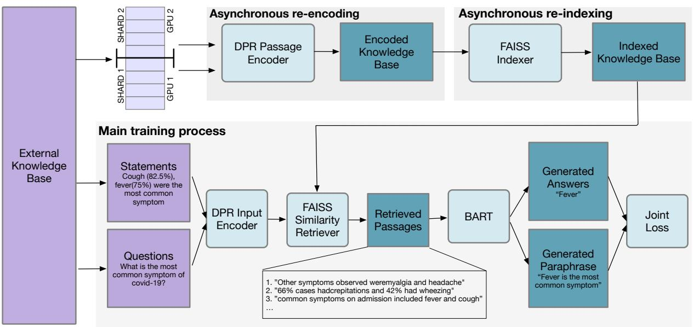
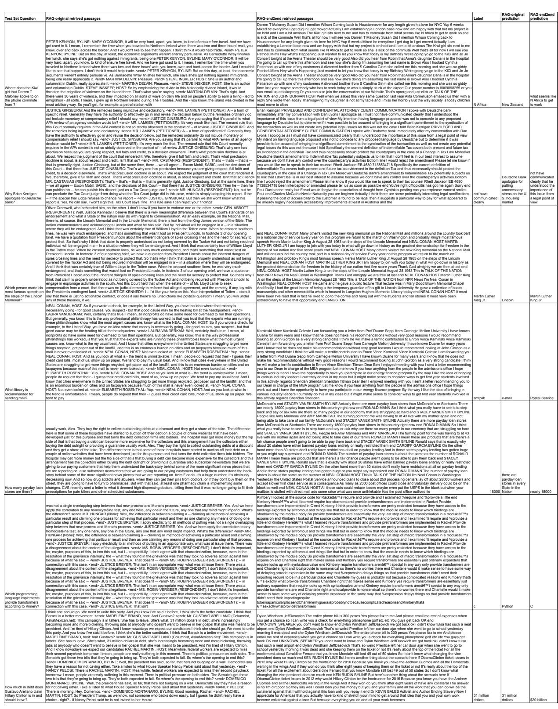

# Improving the Domain Adaptation of Retrieval Augmented Generation (RAG) Models for Open Domain Question Answering

Shamane Siriwardhana , Rivindu Weerasekera, Elliott Wen,

Tharindu Kaluarachchi, Rajib Rana†, and Suranga Nanayakkara4  Augmented Human Lab, Auckland Bioengineering Institute, The University of Auckland firstname@ahlab.org 4 Department of Information Systems & Analytics, National University of Singapore † University of Southern Queensland Rajib.Rana@usq.edu.au

# Abstract

Retrieval Augment Generation (RAG) is a recent advancement in Open-Domain Question Answering (ODQA). RAG has only been trained and explored with a Wikipediabased external knowledge base and is not optimized for use in other specialized domains such as healthcare and news. In this paper, we evaluate the impact of joint training of the retriever and generator components of RAG for the task of domain adaptation in ODQA. We propose RAG-end2end, an extension to RAG, that can adapt to a domain-specific knowledge base by updating all components of the external knowledge base during training. In addition, we introduce an auxiliary training signal to inject more domain-specific knowledge. This auxiliary signal forces RAG-end2end to reconstruct a given sentence by accessing the relevant information from the external knowledge base. Our novel contribution is unlike RAG, RAG-end2end does joint training of the retriever and generator for the end QA task and domain adaptation. We evaluate our approach with datasets from three domains: COVID-19, News, and Conversations, and achieve significant performance improvements compared to the original RAG model. Our work has been open-sourced through the Huggingface Transformers library, attesting to our work’s credibility and technical consistency. 1

task in natural language understanding. ODQA methods generally feature a two-stage pipeline: a retriever that selects passages relevant to a given question and a reader that generates the answers from selected passages. Conventionally, these two components are trained separately using ground truth context passages relevant to question-answer (QA) pairs. However, for many real-world scenarios, it is hard to find explicitly annotated contextquestion-answer triplets (Lee et al., 2019; Lewis et al., 2020b; Guu et al., 2020).

Recently, Retrieval Augmented Models (RAGs) have drawn considerable attention from researchers. RAG consists of a state-of-the-art-neural retriever called Dense Passage Retrieval (DPR) (Karpukhin et al., 2020) and BART seq2seq language model (Lewis et al., 2020a). Compared to the conventional two-staged ODQA pipelines, RAG merges the retriever and reader stages into one architecture. Moreover, unlike expensive language models with billions of parameters (e.g., GPT-3 (Brown et al., 2020) and MegatroneLM (Narayanan et al., 2021)) where the model’s parametric memory represents the complete knowledge, RAG can also extract knowledge from an external knowledge base. Using both parametric and non-parametric memory generally leads to reduced hallucinations and higher interpretability in tasks like question answering and summarization $\mathrm { { X u } }$ et al., 2021; Komeili et al., 2021; Guu et al., 2020; Lewis et al., 2020b).

# 1 Introduction

Open Domain Question Answering (ODQA) (Lee et al., 2019; Lewis et al., 2020c) is an important

In this work, we focus on exploring retrieval augmented architectures for the task of domainspecific open-domain question answering. Although there are several similar retrieval augmented architectures, such as REALM (Guu et al., 2020) and RETRO (Borgeaud et al., 2021), we used Retrieval Augmented Generation (RAG) in our experiments due to its excellent open-source documentation and availability.

When the RAG model is finetuned for downstream QA tasks, the original implementation keeps the encoding of passages and the external knowledge base fixed. This is because re-encoding the external knowledge base is computationally expensive and relies on a sophisticated implementation. Despite not finetuning the passage encodings, the RAG model performs well for datasets with Wikipedia-like knowledge bases because the DPR retriever components have already been trained on Wikipedia-based datasets (Kwiatkowski et al., 2019; Joshi et al., 2017). However, the feasibility of adapting RAG to specific ODQA domains such as research papers and news is not well understood. This is a critical research gap to address, as improved domain adaptation can further improve the ODQA performance of RAG.

This paper explores the feasibility of using RAG in specialized domains for ODQA. In particular, we propose two modifications to the original RAG to improve its domain adaptability. Motivated by recent end2end retrieval augmented mechanisms (Guu et al., 2020; Sachan et al., 2021; Singh et al., 2021), we first propose a method to finetune the RAG model with its neural retriever and update its knowledge encodings asynchronously during training. We refer to this as RAG-end2end since it allows us to update all RAG components during training, including the external knowledge base, the DPR model, and the BART model. Secondly, we propose an auxiliary training signal to help our model learn more domain-specific knowledge. This took the form of generating a concise and factual statement about a document using a self-retrieved set of passages from the provided domain-specific knowledge base. These two modifications offer a unique feature to RAG-end2end over RAG: joint training of the retriever and generator for the end QA task and domain adaptation. Although asynchronous updates to the knowledge encoder have been proposed before in the REALM, previous work has not evaluated the effects of joint training of the RAG’s retriever and the generator for the domain adaptation in ODQA.

We evaluate our proposed approach on three different datasets from three domains: COVID-19 research (Wang et al., 2020), Conversations (Wu et al., 2021b), and News (Trischler et al., 2016).

The major finding of our work is that the adaptation of the retriever component plays a critical role in overall domain adaptation performance in RAG-like architectures. Updating only the question encoder without updating the knowledge base encoding could degrade performance. Instead of finetuning the DPR retriever separately, our experiments show that finetuning it as a part of the RAG-end2end mechanism gives better overall results. Our results also show that using the auxiliary signal improves both the retriever component and the overall accuracy.

In addition, we open-source the implementation of RAG-end2end with the HuggingFace Transformers (Wolf et al., 2019) Library2 providing the opportunity for the scientific community to use/test/build on our work.

# 2 Background and Related Work

Open-domain QA systems (Yang et al., 2015; Kwiatkowski et al., 2019) generally have a twostage pipeline: passage retrieval (i.e., finding relevant text chunks related to an input question from a knowledge base) and machine comprehension (i.e., generating an answer from a set of selected documents). Traditionally sparse vector methods such as TF-IDF and BM25 are used for document retrieval (Robertson and Zaragoza, 2009). Researchers have recently moved to use dense text representations, which allows modeling textual similarity more semantic level. A recent example is the ‘Dense Passage Retriever (DPR)’ (Karpukhin et al., 2020), which generates embeddings for questions and text passages using two BERT (Devlin et al., 2018) models. The dot product of the embeddings is used as a similarity score between a question and a passage. DPR has demonstrated that higher retrieval precision results in a higher end-to-end QA accuracy. For the answer generation component of QA systems, recent studies have used either extractive language models like BERT or generative language models like BART/GPT-2 (Min et al., 2021; Lewis et al., 2021).

# 2.1 Retrieval Augmented Architecture

Recently, Retrieval Augmented Architectures (Lewis et al., 2020b; Guu et al., 2020) have drawn a lot of attention due to their explainable, scalable, and adaptable nature. Unlike other open-domain

QA architectures, RAG (Lewis et al., 2020b) combines the information retrieval stage and answer generation stage in a differentiable manner. It uses a combination of parametric and non-parametric memory, where the parametric memory consists of a pre-trained seq2seq BART (Lewis et al., 2019) generator, and the non-parametric memory consists of dense vector representations of Wikipedia articles indexed with the FAISS library (Johnson et al., 2017). RAG first encodes a question into a dense representation, retrieves the relevant passages from an indexed Wikipedia knowledge base, and then feeds them into the generator. The loss function can finetune both the generator and the question encoder at the same time. Lewis et al. (Lewis et al., 2020b) highlight RAG’s ability to perform well in Wikipedia-based general question-answering datasets like Natural Questions (Kwiatkowski et al., 2019). Other recent work also highlights how the outputs generated from RAG models are much more factual due to RAG being conditioned on the retrieved documents, possibly providing an answer to the hallucination problem of generative language models. Shuster, Kurt, et al. (Shuster et al., 2021) also highlight how RAG reduces hallucinations in knowledge-grounded conversational tasks, where the task is to generate responses to dialogues based on a large Wikipedia knowledge base. Xu et al. (2021) illustrate the effectiveness of RAG in chat-bot frameworks and highlight how RAG models are able to recall and summarize conversations compared to standard seq2seq models with only parametric memory. This paper aims to understand how RAG could be extended to an end2end model and adapted to specific domains. To the best of our knowledge, this is the first time RAG is being investigated on domain adaptation for the task of ODQA systems.

# 2.2 REALM-like end2end Retrieval Augment Architectures

REALM (Guu et al., 2020) is a similar Retrieval Augmented model to RAG. REALM introduced a novel masked language pre-training step that involves an end-to-end trainable retriever. In the REALM work, the authors first train the entire model on the masked language prediction task and then fine-tune it on question-answering tasks (keeping the retriever frozen). In comparison to REALM, the original RAG model uses an already trained DPR retriever and conducts partial end-toend training with a BART reader model. Compared to REALM, RAG is less computationally expensive, and its code is available open-source. We explore and extend the original RAG architecture for domain adaptation in our work. We adapted some concepts of our RAG-end2end extension from REALM. REALM only updates its retriever during the pre-training process that uses the masked language modeling (MLM) (Devlin et al., 2018) task. Then during the downstream fine-tuning task, REALM keeps its retriever fixed. However, the REALM end-to-end training code is not open-sourced, possibly due to its computational complexity. Compared to REALM, RAG is a combination of already pre-trained language models where the users do not need to go through a heavy pre-training stage. Due to these engineeringfriendly features and high availability, we conducted our experiments with RAG and extended RAG into an end-to-end trainable retrieval augmentation model. It is also important to highlight that none of the prior work has explored the domain adaptation of retrieval augment models for question answering; instead, most focus on general question answering with Wikipedia-based knowledge bases.

Similar to REALM’s end2end architecture, recent work (Sachan et al., 2021) extended RAG and highlighted that the retriever training could improve the overall performance in questionanswering datasets like Natural Questions. Compared to our work, the authors did not focus on the domain adaptation of retrieval augment models. The authors mainly explore the ability to train neural retrievers in an end-to-end way using retrieval augment models. Similarly, another related work (Singh et al., 2021) extended retrieval augmented architectures to an end-to-end model and illustrated that it could improve the question answering accuracy. Singh et al. (2021) mainly focused on improving the document reading ability and answer generation rather than domain adaptation.

# 3 Model Architecture and Training Procedure

In this work, we extend RAG to finetune all components, including the DPR retriever, and dynamically update the external knowledge base during training. We hypothesize that the use of asynchronous updates helps with domain adaptation. Figure 1 demonstrates the main workflow of our model. In the following sections, we describe our extensions and training signals.

  
Figure 1: System Overview. Our RAG-end2end training architecture uses asynchronous processes to dynamically re-encode and re-index the knowledge base while optimizing a joint QA and paraphrasing signal loss. The training dataset consists of both reconstruction signals and QA pairs. The network learns to generate answers to questions and useful statements jointly. The input to the BART reader is illustrated in Equation 3, where the model can differentiate the answer generation task and statement reconstruction task with the use of a control token. During the training, embeddings and the knowledge base index get updated asynchronously.

# 3.1 RAG Retriever and Generator

The retriever is a DPR (Karpukhin et al., 2020) model pre-trained on Wikipedia-based questionanswering datasets (Kwiatkowski et al., 2019; Joshi et al., 2017). It consists of two tower BERT-based networks: the Question Encoder $( E _ { Q } )$ and the Passage Encoder $( E _ { P } )$ . We use their CLS token embeddings as representations for questions and passages. The similarity between a question $( q )$ and a passage $( p )$ is calculated by taking the dot product of the two embeddings as shown in Equation 1.

$$
s i m ( p , q ) \propto E _ { Q } ( q ) ^ { T } E _ { P } ( p ) .
$$

RAG’s generator consists of a pre-trained BART (Lewis et al., 2019) seq2seq language model. To train these retriever and generator components, RAG enhances the traditional sequenceto-sequence cross-entropy loss function by setting the retrieved passages as a latent variable $( Z )$ (Guu et al., 2020; Lewis et al., 2020b). The loss value of generating each token is marginalized on the probability of selecting documents given a context $X$ (i.e., Document Score $p ( Z | X ) )$ . The formula (RAG-Token-Loss) can be written as illustrated in Equation 2.

$$
\begin{array} { l } { { \displaystyle P _ { R A G - T o k e n - L o s s } ( y | x ) = } } \\ { { \displaystyle \prod _ { i } ^ { n } \sum _ { z \varepsilon _ { t o p - k } P ( . | x ) } P _ { \eta } ( z | x ) P _ { \theta } ( y _ { i } | x , z , y _ { 1 : i - 1 } ) } } \end{array}
$$

# 3.2 Indexing of the External Knowledge Base

Before the training phase, we need to encode all passages in the external knowledge base using $E _ { P }$ . Then we need to retrieve similar passages from the external knowledge base given the output from $E _ { Q }$ . This process mainly involves dot product calculation between input question embeddings and encoded passages. The retrieval process will likely result in a performance bottleneck during the training since there are usually millions of passages in the knowledge base. To address this issue, RAG adopts the FAISS indexing approach proposed in (Johnson et al., 2017). With the help of the indexes, we can skip a considerable amount of repeated computation and significantly accelerate the retrieval process.

# 3.3 End-to-End Retriever Training

Although the DPR module makes use of two BERT models $( E _ { P } , E _ { q } )$ , the original RAG architecture only fine-tunes the question encoder $E _ { Q }$ in the retriever. The passage encoder $E _ { P }$ and the external knowledge base’s encoding are fixed during the training phase. In other words, the pre-trained passage encoder of DPR is only used once to encode the external knowledge base. The RAG authors suggest that such a design performs well for Wikipediabased ODQA datasets (Kwiatkowski et al., 2019; Joshi et al., 2017). Such settings work because the DPR model was also pre-trained with Wikipediabased datasets, and their experiment uses an external knowledge base consisting of Wikipedia articles.

However, it may be beneficial to fine-tune all the DPR components during RAG training for domain adaptation since the model needs access to different domain-specific external knowledge bases. In this work, we introduce RAG-end2end, where we augment RAG to be fully end-to-end trainable. We fine-tune the passage encoder and question encoder and then update the index of the external knowledge base during the training process.

It is straightforward to propagate gradients to both the passage and question encoders with RAG’s loss function. Because this loss function employs the passage selection probability known as docscore ${ \it p } _ { \eta } ( z | x )$ term illustrated in Equation 2). However, for it to have a true effect on the overall model training process, we have to iteratively update the embeddings with the updated context encoder and then update the index of the external knowledge base. In other words, we need to re-encode and re-index the knowledge base using the updated passage encoder. When the external knowledge base possesses tens of millions of passages, the reencoding and re-indexing steps can be very timeconsuming. Re-encoding can take several GPU hours, and re-indexing with FAISS can take several CPU hours, depending on the size of the knowledge base. Therefore, it is inefficient to stall the training loop while the re-encoding re-indexing steps are being carried out.

To have an efficient training mechanism, we designed our training framework into three main processes: (1) The main training loop, which updates the gradients, (2) Re-encoding processes with several GPUs that update the knowledge-base encoding with the updated DPR’s context encoder, and (3) A Re-indexing process that uses FAISS to build an index with the updated encoding. Figure 1 illustrates these three processes. Our implementation uses two asynchronous processes to re-encode and re-index the external knowledge base that runs independently to the main training loop. We first distribute the external knowledge base to a set of GPUs that are not used in the main training loop. Then we encode the passages with an updated passage encoder which we call the re-encoding process. Once the re-encoding process has finished, we re-index the knowledge base in another parallel process that uses FAISS (re-indexing process). Inside the main training loop, we ensure that the re-indexing process always starts after finishing the re-encoding process. Then as soon as the new index of the external knowledge base is created, we load that to the main training loop. Once the new index loading is completed again, we start the re-encoding process, which repeats the entire embedding updating process. It is important to note that the first re-encoding process should get finished, and new embeddings should get saved to the hard disk before the start of the FAISS indexing process. If the knowledge base is not entirely updated with the new embeddings, the re-indexing process fails. We use python multiprocessing handles to keep the order, and re-indexing and re-encoding processes are only asynchronous with respect to the main training loop process. The number of steps between each re-encoding process depends on the size of the dataset. To test the number of steps between the knowledge-base updates, we experimented with a knowledge base consisting of 250,000 passages and used four dedicated GPUs for the re-encoding process with a batch size of 32 each. Our computation machine consists of 96 CPU cores. We found that it takes an average of 750 updates. However, the computation time can be easily improved when using more GPUs for encoding and using a machine with a higher number of CPU cores (FAISS indexing process depends on the number of CPU cores). These steps are repeated throughout the training loop. Since the training and knowledge base’s index update processes are running asynchronously, it may result in stale gradients. This, however, does not significantly degrade the model performance according to previous research (Guu et al., 2020).

# 3.4 Statement Reconstruction

We explore the incorporation of statement reconstruction as an auxiliary signal assuming that it forces the model to gain more domain-specific knowledge. As illustrated in Figure 1, we first encode input statements using the input/question encoder $( E _ { Q } )$ . Then the retriever retrieves the most similar set of passages from the indexed external knowledge base by conducting a similarity search. Afterward, the final output generator attempts to re-construct the input statements using only the selected support set of documents. We ensure that the external knowledge base does not contain the input statement to prevent the model from overfitting on just the lexical content. To differentiate the paraphrasing signal from the QA signal, we prepend a special token $< p >$ (represents passages) in front of the reconstruction statements, which acts as a control token in the seq2seq language modeling (Raffel et al., 2019; Keskar et al., 2019). Concretely, when training the RAG architecture on QA pairs, the questions are prepended to the retrieved passages before being fed to the BART generator. As illustrated in Equation 3, for the input reconstruction signal, we only prepend the $< p >$ token to the retrieved passages before feeding them to the BART generator.

QA INPUT: hQuestion $^ +$ hRetrieved Passagesi RECONSTRUCTION INPUT: $\left. { \tt p > } \right. +$ hRetrieved Passagesi

# 4 Experiments & Results

# 4.1 Domain Specific Dataset Setup

In this work, our main intention is to explore the adaptation of domain-specific retrieval augmentation with regard to ODQA. As mentioned in the recent work (Lewis et al., 2020b), most ODQA datasets like Natural Questions (Kwiatkowski et al., 2019) , TriviaQA (Joshi et al., 2017), WebQuestions (Berant et al., 2013), and CuratedTrec (Baudiš and Šedivy\`, 2015) are answered with Wikipediabased knowledge-bases. Since neural retrievers like DPR are already trained with Wikipedia-based datasets, it is hard for us to explore the domain adaptation of RAG fairly in this setting. Therefore, we selected three domain-specific datasets for our experiment: COVID-19 QA, News QA, and Conversation QA. Since the availability of domainspecific ODQA datasets is minimal, in our work, we open-source all domain-specific knowledgebases and question-answer pairs to support future research3.

# COVID-19 QA Domain

Knowledge Base Generation: To create the external knowledge base, we use 5,000 full-text scientific articles extracted from the CORD-19 (Wang et al., 2020) dataset. The external knowledge base is created with 250,000 100-word passages. Each passage is pre-pended with the title of the research paper.

Reconstruction Statement Generation: We use sentences from the abstract section of research articles for the reconstruction signal. We first extract the abstract sections in 10K papers and split them into sentences using the NLTK library (Loper and Bird, 2002). We filter out the sentences that are too short (less than 15 words) or too long (more than 35 words). In this process, approximately 50,000 abstract statements are generated. It is important to note that when generating the knowledge base, we exclude the abstract sections.

Synthetic QA Generation: In this domain, we only use synthetic data for training and validation. Following the prior work (Shakeri et al., 2020), we use a BART seq2seq model trained on the SQuAD dataset (Rajpurkar et al., 2016) to generate synthetic QA pairs given a passage. We used the Squad dataset’s passages as the input and corresponding question-answer pairs as the expected output. We trained a BART-large checkpoint for two epochs. Then, we followed round-trip consistency (Alberti et al., 2019) to filter synthetic QA pairs. Our final synthesized QA dataset consisted of 225,000 QA pairs. We use $90 \%$ of these QA pairs as training data and $10 \%$ as validation data. As the test data, we use 2000 human-labeled question-answer pairs from the COVID-QA dataset (Moller et al., 2020).

# News QA Domain

Knowledge Base Generation: We extract 85,000 100-word passages as the knowledge base using 10,000 news articles from the NewsQA dataset (Trischler et al., 2016).

Reconstruction Statement Generation: We extract corresponding news summary sentences from the CNN/DM dataset (Hermann et al., 2015) for the reconstruction signal. Every article consists of more than one summary sentence. However, we use the first sentence as the title of the article, which we used in knowledge base generation and the rest of the statements as reconstruction statements. Our final dataset contains 35,000 summary statements.

QA Generation: The NewsQA dataset (Trischler et al., 2016) consists of 100,000 human annotated QA pairs from 10,000 news articles from the CNN/DM dataset (Hermann et al., 2015). We use the train (90,000), valid (5,000) and test (5,000) splits given in the dataset to train and evaluate our model. All questions in the NewsQA dataset focus on the high-level content of articles. So, to answer these questions, the model must access a large span of passages to conduct the reasoning process.

# Conversation QA Domain

Knowledge Base Generation: We create the external knowledge base of 110,000 passages by splitting the 10,000 conversations given in the QAConv dataset (Wu et al., 2021b) into passages, each with at most 100 words. We prepend the identifier of each conversation (found in the original dataset) as the title of the passages. We also appended the speaker’s name, followed by the ":" symbol, to the starting position of each dialogue to keep each conversation connected to its speakers.

Reconstruction Statement Generation: We use the state-of-the-art abstractive conversation summarization model4 (Wu et al., 2021a) to generate one-sentence (TLDR) summary (approximately 45 words per conversation). We then use this as the auxiliary signal. We only generate summaries of conversations with more than 45 words. By doing this, we collect 35,000 synthetic summary/reconstruction statements.

QA Generation: We use the QAConv dataset (Wu et al., 2021b), which contains 35,000 QA pairs generated from 10,000 conversations that involved two or more parties. We use the train (25,000), valid (5,000) and test (5,000) splits given in the dataset to train and evaluate our model.

# 4.2 Training and Evaluation Setup

We use the HuggingFace-Transformers (Wolf et al., 2019) library to implement the RAG-end2end architecture. We initialize the DPR and BART models of using the open-source HuggingFace checkpoints5. Prior to fine-tuning, we index and encode the external knowledge base using FAISS. We select HNSW FLAT as the indexing mechanism (with 128 bi-directional links). We use 100 words as the maximum passage length as suggested by the prior RAG work (Lewis et al., 2020a). During training, we use six Tesla V100 GPUs with 32 GBs of memory. Four of them are used for training, and two are used for re-encoding. We train each RAG model variant 4.2 for ten epochs and select the final checkpoint with the highest validation accuracy.

We use the Exact Match (EM), F1 score, and Top-K retrieval accuracy as evaluation metrics. The EM score computes the word level exact match between the predicted answer and the real answer.

The F1-score calculates the number of words in the predicted answer that are aligned with the real answer regardless of the order. The Top-k retrieval accuracy is calculated by matching the answer strings with the contents of the retrieved $\mathbf { k }$ passages.

We compare RAG and RAG-end2end in the following five scenarios.

1. RAG-original. This model is finetuned on the natural question dataset (Kwiatkowski et al., 2019) with the Wikipedia knowledge base and serves as the non-domain adapted baseline 6. This model is not finetuned with domain-specific question-answer pairs, and we report the zero-shot performance.

2. RAG-original-QA. This is the original RAG model finetuned with only domain-specific question-answer pairs.

3. RAG-end2end-QA. This is the RAG model with our end2end retriever extensions and finetuned only with domain-specific questionanswer pairs.

4. RAG-original- ${ \bf Q } { \bf A } + { \bf R }$ . This is the RAG original model finetuned with both domainspecific question-answer pairs and our reconstruction signal.

5. RAG-end2end- ${ \bf Q } { \bf A } + { \bf R }$ . This is the RAG model with our end2end retriever extensions and trained with both question-answer pairs and our reconstruction signal.

We present the results of each scenario in Table 1.

# 4.3 Effect of End-to-End Retriever Training on Domain Adaptation

We first test if finetuning of both the passage encoder and question encoder of the RAG’s retriever while updating the external knowledge base would improve domain adaptation. We compare the performance of RAG-original-QA and RAG-end2endQA, isolating any performance improvement due to the reconstruction signal. The results in Table 1 illustrate that RAG-end2end-QA significantly outperforms RAG-original-QA on all metrics – EM, F1, Top-5, and Top-20 – across all three domains. The improvements in the EM score varied from 1.13 points in the News domain to 12.16 points in the Conversation domain.

<table><tr><td rowspan=1 colspan=1>Model Name</td><td rowspan=1 colspan=1>EM</td><td rowspan=1 colspan=1>F1</td><td rowspan=1 colspan=1>Top-5</td><td rowspan=1 colspan=1>Top-20</td></tr><tr><td rowspan=1 colspan=5>COVID-19 Domain</td></tr><tr><td rowspan=3 colspan=1>(1) RAG-original(2) RAG-original-QA(3) RAG-end2end-QA(4) RAG-original-QA+R(5) RAG-end2end-QA+R</td><td rowspan=1 colspan=1>0.02.95</td><td rowspan=1 colspan=1>4.7312.01</td><td rowspan=1 colspan=1>10.5612.29</td><td rowspan=3 colspan=1>15.6918.4326.9118.4531.23</td></tr><tr><td rowspan=1 colspan=1>8.08</td><td rowspan=1 colspan=1>18.38</td><td rowspan=2 colspan=1>19.8512.7923.05</td></tr><tr><td rowspan=1 colspan=1>3.668.32</td><td rowspan=1 colspan=1>12.2019.57</td></tr><tr><td rowspan=1 colspan=5>News Domain</td></tr><tr><td rowspan=1 colspan=1>(1) RAG-original(2) RAG-original-QA(3) RAG-end2end-QA(4) RAG-original-QA+R(5) RAG-end2end-QA+R</td><td rowspan=1 colspan=1>4.337.268.398.6214.08</td><td rowspan=1 colspan=1>7.9214.2616.3116.4623.7</td><td rowspan=1 colspan=1>19.4622.8628.8927.2839.67</td><td rowspan=1 colspan=1>30.3334.5541.2039.5650.95</td></tr><tr><td rowspan=1 colspan=5>Conversation Domain</td></tr><tr><td rowspan=2 colspan=1>(1) RAG-original(2) RAG-original-QA(3) RAG-end2end-QA(4) RAG-original-QA+R</td><td rowspan=1 colspan=1>5.4912.0924.25</td><td rowspan=1 colspan=1>9.2720.0536.05</td><td rowspan=1 colspan=1>12.1422.7346.01</td><td rowspan=3 colspan=1>20.0232.0555.5536.2158.75</td></tr><tr><td rowspan=1 colspan=1>14.21</td><td rowspan=1 colspan=1>24.62</td><td rowspan=1 colspan=1>26.32</td></tr><tr><td rowspan=1 colspan=1>(5) RAG-end2end-QA+R</td><td rowspan=1 colspan=1>25.95</td><td rowspan=1 colspan=1>37.96</td><td rowspan=1 colspan=1>49.11</td></tr></table>

Table 1: Domain adaptation Performance of different RAG models used in our experiments. We illustrate the results related to all three domains. Details about each model are described in Section 4.2

Evaluating the performance of passage retrieval using Top-5 and Top-20 scores, we see a marked increase of around 25 points in the conversation domain, with the other domains showing improvements of between 4.7 to 6.6 points.

Above all, these results suggest that fine-tuning both the passage and question encoders of the RAG’s retriever while updating the external knowledge base can improve domain adaptation.

# 4.4 Effect of Adding the Statement-Reconstruction Auxiliary Task

In this experiment, we test our next hypothesis: adding the auxiliary training signal of statement reconstruction along with QA pairs improves domain adaptation. We compare the performance of RAG-end2end with and without the reconstruction signal by comparing the performance of RAGend2end- $\mathbf { Q A } + \mathbf { R }$ and RAG-end2end-QA in Table 1. This shows that RAG-end2end- ${ \bf \cdot Q A + R }$ outperforms RAG-end2end-QA for all three domains. The range of increases in the EM scores varied from 1.7 points in the conversation domain to an 8.39 points increase in the News domain. The top-20 retrieval accuracy also increased in a range between 3.2 to 8 points.

We further compare the effect of adding the reconstruction signal to RAG-original by comparing RAG-Original-QA with RAG-Original- ${ \bf \nabla } Q { \bf A } + { \bf R }$ . We find that even without the end2end extension, the reconstruction signal improves the performance moderately. This improvement in the EM score ranged from 0.84 points in the COVID-19 domain and 3.12 points in the Conversation domain.

Finally, we highlight the overall improvement of our contributions by comparing RAG-OriginalQA with RAG-end2end- ${ \bf \nabla } Q { \bf A } + { \bf R }$ . As the most significant improvement; we highlight the 13-point improvement of EM score for the Conversation domain. For retrieval performance, we highlight the 27-point improvement in the top 5 and 16 improvements in the top 20 for the Conversation domain.

To demonstrate the reconstruction statement generation, we provide an example of the generated reconstruction output of given a statement for each domain using the RAG-end2end- ${ \bf Q } { \bf A } { \bf R } + { \bf R }$ model in Table 2. The second column contains the input statements with the special token $< p >$ , the third column shows a snapshot of retrieved top5 documents, and the final column shows the reconstructed statements. As the reconstruction statements demonstrate, we highlight that the model can generate statements close enough to the input.

# 4.5 Retriever’s domain adaptation with RAG-end2end

An important part of our RAG-end2end extension is updating the entire DPR retriever during training. Previous work (Ma et al., 2020) has explored the importance of the domain adaptation of neural retrievers and highlighted the performance gains in domain-specific retrieval tasks. We argue, based on our above-mentioned RAG end2end’s retriever performances and prior work, that when adapting RAG to various domains, having a domain-specific retriever plays a key role in achieving good performance. However, this end-to-end RAG finetuning can get computationally costly, especially with the number of passages in the external knowledge base where they should get re-encoded and re-indexed. Instead of finetuning DPR as a part of RAG-end2end, an alternative approach is to finetune DPR on domain-specific data separately on its vector similarity-based loss function (Karpukhin et al., 2020) and then initializing the RAG architecture prior to finetuning with the QA data. We explore if RAG-end2end can perform on par if we initialize a RAG model with an independent domain-adopted DPR model. This helps us further understand the ability of the RAG-end2end extension to finetune the retriever with domain-specific data.

Table 2: Examples of Reconstructed Statements. Reconstructions generally capture the context of the retrieved documents and are similar to the input statement but are not always factually $100 \%$ correct (e.g. COVID-19 example). Input statement column shows the input to the model with the special $\mathrm { \tt S p > }$ token. The Retrieved Documents shows a snap-shot of the top-retrieved document used to re-construct the statement   

<table><tr><td rowspan=1 colspan=1>Domain</td><td rowspan=1 colspan=1>Input Statement</td><td rowspan=1 colspan=1>Most Similar Retrieved Document</td><td rowspan=1 colspan=1>Reconstructed Statement</td></tr><tr><td rowspan=1 colspan=1>COVID-19</td><td rowspan=1 colspan=1>&lt;p&gt;Cough     (82.5%),fever (75%), and malaise(58.8%) were the mostcommon symptoms, andcrepitations (60%), andwheezes (40%) were themost common signs.</td><td rowspan=1 colspan=1>Most common signs and symptoms on ad-mission included fever and cough . Of allchildren, 32% had complaint of difficultyin respiration. Other symptoms observedwere myalgia, headache and vomiting . Onexamination, 66% cases had crepitationsand 42% had wheezing. Hypoxemia wasobserved in 31% cases at admission</td><td rowspan=1 colspan=1>The most common signsand symptoms on admis-sion were fever and cough,and 32% had complaint ofdifficulty breathing</td></tr><tr><td rowspan=1 colspan=1>News</td><td rowspan=1 colspan=1>&lt;p&gt;Capsule was carryingSouth Korea&#x27;s first astro-naut .</td><td rowspan=1 colspan=1>MOSCOW, Russia Russian space officialssay the crew of the Soyuz space ship isresting after a rough ride back to Earth.A South Korean bioengineer was one ofthree people on board the Soyuz capsule.The craft carrying South Korea&#x27;s first as-tronaut landed in northern Kazakhstan onSaturday, 260 miles off its mark, they said.</td><td rowspan=1 colspan=1>Soyuz capsule carryingSouth Korea&#x27;s first astro-naut lands 260 miles offits mark.</td></tr><tr><td rowspan=1 colspan=1>Conversation</td><td rowspan=1 colspan=1>&lt;p&gt;The Supreme Courtwill hear the case on thegrounds of First Amend-ment protection of freespeech.</td><td rowspan=1 colspan=1>(PETITIONER): Yes, Your Honor. Mr.Tory, who was appearing pro se in the trialcourt, from the very outset objected that hewas being held liable for speech protectedby the First Amendment. &lt;end&gt;$</td><td rowspan=1 colspan=1>Justice Souter and MR.CHEMERINSKY are ar-guing that the injunctionin the case of Tory shouldnot be applied</td></tr></table>

# Standalone DPR fine tuning with domain specific data

et al., 2020). We use the deep-haystack framework7 to finetune DPR for each domain using domainspecific data. We created finetuning datasets for all three domains. First, for the Covid-19 domain, we utilized the synthetic question-answer pairs and their relevant passages that consist of 100 words. The use of domain-specific synthetic QA pairs for DPR finetuning has already shown permanence improvements (Ma et al., 2020). For hard-negative examples, we used BM-25 lexical matching search as mentioned by the DPR authors, where we retrieved passages that do not contain the answer based on their lexical similarity with the question. Although for the News domain and the Conversation domain, we have a supervised dataset where we can map questions into the correct passage, we did not get better results after finetuning the original DPR using the supervised

The standalone DPR can be finetuned if we have access to gold-standard passages that contain the answers for given questions and hard negative passages which consist of similar details to the question but not the exact answers. DPR uses a dotproduct-based similarity loss, capturing the similarity between the correct passage for the question while comparing with some hard-negative examples (Karpukhin et al., 2020) (which are lexically similar but do not contain the answer) (Karpukhin data. The main reason for the degradation of performance is the length of the correct passage related to the question. In both News and Conversation domains, most of the questions come from longer passages, whereas the pre-trained DPR only accepts 100-word passages. To mitigate this issue, we generated synthetic question-answer pairs with the external knowledge bases of news and Conversation domains similar to the COVID-19 domains by following the same procedure mentioned in Section 4.1. Then the hard-negative examples were also mined according to the above-mentioned BM25 lexical matching method. After training, we evaluate the DPR retrieval accuracy using the test dataset and external knowledge base for each domain, similar to the RAG’s retrieval evaluation we conducted in Section 4.2

Table 3: Comparison of DPR models finetunned on domain specific data against publicly available DPR checkpoint which is trained on Wikipedia domain for all three domains.   

<table><tr><td rowspan=1 colspan=1>Model Name</td><td rowspan=1 colspan=1>Top-5</td><td rowspan=1 colspan=1>Top-20</td></tr><tr><td rowspan=1 colspan=3>COVID-19 Domain</td></tr><tr><td rowspan=1 colspan=1>(1) DPR-original(2) DPR-domain-adapted(3) DPR-RAG-end2end</td><td rowspan=1 colspan=1>9.3913.6620.64</td><td rowspan=1 colspan=1>14.7220.0128.21</td></tr><tr><td rowspan=1 colspan=3>News Domain</td></tr><tr><td rowspan=1 colspan=1>(1) DPR-original(2) DPR-domain-adapted(3) DPR-RAG-end2end</td><td rowspan=1 colspan=1>20.9520.9839.67</td><td rowspan=1 colspan=1>31.0431.9250.95</td></tr><tr><td rowspan=1 colspan=3>Coversation Domain</td></tr><tr><td rowspan=1 colspan=1>(1) DPR-original(2) DPR-domain-adapted(3) DPR-RAG-end2end</td><td rowspan=1 colspan=1>15.1523.1549.11</td><td rowspan=1 colspan=1>23.9534.5358.75</td></tr></table>

Table 3 compares (1) DPR-orignal, which is the publicly available checkpoint8 trained on Wikipedia, with (2) DPR-domain-adapted, which is the finetuned model with DPR’s original loss function. The (3) DPR-RAG-end2end is the retrieval part of RAG-end2end- ${ \bf \Delta } Q { \bf A } + { \bf R }$ from Table 1 for comparison. We include the DPR-RAGend2end model to highlight the improvement of the DPR model as a result of RAG-end2end training with both training signals. When comparing the DPR-RAG-end2end model with the other variants in Table 1, we observe that the RAG-end2end architecture significantly improves the DPR’s domain adaptation for all three domains. Therefore, in future work, RAG-end2end could be used as a way to train a neural retriever, which could benefit even for retrieval-only applications.

As shown in Table 3, we observe that fine-tuning DPR models on the original DPR loss function using domain-specific data improves the overall retrieval performance for each domain. For the Covid-19 and Conversation domains, there’s a clear improvement in the top-5 and top-20 retrieval accuracies. We observed almost the same results for the News domain compared to the original DPR. This could be due to similar kinds of data in Wikipedia, which were originally used to train the DPR and CNN/DM text.

Overall as illustrated in Table 3, we highlight the fact that the RAG-end2end’s loss function has the ability to adapt the DPR to specific domains better than fine-tuning the DPR with the passages and question pairs for each domain. The improvements for all three domains in top-5 and top-20 retrieval accuracies of DPR-RAG-end2end compared to DPR-original and DPR-domain-adapted is noticeable. These results further highlight the ability of RAG-end2end to fine-tune or improve its retriever.

# Initializing RAG with domain adapted DPR prior to finetuning

Next, we investigate the performance of RAG models when initialized with a domain-adapted DPR. We initialize RAG’s question encoder and the passage encoder with DPR-domain-adapted (from trained models illustrated in Table 3) and finetune RAG with the settings of RAG-original- $\mathbf { \Delta } Q \mathbf { A } + \mathbf { R }$ The objective is to compare how the RAG models initialized with domain adopted DPR models perform in comparison to using the RAG-end2end extension.

Table 4 demonstrates results from four models. (1) RAG-original- $\mathsf { Q A } { + } \mathsf { R }$ and (3) RAG-end2end$\mathrm { Q A } { + } \mathrm { R }$ are taken from the main results (Table 1). The (2) RAG-original- $\mathbf { Q A } + \mathbf { R }$ (DPR-adapted) model was first initialized with a domain-adopted DPR model (from Table 3) before being finetuned with domain-specific QA pairs and re-construction signals with the RAG-original settings.

The results in Table 4 indicate that for all domains, finetuning the RAG-original with a domainadapted DPR gives higher performance than finetuning the RAG-original with the usual DPR model checkpoint (Compare (1) and (2) in the Table 4).

Table 4: Comparing the effect of RAG-end2end extension, against initializing RAG-original models with domain adapted DPR models prior to the fine-tuning (Please check the Table 1). We use the independently domain adapted DPR models illustrated in Table 3   

<table><tr><td>Model Name</td><td>EM score</td><td>F1 Score</td><td>Top-5</td><td>Top-20</td></tr><tr><td colspan="5">COVID-19 Domain</td></tr><tr><td>(1) RAG-original-QA+R</td><td>3.66</td><td>12.12</td><td>12.79</td><td>18.45</td></tr><tr><td>(2) RAG-original-QA+R (DPR-adapted)</td><td>7.36</td><td>17.91</td><td>22.39</td><td>30.87</td></tr><tr><td>(3) RAG-end2end-QA+R</td><td>8.32</td><td>19.51</td><td>23.05</td><td>31.23</td></tr><tr><td colspan="5">News Domain</td></tr><tr><td>(1) RAG-original-QA+R</td><td>8.62</td><td>16.46</td><td>27.28</td><td>39.56</td></tr><tr><td>(2) RAG-original-QA+R (DPR-adapted)</td><td>10.92</td><td>19.44</td><td>30.72</td><td>41.9</td></tr><tr><td>(3) RAG-end2end-QA+R</td><td>14.08</td><td>23.7</td><td>39.67</td><td>50.95</td></tr><tr><td colspan="5">Conversation Domain</td></tr><tr><td>(1) RAG-original-QA+R</td><td>14.21</td><td>24.62</td><td>26.32</td><td>36.21</td></tr><tr><td>(2) RAG-original-QA+R (DPR-adapted)</td><td>15.78</td><td>25.47</td><td>29.01</td><td>40.03</td></tr><tr><td>(3) RAG-end2end-QA+R</td><td>25.95</td><td>37.96</td><td>49.11</td><td>58.75</td></tr></table>

We highlight the performance improvements for both answer generation accuracy and retrieval recall scores, where the Covid-19 domain has the largest improvements. We also compare the finetuning RAG-end2end model with the RAG-original model, which was first initialized with the domainadapted DPR models (Compare (2) and (3) in Table 4). This comparison shows that RAG-end2end training mechanism can outperform the RAGoriginal mechanism that uses a domain-adapted DPR. The results further highlight the importance of RAG-end2end mechanism in domain adaptation where we do not need to train the DPR model separately.

# 5 Discussion

# 5.1 Role of retriever in domain adaptation

As the results suggest, the retriever plays an essential role in domain adaptation for open-domain QA. It is clear that RAG-end2end training improves the results since it can update the embeddings and the indexing of the knowledge base. Compared with the original RAG finetuning, RAG-end2end improves the performance in all datasets. The main reason for this could be that neural retrievers such as DPR, which are trained on public datasets, struggle to perform well on domain-specific datasets. Our results also highlight an important aspect related to the performance of the stand-alone DPR for document retrieval. It shows that RAG-end2end can improve the domain adaptation of DPR better that finetuning the DPR on its own mechanism.

# 5.2 Cost of end2end retriever adaptation

It is important to note that RAG-end2end fine tuning can be expensive if the number of passages in the external knowledge base is large. If there are millions of passages, it would be beneficial to have a dedicated number of GPUs that complete the reencoding process. Re-indexing with the FAISS library also depends on the number of cores in the CPUs. When having access to strong enough computational power, it is better to use RAG-end2end since we can directly use passages in a knowledge base and question-answer pairs to train both the retriever and the reader. Then we also do not need to generate synthetic question-answer pairs related to passages that are required to train the DPR.

Although the RETRO (Borgeaud et al., 2021) authors claim that frozen BERT embedding is sufficient for retrieval augmented models, our results suggest that for domain-specific models to perform well, a domain-adapted retriever component is beneficial. In future work, it is important to explore how the models like RETRO (Borgeaud et al., 2021) perform on domain-specific scenarios going beyond general-purpose datasets.

5.3 Comparing the RAG-original with RAG-end2end on an In-domain dataset   
Table 5: Open-Domain performance comparison between RAG-original and RAG-end2end. We used SQAD dataset in ODQA manner to conduct our experiments.   

<table><tr><td rowspan=1 colspan=1>Model Name</td><td rowspan=1 colspan=1>EM</td><td rowspan=1 colspan=1>F1</td><td rowspan=1 colspan=1>Top-5</td><td rowspan=1 colspan=1>Top-5 | Top-20</td></tr><tr><td rowspan=1 colspan=5>SQUAD Open-Domain</td></tr><tr><td rowspan=1 colspan=1>(1) RAG-original</td><td rowspan=1 colspan=1>28.12</td><td rowspan=2 colspan=1>39.4252.63</td><td rowspan=2 colspan=1>59.6475.79</td><td rowspan=2 colspan=1>72.3885.57</td></tr><tr><td rowspan=1 colspan=1>(2) RAG-end2end</td><td rowspan=1 colspan=1>40.02</td></tr></table>

Although our work is mainly focused on the domain adaptation of RAG for specific domains, we also explored whether the end2end training would improve the overall results of an in-domain dataset. Since the original RAG model uses a DPR model that is trained on a Wikipedia-based Natural Questions dataset, we consider this in-domain. Although SQUAD (Rajpurkar et al., 2016) dataset is a machine comprehension dataset, we adapted the SQUAD dataset to perform ODQA. First, we extracted the contexts related to each questionanswer pair and created an external knowledge base. Then we split the knowledge base into 100- words passages. Our final knowledge base consists of 30K passages. As illustrated in Table 5, we compared the performance of RAG-original and RAG-end2end on the tasks of answer generation and retrieving correct documents. As the results suggested, RAG-end2end performs better than RAG-original even in other Wikipedia-based datasets. This could be due to RAG-end2end updating the context encoder and embeddings during the training process.

# 6 Conclusion and Future Work

In this paper, we proposed a novel extension of RAG: RAG-end2end, which, unlike RAG, does joint training of the retriever and generator for the end QA task and domain adaptation. We showed that the RAG-end2end could improve DPR performance better than fine-tuning the DPR independently. This allows for the training of DPR models with QA pairs and eliminates the need for goldstandard passages related to questions. We also highlighted that the addition of a re-construction auxiliary signal further improves both the retriever and the final answer generation accuracies. We evaluate our approach with three datasets from different domains (COVID-19, News, and Conversations), showing that RAG-end2end achieves significant performance improvements in all three domains compared to the original RAG implementation. In addition, we conducted several other experiments to validate our approach comprehensively. Overall, our results show that our approach is stable and generalizable across different domains. Our experiments highlight the importance of the RAG’s retriever component in domain-specific question answering.

Based on our findings, we suggest three directions for future research in domain adaptation of RAG Models. Firstly, we consider it worthwhile to explore RAG-end2end on other tasks like Fact Checking (Lewis et al., 2020b), Summarisation (Shuster et al., 2021), and conversational response generation (Xu et al., 2021) where the original RAG has shown interesting results. Secondly, it is important to explore generative capabilities with qualitative metrics. This could be aligned with research areas like measuring factual consistency (Krysci ´ nski et al. ´ , 2019; Cao et al., 2022) and hallucinations (Cao et al., 2022; Shuster et al., 2021; Nie et al., 2019) of generative language models. Future work could explore whether updating the retriever and document embeddings during the training phase could improve factual consistency and reduce hallucinations in final generations. Thirdly, the improvement of RAG with our extension (RAG-end2end) highlights the importance of the retriever in the RAG architecture, which motivates us to improve the retriever part further in future work. Also, as the statement re-construction signal acts as a good auxiliary signal, we encourage exploring other auxiliary signals, which could improve the overall performance of RAG models.

# References

Chris Alberti, Daniel Andor, Emily Pitler, Jacob Devlin, and Michael Collins. 2019. Synthetic qa corpora generation with roundtrip consistency. arXiv preprint arXiv:1906.05416.

Petr Baudiš and Jan Šedivy. 2015. Modeling of \` the question answering task in the yodaqa system. In International Conference of the crosslanguage evaluation Forum for European languages, pages 222–228. Springer.

Jonathan Berant, Andrew Chou, Roy Frostig, and Percy Liang. 2013. Semantic parsing on freebase from question-answer pairs. In Proceedings of the 2013 conference on empirical methods in natural language processing, pages 1533– 1544.

Sebastian Borgeaud, Arthur Mensch, Jordan Hoffmann, Trevor Cai, Eliza Rutherford, Katie Millican, George van den Driessche, Jean-Baptiste Lespiau, Bogdan Damoc, Aidan Clark, et al. 2021. Improving language models by retrieving from trillions of tokens. arXiv preprint arXiv:2112.04426.

Tom Brown, Benjamin Mann, Nick Ryder, Melanie Subbiah, Jared D Kaplan, Prafulla Dhariwal, Arvind Neelakantan, Pranav Shyam, Girish Sastry, Amanda Askell, et al. 2020. Language models are few-shot learners. Advances in neural information processing systems, 33:1877–1901.

Meng Cao, Yue Dong, and Jackie Chi Kit Cheung. 2022. Hallucinated but factual! inspecting the factuality of hallucinations in abstractive summarization. In Proceedings of the 60th Annual Meeting of the Association for Computational Linguistics (Volume 1: Long Papers), pages 3340–3354.

Jacob Devlin, Ming-Wei Chang, Kenton Lee, and Kristina Toutanova. 2018. Bert: Pre-training of deep bidirectional transformers for language understanding. arXiv preprint arXiv:1810.04805.

Kelvin Guu, Kenton Lee, Zora Tung, Panupong Pasupat, and Ming-Wei Chang. 2020. Realm: Retrieval-augmented language model pretraining. arXiv preprint arXiv:2002.08909.

Karl Moritz Hermann, Tomas Kocisky, Edward Grefenstette, Lasse Espeholt, Will Kay, Mustafa Suleyman, and Phil Blunsom. 2015. Teaching machines to read and comprehend. Advances in neural information processing systems, 28:1693– 1701.

Jeff Johnson, Matthijs Douze, and Hervé Jégou. 2017. Billion-scale similarity search with gpus. arXiv preprint arXiv:1702.08734.

Mandar Joshi, Eunsol Choi, Daniel S Weld, and Luke Zettlemoyer. 2017. Triviaqa: A large scale distantly supervised challenge dataset for reading comprehension. arXiv preprint arXiv:1705.03551.

Vladimir Karpukhin, Barlas Oguz, Sewon Min, ˘ Patrick Lewis, Ledell Wu, Sergey Edunov, Danqi Chen, and Wen-tau Yih. 2020. Dense passage retrieval for open-domain question answering. arXiv preprint arXiv:2004.04906.

Nitish Shirish Keskar, Bryan McCann, Lav R Varshney, Caiming Xiong, and Richard Socher. 2019. Ctrl: A conditional transformer language model for controllable generation. arXiv preprint arXiv:1909.05858.

Mojtaba Komeili, Kurt Shuster, and Jason Weston. 2021. Internet-augmented dialogue generation. arXiv preprint arXiv:2107.07566.

Wojciech Krysci ´ nski, Bryan McCann, Caiming ´ Xiong, and Richard Socher. 2019. Evaluating the factual consistency of abstractive text summarization. arXiv preprint arXiv:1910.12840.

Tom Kwiatkowski, Jennimaria Palomaki, Olivia Redfield, Michael Collins, Ankur Parikh, Chris Alberti, Danielle Epstein, Illia Polosukhin, Jacob Devlin, Kenton Lee, et al. 2019. Natural questions: a benchmark for question answering research. Transactions of the Association for Computational Linguistics, 7:453–466.

Kenton Lee, Ming-Wei Chang, and Kristina Toutanova. 2019. Latent retrieval for weakly supervised open domain question answering. arXiv preprint arXiv:1906.00300.

Mike Lewis, Marjan Ghazvininejad, Gargi Ghosh, Armen Aghajanyan, Sida Wang, and Luke Zettlemoyer. 2020a. Pre-training via paraphrasing. arXiv preprint arXiv:2006.15020.

Mike Lewis, Yinhan Liu, Naman Goyal, Marjan Ghazvininejad, Abdelrahman Mohamed, Omer Levy, Ves Stoyanov, and Luke Zettlemoyer. 2019. Bart: Denoising sequence-to-sequence pre-training for natural language generation, translation, and comprehension. arXiv preprint arXiv:1910.13461.

Patrick Lewis, Ethan Perez, Aleksandara Piktus, Fabio Petroni, Vladimir Karpukhin, Naman Goyal, Heinrich Kuttler, Mike Lewis, Wen-tau Yih, Tim Rocktaschel, et al. 2020b. Retrievalaugmented generation for knowledge-intensive nlp tasks. arXiv preprint arXiv:2005.11401.

Patrick Lewis, Pontus Stenetorp, and Sebastian Riedel. 2020c. Question and answer test-train overlap in open-domain question answering datasets. arXiv preprint arXiv:2008.02637.

Patrick Lewis, Yuxiang Wu, Linqing Liu, Pasquale Minervini, Heinrich Küttler, Aleksandra Piktus, Pontus Stenetorp, and Sebastian Riedel. 2021. Paq: 65 million probably-asked questions and what you can do with them. arXiv preprint arXiv:2102.07033.

Edward Loper and Steven Bird. 2002. Nltk: The natural language toolkit. arXiv preprint cs/0205028.

Ji Ma, Ivan Korotkov, Yinfei Yang, Keith Hall, and Ryan McDonald. 2020. Zero-shot neural retrieval via domain-targeted synthetic query generation. arXiv preprint arXiv:2004.14503.

Sewon Min, Jordan Boyd-Graber, Chris Alberti, Danqi Chen, Eunsol Choi, Michael Collins, Kelvin Guu, Hannaneh Hajishirzi, Kenton Lee, Jennimaria Palomaki, et al. 2021. Neurips 2020 efficientqa competition: Systems, analyses and lessons learned. arXiv preprint arXiv:2101.00133.

Timo Moller, Anthony Reina, Raghavan Jayakumar, and Malte Pietsch. 2020. COVID-QA: A question answering dataset for COVID-19. In Proceedings of the 1st Workshop on NLP for COVID-19 at ACL 2020, Online. Association for Computational Linguistics.

Deepak Narayanan, Mohammad Shoeybi, Jared Casper, Patrick LeGresley, Mostofa Patwary, Vijay Korthikanti, Dmitri Vainbrand, Prethvi Kashinkunti, Julie Bernauer, Bryan Catanzaro, et al. 2021. Efficient large-scale language model training on gpu clusters using megatron-lm. In Proceedings of the International Conference for High Performance Computing, Networking, Storage and Analysis, pages 1–15.

Feng Nie, Jin-Ge Yao, Jinpeng Wang, Rong Pan, and Chin-Yew Lin. 2019. A simple recipe towards reducing hallucination in neural surface realisation. In Proceedings of the 57th Annual Meeting of the Association for Computational Linguistics, pages 2673–2679.

Colin Raffel, Noam Shazeer, Adam Roberts, Katherine Lee, Sharan Narang, Michael Matena, Yanqi Zhou, Wei Li, and Peter J Liu. 2019. Exploring the limits of transfer learning with a unified text-to-text transformer. arXiv preprint arXiv:1910.10683.

Pranav Rajpurkar, Jian Zhang, Konstantin Lopyrev, and Percy Liang. 2016. Squad: $1 0 0 { , } 0 0 0 { + }$ questions for machine comprehension of text. arXiv preprint arXiv:1606.05250.

Stephen Robertson and Hugo Zaragoza. 2009. The probabilistic relevance framework: BM25 and beyond. Now Publishers Inc.

Devendra Singh Sachan, Mostofa Patwary, Mohammad Shoeybi, Neel Kant, Wei Ping, William L Hamilton, and Bryan Catanzaro. 2021. Endto-end training of neural retrievers for opendomain question answering. arXiv preprint arXiv:2101.00408.

Siamak Shakeri, Cicero Nogueira dos Santos, Henry Zhu, Patrick Ng, Feng Nan, Zhiguo Wang, Ramesh Nallapati, and Bing Xiang. 2020. Endto-end synthetic data generation for domain adaptation of question answering systems. arXiv preprint arXiv:2010.06028.

Kurt Shuster, Spencer Poff, Moya Chen, Douwe Kiela, and Jason Weston. 2021. Retrieval augmentation reduces hallucination in conversation. arXiv preprint arXiv:2104.07567.

Devendra Singh, Siva Reddy, Will Hamilton, Chris Dyer, and Dani Yogatama. 2021. End-to-end training of multi-document reader and retriever for open-domain question answering. Advances in Neural Information Processing Systems, 34.

Adam Trischler, Tong Wang, Xingdi Yuan, Justin Harris, Alessandro Sordoni, Philip Bachman, and Kaheer Suleman. 2016. Newsqa: A machine comprehension dataset. arXiv preprint arXiv:1611.09830.

Lucy Lu Wang, Kyle Lo, Yoganand Chandrasekhar, Russell Reas, Jiangjiang Yang, Darrin Eide, Kathryn Funk, Rodney Kinney, Ziyang Liu, William Merrill, et al. 2020. Cord-19: The covid-19 open research dataset. ArXiv.

Thomas Wolf, Lysandre Debut, Victor Sanh, Julien Chaumond, Clement Delangue, Anthony Moi, Pierric Cistac, Tim Rault, Rémi Louf, Morgan Funtowicz, et al. 2019. Huggingface’s transformers: State-of-the-art natural language processing. arXiv preprint arXiv:1910.03771.

Chien-Sheng Wu, Linqing Liu, Wenhao Liu, Pontus Stenetorp, and Caiming Xiong. 2021a. Controllable abstractive dialogue summarization with sketch supervision. arXiv preprint arXiv:2105.14064.

Chien-Sheng Wu, Andrea Madotto, Wenhao Liu, Pascale Fung, and Caiming Xiong. 2021b. Qaconv: Question answering on informative conversations. arXiv preprint arXiv:2105.06912.

Jing Xu, Arthur Szlam, and Jason Weston. 2021. Beyond goldfish memory: Long-term open-domain conversation. arXiv preprint arXiv:2107.07567.

Yi Yang, Wen-tau Yih, and Christopher Meek. 2015. Wikiqa: A challenge dataset for opendomain question answering. In Proceedings of the 2015 conference on empirical methods in natural language processing, pages 2013–2018.

# A Appendix

  
Figure 2: Predicted answers and retrieved passages for a set of questions from the conversational domain (Wu et al., 2021b).