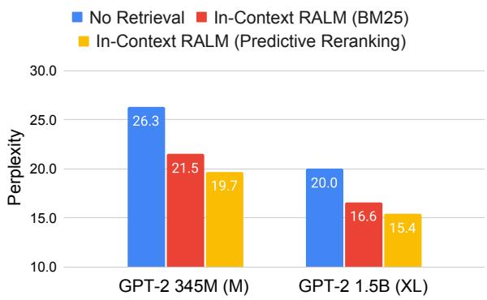
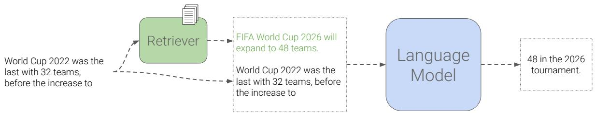
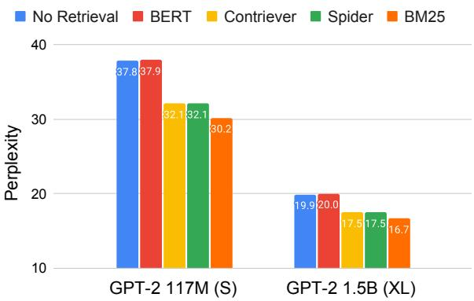
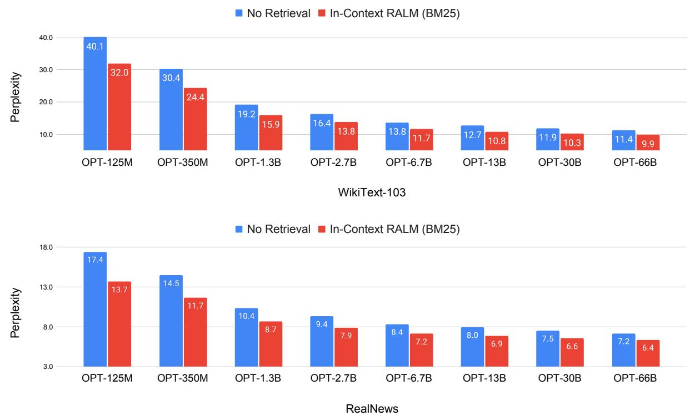
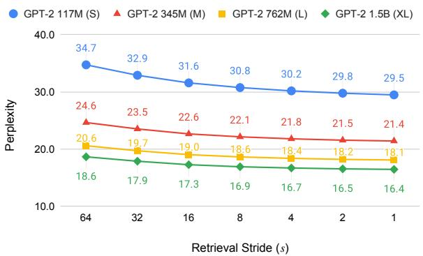
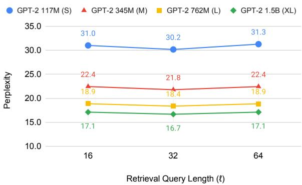
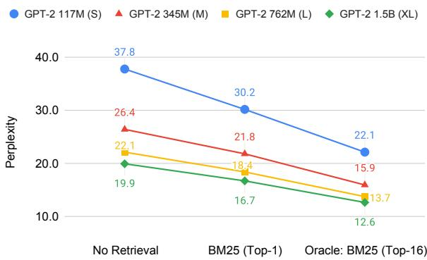
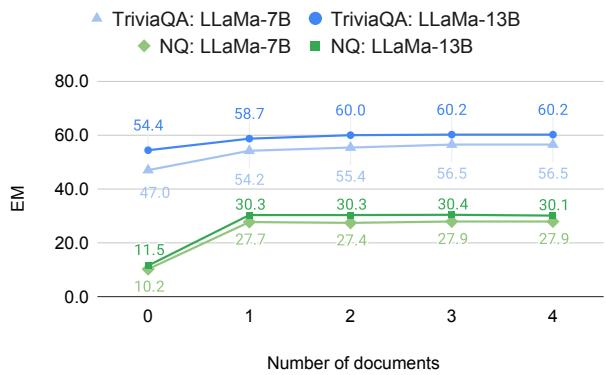
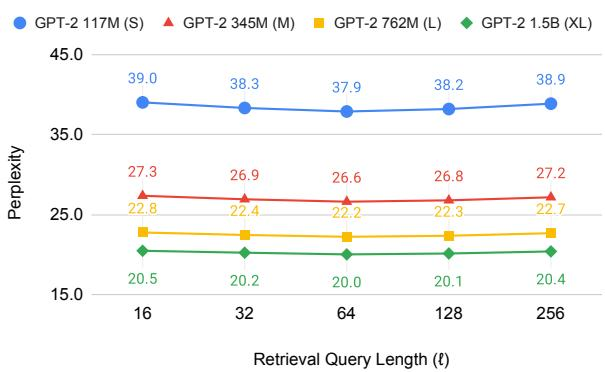
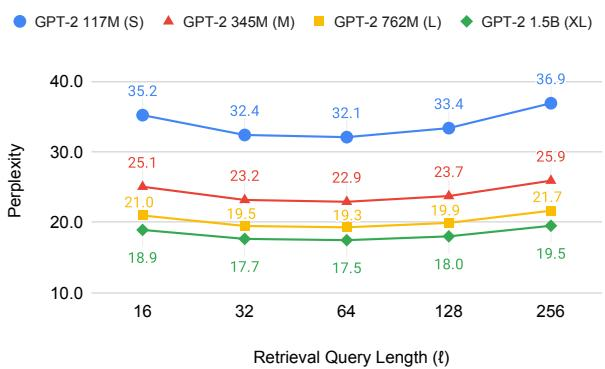

# In-Context Retrieval-Augmented Language Models

Ori Ram∗ Yoav Levine∗ Itay Dalmedigos Dor Muhlgay Amnon Shashua Kevin Leyton-Brown Yoav Shoham AI21 Labs

{orir,yoavl,itayd,dorm,amnons,kevinlb,yoavs}@ai21.com

# Abstract

Retrieval-Augmented Language Modeling (RALM) methods, which condition a language model (LM) on relevant documents from a grounding corpus during generation, were shown to significantly improve language modeling performance. In addition, they can mitigate the problem of factually inaccurate text generation and provide natural source attribution mechanism. Existing RALM approaches focus on modifying the LM architecture in order to facilitate the incorporation of external information, significantly complicating deployment. This paper considers a simple alternative, which we dub In-Context RALM: leaving the LM architecture unchanged and prepending grounding documents to the input, without any further training of the LM. We show that In-Context RALM that builds on off-the-shelf general purpose retrievers provides surprisingly large LM gains across model sizes and diverse corpora. We also demonstrate that the document retrieval and ranking mechanism can be specialized to the RALM setting to further boost performance. We conclude that In-Context RALM has considerable potential to increase the prevalence of LM grounding, particularly in settings where a pretrained LM must be used without modification or even via API access.1

# 1 Introduction

Recent advances in language modeling (LM) have dramatically increased the usefulness of machinegenerated text across a wide range of use-cases and domains (Brown et al., 2020). However, the mainstream paradigm of generating text with LMs bears inherent limitations in access to external knowledge. First, LMs are not coupled with any source attribution, and must be trained in order to incorporate up-to-date information that was not seen during training. More importantly, they tend to produce factual inaccuracies and errors (Lin et al., 2022; Maynez et al., 2020; Huang et al., 2020). This problem is present in any LM generation scenario, and is exacerbated when generation is made in uncommon domains or private data. A promising approach for addressing the above is Retrieval-Augmented Language Modeling (RALM), grounding the LM during generation by conditioning on relevant documents retrieved from an external knowledge source. RALM systems include two high level components: (i) document selection, selecting the set of documents upon which to condition; and (ii) document reading, determining how to incorporate the selected documents into the LM generation process.

  
Figure 1: Our framework, dubbed In-Context RALM, provides large language modeling gains on the test set of WikiText-103, without modifying the LM. Adapting the use of a BM25 retriever (Robertson and Zaragoza, 2009) to the LM task (§5) yields significant gains, and choosing the grounding documents via our new class of Predictive Rerankers (§6) provides a further boost. See Table 1 for the full results on five diverse corpora.

Leading RALM systems introduced recently tend to be focused on altering the language model architecture (Khandelwal et al., 2020; Borgeaud et al., 2022; Zhong et al., 2022; Levine et al., $2 0 2 2 \mathrm { c }$ ; Li et al., 2022). Notably, Borgeaud et al. (2022) introduced RETRO, featuring document reading via nontrivial modifications that require further training to the LM architecture, while using an off-theshelf frozen BERT retriever for document selection. Although the paper’s experimental findings showed impressive performance gains, the need for changes in architecture and dedicated retraining has hindered the wide adoption of such models.

  
Figure 2: An example of In-Context RALM: we simply prepend the retrieved document before the input prefix.

In this paper, we show that a very simple document reading mechanism can have a large impact, and that substantial gains can also be made by adapting the document selection mechanism to the task of language modeling. Thus, we show that many of the benefits of RALM can be achieved while working with off-the-shelf LMs, even via API access. Specifically, we consider a simple but powerful RALM framework, dubbed In-Context RALM (presented in Section 3), which employs a zero-effort document reading mechanism: we simply prepend the selected documents to the LM’s input text (Figure 2).

Section 4 describes our experimental setup. To show the wide applicability of our framework, we performed LM experiments on a suite of five diverse corpora: WikiText-103 (Merity et al., 2016), RealNews (Zellers et al., 2019), and three datasets from The Pile (Gao et al., 2021): ArXiv, Stack Exchange and FreeLaw. We use open-source LMs ranging from 110M to 66B parameters (from the GPT-2, GPT-Neo, OPT and LLaMA model families).

In Section 5 we evaluate the application of offthe-shelf retrievers to our framework. In this minimal-effort setting, we found that In-Context RALM led to LM performance gains equivalent to increasing the LM’s number of parameters by $2 -$ $3 \times$ across all of the text corpora we examined. In Section 6 we investigate methods for adapting document ranking to the LM task, a relatively underexplored RALM degree of freedom. Our adaptation methods range from using a small LM to perform zero-shot ranking of the retrieved documents, up to training a dedicated bidirectional reranker by employing self-supervision from the LM signal. These methods lead to further gains in the LM task corresponding to an additional size increase of $2 \times$ in the LM architecture. As a concrete example of the gains, a 345M parameter GPT-2 enhanced by In-Context RALM outperforms a 762M parameter GPT-2 when employing an off-the-shelf BM25 retriever (Robertson and Zaragoza, 2009), and outperforms a 1.5B parameter GPT-2 when employing our trained LM-oriented reranker (see Figure 1). For large model sizes, our method is even more effective: In-Context RALM with an off-the-shelf retriever improved the performance of a 6.7B parameter OPT model to match that of a 66B parameter parameter OPT model (see Figure 4).

In Section 7 we demonstrate the applicability of In-Context RALM to downstream open-domain questions answering (ODQA) tasks.

In a concurrent work, Shi et al. (2023) also suggest to augment off-the-shelf LMs with retrieved texts by prepending them to the input. Their results are based on training a dedicated retriever for language modeling. In contrast, we focus on the gains achievable in using off-the-shelf retrievers for this task. We show strong gains of this simpler setting by investigating: (1) which off-the-shelf retriever is best suited for language modeling, (2) the frequency of retrieval operations, and (3) the optimal query length. In addition, we boost the offthe-shelf retrieval performance by introducing two reranking methods that demonstrate further gains in perplexity.

We believe that In-Context RALM can play two important roles in making RALM systems more powerful and more prevalent. First, given its simple reading mechanism, In-Context RALM can serve as a clean probe for developing document retrieval methods that are specialized for the LM task. These in turn can be used to improve both In-Context RALM and other more elaborate RALM methods that currently leverage general purpose retrievers. Second, due to its compatibility with off-the-shelf LMs, In-Context RALM can help drive wider deployment of RALM systems.

# 2 Related Work

RALM approaches can be roughly divided into two families of models: (i) nearest-neighbor language models (also called kNN-LM), and (ii) retrieve and read models. Our work belongs to the second family, but is distinct in that it involves no further training of the LM.

Nearest Neighbor Language Models The $k \mathbf { N N } .$ LM approach was first introduced in Khandelwal et al. (2020). The authors suggest a simple inference-time model that interpolates between two next-token distributions: one induced by the LM itself, and one induced by the $k$ neighbors from the retrieval corpus that are closest to the query token in the LM embedding space. Zhong et al. (2022) suggest a framework for training these models. While they showed significant gains from $k \mathrm { N N - L M }$ , the approach requires storing the representations for each token in the corpus, an expensive requirement even for a small corpus like Wikipedia. Although numerous approaches have been suggested for alleviating this issue (He et al., 2021; Alon et al., 2022), scaling any of them to large corpora remains an open challenge.

Retrieve and Read Models This family of RALMs creates a clear division between document selection and document reading components. All prior work involves training the LM. We begin by describing works that use this approach for tackling downstream tasks, and then mention works oriented towards RALM. Lewis et al. (2020) and Izacard and Grave (2021) fine tuned encoder–decoder architectures for downstream knowledge-intensive tasks. Izacard et al. (2022b) explored different ways of pretraining such models, while Levine et al. (2022c) pretrained an autoregressive LM on clusters of nearest neighbors in sentence embedding space. Levine et al. (2022a) showed competitive open domain question-answering performance by prompt-tuning a frozen LM as a reader. Guu et al. (2020) pretrained REALM, a retrieval augmented bidirectional, masked LM, later fine-tuned for open-domain question answering. The work closest to this paper—with a focus on the language modeling task—is RETRO (Borgeaud et al., 2022), which modifies an autoregressive LM to attend to relevant documents via chunked cross-attention, thus introducing new parameters to the model. Our In-Context RALM differs from prior work in this family of models in two key aspects:

• We use off-the-shelf LMs for document reading without any further training of the LM. • We focus on how to choose documents for improved LM performance.

# 3 Our Framework

# 3.1 In-Context RALM

Language models define probability distributions over sequences of tokens. Given such a sequence $x _ { 1 } , . . . , x _ { n }$ , the standard way to model its probability is via next-token prediction: $p ( x _ { 1 } , . . . , x _ { n } ) =$ $\textstyle \prod _ { i = 1 } ^ { n } p ( x _ { i } | { x _ { < i } } )$ , where $x _ { < i } : = x _ { 1 } , . . . , x _ { i - 1 }$ is the sequence of tokens preceding $x _ { i }$ , also referred to as its prefix. This autoregressive model is usually implemented via a learned transformer network (Vaswani et al., 2017) parameterized by the set of parameters $\theta$ :

$$
p ( x _ { 1 } , . . . , x _ { n } ) = \prod _ { i = 1 } ^ { n } p _ { \theta } ( x _ { i } | \boldsymbol x _ { < i } ) ,
$$

where the conditional probabilities are modeled by employing a causal self-attention mask (Radford et al., 2018). Notably, leading LMs such as GPT-2 (Radford et al., 2019), GPT-3 (Brown et al., 2020), OPT (Zhang et al., 2022) or Jurassic1 (Lieber et al., 2021) follow this simple parameterization.

Retrieval augmented language models (RALMs) add an operation that retrieves one or more documents from an external corpus $\mathcal { C }$ , and condition the above LM predictions on these documents. Specifically, for predicting $x _ { i }$ , the retrieval operation from $\mathcal { C }$ depends on its prefix: $\mathscr { R } c ( x _ { < i } )$ , so the most general RALM decomposition is: $p ( x _ { 1 } , . . . , x _ { n } ) =$ $\textstyle \prod _ { i = 1 } ^ { n } p ( x _ { i } | x _ { < i } , \mathcal { R } c ( x _ { < i } ) )$ . In order to condition the LM generation on the retrieved document, previous RALM approaches used specialized architectures or algorithms (see $\ S 2$ ). Inspired by the success of In-Context Learning (Brown et al., 2020; Dong et al., 2023), $I n$ -Context RALM refers to the following specific, simple method of concatenating the retrieved documents2 within the Transformer’s input prior to the prefix (see Figure 2), which does not involve altering the LM weights $\theta$ :

$$
\begin{array} { l } { { \displaystyle p ( \boldsymbol { x } _ { 1 } , . . . , \boldsymbol { x } _ { n } ) = } \ ~ } \\ { { \displaystyle ~ \prod _ { i = 1 } ^ { n } p _ { \theta } ( \boldsymbol { x } _ { i }  [ \mathcal { R } _ { \mathcal { C } } ( \boldsymbol { x } _ { < i } ) ; \boldsymbol { x } _ { < i } ] ) , } \ ~ } \end{array}
$$

where $[ a ; b ]$ denotes the concatenation of strings $a$ and $b$ .

Since common Transformer-based LM implementations support limited length input sequences, when the concatenation of the document and the input sequence exceed this limit we remove tokens from the beginning of $x$ until the overall input length equals that allowed by the model. Because our retrieved documents are passages of limited length, we always have enough context left from $x$ (see $\ S 4 . 3 )$ .

# 3.2 RALM Design Choices

We detail below two practical design choices often made in RALM systems. In $\ S 5$ , we investigate the effect of these in the setting of In-Context RALM.

Retrieval Stride While in the above formulation a retrieval operation can occur at each generation step, we might want to perform retrieval only once every $s > 1$ tokens due to the cost of calling the retriever, and the need to replace the documents in the LM prefix during generation. We refer to $s$ as the retrieval stride. This gives rise to the following In-Context RALM formulation (which reduces back to Eq. (2) for $s = 1$ ):

$$
\begin{array} { l } { { \displaystyle p ( x _ { 1 } , . . . , x _ { n } ) = } \ ~ } \\ { { \displaystyle \prod _ { j = 0 } ^ { n _ { s } - 1 } \prod _ { i = 1 } ^ { s } p _ { \theta } \left( x _ { s \cdot j + i } \vert { \bf \varepsilon } \big [ { \mathcal R } _ { \mathcal C } ( x _ { \leq s \cdot j } ) ; x _ { < ( s \cdot j + i ) } \big ] \right) , } \ ~ } \end{array}
$$

where $n _ { s } = n / s$ is the number of retrieval strides.

Notably, in this framework the runtime costs of each retrieval operation is composed of (a) applying the retriever itself, and (b) recomputing the embeddings of the prefix. In $\ S 5 . 2$ we show that using smaller retrieval strides, i.e., retrieving as often as possible, is superior to using larger ones (though In-Context RALM with larger strides already provides large gains over vanilla LM). Thus, choosing the retrieval stride is ultimately a tradeoff between runtime and performance.

Retrieval Query Length While the retrieval query above in principle depends on all prefix tokens $x _ { \leq s \cdot j }$ , the information at the very end of the prefix is typically the most relevant to the generated tokens. If the retrieval query is too long then this information can be diluted. To avoid this, we restrict the retrieval query at stride $j$ to the last $\ell$ tokens of the prefix, i.e., we use $q _ { j } ^ { s , \ell } : = x _ { s \cdot j - \ell + 1 } , . . . , x _ { s \cdot j }$ We refer to $\ell$ as the retrieval query length. Note that prior RALM work couples the retrieval stride $s$ and the retrieval query length $\ell$ (Borgeaud et al., 2022). In $\ S 5$ , we show that enforcing $s = \ell$ degrades LM performance. Integrating these hyper-parameters into the In-Context RALM formulation gives

$$
\begin{array} { r l } & { p ( x _ { 1 } , . . . , x _ { n } ) = } \\ & { \quad \prod _ { j = 0 } ^ { n _ { s } - 1 } \prod _ { i = 1 } ^ { s } p _ { \theta } \left( x _ { s \cdot j + i } \vert \left[ \mathcal { R } _ { \mathcal { C } } ( q _ { j } ^ { s , \ell } ) ; x _ { < ( s \cdot j + i ) } \right] \right) . } \end{array}
$$

# 4 Experimental Details

We now describe our experimental setup, including all models we use and their implementation details.

# 4.1 Datasets

We evaluated the effectiveness of In-Context RALM across five diverse language modeling datasets and two common open-domain question answering datasets.

Language Modeling The first LM dataset is WikiText-103 (Merity et al., 2016), which has been extensively used to evaluate RALMs (Khandelwal et al., 2020; He et al., 2021; Borgeaud et al., 2022; Alon et al., 2022; Zhong et al., 2022). Second, we chose three datasets spanning diverse subjects from The Pile (Gao et al., 2021): ArXiv, Stack Exchange and FreeLaw. Finally, we also investigated RealNews (Zellers et al., 2019), since The Pile lacks a corpus focused only on news (which is by nature a knowledge-intensive domain).

Open-Domain Question Answering In order to evaluate In-Context RALM on downstream tasks as well, we use the Natural Questions (NQ; Kwiatkowski et al. 2019) and TriviaQA (Joshi et al., 2017) open-domain question answering datasets.

# 4.2 Models

Language Models We performed our experiments using the four models of GPT-2 (110M– 1.5B; Radford et al. 2019), three models of GPTNeo and GPT-J (1.3B–6B; Black et al. 2021; Wang and Komatsuzaki 2021), eight models of OPT (125M–66B; Zhang et al. 2022) and three models of LLaMA (7B–33B; Touvron et al. 2023). All models are open source and publicly available.3

We elected to study these particular models for the following reasons. The first four (GPT-2) models were trained on WebText (Radford et al., 2019), with Wikipedia documents excluded from their training datasets. We were thus able to evaluate our method’s “zero-shot” performance when retrieving from a novel corpus (for WikiText-103). The rest of the models brought two further benefits. First, they allowed us to investigate how our methods scale to models larger than GPT-2. Second, the fact that Wikipedia was part of their training data allowed us to investigate the usefulness of In-Context RALM for corpora seen during training. The helpfulness of such retrieval has been demonstrated for previous RALM methods (Khandelwal et al., 2020) and has also been justified theoretically by Levine et al. (2022c).

We ran all models with a maximum sequence length of 1,024, even though GPT-Neo, OPT and LLaMA models support a sequence length of 2,048.4

Retrievers We experimented with both sparse (word-based) and dense (neural) retrievers. We used BM25 (Robertson and Zaragoza, 2009) as our sparse model. For dense models, we experimented with (i) a frozen BERT-base (Devlin et al., 2019) followed by mean pooling, similar to Borgeaud et al. (2022); and (ii) the Contriever (Izacard et al., 2022a) and Spider (Ram et al., 2022) models, which are dense retrievers that were trained in unsupervised manners.

Reranking When training rerankers (Section 6.2), we initialized from RoBERTa-base (Liu et al., 2019).

# 4.3 Implementation Details

We implemented our code base using the Transformers library (Wolf et al., 2020). We based our dense retrieval code on the DPR repository (Karpukhin et al., 2020).

  
Figure 3: The performance of four off-the-shelf retrievers used for In-Context RALM on the development set of WikiText-103. All RALMs are run with $s = 4$ (i.e., retrieval is applied every four tokens). For each RALM, we report the result of the best query length $\ell$ (see Figures 6, 9, 10).

Retrieval Corpora For WikiText-103 and ODQA datasets, we used the Wikipedia corpus from Dec. 20, 2018, standardized by Karpukhin et al. (2020) using the preprocessing from Chen et al. (2017). To avoid contamination, we found and removed all 120 articles of the development and test set of WikiText-103 from the corpus. For the remaining datasets, we used their training data as the retrieval corpus. Similar to Karpukhin et al. (2020), our retrieval corpora consist of non-overlapping passages of 100 words (which translate to less than 150 tokens for the vast majority of passages). Thus, we truncate our retrieved passages at 256 tokens when input to the models, but they are usually much smaller.

Retrieval For sparse retrieval, we used the Pyserini library (Lin et al., 2021). For dense retrieval, we applied exact search using FAISS (Johnson et al., 2021).

# 5 The Effectiveness of In-Context RALM with Off-the-Shelf Retrievers

We now empirically show that despite its simple document reading mechanism, In-Context RALM leads to substantial LM gains across our diverse evaluation suite. We begin in this section by investigating the effectiveness of off-the-shelf retrievers for In-Context RALM; we go on in $\ S 6$ to show that further LM gains can be made by tailoring document ranking functions to the LM task.

The experiments in this section provided us with a recommended configuration for applying In

Table 1: Perplexity on the test set of WikiText-103, RealNews and three datasets from the Pile. For each LM, we report: (a) its performance without retrieval, (b) its performance when fed the top-scored passage by BM25 (§5), and (c) its performance when applied on the top-scored passage of each of our two suggested rerankers (§6). All models share the same vocabulary, thus token-level perplexity (token ppl) numbers are comparable. For WikiText we follow prior work and report word-level perplexity (word ppl).   

<table><tr><td rowspan="2">Model</td><td rowspan="2">Retrieval</td><td rowspan="2">Reranking</td><td>WikiText-103</td><td>RealNews</td><td>ArXiv</td><td>Stack Exch.</td><td>FreeLaw</td></tr><tr><td>word ppl</td><td>token ppl</td><td>token ppl</td><td>token ppl</td><td>token ppl</td></tr><tr><td rowspan="4">GPT-2 S</td><td></td><td></td><td>37.5</td><td>21.3</td><td>12.0</td><td>12.8</td><td>13.0</td></tr><tr><td>BM25 §5</td><td></td><td>29.6</td><td>16.1</td><td>10.9</td><td>11.3</td><td>9.6</td></tr><tr><td>BM25</td><td>Zero-shot §6.1</td><td>28.6</td><td>15.5</td><td>10.1</td><td>10.6</td><td>8.8</td></tr><tr><td>BM25</td><td>Predictive §6.2</td><td>26.8</td><td></td><td></td><td></td><td>−</td></tr><tr><td rowspan="4">GPT-2 M</td><td></td><td></td><td>26.3</td><td>15.7</td><td>9.3</td><td>8.8</td><td>9.6</td></tr><tr><td>BM25 §5</td><td></td><td>21.5</td><td>12.4</td><td>8.6</td><td>8.1</td><td>7.4</td></tr><tr><td>BM25</td><td>Zero-shot §6.1</td><td>20.8</td><td>12.0</td><td>8.0</td><td>7.7</td><td>6.9</td></tr><tr><td>BM25</td><td>Predictive §6.2</td><td>19.7</td><td></td><td></td><td>−</td><td></td></tr><tr><td rowspan="4">GPT-2 L</td><td></td><td></td><td>22.0</td><td>13.6</td><td>8.4</td><td>8.5</td><td>8.7</td></tr><tr><td>BM25 §5</td><td></td><td>18.1</td><td>10.9</td><td>7.8</td><td>7.8</td><td>6.8</td></tr><tr><td>BM25</td><td>Zero-shot §6.1</td><td>17.6</td><td>10.6</td><td>7.3</td><td>7.4</td><td>6.4</td></tr><tr><td>BM25</td><td>Predictive §6.2</td><td>16.6</td><td></td><td></td><td></td><td></td></tr><tr><td rowspan="4">GPT-2 XL</td><td></td><td></td><td>20.0</td><td>12.4</td><td>7.8</td><td>8.0</td><td>8.0</td></tr><tr><td>BM25 §5</td><td></td><td>16.6</td><td>10.1</td><td>7.2</td><td>7.4</td><td>6.4</td></tr><tr><td>BM25</td><td>Zero-shot §6.1</td><td>16.1</td><td>9.8</td><td>6.8</td><td>7.1</td><td>6.0</td></tr><tr><td>BM25</td><td>Predictive §6.2</td><td>15.4</td><td></td><td></td><td></td><td></td></tr></table>

Table 2: The performance of models from the LLaMA family, measured by word-level perplexity on the test set of WikiText-103.   

<table><tr><td rowspan="2">Model</td><td rowspan="2">Retrieval</td><td>WikiText-103</td></tr><tr><td>word ppl</td></tr><tr><td rowspan="2">LLaMA-7B</td><td>-</td><td>9.9</td></tr><tr><td>BM25, $5</td><td>8.8</td></tr><tr><td rowspan="2">LLaMA-13B</td><td>-</td><td>8.5</td></tr><tr><td>BM25, §5</td><td>7.6</td></tr><tr><td rowspan="2">LLaMA-33B</td><td></td><td>6.3</td></tr><tr><td>BM25, $5</td><td>6.1</td></tr></table>

Context RALM: applying a sparse BM25 retriever that receives $\ell = 3 2$ query tokens and is applied as frequently as possible. Practically, we retrieve every $s = 4$ tokens ( $\ell$ and $s$ are defined in $\ S 3$ ). Table 1 shows for the GPT-2 models that across all the examined corpora, employing In-Context RALM with an off-the-shelf retriever improved LM perplexity to a sufficient extent that it matched that of a $2 { - } 3 \times$ larger model. Figure 4 and Tables 2 and 5 show that this trend holds across model sizes up to 66B parameters, for both WikiText-103 and

RealNews.

# 5.1 BM25 Outperforms Off-the-Shelf Neural Retrievers in Language Modeling

We experimented with different off-the-shelf general purpose retrievers, and found that the sparse (lexical) BM25 retriever (Robertson and Zaragoza, 2009) outperformed three popular dense (neural) retrievers: the self-supervised retrievers Contriever (Izacard et al., 2022a) and Spider (Ram et al., 2022), as well as a retriever based on the average pooling of BERT embeddings that was used in the RETRO system (Borgeaud et al., 2022). We conducted a minimal hyper-parameter search on the query length $\ell$ for each of the retrievers, and found that $\ell = 3 2$ was optimal for BM25 (Figure 6), and $\ell = 6 4$ worked best for dense retrievers (Figures 9, 10).

Figure 3 compares the performance gains of InContext RALM with these four general-purpose retrievers. The BM25 retriever clearly outperformed all dense retrievers. This outcome is consistent with prior work showing that BM25 outperforms neural retrievers across a wide array of tasks, when applied in zero-shot settings (Thakur et al., 2021). This result renders In-Context RALM even more appealing since applying a BM25 retriever is significantly cheaper than the neural alternatives.

  
Figure 4: Results of OPT models (Zhang et al., 2022) on the test set of WikiText-103 (word-level perplexity) and the development set of RealNews (token-level perplexity). In-Context RALM models use a BM25 retriever with $s = 4$ (i.e., the retriever is called every four tokens) and $\ell = 3 2$ (i.e., the retriever query is comprised of the last 32 tokens of the prefix). In-Context RALM with an off-the-shelf retriever improved the performance of a 6.7B parameter OPT model to match that of $a ~ 6 6 B$ parameter OPT model.

# 5.2 Frequent Retrieval Improves Language Modeling

We investigated the effect of varying the retrieval stride $s$ (i.e., the number of tokens between consecutive retrieval operations). Figure 5 shows that LM performance improved as the retrieval operation became more frequent. This supports the intuition that retrieved documents become more relevant the closer the retrieval query becomes to the generated tokens. Of course, each retrieval operation imposes a runtime cost. To balance performance and runtime, we used $s = 4$ in our experiments. For comparison, RETRO employed a retrieval frequency of $s = 6 4$ (Borgeaud et al., 2022), which leads to large degradation in perplexity. Intuitively, retrieving with high frequency (low retrieval stride) allows to ground the LM in higher resolution.

# 5.3 A Contextualization vs. Recency Tradeoff in Query Length

We also investigated the effect of varying $\ell$ , the length of the retrieval query for BM25. Figure 6 reveals an interesting tradeoff and a sweet spot around a query length of 32 tokens. Similar experiments for dense retrievers are given in App. A. We conjecture that when the retriever query is too short, it does not include enough of the input context, decreasing the retrieved document’s relevance. Conversely, excessively growing the retriever query deemphasizes the tokens at the very end of the prefix, diluting the query’s relevance to the LM task.

# 6 Improving In-Context RALM with LM-Oriented Reranking

Since In-Context RALM uses a fixed document reading component by definition, it is natural to ask whether performance can be improved by specializing its document retrieval mechanism to the LM task. Indeed, there is considerable scope for improvement: the previous section considered conditioning the model only on the first document retrieved by the BM25 retriever. This permits very limited semantic understanding of the query, since BM25 is based only on the bag of words signal. Moreover, it offers no way to accord different degrees of importance to different retrieval query tokens, such as recognizing that later query tokens are more relevant to the generated text.

  
Figure 5: An analysis of perplexity as a function of $s$ , the retrieval stride, i.e., the number of tokens between consecutive retrieval operations, on the development set of WikiText-103. Throughout the paper, we use $s \ = \ 4$ to balance perplexity and runtime.

  
Figure 6: An analysis of perplexity as a function of the number of tokens in the query $\ell$ for BM25 on the development set of WikiText-103. In the appendix, we show similar trade-offs for dense retrievers within WikiText-103. Throughout the paper, we use a query length of $\ell = 3 2$ tokens.

In this section, we focus on choosing which document to present to the model, by reranking the top- $k$ documents returned by the BM25 retriever.5 We use Figure 7 as motivation: it shows the large potential for improvement among the top-16 documents returned by the BM25 retriever. We act upon this motivation by using two rerankers. Specifically, in $\ S 6 . 1$ we show performance gains across our evaluation suite obtained by using an LM to perform zero-shot reranking of the top- $k$ BM25 retrieved documents (results in third row for each of the models in Table 1). Then, in $\ S 6 . 2$ we show that training a specialized bidirectional reranker of the top- $k$ BM25 retrieved documents in a selfsupervised manner via the LM signal can provide further LM gains (results in forth row for each of the models in Table 1).

  
Figure 7: Potential for gains from reranking: perplexity improvement (on the development set of WikiText-103) from an oracle that takes the best of the top-16 documents retrieved by BM25 rather than the first.

# 6.1 LMs as Zero-Shot Rerankers

First, we used off-the-shelf language models as document rerankers for the In-Context RALM setting. Formally, for a query $q$ consisting of the last $\ell$ tokens in the prefix of the LM input $x$ , let $\{ d _ { 1 } , . . . , d _ { k } \}$ be the top- $k$ documents returned by BM25. For retrieval iteration $j$ , let the text for generation be $y : = x _ { s \cdot j + 1 } , . . . , x _ { s \cdot j + s }$ . Ideally, we would like to find the document $d _ { i ^ { * } }$ that maximizes the probability of the text for generation, i.e.,

$$
i ^ { * } = \arg \operatorname* { m a x } _ { i \in [ k ] } p _ { \theta } ( y | [ d _ { i } ; x _ { \le s \cdot j } ] ) .
$$

However, at test time we do not have access to the tokens of $y$ . Instead, we used the last pre$\mathit { \Omega } \mathcal { f } x$ tokens (which are available at test time), denoted by $y ^ { \prime }$ , for reranking. Formally, let $s ^ { \prime }$ be a hyper-parameter that determines the number of the prefix tokens by which to rerank. We define $y ^ { \prime } : = x _ { s \cdot j - s ^ { \prime } + 1 } , . . . , x _ { s \cdot j }$ (i.e., the stride of length $s ^ { \prime }$ that precedes $y$ ) and choose the document $d _ { \hat { i } }$ such

<table><tr><td rowspan="2">Model</td><td rowspan="2">Reranking Model</td><td>WikiText-103</td><td>RealNews</td></tr><tr><td>word ppl</td><td>token ppl</td></tr><tr><td rowspan="2">GPT-2 345M (M)</td><td>GPT-2 110M (S)</td><td>20.8</td><td>12.1</td></tr><tr><td>GPT-2 345M (M)</td><td>20.8</td><td>12.0</td></tr><tr><td rowspan="2">GPT-2 762M (L)</td><td>GPT-2 110M (S)</td><td>17.7</td><td>10.7</td></tr><tr><td>GPT-2 762M (L)</td><td>17.6</td><td>10.6</td></tr><tr><td rowspan="2">GPT-2 1.5B (XL)</td><td>GPT-2 110M (S)</td><td>16.2</td><td>9.9</td></tr><tr><td>GPT-2 1.5B (XL)</td><td>16.1</td><td>9.8</td></tr></table>

Table 3: Perplexity for zero-shot reranking $( \ S 6 . 1 )$ where the reranking models is smaller than the LM, or the LM itself. Reranking is performed on the top 16 documents retrieved by BM25. Using a GPT-2 110M (S) instead of a larger language model as a reranker leads to only a minor degradation.

that

$$
\hat { i } = \arg \operatorname* { m a x } _ { i \in [ k ] } p _ { \phi } ( y ^ { \prime } | \left[ d _ { i } ; x _ { \le ( s \cdot j - s ^ { \prime } ) } \right] ) .
$$

The main motivation is that since BM25 is a lexical retriever, we want to incorporate a semantic signal induced by the LM. Also, this reranking shares conceptual similarities with the reranking framework of Sachan et al. (2022) for open-domain question answering, where $y ^ { \prime }$ (i.e., the last prefix tokens) can be thought of as their “question”.

Note that our zero-shot reranking does not require that the LM used for reranking is the same model as the LM used for generation (i.e., the LM in Eq. (6), parameterized by $\phi$ , does not need to be the LM in Eq. (2), parameterized by $\theta$ ). This observation unlocks the possibility of reranking with smaller (and thus faster) models, which is important for two main reasons: (i) Reranking $k$ documents requires $k$ forward passes; and (ii) it allows our methods to be used in cases where the actual LM’s log probabilities are not available (for example, when the LM is accessed through an API).6

Results A minimal hyper-parameter search on the development set of WikiText-103 revealed that the optimal query length is $s ^ { \prime } = 1 6$ ,7 so we proceed with this value going forward. Table 1 shows the results of letting the LM perform zero-shot reranking on the top-16 documents retrieved by BM25 (third row for each of the models). It is evident that reranking yielded consistently better results than simply taking the first result returned by the retriever.

Table 3 shows that a small LM (GPT-2 117M) can be used to rerank the documents for all larger GPT-2 models, with roughly the same performance as having each LM perform reranking for itself, supporting the applicability of this method for LMs that are only accessible via an API.

# 6.2 Training LM-dedicated Rerankers

Next, we trained a reranker to choose one of the top- $k$ documents retrieved by BM25. We refer to this approach as Predictive Reranking, since the reranker learns to choose which document will help in “predicting” the upcoming text. For this process, we assume availability of training data from the target corpus. Our reranker is a classifier that gets a prefix $x _ { \leq s \cdot j }$ and a document $d _ { i }$ (for $i \in [ k ] )$ , and produces a scalar $f ( x _ { \leq s \cdot j } , d _ { i } )$ that should resemble the relevance of $d _ { i }$ for the continuation of $x _ { \leq s \cdot j }$ .

We then normalize these relevance scores:

$$
p _ { \mathrm { r a n k } } ( d _ { i } | x _ { \leq s \cdot j } ) = \frac { \exp ( f ( x _ { \leq s \cdot j } , d _ { i } ) ) } { \sum _ { i ^ { \prime } = 1 } ^ { k } \exp ( f ( x _ { \leq s \cdot j } , d _ { i ^ { \prime } } ) ) } ,
$$

and choose the document $d _ { \hat { i } }$ such that

$$
\hat { i } = \arg \operatorname* { m a x } _ { i \in [ k ] } \ p _ { \mathrm { r a n k } } ( d _ { i } | x _ { \leq s \cdot j } ) .
$$

Collecting Training Examples To train our predictive reranker, we collected training examples as follows. Let $x _ { \leq s \cdot j }$ be a prefix we sample from the training data, and $y : = x _ { s \cdot j + 1 } , . . . , x _ { s \cdot j + s }$ be the text for generation upcoming in its next stride. We run BM25 on the query $q _ { j } ^ { s , \ell }$ derived from $x _ { \leq s \cdot j }$ (see $\ S 3 . 2 )$ and get $k$ documents $\{ d _ { 1 } , . . . , d _ { k } \}$ . For each document $d _ { i }$ , we then run the LM to compute $p _ { \theta } ( y | [ d _ { i } ; x \underline { { < } } s \cdot j ] )$ similar to Eq. (4).

  
Figure 8: Zero-shot performance of In-Context RALM on the development set of Natural Questions and TriviaQA, when varying the number of documents (retrieved by DPR) shown in-context.

Training Our reranker was a fine-tuned RoBERTa-base (Liu et al., 2019) that trained for 10,000 steps with a peak learning rate of $1 0 ^ { - 5 }$ and a batch size of 32. Overall, we created 300,000 examples from the training set of WikiText-103 as explained above. The loss function we use to train the reranker follows previous work (Guu et al., 2020; Lewis et al., 2020):

$$
- \log \sum _ { i = 1 } ^ { k } p _ { \mathrm { r a n k } } ( d _ { i } | \boldsymbol x _ { \le s \cdot j } ) \cdot p _ { \theta } ( \boldsymbol y | [ d _ { i } ; \boldsymbol x _ { \le s \cdot j } ] ) .
$$

Note that unlike those works, we train only the reranker $( p _ { \mathrm { r a n k } } )$ , keeping the LM weights $\theta$ frozen.

Results Table 1 shows the result of our predictive reranker, trained on WikiText-103. Specifically, we trained it with data produced by GPT-2 110M (S), and tested its effectiveness for all GPT-2 models. We observed significant gains obtained from Predictive Reranking. For example, the perplexity of GPT2 110M (S) improved from 29.6 to 26.8, and that of GPT-2 1.5B (XL) improved from 16.6 to 15.4. This trend held for the other two models as well. Overall, these results demonstrate that training a reranker with domain-specific data was more effective than zero-shot reranking (Section 6.1). Note that these results—while impressive—still leave room for further improvements, compared to the top-16 BM25 oracle results (see Figure 7). Moreover, the oracle results themselves can be improved by retrieving $k > 1 6$ documents via a BM25 retriever, or by training stronger retrievers dedicated to the RALM task. We leave this direction for future work.

<table><tr><td>Model</td><td>Retrieval</td><td>NQ</td><td>TriviaQA</td></tr><tr><td rowspan="2">LLaMA-7B</td><td></td><td>10.3</td><td>47.5</td></tr><tr><td>DPR</td><td>28.0</td><td>56.0</td></tr><tr><td rowspan="2">LLaMA-13B</td><td></td><td>12.0</td><td>54.8</td></tr><tr><td>DPR</td><td>31.0</td><td>60.1</td></tr><tr><td rowspan="2">LLaMA-33B</td><td></td><td>13.7</td><td>58.3</td></tr><tr><td>DPR</td><td>32.3</td><td>62.7</td></tr></table>

Table 4: Zero-shot results of In-Context RALM on the test set of Natural Questions and TriviaQA measured by exact match. In the open-book setting, we include the top two documents returned by DPR.

# 7 In-Context RALM for Open-Domain Question Answering

So far, we evaluated our framework on language modeling benchmarks. To test its efficacy in additional scenarios, and specifically downstream tasks, we now turn to evaluate In-Context RALM on opendomain question answering (ODQA; Chen et al. 2017). This experiment is intended to verify, in a controlled environment, that LMs can leverage retrieved documents without further training and without any training examples. Specifically, we use the LLaMA family (Touvron et al., 2023) with and without In-Context RALM (often referred to in ODQA literature as open-book and closed-book settings, respectively). In contrast to most prior work on ODQA (e.g., Izacard and Grave 2021; Fajcik et al. 2021; Izacard et al. 2022b; Levine et al. 2022b), our “reader” (i.e., the model that gets the question along with its corresponding retrieved documents, and returns the answer) is simply a frozen large LM: not pretrained, fine-tuned or prompted to be retrieval-augmented. For the closed-book setting, we utilize the prompt of Touvron et al. (2023). For the open-book setting, we extend this prompt to include retrieved documents (see App. C). We use DPR (Karpukhin et al., 2020) as our retriever.

Varying the Number of Documents To investigate the the effect of the number of documents shown to the model, we performed a minimal analysis on the development set of NQ and TriviaQA. Figure 8 demonstrates that showing documents incontext significantly improves the model’s performance. In addition, most of the gain can be obtained by using only two documents (or even a single one in some cases).

Results Table 4 gives the results of In-Context RALM on the test set of Natural Questions and TriviaQA. Motivated by our previous findings, we used two retrieved documents. It is evident that showing the model relevant documents significantly boosted its performance. For example, adding retrieved documents improved LLaMA13B in the zero-shot setting by more than 18 points on NQ (from $1 2 . 0 \%$ to $3 1 . 0 \%$ ) and more than 5 points on TriviaQA (from $5 4 . 8 \%$ to $6 0 . 1 \%$ ).

# 8 Discussion

Retrieval from external sources has become a common practice in knowledge-intensive tasks (such as factual question answering, fact checking, and more; Petroni et al. 2021). In parallel, recent breakthroughs in LM generation capabilities has led to LMs that can generate useful long texts. However, factual inaccuracies remain a common way in which machine-generated text can fall short, and lack of direct provenance makes it hard to trust machine generated text. This makes language modeling both a promising and an urgent new application area for knowledge grounding, and motivates promoting RALM approaches. Prior research has already investigated RALM, of course, but it is not yet widely deployed. One likely reason is that existing approaches rely upon fine-tuning the LM, which is typically difficult and costly, and is even impossible for LMs accessible only via an API.

This paper presented the framework of InContext RALM, enabling frozen, off-the-shelf LMs to benefit from retrieval. We demonstrated that substantial performance gains can be achieved by using general purpose retrievers, and showed that additional gains can be achieved by tailoring the document selection to the LM setting. A recent work by Muhlgay et al. (2023) demonstrates that In-Context RALM is indeed able to improve the factuality of large LMs.

Several directions for further improvement remain for future work. First, this paper considers only the case of prepending a single external document to the context; adding more documents could drive further gains (for example, using the framework of Ratner et al. 2022). Second, we retrieved documents every fixed interval of $s$ tokens, but see potential for large latency and cost gains by retrieving more sparsely, such as only when a specialized model predicts that retrieval is needed.

We release the code used in this work, for the community to use and improve over. We hope it will drive further research of RALM, which will enable its wider adoption.

# Acknowledgements

We would like to thank the reviewers and the Action Editor for their valuable feedback.

# References

Uri Alon, Frank Xu, Junxian He, Sudipta Sengupta, Dan Roth, and Graham Neubig. 2022. Neurosymbolic language modeling with automatonaugmented retrieval. In ICML.

Sid Black, Leo Gao, Phil Wang, Connor Leahy, and Stella Biderman. 2021. GPT-Neo: Large Scale Autoregressive Language Modeling with Mesh-Tensorflow.

Sebastian Borgeaud, Arthur Mensch, Jordan Hoffmann, Trevor Cai, Eliza Rutherford, Katie Millican, George Bm Van Den Driessche, JeanBaptiste Lespiau, Bogdan Damoc, Aidan Clark, Diego De Las Casas, Aurelia Guy, Jacob Menick, Roman Ring, Tom Hennigan, Saffron Huang, Loren Maggiore, Chris Jones, Albin Cassirer, Andy Brock, Michela Paganini, Geoffrey Irving, Oriol Vinyals, Simon Osindero, Karen Simonyan, Jack Rae, Erich Elsen, and Laurent Sifre. 2022. Improving language models by retrieving from trillions of tokens. In ICML.

Tom B. Brown, Benjamin Mann, Nick Ryder, Melanie Subbiah, Jared Kaplan, Prafulla Dhariwal, Arvind Neelakantan, Pranav Shyam, Girish Sastry, Amanda Askell, Sandhini Agarwal, Ariel Herbert-Voss, Gretchen Krueger, Tom Henighan, Rewon Child, Aditya Ramesh, Daniel Ziegler, Jeffrey Wu, Clemens Winter, Christopher Hesse, Mark Chen, Eric Sigler, Mateusz Litwin, Scott Gray, Benjamin Chess, Jack Clark, Christopher Berner, Sam McCandlish, Alec Radford, Ilya Sutskever, and Dario Amodei. 2020. Language models are few-shot learners. In Advances in Neural Information Processing Systems.

Danqi Chen, Adam Fisch, Jason Weston, and Antoine Bordes. 2017. Reading Wikipedia to answer open-domain questions. In Proceedings of the 55th Annual Meeting of the Association for Computational Linguistics (Volume 1: Long

Papers), pages 1870–1879, Vancouver, Canada.   
Association for Computational Linguistics.

Jacob Devlin, Ming-Wei Chang, Kenton Lee, and Kristina Toutanova. 2019. BERT: Pre-training of deep bidirectional transformers for language understanding. In Proceedings of the 2019 Conference of the North American Chapter of the Association for Computational Linguistics: Human Language Technologies, Volume 1 (Long and Short Papers), pages 4171–4186, Minneapolis, Minnesota. Association for Computational Linguistics.

Qingxiu Dong, Lei Li, Damai Dai, Ce Zheng, Zhiyong Wu, Baobao Chang, Xu Sun, Jingjing Xu, Lei Li, and Zhifang Sui. 2023. A survey on in-context learning.

Martin Fajcik, Martin Docekal, Karel Ondrej, and Pavel Smrz. 2021. R2-D2: A modular baseline for open-domain question answering. In Findings of the Association for Computational Linguistics: EMNLP 2021, pages 854–870, Punta Cana, Dominican Republic. Association for Computational Linguistics.

Leo Gao, Stella Biderman, Sid Black, Laurence Golding, Travis Hoppe, Charles Foster, Jason Phang, Horace He, Anish Thite, Noa Nabeshima, Shawn Presser, and Connor Leahy. 2021. The pile: An $8 0 0 \mathrm { g b }$ dataset of diverse text for language modeling.

Kelvin Guu, Kenton Lee, Zora Tung, Panupong Pasupat, and Ming-Wei Chang. 2020. REALM: Retrieval-augmented language model pretraining. In ICML.

Junxian He, Graham Neubig, and Taylor BergKirkpatrick. 2021. Efficient nearest neighbor language models. In Proceedings of the 2021 Conference on Empirical Methods in Natural Language Processing, pages 5703–5714, Online and Punta Cana, Dominican Republic. Association for Computational Linguistics.

Minlie Huang, Xiaoyan Zhu, and Jianfeng Gao. 2020. Challenges in building intelligent opendomain dialog systems. ACM Trans. Inf. Syst., 38(3).

Gautier Izacard, Mathilde Caron, Lucas Hosseini, Sebastian Riedel, Piotr Bojanowski, Armand

Joulin, and Edouard Grave. 2022a. Unsupervised dense information retrieval with contrastive learning. Transactions on Machine Learning Research.

Gautier Izacard and Edouard Grave. 2021. Leveraging passage retrieval with generative models for open domain question answering. In Proceedings of the 16th Conference of the European Chapter of the Association for Computational Linguistics: Main Volume, pages 874–880, Online. Association for Computational Linguistics.

Gautier Izacard, Patrick Lewis, Maria Lomeli, Lucas Hosseini, Fabio Petroni, Timo Schick, Jane Dwivedi-Yu, Armand Joulin, Sebastian Riedel, and Edouard Grave. 2022b. Atlas: Few-shot learning with retrieval augmented language models.

Jeff Johnson, Matthijs Douze, and Hervé Jégou. 2021. Billion-scale similarity search with GPUs. IEEE Transactions on Big Data, 7(3):535–547.

Mandar Joshi, Eunsol Choi, Daniel Weld, and Luke Zettlemoyer. 2017. TriviaQA: A large scale distantly supervised challenge dataset for reading comprehension. In Proceedings of the $5 5 t h$ Annual Meeting of the Association for Computational Linguistics (Volume 1: Long Papers), pages 1601–1611, Vancouver, Canada. Association for Computational Linguistics.

Vladimir Karpukhin, Barlas Oguz, Sewon Min, Patrick Lewis, Ledell Wu, Sergey Edunov, Danqi Chen, and Wen-tau Yih. 2020. Dense passage retrieval for open-domain question answering. In Proceedings of the 2020 Conference on Empirical Methods in Natural Language Processing (EMNLP), pages 6769–6781, Online. Association for Computational Linguistics.

Urvashi Khandelwal, Omer Levy, Dan Jurafsky, Luke Zettlemoyer, and Mike Lewis. 2020. Generalization through memorization: Nearest neighbor language models. In International Conference on Learning Representations.

Tom Kwiatkowski, Jennimaria Palomaki, Olivia Redfield, Michael Collins, Ankur Parikh, Chris Alberti, Danielle Epstein, Illia Polosukhin, Jacob Devlin, Kenton Lee, Kristina Toutanova, Llion Jones, Matthew Kelcey, Ming-Wei Chang, Andrew M. Dai, Jakob Uszkoreit, Quoc Le, and

Slav Petrov. 2019. Natural questions: A benchmark for question answering research. Transactions of the Association for Computational Linguistics, 7:452–466.

Yoav Levine, Itay Dalmedigos, Ori Ram, Yoel Zeldes, Daniel Jannai, Dor Muhlgay, Yoni Osin, Opher Lieber, Barak Lenz, Shai Shalev-Shwartz, Amnon Shashua, Kevin Leyton-Brown, and Yoav Shoham. 2022a. Standing on the shoulders of giant frozen language models.

Yoav Levine, Ori Ram, Daniel Jannai, Barak Lenz, Shai Shalev-Shwartz, Amnon Shashua, Kevin Leyton-Brown, and Yoav Shoham. 2022b. Huge frozen language models as readers for opendomain question answering. In ICML 2022 Workshop on Knowledge Retrieval and Language Models.

Yoav Levine, Noam Wies, Daniel Jannai, Dan Navon, Yedid Hoshen, and Amnon Shashua. 2022c. The inductive bias of in-context learning: Rethinking pretraining example design. In International Conference on Learning Representations.

Patrick Lewis, Ethan Perez, Aleksandra Piktus, Fabio Petroni, Vladimir Karpukhin, Naman Goyal, Heinrich Küttler, Mike Lewis, Wen-tau Yih, Tim Rocktäschel, Sebastian Riedel, and Douwe Kiela. 2020. Retrieval-augmented generation for knowledge-intensive nlp tasks. In Advances in Neural Information Processing Systems, pages 9459–9474.

Zonglin Li, Ruiqi Guo, and Sanjiv Kumar. 2022. Decoupled context processing for context augmented language modeling. In Advances in Neural Information Processing Systems.

Opher Lieber, Or Sharir, Barak Lenz, and Yoav Shoham. 2021. Jurassic-1: Technical details and evaluation.

Jimmy Lin, Xueguang Ma, Sheng-Chieh Lin, Jheng-Hong Yang, Ronak Pradeep, and Rodrigo Nogueira. 2021. Pyserini: A python toolkit for reproducible information retrieval research with sparse and dense representations. In Proceedings of the 44th International ACM SIGIR Conference on Research and Development in Information Retrieval, SIGIR ’21, page 2356–2362, New York, NY, USA. Association for Computing Machinery.

Stephanie Lin, Jacob Hilton, and Owain Evans. 2022. TruthfulQA: Measuring how models mimic human falsehoods. In Proceedings of the 60th Annual Meeting of the Association for Computational Linguistics (Volume 1: Long Papers), pages 3214–3252, Dublin, Ireland. Association for Computational Linguistics.

Yinhan Liu, Myle Ott, Naman Goyal, Jingfei Du, Mandar Joshi, Danqi Chen, Omer Levy, Mike Lewis, Luke Zettlemoyer, and Veselin Stoyanov. 2019. RoBERTa: A robustly optimized bert pretraining approach.

Joshua Maynez, Shashi Narayan, Bernd Bohnet, and Ryan McDonald. 2020. On faithfulness and factuality in abstractive summarization. In Proceedings of the 58th Annual Meeting of the Association for Computational Linguistics, pages 1906–1919, Online. Association for Computational Linguistics.

Stephen Merity, Caiming Xiong, James Bradbury, and Richard Socher. 2016. Pointer sentinel mixture models.

Dor Muhlgay, Ori Ram, Inbal Magar, Yoav Levine, Nir Ratner, Yonatan Belinkov, Omri Abend, Kevin Leyton-Brown, Amnon Shashua, and Yoav Shoham. 2023. Generating benchmarks for factuality evaluation of language models.

Fabio Petroni, Aleksandra Piktus, Angela Fan, Patrick Lewis, Majid Yazdani, Nicola De Cao, James Thorne, Yacine Jernite, Vladimir Karpukhin, Jean Maillard, Vassilis Plachouras, Tim Rocktäschel, and Sebastian Riedel. 2021. KILT: a benchmark for knowledge intensive language tasks. In Proceedings of the 2021 Conference of the North American Chapter of the Association for Computational Linguistics: Human Language Technologies, pages 2523–2544, Online. Association for Computational Linguistics.

Alec Radford, Karthik Narasimhan, Tim Salimans, and Ilya Sutskever. 2018. Improving language understanding by generative pre-training.

Alec Radford, Jeff Wu, Rewon Child, David Luan, Dario Amodei, and Ilya Sutskever. 2019. Language models are unsupervised multitask learners.

Ori Ram, Gal Shachaf, Omer Levy, Jonathan Berant, and Amir Globerson. 2022. Learning to retrieve passages without supervision. In Proceedings of the 2022 Conference of the North American Chapter of the Association for Computational Linguistics: Human Language Technologies, pages 2687–2700, Seattle, United States. Association for Computational Linguistics.

Nir Ratner, Yoav Levine, Yonatan Belinkov, Ori Ram, Omri Abend, Ehud Karpas, Amnon Shashua, Kevin Leyton-Brown, and Yoav Shoham. 2022. Parallel context windows improve in-context learning of large language models.

Stephen Robertson and Hugo Zaragoza. 2009. The probabilistic relevance framework: BM25 and beyond. Found. Trends Inf. Retr., 3(4):333–389.

Devendra Sachan, Mike Lewis, Mandar Joshi, Armen Aghajanyan, Wen-tau Yih, Joelle Pineau, and Luke Zettlemoyer. 2022. Improving passage retrieval with zero-shot question generation. In Proceedings of the 2022 Conference on Empirical Methods in Natural Language Processing, pages 3781–3797, Abu Dhabi, United Arab Emirates. Association for Computational Linguistics.

Weijia Shi, Sewon Min, Michihiro Yasunaga, Minjoon Seo, Rich James, Mike Lewis, Luke Zettlemoyer, and Wen tau Yih. 2023. REPLUG: Retrieval-augmented black-box language models.

Nandan Thakur, Nils Reimers, Andreas Rücklé, Abhishek Srivastava, and Iryna Gurevych. 2021. BEIR: A heterogeneous benchmark for zero-shot evaluation of information retrieval models. In Proceedings of the Neural Information Processing Systems Track on Datasets and Benchmarks, volume 1.

Hugo Touvron, Thibaut Lavril, Gautier Izacard, Xavier Martinet, Marie-Anne Lachaux, Timothée Lacroix, Baptiste Rozière, Naman Goyal, Eric Hambro, Faisal Azhar, Aurelien Rodriguez, Armand Joulin, Edouard Grave, and Guillaume Lample. 2023. LLaMA: Open and efficient foundation language models.

Ashish Vaswani, Noam Shazeer, Niki Parmar, Jakob Uszkoreit, Llion Jones, Aidan Gomez,

Ł ukasz Kaiser, and Illia Polosukhin. 2017. Attention is all you need. In Advances in Neural Information Processing Systems 30, pages 5998– 6008.

Ben Wang and Aran Komatsuzaki. 2021. GPT-J6B: A 6 Billion Parameter Autoregressive Language Model.

Thomas Wolf, Lysandre Debut, Victor Sanh, Julien Chaumond, Clement Delangue, Anthony Moi, Pierric Cistac, Tim Rault, Remi Louf, Morgan Funtowicz, Joe Davison, Sam Shleifer, Patrick von Platen, Clara Ma, Yacine Jernite, Julien Plu, Canwen Xu, Teven Le Scao, Sylvain Gugger, Mariama Drame, Quentin Lhoest, and Alexander Rush. 2020. Transformers: State-of-the-art natural language processing. In Proceedings of the 2020 Conference on Empirical Methods in Natural Language Processing: System Demonstrations, pages 38–45, Online. Association for Computational Linguistics.

Rowan Zellers, Ari Holtzman, Hannah Rashkin, Yonatan Bisk, Ali Farhadi, Franziska Roesner, and Yejin Choi. 2019. Defending against neural fake news. In Advances in Neural Information Processing Systems, volume 32. Curran Associates, Inc.

Susan Zhang, Stephen Roller, Naman Goyal, Mikel Artetxe, Moya Chen, Shuohui Chen, Christopher Dewan, Mona Diab, Xian Li, Xi Victoria Lin, Todor Mihaylov, Myle Ott, Sam Shleifer, Kurt Shuster, Daniel Simig, Punit Singh Koura, Anjali Sridhar, Tianlu Wang, and Luke Zettlemoyer. 2022. OPT: Open pre-trained transformer language models.

Zexuan Zhong, Tao Lei, and Danqi Chen. 2022. Training language models with memory augmentation. In Proceedings of the 2022 Conference on Empirical Methods in Natural Language Processing, pages 5657–5673, Abu Dhabi, United Arab Emirates. Association for Computational Linguistics.

# A Query Length Ablations

Figure 9 and Figure 10 show ablations on the optimal query length $\ell$ for off-the-shelf dense retrievers (BERT and Contriever respectively). We omit the results of Spider as they are almost identical to those of Contriever. Consistently, using $\ell = 6 4$ (tokens) is optimal. This is in contrast to similar experiments we conducted for BM25 (cf. Figure 6), where $\ell = 3 2$ is optimal.

# B GPT-Neo Results

Table 5 gives the results of applying In-Context RALM to the models from the GPT-Neo model family on WikiText-103 and RealNews.

# C Open-Domain Question Answering Experiments: Further Details

Closed-Book Setting For the closed-book setting, we adopt the prompt of Touvron et al. (2023):

Answer these questions: Q: Who got the first nobel prize in physics? A:

<table><tr><td rowspan="2">Model</td><td rowspan="2">Retrieval</td><td>Wiki-103</td><td>RealNews</td></tr><tr><td>word ppl</td><td>token ppl</td></tr><tr><td rowspan="2">GPT-Neo 1.3B</td><td>-</td><td>17.5</td><td>12.3</td></tr><tr><td>BM25, $5</td><td>14.6</td><td>9.9</td></tr><tr><td rowspan="2">GPT-Neo 2.7B</td><td>,</td><td>15.1</td><td>11.0</td></tr><tr><td>BM25, $5</td><td>12.8</td><td>9.0</td></tr><tr><td rowspan="2">GPT-J 6B</td><td>-</td><td>11.6</td><td>9.2</td></tr><tr><td>BM25, $5</td><td>10.0</td><td>7.7</td></tr></table>

Table 5: The performance of models from the GPTNeo family, measured by word-level perplexity on the test set of WikiText-103 and token-level perplexity on the development set of RealNews.

Open-Book Setting For the open-book setting, we extend the above prompt as follows:

Nobel Prize

A group including 42 Swedish writers, artists, and literary critics protested against this decision, having expected Leo Tolstoy to be awarded. Some, including Burton Feldman, have criticised this prize because they...

Nobel Prize in Physiology or Medicine

In the last half century there has been an increasing tendency for scientists to work as teams, resulting in controversial exclusions. Alfred Nobel was born on 21 October 1833 in Stockholm, Sweden, into a family of engineers...

Based on these texts, answer these questions: Q: Who got the first nobel prize in physics? A:

  
Figure 9: An analysis of perplexity as a function of the number of tokens in the query for an offthe-shelf BERT retriever on the development set of WikiText-103.

  
Figure 10: An analysis of perplexity as a function of the number of tokens in the query for Contriever on the development set of WikiText-103.