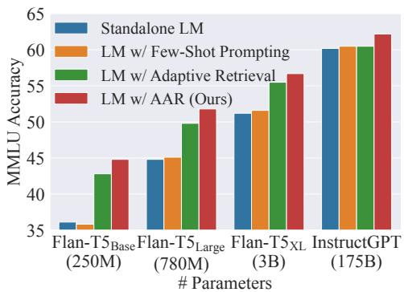
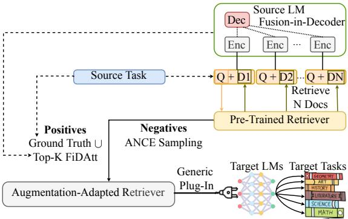
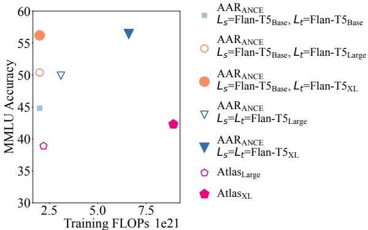
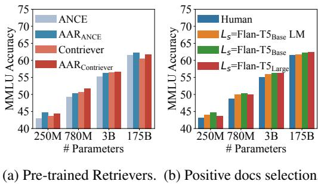
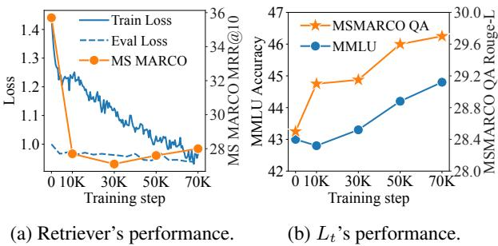
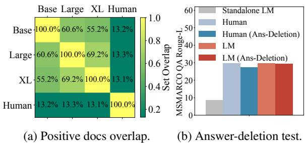
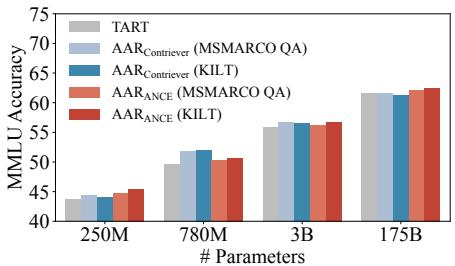
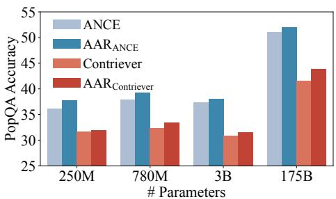
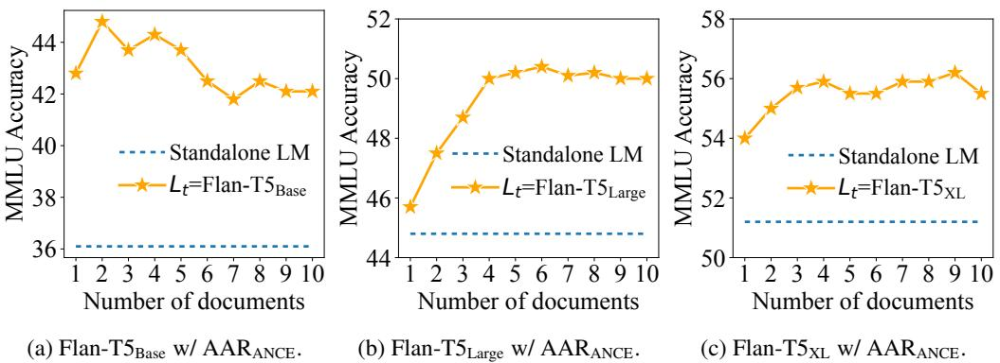

# Augmentation-Adapted Retriever Improves Generalization of Language Models as Generic Plug-In

Zichun $\mathbf { V } \mathbf { u } ^ { 1 }$ Chenyan Xiong2 Shi $\mathbf { V } \mathbf { u } ^ { 1 }$ Zhiyuan Liu13

1Dept. of Comp. Sci. & Tech., Institute for AI, Tsinghua University, Beijing, China 2Microsoft Research, Redmond, USA 3Beijing National Research Center for Information Science and Technology, Beijing, China {yuzc19, yus21}@mails.tsinghua.edu.cn; chenyan.xiong@microsoft.com liuzy@tsinghua.edu.cn

# Abstract

Retrieval augmentation can aid language models (LMs) in knowledge-intensive tasks by supplying them with external information. Prior works on retrieval augmentation usually jointly fine-tune the retriever and the LM, making them closely coupled. In this paper, we explore the scheme of generic retrieval plug-in: the retriever is to assist target LMs that may not be known beforehand or are unable to be fine-tuned together. To retrieve useful documents for unseen target LMs, we propose augmentation-adapted retriever (AAR), which learns LM’s preferences obtained from a known source LM. Experiments on the MMLU and PopQA datasets demonstrate that our AAR trained with a small source LM is able to significantly improve the zero-shot generalization of larger target LMs ranging from 250M Flan-T5 to 175B InstructGPT. Further analysis indicates that the preferences of different LMs overlap, enabling AAR trained with a single source LM to serve as a generic plug-in for various target LMs. Our code is open-sourced at https://github.com/OpenMatch/AugmentationAdapted-Retriever.

# 1 Introduction

Large language models (LMs) that possess billions of parameters are able to capture a significant amount of human knowledge, leading to consistent improvements on various downstream tasks (Brown et al., 2020; Kaplan et al., 2020; Roberts et al., 2020). However, the undeniable drawback of large LMs lies in their high computational cost, which negatively impacts their efficiency (Strubell et al., 2019; Bender et al., 2021). Furthermore, the knowledge memorized from pretraining and the implicit reasoning process of LMs can be inaccurate and intractable sometimes, hindering their applications on knowledge-intensive tasks (Guu et al., 2020; Lewis et al., 2020; Mallen et al., 2022; Wei et al., 2022).

  
Figure 1: Performance of LM w/ AAR (Ours).

Instead of leveraging the knowledge and reasoning abilities embedded within the parameters of the LMs, retrieval augmentation (Guu et al., 2020; Lewis et al., 2020; Borgeaud et al., 2022) enhances the LM with a retriever that can retrieve knowledge from an external corpus. On the other hand, prior retrieval augmentation methods (Izacard and Grave, 2021a; Izacard et al., 2022) necessitate fine-tuning the backbone LM to adjust to the retriever and tackle specific downstream tasks. This kind of fine-tuning can be expensive when more and more unique demands emerge (Maronikolakis and Schütze, 2021). More importantly, many toptier LMs can only be accessed through black-box APIs (Ouyang et al., 2022; OpenAI, 2023). These APIs allow users to submit queries and receive responses but typically do not support fine-tuning.

In this paper, we introduce AugmentationAdapted Retriever (AAR) to assist black-box LMs with downstream tasks as generic plug-in. To retrieve valuable documents for many unseen LMs, we propose to leverage a small source LM to provide LM-preferred signals for retriever’s training. The retriever after training (i.e., AAR) can be directly utilized to assist a large target LM by plugging in the retrieved documents.

Specifically, we choose a small encoder-decoder LM as the source LM and utilize its fusionin-decoder attention scores (Izacard and Grave, 2021a) to annotate LM-preferred documents. The LM-preferred documents are then combined with human-preferred documents to form the positive document set. Negative documents are mined by the retriever itself using the ANCE (Xiong et al., 2021) technique. After fine-tuning the retriever with LM’s preferences, it can directly assist unseen target LMs in the zero-shot task generalization.

We evaluate AAR on a multi-task language understanding dataset MMLU (Hendrycks et al., 2021) and an entity-centric question answering dataset PopQA (Mallen et al., 2022). For the target LMs, we choose Flan-T5 (Chung et al., 2022) series as our backbone for encoder-decoder LMs and InstructGPT (Ouyang et al., 2022) as our backbone for decoder-only LMs. Figure 1 shows that assisted with a generic AAR, LMs of different sizes and architectures can consistently outperform the standalone LMs; the performance of smaller LMs can sometimes surpass the standalone counterparts of significantly larger sizes (e.g., Flan-T5Large w/ AAR outperforms standalone Flan- $ { \mathrm { \Delta T } } 5 _ {  { \mathrm { X L } } }$ by $0 . 6 \%$ ). AAR also demonstrates advantages over other augmentation approaches such as few-shot prompting and adaptive retrieval (Mallen et al., 2022).

Further analysis reveals that the preferences obtained from different-sized source LMs are similar, and LMs with near capacities tend to yield closer preferred document sets. As a result, our AAR model trained from a small source LM can be considered as a generic plug-in to enhance the zeroshot generalization of a significantly larger target LM. We also discover that the documents preferred by LMs can provide assistance to the model from alternative perspectives, rather than relying solely on the full information favored by search users.

# 2 Related Work

Retrieval Augmentation. Augmenting LMs with retrieved information from external memories has shown effective on diverse knowledge-intensive tasks (Guu et al., 2020). Prior works explore novel ways to train the whole retriever-LM system in an end-to-end fashion, using retrievalaugmented sequence log-likelihood (Lewis et al., 2020; Borgeaud et al., 2022), fusion-in-decoder attention distillation (Izacard and Grave, 2021a; Izacard et al., 2022), or knowledge graph (Ju et al., 2022). To decouple the retriever from LM, Rubin et al. (2022) train an independent prompt retriever for in-context learning, and Lin et al. (2022) only fine-tune the LM via the retrieved data that is similar to few-shot unsupervised samples.

Recent researches adopt zero-shot retrieval augmentation that does not fine-tune the LM on InstructGPT (Ouyang et al., 2022). It can benefit entity-centric question answering (Mallen et al., 2022), chain-of-thought reasoning (He et al., 2022), and multi-hop question answering (Khattab et al., 2022). Parallel work (Shi et al., 2023) uses LM likelihood to train the retriever for satisfying blackbox LM’s preferences, and they adopt GPT-3 Curie (Brown et al., 2020) to provide the supervision signals. In this work, we devise the retriever that can be used as a generic plug-in to assist a variety of unseen LMs.

Zero-shot Learning and Reasoning. Largescale unsupervised pre-trained LMs like GPT3 (Brown et al., 2020), GPT-4 (OpenAI, 2023), and PaLM (Chowdhery et al., 2022) are able to perform zero-shot learning on many downstream tasks with a task description provided at inference time. Instruction-finetuned LMs (Sanh et al., 2022; Chung et al., 2022; Ouyang et al., 2022), which are pre-trained on multiple supervised tasks using human instructions, also also exhibit robust zeroshot learning capabilities. Yu et al. (2023) propose a new scheme of zero-shot reasoning, which first prompts large LMs to generate relevant documents and then perform reading comprehension on the generated contents. Recently, there has been a growing trend of utilizing plug-and-play knowledge injection to enhance the zero-shot performance of LMs, which is achieved through mapping network (Zhang et al., 2023) or document encoding (Xiao et al., 2023). Our work improves the zero-shot generalization of LMs by utilizing the retrieved information. We demonstrate that identifying LMs’ preferences to train the retriever can in turn bring additional evidence texts for LMs.

# 3 Method

In this section, we first introduce the preliminaries of the dense retrieval and the retrieval-augmented LM $( \ S ~ 3 . 1 )$ , then propose our augmentationadapted retriever $( \ S 3 . 2 )$ .

# 3.1 Preliminaries

Retrieval-augmented LM (Guu et al., 2020; Lewis et al., 2020) is a type of LM that leverages external information to improve its performance. It retrieves relevant documents from a corpus using a retriever, and then utilizes the documents to enhance its language generation capabilities.

The objective of the retriever is to find an augmentation document set $D ^ { a }$ from a corpus $C$ that helps the LM handle a given query $q$ . Previous researches (Karpukhin et al., 2020; Xiong et al., 2021) concentrate primarily on the dense retrieval system that searches in the dense vector space since dense retrieval usually performs more accurately and efficiently than sparse one.

A dense retrieval model first represents $q$ and the document $d$ into an embedding space using a pre-trained encoder $g$ ,

$$
\pmb { q } = g ( q ) ; \pmb { d } = g ( d ) , d \in C ,
$$

and match their embeddings by dot product function $f$ , which supports fast approximate nearest neighbor search (ANN) (André et al., 2016; Johnson et al., 2021). We then define $D ^ { a }$ that contains top- $N$ retrieved documents as:

$$
D ^ { a } = \{ d _ { 1 } ^ { a } \cdot \cdot \cdot d _ { N } ^ { a } \} = \mathrm { A N N } _ { f ( q , \circ ) } ^ { N } .
$$

For the LM backbones, the decoder-only and the encoder-decoder models are the two primary choices of the retrieval-augmented LMs (Izacard and Grave, 2021b; Yu et al., 2023).

Given a decoder-only LM like GPT-3 (Brown et al., 2020), the LM input can be a simple concatenation of the query and all the augmentation documents $\{ d _ { 1 } ^ { a } \ldots d _ { N } ^ { a } \}$ . Then, the LM will generate the answer based on the inputs auto-regressively.

For an encoder-decoder LM like T5 (Raffel et al., 2020), taking simple concatenation as the encoder input may still be effective. However, this method may not scale to a large volume of documents due to the quadratic self-attention computation associated with the number of documents. To aggregate multiple documents more efficiently, Izacard and Grave (2021b) propose the fusion-in-decoder (FiD) mechanism, which soon becomes the mainstream in the development of encoder-decoder retrievalaugmented LMs. It first encodes each concatenation of the $( d _ { i } ^ { a } , q )$ pair separately and then lets the decoder attend to all parts:

$$
\mathrm { F i D } ( q ) = \operatorname { D e c } ( \operatorname { E n c } ( d _ { 1 } ^ { a } \oplus q ) \dots \operatorname { E n c } ( d _ { N } ^ { a } \oplus q ) ) .
$$

In this way, the encoder computes self-attention over one document at a time so that the computational cost can grow linearly with the number of documents. Furthermore, FiD cross-attention is found effective in estimating the relative importance of the augmentation documents from the LM’s perspective (Izacard and Grave, 2021a). Therefore, soft FiD distillation (Izacard and Grave, 2021a; Izacard et al., 2022; Shi et al., 2023), which minimizes the KL-divergence between retrieval likelihood and LM likelihood, is often used to train the retriever and the LM end-to-end.

  
Figure 2: Illustration of augmentation-adapted retriever.

# 3.2 Augmentation-adapted Retriever

Due to the emerging real-world demands and the limitations of black-box APIs, fine-tuning retrieval-augmented LM for each possible downstream task can be infeasible. Hence, we introduce Augmentation-Adapted Retriever (AAR) as a generic plug-in for black-box LMs. As illustrated in Figure 2, AAR can learn the preferences of LMs without the need for fine-tuning them.

Specifically, we utilize an encoder-decoder LM as source LM $( L _ { s } )$ to provide LM-preferred signals on a source task $( T _ { s } )$ for fine-tuning a pre-trained retriever. Then, we plug the fine-tuned retriever into unseen target LM $( L _ { t } )$ on a set of target tasks $( T _ { t } )$ non-intersecting with $T _ { s }$ .

Our training method starts from a source task $T _ { s }$ , where we aggregate the source LM $L _ { s }$ ’s average FiD cross-attention (FiDAtt) scores $S _ { i } ^ { a }$ corresponding to document $d _ { i } ^ { a }$ from the first decoder token over all the layers, all the heads and all the input tokens $t$ of $d _ { i } ^ { a } \oplus q$ :

$$
S _ { i } ^ { a } = \frac { 1 } { \ln * \ln * \ln } \sum _ { \mathrm { l a y e r s h e a d s } } \sum _ { t \in d _ { i } ^ { a } \oplus q } \mathrm { F i D A t t } ( \mathrm { F i D } ( q ) ) .
$$

where ln, hn, tn are the numbers of the layers, the heads and the input tokens.

To make the training process more robust, we utilize the FiDAtt scores to annotate the LM-preferred positive documents in a discrete way:

$$
D ^ { a + } = D ^ { h + } \cup \mathrm { T o p } { - } K _ { S _ { i } ^ { a } , D ^ { a } } ,
$$

where $D ^ { h + }$ is the human-preferred positive document set (i.e., ground truth) on $T _ { s }$ . Top- $K _ { S _ { i } ^ { a } , D ^ { a } }$ means the documents with the top- $\mathbf { \nabla } \cdot \mathbf { k }$ average FiDAtt scores $S _ { i } ^ { a }$ in the retrieved document set $D ^ { a }$ .

Then, we sample hard negatives following ANCE (Xiong et al., 2021) and formulate the training loss $\mathcal { L }$ of the retriever as:

$$
\begin{array} { r l } & { D ^ { - } = \mathbf { A } \mathbf { N } \mathbf { N } _ { f ( q , \circ ) } ^ { M } \backslash D ^ { a + } , } \\ & { \mathcal { L } = \displaystyle \sum _ { q } \displaystyle \sum _ { d ^ { + } \in D ^ { a + } } \sum _ { d ^ { - } \in D ^ { - } } l ( f ( q , d ^ { + } ) , f ( q , d ^ { - } ) ) , } \end{array}
$$

where $M$ is the hyperparameter of the negative sampling depth and $l$ is the standard cross entropy loss. After fine-tuning the retriever, we directly use it to augment unseen target LM $L _ { t }$ on each task from target task set $T _ { t }$ .

# 4 Experimental Methodologies

In this section, we discuss our main experimental setup. More details can be found in Appendix A.

# 4.1 Target Tasks

Following prior works (Chung et al., 2022; Mallen et al., 2022), we choose MMLU (Hendrycks et al., 2021) and PopQA (Mallen et al., 2022) as target tasks $T _ { t }$ .

MMLU is a multitask language understanding dataset, which includes 57 multi-choice question answering subtasks. These subtasks can be generally classified into four categories: humanities, social sciences, STEM, and other. We average the accuracy of the subtasks in each category to obtain the final score. We report the accuracy of the evaluation set in our main experiments.

PopQA is an entity-centric question answering dataset that mainly concentrates on long-tail questions. We report the accuracy of the test set in our main experiments.

# 4.2 Our Method

Retrievers. We adopt two widely used retrievers to initialize AAR: ANCE initialized from $\mathrm { T } 5 _ { \mathrm { B a s e } }$ (Raffel et al., 2020; Ge et al., 2023) and Contriever (Izacard et al., 2021) initialized from $\mathbf { B E R T _ { B a s e } }$ (Devlin et al., 2019). Both of them have been fine-tuned on MS MARCO (Bajaj et al., 2016) previously. For the retrieval corpus, we choose the MS MARCO (Bajaj et al., 2016) for MMLU and the KILT-Wikipedia (Petroni et al.) for PopQA.

Language Models. We adopt Flan-T5 (Chung et al., 2022) series as our backbone for encoderdecoder LMs and InstructGPT1 (Ouyang et al., 2022) as our backbone for decoder-only LMs. These models have been multi-task instructionfinetuned and are widely utilized for assessing zeroshot generalization (Zhou et al., 2023).

Implementation Details. We utilize the MS MARCO (Bajaj et al., 2016) as our source task $T _ { s }$ since it is the common choice to train the retriever (Xin et al., 2022). This dataset consists of high-quality questions that require real-world knowledge to answer, which aligns strongly with our target tasks $T _ { t }$ and possesses no overlap with them. Considering the implementation efficiency, we take the Flan- $\mathrm { T } 5 _ { \mathrm { B a s e } }$ as the source LM $L _ { s }$ and treat the larger model as the target LM $L _ { t }$ . We directly set the total document number $N = 1 0$ , LMpreferred document number $K = 2$ , and the negative mining depth $M = 1 0 0$ in the augmentationadapted training. We run all experiments on a single A100 GPU (40G).

# 4.3 Baselines

Zero-shot Setting. We compare our method with the state-of-the-art zero-shot baselines. Standalone LMs, including Flan-T5 (Chung et al., 2022), InstructGPT (Ouyang et al., 2022), GAL (Taylor et al., 2022) and OPT-IML-Max (Iyer et al., 2022), are prompted by a natural language instruction that describes the desired task and question. Adaptive retrieval (Mallen et al., 2022) selectively utilizes non-parametric memory (retrieval augmentation) and parametric memory (the knowledge obtained from pre-training) based on questions’ popularity. In our main experiment, we select the optimal combination in their paper, which consists of Contriever as the non-parametric memory and GenRead (Yu et al., 2023) as the parametric memory.

Few-shot Setting. We also include the results of previous few-shot models for reference. Flan-T5, InstructGPT, Chinchilla (Hoffmann et al., 2022) and OPT-IML-Max adopt few-shot demonstrations, which provide the LMs with a limited number of task examples. This enables the models to generalize from these examples and generate accurate responses (Gao et al., 2021). Atlas (Izacard et al., 2022) is a state-of-the-art retrieval-augmented LM, which jointly pre-trains the retriever with the LM using unsupervised data and fine-tunes the retriever via the attention distillation on few-shot data.

<table><tr><td rowspan="2">Settings</td><td rowspan="2">Methods</td><td rowspan="2"># Parameters</td><td colspan="5">MMLU</td><td rowspan="2">PopQA All</td></tr><tr><td>All</td><td>Hum.</td><td>Soc. Sci.</td><td>STEM</td><td>Other</td></tr><tr><td>Base Setting: T5 Base Size</td><td colspan="8"></td></tr><tr><td rowspan="4">Few-shot</td><td>Flan-T5Base (Chung et al., 2022)</td><td>250M</td><td>35.8</td><td>39.6</td><td>39.8</td><td>26.3</td><td>41.2</td><td>8.0</td></tr><tr><td>Flan-T5Base</td><td>250M</td><td>36.1</td><td>40.4</td><td>39.8</td><td>27.0</td><td>40.6</td><td>8.8</td></tr><tr><td>Flan-T5Base w/ AR (Mallen et al., 2022)</td><td>250M</td><td>42.8</td><td>43.5</td><td>44.0</td><td>35.8</td><td>50.0</td><td>29.4</td></tr><tr><td>Zero-shot Flan-T5Base w/ AARContriever (Ours)</td><td>250M</td><td>44.4 44.8</td><td>44.7 42.2</td><td>47.7 46.4</td><td>35.8 39.0</td><td>52.2</td><td>31.9</td></tr><tr><td colspan="7">Flan-T5Base w/ AARANCE (Ours) 250M Large Setting: T5 Large Size</td><td>53.2</td><td>37.7</td></tr><tr><td>Few-shot</td><td>AtlasLarge FT (Izacard et al., 2022)</td><td>770M</td><td>38.9</td><td>37.3</td><td>41.7</td><td></td><td>44.9</td><td></td></tr><tr><td rowspan="4"></td><td>Flan-T5Large</td><td>780M</td><td>45.1</td><td>47.7</td><td>53.5</td><td>32.3 34.4</td><td>49.2</td><td>n.a. 9.3</td></tr><tr><td>Flan-T5Large</td><td>780M</td><td></td><td></td><td></td><td></td><td></td><td></td></tr><tr><td>Flan-T5Large w/ AR</td><td>780M</td><td>44.8</td><td>46.3</td><td>51.4</td><td>34.8</td><td>50.6</td><td>7.2</td></tr><tr><td>Flan-T5Lae /AARCu)</td><td>780M</td><td>49.8</td><td>50.0</td><td>55.6</td><td>38.4</td><td>59.5</td><td>29.6</td></tr><tr><td rowspan="4">Zero-shot XL Setting: T5 XL Size</td><td></td><td>780M</td><td>51.8</td><td>50.8</td><td>59.7</td><td>39.4</td><td>61.8</td><td>33.4</td></tr><tr><td>Flan-T5Large w/ AARANCE (Ours)</td><td></td><td>50.4</td><td>48.0</td><td>58.1</td><td>39.3</td><td>60.2</td><td>39.3</td></tr><tr><td></td><td></td><td></td><td></td><td></td><td></td><td></td><td></td></tr><tr><td>AtlasxL FT Few-shot Flan-T5xL</td><td>3B</td><td>42.3</td><td>40.0</td><td>46.8</td><td>35.0</td><td>48.1</td><td>n.a.</td></tr><tr><td rowspan="4">Zero-shot</td><td>Flan-T5xL</td><td>3B</td><td>51.6</td><td>55.0</td><td>61.1</td><td>36.8</td><td>59.5</td><td>11.1</td></tr><tr><td></td><td>3B</td><td>51.2</td><td>55.5</td><td>57.4</td><td>38.1</td><td>58.7</td><td>11.3</td></tr><tr><td>Flan-T5xL w/ AR</td><td>3B</td><td>55.5</td><td>56.7</td><td>64.5</td><td>43.0</td><td>62.6</td><td>33.7</td></tr><tr><td>Flan-T5xL w/ AARContriever (Ours) Flan-T5xL w/ AARANcE (Ours)</td><td>3B 3B</td><td>56.7 56.2</td><td>57.7 59.4</td><td>65.4 64.8</td><td>43.6 41.5</td><td>65.1 64.9</td><td>31.5 38.0</td></tr><tr><td colspan="8">Giant Setting: Over 70B Size</td></tr><tr><td rowspan="4">Few-shot</td><td>Chinchilla (Hoffmann et al., 2022)</td><td>70B</td><td></td><td></td><td></td><td></td><td></td><td></td></tr><tr><td>OPT-IML-Max (Iyer et al., 2022)</td><td></td><td>67.5</td><td>63.6</td><td>79.3</td><td>55.0</td><td>73.9</td><td>n.a.</td></tr><tr><td>InstructGPT (Ouyang et al., 2022)</td><td>175B 175B</td><td>47.1</td><td>n.a.</td><td>n.a.</td><td>n.a.</td><td>n.a.</td><td>n.a.</td></tr><tr><td>GAL (Taylor et al., 2022)</td><td>120B</td><td>60.5</td><td>62.0</td><td>71.8</td><td>44.3</td><td>70.1</td><td>35.2</td></tr><tr><td rowspan="5">Zero-shot</td><td>OPT-IML-Max</td><td></td><td>52.6</td><td>n.a.</td><td>n.a.</td><td>n.a.</td><td>n.a.</td><td>n.a.</td></tr><tr><td></td><td>175B</td><td>49.1</td><td>n.a.</td><td>n.a.</td><td>n.a.</td><td>n.a.</td><td>n.a.</td></tr><tr><td>InstructGPT InstructGPT w/ AR</td><td>175B</td><td>60.2</td><td>65.7</td><td>68.0</td><td>46.1</td><td>66.5 69.7</td><td>34.7</td></tr><tr><td>InstructGPT w/ AARContriever (Ours)</td><td>175B 175B</td><td>60.5 61.5</td><td>62.2 64.5</td><td>71.3 73.1</td><td>44.7 45.0</td><td>69.9</td><td>43.3 43.9</td></tr><tr><td>InstructGPT w/ AARANCE (Ours)</td><td>175B</td><td>62.2</td><td>62.0</td><td>72.0</td><td>49.2</td><td>70.7</td><td>52.0</td></tr></table>

Table 1: Our main results on MMLU and PopQA dataset. We group the methods mainly by the parameters. Our $L _ { s }$ is Flan- $\mathrm { T } 5 _ { \mathrm { B a s e } }$ . AARContriever: AAR initialized from Contriever; $\mathbf { A A R _ { A N C E } }$ : AAR initialized from ANCE; FT: fine-tuning; AR: adaptive retrieval. Unspecified methods represent direct prompting. The score marked as bold means the best performance among the models in the zero-shot setting.

  
Figure 3: Training FLOPs of retrieval augmentation methods.

# 5 Evaluation Results

In this section, we discuss our main results on MMLU and PopQA datasets $( \ S 5 . 1 )$ and conduct

comprehensive studies about how $( \ S \ 5 . 2 , \ \ S \ 5 . 3 $ $\ S \ S . 4 )$ and when $( \ S 5 . 5 , \ S 5 . 6 )$ AAR helps.

# 5.1 Overall Performance

Table 1 demonstrates that, with the assistance of a generic AAR, target LMs of different sizes and architectures can significantly outperform their standalone baselines in the zero-shot setting. Notably, AAR even improves powerful InstructGPT by $2 \%$ on MMLU and by nearly $20 \%$ on PopQA. We hypothesize that the PopQA dataset mainly comprises long-tail questions and thus necessitates more augmentation information to attain high accuracy. AAR outperforms other augmentation methods like few-shot prompting and adaptive retrieval, as they may not offer as extensive evidence text as AAR does.

Meanwhile, AAR is a highly efficient augmentation approach since it only relies on a small source

  
Figure 4: AAR’s performance when (a) using different pre-trained retrievers and (b) trained with different positive documents, using Flan- $. \mathrm { T } 5 _ { \mathrm { B a s e } }$ (250M), Flan$\mathrm { T } 5 _ { \mathrm { L a r g e } }$ (780M), Flan- $\mathrm { \Delta } \mathrm { T } 5 _ { \mathrm { X L } }$ (3B), InstructGPT (175B) as $L _ { t }$ . The retriever in (b) is initialized from ANCE.

LM Flan- $. T 5 _ { \mathrm { B a s e } }$ (250M) to provide training signals and can generalize well to target LMs of larger capacities. Figure 3 illustrates that solely setting the source LM as the target LM (represented by the inverted triangles) does not significantly enhance the MMLU accuracy. However, it may triple the training budget required. Only using a small source LM is able to outperform the powerful Atlas by large margins with fewer training FLOPs.

# 5.2 Ablation Study

In this experiment, we conduct the ablation study of augmentation-adapted training and analyze model behaviors during the training process.

Figure 4a illustrates that augmentation-adapted training can bring additional improvements compared to the pre-trained retrievers. In general, ANCE benefits more from augmentation-adapted training than Contriever. This may be due to the fact that Contriever has been already intensively pre-trained on massive data augmentations as well as MS MARCO whereas ANCE is trained only on MS MARCO. We provide exact numbers in Table 7 and PopQA results in Figure 8, which yield similar observations as MMLU.

In Figure 4b, we compare retrievers trained with different positive documents, including humanpreferred documents annotated by search users (the blue bar), LM-preferred documents obtained by the source LM (the orange bar), and their combinations (the green bar and the red bar). Since the retriever has been pre-trained on user-annotated MS MARCO, simply using human-preferred documents to train it may be meaningless and therefore performs the worst among all approaches. Only using LM-preferred documents demonstrates notable gains over only using human-preferred documents, and merging both human-preferred and LM-preferred documents (our main setup) further enhances the retriever’s performance. Finally, using Flan- $. \mathrm { T } 5 _ { \mathrm { B a s e } }$ as source LM yields better results compared to using Flan- $\cdot \mathrm { T } 5 _ { \mathrm { L a r g e } }$ when the target LMs are relatively small. However, as the target LM’s size increases, both approaches achieve comparable performance. Hence, our choice to utilize a small source LM in the augmentation-adapted training is reasonable and effective.

  
Figure 5: AAR’s training process. (a) exhibits the retriever’s (ANCE) performance on MS MARCO. (b) presents the $L _ { t }$ ’s (Flan- $. \mathrm { T } 5 _ { \mathrm { B a s e . } }$ ) performance on MSMARCO QA and MMLU.

Figure 5a and Figure 5b plot the retriever’s and LM’s performance during augmentation-adapted training, respectively. At the beginning of the training, the retriever’s $\mathbf { M R R } @ 1 0$ on the MS MARCO drops dramatically, indicating a large distribution gap between human-preferred and LM-preferred documents. As the retriever’s train and dev loss continually decline, the retrieval-augmented LM gradually performs better on MSMARCO QA and eventually, on MMLU. This result implies that LMs on different task may share common preferences, making AAR generalize well from single source task to heterogeneous target tasks.

# 5.3 Analysis of LM-preferred Documents

We highlight the necessity of adapting existing retrievers to LMs by comparing the preferred documents between search users and LMs. In general, we discover that LM-preferred documents can assist LM from alternative perspectives rather than the full information favored by search users.

First, we define the set overlap $O$ between two positive documents set $D _ { 1 } ^ { + }$ and $D _ { 2 } ^ { + }$ as:

$$
O = \frac { D _ { 1 } ^ { + } \cap D _ { 2 } ^ { + } } { D _ { 1 } ^ { + } \cup D _ { 2 } ^ { + } } .
$$

As illustrated in Figure 6a, the set overlaps of the positive document sets annotated by human users $( D ^ { h + } )$ and LMs (To $) - K _ { S _ { i } ^ { a } , D ^ { a } } )$ are quite low (near $1 3 \% )$ , demonstrating their distinct tendencies in selecting valuable documents. On the contrary, the overlaps between different LMs are relatively high (over $5 5 \%$ ). This evidence provides a strong rationale for the generalization ability of AAR since LMs with different sizes tend to annotate similar positive documents. Furthermore, LMs whose sizes are closer generally possess higher overlaps. This implies a better generalization ability of the AAR to the LMs whose capacity is near the source LM. The findings further validate the results illustrated in Figure 4b.

Table 2: Cases study on MSMARCO QA dataset. We show Top-1 document annotated by human users and FiDAt scores. Red texts are the gold answer spans.   

<table><tr><td rowspan=1 colspan=1>Question</td><td rowspan=1 colspan=1>Human-preferred Document</td><td rowspan=1 colspan=1>LM-preferred Document</td></tr><tr><td rowspan=1 colspan=1>what happens if you missyour cruise ship</td><td rowspan=1 colspan=1>If you do miss the ship, go into thecruise terminal and talk with the portagents, who are in contact with bothshipboard and shoreside personnel.They can help you decide the best wayto meet your ..</td><td rowspan=1 colspan=1>The cruise line is not financially respon-sible for getting passengers to the nextport if they miss the ship. Your travelto the subsequent port, or home, is onyour dime, as are any necessary hotelstays and meals...</td></tr><tr><td rowspan=1 colspan=1>what is annexation?</td><td rowspan=1 colspan=1>Annexation is an activity in which twothings are joined together, usually witha subordinate or lesser thing being at-tached to a larger thing. In strict legalterms, annexation simply involves</td><td rowspan=1 colspan=1>Annexation (Latin ad, to, and nexus,joining) is the administrative action andconcept in international law relating tothe forcible transition of one state&#x27;s ter-ritory by another state. It is generallyheld to be an illegal act...</td></tr></table>

  
Figure 6: Analysis of LM-preferred documents. (a) shows the overlaps of positive document sets, where used LMs are Flan-T5 series. (b) presents the answerdeletion experiments on the MSMARCO QA dataset. The retriever is initialized from ANCE.

  
Figure 7: Comparison between single-task (MSMARCO QA) and multi-task (KILT) trained AAR. TART (Asai et al., 2022) is a multi-task instructionfinetuned retriever that has not been finetuned with LMpreferred signals.

To give an in-depth analysis of how humanpreferred and LM-preferred documents differ, we show two representative cases sampled from the MSMARCO QA in Table 2. We observe that the human-preferred document can always present the gold answer at the beginning of the text, while the LM-preferred document may not contain the exact answer. However, an LM-preferred document can (1) deliver a new perspective to answer the given question, e.g., “the cruise line’s responsibility if you miss your cruise ship” and (2) give a specific explanation instead of an abstract definition, e.g., “forcible transition of one state’s territory by another state”, These characteristics differ from search users who want the full information and can further assist LMs in knowledge-based reasoning.

We further examine the unique characteristics of LM-preferred documents through the answerdeletion test (i.e., deleting the exact answer span from the retrieved documents). As shown in Figure 6b, the retriever trained by either humanpreferred (i.e., human-preferred retriever) or LMpreferred documents (i.e., LM-preferred retriever) can help LM answer the given question. Nevertheless, after the answer-deletion, the performance of LM with the human-preferred retriever declines more significantly than with the LM-preferred retriever. Despite having fewer exact match answers ( $0 . 6 \%$ for LM-preferred documents vs. $1 3 . 0 \%$ for human-preferred documents), LM-preferred documents provide helpful information from alternative perspectives. Therefore, adapting retrievers with LM-preferred documents can in turn make retrievalaugmented LM perform better.

Table 3: Ablation of the retrieval corpus, with Flan$\mathrm { T } 5 _ { \mathrm { B a s e } }$ as LM and AARANCE as retriever.   

<table><tr><td rowspan="2">Corpora</td><td colspan="5">MMLU</td><td rowspan="2">PopQA All</td></tr><tr><td>All</td><td>Hum.</td><td>Soc. Sci.</td><td>STEM</td><td>Other</td></tr><tr><td>MS MARCO</td><td>44.8</td><td>42.2</td><td>46.4</td><td>39.0</td><td>53.2</td><td>13.6</td></tr><tr><td>KILT-Wikipedia</td><td>42.6</td><td>42.5</td><td>45.9</td><td>34.3</td><td>50.5</td><td>37.7</td></tr><tr><td>Standalone LM</td><td>36.1</td><td>40.4</td><td>39.8</td><td>27.0</td><td>40.6</td><td>8.8</td></tr></table>

# 5.4 Multi-task Training of AAR

In this section, we explore if the multi-task training of AAR can endow the retriever with better generalization to the target task. Specifically, we choose KILT (Petroni et al.) as our multi-task data source, which consists of 5 categories (Fact Checking, Entity Linking, Slot Filling, Open Domain QA, and Dialogue). We take one representative subtask per category to form a mixture of multiple source tasks.

Figure 7 illustrates that ANCE trained with multi-task KILT can consistently outperform the single-task MSMARCO QA, proving the better generalization ability brought by multi-task augmentation-adapted training. It is possible that LMs may vary slightly in preferred documents for different tasks and AAR can switch more smoothly to the target task with the help of multi-task training. Contriever does not benefit greatly from multitask training. We conjecture that this is because Contriever has been pre-trained with multiple formats of data augmentations and thus generalizes better to new data distribution than ANCE. Interestingly, multi-task instruction-finetuned retriever TART (Asai et al., 2022) has an overall worse performance compared to AAR, highlighting the benefits of having LM-preferred documents during the multi-task training. A more detailed analysis about the selection of source tasks is in Appendix B.

# 5.5 Effect of Retrieval Corpus

Table 3 demonstrates that regardless of the retrieval corpus, AAR results in consistent and substantial performance gains over the standalone LM.

On MMLU, using MS MARCO as the retrieval corpus improves the LM more compared to KILTWikipedia. We hypothesize that the retriever has been trained with MS MARCO corpus and thus holds better retrieval performance on it.

Table 4: Results of OPT and GPT-neo. We use their 1.3B version. The score marked as bold means the best performance in the zero-shot setting.   

<table><tr><td></td><td rowspan=1 colspan=5>Settings  Methods</td><td rowspan=1 colspan=1>MMLUAll</td><td rowspan=1 colspan=1>PopQAAll</td></tr><tr><td></td><td rowspan=1 colspan=5>OPT (Zhang et al., 2022)Few-shotGPT-neo (Black et al., 2021)</td><td rowspan=1 colspan=1>26.028.7</td><td rowspan=1 colspan=1>12.311.3</td></tr><tr><td></td><td rowspan=6 colspan=5>OPTGPT-neoOPT GenReadGPT-neo GenReadZero-shotOPT w/ AARContriever (Ours)GPT-neo w/ AARContriever (Ours)</td><td rowspan=1 colspan=1>22.7</td><td rowspan=1 colspan=1>12.0</td></tr><tr><td></td><td rowspan=2 colspan=2></td><td rowspan=1 colspan=1>25.3</td><td rowspan=1 colspan=1>9.9</td></tr><tr><td></td><td rowspan=1 colspan=2></td><td rowspan=1 colspan=1>22.3</td><td rowspan=1 colspan=1>12.2</td></tr><tr><td></td><td rowspan=1 colspan=2></td><td rowspan=1 colspan=1>24.4</td><td rowspan=1 colspan=1>11.9</td></tr><tr><td></td><td rowspan=1 colspan=1>23.2</td><td rowspan=1 colspan=1>29.1</td></tr><tr><td></td><td rowspan=1 colspan=1>25.2</td><td rowspan=1 colspan=1>27.8</td></tr><tr><td rowspan=2 colspan=6>OPT w/ AARANCE (Ours)GPT-neo w/ AARANCE (Ours)</td><td rowspan=1 colspan=2></td></tr><tr><td rowspan=1 colspan=1>26.6</td><td rowspan=1 colspan=1>30.1</td></tr></table>

On PopQA, model performance will drop by large margins if we use MS MARCO as the retrieval corpus instead of KILT-Wikipedia. The primary reason is that the PopQA dataset is sampled from Wikidata and designed for long-tail questions. Partial long-tail knowledge can be only found in KILT-Wikipedia (Mallen et al., 2022) while MS MARCO lacks the indispensable evidence that should be utilized for answer prediction. For instance, given the question “Who is the mother of Melissa Benn?”, there is no document in MS MARCO containing the answer “Caroline Benn”. Under such circumstances, aligning the retrieval corpus with the data source can be necessary to leverage AAR’s ability.

# 5.6 Application Scenarios of AAR

To examine if AAR works for unseen LMs that lack zero-shot generalization ability, we also report the results of OPT (Zhang et al., 2022) and GPTneo (Black et al., 2021). These models may have poor zero-shot performance due to the lack of multitask instruction tuning.

From Table 4, we find that our AAR improves both LMs marginally on MMLU while achieving significant gains on PopQA. We conjecture that LMs can benefit more easily from retrieval augmentation on the knowledge-probing task like PopQA, where the answer span can be directly acquired from the retrieved documents. MMLU requires the LM to not only comprehend the retrieved pieces of evidence but also perform knowledge-based reasoning over them. OPT and GPT-neo may not possess such abilities in zero-shot scenarios.

In summary, although AAR perfectly fits the multi-task instruction-finetuned LMs such as the Flan-T5 series and InstructGPT, it may not bring significant gains for LMs whose zero-shot performance is sometimes poor, especially on knowledgebased reasoning. However, we believe that multitask instruction-finetuned models will be the foundation of future work due to their outstanding zeroshot generalization capabilities, ensuring the wideranging application scenarios of AAR.

# 6 Discussions

LM-preferred Documents. Acquiring discrete feedback signals from LMs is challenging as it requires superior labeling ability, which is not the designed purpose of LMs. Inspired by ADist (Izacard and Grave, 2021a) and Atlas (Izacard et al., 2022), we utilize the FiDAtt scores to select LM-preferred documents for the augmentation-adapted training. However, FiDAtt scores may not reflect the actual contribution of each document faithfully since LM may prefer attending to readable rather than informative documents. Furthermore, the quality of LM-preferred documents depends heavily on the initial performance of the retrieval-augmented LM. Parallel work (Shi et al., 2023) computes the KL divergence between retrieval likelihood and LM likelihood to train the retriever. Nevertheless, they require a larger source LM, Curie (6.7B), to provide accurate LM likelihood signals. In the future, reinforcement learning could serve as an alternative method to train the retriever, as it optimizes the retriever by directly leveraging LM’s signals without relying on the devised rule.

Generic Retrieval Plug-in. Chatgpt-retrievalplugin2 has recently gained attention in the NLP community as a generic retrieval plug-in. It retrieves the most relevant document from users’ data sources and tailor ChatGPT’s response to meet their specific needs. We believe that techniques such as AAR will enhance the ability of black-box ChatGPT to generate more reasonable responses based on the retrieved information, thereby promoting the development of human-centered LM design.

# 7 Conclusion and Future Work

This paper introduces generic retrieval plug-in that utilizes a generic retriever to enhance target LMs that may be unknown in advance or are unable to be fine-tuned jointly. Our proposed retriever, AAR, can directly support black-box LMs without requiring any fine-tuning of the LMs. This is accomplished by building the AAR’s training data with preferred documents from a small source LM together with the ground truth.

Empirical results on MMLU and PopQA demonstrate that AAR-assisted LMs greatly outperform the standalone ones in zero-shot scenarios, and AAR generalizes well to LMs of different sizes and structures. Analytical results reveal that LMpreferred and human-preferred documents complement each other; LM-preferred documents from different LMs overlap significantly, and LMs with similar sizes tend to yield closer document sets.

We leave a more detailed explanation of how different LMs interact with augmentation documents and a more reasonable selection of LM-preferred documents for future work. We hope our work shed light on a path to a generic way of treating large LMs as black boxes and adapting retrievers to augment them.

# Limitations

Due to the limitation of computational resources, we have not evaluated the Flan- $\mathrm { \Delta } \mathrm { T } 5 _ { \mathrm { X X L } }$ whose number of parameters is 11B, and the OPT whose number of parameters is greater than 1.3B.

Since OPT and GPT-neo perform poorly in the zero-shot setting and separating attention scores of each document in the input is tedious for decoderonly models, we choose not to use them as source LMs. However, we prove that taking the encoderdecoder model Flan- $. \mathrm { T } 5 _ { \mathrm { B a s e } }$ as our source LM is also robust to augment decoder-only models. We will explore new methods to annotate LM-preferred documents of decoder-only models based on their inherent signals.

# Acknowledgement

Zichun Yu, Shi Yu, and Zhiyuan Liu are supported by Institute Guo Qiang at Tsinghua University, Beijing Academy of Artificial Intelligence (BAAI). All authors proposed the original idea together. Zichun Yu conducted the experiments. Zichun Yu, Chenyan Xiong, Shi Yu, and Zhiyuan Liu wrote the paper. Chenyan Xiong and Zhiyuan Liu provided valuable suggestions for the research. We thank Suyu Ge for sharing the ANCE checkpoint initialized from $\mathrm { T } 5 _ { \mathrm { B a s e } }$ .

# References

Fabien André, Anne-Marie Kermarrec, and Nicolas Le Scouarnec. 2016. Cache locality is not enough: High-performance nearest neighbor search with product quantization fast scan. In VLDB, page 12.

Akari Asai, Timo Schick, Patrick Lewis, Xilun Chen, Gautier Izacard, Sebastian Riedel, Hannaneh Hajishirzi, and Wen-tau Yih. 2022. Task-aware retrieval with instructions. arXiv preprint arXiv:2211.09260.

Payal Bajaj, Daniel Campos, Nick Craswell, Li Deng, Jianfeng Gao, Xiaodong Liu, Rangan Majumder, Andrew McNamara, Bhaskar Mitra, Tri Nguyen, et al. 2016. Ms marco: A human generated machine reading comprehension dataset. In CoCo@NeurIPS.

Emily M. Bender, Timnit Gebru, Angelina McMillanMajor, and Shmargaret Shmitchell. 2021. On the dangers of stochastic parrots: Can language models be too big? In Proceedings of ACM FAccT, pages 610–623.

Sid Black, Gao Leo, Phil Wang, Connor Leahy, and Stella Biderman. 2021. Gpt-neo: Large scale autoregressive language modeling with mesh-tensorflow.

Sebastian Borgeaud, Arthur Mensch, Jordan Hoffmann, Trevor Cai, Eliza Rutherford, Katie Millican, George Bm Van Den Driessche, Jean-Baptiste Lespiau, Bogdan Damoc, Aidan Clark, Diego De Las Casas, Aurelia Guy, Jacob Menick, Roman Ring, Tom Hennigan, Saffron Huang, Loren Maggiore, Chris Jones, Albin Cassirer, Andy Brock, Michela Paganini, Geoffrey Irving, Oriol Vinyals, Simon Osindero, Karen Simonyan, Jack Rae, Erich Elsen, and Laurent Sifre. 2022. Improving language models by retrieving from trillions of tokens. In ICML, pages 2206–2240.

Tom Brown, Benjamin Mann, Nick Ryder, Melanie Subbiah, Jared D Kaplan, Prafulla Dhariwal, Arvind Neelakantan, Pranav Shyam, Girish Sastry, Amanda Askell, et al. 2020. Language models are few-shot learners. In NeurIPS, pages 1877–1901.

Aakanksha Chowdhery, Sharan Narang, Jacob Devlin, Maarten Bosma, Gaurav Mishra, Adam Roberts, Paul Barham, Hyung Won Chung, Charles Sutton, Sebastian Gehrmann, Parker Schuh, and et al. 2022. Palm: Scaling language modeling with pathways. arXiv preprint arXiv:2204.02311.

Hyung Won Chung, Le Hou, Shayne Longpre, Barret Zoph, Yi Tay, William Fedus, Eric Li, Xuezhi Wang, Mostafa Dehghani, Siddhartha Brahma, Albert Webson, Shixiang Shane Gu, Zhuyun Dai, Mirac Suzgun, Xinyun Chen, Aakanksha Chowdhery, Sharan Narang, Gaurav Mishra, Adams Yu, Vincent Zhao, Yanping Huang, Andrew Dai, Hongkun Yu, Slav Petrov, Ed H. Chi, Jeff Dean, Jacob Devlin, Adam Roberts, Denny Zhou, Quoc V. Le, and Jason Wei. 2022. Scaling instruction-finetuned language models. arXiv preprint arXiv:2210.11416.

Jacob Devlin, Ming-Wei Chang, Kenton Lee, and Kristina Toutanova. 2019. BERT: Pre-training of deep bidirectional transformers for language understanding. In Proceedings of NAACL, pages 4171– 4186.

Tianyu Gao, Adam Fisch, and Danqi Chen. 2021. Making pre-trained language models better few-shot learners. In Proceedings of ACL, pages 3816–3830.

Suyu Ge, Chenyan Xiong, Corby Rosset, Arnold Overwijk, Jiawei Han, and Paul Bennett. 2023. Augmenting zero-shot dense retrievers with plug-in mixtureof-memories. arXiv preprint arXiv:2302.03754.

Kelvin Guu, Kenton Lee, Zora Tung, Panupong Pasupat, and Ming-Wei Chang. 2020. Realm: Retrievalaugmented language model pre-training. In ICML, pages 3929–3938.

Hangfeng He, Hongming Zhang, and Dan Roth. 2022. Rethinking with retrieval: Faithful large language model inference. arXiv preprint arXiv:2301.00303.

Dan Hendrycks, Collin Burns, Steven Basart, Andy Zou, Mantas Mazeika, Dawn Song, and Jacob Steinhardt. 2021. Measuring massive multitask language understanding. In ICLR.

Jordan Hoffmann, Sebastian Borgeaud, Arthur Mensch, Elena Buchatskaya, Trevor Cai, Eliza Rutherford, Diego de Las Casas, Lisa Anne Hendricks, Johannes Welbl, Aidan Clark, Thomas Hennigan, Eric Noland, Katherine Millican, George van den Driessche, Bogdan Damoc, Aurelia Guy, Simon Osindero, Karén Simonyan, Erich Elsen, Oriol Vinyals, Jack Rae, and Laurent Sifre. 2022. An empirical analysis of compute-optimal large language model training. In NeurIPS, pages 30016–30030.

Srinivasan Iyer, Xi Victoria Lin, Ramakanth Pasunuru, Todor Mihaylov, Daniel Simig, Ping Yu, Kurt Shuster, Tianlu Wang, Qing Liu, Punit Singh Koura, Xian Li, Brian O’Horo, Gabriel Pereyra, Jeff Wang, Christopher Dewan, Asli Celikyilmaz, Luke Zettlemoyer, and Ves Stoyanov. 2022. Opt-iml: Scaling language model instruction meta learning through the lens of generalization. arXiv preprint arXiv:2212.12017.

Gautier Izacard, Mathilde Caron, Lucas Hosseini, Sebastian Riedel, Piotr Bojanowski, Armand Joulin, and Edouard Grave. 2021. Unsupervised dense information retrieval with contrastive learning. TMLR.

Gautier Izacard and Edouard Grave. 2021a. Distilling knowledge from reader to retriever for question answering. In ICLR.

Gautier Izacard and Edouard Grave. 2021b. Leveraging passage retrieval with generative models for open domain question answering. In Proceedings of EACL, pages 874–880.

Gautier Izacard, Patrick Lewis, Maria Lomeli, Lucas Hosseini, Fabio Petroni, Timo Schick, Jane Dwivedi-Yu, Armand Joulin, Sebastian Riedel, and

Edouard Grave. 2022. Few-shot Learning with Retrieval Augmented Language Models. arXiv preprint arXiv:2208.03299.

Jeff Johnson, Matthijs Douze, and Herve Jegou. 2021. Billion-scale similarity search with gpus. IEEE TBD, 7(3):535–547.

Mingxuan Ju, Wenhao Yu, Tong Zhao, Chuxu Zhang, and Yanfang Ye. 2022. Grape: Knowledge graph enhanced passage reader for open-domain question answering. In Findings of EMNLP.

Jared Kaplan, Sam McCandlish, Tom Henighan, Tom B Brown, Benjamin Chess, Rewon Child, Scott Gray, Alec Radford, Jeffrey Wu, and Dario Amodei. 2020. Scaling laws for neural language models. arXiv preprint arXiv:2001.08361.

Vladimir Karpukhin, Barlas Oguz, Sewon Min, Patrick Lewis, Ledell Wu, Sergey Edunov, Danqi Chen, and Wen-tau Yih. 2020. Dense passage retrieval for open-domain question answering. In Proceedings of EMNLP, pages 6769–6781.

Omar Khattab, Keshav Santhanam, Xiang Lisa Li, David Hall, Percy Liang, Christopher Potts, and Matei Zaharia. 2022. Demonstrate-searchpredict: Composing retrieval and language models for knowledge-intensive nlp. arXiv preprint arXiv:2212.14024.

Patrick Lewis, Ethan Perez, Aleksandara Piktus, Fabio Petroni, Vladimir Karpukhin, Naman Goyal, Heinrich Küttler, Mike Lewis, Wen-tau Yih, Tim Rocktäschel, Sebastian Riedel, and Douwe Kiela. 2020. Retrieval-augmented generation for knowledgeintensive NLP tasks. In NeurIPS, pages 9459–9474.

Bill Yuchen Lin, Kangmin Tan, Chris Miller, Beiwen Tian, and Xiang Ren. 2022. Unsupervised crosstask generalization via retrieval augmentation. In NeurIPS, pages 22003–22017.

Alex Mallen, Akari Asai, Victor Zhong, Rajarshi Das, Hannaneh Hajishirzi, and Daniel Khashabi. 2022. When not to trust language models: Investigating effectiveness and limitations of parametric and non-parametric memories. arXiv preprint arXiv:2212.10511.

Antonis Maronikolakis and Hinrich Schütze. 2021. Multidomain pretrained language models for green NLP. In Proceedings of AdaptNLP, pages 1–8.

OpenAI. 2023. Gpt-4 technical report. arXiv preprint arXiv:2303.08774.

Long Ouyang, Jeffrey Wu, Xu Jiang, Diogo Almeida, Carroll Wainwright, Pamela Mishkin, Chong Zhang, Sandhini Agarwal, Katarina Slama, Alex Gray, John Schulman, Jacob Hilton, Fraser Kelton, Luke Miller, Maddie Simens, Amanda Askell, Peter Welinder, Paul Christiano, Jan Leike, and Ryan Lowe. 2022. Training language models to follow instructions with human feedback. In NeurIPS, pages 27730–27744.

Fabio Petroni, Aleksandra Piktus, Angela Fan, Patrick Lewis, Majid Yazdani, Nicola De Cao, James Thorne, Yacine Jernite, Vladimir Karpukhin, Jean Maillard, Vassilis Plachouras, Tim Rocktäschel, and Sebastian Riedel. KILT: a benchmark for knowledge intensive language tasks. In Proceedings of NAACL, pages 2523–2544.

Colin Raffel, Noam Shazeer, Adam Roberts, Katherine Lee, Sharan Narang, Michael Matena, Yanqi Zhou, Wei Li, and Peter J. Liu. 2020. Exploring the limits of transfer learning with a unified text-to-text transformer. JMLR, 21:140:1–140:67.

Adam Roberts, Colin Raffel, and Noam Shazeer. 2020. How much knowledge can you pack into the parameters of a language model? In Proceedings of EMNLP, pages 5418–5426.

Ohad Rubin, Jonathan Herzig, and Jonathan Berant. 2022. Learning to retrieve prompts for in-context learning. In Proceedings of NAACL, pages 2655– 2671.

Victor Sanh, Albert Webson, Colin Raffel, Stephen Bach, Lintang Sutawika, Zaid Alyafeai, Antoine Chaffin, Arnaud Stiegler, Arun Raja, and et al. 2022. Multitask prompted training enables zero-shot task generalization. In ICLR.

Weijia Shi, Sewon Min, Michihiro Yasunaga, Minjoon Seo, Rich James, Mike Lewis, Luke Zettlemoyer, and Wen tau Yih. 2023. Replug: Retrievalaugmented black-box language models. arXiv preprint arXiv:2301.12652.

Emma Strubell, Ananya Ganesh, and Andrew McCallum. 2019. Energy and policy considerations for deep learning in NLP. In Proceedings of ACL, pages 3645–3650.

Ross Taylor, Marcin Kardas, Guillem Cucurull, Thomas Scialom, Anthony Hartshorn, Elvis Saravia, Andrew Poulton, Viktor Kerkez, and Robert Stojnic. 2022. Galactica: A large language model for science. arXiv preprint arXiv:2211.09085.

Jason Wei, Xuezhi Wang, Dale Schuurmans, Maarten Bosma, brian ichter, Fei Xia, Ed Chi, Quoc V Le, and Denny Zhou. 2022. Chain-of-thought prompting elicits reasoning in large language models. In NeurIPS, pages 24824–24837.

Chaojun Xiao, Zhengyan Zhang, Xu Han, Chi-Min Chan, Yankai Lin, Zhiyuan Liu, Xiangyang Li, Zhonghua Li, Zhao Cao, and Maosong Sun. 2023. Plug-and-play document modules for pre-trained models. In Proceedings of ACL.

Ji Xin, Chenyan Xiong, Ashwin Srinivasan, Ankita Sharma, Damien Jose, and Paul Bennett. 2022. Zeroshot dense retrieval with momentum adversarial domain invariant representations. In Findings of ACL, pages 4008–4020.

Lee Xiong, Chenyan Xiong, Ye Li, Kwok-Fung Tang, Jialin Liu, Paul N. Bennett, Junaid Ahmed, and Arnold Overwijk. 2021. Approximate nearest neighbor negative contrastive learning for dense text retrieval. In ICLR.

Wenhao Yu, Dan Iter, Shuohang Wang, Yichong Xu, Mingxuan Ju, Soumya Sanyal, Chenguang Zhu, Michael Zeng, and Meng Jiang. 2023. Generate rather than retrieve: Large language models are strong context generators. In ICLR.

Susan Zhang, Stephen Roller, Naman Goyal, Mikel Artetxe, Moya Chen, Shuohui Chen, Christopher Dewan, Mona Diab, Xian Li, Xi Victoria Lin, Todor Mihaylov, Myle Ott, Sam Shleifer, Kurt Shuster, Daniel Simig, Punit Singh Koura, Anjali Sridhar, Tianlu Wang, and Luke Zettlemoyer. 2022. Opt: Open pretrained transformer language models. arXiv preprint arXiv:2205.01068.

Zhengyan Zhang, Zhiyuan Zeng, Yankai Lin, Huadong Wang, Deming Ye, Chaojun Xiao, Xu Han, Zhiyuan Liu, Peng Li, Maosong Sun, and Jie Zhou. 2023. Plug-and-play knowledge injection for pre-trained language models. In Proceedings of ACL.

Ce Zhou, Qian Li, Chen Li, Jun Yu, Yixin Liu, Guangjing Wang, Kai Zhang, Cheng Ji, Qiben Yan, Lifang He, Hao Peng, Jianxin Li, Jia Wu, Ziwei Liu, Pengtao Xie, Caiming Xiong, Jian Pei, Philip S. Yu, and Lichao Sun. 2023. A comprehensive survey on pretrained foundation models: A history from bert to chatgpt. arXiv preprint arXiv:2302.09419.

# A Experimental Settings

# A.1 Training Hyperparameters

We take the ANCE initialized from ${ \mathrm { T } } { 5 _ { \mathrm { B a s e } } } ^ { 3 }$ (Xiong et al., 2021; Ge et al., 2023) and Contriever4 (Izacard et al., 2021)’s hyperparameters in the augmentation-adapted training. Specifically, we fix batch size as 8, learning rate as 5e-6, and epochs as 6 for ANCE while taking batch size as 8, learning rate as 1e-5, and epochs as 3 for Contriever. We choose their best checkpoints based on the performance of the development set. The information about our source tasks and target tasks are listed in Table 6.

# A.2 Number of Augmentation Documents

LMs of different sizes, facing various target tasks, may require indefinite numbers of augmentation documents to achieve their best performance.

For MMLU, we analyze how the number of augmentation documents affects LMs’ performance. As illustrated in Figure 9, we discover that LMs of larger capacity generally benefit more from more augmentation documents. A possible explanation is that larger LMs are more capable of integrating information from multiple documents and performing complicated reasoning based on them.

For PopQA, using 3 augmentation documents achieves the best performance across all LMs.

# A.3 Prompt Templates

The prompt template for MMLU is:

Here’s a problem to solve: {question}

Among the 4 following options, which is the correct answer?

- A: {choice_A} - B: {choice_B} - C: {choice_C} - D: {choice_D}

The prompt template for PopQA is: Q: {question} A:

# B Selection of Source Task

We provide a detailed selection of the source tasks here, using a variety of source and target tasks to analyze. MSMARCO QA, KILT-TriviaQA, and NQ belong to Open Domain QA, while KILT-T-REx and zsRE belong to Slot Filling. MMLU belongs to Multi-task Language Understanding, which is closer to the Open Domain QA in terms of the task objective. As shown in Table 5, when we align the category of the source task with the target task, the LM w/ AAR can generally achieve the best results. We suppose that this is because LM may share similar document preferences on the tasks from the same dataset category, making AAR easier to generalize. Furthermore, taking MSMARCO QA as the source task performs the best on MMLU. This validates the rationality to set $T _ { s }$ as MSMARCO QA in our main experimental settings.

Table 5: Relationship between the selection of source task $T _ { s }$ and the performance of target task $T _ { t }$ . The model is Flan- $\mathrm { T } 5 _ { \mathrm { B a s e } }$ w/ $\mathbf { A A R _ { A N C E } }$ . As NQ and zsRE are included in the Flan-T5 training data, we only report their F1 results here for reference.   

<table><tr><td>Tt Ts</td><td>MMLU</td><td>NQ</td><td>ZsRE</td></tr><tr><td>MSMARCO QA</td><td>44.8</td><td>46.7</td><td>75.1</td></tr><tr><td>KILT-TriviaQA</td><td>43.6</td><td>46.4</td><td>74.9</td></tr><tr><td>KILT-T-REx</td><td>44.1</td><td>45.9</td><td>77.2</td></tr></table>

  
C AAR’s Improvements on PopQA   
Figure 8: AAR’s improvements on PopQA, using Flan$\mathrm { T } 5 _ { \mathrm { B a s e } }$ (250M), Flan- ${ \mathrm { . T } } 5 _ { \mathrm { L a r g e } }$ (780M), Flan- $\mathrm { \Delta } \mathrm { T } 5 _ { \mathrm { X L } }$ (3B), InstructGPT (175B) as target LMs.

# D Fine-tuning Results

We also report the fine-tuning results of Flan$\mathrm { T } 5 _ { \mathrm { B a s e } }$ and Flan-T5Large on MMLU auxiliary training data (Hendrycks et al., 2021) in Table 7. Due to the limitation of the computational resources, we do not include the fine-tuning result of Flan- $\mathrm { \Delta } \mathrm { T } 5 _ { \mathrm { X L } }$ We take batch size as 32, learning rate as 5e-5, and epochs as 3 in fine-tuning. In general, the LM that has already been massively multi-task instructionfinetuned, such as Flan-T5, improves little from fine-tuning on extra tasks but benefits greatly from our AAR. The results further validate the power of zero-shot retrieval augmentation.

  
Figure 9: Relationship between LM’s performance and the number of augmentation documents.

Table 6: Configurations of our source tasks and target tasks.   

<table><tr><td rowspan=1 colspan=1></td><td rowspan=1 colspan=1>Category</td><td rowspan=1 colspan=1>Number</td></tr><tr><td rowspan=5 colspan=1>MSMARCO QAKILT-FEVERTs  KILT-WNEDKILT-T-RExKILT-TriviaQAKILT-Wizard of Wikipedia</td><td rowspan=5 colspan=1>Open Domain QAFact CheckingEntity LinkingSlot FillingOpen Domain QADialogue</td><td rowspan=1 colspan=1>148122</td></tr><tr><td rowspan=1 colspan=1>10444</td></tr><tr><td rowspan=1 colspan=1>3396</td></tr><tr><td rowspan=1 colspan=1>50005359</td></tr><tr><td rowspan=1 colspan=1>3054</td></tr><tr><td rowspan=1 colspan=1>MMLUTtPopQA</td><td rowspan=1 colspan=1>Multi-task Language UnderstandingOpen Domain QA</td><td rowspan=1 colspan=1>153114267</td></tr></table>

Table 7: Fine-tuning results on MMLU. We use the official auxiliary training data of MMLU to fine-tune the LM.   

<table><tr><td rowspan="2">Methods</td><td colspan="5">MMLU</td></tr><tr><td>All</td><td>Hum.</td><td>Soc. Sci.</td><td>STEM</td><td>Other</td></tr><tr><td>Flan-T5Base</td><td>36.1</td><td>40.4</td><td>39.8</td><td>27.0</td><td>40.6</td></tr><tr><td>Flan-T5Base Fine-tuning</td><td>36.1</td><td>38.9</td><td>41.2</td><td>27.9</td><td>39.9</td></tr><tr><td>Flan-T5Base w/ Contriever</td><td>43.7</td><td>44.4</td><td>45.0</td><td>36.4</td><td>51.1</td></tr><tr><td>Flan-T5Base w/ ANCE</td><td>43.0</td><td>44.2</td><td>44.3</td><td>34.5</td><td>51.9</td></tr><tr><td>Flan-T5Base w/ AARContriever (Ours)</td><td>44.4</td><td>44.7</td><td>47.7</td><td>35.8</td><td>52.2</td></tr><tr><td>Flan-T5Base W/ AARANCE (Ours)</td><td>44.8</td><td>42.2</td><td>46.4</td><td>39.0</td><td>53.2</td></tr><tr><td>Flan-T5Large</td><td>45.1</td><td>47.7</td><td>53.5</td><td>34.4</td><td>49.2</td></tr><tr><td>Flan-T5Large Fine-tuning</td><td>45.3</td><td>47.6</td><td>54.1</td><td>35.2</td><td>48.7</td></tr><tr><td>Flan-T5Large w/ Contriever</td><td>50.7</td><td>50.5</td><td>56.4</td><td>38.9</td><td>61.1</td></tr><tr><td>Flan-T5Large e w/ ANCE</td><td>49.2</td><td>49.3</td><td>56.7</td><td>38.1</td><td>57.2</td></tr><tr><td>Flan-T5Large w/ AARContriever (Ours)</td><td>51.8</td><td>50.8</td><td>59.7</td><td>39.4</td><td>61.8</td></tr><tr><td>Flan-T5Large w/ AARance (Ours)</td><td>50.4</td><td>48.0</td><td>58.1</td><td>39.3</td><td>60.2</td></tr><tr><td>Flan-T5xL</td><td>51.2</td><td>55.5</td><td>57.4</td><td>38.1</td><td>58.7</td></tr><tr><td>Flan-T5xL w/ Contriever</td><td>56.4</td><td>57.3</td><td>66.1</td><td>43.9</td><td>63.2</td></tr><tr><td>Flan-T5xL w/ ANCE</td><td>55.3</td><td>55.9</td><td>64.0</td><td>41.5</td><td>64.9</td></tr><tr><td>Flan-T5xL w/ AARContriever (Ours)</td><td>56.7</td><td>57.7</td><td>65.4</td><td>43.6</td><td>65.1</td></tr><tr><td>Flan-T5xL w/ AARANCE (Ours)</td><td>56.2</td><td>59.4</td><td>64.8</td><td>41.5</td><td>64.9</td></tr><tr><td>InstructGPT</td><td>60.2</td><td>65.7</td><td>68.0</td><td>46.1</td><td>66.5</td></tr><tr><td>InstructGPT w/ Contriever</td><td>60.5</td><td>62.0</td><td>71.8</td><td>44.3</td><td>70.1</td></tr><tr><td>InstructGPT w/ ANCE</td><td>61.6</td><td>62.4</td><td>73.4</td><td>47.6</td><td>68.6</td></tr><tr><td>InstructGPT w/ AARContriever (Ours)</td><td>61.5</td><td>64.5</td><td>73.1</td><td>45.0</td><td>69.9</td></tr><tr><td>InstructGPT w/ AARANCE (Ours)</td><td>62.2</td><td>62.0</td><td>72.0</td><td>49.2</td><td>70.7</td></tr><tr><td></td><td></td><td></td><td></td><td></td><td></td></tr></table>