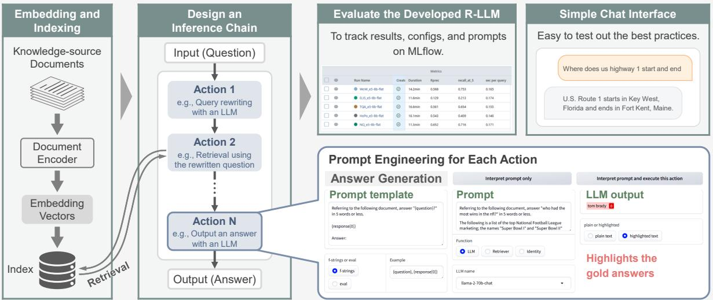
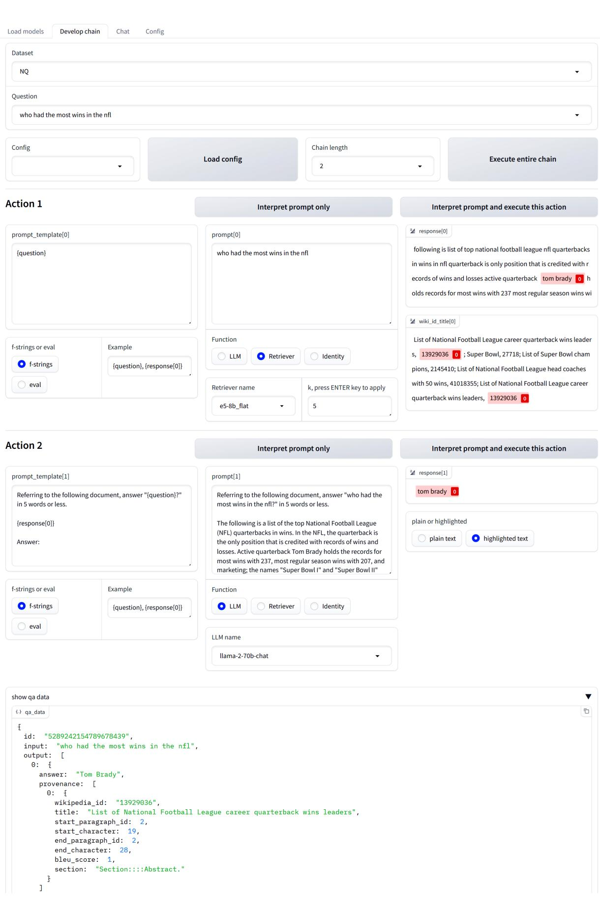
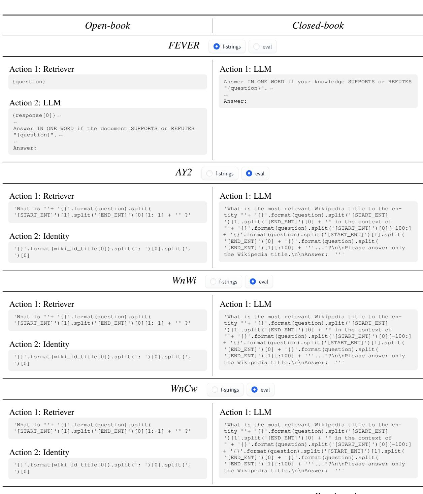
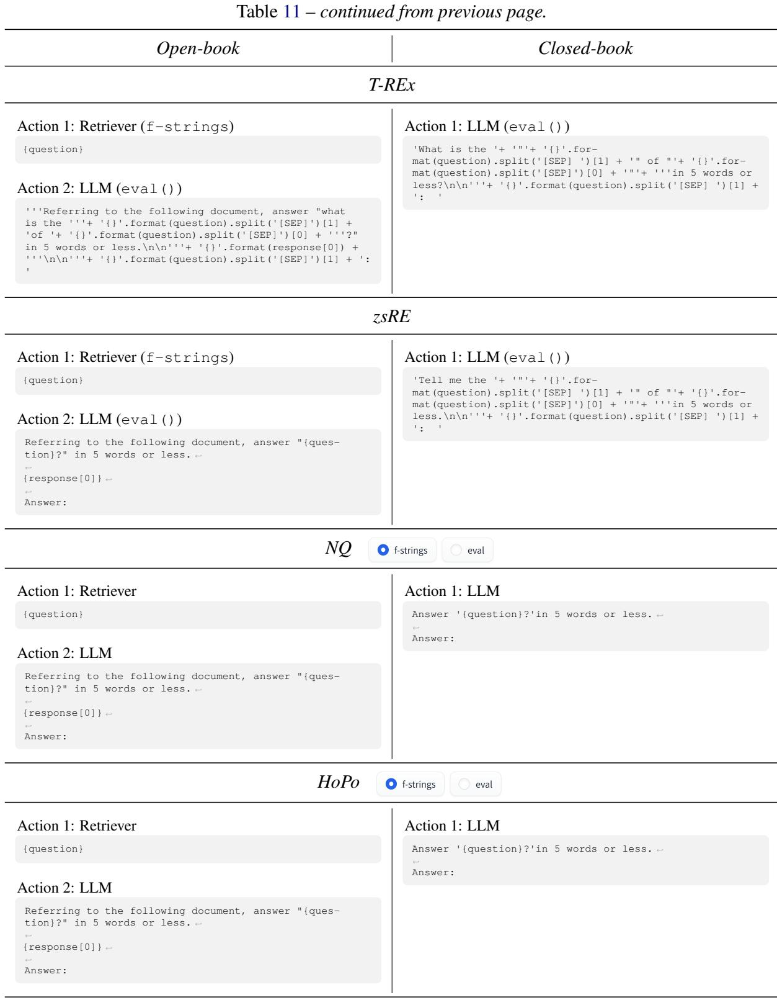
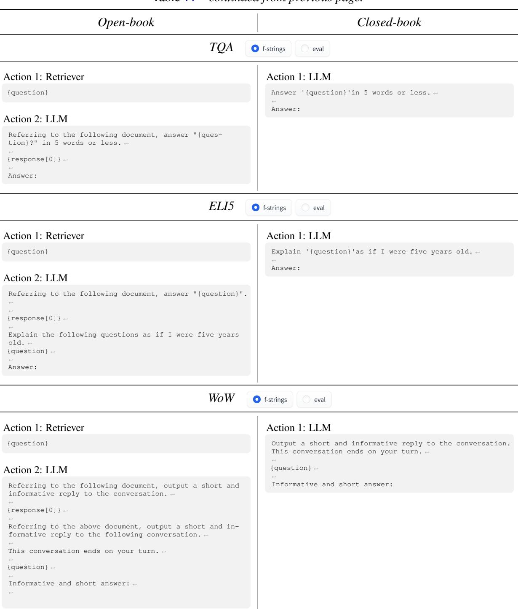

# RALLE: A Framework for Developing and Evaluating Retrieval-Augmented Large Language Models

Yasuto Hoshi∗, Daisuke Miyashita∗, Youyang Ng, Kento Tatsuno, Yasuhiro Morioka, Osamu Torii, Jun Deguchi Kioxia Corporation, Japan yasuto1.hoshi@kioxia.com

# Abstract

Retrieval-augmented large language models (R-LLMs) combine pre-trained large language models (LLMs) with information retrieval systems to improve the accuracy of factual question-answering. However, current libraries for building R-LLMs provide high-level abstractions without sufficient transparency for evaluating and optimizing prompts within specific inference processes such as retrieval and generation. To address this gap, we present RALLE, an open-source framework designed to facilitate the development, evaluation, and optimization of R-LLMs for knowledgeintensive tasks. With RALLE, developers can easily develop and evaluate R-LLMs, improving hand-crafted prompts, assessing individual inference processes, and objectively measuring overall system performance quantitatively. By leveraging these features, developers can enhance the performance and accuracy of their R-LLMs in knowledge-intensive generation tasks. We open-source our code at https: //github.com/yhoshi3/RaLLe.

# 1 Introduction

Large language models (LLMs) have shown great potential for natural language understanding and generation tasks (Brown et al., 2020; Chowdhery et al., 2022; OpenAI, 2023). However, they face challenges when answering factual questions due to hallucinations (or confabulations) (Bang et al., 2023; Borji, 2023), outdated parametric knowledge (Liska et al., 2022), and memory efficiency of parametric knowledge (e.g., Heinzerling and Inui, 2021). To address these limitations, researchers have turned to the retrieval-augmented approach used in open-domain question answering (QA) (Chen et al., 2017), hereinafter referred to as retrieval-augmented LLMs or R-LLMs.

In comparison to closed-book settings where language models generate answers without retrieval,

R-LLMs (open-book settings) enable the retrieval of relevant information from external databases or corpora (Mialon et al., 2023; Ng et al., 2023), which has led to improved accuracy in opendomain QA (Shi et al., 2023). Additionally, RLLMs can acquire extended features even without additional training, such as explicit references, relief from fact hallucination (Nakano et al., 2021), and easy updates to the knowledge source (e.g., Guu et al., 2020; Ng et al., 2023).

Retrieval-augmented generation needs further research and development to reach its full potential. For example, even though the retriever-reader system has been trained on the Natural Questions (NQ) dataset (Kwiatkowski et al., 2019), its F1 score on the short answer task is 68.3 and still lags behind the oracle F1 score of 75.7 (Asai and Choi, 2021). This implies that further improvements can be made to the retrieval-augmented generation approach. Additionally, users would be probably aware that the outputs generated by R-LLMs may contain factual errors, particularly when applied to knowledge-intensive tasks. However, there is currently a lack of accessible evaluation framework to assess their output quality. This makes it difficult to identify areas for improvement.

Furthermore, having effective tools for developing R-LLMs is crucial. These tools should enable the design of inference steps such as retrieve-thengenerate, selecting the combination of retrievers and LLMs, evaluating the performance of the entire system, and testing the prompts used in each inference step. Currently available tools, such as the ChatGPT Retrieval Plugin1, Guidance2, and LangChain3 (Chase, 2023), offer a high degree of abstraction, making it challenging to verify the functionality of individual inference steps or opti

# RALLE: Retrieval-Augmented LLM Development and Evaluation framework

  
Figure 1: Overview of RALLE, our proposed development and evaluation framework for R-LLMs. Any number of actions can be defined for an R-LLM. Each action can be executed individually to test the corresponding prompts. Experimental setup and evaluation results can be tracked using MLflow. Additionally, a simple chat interface can be built to test out the best practices from the development and evaluation stages in a practical setting.

mize prompts within each step. This lack of transparency might hinder the optimization of R-LLMs.

In this paper, we propose RALLE, an accessible framework for Retrieval-Augmented Large Language model development and Evaluation. We also present evaluation results of several R-LLMs that we have constructed by using open-source retrievers and LLMs. To the best of our knowledge, RALLE is the first framework that empowers RLLM developers and open-domain QA researchers to efficiently develop, evaluate, and improve RLLMs using objective metrics.

RALLE offers several key benefits:

1. Easy development and testing: users can easily select, combine, and test various retrievers and LLMs, especially open-source models, within a graphical interface.

2. Objective evaluation of R-LLMs: RALLE provides reproducible experiments with objective benchmarks/metrics, enabling objective assessments of R-LLM performance.

3. Transparent prompt engineering: all inputs (prompts) and outputs of each action are visible to developers, allowing for easy exploration and optimization of the prompts.

# 2 RALLE Usage

Figure 1 presents an overview of the key features of the proposed framework4. The primary development process involves three stages: (1) embedding and indexing the knowledge source documents, (2) designing an inference chain consisting of an RLLM with customized prompt templates for each action, and (3) benchmarking the developed RLLM.

# 2.1 Document Embedding and Indexing

To begin, the knowledge source documents can be encoded using an arbitrary encoder model, such as a sparse or dense retriever. For efficient indexing of dense embeddings, several methods are available by default, including Faiss (Johnson et al., 2019), HNSW (Malkov and Yashunin, 2020), and DiskANN (Jayaram Subramanya et al., 2019). By default, an HNSW index is constructed with $e f _ { - } c o n s t r u c t i o n = 1 2 8$ (the size of the dynamic list for the nearest neighbors) and $m = 3 2$ (the number of links created for every new element during graph construction).

# 2.2 Chain Construction

Once the document embedding and indexing are completed, the retrievers (and the corresponding indices) and LLMs can be loaded via the

Gradio5-based GUI (Abid et al., 2019) to establish an inference chain that comprises an R-LLM. This chain of actions enables users to design a pipeline for multi-step inference, such as [retrieve]-[generate], or more intricate workflows such as [rewrite query]-[retrieve]- [generate] proposed in Ma et al. (2023). The versatility of this feature is especially beneficial in creating the chains tailored to specific use cases.

A single-action chain can function as either a simple retriever that returns the retrieved documents, or a closed-book QA that leverages the parametric knowledge of an LLM to provide answers without retrieval. In contrast, a chain with multiple actions that include retrieval enables retrievalaugmented generation or open-book QA, allowing an LLM to access external documents relevant to a question. Our default setup for R-LLMs consists of two actions: retrieve and generate.

# 2.3 Prompt Engineering

The RALLE framework allows developers to interactively craft customized prompt templates for LLMs and even for search queries on a per-chain basis. Each action can be executed independently, enabling precise control over LLM responses, such as specifying the desired output format or suppressing undesirable hallucinations. To enhance the versatility of prompt development, RALLE integrates support for f-strings and eval() function in Python.

# 2.4 Experiment Tracking

We utilize MLflow (LF Projects, 2023) to track the experiments, along with their associated configuration files and prompt templates. This allows us to compare the performance of different experiment runs objectively, which enables us to develop even better R-LLMs.

# 2.5 Chat AI

RALLE also provides support for building a simple chat interface. This enables users to test out best practices from the development and evaluation stages in a practical setting.

# 3 Experimental Settings

In this section, we evaluate the performance of RLLMs constructed with several combinations of open-source retrievers and LLMs on knowledgeintensive tasks.

# 3.1 Tasks and Datasets

We employ KILT (Knowledge Intensive Language Tasks) benchmark (Petroni et al., 2021), an extensive benchmark that encompasses 11 datasets across five knowledge-intensive natural language processing tasks: fact checking, entity linking, slot filling, open-domain question answering, and dialogue (for further details of KILT, see Petroni et al. (2021)). We use the training sets for developing prompts and the development set for evaluation.

As the knowledge source, we utilize the preprocessed Wikipedia passages provided by KILT. The passages are derived from English Wikipedia articles based on the 2019/08/01 Wikipedia dump data, consisting of a total of 5.9 million articles and 22.2 million 100-word passages. For both dense and sparse retrievers, we use the set of 100- word passages after additional pre-processing that prepends the title of the article to each passage.

Note that RALLE is dataset-agnostic, allowing developers to use their own QA datasets and corpora for development and evaluation. See Appendix A.10 for more information.

# 3.2 Models

This subsection details the retrievers and LLMs employed to build R-LLMs in our experiments. RALLE allows practitioners and researchers to easily experiment with the most recent models available in open-source repositories. With the exception of BM25, all models are available from Hugging Face (Wolf et al., 2020) (see Appendix A.9 for the summary).

# 3.2.1 LLMs

The LLM used within the R-LLM must comprehend instructions provided in a prompt and generate appropriate responses based on the given information. To achieve this, we use instruction-tuned LLMs with a temperature parameter set to zero for optimal performance and reproducibility.

Llama-2-chat is tuned with supervised finetuning and reinforcement learning with human feedback (RLHF) (Christiano et al., 2017; Stiennon et al., 2020) to align to human preferences for helpfulness and safety (Touvron et al., 2023b). In our experiments, we utilize both 13-billion (Llama2- 13B) and 70-billion (Llama2-70B) models.

WizardVicunaLM-13B6 (W-Vicuna-13B) (Lee, 2023) is formed by combining the concepts of WizardLM (Xu et al., 2023) (refining the initial instructions with Evol-Instruct method $\mathrm { T M }$ et al., 2023)) and Vicuna (Chiang et al., 2023) (a fine-tuned LLaMA model (Touvron et al., 2023a) with multi-round conversation data from chatbots).

Table 1: Summary of the retrievers used in our evaluation. Dimensions of a dense embedding vector are shown in dim., while the maximum token length of an input sequence is max len.. The evaluation metric for MTEB Retrieval is $\mathrm { n D C G @ 1 0 . }$ ♠: Results from Ram et al. (2022). Results on MTEB Retrieval except BM25 are copied from MTEB leaderboard7.   

<table><tr><td>Model</td><td>dim.</td><td>max len.</td><td>MTEB Retrieval</td></tr><tr><td>BM25</td><td></td><td>-</td><td>42.3</td></tr><tr><td>m-e5</td><td>1,024</td><td>514</td><td>51.43</td></tr><tr><td>e5</td><td>1,024</td><td>512</td><td>50.56</td></tr></table>

# 3.2.2 Retrievers

We experiment with both sparse and dense retrievers for document retrieval. Specifically, we select dense retrievers that have achieved high accuracy on the retrieval task of Massive Text Embedding Benchmark (MTEB) (Muennighoff et al., 2023) leaderboard7 as of July 2023. A list of the retrievers used in our study can be found in Table 1. In the open-book experiments, the top-5 most relevant documents are retrieved.

As the metrics of retrieval performance, we follow Petroni et al. (2021) and use the page-level R-precision (Craswell, 2016) and recall $\textcircled { a } 5$ . The page-level R-precision is the percentage of $R$ gold pages inside each provenance set among the top- $R$ retrieved pages. Typically, R-Precision is equivalent to Precision $@ 1$ except FEVER and HotPotQA (multi-hop datasets).

BM25 (Robertson and Zaragoza, 2009) is a bag-of-words retrieval function based on the termmatching. We use the Pyserini (Lin et al., 2021) implementation of unigram BM25 with the default parameters of $k _ { 1 } = 0 . 9$ (term frequency scaling) and $b = 0 . 4$ (document length normalization). The documents for BM25 retrieval is the same 100- word passages as the dense retrievers.

e5-large- ${ \bf \nabla } \cdot { \bf v } 2 ^ { 8 }$ (e5) (Wang et al., 2022) is a supervised bi-encoder model with a query encoder and a document encoder. multilingual-e5-large9 (m-e5) is a multilingual fine-tuned e5 model.

# 3.3 Prompts

We utilize custom-designed prompt templates that are specifically crafted for each dataset in KILT. RALLE accepts templates with non-natural language formats, such as f-strings and eval() functions in Python. This allows developers to carefully craft their prompt templates for optimal performance. The prompt templates used in our experiments are shown in Appendix A.11.

For entity linking task of KILT (AY2, WnWi, and $\mathrm { W n C w }$ ), we employ a REWRITE-EL template by default for search queries. This template extracts the specific entity mentions being questioned as a query, as employing an entire span of a question is unlikely to find relevant documents (we will discuss in Section 4.3). After retrieving the relevant documents, the top-1 Wikipedia title is output as an answer. As a result, the downstream accuracy in entity linking task is not affected by the number of retrieved documents (if one or more).

# 4 KILT Benchmark Results

This section provides the downstream and retrieval performance of the R-LLMs developed and evaluated using RALLE.

# 4.1 Baseline

We compare our results with those of the BARTlarge model (Lewis et al., 2020a) for the closedbook setting and the RAG model (Lewis et al., 2020b) for the open-book setting, which presented in Petroni et al. (2021). Notably, these baseline models were specifically fine-tuned on the KILT benchmark, whereas our chosen LLMs and constructed R-LLMs were not. See also Appendix A.5 for additional information of the baselines.

# 4.2 Downstream Performance

We summarize the downstream performance10 in Table 2. RALLE also includes has_answer percentage for short answers, a proxy metric to measure the proportion of questions that contain gold answers within the final output generated by an R-LLM (see Appendix A.3 for more details).

Table 2: Downstream performance on KILT dev set. Following Petroni et al. (2021), we report the results of typical metrics for each dataset, with bold indicating the best result and underlined indicating the second. The metrics with the prefix KILT- award output performance only when $\mathrm { R } { \cdot } \mathrm { P r e c } = 1$ (retrieval success). The figures in parentheses represent has_answer percentage, which corresponds to the proportion of questions with gold answers included in the final output. The figures shown in gray are copied from the column above because they do not change based on the given setting (we use the Identity function of RALLE for the tasks, rather than an LLM). $\diamondsuit$ : Results from Petroni et al. (2021).   

<table><tr><td rowspan="2">Dataset</td><td>Fact Check.</td><td colspan="3">Entity Linking</td><td colspan="2">Slot Filling</td><td colspan="4">Open Domain QA</td><td rowspan="2">Dial.</td></tr><tr><td>FEV</td><td>AY2</td><td>WnWi</td><td>WnCw</td><td>T-REx</td><td>zsRE</td><td>NQ</td><td>HoPo</td><td>TQA</td><td>ELI5</td></tr><tr><td>Model / Metric</td><td></td><td></td><td>Accuracy</td><td></td><td></td><td></td><td></td><td>Exact Match</td><td></td><td>RL</td><td>F1</td></tr><tr><td>BART-large (closed-book)</td><td>80.7</td><td>86.6</td><td>47.9</td><td>48.0</td><td>43.8</td><td>3.0</td><td>26.2</td><td>16.9</td><td>32.5</td><td>22.7</td><td>13.8</td></tr><tr><td>Llama2-70B (closed-book)</td><td>33.6 (74.9)</td><td>39.8 (54.5)</td><td>42.8 (53.8)</td><td>39.2 (55.7)</td><td>28.5 (40.5)</td><td>11.3 (13.6)</td><td>19.6 (37.4)</td><td>13.9 (25.1)</td><td>67.4 (80.8)</td><td>23.0</td><td>13.3</td></tr><tr><td>RAG</td><td>87.7</td><td>77.4</td><td>49.0</td><td>46.7</td><td>61.5</td><td>47.4</td><td>48.8</td><td>27.7</td><td>61.7</td><td>16.1</td><td>13.3</td></tr><tr><td>e5 + W-Vicuna-13B</td><td>10.6 (42.4)</td><td>51.2 (57.9)</td><td>48.6 (51.4)</td><td>45.6 (51.4)</td><td>31.6 (46.1)</td><td>23.0 (29.3)</td><td>18.7 (38.0)</td><td>19.7 (28.3)</td><td>43.1 (67.7)</td><td>21.4</td><td>12.3</td></tr><tr><td>e5 + Llama2-13B</td><td>66.3 (73.5)</td><td>51.2 (57.9)</td><td>48.6 (51.4)</td><td>45.6 (51.4)</td><td>17.2 (42.3)</td><td>31.7 (41.1)</td><td>36.1 (43.3)</td><td>14.3 (25.5)</td><td>56.3 (76.2)</td><td>20.9</td><td>12.3</td></tr><tr><td>BM25 + Llama2-70B</td><td>46.2 (86.3)</td><td>18.0 (35.9)</td><td>19.1 (32.2)</td><td>14.2 (30.9)</td><td>25.9 (43.0)</td><td>31.4 (37.8)</td><td>25.3 (34.3)</td><td>25.9 (33.4)</td><td>65.8 (80.0)</td><td>21.3</td><td>12.2</td></tr><tr><td>e5 + Llama2-70B</td><td>49.9 (88.6)</td><td>51.2 (57.9)</td><td>48.6 (51.4)</td><td>45.6 (51.4)</td><td>28.9 (49.2)</td><td>35.0 (43.2)</td><td>36.4 (48.8)</td><td>28.1 (35.8)</td><td>71.1 (83.9)</td><td>21.5</td><td>13.2</td></tr><tr><td>e5 (DiskANN)</td><td>49.9 (87.9)</td><td>44.3 (50.5)</td><td>45.3 (48.1)</td><td>43.0 (48.8)</td><td>25.3 (43.9)</td><td>32.1 (37.9)</td><td>36.1 (48.4)</td><td>26.7 (34.3)</td><td>70.4 (83.2)</td><td>21.5</td><td>13.1</td></tr><tr><td>top-2</td><td>49.3 (88.1)</td><td>51.2 (57.9)</td><td>48.6 (51.4)</td><td>45.6 (51.4)</td><td>23.5 (44.9)</td><td>34.7 (43.0)</td><td>33.7 (46.2)</td><td>23.8 (34.2)</td><td>71.3 (82.9)</td><td>21.6</td><td>13.3</td></tr><tr><td>top-10</td><td>50.2 (88.0)</td><td>51.2 (57.9)</td><td>48.6 (51.4)</td><td>45.6 (51.4)</td><td>31.1 (49.3)</td><td>35.4 (42.5)</td><td>35.2 (48.1)</td><td>24.9 (35.7)</td><td>59.3 (82.8)</td><td>21.5</td><td>13.2</td></tr><tr><td>Model / Metric</td><td></td><td colspan="4">KILT-Accuracy</td><td></td><td colspan="4">KILT-EM</td><td>KILT-F1</td></tr><tr><td>RAG</td><td>55.5</td><td>77.4</td><td>49.0</td><td>46.7</td><td>25.4</td><td>42.6</td><td>36.3</td><td>3.1</td><td>36.1</td><td>2.7</td><td>7.5</td></tr><tr><td>e5 + W-Vicuna-13B</td><td>8.4 (33.5)</td><td>51.2 (51.2)</td><td>48.6 (48.6)</td><td>45.5 (45.5)</td><td>19.0 (28.0)</td><td>22.2 (28.1)</td><td>14.4 (27.8)</td><td>8.6 (11.9)</td><td>26.6 (40.3)</td><td>2.7</td><td>7.3</td></tr><tr><td>e5 + Llama2-13B</td><td>53.1 (58.7)</td><td>51.2 (51.2)</td><td>48.6 (48.6)</td><td>45.5 (45.5)</td><td>11.5 (25.7)</td><td>29.8 (38.5)</td><td>27.5 (32.5)</td><td>5.6 (10.6)</td><td>34.7 (46.1)</td><td>2.7</td><td>7.4</td></tr><tr><td>BM25 + Llama2-70B</td><td>21.9 (44.4)</td><td>17.6 (17.6)</td><td>18.9 (18.9)</td><td>13.9 (13.9)</td><td>14.5 (22.5)</td><td>24.9 (29.6)</td><td>9.3 (12.4)</td><td>4.5 (5.9)</td><td>23.6 (27.9)</td><td>1.5</td><td>4.0</td></tr><tr><td>e5 + Llama2-70B</td><td>40.2 (71.2)</td><td>51.2 (51.2)</td><td>48.6 (48.6)</td><td>45.5 (45.5)</td><td>19.2 (29.7)</td><td>32.8 (40.4)</td><td>27.7 (36.3)</td><td>11.3 (14.5)</td><td>42.8 (49.7)</td><td>2.7</td><td>8.1</td></tr><tr><td>e5 (DiskANN)</td><td>38.3 (68.5)</td><td>44.3 (44.3)</td><td>45.3 (45.3)</td><td>42.8 (42.8)</td><td>19.3 (24.2)</td><td>30.2 (35.5)</td><td>27.3 (35.9)</td><td>9.3 (12.1)</td><td>42.1 (49.0)</td><td>2.7</td><td>8.0</td></tr><tr><td>top-2</td><td>39.6 (70.7)</td><td>51.2 (51.2)</td><td>48.6 (48.6)</td><td>45.5 (45.5)</td><td>15.6 (28.0)</td><td>32.9 (40.6)</td><td>25.7 (35.2)</td><td>7.6 (13.1)</td><td>43.1 (49.3)</td><td>2.7</td><td>8.3</td></tr><tr><td>top-10</td><td>40.4 (70.7)</td><td>51.2 (51.2)</td><td>48.6 (48.6)</td><td>45.5 (45.5)</td><td>20.5 (29.9)</td><td>33.2 (39.8)</td><td>27.1 (36.1)</td><td>9.9 (14.3)</td><td>36.1 (48.9)</td><td>2.7</td><td>8.1</td></tr></table>

Our constructed R-LLM $\mathrm { e } 5 ~ +$ Llama2-70B) surpasses the performance of the RAG model on both HoPo and TQA, despite not being fine-tuned with KILT like RAG. Moreover, our constructed R-LLMs demonstrate acceptable accuracy levels on other datasets as well, without any significant drawbacks. The results indicate that the LLMs used in this study exhibit certain ability to comprehend the retrieved documents.

Furthermore, our analysis reveals several factors that could contribute to improvement of downstream performance, including retrieval augmentation (except ELI5), increased model scale (except FEV and T-REx), and referring to more documents during generation (except NQ, HoPo, TQA and WoW). However, some datasets exhibits exceptions to these tendencies or had lower performance compared to their corresponding has_answer percentage (such as FEV, T-REx, NQ, and TQA). To address this issue, developers can improve the RLLM with RALLE by refining the inference chain and the prompt templates. In Section A.4, we provide our initial attempts at developing inference chains with three actions on several datasets.

Overall, the downstream evaluation results provide valuable insights into how well the constructed R-LLMs perform on knowledge-intensive tasks, enabling developers to identify areas for improvement.

# 4.3 Retrieval Performance

Table 3 shows retrieval performance of the chosen retrievers on KILT development set (see also Table 8 in Appendix for the results of recall $@ 5$ ). According to Table 3, e5 (with Faiss Flat index) achieves the highest retrieval performance on average, though m-e5 is better on MTEB Retrieval task (Table 1). Despite the superior retrieval accuracy of e5 compared to RAG on KILT, the downstream performance of the R-LLM which employs e5 falls short of that of RAG (Table 2). This indicates that there is potential room for improvement through further optimized prompts to enhance the performance on a target dataset.

As described in Section 3.3, REWRITE-EL serves as the default template for search queries related to entity linking task (AY2, WnWi, and WnCw). As shown in Table 3, employing the REWRITE-EL template leads to higher retrieval accuracy when compared to using the full question text as a search query (− REWRITE-EL setting). This indicates that omitting unnecessary information from the search queries is helpful especially for entity linking task.

Table 3: Retrieval performances on KILT dev set. We report page-level R-Precision on KILT development set. Avg. refers to macro-average of the retrieval scores in each dataset. Bold indicates the best result. ♢: Results from Petroni et al. (2021). \*: BM25 (without REWRITE-EL) failed with long queries (45 out of 5,599 questions) in WnCw.   

<table><tr><td rowspan="2">Dataset</td><td>Fact Check.</td><td colspan="3">Entity Linking</td><td colspan="2">Slot Filling</td><td colspan="4">Open Domain QA</td><td rowspan="2">Dial.</td><td rowspan="2">Avg.</td></tr><tr><td>FEV</td><td>AY2</td><td>WnWi</td><td>WnCw</td><td>T-REx</td><td>zsRE</td><td>NQ</td><td>HoPo</td><td>TQA</td><td>ELI5 WoW</td></tr><tr><td>Model</td><td colspan="10">R-Precision</td><td></td><td></td><td></td></tr><tr><td>RAG</td><td>63.5</td><td>77.4</td><td>49.0</td><td>46.7</td><td>29.3</td><td>65.4</td><td>60.3</td><td>30.8</td><td>49.3</td><td>16.4</td><td>46.7</td><td>48.6</td></tr><tr><td>BM25</td><td>52.1</td><td>17.7</td><td>20.6</td><td>15.3</td><td>34.0</td><td>57.7</td><td>26.3</td><td>41.3</td><td>31.7</td><td>6.8</td><td>28.8</td><td>30.2</td></tr><tr><td>-REWRITE-EL</td><td>52.1</td><td>3.0 (−14.7)</td><td>0.1 (-−20.5)</td><td>2.8* (-12.5)</td><td>34.0</td><td>57.7</td><td>26.3</td><td>41.3</td><td>31.7</td><td>6.8</td><td>28.8</td><td>25.9 (-4.3)</td></tr><tr><td>m-e5 (Flat)</td><td>81.7</td><td>41.8</td><td>45.8</td><td>41.6</td><td>47.1</td><td>81.4</td><td>63.0</td><td>54.0</td><td>56.1</td><td>11.9</td><td>57.9</td><td>52.9</td></tr><tr><td>-REWRITE-EL</td><td>81.7</td><td>3.2 (-38.6)</td><td>0.1 (−45.7)</td><td>3.1 (-38.5)</td><td>47.1</td><td>81.4</td><td>63.0</td><td>54.0</td><td>56.1</td><td>11.9</td><td>57.9</td><td>41.8 (-11.1)</td></tr><tr><td>e5 (Flat)</td><td>82.0</td><td>51.6</td><td>51.6</td><td>49.2</td><td>45.3</td><td>81.9</td><td>65.2</td><td>54.3</td><td>56.1</td><td>12.9</td><td>56.8</td><td>55.2</td></tr><tr><td>-REWRITE-EL</td><td>82.0</td><td>3.4 (-48.2)</td><td>0.0 (-51.6)</td><td>2.6 (-46.6)</td><td>45.3</td><td>81.9</td><td>65.2</td><td>54.3</td><td>56.1</td><td>12.9</td><td>56.8</td><td>41.9 (-13.3)</td></tr><tr><td>e5 (HNSW)</td><td>67.9</td><td>38.9</td><td>42.3</td><td>40.5</td><td>23.1</td><td>53.0</td><td>60.3</td><td>34.9</td><td>50.4</td><td>10.2</td><td>54.5</td><td>43.3</td></tr><tr><td>-REWRITE-EL</td><td>67.9</td><td>2.9 (−36.0)</td><td>0.0 (−42.3)</td><td>1.6 (−38.9)</td><td>23.1</td><td>53.0</td><td>60.3</td><td>34.9</td><td>50.4</td><td>10.2</td><td>54.5</td><td>32.6 (- 10.7)</td></tr><tr><td>e5 (DiskANN)</td><td>78.8</td><td>44.7</td><td>47.8</td><td>46.0</td><td>37.1</td><td>74.5</td><td>64.9</td><td>49.1</td><td>55.4</td><td>12.9</td><td>56.6</td><td>51.6</td></tr><tr><td>-REWRITE-EL</td><td>78.8</td><td>3.2 (-41.5)</td><td>0.1 (−47.7)</td><td>1.8 (−44.2)</td><td>37.1</td><td>74.5</td><td>64.9</td><td>49.1</td><td>55.4</td><td>12.9</td><td>56.6</td><td>39.4 (-12.2)</td></tr></table>

Table 4: Execution latency in seconds per question (sec/Q). Memory in Retrieval indicates the maximum (DRAM) memory footprints.   

<table><tr><td colspan="3">Retrieval</td></tr><tr><td>Model</td><td>Avg. R-Prec Memory</td><td>sec/Q</td></tr><tr><td>BM25</td><td>30.2 -</td><td>0.121</td></tr><tr><td>e5 (Flat)</td><td>55.2 84.8 GB</td><td>0.169</td></tr><tr><td>e5 (HNSW)</td><td>43.3 90.4 GB</td><td>0.008</td></tr><tr><td>e5 (DiskANN) 51.6</td><td>10.9 GB</td><td>0.022</td></tr><tr><td>Completion in the Closed-Book Setting</td><td></td><td>sec/Q</td></tr><tr><td>Llama-70B</td><td></td><td>6.727</td></tr><tr><td>Retrieval + Generation</td><td></td><td>sec/Q</td></tr><tr><td>BM25 + Llama2-70B</td><td></td><td>3.637</td></tr><tr><td>e5 + Llama2-70B</td><td></td><td>3.793</td></tr><tr><td>e5 (DiskANN) + Llama2-70B</td><td></td><td>3.628</td></tr></table>

# 4.4 Speed Analysis

RALLE allows users to optimize the trade-off between latency (in seconds per question) and accuracy by comparing various configurations. As demonstrated in Table 4, employing approximate nearest neighbor search (ANNS) algorithms such as HNSW and DiskANN can significantly reduce retrieval latency at the cost of decreased accuracy. Note that, the optimal balance between speed and accuracy depends on the specific requirements of the application, and RALLE enables users to easily experiment with diverse ANNS settings to determine their impact on both factors.

Notably, DiskANN achieves an accuracy that is only slightly lower than Faiss flat index while significantly improving search speeds, despite requiring less memory footprints than both flat and HNSW indices. Though the reduction in RLLM execution time achieved through ANNS may appear relatively minor, the significantly lower DRAM requirements of DiskANN could make it a more practical solution for scenarios where DRAM capacity is limited and the flat index exceeds available DRAM capacity. For further details regarding latency, refer to Table 9 in Appendix A.8.

# 5 Conclusion

This paper introduces RALLE, an accessible framework for developing and evaluating R-LLMs. We also report evaluation results of several R-LLMs built using open-source retrievers and LLMs on knowledge-intensive tasks. Overall, RALLE offers a significant advancement in retrieval-augmented generation research, enabling efficient development, evaluation, and improvement of R-LLMs. We hope that RALLE will contribute to the development of best practices for R-LLMs.

# Limitations

All KILT evaluations presented in this paper were conducted using a development set to maintain fairness and consistency across evaluations, as the answers of the test set remain confidential11.

While R-LLMs exhibit high validity, it falls behind the smaller yet specialized model, RAG, on the KILT downstream task (refer to Table 2). This disparity can be attributed to various factors, including prompt maturity and the ability of LLMs to generate responses. Although the employed prompts were carefully developed, it is likely that more optimal prompts exist (discussed in Section 4.3). Moreover, fine-tuning LLMs with retrieval-augmented generation tasks might enhance their performance on downstream tasks. Therefore, the evaluation accuracy reported herein would represent a conservative estimate.

Prompt engineering is a crucial aspect of the retrieval-augmented generation process, as the generated outputs can differ significantly between models, even when provided with the same prompt. RALLE offers an advantage in this regard, allowing users to effortlessly experiment with diverse prompts for varying behaviors, datasets, and intricate chain of actions.

In the realm of prompt development, techniques like Automatic Prompt Engineer (APE) (Zhou et al., 2023) automate the creation of prompts from input-output pairs and sampling to identify the most effective prompts. However, the input-output pairs in retrieval-augmented generation are distinctly different from those of the simple instruction induction tasks. Because the input text for retrievalaugmented generation can often be lengthy and complex, it is difficult to automatically induce the effective prompts from the input-output pairs.

This tool enables developers to construct an inference chain with predefined actions, while recent advances have also introduced methods allowing LLMs to determine the actions (Yao et al., 2023). One approach entails retrieving documents using a query rewritten by an LLM and then summarizing them until the desired information is obtained. However, in our initial experiments (not described in this paper), we observed instances where relatively small LLMs (typically less than 100 billion parameters) became trapped in cycles of repeated retrieval and summarization, hindering their ability to reach the final answer generation. Our tool addresses this issue by intentionally building explicit inference chains to avoid unintended operations.

# References

Abubakar Abid, Ali Abdalla, Ali Abid, Dawood Khan, Abdulrahman Alfozan, and James Zou. 2019. Gradio: Hassle-free sharing and testing of ml models in the wild. arXiv preprint arXiv:1906.02569.

Akari Asai and Eunsol Choi. 2021. Challenges in information-seeking QA: Unanswerable questions and paragraph retrieval. In Proceedings of the 59th Annual Meeting of the Association for Computational Linguistics and the 11th International Joint Conference on Natural Language Processing (Volume 1: Long Papers), pages 1492–1504, Online. Association for Computational Linguistics.

Yejin Bang, Samuel Cahyawijaya, Nayeon Lee, Wenliang Dai, Dan Su, Bryan Wilie, Holy Lovenia, Ziwei Ji, Tiezheng Yu, Willy Chung, et al. 2023. A multitask, multilingual, multimodal evaluation of chatgpt on reasoning, hallucination, and interactivity. arXiv preprint arXiv:2302.04023.

Ali Borji. 2023. A categorical archive of ChatGPT failures. arXiv preprint arXiv:2302.03494.

Tom Brown, Benjamin Mann, Nick Ryder, Melanie Subbiah, Jared D Kaplan, Prafulla Dhariwal, Arvind Neelakantan, Pranav Shyam, Girish Sastry, Amanda Askell, Sandhini Agarwal, Ariel Herbert-Voss, Gretchen Krueger, Tom Henighan, Rewon Child, Aditya Ramesh, Daniel Ziegler, Jeffrey Wu, Clemens Winter, Chris Hesse, Mark Chen, Eric Sigler, Mateusz Litwin, Scott Gray, Benjamin Chess, Jack Clark, Christopher Berner, Sam McCandlish, Alec Radford, Ilya Sutskever, and Dario Amodei. 2020. Language models are few-shot learners. In Advances in Neural Information Processing Systems, volume 33, pages 1877–1901. Curran Associates, Inc.

Harrison Chase. 2023. LangChain. https:// langchain.com/.

Danqi Chen, Adam Fisch, Jason Weston, and Antoine Bordes. 2017. Reading Wikipedia to answer opendomain questions. In Proceedings of the 55th Annual Meeting of the Association for Computational Linguistics (Volume 1: Long Papers), pages 1870–1879, Vancouver, Canada. Association for Computational Linguistics.

Wei-Lin Chiang, Zhuohan Li, Zi Lin, Ying Sheng, Zhanghao Wu, Hao Zhang, Lianmin Zheng, Siyuan Zhuang, Yonghao Zhuang, Joseph E. Gonzalez, Ion Stoica, and Eric P. Xing. 2023. Vicuna: An opensource chatbot impressing GPT-4 with $9 0 \% \ast$ ChatGPT quality.

Aakanksha Chowdhery, Sharan Narang, Jacob Devlin, Maarten Bosma, Gaurav Mishra, Adam Roberts, Paul Barham, Hyung Won Chung, Charles Sutton, Sebastian Gehrmann, Parker Schuh, Kensen Shi, Sasha Tsvyashchenko, Joshua Maynez, Abhishek Rao, Parker Barnes, Yi Tay, Noam Shazeer, Vinodkumar Prabhakaran, Emily Reif, Nan Du, Ben

Hutchinson, Reiner Pope, James Bradbury, Jacob Austin, Michael Isard, Guy Gur-Ari, Pengcheng Yin, Toju Duke, Anselm Levskaya, Sanjay Ghemawat, Sunipa Dev, Henryk Michalewski, Xavier Garcia, Vedant Misra, Kevin Robinson, Liam Fedus, Denny Zhou, Daphne Ippolito, David Luan, Hyeontaek Lim, Barret Zoph, Alexander Spiridonov, Ryan Sepassi, David Dohan, Shivani Agrawal, Mark Omernick, Andrew M. Dai, Thanumalayan Sankaranarayana Pillai, Marie Pellat, Aitor Lewkowycz, Erica Moreira, Rewon Child, Oleksandr Polozov, Katherine Lee, Zongwei Zhou, Xuezhi Wang, Brennan Saeta, Mark Diaz, Orhan Firat, Michele Catasta, Jason Wei, Kathy Meier-Hellstern, Douglas Eck, Jeff Dean, Slav Petrov, and Noah Fiedel. 2022. PaLM: Scaling language modeling with pathways. arxiv:2204.02311.

Paul F Christiano, Jan Leike, Tom Brown, Miljan Martic, Shane Legg, and Dario Amodei. 2017. Deep reinforcement learning from human preferences. In Advances in Neural Information Processing Systems, volume 30. Curran Associates, Inc.

Nick Craswell. 2016. R-Precision, pages 1–1. Springer New York, New York, NY.

Kelvin Guu, Kenton Lee, Zora Tung, Panupong Pasupat, and Mingwei Chang. 2020. Retrieval augmented language model pre-training. In Proceedings of the 37th International Conference on Machine Learning, volume 119 of Proceedings of Machine Learning Research, pages 3929–3938. PMLR.

Benjamin Heinzerling and Kentaro Inui. 2021. Language models as knowledge bases: On entity representations, storage capacity, and paraphrased queries. In Proceedings of the 16th Conference of the European Chapter of the Association for Computational Linguistics: Main Volume, pages 1772–1791, Online. Association for Computational Linguistics.

Suhas Jayaram Subramanya, Fnu Devvrit, Harsha Vardhan Simhadri, Ravishankar Krishnawamy, and Rohan Kadekodi. 2019. Diskann: Fast accurate billionpoint nearest neighbor search on a single node. In Advances in Neural Information Processing Systems, volume 32. Curran Associates, Inc.

Jeff Johnson, Matthijs Douze, and Hervé Jégou. 2019. Billion-scale similarity search with GPUs. IEEE Transactions on Big Data, 7(3):535–547.

Vladimir Karpukhin, Barlas Oguz, Sewon Min, Patrick Lewis, Ledell Wu, Sergey Edunov, Danqi Chen, and Wen-tau Yih. 2020. Dense passage retrieval for opendomain question answering. In Proceedings of the 2020 Conference on Empirical Methods in Natural Language Processing (EMNLP), pages 6769–6781, Online. Association for Computational Linguistics.

Tom Kwiatkowski, Jennimaria Palomaki, Olivia Redfield, Michael Collins, Ankur Parikh, Chris Alberti, Danielle Epstein, Illia Polosukhin, Jacob Devlin, Kenton Lee, Kristina Toutanova, Llion Jones, Matthew Kelcey, Ming-Wei Chang, Andrew M. Dai, Jakob

Uszkoreit, Quoc Le, and Slav Petrov. 2019. Natural questions: A benchmark for question answering research. Transactions of the Association for Computational Linguistics, 7:452–466.

June Lee. 2023. WizardVicunaLM. https: //github.com/melodysdreamj/ WizardVicunaLM.

Mike Lewis, Yinhan Liu, Naman Goyal, Marjan Ghazvininejad, Abdelrahman Mohamed, Omer Levy, Veselin Stoyanov, and Luke Zettlemoyer. 2020a. BART: Denoising sequence-to-sequence pre-training for natural language generation, translation, and comprehension. In Proceedings of the 58th Annual Meeting of the Association for Computational Linguistics, pages 7871–7880, Online. Association for Computational Linguistics.

Patrick Lewis, Ethan Perez, Aleksandra Piktus, Fabio Petroni, Vladimir Karpukhin, Naman Goyal, Heinrich Küttler, Mike Lewis, Wen-tau Yih, Tim Rocktäschel, Sebastian Riedel, and Douwe Kiela. 2020b. Retrieval-augmented generation for knowledgeintensive nlp tasks. In Advances in Neural Information Processing Systems, volume 33, pages 9459– 9474. Curran Associates, Inc.

LF Projects. 2023. MLflow – a platform for the machine learning lifecycle. https://mlflow.org/.

Jimmy Lin, Xueguang Ma, Sheng-Chieh Lin, JhengHong Yang, Ronak Pradeep, and Rodrigo Nogueira. 2021. Pyserini: A Python toolkit for reproducible information retrieval research with sparse and dense representations. In Proceedings of the 44th Annual International ACM SIGIR Conference on Research and Development in Information Retrieval (SIGIR 2021), pages 2356–2362.

Adam Liska, Tomas Kocisky, Elena Gribovskaya, Tayfun Terzi, Eren Sezener, Devang Agrawal, Cyprien De Masson D’Autume, Tim Scholtes, Manzil Zaheer, Susannah Young, Ellen Gilsenan-Mcmahon, Sophia Austin, Phil Blunsom, and Angeliki Lazaridou. 2022. StreamingQA: A benchmark for adaptation to new knowledge over time in question answering models. In Proceedings of the 39th International Conference on Machine Learning, volume 162 of Proceedings of Machine Learning Research, pages 13604–13622. PMLR.

Xinbei Ma, Yeyun Gong, Pengcheng He, Hai Zhao, and Nan Duan. 2023. Query rewriting for retrievalaugmented large language models. arXiv preprint arXiv:2305.14283.

Yu A. Malkov and D. A. Yashunin. 2020. Efficient and robust approximate nearest neighbor search using hierarchical navigable small world graphs. IEEE Trans. Pattern Anal. Mach. Intell., 42(4):824–836.

Grégoire Mialon, Roberto Dessì, Maria Lomeli, Christoforos Nalmpantis, Ram Pasunuru, Roberta Raileanu, Baptiste Rozière, Timo Schick, Jane Dwivedi-Yu,

Asli Celikyilmaz, Edouard Grave, Yann LeCun, and Thomas Scialom. 2023. Augmented language models: a survey. arXiv preprint arXiv:2302.07842.

Niklas Muennighoff, Nouamane Tazi, Loic Magne, and Nils Reimers. 2023. MTEB: Massive text embedding benchmark. In Proceedings of the 17th Conference of the European Chapter of the Association for Computational Linguistics, pages 2014–2037, Dubrovnik, Croatia. Association for Computational Linguistics.

Reiichiro Nakano, Jacob Hilton, Suchir Balaji, Jeff Wu, Long Ouyang, Christina Kim, Christopher Hesse, Shantanu Jain, Vineet Kosaraju, William Saunders, et al. 2021. Webgpt: Browser-assisted questionanswering with human feedback. arXiv preprint arXiv:2112.09332.

Youyang Ng, Daisuke Miyashita, Yasuto Hoshi, Yasuhiro Morioka, Osamu Torii, Tomoya Kodama, and Jun Deguchi. 2023. SimplyRetrieve: A private and lightweight retrieval-centric generative ai tool. arXiv preprint arXiv:2308.03983.

OpenAI. 2023. GPT-4 technical report. arXiv preprint arXiv:2303.08774, abs/2303.08774.

Fabio Petroni, Aleksandra Piktus, Angela Fan, Patrick Lewis, Majid Yazdani, Nicola De Cao, James Thorne, Yacine Jernite, Vladimir Karpukhin, Jean Maillard, Vassilis Plachouras, Tim Rocktäschel, and Sebastian Riedel. 2021. KILT: a benchmark for knowledge intensive language tasks. In Proceedings of the 2021 Conference of the North American Chapter of the Association for Computational Linguistics: Human Language Technologies, pages 2523–2544, Online. Association for Computational Linguistics.

Ori Ram, Liat Bezalel, Adi Zicher, Yonatan Belinkov, Jonathan Berant, and Amir Globerson. 2022. What are you token about? dense retrieval as distributions over the vocabulary. arXiv preprint arXiv:2212.10380.

Stephen Robertson and Hugo Zaragoza. 2009. The probabilistic relevance framework: BM25 and beyond. Found. Trends Inf. Retr., 3(4):333–389.

Weijia Shi, Sewon Min, Michihiro Yasunaga, Minjoon Seo, Rich James, Mike Lewis, Luke Zettlemoyer, and Wen-tau Yih. 2023. RePlug: Retrievalaugmented black-box language models. arXiv preprint arXiv:2301.12652.

Nisan Stiennon, Long Ouyang, Jeffrey Wu, Daniel Ziegler, Ryan Lowe, Chelsea Voss, Alec Radford, Dario Amodei, and Paul F Christiano. 2020. Learning to summarize with human feedback. In Advances in Neural Information Processing Systems, volume 33, pages 3008–3021. Curran Associates, Inc.

Hugo Touvron, Thibaut Lavril, Gautier Izacard, Xavier Martinet, Marie-Anne Lachaux, Timothée Lacroix, Baptiste Rozière, Naman Goyal, Eric Hambro, Faisal Azhar, Aurelien Rodriguez, Armand Joulin, Edouard

Grave, and Guillaume Lample. 2023a. LLaMA: Open and efficient foundation language models. arXiv preprint arXiv:2302.13971.

Hugo Touvron, Louis Martin, Kevin Stone, Peter Albert, Amjad Almahairi, Yasmine Babaei, Nikolay Bashlykov, Soumya Batra, Prajjwal Bhargava, Shruti Bhosale, et al. 2023b. Llama 2: Open foundation and fine-tuned chat models. arXiv preprint arXiv:2307.09288.

Liang Wang, Nan Yang, Xiaolong Huang, Binxing Jiao, Linjun Yang, Daxin Jiang, Rangan Majumder, and Furu Wei. 2022. Text embeddings by weaklysupervised contrastive pre-training. arXiv preprint arXiv:2212.03533.

Thomas Wolf, Lysandre Debut, Victor Sanh, Julien Chaumond, Clement Delangue, Anthony Moi, Pierric Cistac, Tim Rault, Remi Louf, Morgan Funtowicz, Joe Davison, Sam Shleifer, Patrick von Platen, Clara Ma, Yacine Jernite, Julien Plu, Canwen Xu, Teven Le Scao, Sylvain Gugger, Mariama Drame, Quentin Lhoest, and Alexander Rush. 2020. Transformers: State-of-the-art natural language processing. In Proceedings of the 2020 Conference on Empirical Methods in Natural Language Processing: System Demonstrations, pages 38–45, Online. Association for Computational Linguistics.

Can Xu, Qingfeng Sun, Kai Zheng, Xiubo Geng, Pu Zhao, Jiazhan Feng, Chongyang Tao, and Daxin Jiang. 2023. WizardLM: Empowering large language models to follow complex instructions. arXiv preprint arXiv:2304.12244.

Shunyu Yao, Jeffrey Zhao, Dian Yu, Nan Du, Izhak Shafran, Karthik R Narasimhan, and Yuan Cao. 2023. ReAct: Synergizing reasoning and acting in language models. In The Eleventh International Conference on Learning Representations.

Yongchao Zhou, Andrei Ioan Muresanu, Ziwen Han, Keiran Paster, Silviu Pitis, Harris Chan, and Jimmy Ba. 2023. Large language models are human-level prompt engineers. In The Eleventh International Conference on Learning Representations.

# A Appendix

# A.1 Computational Resources

The evaluation experiments are conducted on an Ubuntu 20.04.6 server equipped with Intel(R) Xeon(R) Gold 6326 CPU at $2 . 9 0 \mathrm { G H z }$ CPU cores, and one node with $4 \times$ NVIDIA A100 Tensor Core GPU with $4 0 \ \mathrm { G B }$ memory, and a RAID-5 array with a Dell(R) PERC H745 Front controller and KIOXIA(R) PM6-R SAS SSDs for storage. The CUDA version is 12.2, the Python version is 3.9.16, the PyTorch version is 2.0.1, and the Transformers version is 4.29.2.

  
Figure 2: A screenshot of the Development chain tab of RALLE. Developers can create tailored action chains comprising multiple actions of inference. For each action, developers can specify a prompt template, confirm the results of applying the template, and execute the action using the newly defined prompt, individually. Moreover, RALLE can highlight the gold answers within the retrieved documents or the output of the LLM, as well as highlight the Wikipedia IDs of successfully retrieved provenance.

# A.2 Development Screen of RALLE

Figure 2 shows the chain development screen12. Developers can create an inference chain for an RLLM on this Develop chain tab. One can choose a dataset and specify the desired chain length, which represents the total number of actions. By default, there are two actions: retrieving with a retriever and generating with an LLM.

Prompt templates for each action can be defined using f-strings or eval functions in Python. The results of applying the template can be confirmed without executing retrieval and generation. The execution result can be viewed by clicking the Interpret prompt and execute this action button.

The available action operators are LLM, Retriever, and Identity. LLM generates text based on the given prompt. Retriever retrieves the top $k$ most relevant documents related to the input query. And Identity simply outputs the original prompt without employing a retriever or an LLM.

To execute the entire chain, click the Execute entire chain button. At the bottom of this tab, the selected question and its corresponding answer can be reviewed. Also, RALLE enables to highlight the gold answers within the retrieved documents or the output of the LLM, as well as highlight the Wikipedia ID of successfully retrieved provenance.

# A.3 Additional Metric: has_answer

RALLE also includes has_answer percentage (e.g., Karpukhin et al., 2020) for short answers, a proxy metric to measure the proportion of questions that contain gold answers within the final output generated by an R-LLM. By tracking this metric, developers can identify situations where the model generates responses that include gold answers but may be overlooked due to evaluation biases such as exact matching. This information can help refine prompts to improve overall performance.

# A.4 Attempts to Build 3-action Chain

According to Section 4.2, retrieval augmentation has a significant impact on performance in fact checking, open-domain QA for short answers, and slot filling tasks when comparing the closed-book and open-book settings of Llama2-70B. In entity linking task (AY2, WnWi, and WnCw), however, our approach described in Section 3.3 (retrieve, then output the top-1 retrieved Wikipedia title) may not be effective.

To improve the performance, we construct a $3 -$ action chain for AY2 dataset: (1) retrieve top-5 relevant documents, (2) explain the entity mention being questioned, and (3) predict the Wikipedia title based on the explanation and top-5 retrieved titles. Additionally, we explore developing 3-action chains for T-REx and NQ datasets, which involves (1) retrieval, (2) question rewriting, and (3) answer generation. Table 12 shows the prompts used in 3-action chains.

Table 5 shows the downstream performances with the 3-action chains on AY2, NQ, and TREx datasets. While the 3-action chain outperforms the 2-action (retrieve-then-generate) chain on NQ dataset, it underperforms the 2-action accuracies on AY2 and T-REx datasets. This suggests that the 3-action chains constructed specifically for these two datasets require further optimization. However, the has_answer value for AY2 $( 7 0 . 0 \% )$ is higher than that of the 2-action chain $( 4 7 . 8 \% )$ indicating that incorporating post-processing steps into the 3-action chain (thus to be 4-action chain) could potentially boost accuracy, particularly for AY2.

One of the benefits of our tool is that it allows for easy definition of such additional inference actions. This means that developers can customize the chain to perform specific tasks beyond the default setting, giving them greater flexibility and control over their development.

# A.5 Details of Baseline Model in Open-Book Setting

As a baseline in open-book setting, we present the results of the Retrieval-Augmented Generation (RAG) model (Lewis et al., 2020b) shown in Petroni et al. (2021), which achieved strong performance in the KILT benchmark. The RAG model comprises a bi-encoder retriever and a sequenceto-sequence generator (BART model (Lewis et al., 2020a)), both of which are trained end-to-end. The total number of trainable parameters in the RAG model is approximately 626 million. It is important to note that the RAG model was trained specifically for the KILT benchmark, whereas our chosen LLMs and constructed R-LLMs were not.

# A.6 KILT Downstream Performances in Closed-Book Setting

Table 6 summarizes the KILT downstream results in a closed-book setting. The baseline (BARTlarge) model has been fine-tuned on the KILT datasets, while our chosen LLMs have not. Despite this, the LLMs demonstrate superior performance compared to the baseline on several datasets.

Table 5: Downstream performance of the $^ { 3 - }$ action chain on KILT dev set along with baselines. The figures in parentheses represent has_answer percentage, which corresponds to the proportion of questions with gold answers included in the final output of the LLM. ♢: Results from Petroni et al. (2021).   

<table><tr><td rowspan="2">Dataset</td><td rowspan="2">Fact Check.</td><td colspan="3">Entity Linking</td><td colspan="2">Slot Filling</td><td colspan="4">Open Domain QA</td><td rowspan="2">Dial. WoW</td></tr><tr><td>FEV</td><td>AY2 WnWi</td><td>WnCw</td><td>T-REx</td><td>zsRE</td><td>NQ</td><td>HoPo</td><td>TQA</td><td>ELI5</td></tr><tr><td>Model / Metric</td><td></td><td></td><td>Accuracy</td><td></td><td></td><td></td><td></td><td>Exact Match</td><td></td><td>RL</td><td>F1</td></tr><tr><td>Llama2-70B (closed-book)</td><td>33.6 (74.9)</td><td>39.8 (54.5)</td><td>42.8 (53.8)</td><td>39.2 (55.7)</td><td>28.5 (40.5)</td><td>11.3 (13.6)</td><td>19.6 (37.4)</td><td>13.9 (25.1)</td><td>67.4 (80.8)</td><td>23.0</td><td>13.3</td></tr><tr><td>RAG</td><td>87.7</td><td>77.4</td><td>49.0</td><td>46.7</td><td>61.5</td><td>47.4</td><td>48.8</td><td>27.7</td><td>61.7</td><td>16.1</td><td>13.3</td></tr><tr><td>e5 + Llama2-70B</td><td>49.9 (88.6)</td><td>51.2 (57.9)</td><td>48.6 (51.4)</td><td>45.6 (51.4)</td><td>28.9 (49.2)</td><td>35.0 (43.2)</td><td>36.4 (48.8)</td><td>28.1 (35.8)</td><td>71.1 (83.9)</td><td>21.5</td><td>13.2</td></tr><tr><td>3-action</td><td>-</td><td>24.4 (70.0)</td><td>-</td><td>-</td><td>16.3 (46.8)</td><td></td><td>36.9 (49.3)</td><td>-</td><td></td><td>-</td><td>-</td></tr><tr><td>Model / Metric</td><td></td><td></td><td>KILT-Accuracy</td><td></td><td></td><td></td><td></td><td>KILT-EM</td><td></td><td>KILT-RL</td><td>KILT-F1</td></tr><tr><td>RAG</td><td>55.5</td><td>77.4</td><td>49.0</td><td>46.7</td><td>25.4</td><td>42.6</td><td>36.3</td><td>3.1</td><td>36.1</td><td>2.7</td><td>7.5</td></tr><tr><td>e5 + Llama2-70B</td><td>40.2 (71.2)</td><td></td><td></td><td>48.6 (48.6) 45.5 (45.5)</td><td>19.2 (29.7)</td><td>32.8 (40.4)</td><td>27.7 (36.3)</td><td>11.3 (14.5)</td><td>42.8 (49.7)</td><td>2.7</td><td>8.1</td></tr><tr><td>3-action</td><td>-</td><td>51.2 (51.2) 9.5 (27.7)</td><td>-</td><td>-</td><td>10.4 (27.9)</td><td>-</td><td>28.0 (36.6)</td><td>-</td><td>-</td><td>-</td><td>-</td></tr></table>

<table><tr><td></td><td>Fact Check.</td><td colspan="3">Entity Linking</td><td colspan="2">Slot Filling</td><td colspan="4">Open Domain QA</td><td>Dial.</td></tr><tr><td>Dataset</td><td>FEV</td><td>AY2</td><td>WnWi</td><td>WnCw</td><td>T-REx</td><td>zsRE</td><td>NQ</td><td>HoPo</td><td>TQA</td><td>ELI5</td><td>WoW</td></tr><tr><td>Model / Metric</td><td></td><td colspan="4">Accuracy</td><td></td><td colspan="4">Exact Match</td><td>F1</td></tr><tr><td>BART-large</td><td>80.7</td><td>86.6</td><td>47.9</td><td>48.0</td><td>43.8</td><td>3.0</td><td>26.2</td><td>16.9</td><td>32.5</td><td>22.7</td><td>13.8</td></tr><tr><td>W-Vicuna-13B</td><td>0.0 (58.4)</td><td>0.1 (52.2)</td><td>2.0 (44.9)</td><td>0.0 (48.1)</td><td>17.9 (33.0)</td><td>5.9 (8.5)</td><td>6.2 (27.4)</td><td>1.7 (17.1)</td><td>20.0 (64.5)</td><td>22.7</td><td>12.7</td></tr><tr><td>Llama2-13B</td><td>26.3 (50.7)</td><td>34.6 (47.5)</td><td>35.0 (42.8)</td><td>28.5 (41.3)</td><td>26.9 (36.7)</td><td>7.8 (9.9)</td><td>11.5 (29.1)</td><td>8.3 (20.3)</td><td>43.0 (70.2)</td><td>27.6</td><td>13.0</td></tr><tr><td>Llama2-70B</td><td>33.6 (74.9)</td><td>39.8 (54.5)</td><td>42.8 (53.8)</td><td>39.2 (55.7)</td><td>28.5 (40.5)</td><td>11.3 (13.6)</td><td>19.6 (37.4)</td><td>13.9 (25.1)</td><td>67.4 (80.8)</td><td>23.0</td><td>13.3</td></tr></table>

Table 6: Downstream performance on KILT development set in a closed-book setting (generation without retrieval). Following Petroni et al. (2021), we report the results of typical metrics for each dataset, with bold indicating the best result. The figures in parentheses represent has_answer percentage, which corresponds to the proportion of questions with gold answers included in the final output of the LLM. $\diamondsuit$ : Results from Petroni et al. (2021).

Specifically, the Llama2-70B model outperforms the BART baseline on the zsRE and TQA datasets, and the Llama2-13B model outperforms the baseline on the ELI5 dataset. This suggests that the parametric knowledge embedded in the LLMs and their capacity for text generation can be leveraged effectively for knowledge-intensive tasks, even zero-shot setting. Nevertheless, as described in Section 4.2, retrieval augmentation can enhance the performance on downstream tasks, except the ELI5 dataset. We also present the closed-book performances of several LLMs on the development set of NQ dataset in Table 7.

# A.7 Additional Results for Retrieval Performance

Table 8 presents the recall $\textcircled { a } 5$ of the retrievers used in our experiments. Note that even though me5 outperforms e5 on the MTEB Retrieval task (shown in Table 1), e5 still demonstrates superior performance compared to $_ { \mathrm { m - e 5 } }$ in terms of both

R-precision (shown in Table 3) and recall $\textcircled { a } 5$ .

# A.8 Details of Speed Analysis

Table 9 presents the details of speed analysis on KILT development set. The search speed of BM25 (without REWRITE-EL) decreases as the total number of words in a query increases. In contrast, for dense vector search, the search speed remains relatively constant regardless of the size of the query due to the fixed dimensionality of the embedding vectors.

According to Table 9, the execution times required for generation with an LLM is longer than the times required for retrieval, particularly when generating lengthy responses such as ELI5 and WoW. Therefore, it may seem counterintuitive that the advantages of ANNS used in vector search are not fully realized in terms of execution time of R-LLMs. However, as previously discussed in Section 4.4, DiskANN requires less memory compared to other vector search algorithms, which means that using such algorithm can actually help conserve computational resources for R-LLM.

We observe that Llama2-13B requires more time to process each question compared to Llama2- 70B. Upon further analysis, we discovered that the Llama2-13B model occasionally produced nonsensical responses such as multiple newline characters $\binom { 6 6 } { 5 } \textcircled { \mathrm { n } } ? )$ , partially due to the limitations of our prompts.

Table 7: Accuracies on NQ dev set in a closed-book setting. For gpt-3.5-turbo (version 0613), the accuracy was calculated excluding five questions out of 2,837 questions in the NQ development set that were deemed inappropriate prompts by OpenAI and were not processed.   

<table><tr><td colspan="5">NQ</td></tr><tr><td>Model Name</td><td>EM</td><td>has_answer</td><td>f1</td><td>sec/Q</td></tr><tr><td>Llama-2-70b-chat</td><td>19.6</td><td>37.4</td><td>36.8</td><td>2.254</td></tr><tr><td>Llama-2-13b-chat</td><td>11.5</td><td>29.1</td><td>28.1</td><td>1.179</td></tr><tr><td>StableBeluga2</td><td>16.2</td><td>40.9</td><td>35.5</td><td>2.858</td></tr><tr><td>gpt-3.5-turbo</td><td>25.4</td><td>38.9</td><td>41.1</td><td></td></tr></table>

Table 8: Retrieval performances (recall $@ ;$ 5) on KILT dev set. Avg. refers to macro-average of the scores in each dataset. Bold indicates the best result. The figures shown in gray are copied from the column above because they do not change based on the given setting. $\diamondsuit$ : Results from Petroni et al. (2021). \*: BM25 (without REWRITE-EL) failed with long queries (45 out of 5,599 questions) in WnCw.   

<table><tr><td></td><td>Fact Check.</td><td colspan="3">Entity Linking</td><td colspan="2">Slot Filling</td><td colspan="4">Open Domain QA</td><td colspan="2">Dial.</td><td></td></tr><tr><td>Dataset</td><td>FEV</td><td>AY2</td><td>WnWi</td><td>WnCw</td><td>T-REx</td><td>zsRE</td><td>NQ</td><td>HoPo</td><td></td><td>TQA</td><td>ELI5</td><td>WoW</td><td>Avg.</td></tr><tr><td>Model</td><td colspan="9">Recall@5</td><td></td><td></td><td></td><td></td></tr><tr><td>RAG</td><td>76.1</td><td>77.5</td><td>49.0</td><td>46.7</td><td>33.7</td><td>73.1</td><td>65.5</td><td></td><td>12.3</td><td>56.9</td><td>27.3</td><td>66.6</td><td>53.1</td></tr><tr><td>BM25</td><td>74.2</td><td>28.8</td><td>34.7</td><td>30.6</td><td>42.7</td><td>74.7</td><td>42.5</td><td></td><td>22.8</td><td>48.7</td><td>12.3</td><td>45.1</td><td>41.6</td></tr><tr><td>- REWRITE-EL</td><td>74.2</td><td>7.6 (−21.2)</td><td>3.1 (-31.6)</td><td>5.9* (−24.7)</td><td>42.7</td><td>74.7</td><td>42.5</td><td></td><td>22.8</td><td>48.7</td><td>12.3</td><td>45.1</td><td>34.5 (−7.1)</td></tr><tr><td>m-e5 (Flat)</td><td>91.0</td><td>58.5</td><td>60.6</td><td>62.2</td><td>53.1</td><td>87.0</td><td>69.5</td><td></td><td>40.4</td><td>65.4</td><td>19.1</td><td>75.0</td><td>62.0</td></tr><tr><td>- REWRITE-EL</td><td>91.0</td><td>7.8 (−50.7)</td><td>3.8 (−56.8)</td><td>5.5 (-56.7)</td><td>53.1</td><td>87.0</td><td>69.5</td><td></td><td>40.4</td><td>65.4</td><td>19.1</td><td>75.0</td><td>47.1 (−14.9)</td></tr><tr><td>m-e5 (HNSW) - REWRITE-EL</td><td>63.2</td><td>4.9</td><td>3.5</td><td>2.6</td><td>26.0</td><td>48.2</td><td>55.6</td><td></td><td>14.1</td><td>48.7</td><td>14.6</td><td>66.8</td><td>31.7</td></tr><tr><td>e5 (Flat)</td><td>90.6</td><td>66.1</td><td>63.3</td><td>66.7</td><td>52.1</td><td>87.2</td><td></td><td>71.6</td><td>40.9</td><td>65.4</td><td>21.3</td><td>75.3</td><td>63.7</td></tr><tr><td>-REWRITE-EL</td><td>90.6</td><td>7.6 (−58.5)</td><td>3.4 (−59.9)</td><td>4.8 (−61.9)</td><td>52.1</td><td>87.2</td><td>71.6</td><td></td><td>40.9</td><td>65.4</td><td>21.3</td><td>75.3</td><td>47.3 (−16.4)</td></tr><tr><td>e5 (HNSW)</td><td>74.7</td><td>49.6</td><td>50.7</td><td>50.8</td><td>26.7</td><td>55.9</td><td>65.2</td><td></td><td>19.3</td><td>58.6</td><td>16.0</td><td>70.9</td><td>48.9</td></tr><tr><td>- REWRITE-EL</td><td>74.7</td><td>6.0 (−43.6)</td><td>3.3 (−47.4)</td><td>3.3 (−47.5)</td><td>26.7</td><td>55.9</td><td>65.2</td><td></td><td>19.3</td><td>58.6</td><td>16.0</td><td>70.9</td><td>36.4 (−12.5)</td></tr><tr><td>e5 (DiskANN)</td><td>86.6</td><td>57.1</td><td>58.3</td><td>60.9</td><td>42.1</td><td>78.7</td><td>70.7</td><td></td><td>34.7</td><td>64.6</td><td>20.8</td><td>75.0</td><td>59.0</td></tr><tr><td>- REWRITE-EL</td><td>86.6</td><td>7.4 (-49.7)</td><td>3.3 (−55.0)</td><td>3.6 (−57.3)</td><td>42.1</td><td>78.7</td><td>70.7</td><td></td><td>34.7</td><td>64.6</td><td>20.8</td><td>75.0</td><td>44.3 (−14.7)</td></tr></table>

# A.9 Model Information

As shown in Table 10, we utilize several opensource models from Hugging Face, specifically their officially released versions. We load the distributed models in 8-bit precision by default except Llama2-70B model (in 4-bit) using Hugging Face Accelerate13 library.

# A.10 Using Custom Datasets

In addition to utilizing KILT datasets, RALLE enables developers to develop and evaluate R-LLMs on their own QA datasets and corpora. To use the custom datasets with RALLE, you will need to perform the following preprocessing:

• Prepare your corpus as a TSV file containing the document IDs, texts, and titles. • Create a JSONL file for your QA dataset. The format should look like this: {"id": "", "input": "", "output": [{"answer": "", "provenance": [{"wikipedia_id": "", "title": ""}]}]}, where “input” represents a question.

See our repo for more detailed instructions: https://github.com/yhoshi3/RaLLe.

# A.11 The Prompts used in the Evaluation

Table 11 summarizes the prompts used in our experiment. Open-book indicates retrieve-then-generate setting. The queries used for retrieval are the raw questions without any rewriting, except for the REWRITE-EL settings of AY2, WnWi, and WnCw.

Table 9: Execution time (in seconds per question) in RALLE. Avg. refers to macro-average of the times in each task. The mean query length and its standard deviation (shown as $\pm$ after the value) are also displayed, which were calculated using the e5 tokenizer.   

<table><tr><td></td><td>Fact Check.</td><td colspan="3">Entity Linking</td><td colspan="2">Slot Filling</td><td colspan="4">Open Domain QA</td><td colspan="2">Dial.</td></tr><tr><td>Tasks</td><td>FEV</td><td>AY2</td><td>WnWi</td><td>WnCw</td><td>T-REx</td><td>ZsRE</td><td>NQ</td><td>HoPo</td><td>TQA</td><td>ELI5</td><td>WoW</td><td>Avg.</td></tr><tr><td>Models</td><td colspan="10">Completion in Closed-Book Setting (in seconds per question)</td></tr><tr><td>W-Vicuna-13B</td><td>1.565</td><td>13.040</td><td>10.870</td><td>9.793</td><td>0.983</td><td>1.142</td><td>2.165</td><td>1.969</td><td>1.414</td><td>22.820</td><td>7.122</td><td>6.626</td></tr><tr><td>Llama2-13B</td><td>0.625</td><td>1.077</td><td>1.036</td><td>1.201</td><td>0.940</td><td>0.913</td><td>1.270</td><td>1.185</td><td>1.014</td><td>40.100</td><td>9.522</td><td>5.353</td></tr><tr><td>Llama2-70B</td><td>1.765</td><td>2.936</td><td>2.745</td><td>2.618</td><td>1.953</td><td>2.031</td><td>2.285</td><td>2.188</td><td>1.877</td><td>42.500</td><td>11.100</td><td>6.727</td></tr><tr><td colspan="10">Retrieval + Generation (in seconds per question)</td><td></td><td></td><td></td></tr><tr><td>e5 + W-Vicuna-13B</td><td>1.529</td><td>1.310</td><td>1.368</td><td>1.158</td><td>1.192</td><td>1.453</td><td>2.595</td><td>1.945</td><td>1.734</td><td>15.480</td><td>10.850</td><td>3.692</td></tr><tr><td>e5 + Llama2-13B</td><td>1.084</td><td>1.165</td><td>1.209</td><td>1.046</td><td>1.300</td><td>1.407</td><td>1.284</td><td>1.975</td><td>9.830</td><td>32.48</td><td>16.76</td><td>6.322</td></tr><tr><td>BM25 + Llama2-70B</td><td>1.841</td><td>0.008</td><td>0.009</td><td>0.008</td><td>2.015</td><td>2.296</td><td>2.206</td><td>2.344</td><td>2.249</td><td>15.020</td><td>12.010</td><td>3.637</td></tr><tr><td>e5 + Llama2-70B</td><td>1.926</td><td>0.133</td><td>0.131</td><td>0.135</td><td>2.135</td><td>2.424</td><td>2.419</td><td>2.346</td><td>2.238</td><td>16.030</td><td>11.810</td><td>3.793</td></tr><tr><td>e5 (top-2) + Llama2-70B</td><td>1.544</td><td>0.133</td><td>0.131</td><td>0.135</td><td>1.661</td><td>1.908</td><td>1.994</td><td>1.833</td><td>1.759</td><td>15.120</td><td>10.820</td><td>3.367</td></tr><tr><td>e5 (top-10) + Llama2-70B</td><td>2.811</td><td>0.133</td><td>0.131</td><td>0.135</td><td>2.951</td><td>3.276</td><td>-</td><td>13.900</td><td>14.400</td><td>35.070</td><td>24.100</td><td>-</td></tr><tr><td>e5 (DiskANN) + Llama2-70B</td><td>1.803</td><td>0.044</td><td>0.044</td><td>0.043</td><td>2.009</td><td>2.281</td><td>2.166</td><td>2.247</td><td>2.116</td><td>15.780</td><td>11.370</td><td>3.628</td></tr><tr><td>e5 +Llama2-70B (3-action)</td><td>-</td><td>25.41</td><td>-</td><td>-</td><td>4.993</td><td>-</td><td>16.320</td><td>-</td><td>-</td><td>-</td><td>-</td><td></td></tr><tr><td colspan="10">Retrieval (in seconds per question)</td><td colspan="2"></td></tr><tr><td>BM25</td><td>0.038</td><td>0.008</td><td>0.009</td><td>0.008</td><td>0.018</td><td>0.013</td><td>0.052</td><td>0.105</td><td>0.086</td><td>0.136</td><td>0.857</td><td>0.121</td></tr><tr><td>BM25 (without REWRITE-EL)</td><td>0.038</td><td>5.700</td><td>4.531</td><td>5.440</td><td>0.018</td><td>0.013</td><td>0.052</td><td>0.105</td><td>0.086</td><td>0.136</td><td>0.857</td><td>1.543</td></tr><tr><td>m-e5 (Flat)</td><td>0.174</td><td>0.164</td><td>0.166</td><td>0.176</td><td>0.187</td><td>0.165</td><td>0.194</td><td>0.156</td><td>0.176</td><td>0.177</td><td>0.165</td><td>0.173</td></tr><tr><td>m-e5 (HNSW)</td><td>0.008</td><td>0.013</td><td>0.013</td><td>0.015</td><td>0.008</td><td>0.009</td><td>0.009</td><td>0.009</td><td>0.009</td><td>0.011</td><td>0.010</td><td>0.010</td></tr><tr><td>e5 (Flat)</td><td>0.177</td><td>0.168</td><td>0.172</td><td>0.159</td><td>0.201</td><td>0.170</td><td>0.171</td><td>0.146</td><td>0.155</td><td>0.174</td><td>0.165</td><td>0.169</td></tr><tr><td>e5 (HNSW)</td><td>0.008</td><td>0.008</td><td>0.008</td><td>0.008</td><td>0.008</td><td>0.008</td><td>0.008</td><td>0.008</td><td>0.008</td><td>0.008</td><td>0.009</td><td>0.008</td></tr><tr><td>e5 (DiskANN)</td><td>0.018</td><td>0.020</td><td>0.038</td><td>0.020</td><td>0.020</td><td>0.030</td><td>0.020</td><td>0.021</td><td>0.019</td><td>0.019</td><td>0.021</td><td>0.022</td></tr><tr><td colspan="10">Mean Query Length (tokens)</td><td></td><td></td><td></td></tr><tr><td></td><td>11.1±4.0</td><td>357.9±149.0</td><td>331.5±113.5</td><td>505.2±31.1</td><td>7.5±2.5</td><td>7.6±2.3</td><td>9.9±2.1</td><td>19.5±6.6</td><td>17.9±8.9</td><td>21.0±10.7</td><td>86.3±58.0</td><td></td></tr></table>

<table><tr><td colspan="5">Language Model</td></tr><tr><td>Model Name</td><td>Size</td><td>max len.</td><td>emb dim</td><td>URL</td></tr><tr><td>wizard-vicuna-13b (Lee, 2023)</td><td>13,015,864,320</td><td>2,048</td><td></td><td>https://huggingface.co/junelee/wizard-vicuna-13b</td></tr><tr><td>Llama-2-13b-chat (Touvron et al., 2023b)</td><td>13,015,864,320</td><td>4,096</td><td></td><td>https://huggingface.co/meta-1lama/Llama-2-13b-chat</td></tr><tr><td>Llama-2-70b-chat (Touvron et al., 2023b)</td><td>68,976,653,312</td><td>4,096</td><td></td><td>https://huggingface.co/meta-1lama/Llama-2-70b-chat</td></tr><tr><td>StableBeluga2</td><td>70B</td><td>4,096</td><td></td><td>https://huggingface.co/stabilityai/StableBeluga2</td></tr><tr><td colspan="5">Retriever</td></tr><tr><td>multilingual-e5-large</td><td>559,890,946</td><td>514</td><td>1,024</td><td>https://huggingface.co/intfloat/multilingual-e5-large</td></tr><tr><td>e5-large-v2 (Wang et al., 2022)</td><td>335,142,400</td><td>512</td><td>1,024</td><td>https://huggingface.co/intfloat/e5-large-v2</td></tr></table>

Table 10: Hugging Face links of the models used in our evaluation. Size refers to the total number of effective parameters of each model. max len. refers to the maximum token length of model input.

Closed-book indicates that an LLM answers to the given question without retrieval. Although these prompts have been our established best practices, we recognize that there may be opportunities for improvement (see also Section 5).

Continued on next page...

Table 11: Prompt templates used in our experiments. The hook-left arrows $\hookleftarrow$ refers to new line. Note that RALLE supports f-strings and eval() function in Python.

# Action 1: Retriever

'What is $" \cdot + \cdot \{ \} \ \cdot$ .format(question).split('[START_ENT] ')[1].split('[END_ENT]')[0] $+ \quad " \quad$ in the context of "'+ '{}'.format(question).split('[START_ENT]')[0][-100:] $+ \quad " \left\{ \begin{array} { r l } \end{array} \right\}$ '.format(question).split('[START_ENT]')[1].split('[END_ENT]')[0] $+ \quad \ i \ \{ \mathrm { ~ \{ ~ \ i ~ } ~   $ .format(question).split('[END_ENT]')[1][:100] $^ +$ '..."?'

# Action 2: LLM

'What is $" \cdot + \cdot \{ \} \ \cdot$ .format(question).split('[START_ENT] ')[1].split('[END_ENT]')[0] $+ \quad " \quad$ in the context of "'+ '{}'.format(question).split('[START_ENT]')[0][-100:] + '{}'.format(question).split('[START_ENT]')[1].split('[END_ENT]')[0] $+ \quad \ i \ \{ \mathrm { ~ \{ ~ \ i ~ } ~   $ .format(question).split('[END_ENT]')[1][:100] + '..."?\nAnswer in a short and conc sentence. $^ { 1 } +$ '''\n\nAnswer:\n'''

# Action 3: LLM

'Please select the most appropriate title for the word $" \cdot \{ \} \cdot$ .format(question).split('[START_ENT] ')[1].split('[END_ENT]')[0] $+ \cdot \cdot \cdot$ based on the given Description. $^ { \ast } +$ '''\nIf none of these titles suit your needs, please suggest a possible alternative title. $. . . .$ '''\Titles: $\sin ^ { \prime } ^ { \prime } ^ { \prime } +$ '/ '.join([titleid.split(',')[0] for titleid in '{}'.format(wiki_id_title[0]).split('; $\mathrm { ~ ( ~ ) ~ } ] \mathrm { ~ ) ~ \ + ~ \mathrm { ~ \Omega ~ ^ { ~ \ast ~ } ~ } ~ } \backslash \mathrm { ~ n ~ }$ \nDescription: $\backslash { \mathrm { ~ n ~ } } ^ { \prime } \because { \mathrm { ~ + ~ } } ^ { \prime } \{ { \mathrm { ~  ~ } } $ '.format(response[1]) + '''\n\nWikipedia Title:\n'''

# T-REx

# Action 1: Retriever

# Action 2: LLM

Formulate a question that asks [SEP] in the following sentence: ←-   
'{question}'   
Generated question:

# Action 3: LLM

{response[0]} ←-   
Referring to the document above, answer "{response[1]}" in 5 words or less. ←-   
←-

Answer:

# Action 1: Retriever

{question}

# Action 2: LLM

Please rewrite the following question clearly. ←-   
{question}? ←-   
Rewritten question:

# Action 3: LLM

Referring to the following document, answer "{response[1]}" in 5 words or less. ←-   
{response[0]} ←-   
Answer:

Table 12: Prompt templates used in $3 -$ action chains.