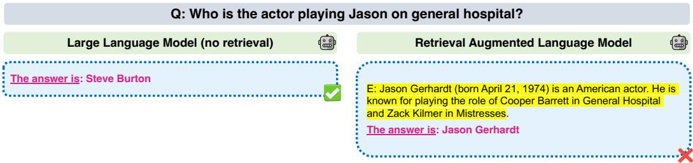
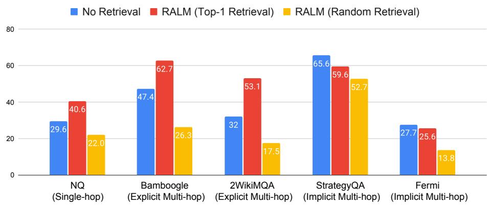
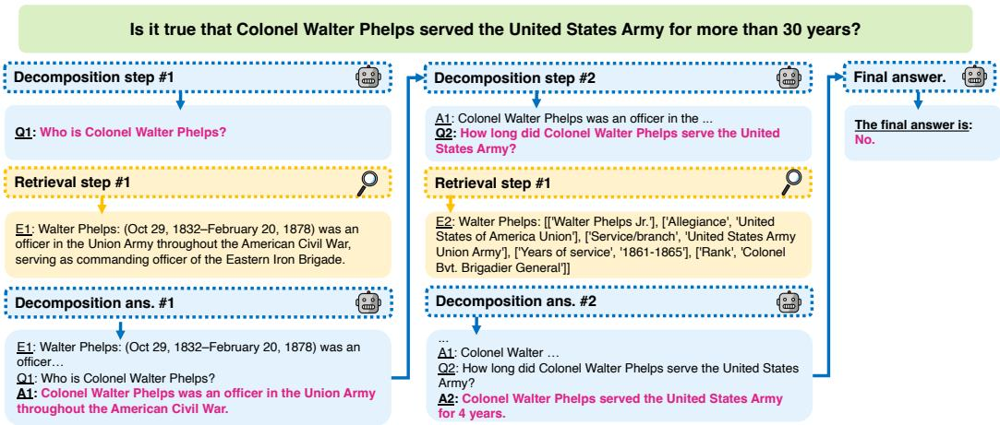
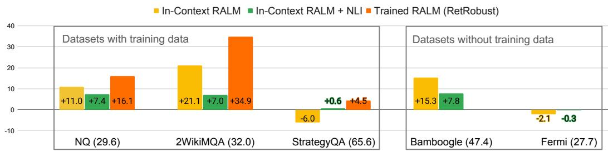
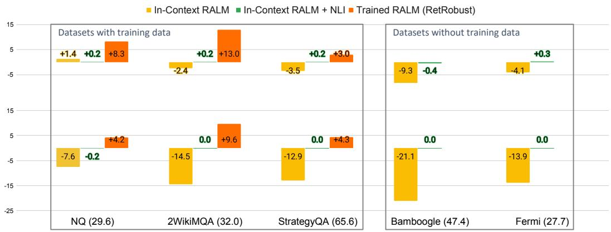
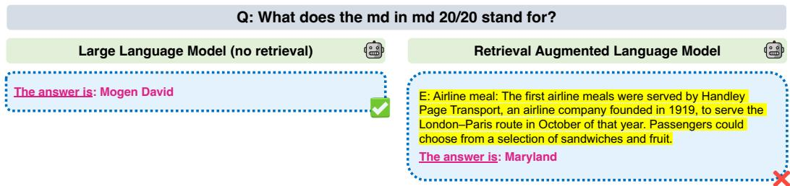
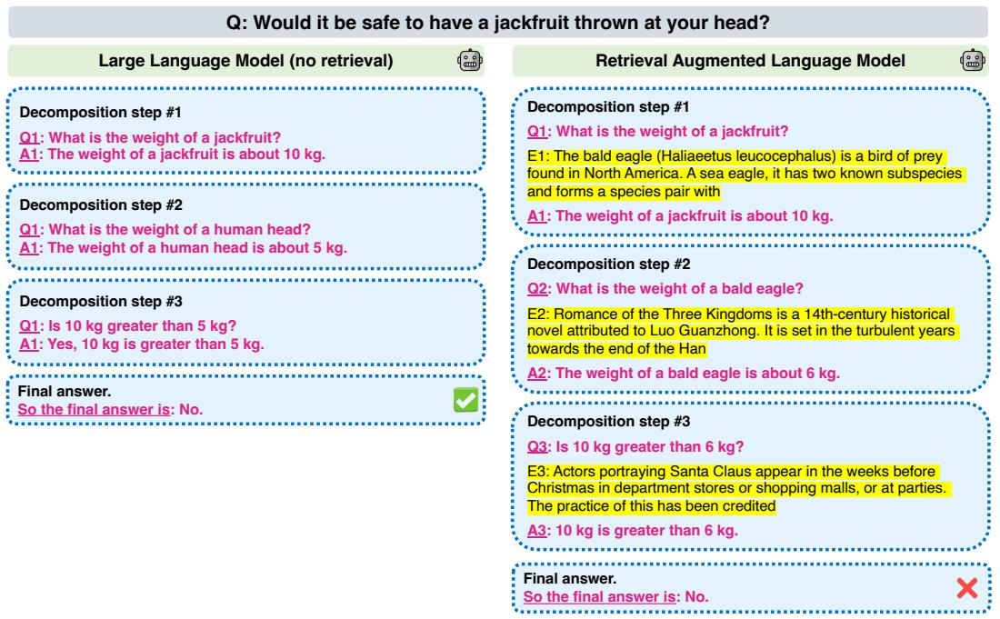
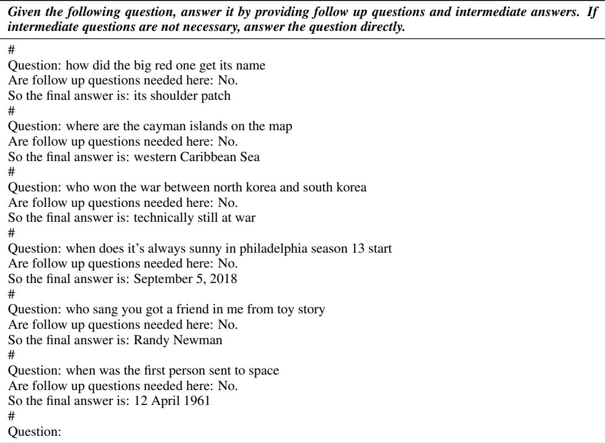
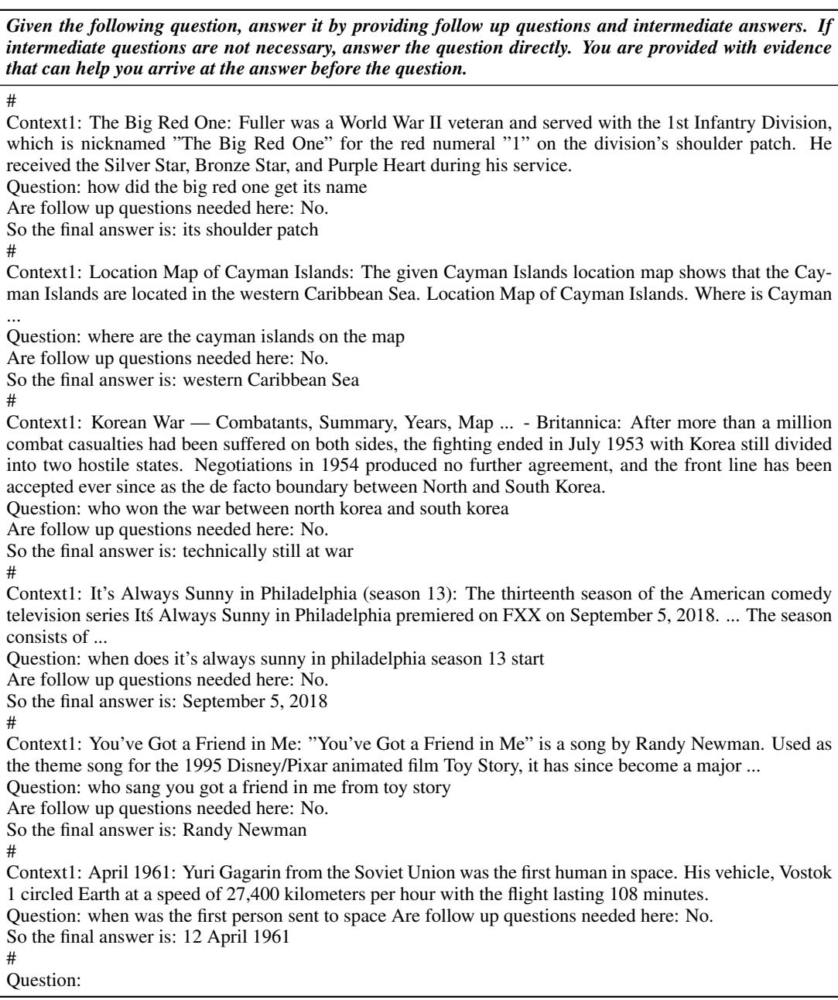
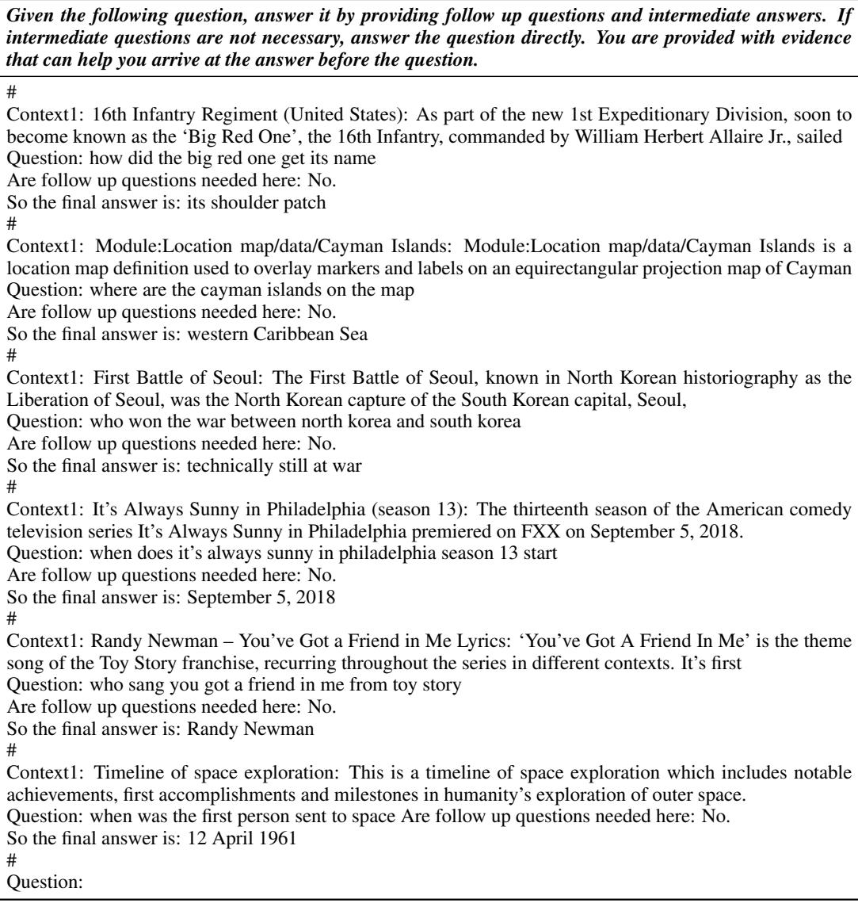

# MAKING RETRIEVAL-AUGMENTED LANGUAGE MODELS ROBUST TO IRRELEVANT CONTEXT

Ori Yoran1 Tomer Wolfson1,2 Ori Ram1 Jonathan Berant1   
1Tel Aviv University, 2Allen Institute for AI   
{ori.yoran, ori.ram, joberant}@cs.tau.ac.il tomerw@allenai.org

# ABSTRACT

Retrieval-augmented language models (RALMs) hold promise to produce language understanding systems that are are factual, efficient, and up-to-date. An important desideratum of RALMs, is that retrieved information helps model performance when it is relevant, and does not harm performance when it is not. This is particularly important in multi-hop reasoning scenarios, where misuse of irrelevant evidence can lead to cascading errors. However, recent work has shown that retrieval augmentation can sometimes have a negative effect on performance. In this work, we present a thorough analysis on five open-domain question answering benchmarks, characterizing cases when retrieval reduces accuracy. We then propose two methods to mitigate this issue. First, a simple baseline that filters out retrieved passages that do not entail question-answer pairs according to a natural language inference (NLI) model. This is effective in preventing performance reduction, but at a cost of also discarding relevant passages. Thus, we propose a method for automatically generating data to fine-tune the language model to properly leverage retrieved passages, including for challenging multi-hop tasks, using a mix of relevant and irrelevant contexts at training time. We empirically show that even 1,000 examples suffice to train the model to be robust to irrelevant contexts while maintaining high performance on examples with relevant ones.

# 1 INTRODUCTION

Large Language Models (LLMs) (Brown et al., 2020; Chowdhery et al., 2022; Touvron et al., 2023) are the foundation on top of which modern language systems are built. However, open-domain question answering (ODQA; Chen et al. 2017) and other knowledge-intensive tasks (Thorne et al., 2018; Petroni et al., 2021) require vast amounts of up-to-date factual knowledge about rare entities that even very large models cannot memorize (Roberts et al., 2020; Dhingra et al., 2022). A dominant approach for combating this issue has been Retrieval Augmented Language Models (RALMs), which incorporate a retrieval mechanism to reduce the need for storing information in the LLM parameters (Guu et al., 2020; Lewis et al., 2020b; Izacard et al., 2023; Rubin & Berant, 2023). Furthermore, RALMs have also been shown to improve ODQA performance in an in-context setting (without any training), simply by prepending retrieved sentences to the input question (Ram et al., 2023). Nevertheless, retrievers are not perfect and past work has shown that noisy retrieval can negatively affect LLM performance (Petroni et al., 2020; Li et al., 2023). For example, in Fig. 1, when posed with the questions “Who is playing Jason on General Hospital?” a vanilla LLM (left) correctly answers the question while the RALM (right) is “distracted” by irrelevant context about the actor portraying Cooper, not Jason.

In this work, we analyze and improve the robustness of RALMs to noisy retrieved contexts. Our definition for retrieval-robust LLMs states that: (a) when relevant, the retrieved context should improve model performance; (b) when irrelevant, the retrieved context should not hurt model performance. To this end, we present two methods for retrieval-robustness in RALMs (§2).

First, we consider a setting where we have black-box access to the LLM and cannot train it. Rather than solely relying on in-context prompting (Brown et al., 2020), we frame retrieval robustness as a natural language inference (NLI) problem (Dagan et al., 2006; Bowman et al., 2015). Namely, given a question and retrieved context, an NLI model can predict whether a question-answer pair (hypothesis) is entailed by the context (premise). Building on the strong performance of recent NLI models (e.g., in detecting model hallucinations (Honovich et al., 2022) and attributed question answering (Bohnet et al., 2023)), we use such models to identify irrelevant contexts. When the context is labeled as irrelevant to the question-answer pair, we generate the answer using the LLM without retrieval as a “back-off strategy”. Our results show that this natural baseline is highly effective at identifying irrelevant contexts, but is too strict and discards relevant ones as well (§4).

  
Figure 1: An example from NQ where retrieval augmentation causes Llama-2-13B to err. Augmenting with irrelevant retrieved context leads to an error (right), although the model is able to answer the question without retrieval (left).

We then propose a method for training RALMs to be retrieval-robust. Intuitively, LLMs are not trained with retrieved passages, and thus brittleness to noisy retrieval is somewhat expected. Therefore, we perform an additional finetuning step that teaches the LLM to be robust to noisy contexts. The core challenge is to generate data for finetuning, and we describe a procedure for automatically generating such data for both single-hop and multi-hop questions. In the single-hop setting, assuming access to gold QA pairs and a retriever, we create training examples using retrieved contexts, where we can use low-ranked or random passages as noisy contexts. In the multi-hop setting, training examples need to contain not only retrieved contexts, but also intermediate questions, answers and relevant contexts, which comprise the question decomposition (Fig. 3), shown to be necessary for high performance on multi-hop questions (Wolfson et al., 2020; Press et al., 2023). To generate decompositions to train on, we use a strong LLM, prompted for decomposition without any retrieval. Then, we can sample multiple decompositions, and use self-consistency (Wang et al., 2023) to identify high-quality training examples (§3.2.3).

To test our methods, we evaluate retrieval robustness on five ODQA benchmarks, four of which contain multi-hop questions, where the retriever is called multiple times (Jiang et al., 2023). Fig. 2 shows that even with a strong retriever (top-1 Google search) incorporating the retrieved context actually hurts model performance on two of the benchmarks (STRATEGYQA and FERMI). Moreover, adding randomly-retrieved contexts dramatically decreases accuracy on all five datasets. Our analysis (§5) shows that irrelevant context causes a wide range of errors, which include copying irrelevant answers from the retrieved sentences and hallucinating incorrect answers and decompositions.

Our results demonstrate that finetuning LLMs to be retrieval-robust enables them to ignore irrelevant context while improving their overall accuracy (§4). When using a strong retriever at test time, our finetuned models outperform both models that were finetuned without retrieval, as well as untrained models prompted using in-context learning. To test robustness to noisy context, we evaluate QA accuracy when models are given randomly-retrieved contexts. In this setting, our finetuned models perform on par with those that were finetuned without retrieval, demonstrating retrieval robustness. In addition, our ablation study shows that training models on a mixture of relevant and irrelevant contexts results in models that are much more robust to irrelevant context.

To summarize, our main contributions are:

• We conduct a thorough analysis on the robustness of RALMs to irrelevant retrieved contexts. • We show that small NLI models can be used to identify irrelevant context and improve robustness, without updating the model parameters. • We demonstrate that training LLMs when to use retrieval helps make models robust to irrelevant context and improve their overall performance, including in challenging multi-hop tasks.1

  
Figure 2: Accuracy for Llama-2-13B few-shot prompted on five QA tasks, in three settings: (a) without retrieval, (b) with top-1 retrieval from a strong search engine, and (c) with a randomlyretrieved passage. Retrieval augmentation can boost performance, but even strong retrieval hurts performance on StrategyQA and Fermi, and random contexts reduce performance dramatically.

# 2 MAKING RALMS ROBUST TO IRRELEVANT CONTEXTS

We now present our methods for building RALMs that are robust to irrelevant contexts. We begin by describing the common approach for incorporating evidence into RALMs. Next, we explore a natural baseline for using an NLI model to identify irrelevant contexts. Last, we describe our procedure for finetuning models to be robust to irrelevant context.

In-context RALMs Language models define a probability distribution over sequences of tokens, with auto-regressive models assigning a probability via next-token prediction: $\begin{array} { r l } { p _ { L M } } & { { } = } \end{array}$ $\Pi _ { i = 1 } ^ { n } p _ { \theta } ( x _ { i } | \boldsymbol { x } _ { < i } )$ , where $x _ { < i }$ is the sequence of tokens preceding $x _ { i }$ at each step and $\theta$ denotes the parameters of the LM. For RALMs, we follow the definition of in-context RALMs from Ram et al. (2023), where context sentences are retrieved from a corpus $C$ , and generation is conditioned on the retrieved context. Given the retrieval operation $R _ { C }$ , this can be formalized as $p _ { \mathtt { R A L M } } = \Pi _ { i = 1 } ^ { n } p _ { \theta } ( x _ { i } | R _ { C } ( x _ { < i } ) ; x _ { < i } )$ , where $[ R _ { C } ( x _ { < i } ) ; x _ { < i } ]$ denotes the concatenation of the retrieved evidence with the generated sequence. Generation in LMs and RALMs can also be conditioned on additional input, which we omit for brevity.

In our setting, we focus on RALMs for ODQA. We follow recent approaches such as Self-Ask and IR-CoT (Press et al., 2023; Trivedi et al., 2023; Yoran et al., 2023), for interleaving retrieval with multi-hop question answering (see Fig. 3). Retrieval is performed for every intermediate question and each context is prepended to the question. In the single-hop setting, the model has to generate the answer given a question and retrieved context. In the multi-hop setting, the model has to generate intermediate questions and answers until arriving at the final answer and the retriever is called for the original question and after each intermediate question. Formally, $x$ in this case is the generated decomposition until an intermediate step and $R _ { C } ( x )$ are the retrieved contexts for all questions in $x$ .

# 2.1 IDENTIFYING IRRELEVANT CONTEXTS WITH NLI MODELS.

NLI models (Dagan et al., 2006; Bowman et al., 2015) classify whether a textual hypothesis is entailed, neutral, or contradicted given a textual premise. Recent work successfully used NLI models to automatically identify hallucinations (Honovich et al., 2022) and statement attribution (Bohnet et al., 2023) when presented with a context and generated text. Similarly, a natural baseline is to frame irrelevant context identification as an NLI problem, by using the retrieved context only when the hypothesis (i.e., final answer and intermediate question-answer pairs; Fig. 3) are classified as entailed by the premise (i.e., the retrieved context). We use a simple back-off strategy where we generate twice, once with $p _ { L M }$ and once with $p _ { R A L M }$ , and only use the RALM if the NLI model classified all generated answers (and intermediate questions) as entailed by the retrieved evidence.

  
Figure 3: Interleaving decomposition and retrieval in Self-Ask format (Press et al., 2023). The model generates intermediate questions and answers until generating the final answer (model generations are shown in pink). Retrieved evidence for intermediate questions is prepended at each step.

For example, in Fig. 1, the retrieved evidence “Jason Gerhardt... is an American actor... known for playing Cooper Barrett...” serves as the premise while the question and generated answer, $^ { * } Q$ : Who is the actor playing Jason on general hospital? A: Steve Burton” are concatenated and serve as our hypothesis. As this context is irrelevant, we expect the NLI model to label the hypothesis as contradicting. Given a contradicting or neutral hypothesis, we will use the standard LLM without the (potentially distracting) retrieved context. For multi-hop questions (as in Fig. 3), we additionally verify that each intermediate-answer pair is entailed by the retrieved evidence using all retrieved evidence as our premise and the intermediate question-answer pair as the hypothesis. For example, “Q: Who is Colonel Walter Phelps? A: Colonel Walter Phelps was an officer in the Union Army throughout the American Civil War.” for the first intermediate question in Fig. 3.

# 2.2 TRAINING ROBUST RALMS

As in-context RALMs are not trained to use retrieved passages, a more effective solution than posthoc filtering (using NLI) may be to train RALMs to ignore irrelevant contexts. We are interested in testing whether training on a relatively small dataset (several hundreds of examples) would suffice.

Automatically Generating Training Data Our goal is to teach RALMs to be robust to irrelevant context in an ODQA setting. In the single-hop setting, generating training data is straightforward. Given access to a dataset of question-answer pairs $\{ ( q , \bar { a } ) \}$ (i.e., without contexts) and a retriever $R _ { C }$ , we use the retriever to augment questions with retrieved context. To create training examples with relevant contexts, we return the top-1 context from $R _ { C }$ , and for irrelevant contexts, we either return a low-ranked result from $R _ { C } ( q )$ or a random context (i.e., $R _ { C } ( q ^ { \prime } )$ for another question $q ^ { \prime }$ ). We denote the chosen context by $r _ { q }$ . Then, the training dataset is defined by $D = \{ ( [ r _ { q } ; q ] , a ) \}$ .

Our main challenge is generating training examples for multi-hop questions. In these questions the model generates a decomposition, consisting of intermediate questions and answers, before arriving at the final answer, while the retriever is called multiple times (Fig. 3). Our goal is to automatically generate retrieval-augmented decomposition steps, $\bar { D } = \{ ( [ r _ { x } ; x ] , y ) \}$ , where: $y$ is the correct generation for each step (i.e., the correct intermediate question, intermediate answer, or final answer); $x$ consists of the previously generated steps up to $y ; r _ { x }$ is the retrieved contexts for all steps in $x$ . Our first step to automatically generate decompositions is to prompt a strong LLM without access to retrieval and to verify its answers. However, the LLM may arrive at the correct answer using an incorrect decomposition, for example in binary or comparison questions. Hence, we need to ensure the quality of generated decompositions. For multi-hop datasets which provide intermediate answers, we simply filter out generated decompositions that do not contain them. When intermediate answer annotations are unavailable, we sample from the LLM that generated the decomposition multiple times and verify self-consistency (Wang et al., 2023). Further details are given in $\ S 3 . 2 . 3$ .

Table 1: The QA datasets in our experiments.   

<table><tr><td>Dataset</td><td>Type</td><td>Example</td></tr><tr><td>NQ</td><td>Single-hop</td><td>What episode of law and order svu is mike tyson in?</td></tr><tr><td>2WIKIMQA</td><td>Explicit</td><td>Where was the place of death of Isabella Of Bourbon&#x27;s father?</td></tr><tr><td>BAMBOOGLE</td><td>Explicit</td><td>What is the maximum airspeed (in km/h) of the third fastest bird?</td></tr><tr><td>STRATEGYQA</td><td>Implicit</td><td>Can Arnold Schwarzenegger deadlift an adult Black rhinoceros?</td></tr><tr><td>FERMI</td><td>Implicit</td><td>How many high fives has Lebron James given/received?</td></tr></table>

Training We use our automatically generated data $D$ to fine-tune models for generating $y$ conditioned on $[ r _ { x } ; x ]$ with standard maximum likelihood. Since we are mostly interested in the low-data regime, we limit the number of questions in $D$ to 1,000 in the single-hop setting and 500 in the multi-hop setting (splitting multi-hop questions to multiple examples for each step), and use parameter efficient fine-tuning (Dettmers et al., 2023). Thus, training all our models takes no more than a few hours. Additional experimental details are in $\ S 3$ and $\ S \mathrm { A } . 1$ .

# 3 EXPERIMENTAL SETTING

# 3.1 DATASETS

We experiment with both single- and multi-hop QA datasets. We list and give an example from each dataset in Tab. 1. Our QA benchmarks can be categorized based on their required reasoning skills:

• Single-hop: Information-seeking questions that do not require decomposition. We use the popular Natural Questions (NQ) dataset (Kwiatkowski et al., 2019). • Explicit Reasoning: Multi-hop questions where reasoning is explicitly expressed in the question. We include 2WIKIMQA (Welbl et al., 2018) and BAMBOOGLE (Press et al., 2023). • Implicit Reasoning: Mutli-hop questions where generating reasoning steps requires commonsense (implicit reasoning, Geva et al. (2021)). Such questions may have multiple valid reasoning chains. We evaluate on STRATEGYQA (Geva et al., 2021) and FERMI (Kalyan et al., 2021).

For evaluation, we follow prior work and use EM for NQ and STRATEGYQA, and $\mathrm { F _ { 1 } }$ for 2WIKIMQA and BAMBOOGLE. For FERMI, we use the official order-of-magnitude evaluation ( Kalyan et al. 2021). Following prior work (Khattab et al., 2022; Trivedi et al., 2023; Yoran et al., 2023), we evaluate on 500 random examples from the development set of each dataset. We provide additional technical details on evaluation in $\ S \mathrm { A } . 2$ .

# 3.2 MODELS

We next describe our retrievers (§3.2.1), prompted baselines (§3.2.2), and finetuned models (§3.2.3).

# 3.2.1 RETRIEVERS

Our models use a retriever based on GOOGLE SEARCH,2 as well as the open-source COLBERTV2 (Khattab & Zaharia, 2020). Since the corpus for our datasets is Wikipedia, we format search queries as “en.wikipedia.org $q _ { i }$ ” when accessing GOOGLE SEARCH. For COLBERTV2 our corpus is the 2018 Wikipedia from Karpukhin et al. (2020). To simulate different types of noise, we return either the top-1, a low-ranked relevant evidence,3 or a random passage that is the top-1 evidence for a different question or intermediate question from the same dataset.

# 3.2.2 FEW-SHOT PROMPTED BASELINES

Our main baselines are Llama-2-13B models prompted for QA in the Self-Ask format through incontext learning (Brown et al., 2020) with 4-6 exemplars. We also evaluate with Llama-2-70B on NQ. Our baselines differ based on the retrieved contexts in the exemplars (Full prompts in $\ S \mathrm { A } . 5$ ):

• Self-Ask No Retrieval (SA-NR): Exemplars are gold decompositions without retrieved evidence. We use this prompt to evaluate the performance of models without retrieval, when relying solely on their parametric memory, i.e, the information encoded in the model’s parameters. As an additional baseline, we use this non-retrieval prompt, but still apply retrieval during inference.   
• Self-Ask Retrieval $@ 1$ $( \mathbf { S } \mathbf { A } { \cdot } \mathbf { R } @ \mathbf { 1 } _ { \cdot }$ ): Exemplars are gold decomopsitions prepended with the most relevant evidence retrieved from GOOGLE SEARCH for each step.   
• Self-Ask Retrieval $@ 1 0$ $\mathbf { \left( S A - R @ 1 0 \right) }$ : Exemplars are gold decomopsitions prepended with the lowest rank passage from Google (which is rank 10 in most cases).   
• Self-Ask Random Retrieval (SA-RMix) Exemplars are gold decomopsitions prepended with either the top-1 or lowest-ranked evidence from GOOGLE SEARCH, interchangeably.

NLI-based Models We use a BART-Large model (Lewis et al., 2020a) with 407 million parameters trained on the MNLI dataset (Williams et al., 2018).4 We consider a question-answer pair as entailed if the probability for the entailment label is $\geq 0 . 5$ . All few-shot prompted baselines have a variant with NLI, termed, SA- $^ *$ -NLI. When there is no entailment, we use the generation from the SA-NR model, which uses only the parametric memory as the back-off strategy.

# 3.2.3 FINE-TUNED MODELS

We finetune Llama-2-13B on 3 ODQA benchmarks, one single-hop (NQ, 1000 training examples), one explicit (2WIKIMQA, 500 questions, 1,539 examples), and one implicit (STRATEGYQA, 414 questions, 1,584 examples). Training hyperparameters are in $\ S \mathrm { A } . 1$ .

Data Generation We use a LLM to verify questions are answerable and to generate decompositions.5 This is done with GPT-3, code-davinci-002 (Brown et al., 2020; Chen et al., 2021) with 175B parameters. We prompt the model to generate decompositions using the SA-NR prompt. 2WIKIMQA contains intermediate answers, and we use those to verify generated decompositions. For the implicit STRATEGYQA we utilize only the final answer, and thus use self-consistency, as explained in $\ S 2$ . We sample 5 decompositions per question (one with greedy decoding and four with temperature 0.7) and only keep the greedily-decoded decomposition when all decompositions lead to the same correct answer. To verify the quality of the generated decompositions, we manually examine 50 decompositions per dataset and find that the generated decompositions are correct in about $9 0 \%$ of the time for STRATEGYQA and more than $9 5 \%$ for 2WIKIMQA. As FERMI and BAMBOOGLE contain less than 300 examples, we use them exclusively for evaluation and do not include them in these experiments.

Incorporating Retrieved Evidence in Training Examples To make sure the model is exposed to relevant and irrelevant context, we use either the top-1, low-ranked, or random evidence with equal probability at each step. We term the trained model SA-RetRobust. We include ablations where training is without retrieved context (SA-NoRet) or only with the top-1 evidence (SA-Ret $@ 1$ ).

# 4 RESULTS

Fig. 4 presents our main results, evaluating the effect that retrieving top-1 result from GOOGLE SEARCH has on the following RALMs: (a) an In-Context RALM, prompted with the SA-RMix prompt (leftmost yellow), (b) the same model, but using NLI models to identify irrelevant context (center, green), and (c) our proposed SA-RetRobust, a RALM fine-tuned on a mixture of relevant and irrelevant contexts (rightmost, orange). The bars show the difference in performance from our few-shot prompted model without retrieval (whose performance is shown in parenthesis for each dataset). For the In-Context RALM, we observe that retrieval helps on NQ, 2WIKIMQA and BAMBOOGLE but reduces performance on the implicit STRATEGYQA and FERMI. Adding NLI to identify irrelevant context ensures that retrieval does not hurt, but gains are limited. Training with retrieval leads to gains across the board. We observe similar trends with the COLBERTV2 retriever, albeit at an overall decrease in accuracy (§A.3, Tab. 3.)

  
Figure 4: Results for our models on all evaluation datasets when retrieving top-1 results from GOOGLE SEARCH. Bars show the difference in performance from a model with no retrieval (whose performance is given in parenthesis for each dataset). Prompting models to use retrieval in-context (leftmost bar) increases performance on single-hop and explicit datasets, but decreases performance on implicit ones (STRATEGYQA and FERMI). When using NLI models to identify irrelevant evidence (center bar), retrieval never hurts, at a cost to gains received when retrieval is helpful. Our trained RALMs (rightmost column) outperform all other models when applicable for NQ, 2WIKIMQA, and STRATEGYQA (see $\ S 3 . 2 . 3$ for more details on data generation).

Exploring the Robustness of Models to Irrelevant Context Fig. 5 present results when simulating retrieval of irrelevant/noisy context, either by retrieving low-ranked passages (top) or random ones (bottom). When retrieving random passages, the performance of the In-Context RALM drops by more than 10 points on average, a phenomenon that can be mitigated by using NLI models. SARetRobust performs best across all settings. To verify that these improvements indeed stem from robustness to irrelevant context rather than task-specific training, we compare SA-RetRobust to an ablated variant trained and evaluated without retrieval (full results in Tab. 4, $\ S \mathrm { A } . 3$ ). SA-RetRobust is able to perform similarly to this model (within one standard deviation) when retrieving random contexts. Interestingly, when retrieving low-ranked results, SA-RetRobust outperforms the ablated model by 3.8 and 2.8 points on NQ and 2WIKIMQA, while performing only slightly worse (within a 1.2 point difference) on STRATEGYQA. Overall, our results suggest SA-RetRobust learned to both better utilize retrieval and ignore irrelevant context.

Adding Retrieval to In-context Exemplars can Hurt Performance Tab. 2 and Tab. 3 in $\ S \mathrm { A } . 3$ present full results with the GOOGLE SEARCH and COLBERTV2 retrievers. Interestingly, providing exemplars with retrieval performs worse than providing exemplars without retrieval, i.e., the SA-NR prompt leads to better performance even when retrieval is performed at inference time. This SA-NR prompt consistently outperforms the prompts with retrieval $\mathbf { \Delta } \cdot \mathbf { S } \mathbf { A } \mathbf { - } \mathbf { R } \mathbf { \mathscr { Q } } 1$ , SA-R@10, and SA-RMix) when retrieving the top-1 result from COLBERTV2 or random contexts from GOOGLE SEARCH. In addition, the $\mathbf { S } \mathbf { A } \mathbf { - } \mathbf { R } \mathbf { \mathscr { Q } } 1$ model that contains top-1 results in the prompt is not the best performing even when retrieving top-1 results at inference time, losing to SA-NR by more than 2 points on average across datasets. When retrieving noisy contexts at inference time, $\mathbf { S } \mathbf { A } \mathbf { - } \mathbf { R } \mathbf { \mathscr { Q } } 1$ is outperformed by the other models, suggesting that showing examples for retrieval during in-context learning has a negative effect that causes over-utilization of irrelevant context. We observe a similar trend with Llama-2-70B in $\ S \mathrm { A } . 3$ , Tab. 6.

Effect of NLI When retrieving random contexts or evaluating on the implicit STRATEGYQA and FERMI, NLI variants consistently perform best, suggesting small NLI models are sufficient to identify irrelevant evidence (Tab. 2 and Tab. 3 in $\ S \mathrm { A } . 3$ ). However, they reduce performance in cases retrieval is helpful, e.g., on the explicit 2WIKIMQA and BAMBOOGLE. We perform a detailed analysis for our NLI variants in $\ S 5$ .

  
Figure 5: Results with low-rank (top) and random retrieval (bottom). Models are similar to those in Fig.4. Performance significantly decreases for the prompted model in all settings, while it is maintained when using NLI models. Our finetuned SA-RetRobust is best performing in all settings. We show that SA-RetRobust learned to both ignore irrelevant context and better utilize relevant context by comparing to an ablated model without retrieval in $\ S 4$ .

Results with Finetuned Models Fig. 4 and Fig. 5 show SA-RetRobust consistently outperforms other models. In $\ S \mathrm { A } . 3$ , Tab. 4, we present all results for all trained models, showing SA-RetRobust outperforms our ablated baselines. Specifically, it outperforms SA-NoRet (fine-tuned without retrieval) by 2.7, 2.4, and 2.4 points on average when using the top-1, a low-ranked, or a random context from GOOGLE SEARCH during inference, and SA- $@ 1$ by 0.2, 0.4, 3.2 points respectively. When retrieving top-1 results from COLBERTV2, SA-RetRobust outperforms SA-NoRet and SA$@ 1$ by 2.7 and 0.3 points on average, respectively. Our results suggest that training on a mixture of relevant and irrelevant contexts is necessary for robustness and improved performance. We provide a study on the generalization of our trained models to other settings in $\ S \mathrm { A } . 3$ .

Results with Llama-2-70B We compare SA-RetRobust with Llama-2-70B on the NQ dataset to assess whether larger models are more robust to irrelevant contexts. Without retrieval, the prompted Llama-2-70B outperforms the trained Llama-2-13B by 4.3 points (38.4 vs 34.1). However, when retrieving the top-1 results from GOOGLE SEARCH, SA-RetRobust outperforms all prompted Llama2-70B variants by at least 3.3 points (45.7 vs 42.4), suggesting that increasing model size alone is not sufficient to make models better utilize retrieval. We provide the full results in $\ S \mathrm { A } . 3$ , Tab. 6.

# 5 ANALYSIS

When Does Irrelevant Context Cause Errors? To assess errors caused by irrelevant context, we manually looked at examples from NQ, 2WIKIMQA and STRATEGYQA, where models succeed without retrieval, but fail with it. Specifically, we look at examples where the model is prompted with the SA-RMix prompt that includes both top-1 and low-ranked retrieved result and is presented with low-rank or random retrieved evidence during inference. We manually annotated 40 examples in each setting (240 overall), and find that automatic errors indeed correlate with cases in which retrieval augmentation caused the model to err in $73 \%$ of the cases $6 5 \% 8 5 \%$ in each setting). We provide additional details and statistical tests in $\ S \mathrm { A . 4 }$ .

We then take a deeper look at the errors. For NQ we find that when using low-ranked context, the wrong generated answer entity appears in the retrieved context in the majority $( 7 7 \% )$ of the cases, but only in $37 \%$ when retrieving random contexts. This suggests that irrelevant context can cause errors even when the generated entities are not retrieved, as shown in $\ S _ { \mathrm { A } . 4 }$ , Fig. 6. For multi-hop questions, we test whether irrelevant context leads to errors in question decomposition, or in answering intermediate questions. We find that when retrieving low-ranked passages, most of the errors $( 6 8 \% )$ for the explicit 2WIKIMQA are in intermediate answers, contrary to the implicit STRATEGYQA were errors are more prevalent in intermediate questions $7 7 \%$ of the cases, we provide an example in $\ S \mathrm { A . 4 }$ , Fig. 7). Similarly, when retrieving random contexts, most errors $( 6 0 \% )$ for 2WIKIMQA are in intermediate questions. This suggests that irrelevant context can cause errors in generating both an answering strategy and the answer itself, depending on the task and the retrieved context.

When Do NLI Models Fail? As shown in $\ S 4$ , NLI models are efficient at identifying relevant context, at a cost to gains when retrieval is helpful. To better characterize NLI models, we look at the accuracy for our SA-\*-NLI models as a function of the probability that the NLI model assigns to the entailment label. Tab. 8 in $\ S \mathrm { A . 4 }$ shows that there are many cases where the probability for entailment is low but retrieval helps for NQ and 2WIKIMQA.

To better identify the source for such errors, we manually analysed 25 examples for each dataset where entailment was low, but retrieval augmentation led the SA-RMix model to generate the correct answer.6 In about half of the cases the NLI model erred and the generated text is indeed entailed from the retrieved contexts. In the remaining examples, for at least a third of the cases the generated answer or decomposition is correct, but the retrieved context does not directly entail the generation. This can be partially explained by the ability of models to combine retrieval and their parametric knowledge (Talmor et al., 2020; Zhong et al., 2023; Cohen et al., 2023). We are hopeful that these results can inspire future work to focus on additional aspects of retrieval augmentation, such as the effect augmentation has on generation probability rather than on direct entailment.

# 6 RELATED WORK

Recent work has shown that the performance of LLMs can be affected by irrelevant context. Amongst others, Jia & Liang (2017); Petroni et al. (2020); Creswell et al. (2023) show that adding random or irrelevant context can decrease QA performance. This has been shown in many settings, including but not limited to factual reasoning (Kassner & Schutze, 2020; Pandia & Ettinger, 2021; ¨ Misra et al., 2023), text generation about new entities (Onoe et al., 2022), or even code generation (Jones & Steinhardt, 2022). In the context of arithmetric reasoning, Shi et al. (2023) showed that adding irrelevant context to exemplars or task specific instructions can help, suggesting the model may be equipped with such skills from pre-training. Other methods try to reduce the number of retrieval calls, by focusing on cases where confidence is low (Jiang et al., 2023) or retrieving information for rare entities (Mallen et al., 2023). Closest to our work is that of Li et al. (2023) that propose LLMs with a “controllable memory” that will enable them to ignore irrelevant context. However, their LLMs are finetuned on over 200K training examples, where our focus is on performance when training with 1,000 questions or less, and training data is automatically generated. In addition, we focus on a multi-hop QA setting, where the retriever is called multiple times (§2).

A similar line of work focuses on when models should use parametric or retrieved knowledge, especially when there are conflicts (Longpre et al., 2021; Chen et al., 2022). It has been recently proposed to train models to generate from both parametric and retrieved knowledge (Neeman et al., 2023) or make better use of in-context exemplars (Zhou et al., 2023).

# 7 CONCLUSION

In this work, we provide a thorough analysis showing current RALMs are not robust to irrelevant retrieved context, causing them to perform worse on certain tasks. In cases where training is not possible, a simple NLI baseline is efficient to increase robustness, at a cost of discarding relevant passages. When training is possible, we introduce an automatic data generation framework for single and challenging multi-hop tasks, and show training on as few as 1,000 examples with intentionally varied quality suffice to make models robust to irrelevant context and improve overall performance. While our focus in this work is on in-domain settings, we are hopeful our work could inspire future research towards a general RALM that is robust to irrelevant context.

# ACKNOWLEDGEMENTS

We would like to our colleagues at TAU NLP for their insightful comments. We thank SerpAPI for their support by granting us an academic discount. This research was partially supported by the Yandex Initiative for Machine Learning and the European Research Council (ERC) under the European Union Horizons 2020 research and innovation programme (grant ERC DELPHI 802800). This work was completed in partial fulfillment of the Ph.D. of Ori Yoran.

# REFERENCES

Bernd Bohnet, Vinh Q. Tran, Pat Verga, Roee Aharoni, Daniel Andor, Livio Baldini Soares, Massimiliano Ciaramita, Jacob Eisenstein, Kuzman Ganchev, Jonathan Herzig, Kai Hui, Tom Kwiatkowski, Ji Ma, Jianmo Ni, Lierni Sestorain Saralegui, Tal Schuster, William W. Cohen, Michael Collins, Dipanjan Das, Donald Metzler, Slav Petrov, and Kellie Webster. Attributed question answering: Evaluation and modeling for attributed large language models, 2023.

Samuel R. Bowman, Gabor Angeli, Christopher Potts, and Christopher D. Manning. A large annotated corpus for learning natural language inference. In Proceedings of the 2015 Conference on Empirical Methods in Natural Language Processing, pp. 632–642, Lisbon, Portugal, September 2015. Association for Computational Linguistics. doi: 10.18653/v1/D15-1075. URL https://aclanthology.org/D15-1075.

Tom B. Brown, Benjamin Mann, Nick Ryder, Melanie Subbiah, Jared Kaplan, Prafulla Dhariwal, Arvind Neelakantan, Pranav Shyam, Girish Sastry, Amanda Askell, Sandhini Agarwal, Ariel Herbert-Voss, Gretchen Krueger, Tom Henighan, Rewon Child, Aditya Ramesh, Daniel M. Ziegler, Jeffrey Wu, Clemens Winter, Christopher Hesse, Mark Chen, Eric Sigler, Mateusz Litwin, Scott Gray, Benjamin Chess, Jack Clark, Christopher Berner, Sam McCandlish, Alec Radford, Ilya Sutskever, and Dario Amodei. Language models are few-shot learners. In Hugo Larochelle, Marc’Aurelio Ranzato, Raia Hadsell, Maria-Florina Balcan, and Hsuan-Tien Lin (eds.), Advances in Neural Information Processing Systems 33: Annual Conference on Neural Information Processing Systems 2020, NeurIPS 2020, December 6-12, 2020, virtual, 2020. URL https://proceedings.neurips.cc/paper/2020/hash/ 1457c0d6bfcb4967418bfb8ac142f64a-Abstract.html.

Danqi Chen, Adam Fisch, Jason Weston, and Antoine Bordes. Reading Wikipedia to answer open-domain questions. In Proceedings of the 55th Annual Meeting of the Association for Computational Linguistics (Volume 1: Long Papers), pp. 1870–1879, Vancouver, Canada, July 2017. Association for Computational Linguistics. doi: 10.18653/v1/P17-1171. URL https: //aclanthology.org/P17-1171.

Hung-Ting Chen, Michael Zhang, and Eunsol Choi. Rich knowledge sources bring complex knowledge conflicts: Recalibrating models to reflect conflicting evidence. In Proceedings of the 2022 Conference on Empirical Methods in Natural Language Processing, pp. 2292–2307, Abu Dhabi, United Arab Emirates, 2022. Association for Computational Linguistics. URL https://aclanthology.org/2022.emnlp-main.146.

Mark Chen, Jerry Tworek, Heewoo Jun, Qiming Yuan, Henrique Ponde de Oliveira Pinto, Jared Kaplan, Harri Edwards, Yuri Burda, Nicholas Joseph, Greg Brockman, Alex Ray, Raul Puri, Gretchen Krueger, Michael Petrov, Heidy Khlaaf, Girish Sastry, Pamela Mishkin, Brooke Chan, Scott Gray, Nick Ryder, Mikhail Pavlov, Alethea Power, Lukasz Kaiser, Mohammad Bavarian, Clemens Winter, Philippe Tillet, Felipe Petroski Such, Dave Cummings, Matthias Plappert, Fotios Chantzis, Elizabeth Barnes, Ariel Herbert-Voss, William Hebgen Guss, Alex Nichol, Alex Paino, Nikolas Tezak, Jie Tang, Igor Babuschkin, Suchir Balaji, Shantanu Jain, William Saunders, Christopher Hesse, Andrew N. Carr, Jan Leike, Josh Achiam, Vedant Misra, Evan Morikawa, Alec Radford, Matthew Knight, Miles Brundage, Mira Murati, Katie Mayer, Peter Welinder, Bob McGrew, Dario Amodei, Sam McCandlish, Ilya Sutskever, and Wojciech Zaremba. Evaluating large language models trained on code, 2021.

Aakanksha Chowdhery, Sharan Narang, Jacob Devlin, Maarten Bosma, Gaurav Mishra, Adam Roberts, Paul Barham, Hyung Won Chung, Charles Sutton, Sebastian Gehrmann, Parker Schuh,

Kensen Shi, Sasha Tsvyashchenko, Joshua Maynez, Abhishek Rao, Parker Barnes, Yi Tay, Noam Shazeer, Vinodkumar Prabhakaran, Emily Reif, Nan Du, Ben Hutchinson, Reiner Pope, James Bradbury, Jacob Austin, Michael Isard, Guy Gur-Ari, Pengcheng Yin, Toju Duke, Anselm Levskaya, Sanjay Ghemawat, Sunipa Dev, Henryk Michalewski, Xavier Garcia, Vedant Misra, Kevin Robinson, Liam Fedus, Denny Zhou, Daphne Ippolito, David Luan, Hyeontaek Lim, Barret Zoph, Alexander Spiridonov, Ryan Sepassi, David Dohan, Shivani Agrawal, Mark Omernick, Andrew M. Dai, Thanumalayan Sankaranarayana Pillai, Marie Pellat, Aitor Lewkowycz, Erica Moreira, Rewon Child, Oleksandr Polozov, Katherine Lee, Zongwei Zhou, Xuezhi Wang, Brennan Saeta, Mark Diaz, Orhan Firat, Michele Catasta, Jason Wei, Kathy Meier-Hellstern, Douglas Eck, Jeff Dean, Slav Petrov, and Noah Fiedel. Palm: Scaling language modeling with pathways, 2022.

Roi Cohen, Eden Biran, Ori Yoran, Amir Globerson, and Mor Geva. Evaluating the ripple effects of knowledge editing in language models, 2023.

Antonia Creswell, Murray Shanahan, and Irina Higgins. Selection-inference: Exploiting large language models for interpretable logical reasoning. In The Eleventh International Conference on Learning Representations, 2023. URL https://openreview.net/forum?id $=$ 3Pf3Wg6o-A4.

Ido Dagan, Oren Glickman, and Bernardo Magnini. The pascal recognising textual entailment challenge. In Joaquin Quinonero-Candela, Ido Dagan, Bernardo Magnini, and Florence d’Alch ˜ e Buc ´ (eds.), Machine Learning Challenges. Evaluating Predictive Uncertainty, Visual Object Classification, and Recognising Tectual Entailment, pp. 177–190, Berlin, Heidelberg, 2006. Springer Berlin Heidelberg. ISBN 978-3-540-33428-6.

Tim Dettmers, Artidoro Pagnoni, Ari Holtzman, and Luke Zettlemoyer. QLoRA: Efficient finetuning of quantized LLMs. In Thirty-seventh Conference on Neural Information Processing Systems, 2023. URL https://openreview.net/forum?id ${ . } = { }$ OUIFPHEgJU.

Bhuwan Dhingra, Jeremy R. Cole, Julian Martin Eisenschlos, Daniel Gillick, Jacob Eisenstein, and William W. Cohen. Time-aware language models as temporal knowledge bases. Transactions of the Association for Computational Linguistics, 10:257–273, 2022. doi: 10.1162/tacl a 00459. URL https://aclanthology.org/2022.tacl-1.15.

Mor Geva, Daniel Khashabi, Elad Segal, Tushar Khot, Dan Roth, and Jonathan Berant. Did aristotle use a laptop? a question answering benchmark with implicit reasoning strategies. Transactions of the Association for Computational Linguistics, 9:346–361, 2021. doi: 10.1162/tacl a 00370. URL https://aclanthology.org/2021.tacl-1.21.

Kelvin Guu, Kenton Lee, Zora Tung, Panupong Pasupat, and Ming-Wei Chang. Realm: Retrievalaugmented language model pre-training. In Proceedings of the 37th International Conference on Machine Learning, ICML’20. JMLR.org, 2020.

Or Honovich, Roee Aharoni, Jonathan Herzig, Hagai Taitelbaum, Doron Kukliansy, Vered Cohen, Thomas Scialom, Idan Szpektor, Avinatan Hassidim, and Yossi Matias. TRUE: Re-evaluating factual consistency evaluation. In Proceedings of the Second DialDoc Workshop on Documentgrounded Dialogue and Conversational Question Answering, pp. 161–175, Dublin, Ireland, 2022. Association for Computational Linguistics. doi: 10.18653/v1/2022.dialdoc-1.19. URL https: //aclanthology.org/2022.dialdoc-1.19.

Gautier Izacard, Patrick Lewis, Maria Lomeli, Lucas Hosseini, Fabio Petroni, Timo Schick, Jane Dwivedi-Yu, Armand Joulin, Sebastian Riedel, and Edouard Grave. Atlas: Few-shot learning with retrieval augmented language models. Journal of Machine Learning Research, 24(251): 1–43, 2023. URL http://jmlr.org/papers/v24/23-0037.html.

Robin Jia and Percy Liang. Adversarial examples for evaluating reading comprehension systems. In Proceedings of the 2017 Conference on Empirical Methods in Natural Language Processing, pp. 2021–2031, Copenhagen, Denmark, September 2017. Association for Computational Linguistics. doi: 10.18653/v1/D17-1215. URL https://aclanthology.org/D17-1215.

Zhengbao Jiang, Frank Xu, Luyu Gao, Zhiqing Sun, Qian Liu, Jane Dwivedi-Yu, Yiming Yang, Jamie Callan, and Graham Neubig. Active retrieval augmented generation. In Houda Bouamor, Juan Pino, and Kalika Bali (eds.), Proceedings of the 2023 Conference on Empirical Methods in Natural Language Processing, pp. 7969–7992, Singapore, December 2023. Association for Computational Linguistics. doi: 10.18653/v1/2023.emnlp-main.495. URL https: //aclanthology.org/2023.emnlp-main.495.

Erik Jones and Jacob Steinhardt. Capturing failures of large language models via human cognitive biases. In Alice H. Oh, Alekh Agarwal, Danielle Belgrave, and Kyunghyun Cho (eds.), Advances in Neural Information Processing Systems, 2022. URL https://openreview.net/ forum?id $\underline { { \underline { { \mathbf { \Pi } } } } } =$ fcO9Cgn-X-R.

Ashwin Kalyan, Abhinav Kumar, Arjun Chandrasekaran, Ashish Sabharwal, and Peter Clark. How much coffee was consumed during EMNLP 2019? fermi problems: A new reasoning challenge for AI. In Proceedings of the 2021 Conference on Empirical Methods in Natural Language Processing, pp. 7318–7328, Online and Punta Cana, Dominican Republic, 2021. Association for Computational Linguistics. doi: 10.18653/v1/2021.emnlp-main.582. URL https: //aclanthology.org/2021.emnlp-main.582.

Vladimir Karpukhin, Barlas Oguz, Sewon Min, Patrick Lewis, Ledell Wu, Sergey Edunov, Danqi Chen, and Wen-tau Yih. Dense passage retrieval for open-domain question answering. In Proceedings of the 2020 Conference on Empirical Methods in Natural Language Processing (EMNLP), pp. 6769–6781, Online, 2020. Association for Computational Linguistics. doi: 10.18653/v1/2020.emnlp-main.550. URL https://aclanthology.org/2020. emnlp-main.550.

Nora Kassner and Hinrich Schutze. Negated and misprimed probes for pretrained language models: ¨ Birds can talk, but cannot fly. In Proceedings of the 58th Annual Meeting of the Association for Computational Linguistics, pp. 7811–7818, Online, July 2020. Association for Computational Linguistics. doi: 10.18653/v1/2020.acl-main.698. URL https://aclanthology.org/ 2020.acl-main.698.

O. Khattab, Keshav Santhanam, Xiang Lisa Li, David Leo Wright Hall, Percy Liang, Christopher Potts, and Matei A. Zaharia. Demonstrate-search-predict: Composing retrieval and language models for knowledge-intensive nlp. ArXiv preprint, abs/2212.14024, 2022. URL https:// arxiv.org/abs/2212.14024.

Omar Khattab and Matei Zaharia. Colbert: Efficient and effective passage search via contextualized late interaction over BERT. In Jimmy Huang, Yi Chang, Xueqi Cheng, Jaap Kamps, Vanessa Murdock, Ji-Rong Wen, and Yiqun Liu (eds.), Proceedings of the 43rd International ACM SIGIR conference on research and development in Information Retrieval, SIGIR 2020, Virtual Event, China, July 25-30, 2020, pp. 39–48. ACM, 2020. doi: 10.1145/3397271.3401075. URL https: //doi.org/10.1145/3397271.3401075.

Tom Kwiatkowski, Jennimaria Palomaki, Olivia Redfield, Michael Collins, Ankur Parikh, Chris Alberti, Danielle Epstein, Illia Polosukhin, Jacob Devlin, Kenton Lee, Kristina Toutanova, Llion Jones, Matthew Kelcey, Ming-Wei Chang, Andrew M. Dai, Jakob Uszkoreit, Quoc Le, and Slav Petrov. Natural questions: A benchmark for question answering research. Transactions of the Association for Computational Linguistics, 7:452–466, 2019. doi: 10.1162/tacl a 00276. URL https://aclanthology.org/Q19-1026.

Mike Lewis, Yinhan Liu, Naman Goyal, Marjan Ghazvininejad, Abdelrahman Mohamed, Omer Levy, Veselin Stoyanov, and Luke Zettlemoyer. BART: Denoising sequence-to-sequence pretraining for natural language generation, translation, and comprehension. In Proceedings of the 58th Annual Meeting of the Association for Computational Linguistics, pp. 7871–7880, Online, 2020a. Association for Computational Linguistics. doi: 10.18653/v1/2020.acl-main.703. URL https://aclanthology.org/2020.acl-main.703.

Patrick S. H. Lewis, Ethan Perez, Aleksandra Piktus, Fabio Petroni, Vladimir Karpukhin, Naman Goyal, Heinrich Kuttler, Mike Lewis, Wen-tau Yih, Tim Rockt ¨ aschel, Sebastian Riedel, ¨ and Douwe Kiela. Retrieval-augmented generation for knowledge-intensive NLP tasks. In

Hugo Larochelle, Marc’Aurelio Ranzato, Raia Hadsell, Maria-Florina Balcan, and HsuanTien Lin (eds.), Advances in Neural Information Processing Systems 33: Annual Conference on Neural Information Processing Systems 2020, NeurIPS 2020, December 6-12, 2020, virtual, 2020b. URL https://proceedings.neurips.cc/paper/2020/hash/ 6b493230205f780e1bc26945df7481e5-Abstract.html.

Daliang Li, Ankit Singh Rawat, Manzil Zaheer, Xin Wang, Michal Lukasik, Andreas Veit, Felix Yu, and Sanjiv Kumar. Large language models with controllable working memory. In Findings of the Association for Computational Linguistics: ACL 2023, pp. 1774–1793, Toronto, Canada, July 2023. Association for Computational Linguistics. doi: 10.18653/v1/2023.findings-acl.112. URL https://aclanthology.org/2023.findings-acl.112.

Shayne Longpre, Kartik Perisetla, Anthony Chen, Nikhil Ramesh, Chris DuBois, and Sameer Singh. Entity-based knowledge conflicts in question answering. In Proceedings of the 2021 Conference on Empirical Methods in Natural Language Processing, pp. 7052–7063, Online and Punta Cana, Dominican Republic, November 2021. Association for Computational Linguistics. doi: 10.18653/v1/2021.emnlp-main.565. URL https://aclanthology.org/2021. emnlp-main.565.

Alex Mallen, Akari Asai, Victor Zhong, Rajarshi Das, Daniel Khashabi, and Hannaneh Hajishirzi. When not to trust language models: Investigating effectiveness of parametric and non-parametric memories. In Proceedings of the 61st Annual Meeting of the Association for Computational Linguistics (Volume 1: Long Papers), pp. 9802–9822, Toronto, Canada, July 2023. Association for Computational Linguistics. doi: 10.18653/v1/2023.acl-long.546. URL https://aclanthology.org/2023.acl-long.546.

Kanishka Misra, Julia Rayz, and Allyson Ettinger. COMPS: Conceptual minimal pair sentences for testing robust property knowledge and its inheritance in pre-trained language models. In Proceedings of the 17th Conference of the European Chapter of the Association for Computational Linguistics, pp. 2928–2949, Dubrovnik, Croatia, 2023. Association for Computational Linguistics. URL https://aclanthology.org/2023.eacl-main.213.

Ella Neeman, Roee Aharoni, Or Honovich, Leshem Choshen, Idan Szpektor, and Omri Abend. DisentQA: Disentangling parametric and contextual knowledge with counterfactual question answering. In Proceedings of the 61st Annual Meeting of the Association for Computational Linguistics (Volume 1: Long Papers), pp. 10056–10070, Toronto, Canada, July 2023. Association for Computational Linguistics. doi: 10.18653/v1/2023.acl-long.559. URL https: //aclanthology.org/2023.acl-long.559.

Yasumasa Onoe, Michael Zhang, Eunsol Choi, and Greg Durrett. Entity cloze by date: What LMs know about unseen entities. In Findings of the Association for Computational Linguistics: NAACL 2022, pp. 693–702, Seattle, United States, July 2022. Association for Computational Linguistics. doi: 10.18653/v1/2022.findings-naacl.52. URL https://aclanthology.org/ 2022.findings-naacl.52.

Lalchand Pandia and Allyson Ettinger. Sorting through the noise: Testing robustness of information processing in pre-trained language models. In Proceedings of the 2021 Conference on Empirical Methods in Natural Language Processing, pp. 1583–1596, Online and Punta Cana, Dominican Republic, 2021. Association for Computational Linguistics. doi: 10.18653/v1/2021.emnlp-main. 119. URL https://aclanthology.org/2021.emnlp-main.119.

Fabio Petroni, Patrick Lewis, Aleksandra Piktus, Tim Rocktaschel, Yuxiang Wu, Alexander H. ¨ Miller, and Sebastian Riedel. How context affects language models’ factual predictions. In Automated Knowledge Base Construction, 2020. URL https://openreview.net/forum? $\mathtt { i d } { = } 0 2 5 \mathtt { X } 0 \mathtt { z } \mathtt { P } \mathtt { f }$ n.

Fabio Petroni, Aleksandra Piktus, Angela Fan, Patrick Lewis, Majid Yazdani, Nicola De Cao, James Thorne, Yacine Jernite, Vladimir Karpukhin, Jean Maillard, Vassilis Plachouras, Tim Rocktaschel, and Sebastian Riedel. KILT: a benchmark for knowledge intensive language ¨ tasks. In Proceedings of the 2021 Conference of the North American Chapter of the Association for Computational Linguistics: Human Language Technologies, pp. 2523–2544, Online,

June 2021. Association for Computational Linguistics. doi: 10.18653/v1/2021.naacl-main.200.   
URL https://aclanthology.org/2021.naacl-main.200.

Ofir Press, Muru Zhang, Sewon Min, Ludwig Schmidt, Noah Smith, and Mike Lewis. Measuring and narrowing the compositionality gap in language models. In Houda Bouamor, Juan Pino, and Kalika Bali (eds.), Findings of the Association for Computational Linguistics: EMNLP 2023, pp. 5687–5711, Singapore, December 2023. Association for Computational Linguistics. doi: 10.18653/v1/2023.findings-emnlp.378. URL https://aclanthology.org/2023. findings-emnlp.378.

Ori Ram, Yoav Levine, Itay Dalmedigos, Dor Muhlgay, Amnon Shashua, Kevin Leyton-Brown, and Yoav Shoham. In-context retrieval-augmented language models. Transactions of the Association for Computational Linguistics, 11:1316–1331, 2023. doi: 10.1162/tacl a 00605. URL https: //aclanthology.org/2023.tacl-1.75.

Adam Roberts, Colin Raffel, and Noam Shazeer. How much knowledge can you pack into the parameters of a language model? In Proceedings of the 2020 Conference on Empirical Methods in Natural Language Processing (EMNLP), pp. 5418–5426, Online, 2020. Association for Computational Linguistics. doi: 10.18653/v1/2020.emnlp-main.437. URL https: //aclanthology.org/2020.emnlp-main.437.

Ohad Rubin and Jonathan Berant. Long-range language modeling with self-retrieval, 2023.

Freda Shi, Xinyun Chen, Kanishka Misra, Nathan Scales, David Dohan, Ed Chi, Nathanael Scharli, ¨ and Denny Zhou. Large language models can be easily distracted by irrelevant context. In Proceedings of the 40th International Conference on Machine Learning, ICML’23. JMLR.org, 2023.

Alon Talmor, Oyvind Tafjord, Peter Clark, Yoav Goldberg, and Jonathan Berant. Leap-ofthought: Teaching pre-trained models to systematically reason over implicit knowledge. In Hugo Larochelle, Marc’Aurelio Ranzato, Raia Hadsell, Maria-Florina Balcan, and HsuanTien Lin (eds.), Advances in Neural Information Processing Systems 33: Annual Conference on Neural Information Processing Systems 2020, NeurIPS 2020, December 6-12, 2020, virtual, 2020. URL https://proceedings.neurips.cc/paper/2020/hash/ e992111e4ab9985366e806733383bd8c-Abstract.html.

James Thorne, Andreas Vlachos, Christos Christodoulopoulos, and Arpit Mittal. FEVER: a large-scale dataset for fact extraction and VERification. In Proceedings of the 2018 Conference of the North American Chapter of the Association for Computational Linguistics: Human Language Technologies, Volume 1 (Long Papers), pp. 809–819, New Orleans, Louisiana, June 2018. Association for Computational Linguistics. doi: 10.18653/v1/N18-1074. URL https://aclanthology.org/N18-1074.

Hugo Touvron, Louis Martin, Kevin Stone, Peter Albert, Amjad Almahairi, Yasmine Babaei, Nikolay Bashlykov, Soumya Batra, Prajjwal Bhargava, Shruti Bhosale, Dan Bikel, Lukas Blecher, Cristian Canton Ferrer, Moya Chen, Guillem Cucurull, David Esiobu, Jude Fernandes, Jeremy Fu, Wenyin Fu, Brian Fuller, Cynthia Gao, Vedanuj Goswami, Naman Goyal, Anthony Hartshorn, Saghar Hosseini, Rui Hou, Hakan Inan, Marcin Kardas, Viktor Kerkez, Madian Khabsa, Isabel Kloumann, Artem Korenev, Punit Singh Koura, Marie-Anne Lachaux, Thibaut Lavril, Jenya Lee, Diana Liskovich, Yinghai Lu, Yuning Mao, Xavier Martinet, Todor Mihaylov, Pushkar Mishra, Igor Molybog, Yixin Nie, Andrew Poulton, Jeremy Reizenstein, Rashi Rungta, Kalyan Saladi, Alan Schelten, Ruan Silva, Eric Michael Smith, Ranjan Subramanian, Xiaoqing Ellen Tan, Binh Tang, Ross Taylor, Adina Williams, Jian Xiang Kuan, Puxin Xu, Zheng Yan, Iliyan Zarov, Yuchen Zhang, Angela Fan, Melanie Kambadur, Sharan Narang, Aurelien Rodriguez, Robert Stojnic, Sergey Edunov, and Thomas Scialom. Llama 2: Open foundation and fine-tuned chat models, 2023.

Harsh Trivedi, Niranjan Balasubramanian, Tushar Khot, and Ashish Sabharwal. Interleaving retrieval with chain-of-thought reasoning for knowledge-intensive multi-step questions. In Proceedings of the 61st Annual Meeting of the Association for Computational Linguistics (Volume 1: Long Papers), pp. 10014–10037, Toronto, Canada, July 2023. Association for Computational Linguistics. doi: 10.18653/v1/2023.acl-long.557. URL https://aclanthology.org/ 2023.acl-long.557.

Xuezhi Wang, Jason Wei, Dale Schuurmans, Quoc V Le, Ed H. Chi, Sharan Narang, Aakanksha Chowdhery, and Denny Zhou. Self-consistency improves chain of thought reasoning in language models. In The Eleventh International Conference on Learning Representations, 2023. URL https://openreview.net/forum?id $\underline { { \underline { { \mathbf { \Pi } } } } } =$ 1PL1NIMMrw.

Johannes Welbl, Pontus Stenetorp, and Sebastian Riedel. Constructing datasets for multi-hop reading comprehension across documents. Transactions of the Association for Computational Linguistics, 6:287–302, 2018. doi: 10.1162/tacl a 00021. URL https://aclanthology.org/ Q18-1021.

Adina Williams, Nikita Nangia, and Samuel Bowman. A broad-coverage challenge corpus for sentence understanding through inference. In Proceedings of the 2018 Conference of the North American Chapter of the Association for Computational Linguistics: Human Language Technologies, Volume 1 (Long Papers), pp. 1112–1122, New Orleans, Louisiana, 2018. Association for Computational Linguistics. doi: 10.18653/v1/N18-1101. URL https://aclanthology.org/ N18-1101.

Tomer Wolfson, Mor Geva, Ankit Gupta, Matt Gardner, Yoav Goldberg, Daniel Deutch, and Jonathan Berant. Break it down: A question understanding benchmark. Transactions of the Association for Computational Linguistics, 8:183–198, 2020. doi: 10.1162/tacl a 00309. URL https://aclanthology.org/2020.tacl-1.13.

Ori Yoran, Tomer Wolfson, Ben Bogin, Uri Katz, Daniel Deutch, and Jonathan Berant. Answering questions by meta-reasoning over multiple chains of thought. In Houda Bouamor, Juan Pino, and Kalika Bali (eds.), Proceedings of the 2023 Conference on Empirical Methods in Natural Language Processing, pp. 5942–5966, Singapore, December 2023. Association for Computational Linguistics. doi: 10.18653/v1/2023.emnlp-main.364. URL https: //aclanthology.org/2023.emnlp-main.364.

Zexuan Zhong, Zhengxuan Wu, Christopher Manning, Christopher Potts, and Danqi Chen. MQuAKE: Assessing knowledge editing in language models via multi-hop questions. In Houda Bouamor, Juan Pino, and Kalika Bali (eds.), Proceedings of the 2023 Conference on Empirical Methods in Natural Language Processing, pp. 15686–15702, Singapore, December 2023. Association for Computational Linguistics. doi: 10.18653/v1/2023.emnlp-main.971. URL https://aclanthology.org/2023.emnlp-main.971.

Wenxuan Zhou, Sheng Zhang, Hoifung Poon, and Muhao Chen. Context-faithful prompting for large language models. In Houda Bouamor, Juan Pino, and Kalika Bali (eds.), Findings of the Association for Computational Linguistics: EMNLP 2023, pp. 14544–14556, Singapore, December 2023. Association for Computational Linguistics. doi: 10.18653/v1/2023.findings-emnlp.968. URL https://aclanthology.org/2023.findings-emnlp.968.

# A APPENDIX

# A.1 MODELS

Llama-2 In all cases, we use the vanilla variant of the Llama-2 models from https:// huggingface.co/meta-llama, with half precision.

Decomposition Generation Questions in our multi-hop datasets require between 2-4 decomposition steps. Hence we limit the number of generation steps to 5. In Tab. 8 we show that the number of cases in which the model does not arrive at an answer in 5 steps, termed as failures, is very small when generating with top-1 results from GOOGLE SEARCH, at $0 . 4 \%$ for 2WIKIMQA and $1 . 2 \%$ for STRATEGYQA. Failures are much higher when retrieving random contexts, at $3 7 . 0 \%$ for 2WIKIMQA and $3 4 . 4 \%$ for STRATEGYQA. These are usually cases the model enters an infinite loop. Following recent work, (Wang et al., 2023; Yoran et al., 2023) we use greedy decoding when generating decompositions.

Training We fine-tune all our models with QLoRA (Dettmers et al., 2023) for parameter efficient fine-tuning. We use the default hyperparameters from https://github. com/daniel-furman/sft-demos/blob/main/src/sft/one_gpu/llama-2/ guanaco/sft-llama-2-13b-guanaco-peft.ipynb. We train all our models for 5 epochs, with a learning rate of $2 e - 4$ and linear scheduling on a single GPU. The training time for each model was no longer than 3.5 hours.

# A.2 EVALUATION

In some cases, the models do not arrive at a final answer (§A.1). In such cases, we assign a score of 0.5 for STRATEGYQA and 0 for all other datasets. For FERMI, following past work (Yoran et al., 2023), we use all 286 “Real Fermi Problems” for evaluation and provide the gold answers measure units (meters, cubes, litres, etc...) as additional input to our models .

# A.3 FULL RESULTS

Tab. 2 and Tab. 3 presents the full results for our prompted models with GOOGLE SEARCH and COLBERTV2, respectively. Tab. 4 presents full results for all our trained models, averaged over three seeds. Tab. 6 presents results for Llama-2-70B on NQ with the GOOGLE SEARCH retriever.

Out of Distribution Generalization To test the generalization of our trained models in an out of distribution (OOD) setting, we trained a version of our models on a mixture of our STRATEGYQA and 2WIKIMQA data and evaluate on BAMBOOGLE and FERMI. Since the evaluation task can differ from the training data (for example in FERMI the model needs to generate an equation before the final answer), we provided the models with one exemplar during inference. We provide the full results for this experiment in Tab. 5. We note that the standard deviation in these experiments is larger than in Table 3, probably due to the small support size at 120 for BAMBOOGLE and 286 for FERMI. Still, when comparing between the trained models, SA-RetRobust is either the best performing model or within one standard deviation in all settings. However, we also observe some surprising trends that may be related to a failure of the model to generalize or to the effect of the in-context exemplar: (a) For BAMBOOGLE, when not using a retriever, the model prompted and evaluated without retrieval outperforms the model trained without retrieval (47.4 vs 40.8), and (b) For FERMI, we see a slight decrease in accuracy from the model trained and evaluated without retrieval to our trained SA-RetRobust model when evaluating with low-ranked or random retrieval (29.3 vs 27.9 and 27.6 respectively). Overall, we are hopeful that these results will help future research towards a general RALM that is robust to irrelevant context.

# A.4 ANALYSIS

For our study regarding cases irrelevant context caused SA-RMix to err, we annotate examples with the following categories (a) Valid: the prediction is a paraphrase of the correct answer or a plausible answer to an ambiguous question (b) Wrong: the prediction with retrieval is wrong and the prediction without retrieval is correct, (c) Both Wrong: the prediction with retrieval is wrong, but the prediction without retrieval was also wrong (due to bad decomposition that can spuriously lead to a correct answer in binary or comparison questions). We provide the full result in Tab. 7. We verify our results are statistical significant by running a binomial test for the hypothesis: “Most cases where automatic metrics decrease by the introduction of irrelevant context are not actual errors” which was rejected with p-value $< 0 . 0 1$ .

Fig. 6 presents an example where irrelevant context causes Llama-2-13B to err when the generated entity does not appear in the retrieved context. Fig. 7 shows an example where random retrieval caused the model to generate a bad strategy in STRATEGYQA and Tab. 8 presents the full results for our analysis of NLI models.

# A.5 PROMPTS

We provide our SA-NR, $\mathbf { S } \mathbf { A } { - } \mathbf { R } \mathbf { \mathcal { Q } } 1$ , and $\mathbf { S } \mathbf { A } { - } \mathbf { R } @ 1 0$ prompts for NQ in Tab. 8, Tab. 9, Tab. 10, respectively. For the SA-RMix prompt, we use exemplars form the SA-R $@ 1$ and SA-R $@ 1 0$ prompts, interchangeably. We add a small instruction for the QA task before the exemplars. Our prompts contain 6 exemplars for NQ, 2WIKIMQA, and STRATEGYQA, 5 for FERMI, and 4 for BAMBOOGLE. All our prompts are publicly available, together with our models, data, and code.

Table 2: Full results for our prompted Llama-2-13B models with the GOOGLE SEARCH retriever.   

<table><tr><td>Dataset</td><td>Inference Retrieval</td><td>NR</td><td>NR -NLI</td><td>R@1</td><td>R@1 -NLI</td><td>R@10</td><td>R@10 -NLI</td><td>RMix</td><td>RMix -NLI</td></tr><tr><td rowspan="4">NQ</td><td>None</td><td>29.6</td><td>n/a</td><td>n/a</td><td>n/a</td><td>n/a</td><td>n/a</td><td>n/a</td><td>n/a</td></tr><tr><td>@1</td><td>41.0</td><td>38.4</td><td>39.0</td><td>36.4</td><td>41.0</td><td>36.8</td><td>40.6</td><td>37.0</td></tr><tr><td>@10</td><td>30.2</td><td>29.8</td><td>25.6</td><td>29.4</td><td>30.0</td><td>31.0</td><td>31.0</td><td>29.8</td></tr><tr><td>Random</td><td>28.2</td><td>29.6</td><td>17.2</td><td>29.4</td><td>22.2</td><td>29.4</td><td>22.0</td><td>29.4</td></tr><tr><td rowspan="4">2WIKIMQA</td><td>None</td><td>32.0</td><td>n/a</td><td>n/a</td><td>n/a</td><td>n/a</td><td>n/a</td><td>n/a</td><td>n/a</td></tr><tr><td>@1</td><td>56.0</td><td>39.9</td><td>51.6</td><td>38.3</td><td>51.6</td><td>39.2</td><td>53.1</td><td>39.0</td></tr><tr><td>@10</td><td>33.0</td><td>32.2</td><td>27.5</td><td>32.5</td><td>30.9</td><td>32.3</td><td>29.6</td><td>32.2</td></tr><tr><td>Random</td><td>27.0</td><td>32.0</td><td>13.7</td><td>32.0</td><td>21.3</td><td>32.2</td><td>17.5</td><td>32.0</td></tr><tr><td rowspan="4">STRATEGYQA</td><td>None</td><td>65.6</td><td>n/a</td><td>n/a</td><td>n/a</td><td>n/a</td><td>n/a</td><td>n/a</td><td>n/a</td></tr><tr><td>@1</td><td>62.1</td><td>65.6</td><td>63.8</td><td>66.7</td><td>61.4</td><td>65.8</td><td>59.6</td><td>66.2</td></tr><tr><td>@10</td><td>60.4</td><td>65.6</td><td>61.0</td><td>65.6</td><td>60.5</td><td>65.4</td><td>62.1</td><td>65.8</td></tr><tr><td>Random</td><td>58.4</td><td>65.6</td><td>53.4</td><td>65.6</td><td>57.0</td><td>65.6</td><td>52.7</td><td>65.6</td></tr><tr><td rowspan="4">BAMBOOGLE</td><td>None</td><td>47.4</td><td>n/a</td><td>n/a</td><td>n/a</td><td>n/a</td><td>n/a</td><td>n/a</td><td>n/a</td></tr><tr><td>@1</td><td>68.0</td><td>55.9</td><td>61.2</td><td>56.0</td><td>68.9</td><td>58.0</td><td>62.7</td><td>55.2</td></tr><tr><td>@10</td><td>41.4</td><td>47.4</td><td>32.1</td><td>45.9</td><td>44.5</td><td>45.9</td><td>38.1</td><td>47.0</td></tr><tr><td>Random</td><td>39.5</td><td>47.4</td><td>24.7</td><td>47.4</td><td>34.8</td><td>47.4</td><td>26.3</td><td>47.4</td></tr><tr><td rowspan="4">FERMI</td><td>None</td><td>27.7</td><td>n/a</td><td>n/a</td><td>n/a</td><td>n/a</td><td>n/a</td><td>n/a</td><td>n/a</td></tr><tr><td>@1</td><td>27.4</td><td>28.2</td><td>25.2</td><td>27.6</td><td>27.5</td><td>27.7</td><td>25.6</td><td>27.4</td></tr><tr><td>@10</td><td>24.0</td><td>27.7</td><td>27.1</td><td>27.6</td><td>25.1</td><td>27.7</td><td>23.6</td><td>28.0</td></tr><tr><td>Random</td><td>22.1</td><td>27.7</td><td>17.2</td><td>27.7</td><td>17.4</td><td>27.7</td><td>13.8</td><td>27.7</td></tr></table>

<table><tr><td>Dataset</td><td>Inference Retrieval</td><td>NR</td><td>NR -NLI</td><td>R@1</td><td>R@1 -NLI</td><td>R@10</td><td>R@10 -NLI</td><td>RMix</td><td>RMix -NLI</td></tr><tr><td>NQ</td><td>None @1</td><td>29.6 34.6</td><td>n/a 34.8</td><td>n/a 31.2</td><td>n/a 33.2</td><td>n/a 32.4</td><td>n/a 33.8</td><td>n/a 32.8</td><td>n/a 33.8</td></tr><tr><td>2WIKIMQA</td><td>None @1</td><td>32.0 42.2</td><td>n/a 36.2</td><td>n/a 37.3</td><td>n/a 34.9</td><td>n/a 36.7</td><td>n/a 35.0</td><td>n/a 39.6</td><td>n/a 35.3</td></tr><tr><td>STRATEGYQA</td><td>None @1</td><td>65.6 61.6</td><td>n/a 66.0</td><td>n/a 64.3</td><td>n/a 65.1</td><td>n/a 61.1</td><td>n/a 64.9</td><td>n/a 61.6</td><td>n/a 64.7</td></tr><tr><td>BAMBOOGLE</td><td>None @1</td><td>47.4 50.0</td><td>n/a 48.6</td><td>n/a 37.4</td><td>n/a 46.6</td><td>n/a 38.1</td><td>n/a 47.4</td><td>n/a 38.2</td><td>n/a 48.7</td></tr><tr><td>FERMI</td><td>None @1</td><td>27.7 25.9</td><td>n/a 27.3</td><td>n/a 23.2</td><td>n/a 27.8</td><td>n/a 21.2</td><td>n/a 28.0</td><td>n/a 24.4</td><td>n/a 28.0</td></tr></table>

Table 3: Full results for our prompted Llama-2-13B models with the COLBERTV2 retriever.

Table 4: Full results for our trained Llama-2-13B models. Results are averaged over three seeds. For our RALMs, we use either GOOGLE SEARCH or COLBERTV2 as our retrievers during inference.   

<table><tr><td>Dataset</td><td>Retriever</td><td>Inference</td><td>SA- NoRet</td><td>SA- Ret@1</td><td>SA- RetRobust</td></tr><tr><td rowspan="5">NQ</td><td>None</td><td>None</td><td>34.1±0.8</td><td>n/a</td><td>n/a</td></tr><tr><td>Google</td><td>@1</td><td>42.8±0.8</td><td>46.3±0.6</td><td>45.7±0.6</td></tr><tr><td>Google</td><td>@10</td><td>37.0±1.0</td><td>38.2±0.6</td><td>37.9±0.5</td></tr><tr><td>Google</td><td>@Random</td><td>31.1±0.1</td><td>31.4±0.5</td><td>33.8±0.2</td></tr><tr><td>ColBERTV2</td><td>@1</td><td>41.5±0.4</td><td>43.5±0.2</td><td>43.5±0.6</td></tr><tr><td rowspan="5">2WIKIMQA</td><td>None</td><td>None</td><td>42.2±0.6</td><td>n/a</td><td>n/a</td></tr><tr><td>Google</td><td>@1</td><td>64.6±0.7</td><td>66.7±1.0</td><td>66.9±1.0</td></tr><tr><td>Google</td><td>@10</td><td>40.8±0.5</td><td>43.9±0.3</td><td>45.0±0.4</td></tr><tr><td>Google</td><td>@Random</td><td>40.4±0.8</td><td>37.5±1.0</td><td>41.6±0.2</td></tr><tr><td>ColBERTV2</td><td>@1</td><td>54.4±0.7</td><td>57.0±0.5</td><td>57.6±0.5</td></tr><tr><td rowspan="5">STRATEGYQA</td><td>None</td><td>None</td><td>69.8±0.9</td><td>n/a</td><td>n/a</td></tr><tr><td>Google</td><td>@1</td><td>67.1±0.4</td><td>69.0±1.2</td><td>70.1±1.1</td></tr><tr><td>Google</td><td>@10</td><td>66.6±1.1</td><td>68.1±0.3</td><td>68.6±0.5</td></tr><tr><td>Google</td><td>@Random</td><td>66.6±0.7</td><td>66.9±1.2</td><td>69.9±1.8</td></tr><tr><td>ColBERTV2</td><td>@1</td><td>65.9±0.6</td><td>68.4±1.4</td><td>68.8±0.9</td></tr></table>

Table 5: Full results for our trained Llama-2-13B models in an out of distribution setting. In this setting, our models are trained on a mixture of STRATEGYQA and 2WIKIMQA and evaluated on BAMBOOGLE and FERMI. Results are averaged over three seeds. For our RALMs, we use either GOOGLE SEARCH or COLBERTV2 as our retrievers during inference.   

<table><tr><td>Dataset</td><td>Retriever</td><td>Inference</td><td>SA- NoRet</td><td>SA- Ret@1</td><td>SA- RetRobust</td></tr><tr><td rowspan="5">BAMBOOGLE</td><td>None</td><td>None</td><td>40.8±2.0</td><td>n/a</td><td>n/a</td></tr><tr><td>Google</td><td>@1</td><td>57.4±2.0</td><td>61.3±1.4</td><td>64.7±1.5</td></tr><tr><td>Google</td><td>@10</td><td>33.1±1.9</td><td>39.2±2.0</td><td>42.0±2.2</td></tr><tr><td>Google</td><td>@Random</td><td>29.8±1.8</td><td>38.4±4.8</td><td>43.6±1.6</td></tr><tr><td>ColBERTV2</td><td>@1</td><td>37.1±1.5</td><td>48.2±0.7</td><td>49.6±1.8</td></tr><tr><td rowspan="5">FERMI</td><td>None</td><td>None</td><td>29.3±0.4</td><td>n/a</td><td>n/a</td></tr><tr><td>Google</td><td>@1</td><td>31.3±1.2</td><td>29.6±0.8</td><td>29.2±1.6</td></tr><tr><td>Google</td><td>@10</td><td>28.3±1.5</td><td>28.6±2.5</td><td>27.9±1.9</td></tr><tr><td>Google</td><td>@Random</td><td>25.3±1.3</td><td>27.9±2.4</td><td>27.6±0.6</td></tr><tr><td>ColBERTV2</td><td>@1</td><td>28.3±0.1</td><td>28.9±0.4</td><td>30.0±1.1</td></tr></table>

  
Figure 6: An example from NQ where retrieval caused Llama-2-13B to err, although the generated entity does not appear in the retrieved context.

Table 6: Results for NQ with GOOGLE SEARCH and Llama-2-70B.   

<table><tr><td>Inference Retrieval</td><td>NR</td><td>NR -NLI</td><td>R@1</td><td>R@1 -NLI</td><td>R@10</td><td>R@10 -NLI</td><td>RMix</td><td>RMix -NLI</td><td>SA- No-Ret</td><td>SA- RetBust</td></tr><tr><td>#Params</td><td>70B</td><td>70B</td><td>70B</td><td>70B</td><td>70B</td><td>70B</td><td>70B</td><td>70B</td><td>13B</td><td>13B</td></tr><tr><td>None</td><td>38.4</td><td>n/a</td><td>n/a</td><td>n/a</td><td>n/a</td><td>n/a</td><td>n/a</td><td>n/a</td><td>34.1</td><td>n/a</td></tr><tr><td>@1</td><td>41.4</td><td>41.8</td><td>41.2</td><td>42.4</td><td>41.6</td><td>42.4</td><td>41.2</td><td>42.0</td><td>42.8</td><td>45.7</td></tr><tr><td>@10</td><td>38.8</td><td>36.2</td><td>30.2</td><td>34.2</td><td>33.4</td><td>35.4</td><td>31.8</td><td>35.2</td><td>37.0</td><td>37.9</td></tr><tr><td>Random</td><td>33.6</td><td>38.2</td><td>28.8</td><td>36.8</td><td>35.2</td><td>38.2</td><td>31.0</td><td>38.0</td><td>31.1</td><td>33.8</td></tr></table>

<table><tr><td></td><td>Inference Retrieval</td><td>Valid</td><td>Wrong</td><td>Both Wrong</td></tr><tr><td rowspan="2">NQ</td><td>@10</td><td>34%</td><td>66%</td><td>0%</td></tr><tr><td>Random</td><td>22%</td><td>78%</td><td>0%</td></tr><tr><td rowspan="2">2WIKIMQA</td><td>@10</td><td>2%</td><td>72%</td><td>23%</td></tr><tr><td>Random</td><td>0%</td><td>85%</td><td>15%</td></tr><tr><td rowspan="2">STRATEGYQA</td><td>@10</td><td>3%</td><td>65%</td><td>32%</td></tr><tr><td>Random</td><td>0%</td><td>70%</td><td>30%</td></tr></table>

Table 7: Full results for our analysis regarding cases where augmenting retrieved contexts caused Llama-2-13B prompted with SA-RMix to err. Classes and additional details are provided in $\ S 5$ .

  
Figure 7: An example from STRATEGYQA irrelevant context causes Llama-2-13B to generate a wrong strategy (right). Without retrieval (left), the model succeeds in generating the correct answer.

<table><tr><td></td><td>Inference</td><td>Failures</td><td colspan="2">Low-Entailment</td><td colspan="2">Med-Entailment</td><td colspan="2">High-Entailment</td></tr><tr><td></td><td>Retrieval</td><td>%</td><td>%</td><td>∆</td><td>%</td><td>∆</td><td>%</td><td>∆</td></tr><tr><td rowspan="3">NQ</td><td>@1</td><td>0.0%</td><td>32.6%</td><td>+0.11</td><td>12.8%</td><td>+0.09</td><td>54.6%</td><td>+0.11</td></tr><tr><td>@10</td><td>0.0%</td><td>69.4%</td><td>+0.01</td><td>9.4%</td><td>+0.06</td><td>21.2%</td><td>+0.01</td></tr><tr><td>Random</td><td>0.0%</td><td>97.2%</td><td>-0.07</td><td>2.2%</td><td>-0.2</td><td>0.6%</td><td>0.0</td></tr><tr><td rowspan="3">2WIKIMQA</td><td>@1</td><td>0.4%</td><td>83.0%</td><td>+0.12</td><td>5.6%</td><td>+0.34</td><td>11.0%</td><td>+0.55</td></tr><tr><td>@10</td><td>2.8%</td><td>93.8%</td><td>-0.02</td><td>2.6%</td><td>-0.11</td><td>0.8%</td><td>+0.08</td></tr><tr><td>Random</td><td>37.0%</td><td>63.0%</td><td>-0.06</td><td>0.0%</td><td>0.0</td><td>0.0%</td><td>0.0</td></tr><tr><td rowspan="3">STRATEGYQA</td><td>@1</td><td>1.2%</td><td>96.2%</td><td>-0.07</td><td>2.4%</td><td>+0.17</td><td>0.2%</td><td>0.0</td></tr><tr><td>@10</td><td>2.6%</td><td>95.8%</td><td>-0.04</td><td>1.4%</td><td>0.0</td><td>0.2%</td><td>0.0</td></tr><tr><td>Random</td><td>34.4%</td><td>56.6%</td><td>−0.13</td><td>0.0%</td><td>0.0</td><td>0.0%</td><td>0.0</td></tr></table>

Table 8: Results for our NLI analysis. ‘Failures’ indicates that the decomposition model was not able to arrive at the answer (see $\ S \mathrm { A . 1 } \rangle$ . Other examples are split based on their entailment probability: low probability is $< \mathit { \Pi } _ { \overline { { 3 } } } ^ { 1 }$ , medium probability is in $[ \frac { 1 } { 3 } , \frac { 2 } { 3 } ]$ , and high probability is $> \ \frac { 2 } { 3 }$ . $\Delta$ indicates the improvement in accuracy when using retrieval. For NQ and 2WIKIMQA, many cases where retrieval is helpful have low entailment probability. For the implicit STRATEGYQA most examples have low entailment, but retrieval helps in the few examples with medium entailment.

  
Figure 8: The SA-NR prompt used in our NQ experiments.

  
Figure 9: The SA-R $@ .$ 1 prompt used in our NQ experiments.

  
Figure 10: The SA-R $@ 1 0$ prompt used in our NQ experiments.