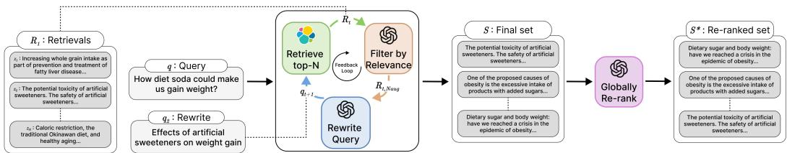

# GAR-MEETS-RAG PARADIGM FOR ZERO-SHOT INFORMATION RETRIEVAL

Daman Arora∗, Anush ${ { \bf { K } } { \bf { i n i } } ^ { * } }$ , Sayak Ray Chowdhury, Nagarajan Natarajan, Gaurav Sinha, Amit Sharma Microsoft Research, India {t-damanarora,t-anushkini,t-sayakr,nagarajn,gauravsinha,amshar}@microsoft.com

# ABSTRACT

Given a query and a document corpus, the information retrieval (IR) task is to output a ranked list of relevant documents. Combining large language models (LLMs) with embedding-based retrieval models, recent work shows promising results on the zero-shot retrieval problem, i.e., no access to labeled data from the target domain. Two such popular paradigms are generation-augmented retrieval or GAR (generate additional context for the query and then retrieve), and retrieval-augmented generation or RAG (retrieve relevant documents as context and then generate answers). The success of these paradigms hinges on (i) highrecall retrieval models, which are difficult to obtain in the zero-shot setting, and (ii) high-precision (re-)ranking models which typically need a good initialization. In this work, we propose a novel GAR-meets-RAG recurrence formulation that overcomes the challenges of existing paradigms. Our method iteratively improves retrieval (via GAR) and rewrite (via RAG) stages in the zero-shot setting. A key design principle is that the rewrite-retrieval stages improve the recall of the system and a final re-ranking stage improves the precision.

We conduct extensive experiments on zero-shot passage retrieval benchmarks, BEIR and TREC-DL. Our method establishes a new state-of-the-art in the BEIR benchmark, outperforming previous best results in Recall $@ 1 0 0$ and ${ \mathsf { n D C G @ 1 0 } }$ metrics on 6 out of 8 datasets, with up to $17 \%$ relative gains over the previous best.

# 1 INTRODUCTION

We consider the information retrieval (IR) problem arising in search (Belkin et al., 2003; Ruthven, 2008; Dahiya et al., 2021), recommendations (Su & Khoshgoftaar, 2009; Covington et al., 2016; Vemuri et al., 2023), and open-domain question-answering (Brill et al., 2002; Roberts et al., 2020; Zhu et al., 2021). Given an input query and a possibly large corpus of (text) documents, the goal is to retrieve relevant documents for the query. The retrieval problem is at least as old as Internet search (Pinkerton, 1994; Kobayashi & Takeda, 2000). However, instead of the standard paradigm of training a new model for each retrieval task or domain, lately there has been a lot of attention on zeroshot retrieval (Thakur et al., 2021; Bajaj et al., 2016; Bonifacio et al., 2021). In this setup, there is no access to training data from the target retrieval domain and the model is expected to generalize from its pre-trained data. Progress in zero-shot retrieval can be attributed to rich world knowledge implicit in the pre-trained model parameters of language models such as BERT (Nogueira & Cho, 2019; Yang et al., 2019) and more recently generative models like GPT-3.5 (OpenAI, 2022). In particular, instruction-following abilities of large generative models have been shown to enable state-of-the-art accuracy on zero-shot benchmarks such as BEIR (Thakur et al., 2021) and Mr.TyDi (Zhang et al., 2021).

Algorithms for retrieval typically contribute to one of the following stages in an end-to-end IR pipeline: 1) rewrite, augment the query with auxiliary information; 2) retrieve, fetch list of relevant documents; and 3) re-rank the fetched list. There has been a steady line of research in the last few years that marry the generation capabilities of large language models with embedding-based retrieval models (Guu et al., 2020; Lewis et al., 2020; Singh et al., 2021; Izacard et al., 2022; Wang et al., 2023; Mackie et al., 2023b), and replace one or more of these IR stages with learnable components.

  
Figure 1: Proposed RRR method for zero-shot Information Retrieval. We implement the rewrite, filtering, and re-rank stages (colored boxes) via a pre-trained LLMs (in our evaluations, we use GPT-3.5-Turbo and GPT-4 models). For the retrieval stage, we use BM25. Details in Section 3.2.

Two popular paradigms for information retrieval with language models are retrieval-augmented generation (RAG) and generation-augmented retrieval (GAR).

1. RAG paradigm (Chen et al., 2017; Guu et al., 2020; Lewis et al., 2020; Singh et al., 2021; Izacard et al., 2022) fetches (using a retrieval model) relevant documents from the corpus as context for the language model and then generates an answer for the input query directly using the language model.

2. GAR paradigm (Wang et al., 2023; Mackie et al., 2023b) augments the input query using language models, and then uses a retrieval model to fetch the relevant documents from the corpus.

A key challenge in these paradigms is obtaining a high-quality retrieval model for fetching documents during the first stage and a post-hoc re-ranking model to improve the precision of the final top- $k$ results. Dense retrieval techniques like ANCE (Xiong et al., 2020) (Nogueira & Cho, 2019) and TAS-B (Hofstatter et al. ¨ , 2021) suffer from poor precision, and fine-tuning the models is infeasible in the zero-shot setting. Recent results (Thakur et al., 2021) show, somewhat surprisingly, that off-the-shelf sparse retrieval models like BM25 (Robertson & Zaragoza, 2009) outperform dense counterparts when combined with generative language models. More strikingly, for re-ranking, recent studies by Sun et al. (2023); Qin et al. (2023), show promise for designing effective re-ranking strategies using LLMs like GPT-4 as a black-box. These studies, however, do not consider feedback between the three stages. For example, a good initial ordering of retrieved documents is crucial for the re-ranking to be effective and a good rewrite of the input query can improve the quality of retrieved documents.

In this work, we achieve the best of both the worlds, i.e., of GAR and RAG paradigms. We propose a novel GAR-meets-RAG formulation for zero-shot IR that incorporates a feedback loop of rewrite and retrieval stages. We design a simple and effective approach to IR, called RRR (RewriteRetrieve-Rerank), that leverages pre-trained models to perform document retrieval, refinement, and query rewrite iteratively (Figure 1). The key design principle is that the rewrite-retrieval stages improve the recall of the system and a final re-ranking stage improves the precision. A key technical contribution in this work is a novel prompting strategy for the query rewrite stage which allows the rewriter to be aligned to the type of documents present in the unseen corpus.

Our contributions are summarized below:

(1) We propose a novel GAR-meets-RAG recurrence formulation for the zero-shot IR problem, that uses a RAG model to produce query rewrite, which feeds into a GAR model for retrieval. (2) We design a simple, iterative algorithm for the proposed problem called RRR that maximizes recall via rewrite-retrieve stages and precision via a final re-rank stage. (3) We perform extensive evaluations and comparisons to SOTA techniques on two popular IR benchmarks. We establish new state-of-the-art Recall $@ 1 0 0$ and ${ \mathsf { n D C G G } } \bar { \ @ } 1 0$ metrics on 6 out of 8 datasets in the BEIR benchmark, with up to $17 \%$ relative gains over the previous best.

# 2 BACKGROUND AND NOTATION

Given a query, our task is to retrieve relevant documents from a large corpus, without using any training data specific to the domain. For example, queries can be factual such as “Can antioxidantrich spices counteract the effects of a high-fat meal?” from the NFCorpus dataset or open-ended such as “Should teachers be given tenure?” from the Touche-2020 ´ dataset. The ground-truth relevant documents for these queries are online documents (e.g., scientific journal abstracts, tweets, articles) that contain information pertinent to the query1. To fetch relevant documents for a query, a retrieval model is trained that can optionally be improved using a relevance model or generative model, as described below.

Zero-shot IR Problem: The input to the retrieval system are: (i) a query, denoted by $q \in \mathcal { Q }$ , which is a sequence of tokens, and (ii) corpus of text documents $\mathcal { Z } \ni z$ that are indexed using standard techniques for retrieval (Robertson & Zaragoza, 2009); $| \mathcal { Z } |$ can be in the order of millions. For evaluation, we have access to ground-truth relevance labels of the form $\langle q , S ^ { * } = \{ z _ { j } ^ { * } , r _ { j } ^ { * } \} \rangle$ , where $\lvert S ^ { * } \rvert$ is typically very small (much smaller than $| \mathcal { Z } | )$ . Here, $r _ { j } ^ { * } ~ > ~ 0$ denotes an ordinal relevance score for the pair ${ \underset { - } { q } } , z _ { j } ^ { * }$ . However, in our zero-shot setup, the retrieval system does not have access to the relevance labels from the corpus at any point in time. We seek a model that produces a ranked list of documents $ { \mathcal { S } } = \langle z _ { 1 } , z _ { 2 } , \ldots , z _ { N } \rangle$ for a given input query $q$ such that the retrieval quality (measured as follows) is high.

Metrics: We focus on two metrics standard in information retrieval research (Thakur et al., 2021; Xiong et al., 2020; Sun et al., 2023):   
(1) ${ \mathsf { n D C G @ } } k$ (Jarvelin & Kek ¨ al¨ ainen ¨ , 2002) which is the standard metric of interest for ranking problems. For binary relevance feedback, ${ \mathsf { n D C G @ } } k$ is maximized for a query when (i) the relevant documents in $s$ are ranked above all the irrelevant documents in $s$ , and (ii) $| S \cap S ^ { * } |$ (prop. to Precision $@ k$ ) is maximized.   
(2) Recall $@ k$ which measures the fraction of relevant documents retrieved for the query, i.e., $| S \cap$ $S ^ { * } | / | S ^ { * } |$ .

Retrieval model: A retrieval (or a f etch) model $f : \mathcal { Q }  2 ^ { \mathcal { Z } }$ maps a query to a (small) list of potentially relevant documents. Two popular retrieval models are (i) dense retrieval models that embed queries and documents in a vector space with dimensionality much smaller than the token vocabulary size. The embedding function is typically modeled via deep encoders and learned using relevance labels and a contrastive loss function (Karpukhin et al., 2020; Xiong et al., 2020); (ii) sparse retrieval models, e.g., BM25 (Robertson & Zaragoza, 2009), on the other hand, use a simpler tf-idf (Salton & Buckley, 1988) scheme based on the relative frequency of words occurring in different documents. In either case, the retrieval model $f$ computes dot-product similarity scores between the query and the document embeddings and retrieves the top- $k$ most similar documents.

Generative (language) model: A language (or a generative) model $g$ is a sequence-to-sequence (Transformer-based) model that produces output text (e.g., a query rewrite, a document, or an answer) conditioned on the input text (e.g., a query). In the RAG paradigm (Guu et al., 2020; Yu et al., 2023), $g$ takes a query and retrieved documents (using a retrieval model as above) as input and generates an answer as output. In the GAR paradigm (Nogueira et al., 2019b; Wang et al., 2023), $g$ takes a query as input, and generates additional context such as query expansions, document expansions as long-form text, which is then used as input to the retrieval model.

Relevance model: A relevance model $\sigma : \mathcal { Z } \times \mathcal { Q }  \mathbb { R }$ takes a query, document pair and computes a relevance score. In this work, we use ordinal relevance scores. Relevance models are employed in IR for multiple reasons, including (1) de-noising hard negatives for improved training of retrieval models (Qu et al., 2021) as there can be spurious negatives (irrelevant documents) when sampled from a very large corpus, (2) as a filtering and/or re-ranking mechanism to improve retrieval performance (Nogueira et al., 2019a; Zhou et al., 2022). In the supervised settings, relevance models are trained using bi-encoders or cross-encoders. Recent studies in various domains (Bai et al., 2022; Kocmi & Federmann, 2023; Zhuo, 2023; Liang et al., 2023) show that large language models (as a black-box) can be used to design effective relevance models.

# 3 PROPOSED METHOD: GAR MEETS RAG

In this section, we first introduce a novel formulation for the IR problem, and then present our iterative algorithm for the zero-shot setting that leverages a pipeline of pre-trained language models.

# 3.1 FORMULATION

We formulate the problem of retrieving top- $N$ relevant documents for an input query $q$ as a composition of GAR (i.e., first generate, then retrieve) and RAG (first retrieve, then generate) models. For clarity, we suppress additional arguments that generative and retrieval models typically need (the number of documents to retrieve, prompt construction, etc.) here, and give details in the next subsection.

Consider the GAR paradigm (Nogueira et al., 2019b; Wang et al., 2023; Mackie et al., 2023b) first. Recall that, here, one uses a language model $g$ to generate augmented query context given $q$ , which then becomes the input for the retrieval model $f$ along with, optionally, the original query. We can write the GAR paradigm as the composition $\check { S } \overset { \cdot } { = } f \bigl ( q ; g ( q ) \bigr )$ . The success of GAR paradigm hinges on (i) having a high-quality retrieval model $f$ , and (ii) the quality of the additional context produced by the model $g$ .

Now, consider the RAG paradigm. Recall that, here, one uses the retrieval model $f$ first to fetch potentially relevant documents $s$ ; which then becomes the input to the language model $g$ to produce answer for the query directly. In other words, we can write the RAG paradigm as the composition $\tilde { z } ~ = ~ g \bigl ( q ; f ( q ) \bigr ) ^ { \smash { \mathstrut } }$ ; where tilde on $z$ denotes that it is a generated answer and not a ground-truth document.

We make two simple but key observations: (1) we can use the RAG model as a way to provide the context that is crucial for the GAR model; (2) similarly, we can use the GAR model itself as the retriever model for the RAG model. This motivates us to formulate the retrieval problem as the following GAR-meets-RAG recurrence:

$$
\begin{array} { r l } & { q _ { 1 } = q , \ S _ { 0 } = \{ \} , } \\ & { \qquad \quad \mathcal { S } _ { t } = S _ { t - 1 } \oplus f ( q _ { t } ) , } \\ & { \qquad q _ { t + 1 } : = \tilde { z } _ { t + 1 } = g \big ( \{ q _ { t - i } ; f ( q _ { t - i } ) \} _ { i = 0 } ^ { t - 1 } \big ) , } \end{array}
$$

where $\oplus$ denotes a suitable list merge operator (to be defined shortly) that ensures that the output documents $S _ { \infty }$ are sorted (we discuss the termination criteria in Section 3.2). Recall (from Section 2) that $f$ returns a list of documents sorted by the retrieval scores (e.g., dot-product similarity between query and document embeddings).

A few remarks are in order: (a) we use the RAG model, i.e., (2) above, to generate a query rewrite or a reformulation $q _ { t + 1 } \in \mathcal { Q }$ as the output $\tilde { z } _ { t + 1 }$ . Using query rewrites for search and information retrieval is a popular technique (Abdul-Jaleel et al., 2004; Wang et al., 2023; Mackie et al., 2023a). The novelty in this formulation is that we are employing a RAG model to produce the rewrite; (b) we use the query rewrite as the input for the retrieval model in the spirit of GAR paradigm in (1); (c) we can adapt and improve the generation quality and the retrieval results via the feedback loop implicit in the recurrence.

Challenges: The recurrence formulation as stated presents multiple design challenges.

Firstly, the right way to define $\oplus$ for merging lists in (1) at each iteration is unclear. An immediate idea is to use similarity scores of $f$ itself to rank and merge the lists. But, this is problematic as the scores are not calibrated across queries, i.e., the scores of $( q , \cdot )$ and $( q ^ { \prime } , \cdot )$ , for queries $q \neq q ^ { \prime }$ , are not comparable. Calibrating the scores needs access to validation data from the target domain, which we lack in the zero-shot setting.

Secondly, since we want the retrieval system to output top- $N$ relevant documents to the query, we have the constraint $| S _ { \infty } | = N$ . So, we need to appropriately control the size of $| S _ { t } |$ in (1), while also trying to maximize the performance metrics of interest (stated in Section 2).

Finally, a poor query rewrite in one iteration could corrupt the subsequent retrievals, which could in turn derail the subsequent query rewrite, and so on. Thus, we need to ensure the formulation is less brittle.

We solve the above challenges via introducing a relevance model $\sigma$ (discussed in Section 2). (i) We define $\oplus$ as the merge operation using the scores of the documents for the original input query $\sigma ( \boldsymbol q , \cdot )$ , and let $\Pi _ { \sigma ( q , \cdot ) }$ denote the ranking induced by the corresponding scores (we empirically validate this design choice in Section 5).

(ii) We also use $\sigma ( \boldsymbol q , \cdot )$ to filter poor quality retrievals in recurrence (1). Together with (i), it helps ensure that the intermediate retrievals $S _ { t }$ are also highly relevant to the original query which in turn helps maximize the recall metric, subject to $| S _ { \infty } | = N$ constraint.

(iii) To ensure subsequent rewrites do not deviate too much from the original intent of the query $q$ , and to make the formulation less brittle, we include only a top few (a configurable number) highly relevant retrievals of $f$ , denoted by $f _ { \mathrm { t r i m } }$ in (2).

The modified recurrence is given by:

$$
\begin{array} { r } { \begin{array} { r l } { q _ { 1 } = q , \ S _ { 0 } = \{ \} , } \\ { \qquad \ S _ { t } = S _ { t - 1 } \oplus \Pi _ { \sigma ( q , \cdot ) } \bigl ( f ( q _ { t } ) \bigr ) , } \\ { q _ { t + 1 } : = \tilde { z } _ { t + 1 } = g \bigl ( \bigl \{ q _ { t - i } ; f _ { \mathrm { t r i m } } \bigl ( q _ { t - i } \bigr ) \bigr \} _ { i = 0 } ^ { t - 1 } \bigr ) . } \end{array} } \end{array}
$$

Next, we give a formal algorithm, discuss details of design choices and implementation.

# 3.2 ALGORITHM: RRR

# Algorithm 1 RRR: Rewrite, Retrieve, Re-rank

1: Input: query $q$ , corpus $\mathcal { Z }$ , rewriter $g$ , retriever $f$ , relevance model $\sigma$ , relevance threshold $\tau$ , re-ranker $h$ ,   
#docs to retrieve $N$ , #retrievals to augment in the rewriter prompt $N _ { \mathrm { a u g } }$ , max #rewrites $N _ { \mathrm { r w } }$   
2: Initialize: $q _ { 1 }  q$ , output document set $\mathcal { S }  \{ \}$ , rewrite prompt $\pi _ { 0 } ( q )$   
3: for $t \gets 1 , \ldots , N _ { \mathrm { r w } }$ do   
$\textcircled{1}$ Retrieve and filter   
4: Retrieve $N$ documents from $\mathcal { Z }$ , ${ \mathcal { R } } _ { t } \gets f ( q _ { t } )$ , for query $q _ { t }$ using the retrieval model $f$   
5: Obtain relevance scores $\sigma ( z , q ) , z \in \mathcal { R } _ { t }$ from the relevance model $\sigma$   
6: Get filtered document set $\mathcal { F } _ { t }  \{ z \in \mathcal { R } _ { t } \mid \sigma ( q , z ) > \tau \}$   
7: Add to $s$ , i.e., $S \gets S \cup \mathcal { F } _ { t }$   
8: if $| { \cal S } | \geqslant N$ then   
9: break   
10: end if   
$\textcircled{2}$ Rewrite   
11: Take top $N _ { \mathrm { a u g } }$ documents $\mathcal { R } _ { t , N _ { \mathrm { a u g } } }$ from $\mathcal { R } _ { t }$ (using retriever scores in Step 4)   
12: Add $q _ { t }$ and $\mathcal { R } _ { t , N _ { \mathrm { a u g } } }$ to the prompt, i.e., $\pi _ { t } \gets \mathrm { A P P E N D } \big ( \pi _ { t - 1 } , q _ { t } , \mathcal { R } _ { t , N _ { \mathrm { a u g } } } \big )$   
13: Generate new rewrite $q _ { t + 1 } = g ( q _ { t } ; \pi _ { t } )$   
14: end for   
15: Order documents by relevance scores, i.e., $S \gets \Pi _ { \sigma ( q , \cdot ) } ( S )$   
$\textcircled{3}$ Re-rank using LLM-based $h$   
16: return $S ^ { * } = h ( S )$

We give the procedure for implementing the recurrences (3) in Algorithm 1 titled RRR. Besides a query rewriter model $g$ , a retrieval model $f$ , a relevance model $\sigma$ , that are needed in the recurrences, the algorithm also uses a re-ranker model $h$ at the end (discussed shortly). In our evaluations, we use black-box LLMs for $g , \sigma$ , and $h$ (all with zero-shot prompts); and the standard sparse retrieval model BM25 for $f$ . Prompt templates are provided in Appendix A.

The algorithm takes as input (i) total number of output documents $N$ , (ii) maximum number of query rewrites (iii) maximum number of retrievals $N _ { \mathrm { a u g } }$ to augment the prompt of rewriter $g$ with (i.e., to implement $f _ { \mathrm { t r i m } }$ in (3)), and (iv) a threshold $\tau$ for the scores $\sigma ( \boldsymbol q , \cdot )$ , to remove spurious documents (false positives) at each iteration.

The algorithm starts with an initial prompt $\pi _ { 0 }$ for the rewriter LLM $g$ (given in the Appendix) and empty set $s$ of retrieved documents. At iteration $t$ :

Stage 1. Retrieve and filter: First, we retrieve a list of $N$ documents $\mathcal { R } _ { t }$ for the query $q _ { t }$ using the retrieval model $f$ . Consider the input query “How diet soda could make us gain weight?” shown in Figure 1 at the first iteration: From $\mathcal { R } _ { 1 }$ shown in Figure 1, we observe that while the top document is likely relevant, there are some spurious candidates such as “Increasing whole grain intake as part of prevention and treatment of fatty liver disease...” and “Caloric restriction, the traditional Okinawan diet, and healthy aging...”. To prune such false positives, we obtain relevance scores $\sigma ( q , z )$ for each retrieved document $z \in \mathcal { R } _ { t }$ using the relevance model $\sigma$ (the prompt template for the $\sigma$ LLM is provided in Appendix A); the higher the score, the more relevant the document is to the original query $q$ . We add the documents in $\mathcal { R } _ { t }$ that clear the relevance threshold $\tau$ , denoted by $\mathcal { F } _ { t }$ , to the output set $s$ .

Stage 2. Rewrite: We take the top- $N _ { \mathrm { a u g } }$ documents from $\mathcal { R } _ { t }$ , denoted by $\mathcal { R } _ { t , N _ { \mathrm { a u g } } }$ . This list, together with the (rewritten) query $q _ { t }$ , is appended to the prompt of the rewrite model $g$ (see Appendix for the APPEND implementation) to derive $\pi _ { t }$ and generate a new query rewrite $q _ { t + 1 }$ . This trimmed set $\mathcal { R } _ { t , N _ { \mathrm { a u g } } }$ also helps work with limited prompt sizes of LLMs (e.g., GPT-3.5-turbo has a limit of 4097 tokens) when the documents are large. In Figure 1, given query $q _ { 1 }$ and $\mathcal { R } _ { 1 , N _ { \mathrm { a u g } } }$ , the rewriter $g$ generates a plausible rewrite $q _ { 2 }$ “Effects of artificial sweeteners on weight gain”.

We iterate the two stages until either $| S |$ exceeds $N$ or the number of rewrites exceeds $N _ { \mathrm { r w } }$ . We show empirically that the resulting $s$ achieves high recall.

Stage 3. Re-rank: In the final stage, we first rank the documents $s$ by their relevance scores w.r.t. input query $q$ , $\sigma ( q , z ) , z \in { \mathcal { S } }$ . This becomes the initial ordering for the LLM-based re-ranker model $h$ , which we implement using the technique of Sun et al. (2023). The algorithm outputs the re-ranked list $S ^ { * } = h ( S )$ for the input query $q$ .

Table 1: Retrieval performance $( \mathsf { n D C G @ 1 0 } )$ on BEIR datasets. Dataset-wise best score is marked in bold and the second best is underlined.   

<table><tr><td>Method</td><td>TREC-COVID</td><td>NFCorpus</td><td>Signal-1M (RT)</td><td>TREC-NEWS</td><td>Robust04</td><td>Touché-2020</td><td>DBPedia</td><td>SciFact</td></tr><tr><td>BM25</td><td>59.5</td><td>30.8</td><td>33.0</td><td>39.5</td><td>40.7</td><td>44.2</td><td>31.8</td><td>67.9</td></tr><tr><td>DPR</td><td>33.2</td><td>18.9</td><td>15.5</td><td>16.1</td><td>25.2</td><td>13.1</td><td>26.3</td><td>31.8</td></tr><tr><td>ANCE</td><td>65.4</td><td>23.7</td><td>24.9</td><td>38.2</td><td>39.2</td><td>24.0</td><td>28.1</td><td>50.7</td></tr><tr><td>TAS-B</td><td>48.1</td><td>31.9</td><td>28.9</td><td>37.7</td><td>42.7</td><td>16.2</td><td>38.4</td><td>64.3</td></tr><tr><td>monoT5 (3B)</td><td>80.7</td><td>39.0</td><td>32.6</td><td>48.5</td><td>56.7</td><td>32.4</td><td>44.4</td><td>76.6</td></tr><tr><td>Promptagator ++(few-shot)</td><td>76.2</td><td>37.0</td><td></td><td></td><td>-</td><td>38.1</td><td>43.4</td><td>73.1</td></tr><tr><td>RankGPT</td><td>85.5</td><td>38.5</td><td>34.4</td><td>52.9</td><td>57.6</td><td>38.6</td><td>47.1</td><td>75.0</td></tr><tr><td>RRR (this work)</td><td>86.4</td><td>39.9</td><td>29.8</td><td>53.6</td><td>67.4</td><td>29.8</td><td>51.0</td><td>77.2</td></tr></table>

Table 2: Retrieval performance (Recall $@ 1 0 0 )$ on BEIR datasets. For TREC-COVID, capped Recall $@ 1 0 0$ is used. Dataset-wise best score is marked in bold and the second best is underlined.   

<table><tr><td>Method</td><td>TREC-COVID</td><td>NFCorpus</td><td>Signal-1M (RT)</td><td>TREC-NEWS</td><td>Robust04</td><td>Touché-2020</td><td>DBPedia</td><td>SciFact</td></tr><tr><td>BM25</td><td>49.8</td><td>24.6</td><td>37.0</td><td>44.7</td><td>37.5</td><td>58.2</td><td>46.8</td><td>92.5</td></tr><tr><td>DPR</td><td>21.2</td><td>20.8</td><td>16.2</td><td>21.5</td><td>21.1</td><td>30.1</td><td>34.9</td><td>72.7</td></tr><tr><td>ANCE</td><td>45.7</td><td>23.2</td><td>23.9</td><td>39.8</td><td>27.4</td><td>45.8</td><td>31.9</td><td>81.6</td></tr><tr><td>TAS-B</td><td>38.7</td><td>28.0</td><td>30.4</td><td>41.8</td><td>33.1</td><td>43.1</td><td>49.9</td><td>89.1</td></tr><tr><td>monoT5 (3B)</td><td>49.8</td><td>24.6</td><td>37.0</td><td>44.7</td><td>37.5</td><td>58.2</td><td>46.8</td><td>92.5</td></tr><tr><td>RankGPT</td><td>49.8</td><td>24.6</td><td>37.0</td><td>44.7</td><td>37.5</td><td>58.2</td><td>46.8</td><td>92.5</td></tr><tr><td>RRR (this work)</td><td>54.8</td><td>32.4</td><td>32.4</td><td>51.6</td><td>45.4</td><td>52.2</td><td>55.0</td><td>94.3</td></tr></table>

# 4 EVALUATION SETUP

In this section, we give details of datasets, baselines, metrics, and implemention, before presenting evaluation results in the subsequent section.

Table 3: Performance $( { \mathsf { n D C G @ } } k )$ on the TREC-DL20 dataset. Best score is marked in bold and the second best is underlined.   

<table><tr><td>Method</td><td>nDCG @1</td><td>nDCG @5</td><td>nDCG @10</td></tr><tr><td>BM25</td><td>57.7</td><td>50.7</td><td>48.0</td></tr><tr><td>monoBERT (340M)</td><td>78.7</td><td>70.7</td><td>67.3</td></tr><tr><td>monoT5 (220M)</td><td>77.5</td><td>69.4</td><td>67.0</td></tr><tr><td>monoT5 (3B)</td><td>80.3</td><td>72.3</td><td>68.9</td></tr><tr><td>UPR</td><td>63.2</td><td>59.4</td><td>56.0</td></tr><tr><td>RankGPT</td><td>78.4</td><td>74.1</td><td>70.6</td></tr><tr><td>RRR (this work)</td><td>79.6</td><td>76.0</td><td>72.3</td></tr></table>

Table 4: RRR configuration (Temperature ${ = } 0$ for LLMs).   

<table><tr><td>Component</td><td>Model</td><td>Details</td></tr><tr><td>Rewriter g</td><td>GPT-4</td><td>token limit 20</td></tr><tr><td>Retriever f</td><td>BM25</td><td>Lin et al. (2021)</td></tr><tr><td>Relevance σ</td><td>GPT-3.5-Turbo</td><td>score  [ [1, 2, . . .. , 5]</td></tr><tr><td>Re-ranker h</td><td>GPT-3.5-Turbo + GPT-4</td><td>Sun et al. (2023)</td></tr></table>

(A) Datasets and metrics: We present quantitative evaluations of RRR on two standard IR benchmarks: BEIR (Thakur et al. (2021)) and TREC-DL (Craswell et al. (2020a;b)). Due to resource constraints (LLM calls), we perform evaluations on subsets of these benchmarks as listed below (each input query costs approximately 1USD to complete; cost breakdown in Appendix B).

BEIR is a benchmark for comprehensive zero-shot evaluation of models across a diverse spectrum of IR tasks. We take 8 datasets with relatively small test sets (listed in Table 1) out the 18 total available.

TREC-DL is a dedicated deep-learning track within the Text Retrieval Conference (TREC) encompassing document retrieval and passage retrieval tasks. We report results on the passage retrieval dataset TREC-DL20, with 54 queries and $8 . 8 \mathbf { M }$ documents. For hyperparameter tuning, we use the TREC-DL19 dataset with 43 queries; see (D) below.

We report nDCG $@$ 10 and Recall $@$ 100 metrics.

(B) Compared techniques: We compare with several zero-shot IR methods: dense passage retrieval DPR (Karpukhin et al., 2020), ANCE (Xiong et al., 2020), TAS-B (Hofstatter et al. ¨ , 2021), sparse retrieval BM25 (Robertson & Zaragoza, 2009)), document re-ranking monoT5 (Nogueira et al., 2020), RankGPT (Sun et al., 2023), and data generation/augmentation Promptagator (Dai et al., 2022). For all the baselines, we quote results from Thakur et al. (2021) and Sun et al. (2023) computed in identical setting.

(C) Implementation details: We run all our experiments on a single machine with an A-100 GPU, 24 CPU cores and 220 GB of memory. We use GPT-3.5-Turbo (OpenAI (2022)), with a token limit of 4097, and GPT-4 (OpenAI (2023)), with a token limit of 8192.

The configurations for different components of the RRR algorithm are listed in Table 4. For the retriever $f$ , we use the BM25 model from the Pyserini (Lin et al., 2021) package. The re-ranker $h$ follows the two-step process described in the RankGPT paper (Sun et al., 2023): first, re-rank $N$ documents in $s$ (after Step 15 of Algorithm 1) using GPT-3.5-Turbo; then, further re-rank the top 30 documents using GPT-4.

$\mathbf { \eta } ^ { ( \mathbf { D } ) }$ Hyperparameter selection: We perform hyperparameter tuning on the TREC-DL19 dataset. First, we tune the number of rewrites $N _ { \mathrm { r w } }$ and the relevance threshold $\tau$ by optimizing Recall $@ 1 0 0$ . Secondly, to optimize ${ \mathsf { n D C G @ 1 0 } }$ , we tune the sliding window constants $w$ (window size) and $s$ (step size) in the re-ranker $h$ . The best values for these parameters are $N _ { \mathrm { r w } } = 5$ , $\tau = 1$ (i.e., prune the least scoring ones), $w = 1 0$ and $s = 5$ . See Appendix C for details.

# 5 RESULTS

We focus on the following questions in our evaluations:

(1) End-to-end performance: How effective is RRR compared to baseline and SOTA zero-shot IR techniques on the benchmarks introduced in Section 4? (2) Effectiveness of feedback loop: How does RRR perform with more rewrites? (3) Ablative study: How do the design choices in the proposed method impact performance?

# 5.1 END-TO-END PERFORMANCE

We show the performance metrics for the compared methods on the BEIR datasets in Tables 1 and 2. Our method outperforms all the baselines and SOTA zero-shot IR techniques on 6 out of 8 datasets, on both nDCG $@ 1 0$ and Recall $@ 1 0 0$ metrics, achieving up to $17 \%$ relative gain in the nDCG metric over state-of-the-art RankGPT. On the two datasets where RRR is not performing well, the baseline BM25 retrieval model outperforms nearly all of the sophisticated techniques. On the TREC-DL20 dataset, shown in Table 3, we outperform all the methods on ${ \mathsf { n D C G @ 1 0 } }$ and ${ \mathsf { n D C G } } { \ @ } { \ @ } 5$ metrics, while being competitive on ${ \mathsf { n D C G } } \mathbb { Q } \mathbb { Q } 1$ .

Table 5: Effect of feedback from $f$ to $g$ in RRR. Scores reported are Recall@100.   

<table><tr><td>Dataset</td><td>With feedback</td><td>Without feedback</td></tr><tr><td>TREC-DL19</td><td>54.0</td><td>51.1</td></tr><tr><td>TREC-DL20</td><td>58.6</td><td>56.8</td></tr><tr><td>TREC-COVID</td><td>13.0</td><td>13.2</td></tr></table>

These results demonstrate the effectiveness of our method in the zero-shot setting; RRR outperforming methods that also utilize powerful LLMs for IR is particularly significant. For instance, Promptagator utilizes LLMs to generate queries from a corpus, and subsequently trains a dense retriever. Similarly, monoT5 and RankGPT utilize LLMs (like GPT-4 and GPT-3.5-Turbo) for re-ranking results.

# 5.2 EFFECTIVENESS OF FEEDBACK LOOP

We wish to evaluate whether our method benefits from (a) retriever feedback (in recurrence Eqn. (3)), and (b) multiple feedback cycles. For this, we conduct experiments on TREC-DL20, TRECDL19, and TREC-COVID.

To address (a), we re-run experiments while omitting the addition of retrieved results to the re-writer prompt $\pi _ { t }$ (in Step 12 of Algorithm 1). This effectively cuts off feedback from the retriever $f$ to the re-writer $g$ . The results presented in Table 5 illustrate that feedback is pivotal in order to improve recall, significantly so in TREC-DL19 and TREC-DL20 datasets.

For (b), we vary the maximum number of rewrites $N _ { \mathrm { r w } } = \{ 1 , 3 , 5 \}$ allowed for the rewriter $g$ . The results in Table 6 show a discernible trend: Recal $@ 1 0 0$ improves as the number of rewrites increases.

# 5.3 ABLATIVE STUDY

Here, we study the effects of design choices in RRR (discussed in Sections 3.1 and 3.2).

(i) Is the final re-ranker h necessary? Can we instead only rely on the relevance scores obtained using $\sigma$ to re-rank $\mathbf { \boldsymbol { S } } \mathrm { ? }$ Our results in Table 7 show that the final re-ranker $h$ is critical for improving ${ \mathsf { n D C G @ 1 0 } }$ . We hypothesize that this is because the discretized scores given by $\sigma$ are insufficient for fine-grained ranking.

(ii) Should the relevance of a document be assessed in relation to the original query $q _ { 1 }$ (as in Algorithm 1) or the rewrite $q _ { t }$ from which the document was retrieved? Our results, as presented in Table 8, indicate that assessing relevance should be based on the original query instead of the rewrite.

(iii) What is better feedback for the re-writer $g$ (in Step 11 of Algorithm 1)? We compare the use of top results based on retriever $f$ (BM25) scores with those based on relevance $( \sigma )$ scores. Our findings in Table 9 suggest a slight advantage in using relevance scores to generate rewrites. However, because we use TREC-DL19 for all design choices and hyperparameter tuning, we choose retriever-based feedback for our experiments.

# 6 RELATED WORK

Language models have found increasing applications in Information Retrieval (IR) over the past few years. In this section, we highlight recent advances that leverage the in-depth world knowledge of LLMs (implicit in their pre-trained parameters) with retrieval components (both non-parametric and parametric) that have access to external memory, at different stages of IR.

Table 6: Recall $@ 1 0 0$ on TREC-DL20, TREC-DL19 and TREC-COVID with varying number of rewrites $N _ { \mathrm { r w } }$ .   

<table><tr><td rowspan="2">Dataset</td><td colspan="3">Nrw</td></tr><tr><td>1</td><td>3</td><td>5</td></tr><tr><td>TREC-DL 19</td><td>49.7</td><td>52.6</td><td>54.0</td></tr><tr><td>TREC-DL 20</td><td>55.1</td><td>57.9</td><td>58.6</td></tr><tr><td>TREC-COVID</td><td>12.5</td><td>13.0</td><td>13.0</td></tr></table>

Table 7: Effect of re-ranking (in Step 6 of Algorithm 1). Scores reported are nDCG $@$ 10.   

<table><tr><td>Dataset</td><td>With reranking</td><td>Without reranking</td></tr><tr><td>TREC-DL19</td><td>73.9</td><td>51.3</td></tr><tr><td>TREC-DL20</td><td>72.3</td><td>42.0</td></tr><tr><td>TREC-COVID</td><td>86.4</td><td>66.8</td></tr></table>

# 6.1 RETRIEVAL AUGMENTED GENERATION (RAG)

RAG paradigm has been applied extensively in open-domain Question-Answering. Brill et al. (2002) use an N-gram tiling technique as $g$ ; Chen et al. (2017) use an answer span prediction model as $g$ , while the retrieval components in both these cases are black-box. On the other hand, recent systems employ learnable retrieval components: Lee et al. (2019) use BERT-style encoders for both $f$ and $g$ and learn them jointly; Guu et al. (2020); Lewis et al. (2020); Singh et al. (2021); Izacard et al. (2022) extend it to jointly pre-training or fine-tuning LMs as $g$ and Transformer-based encoders as $f$ . Most recently, Yu et al. (2023) eschew the retriever component altogether, and propose a generatethen-read paradigm to first synthesize context (i.e., relevant documents) instead of retrieving from a corpus, and then generate the final answer based on the input query and the context. RAG has also been applied in code generation, e.g., Parvez et al. (2021).

In contrast to most of the aforementioned approaches, we work at the intersection of the (a) zero-shot setting with no access to training data from the test domain; and (b) top- $k$ retrieval setting where the performance is measured via ranking metrics, instead of exact-match or Rouge-L based metrics typically used with generated answers in the RAG paradigm.

# 6.2 GENERATION AUGMENTED RETRIEVAL (GAR)

Query expansion techniques generate additional context or pseudo-documents using $g$ (Wang et al., 2023; Jagerman et al., 2023; Shen et al., 2023; Feng et al., 2023). Query rewriting or reformulation techniques, that we incorporate in RRR, attempt to generate alternate versions of query $q$ using different prompting strategies for $g$ (Gao et al., 2022; Mao et al., 2023). Nogueira et al. (2019b) expand documents instead with queries relevant to $q$ . Generative-relevance feedback techniques (Mackie et al., 2023b;a;c) use $g$ to generate long-form text as first-pass retrieved documents $z$ , to then seed the second-pass retrieval with $q$ and $z$ . Related line of work is learning improved dense representations for queries using pseudo-relevance feedback (Yu et al., 2021; Wang et al., 2021).

Unlike aforementioned approaches, RRR iteratively improves the rewriting and the retrieving stages.

# 6.3 LANGUAGE MODELS FOR RE-RANKING

A recent line of work leverages pre-trained LMs to re-rank the outputs of baseline retrievers using (a) novel prompting strategies that elicit pairwise preferences (Qin et al., 2023), or (b) slidingwindow techniques (Sun et al., 2023) that re-rank only a small window of retrieved documents at a time, bubbling up the entire retrieved set gradually, or (c) the likelihood of reconstructing the query conditioned on the retrieved documents (Sachan et al., 2022). However, these approaches rely on a good initial ordering of the retrieved documents to be successful. Our empirical evaluations show that our algorithm ensures recall as well as a good initial ordering of documents.

Table 8: Relevance to original query $q$ (as in Algorithm 1) or rewrite $q _ { t }$ ? Scores reported are Recall $@ 1 0 0$ .   

<table><tr><td>Dataset</td><td>Relevance to q1 = q</td><td>Relevance to qt</td></tr><tr><td>TREC-DL19</td><td>54.0</td><td>53.6</td></tr><tr><td>TREC-DL20</td><td>58.6</td><td>58.0</td></tr><tr><td>TREC-COVID</td><td>13.0</td><td>12.8</td></tr></table>

Table 9: Feedback from retriever (BM25) or relevance $( \sigma )$ model? Scores reported are Recall $@ 1 0 0$   

<table><tr><td>Dataset</td><td>Feedback using BM25</td><td>Feedback using σ</td></tr><tr><td>TREC-DL19</td><td>54.0</td><td>53.1</td></tr><tr><td>TREC-DL20</td><td>58.6</td><td>59.4</td></tr><tr><td>TREC-COVID</td><td>13.0</td><td>13.1</td></tr></table>

# 6.4 ZERO-SHOT IR

Improving retrieval performance in the zero-shot setting is an active area of research (Srinivasan et al., 2022; Lin et al., 2023). Bonifacio et al. (2022); Jeronymo et al. (2023); Dai et al. (2022) use LLMs with a few-shot prompt to synthesize relevant queries or documents, and use the resulting synthentic paired data to train task-specific retrievers. Sachan et al. (2023) first retrieve an initial set of documents $\{ z \}$ given a query $q$ , induce soft-labels on $\langle q , \{ z \} \rangle$ via trying to reconstruct $q$ given $\{ z \}$ , and subsequently improve the retriever using the soft-labeled data.

# 7 CONCLUDING REMARKS

We propose a novel zero-shot recurrence formulation for IR that iteratively improves RAG and GAR models, the two increasingly-adopted paradigms for IR with language models. We devise a threestage IR pipeline that improves recall in the first two (rewrite-retrieve) stages and precision in the final (re-ranking) stage. Our method RRR achieves state-of-the-art retrieval performance on several IR datasets.

Limitations and Future Work. Our evaluations do not control for the model sizes of the compared methods: some baselines use simple models, while some, including ours, use powerful LLMs. The trade-off between the gains in retrieval performance and the inference cost depends on the application scenario. However, the formulation developed in Section 3.1 is fairly general, and we believe we can learn much smaller models via distillation techniques for both relevance and rewrite stages. An open question is designing compact yet effective models for re-ranking in the zero-shot setting, that improve over and beyond what retrieval/relevance models can achieve.

# REFERENCES

Nasreen Abdul-Jaleel, James Allan, W Bruce Croft, Fernando Diaz, Leah Larkey, Xiaoyan Li, Mark D Smucker, and Courtney Wade. Umass at trec 2004: Novelty and hard. Computer Science Department Faculty Publication Series, pp. 189, 2004.   
Akari Asai, Timo Schick, Patrick Lewis, Xilun Chen, Gautier Izacard, Sebastian Riedel, Hannaneh Hajishirzi, and Wen tau Yih. Task-aware retrieval with instructions, 2022. URL https:// arxiv.org/abs/2211.09260.   
Yuntao Bai, Saurav Kadavath, Sandipan Kundu, Amanda Askell, Jackson Kernion, Andy Jones, Anna Chen, Anna Goldie, Azalia Mirhoseini, Cameron McKinnon, et al. Constitutional ai: Harmlessness from ai feedback. arXiv preprint arXiv:2212.08073, 2022. URL https: //arxiv.org/abs/2212.08073.   
Payal Bajaj, Daniel Campos, Nick Craswell, Li Deng, Jianfeng Gao, Xiaodong Liu, Rangan Majumder, Andrew McNamara, Bhaskar Mitra, Tri Nguyen, et al. Ms marco: A human gener

ated machine reading comprehension dataset. arXiv preprint arXiv:1611.09268, 2016. URL https://arxiv.org/abs/1611.09268.

N. J. Belkin, D. Kelly, G. Kim, J.-Y. Kim, H.-J. Lee, G. Muresan, M.-C. Tang, X.-J. Yuan, and C. Cool. Query length in interactive information retrieval. In Proceedings of the 26th Annual International ACM SIGIR Conference on Research and Development in Informaion Retrieval, SIGIR ’03, pp. 205–212, New York, NY, USA, 2003. Association for Computing Machinery. ISBN 1581136463. doi: 10.1145/860435.860474. URL https://doi.org/10.1145/860435. 860474.

Luiz Bonifacio, Hugo Abonizio, Marzieh Fadaee, and Rodrigo Nogueira. InPars: Unsupervised dataset generation for information retrieval. In Proceedings of the 45th International ACM SIGIR Conference on Research and Development in Information Retrieval, SIGIR ’22, pp. 2387–2392, New York, NY, USA, 2022. Association for Computing Machinery. ISBN 9781450387323. doi: 10.1145/3477495.3531863. URL https://doi.org/10.1145/3477495.3531863.

Luiz Henrique Bonifacio, Israel Campiotti, Roberto de Alencar Lotufo, and Rodrigo Frassetto Nogueira. mmarco: A multilingual version of MS MARCO passage ranking dataset. CoRR, abs/2108.13897, 2021. URL https://arxiv.org/abs/2108.13897.

Eric Brill, Susan Dumais, and Michele Banko. An analysis of the AskMSR question-answering system. In Proceedings of the 2002 Conference on Empirical Methods in Natural Language Processing (EMNLP 2002), pp. 257–264. Association for Computational Linguistics, July 2002. doi: 10.3115/1118693.1118726. URL https://aclanthology.org/W02-1033.

Danqi Chen, Adam Fisch, Jason Weston, and Antoine Bordes. Reading wikipedia to answer opendomain questions. In 55th Annual Meeting of the Association for Computational Linguistics, ACL 2017, pp. 1870–1879. Association for Computational Linguistics (ACL), 2017.

David R. Cheriton. From doc2query to doctttttquery. 2019. URL https://api. semanticscholar.org/CorpusID:208612557.

Paul Covington, Jay Adams, and Emre Sargin. Deep neural networks for youtube recommendations. In Proceedings of the 10th ACM Conference on Recommender Systems, RecSys ’16, pp. 191–198, New York, NY, USA, 2016. Association for Computing Machinery. ISBN 9781450340359. doi: 10.1145/2959100.2959190. URL https://doi.org/10.1145/2959100.2959190.

Nick Craswell, Bhaskar Mitra, Emine Yilmaz, Daniel Campos, and Ellen M. Voorhees. Overview of the TREC 2019 deep learning track. CoRR, abs/2003.07820, 2020a. URL https://arxiv. org/abs/2003.07820.

Nick Craswell, Bhaskar Mitra, Emine Yilmaz, Daniel Campos, and Ellen M. Voorhees. Overview of the TREC 2019 deep learning track. CoRR, abs/2003.07820, 2020b. URL https://arxiv. org/abs/2003.07820.

Kunal Dahiya, Deepak Saini, Anshul Mittal, Ankush Shaw, Kushal Dave, Akshay Soni, Himanshu Jain, Sumeet Agarwal, and Manik Varma. DeepXML: A deep extreme multi-label learning framework applied to short text documents. In Proceedings of the 14th ACM International Conference on Web Search and Data Mining, WSDM ’21, pp. 31–39, New York, NY, USA, 2021. Association for Computing Machinery. ISBN 9781450382977. doi: 10.1145/3437963.3441810. URL https://doi.org/10.1145/3437963.3441810.

Zhuyun Dai, Vincent Y. Zhao, Ji Ma, Yi Luan, Jianmo Ni, Jing Lu, Anton Bakalov, Kelvin Guu, Keith B. Hall, and Ming-Wei Chang. Promptagator: Few-shot dense retrieval from 8 examples, 2022. URL https://arxiv.org/abs/2209.11755.

Jiazhan Feng, Chongyang Tao, Xiubo Geng, Tao Shen, Can Xu, Guodong Long, Dongyan Zhao, and Daxin Jiang. Knowledge refinement via interaction between search engines and large language models, 2023. URL https://arxiv.org/abs/2305.07402.

Luyu Gao, Xueguang Ma, Jimmy Lin, and Jamie Callan. Precise zero-shot dense retrieval without relevance labels, 2022. URL https://arxiv.org/abs/2212.10496.

Kelvin Guu, Kenton Lee, Zora Tung, Panupong Pasupat, and Mingwei Chang. Retrieval augmented language model pre-training. In International conference on machine learning, pp. 3929–3938. PMLR, 2020.

Sebastian Hofstatter, Sheng-Chieh Lin, Jheng-Hong Yang, Jimmy Lin, and Allan Hanbury. Effi- ¨ ciently teaching an effective dense retriever with balanced topic aware sampling, 2021. URL https://arxiv.org/abs/2104.06967.

Gautier Izacard, Patrick Lewis, Maria Lomeli, Lucas Hosseini, Fabio Petroni, Timo Schick, Jane Dwivedi-Yu, Armand Joulin, Sebastian Riedel, and Edouard Grave. Few-shot learning with retrieval augmented language models. arXiv preprint arXiv:2208.03299, 2022. URL https: //arxiv.org/abs/2208.03299.

Rolf Jagerman, Honglei Zhuang, Zhen Qin, Xuanhui Wang, and Michael Bendersky. Query expansion by prompting large language models, 2023. URL https://arxiv.org/abs/2305. 03653.

Kalervo Jarvelin and Jaana Kek ¨ al¨ ainen. Cumulated gain-based evaluation of IR techniques. ¨ ACM Transactions on Information Systems (TOIS), 20(4):422–446, 2002.

Vitor Jeronymo, Luiz Bonifacio, Hugo Abonizio, Marzieh Fadaee, Roberto Lotufo, Jakub Zavrel, and Rodrigo Nogueira. InPars-v2: Large language models as efficient dataset generators for information retrieval, 2023. URL https://arxiv.org/abs/2301.01820.

Vladimir Karpukhin, Barlas Oguz, Sewon Min, Patrick Lewis, Ledell Wu, Sergey Edunov, Danqi Chen, and Wen-tau Yih. Dense passage retrieval for open-domain question answering. In Proceedings of the 2020 Conference on Empirical Methods in Natural Language Processing (EMNLP), pp. 6769–6781, Online, November 2020. Association for Computational Linguistics. doi: 10.18653/v1/2020.emnlp-main.550. URL https://aclanthology.org/2020. emnlp-main.550.

Omar Khattab and Matei Zaharia. Colbert: Efficient and effective passage search via contextualized late interaction over bert, 2020. URL https://arxiv.org/abs/2004.12832.

Mei Kobayashi and Koichi Takeda. Information retrieval on the web. ACM computing surveys (CSUR), 32(2):144–173, 2000.

Tom Kocmi and Christian Federmann. Large language models are state-of-the-art evaluators of translation quality. arXiv preprint arXiv:2302.14520, 2023. URL https://arxiv.org/ abs/2302.14520.

Kenton Lee, Ming-Wei Chang, and Kristina Toutanova. Latent retrieval for weakly supervised open domain question answering. In Proceedings of the 57th Annual Meeting of the Association for Computational Linguistics, pp. 6086–6096, Florence, Italy, July 2019. Association for Computational Linguistics. doi: 10.18653/v1/P19-1612. URL https://aclanthology.org/ P19-1612.

Patrick Lewis, Ethan Perez, Aleksandra Piktus, Fabio Petroni, Vladimir Karpukhin, Naman Goyal, Heinrich Kuttler, Mike Lewis, Wen-tau Yih, Tim Rockt ¨ aschel, Sebastian Riedel, and Douwe ¨ Kiela. Retrieval-augmented generation for knowledge-intensive nlp tasks. In H. Larochelle, M. Ranzato, R. Hadsell, M.F. Balcan, and H. Lin (eds.), Advances in Neural Information Processing Systems, volume 33, pp. 9459–9474. Curran Associates, Inc., 2020.

Percy Liang, Rishi Bommasani, Tony Lee, Dimitris Tsipras, Dilara Soylu, Michihiro Yasunaga, Yian Zhang, Deepak Narayanan, Yuhuai Wu, Ananya Kumar, Benjamin Newman, Binhang Yuan, Bobby Yan, Ce Zhang, Christian Cosgrove, Christopher D. Manning, Christopher Re, Diana ´ Acosta-Navas, Drew A. Hudson, Eric Zelikman, Esin Durmus, Faisal Ladhak, Frieda Rong, Hongyu Ren, Huaxiu Yao, Jue Wang, Keshav Santhanam, Laurel Orr, Lucia Zheng, Mert Yuksekgonul, Mirac Suzgun, Nathan Kim, Neel Guha, Niladri Chatterji, Omar Khattab, Peter Henderson, Qian Huang, Ryan Chi, Sang Michael Xie, Shibani Santurkar, Surya Ganguli, Tatsunori Hashimoto, Thomas Icard, Tianyi Zhang, Vishrav Chaudhary, William Wang, Xuechen Li, Yifan Mai, Yuhui Zhang, and Yuta Koreeda. Holistic evaluation of language models, 2023. URL https://arxiv.org/abs/2211.09110.

Jimmy Lin, Xueguang Ma, Sheng-Chieh Lin, Jheng-Hong Yang, Ronak Pradeep, and Rodrigo Nogueira. Pyserini: A Python toolkit for reproducible information retrieval research with sparse and dense representations. In Proceedings of the 44th Annual International ACM SIGIR Conference on Research and Development in Information Retrieval (SIGIR 2021), pp. 2356–2362, 2021.

Sheng-Chieh Lin, Akari Asai, Minghan Li, Barlas Oguz, Jimmy Lin, Yashar Mehdad, Wen tau Yih, and Xilun Chen. How to train your dragon: Diverse augmentation towards generalizable dense retrieval, 2023. URL https://arxiv.org/abs/2302.07452.

Iain Mackie, Shubham Chatterjee, and Jeffrey Dalton. Generative and pseudo-relevant feedback for sparse, dense and learned sparse retrieval, 2023a. URL https://arxiv.org/abs/2305. 07477.

Iain Mackie, Shubham Chatterjee, and Jeffrey Dalton. Generative relevance feedback with large language models. In Proceedings of the 46th International ACM SIGIR Conference on Research and Development in Information Retrieval, SIGIR ’23, pp. 2026–2031, New York, NY, USA, 2023b. Association for Computing Machinery. ISBN 9781450394086. doi: 10.1145/3539618. 3591992. URL https://doi.org/10.1145/3539618.3591992.

Iain Mackie, Ivan Sekulic, Shubham Chatterjee, Jeffrey Dalton, and Fabio Crestani. Grm: Generative relevance modeling using relevance-aware sample estimation for document retrieval, 2023c. URL https://arxiv.org/abs/2306.09938.

Kelong Mao, Zhicheng Dou, Haonan Chen, Fengran Mo, and Hongjin Qian. Large language models know your contextual search intent: A prompting framework for conversational search, 2023. URL https://arxiv.org/abs/2303.06573.

Rodrigo Nogueira, Wei Yang, Kyunghyun Cho, and Jimmy Lin. Multi-stage document ranking with bert. arXiv e-prints, pp. arXiv–1910, 2019a. URL https://arxiv.org/abs/1910. 14424.

Rodrigo Nogueira, Wei Yang, Jimmy Lin, and Kyunghyun Cho. Document expansion by query prediction, 2019b. URL https://arxiv.org/abs/1904.08375.

Rodrigo Nogueira, Zhiying Jiang, Ronak Pradeep, and Jimmy Lin. Document ranking with a pretrained sequence-to-sequence model. In Findings of the Association for Computational Linguistics: EMNLP 2020, pp. 708–718, Online, November 2020. Association for Computational Linguistics. doi: 10.18653/v1/2020.findings-emnlp.63. URL https://aclanthology.org/ 2020.findings-emnlp.63.

Rodrigo Frassetto Nogueira and Kyunghyun Cho. Passage re-ranking with BERT. CoRR, abs/1901.04085, 2019. URL http://arxiv.org/abs/1901.04085.

OpenAI. Introducing ChatGPT. https://openai.com/blog/chatgpt, 2022. Accessed: 30th September, 2023.

OpenAI. GPT-4 Technical Report, 2023. URL https://arxiv.org/abs/2303.08774.

Md Rizwan Parvez, Wasi Ahmad, Saikat Chakraborty, Baishakhi Ray, and Kai-Wei Chang. Retrieval augmented code generation and summarization. In Findings of the Association for Computational Linguistics: EMNLP 2021, pp. 2719–2734, Punta Cana, Dominican Republic, November 2021. Association for Computational Linguistics. doi: 10.18653/v1/2021.findings-emnlp.232. URL https://aclanthology.org/2021.findings-emnlp.232.

Brian Pinkerton. Finding what people want: Experiences with the webcrawler. In Proc. of the 2nd Int. World Wide Web Conf., 1994, 1994.

Zhen Qin, Rolf Jagerman, Kai Hui, Honglei Zhuang, Junru Wu, Jiaming Shen, Tianqi Liu, Jialu Liu, Donald Metzler, Xuanhui Wang, and Michael Bendersky. Large language models are effective text rankers with pairwise ranking prompting, 2023. URL https://arxiv.org/abs/2306. 17563.

Yingqi Qu, Yuchen Ding, Jing Liu, Kai Liu, Ruiyang Ren, Wayne Xin Zhao, Daxiang Dong, Hua Wu, and Haifeng Wang. Rocketqa: An optimized training approach to dense passage retrieval for open-domain question answering. In Proceedings of the 2021 Conference of the North American Chapter of the Association for Computational Linguistics: Human Language Technologies, pp. 5835–5847, 2021. URL https://aclanthology.org/2021.naacl-main.466.

Adam Roberts, Colin Raffel, and Noam Shazeer. How much knowledge can you pack into the parameters of a language model? In Proceedings of the 2020 Conference on Empirical Methods in Natural Language Processing (EMNLP), pp. 5418–5426, Online, November 2020. Association for Computational Linguistics. doi: 10.18653/v1/2020.emnlp-main.437. URL https://aclanthology.org/2020.emnlp-main.437.

Stephen Robertson and Hugo Zaragoza. The probabilistic relevance framework: BM25 and Beyond. Foundations and Trends® in Information Retrieval, 3(4):333–389, 2009. ISSN 1554-0669. doi: 10.1561/1500000019. URL http://dx.doi.org/10.1561/1500000019.

Ian Ruthven. Interactive information retrieval. Annual Review of Information Science and Technology, 42(1):43–91, 2008. doi: https://doi.org/10.1002/aris.2008.1440420109. URL https://asistdl.onlinelibrary.wiley.com/doi/abs/10.1002/aris. 2008.1440420109.

Devendra Sachan, Mike Lewis, Mandar Joshi, Armen Aghajanyan, Wen-tau Yih, Joelle Pineau, and Luke Zettlemoyer. Improving passage retrieval with zero-shot question generation. In Proceedings of the 2022 Conference on Empirical Methods in Natural Language Processing, pp. 3781–3797, Abu Dhabi, United Arab Emirates, December 2022. Association for Computational Linguistics. doi: 10.18653/v1/2022.emnlp-main.249. URL https://aclanthology.org/ 2022.emnlp-main.249.

Devendra Singh Sachan, Mike Lewis, Dani Yogatama, Luke Zettlemoyer, Joelle Pineau, and Manzil Zaheer. Questions Are All You Need to Train a Dense Passage Retriever. Transactions of the Association for Computational Linguistics, 11:600–616, 06 2023. ISSN 2307-387X. doi: 10. 1162/tacl a 00564. URL https://doi.org/10.1162/tacl_a_00564.

Gerard Salton and Christopher Buckley. Term-weighting approaches in automatic text retrieval. Information processing & management, 24(5):513–523, 1988.

Tao Shen, Guodong Long, Xiubo Geng, Chongyang Tao, Tianyi Zhou, and Daxin Jiang. Large language models are strong zero-shot retriever, 2023. URL https://arxiv.org/abs/2304. 14233.

Devendra Singh, Siva Reddy, Will Hamilton, Chris Dyer, and Dani Yogatama. End-to-end training of multi-document reader and retriever for open-domain question answering. In M. Ranzato, A. Beygelzimer, Y. Dauphin, P.S. Liang, and J. Wortman Vaughan (eds.), Advances in Neural Information Processing Systems, volume 34, pp. 25968–25981. Curran Associates, Inc., 2021.

Krishna Srinivasan, Karthik Raman, Anupam Samanta, Lingrui Liao, Luca Bertelli, and Michael Bendersky. QUILL: Query intent with large language models using retrieval augmentation and multi-stage distillation. In Proceedings of the 2022 Conference on Empirical Methods in Natural Language Processing: Industry Track, pp. 492–501, Abu Dhabi, UAE, December 2022. Association for Computational Linguistics. doi: 10.18653/v1/2022.emnlp-industry.50. URL https://aclanthology.org/2022.emnlp-industry.50.

Xiaoyuan Su and Taghi M. Khoshgoftaar. A survey of collaborative filtering techniques. Adv. in Artif. Intell., 2009, jan 2009. ISSN 1687-7470. doi: 10.1155/2009/421425. URL https: //doi.org/10.1155/2009/421425.

Weiwei Sun, Lingyong Yan, Xinyu Ma, Pengjie Ren, Dawei Yin, and Zhaochun Ren. Is ChatGPT good at search? investigating large language models as re-ranking agent. In Appearing in EMNLP, 2023. URL https://arxiv.org/abs/2304.09542.

Nandan Thakur, Nils Reimers, Andreas Ruckl ¨ e, Abhishek Srivastava, and Iryna Gurevych. BEIR: ´ A heterogenous benchmark for zero-shot evaluation of information retrieval models. CoRR, abs/2104.08663, 2021. URL https://arxiv.org/abs/2104.08663.

Hemanth Vemuri, Sheshansh Agrawal, Shivam Mittal, Deepak Saini, Akshay Soni, Abhinav V. Sambasivan, Wenhao Lu, Yajun Wang, Mehul Parsana, Purushottam Kar, and Manik Varma. Personalized retrieval over millions of items. In Proceedings of the 46th International ACM SIGIR Conference on Research and Development in Information Retrieval, SIGIR ’23, pp. 1014–1022, New York, NY, USA, 2023. Association for Computing Machinery. ISBN 9781450394086. doi: 10.1145/3539618.3591749. URL https://doi.org/10.1145/3539618.3591749.

Liang Wang, Nan Yang, and Furu Wei. Query2doc: Query expansion with large language models, 2023. URL https://arxiv.org/abs/2303.07678.

Wenhui Wang, Furu Wei, Li Dong, Hangbo Bao, Nan Yang, and Ming Zhou. Minilm: Deep selfattention distillation for task-agnostic compression of pre-trained transformers. In H. Larochelle, M. Ranzato, R. Hadsell, M.F. Balcan, and H. Lin (eds.), Advances in Neural Information Processing Systems, volume 33, pp. 5776–5788. Curran Associates, Inc., 2020.

Xiao Wang, Craig Macdonald, Nicola Tonellotto, and Iadh Ounis. Pseudo-relevance feedback for multiple representation dense retrieval. In Proceedings of the 2021 ACM SIGIR International Conference on Theory of Information Retrieval, ICTIR ’21, pp. 297–306, New York, NY, USA, 2021. Association for Computing Machinery. ISBN 9781450386111. doi: 10.1145/3471158. 3472250. URL https://doi.org/10.1145/3471158.3472250.

Lee Xiong, Chenyan Xiong, Ye Li, Kwok-Fung Tang, Jialin Liu, Paul N Bennett, Junaid Ahmed, and Arnold Overwijk. Approximate nearest neighbor negative contrastive learning for dense text retrieval. In International Conference on Learning Representations, 2020.

Wei Yang, Yuqing Xie, Aileen Lin, Xingyu Li, Luchen Tan, Kun Xiong, Ming Li, and Jimmy Lin. End-to-end open-domain question answering with BERTserini. In Proceedings of the 2019 Conference of the North American Chapter of the Association for Computational Linguistics (Demonstrations), pp. 72–77, Minneapolis, Minnesota, June 2019. Association for Computational Linguistics. doi: 10.18653/v1/N19-4013. URL https://aclanthology.org/N19-4013.

HongChien Yu, Chenyan Xiong, and Jamie Callan. Improving query representations for dense retrieval with pseudo relevance feedback. In Proceedings of the 30th ACM International Conference on Information & Knowledge Management, pp. 3592–3596, 2021. URL https: //arxiv.org/abs/2112.06400.

Wenhao Yu, Dan Iter, Shuohang Wang, Yichong Xu, Mingxuan Ju, Soumya Sanyal, Chenguang Zhu, Michael Zeng, and Meng Jiang. Generate rather than retrieve: Large language models are strong context generators. In The Eleventh International Conference on Learning Representations, 2023.

Xinyu Zhang, Xueguang Ma, Peng Shi, and Jimmy Lin. Mr. TyDi: A multi-lingual benchmark for dense retrieval. arXiv:2108.08787, 2021. URL https://arxiv.org/abs/2108.08787.

Tiancheng Zhao, Xiaopeng Lu, and Kyusong Lee. SPARTA: Efficient open-domain question answering via sparse transformer matching retrieval. In Proceedings of the 2021 Conference of the North American Chapter of the Association for Computational Linguistics: Human Language Technologies, pp. 565–575, Online, June 2021. Association for Computational Linguistics. doi: 10.18653/v1/2021.naacl-main.47. URL https://aclanthology.org/2021. naacl-main.47.

Yucheng Zhou, Tao Shen, Xiubo Geng, Chongyang Tao, Can Xu, Guodong Long, Binxing Jiao, and Daxin Jiang. Towards robust ranker for text retrieval. arXiv e-prints, pp. arXiv–2206, 2022. URL https://arxiv.org/abs/2206.08063.

Fengbin Zhu, Wenqiang Lei, Chao Wang, Jianming Zheng, Soujanya Poria, and Tat-Seng Chua. Retrieving and reading: A comprehensive survey on open-domain question answering. CoRR, abs/2101.00774, 2021. URL https://arxiv.org/abs/2101.00774.

Terry Yue Zhuo. Large language models are state-of-the-art evaluators of code generation, 2023. URL https://arxiv.org/abs/2304.14317.

# APPENDIX

A PROMPTS

A.1 REWRITE PROMPT

# system:

You are an AI assistant that helps people find information.

user:

I am using a search engine to find relevant documents related to the given TOPIC. The search engine doesn’t work very well.   
I will give you the top search results for various QUERIES that I tried.   
You should suggest me other topics that I should search in order to find more interesting documents relevant to the TOPIC.

Since the search engine mostly does lexical matching, it could be weak in retrieving documents containing some words. Use those words to improve the overall search quality.

Also, use your own knowledge and understanding of the TOPIC to generate rewrites related to topics which might not be present in the retrieved documents.

Enclose the answer in $<$ Rewrite> $<$ /Rewrite>. Do not give any explanation.

TOPIC: $\{ \{ { \mathrm { q u e r y } } q \} \}$

QUERY #1: $\{ \{$ rewrite q1 }}

TOP RESULTS:

1. {{ Filtered Document 1 F1,1 }}

2. {{ Filtered Document 2 F1,2 }}

3. {{ Filtered Document 1 F1,3 }}

QUERY #2: {{ rewrite q2 }}

TOP RESULTS:

1. {{ Filtered Document 1 F2,1 }}   
2. {{ Filtered Document 1 F2,2 }}   
3. {{ Filtered Document 1 F2,3 }}

# A.2 RELEVANCE PROMPT

# system:

You are an AI assistant that helps people find information.

user:

Given a QUERY and a DOCUMENT, score the DOCUMENT on a scale of 1(least relevant to QUERY) to 5(most relevant to QUERY).

Enclose the answer in ${ < } \mathrm { S c o r e } > { < } / \mathrm { S c o r e } >$ . For instance if you think the score should be 4, then answer $\mathrm { < S c o r e > 4 < / S c o r e > } .$ . Do not give any explanation.

QUERY: {{ rewrite qi }} DOCUMENT: {{ Retrieved document Rj }}

# A.3 RE-RANKING PROMPT

The re-ranking prompt is the same as in RankGPT (Sun et al. (2023)).

# system:

You are RankGPT, an intelligent assistant that can rank passages based on their relevancy to the query.

# user:

I will provide you with $\{ \{$ window size $\}$ passages, each indicated by number identifier []. Rank the passages based on their relevance to query: $\{ \{ ~ q ~ \} \}$

assistant: Okay, please provide the passages.

user [1] {{ Document 1 S′1 }}

assistant: Received passage [1]

[2] {{ Document 2 S′2 }}

# assistant:

Received passage [2] (more passages...)

user:

Rank the $\{ \{$ window size $\}$ passages above based on their relevance to the search query. The passages should be listed in descending order using identifiers. The most relevant passages should be listed first. The output format should be $[ ] > [ ]$ , e.g., $[ 1 ] > [ 2 ]$ . Only response the ranking results, do not say any word or explain.

# B COST BREAKDOWN

In our experiments, the rewriter uses GPT-4, the relevance model $\sigma$ uses GPT-3.5-Turbo, and the re-ranker $h$ uses both GPT-3.5-Turbo and GPT-4.

Following is a breakdown of the number of queries for each stage of our RRR algorithm:

Retrieve and Filter: In this stage, we obtain relevance scores for each of the $N$ documents within the list $\mathcal { R } _ { t }$ we retrieve. As we generate $N _ { \mathrm { r w } } { = } 5$ distinct rewrites for the query, we make relevance assesments for all the $N _ { \mathrm { r w } }$ rewrites, resulting in a total of $N _ { \mathrm { r w } } { } ^ { * } N { = } 5 0 0$ calls to the GPT-3.5-Turbo model. To prevent redundant calls to the model, we maintain a database of previous calls and their corresponding responses. Through the utilization of this database, we observe that our amortized calls for relevance to GPT-3.5-Turbo are significantly reduced, averaging around 300 amortized calls.

Rewrite: We generate a total of $N _ { \mathrm { r w } } { = } 5$ rewrites, with the initial query counting as one, resulting in 4 calls to GPT-4.

Rerank: The re-ranking process involves two steps: (i) Re-ranking all $N$ documents using GPT3.5-Turbo, and (ii)Re-ranking the top 30 documents, which were initially re-ranked by GPT-3.5- Turbo, using GPT-4. This leads to $( ( N - w ) / / s ) / 1$ calls to GPT-3.5-Turbo and $( ( 3 0 - w ) / / s ) / 1$ calls to GPT-4. Given $w { = } 1 0$ and $s { = } 5$ , this results in 20 calls to GPT-3.5-Turbo and 5 calls to GPT-4.

Summing up, we make 320 calls to GPT-3.5-Turbo and 9 calls to GPT-4 per query.

OpenAI charges for each model are listed below • GPT-4: $\$ 0.03$ per 1000 tokens of input and $\$ 0.06$ per 1000 tokens of output • GPT-3.5-Turbo: $\$ 0.0015$ per 1000 tokens of input and $\$ 0002$ per 1000 tokens of output

In our experiments, we notice that the number of output tokens is negligible compared to the number of input tokens. Specifically, when making calls to GPT-3.5-Turbo, approximately 1000 tokens are utilized for input, while calls to GPT-4 use around 2000 tokens for input. This results in an approximate cost of $\$ 1.02$ per API query, with specific cost details provided in Table A1.

Table A1: The cost of API calls per query.   

<table><tr><td>Model</td><td>Number of API calls</td><td>Cost ($)</td></tr><tr><td>GPT-3.5-Turbo</td><td>320</td><td>0.48</td></tr><tr><td>GPT-4</td><td>9</td><td>0.54</td></tr></table>

# C HYPERPARAMETER TUNING

In our final re-ranking step with GPT-4, we conduct hyperparameter tuning for the window size $( w )$ and step size (s), exploring two specific configurations: $w , s = 2 0 , 1 0$ and $w , s = 1 0 , 5$ . Our results indicate that the $w , s = 1 0 , 5$ configuration outperforms the $w , s = 2 0 , 1 0$ setup, with a higher nDCG $@ 1 0$ score of 0.7390 compared to 0.7376.

# D ADDITIONAL RESULTS

Extended results on SPARTA (Zhao et al., 2021), docT5query (Cheriton, 2019), GenQ (Thakur et al., 2021), ColBERT (Khattab & Zaharia, 2020), $B M \geq 5 + C E$ (Wang et al., 2020), and TARTRerank (FLAN-T5-XL) (Asai et al., 2022) can be found in Table A2 and Table A3.

Table A2: Retrieval performance (nDCG $@ 1 0$ ) on BEIR datasets.   

<table><tr><td>Method</td><td>TREC-COVID</td><td>NFCorpus</td><td>Signal-1M (RT)</td><td>TREC-NEWS</td><td>Robust04</td><td>Touché-2020</td><td>DBPedia</td><td>SciFact</td></tr><tr><td>BM25</td><td>59.5</td><td>30.8</td><td>33.0</td><td>39.5</td><td>40.7</td><td>44.2</td><td>31.8</td><td>67.9</td></tr><tr><td>SPARTA</td><td>53.8</td><td>30.1</td><td>25.2</td><td>25.8</td><td>27.6</td><td>17.5</td><td>31.4</td><td>58.2</td></tr><tr><td>docT5query</td><td>71.3</td><td>32.8</td><td>30.7</td><td>42.0</td><td>43.7</td><td>34.7</td><td>33.1</td><td>67.7</td></tr><tr><td>DPR</td><td>33.2</td><td>18.9</td><td>15.5</td><td>16.1</td><td>25.2</td><td>13.1</td><td>26.3</td><td>31.8</td></tr><tr><td>ANCE</td><td>65.4</td><td>23.7</td><td>24.9</td><td>38.2</td><td>39.2</td><td>24.0</td><td>28.1</td><td>50.7</td></tr><tr><td>TAS-B</td><td>48.1</td><td>31.9</td><td>28.9</td><td>37.7</td><td>42.7</td><td>16.2</td><td>38.4</td><td>64.3</td></tr><tr><td>GenQ</td><td>61.9</td><td>31.9</td><td>28.1</td><td>39.6</td><td>36.2</td><td>18.2</td><td>32.8</td><td>64.4</td></tr><tr><td>ColBERT</td><td>67.7</td><td>30.5</td><td>27.4</td><td>39.3</td><td>39.1</td><td>20.2</td><td>39.2</td><td>67.1</td></tr><tr><td>BM25+CE</td><td>75.7</td><td>35.0</td><td>33.8</td><td>43.1</td><td>27.1</td><td>40.9</td><td>68.8</td><td></td></tr><tr><td>monoBERT (340M)</td><td>70.0</td><td>36.9</td><td>31.4</td><td>44.6</td><td>49.3</td><td>31.8</td><td>41.9</td><td>71.4</td></tr><tr><td>monoT5 (220M)</td><td>78.34</td><td>37.4</td><td>31.7</td><td>46.8</td><td>51.7</td><td>30.8</td><td>42.4</td><td>73.4</td></tr><tr><td>monoT5 (3B)</td><td>80.7</td><td>39.0</td><td>32.6</td><td>48.5</td><td>56.7</td><td>32.4</td><td>44.4</td><td>76.6</td></tr><tr><td>TART-Rerank (FLAN-T5-XL)</td><td>75.1</td><td>36.0</td><td>25.8</td><td>40.0</td><td>50.8</td><td>27.5</td><td>42.5</td><td>74.8</td></tr><tr><td>UPR</td><td>68.1</td><td>35.0</td><td>31.9</td><td>43.1</td><td>42.4</td><td>19.7</td><td>30.9</td><td>72.7</td></tr><tr><td>Promptagator ++(zero-shot)</td><td>76.0</td><td>36.0</td><td></td><td>-</td><td>-</td><td>27.8</td><td>41.3</td><td>73.6</td></tr><tr><td>Promptagator ++(few-shot)</td><td>76.2</td><td>37.0</td><td></td><td></td><td></td><td>38.1</td><td>43.4</td><td>73.1</td></tr><tr><td>RankGPT</td><td>85.5</td><td>38.5</td><td>34.4</td><td>52.9</td><td>57.6</td><td>38.6</td><td>47.1</td><td>75.0</td></tr><tr><td>RRR (this work)</td><td>86.4</td><td>39.9</td><td>29.8</td><td>53.6</td><td>67.4</td><td>29.8</td><td>51.0</td><td>77.2</td></tr></table>

Table A3: Retrieval performance (Recall $@ 1 0 0 )$ ) on BEIR datasets. For TREC-COVID, capped Recall $@ 1 0 0$ is used.   

<table><tr><td>Method</td><td>TREC-COVID</td><td>NFCorpus</td><td>Signal-1M (RT)</td><td>TREC-NEWS</td><td>Robust04</td><td>Touché-2020</td><td>DBPedia</td><td>SciFact</td></tr><tr><td>BM25</td><td>49.8</td><td>24.6</td><td>37.0</td><td>44.7</td><td>37.5</td><td>58.2</td><td>46.8</td><td>92.5</td></tr><tr><td>SPARTA</td><td>40.9</td><td>24.3</td><td>27.0</td><td>26.2</td><td>21.5</td><td>38.1</td><td>41.1</td><td>86.3</td></tr><tr><td>docT5query</td><td>54.1</td><td>25.3</td><td>35.1</td><td>43.9</td><td>35.7</td><td>55.7</td><td>36.5</td><td>91.4</td></tr><tr><td>DPR</td><td>21.2</td><td>20.8</td><td>16.2</td><td>21.5</td><td>21.1</td><td>30.1</td><td>34.9</td><td>72.7</td></tr><tr><td>ANCE</td><td>45.7</td><td>23.2</td><td>23.9</td><td>39.8</td><td>27.4</td><td>45.8</td><td>31.9</td><td>81.6</td></tr><tr><td>TAS-B</td><td>38.7</td><td>28.0</td><td>30.4</td><td>41.8</td><td>33.1</td><td>43.1</td><td>49.9</td><td>89.1</td></tr><tr><td>GenQ</td><td>45.6</td><td>28.0</td><td>28.1</td><td>41.2</td><td>29.8</td><td>45.1</td><td>43.1</td><td>89.3</td></tr><tr><td>ColBERT</td><td>46.4</td><td>25.4</td><td>28.3</td><td>36.7</td><td>31.0</td><td>43.9</td><td>46.1</td><td>87.8</td></tr><tr><td>BM25+CE</td><td>49.8</td><td>24.6</td><td>37.0</td><td>44.7</td><td>37.5</td><td>58.2</td><td>46.8</td><td>92.5</td></tr><tr><td>monoBERT (340M)</td><td>49.8</td><td>24.6</td><td>37.0</td><td>44.7</td><td>37.5</td><td>58.2</td><td>46.8</td><td>92.5</td></tr><tr><td>monoT5 (220M)</td><td>49.8</td><td>24.6</td><td>37.0</td><td>44.7</td><td>37.5</td><td>58.2</td><td>46.8</td><td>92.5</td></tr><tr><td>monoT5 (3B)</td><td>49.8</td><td>24.6</td><td>37.0</td><td>44.7</td><td>37.5</td><td>58.2</td><td>46.8</td><td>92.5</td></tr><tr><td>RankGPT</td><td>49.8</td><td>24.6</td><td>37.0</td><td>44.7</td><td>37.5</td><td>58.2</td><td>46.8</td><td>92.5</td></tr><tr><td>RRR (this work)</td><td>54.8</td><td>32.4</td><td>32.4</td><td>51.6</td><td>45.4</td><td>52.2</td><td>55.0</td><td>94.3</td></tr></table>