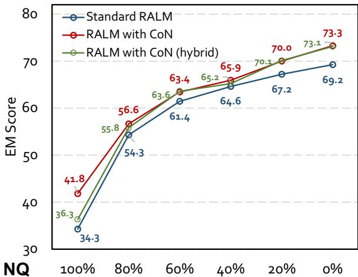

# Chain-of-Note: Enhancing Robustness in Retrieval-Augmented Language Models

Wenhao Yu, Hongming Zhang, Xiaoman Pan, Peixin Cao, Kaixin Ma, Jian Li, Hongwei Wang, Dong Yu Tecent AI Lab wenhaowyu@global.tencent.com

# Abstract

Retrieval-augmented language model (RALM) represents a significant advancement in mitigating factual hallucination by leveraging external knowledge sources. However, the reliability of the retrieved information is not always guaranteed, and the retrieval of irrelevant data can mislead the response generation. Moreover, standard RALMs frequently neglect their intrinsic knowledge due to the interference from retrieved information. In instances where the retrieved information is irrelevant, RALMs should ideally utilize their intrinsic knowledge or, in the absence of both intrinsic and retrieved knowledge, opt to respond with "unknown" to avoid hallucination. In this paper, we introduces CHAIN-OF-NOTE (CON), a novel approach to improve robustness of RALMs in facing noisy, irrelevant documents and in handling unknown scenarios. The core idea of CON is to generate sequential reading notes for each retrieved document, enabling a thorough evaluation of their relevance to the given question and integrating this information to formulate the final answer. Our experimental results show that GPT-4, when equipped with CON, outperforms the CHAIN-OF-THOUGHT approach. Besides, we utilized GPT-4 to create 10K CON data, subsequently trained on LLaMa-2 7B model. Our experiments across four open-domain QA benchmarks show that fine-tuned RALMs equipped with CON significantly outperform standard fine-tuned RALMs.

# 1 Introduction

Retrieval-augmented language models (RALMs) represent a novel framework that significantly advances large language models (Touvron et al., 2023; OpenAI, 2023) by addressing key limitations such as reducing factual hallucinations (Ji et al., 2023; Zhang et al., 2023a), injecting up-to-date knowledge in a plug-and-play manner (Dhingra et al., 2022; Vu et al., 2023), and enhancing domainspecific expertise (Li et al., 2023; Qin et al., 2023).

# Who performed "It Must Have Been Love”?

Wikipedia: … "It Must Have Been Love" is a song written by Per Gessle and performed by the Swedish pop duo Roxette. The power ballad became the duo's third number one hit in United States.

Wikipedia: … "It Must Be Love" is a song written and originally recorded in 1971 by Labi Siffre. It was also recorded by ska/pop band Madness in 1981.

# RALM w/o CoN

The answer is Labi Siffre.

The first passage confirms that Roxette is the performer of “It Must Have Been Love.” However, the second passage refers to “It Must Be Love,” which is a different song and irrelevant to the question. Thus, the answer is Roxette.

# RALM with CoN

Figure 1: Compared with the current RALMs, the core idea behind CHAIN-OF-NOTE (CON) is to generate sequential reading notes for the retrieved documents, ensuring a systematic assessment of their relevance to the input question before formulating a final response.

These enhancements primarily stem from integrating large language models (LLMs) with external knowledge sources (Guu et al., 2020; Lewis et al., 2020; Borgeaud et al., 2022; Shi et al., 2023c). In a typical RALM setup, a query is first processed by a retriever that searches a vast evidence corpus for pertinent documents. A reader then examines these documents, extracting useful information and formulating the final output answer.

However, there exist several issues with the current RALM framework. First, there is no guarantee that the information retrieval (IR) system will always yield the most pertinent or trustworthy information. The retrieval of irrelevant data can lead to misguided responses (Shi et al., $2 0 2 3 \mathrm { a }$ ; Yoran et al., 2023), and potentially causing the model to overlook its inherent knowledge, even when it possesses adequate information to address the query (Mallen et al., 2023). Secondly, state-of-the-art LLMs often hallucinate when addressing fact-oriented questions, a deficiency that can be risky and may discourage users (Ji et al., 2023; Zhang et al., 2023a). Ideally, an intelligent system should be capable of determining whether it has enough knowledge, both intrinsic and retrieved, to provide an accurate answer. In cases where knowledge is insufficient, the system should respond with “unknown” when the answer cannot be determined. Based on the shortcomings of the standard RALM system, in this paper, we aims to improve the robustness of RALMs, mainly focusing on two pivotal aspects:

(1) Noise Robustness: The ability of a RALM to discern and disregard noisy information present in irrelevant retrieved documents, while appropriately leveraging its intrinsic knowledge.

(2) Unknown Robustness: The capacity of a RALM to acknowledge its limitations by responding with “unknown” when given a query it does not have the corresponding knowledge to answer, and the relevant information is not found within the retrieved documents.

In this work, we introduce a novel framework named CHAIN-OF-NOTE (CON), designed to enhance the robustness of RALMs. The cornerstone of CON is to generate a series of reading notes for retrieved documents, enabling a comprehensive assessment of their relevance to the input query. This approach not only evaluates each document’s pertinence but also pinpoints the most critical and reliable information therein. This process effectively filters out irrelevant or less credible content, leading to responses that are more precise and contextually relevant, as exemplified in Figure 1. Besides, CON enhances the capability of RALM to handle queries fall outside the scope of training data. In cases where the retrieved documents do not provide any relevant information, CON can guide the model to acknowledge its limitations and respond with an “unknown” or provide possible explanation based on available data, enhancing reliability.

To validate the effectiveness of the CON idea, we first conducted a comparison with CHAIN-OFTHOUGHT (COT) (Wei et al., 2022) using GPT4 as the reader, showing CON is more effective than COT in retrieval-augmented scenarios. Next, we prompted GPT-4 (OpenAI, 2023) to generate a 10K training examples based on questions collected from NQ (Kwiatkowski et al., 2019), and subsequently trained on the LLaMa-2 7B, to valid the note-taking ability for smaller-sized models. Our evaluation of the RALM, integrated with CON and compared to the standard RALM system, focused on three major aspects: (1) overall QA performance using DPR-retrieved documents, (2) noise robustness, assessed by introducing noisy information to the system, and (3) unknown robustness, evaluated through queries not covered in the LLaMa-2 pre-training data, i.e., real-time questions. The evaluations were conducted on the NQ and three additional out-of-domain open-domain QA datasets, namely TriviaQA (Joshi et al., 2017), WebQ (Berant et al., 2013), and RealTimeQA (Kasai et al., 2023). Our experiments show that CON not only improves overall QA performance when employed with DPR-retrieved documents but also significantly enhances robustness in both noise and unknown aspects. This includes a $+ 7 . 9$ increase in accuracy (measured by the exact match score) with noisy retrieved documents, and a $+ 1 0 . 5$ increase in the rejection rate for real-time questions1 that are beyond the pre-training knowledge scope.

# 2 Proposed Method

# 2.1 Overview

In this section, we introduce CHAIN-OF-NOTE, an innovative advancement for retrieval-augmented language models (RALMs). Specifically, CON framework generates sequential reading notes for the retrieved documents, which enables a systematic evaluation of the relevance and accuracy of information retrieved from external documents. By creating sequential reading notes, the model not only assesses the pertinence of each document to the query but also identifies the most critical and reliable pieces of information within these documents. This process helps in filtering out irrelevant or less trustworthy content, leading to more accurate and contextually relevant responses.

# 2.2 Background of Existing RALMs

RALMs signify a transformative development in language models, enhancing their output by incorporating external knowledge. These models operate by introducing an auxiliary variable, denoted as $d$ , which represents retrieved documents. This inclusion allows them to consider a range of possible documents, thereby producing responses that are more informed and precise (Lazaridou et al.,

# When was the Deadpool 2 being released?

# Who wrote the song “When I was 17”?

# When is the fourth movie of the Divergent series coming out?

Wikipedia 1: Deadpool 2 is a 2018 American super-hero film based on the Marvel Comics character Deadpool distributed by 20th Century Fox. … This movie was followed by releases in 49 markets over the next few days, including the United States on June 1, 2018.

Wikipedia 1: The nostalgic and melancholic song recounts the type of girls with whom the singer had relationships at various years: when he was 17, “small-town girls ... on the village green”; at 21, “city girls who lived up the stairs”

Wikipedia 1: The Divergent Series is a feature film trilogy. … Distributed by Summit Entertainment and Lions-gate Films, the series has three science fiction films set in a dystopian society: Divergent, Insurgent, and Allegiant.

Wikipedia 2: … Deadpool 2 premiered at Leicester Square in London on May 10, 2018 It was released in United States on May 18, 2018, having been previously scheduled for release on June 1 of that year. …

Wikipedia 2: … “It Was a Very Good Year” , commonly unknown as “When I was 17”, was made famous by Frank Sinatra‘s version in D minor, which won the Grammy Award for Best Male Vocal Performance in 1966.

Wikipedia 2: The film (Divergent) was a box office bomb, grossing just \$179 million against its budget of \$142 million, becoming the lowest grossing “Divergent” film. This led initially to budget cuts on the fourth and final film. …

The first passage suggests that “Deadpool 2" released in the United States on June ${ \mathfrak { L } } _ { \prime }$ 2018. However, the second passage clarifies that the movie was actually released earlier, on May 18, having been rescheduled from the initially planned date of June 1. Based on information provided in above passage, the answer is May 18, 2018.

The first passage discusses the song remin-- iscing about relationships at different ages but does not specify the songwriter. The second clarifies the song often mistakenly called “When I Was $1 7 ^ { \prime \prime }$ is actually “It Was a Very Good Year,” Both passages do not explicitly mention the songwriter, but imply the correct title. Based on my knowledge, the answer is Ervin Drake.

The first passage suggests the "Divergent" series was initially planned as a trilogy,

while the second passage discusses the poor box office leads to budget cuts for a potential fourth movie. However, neither passage confirms the release date of the fourth film in Divergent Series. Given this lack of specific information and my current knowledge, the answer is unknown.

(a) CoN: Relevant $_ { - > }$ Find the answer (b) CoN: Irrelevant $_ { - > }$ Infer the answer (c) CoN: Irrelevant $_ { - > }$ Answer Unknown

Figure 2: Illustration of the CHAIN-OF-NOTE (CON) framework with three distinct types of reading notes. Type (a) depicts the scenario where the language model identifies a document that directly answers the query, leading to a final answer formulated from the retrieved information. Type (b) represents situations where the retrieved document, while not directly answering the query, provides contextual insights, enabling the language model to integrate this context with its inherent knowledge to deduce an answer. Type (c) illustrates instances where the language model encounters irrelevant documents and lacks the necessary knowledge to respond, resulting in an “unknown” answer. This figure exemplifies the CoN framework’s capability to adaptively process information, balancing direct information retrieval, contextual inference, and the recognition of its knowledge boundaries.

2022; Shi et al., 2023c). The RALM models can be represented as $\begin{array} { r } { p ( y | x ) = \sum _ { i } p ( y | d _ { i } , x ) p ( d _ { i } | x ) } \end{array}$ Here, $x$ represents the input query, and $y$ signifies the model’s generated response. In practice, it is infeasible to compute the sum over all possible documents due to the vast number of potential sources. Consequently, the most common approach involves approximating the sum over $d$ using the $k$ highest ranked documents, and providing all these documents as part of the input. We assume, w.l.o.g., that these documents are $[ d _ { 1 } , \ldots , d _ { k } ]$ , yielding $\begin{array} { r } { p ( y | x ) = \sum _ { i = 1 } ^ { k } p ( y | d _ { i } , x ) p ( \dot { d } _ { i } | x ) } \end{array}$ .

However, the existing RALMs suffer from several limitations:

• Risk of Surface-Level Processing: When directly generating an answer, language models might rely on surface-level information without deep comprehension. Thus, they could easily overlook the nuances of question or documents, particularly in complex or indirect questions.

• Difficulty in Handling Contradictory Information: When faced with documents containing contradictory information, directly generating an answer becomes challenging. The model may struggle of these contradictions or to determine which piece of information is more credible or relevant.

• Reduced Transparency and Interpretability: Direct answer generation offers limited insight into how the model arrived at its conclusion. This lack of transparency makes it challenging for users to understand the basis of the model’s conclusions.

• Overdependence on Retrieved Documents: Direct generation can lead to an overreliance on the content of the retrieved documents (i.e. tendency to extract information from retrieved documents (Shi et al., 2023a)), ignoring the model’s inherent knowledge base. This can be particularly limiting when the retrieved documents are noisy or out-of-date.

# 2.3 The CHAIN-OF-NOTE Framework

The CHAIN-OF-NOTE (CON) framework presents a solution to the challenges faced by retrievalaugmented language models (RALMs). This framework significantly enhances the ability of RALMs to critically assess retrieved documents through a structured note-taking process. Specifically, it involves generating concise and contextually relevant summaries or notes for each document. This method allows the model to systematically evaluate the relevance and accuracy of information drawn from external documents. By creating sequential reading notes, CON not only assesses the pertinence of each document to the query but also pinpoints the most reliable information and resolves conflicting information. This approach effectively filters out irrelevant or less trustworthy content, leading to responses that are both more accurate and contextually relevant.

Given an input question $x$ and $k$ retrieved documents $[ d _ { 1 } , \cdots , d _ { k } ]$ , the model aims to generate textual outputs comprising multiple segments $[ y _ { d _ { 1 } } , \cdots , y _ { d _ { k } } , y ]$ . Here, $y _ { d _ { i } }$ signifies the tokens for the $i$ -th segment, representing the reading note for the corresponding document $d _ { i }$ , as shown in Figure 2. After generating individual reading notes, the model synthesizes the information to create a consolidated final response $y$ . The implementation of the CHAIN-OF-NOTE (CON) involves three key steps: (1) designing the notes $y _ { d _ { i } }$ , (2) collecting the data, and (3) training the model.

# 2.3.1 CHAIN-OF-NOTE Format Design

The framework primarily constructs three types of reading notes, as shown in Figure 2 , based on the relevance of the retrieved documents to the input question: First, when a document directly answers the query, the model formulates the final response based on this relevant information, as shown in Figure 2(a). Second, if the retrieved document does not directly answer the query but provides useful context, the model leverages this information along with its inherent knowledge to deduce an answer, as shown in Figure 2(b). Third, in cases where the retrieved documents are irrelevant, and the model lacks sufficient knowledge to answer, it defaults to responding with “unknown", as shown in Figure 2(c). This nuanced approach mirrors human information processing, striking a balance between direct retrieval, inferential reasoning, and the acknowledgment of knowledge gaps.

# 2.3.2 Data Collection and Model Training

To equip the model with the ability to generate such reading notes, it’s essential to gather appropriate training data. Manual annotation for each reading note is resource-intensive, so we employ a stateof-the-art language model – GPT-4 – to generate the notes data. This method is both cost-effective and enhances reproducibility. We initiate this process by randomly sampling $1 0 \mathrm { k }$ questions from the NQ (Kwiatkowski et al., 2019) training dataset. GPT-4 is then prompted with specific instructions and in-context examples to the three distinct types of note generation (detailed in Appendix A.5). The quality of GPT-4’s predictions is subsequently assessed through human evaluations on a small subset of the data before proceeding to the entire set. The NQ dataset is chosen as our primary dataset due to its diverse range of real user queries from search engines. However, to ensure the model’s adaptability, we also test its performance on three additional open-domain datasets, including TriviaQA, WebQ, and RealTimeQA, showing its generalization capabilities to out-of-domain (OOD) data.

After collecting 10K training data from GPT-4, the next step involves using them to train a LLaMa2 7B model (Touvron et al., 2023), to validate the feasibility of generating CHAIN-OF-NOTE (CON) outputs. To do this, we concatenate the instruction, question and documents as a prompt and train the model to generate notes and answer in a standard supervised way. Our in-house model learns to sequentially generate reading notes for each document to assess their relevance to the input query. Responses are generated based on the document’s relevance, enhancing accuracy and reducing misinformation. If all documents are irrelevant, the model either relies on inherent knowledge for an answer or responds with “unknown” if the answer cannot be determined accurately.

# 2.3.3 Hybrid Training for Better Efficiency

Generating CHAIN-OF-NOTE (CON) would increase inference cost, potentially hindering realworld usage. To address this, we experimented with a simple yet effective strategy for internalizing CON reasoning, called Hybrid Training.

Specifically, we allocate $50 \%$ of the training time to the standard RALM, which involves directly generating answers without notes, and the other $50 \%$ to RALM with CoN. This strategy allows the model to internalize intermediate reasoning steps during training. Additionally, we add two different prompt words before each category of data.

During the inference phase, we exclusively use the standard RALM prompt to guide the model, prompting it to output answers without relying on explicit reading notes. This approach leverages the hidden states developed during training for implicit CON reasoning. The model trained with the hybrid training strategy maintains the same inference time while achieving only slightly lower performance wit CoN. The results will be introduced in $\ S 3 . 5$ .

<table><tr><td>Datasets</td><td>Full size</td><td>IR Recall</td><td>Subset size</td></tr><tr><td>NQ</td><td>3,610</td><td>73.82</td><td>2,086</td></tr><tr><td>TriviaQA</td><td>7,993</td><td>89.95</td><td>7,074</td></tr><tr><td>WebQ</td><td>2,032</td><td>64.22</td><td>1,231</td></tr></table>

Table 1: Dataset statistics. The recall evaluation is based on DPR retrieval on the full test set.

# 3 Experiments

# 3.1 Experimental Settings and Evaluations

# 3.1.1 Datasets and Splits

We conducted comprehensive experiments using three benchmark datasets in open-domain question answering (QA): NQ (Kwiatkowski et al., 2019), TriviaQA (Joshi et al., 2017), and WebQ (Berant et al., 2013), with further details provided in Appendix A.3. Additionally, we employed RealTimeQA (Kasai et al., 2023) as a special case to evaluate “unknown” robustness.

The evaluation was conducted based on two evaluations sets: full set and subset evaluation. Firstly, akin to traditional open-domain QA evaluation, we assessed the models using all questions from the test set to evaluate the overall QA performance. The documents were retrieved using DPR, and the top- $k$ documents were fed into the generator. We adhered to the same test splits for the open-domain QA setting as used by Izacard and Grave (2021); Karpukhin et al. (2020). For TriviaQA, evaluations from LLaMa-2 (Touvron et al., 2023) were conducted on the Wikipedia dev set comprising 7,993 examples. Therefore, we also follow the same evaluation on this dev set to facilitate comparisons with their performance. Secondly, to assess the model’s noise robustness and unknown robustness, we extracted subsets from the above test sets that contained relevant documents in the retrieved list. We then enumerated each retrieved document to determine if it was a golden document for the given question. Based on the noise ratio $r$ , for instance, if the top- $k$ documents are needed for the generator, then $k \cdot r$ would be the number of noisy documents, and $k \cdot ( 1 - r )$ would be the number of relevant documents. For example, when noise ratio is $20 \%$ and top-5 documents are needed, then 4 are relevant documents, and 1 is irrelevant documents. During the enumeration of the retrieved documents in data pre-processing, we populated two lists; when one list reached its limit, we stopped adding more documents to that list until both lists were complete. In instances where no relevant documents are retrieved by the DPR for certain questions, we exclude these from robustness evaluation. Therefore, the subset is smaller than the original test set, as shown in Table 1.

# 3.1.2 Baseline Methods

CHAIN-OF-NOTE (CON) is built upon the traditional retrieve-then-read pipeline (Lewis et al., 2020). Recent implementations such as Lazaridou et al. (2022); Shi et al. (2023a); Luo et al. (2023) integrate large language models to achieve better performance. Therefore, we primarily compare our approach against these retrieve-read methods. As outlined in the $\ S 2 . 3$ , we denote an input question as $x$ and its corresponding answer as $y$ . Besides, $d _ { i }$ represents the $i$ -th retrieved document, and $y _ { d _ { i } }$ is the associated reading note for that document. Here we show the difference of methods to compare.

QA fine-tune w/o IR are trained to directly generate an answer from the input question, without relying on any external retrieved information. Essentially, it learns the function $f : x  y$ , transforming the question $x$ directly to answer $y$ .

Retrieve-Read (Shi et al., 2023c) are trained to generate an answer not only from the question but also by incorporating retrieved documents. It learns the function $f : \{ x , d _ { 1 } , \cdot \cdot \cdot , d _ { k } \}  y$ , meaning it transforms the question $x$ and a set of retrieved documents $\{ d _ { 1 } , \cdots , d _ { k } \}$ into an answer $y$ .

Retrieve-Read with CHAIN-OF-NOTE are trained to generate reading notes for each retrieved document before formulating the final answer. It learns the function $f \quad : \quad \{ x , d _ { 1 } , \cdot \cdot \cdot , d _ { k } \} \quad $ $\{ y _ { d _ { 1 } } , \dotsb , y _ { d _ { k } } , y \}$ , thereby enabling the model to process the question $x$ and retrieved documents $\{ d _ { 1 } , \cdots , d _ { k } \}$ to produce reading notes $\{ y _ { d _ { 1 } } , \cdot \cdot \cdot , y _ { d _ { k } } \}$ and the final answer $y$ .

For fair comparability, we trained all LLaMa-2 models on same training set, with the main difference being in the input and output formats. We also note that the experiments conducted with GPT-4 were performed in a zero-shot setting. The prompts used for various experimental conditions are detailed in Appendix A.5.

# 3.1.3 Evaluation Metrics

For the evaluation of open-domain QA performance, we have employed two widely recognized metrics: Exact Match (EM) and F1 score, as suggested by prior work in the Chen et al. (2017);

<table><tr><td>Models</td><td colspan="2">NQ</td><td colspan="2">TriviaQA</td><td colspan="2">WebQ</td><td colspan="2">Average</td></tr><tr><td></td><td>EM</td><td>F1</td><td>EM</td><td>F1</td><td>EM</td><td>F1</td><td>EM</td><td>F1</td></tr><tr><td colspan="9">Backbone language model: LLaMa-2 7B</td></tr><tr><td>QA fine-tune w/o IR SAIL (Luo et al., 2023)*</td><td>28.80 36.20</td><td>37.53 44.23</td><td>63.19 73.20</td><td>68.61 80.92</td><td>28.30 27.92</td><td>42.77 40.65</td><td>35.98 45.77</td><td>44.27 55.27</td></tr><tr><td>Retrieve-Read (Shi et al., 2023c) + Chain-Of-Note (ours)</td><td>47.39 48.92</td><td>55.81 57.53</td><td>74.92</td><td>81.53 82.25</td><td>29.58 32.33</td><td>43.51 46.68</td><td>48.49 50.46</td><td>56.97 58.78</td></tr><tr><td>Backbone language model: GPT-4-1106 †</td><td>(+1.53)</td><td>(+1.72)</td><td>76.27 (+1.35)</td><td>(+0.72)</td><td>(+2.75)</td><td>(+3.17)</td><td>(+1.97)</td><td>(+1.81)</td></tr><tr><td></td><td>54.0</td><td></td><td>74.2</td><td></td><td>56.2</td><td></td><td>61.5</td><td></td></tr><tr><td>QA prompt w/o IR</td><td></td><td></td><td></td><td></td><td></td><td></td><td></td><td></td></tr><tr><td>Retrieve-Read (Shi et al., 2023c)</td><td></td><td></td><td></td><td></td><td></td><td></td><td></td><td></td></tr><tr><td></td><td>61.8</td><td></td><td>70.6</td><td></td><td>56.8</td><td></td><td>63.1</td><td></td></tr><tr><td>+ Chain-of-Thought</td><td>63.6</td><td></td><td>71.2</td><td></td><td>58.4</td><td></td><td></td><td></td></tr><tr><td></td><td></td><td></td><td></td><td></td><td></td><td></td><td>64.4</td><td></td></tr><tr><td>+ Chain-of-Note (ours)</td><td>63.8</td><td></td><td>74.6</td><td></td><td>58.8</td><td></td><td>65.7</td><td></td></tr><tr><td></td><td>(+2.0)</td><td></td><td>(+4.0)</td><td></td><td>(+2.0)</td><td></td><td>(+2.6)</td><td></td></tr></table>

Table 2: The RALM, when equipped with CHAIN-OF-NOTE (CON), demonstrates a marginal improvement over the standard RALM in full test set evaluations. Significantly, it outperforms the standard RALM system in scenarios with noisy documents, suggesting that CON can substantially enhance the model’s noise robustness. \* SAIL was designed for retrieval-augmented instruction tuning, and as such, may not be ideally factual QA. $\dagger$ Evaluating GPT-4 outputs with EM score is challenging; we opt for Accuracy, with reasons outlined in $\ S 3 . 1 . 3$ .

Karpukhin et al. (2020); Zhu et al. (2021). For EM score, an answer is deemed correct if its normalized form – obtained through the normalization procedure delineated by (Karpukhin et al., 2020) – corresponds to any acceptable answer in the provided list. Similar to EM score, F1 score treats the prediction and ground truth as bags of tokens, and compute the average overlap between the prediction and ground truth answer (Chen et al., 2017). Besides, we use reject rate (RR) to evaluate the unknown robustness when given questions beyond a language model’s knowledge scope.

Finally, since GPT-4 is not directly trained on open-domain QA benchmarks, employing EM / F1 for evaluation is challenging. Therefore, we adopt the approach outlined in Mallen et al. (2023); Kandpal et al. (2023), utilizing accuracy as the evaluation metric. Accuracy considers a prediction correct if any substring of the prediction exactly matches any of the provided correct answers.

# 3.2 Evaluation on Overall QA Performance

Table 2 demonstrates that the RALM consistently outperforms the directly fine-tuned LLaMa-2 with QA pairs, without retrieval. This improvement is closely tied to the effectiveness of the retrieval process. As indicated in Table 1, DPR demonstrates markedly superior retrieval performance on the NQ and TriviaQA datasets compared to WebQ. Consequently, the benefits of retrieval are more pronounced on NQ and TriviaQA. Furthermore, when comparing our enhanced RALM, which integrates CON, with the standard RALM, our method persistently shows better performance. There is an average improvement of $+ 1 . 9 7$ in EM scores across all three datasets when using LLaMa-2 as backbone language model. Delving deeper, we find that this improvement varies depending on whether DPR successfully retrieves relevant documents. Specifically, the average improvement is $+ 1 . 2$ when DPR retrieves relevant documents and $+ 2 . 3$ when it does not on the NQ dataset. This disparity suggests that our CON improve RALM’s in scenarios where more noisy documents are fetched in the first retrieval stage. This observation aligns with our findings on noise robustness, which are elaborated in the subsequent sections detailing our experimental results.

Furthermore, the dynamics observed with larger language models differ from those noted in experiments with smaller-sized models due to their superior factual knowledge. The impact of utilizing retrieval is observed to be less pronounced with larger models and can even be detrimental in certain cases, such as with TriviaQA, where questions are mostly straightforward. Concerning the comparison between CON and the baseline, the performance trend remains consistent with that observed in smallersized models, suggesting that CON maintains its significance across different model sizes.

<table><tr><td rowspan="2">Models</td><td rowspan="2">Noise Ratio</td><td colspan="2">NQ</td><td colspan="2">TriviaQA</td><td colspan="2">WebQ</td><td colspan="2">Average</td></tr><tr><td>EM</td><td>F1</td><td>EM</td><td>F1</td><td>EM</td><td>F1</td><td>EM</td><td>F1</td></tr><tr><td rowspan="3">Retrieve-Read + Chain-of-Note</td><td rowspan="3">100%</td><td>34.28</td><td>41.74</td><td>55.30</td><td>61.67</td><td>29.58</td><td>46.34</td><td>39.72</td><td>49.92</td></tr><tr><td>41.83</td><td>49.58</td><td>64.30</td><td>70.00</td><td>36.85</td><td>53.07</td><td>47.66</td><td>57.55</td></tr><tr><td>(+7.55)</td><td>(+7.84)</td><td>(+9.00)</td><td>(+8.33)</td><td>(+7.27)</td><td>(+6.73)</td><td>(+7.94)</td><td>(+7.63)</td></tr><tr><td rowspan="3">Retrieve-Read + Chain-of-Note</td><td rowspan="3">80%</td><td>54.28</td><td>61.03</td><td>73.83</td><td>80.02</td><td>35.46</td><td>52.70</td><td>54.52</td><td>64.58</td></tr><tr><td>56.63</td><td>63.23</td><td>75.89</td><td>81.24</td><td>40.60</td><td>56.54</td><td>57.70</td><td>67.00</td></tr><tr><td>(+2.35)</td><td>(+2.20)</td><td>(+2.06)</td><td>(+1.22)</td><td>(+5.14)</td><td>(+3.84)</td><td>(+3.18)</td><td>(+2.42)</td></tr><tr><td rowspan="3">Retrieve-Read + Chain-of-Note</td><td rowspan="3">60%</td><td>61.44</td><td>67.94</td><td>78.44</td><td>83.65</td><td>37.01</td><td>54.16</td><td>58.96</td><td>68.58</td></tr><tr><td>63.43</td><td>69.33</td><td>78.79</td><td>84.07</td><td>41.26</td><td>56.91</td><td>61.16</td><td>70.10</td></tr><tr><td>(+1.99)</td><td>(+1.39)</td><td>(+0.35)</td><td>(+0.42)</td><td>(+4.25)</td><td>(+2.75)</td><td>(+2.20)</td><td>(+1.52)</td></tr><tr><td rowspan="3">Retrieve-Read + Chain-of-Note</td><td rowspan="3">40%</td><td>64.62</td><td>71.12</td><td>80.56</td><td>86.76</td><td>38.40</td><td>55.60</td><td>61.19</td><td>71.16</td></tr><tr><td>65.91</td><td>72.22</td><td>81.72</td><td>87.11</td><td>42.16</td><td>58.15</td><td>63.26</td><td>72.49</td></tr><tr><td>(+1.29)</td><td>(+1.10)</td><td>(+1.16)</td><td>(+0.35)</td><td>(+3.76)</td><td>(+2.55)</td><td>(+2.07)</td><td>(+1.33)</td></tr><tr><td rowspan="3">Retrieve-Read + Chain-Of-Note</td><td rowspan="3">20%</td><td>67.21</td><td>73.69</td><td>81.73</td><td>87.89</td><td>39.95</td><td>56.66</td><td>62.96</td><td>72.75</td></tr><tr><td>70.00</td><td>76.08</td><td>82.86</td><td>88.24</td><td>44.36</td><td>60.13</td><td>65.74</td><td>74.82</td></tr><tr><td>(+2.79)</td><td>(+2.39)</td><td>(+1.13)</td><td>(+0.35)</td><td>(+4.41)</td><td>(+3.47)</td><td>(+2.78)</td><td>(+2.07)</td></tr><tr><td rowspan="3">Retrieve-Read + Chain-of-Note</td><td rowspan="3">0%</td><td>69.23</td><td>75.57</td><td>83.34</td><td>89.44</td><td>42.24</td><td>58.59</td><td>64.93</td><td>74.53</td></tr><tr><td>73.28</td><td>79.86</td><td>83.52</td><td>88.94</td><td>46.16</td><td>62.38</td><td>67.65</td><td>77.06</td></tr><tr><td>(+4.05)</td><td>(+4.29)</td><td>(+0.18)</td><td>(-0.50)</td><td>(+3.92)</td><td>(+3.79)</td><td>(+2.72)</td><td>(+2.53)</td></tr></table>

Table 3: Evaluation on Noise Robustness. The backbone language model is LLaMa-2 7B. The CHAIN-OF-NOTE framework shows superior performance compared to the standard RALM system, particularly notable at higher noise ratios.We explain how we synthesize data with different noise ratios under real-world scenarios in $\ S \ 3 . 1 . 1$ .

<table><tr><td>Models ↓</td><td colspan="3">RealTimeQA</td></tr><tr><td></td><td>EM</td><td>F1</td><td>RR</td></tr><tr><td>Retrieve-Read (Shi et al., 2023c)</td><td>15.6</td><td>19.9</td><td>6.1</td></tr><tr><td>+ Chain-of-Note (ours)</td><td>15.7</td><td>20.3</td><td>13.0</td></tr></table>

Table 4: Evaluation on Unknown Robustness. The CON shows better performance than standard RALM system.

# 3.3 Evaluation on Noise Robustness

As illustrated in Table 2, when faced with entirely noisy documents, both the standard RALM and our CHAIN-OF-NOTE enhanced RALM underperformed compared to the no-retrieval setting. This suggests that RALMs can be misled by noisy information, leading to more hallucinations.

Notably, equipping the model with CON enables it to perform nearly as well as the baseline model directly fine-tuned with QA pairs without retrieval, showcasing its robustness to noise and its ability to disregard irrelevant information. The CON approach is effective not only in fine-tuned, smallersized models but also in large language models, such as GPT-4, with adjustments made only to the prompt. Besides, in comparison to the CHAIN-OFTHOUGHT technique, commonly utilized in reasoning scenarios, CON presents a more efficient strategy for retrieval-augmented settings, particularly in addressing knowledge-intensive tasks.

Table 3 shows that RALM enhanced with CON consistently outperforms the standard RALM, especially in scenarios with exclusively noisy documents. An average improvement of $+ 7 . 9$ in EM score on fully noisy documents is observed on three open-domain QA datasets, in average. Experiments with lower noise ratios also consistently demonstrate the improvements brought by CON, aligning the overall QA performance.

# 3.4 Evaluation on Unknown Robustness

Table 4 illustrates that our RALM equipped with CON exhibits superior robustness in handling unknown scenario, particularly evident in the RealTimeQA benchmark. This benchmark falls completely outside the model’s domain and contains real-time information that was not part of the LLaMa-2 pre-training data. Despite this, models are still capable of providing correct answers in some cases, as the answers remain consistent over time. In comparison to the standard RALM system, our method shows a significant improvement, exceeding $+ 1 0 . 5$ in its ability to reject to answer questions in unknown scenario. The evaluation is based on reject rate (RR), i.e., number of rejected questions / total questions. This highlights our model’s enhanced capability to discern and disregard information that is unfamiliar or not learned during its initial training phase.

  
Figure 3: Using a hybrid training strategy demonstrates slightly lower robustness across various noise ratios but consistently better performance than standard RALMs.

<table><tr><td>Models ↓</td><td>Inference Time(s)</td></tr><tr><td>Retrieve-Read</td><td>0.6104</td></tr><tr><td>+ Chain-of-Note</td><td>12.0192</td></tr><tr><td>+ CHAIN-OF-NOTE (hybrid)</td><td>0.6074</td></tr></table>

Table 5: The inference time comparison shows the average decoding time per example on $8 \times \mathrm { A l 0 0 }$ GPUs.

# 3.5 Evaluation on Hybrid Training Strategy

As illustrated in Figure 3 and Table 5, our proposed RALM equipped with a hybrid strategy demonstrates slightly lower robustness across various noise ratios while but keeping similar effcient decoding time consumption to the standard RALM. This indicates that our CHAIN-OF-NOTE framework, when implemented with a hybrid training strategy, is highly applicable to a wide range of real-world business scenarios. This enhancement in robustness without significant time overhead highlights the practical value and efficiency of our approach, making it a viable solution for environments where QA accuracy can vary but inference time is crucial.

# 4 Related Work

Retrieval-Augmented Language Models (RALMs) represent a significant advancement in natural language processing, combining the power of large language models with the specificity and detail provided by external knowledge sources (Guu et al.,

2020; Lewis et al., 2020; Izacard et al., 2022). Recent studies highlight the impact of context relevance on language model performance (Creswell et al., 2022; Shi et al., 2023a; Yoran et al., 2023). Notably, Creswell et al. (2022) demonstrated that incorporating random or irrelevant contexts could adversely affect QA performance. In contrast, Shi et al. (2023a) discovered that adding irrelevant context to exemplars or task-specific instructions can sometimes enhance model performance, implying that models might intrinsically possess capabilities, developed during pre-training, to manage such scenarios. Most pertinent to our research is the study by Yoran et al. (2023), which focused on training RALMs to disregard irrelevant contexts. This approach, while distinct from our proposed solution, underscores the importance of context relevance in enhancing the effectiveness of RALMs.

Besides, we present more related Chain-of-Xs approaches (e.g., Chain-of-Thought (CoT) (Wei et al., 2022)) in the Appendix A.1.1 and A.2.

# 5 Conclusion

In this paper, we introduce the CHAIN-OF-NOTE (CON) framework, a novel methodology designed to enhance the robustness of RALMs. The central concept of CON revolves around the generation of sequential reading notes for each retrieved document. This process allows for an in-depth assessment of document relevance to the posed question and aids in synthesizing this information to craft the final answer. Our experiments show that GPT-4, when equipped with CON, outperforms the CHAINOF-THOUGHT approach. Besides, we utilized GPT4 to create 10K CON data, subsequently trained on a LLaMa-2 7B model. Our experiments across four open-domain QA benchmarks show that RALMs equipped with CON significantly outperform standard fine-tuned RALMs.

# 6 Limitations

One major limitation of the CHAIN-OF-NOTE (CON) approach is its increased inference cost due to the sequential generation of notes. While CON is beneficial for assessing the relevance and integrating external knowledge, it results in longer response times, which is problematic for timesensitive applications. Moreover, the system’s efficiency depends on the conciseness and relevance of the generated notes, which can fluctuate based on the complexity of the retrieved documents.

# References

Jonathan Berant, Andrew Chou, Roy Frostig, and Percy Liang. 2013. Semantic parsing on freebase from question-answer pairs. In EMNLP, pages 1533– 1544.

Sebastian Borgeaud, Arthur Mensch, Jordan Hoffmann, Trevor Cai, Eliza Rutherford, Katie Millican, George Bm Van Den Driessche, Jean-Baptiste Lespiau, Bogdan Damoc, Aidan Clark, et al. 2022. Improving language models by retrieving from trillions of tokens. In International conference on machine learning, pages 2206–2240. PMLR.

Danqi Chen, Adam Fisch, Jason Weston, and Antoine Bordes. 2017. Reading wikipedia to answer opendomain questions. In Proceedings of the 55th Annual Meeting of the Association for Computational Linguistics (Volume 1: Long Papers), pages 1870–1879.

Hao Cheng, Yelong Shen, Xiaodong Liu, Pengcheng He, Weizhu Chen, and Jianfeng Gao. 2021. Unitedqa: A hybrid approach for open domain question answering. In Proceedings of the 59th Annual Meeting of the Association for Computational Linguistics and the 11th International Joint Conference on Natural Language Processing (Volume 1: Long Papers), pages 3080–3090.

Antonia Creswell, Murray Shanahan, and Irina Higgins. 2022. Selection-inference: Exploiting large language models for interpretable logical reasoning. arXiv preprint arXiv:2205.09712.

Bhuwan Dhingra, Jeremy R Cole, Julian Martin Eisenschlos, Daniel Gillick, Jacob Eisenstein, and William W Cohen. 2022. Time-aware language models as temporal knowledge bases. Transactions of the Association for Computational Linguistics, 10:257– 273.

Shehzaad Dhuliawala, Mojtaba Komeili, Jing Xu, Roberta Raileanu, Xian Li, Asli Celikyilmaz, and Jason Weston. 2023. Chain-of-verification reduces hallucination in large language models. arXiv preprint arXiv:2309.11495.

Kelvin Guu, Kenton Lee, Zora Tung, Panupong Pasupat, and Ming-Wei Chang. 2020. Realm: Retrievalaugmented language model pre-training. arXiv preprint arXiv:2002.08909.

Fan Huang, Haewoon Kwak, and Jisun An. 2023. Chain of explanation: New prompting method to generate quality natural language explanation for implicit hate speech. In Proceedings of the ACM Web Conference 2023, pages 90–93.

Gautier Izacard and Edouard Grave. 2021. Leveraging passage retrieval with generative models for open domain question answering. In EACL, pages 874– 880.

Gautier Izacard, Patrick Lewis, Maria Lomeli, Lucas Hosseini, Fabio Petroni, Timo Schick, Jane

Dwivedi-Yu, Armand Joulin, Sebastian Riedel, and Edouard Grave. 2022. Few-shot learning with retrieval augmented language models. arXiv preprint arXiv:2208.03299.

Ziwei Ji, Nayeon Lee, Rita Frieske, Tiezheng Yu, Dan Su, Yan Xu, Etsuko Ishii, Ye Jin Bang, Andrea Madotto, and Pascale Fung. 2023. Survey of hallucination in natural language generation. ACM Computing Surveys, 55(12):1–38.

Mandar Joshi, Eunsol Choi, Daniel S Weld, and Luke Zettlemoyer. 2017. Triviaqa: A large scale distantly supervised challenge dataset for reading comprehension. In ACL, pages 1601–1611.

Nikhil Kandpal, Haikang Deng, Adam Roberts, Eric Wallace, and Colin Raffel. 2023. Large language models struggle to learn long-tail knowledge. In International Conference on Machine Learning, pages 15696–15707. PMLR.

Vladimir Karpukhin, Barlas Oguz, Sewon Min, Patrick Lewis, Ledell Wu, Sergey Edunov, Danqi Chen, and Wen-tau Yih. 2020. Dense passage retrieval for opendomain question answering. In Proceedings of the 2020 Conference on Empirical Methods in Natural Language Processing (EMNLP), pages 6769–6781.

Jungo Kasai, Keisuke Sakaguchi, Yoichi Takahashi, Ronan Le Bras, Akari Asai, Xinyan Yu, Dragomir Radev, Noah A Smith, Yejin Choi, and Kentaro Inui. 2023. Realtime qa: What’s the answer right now? Advances in Neural Information Processing Systems.

Urvashi Khandelwal, Omer Levy, Dan Jurafsky, Luke Zettlemoyer, and Mike Lewis. 2020. Generalization through memorization: Nearest neighbor language models. In International Conference on Learning Representations.

Takeshi Kojima, Shixiang Shane Gu, Machel Reid, Yutaka Matsuo, and Yusuke Iwasawa. 2022. Large language models are zero-shot reasoners. arXiv preprint arXiv:2205.11916.

Tom Kwiatkowski, Jennimaria Palomaki, Olivia Redfield, Michael Collins, Ankur Parikh, Chris Alberti, Danielle Epstein, Illia Polosukhin, Jacob Devlin, Kenton Lee, et al. 2019. Natural questions: A benchmark for question answering research. TACL, pages 452– 466.

Angeliki Lazaridou, Elena Gribovskaya, Wojciech Stokowiec, and Nikolai Grigorev. 2022. Internetaugmented language models through few-shot prompting for open-domain question answering. arXiv preprint arXiv:2203.05115.

Patrick Lewis, Ethan Perez, Aleksandra Piktus, Fabio Petroni, Vladimir Karpukhin, Naman Goyal, Heinrich Küttler, Mike Lewis, Wen-tau Yih, Tim Rocktäschel, et al. 2020. Retrieval-augmented generation for knowledge-intensive nlp tasks. Advances in Neural Information Processing Systems, 33:9459–9474.

Xianzhi Li, Xiaodan Zhu, Zhiqiang Ma, Xiaomo Liu, and Sameena Shah. 2023. Are chatgpt and gpt4 general-purpose solvers for financial text analytics? an examination on several typical tasks. arXiv preprint arXiv:2305.05862.

Hongyin Luo, Yung-Sung Chuang, Yuan Gong, Tianhua Zhang, Yoon Kim, Xixin Wu, Danny Fox, Helen Meng, and James Glass. 2023. Sail: Searchaugmented instruction learning. arXiv preprint arXiv:2305.15225.

Ji Ma, Ivan Korotkov, Yinfei Yang, Keith Hall, and Ryan McDonald. 2021. Zero-shot neural passage retrieval via domain-targeted synthetic question generation. In Proceedings of the 16th Conference of the European Chapter of the Association for Computational Linguistics: Main Volume, pages 1075–1088.

Kaixin Ma, Hao Cheng, Yu Zhang, Xiaodong Liu, Eric Nyberg, and Jianfeng Gao. 2023. Chain-of-skills: A configurable model for open-domain question answering. Proceedings of the 61st Annual Meeting of the Association for Computational Linguistic.

Alex Mallen, Akari Asai, Victor Zhong, Rajarshi Das, Daniel Khashabi, and Hannaneh Hajishirzi. 2023. When not to trust language models: Investigating effectiveness of parametric and non-parametric memories. In Proceedings of the 61st Annual Meeting of the Association for Computational Linguistics (Volume 1: Long Papers), pages 9802–9822.

OpenAI. 2023. Gpt-4 technical report. arXiv preprint arXiv:2303.08774.

Chengwei Qin, Aston Zhang, Zhuosheng Zhang, Jiaao Chen, Michihiro Yasunaga, and Diyi Yang. 2023. Is chatgpt a general-purpose natural language processing task solver? arXiv preprint arXiv:2302.06476.

Yingqi Qu, Yuchen Ding, Jing Liu, Kai Liu, Ruiyang Ren, Wayne Xin Zhao, Daxiang Dong, Hua Wu, and Haifeng Wang. 2021. Rocketqa: An optimized training approach to dense passage retrieval for opendomain question answering. In Proceedings of the 2021 Conference of the North American Chapter of the Association for Computational Linguistics: Human Language Technologies, pages 5835–5847.

Jeff Rasley, Samyam Rajbhandari, Olatunji Ruwase, and Yuxiong He. 2020. Deepspeed: System optimizations enable training deep learning models with over 100 billion parameters. In Proceedings of the 26th ACM SIGKDD International Conference on Knowledge Discovery & Data Mining, pages 3505–3506.

Devendra Singh Sachan, Mike Lewis, Dani Yogatama, Luke Zettlemoyer, Joelle Pineau, and Manzil Zaheer. 2022. Questions are all you need to train a dense passage retriever. arXiv preprint arXiv:2206.10658.

Freda Shi, Xinyun Chen, Kanishka Misra, Nathan Scales, David Dohan, Ed H Chi, Nathanael Schärli, and Denny Zhou. 2023a. Large language models can be easily distracted by irrelevant context. In International Conference on Machine Learning, pages 31210–31227. PMLR.

Freda Shi, Mirac Suzgun, Markus Freitag, Xuezhi Wang, Suraj Srivats, Soroush Vosoughi, Hyung Won Chung, Yi Tay, Sebastian Ruder, Denny Zhou, et al. 2023b. Language models are multilingual chain-of-thought reasoners. In The Eleventh International Conference on Learning Representations.

Weijia Shi, Sewon Min, Michihiro Yasunaga, Minjoon Seo, Rich James, Mike Lewis, Luke Zettlemoyer, and Wen-tau Yih. 2023c. Replug: Retrievalaugmented black-box language models. arXiv preprint arXiv:2301.12652.

Devendra Singh, Siva Reddy, Will Hamilton, Chris Dyer, and Dani Yogatama. 2021. End-to-end training of multi-document reader and retriever for opendomain question answering. Advances in Neural Information Processing Systems, 34:25968–25981.

Hugo Touvron, Louis Martin, Kevin Stone, Peter Albert, Amjad Almahairi, Yasmine Babaei, Nikolay Bashlykov, Soumya Batra, Prajjwal Bhargava, Shruti Bhosale, et al. 2023. Llama 2: Open foundation and fine-tuned chat models. arXiv preprint arXiv:2307.09288.

Harsh Trivedi, Niranjan Balasubramanian, Tushar Khot, and Ashish Sabharwal. 2023. Interleaving retrieval with chain-of-thought reasoning for knowledgeintensive multi-step questions. Proceedings of the 61st Annual Meeting of the Association for Computational Linguistics.

Tu Vu, Mohit Iyyer, Xuezhi Wang, Noah Constant, Jerry Wei, Jason Wei, Chris Tar, Yun-Hsuan Sung, Denny Zhou, Quoc Le, et al. 2023. Freshllms: Refreshing large language models with search engine augmentation. arXiv preprint arXiv:2310.03214.

Jianing Wang, Qiushi Sun, Nuo Chen, Xiang Li, and Ming Gao. 2023a. Boosting language models reasoning with chain-of-knowledge prompting. arXiv preprint arXiv:2306.06427.

Keheng Wang, Feiyu Duan, Sirui Wang, Peiguang Li, Yunsen Xian, Chuantao Yin, Wenge Rong, and Zhang Xiong. 2023b. Knowledge-driven cot: Exploring faithful reasoning in llms for knowledgeintensive question answering. arXiv preprint arXiv:2308.13259.

Jason Wei, Xuezhi Wang, Dale Schuurmans, Maarten Bosma, Ed Chi, Quoc Le, and Denny Zhou. 2022. Chain of thought prompting elicits reasoning in large language models. arXiv preprint arXiv:2201.11903.

Ori Yoran, Tomer Wolfson, Ori Ram, and Jonathan Berant. 2023. Making retrieval-augmented language models robust to irrelevant context. arXiv preprint arXiv:2310.01558.

Donghan Yu, Chenguang Zhu, Yuwei Fang, Wenhao Yu, Shuohang Wang, Yichong Xu, Xiang Ren, Yiming Yang, and Michael Zeng. 2022. Kg-fid: Infusing knowledge graph in fusion-in-decoder for opendomain question answering. In Proceedings of the 60th Annual Meeting of the Association for Computational Linguistics (Volume 1: Long Papers), pages 4961–4974.

Wenhao Yu, Dan Iter, Shuohang Wang, Yichong Xu, Mingxuan Ju, Soumya Sanyal, Chenguang Zhu, Michael Zeng, and Meng Jiang. 2023a. Generate rather than retrieve: Large language models are strong context generators. International Conference for Learning Representation (ICLR).

Wenhao Yu, Zhihan Zhang, Zhenwen Liang, Meng Jiang, and Ashish Sabharwal. 2023b. Improving language models via plug-and-play retrieval feedback. arXiv preprint arXiv:2305.14002.

Yue Zhang, Yafu Li, Leyang Cui, Deng Cai, Lemao Liu, Tingchen Fu, Xinting Huang, Enbo Zhao, Yu Zhang, Yulong Chen, et al. 2023a. Siren’s song in the ai ocean: A survey on hallucination in large language models. arXiv preprint arXiv:2309.01219.

Zhuosheng Zhang, Aston Zhang, Mu Li, Hai Zhao, George Karypis, and Alex Smola. 2023b. Multimodal chain-of-thought reasoning in language models. arXiv preprint arXiv:2302.00923.

Zexuan Zhong, Tao Lei, and Danqi Chen. 2022. Training language models with memory augmentation. In Proceedings of the 2022 Conference on Empirical Methods in Natural Language Processing, pages 5657–5673.

Fengbin Zhu, Wenqiang Lei, Chao Wang, Jianming Zheng, Soujanya Poria, and Tat-Seng Chua. 2021. Retrieving and reading: A comprehensive survey on open-domain question answering. arXiv preprint arXiv:2101.00774.

# A Appendix

# A.1 More Related Work

# A.1.1 Retrieval-Augmented Language Models

Retrieval-Augmented Language Models (RALMs) represent a significant advancement in natural language processing, combining the power of large language models with the specificity and detail provided by external knowledge sources (Guu et al., 2020; Lewis et al., 2020; Izacard et al., 2022). These models first leverage a retriever to scan a vast evidence corpus, such as Wikipedia, to identify a set of documents pertinent to the user’s query. Following this, a reader component is employed to meticulously analyze these documents and formulate a response. This two-pronged approach ensures both relevance and depth in the generated answers. Recent follow-up work has mainly focused on improving the retriever (Karpukhin et al., 2020; Qu et al., 2021; Sachan et al., 2022; Ma et al., 2023) or the reader (Izacard and Grave, 2021; Cheng et al., 2021; Yu et al., 2022), training the system end-to-end (Lewis et al., 2020; Singh et al., 2021), and integrating the retrieval systems with large-scale black-box language models (Yu et al., $2 0 2 3 \mathrm { a }$ ; Shi et al., 2023c; Yu et al., 2023b; Trivedi et al., 2023). Another line of RALMs such as kNNLM (Khandelwal et al., 2020; Zhong et al., 2022) retrieves a set of tokens and interpolates between the next token distribution and kNN distributions computed from the retrieved tokens at inference. The evolution has also led to the emergence and popularity of retrieval-augmented products, such as ChatGPT plugin, Langchain, and New Bing.

# A.2 Chain-of-X Approaches in Large Language Models

Recent research shows that large language models (LLMs) are capable of decomposing complex problems into a series of intermediate steps, pioneered by the concept of Chain-of-Thought (CoT) prompting (Wei et al., 2022; Kojima et al., 2022). The CoT approach mirrors human problem-solving methods, where complex issues are broken down into smaller components. By doing so, LLMs can tackle each segment of a problem with focused attention, reducing the likelihood of overlooking critical details or making erroneous assumptions. This sequential breakdown makes the reasoning process more transparent, allowing for easier identification and correction of any logical missteps.

The CoT methodology has been effectively applied in various contexts, including multi-modal reasoning (Zhang et al., 2023b), multi-lingual scenarios (Shi et al., 2023b), and knowledge-driven applications (Wang et al., 2023b). And additionally, there has been a surge in the development of other chain-of-X methods, addressing diverse challenges in LLM applications. These include chain-of-explanation (Huang et al., 2023), chain-of-knowledge (Wang et al., 2023a), chain-ofverification (Dhuliawala et al., 2023) and IR chainof-thought (Trivedi et al., 2023). For instance, Chain-of-Verification (Dhuliawala et al., 2023) generates an initial response, formulates verification questions, and revises the response based on these questions, reducing factual errors and hallucinations in the response. Closely related to our work is IR chain-of-thought (Trivedi et al., 2023), which employs CoT to infer and supplement unretrieved information, thereby improving the accuracy of complex reasoning tasks. While chain-of- $\mathbf { X }$ approaches have shown promise in enhancing LLMs’ performance across various domains, their application in RALMs, particularly for improving robustness in noisy and unknown scenarios, is relatively unexplored. This gap signifies further research in applying these strategies to augment RALMs, thereby enhancing their robustness and reliability.

# A.3 Dataset Information

– TriviaQA (Joshi et al., 2017) contains a set of trivia questions with answers originally scraped from trivia and quiz-league websites.   
– WebQ (Berant et al., 2013) consists of questions selected using Google Suggest API, where the answers are entities in Freebase.   
– NQ (Kwiatkowski et al., 2019) were collected from real Google search queries and the answers are one or multiple spans in Wikipedia articles identified by human annotators.

# A.4 Implementation Details

In the retrieval phase, we employed DPR (Karpukhin et al., 2020) to retrieve documents from Wikipedia. We accessed the model via direct loading from the official DPR repository hosted on GitHub. Subsequent to retrieval, our fine-tuning process for the LLaMA2 (Touvron et al., 2023) model runs for 3 epochs with a batch size set to 128, leveraging the DeepSpeed library (Rasley et al., 2020) and the ZeRO optimizer (Ma et al., 2021), with bfloat16 precision. The learning rates are set to {1e-6, 2e-6, 5e-6, 1e-5, 2e-5}, and the empirical results indicated that 5e-6 yielded the best model performance, hence we standardized the learning rate for all reported numbers. Greedy decoding is applied during inference on all experiments to ensure deterministic generations.

# A.5 Instruction Prompts

(1) For standard RALM, the instruction is:

Task Description: The primary objective is to briefly answer the question.

(2) For RALM with COT, the instruction is:

Task Description: Think step by step to answer the question.

(3) For RALM with CON, the instruction is:

Task Description:

1. Read the given question and five Wikipedia passages to gather relevant information.   
2. Write reading notes summarizing the key points from these passages.   
3. Discuss the relevance of the given question and Wikipedia passages.   
4. If some passages are relevant to the given question, provide a brief answer based on the passages.   
5. If no passage is relevant, direcly provide answer without considering the passages.

# A.6 Case Studies

In our case studies, as illustrated in Table 6, we compare the responses generated by the standard RALM and our enhanced RALM with COT. These examples highlight the differences in how each model processes and interprets information from retrieved documents.

The first case shows a question pertains to the most recent Summer Olympics held in the USA. The standard RALM is misled by the mention of "Chicago’s bid for the 2016 Summer Olympics." Lacking a deep comprehension of the content, it incorrectly focuses on the more recent year (2016), resulting in an inaccurate answer. In contrast, the RALM with CON carefully analyzes the information. It notes that while Chicago bid for the 2016 Olympics, there’s no confirmation of it being a successful bid. This leads to the correct conclusion that the most recent Olympics in the USA were held in 1996. The second case study involves identifying the language of the first Jnanpith Award recipient. Here, the standard RALM fails to synthesize information across documents. It identifies G. Sankara Kurup as the award recipient but does not connect this information to the language of his work. Conversely, the RALM with CON effectively combines details from both documents. It recognizes that while the first document mentions Kurup’s award, the second document provides the missing language detail, leading to the correct answer of Malayalam.

# A.7 Licenses

The four open-domain QA benchmarks, LLaMa-2 models are all released under MIT License. They are all for research purposes, and our experiments are consistent with their intended usage.

<table><tr><td>Question: When was the last Summer Olympics in the USA Answer: 1996 Wikipedia document #1: In Chicago&#x27;s 2016 Summer Olympics bid, the games would have been held from July 22 to August 7, with the Paralympics held between August 12 and 28. The plan emphasized use of Chicago Park District .. (Wikipedia page: Chicago bid for the 2016 Summer Olympics) Wikipedia document #2: The 1996 Olympics are the most recent edition of the Summer Olympics to be held in the United States. Los Angeles will host the 2028 Summer Olympics, 32 years after the games were held in Atlanta. .. (Wikipedia page: 1996 Summer Olympics) (Other retrieved Wikipedia documents are omitted.)</td></tr><tr><td>Standard RALM: 2016 x RALM with CHAIN-OF-NoTE: Wikipedia passage #1 discusses Chicago&#x27;s bid for the 2016 Summer Olympics, but does not mention whether it is a successful bid. Wikipedia passage #2 confirms that the 1996 Summer Olympics were the most recent edition of the Summer Olympics to be held in the United States. Based on the information given in above passages, the answer is 1996</td></tr><tr><td>Question: The first Jnanpith Award recipient was an author in which language? Answer: Malayalam Wikipedia document #1: The first Jnanpith Award was given to G. Sankara Kurup in 1965 for his collection of poems, Odakkuzhal (™he Bamboo Flute), .. (Wikipedia page: Jnanpith Award) Wikipedia document #2: .. The final round had four authors; Kazi Nazrul Islam (Bengali), D. V. Gundappa (Kannada), Viswanatha Satyanarayana (Telugu), and G. Sankara Kurup (Malayalam). On 19 November 1966, Kurup presented with... (Wikipedia page: Jnanpith Award)</td></tr><tr><td>(Other retrieved Wikipedia documents are omitted.) Standard RALM: G. Sankara Kurup X RALM with CHAIN-OF-NoTE: Wikipedia passage #1 states that the first Jnanpith Award was given to G. Sankara Kurup in 1965 for his collection of poems, Odakkuzhal. Wikipedia passage #2 mentions that the</td></tr></table>