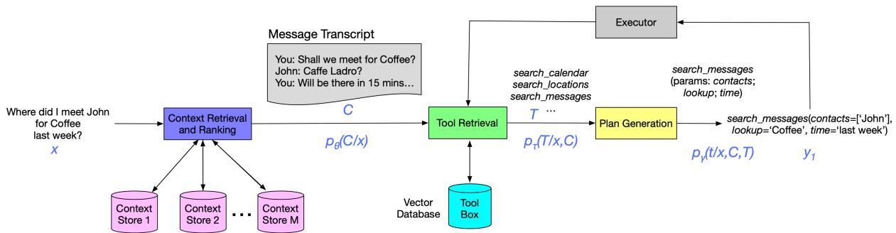
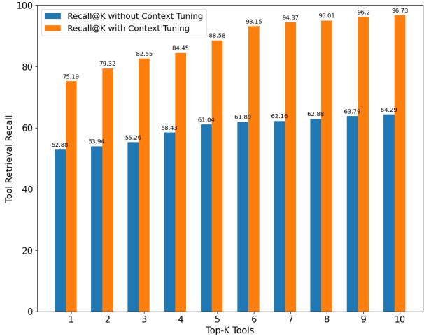
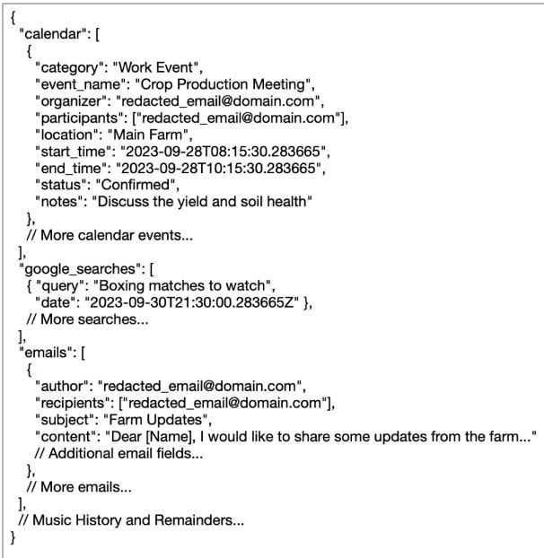

# Context Tuning for Retrieval Augmented Generation

Raviteja Anantha, Tharun Bethi, Danil Vodianik, Srinivas Chappidi Apple

# Abstract

Large language models (LLMs) have the remarkable ability to solve new tasks with just a few examples, but they need access to the right tools. Retrieval Augmented Generation (RAG) addresses this problem by retrieving a list of relevant tools for a given task. However, RAG’s tool retrieval step requires all the required information to be explicitly present in the query. This is a limitation, as semantic search, the widely adopted tool retrieval method, can fail when the query is incomplete or lacks context. To address this limitation, we propose Context Tuning for RAG, which employs a smart context retrieval system to fetch relevant information that improves both tool retrieval and plan generation. Our lightweight context retrieval model uses numerical, categorical, and habitual usage signals to retrieve and rank context items. Our empirical results demonstrate that context tuning significantly enhances semantic search, achieving a 3.5-fold and 1.5-fold improvement in Recall $@ \mathbf { K }$ for context retrieval and tool retrieval tasks respectively, and resulting in an $1 1 . 6 \%$ increase in LLM-based planner accuracy. Additionally, we show that our proposed lightweight model using Reciprocal Rank Fusion (RRF) with LambdaMART outperforms GPT-4 based retrieval. Moreover, we observe context augmentation at plan generation, even after tool retrieval, reduces hallucination.

# 1 Introduction

Large language models (LLMs) excel in a variety of tasks ranging from response generation and logical reasoning to program synthesis. One of the important active areas of LLM research is to utilize them as planning agents (Huang et al., 2022). Planning is an essential functionality for processing complex natural language instructions. A planner should possess the ability to select the appropriate tools to complete each sub-task. While LLMs exhibit exceptional generation capabilities, they have inherent limitations, such as lacking up-to-date information and exhibiting a tendency to hallucinate tools. By providing LLMs with a relevant set of tools based on the given task (Schick et al., 2023; Lu et al., 2023), one can alleviate the issue of outdated information. The set of methods to augment LLM input with retrieved information, such as relevant tools, is referred to as Retrieval Augmented Generation (RAG) (Guu et al., 2020; Lewis et al., 2020). RAG consists of three primary components: Tool Retrieval, Plan Generation, and Execution.1 In this study, we focus on enhancing tool retrieval, with the goal of achieving subsequent improvements in plan generation.

Existing RAG methodologies rely heavily on semantic search for tool retrieval, but this approach has limitations, especially when queries lack specificity or context. To this end, we present Context Tuning, a component in RAG that precedes tool retrieval, to provide contextual understanding and context seeking abilities to improve tool retrieval and plan generation. Our contribution can be summarized as follows:

1. We empirically show that traditional RAG is inadequate for implicit/context-seeking queries and present context tuning as a viable solution;   
2. We provide a systematic comparison of various context retrieval methods applied on both lightweight models and LLMs;   
3. We share empirically the insight that Chain of Thought (CoT) augmentation improves context retrieval when no fine-tuning is applied, whereas fine-tuning the retrieval model removes the need for CoT augmentation;

4. We propose a lightweight model using Reciprocal Rank Fusion (RRF) (Cormack et al.,

2009) with LambdaMART (Burges, 2010), which outperforms GPT-4 (OpenAI, 2023) system, and finally;

5. We show that context augmentation at plan generation reduces hallucinations.

# 2 Related Work

Using retrieval to incorporate tools into plan generation with LLMs has emerged as a burgeoning area of research, with ongoing investigations aimed at enhancing both the retrieval component and the LLMs themselves. Our work falls within the former category, placing a particular emphasis on refining retrieval methodologies to enhance contextual understanding of implicit and ambiguous queries that demand context-seeking capabilities.

The integration of tools into generation has been demonstrated to enhance the capabilities of LLMbased planners in recent studies (Schick et al., 2023; Lu et al., 2023). However, these works primarily focus on well-defined or unambiguous queries, where retrieving supplementary information to augment the query is not strictly required. For question answering (QA) tasks, incorporating any off-the-shelf document retriever has been shown to improve LLM generation, with the addition of re-ranking further boosting performance (Ram et al., 2023). While re-ranking is preferred, employing any pretrained retriever, particularly a text-based retriever, would be sub-optimal due to the inadequate information expected from ambiguous queries. Our work demonstrates the inadequacy of text-based retrievers for context retrieval and the necessity of more advanced retrieval models.

To address the lack of context inherent in underspecified queries, some studies have explored the use of CoT (Wei et al., 2022) mechanisms to generate text that closely approximates the semantic similarity of relevant context (Ma et al., 2023). While CoT augmentation improves upon baseline methods, such as vanilla semantic search, CoT may potentially increase the input length to the LLM, which has a limited context window size. Additionally, studies have demonstrated that the placement of relevant information impacts LLM generation (Liu et al., 2023). Therefore, it is preferable to avoid increasing input sequence length if the same or better results can be achieved without query augmentation. Distillation-based query augmentation approaches have been proposed to address this problem (Srinivasan et al., 2023). Our work unveils that fine-tuning semantic search obviates the necessity for query augmentation while achieving comparable performance.

Recent studies have shown LLMs can act as zero-shot rankers through pairwise ranking prompting (Qin et al., 2023). While addition of ranking for retrieval component has shown improvement in QA tasks, direct use of LLMs for the ranking task, in addition to plan generation, incurs twice the inference cost. We empirically show that our proposed lightweight context tuning method, LambdaMART (Burges, 2010) based RRF (Cormack et al., 2009), outperforms both fine-tuning approach and GPT-4 (OpenAI, 2023) based CoT Augmentation.

# 3 Methodology

Our experiments train and evaluate tool retrieval and planning with and without context tuning. Figure 1 illustrates how a context-seeking query uses context retrieval to enhance tool retrieval and plan generation.

# 3.1 Data Generation

Our study employed a data generation methodology using synthetic application data, aimed at simulating real-world scenarios for a digital assistant. The data encompasses 7 commonly used applications: mail, calendar, google, music, reminders, notes, and phone call. We generated this data using GPT4, ensuring diversity in the dataset to reflect a wide range of user personalities. The synthetic dataset contained a diverse range of context items spanning various applications. A total of 791 distinct personas were synthesized, yielding 4,338 unique implicit queries for training and 936 implicit queries for evaluation.

Additionally, we developed a toolbox containing APIs for each of the applications we considered. This toolbox was created using in-context learning with GPT-4 and contained a total of 59 APIs distributed across the applications.

To simulate user interaction with a virtual assistant, GPT-4 was also utilized to generate realistic queries grounded in the application data. Following this, we employed GPT-4 to retrieve the appropriate tool from the generated toolbox in response to these queries. Finally, GPT-4 was used to resolve the tool’s API with the correct parameters. This methodology provided a comprehensive and realistic dataset, essential for the evaluation of our context tuning approach in RAG-based planning systems.2

  
Figure 1: Context-tuned RAG pipeline illustrating end-to-end processing of a complex request with progressive plan generation.

# 3.2 Context Tuning

To compare various context retrieval methods, we employ both text-based and vector-based retrieval baselines. We simulate different context stores by structuring context data per persona and train models to perform federated search. We use query and persona meta-signals, such as frequency, usage history, and correlation with geo-temporal features, to perform retrieval. We evaluate context retrieval using the Recall $@ \mathbf { K }$ and Normalized Discounted Cumulative Gain $( \mathrm { N D C G } @ \mathrm { K } )$ metrics.

BM25 For text-based search, we use an improved version of BM25, called BM25T (Trotman et al., 2014).

Semantic Search For vector-based search, we employ the widely adopted Semantic Search approach. We use GTR-T5-XL (Ni et al., 2021) to generate query and context item embeddings, which are then ranked using cosine similarity to select the top-K results. We evaluate both pre-trained and fine-tuned variants of this method.

CoT Augmentation To enhance the likelihood of semantic alignment with pertinent contextual elements, we augment the under-specified or implicit query with GPT-4 (OpenAI, 2023) generated CoT.3 We evaluate both pre-trained and fine-tuned semantic search versions utilizing CoT.

LambdaMART with RRF Reciprocal Rank Fusion (RRF) (Cormack et al., 2009) is shown to outperform individual rank learning methods. To leverage this advantage, we propose a lightweight model that uses LambdaMART (Burges, 2010) for initial ranking of data across context stores, followed by re-ranking using RRF.

# 3.3 Tool Retrieval

While advanced ranking models can enhance the recall of tool retrieval, we employ the pre-trained GTR-T5-XL model for semantic search using cosine similarity to retrieve the top-K tools. Extending the tool retrieval process to incorporate ranking should be a straightforward endeavor. We evaluate tool retrieval performance with and without context retrieval using Recall $@ \mathrm { K }$ .

# 3.4 Planner

The planner’s objective is to select the most appropriate tool from the retrieved tool list and generate a well-formed plan. A plan comprises an API call constructed using the chosen tool and parameters extracted from the query and retrieved context. We fine-tune OpenLLaMA-v2-7B (Touvron et al., 2023) for plan generation. To assess the planner’s performance, we employ the Abstract Syntax Tree (AST) matching strategy to compute plan accuracy. A hallucination is defined as a plan generated using an imaginary tool.

# 4 Results

# 4.1 Context Retrieval

Consistent with expectations, vector-based search surpasses text-based search, as shown in Table 1. Nevertheless, both approaches struggle to retrieve relevant context for under-specified queries. Finetuned semantic search and CoT augmentation with pre-trained semantic search both significantly enhance retrieval performance. Notably, when finetuning is employed, CoT augmentation yields only marginal gains, suggesting that comparable improvements could be achieved without augmenting the input sequence with CoT.

Table 1: A comparison of various Context Retrieval methods using Recall $@ \mathrm { K }$ and ${ \mathrm { N D C G } } @ { \mathrm { K } }$ metrics. The context-seeking query is used as input to perform a federated search across different context stores, after which semantic search or ranking is applied.   

<table><tr><td rowspan="2">Retrieval Method</td><td colspan="2">Recall@K</td><td colspan="4">NDCG@K</td></tr><tr><td>K=3</td><td>K=5</td><td>K=10</td><td>K=3</td><td>K=5</td><td>K=10</td></tr><tr><td>BM25</td><td>11.35</td><td>13.47</td><td>14.92</td><td>56.45</td><td>52.33</td><td>50.91</td></tr><tr><td>Semantic Search</td><td>23.74</td><td>25.38</td><td>26.99</td><td>65.44</td><td>64.31</td><td>64.02</td></tr><tr><td>CoT Augmentation</td><td>71.77</td><td>85.61</td><td>94.41</td><td>93.67</td><td>91.78</td><td>88.40</td></tr><tr><td>Finetuned Semantic Search</td><td>73.48</td><td>88.52</td><td>95.13</td><td>93.81</td><td>94.07</td><td>94.23</td></tr><tr><td>Finetuned w/ CoT Augmentation</td><td>73.55</td><td>88.53</td><td>95.17</td><td>93.92</td><td>94.11</td><td>94.22</td></tr><tr><td>LambdaMART- RRF</td><td>81.27</td><td>92.65</td><td>98.77</td><td>96.39</td><td>97.11</td><td>98.24</td></tr></table>

  
Figure 2: Evaluation of tool retrieval using Recall $@ \mathbf { k }$ , with and without context tuning.

Our proposed approach utilizing LambdaMART with RRF outperforms both fine-tuned semantic search and CoT augmentation. Additionally, we observe that for fine-tuned methods, both Recall $@ \mathrm { K }$ and ${ \mathrm { N D C G } } @ { \mathrm { K } }$ increase with K, whereas for pretrained methods, ${ \mathrm { N D C G } } @ { \mathrm { K } }$ decreases with an increase in K and Recall $@ \mathrm { K }$ .

# 4.2 Tool Retrieval

Figure 2 illustrates the performance of tool retrieval using semantic search. Incorporating relevant context into tool retrieval consistently yields substantial gains across various K-values.

# 4.3 Planner

To establish the planner’s lower bound, we remove the retrieval step, while the upper bound is set by directly utilizing context and/or tool labels, effectively employing oracle retrievers. Table 2 encapsulates the end-to-end evaluation of the fine-tuned planner, demonstrating that the context-tuned planner significantly outperforms the planner based on traditional RAG using semantic search. Notably, even when the correct tool is retrieved, incorporating relevant context in plan generation, as evidenced by the upper bound, helps in reducing hallucination.

Table 2: End-to-end planner evaluation both with and without context tuning. “Lower Bound" excludes retrieval and performs direct plan generation while “Upper Bound" assumes perfect context and tool retrieval.   

<table><tr><td>Setting</td><td>AST-based Plan Acc ↑</td><td>Exact Match ↑</td><td>Hallucination ↓</td></tr><tr><td>Lower Bound</td><td>43.77</td><td>39.45</td><td>2.59</td></tr><tr><td>RAG-based Planner</td><td>76.39</td><td>58.12</td><td>1.76</td></tr><tr><td>Context-tuned RAG Planner</td><td>85.24</td><td>67.33</td><td>0.93</td></tr><tr><td>Upper Bound</td><td>91.47</td><td>72.65</td><td>0.85</td></tr><tr><td>Context-tuned Upper Bound</td><td>91.62</td><td>72.84</td><td>0.53</td></tr></table>

# 5 Conclusion

Our work introduces context tuning, a novel component that enhances RAG-based planning by equipping it with essential context-seeking capabilities to address incomplete or under-specified queries. Through a systematic comparison of various retrieval methods applied to both lightweight models and LLMs, we demonstrate the effectiveness of context tuning in improving contextual understanding. Our empirical observations reveal that CoT augmentation enhances context retrieval when finetuning is not applied, while fine-tuning the retrieval model eliminates the need for CoT augmentation. Furthermore, we observe that context augmentation at the plan generation stage reduces hallucinations. Finally, we showcase the superiority of our proposed lightweight model using RRF with LambdaMART over the GPT-4-based system.

# Limitations

The current work does not utilize conversation history, which is crucial for handling explicit multiturn instructions that contain anaphora or ellipsis. This limitation also hinders the model’s ability to effectively process and respond to complex tasks that require multi-hop context retrieval. Additionally, the absence of conversation history impedes the model’s ability to adapt to topic shifts that may occur throughout a dialogue.

Furthermore, the performance of the planner model is constrained by the length of the context window. While employing LLMs with longer context windows can enhance performance, it also increases model size and computational complexity. To address this limitation, incorporating context compression techniques could potentially improve end-to-end performance without incurring significant increases in model size.

Due to privacy constraints, we simulated realworld data by generating synthetic user profiles and personas that mirrored real-world use cases for a digital assistant.

# Ethics Statement

To safeguard privacy, this study exclusively utilizes synthetically generated data, eliminating the use of real user information under ethical considerations.

# Acknowledgements

We would like to thank Stephen Pulman, Barry Theobald and Joel Moniz for their valuable feedback.

# References

Christopher J.C. Burges. 2010. From ranknet to lambdarank to lambdamart: An overview. Microsoft Research Technical Report MSR-TR-2010-82.

Gordon V. Cormack, Charles L. A. Clarke, and Stefan Buettcher. 2009. Reciprocal rank fusion outperforms condorcet and individual rank learning methods. In Proceedings of the 32nd International ACM SIGIR Conference on Research and Development in Information Retrieval., pages 758–759.

Kelvin Guu, Kenton Lee, Zora Tung, Panupong Pasupat, and Ming-Wei Chang. 2020. Realm: Retrievalaugmented language model pre-training.

Wenlong Huang, Pieter Abbeel, Deepak Pathak, and Igor Mordatch. 2022. Language models as zero-shot planners: Extracting actionable knowledge for embodied agents.

Patrick Lewis, Ethan Perez, Aleksandra Piktus, Fabio Petroni, Vladimir Karpukhin, Naman Goyal, Heinrich Küttler, Mike Lewis, Wen tau Yih, Tim Rocktäschel, Sebastian Riedel, and Douwe Kiela. 2020. Retrieval-augmented generation for knowledgeintensive nlp tasks.

Nelson F. Liu, Kevin Lin, John Hewitt, Ashwin Paranjape, Michele Bevilacqua, Fabio Petroni, and Percy Liang. 2023. Lost in the middle: How language models use long contexts. arXiv preprint arXiv:2307.03172.

Pan Lu, Baolin Peng, Hao Cheng, Michel Galley, KaiWei Chang, Ying Nian Wu, Song-Chun Zhu, and Jianfeng Gao. 2023. Chameleon: Plug-and-play compositional reasoning with large language models. arXiv preprint arXiv:2304.09842.

Xinbei Ma, Yeyun Gong, Pengcheng He, Hai Zhao, and Nan Duan. 2023. Query rewriting for retrievalaugmented large language models. arXiv preprint arXiv:2305.14283.

Jianmo Ni, Chen Qu, Jing Lu, Zhuyun Dai, Gustavo Hernández Ábrego, Ji Ma, Vincent Y. Zhao, Yi Luan, Keith B. Hall, Ming-Wei Chang, and Yinfei Yang. 2021. Large dual encoders are generalizable retrievers.

OpenAI. 2023. Gpt-4 technical report.

Zhen Qin, Rolf Jagerman, Kai Hui, Honglei Zhuang, Junru Wu, Jiaming Shen, Tianqi Liu, Jialu Liu, Donald Metzler, Xuanhui Wang, and Michael Bendersky. 2023. Large language models are effective text rankers with pairwise ranking prompting. arXiv preprint arXiv:2306.17563v1.

Ori Ram, Yoav Levine, Itay Dalmedigos, Dor Muhlgay, Amnon Shashua, Kevin Leyton-Brown, and Yoav Shoham. 2023. In-context retrieval-augmented language models. arXiv preprint arXiv:2302.00083.

Timo Schick, Jane Dwivedi-Yu, Roberto Dessì, Roberta Raileanu, Maria Lomeli, Luke Zettlemoyer, Nicola Cancedda, and Thomas Scialom. 2023. Toolformer: Language models can teach themselves to use tools. arXiv preprint arXiv:2302.04761.

Krishna Srinivasan, Karthik Raman, Anupam Samanta, Lingrui Liao, Luca Bertelli, and Mike Bendersky. 2023. Quill: Query intent with large language models using retrieval augmentation and multi-stage distillation. arXiv preprint arXiv:2210.15718v1.

Hugo Touvron, Thibaut Lavril, Gautier Izacard, Xavier Martinet, Marie-Anne Lachaux, Timothée Lacroix, Baptiste Rozière, Naman Goyal, Eric Hambro, Faisal Azhar, et al. 2023. Llama: Open and efficient foundation language models. arXiv preprint arXiv:2302.13971.

Andrew Trotman, Antti Puurula, and Blake Burgess. 2014. Improvements to bm25 and language models examined. In Proceedings of the 32nd International ACM SIGIR Conference on Research and Development in Information Retrieval., pages 58–65.

Jason Wei, Xuezhi Wang, Dale Schuurmans, Maarten Bosma, Brian Ichter, Fei Xia, Ed Chi, Quoc Le, and Denny Zhou. 2022. Chain-of-thought prompting elicits reasoning in large language models. arXiv preprint arXiv:2201.11903.

# A Data Generation Details

# A.1 Implicit Query Dataset

For our experiments, we created a synthetic dataset to simulate realistic interactions across various applications commonly found with digital assistants. The dataset is structured to encompass a diverse range of contexts, representing different synthetic user activities and interactions.

Data Points: A total of 791 unique personas were synthesized, covering seven key applications: Mail, Calendar, Google, Music, Reminders, Notes, and Phone Calls. The final dataset contained 4,338 train and 936 test data points.

Generation Method: We utilized GPT-4 to generate the data. We ensured high diversity in the dataset is met through manual inspection, this is essential to accurately reflect a wide range of synthetic user personalities and interaction patterns.

Data Representation: Each data point in the dataset contains multiple contextual information fields, relevant to the specific application and synthetic user’s activity. An example of persona in JSON format is shown in Figure 3.

  
Figure 3: Snippet of a persona

Table 3 shows the distribution of context items per application in our dataset.

# A.2 Persona Data Creation Example Prompt

I'm working on generating synthetic data for a user ( also known as persona ) and the persona 's

Table 3: Distribution of context items per application.   

<table><tr><td rowspan=1 colspan=1>Application</td><td rowspan=1 colspan=1>Avg. Context Items</td></tr><tr><td rowspan=1 colspan=1>Mail</td><td rowspan=1 colspan=1>2.93</td></tr><tr><td rowspan=1 colspan=1>Calendar</td><td rowspan=1 colspan=1>5.63</td></tr><tr><td rowspan=1 colspan=1>Google</td><td rowspan=1 colspan=1>9.57</td></tr><tr><td rowspan=1 colspan=1>Notes</td><td rowspan=1 colspan=1>2.23</td></tr><tr><td rowspan=1 colspan=1>Music</td><td rowspan=1 colspan=1>4.38</td></tr><tr><td rowspan=1 colspan=1>Reminders</td><td rowspan=1 colspan=1>4.81</td></tr><tr><td rowspan=1 colspan=1>Phonecall</td><td rowspan=1 colspan=1>2.34</td></tr></table>

iPhone Data .

Here are the characteristics of the persona that we would like to generate the data for :

age : 22   
favorite_music_genre : Pop   
favorite_movie_genre : Romance   
favorite_cuisine : Italian   
favorite_sport : Tennis   
profession : Software Developer   
hobbies : [' Cooking ', 'Swimming ', Reading ']

I want to generate data for ios App called Music with bundle id as com . apple . music .

Can you generate around 5 recently played songs

Instructions :

1. Today 's date is 2023 -12 -07 11:18:19.028759 , Please generate any times or dates in the past 15 days .   
2. 'played_time ' should be in yyyy - MM - dd HH : mm : ss . SSS format   
Use the following schema :   
The output should be formatted as a JSON instance that conforms to the JSON schema below .   
As an example , for the schema {" properties ": {" foo ": {" title ": " Foo " " description ": " a list of strings " type ": " array " , " items ": {" type ": " string "}}} , " required ": [" foo "]}   
the object {" foo ": [" bar " , " baz "]} is a well - formatted instance of the schema . The object {" properties ": {" foo ": [" bar " , " baz "]}} is not well - formatted .

Here is the output schema :

{" \$defs ": {" MusicAppData ": {" properties ": {" recent_songs ": {" items ": {" \$ref ": "#/ \$defs / Song "} , " title ": " Recent Songs " , " type ": " array "} , " current_playing ": {" \$ref ": "#/ \$defs / Song "}} , " required ": [" current_playing "] , " title ": "

MusicAppData " , " type ": " object "} , " Song ": {" properties ": {" played_time ": {" default ": "" , " title ": " PlayedTime " , " type ": " string "} , " album_title ": {" default ": " " " title ": " Album Title " , " type ": " string "} , " artist ": {" default ": " " " title ": " Artist " , " type ": " string "} , "   
song_name ": {" default ": " " " title ": " Song Name " , " type ": " string "} , " id ": {" default ": "" , " title ": " Id " , " . " title ": " Song " , type ": " string "}} ,   
" type ": " object "}} , " properties ": {" app_name ": {" default ": "" , " title ": " App Name " , " type ": " string "} , "   
app_bundle_id ": {" default ": "" " title ": " App Bundle Id " , " type ": " string "} , " app_data ": {" \$ref ": "#/ \$defs / MusicAppData "}} , " required ": [" app_data "]}

Do not include any explanations , only provide a RFC8259 compliant JSON response following this format without deviation .

# A.3 Synthetic Toolbox Generation

You are an intelligent AI assistant tasked with generating APIs for iOS that can be used to interact with Applications . For example , if I ask you to generate APIs for Messages iOS Application , you would generate a comprehensive set of APIs that can perform any action on the app . Some examples below are :

api : read_message

description : Messages App 's read_message API is used to read messages from a particular contact

arguments : - contact : contact from which the message was received

api : read_unread_messages   
description : Messages App 's read_unread_messages API is used to read all unread messages on your iPhone   
arguments :

api : send_message

description : Messages App 's send_message API is used to send message to a particular contact

arguments :

- text : text to be sent to the contact - contact : contact information

api : send_group_message   
description : Messages App 's send_group_message API is used to send a message to a list of contacts

arguments :

- text : text to be sent to the group - contacts : list of contacts in the group

api : search_messages description : Messages App 's search_messages API is used to search messages by text , recipient , sender .

arguments :

- text : text to be searched .   
- recipient : search messages by recipient name   
- sender : Search messages by sender name

Similarly , can you generate the APIs for the following Application : { application }?

Do not include any explanations . Only provide the APIs in YAML format as above .

The following table represents the distribution of APIs:

Table 4: Distribution of APIs generated by Synthetic Toolbox Generation   

<table><tr><td rowspan=1 colspan=1>Application</td><td rowspan=1 colspan=1>APIs Count</td></tr><tr><td rowspan=1 colspan=1>Music</td><td rowspan=1 colspan=1>11</td></tr><tr><td rowspan=1 colspan=1>Google</td><td rowspan=1 colspan=1>10</td></tr><tr><td rowspan=1 colspan=1>Notes</td><td rowspan=1 colspan=1>9</td></tr><tr><td rowspan=1 colspan=1>Mail</td><td rowspan=1 colspan=1>8</td></tr><tr><td rowspan=1 colspan=1>PhoneCall</td><td rowspan=1 colspan=1>8</td></tr><tr><td rowspan=1 colspan=1>Calendar</td><td rowspan=1 colspan=1>7</td></tr><tr><td rowspan=1 colspan=1>Reminders</td><td rowspan=1 colspan=1>6</td></tr></table>

# A.4 Tool Retrieval

I have the following toolbox defined with the available APIs : { tools }

For the following query : { query }

Suggest the most appropriate api ? If there is no API available in the toolbox , then output default .   
Only output the API name without any explanations

# A.5 Plan Resolution

You are an intelligent AI Planner helping me come up with a plan and resolve the variables .

I have the following query : { query }

I have selected the following tool to perform the task :   
{ tool }

Can you come up with fully resolved plan using the following schema ? { format_instructions }

# A.6 Prompt to generate CoT

You are an expert in processing context - seeking or under - specified queries by finding missing context in the query . As an expert , your task is to generate concise chain of thought which when used to augment the context - seeking query , increases the semantic similarity of the updated query with relevant context items . Please only use the following context types : 'Mail ', 'Calendar ', Reminders ', 'Notes ', 'Photos ', PhoneCall ', 'Message ', 'Messenger ', 'Maps ', 'Google Maps ', 'Music ', I Spotify ', 'Find My ', 'Workout '; and do not create new context types .

Context - seeking Query : { query }

Your expert Chain of Thought :

Examples showing generated implicit queries along with CoT, context and plan labels are shown in Table 5.

Table 5: A sample of context-seeking or under-specified queries along with CoT produced by GPT-4. The columns for context and tools show labels for those retrieval tasks.   

<table><tr><td rowspan=1 colspan=1>Implicit Query</td><td rowspan=1 colspan=1>CoT</td><td rowspan=1 colspan=1>Relevant Context</td><td rowspan=1 colspan=1>Top-3 Relevant Tools</td></tr><tr><td rowspan=1 colspan=1>When is my nextguitar lesson?</td><td rowspan=1 colspan=1>Check the &#x27;Calendar&#x27; for anyupcoming guitar lessons.If not there, check &#x27;Reminders&#x27;for any alerts set about the lesson.</td><td rowspan=1 colspan=1>The user has a remindertitled &quot;Guitar Class&quot;</td><td rowspan=1 colspan=1>[&#x27;Reminders&#x27;, &#x27;Calendar&#x27;,&#x27;Notes&#x27;]</td></tr><tr><td rowspan=1 colspan=1>I need to check mydiet plan again.</td><td rowspan=1 colspan=1>I may have noted down thediet plan in &#x27;Notes&#x27;. If notthere, perhaps I saved a photoof it in &#x27;Photos&#x27;.</td><td rowspan=1 colspan=1>The user has a note titledIntermittent Fasting Plan.The user also has animage titled &quot;Keto Diet.&quot;</td><td rowspan=1 colspan=1>[&#x27;Photos&#x27;, &#x27;Notes&#x27;,&#x27;Mail&#x27;]</td></tr><tr><td rowspan=1 colspan=1>I&#x27;m running late.</td><td rowspan=1 colspan=1>Check &#x27;Calendar&#x27; for anyscheduled meetings. If so, verify&#x27;Maps&#x27; or &#x27;Google Maps&#x27; togauge current traffic situationand estimated time of arrival.Use &#x27;Messages&#x27; or &#x27;Messenger&#x27;or &#x27;Mail&#x27; to inform the meetingattendees that you are&quot;running late&quot;.</td><td rowspan=1 colspan=1>The user has an upcomingmeeting titled &quot;LLMDiscussion&quot; organized by&quot;John Doe.&quot;</td><td rowspan=1 colspan=1>[&#x27;Calendar&#x27;, &#x27;Mail&#x27;,&#x27;Messages&#x27;</td></tr></table>