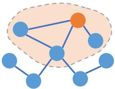
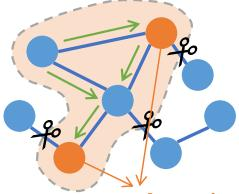
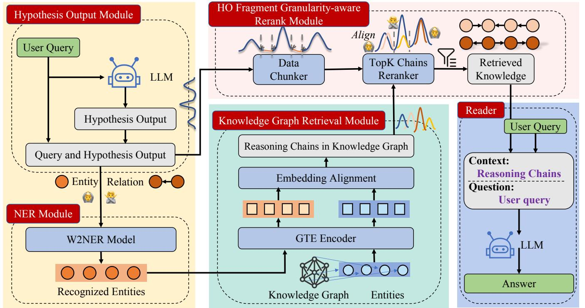
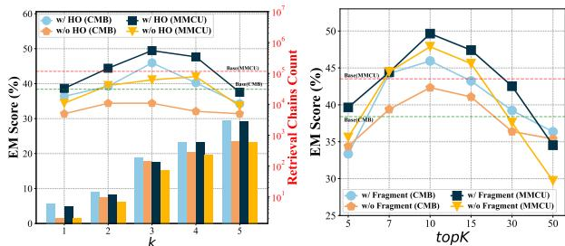

# HyKGE: A Hypothesis Knowledge Graph Enhanced Framework for Accurate and Reliable Medical LLMs Responses

Xinke Jiang\*, Ruizhe Zhang\*, Yongxin Xu∗   
Rihong Qiu, Yue Fang, Zhiyuan Wang, Jinyi Tang, Hongxin Ding Xu Chu†, Junfeng Zhao†‡, Yasha Wang†‡   
Key Laboratory of High Confidence Software Technologies (Peking University) Ministry of Education; School of Computer Science, Peking University Beijing, China

# ABSTRACT

In this paper, we investigate the retrieval-augmented generation (RAG) based on Knowledge Graphs (KGs) to improve the accuracy and reliability of Large Language Models (LLMs). Recent approaches suffer from insufficient and repetitive knowledge retrieval, tedious and time-consuming query parsing, and monotonous knowledge utilization. To this end, we develop a Hypothesis Knowledge Graph Enhanced (HyKGE) framework, which leverages LLMs’ powerful reasoning capacity to compensate for the incompleteness of user queries, optimizes the interaction process with LLMs, and provides diverse retrieved knowledge. Specifically, HyKGE explores the zeroshot capability and the rich knowledge of LLMs with Hypothesis Outputs to extend feasible exploration directions in the KGs, as well as the carefully curated prompt to enhance the density and efficiency of LLMs’ responses. Furthermore, we introduce the HO Fragment Granularity-aware Rerank Module to filter out noise while ensuring the balance between diversity and relevance in retrieved knowledge. Experiments on two Chinese medical multiplechoice question datasets and one Chinese open-domain medical Q&A dataset with two LLM turbos demonstrate the superiority of HyKGE in terms of accuracy and explainability.

# CCS CONCEPTS

• Information systems Information retrieval query processing; Novelty in information retrieval.

# KEYWORDS

Natural Language Processing, Large Language Models, RetrievalAugmented Generation, Knowledge Graph, Medical Question Answering

# 1 INTRODUCTION

Large Language Models (LLMs), such as ChatGPT [53] and GPT4 [54], have achieved remarkable progress in pivotal areas. By undergoing pre-training on massive text corpora and aligning finetuning to follow human instructions [78, 101], they have recently demonstrated exceptional performance in a range of downstream tasks [31]. These achievements underscore the vast potential of

LLMs in understanding and generating natural language [73], especially in the medical domain [7, 36, 56, 74, 76, 83, 89, 95, 100]. Despite the advancements of fine-tuning, they still encounter significant challenges, including the difficulty in avoiding factual inaccuracies (i.e., hallucinations and limited explainability) [13, 26, 27], data constraints (i.e. token resource limit, high training costs, and privacy concerns)1, catastrophic forgetting [20], outdated knowledge [21], and a lack of expertise in handling specific domains or highly specialized queries [29]. This undermines their reliability in areas where accountability and trustworthiness are crucial and infallible in the medical area [26, 37, 66].

Retrieval-Augmented Generation (RAG), enhances content generation by retrieving external information, reduces factual errors in knowledge-intensive tasks with the help of external knowledge and is seen as a promising solution to address incorrect answers, hallucinations, and insufficient interpretability [2, 3, 24]. Among the numerous external information sources [88], knowledge graphs (KGs), as a structured data source refined and extracted through advanced information extraction algorithms, can provide higher quality context. Compared to documents, KGs embody structured knowledge [25, 98], providing succinct content and facilitating the analysis of intricate relationships among entities, leading to advanced inference capabilities and enabling extrapolation for efficient knowledge retrieval. They are considered by many research works to improve the accuracy and reliability of answers provided by LLMs [57, 81]. However, the gap between unstructured user queries of inconsistent quality and structured, high-quality KGs [65] poses significant challenges on how to properly parse user intent for improving the robustness of retrieved knowledge (pre-retrieval phase) and how to handle the abundant retrieved knowledge (post-retrieval phase), which are detailed as follows:

Challenge I: At the pre-retrieval phase, previous works suffer from how to parse user intent and retrieve reasonable knowledge based on varying-quality user query. Some works are based on the Retrieve-Read framework, which initially obtains knowledge through dense vector retrieval according to user queries [51, 60, 91]. However, they are stricken with issues such as unclear expressions and lack of semantic information in the user’s original query. This misalignment between the semantic spaces of user queries and high-quality structured knowledge leads to the retrieval of knowledge that is of insufficient quality and may contain redundant information and noise [8]. In addition, the excessive redundant knowledge can lead to a waste of token resources, and the response speed of LLMs will drop sharply, which adversely damages the performance in real-world applications [17].

Challenge II: At the pre-retrieval phase, how to align user intent with high-quality structured knowledge while reducing interactions with LLMs remains an unresolved issue. Some works enable LLMs to step-by-step utilize knowledge to enhance intent parsing and inference of user queries. They facilitate the acquisition of planning and reflective abilities in LLMs’ interactions with KGs through multi-round chain-of-thought requests [3, 43, 68, 75, 92]. However, they are constrained by the expensive time overhead of multiple interactions with LLMs and the cumulative errors in the distributed reasoning process.

Challenge III: At the post-retrieval phase, previous studies often struggle with the dilemma of balancing the diversity and relevance of the retrieved knowledge. Recent post-retrieval models typically apply similarity filtering or a reranking approach in response to user queries to prune retrieved results [15, 17, 70]. However, user queries often exhibit notably monotonous properties and sparsely distributed keywords because the prevalence of natural language descriptions will tend to dilute its concentration [11]. Conversely, KGs are characterized by their inherently structured nature, resulting in a high knowledge density within retrieved results. As a consequence, pruning knowledge solely based on the user query can lead to a misalignment in knowledge density and the final result is often highly correlated yet excessively repetitive, significantly diminishing the efficacy of RAG. Therefore, one of the primary challenges in the post-retrieval phase is to balance the trade-off between relevant knowledge and diverse ones [11].

To cope with these challenges, we put forward the Hypothesis Knowledge Graph Enhanced (HyKGE) framework, a novel method based on the hypothesis output module (HOM) [18] to explore, locate, and prune search directions for accurate and reliable LLMs responses in pre-retrieval phase and greatly preserve the relevance and diversity of search results at in post-retrieval phase. i) Specifically, in the pre-retrieval phase, our key idea is that the zero-shot capability and rich knowledge of LLMs can compensate for the incompleteness of user queries, facilitating alignment with highquality external knowledge. For example, when facing the question “After meals, I feel a bit of stomach reflux. What medicine should I take? ”, if retrieval is based solely on the key entity “stomach reflux ” as illustrated in Figure 1(a), a large amount of noise will be introduced due to the broad semantics of the entity. However, if LLMs are guided to explore how to solve the problem, they will provide additional clues related to “stomach acid ”, “H2 receptor antagonists ” and “proton pump inhibitors ” as illustrated in Figure 1(b), based on the knowledge acquired during their pre-training and instruction fine-tuning phases, offering exploration directions for retrieval on the KGs. ii) Meanwhile, HyKGE utilizes the flexibility of natural language in prompts to set constraints, enabling LLMs to provide as comprehensive information as possible when outputting hypothesis results, thereby reducing the number of interactions and improving efficiency. iii) In the post-retrieval stage, to further enhance the alignment between user queries and external knowledge inference paths, we propose a Hypothesis Output-based (HO) Fragment Granularity-aware, which utilizes multiple short snippets from the hypothesis outputs as well as the user query to rerank and filter the retrieved knowledge, greatly avoiding the filtering of diverse knowledge. It ensures fine-grained interaction and filtering while addressing the issue of imprecise matching between monotonous and sparse text (user query) with multi-element and dense text (retrieved knowledge). Through comprehensive experiments, our main contributions can be summarized as follows:

• At the pre-retrieval phase, we leverage the zero-shot capability of LLMs to obtain an exploratory and hypothesis output, transforming the incomplete and non-professional nature of user queries. Corresponding anchor entities are then identified from the hypothesis output on the KGs, providing a direction for exploration and pruning retrieval space. Simultaneously, we utilize the knowledge chains to rectify errors and illogicalities in the hypothesis outputs, mitigating hallucinations and false knowledge problems. • At the post-retrieval stage, we propose a HO Fragment Granularityaware rerank module to further enhance the knowledge density alignment between the retrieved reasoning chains and hypothesis outputs at a finer granularity, greatly preserving relevant yet diverse knowledge through the idea of divide-and-conquer. • We validate the superiority of the HyKGE through various observations by experiments on two Chinese medical multiple-choice question datasets and one Chinese medical open-domain Q&A dataset with two LLM turbos. This integration of LLMs and KGs addresses key challenges in medical LLMs, notably in accuracy and explainability, and has potential applications in improving medical consultation quality, diagnosis accuracy, and expediting medical research.

# 2 RELATED WORK

Retrieval-Augmented Generation. RAG incorporates the external knowledge retrieval component via prompt engineering to achieve more factual consistency, enhancing the reliability and interpretability of LLMs’ responses [39]. Classic RAG methods leverage retriever models to source relevant documents from large knowledge corpora [84], followed by reranker models that distill contents and reader models for further processing [57, 62]. Despite advancements in retriever [33, 51, 60] and reranker efficiency [14, 91], they still encounter difficulty in acquiring highquality datasets for training query-document pair retrievers or limited information in user queries which weakens their generalization capability [19]. Moreover, some researches focus on fine-tuning reader LLMs, applying instruction-tuning with retrieved knowledge or RAG API calls [4, 24, 46, 49, 79, 90, 97]. However, creating such datasets is also challenging due to the need for manual label correction, which in turn, may erode LLMs generalization capabilities and cause catastrophic forgetting in routine Q&A tasks.

Beyond optimizing submodels, HyDE [19] introduces an innovative method where instruction-following LLMs generate hypothesis documents based on user queries to enhance retriever performance, particularly in zero-shot scenarios. Other methods like CoN [93] and CoK [44] involve LLMs in note-making and step-wise reasoning verification through customized prompts, and greatly rely on frequent interactions with LLMs. However, such an approach is excessively inefficient for deployment in real-world Q&A scenarios.

Our HyKGE, uses LLM hypothesis output for exploratory directions in KGs and corrects model errors using graph reasoning chains during pre-retrieval, and applies fine-grained alignment in

Query After meals, I feel a bit of stomach reflux. What medication should I take for it?

# Entities:

1. stomach acid   
2. gastroesophageal reflux

# Search KG according to query only

Prompt $=$ Query $^ +$ Entities

Query After meals, I feel a bit of stomach reflux. What medication should I take for it?

# Step 1: Query LM and get hypothesis output

Hypothesis Output …Gastroesophageal reflux may caused by the backward flow of stomach acid into the esophagus … Depending on the evidence, considering the use of H2 receptor antagonists or proton pump inhibitors …

# Step 2: Search KG according to query and hypothesis output

# Reasoning Chain:

bile refluxmagnesiu abdomenuminum stomonate painheart m al carb burn excessive stomach acid stomach pain

Answer: Gastroesophageal reflux may be caused by the backward flow of food or stomach acid. You can consider using Acid-suppressing medications to relieve symptoms of gastric reflux and mitigating the development of reflux esophagitis…

# Prompt $=$ Query $^ +$ Reasoning Chains

Answer: Stomach acid backward may be the cause of gastroesophageal reflux …You may consider omeprazole or esomeprazole to reduce gastric acid secretion, …. Alternatively, you can use acid-neutralizing medications (antacids) such as magnesium aluminum carbonate. Another option is the use of H2 receptor antagonists such as ranitidine or famotidine …

Figure 1: (a) KGRAG (Left). Basic KGRAG extracts key entities from user queries and searches for corresponding entities within KG, which are then fed into LLMs along with the query. (b) HyKGE (Right). HyKGE first queries LLMs to obtain hypothesis output and extracts entities from both the hypothesis output and the query. Then HyKGE retrieves reasoning chains between any two anchor entities and feeds the reasoning chains together with the query into LLMs.

post-retrieval to maintain effective, diverse knowledge, enhancing retrieval efficiently without fine-tuning or excessive interactions.

Knowledge Graph Query-Answer. Compared to knowledge stored in document repositories [23], the knowledge contained within KGs has the advantages of being structured and inferable, rendering it a more suitable source for supplementing LLMs [28, 30, 48, 50, 63, 72]. However, how to design a retriever to extract knowledge from KGs and how to design interaction strategies between LLM and KGs are still in the exploratory stage2. KGRAG [65] uses the user query as a reference for retrieval in KGs, which suffers from misalignment between high-quality structured knowledge and varying-quality queries. Semantic parsing methods allow LLMs to convert the question into a structural query (e.g., SPARQL), which can be executed by a query engine to derive the answers on KGs [42, 44, 69]. However, these methods depend heavily on the quality of generated query sentences, displaying subpar performance when confronted with intricate queries.

# 3 PRELIMINARIES

Definition 3.1 (Knowledge Graph). Given a medical knowledge graph, denoted by $\mathcal { K } G = ( \mathcal { E } , \mathcal { R } , \mathcal { T } , \mathcal { D } , N )$ , where $\mathcal { E } = \{ e _ { 1 } , . . . , e _ { N } \}$ is the set of entities, $\mathcal { R } = \{ r _ { 1 } , . . . , r _ { P } \}$ is the set of relations, and $\mathcal { T } =$ $\{ ( e _ { t _ { i } ^ { h e a d } } , r _ { t _ { i } } , e _ { t _ { i } ^ { t a i l } } ) \mid 1 \leq i \leq T , e _ { t _ { i } ^ { h e a d } } , e _ { t _ { i } ^ { t a i l } } \in \mathcal { E } , r _ { t _ { i } } \in \mathcal { R } \}$ is the set of head-relation-tail triplets (facts). Additionally, $d _ { i } \in \mathcal { D }$ represents the entity description of $e _ { i }$ , and $N _ { v } = \{ ( r , u ) \mid ( v , r , u ) \in \mathcal { T } \}$ stands for the set of neighboring relations and entities of an entity $v$ .

Definition 3.2 (Knowledge Graph Retrieval). Knowledge Graph Retrieval [61] is a module that focuses on efficiently retrieving relevant information from $\mathcal { K G }$ based on the user query $\boldsymbol { Q }$ . In KGs, information is represented as entities, relations, and attributes, forming a structured network. The goal of retrieval is to find entities or relationships that additionally supply knowledge for LLMs. Particularly, we retrieve knowledge from the matched entities $\{ e _ { j } \}$ such as entity names, entity types, descriptions $\{ d _ { j } \}$ and even triplets or subgraphs $\mathcal { G } _ { e _ { j } } = ( e _ { j } , \mathcal { T } _ { j } , d _ { j } )$ .

# 4 METHOD

In this section, we detail our proposed HyKGE, and the overall framework is illustrated in Figure 2. In general, we will discuss our model from the four pipeline architectures:

• Pre-Retrieval Phase includes the Hypothesis Output Module (HOM) and the NER Module (NM). HOM leverages LLMs to obtain hypothesis output by exploring possible answers. Then NM extracts medical entities from HO and the user query. • Retrieval on Knowledge Graph utilizes the extracted entities as anchors to search three distinct types of reasoning chains interlinking these anchors, providing relevant and logical knowledge.

  
Figure 2: The overall framework of HyKGE. HyKGE first feeds the user query $( Q )$ through the LLMs and obtains Hypothesis Output $( { \mathcal { H } } O )$ . Then through the NER Module, a W2NER model is applied to recognize entities and isolate relations. Through GTE Encoder, these recognized entities are then linked with entities in KGs. After that, HyKGE extracts three types of relevant reasoning chains from KGs. Then, because of the sparseness of $\boldsymbol { Q }$ , in the HO Fragment Granularity-aware Rerank Module, HyKGE chunks $\boldsymbol { Q }$ and $\mathcal { H O }$ and align with reasoning chains via a TopK Chains Reranker, to eliminate irrelevant knowledge. Finally, we organize retrieved knowledge with the user query and obtain answers through LLM Reader.

• Post-Retrieval Phase utilizes the HO Fragment Granularityaware rerank approach. First, the hypothesis output and the user query are segmented into discrete fragments, and subsequently, we rerank the retrieved reasoning chains based on the fragments.

• LLM Reader is fed with the user query and the pruned retrieved reasoning chains, organized with carefully designed prompts.

Next, we will delineate each phase in detail in the following subsections and state the overall process in Section 4.5.

# 4.1 Pre-Retrieval Phase

Firstly, we let LLMs generate hypothesis outputs $( { \mathcal { H } } O )$ in response to user query $\boldsymbol { Q }$ , and then use the NER model to extract entities from both $\mathcal { H O }$ and $\boldsymbol { Q }$ . During this process, LLMs utilize inherent medical knowledge to explore potential answers. Although $\mathcal { H O }$ may contain factual errors or hallucinations between entities, the NER Module focuses solely on the extraction of entities while disregarding the relations, thus significantly isolating the correlation among medical entities. The subsequent graph retrieval phase (c.f. Section 4.2) searches the correct reasoning chains to discern and reintegrate the relationships between medical entities, avoiding LLMs’ shortages. The combination of HOM and NM provides us with a direction for exploration and identifies corresponding anchors in the KGs to guide subsequent graph retrieval, ensuring consistency and effectiveness in information processing.

4.1.1 Hypothesis Output Module. To enhance the quality of $\mathcal { H O }$ , due to LLMs’ robust reasoning abilities and potential as knowledge bases, we meticulously design instructions to guide LLMs in a stepby-step exploration and thoughtful consideration of problems, as illustrated in Figure 3 (Up.). Here, the prompt (a textual instruction) is denoted as $\mathcal { P } _ { \mathsf { H O } }$ , and $\boldsymbol { Q }$ to $\mathcal { H O }$ as:

$$
{ \mathcal { H } } O = \mathsf { L L M } ( Q \mid { \mathcal { P } } _ { \mathsf { H O } } ) .
$$

Thus, in light of the powerful reasoning abilities as well as the knowledgeable medical cognition, galore medical knowledge relevant to $\boldsymbol { Q }$ is discovered.

4.1.2 NER Module. Although there still remains a possibility of an inaccurate comprehension of relationships within $\mathcal { H O }$ (i.e. hallucinations or misunderstanding between medical entities), training a discriminative model or using other general-domain LLMs for authenticity $\mathcal { H O }$ is extremely labor-intensive and will lead to error accumulation. To tackle this issue, we extract entities instead of relationships, and utilize the completely unmistakable triplets in KGs for authenticity instead of the relations analyzed in $\mathcal { H O }$ . As a consequence, we have trained a medical Named Entity Recognition (NER) model using the CMEEE dataset3 [22, 96]. Our NER Module

# Figure 3: The prompt formats of (Up.) Hypothesis Output Module and (Down.) LLM Reader.

# The Prompt Format of Hypothesis Output Module (PHO)

# ### Task Description:

You are a medical expert. Please write a passage to answer [User Query] while adhering to [Answer Requirements].

# ### Answer Requirements:

1) Please take time to think slowly, understand step by step, and answer questions. Do not skip key steps.   
2) Fully analyze the problem through thinking and exploratory analysis.

### {{ User Query }}

# The Prompt Format of LLM Reader (PReader)

# ### Task Description:

You are a medical expert. Based on relevant medical [Background Knowledge] and your medical knowledge, provide professional medical advice for [User Query] while adhering to [Answer Requirements].

# ### Answer Requirements:

1) Take time to think slowly, understand step by step, and answer questions.   
2) Clearly state key information in the answer and provide direct and specific answers to user questions.

# ### {{ Background Knowledge }}

The retrieved knowledge chains are: Kidney stones Laboratory tests Serum calcium $\gets$ Laboratory tests Gastric ulcer... (example)

### {{ User Query }}

is built upon the W2NER model [40], the state-of-the-art wordword NER model that effectively addresses three primary types of NER situations (flat, overlapped, discontinuous). This medical NER model can wonderfully extract medical entities from complex medical contexts:

$$
{ \mathcal { U } } = [ u _ { 1 } , \cdots , u _ { | { \mathcal { U } } | } ] = { \mathsf { N E R } } ( Q \oplus { \mathcal { H } } O ) ,
$$

where $\oplus$ is the concatenation function and $u _ { i }$ represents the corresponding extracted entity.

# 4.2 Knowledge Graph Retrieval Module

4.2.1 Embedding Alignment. Subsequently, we link the potential entity to $\mathcal { K G }$ using dense retrieval methods. This process involves employing an encoding model, denoted as enc(·), to encode the potential entity $u _ { i }$ and entities $\varepsilon$ within $\mathcal { K G }$ . To be specific, we utilize the GTE embedding model [45] "gte_sentence-embedding"4, which is currently the top-performing model for text vector embedding in the retrieval field. GTE Encoder follows a two-stage training process: initially using a large-scale dataset with weak supervision from text pairs, followed by fine-tuning with high-quality manually labeled data using Contrastive Learning [38, 41].

Then, the inner product similarity between the embeddings of $u _ { i }$ and $\varepsilon$ is then computed. The entity with the highest similarity, surpassing a predefined threshold $\delta \in [ 0 , 1 ]$ , is considered a match. This linkage process can be formulated as follows:

$$
\begin{array} { r l } & { \mathsf { s i m } ( u _ { i } , e _ { j } ) = \big \langle \mathsf { e n c } ( u _ { i } ) , \mathsf { e n c } ( e _ { j } ) \big \rangle , \quad u _ { i } \in \mathcal { U } , e _ { j } \in \mathcal { E } , } \\ & { u _ { i }  e _ { j } \mathrm { i f f } e _ { j } = \{ \mathsf { a r g m a x } \mathsf { s i m } ( u _ { i } , e _ { k } ) \mid \mathsf { s i m } ( u _ { i } , e _ { j } ) > \delta \} , } \\ & { \qquad \quad \quad \quad e _ { k } \in \mathcal { E } } \end{array}
$$

4https://www.modelscope.cn/models/damo/nlp_gte_sentence-embedding where $\delta \in [ 0 , 1 ]$ is the threshold hyper-parameter. We utilize the same encoding model enc $( \cdot )$ to embed each medical entity, and $\left. \mathsf { e n c } ( u _ { i } ) , \mathsf { e n c } ( e _ { j } ) \right.$ denotes the inner product between extracted entities and KGs entities for achieving graph entity linking. Finally, the matched entities set is denoted as $\varepsilon _ { Q }$ .

4.2.2 Search Reasoning Chains in Knowledge Graph. Next, using matched entities, we explore reasoning chains within $k$ hops and consolidate this knowledge along with descriptions of the head and tail entities. Considering various knowledge graph retrieval methods, we opt for utilizing reasoning chains between entities for several reasons: i) Reasoning Chains provide richer logical knowledge provided for LLMs to help it digest, compared to entities and entity descriptions alone. ii) Reasoning chains help LLM Reader understand the relationships between different entities, thereby alleviating hallucinations and error problems. iii) Reasoning chains act as an efficient pruning mechanism, filtering out noise more effectively than subgraphs and saving token resources.

As a consequence, in light of [85], we consider three possible reasoning chains from medical perspective: i) Path (head-totail) as $\mathrm { { p a t h } } _ { i j }$ , for comprehensively analyzing the triggering and causal relationships between diseases and symptoms [52, 55]. ii) $_ { c o }$ -ancestor chain (tail-to-tail) as chain $\mathrm { C A } _ { i j }$ , for referring similar physiological or environmental factors for better analogical diagnosis [10]. iii) $\pmb { C o }$ -occurance chain (head-to-head) as chain $\mathrm { C O } _ { i j }$ , for better capturing the pathological characteristics and evolution of diseases [16]. In general, the reasoning chain set $\mathcal { R } C$ after the

Table 1: Analysis Comparison of RAG methods. Average Duration is computed based on GPT 3.5 turbo.   

<table><tr><td rowspan="2">Method</td><td rowspan="2">External Knowledge</td><td colspan="2">LLMs RAG Opt.</td><td rowspan="2">Avg. Time (s)</td></tr><tr><td>Finetuning Retriever</td><td> LLMs Interactions (/times)</td></tr><tr><td>Base</td><td>X</td><td>X</td><td>1</td><td>7.42</td></tr><tr><td>KGRAG</td><td></td><td>X</td><td>1</td><td>13.28</td></tr><tr><td>QE</td><td></td><td>✗</td><td>2</td><td>18.54</td></tr><tr><td>CoN</td><td></td><td>✓</td><td>≥ 2</td><td>34.33</td></tr><tr><td>CoK</td><td></td><td>X</td><td>≥ 4</td><td>45.84</td></tr><tr><td>KALMV</td><td></td><td>X</td><td>≥ 4</td><td>47.23</td></tr><tr><td>KG-GPT</td><td></td><td>X</td><td>5</td><td>55.19</td></tr><tr><td>SuRE</td><td></td><td>X</td><td>≥ 5</td><td>63.08</td></tr><tr><td>HyKGE (ours)</td><td></td><td></td><td>2</td><td>19.76</td></tr></table>

graph retrieval are as:

$$
\mathrm { p a t h } _ { i j } = ( e _ { i } \to r . \to e . \to \cdot \cdot \cdot \to r . \to e _ { j } , d _ { i } , d _ { j } ) ,
$$

$$
{ \mathrm { c h a i n C A } } _ { i j } = ( e _ { i } \to r . \to e .  \cdot \cdot  r .  e _ { j } , d _ { i } , d _ { j } ) ,
$$

$$
\mathrm { c h a i n C O } _ { i j } = ( e _ { i } \gets r . \gets e . \to \cdot \cdot \cdot \to r . \to e _ { j } , d _ { i } , d _ { j } ) ,
$$

where $e _ { i } , e _ { j } \in \mathcal { E } _ { Q }$ , and $r _ { \cdot }$ is the relation. For any entity pair in $\varepsilon _ { Q }$ , we collect its reasoning chains within $k ( k \geq 2 )$ hops and description of head and tail entity $d _ { i } , d _ { j }$ in $\mathcal { K G }$ .

# 4.3 Post-Retrieval Phase

Through retrieval, a large amount of reasoning chains will be collected. However, due to the considerable noise and the shortage of token resources (c.f. Challenge III in Section 1), we employ a reranker model to prune and eliminate irrelevant noise knowledge by reranking reasoning chains, leading to more efficient token resource utilization. For the reranker base model, we use the "bge_reranker_large"5 [82], trained through large-scale text pairs with asymmetric instruction tunning, to map text to a low-dimensional dense vector to rerank ???????? documents.

Moreover, due to the varying knowledge densities between queries and reasoning chains, traditional re-ranking based solely on $\boldsymbol { Q }$ may filter out valuable knowledge acquired through HOM, resulting in a repetitive and monotonous situation. As a consequence, we innovatively combine $\mathcal { H O }$ and $\boldsymbol { Q }$ , rather than relying solely on user query, utilizing the richer medical knowledge contained in $\mathcal { H O }$ . Practically, we first remove stop words from natural language and then we use the chunk method to segment $\mathcal { H O }$ and $\boldsymbol { Q }$ :

$$
\{ C \} = { \mathsf { C h u n k } } ( Q \oplus { \mathcal { H O } } ) ,
$$

where $\{ C \} = \{ c _ { 1 } , \cdot \cdot \cdot , c _ { i } , \cdot \cdot \cdot , c _ { | \{ C \} | } \}$ is the segmented fragments, with carefully selected chunk window size $l c$ and overlap size ????. Then, we leverage a reranking model denoted as Rerank $( x , y ; t o p K )$ , which means referring to segment set $x$ , we select the ???????? reranked retrieved chains from set $y$ . Acting as a filter, the reranking model reevaluates the significance of each chain, considering various factors such as relevance, coherence, and informativeness. The filtering process can be denoted as:

$$
\mathcal { R } C \mathrm { { p r u n e } } = \mathsf { R e r a n k } \big ( \mathcal { R } C , \{ C \} ; t o p K \big ) ,
$$

where $| \mathcal { R } C _ { \sf p r u n e } | = t o p K$

# 4.4 LLM Reader

Finally, we link ${ \mathcal { R C } } _ { \mathsf { p r u n e } }$ with directed arrows, combined with the description of the head and tail entities, and feed the retrieved

knowledge as well as user query $\boldsymbol { Q }$ to LLM Reader via prompt engineering. The prompt format $\mathcal { P } _ { \mathsf { R e a d e r } }$ is illustrated in Figure 3 (Down.) and the LLM’s answer can be expressed as:

$$
{ \mathsf { A n s w e r } } = \mathsf { L L M } ( Q , \mathcal { R} C _ { \mathsf { p r u n e } } \mid \mathcal { P } _ { \mathsf { R e a d e r } } ) .
$$

# 4.5 HyKGE Process

Algorithm 1 shows the overall RAG process of HyKGE. Given the knowledge graph $\mathcal { K G }$ , HyKGE first pre-embed the entity name using enc(·), and saves the vector locally (Lines 1-3). Then, we query LLM to obtain $\mathcal { H O }$ in response to user query $\boldsymbol { Q }$ (Line 4). After that, we extract entities from $\mathcal { H O }$ and $\boldsymbol { Q }$ (Line 5) and match them with $\mathcal { K G }$ (Line 6). HyKGE then retrieves the reasoning chains from $\mathcal { K G }$ (Line 7) while filtering the noise path with the HO Fragment Granularity-aware rerank module (Line 8). At last, HyKGE organizes the retrieved knowledge and query via prompt (Line 9) and queries LLM Reader to get the optimized answer (Line 10).

# Algorithm 1 The RAG process of HyKGE.

<table><tr><td></td><td>Require: Knowledge Graph KG = (E, R, T, D, N), token vocabulary set V, user query Q, trained NER model NER(·), trained embedded model enc(·), trained</td><td></td><td></td></tr><tr><td>Reranking model Rerank(· ), Large Language Model LLM(·), hyper-parameters δ, k, topK. 1: or e   do</td><td></td><td> Embed Knowledge Graph</td><td></td></tr><tr><td>2: Save enc(e) locally; 3:end for</td><td></td><td></td><td></td></tr><tr><td></td><td>4:Obtain HO via LLM: HO = LLM(Q | PHo); 5: Extract entities U from HO and Q via Eq.(2);</td><td> Hypothesis Output</td><td> NER Module</td></tr><tr><td></td><td>6: Match U with E via Eq.(3) and attain EQ;</td><td> Entity Linking</td><td></td></tr><tr><td></td><td>7: Retrieved reasoning chains between any two anchor entities from KG;</td><td></td><td>&gt;</td></tr><tr><td></td><td>Knowledge Graph Retrieval</td><td></td><td></td></tr><tr><td></td><td></td><td></td><td></td></tr><tr><td></td><td>8: Filter noise reasoning chains with HO Fragment Granularity-aware Rerank Mod-</td><td></td><td></td></tr><tr><td></td><td></td><td></td><td></td></tr><tr><td></td><td></td><td></td><td></td></tr><tr><td></td><td></td><td> Prune knowledge</td><td></td></tr><tr><td>ule;</td><td></td><td></td><td></td></tr><tr><td></td><td></td><td></td><td></td></tr><tr><td></td><td>9: Organize knowledge RCprune with user query Q into prompt;</td><td></td><td></td></tr><tr><td></td><td></td><td></td><td></td></tr><tr><td></td><td></td><td></td><td></td></tr><tr><td></td><td></td><td></td><td></td></tr><tr><td></td><td></td><td></td><td></td></tr><tr><td></td><td>10: Get optimized answer of LLMs;</td><td></td><td></td></tr><tr><td></td><td></td><td></td><td></td></tr><tr><td></td><td></td><td></td><td>&gt; LLM Reader</td></tr><tr><td></td><td></td><td></td><td></td></tr><tr><td></td><td></td><td></td><td></td></tr><tr><td></td><td></td><td></td><td></td></tr><tr><td></td><td></td><td></td><td></td></tr><tr><td></td><td></td><td></td><td></td></tr><tr><td></td><td></td><td></td><td></td></tr><tr><td></td><td></td><td></td><td></td></tr><tr><td></td><td></td><td></td><td></td></tr><tr><td></td><td></td><td></td><td></td></tr><tr><td></td><td></td><td></td><td></td></tr><tr><td></td><td></td><td></td><td></td></tr><tr><td></td><td></td><td></td><td></td></tr><tr><td></td><td></td><td></td><td></td></tr><tr><td></td><td></td><td></td><td></td></tr><tr><td></td><td></td><td></td><td></td></tr><tr><td></td><td></td><td></td><td></td></tr><tr><td></td><td></td><td></td><td></td></tr><tr><td></td><td></td><td></td><td></td></tr><tr><td></td><td></td><td></td><td></td></tr><tr><td></td><td></td><td></td><td></td></tr><tr><td></td><td></td><td></td><td></td></tr><tr><td></td><td></td><td></td><td></td></tr><tr><td></td><td></td><td></td><td></td></tr><tr><td></td><td></td><td></td><td></td></tr><tr><td></td><td></td><td></td><td></td></tr><tr><td></td><td></td><td></td><td></td></tr><tr><td></td><td></td><td></td><td></td></tr><tr><td></td><td></td><td></td><td></td></tr><tr><td></td><td></td><td></td><td></td></tr><tr><td></td><td></td><td></td><td></td></tr><tr><td></td><td></td><td></td><td></td></tr><tr><td></td><td></td><td></td><td></td></tr><tr><td></td><td></td><td></td><td></td></tr><tr><td></td><td></td><td></td><td></td></tr><tr><td></td><td></td><td></td><td></td></tr></table>

# 5 EXPERIMENTS

In this section, we conduct a series of experiments on two datasets to answer the following research questions:

• RQ1 (Section 5.2): Does HyKGE outperform the state-of-the-art Knowledge Graph RAG methods using the same database source? • RQ2 (Section 5.3, 5.6, 5.7): Is the framework we designed effective? What impact does each module have on the overall performance? • RQ3 (Section 5.4, 5.6): Does the retrieved knowledge we provide enhance the interpretability of LLMs answers? • RQ4 (Section 5.5): How sensitive is HyKGE to hyper-parameters retrieval hop $k$ and rerank threshold ?????????

# 5.1 Experimental Setup

5.1.1 Dataset. Our experiments are conducted on two open-source query sets: MMCU-Medical [94] and CMB-Exam [77] datasets, which are designed for multi-task Q&A and encompass single and multiple-choice questions in the medical field, and one open-domain Q&A dataset CMB-Clin [77] which is the inaugural multi-round question-answering dataset based on real, complex medical diagnosis and treatment records. For MMCU-Medical, the questions are from the university medical professional examination, covering the three basic medical sciences, pharmacology, nursing, pathology, clinical medicine, infectious diseases, surgery, anatomy, etc., with a total of 2,819 questions. The CMB-Exam dataset utilizes qualifying exams as a data source in the four clinical medicine specialties of physicians, nurses, medical technicians, and pharmacists, with a total of 269,359 questions. Given the extensive size of the CMB-Exam dataset, we randomly sample 4,000 questions for testing. The CMBClin dataset contains 74 high-quality, complex, and real patient cases with 208 medical questions.

Table 2: Performance comparison (in percent $\pm$ standard deviation) on CMB-Exam and MMCU-Medical for medical Q&A answer. Red shading indicates the best-performing model, while blue signifies the second-best in the ablation study, and green signifies the second-best in baselines.   

<table><tr><td colspan="2">LLM Turbo LLM</td><td colspan="3">GPT 3.5</td><td colspan="4">Baichuan 13B-Chat</td></tr><tr><td rowspan="2">Method</td><td>Dataset</td><td colspan="2">MMCU-Medical</td><td colspan="2">CMB-Exam</td><td colspan="2">MMCU-Medical</td><td colspan="2">CMB-Exam</td></tr><tr><td>Metric</td><td>EM</td><td>PCR</td><td>EM</td><td>PCR</td><td>EM</td><td>PCR</td><td>EM</td><td>PCR</td></tr><tr><td rowspan="8">Baselines</td><td>Base</td><td>43.52±1.92</td><td>50.55±1.88</td><td>38.40±2.03</td><td>46.76±1.93</td><td>42.20±2.87</td><td>46.09±2.65</td><td>36.91±2.94</td><td>40.95±2.70</td></tr><tr><td>KGRAG</td><td>38.74±1.66</td><td>43.38±1.68</td><td>38.00±1.90</td><td>42.26±1.88</td><td>34.37±2.36</td><td>38.51±2.10</td><td>39.92±2.37</td><td>45.84±2.29</td></tr><tr><td>QE</td><td>40.28±1.15</td><td>46.79±1.41</td><td>36.35±0.88</td><td>41.84±1.10</td><td>38.25±2.23</td><td>44.23±1.94</td><td>34.27±2.88</td><td>38.79±2.65</td></tr><tr><td>CoN</td><td>45.74±1.42</td><td>51.15±1.94</td><td>42.45±1.06</td><td>45.65±1.65</td><td>44.98±2.65</td><td>50.65±1.94</td><td>41.37±2.45</td><td>47.58±2.73</td></tr><tr><td>CoK</td><td>45.15±1.59</td><td>52.35±1.77</td><td>42.32±1.35</td><td>45.98±1.80</td><td>45.15±1.86</td><td>51.19±1.69</td><td>41.87±2.18</td><td>47.95±1.79</td></tr><tr><td>KALMV</td><td>39.24±1.41</td><td>43.77±1.23</td><td>38.24±0.84</td><td>43.37±1.89</td><td>36.17±2.33</td><td>40.85±2.11</td><td>38.61±2.44</td><td>43.92±1.97</td></tr><tr><td>KG-GPT</td><td>45.08±1.96</td><td>52.16±1.54</td><td>41.49±1.04</td><td>45.72±1.48</td><td>44.25±2.38</td><td>50.97±2.65</td><td>39.92±2.38</td><td>45.20±1.49</td></tr><tr><td>SuRe</td><td>44.81±1.38</td><td>51.49±1.97</td><td>41.37±1.26</td><td>44.27±1.47</td><td>44.77±1.80</td><td>50.24±2.09</td><td>39.49±1.57</td><td>46.22±1.70</td></tr><tr><td>Ours</td><td>HyKGE</td><td>49.65±1.39 57.82±1.54</td><td></td><td></td><td>45.94±1.20 50.63±1.33</td><td>49.33±1.72 58.12±1.79</td><td></td><td>45.44±1.97 51.25±1.84</td><td></td></tr><tr><td rowspan="4"></td><td>*Performance Gain ↑</td><td>8.55~28.16</td><td>10.45~33.29</td><td>8.38~26.38</td><td>8.28~21.01</td><td>9.26~43.53</td><td>13.54~50.92</td><td>8.53~32.59</td><td>6.88~32.12</td></tr><tr><td>HyKGE (w/o HO)</td><td>41.08±1.45</td><td>49.74±1.84</td><td>34.40±1.13</td><td>40.14±1.25</td><td>39.55±1.98</td><td>45.28±2.14</td><td>33.33±2.22</td><td>35.42±2.70</td></tr><tr><td>HyKGE (w/o Chains)</td><td>48.15±1.75</td><td>54.53±1.68</td><td>44.60±0.94</td><td>48.27±1.04</td><td>48.65±1.91</td><td>55.45±1.81</td><td>43.40±1.80</td><td>48.81±2.75</td></tr><tr><td>HyKGE (w/o Description)</td><td>48.30±1.45</td><td>54.01±1.86</td><td>44.80±1.33 48.56±1.41</td><td></td><td>48.22±2.12</td><td>55.23±1.86</td><td>43.77±2.37</td><td>49.86±1.47</td></tr><tr><td rowspan="2">Ablation</td><td>HyKGE (w/o Fragment)</td><td>47.87±1.66</td><td>54.34±1.49</td><td>42.33±1.02</td><td>47.54±0.84</td><td>47.95±1.90</td><td>53.45±2.33</td><td>44.72±2.66</td><td>49.29±2.56</td></tr><tr><td>HyKGE (w/o Reranker)</td><td>46.38±1.65</td><td>52.48±1.88</td><td>41.44±0.88</td><td> 48.84±1.09</td><td>43.59±2.34</td><td>46.88±2.56</td><td>40.65±2.27</td><td>46.25±2.11</td></tr></table>

Table 3: RAG relevance and answer performance comparison (in mean $\pm$ standard deviation) on CMB-Exam, MMCU-Medical and CMB-Clin for medical Q&A answer with GPT 3.5 Turbo.   

<table><tr><td rowspan="2">Method</td><td>Dataset</td><td colspan="3">MMCU-Medical</td><td colspan="3">CMB-Exam</td><td colspan="4">CMB-Clin</td></tr><tr><td>Metric</td><td>ACJ</td><td>PPL</td><td>ROUGE-R</td><td>ACJ</td><td>PPL</td><td>ROUGE-R</td><td>BLEU-1</td><td>BLEU-4</td><td>PPL</td><td>ROUGE-R</td></tr><tr><td rowspan="9">Baselines</td><td>Base</td><td></td><td>47.42±1.24</td><td></td><td></td><td>62.54±0.94</td><td></td><td>4.83±1.21</td><td>6.51±1.55</td><td>10.38±1.47</td><td>23.99±1.06</td></tr><tr><td>KGRAG</td><td>13.38±4.27</td><td>151.22±2.87</td><td>5.31±0.97</td><td>18.40±5.58</td><td>218.67±3.68</td><td>11.25±1.93</td><td>5.34±1.51</td><td>8.77±1.90</td><td>61.81±2.51</td><td>22.15±1.27</td></tr><tr><td>QE</td><td>25.53±3.68</td><td>28.75±1.58</td><td>14.05±1.22</td><td>31.91±6.82</td><td>29.57±1.60</td><td>16.64±2.11</td><td>8.85±1.97</td><td>18.67±1.44</td><td>28.32±2.48</td><td>26.24±2.20</td></tr><tr><td>CoN</td><td>19.14±5.18</td><td>29.01±1.61</td><td>16.46±1.19</td><td>14.89±5.53</td><td>27.35±1.93</td><td>17.31±1.48</td><td>12.48±1.65</td><td>25.81±1.04</td><td>17.65±3.47</td><td>31.37±1.87</td></tr><tr><td>CoK</td><td>18.45±4.71</td><td>24.38±1.93</td><td>18.23±2.02</td><td>16.77±6.71</td><td>28.69±2.26</td><td>19.94±1.46</td><td>12.35±1.46</td><td>24.79±1.18</td><td>21.57±2.62</td><td>30.86±2.24</td></tr><tr><td>KALMV</td><td>14.42±3.88</td><td>147.22±3.12</td><td>7.21±1.08</td><td>18.77±5.91</td><td>233.49±4.19</td><td>12.84±1.34</td><td>5.72±1.16</td><td>8.27±1.20</td><td>80.46±2.51</td><td>23.16±2.23</td></tr><tr><td>KG-GPT</td><td>32.03±4.82</td><td>25.76±2.45</td><td>15.90±1.31</td><td>38.70±5.44</td><td>24.01±3.96</td><td>17.72±1.80</td><td>13.03±0.76</td><td>26.14±1.09</td><td>15.54±1.38</td><td>28.42±1.91</td></tr><tr><td>SuRe</td><td>20.16±3.93</td><td>26.49±2.88</td><td>16.91±1.84</td><td>22.27±4.02</td><td>30.81±2.59</td><td>16.18±1.70</td><td>10.54±0.92</td><td>24.82±1.31</td><td>16.84±1.46</td><td>29.18±1.62</td></tr><tr><td>HyKGE</td><td>59.57±4.37</td><td>12.55±1.29</td><td>26.89±1.67</td><td>71.28±3.88</td><td>10.14±1.68</td><td>32.11±1.28</td><td>18.28±0.48</td><td>30.21±1.05</td><td>8.56±1.24</td><td>33.66±1.54</td></tr><tr><td colspan="2">*Performance Gain</td><td>133.33~345.22 48.52~91.70 45.75~406.40</td><td></td><td></td><td>84.19~378.71 57.77~95.36 61.03~185.42</td><td></td><td></td><td>40.29~278.47</td><td>15.57~364.06 46.85~89.25</td><td></td><td>7.30~51.96</td></tr><tr><td rowspan="2">Ablation</td><td>HyKGE (w/o HO)</td><td>41.49±5.36</td><td>15.57±2.31</td><td>22.30±2.37</td><td>51.48±4.92</td><td>11.23±1.96</td><td>29.01±1.96</td><td>7.15±2.35</td><td>11.55±1.89</td><td>8.96±1.01</td><td>30.48±2.58</td></tr><tr><td>HyKGE (w/o Fragment)</td><td>38.30±4.85</td><td>18.95±2.04</td><td>23.63±1.47</td><td>41.91±4.44</td><td>11.26±1.45</td><td>26.89±2.65</td><td>11.28±1.76</td><td>23.09±1.44</td><td>8.99±1.72</td><td>31.40±0.82</td></tr></table>

Table 4: Performance and computation time comparison (in mean $\pm$ standard deviation) on MMCU-Medical for medical Q&A answer with GPT 3.5 Turbo.   

<table><tr><td>Method / Metric</td><td>EM</td><td>PCR</td><td>Avg. Time (s)</td></tr><tr><td>HyKGE</td><td>49.65±1.39 57.82±1.54</td><td></td><td>19.76</td></tr><tr><td>HyKGE(+ LLM for NER)</td><td>48.17±1.13</td><td>56.77±1.02</td><td>26.61</td></tr><tr><td>HyKGE(+ LLM for Reranker)</td><td>42.72±2.06</td><td>48.24±1.17</td><td>32.51</td></tr><tr><td>HyKGE(+ LLM for Summary)</td><td>43.02±3.11</td><td>46.54±2.08</td><td>28.51</td></tr></table>

5.1.2 Knowledge Graph. CMeKG (Clinical Medicine Knowledge Graph)6 [12], CPubMed-KG (Large-scale Chinese Open Medical medical text data, including diseases, medications, symptoms and diagnostic treatment technologies. The fused KG has 1,288,721 entities and 3,569,427 relations. However, due to the lack of medical entity descriptions in its entities, we collect relevant entity knowledge from Wikipedia9, Baidu Baike10, and Medical Baike11, and store them as entity descriptions.

5.1.3 LLM Turbo. To fairly verify whether HyKGE can effectively enhance LLMs, we selected the following two types of generaldomain large models as the base model and explored the gains brought by HyKGE: GPT 3.5 and Baichuan13B-chat [87].

5.1.4 Compared Methods. In order to explore the advantages of the HyKGE, we compare the HyKGE results against eight other models: (1) Base Model (Base) servers as the model without any external knowledge, used to check the improvement effect of different RAG methods. We use GPT 3.5 and Baichuan13B-chat as base models. (2) Knowledge Graph Retrieval-Augmented Generation (KGRAG) [63–65] uses user query as a reference to retrieve in the KGs, which is the base model of RAG on KG and has been widely applied in [63–65]. (3) Query Expansion (QE) [5] reformulate the user’s initial query by adding additional terms with a similar meaning with the help of LLMs. (4) CHAIN-OF-NOTE (CoN) [93] generates sequential reading notes for retrieved knowledge, enabling a thorough evaluation of their relevance to the given question and integrating these notes to formulate the final answer. (5) Chain-of-Knowledge (CoK) [44] utilize the power of LLMs and consists of reasoning preparation, dynamic knowledge adapting, and answer consolidation. (6) Knowledge-Augmented Language Model Verification (KALMV) [6] verifies the output and the knowledge of the knowledge-augmented LLMs with a separate verifier. (7) Knowledge Graph Generative Pre-Training (KG-GPT) [34] comprises three steps: Sentence Segmentation, Graph Retrieval, and Inference, each aimed at partitioning sentences, retrieving relevant graph components, and deriving logical conclusions. (8) Summarizing Retrievals (SuRe) [33] constructs summaries of the retrieved passages for each of the multiple answer candidates and confirms the most plausible answer from the candidate set by evaluating the validity and ranking of the generated summaries. Note that we follow the prompts of the baselines as stated strictly. The baselines and running time are summarized in Table 1. In RAG Options, CoN requires fine-tuning the retriever, implying a higher training overhead and the prerequisite of preparing a dataset. In addition, it is also difficult to migrate to other domain-specific KGs. In terms of LLMs interactions, QE, CoN, CoK, KALMV, KG-GPT, SuRe and HyKGE all necessitate engagement with LLMs. However, CoN, CoK, KALMV, KALMV, KG-GPT and SuRe entail multiple interactions (more than twice), significantly escalating the time expenditure.

5.1.5 Evaluation Metrics. As for the evaluation of multi-task medical choice question performance, we guide LLMs to only answer the correct answer and employ established metric Exact Match (EM) as suggested by prior work [32, 99]. For the EM score, an answer is deemed acceptable if its form corresponds to all correct answers in the provided list. For multiple-choice questions, we also calculate a Partial Correct Rate (PCR). In comparison to EM, if there is a missing answer without any incorrect ones, PCR classifies it as correct. In addition, to verify the effectiveness of the retrieved knowledge, we also let LLMs output a complete analysis process. Then, we measure Artificial Correlation Judgement (ACJ) by inviting 20 medical experts to rate the retrieved knowledge according to the criteria of (correlation $_ { . = 1 }$ , relevant but useles ${ } = 0$ , irrelevan $= - 1$ ), and calculate the relevant scores for each question by sampling 100 questions from the two datasets. Moreover, we also objectively evaluated the Perplexity (PPL) of LLMs output. The smaller the PPL, the greater the role of retrieved knowledge in reducing LLMs’ hallucinations. Moreover, we also complement our analysis with ROUGE-Recall (ROUGE-R) [86]. ROUGE-R measures the extent to which the LLMs’ responses cover the retrieved knowledge, which is crucial for ensuring comprehensive information coverage. For open-domain medical Q&A tasks, we utilize ROUGE-R and Bilingual Evaluation Understudy (BLEU1 for answer precision, BLEU-4 for answer fluency) [86] to gauge the similarity of LLMs responses to the ground-truth doctor analysis. Additionally, we employ PPL to assess the quality of LLMs responses.

5.1.6 Experimental Implementation. In HyKGE, $k \ = \ 3 , t o p K \ =$ $1 0 , \delta \ : = \ : 0 . 7 , l c \ : = \ : 1 0 , o c \ : = \ : 4$ . The prompts for LLMs can refer to Table 3. Moreover, for all the baselines and HyKGE, we set the maximum number of returned tokens for LLMs to 500 and the temperature to 0.6. In all baselines and HyKGE, we first use the Jieba library in Python to perform word segmentation, and then use filtered text to filter out tone words and invalid characters following “chinese_word_cut.txt”12 to avoid errors in knowledge extraction. For a fair comparison, we apply the same W2NER, GTE and FlagEmbedding models for all baselines. Moreover, the parameters of W2NER are optimized with Adam optimizer [35] with $L _ { 2 }$ regularization and dropout on high-quality medical dataset [22, 96], the learning rate is set to 1e-3, the hidden unit is set to 1024 and weight decay is 1e-4. Similar to previous work [65], because of the randomness of LLMs’ outputs, we repeat experiments with different random seeds five times and report the average and standard deviation results. Experimental results are statistically significant with $\textstyle p < 0 . 0 5$ . Implementations are done using the PyTorch 1.9.0 framework [58] in Python 3.9, on an Ubuntu server equipped with 8 A100 GPU and an Intel(R) Xeon(R) CPU.

# 5.2 Performance Comparison (RQ 1)

To answer RQ1, we conduct experiments and report results of the accuracy on the MMCU-Medical, CMB-Exam and CMB-Clin datasets with two LLM turbos GPT 3.5 and Baichuan 13B-Chat, as illustrated in Table 2 and Table 3. From the reported accuracy, we can find the following observations:

Comparison of RAG methods and Base LLMs. Through comparison, we observe that most RAG approaches do not consistently yield effective outcomes when integrated with KGs, especially in contrast with the Base model. For instance, the KGRAG method extracts triples from KG without engaging in essential post-processing steps like reranking and filtering, thereby infusing an overabundance of noise and compromising the interpretative performance of LLMs. As for QE tasks, while traditional QE methods typically show efficacy, LLMs demonstrate a notable difficulty in comprehending instructions that necessitate the task-specific rewriting of multiple-choice questions, which, in turn, detrimentally impacts LLMs performance in such scenarios. Moreover, this effect is particularly pronounced in weaker models, such as Baichuan, where the repercussions of these deficiencies are significantly magnified. However, the improvement in CoN, CoK, KG-GPT, SuRe and HyKGE is more remarkable, because leveraging LLMs to explore or organize knowledge can assist in finding more relational knowledge and the reranking or filtering methods can highly likely remove irrelevant noise knowledge chains, and contribute to accuracy improvement.

Comparison of HyKGE and other RAG methods. Firstly, it is evident that our model, HyKGE, outperforms the baseline models across all metrics. For instance, the EM and PCR scores see an improvement of approximately $8 . 5 5 \% { - 2 8 . 1 5 \% }$ and $1 0 . 4 5 \% - 3 3 . 2 9 \%$ for the MMCU-Medical dataset with GPT 3.5 turbo, and the BLEU-1 and ROUGE-R scores see an improvement of approximately $4 0 . 2 9 \%$ - $2 7 8 . 4 7 \%$ and $7 . 3 0 \% { - 5 1 . 6 9 \% }$ for the CMB-Clin dataset with GPT

3.5 turbo. This highlights the effectiveness of our modules in locating valid information and filtering noises in retrieved knowledge. Although CoK, CoN, KG-GPT and SuRe have achieved commendable results, their advancements are constrained in the knowledge search space, due to their focus on continuous knowledge understanding rather than exploration. Moreover, compared to CoK, CoN, KG-GPT and SuRe, HyKGE avoids accumulating errors in the chain of thought while acquiring and retaining more relevant yet diverse knowledge. In summary, our proposed HyKGE model exhibits superior performance over all baselines with fewer interaction times with LLMs (c.f. Table 1). Evidenced by comprehension experiments, HyKGE demonstrates the HO Module’s and the HO Fragment Granularity-aware rerank module’s effectiveness compared to CoN, CoK, KG-GPT and SuRe.

# 5.3 Ablation Study (RQ 2)

To answer RQ2, we perform ablation studies to verify the effectiveness of the critical components of HyKGE, as illustrated in Table 2. Our observation can be summarized as follows:

In pre-retrieval phase. When we remove the Hypothesis Output Module, results are even deteriorating than base model. This is attributed to the fact that retrieved knowledge simply based on user queries is either insufficient or futile because of lacking direction for exploration. Nevertheless, the results of w/o HO are still better than KGRAG and we argue the reason is the reranking of reasoning chains effectively filters out noise during the post-retrieval phase.

In post-retrieval phase. The removal of the Reranker leads to a noticeable decline in performance compared to HyKGE, which indicates that Reranker effectively eliminates excessive noise introduced by the retrieved knowledge, retaining only the most pertinent parts for answering the question. When we use entire $\mathcal { H O }$ and $\boldsymbol { Q }$ instead of chunk $( Q \oplus { \mathcal { H } } O )$ to perform reranking with reasoning chains, a decline in performance is also observed. This is attributable to the misalignment between dense retrieved knowledge and sparsely distributed keywords in $\mathcal { H O }$ and $\boldsymbol { Q }$ , inducing a tendency to select more general or lengthier knowledge, thereby diminishing the HOM’s capability to supplement diverse knowledge.

Moreover, results of w/o Chains and w/o Description demonstrate that even when KG lacks certain knowledge, descriptive information or relevant knowledge chains can still enhance the answering capabilities of LLMs, which is believed to be associated with the inherent implicit knowledge within the LLMs themselves.

# 5.4 Interpretability Analysis (RQ 3)

In this section, we concentrate on evaluating the interpretability with three metrics ACJ, BLEU, PPL and ROUGE-R as shown in Table 3 to find out whether the retrieved knowledge is effective and whether it can help LLMs reduce hallucinations. Several observations can be derived from the results.

The relevance of knowledge retrieval. For methods that interacted with LLMs and applied noise filtering modules, such as QE, CoK, CoN, SuRE and HyKGE, we notice that they often score higher on ACJ on MMCU-Medical and CMB-Exam, and ROUGE-R on CMB-Clin dataset, reflecting the efficacy of the LLMs’ inherent knowledge and reasoning abilities as well as the importance of removing irrelevant knowledge. Moreover, the ACJ value of KG-GPT and QE is the second-to-best as they do not alter the semantics of the user query. Therefore, the knowledge retrieved by KG-GPT and QE have higher relevance with ACJ score, compared to CoK and CoN. Furthermore, it is noticed that our proposed HyKGE surpasses baselines with a performance gain of $8 4 . 1 9 \% - 3 7 8 . 7 1 \%$ and $1 3 3 . 3 3 \%$ - $3 4 5 . 2 2 \%$ on MMCU-Medical and CMB-Exam respectively, which demonstrates our superiority in solving the misaligned knowledge density between user query and retrieved knowledge. The marked decline in ACJ of w/o Fragment also supports the HO Fragment Granularity-aware reranker’s role in keeping relevant knowledge. The BLEU and ROUGE-R scores on CMB-Clin also demonstrate HyKGE’s superiority, indicating that HyKGE could be more appropriate for and aligned with real-life doctor consultations, proving the effectiveness of HyKGE in information retrieval.

Can LLMs utilize retrieved knowledge to reduce hallucinations? As for method KGRAG, it fails to perform well on PPL and ROUGE-R, which is attributed to the provision of overly lengthy retrieved knowledge and redundant noise, resulting in the inability of the LLMs to extract useful information from the knowledge. The performance test of baselines consistently shows that our proposed HyKGE greatly reduces hallucinations and promotes LLMs to better utilize the retrieved knowledge, with performance gain of $5 7 . 7 7 \%$ - $\mathbf { 9 5 . 3 6 \% }$ and $6 1 . 0 3 \% - 1 8 5 . 4 2 \%$ on MMCU for PPL and ROUGE-R respectively. We argue the reason that the retrieved knowledge is more relevant and diverse because of the HOM and HO Fragment Granularity-aware Reranker, and its chain structure also stimulates the reasoning ability of LLMs. Other methods such as QE, CoN, and CoK’s have been greatly reduced because their rerankers cannot retain more diverse knowledge, resulting in LLMs’ answers being too singular and ROUGE-R surely being lower. Notably, our performance on the CMB-Exam test set was superior, due to its richer and more detailed description of medical questions, allowing us to obtain more diverse and relevant knowledge based on $\mathcal { H O }$ and $\boldsymbol { Q }$ .

# 5.5 Hyper-parameter Study (RQ4)

In this part, we concentrate on evaluating the influence of different hyper-parameters on HyKGE for RQ4. Specifically, we perform a series analysis of KG hop $k$ from the list [1, 2, 3, 4, 5] and reranker ???????? from the list [5, 7, 10, 15, 30, 50] to verify the sensitive:

Figure 5 (Left.) depicts EM and the number of retrieved knowledge before pruning. We observe that as $k$ increases, the amount of knowledge retrieved explodes exponentially following a power-law distribution[1, 9], exceeding $1 0 ^ { 3 }$ when $k = 5$ . However, an excessive amount of knowledge not only fails to improve EM, but also burdens LLMs with an increased number of tokens. Concurrently, EM exhibits a trend of initial increase followed by a decrease as $k$ increases. This phenomenon can be attributed to the fact that at lower values of $k$ , the retrieved knowledge predominantly consists of isolated snippets of information, offering minimal utility. Conversely, with larger $k$ , the LLMs encounter limitations in comprehending extensive reasoning chains, thereby rendering them incapable of effectively utilizing the complex and abundant retrieved information, with the performance even worse than the base model. Besides, we notice removing the HO will result in a substantial reduction in the quantity of knowledge retrieved, because of the limited diversity of knowledge obtained based solely on user query.

# Figure 4: Case study. We demonstrate the User Query $\boldsymbol { Q }$ , Hypothesis Output $\mathcal { H O }$ , Retrieved Reasoning Chains $\mathcal { R } C$ and Pruned Reasoning chains ${ \mathcal { R C } } _ { \mathsf { p r u n e } }$ of HyKGE using GPT-3.5 Turbo to verify the interpretability and effectiveness of HyKGE. Red shed signifies that the knowledge or answer is derived from evidence in $\boldsymbol { Q }$ , blue shed indicates that the evidence originates from $\mathcal { H O }$ , and green shed represents a corrected answer with the help of $\mathcal { K G }$ , despite initially being false in $\mathcal { H O }$ .

# case study of HyKGE pipeline

# ### User Query Q:

I feel stomach reflux after eating. What medicine should I take?

# ### Hypothesis Output ${ \mathcal { H } } O$ :

Stomach reflux can be a symptom caused by gastroesophageal reflux . 1. Do you have symptoms related to indigestion , excess stomach acid , gastric ulcers , bile reflux , or stomach pain ? . . . When experiencing mild gastroesophageal reflux, the following treatment plans can be considered:- Avoid overeating - Avoid spicy, stimulating foods, greasy foods, and alcohol - Maintain a light diet, eat more vegetables. Under appropriate evidence, consider taking H2 receptor antagonists or proton pump inhibitors . It is not recommended to take calcium carbonate or aluminum hydroxide medications, as calcium carbonate can lead to kidney stones, and the aluminum element in aluminum hydroxide is toxic and may cause allergic reactions or discomfort.

# ### Retrieved Reasoning Chains $\mathcal { R } C$ :

Kidney stones Laboratory tests Serum calcium $\gets$ Laboratory tests $\gets$ Gastric ulcer. Kidney stones Clinical symptoms and signs Fever $\gets$ Complications Esophageal cancer. Excess gastric acid Affected area Abdomen $\gets$ Affected area Stomach pain. Niflumic acid Adverse reaction Discomfort $\gets$

Adverse reaction Calcium carbonate. Gastrointestinal bleeding Related diseases Gastric ulcer. Gastric ulcer Treatment Aluminum hydroxide.

Calcium carbonate Indication Excess gastric acid. Aluminum hydroxide Indication Gastric reflux.

Niflumic acid Third level classification Others $\gets$ Affected area $\gets$ Postprandial food reflux.

Duodenogastric reflux and bile reflux gastritis Treatment Calcium carbonate. More else . . . [125 reasoning chains in total.]

# ### Pruned Reasoning chains ${ \mathcal { R } } C _ { \mathsf { p r u n e } }$

Gastric ulcer Treatment Aluminum hydroxide. Calcium carbonate Indication Excess gastric acid.   
Aluminum hydroxide Indication Gastric reflux. Niflumic acid Third level classification Others Affected area $\gets$ Postprandial food reflux.   
Duodenogastric reflux and bile reflux gastritis Treatment Calcium carbonate. Stomach reflux Related disease Excess gastric acid.   
Caved- $s \to$ Indication Excess gastric acid. Weile tablets Indication Excess gastric acid.

# ### Answer:

Stomach reflux can be a symptom caused by gastroesophageal reflux disease (GERD) , and this condition could potentially lead to reflux esophagitis. Consider the following medical recommendations: Acid-suppressing medications (Proton Pump Inhibitors) : You may consider using omeprazole or esomeprazole to effectively reduce gastric acid secretion, aiding in relieving symptoms of gastric reflux and mitigating the development of reflux esophagitis. Alternatively, you can use acid-neutralizing medications (antacids) such as magnesium aluminum carbonate (Rennie), calcium carbonate, and aluminum hydroxide. Another option is the use of $_ \mathrm { H 2 }$ receptor antagonists such as ranitidine or famotidine. Additionally, medications like Caved-S or Weile tablets are also suitable for mild to moderate symptoms of gastric reflux. Gastric protective medications: For short-term relief of stomach pain and discomfort, you may also consider using gastric mucosal protectants such as sucralfate. It helps form a protective mucous layer, reducing irritation to the stomach mucosa. Diet and lifestyle adjustments: First, . . . it is advisable to consult a healthcare professional for evaluation and diagnosis as soon as possible.

  
Figure 5: (Left.) Hyper-parameter study with the KG hop $k$ on MMCU-Medical and CMB-Exam with GPT 3.5 turbo, from 1 to 5. (Right.) Hyper-parameter study with the reranker ???????? on MMCU-Medical and CMB-Exam with GPT 3.5 turbo, from 5 to 50.

Figure 5 (Right.) depicts EM with different reranking thresholds. Similar to Figure 5 (Left.), as ???????? increases, the trends demonstrate that overwhelming reasoning chains will hamper LLMs’ ability for comprehension. Meanwhile, it is obvious that HyKGE w/o Fragment always underperforms on EM as analyzed in Section 5.3.

# 5.6 Case Study (RQ2 and RQ3)

This case study presents a representative sample that illustrates the effectiveness of our HyKGE model using GPT-3.5 Turbo as shown in Table 4. The color coding within the table is key to understanding the source and validity of the information and we have these observations: i) Compared to a brief user query, semantic spaces of $\mathcal { H O }$ are more abundant and have a clear direction for answering, helping us better understand user intention and extract more effective entity information. Ultimately, HyKGE extracted 23 entities from $\mathcal { H O }$ compared to only 1 from $\dot { \boldsymbol { Q } }$ . ii) Comparing the $\mathcal { R } C$ with ${ \mathcal { R C } } _ { \mathsf { p r u n e } }$ , it can be observed that the pre-filtered chains contain a large amount of irrelevant or repetitive knowledge, marked in black. After reranking, retrieved knowledge is highly non-redundant and relevant to $\mathcal { H O }$ and $\boldsymbol { Q }$ , demonstrating the effectiveness of our fragment-based reranker. Ultimately, out of 125 reasoning chains, HyKGE selected $t o p K = 1 0$ of the most valuable chains. iii) Note that retrieved knowledge effectively assisted LLMs in correcting errors, mitigating the issue of hallucinations. In $\mathcal { H O }$ , LLMs posited that “calcium carbonate could not treat $G E R D '$ ; however, with the supplemental knowledge about “calcium carbonate” in our retrieved reasoning chains, marked in green. LLMs corrected this error in its final response. In general, this case study demonstrates HyKGE’s strong ability to generate hypotheses and validate them against a structured KG, effectively leveraging $\mathcal { H O }$ for exploring and reasoning chains for error correction. In general, the integration of these components ensures that the RAG’s outputs are not only contextually relevant but also accurate, showcasing the interpretability and potential for AI-assisted decision-making in healthcare.

# 5.7 Efficiency Analysis (RQ2)

To illustrate the effectiveness of our HyKGE module, we conducted a comparative analysis of the time overhead between HyKGE and other knowledge graph-enhanced LLM approaches, as presented in Table 1. The KGRAG method demonstrates the shortest time overhead among RAG methods, as it solely necessitates conveying the retrieved knowledge to the LLM Reader. However, when juxtaposed with QE and HyKGE, KGRAG’s performance notably lags behind, even resulting in a negative gain because of the huge noise. In contrast to QE, HyKGE incurs slightly higher time primarily due to the noise filtering process, which consumes some time. Nonetheless, the performance enhancement achieved by HyKGE outweighs this marginal increase in time overhead. Furthermore, CoN and CoK, which adopt the chain-of-thought strategy [80], entail multiple interactions with LLMs, which proves to be considerably restrictive, particularly in real-world medical Q&A scenarios where time is a critical consideration. Therefore, striking a balance between time overhead and model accuracy becomes imperative, in which regard HyKGE emerges as the most efficient and high-performing framework.

Moreover, inspired by these Chain-of-thought works [59, 71], which respectively employ LLMs in different processes of RAG, we embarked on similar endeavors. Specifically, we integrated LLMs into the modules of NER, Reranker, and summarization modules (to summarize the retrieved knowledge) [33], as shown in Table 4. However, our findings underscored that leveraging such large-parameter models for tasks amenable to smaller counterparts incurs substantial time costs with marginal benefits. For instance, incorporating LLMs into NER, aimed at enhancing entity extraction, a task that could be efficiently handled by specialized pre-trained medical NER models, not only doubling interaction time but also introducing complexities such as misinterpretation of instructions, thus impeding subsequent processing. Similarly, the utilization of LLMs in Reranker considerably strained token resources. For instance, upon retrieving the query “I feel stomach reflux after eating. What medicine should I take?” it generated a whopping 125 reasoning chains. However, employing LLMs to eliminate noisy knowledge from these chains resulted in decreased effectiveness. We argue that this was primarily due to the inundation of tokens, causing LLMs to lose in the middle [47], thereby impeding their ability to discern genuinely relevant knowledge from the retrieved chains and even ignore LLMs’ tasks. Consequently, LLMs employed for Reranker inadvertently filtered out valuable knowledge, yielding negative outcomes and exacerbating computational overhead. Likewise, employing LLMs for knowledge summarization encountered challenges akin to those encountered in Reranker. Although LLMs are quite effective, according to Occam’s razor principle [67], it is not always beneficial to use LLMs in every RAG step. Excessive reliance on LLMs can only lead to wasted time costs. In summary, because RAG involves a process of continuous trial and error [8], we experimented with many strategies and ultimately arrived at HyKGE.

# 6 CONCLUSION

In this paper, we proposed HyKGE, a hypothesis knowledge graph enhanced framework for LLMs to improve accuracy and reliability. In the pre-retrieval phase, we leverage the zero-shot capability of LLMs to compensate for the incompleteness of user queries by exploring searching directions through hypothesis outputs. In the post-retrieval phase, HyKGE applies a fragment reranking module to enhance the knowledge density alignment between user queries and retrieved knowledge, preserving relevant and diverse knowledge chains. The comprehensive experiments conducted on three medical Q&A tasks with two LLMs turbo demonstrate the effectiveness of HyKGE. Nevertheless, it remains worthwhile to contemplate how to dynamically optimize fragment granularity in the post-retrieval phase—a direction that we are committed to exploring actively in the future. In addition, despite the limitations of data sources and the high computational cost of LLMs, we will experiment on more other language or domain-specific KGs in the future to enhance the scalability and generalization of HyKGE.

# REFERENCES

[1] Zehmakan Ahad N., Out Charlotte, and Khelejan Sajjad Hesamipour. 2023. Why Rumors Spread Fast in Social Networks, and How to Stop It. In IJCAI.   
[2] Akari Asai, Sewon Min, Zexuan Zhong, and Danqi Chen. 2023. Retrieval-based language models and applications. In Proceedings of the 61st Annual Meeting of the Association for Computational Linguistics (Volume 6: Tutorial Abstracts). 41–46.   
[3] Akari Asai, Zeqiu Wu, Yizhong Wang, Avirup Sil, and Hannaneh Hajishirzi. 2023. Self-RAG: Learning to Retrieve, Generate, and Critique through Self-Reflection. arXiv preprint arXiv:2310.11511 (2023).   
[4] Akari Asai, Zeqiu Wu, Yizhong Wang, Avirup Sil, and Hannaneh Hajishirzi. 2024. Self-RAG: Learning to Retrieve, Generate, and Critique through Self-Reflection. In ICLR.   
[5] Hiteshwar Kumar Azad and Akshay Deepak. 2019. Query expansion techniques for information retrieval: A survey. Information Processing &amp; Management (Sept. 2019), 1698–1735.   
[6] Jinheon Baek, Soyeong Jeong, Minki Kang, Jong C. Park, and Sung Ju Hwang. 2023. Knowledge-Augmented Language Model Verification. In EMNLP.   
[7] Zhijie Bao, Wei Chen, Shengze Xiao, Kuang Ren, Jiaao Wu, Cheng Zhong, Jiajie Peng, Xuanjing Huang, and Zhongyu Wei. 2023. DISC-MedLLM: Bridging General Large Language Models and Real-World Medical Consultation. arXiv:2308.14346 [cs.CL]   
[8] Scott Barnett, Stefanus Kurniawan, Srikanth Thudumu, Zach Brannelly, and Mohamed Abdelrazek. 2024. Seven Failure Points When Engineering a Retrieval Augmented Generation System. arXiv:2401.05856 [cs.SE]   
[9] Noam Berger, Christian Borgs, Jennifer T. Chayes, and Amin Saberi. 2005. On the Spread of Viruses on the Internet. In SODA.   
[10] Erik N. Bergstrom, Jens Luebeck, Mia Petljak, Azhar Khandekar, Mark Barnes, Tongwu Zhang, Christopher D. Steele, Nischalan Pillay, Maria Teresa Landi, Vineet Bafna, Paul S. Mischel, Reuben S. Harris, and Ludmil B. Alexandrov. 2022. Mapping clustered mutations in cancer reveals APOBEC3 mutagenesis of ecDNA. Nature 602 (2022), 510–517. https://doi.org/10.1038/s41586-022-04489-5   
[11] Timo Breuer, Norbert Fuhr, and Philipp Schaer. 2023. Validating Synthetic Usage Data in Living Lab Environments. Journal of Data and Information Quality (Sept. 2023). https://doi.org/10.1145/3623640   
[12] Odmaa BYAMBASUREN, Yunfei YANG, Zhi-fang SUI, Damai DAI, Baobao CHANG, Sujian LI, and Hongying ZAN. 2020. Preliminary study on the construction of chinese medical knowledge graph. Journal of Chinese Information Processing (11 2020).   
[13] Meng Cao, Yue Dong, Jiapeng Wu, and Jackie Chi Kit Cheung. 2020. Factual Error Correction for Abstractive Summarization Models. In Proceedings of the 2020 Conference on Empirical Methods in Natural Language Processing (EMNLP). Association for Computational Linguistics, Online, 6251–6258. https://doi.org/ 10.18653/v1/2020.emnlp-main.506   
[14] Hao Cheng, Yelong Shen, Xiaodong Liu, Pengcheng He, Weizhu Chen, and Jianfeng Gao. 2021. UnitedQA: A Hybrid Approach for Open Domain Question Answering. arXiv:2101.00178 [cs.CL]   
[15] Florin Cuconasu, Giovanni Trappolini, Federico Siciliano, Simone Filice, Cesare Campagnano, Yoelle Maarek, Nicola Tonellotto, and Fabrizio Silvestri. 2024. The Power of Noise: Redefining Retrieval for RAG Systems. arXiv:2401.14887 [cs.IR]   
[16] Guiying Dong, Jianfeng Feng, Fengzhu Sun, Jingqi Chen, and Xing-Ming Zhao. 2021. A global overview of genetically interpretable multimorbidities among common diseases in the UK Biobank. Genome Medicine 13, 110 (2021).   
[17] Paulo Finardi, Leonardo Avila, Rodrigo Castaldoni, Pedro Gengo, Celio Larcher, Marcos Piau, Pablo Costa, and Vinicius Caridá. 2024. The Chronicles of RAG: The Retriever, the Chunk and the Generator. arXiv:2401.07883 [cs.LG]   
[18] Luyu Gao, Xueguang Ma, Jimmy Lin, and Jamie Callan. 2022. Precise Zero-Shot Dense Retrieval without Relevance Labels. arXiv:2212.10496 [cs.IR]   
[19] Luyu Gao, Xueguang Ma, Jimmy Lin, and Jamie Callan. 2022. Precise Zero-Shot Dense Retrieval without Relevance Labels. arXiv:2212.10496 [cs.IR]   
[20] Yunfan Gao, Yun Xiong, Xinyu Gao, Kangxiang Jia, Jinliu Pan, Yuxi Bi, Yi Dai, Jiawei Sun, and Haofen Wang. 2024. Retrieval Augmented Generation for Large Language Models: A Survey. (2024).   
[21] Hangfeng He, Hongming Zhang, and Dan Roth. 2022. Rethinking with Retrieval: Faithful Large Language Model Inference. arXiv:2301.00303 [cs.CL]   
[22] Zan Hongying, Li Wenxin, Zhang Kunli, Ye Yajuan, Chang Baobao, and Sui Zhifang. 2020. Building a Pediatric Medical Corpus: Word Segmentation and Named Entity Annotation. In Workshop on Chinese Lexical Semantics. 652–664.   
[23] Gautier Izacard, Mathilde Caron, Lucas Hosseini, Sebastian Riedel, Piotr Bojanowski, Armand Joulin, and Edouard Grave. 2022. Unsupervised Dense Information Retrieval with Contrastive Learning. arXiv:2112.09118 [cs.IR]   
[24] Gautier Izacard, Patrick Lewis, Maria Lomeli, Lucas Hosseini, Fabio Petroni, Timo Schick, Jane Dwivedi-Yu, Armand Joulin, Sebastian Riedel, and Edouard Grave. 2022. Atlas: Few-shot Learning with Retrieval Augmented Language Models. arXiv:2208.03299 [cs.CL]   
[25] Shaoxiong Ji, Shirui Pan, Erik Cambria, Pekka Marttinen, and Philip S. Yu. 2022. A Survey on Knowledge Graphs: Representation, Acquisition, and Applications.IEEE Transactions on Neural Networks and Learning Systems 33, 2 (Feb. 2022), 494–514. https://doi.org/10.1109/tnnls.2021.3070843   
[26] Ziwei Ji, Nayeon Lee, Rita Frieske, Tiezheng Yu, Dan Su, Yan Xu, Etsuko Ishii, Ye Jin Bang, Andrea Madotto, and Pascale Fung. 2023. Survey of hallucination in natural language generation. Comput. Surveys 55, 12 (2023), 1–38.   
[27] Ziwei Ji, Nayeon Lee, Rita Frieske, Tiezheng Yu, Dan Su, Yan Xu, Etsuko Ishii, Ye Jin Bang, Andrea Madotto, and Pascale Fung. 2023. Survey of Hallucination in Natural Language Generation. ACM Comput. Surv. 55, 12, Article 248 (mar 2023), 38 pages. https://doi.org/10.1145/3571730   
[28] Jinhao Jiang, Kun Zhou, Wayne Xin Zhao, Yaliang Li, and Ji-Rong Wen. 2023. ReasoningLM: Enabling Structural Subgraph Reasoning in Pretrained Language Models for Question Answering over Knowledge Graph. arXiv:2401.00158 [cs.CL]   
[29] Nikhil Kandpal, Haikang Deng, Adam Roberts, Eric Wallace, and Colin Raffel. 2023. Large language models struggle to learn long-tail knowledge. In International Conference on Machine Learning. PMLR, 15696–15707.   
[30] Minki Kang, Jin Myung Kwak, Jinheon Baek, and Sung Ju Hwang. 2023. Knowledge Graph-Augmented Language Models for Knowledge-Grounded Dialogue Generation. arXiv:2305.18846 [cs.CL]   
[31] Jared Kaplan, Sam McCandlish, Tom Henighan, Tom B. Brown, Benjamin Chess, Rewon Child, Scott Gray, Alec Radford, Jeffrey Wu, and Dario Amodei. 2020. Scaling Laws for Neural Language Models. arXiv:2001.08361 [cs.LG]   
[32] Vladimir Karpukhin, Barlas Oğuz, Sewon Min, Patrick Lewis, Ledell Wu, Sergey Edunov, Danqi Chen, and Wen tau Yih. 2020. Dense Passage Retrieval for Open-Domain Question Answering. arXiv:2004.04906 [cs.CL]   
[33] Jaehyung Kim, Sangwoo Mo Jaehyun Nam, Jongjin Park, Sang-Woo Lee, Minjoon Seo, Jung-Woo Ha, and Jinwoo Shin. 2024. SuRe: Summarizing Retrievals using Answer Candidates for Open-domain QA of LLMs. In ICLR.   
[34] Jiho Kim, Yeonsu Kwon, Yohan Jo, and Edward Choi. 2023. KG-GPT: A General Framework for Reasoning on Knowledge Graphs Using Large Language Models. In ACL.   
[35] Diederik P. Kingma and Jimmy Ba. 2015. Adam: A Method for Stochastic Optimization. In ICLR.   
[36] Zeljko Kraljevic, Dan Bean, Anthony Shek, Rebecca Bendayan, Harry Hemingway, JoshuaAu Yeung, Alexander Deng, Alfie Baston, Jack Ross, Esther Idowu, JamesT Teo, and RichardJ Dobson. 2022. Foresight – Generative Pretrained Transformer (GPT) for Modelling of Patient Timelines using EHRs. (Dec 2022).   
[37] Tuan Manh Lai, ChengXiang Zhai, and Heng Ji. 2023. KEBLM: KnowledgeEnhanced Biomedical Language Models. Journal of Biomedical Informatics 143 (2023), 104392.   
[38] Phuc H. Le-Khac, Graham Healy, and Alan F. Smeaton. 2020. Contrastive Representation Learning: A Framework and Review. IEEE Access 8 (2020), 193907–193934. https://doi.org/10.1109/access.2020.3031549   
[39] Patrick Lewis, Ethan Perez, Aleksandra Piktus, Fabio Petroni, Vladimir Karpukhin, Naman Goyal, Heinrich Küttler, Mike Lewis, Wen tau Yih, Tim Rocktäschel, Sebastian Riedel, and Douwe Kiela. 2021. Retrieval-Augmented Generation for Knowledge-Intensive NLP Tasks. arXiv:2005.11401 [cs.CL]   
[40] Jingye Li, Hao Fei, Jiang Liu, Shengqiong Wu, Meishan Zhang, Chong Teng, Donghong Ji, and Fei Li. 2021. Unified Named Entity Recognition as Word-Word Relation Classification. arXiv:2112.10070 [cs.CL]   
[41] Rongfan Li, Ting Zhong, Xinke Jiang, Goce Trajcevski, Jin Wu, and Fan Zhou. 2022. Mining Spatio-Temporal Relations via Self-Paced Graph Contrastive Learning. In SIGKDD.   
[42] Tianle Li, Xueguang Ma, Alex Zhuang, Yu Gu, Yu Su, and Wenhu Chen. 2023. Few-shot In-context Learning for Knowledge Base Question Answering. arXiv:2305.01750 [cs.CL]   
[43] Xingxuan Li, Ruochen Zhao, Yew Ken Chia, Bosheng Ding, Shafiq Joty, Soujanya Poria, and Lidong Bing. 2023. Chain-of-Knowledge: Grounding Large Language Models via Dynamic Knowledge Adapting over Heterogeneous Sources. arXiv:2305.13269 [cs.CL]   
[44] Xingxuan Li, Ruochen Zhao, Yew Ken Chia, Bosheng Ding, Shafiq Joty, Soujanya Poria, and Lidong Bing. 2023. Chain-of-Knowledge: Grounding Large Language Models via Dynamic Knowledge Adapting over Heterogeneous Sources. arXiv:2305.13269 [cs.CL]   
[45] Zehan Li, Xin Zhang, Yanzhao Zhang, Dingkun Long, Pengjun Xie, and Meishan Zhang. 2023. Towards General Text Embeddings with Multi-stage Contrastive Learning. arXiv:2308.03281 [cs.CL]   
[46] Xi Victoria Lin, Xilun Chen, Mingda Chen, Weijia Shi, Maria Lomeli, Rich James, Pedro Rodriguez, Jacob Kahn, Gergely Szilvasy, Mike Lewis, Luke Zettlemoyer, and Scott Yih. 2024. RA-DIT: Retrieval-Augmented Dual Instruction Tuning. In ICLR.   
[47] Nelson F. Liu, Kevin Lin, John Hewitt, Ashwin Paranjape, Michele Bevilacqua, Fabio Petroni, and Percy Liang. 2023. Lost in the Middle: How Language Models Use Long Contexts. arXiv:2307.03172 [cs.CL]   
[48] Ye Liu, Yao Wan, Lifang He, Hao Peng, and Philip S. Yu. 2021. KG-BART: Knowledge Graph-Augmented BART for Generative Commonsense Reasoning. arXiv:2009.12677 [cs.CL]   
[49] Hongyin Luo, Yung-Sung Chuang, Yuan Gong, Tianhua Zhang, Yoon Kim, Xixin Wu, Danny Fox, Helen Meng, and James Glass. 2023. SAIL: Search-Augmented Instruction Learning. arXiv:2305.15225 [cs.CL]   
[50] Linhao Luo, Yuan-Fang Li, Gholamreza Haffari, and Shirui Pan. 2023. Reasoning on Graphs: Faithful and Interpretable Large Language Model Reasoning. arXiv:2310.01061 [cs.CL]   
[51] Kaixin Ma, Hao Cheng, Yu Zhang, Xiaodong Liu, Eric Nyberg, and Jianfeng Gao. 2023. Chain-of-Skills: A Configurable Model for Open-domain Question Answering. arXiv:2305.03130 [cs.CL]   
[52] David Mas-Ponte and Fran Supek. 2020. DNA mismatch repair promotes APOBEC3-mediated diffuse hypermutation in human cancers. Nature Genetics 52 (2020), 958–968. https://doi.org/10.1038/s41588-020-0675-6   
[53] OpenAI. 2022. Introducing ChatGPT. https://openai.com/blog/chatgpt.   
[54] OpenAI. 2023. GPT-4 Technical Report. ArXiv abs/2303.08774 (2023).   
[55] Burçak Otlu, Marcos Díaz-Gay, Ian Vermes, Maria Zhivagui, Mark Barnes, and Ludmil B. Alexandrov. 2023. Topography of mutational signatures in human cancer. Cell Reports 42 (2023), 112930. Issue 8. https://doi.org/10.1016/j.celrep. 2023.112930   
[56] Ankit Pal and Malaikannan Sankarasubbu. 2023. Gemini Goes to Med School: Exploring the Capabilities of Multimodal Large Language Models on Medical Challenge Problems and Hallucinations. (2023).   
[57] Shirui Pan, Linhao Luo, Yufei Wang, Chen Chen, Jiapu Wang, and Xindong Wu. 2024. Unifying Large Language Models and Knowledge Graphs: A Roadmap. IEEE Transactions on Knowledge and Data Engineering (2024).   
[58] Adam Paszke, Sam Gross, Francisco Massa, Adam Lerer, James Bradbury, Gregory Chanan, Trevor Killeen, Zeming Lin, Natalia Gimelshein, Luca Antiga, et al. 2019. Pytorch: An imperative style, high-performance deep learning library. In NeurIPS.   
[59] Thomas Pouplin, Hao Sun, Samuel Holt, and Mihaela van der Schaar. 2024. Retrieval-Augmented Thought Process as Sequential Decision Making. arXiv:2402.07812 [cs.CL]   
[60] Yingqi Qu, Yuchen Ding, Jing Liu, Kai Liu, Ruiyang Ren, Wayne Xin Zhao, Daxiang Dong, Hua Wu, and Haifeng Wang. 2021. RocketQA: An Optimized Training Approach to Dense Passage Retrieval for Open-Domain Question Answering. arXiv:2010.08191 [cs.CL]   
[61] Ridho Reinanda, Edgar Meij, and Maarten de Rijke. 2020. IEEE (2020).   
[62] Parth Sarthi, Salman Abdullah, Aditi Tuli, Shubh Khanna, Anna Goldie, and Christopher D. Manning. 2024. RAPTOR: Recursive Abstractive Processing for Tree-Organized Retrieval. In ICLR.   
[63] Priyanka Sen, Sandeep Mavadia, and Amir Saffari. 2023. Knowledge Graphaugmented Language Models for Complex Question Answering. Proceedings of the 1st Workshop on Natural Language Reasoning and Structured Explanations (NLRSE) (2023). https://api.semanticscholar.org/CorpusID:259833781   
[64] Karthik Soman, Peter W Rose, John H Morris, Rabia E Akbas, Brett Smith, Braian Peetoom, Catalina Villouta-Reyes, Gabriel Cerono, Yongmei Shi, Angela RizkJackson, et al. 2023. Biomedical knowledge graph-enhanced prompt generation for large language models. arXiv preprint arXiv:2311.17330 (2023).   
[65] Karthik Soman, Peter W Rose, John H Morris, Rabia E Akbas, Brett Smith, Braian Peetoom, Catalina Villouta-Reyes, Gabriel Cerono, Yongmei Shi, Angela RizkJackson, Sharat Israni, Charlotte A Nelson, Sui Huang, and Sergio E Baranzini. 2023. Biomedical knowledge graph-enhanced prompt generation for large language models. arXiv:2311.17330 [cs.CL]   
[66] Inhwa Song, Sachin R. Pendse, Neha Kumar, and Munmun De Choudhury. 2024. The Typing Cure: Experiences with Large Language Model Chatbots for Mental Health Support. arXiv:2401.14362 [cs.HC]   
[67] Russell K. Standish. 2004. Why Occam’s Razor. Foundations of Physics Letters 17, 3 (June 2004), 255–266. https://doi.org/10.1023/b:fopl.0000032475.18334.0e   
[68] Jiashuo Sun, Chengjin Xu, Lumingyuan Tang, Saizhuo Wang, Chen Lin, Yeyun Gong, Lionel M. Ni, Heung-Yeung Shum, and Jian Guo. 2023. Think-on-Graph: Deep and Responsible Reasoning of Large Language Model on Knowledge Graph. arXiv:2307.07697 [cs.CL]   
[69] Yawei Sun, Lingling Zhang, Gong Cheng, and Yuzhong Qu. 2020. SPARQA: Skeleton-based Semantic Parsing for Complex Questions over Knowledge Bases. arXiv:2003.13956 [cs.CL]   
[70] Sabrina Toro, Anna V Anagnostopoulos, Sue Bello, Kai Blumberg, Rhiannon Cameron, Leigh Carmody, Alexander D Diehl, Damion Dooley, William Duncan, Petra Fey, Pascale Gaudet, Nomi L Harris, Marcin Joachimiak, Leila Kiani, Tiago Lubiana, Monica C Munoz-Torres, Shawn O’Neil, David Osumi-Sutherland, Aleix Puig, Justin P Reese, Leonore Reiser, Sofia Robb, Troy Ruemping, James Seager, Eric Sid, Ray Stefancsik, Magalie Weber, Valerie Wood, Melissa A Haendel, and Christopher J Mungall. 2023. Dynamic Retrieval Augmented Generation of Ontologies using Artificial Intelligence (DRAGON-AI). arXiv:2312.10904 [cs.AI]   
[71] Harsh Trivedi, Niranjan Balasubramanian, Tushar Khot, and Ashish Sabharwal. 2023. Interleaving Retrieval with Chain-of-Thought Reasoning for KnowledgeIntensive Multi-Step Questions. arXiv:2212.10509 [cs.CL]   
[72] Deeksha Varshney, Aizan Zafar, Niranshu Kumar Behera, and Asif Ekbal. 2023. Knowledge grounded medical dialogue generation using augmented graphs. Scientific Reports 13 (2023). https://api.semanticscholar.org/CorpusID:257208797   
[73] Minh Duc Vu, Han Wang, Zhuang Li, Jieshan Chen, Shengdong Zhao, Zhenchang Xing, and Chunyang Chen. 2024. GPTVoiceTasker: LLM-Powered Virtual Assistant for Smartphone. arXiv:2401.14268 [cs.HC]   
[74] Haochun Wang, Chi Liu, Nuwa Xi, Zewen Qiang, Sendong Zhao, Bing Qin, and Ting Liu. 2023. HuaTuo: Tuning LLaMA Model with Chinese Medical Knowledge. (Apr 2023).   
[75] Keheng Wang, Feiyu Duan, Sirui Wang, Peiguang Li, Yunsen Xian, Chuantao Yin, Wenge Rong, and Zhang Xiong. 2023. Knowledge-Driven CoT: Exploring Faithful Reasoning in LLMs for Knowledge-intensive Question Answering. arXiv:2308.13259 [cs.CL]   
[76] Rongsheng Wang, Yaofei Duan, ChanTong Lam, JiexiChenandJiangsheng Xu, Haoming Chen, Xiaohong Liu, PatrickCheong-Iao Pang, and Tao Tan. 2023. IvyGPT: InteractiVe Chinese pathwaY language model in medical domain. (Jul 2023).   
[77] Xidong Wang, Guiming Hardy Chen, Dingjie Song, Zhiyi Zhang, Zhihong Chen, Qingying Xiao, Feng Jiang, Jianquan Li, Xiang Wan, Benyou Wang, and Haizhou Li. 2023. CMB: A Comprehensive Medical Benchmark in Chinese. arXiv:2308.08833 [cs.CL]   
[78] Yizhong Wang, Yeganeh Kordi, Swaroop Mishra, Alisa Liu, Noah A. Smith, Daniel Khashabi, and Hannaneh Hajishirzi. 2023. Self-Instruct: Aligning Language Models with Self-Generated Instructions. arXiv:2212.10560 [cs.CL]   
[79] Yuhao Wang, Ruiyang Ren, Junyi Li, Wayne Xin Zhao, Jing Liu, and JiRong Wen. 2024. REAR: A Relevance Aware Retrieval Augmented Framework for Open-Domain Question Answering.   
[80] Jason Wei, Xuezhi Wang, Dale Schuurmans, Maarten Bosma, Brian Ichter, Fei Xia, Ed Chi, Quoc Le, and Denny Zhou. 2023. Chain-of-Thought Prompting Elicits Reasoning in Large Language Models. arXiv:2201.11903 [cs.CL]   
[81] Yilin Wen, Zifeng Wang, and Jimeng Sun. 2023. MindMap: Knowledge Graph Prompting Sparks Graph of Thoughts in Large Language Models. arXiv:2308.09729 [cs.AI]   
[82] Shitao Xiao, Zheng Liu, Peitian Zhang, and Niklas Muennighoff. 2023. C-Pack: Packaged Resources To Advance General Chinese Embedding. arXiv:2309.07597 [cs.CL]   
[83] Honglin Xiong, Sheng Wang, Yitao Zhu, Zihao Zhao, Yuxiao Liu, Linlin Huang, Qian Wang, and Dinggang Shen. 2023. DoctorGLM: Fine-tuning your Chinese Doctor is not a Herculean Task. (2023).   
[84] Peng Xu, Wei Ping, Xianchao Wu, Lawrence McAfee, Chen Zhu, Zihan Liu, Sandeep Subramanian, Evelina Bakhturina, Mohammad Shoeybi, and Bryan Catanzaro. 2024. Retrieval meets Long Context Large Language Models. In ICLR.   
[85] Tianyu Xu, Wen Hua, Jianfeng Qu, Zhixu Li, Jiajie Xu, An Liu, and Lei Zhao. 2022. Evidence-aware Document-level Relation Extraction. In Proceedings of the 31st ACM International Conference on Information & Knowledge Management (Atlanta, GA, USA) (CIKM ’22). Association for Computing Machinery, New York, NY, USA, 2311–2320. https://doi.org/10.1145/3511808.3557313   
[86] Zhichao Xu. 2023. Context-aware Decoding Reduces Hallucination in Queryfocused Summarization. arXiv:2312.14335 [cs.CL]   
[87] Aiyuan Yang, Bin Xiao, Bingning Wang, Borong Zhang, Ce Bian, Chao Yin, Chenxu Lv, Da Pan, Dian Wang, Dong Yan, Fan Yang, Fei Deng, Feng Wang, Feng Liu, Guangwei Ai, Guosheng Dong, Haizhou Zhao, Hang Xu, Haoze Sun, Hongda Zhang, Hui Liu, Jiaming Ji, Jian Xie, JunTao Dai, Kun Fang, Lei Su, Liang Song, Lifeng Liu, Liyun Ru, Luyao Ma, Mang Wang, Mickel Liu, MingAn Lin, Nuolan Nie, Peidong Guo, Ruiyang Sun, Tao Zhang, Tianpeng Li, Tianyu Li, Wei Cheng, Weipeng Chen, Xiangrong Zeng, Xiaochuan Wang, Xiaoxi Chen, Xin Men, Xin Yu, Xuehai Pan, Yanjun Shen, Yiding Wang, Yiyu Li, Youxin Jiang, Yuchen Gao, Yupeng Zhang, Zenan Zhou, and Zhiying Wu. 2023. Baichuan 2: Open Large-scale Language Models. arXiv:2309.10305 [cs.CL]   
[88] Songhua Yang, Xinke Jiang, Hanjie Zhao, Wenxuan Zeng, Hongde Liu, and Yuxiang Jia. 2024. FaiMA: Feature-aware In-context Learning for Multi-domain Aspect-based Sentiment Analysis. In COLING.   
[89] Songhua Yang, Hanjia Zhao, Senbin Zhu, Guangyu Zhou, Hongfei Xu, Yuxiang Jia, and Hongying Zan. 2023. Zhongjing: Enhancing the Chinese Medical Capabilities of Large Language Model through Expert Feedback and Real-world Multi-turn Dialogue. (Aug 2023).   
[90] Ori Yoran, Tomer Wolfson, Ori Ram, and Jonathan Berant. 2024. Making Retrieval-Augmented Language Models Robust to Irrelevant Context. In ICLR.   
[91] Donghan Yu, Chenguang Zhu, Yuwei Fang, Wenhao Yu, Shuohang Wang, Yichong Xu, Xiang Ren, Yiming Yang, and Michael Zeng. 2022. KG-FiD: Infusing Knowledge Graph in Fusion-in-Decoder for Open-Domain Question Answering. arXiv:2110.04330 [cs.CL]   
[92] Wenhao Yu, Hongming Zhang, Xiaoman Pan, Kaixin Ma, Hongwei Wang, and Dong Yu. 2023. Chain-of-Note: Enhancing Robustness in Retrieval-Augmented Language Models. arXiv:2311.09210 [cs.CL]   
[93] Wenhao Yu, Hongming Zhang, Xiaoman Pan, Kaixin Ma, Hongwei Wang, and Dong Yu. 2023. Chain-of-Note: Enhancing Robustness in Retrieval-Augmented Language Models. arXiv:2311.09210 [cs.CL]   
[94] Hui Zeng. 2023. Measuring Massive Multitask Chinese Understanding. arXiv:2304.12986 [cs.CL]   
[95] Hongbo Zhang, Junying Chen, Feng Jiang, Fei Yu, Zhihong Chen, Jianquan Li, Guiming Chen, Xiangbo Wu, Zhiyi Zhang, Qingying Xiao, Xiang Wan, and Benyou Wang. 2023. HuatuoGPT, towards Taming Language Model to Be a Doctor. (2023).   
[96] Ningyu Zhang, Mosha Chen, Zhen Bi, Xiaozhuan Liang, Lei Li, Xin Shang, Kangping Yin, Chuanqi Tan, Jian Xu, Fei Huang, Luo Si, Yuan Ni, Guotong Xie, Zhifang Sui, Baobao Chang, Hui Zong, Zheng Yuan, Linfeng Li, Jun Yan, Hongying Zan, Kunli Zhang, Buzhou Tang, and Qingcai Chen. 2022. CBLUE: A Chinese Biomedical Language Understanding Evaluation Benchmark. In Proceedings of the 60th Annual Meeting of the Association for Computational Linguistics (Volume 1: Long Papers). Association for Computational Linguistics, Dublin, Ireland, 7888–7915. https://aclanthology.org/2022.acl-long.544   
[97] Yichi Zhang, Zhuo Chen, Yin Fang, Lei Cheng, Yanxi Lu, Fangming Li, Wen Zhang, and Huajun Chen. 2023. Knowledgeable Preference Alignment for LLMs in Domain-specific Question Answering. arXiv:2311.06503 [cs.CL]   
[98] Lingfeng Zhong, Jia Wu, Qian Li, Hao Peng, and Xindong Wu. 2023. A Comprehensive Survey on Automatic Knowledge Graph Construction. arXiv:2302.05019 [cs.IR]   
[99] Fengbin Zhu, Wenqiang Lei, Chao Wang, Jianming Zheng, Soujanya Poria, and Tat-Seng Chua. 2021. Retrieving and Reading: A Comprehensive Survey on Open-domain Question Answering. arXiv:2101.00774 [cs.AI]   
[100] He Zhu, Ren Togo, Takahiro Ogawa, and Miki Haseyama. 2023. A Medical Domain Visual Question Generation Model via Large Language Model. (2023).   
[101] Daniel M. Ziegler, Nisan Stiennon, Jeffrey Wu, Tom B. Brown, Alec Radford, Dario Amodei, Paul Christiano, and Geoffrey Irving. 2020. Fine-Tuning Language Models from Human Preferences. arXiv:1909.08593 [cs.CL]