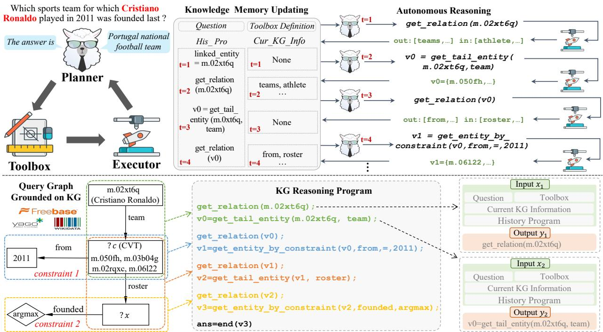
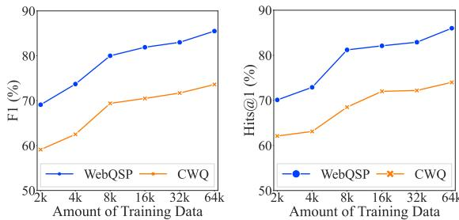

# KG-Agent: An Efficient Autonomous Agent Framework for Complex Reasoning over Knowledge Graph

Jinhao Jiang1,3, Kun Zhou2,3, Wayne Xin Zhao1,3∗, Yang Song4∗, Chen $\mathbf { Z } \mathbf { h } \mathbf { u } ^ { 5 }$ , Hengshu $\mathbf { Z } \mathbf { h } \mathbf { u } ^ { 5 }$ , Ji-Rong Wen1,2,3

1Gaoling School of Artificial Intelligence, Renmin University of China.   
2School of Information, Renmin University of China.   
3Beijing Key Laboratory of Big Data Management and Analysis Methods.   
4NLP Center, BOSS Zhipin. 5Career Science Lab, BOSS Zhipin. jiangjinhao@ruc.edu.cn, batmanfly@gmail.com

# Abstract

In this paper, we aim to improve the reasoning ability of large language models (LLMs) over knowledge graphs (KGs) to answer complex questions. Inspired by existing methods that design the interaction strategy between LLMs and KG, we propose an autonomous LLM-based agent framework, called KG-Agent, which enables a small LLM to actively make decisions until finishing the reasoning process over KGs. In KG-Agent, we integrate the LLM, multifunctional toolbox, KG-based executor, and knowledge memory, and develop an iteration mechanism that autonomously selects the tool then updates the memory for reasoning over KG. To guarantee the effectiveness, we leverage program language to formulate the multi-hop reasoning process over the KG, and synthesize a code-based instruction dataset to fine-tune the base LLM. Extensive experiments demonstrate that only using 10K samples for tuning LLaMA-7B can outperform state-of-theart methods using larger LLMs or more data, on both in-domain and out-domain datasets. Our code and data will be publicly released.

# 1 Introduction

Despite the remarkable performance on various NLP tasks (Brown et al., 2020; Zhao et al., 2023), large language models (LLMs) still have limited capacities in solving complex tasks (Hu et al., 2023b) solely based on their parametric knowledge, e.g., multi-hop and knowledge-intensive reasoning (Lan et al., 2023). Knowledge graph (KG), which stores massive knowledge triples in a graph-structured format, has been broadly used to complement LLMs with external knowledge (Pan et al., 2023).

Due to the large volume and structured format of KG data, it is not easy for LLMs to effectively utilize the information from KG. Recent work mainly adopts retrieval-augmented (Ye et al., 2022) or synergy-augmented (Jiang et al., 2023b) methods to enhance LLMs with KG data. The former approach retrieves and serializes the task-related triples as part of the prompt for LLMs, while the latter approach designs an information interaction mechanism between KG and LLMs to iteratively find the solution to the question. In particular, synergyaugmented methods can benefit from the structured search on KG (e.g., SPARQL) and the language understanding capacity of LLMs, achieving comparable or even better performance compared with previous state-of-the-art methods (Gu et al., 2023).

However, there are still two major limitations on existing synergy-augmented methods. First, the information interaction mechanism between LLM and KG is often pre-defined (e.g., following a human-crafted multi-round plan), which cannot flexibly adapt to various complex tasks (Luo et al., 2023; Jiang et al., 2023b). For instance, it would become ineffective to handle the unintended requirements in the reasoning process, e.g., varied difficulties or constraints. Second, these methods (Wang et al., 2023a) mostly rely on stronger closed-source LLM APIs (e.g., ChatGPT and GPT-4) to understand or learn to solve complex tasks. However, the distilled plans or procedures, also limited to special task settings or capacity levels, may not be best suited for instructing these weaker models.

To address these issues, in this paper, we propose the KG-Agent, an autonomous LLM-based agent framework for complex reasoning tasks over KG. The motivations are twofold: (1) designing autonomous reasoning approaches that can actively make decisions during reasoning, without human assistance; (2) enabling relatively small models (e.g., 7B LLM) to effectively perform complex reasoning, without reliance on close-sourced LLM APIs. To achieve this, our approach makes three major technical contributions. First, we extend the LLM’s capacity to manipulate structured data by curating a multifunctional toolbox, enabling LLM to perform discrete or advanced operations (e.g., filtering, counting, and retrieval) on KG data and intermediate results. Second, we leverage existing KG reasoning datasets for synthesizing code-based instruction data to fine-tune the LLM, where we first generate the program according to the reasoning chain on KG and then synthesize the instruction data. Third, we propose an autonomous iteration mechanism based on tool selection and memory updation that integrates the tuned LLM, multifunctional toolbox, KG-based executor, and knowledge memory, for autonomously reasoning over KG.

To verify the effectiveness, we evaluate KGAgent on both in-domain and out-of-domain tasks including KG-based question answering (KGQA) and open domain question answering (ODQA). With much fewer training data (i.e., 10K samples) for tuning a smaller LLM (i.e., LLaMA-7B), our approach can outperform competitive LLM-based baselines on in-domain datasets (e.g., using about $36 \%$ and $23 \%$ of the original training set amount while obtaining $7 . 5 \%$ and $2 . 7 \%$ relative improvement of F1 on CWQ and GrailQA respectively). On the out-of-domain datasets, the zero-shot performance of our KG-Agent is better than competitive full-data supervised fine-tuning models (e.g., $9 . 7 \%$ and $8 . 5 \%$ relative improvement of accuracy on WQ-Freebase and TQ-Wiki, respectively).

# 2 Related Work

LLM-based KG Reasoning. Benefitting from the powerful zero-shot and few-shot capability, recent studies have leveraged LLMs to perform reasoning over KG. Recent work can be roughly divided into retrieval-augmented (Shu et al., 2022) and synergy-augmented (Gu et al., 2023) two types. The retrieval-augmented method is to retrieve and serialize the triples from the KG, and then feed it to the LLM to help generate the final results (e.g., answers or SPARQL query) (Ye et al., 2022). Such a way loses the structured information in the original KG and may retrieve redundant knowledge, limiting LLMs’ understanding. To relieve these problems, the synergy-augmented methods design an information interaction mechanism between LLMs and KGs to enable LLMs to query KGs multiple times to answer the question (Jiang et al., 2023b). Specifically, they either first generate the full plan (Li et al., 2023) and then ground it on KG, or make a plan step-by-step based on the KG (Luo et al., 2023). Although obtaining better performance, the information interaction mechanism in existing methods often follows a pre-defined way, which cannot flexibly adapt to various complex tasks. In contrast, our proposed KG-Agent can autonomously make decisions during reasoning over KG, without human assistance.

LLM-based Agents. Recently, LLMs have shown surprising long-horizon planning and reasoning capabilities (Shinn et al., 2023; Zhong et al., 2023), and LLM-based agents have gradually become a hot topic for autonomously solving complex interactive tasks (Wang et al., 2023b). A large number of agents focus on general-purpose task solving. As the representative projects, ReAct (Yao et al., 2023) proposes a prompting method to convert LLMs (e.g., ChatGPT) as language agents, to interact with the external environment, receive the feedback, and then generate the action for next step reasoning. Then, AutoGPT1 further empowers LLMs (i.e., GPT4) with long/short-term memory management and external tools like search engines to autonomously address a user request. In addition, several other agents also focus on specific domains, such as WebGPT (Nakano et al., 2021) for the web-browsing environment, MMREACT (Yang et al., 2023) for the multi-modal scenario, and ProgPrompt (Singh et al., 2023) for the real-life environment. However, recent works involving language agents mostly rely on stronger closed-source LLM APIs (e.g., ChatGPT and GPT4) to understand or learn to solve complex tasks. Our KG-Agent is the first autonomous agent framework to support complex reasoning over KG only relying on a relatively smaller 7B LLM.

# 3 Preliminary

In this section, we first formally define knowledge graph (KG), and then formalize the complex knowledge reasoning task based on KG.

Knowledge Graph (KG). A knowledge graph typically consists of a large number of fact triples, expressed as $\mathcal { G } = \{ \langle e , r , e ^ { \prime } \rangle | e , e ^ { \prime } \in \mathcal { E } , r \in \mathcal { R } \}$ , where $\mathcal { E }$ and $\mathcal { R }$ denote the entity set and relation set, respectively. A triple $\langle e , r , e ^ { \prime } \rangle$ describes a factual knowledge that a relation $r$ exists between the head entity $e$ and tail entity $e ^ { \prime }$ . Each entity $e$ is assigned a unique entity $\mathrm { I D }$ (or string value), and belongs to one entity type $t$ such as Country and Person. Furthermore, we introduce neighboring relations to denote both the incoming and outgoing relations for a set of entities $\{ e \}$ , denoted as $\mathcal { R } _ { \{ e \} } = \{ r | \langle e , r , e ^ { \prime } \rangle \in \mathcal { G } \} \cup \{ r | \langle e ^ { \prime } , r , e \rangle \in \mathcal { G } \}$ .

Problem Formulation. In this work, we assume that a KG is available and contains the answer entities for the given natural language question. Our objective is to develop a LLM-based agent that can autonomously infer the answer to the question based on the given KG. As it has been shown that domain-specific interface is helpful for LLMs to manipulate the structured data (Jiang et al., 2023b), we further assume that a toolbox can be provided to facilitate the access to the information of KG. Formally, given a natural language question $q$ , and a toolbox $\tau$ and a $\operatorname { K G } { \mathcal { G } }$ , we aim to develop a capable agent to deduce the final answers $A _ { q } = \{ e \}$ for the question $q$ by leveraging the tools in $\tau$ and the knowledge information in $\mathcal { G }$ .

# 4 Approach

In this part, we present the proposed KG-Agent for autonomously solving complex reasoning tasks over KG. The core of our KG-Agent framework is a well-instructed LLM, which can autonomously make decisions when reasoning over KG. We first extend the LLM’s capacities by designing a toolbox with supporting tools to manipulate the KG data or intermediate results (Section 4.1). To enhance the step-by-step reasoning capacity, we leverage existing knowlege graph question answering (KGQA) datasets to synthesize KG reasoning programs and convert them into formatted instruction tuning data (Section 4.2). Finally, we design an effective agent framework based on the knowledge memory to support autonomous reasoning over KG (Section 4.3). Next, we give the technical details of KG-Agent.

# 4.1 Toolbox for Knowledge Graph

Since LLMs struggle to accurately manipulate the structured data (Jiang et al., 2023b), we construct a supporting toolbox for easing the utilization of the KG information. According to existing work (Gu et al., 2021; Cao et al., 2022), reasoning over KG (e.g., Freebase or Wikidata) typically requires three fundamental operations, namely extracting information from KG, filtering irrelevant information based on the semantics of the question, and operating on the extracted information. Therefore, we design three types of tools for LLMs reasoning over KG, i.e., extraction, semantic, and logic tools.

• Extraction tools aim to facilitate the access to information from KG. Considering the basic data types in KG, we design five tools to support the access to the relations (get_relation), the head/tail entities (get_head_entity/get_tail_entity), and entities with specific type or constraint (get_entity_by_type/ get_entity_by_constraint), w.r.t. some entity set or other input information (e.g., relation or type).

• Logic tools aim to support basic manipulation operations on the extracted KG information, including entity counting (count), entity set intersection (intersect) and union (union), condition verification (judge), and ending the reasoning process with the current entity set as the final answer(s) (end).

• Semantic tools are developed by utilizing pretrained models to implement specific functions, including relation retrieval (retrieve_relation) and entity disambiguation (disambiguate_entity). These tools extend the basic operations on KGs and can support advanced functionalities for KG reasoning.

We summarize the detailed definition and usage of the tools in Table 8 at the Appendix B. Note that since the format and usage for each tool have been defined in a unified way, the toolbox for KG can be flexibly extended according to the real needs.

# 4.2 KG-Agent Instruction Tuning

To enable the autonomous reasoning process, we construct a high-quality instruction dataset for finetuning a small LLM (i.e., LLaMA2-7B). For this purpose, we first leverage existing KG based question answering (KGQA) datasets to generate the KG reasoning program, and then decompose it into multiple steps. Finally, each step is formulated as the instruction data with input and output.

# 4.2.1 KG Reasoning Program Generation

Instead of distilling from close-sourced LLMs (e.g., GPT-4), we propose to leverage existing KGQA datasets to synthesize the KG reasoning program. These KGQA datasets contain the annotated SQL queries that can be executed to directly extract the answer entities for each question. In particular, the SQL query generally includes the relation chain, conditions, or constraints, which are beneficial for reasoning program synthesis. Concretely, we first ground the SQL query on the KG to obtain a query graph, then extract the reasoning chain and constraint conditions from the query graph, and finally decompose the chain into multiple code snippets as the reasoning program.

Reasoning Chain Extraction. Since the whole

  
Figure 1: The overview of our proposed KG-Agent. The top half is the workflow of our agent, and the bottom half is an example of instruction fine-tuning data synthesis and the prompt template for the input-output pairs. For brevity, we simplify the relation surface form.

KG is extremely large and contains irrelevant data, the first step is to acquire a small KG subgraph related to the question, referred to as query graph. Following previous work (Yin et al., 2020), we obtain the query graph from the KG via rule match. As shown in Figure 1 (b), the query graph has a treelike structure that can be directly mapped to a logical form (Yin et al., 2020), and it can clearly depict the execution flow of the SQL query to obtain the answer. Second, starting from the mentioned entity in the question (i.e., Cristiano Ronaldo), we adopt breadth-first search (BFS) to visit all the nodes on the query graph. This strategy would finally produce a reasoning chain (e.g., teams roster_team) linking the start entity to the answer entity, and the relevant constraint conditions (e.g., roster_from $=$ “2011”) or numerical operation (e.g., founded must be last) can be naturally involved in this process.

Reasoning Program Generation. After extracting the reasoning chain, we next convert it into multiple interrelated triples, where each triple generally corresponds to an intermediate reasoning step. Finally, we reformulate the triples into several function calls with the code format, which represents the tool invocation and can be executed to obtain the corresponding triples based on the KG. Given a triple $\langle e , r , e ^ { \prime } \rangle$ , we craft a rule-based method to synthesize the function calls that represent the information flow from $e$ to $e ^ { \prime }$ . Specifically, we start from the get_relation(e) function call to obtain the current candidate relations $\{ r \}$ associated with $e$ on the KG. Then, we select one relation $r$ and pass it to other required function calls (e.g., get_tail_entity or get_entity_by_constraint), and finally obtain new entities. Following the order of the reasoning chain, we generate all the function calls to compose the final KG reasoning program for producing the instruction dataset. We show one example in Figure 1 (b) to intuitively illustrate the conversion process from the annotated SQL query to our required KG reasoning program.

# 4.2.2 KG Reasoning Instruction Synthesis

After obtaining the reasoning program on KG, we further utilize it for synthesizing instruction data for supervised fine-tuning (SFT). As discussed in Section 4.2.1, our instruction data is highly based on the reasoning program, which is aligned with the intermediate reasoning steps for KGQA.

Input-Output Pair Construction. The synthetic KG reasoning program consists of multiple function calls in a sequence. For each function call, we aim to construct an input-output pair as the instruction. Specifically, the input contains the question, toolbox definition, current KG information (i.e., the next candidate relations of the current entity set), and history reasoning program before the current step; and the output is the function call at the current step. Next, after executing the function call at the current reasoning step, the history reasoning program and current KG information in the input will be accordingly updated, and the output will be updated as the function call at the next step. By iterating the above process, for each sample in the KGQA datasets, we can obtain multiple input-output pairs derived from the corresponding reasoning program, which depict the complete reasoning trajectory on the KG. To help LLMs better understand, we further utilize a unified prompt, as shown in Figure 1 (c), to format each input-output pair and obtain the final instruction tuning data.

Table 1: Comparison of different methods. Work Flow describes that the interaction way between the LLM and KG is pre-defined (“pd”) or autonomous (“auto”). Multi Task means whether to support generalization across different KGs via multi-task learning.   

<table><tr><td>Method</td><td>Work Flow</td><td>Base Model</td><td>Tool Memory</td><td></td><td>Multi Task</td></tr><tr><td>Pangu StructGPT</td><td></td><td>T5-3B ChatGPT</td><td>X</td><td>×××</td><td>X</td></tr><tr><td>RoG</td><td></td><td></td><td></td><td></td><td>X</td></tr><tr><td></td><td></td><td>LLaMA-7B</td><td>X</td><td></td><td>×</td></tr><tr><td>ChatDB</td><td>auto</td><td>ChatGPT</td><td>X</td><td>✓</td><td>X</td></tr><tr><td>KB-BINDER</td><td>pd</td><td>CodeX</td><td>X</td><td>X</td><td>X</td></tr><tr><td>KG-Agent</td><td>auto</td><td>| LLaMA2-7B</td><td>✓</td><td>✓</td><td>✓</td></tr></table>

Agent Instruction Tuning. Based on the above formatted instruction tuning data, we perform supervised fine-tuning on a small LLM (i.e., LLaMA7B), which is much smaller than the backbone models in previous work (Jiang et al., 2023b). Formally, for each sample, we formulate all input-output pairs of the complete trajectory in the format of $\left\{ \langle x _ { 1 } , y _ { 1 } \rangle , . . . , \langle x _ { t } , y _ { t } \rangle , . . . , \langle x _ { n } , y _ { n } \rangle \right\}$ , where $\left. x _ { t } , y _ { t } \right.$ represent the input and ground-truth response in the $t$ -th step and $n$ represents the total steps. For simplicity, we denote each input and output as $x$ and $y$ below. During the instruction tuning process, we feed the input $x$ and output $y$ into the decoderonly LLM and minimize the cross-entropy loss on the ground-truth response $y$ as:

$$
\mathcal { L } = - \sum _ { k = 1 } ^ { m } \log \operatorname* { P r } ( y _ { k } | x , y _ { < k } ) ,
$$

where $m$ denotes the number of tokens in $y , y _ { k }$ and $y _ { < k }$ are the $k$ -th and previous tokens in the output.

# 4.3 Autonomous Reasoning over KG

After instruction tuning, we further design an effective agent framework that enables KG-Agent to autonomously perform multi-step reasoning over KG for answer finding. The overall illustration of KGAgent is shown in Figure 1 (a). It mainly contains four components, i.e., the core instruction-tuned LLM (Section 4.2), referred to as the LLM-based planner, the multifunctional toolbox (Section 4.1), the KG-based executor for executing the tool invocation, and the knowledge memory to record the context and currently useful information in the whole process. Next, we introduce how KG-Agent performs autonomous reasoning over KG.

Knolwedge Memory Initialization. The knowledge memory preserves the currently useful information to support the LLM-based planner for making decisions. It mainly contains four parts of information, i.e., natural language question, toolbox definition, current KG information, and history reasoning program. The former two parts are initialized with the given question and toolbox definition, which remain unchanged during the reasoning process. The later two parts are initialized as an empty list, which will be constantly updated at each step after LLM generating the function call and executor invoking the corresponding tool.

Planner for Tool Selection. Based on the current knowledge memory, the LLM-based planner selects a tool to interact with KG at each step. Specifically, all the parts in the current knowledge memory will be formatted with corresponding prompt template to compose the input (used in Agent Instruction Tuning in Section 4.2.2), and then the LLM will generate one function call by selecting a tool and its arguments from the input. Generally, the planner needs to invoke tools from the pre-defined toolbox to address four types of task requirements, i.e., linking the mentioned entity to KG (e.g., “get_candidate_entity” and “disambiguate_entity”), accessing the KG information (e.g., “get_relation” and “get_head_entity”), processing the intermediate results (e.g., “count” and “intersect”), or returning the final answer to end the reasoning process (e.g., “end”).

Executor for Memory Updation. After the planner generates the function call, the KG-based executor will execute it using a program compiler. It can cache or operate the intermediate variables, and extract new entities or relations from the KG. After execution, the knowledge memory will be accordingly updated. First, the current function call will be added to the history reasoning program. Second, if the invoked tool is to obtain the new information from the KG (e.g., “get_relation”), the executor will add it to the KG information for updating the knowledge memory.

<table><tr><td rowspan="2">Model</td><td colspan="2">WebQSP</td><td colspan="2">CWQ</td><td colspan="4">GrailQA (F1)</td></tr><tr><td>Hits@1</td><td>F1</td><td>Hits@1</td><td>F1</td><td>Overall</td><td>I.I.D.</td><td>Compositional</td><td>Zero-shot</td></tr><tr><td>GraftNet</td><td>66.4</td><td>60.4</td><td>36.8</td><td>32.7</td><td>-</td><td>-</td><td>-</td><td>-</td></tr><tr><td>NSM</td><td>68.7</td><td>62.8</td><td>47.6</td><td>42.4</td><td></td><td>-</td><td></td><td></td></tr><tr><td>SubgraphRetrieval</td><td>69.5</td><td>64.1</td><td>49.3</td><td>46.3</td><td></td><td></td><td></td><td></td></tr><tr><td>UniKGQA</td><td>75.1</td><td>70.2</td><td>50.7</td><td>48.0</td><td></td><td></td><td></td><td></td></tr><tr><td>ReasoningLM</td><td>78.5</td><td>71.0</td><td>69.0</td><td>64.9</td><td>-</td><td>-</td><td>-</td><td></td></tr><tr><td>RNG-KBQA</td><td>-</td><td>75.6</td><td></td><td>-</td><td>76.8</td><td>89.0</td><td>68.9</td><td>74.7</td></tr><tr><td>Uni-Parser</td><td>-</td><td>75.8</td><td></td><td></td><td>76.5</td><td>88.3</td><td>71.4</td><td>73.4</td></tr><tr><td>ArcaneQA</td><td>-</td><td>75.6</td><td></td><td></td><td>76.9</td><td>89.2</td><td>73.9</td><td>72.8</td></tr><tr><td>PanGu w/ T5-3B</td><td>-</td><td>79.6</td><td></td><td>-</td><td>83.4</td><td>-</td><td>-</td><td>-</td></tr><tr><td>TIARA</td><td>75.2</td><td>78.9</td><td></td><td>-</td><td>81.9</td><td>91.2</td><td>74.8</td><td>80.7</td></tr><tr><td>FC-KBQA</td><td>-</td><td>76.9</td><td>-</td><td>56.4</td><td>83.8</td><td>91.5</td><td>77.3</td><td>83.1</td></tr><tr><td>ROG</td><td>85.7</td><td>70.8</td><td>62.6</td><td>56.2</td><td>-</td><td>-</td><td>-</td><td>-</td></tr><tr><td>ChatGPT</td><td>67.4</td><td>59.3</td><td>47.5</td><td>43.2</td><td>25.3</td><td>19.6</td><td>17.0</td><td>31.2</td></tr><tr><td>Davinci-003</td><td>70.8</td><td>63.9</td><td>51.4</td><td>47.6</td><td>30.1</td><td>23.5</td><td>22.0</td><td>36.4</td></tr><tr><td>GPT-4</td><td>73.2</td><td>62.3</td><td>55.6</td><td>49.9</td><td>31.7</td><td>25.0</td><td>20.6</td><td>39.2</td></tr><tr><td>StructGPT</td><td>72.6</td><td>63.7</td><td>54.3</td><td>49.6</td><td>54.6</td><td>70.4</td><td>44.3</td><td>50.5</td></tr><tr><td>Ours</td><td>83.3</td><td>81.0</td><td>72.2</td><td>69.8</td><td>86.1</td><td>92.0</td><td>80.0</td><td>86.3</td></tr></table>

Table 2: The results on the test set of WebQSP and CWQ, and dev set of GrailQA, which are based on Freebase KG. We copy part of the results from Jiang et al. (2023b); Gu et al. (2023); Luo et al. (2023) and evaluate ChatGPT,Davinci-003, GPT-4, and StructGPT with OpenAI API. Bold font denotes the best performance.

Iterative Autonomous KG-Agent. The KG-Agent framework autonomously iterates the above tool selection and memory updation process to perform step-by-step reasoning, where the knowledge memory is used to maintain the accessed information from KG. In this way, the multi-turn decisionmaking process of the agent is like walking on the KG along relations. Once reaching the answer entities, the agent will automatically stop the iterative process. Note that the whole process is agnostic to the task types (e.g., question answering) and some specific KGs. Therefore, our approach is a general framework that can be applied to a variety of complex tasks that require reasoning over any KGs.

# 4.4 Comparison to Previous Work

Existing methods of reasoning over KG can be categorized into two classes based on their workflow. The first line of research, such as KB-BINDER (Li et al., 2023), Pangu (Gu et al., 2023), StructGPT (Jiang et al., 2023b), and RoG (Luo et al., 2023), crafted a pre-defined interaction way between LLM and KG, which cannot flexibly adapt to various complex tasks. Another line of research, such as ChatBD (Hu et al., 2023a), conducted autonomous reasoning with chain-of-thought and memory augmented. However, it relies on the strong closed-source LLM APIs (e.g., ChatGPT) and cannot use tools to implement some specialized operations (e.g., count). Our KG-Agent is the first autonomous agent framework to support the complex interaction between LLM and KG with tool and memory augmented. Furthermore, we implement this autonomous agent by instruction tuning a smaller 7B open-source LLM compared to the backbone LLM in KB-BINDER, StructGPT, and ChatDB. At the same time, the agent instruction tuning data is constructed from various KGs (e.g., Wikidata and Freebase), which helps our KG-Agent to learn the general autonomous decision making capabilities over various KGs.

# 5 Experiment

# 5.1 Experimental Setup

We select four commonly-used KGQA datasets as in-domain datasets, i.e., WebQSP, CWQ, and GrailQA, which are based on Freebase, and KQA Pro, which is based on Wikidata. And we select three ODQA datasets as out-of-domain datasets, i.e., WQ, NQ, and TQ. Further, we consider three types of baseline methods, i.e., subgraph-based reasoning, LM-based seq2seq generation, and

Table 3: The accuracy on the test set of KQA Pro, which is based on Wikidata KG. The results of Davinci-002, GPT-4, and ChatGPT are evaluated by us and the results of other baselines are copied from Cao et al. (2022).   

<table><tr><td>Model</td><td>Overall</td><td>Multi-hop</td><td>Qualifier</td><td>Comparison</td><td>Logical</td><td>Count</td><td>Verify</td><td>Zero-shot</td></tr><tr><td>KVMemNet</td><td>16.61</td><td>16.50</td><td>18.47</td><td>1.17</td><td>14.99</td><td>27.31</td><td>54.70</td><td>0.06</td></tr><tr><td>EmbedKGQA</td><td>28.36</td><td>26.41</td><td>25.20</td><td>11.93</td><td>23.95</td><td>32.88</td><td>61.05</td><td>0.06</td></tr><tr><td>RGCN</td><td>35.07</td><td>34.00</td><td>27.61</td><td>30.03</td><td>35.85</td><td>41.91</td><td>65.88</td><td>0.00</td></tr><tr><td>RNN SPARQL</td><td>41.98</td><td>36.01</td><td>19.04</td><td>66.98</td><td>37.74</td><td>50.26</td><td>58.84</td><td>26.08</td></tr><tr><td>BART SPARQL</td><td>89.68</td><td>88.49</td><td>83.09</td><td>96.12</td><td>88.67</td><td>85.78</td><td>92.33</td><td>87.88</td></tr><tr><td>ChatGPT</td><td>24.96</td><td>24.22</td><td>26.37</td><td>39.15</td><td>25.51</td><td>10.76</td><td>54.70</td><td>15.67</td></tr><tr><td>Davinci-003</td><td>31.02</td><td>29.58</td><td>31.58</td><td>49.8</td><td>29.62</td><td>16.70</td><td>65.54</td><td>21.83</td></tr><tr><td>GPT-4</td><td>37.43</td><td>34.82</td><td>37.15</td><td>55.75</td><td>36.81</td><td>15.27</td><td>72.93</td><td>27.28</td></tr><tr><td>Ours</td><td>92.15</td><td>91.03</td><td>87.90</td><td>96.32</td><td>91.28</td><td>88.21</td><td>92.86</td><td>91.40</td></tr></table>

Table 4: The results on the subsets of the dev sets from the out-of-domain ODQA datasets.   

<table><tr><td>Models</td><td>NQ-Wiki</td><td>TQ-Wiki</td><td>WQ-Freebase</td></tr><tr><td>T5-Base</td><td>30.94</td><td>27.63</td><td>24.06</td></tr><tr><td>T5-Large</td><td>31.21</td><td>29.40</td><td>24.70</td></tr><tr><td>BART-Base</td><td>29.47</td><td>25.43</td><td>21.95</td></tr><tr><td>BART-Large</td><td>32.60</td><td>33.05</td><td>26.33</td></tr><tr><td>Davinci-003</td><td>51.94</td><td>88.57</td><td>23.81</td></tr><tr><td>ChatGPT</td><td>57.49</td><td>88.68</td><td>23.23</td></tr><tr><td>Ours</td><td>33.00</td><td>35.89</td><td>28.90</td></tr></table>

LLM-based methods for comparison on in-domain datasets, and Fine-tune based and LLM-based methods for out-of-domain datasets. We show the details of the above datasets, baselines, evaluation protocol, and implementation in Appendix A.

# 5.2 Main Results

Results on In-domain Datasets. Table 2 and Table 3 show the results on in-domain datasets based on Freebase and Wikidata, respectively. First, LMbased seq2seq generation methods can achieve better F1 score compared to the subgraph-based reasoning methods on the WebQSP and KQA Pro. It indicates that the SPARQL query generated by the LM can obtain a more complete answer set, and the structured query can better support some complex operations (e.g., maximum, count) than the traditional subgraph-based reasoning methods. Second, although LLMs are powerful, directly using Davinci-003, ChatGPT, and even GPT-4 still has a large performance gap compared with the best fine-tuned methods in WebQSP, GrailQA, and KQA Pro, indicating the difficulty of answering complex questions solely by LLMs.

Finally, our KG-Agent is substantially better than all other competitive baselines in all datasets after instructing tuning on the mixed data. With the mutual augmentation between different datasets, our approach achieves $1 . 7 \%$ , $7 . 5 \%$ , and $2 . 7 \%$ improvements of F1 on WebQSP, CWQ, and Grailqa, respectively. Benefiting from the autonomous reasoning mechnism, our approach can perform reasoning on the two KGs and obtain consistent improvement on all datasets.

Table 5: The results on the three subsets of MetaQA. We copy the results of baselines from Jiang et al. (2023b).   

<table><tr><td>Models</td><td>MQA-1hop</td><td>MQA-2hop</td><td>MQA-3hop</td></tr><tr><td>GraftNet</td><td>82.5</td><td>-</td><td>-</td></tr><tr><td>EmbedKGQA</td><td>92.0</td><td>40.7</td><td>34.6</td></tr><tr><td>NSM</td><td>94.8</td><td>97.0</td><td>91.0</td></tr><tr><td>TransferNet</td><td>96.5</td><td>97.5</td><td>90.1</td></tr><tr><td>ChatGPT</td><td>61.9</td><td>31.0</td><td>43.2</td></tr><tr><td>StructGPT</td><td>94.2</td><td>93.9</td><td>80.2</td></tr><tr><td>Ours</td><td>97.1</td><td>98.0</td><td>92.1</td></tr></table>

Results on Out-of-domain Datasets. After instruction tuning, we directly evaluate the zeroshot performance of our KG-Agent on the out-ofdomain datasets. As shown in Table 4, although fine-tuned with full data, the small pre-trained language models (e.g., T5 and BART) can not effectively answer these factual questions. Owing to the large-scale parameters, Davinci-003 and ChatGPT performs well on NQ and TQ, which are constructed based on Wikipedia, the corpus that they may have been pre-trained on. However, they perform not well on WQ, which is constructed based on Freebase KG. In contrast, our KG-Agent only needs to learn how to interact with KG instead of memorizing the specific knowledge. Thus, it can utilize the external KG in zero-shot setting, and achieve consistent improvement compared to finetuned pre-trained language models.

Table 6: The F1 scores on three in-domain datasets after instruction tuning under different sampling proportions. We highlight the changed proportion with an underline.   

<table><tr><td>Proportion</td><td>WebQSP</td><td>CWQ</td><td>GrailQA</td><td>Average</td></tr><tr><td>1:10:5</td><td>80.0</td><td>69.8</td><td>86.1</td><td>78.6</td></tr><tr><td>2:10:5</td><td>81.2</td><td>68.7</td><td>83.3</td><td>77.8</td></tr><tr><td>1:20:5</td><td>78.9.</td><td>73.6</td><td>78.8</td><td>77.1</td></tr><tr><td>1:10:10</td><td>80.8</td><td>66.9</td><td>84.3</td><td>77.3</td></tr></table>

# 5.3 Further Analysis

Transfer to Domain-specific KG. To evaluate the transferability of our approach on other KGs, we test our KG-Agent on the MetaQA dataset which is based on a movie domain KG. Following existing work (He et al., 2021; Jiang et al., 2023b), we show the one-shot results on the test set in Table 5. ChatGPT performs not well when directly answering these domain-specific questions, where the performance drops $45 \%$ absolutely on the MQA-3hop subset compared to the supervised fine-tuned TransferNet model. After equipping the LLM with the KG, StructGPT can greatly outperform ChatGPT with about $37 \%$ improvement. In contrast, our KG-Agent can obtain consistent performance improvement compared to the competitive supervised fine-tuning baselines on all subsets. It indicates that the agent indeed learns the general ability about reasoning on KG, which can be efficiently transferred to other KGs.

Effect of Instruction Amount. We explore how the amount of instructions affects the performance of KG-Agent and show the results in Figure 2. With a constant sampling proportion, we scale the total amount from $2 \mathrm { k \Omega }$ to $6 4 \mathrm { k }$ in an exponential way and evaluate the F1 and Hist $@ 1$ scores on WebQSP and CWQ datasets. As we can see, the performance increases with more instruction tuning data, and eventually reaches a stable state, which indicates the importance of data amount. At the same time, with the data amount increasing from $1 6 \mathrm { k }$ to $6 4 \mathrm { k }$ , the KG-Agent doesn’t obtain a remarkable performance improvement. We think this is relevant to the variety of our instruction tuning data, which is illustrated in existing work (Chung et al., 2022; Aribandi et al., 2022). Therefore, we will construct more diverse samples in the future to further boost the performance.

Effect of Tuning Data Proportion. Our experiment finds that only sampling 10K samples from existing datasets is enough for backbone LLM to learn the autonomous decision making capability. Here, we conduct a further ablation study to explore the impact of sampling proportion on the agent’s performance when keeping the total amount of instruction tuning data constant. Specifically, we evaluate the agent performance of WebQSP, CWQ, and GrailQA when doubling the proportion of one dataset while maintaining the other two dataset proportions. We show the results in Table 6. We can see that as the sampling proportion of a certain dataset increases, the agent performance on it consistently improves. However, for the average performance on all three datasets, all variants are lower than our selected proportion, indicating that the proportion we chose is suitable for the LLM to balance and master more comprehensive and general abilities.

  
Figure 2: The F1 (Left) and Hits $@ 1$ (Right) scores of KG-Agent on the test set of WebQSP and CWQ with a various amount of instruction tuning data.

# 6 Conclusion

In this work, we proposed an autonomous agent framework to synergize LLMs and KGs to perform complex reasoning over KG, namely KG-Agent. In our approach, we first curated a toolbox for KG, consisting of three types of tools to support the typical operations when reasoning on KG. Then, we developed an autonomous iteration mechanism based on tool selection and memory updation that integrates the LLM, multifunctional toolbox, KGbased executor, and knowledge memory, for reasoning over KG. Next, we leveraged existing KGQA datasets to synthesize the code-based instruction tuning dataset. Finally, with only 10K tuning samples, we implemented the autonomous agent relying on the smaller 7B LLM, which mostly outperforms state-of-the-art baselines based on full-data tuning or larger LLMs. In future work, we will consider extending our framework to deal with more types of structured data, e.g., databases and tables.

# Limitations

Although KG-Agent demonstrates remarkable performance across various complex factual question answering tasks, there are some limitations of our method. First, we only use the LLaMA2-7B as the backbone LLM, which has a strong capability after instruction tuning. Hence, more experiments are required to evaluate other LLMs with comparable parameter sizes, such as Mistral-7B (Jiang et al., 2023a) or CodeLLaMA-7b (Rozière et al., 2023). Second, we focus on reasoning over the KG to answer the factual questions. We should consider extending our framework to deal with more types of knowledge sources, e.g., databases or tables. Third, we only evaluate factual question answering tasks based on KG. Future work should include wider evaluation scenarios to evaluate the universality of our method, e.g., data-to-text and formal-languageto-text (Xie et al., 2022). Finally, we have tried our best to tune the LLM only to answer the questions based on the KG information, and avoid generating discriminatory and risky responses for user questions. However, we should add more rule-based methods to post-process the predictions and filter the illegal responses.

Annual Conference on Neural Information Processing Systems 2020, NeurIPS 2020, December 6-12, 2020, virtual.

Shulin Cao, Jiaxin Shi, Liangming Pan, Lunyiu Nie, Yutong Xiang, Lei Hou, Juanzi Li, Bin He, and Hanwang Zhang. 2022. KQA pro: A dataset with explicit compositional programs for complex question answering over knowledge base. In Proceedings of the 60th Annual Meeting of the Association for Computational Linguistics (Volume 1: Long Papers), ACL 2022, Dublin, Ireland, May 22-27, 2022, pages 6101– 6119. Association for Computational Linguistics.

Danqi Chen, Adam Fisch, Jason Weston, and Antoine Bordes. 2017. Reading wikipedia to answer opendomain questions. In Proceedings of the 55th Annual Meeting of the Association for Computational Linguistics, ACL 2017, Vancouver, Canada, July 30 - August 4, Volume 1: Long Papers, pages 1870–1879. Association for Computational Linguistics.

Hyung Won Chung, Le Hou, Shayne Longpre, Barret Zoph, Yi Tay, William Fedus, Eric Li, Xuezhi Wang, Mostafa Dehghani, Siddhartha Brahma, Albert Webson, Shixiang Shane Gu, Zhuyun Dai, Mirac Suzgun, Xinyun Chen, Aakanksha Chowdhery, Sharan Narang, Gaurav Mishra, Adams Yu, Vincent Y. Zhao, Yanping Huang, Andrew M. Dai, Hongkun Yu, Slav Petrov, Ed H. Chi, Jeff Dean, Jacob Devlin, Adam Roberts, Denny Zhou, Quoc V. Le, and Jason Wei. 2022. Scaling instruction-finetuned language models. CoRR, abs/2210.11416.

# References

Vamsi Aribandi, Yi Tay, Tal Schuster, Jinfeng Rao, Huaixiu Steven Zheng, Sanket Vaibhav Mehta, Honglei Zhuang, Vinh Q. Tran, Dara Bahri, Jianmo Ni, Jai Prakash Gupta, Kai Hui, Sebastian Ruder, and Donald Metzler. 2022. Ext5: Towards extreme multitask scaling for transfer learning. In ICLR. OpenReview.net.

Jonathan Berant, Andrew Chou, Roy Frostig, and Percy Liang. 2013. Semantic parsing on freebase from question-answer pairs. In Proceedings of the 2013 Conference on Empirical Methods in Natural Language Processing, EMNLP 2013, 18-21 October 2013, Grand Hyatt Seattle, Seattle, Washington, USA, A meeting of SIGDAT, a Special Interest Group of the ACL, pages 1533–1544. ACL.

Tom B. Brown, Benjamin Mann, Nick Ryder, Melanie Subbiah, Jared Kaplan, Prafulla Dhariwal, Arvind Neelakantan, Pranav Shyam, Girish Sastry, Amanda Askell, Sandhini Agarwal, Ariel Herbert-Voss, Gretchen Krueger, Tom Henighan, Rewon Child, Aditya Ramesh, Daniel M. Ziegler, Jeffrey Wu, Clemens Winter, Christopher Hesse, Mark Chen, Eric Sigler, Mateusz Litwin, Scott Gray, Benjamin Chess, Jack Clark, Christopher Berner, Sam McCandlish, Alec Radford, Ilya Sutskever, and Dario Amodei. 2020. Language models are few-shot learners. In Advances in Neural Information Processing Systems 33:

Yu Gu, Xiang Deng, and Yu Su. 2023. Don’t generate, discriminate: A proposal for grounding language models to real-world environments. In Proceedings of the 61st Annual Meeting of the Association for Computational Linguistics (Volume 1: Long Papers), ACL 2023, Toronto, Canada, July 9-14, 2023, pages 4928–4949. Association for Computational Linguistics.

Yu Gu, Sue Kase, Michelle Vanni, Brian M. Sadler, Percy Liang, Xifeng Yan, and Yu Su. 2021. Beyond I.I.D.: three levels of generalization for question answering on knowledge bases. In WWW ’21: The Web Conference 2021, Virtual Event / Ljubljana, Slovenia, April 19-23, 2021, pages 3477–3488. ACM / IW3C2.

Yu Gu and Yu Su. 2022. Arcaneqa: Dynamic program induction and contextualized encoding for knowledge base question answering. In Proceedings of the 29th International Conference on Computational Linguistics, COLING 2022, Gyeongju, Republic of Korea, October 12-17, 2022, pages 1718–1731. International Committee on Computational Linguistics.

Gaole He, Yunshi Lan, Jing Jiang, Wayne Xin Zhao, and Ji-Rong Wen. 2021. Improving multi-hop knowledge base question answering by learning intermediate supervision signals. In WSDM ’21, The Fourteenth ACM International Conference on Web Search and Data Mining, Virtual Event, Israel, March 8-12, 2021, pages 553–561. ACM.

Chenxu Hu, Jie Fu, Chenzhuang Du, Simian Luo, Junbo Zhao, and Hang Zhao. 2023a. Chatdb: Augmenting llms with databases as their symbolic memory. CoRR, abs/2306.03901.

Xuming Hu, Junzhe Chen, Xiaochuan Li, Yufei Guo, Lijie Wen, Philip S. Yu, and Zhijiang Guo. 2023b. Do large language models know about facts? CoRR, abs/2310.05177.

Albert Q. Jiang, Alexandre Sablayrolles, Arthur Mensch, Chris Bamford, Devendra Singh Chaplot, Diego de Las Casas, Florian Bressand, Gianna Lengyel, Guillaume Lample, Lucile Saulnier, Lélio Renard Lavaud, Marie-Anne Lachaux, Pierre Stock, Teven Le Scao, Thibaut Lavril, Thomas Wang, Timothée Lacroix, and William El Sayed. 2023a. Mistral 7b. CoRR, abs/2310.06825.

Jinhao Jiang, Kun Zhou, Zican Dong, Keming Ye, Wayne Xin Zhao, and Ji-Rong Wen. 2023b. Structgpt: A general framework for large language model to reason over structured data. volume abs/2305.09645.

Jinhao Jiang, Kun Zhou, Wayne Xin Zhao, Yaliang Li, and Ji-Rong Wen. 2023c. Reasoninglm: Enabling structural subgraph reasoning in pre-trained language models for question answering over knowledge graph. In Proceedings of the 2023 Conference on Empirical Methods in Natural Language Processing, EMNLP 2023, Singapore, December 6-10, 2023, pages 3721– 3735. Association for Computational Linguistics.

Jinhao Jiang, Kun Zhou, Xin Zhao, and Ji-Rong Wen. 2023d. Unikgqa: Unified retrieval and reasoning for solving multi-hop question answering over knowledge graph. In The Eleventh International Conference on Learning Representations, ICLR 2023, Kigali, Rwanda, May 1-5, 2023. OpenReview.net.

Mandar Joshi, Eunsol Choi, Daniel S. Weld, and Luke Zettlemoyer. 2017. Triviaqa: A large scale distantly supervised challenge dataset for reading comprehension. In Proceedings of the 55th Annual Meeting of the Association for Computational Linguistics, ACL 2017, Vancouver, Canada, July 30 - August 4, Volume 1: Long Papers, pages 1601–1611. Association for Computational Linguistics.

Yunshi Lan, Gaole He, Jinhao Jiang, Jing Jiang, Wayne Xin Zhao, and Ji-Rong Wen. 2023. Complex knowledge base question answering: A survey. IEEE Trans. Knowl. Data Eng., 35(11):11196–11215.

Tianle Li, Xueguang Ma, Alex Zhuang, Yu Gu, Yu Su, and Wenhu Chen. 2023. Few-shot in-context learning for knowledge base question answering. CoRR.

Yudong Liu, Xu Zhang, Shilin He, Hongyu Zhang, Liqun Li, Yu Kang, Yong Xu, Minghua Ma, Qingwei Lin, Yingnong Dang, Saravan Rajmohan, and Dongmei Zhang. 2022. Uniparser: A unified log parser for heterogeneous log data. In WWW ’22: The ACM Web Conference 2022, Virtual Event, Lyon, France, April 25 - 29, 2022, pages 1893–1901. ACM.

Linhao Luo, Yuan-Fang Li, Gholamreza Haffari, and Shirui Pan. 2023. Reasoning on graphs: Faithful and interpretable large language model reasoning. volume abs/2310.01061.

Alexander H. Miller, Adam Fisch, Jesse Dodge, AmirHossein Karimi, Antoine Bordes, and Jason Weston. 2016. Key-value memory networks for directly reading documents. In Proceedings of the 2016 Conference on Empirical Methods in Natural Language Processing, EMNLP 2016, Austin, Texas, USA, November 1-4, 2016, pages 1400–1409.

Reiichiro Nakano, Jacob Hilton, Suchir Balaji, Jeff Wu, Long Ouyang, Christina Kim, Christopher Hesse, Shantanu Jain, Vineet Kosaraju, William Saunders, Xu Jiang, Karl Cobbe, Tyna Eloundou, Gretchen Krueger, Kevin Button, Matthew Knight, Benjamin Chess, and John Schulman. 2021. Webgpt: Browserassisted question-answering with human feedback. CoRR, abs/2112.09332.

Shirui Pan, Linhao Luo, Yufei Wang, Chen Chen, Jiapu Wang, and Xindong Wu. 2023. Unifying large language models and knowledge graphs: A roadmap. CoRR, abs/2306.08302.

Adam Roberts, Colin Raffel, and Noam Shazeer. 2020. How much knowledge can you pack into the parameters of a language model? In Proceedings of the 2020 Conference on Empirical Methods in Natural Language Processing, EMNLP 2020, Online, November 16-20, 2020, pages 5418–5426. Association for Computational Linguistics.

Baptiste Rozière, Jonas Gehring, Fabian Gloeckle, Sten Sootla, Itai Gat, Xiaoqing Ellen Tan, Yossi Adi, Jingyu Liu, Tal Remez, Jérémy Rapin, Artyom Kozhevnikov, Ivan Evtimov, Joanna Bitton, Manish Bhatt, Cristian Canton-Ferrer, Aaron Grattafiori, Wenhan Xiong, Alexandre Défossez, Jade Copet, Faisal Azhar, Hugo Touvron, Louis Martin, Nicolas Usunier, Thomas Scialom, and Gabriel Synnaeve. 2023. Code llama: Open foundation models for code. CoRR, abs/2308.12950.

Apoorv Saxena, Aditay Tripathi, and Partha P. Talukdar. 2020. Improving multi-hop question answering over knowledge graphs using knowledge base embeddings. In Proceedings of the 58th Annual Meeting of the Association for Computational Linguistics, ACL 2020, Online, July 5-10, 2020, pages 4498–4507.

Michael Sejr Schlichtkrull, Thomas N. Kipf, Peter Bloem, Rianne van den Berg, Ivan Titov, and Max Welling. 2018. Modeling relational data with graph convolutional networks. In The Semantic Web - 15th International Conference, ESWC 2018, Heraklion, Crete, Greece, June 3-7, 2018, Proceedings, volume 10843 of Lecture Notes in Computer Science, pages 593–607. Springer.

Noah Shinn, Federico Cassano, Beck Labash, Ashwin Gopinath, Karthik Narasimhan, and Shunyu Yao. 2023. Reflexion: Language agents with verbal reinforcement learning.

Yiheng Shu, Zhiwei Yu, Yuhan Li, Börje F. Karlsson, Tingting Ma, Yuzhong Qu, and Chin-Yew Lin. 2022. TIARA: multi-grained retrieval for robust question answering over large knowledge base. In Proceedings of the 2022 Conference on Empirical Methods in Natural Language Processing, EMNLP 2022, Abu Dhabi, United Arab Emirates, December 7-11, 2022, pages 8108–8121. Association for Computational Linguistics.

Ishika Singh, Valts Blukis, Arsalan Mousavian, Ankit Goyal, Danfei Xu, Jonathan Tremblay, Dieter Fox, Jesse Thomason, and Animesh Garg. 2023. Progprompt: Generating situated robot task plans using large language models. In IEEE International Conference on Robotics and Automation, ICRA 2023, London, UK, May 29 - June 2, 2023, pages 11523– 11530. IEEE.

Haitian Sun, Bhuwan Dhingra, Manzil Zaheer, Kathryn Mazaitis, Ruslan Salakhutdinov, and William W. Cohen. 2018. Open domain question answering using early fusion of knowledge bases and text. In Proceedings of the 2018 Conference on Empirical Methods in Natural Language Processing, Brussels, Belgium, October 31 - November 4, 2018, pages 4231–4242.

Jiashuo Sun, Chengjin Xu, Lumingyuan Tang, Saizhuo Wang, Chen Lin, Yeyun Gong, Heung-Yeung Shum, and Jian Guo. 2023. Think-on-graph: Deep and responsible reasoning of large language model with knowledge graph. CoRR, abs/2307.07697.

Alon Talmor and Jonathan Berant. 2018. The web as a knowledge-base for answering complex questions. In Proceedings of the 2018 Conference of the North American Chapter of the Association for Computational Linguistics: Human Language Technologies, NAACL-HLT 2018, New Orleans, Louisiana, USA, June 1-6, 2018, Volume 1 (Long Papers), pages 641– 651. Association for Computational Linguistics.

Hugo Touvron, Louis Martin, Kevin Stone, Peter Albert, Amjad Almahairi, Yasmine Babaei, Nikolay Bashlykov, Soumya Batra, Prajjwal Bhargava, Shruti Bhosale, Dan Bikel, Lukas Blecher, Cristian CantonFerrer, Moya Chen, Guillem Cucurull, David Esiobu, Jude Fernandes, Jeremy Fu, Wenyin Fu, Brian Fuller, Cynthia Gao, Vedanuj Goswami, Naman Goyal, Anthony Hartshorn, Saghar Hosseini, Rui Hou, Hakan Inan, Marcin Kardas, Viktor Kerkez, Madian Khabsa, Isabel Kloumann, Artem Korenev, Punit Singh Koura, Marie-Anne Lachaux, Thibaut Lavril, Jenya Lee, Diana Liskovich, Yinghai Lu, Yuning Mao, Xavier Martinet, Todor Mihaylov, Pushkar Mishra, Igor Molybog, Yixin Nie, Andrew Poulton, Jeremy Reizenstein, Rashi Rungta, Kalyan Saladi, Alan Schelten, Ruan Silva, Eric Michael Smith, Ranjan Subramanian, Xiaoqing Ellen Tan, Binh Tang, Ross Taylor, Adina Williams, Jian Xiang Kuan, Puxin Xu, Zheng Yan, Iliyan Zarov, Yuchen Zhang, Angela Fan, Melanie Kambadur, Sharan Narang, Aurélien Rodriguez, Robert Stojnic, Sergey Edunov, and Thomas Scialom. 2023. Llama 2: Open foundation and finetuned chat models. CoRR, abs/2307.09288.

Lei Wang, Chen Ma, Xueyang Feng, Zeyu Zhang, Hao Yang, Jingsen Zhang, Zhiyuan Chen, Jiakai Tang, Xu Chen, Yankai Lin, Wayne Xin Zhao, Zhewei Wei, and Ji-Rong Wen. 2023a. A survey on large language model based autonomous agents. volume abs/2308.11432.

Lei Wang, Chen Ma, Xueyang Feng, Zeyu Zhang, Hao Yang, Jingsen Zhang, Zhiyuan Chen, Jiakai Tang, Xu Chen, Yankai Lin, Wayne Xin Zhao, Zhewei Wei, and Ji-Rong Wen. 2023b. A survey on large language model based autonomous agents. CoRR, abs/2308.11432.

Tianbao Xie, Chen Henry Wu, Peng Shi, Ruiqi Zhong, Torsten Scholak, Michihiro Yasunaga, Chien-Sheng Wu, Ming Zhong, Pengcheng Yin, Sida I. Wang, Victor Zhong, Bailin Wang, Chengzu Li, Connor Boyle, Ansong Ni, Ziyu Yao, Dragomir Radev, Caiming Xiong, Lingpeng Kong, Rui Zhang, Noah A. Smith, Luke Zettlemoyer, and Tao Yu. 2022. Unifiedskg: Unifying and multi-tasking structured knowledge grounding with text-to-text language models. In Proceedings of the 2022 Conference on Empirical Methods in Natural Language Processing, EMNLP 2022, Abu Dhabi, United Arab Emirates, December 7-11, 2022, pages 602–631.

Zhengyuan Yang, Linjie Li, Jianfeng Wang, Kevin Lin, Ehsan Azarnasab, Faisal Ahmed, Zicheng Liu, Ce Liu, Michael Zeng, and Lijuan Wang. 2023. MMREACT: prompting chatgpt for multimodal reasoning and action. CoRR, abs/2303.11381.

Shunyu Yao, Jeffrey Zhao, Dian Yu, Nan Du, Izhak Shafran, Karthik R. Narasimhan, and Yuan Cao. 2023. React: Synergizing reasoning and acting in language models. In The Eleventh International Conference on Learning Representations, ICLR 2023, Kigali, Rwanda, May 1-5, 2023. OpenReview.net.

Xi Ye, Semih Yavuz, Kazuma Hashimoto, Yingbo Zhou, and Caiming Xiong. 2022. RNG-KBQA: generation augmented iterative ranking for knowledge base question answering. In Proceedings of the 60th Annual Meeting of the Association for Computational Linguistics (Volume 1: Long Papers), ACL 2022, Dublin, Ireland, May 22-27, 2022, pages 6032–6043. Association for Computational Linguistics.

Wen-tau Yih, Matthew Richardson, Christopher Meek, Ming-Wei Chang, and Jina Suh. 2016. The value of semantic parse labeling for knowledge base question answering. In Proceedings of the 54th Annual Meeting of the Association for Computational Linguistics, ACL 2016, August 7-12, 2016, Berlin, Germany, Volume 2: Short Papers. The Association for Computer Linguistics.

Pengcheng Yin, Graham Neubig, Wen-tau Yih, and Sebastian Riedel. 2020. Tabert: Pretraining for joint understanding of textual and tabular data. In Proceedings of the 58th Annual Meeting of the Association for Computational Linguistics, ACL 2020, Online, July 5-10, 2020, pages 8413–8426.

Jing Zhang, Xiaokang Zhang, Jifan Yu, Jian Tang, Jie Tang, Cuiping Li, and Hong Chen. 2022. Subgraph retrieval enhanced model for multi-hop knowledge base question answering. In Proceedings of the 60th Annual Meeting of the Association for Computational Linguistics (Volume 1: Long Papers), ACL 2022, Dublin, Ireland, May 22-27, 2022, pages 5773–5784. Association for Computational Linguistics.

Lingxi Zhang, Jing Zhang, Yanling Wang, Shulin Cao, Xinmei Huang, Cuiping Li, Hong Chen, and Juanzi Li. 2023. FC-KBQA: A fine-to-coarse composition framework for knowledge base question answering. In Proceedings of the 61st Annual Meeting of the Association for Computational Linguistics (Volume 1: Long Papers), ACL 2023, Toronto, Canada, July 9-14, 2023, pages 1002–1017. Association for Computational Linguistics.

Yuyu Zhang, Hanjun Dai, Zornitsa Kozareva, Alexander J. Smola, and Le Song. 2018. Variational reasoning for question answering with knowledge graph. In Proceedings of the Thirty-Second AAAI Conference on Artificial Intelligence, (AAAI-18), the 30th innovative Applications of Artificial Intelligence (IAAI18), and the 8th AAAI Symposium on Educational Advances in Artificial Intelligence (EAAI-18), New Orleans, Louisiana, USA, February 2-7, 2018, pages 6069–6076.

Wayne Xin Zhao, Kun Zhou, Junyi Li, Tianyi Tang, Xiaolei Wang, Yupeng Hou, Yingqian Min, Beichen Zhang, Junjie Zhang, Zican Dong, Yifan Du, Chen Yang, Yushuo Chen, Zhipeng Chen, Jinhao Jiang, Ruiyang Ren, Yifan Li, Xinyu Tang, Zikang Liu, Peiyu Liu, Jian-Yun Nie, and Ji-Rong Wen. 2023. A survey of large language models. CoRR.

Wanjun Zhong, Lianghong Guo, Qiqi Gao, He Ye, and Yanlin Wang. 2023. Memorybank: Enhancing large language models with long-term memory. CoRR, abs/2305.10250.

# A Experiment Setup

# A.1 Datasets

We select four popular complex KGQA datasets as in-domain datasets, i.e., WebQuestionsSP (WebQSP) (Yih et al., 2016), Complex WebQuestions 1.1 (CWQ) (Talmor and Berant, 2018), and GrailQA (Gu et al., 2021), which are based on Freebase, and $K Q A P r o$ (Cao et al., 2022), which is based on Wikidata. And we select three representative ODQA datasets as out-domain datasets, which are WebQuestions (WQ) (Berant et al., 2013), Natural Questions (NQ) (Chen et al., 2017), and TriviaQA (TQ) (Joshi et al., 2017). Since we only rely on the KG to answer questions, we filter the questions in ODQA datasets that can not be linked to any entity in KG, denoted as WQ-Freebase, NQWiki, and TQ-Wiki, respectively. Besides, we further select the MetaQA (Zhang et al., 2018), which is based on a domain-specific movie KG, to evaluate the generalibility of our method. The detail description of these selected datasets is as follows:

• WebQSP consists of 4,737 questions. The answer entities are within a maximum of 2 hops from the topic entity on the Freebase KG. We adopt the train/valid/test splits from GraftNet (Sun et al., 2018) for consistency.

• CWQ is constructed based on WebQSP, which is more challenging. It complicates WebQSP by extending the question entities or adding constraints to restrict the answers. The answer entities are within a maximum of 4 hops from the topic entity on the Freebase KG.

• GrailQA consists of 64,331 questions. Compared to WebQSP and CWQ, it focuses on a more comprehensive generalization capability evaluation from three levels (i.e., i.i.d, compositional, and zero-shot).

• KQA Pro consists of 117,970 questions. The above three datasets are based on Freebase, and it is based on Wikidata, and require multiple reasoning capabilities including compositional reasoning, multi-hop reasoning, quantitative comparison, set operations, and etc.

• MetaQA comprises over 400,000 questions based on a movie domain KG, with answer entities located up to three hops away from the topic entities. Based on the number of hops, the dataset is divided into three sub-datasets: MetaQA-1hop, MetaQA-2hop, and MetaQA-3hop. Following existing work (He et al., 2021), we randomly sample just one training case for each question template from the original training set, to form a one-shot training dataset.

• WQ consists of 6,642 questions. The questions are mostly centered around a single named entity and are supposed to be answerable by Freebase KG. We extract xx questions from the original test set to compose the WQ-freebase subset.

• NQ consists of 323,045 questions. Each example contains a question from the Google search and the corresponding answers, which are text spans on the Wikipedia page. Following existing work (Roberts et al., 2020), we use the open version of this dataset which discards answers with more than 5 tokens. We extract xx questions from the original test set to compose the NQ-Wiki subset.

• TQ consists of 110K questions. Each example contains a question authored by trivia enthusiasts, and the answers are text spans from the Web or Wikipedia. Following existing work (Roberts et al., 2020), we use its unfiltered version for evaluation. We extract xx questions from the original test set to compose the TQ-Wiki subset.

# A.2 Evaluation Protocol

For KGQA, following existing work (Sun et al., 2018), we use Hits $@ 1$ and F1 metrics for WebQSP and CWQ datasets, F1 metric for GrailQA dataset, and Hits $@ 1$ for MetaQA. The Hits $@ 1$ evaluates the correctness of the top-ranked answer while F1 considers coverage of all the predicted answers. It’s worth noting that some baselines and our approach would return all the unordered answers at the end, which is not suitable for the $\operatorname { H i s t } @ 1$ metric. For a comprehensive comparison, we randomly select one answer per question as the top-ranked answer and then calculate the average Hits $@ 1$ result by repeating this process 100 times following existing work (Shu et al., 2022). For ODQA, following existing work (Roberts et al., 2020), we report the EM metric, which evaluates whether the predicted answer is the same as the gold one after performing normalization.

# A.3 Baselines for Comparison

For KGQA, we consider the following three types of baseline methods for performance comparison:

• subgraph-based reasoning methods which perform answer reasoning in a retrieval subgraph form KG, including GrafeNet (Sun et al., 2018), NSM (He et al., 2021), SubgraphRetrieval (Zhang et al., 2022), UniKGQA (Jiang et al., 2023d), and ReasoningLM (Jiang et al., 2023c) for datasets on Freebase, and KVMemNet (Miller et al., 2016), EmbedKGQA (Saxena et al., 2020), and RGCN (Schlichtkrull et al., 2018) for datasets on Wikidata;

• LM-based seq2seq generation methods which generate the final SPARQL query by finetuning a sequence-to-sequence language model, including RNG-KBQA (Ye et al., 2022), UniParser (Liu et al., 2022), ArcaneQA (Gu and Su, 2022), PanGu w/ T5-3B (Gu et al., 2023), TIARA (Shu et al., 2022), and FC-KBQA (Zhang et al., 2023) for datasets on Freebase, and RNN SPARQL and BART SPARQL (Cao et al., 2022) for datasets on Wikidata;

• LLM-based methods which utilize the powerful zero-shot or few-shot capabilities of LLMs to answer the question without fine-tuning, including ROG (Luo et al., 2023), StructGPT (Jiang et al., 2023b), gpt-3.5-turbo-instruct (Davinvi-003) 2, gpt3.5-turbo (ChatGPT) 3, and gpt-4 (GPT-4) 4 for both in-domain datasets.

For ODQA, we focus on the closed-book setting where no documents are provided and consider the following two types of baseline methods:

• Fine-tune based methods which learn to predict the answers, including T5-Base, T5-Large, BART-base, and BART-Large from (Roberts et al., 2020);

• LLM-based methods which directly answer the questions in zero-shot setting, including gpt-3.5-turbo-instruct (Davinvi-003) and gpt-3.5- turbo (ChatGPT).

# A.4 Implementation Details

For instruction tuning data construction, we randomly sample a total of 10,000 training data from in-domain datasets in a ratio of 1:5:5:10 for WebQSP, KQA Pro, GrailQA, and CWQ according to some prior empirical studies. Since we focus on the reasoning process over KG, we suppose the entities have been given for each question following existing work (Sun et al., 2018; He et al., 2021; Jiang et al., 2023b). For instruction tuning, we use the LLaMA2-7B (Touvron et al., 2023) as our backbone LLM. We use a cosine learning rate schedule with an initial learning rate of 2e-5, a weight decay of 0.1, a batch size of 256, a maximum length of 1500, and finally fine-tune the model for 3 epochs.

For the relation retrieval model and entity disambiguation model in the semantic tool, we build them following the existing work (Zhang et al., 2022; Shu et al., 2022).

After instruction tuning, for in-domain datasets, we evaluate the performance of our KG-Agent on the test set of CWQ, WebQSP, KQA Pro, and the dev set of GrailQA. For out-domain datasets, we evaluate the zero-shot performance of our KG-Agent on the NQ-Wiki, TQ-Wiki, and WQFreebase. For the domain specific dataset, i.e., MetaQA, we follow existing work (He et al., 2021; Jiang et al., 2023b) to extract the one-shot tuning subset from the original training set and fine-tune our KG-Agent with it. When evaluating the performance of Davinci-003, ChatGPT, and GPT4, we use the latest February version of APIs from OpenAI. And for in-domain datasets, we provide six demonstrations for each test question and parse the prediction results following existing work (Sun et al., 2023; Jiang et al., 2023b), we show the prompt with demonstration for each dataset in Table 7. For the selection of demonstrations, we randomly sample from the corresponding training set for each dataset. For out-domain datasets, since they are open-domain question answering tasks, we directly input the question to LLMs with proper prompt, as shown in Table 7.

# B Summary of Toolbox

We summarize the tool name, tool description, and the input argument and output of tools in Table 8.

Table 7: The prompts used for each dataset when evaluating the ChatGPT, Davinci-003, and GPT-4 models. When performing evaluation, just replace the “{test question}” with the test question.   

<table><tr><td>Dataset</td><td>Prompt</td><td>Question: where is the syracuse university? Answer: [New York I Syracuse I United States of America].</td></tr><tr><td>WebQSP</td><td>Question: where is the mtv headquarters? Answer: [New York City]. Question: what are the 3 official languages of spain? Answer: [Spanish Language]. Question: what timezone is new england usa in? Answer: [Eastern Time Zone]. Question: who started southwest airlines? Answer: [Herb Kelleher I Rollin King]. Question: what was irving langmuir famous for? Answer: [Scientist]. Question: {test question} Answer:</td><td>Question: Who is the president in the place where the government of Peru is located?</td></tr><tr><td>CWQ</td><td>Answer: [Ollanta Humala]. Answer: [Morehouse College]. Answer: [Valentine&#x27;s Day]. Answer: [1995 World Series]. Question: Which airports are in the circulation area of Il Manifesto? Answer: [Businessperson | Novelist | Writer | Author]. Question: {test question} Answer: Question: what does the thiokol rocket do? Answer: [Launch vehicle].</td><td>Question: Where did Martin Luther King attend university, that has less than 2,586 undergraduates? Question: What movie produced by the company New Line Cinema was Taylor Lautner in? Question: Which year did the team that plays at Turner Field win the World Series? Answer: [Leonardo da Vinci-Fiumicino Airport | CiampinoG. B. Pastine International Airport]. Question: What were the professions held by the publisher of &quot;The Awakening?&quot;?</td></tr><tr><td>GrailQA</td><td>Question: what is the club interest of inverness yacht club? Answer: [Sailing]. Question: who is the tour operator of kiribati? Answer: [Catarratto | Grillo | Ansonica]. Question: Answer: [1]. Question: court of appeal of sri lanka has what inferior court? Answer: [Supreme Court of Sri Lanka]. Question: {test question} Answer:</td><td>Answer: [Fly Water Adventures | Kiribati Holidays | Otintaai Tours I Molloy&#x27;s Tours]. Question: 1998 marsala vergine terre arse contains what type of grapes? how many ice hockey coaches have coached the team that is currently coached by the eisbaren berlin? Question: Which website officially represents Morgan Creek Productions?</td></tr><tr><td>KQA Pro</td><td>Answer: [http://www.morgancreek.com/]. Answer: [Sherlock Holmes]. Question: What is the street address for the University of San Diego? Answer: [5998 Alcala Park, San Diego, CA, 92110-2492]. Answer: [educated at]. Answer: [United States of America]. Question: Who wrote The Postman which was published in 1985? Answer: [David Brin]. Question: {test question}</td><td>Which is shorter: The Killers, with a story set in Los Angeles, Question: How is the Francis Bacon who died in New Haven related to the Yale School of Medicine? Question: For the film titled Aladdin, where is it published on its publication date of 2019-05-24?</td></tr><tr><td>NQ-Wiki TQ-Wiki WQ-Freebase</td><td>Answer:</td><td>Answer the following question with one or few words. Question: {test question}</td></tr></table>

Table 8: The detailed definition and usage of all the tools.   

<table><tr><td>Type</td><td>Tool</td><td>Description</td></tr><tr><td rowspan="7">Extraction Tool</td><td>get_relation</td><td>Input: entity set {e} → Output: one-hop relations R{e} Return the incoming and outgoing relations of the given entity set {e} on KG.</td></tr><tr><td>get_head_entity</td><td>Input: entity set {e}, relation r → Output: entity set {e} Return the head entity set of the given tail entity set {e} along the relation r.</td></tr><tr><td>get_tail_entity</td><td>Input: entity set {e}, relation r → Output: entity set {e} Return the tail entity set of the given head entity set {e} along the relation r.</td></tr><tr><td>get_entity_by_type</td><td>Input: string type t → Output: entity set {e} Return the entity set belonging to the given type t.</td></tr><tr><td>get_entity_by_constraint</td><td>Input: entity set {e}, relation r, operator o, string value  → Output: entity set {e} Return the new entity set whose tail entity along r satisfies the constraint condition. If v is not empty, the o should be one of {&quot;&quot;&quot;,&quot;&gt;=&quot;,&quot;&quot;,=&quot;}, which mean the comparison between the tail entity and string value should satisfy the operator. Else, the o should be one of {&quot;argmax&quot;,&quot;argmin&quot;}, which means the tail entity should be the maximum or minimum value.</td></tr><tr><td>get_candidate_entity</td><td>Input: string entity mention m → Output: entity set {e} Return the candidate linked entity set on the KG for the given entity mention m.</td></tr><tr><td>count</td><td>Input: entity set {e} → Output: integer</td></tr><tr><td rowspan="5">Logic Tool</td><td></td><td>Return the number of entities in the given entity set {e}. Input: entity set list [{e}] → Output: entity set {e}</td></tr><tr><td>intersect union</td><td>Return the intersection of the given list of entity sets. Input: entity set list [{e}] → Output: entity set {e} Return the union of the given list of entity sets.</td></tr><tr><td>judge</td><td>Input: entity set {e}, relation r, operator o, string value v → Output: boolean Return a boolean value indicating whether the comparison between the tail entity of</td></tr><tr><td>end</td><td>the given entity set {e} along relation r and the given value v satisfies the operator o. Input: entity set {e} → Output: entity set {e}</td></tr><tr><td>retrieve_relation</td><td>Return the entity set as the final answer and end the reasoning process. Input: relation set {r} → Output: relation set {r}</td></tr><tr><td rowspan="2">Semantic Tool</td><td></td><td>Retrieve relations from the given relation set {r} that are semantically relevant to the question through neural network. Input: entity set {e} → Output: entity e</td></tr><tr><td>disambiguate_entity</td><td>Disambiguate the candidate linked entity {e} based on the question semantics and entity information on KG (e.g., one-hop relations) through neural network.</td></tr></table>