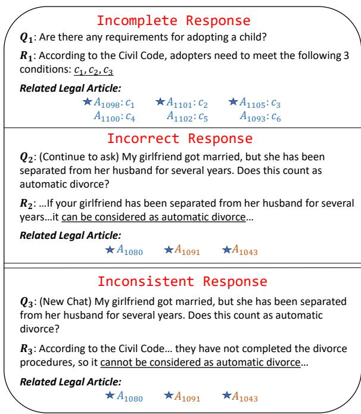
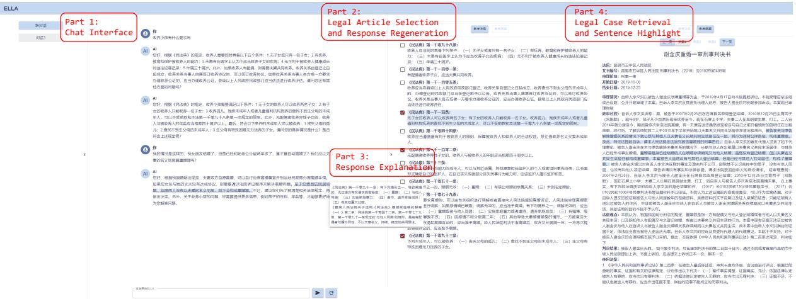
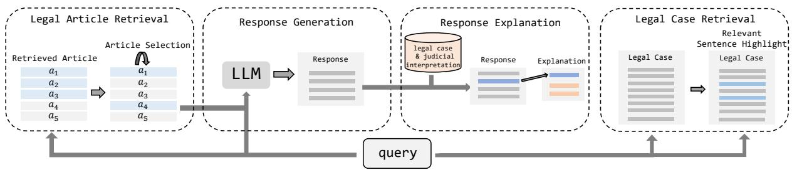
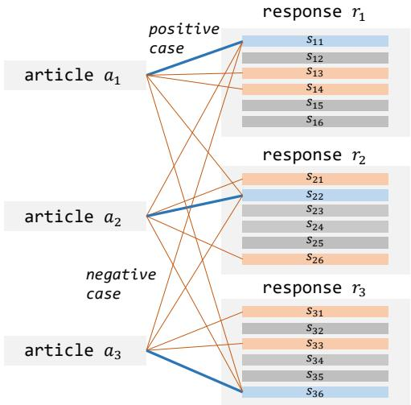

# ELLA: Empowering LLMs for Interpretable, Accurate and Informative Legal Advice

Yutong $\mathbf { H } \mathbf { u } ^ { 1 , 2 }$ ∗, Kangcheng $\mathbf { L u o ^ { 3 , * } }$ , Yansong Feng1†

1Wangxuan Institute of Computer Technology, Peking University, China 2School of Intelligence Science and Technology, Peking University 3School of Electronics Engineering and Computer Science, Peking University, China State Key Laboratory of General Artificial Intelligence {huyutong,fengyansong} @pku.edu.cn luokangcheng@stu.pku.edu.cn

# Abstract

Despite remarkable performance in legal consultation exhibited by legal Large Language Models(LLMs) combined with legal article retrieval components, there are still cases when the advice given is incorrect or baseless. To alleviate these problems, we propose ELLA, a tool for Empowering LLMs for interpretable, accurate, and informative Legal Advice. ELLA visually presents the correlation between legal articles and LLM’s response by calculating their similarities, providing users with an intuitive legal basis for the responses. Besides, based on the users’ queries, ELLA retrieves relevant legal articles and displays them to users. Users can interactively select legal articles for LLM to generate more accurate responses. ELLA also retrieves relevant legal cases for user reference. Our user study shows that presenting the legal basis for the response helps users understand better. The accuracy of LLM’s responses also improves when users intervene in selecting legal articles for LLM. Providing relevant legal cases also aids individuals in obtaining comprehensive information. Our github repo is: https: //github.com/Huyt00/ELLA1.

# 1 Introduction

Large Language Models (LLMs), such as LLAMA (Touvron et al., 2023), ChatGLM (Zeng et al., 2023) and GPT4 (OpenAI et al., 2024), have shown impressive performance in various tasks, showing great potential for specific domains, such as law (Lai et al., 2023) and finance (Wu et al., 2023; Yang et al., 2023). In the legal domain, many attempts have been made(Colombo et al., 2024; Huang et al., 2023; Yue et al., 2023; Nguyen, 2023; Cui et al., 2023), which acquire legal knowledge through continual training and performing a supervised fine-tuning stage with a large-scale legal dataset. These models can offer various services including legal consultations, explaining legal terminology, analyzing legal cases, and preparing legal documents.

Despite the remarkable performance of LLMs within the legal domain, they are not exempt from the occurrence of hallucination (Ji et al., 2023). To alleviate this, previous studies (Huang et al., 2023; Yue et al., 2023; Cui et al., 2023) have proposed retrieval-augmented generation(RAG) (Lewis et al., 2021) frameworks to retrieve legal articles from an external datastore. By leveraging retrieved legal articles, hallucination is reduced and LLMs can generate more faithful answers.

In the legal domain, LLMs’ responses are required to have high accuracy and be supported by reasonable legal bases. Therefore, the retrieval component plays an important role as it provides correct and related legal articles for LLMs. While LLMs could be augmented with retrieved legal articles to generate faithful responses, when irrelevant ones are retrieved, they inevitably bring noise to LLMs, leading LLMs to produce responses with incomplete, incorrect or inconsistent information.

For instance, as shown in Figure 1, when a user asks $Q _ { 1 }$ , the legal article retrieval model retrieves articles 1098, 1101, and 1105 of the Civil Code 2 according to the query, while fails to retrieve another three relevant ones: article 1100, 1102 and 1093 of the Civil Code. Therefore, LLM only suggests that adopters need to meet the conditions $c _ { 1 } , c _ { 2 }$ and $c _ { 3 }$ mentioned in the retrieved legal articles, resulting in incomplete suggestions. Then the user continues to ask $Q _ { 2 }$ . Although the related article is retrieved, the irrelevant ones are also retrieved. Such irrelevant articles bring noise to LLM, leading to the incorrect response $R _ { 2 }$ (In fact, the case mentioned in $Q _ { 2 }$ should not be considered as automatic divorce). Besides, LLMs may be sensible to the input perturbation (Zhu et al., 2023; Dong et al., 2023). Responses can be contradictory when inputs only differ slightly. For example, when the user begins a new chat and asks $Q _ { 3 }$ , which is identical to $Q _ { 2 }$ , the response $R _ { 3 }$ is contradictory to $R _ { 2 }$ This inconsistency can potentially bring confusion to users, resulting in a lower-quality consultation.

  
Figure 1: Examples of incomplete, incorrect, inconsistent Response. $A _ { i }$ indicates the $i _ { t h }$ article in Civil Code. Blue articles mean they are relevant to the query, while orange ones are irrelevant. The blue star means the article is retrieved for LLM. We only show the key information in the Figure. For the complete conversations, please refer to Appendix B

When LLMs fail to produce coherent and complete responses, relevant legal cases can offer users more in-depth reference information (Su et al., 2024). However, a legal case retrieval module has rarely been integrated into the existing legal domain LLMs in civil law systems. Additionally, legal terminology may sometimes be embedded in the responses lacking sufficient explanations, posing potential understanding difficulties for users without domain knowledge (Savelka et al., 2023).

To address the issues mentioned above, we propose ELLA, a tool Empowering LLMs for interpretable, accurate, and informative Legal Advice.

Firstly, we fine-tune BGE (Xiao et al., 2023), an embedding model for retrieval, to retrieve the legal basis for each sentence in the response. By visually presenting the legal basis to users, users can trust the advice provided by LLMs. When there is no legal basis for a sentence, it can be viewed as a warning that the sentence may be incorrect. Secondly, ELLA retrieves several legal articles based on the user’s query and presents them to users. Users can interactively select the relevant legal articles for LLMs to generate accurate and complete responses while disregarding irrelevant ones to avoid noise. Thirdly, we incorporate a legal case retrieval model in ELLA, intending to present supplementary information for users to reference. Considering the long context in legal cases, we find all the key sentences in the article through similarity matching between the query and each sentence in the legal case. We highlight all key sentences in the legal cases for users to improve their reading efficiency.

The response interpretation aids users in understanding and placing trust in the advice given by LLMs. The user study shows that our model can generate more accurate responses when users interactively select relevant legal articles. The legal case retrieval module also offers users more resourceful reference information.

# 2 Framework and Usage Example

ELLA is composed of four parts: 1) Chat Interface: visually displays the conversation between the user and the LLM. 2) Interactive Legal Article Selection: Provides retrieved legal articles for users to choose from, letting the LLM generate new responses based on the user’s selected legal articles. 3) Response Interpretation: Provides legal article and judicial interpretations to interpret each sentence of the LLM’s response. 4) Legal Case Retrieval: Displays relevant legal cases for the user to refer to.

# 2.1 Chat Interface

Our chat interface is shown in Figure 2, part 1. After clicking the input button, the chat box above will display user input and the LLM’s response. Users can have multiple rounds of chats, or click ’new conversation’ on the upper left to start a new consultation. The column on the left retains all conversations. Users can click on each chat button to view the corresponding chat content.

# 2.2 Interactive Legal Article Selection

Legal article retrieval model plays an important part in Chinese legal domain LLMs (Huang et al.,

  
Figure 2: Screenshot of ELLA. We show the complete conversation in Appendix B, Table 2 and Table 5.

2023; Yue et al., 2023). Lawyer LLaMA (Huang et al., 2023) mentions that when LLMs are provided with external relevant legal articles, they can generate more reliable responses. However, the current legal article retrieval models cannot ensure to retrieval all the relevant legal articles and leave out all irrelevant ones. Missed articles might reduce the completeness of the model’s response, while irrelevant articles bring noise to LLM, leading LLMs to generate irrelevant advice.

To solve this problem, ELLA allows users to interactively select legal articles. We display the top $K _ { 1 } = 1 0$ relevant legal articles retrieved for the users. Users can select relevant legal articles based on their situations. The LLM will then generate responses based on the legal articles selected by the user. Note that the LLM generates its first response based on the top 3 retrieved articles by default. Subsequently, users can select legal articles for LLM to regenerate new responses multiple times.

Back to the example in Figure 1, we find that several relevant legal articles are not selected for LLM. Then we can select them, as shown in Figure 2, part 2, and click the "Regenerate" button at the bottom of the page. Then LLM generates a new response with complete information. By allowing users to participate in the legal article retrieval, it increases the consistency between the user’s situation and the referred legal articles used by the LLM, thus enabling the LLM to generate more complete and accurate responses.

# 2.3 Response Interpretation

The response interpretation module provides the legal article basis for each sentence in the LLM’s response, and helps users better understand the terminologies in the responses.

LLM is sensitive to the inputs. Users may receive different advice when ask the same questions in different ways. To facilitate users to identify which response is more reliable, or whether a response is trustworthy, the response interpretation module presents the referred legal articles for each sentence in the response. Users can verify the reliability of the response by tracing the legal article basis of each sentence.

At the same time, even though the LLM can conveniently provide legal advice to users, sometimes the responses may contain terminologies, which non-professional users may find hard to understand. Besides, some special cases lack a clear definition in the legal articles. They are both explicitly explained in China’s "judicial interpretations". To provide users with a better legal consultation experience, we use a response explanation module to provide a clear explanation of the terminology/special cases with corresponding judicial interpretation, making it easier for users to understand.

As shown in Figure 2, part 3, when the user ask "My girlfriend is married...Would living with her without being legally married be considered bigamy?", the response is "...The situation you mentioned is cohabitation rather than bigamy...cohabitation is not illegal...". To check the definition of "cohabitation", the user can hover the mouse over the sentence. Then the platform will display a hovering box, showing the corresponding judicial interpretation. We show the legal article basis for the sentence in the same way. If there is neither a legal article basis nor a judicial interpretation for the sentence, the hovering box will not display.

# 2.4 Legal Case Retrieval

Legal cases also serve as important references for users when they consult on legal issues and make judgments about their circumstances. Currently, Chinese legal domain LLMs can only make decisions for users based on internal legal knowledge and externally retrieved legal articles, unable to provide relevant legal cases for users as reference. Therefore, we introduced a legal case retrieval module in ELLA. For every query from users, we search relevant legal cases obtained from China Judgements Online 3 and display them on the platform for users, as shown in Figure 2, part 4. As the context of the legal cases may be long, we highlight the sentences in the trial proceeding records related to the user’s query. Users can directly locate these sentences to get key information. We provide multiple relevant legal cases. Users can click the button at the top of part 4 to view different legal cases.

# 3 System Overview

In this section, we detail the implementation of all back-end models of ELLA.

# 3.1 Legal Consultation

In our work, we use Lawyer LLaMA (Huang et al., 2023), a LLM adapted to the legal domain, for legal consultation. Based on Lawyer LLaMA, which focuses on answering queries about marriage, ELLA mainly provides marriage consultation services for users. Since our back-end model is pluggable, we can also replace Lawyer LLaMA with other legal domain LLMs, such as DISCLawLLM (Yue et al., 2023), ChatLaw (Cui et al., 2023) or LawGPT (Nguyen, 2023).

# 3.2 Legal Article Retrieval

We use the legal article retrieval model provided by Lawyer LLaMA. Following Lawyer LLaMA, after the user inputs a query, we retrieve the relevant legal articles, and append the top 3 legal articles to the user’s query to generate the response. Besides, we display the top $K _ { 1 } = 1 0$ retrieved legal articles on the front end. If the user selects some relevant legal articles and requires a new response, in the back end, we append all selected legal articles to the input prompt, and LLM will generate a new response.

# 3.3 Response Interpretation

The response interpretation module aims to provide the legal article basis and judicial interpretations for each sentence of the response from the LLM. Here, we use BGE (Xiao et al., 2023), a state-ofthe-art embedding model for retrieval augmented generation. Since BGE has only been pre-trained on the general corpus, it lacks knowledge about the legal domain, thus being unable to distinguish between two terminologies that are semantically similar but have different definitions in the legal domain. Therefore, we need to fine-tune BGE with legal corpus to make it learn legal knowledge.

Due to the lack of training data, we construct a dataset for response interpretation. We sample $2 \mathrm { k \Omega }$ queries from the legal instruction tuning data published by Lawyer LLaMA. For each query $q$ we obtain the top 3 relevant articles $[ a _ { 1 } , a _ { 2 } , a _ { 3 } ]$ with the legal article retrieval module, and append these three laws individually to $q _ { i }$ . Then Lawyer LLaMA generates different responses $[ r _ { 1 } , r _ { 2 } , r _ { 3 } ]$ based on the different legal articles. For $r _ { i } =$ $\left[ s _ { i 1 } , s _ { i 2 } , . . . , s _ { i n } \right]$ , we calculated the similarity between each sentence $s _ { i j } , j \in [ 1 , n ]$ and $a _ { i }$ using BM25 (Robertson and Zaragoza, 2009). As illustrated in Figure 4, we treat the sentence with the highest BM25 score $s _ { i k }$ and gold article $a _ { i }$ as the positive case $( s _ { i k } , a _ { i } )$ , while the two most irrelevant sentences $s _ { i x }$ , $s _ { i y }$ as negative cases $( s _ { i x } , a _ { i } )$ and $( s _ { i y } , a _ { i } )$ . We also created negative cases $( s _ { i k } , a _ { t } ) , t \in [ 1 , 2 , 3 ]$ and $t \neq i$ for distinguishing relevant sentence in $r _ { i }$ from other retrieved legal articles.

Given the similar language style and content between legal articles and judicial interpretations, and the fact that legal articles contain all the terminologies involved in judicial interpretations, we only used legal articles to construct the dataset. After fine-tuning the BGE on this dataset, we obtained a new model, which we denote as $B G E _ { 1 }$ here.

During inference, we use $\mathrm { B G E _ { 1 } }$ to calculate the cosine similarity between the embedding of each sentence in the response and the legal articles and judicial interpretations. If the similarity exceeds a threshold $T h r _ { 1 }$ , we think the corresponding legal article or judicial interpretation can explain the sentence. $T h r _ { 1 }$ is a hyper-parameter, which we set as 0.85 in our work. Then, we return the articles and judicial interpretations referenced by each sentence to the front end, to help users better understand the LLM’s responses.

  
Figure 3: The system architecture overview.

# 3.4 Legal Case Retrieval

In this module, we first retrieve relevant legal cases based on the user’s input. Then we find all the key sentences in the legal case that are related to the consultation query. Finally, we re-rank the top $K _ { 2 }$ retrieved legal cases according to the number of relevant sentences in the legal case, and return the top $K _ { 3 }$ re-ranked legal cases to the front end.

Legal Case Retrieval. Similarly, due to the lack of relevant legal domain knowledge in BGE, we need to fine-tune BGE with the legal domain corpus. Here, we use the dataset LeCaRD (Ma et al., 2021), a publicly available Chinese legal case retrieval dataset. We allocated $80 \%$ of LeCaRD as the training set and $10 \%$ each as the validation and test set. We fine-tune BGE on the training set. Here we denoted the fine-tuned BGE as $\mathrm { B G E _ { 2 } }$ . When the user inputs a query, we use $\mathrm { B G E _ { 2 } }$ to retrieve relevant legal cases.

Relevant Sentence Highlight. We use $\mathrm { B G E _ { 2 } }$ to calculate the similarity between the user’s query and each sentence in the legal case. When the cosine similarity score is larger than $T h r _ { 2 }$ , we consider this sentence to be related to the user’s query, thus this sentence can serve as a reason for this case being a relevant legal case. $T h r _ { 2 }$ is a hyperparameter, which we set to 0.65 in our work. We highlight all relevant sentences in the case for users, helping them quickly locate the parts of the case that are highly related to their query. In this way, users can quickly judge whether this legal case is relevant and helpful, and they can also quickly obtain important information that they care about.

Legal Case Re-rank. We think that the more relevant sentences in a case, the larger the possibility of the case being a relevant legal case. Therefore, we re-rank the top $K _ { 2 }$ legal cases retrieved by $\mathrm { B G E _ { 2 } }$ according to the number of relevant sentences, and return the re-ranked top $K _ { 3 }$ legal cases to the front end. We set $K _ { 2 } = 5 0$ and $K _ { 3 } = 1 5$ in our work.

Table 1: Results of Legal Case Retrieval Model.   

<table><tr><td>Model</td><td>NDCG@10</td><td>NDCG@20</td><td>NDCG@30</td></tr><tr><td>BM25</td><td>53.51</td><td>55.81</td><td>58.03</td></tr><tr><td>BGE</td><td>66.57</td><td>67.13</td><td>71.91</td></tr><tr><td>BGE2</td><td>76.34</td><td>77.84</td><td>78.29</td></tr><tr><td>CaseEncoder (Ma et al., 2023)</td><td>78.5</td><td>80.3</td><td>83.9</td></tr><tr><td>SAILER (Li et al., 2023)</td><td>79.79</td><td>82.26</td><td>84.85</td></tr><tr><td>CaseFormer (Su et al., 2024)</td><td>83.45</td><td>83.57</td><td>83.94</td></tr></table>

# 4 Evaluation

In this section, we automatically evaluate our case retrieval model. We also conduct a user study to evaluate whether ELLA helps users obtain more accurate, interpretable and informative information during the consultation.

# 4.1 Automatical Evaluation

As we mentioned in Section 3.4, we split LeCaRD into $80 \%$ for training, $10 \%$ for validation and $10 \%$ for testing. Here, we use the LeCaRD test set to evaluate our legal case retrieval model, $\mathrm { B G E _ { 2 } }$ . Following CaseEncoder (Ma et al., 2023), we use the Normalize Discounted Cumulative Gain (NDCG) metric as the evaluation metric. The experimental results are shown in Table 1.

Compared with BM25 and BGE which has not been fine-tuned, $\mathrm { B G E _ { 2 } }$ shows a significant increase in each ${ \mathrm { N D C G } } @ { \mathrm { K } }$ . This shows that the fine-tuned BGE can learn legal knowledge well, and better distinguish legal cases that are semantically similar but not relevant in the legal domain. Although CaseEncoder (Ma et al., 2023), SAILER (Li et al., 2023) and CaseFormer (Su et al., 2024) outperform $\mathrm { B G E _ { 2 } }$ , we use $\mathrm { B G E _ { 2 } }$ since it can serve as an embedding model for relevant sentences similarity matching mentioned in Section 3.4. Note that our legal case retrieval model is pluggable, so we can also additionally add SOTA models mentioned above for legal case retrieval.

# 4.2 User Study

# 4.2.1 Study Design

We conduct a user study to validate whether ELLA can improve users’ legal consultation experience. Since LLMs deliver an impressive performance in answering simple questions, such as "Can I get married if I am younger than $2 0 ? \prime$ , we randomly selected 20 consultation queries about complex marriage situations for the user study. We invited 3 non-legal professional users and asked them to obtain solutions to these queries through ELLA. Users will evaluate whether the three modules in ELLA are helpful for their legal consultation.

# 4.2.2 Result

Response Regeneration. For an average of $83 \%$ of the queries, users find that the top 3 legal articles retrieved are not entirely correct, impeding LLM from directly generating correct responses based on these articles. For an estimated $20 \%$ of the queries, LLMs can not provide correct responses due to the noise brought by irrelevant legal articles, while for $2 5 \%$ , LLM’s responses are incomplete, as relevant legal articles were not among the initial top three results. Another $38 \%$ of responses contained irrelevant information resulting from the inclusion of unrelated legal articles within the top three results. However, in $80 \%$ cases, users can successfully receive correct responses by selecting relevant legal articles for LLM to regenerate responses.

Response Interpretation. Users have reported that for approximately $9 5 \%$ of the queries, ELLA can accurately provide the legal article basis of the responses generated by the LLM. By crossreferencing the responses with the corresponding legal article, users can swiftly determine whether the responses are reliable or inaccurate. For instance, when a user asks, "I have never had children since I got married, and now I am planning to adopt a child from a relative. Can I adopt a child privately?" LLM responds "Adopters need to meet the following conditions...". ELLA justifies the response by citing Article 1098 of the Civil Code as its legal article basis. Additionally, it retrieves Article 1100 of the Civil Code, $" A$ childless adopter may adopt two children...," which the user can select for the LLM to generate a full response. Users also noted that, in about $73 \%$ of the queries, parts of the legal articles have already been included within the responses. However, LLM may not fully rephrase the entire article. By providing the legal articles basis, users can conveniently access to the complete information in the legal article.

In all provided judicial interpretations, roughly $30 \%$ serve the purpose of clarifying specific legal terminologies or special cases. For instance, consider a scenario where a user inquires, "My husband and I have obtained a marriage certificate but have not cohabited. We are now filing for divorce and my husband wishes to return the bride price. Is this permissible?" In response, ELLA gives additional judicial interpretation that illuminates the conditions under which the return of the bride price is allowed. However, for the remaining $70 \%$ , users claim that they are already familiar with the content in the judicial interpretations, such as, "Support payments encompass children’s living expenses, education costs, medical bills and other expenditures." Generally speaking, users assert that judicial interpretations can assist them in acquiring a better comprehension of the responses when interpretation is required, facilitate accurate judgments according to their situations, and pave the way for further consultation tailored to the specifics of their current circumstances.

Legal Case Retrieval. On average, $7 7 \%$ of queries proved the legal case retrieval module to be beneficial for user consultations. Users conveyed that although the retrieved legal cases might not exactly match their situations, these cases provide a reference point to gauge the possible outcomes for their unique circumstances. All users concurred that highlighting pertinent sentences significantly streamlines the process of reading cases. By emphasizing the information users are interested in, the user’s reading efficiency improves.

# 5 Conclusion

We present a novel tool, ELLA, for legal consultation. ELLA provides the legal basis and judicial interpretations that supplement the legal advice generated by LLMs, increasing users’ understanding and trust in LLM responses. It also displays retrieval results from the retrieval model and allows users to actively select relevant legal articles, thereby assisting the LLMs in generating more accurate responses. Additionally, equipped with a legal case retrieval model, users can refer to relevant legal cases for more comprehensive information. ELLA enables LLMs to provide legal advice that is easier to interpret, more precise, and more informative.

# Acknowledgments

This work is supported in part by NSFC (62161160339) and Beijing Science and Technology Program (Z231100007423011). We thank the anonymous reviewers for their valuable comments and suggestions. For any correspondence, please contact Yansong Feng.

# Limitations

For simple legal queries, legal LLMs can provide correct responses in most cases. ELLA primarily assists with complex legal consultation queries. When users ask multiple questions within a single input, our legal article retrieval module may not comprehensively extract all relevant legal articles. In future work, we plan to integrate different retrieval modules to increase the diversity of retrieved legal articles.

As official judicial interpretations only contain 76 articles, ELLA can not provide interpretations for all professional terminologies. We will incorporate additional external legal knowledge, such as legal textbooks, to provide interpretations for more professional terminologies.

Due to limited computational resources, we do not use state-of-the-art case retrieval modules. We will adopt them in our future work.

# Ethics Statement

The main purpose of this paper is to explore how to provide users with better legal consultation services. However, it is important to note that the outputs generated by the model may contain nonstandard, incorrect, gender-biased, or morally questionable information. Therefore, please adopt the legal advice provided by the model with caution. When legal assistance is needed, please seek help from qualified professionals.

The external knowledge used in this paper, such as legal articles and legal cases, was obtained from the official websites of the Chinese government. The data does not contain any private information and cannot be used for commercial purposes.

All participants involved in the user study are voluntary and anonymous. We did not collect any private information from the participants.

# References

Pierre Colombo, Telmo Pessoa Pires, Malik Boudiaf, Dominic Culver, Rui Melo, Caio Corro, Andre F. T.

Martins, Fabrizio Esposito, Vera Lúcia Raposo, Sofia Morgado, and Michael Desa. 2024. Saullm-7b: A pioneering large language model for law.

Jiaxi Cui, Zongjian Li, Yang Yan, Bohua Chen, and Li Yuan. 2023. Chatlaw: Open-source legal large language model with integrated external knowledge bases.

Guanting Dong, Jinxu Zhao, Tingfeng Hui, Daichi Guo, Wenlong Wang, Boqi Feng, Yueyan Qiu, Zhuoma Gongque, Keqing He, Zechen Wang, et al. 2023. Revisit input perturbation problems for llms: A unified robustness evaluation framework for noisy slot filling task. In CCF International Conference on Natural Language Processing and Chinese Computing, pages 682–694. Springer.

Quzhe Huang, Mingxu Tao, Chen Zhang, Zhenwei An, Cong Jiang, Zhibin Chen, Zirui Wu, and Yansong Feng. 2023. Lawyer llama technical report. ArXiv, abs/2305.15062.

Ziwei Ji, Nayeon Lee, Rita Frieske, Tiezheng Yu, Dan Su, Yan Xu, Etsuko Ishii, Ye Jin Bang, Andrea Madotto, and Pascale Fung. 2023. Survey of hallucination in natural language generation. ACM Computing Surveys, 55(12):1–38.

Jinqi Lai, Wensheng Gan, Jiayang Wu, Zhenlian Qi, and Philip S. Yu. 2023. Large language models in law: A survey.

Patrick Lewis, Ethan Perez, Aleksandra Piktus, Fabio Petroni, Vladimir Karpukhin, Naman Goyal, Heinrich Küttler, Mike Lewis, Wen tau Yih, Tim Rocktäschel, Sebastian Riedel, and Douwe Kiela. 2021. Retrieval-augmented generation for knowledgeintensive nlp tasks.

Haitao Li, Qingyao Ai, Jia Chen, Qian Dong, Yueyue Wu, Yiqun Liu, Chong Chen, and Qi Tian. 2023. Sailer: Structure-aware pre-trained language model for legal case retrieval.

Yixiao Ma, Yunqiu Shao, Yueyue Wu, Yiqun Liu, Ruizhe Zhang, Min Zhang, and Shaoping Ma. 2021. Lecard: a legal case retrieval dataset for chinese law system. In Proceedings of the 44th international ACM SIGIR conference on research and development in information retrieval, pages 2342–2348.

Yixiao Ma, Yueyue Wu, Weihang Su, Qingyao Ai, and Yiqun Liu. 2023. Caseencoder: A knowledgeenhanced pre-trained model for legal case encoding.

Ha-Thanh Nguyen. 2023. A brief report on lawgpt 1.0: A virtual legal assistant based on gpt-3.

OpenAI, Josh Achiam, Steven Adler, Sandhini Agarwal, Lama Ahmad, Ilge Akkaya, Florencia Leoni Aleman, Diogo Almeida, Janko Altenschmidt, Sam Altman, Shyamal Anadkat, Red Avila, Igor Babuschkin, Suchir Balaji, Valerie Balcom, Paul Baltescu, Haiming Bao, Mohammad Bavarian, Jeff Belgum, Irwan Bello, Jake Berdine, Gabriel Bernadett-Shapiro,

Christopher Berner, Lenny Bogdonoff, Oleg Boiko, Madelaine Boyd, Anna-Luisa Brakman, Greg Brockman, Tim Brooks, Miles Brundage, Kevin Button, Trevor Cai, Rosie Campbell, Andrew Cann, Brittany Carey, Chelsea Carlson, Rory Carmichael, Brooke Chan, Che Chang, Fotis Chantzis, Derek Chen, Sully Chen, Ruby Chen, Jason Chen, Mark Chen, Ben Chess, Chester Cho, Casey Chu, Hyung Won Chung, Dave Cummings, Jeremiah Currier, Yunxing Dai, Cory Decareaux, Thomas Degry, Noah Deutsch, Damien Deville, Arka Dhar, David Dohan, Steve Dowling, Sheila Dunning, Adrien Ecoffet, Atty Eleti, Tyna Eloundou, David Farhi, Liam Fedus, Niko Felix, Simón Posada Fishman, Juston Forte, Isabella Fulford, Leo Gao, Elie Georges, Christian Gibson, Vik Goel, Tarun Gogineni, Gabriel Goh, Rapha GontijoLopes, Jonathan Gordon, Morgan Grafstein, Scott Gray, Ryan Greene, Joshua Gross, Shixiang Shane Gu, Yufei Guo, Chris Hallacy, Jesse Han, Jeff Harris, Yuchen He, Mike Heaton, Johannes Heidecke, Chris Hesse, Alan Hickey, Wade Hickey, Peter Hoeschele, Brandon Houghton, Kenny Hsu, Shengli Hu, Xin Hu, Joost Huizinga, Shantanu Jain, Shawn Jain, Joanne Jang, Angela Jiang, Roger Jiang, Haozhun Jin, Denny Jin, Shino Jomoto, Billie Jonn, Heewoo Jun, Tomer Kaftan, Łukasz Kaiser, Ali Kamali, Ingmar Kanitscheider, Nitish Shirish Keskar, Tabarak Khan, Logan Kilpatrick, Jong Wook Kim, Christina Kim, Yongjik Kim, Jan Hendrik Kirchner, Jamie Kiros, Matt Knight, Daniel Kokotajlo, Łukasz Kondraciuk, Andrew Kondrich, Aris Konstantinidis, Kyle Kosic, Gretchen Krueger, Vishal Kuo, Michael Lampe, Ikai Lan, Teddy Lee, Jan Leike, Jade Leung, Daniel Levy, Chak Ming Li, Rachel Lim, Molly Lin, Stephanie Lin, Mateusz Litwin, Theresa Lopez, Ryan Lowe, Patricia Lue, Anna Makanju, Kim Malfacini, Sam Manning, Todor Markov, Yaniv Markovski, Bianca Martin, Katie Mayer, Andrew Mayne, Bob McGrew, Scott Mayer McKinney, Christine McLeavey, Paul McMillan, Jake McNeil, David Medina, Aalok Mehta, Jacob Menick, Luke Metz, Andrey Mishchenko, Pamela Mishkin, Vinnie Monaco, Evan Morikawa, Daniel Mossing, Tong Mu, Mira Murati, Oleg Murk, David Mély, Ashvin Nair, Reiichiro Nakano, Rajeev Nayak, Arvind Neelakantan, Richard Ngo, Hyeonwoo Noh, Long Ouyang, Cullen O’Keefe, Jakub Pachocki, Alex Paino, Joe Palermo, Ashley Pantuliano, Giambattista Parascandolo, Joel Parish, Emy Parparita, Alex Passos, Mikhail Pavlov, Andrew Peng, Adam Perelman, Filipe de Avila Belbute Peres, Michael Petrov, Henrique Ponde de Oliveira Pinto, Michael, Pokorny, Michelle Pokrass, Vitchyr H. Pong, Tolly Powell, Alethea Power, Boris Power, Elizabeth Proehl, Raul Puri, Alec Radford, Jack Rae, Aditya Ramesh, Cameron Raymond, Francis Real, Kendra Rimbach, Carl Ross, Bob Rotsted, Henri Roussez, Nick Ryder, Mario Saltarelli, Ted Sanders, Shibani Santurkar, Girish Sastry, Heather Schmidt, David Schnurr, John Schulman, Daniel Selsam, Kyla Sheppard, Toki Sherbakov, Jessica Shieh, Sarah Shoker, Pranav Shyam, Szymon Sidor, Eric Sigler, Maddie Simens, Jordan Sitkin, Katarina Slama, Ian Sohl, Benjamin

Sokolowsky, Yang Song, Natalie Staudacher, Felipe Petroski Such, Natalie Summers, Ilya Sutskever, Jie Tang, Nikolas Tezak, Madeleine B. Thompson, Phil Tillet, Amin Tootoonchian, Elizabeth Tseng, Preston Tuggle, Nick Turley, Jerry Tworek, Juan Felipe Cerón Uribe, Andrea Vallone, Arun Vijayvergiya, Chelsea Voss, Carroll Wainwright, Justin Jay Wang, Alvin Wang, Ben Wang, Jonathan Ward, Jason Wei, CJ Weinmann, Akila Welihinda, Peter Welinder, Jiayi Weng, Lilian Weng, Matt Wiethoff, Dave Willner, Clemens Winter, Samuel Wolrich, Hannah Wong, Lauren Workman, Sherwin Wu, Jeff Wu, Michael Wu, Kai Xiao, Tao Xu, Sarah Yoo, Kevin Yu, Qiming Yuan, Wojciech Zaremba, Rowan Zellers, Chong Zhang, Marvin Zhang, Shengjia Zhao, Tianhao Zheng, Juntang Zhuang, William Zhuk, and Barret Zoph. 2024. Gpt-4 technical report.

Stephen Robertson and Hugo Zaragoza. 2009. The probabilistic relevance framework: Bm25 and beyond. Found. Trends Inf. Retr., 3(4):333–389.

Jaromir Savelka, Kevin D. Ashley, Morgan A. Gray, Hannes Westermann, and Huihui Xu. 2023. Explaining legal concepts with augmented large language models (gpt-4).

Weihang Su, Qingyao Ai, Yueyue Wu, Yixiao Ma, Haitao Li, Yiqun Liu, Zhijing Wu, and Min Zhang. 2024. Caseformer: Pre-training for legal case retrieval based on inter-case distinctions.

Hugo Touvron, Thibaut Lavril, Gautier Izacard, Xavier Martinet, Marie-Anne Lachaux, Timothée Lacroix, Baptiste Rozière, Naman Goyal, Eric Hambro, Faisal Azhar, Aurelien Rodriguez, Armand Joulin, Edouard Grave, and Guillaume Lample. 2023. Llama: Open and efficient foundation language models.

Shijie Wu, Ozan Irsoy, Steven Lu, Vadim Dabravolski, Mark Dredze, Sebastian Gehrmann, Prabhanjan Kambadur, David Rosenberg, and Gideon Mann. 2023. Bloomberggpt: A large language model for finance.

Shitao Xiao, Zheng Liu, Peitian Zhang, and Niklas Muennighoff. 2023. C-pack: Packaged resources to advance general chinese embedding.

Hongyang Yang, Xiao-Yang Liu, and Christina Dan Wang. 2023. Fingpt: Open-source financial large language models.

Shengbin Yue, Wei Chen, Siyuan Wang, Bingxuan Li, Chenchen Shen, Shujun Liu, Yuxuan Zhou, Yao Xiao, Song Yun, Xuanjing Huang, and Zhongyu Wei. 2023. Disc-lawllm: Fine-tuning large language models for intelligent legal services.

Aohan Zeng, Xiao Liu, Zhengxiao Du, Zihan Wang, Hanyu Lai, Ming Ding, Zhuoyi Yang, Yifan Xu, Wendi Zheng, Xiao Xia, Weng Lam Tam, Zixuan Ma, Yufei Xue, Jidong Zhai, Wenguang Chen, Peng Zhang, Yuxiao Dong, and Jie Tang. 2023. Glm-130b: An open bilingual pre-trained model.

Kaijie Zhu, Jindong Wang, Jiaheng Zhou, Zichen Wang, Hao Chen, Yidong Wang, Linyi Yang, Wei Ye, Neil Zhenqiang Gong, Yue Zhang, et al. 2023. Promptbench: Towards evaluating the robustness of large language models on adversarial prompts. arXiv preprint arXiv:2306.04528.

# A Dataset Construction

  
Figure 4: Schematic of Dataset Construction. The blue sentences indicate the sentences with the highest BM25 scores and the orange sentences are the most irrelevant ones. Blue lines indicate positive cases and orange lines indicate negative cases.

# B Consultation Examples

<table><tr><td colspan="2"></td></tr><tr><td>Q1 : R1 :</td><td>Q1 : What are the requirements for adopting a child?</td></tr><tr><td>H1 — 2 JT 4 5. A - AEEE H5? R′ :   </td><td>R1 : Hello, according to the provisions of the Civil Code, adopters need to meet the following five con- ditions simultaneously: 1. Having no children or having only one child; 2. Having the ability to sup- port, educate, and protect the adopted child; 3. Not suffering from diseases that are considered by med- ical standards as reasons not to adopt children; 4. Having no criminal records that are detrimental to the healthy growth of the adopted child; 5. Being at least thirty years old. Additionally, if the adopter is married, the adoption should be done jointly by the couple. The adoption relationship is established from the date of registration. If the parties to the adoption voluntarily sign an adoption agreement, they can do so. If the parties to the adoption or one party requests adoption notarization, adoption notarization should be processed. The civil affairs department of the peo- ple's government at or above the county level shall conduct adoption assessments in accordance with the law. Do you have any other questions? R′ : Hello, according to the provisions of the Civil</td></tr><tr><td>1 2 . A T+ A AT 1.2.# H? AE?</td><td>Code, adopting a child requires meeting the follow- ing conditions: 1. An adopter with no children can adopt up to two children; 2. An adopter with chil- dren can only adopt one child; 3. Orphans, disabled minors, or minors raised by child welfare institutions whose birth parents cannot be found are not subject to the restrictions in the preceding paragraph and Article 1098 of this Law. Additionally, if an unmar- ried person adopts a child of the opposite sex, the adopter's age must be at least forty years older than the adoptee's. Lastly, the following minors can be adopted: 1. Orphans who have lost both parents; 2. Minors whose birth parents cannot be found; 3. Chil- dren whose birth parents face special difficulties and are unable to raise them. Could you please provide specific details about your situation? Do you meet the above requirements?</td></tr><tr><td colspan="1" rowspan="1">Q2 : , , 1EAEETE?</td><td colspan="1" rowspan="1">Q2 : Here's my situation: my girlfriend got married,but she has been separated from her husband for sev-eral years. Does this count as automatic divorce?Would living together without being married consti-tute bigamy?</td></tr><tr><td colspan="1" rowspan="1">R2 : ,,A.EEIWES.#0</td><td colspan="1" rowspan="1">R2 : Hello, according to the marriage laws of ourcountry, if both parties voluntarily divorce, they cannegotiate property division and other issues them-selves without the need for court trial. If your girl-friend has been separated from her husband for manyyears and there are no other reasons preventing themfrom continuing their marriage, it can be consideredan automatic divorce. As for whether you constitutebigamy, it depends on whether you have officiallydivorced and whether you have married or cohabitedwith someone else. If you have already divorced,there is no issue of bigamy. If not, you need to com-ply with relevant laws and regulations, such as theprohibition of bigamy. May I ask if you have alreadydivorced?</td></tr><tr><td colspan="1" rowspan="1">R2 : ,#,EUHET1?</td><td colspan="1" rowspan="1">Q2 : Hello, according to the laws of our country,marriage is only truly dissolved after completing di-vorce registration, or when the divorce judgment ormediation agreement takes effect. The situation youmentioned, although you haven't lived together asspouses, does not mean that the divorce procedureshave been completed. Therefore, you are still in amarital status currently. Additionally, bigamy refersto remarrying without completing divorce procedures,which doesn't apply to the situation you mentioned.Do you have any other questions that need answer-ing?</td></tr></table>

Table 3: $R _ { 2 }$ is generated based on Article 1080, 1091, and 1043 of Civil Code. $R _ { 2 } ^ { \prime }$ is generated based on Article 1080 of Civil Code.

<table><tr><td>Q3 : #,,1 AETE </td><td>Q3 : My situation is like this: My girlfriend got mar- ried, but she has been separated from her husband for several years. Does this count as automatic divorce? Would living together without being married consti- tute bigamy?</td></tr><tr><td>R3 :, T ETT XE ?</td><td>R3 : Hello, according to the provisions of the Civil Code, marriage can only be dissolved by complet- ing divorce registration or when a divorce judgment or mediation agreement becomes effective. As your girlfriend has been separated from her husband for several years without completing divorce procedures, it does not count as automatic divorce. Also, if you haven't lived together as husband and wife, it does not constitute bigamy. However, in a marital rela- tionship, both parties should be faithful, respect each other, love each other, and maintain a good family environment. If there are family conflicts or disputes, they can be resolved through negotiation or legal means. Would you like further information on how to handle such issues?</td></tr><tr><td>Q4 : ,,1 EAEMT THE?</td><td>Here's my situation: my girlfriend got married, but she has been separated from her husband for over two years. Does this count as automatic divorce? Would it be considered bigamy if we cohabitated without being married?</td></tr><tr><td>R4 : ,, T UT↑ ,## </td><td>Hello, according to the Marriage Law of our country, if both parties in a marriage voluntarily agree to di- vorce, they can negotiate the terms of the divorce and go to the local civil affairs bureau to handle the di- vorce procedures. If your girlfriend and her husband have not reached an agreement, they will need to resolve the divorce issue through the court litigation process. As for the cohabitation issue you mentioned, it would not constitute bigamy if you two did not cohabit under the guise of marriage. However, it's advisable for you to understand the relevant legal provisions before making any decisions. Addition- ally, regarding the adoption of a child, you would need to provide more information, such as the child's gender and age, for me to better assist you with your questions.</td></tr></table>