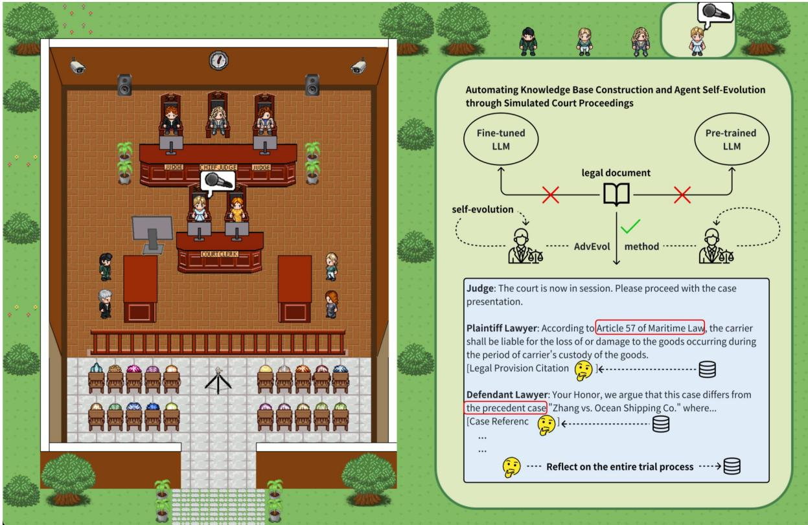
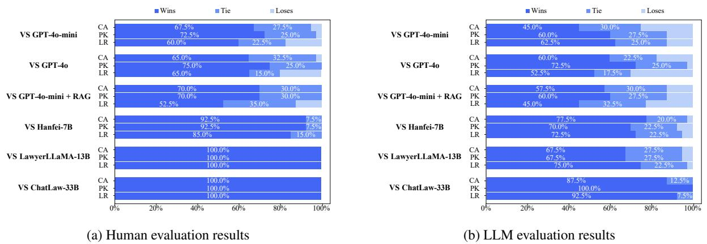
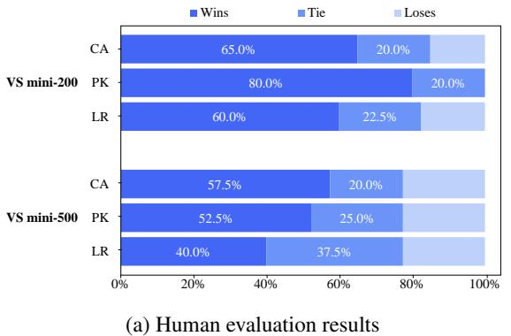
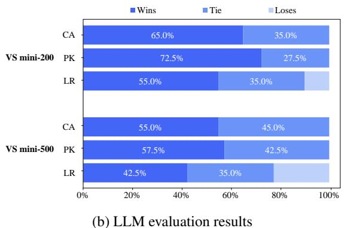
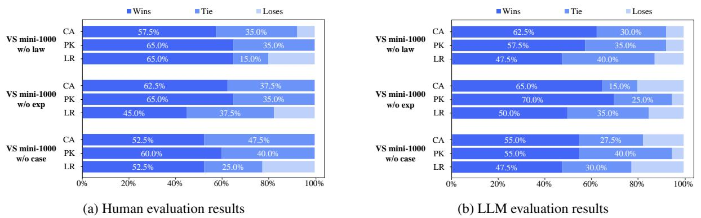
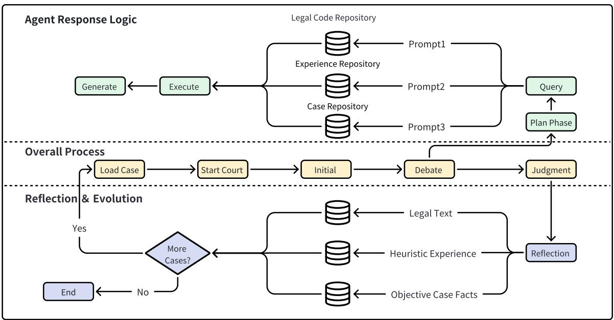
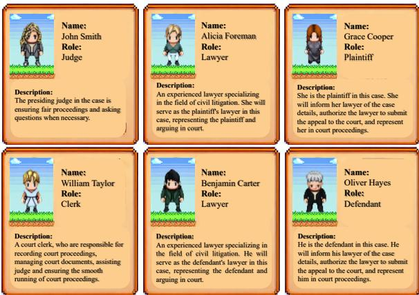
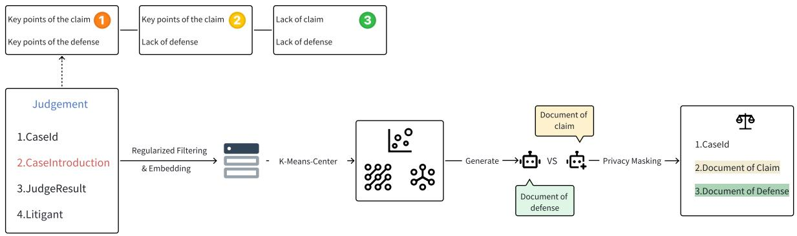
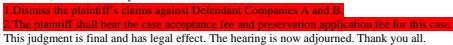

# AgentCourt: Simulating Court with Adversarial Evolvable Lawyer Agents

Guhong $\mathbf { C h e n ^ { 1 , 2 , 3 , * } }$ , Liyang $\mathbf { F a n } ^ { 2 , * }$ , Zihan $\mathbf { G o n g ^ { 1 , 2 , * } }$ , Nan $\mathbf { X i e } ^ { 2 }$ , Zixuan $\mathbf { L i } ^ { 2 }$ , Ziqiang $\mathbf { L i u } ^ { 2 }$ , Chengming $\mathbf { L i } ^ { 4 }$ , Qiang $\mathbf { Q } \mathbf { u } ^ { 2 }$ , Hamid Alinejad-Rokny5, Shiwen $\mathbf { N i } ^ { 2 , 3 , \dagger }$ , Min Yang2,3,6,†

1Southern University of Science and Technology 2Shenzhen Key Laboratory for High Performance Data Mining, Shenzhen Institutes of Advanced Technology, Chinese Academy of Sciences 3SIAT-DELI AI and Law Joint Lab 4Shenzhen MSU-BIT University 5UNSW Sydney 6SUAT {gh.chen2, sw.ni, min.yang}@siat.ac.cn

# Abstract

Current research in LLM-based simulation systems lacks comprehensive solutions for modeling real-world court proceedings, while existing legal language models struggle with dynamic courtroom interactions. We present AgentCourt, a comprehensive legal simulation framework that addresses these challenges through adversarial evolution of LLM-based agents. Our AgentCourt introduces a new adversarial evolutionary approach for agents called AdvEvol, which performs dynamic knowledge learning and evolution through structured adversarial interactions in a simulated courtroom program, breaking the limitations of the traditional reliance on static knowledge bases or manual annotations. By simulating 1,000 civil cases, we construct an evolving knowledge base that enhances the agents’ legal reasoning abilities. The evolved lawyer agents demonstrated outstanding performance on our newly introduced CourtBench benchmark, achieving a $12 . 1 \%$ improvement in performance compared to the original lawyer agents. Evaluations by professional lawyers confirm the effectiveness of our approach across three critical dimensions: cognitive agility, professional knowledge, and logical rigor. Beyond outperforming specialized legal models in interactive reasoning tasks, our findings emphasize the importance of adversarial learning in legal AI and suggest promising directions for extending simulation-based legal reasoning to broader judicial and regulatory contexts1.

# 1 Introduction

Large language models (LLMs) have shown remarkable success in simulating real-world professional scenarios, from medical consultations to educational interactions (Li et al., 2024). However, in the legal domain, comprehensive simulation of court proceedings remains an underexplored challenge. While existing legal language models excel at static tasks such as legal provision retrieval and question answering (Lai et al., 2023), they struggle with dynamic courtroom interactions. For instance, these models can accurately recite Articles of Civil Law and regulations but often fail to leverage them effectively in adversarial court debates. More critically, models like ChatLaw-33B (Cui et al., 2024, 2023) exhibit severe overfitting to standardized legal tasks, sometimes losing the ability to generate coherent responses in interactive courtroom scenarios.

To address these limitations, we present AgentCourt, an innovative framework for simulating civil court proceedings through LLM-based agents. Unlike previous approaches that focus on specific legal tasks, our system creates a complete courtroom environment where multiple agents—including judges, attorneys, and other participants—engage in structured legal discourse, as shown in Figure 1. At its core, AgentCourt employs an Adversarial Evolution (AdvEvol) method that enables continuous knowledge acquisition through simulated court interactions, eliminating the need for extensive manual annotation, fine-tuning, or specialized legal pre-training.

A key innovation of our approach is its automated knowledge evolution mechanism. By simulating court proceedings, lawyer agents construct and refine three specialized knowledge bases: a legal provisions memory for statutory understanding, an experience base for debate strategies, and a case library for precedent analysis. Starting with only complaints and defense statements from real cases, agents engage in adversarial debates to autonomously build and evolve their legal knowledge. This multi-faceted knowledge structure, combined with our adversarial learning strategy, enables agents to develop sophisticated legal reasoning capabilities that extend beyond simple information retrieval or pattern matching.

  
Figure 1: (Left) The mock courtroom sandbox interface supporting character movement and real-time dialogue, with a complete case demonstration available in the supplementary materials. (Right) The automated knowledge base construction and self-evolution of lawyer agent capabilities through the mock courtroom. The red boxes highlight key components corresponding to Formula (1) and Formula (7) in Section 3.3, which utilize knowledge from previous cases to assist in answering questions and enable continuous learning through post-trial reflection.

Through the simulation of 1,000 civil cases, we demonstrate significant improvements in the legal capabilities of our agents. Our evolved agents achieve performance comparable to GPT-4o on dynamic courtroom tasks while significantly outperforming specialized legal models. A particularly noteworthy finding is the contrast in model behavior: while existing legal models like ChatLaw-33B perform well on standardized tasks, they struggle significantly with dynamic courtroom dialogue, often failing to generate valid responses.

To facilitate systematic evaluation of such capabilities, we introduce CourtBench, a dedicated benchmark designed to assess interactive legal reasoning. Our findings underscore the importance of interactive learning in developing robust legal AI systems capable of handling dynamic legal scenarios.

The main contributions of our work include:

• We propose AgentCourt, the first court simulation framework enabling multi-party legal interactions and complex reasoning through the adversarial evolution of LLMbased agents.

• A novel automated knowledge evolution mechanism that requires only real-world complaints and defense statements as initial input. Through self-play court debates, agents autonomously construct and refine legal expertise across three specialized knowledge bases: a legal provisions memory for statutory understanding, an experience base for debate strategies, and a case library for precedent analysis. This self-evolving approach facilitates continuous expansion of knowledge without manual annotation, offering a scalable solution for future acquisition of legal knowledge.

• We propose CourtBench, a newly introduced benchmark designed to evaluate models’ capabilities in dynamic courtroom dialogue, addressing a critical gap in legal AI evaluation and ensuring systematic assessment of interactive legal reasoning.

# 2 Related Work

# 2.1 LLMs in the Legal Domain

AI applications in the legal domain have progressed significantly, particularly with the development of large language models (LLMs). These models have demonstrated strong potential in various legal tasks, including case prediction, legal research, and document analysis (Lai et al., 2023; Hamilton, 2023). Recent studies have explored various strategies to enhance LLMs’ legal reasoning capabilities, leading to the emergence of several specialized legal models.

For instance, Lawyer-LLaMA-13B (Huang et al., 2023), a 13B-parameter model fine-tuned on Chinese legal documents, has shown promising results in legal consultation. HanFei-7B (He et al., 2023) focuses on legal knowledge representation and statutory interpretation, while ChatLaw-33B (Cui et al., 2024, 2023) employs a mixture-of-experts architecture integrated with a legal knowledge graph to improve reasoning capabilities. Other approaches, such as DISC-LawLLM, highlight the effectiveness of fine-tuned LLMs in delivering intelligent legal services (Yue et al., 2023). The PLJP framework, on the other hand, enhances case judgment prediction accuracy by combining LLMs with domain-specific models (Wu et al., 2023). Similarly, DeliLaw (Xie et al., 2024) has demonstrated efficiency in handling legal inquiries through a dialogue-based system.

Despite these advancements, existing legal AI models remain largely confined to static, welldefined tasks, struggling to handle dynamic legal interactions. Although these models are trained on extensive legal corpora and leverage sophisticated architectures, they continue to face limitations when addressing complex legal queries and simulating real-world court proceedings. Many of these systems, including those mentioned above, remain task-specific and struggle with fully replicating the legal reasoning process and facilitating multi-party interactions (Janatian et al., 2023; Jin and Wang, 2023).

# 2.2 LLMs for Real-World Simulation

LLM-based multi-agent systems are a rapidly advancing area of AI research, leveraging collaborative agents to solve complex problems. These systems excel in combining knowledge sharing, cognitive synergy, and decision-making improvements (Talebirad and Nadiri, 2023; Händler, 2023).

The potential of multi-agent LLM-based systems has been demonstrated in various domains. In natural language processing, they have improved language understanding and generation tasks (Tan and Motani, 2024). In robotics, they have enhanced decision-making in human-robot interactions (Kim et al., 2024). Similarly, task planning and execution have benefited from multi-agent approaches, enabling the decomposition and collaborative completion of complex tasks (Yang et al., 2024). The education sector has leveraged these systems for personalized learning experiences and intelligent tutoring (Yin et al., 2024). In finance, LLM-based agents contribute to market analysis, risk assessment, and investment decision-making (Nascimento et al., 2023).

A particularly relevant example is Agent Hospital (Li et al., 2024), a simulation framework that models a hospital environment using autonomous agents representing doctors, nurses, and patients. The system includes comprehensive disease treatment simulations, autonomous learning without manual annotation, and state-of-the-art medical performance benchmarks. Agent Hospital highlights the effectiveness of multi-agent LLMs in complex, specialized domains, showcasing their potential for professional training and decision support.

Building on these advancements, our AgentCourt extends the multi-agent approach to the legal domain while addressing the shortcomings of current legal AI systems. By simulating a civil court environment, AgentCourt provides comprehensive legal scenario simulations, incorporating both the dynamic nature of courtroom interactions and automated construction of knowledge bases through simulation. This approach not only bridges a critical gap in legal AI research but also demonstrates the broader potential of multi-agent systems in advancing professional domain simulations.

# 3 Court Simulation

# 3.1 Agent Design

We design an agent framework that simulates real litigation scenarios, incorporating both core legal agents and auxiliary agents. Each agent is built upon GPT-4o-mini and optimized for specific legal roles. The detailed prompt templates are provided in Appendix B.

The core legal agents consist of two lawyer agents and one judge agent. The lawyer agents dynamically assume plaintiff or defendant roles, accumulating experience from different litigation perspectives through a bidirectional learning mechanism. They are responsible for case analysis, evidence organization, and courtroom debates. The judge agent oversees trial proceedings, ensures procedural adherence, extracts key dispute points, and delivers final judgments.

To enhance the realism and completeness of the simulation, we introduce auxiliary agents, including a clerk, a plaintiff, and a defendant. The clerk agent manages procedural progression and maintains trial documentation, while the plaintiff and defendant agents provide essential case information. Together, these agents create a fully functional litigation ecosystem. The design of the agent roles is illustrated in Figure 6 in Appendix B.1.

Agent interactions can be formalized as:

$$
I ( a _ { i } , a _ { j } , t ) = f _ { i n t e r a c t } ( D _ { L } ( s _ { t } ) , D _ { O } ( s _ { t } ) )
$$

where $I$ represents the interaction result, $a _ { i }$ and $a _ { j }$ are the interacting agent pair at time step $t$ .

Agent decision mechanisms can be formalized as:

$$
\begin{array} { c } { { D _ { L } ( s _ { t } ) = f _ { L L M } ( s _ { t } , { \cal K } _ { t } ) } } \\ { { { } } } \\ { { D _ { O } ( s _ { t } ) = f _ { L L M } ( s _ { t } ) } } \end{array}
$$

where $D _ { L }$ denotes the lawyer agent’s decision function, which depends on the current state $s _ { t }$ and the knowledge base $\textstyle { \boldsymbol { \mathcal { K } } } _ { t }$ . Similarly, $D _ { O }$ represents the decision functions of other agents (e.g., judge, clerk), which rely solely on the current state. The function $f _ { L L M }$ encapsulates the language model’s fundamental reasoning capabilities. This design allows lawyer agents to utilize accumulated knowledge to enhance decision-making while ensuring stable functionality for other agent roles.

# 3.2 Simulation Workflow

The simulation workflow comprises three main phases: pre-trial preparation, court proceedings, and knowledge construction. During pre-trial preparation, we curate an experimental dataset by processing 1,000 real civil cases from major Chinese courts (2018–2020), with detailed data processing described in Appendix D.

The court proceedings adhere to standard civil court procedures, beginning with the clerk’s announcement and the judge’s validation, followed by case presentation and structured debates between lawyers. The detailed court protocol and interaction patterns are outlined in Appendix C.

In the knowledge construction phase, lawyer agents reflect on court sessions to refine their legal reasoning capabilities through our AdvEvol method, which is detailed in Section 3.3. The complete simulation workflow is illustrated in Appendix A, Figure 5.

# 3.3 AdvEvol Method

To enhance the legal reasoning capabilities of simulated agents, we introduce the Adversarial Evolution (AdvEvol) method, a novel approach that diverges fundamentally from existing legal AI systems. Traditional methods predominantly rely on static knowledge bases or manual annotations, constraining their adaptability to diverse legal scenarios. In contrast, AdvEvol facilitates dynamic knowledge acquisition through structured adversarial interactions within simulated court proceedings.

The core innovation of our method lies in its three synergistic knowledge bases:

$$
K = \{ \mathcal { R } , \mathcal { E } , \mathcal { C } \}
$$

where $\mathcal { R }$ represents the regulations memory for legal provisions, $\mathcal { E }$ denotes the experience base for debate strategies, and $\mathcal { C }$ corresponds to the case library for precedent analysis.

Previous studies, such as AI-town (Park et al., 2023) and MedAgent-Zero (Li et al., 2024), have primarily focused on cooperative agent communication. In contrast, our approach utilizes adversarial interactions within court simulations to facilitate more targeted and effective knowledge evolution. The knowledge acquisition process is formalized as:

$$
\mathcal { K } _ { t + 1 } = f _ { e v o l v e } ( \mathcal { K } _ { t } , \mathcal { G } _ { t } )
$$

where $\mathcal { G } _ { t }$ denotes the dialogue history at time $t$ and $f _ { e v o l v e }$ encapsulates our three-tier evolution strategy, detailed in the following sections.

# 3.3.1 Regulations Memory Shaping

Legal provisions form the foundation of judicial reasoning and decision-making. The regulations memory $\mathcal { R }$ systematically captures and organizes legal provisions through continuous learning during court proceedings, ensuring agents maintain a comprehensive understanding of applicable laws. The system actively identifies and extracts explicitly referenced legal provisions:

$$
\mathcal { R } _ { d i r e c t } = f _ { e x t r a c t } ( \mathcal { G } )
$$

while also analyzing case contexts to identify potentially relevant provisions:

$$
\mathcal { R } _ { r e f l e c t } = f _ { r e f l e c t } ( \mathcal { G } )
$$

The knowledge base is continuously refined through:

$$
\mathcal { R } _ { t + 1 } = f _ { r e f i n e } ( \mathcal { R } _ { t } , \mathcal { R } _ { d i r e c t } , \mathcal { R } _ { r e f l e c t } )
$$

# 3.3.2 Experience Base Expansion

The experience base $\mathcal { E }$ serves as a repository of legal expertise, integrating self-reflective insights and opponent-learning experiences to enhance agents’ legal reasoning and strategic decision-making abilities. The self-reflection component processes case experiences as:

$$
\mathscr { E } _ { s e l f } = f _ { r e f l e c t } ( a g e n t _ { i } , \mathscr { G } , \mathscr { R } )
$$

This mechanism ensures coherent legal arguments by analyzing case backgrounds, dispute focal points, and strategic approaches, enabling accumulated experience to contribute to sophisticated legal reasoning.

The adversarial learning component extracts insights from opponent strategies:

$$
\mathcal { E } _ { a d v } = f _ { o b s e r v e } ( a g e n t _ { i } , a g e n t _ { j } , \mathcal { G } , k e y )
$$

focusing on legal provision selection, argument coherence, and expression effectiveness. The experience base evolves iteratively through:

$$
\mathcal { E } _ { t + 1 } = f _ { r e f i n e } ( \mathcal { E } _ { t } , \mathcal { E } _ { s e l f } , \mathcal { E } _ { a d v } )
$$

# 3.3.3 Case Library Construction

The case library $\mathcal { C }$ transforms historical cases into structured knowledge representations. During knowledge extraction, the system performs analysis as:

$$
c _ { r e f i n e d } = f _ { d i s t i l l } ( \mathcal { G } , k e y , \mathcal { R } )
$$

This process extracts key elements from cases, including case background, type, keywords, quick reaction points, and response directions. The structured representation is defined as:

$$
\mathcal { C } _ { s t r u c t u r e d } = \{ ( c , t , k , r , d ) \}
$$

where $c$ contains the case name and background description, $t$ denotes the case category (e.g., labor dispute, contract dispute), $k$ includes $3 \sim 5$ essential terms, $r$ stores quick response points, and $d$ contains potential response strategies. This structured format supports efficient case retrieval and knowledge application by legal agents.

Algorithm 1 AgentCourt Framework with AdvEvol Knowledge Evolution   

<table><tr><td>Input: Complaint statements Sc, Defense statements Sd agents 1: Initialize knowledge bases R, E, C ← </td><td>Output: Evolved knowledge bases K &amp; Enhanced lawyer 2: Initialize agents A ← {judge, plaintiff lawyer, defendant</td></tr><tr><td>lawyer, ... 3: for each case (sc, sd) in (Sc, Sd) do 4: 5: 6:</td><td></td></tr><tr><td>while not session_complete do</td><td>context ← ProcessCase(sc, Sd)</td></tr><tr><td></td><td></td></tr><tr><td></td><td>current_agent ← SelectAgent(A)</td></tr><tr><td>7: 8: else</td><td>if current_agent = lawyer then response ← GenerateResponse(current_agent,</td></tr><tr><td>9: 10:</td><td>context, K)</td></tr><tr><td>11:</td><td>response ← GenerateResponse(current_agent,</td></tr><tr><td>12:</td><td>context)</td></tr><tr><td>end while</td><td>end if</td></tr><tr><td>13:</td><td>context ← UpdateContext(context, response)</td></tr><tr><td></td><td></td></tr><tr><td>14:</td><td></td></tr><tr><td>15:</td><td>// Knowledge Evolution after judge&#x27;s final verdict</td></tr><tr><td></td><td></td></tr><tr><td></td><td>Rt+1 ← frefine(Rt, Rdirect, Rreflect)</td></tr><tr><td>16:</td><td></td></tr><tr><td></td><td></td></tr><tr><td></td><td>E+1 ← frefine(, Eself, Eadv)</td></tr><tr><td>17:</td><td></td></tr><tr><td>Ct+1 ← frefine(Ct, cnew)</td><td>// Eq.(6)</td></tr><tr><td></td><td></td></tr><tr><td></td><td></td></tr><tr><td>18:</td><td></td></tr><tr><td>K ← {Rt+1, Et+1, Ct+1}</td><td>// Eq.(9)</td></tr><tr><td></td><td></td></tr><tr><td></td><td></td></tr><tr><td></td><td></td></tr><tr><td></td><td></td></tr><tr><td>end for</td><td></td></tr><tr><td></td><td></td></tr><tr><td></td><td></td></tr><tr><td></td><td></td></tr><tr><td>19:</td><td></td></tr><tr><td></td><td></td></tr><tr><td></td><td></td></tr><tr><td></td><td></td></tr><tr><td></td><td></td></tr><tr><td></td><td></td></tr><tr><td></td><td></td></tr><tr><td></td><td></td></tr><tr><td></td><td></td></tr><tr><td></td><td></td></tr><tr><td></td><td></td></tr><tr><td></td><td></td></tr><tr><td></td><td></td></tr><tr><td></td><td></td></tr><tr><td></td><td></td></tr><tr><td>20:</td><td></td></tr><tr><td></td><td></td></tr><tr><td></td><td></td></tr><tr><td></td><td></td></tr><tr><td></td><td></td></tr><tr><td></td><td></td></tr><tr><td></td><td></td></tr><tr><td></td><td></td></tr><tr><td></td><td></td></tr><tr><td></td><td></td></tr><tr><td></td><td></td></tr><tr><td></td><td></td></tr><tr><td></td><td></td></tr><tr><td></td><td></td></tr><tr><td></td><td></td></tr><tr><td></td><td></td></tr><tr><td></td><td>return K &amp; Enhanced lawyer agents</td></tr><tr><td></td><td></td></tr><tr><td></td><td></td></tr><tr><td></td><td></td></tr><tr><td></td><td></td></tr><tr><td></td><td></td></tr><tr><td></td><td></td></tr><tr><td></td><td></td></tr><tr><td></td><td></td></tr><tr><td></td><td></td></tr><tr><td></td><td></td></tr><tr><td></td><td></td></tr><tr><td></td><td></td></tr></table>

The case library is updated dynamically through:

$$
\mathcal { C } _ { t + 1 } = f _ { r e f i n e } ( \mathcal { C } _ { t } , c _ { n e w } )
$$

Based on these mechanisms, we summarize our complete framework in Algorithm 1, which provides a high-level overview of the AgentCourt simulation process and its knowledge evolution procedure.

# 4 Experiments

# 4.1 Experimental Setup

We evaluate our approach through an integrated framework combining simulated courtroom debates and benchmark assessments. The simulated trial environment is constructed using authentic legal documents from actual civil cases, including real-world complaints and defense briefs. Within this environment, models alternately assume the roles of plaintiff and defendant counsel. Their performance is systematically assessed across three empirically validated dimensions of legal expertise identified through consultations with legal practitioners:

• Cognitive Agility: The ability to comprehend and respond to opposing arguments, identify weaknesses, and effectively integrate information for counterarguments.

• Professional Knowledge: Legal expertise, measured through accurate citation of laws and precedents, understanding of legal principles, and clear articulation of arguments.

• Logical Rigor: The consistency and coherence of argumentation, including structural clarity and logical reasoning.

Our evaluation framework combines expert human assessment with automated LLM evaluation. Legal professionals from a leading law firm assess 40 distinct cases (20 cases per role) spanning four major civil dispute categories: contract disputes, tort cases, marriage & family cases, and property rights cases (5 cases each). For automated evaluation, we employ GPT-4o-mini, applying identical criteria to ensure consistent comparative analysis. Both human and LLM evaluations adopt a win-tieloss framework across all three dimensions. The detailed evaluation prompts are provided in Appendix F.1.

Existing legal AI benchmarks primarily focus on evaluating basic legal knowledge through standardized questions. For instance, LawBench (Fei et al., 2023) assesses models based on legal provision recitation, question answering, and dispute focus identification. However, our experiments reveal that current legal language models, despite their specialized training on such benchmarks, suffer from severe overfitting to static tasks and exhibit significant degradation in dynamic courtroom dialogue.

To address this limitation, we introduce CourtBench, a courtroom dialogue-focused evaluation dataset comprising 124 multiple-choice questions. CourtBench was constructed by first using GPT4o-mini to generate questions based on real court case backgrounds, followed by thorough validation and refinement by a team of senior lawyers to ensure quality and practical relevance. Each question presents a comprehensive courtroom dialogue scenario, including case background, prior exchanges between the judge and attorneys, and multiple response options reflecting different legal strategies.

For implementation, we set the temperature parameter to 0.7 for lawyer agents in debates and 0.2 for LLM evaluation to maintain assessment consistency. Each lawyer agent generates approximately

3,361 tokens per round of court debate. All experiments were conducted on a single NVIDIA A100 GPU (80GB), with the simulation of 1,000 cases completing in seven days through the knowledge evolution process.

We compare our GPT-4o-mini-1000 model (which undergoes self-evolution through the simulation of 1,000 cases) against both general-purpose models (GPT-4o-mini as the base architecture and GPT-4o-mini+RAG, which incorporates BGEM3 embedding over our case database) and specialized legal models, including HanFei-7B (He et al., 2023) (designed for legal QA and dialogue), LawyerLLaMA-13B (Huang et al., 2023) (finetuned on a Chinese legal corpus), and ChatLaw33B (enhanced with a knowledge graph and mixture-of-experts).

# 4.2 Experimental Results

Our comparative analysis highlights the effectiveness of GPT-4o-mini-1000 through systematic evaluation (Figure 2). Compared to other GPT-4o-mini variants, our approach demonstrates substantial improvements. Against the retrieval-augmented baseline (GPT-4o-mini+RAG), GPT-4o-mini-1000 consistently achieves higher performance across multiple dimensions, with win rates of $7 0 . 0 \%$ in both cognitive agility and professional knowledge in human evaluation. These results suggest that our adversarial evolution approach enables more sophisticated legal reasoning beyond simple retrieval-based enhancements. Furthermore, our model exhibits competitive performance against GPT-4o, achieving a $7 5 . 0 \%$ win rate in professional knowledge under human evaluation.

On CourtBench, as shown in Table 1, our knowledge-enhanced model achieves performance comparable to GPT-4o $6 4 . 5 2 \%$ vs. $6 6 . 1 3 \%$ ), while significantly outperforming the base GPT-4o-mini $( 5 2 . 4 2 \% )$ and GPT-4o-mini+RAG $( 5 8 . 0 6 \% )$ . This improvement is particularly notable, as it demonstrates that our adversarial evolution approach effectively enhances the base model’s capabilities in dynamic courtroom scenarios without requiring additional model parameters or extensive pretraining.

The experimental results reinforce our observations from Section 2.1 regarding the limitations of specialized legal models in dynamic courtroom interactions. Despite their advanced architectures and domain-specific training, these models exhibit significant performance degradation in interactive settings. This is particularly evident in CourtBench evaluations, where even the largest specialized model, ChatLaw-33B, achieves only $0 . 8 1 \%$ accuracy. Similarly, Lawyer-LLaMA-13B and HanFei7B attain accuracies of $3 3 . 8 7 \%$ and $2 6 . 6 1 \%$ , respectively—substantially lower than their performance on traditional static legal tasks. These findings empirically validate the challenge of adapting models trained primarily on static legal tasks to dynamic courtroom dialogue.

  
Figure 2: Performance comparison across three dimensions—Cognitive Agility (CA), Professional Knowledge (PK), and Logical Rigor (LR). GPT-4o-mini-1000 consistently outperforms both general-purpose models (GPT-4o-mini, GPT-4o-mini+RAG) and specialized legal models (HanFei-7B, LawyerLLaMA-13B ChatLaw-33B).

Additionally, we investigate the impact of training data scale by comparing GPT-4o-mini-1000 with variants trained on 200 and 500 cases. The comparison reveals distinct scaling patterns across different evaluation dimensions (Figure 3). In professional knowledge, GPT-4o-mini-1000 demonstrates strong advantages over the 200-case variant $8 0 . 0 \%$ and $7 2 . 5 \%$ win rates in human and LLM evaluations, respectively). However, for the 500-case variant, the advantage narrows $( 5 2 . 5 \%$ and $5 7 . 5 \%$ ). This pattern suggests that professional knowledge acquisition initially benefits significantly from increased training data but may reach a plateau.

# 4.3 Ablation Studies

Our ablation experiments reveal distinct contribution patterns of the different knowledge bases (Figure 4). In human evaluation, removing the legal provisions database results in decreased performance across all dimensions, with the model achieving win rates of $5 7 . 5 \%$ , $6 5 . 0 \%$ , and $6 5 . 0 \%$ in cognitive agility, professional knowledge, and logical rigor, respectively. The experience base plays a particularly crucial role in cognitive agility, as its removal reduces the model’s win rate to $6 2 . 5 \%$ in human evaluation. The exclusion of case knowledge has a broader impact across all dimensions, with win rates dropping to $5 2 . 5 \%$ , $6 0 . 0 \%$ , and $5 2 . 5 \%$ .

Table 1: Model performance on CourtBench. Our knowledge-enhanced model achieves competitive results with GPT-4o while significantly outperforming specialized legal models.   

<table><tr><td>Model</td><td>Acc.(%)</td><td>Correct/Total</td></tr><tr><td>GPT-40</td><td>66.13</td><td>82/124</td></tr><tr><td>GPT-40-mini-1000 (Ours)</td><td>64.52</td><td>80/124</td></tr><tr><td>GPT-4o-mini+RAG</td><td>58.06</td><td>72/124</td></tr><tr><td>GPT-4o-mini</td><td>52.42</td><td>65/124</td></tr><tr><td>Lawyer-LLaMA-13B</td><td>33.87</td><td>42/124</td></tr><tr><td>HanFei-7B</td><td>26.61</td><td>33/124</td></tr><tr><td>ChatLaw-33B</td><td>0.81</td><td>1/124</td></tr></table>

LLM evaluation results exhibit similar patterns, reinforcing the significance of each knowledge base component. Notably, the legal provisions database is essential for maintaining logical rigor, while the experience base has a substantial influence on cognitive agility. These findings empirically validate our integrated knowledge evolution design, demonstrating that each component plays a distinct and essential role in the model’s overall performance.

# 4.4 Case Analysis

To assess our approach’s effectiveness in real-world legal scenarios, we analyze a contract dispute case where GPT-4o-mini-1000 assumes both plaintiff and defendant roles against GPT-4o-mini. The complete case study and additional examples are provided in Appendix E (see Figure 8 for a detailed comparison).

Our model effectively integrates the three knowledge bases. In legal knowledge (yellow boxes), it accurately cites relevant provisions, such as Maritime Law Article 57 and Civil Procedure Law Article 57, forming well-structured legal reasoning chains. The experience base enables a systematic five-element argumentation structure and a sophisticated evidence combination strategy, incorporating contracts, bills of lading, and payment records. The case knowledge base enhances professional analysis in shipping agency disputes, particularly regarding unauthorized cargo release.

  
Figure 3: Impact of training data scale on model performance. Results compare GPT-4o-mini-1000 against models trained on smaller datasets (mini-200, mini-500) across three dimensions—Cognitive Agility (CA), Professional Knowledge (PK), and Logical Rigor (LR)—highlighting the influence of training data size on model capabilities.

  
Figure 4: Ablation study results illustrating the impact of removing different knowledge bases from GPTM-1000. Performance degradation is evaluated by excluding the legal provisions database (w/o law), experience database (w/o exp), and case database (w/o case) across three dimensions: Cognitive Agility (CA), Professional Knowledge (PK), and Logical Rigor (LR).

In contrast, the baseline model (blue boxes) exhibits limited legal reasoning, relying on superficial citations, unsystematic argumentation focused on peripheral issues, and insufficient industry-specific expertise. The judgment results (red boxes) further validate our approach’s effectiveness: as the plaintiff, securing USD 27,509.40 in compensation and litigation costs; as the defendant, successfully defending against all claims. This bidirectional success underscores our model’s balanced capabilities in legal argumentation (detailed in Appendix E).

# 5 Conclusion

In this paper, we introduced AgentCourt, a simulation framework for courtroom scenarios that leveraged Large Language Models (LLMs) and agent-based adversarial evolution. Our approach enabled legal agents to dynamically acquire knowledge and refine argumentation strategies, addressing the limitations of traditional static legal AI systems. Through adversarial evolution, agents improved their legal reasoning capabilities by continuously adapting to new case contexts. The integration of a structured three-tier knowledge base, comprising legal provisions, case precedents, and strategic experience, allowed for more comprehensive legal understanding and reasoning. Empirical results demonstrated that GPT-4o-mini-1000 consistently outperformed both general-purpose models and specialized legal models, achieving stateof-the-art performance in dynamic courtroom dialogues. Additionally, we introduced CourtBench, a benchmark designed to evaluate legal AI models based on real courtroom interactions rather than static legal knowledge retrieval, further validating the effectiveness of our approach. While our work provided significant advancements in legal AI, future research could focus on handling more complex legal scenarios, improving role adaptability, and extending the framework to diverse legal systems. By open-sourcing our privacy-anonymized datasets and implementation, we aimed to facilitate further research in this domain.

# Limitations

Our implementation utilized API calls for agent simulation, significantly reducing memory requirements and computational overhead. However, token generation speed (approximately 3,361 tokens per round) and API response latency remained potential challenges for large-scale applications, particularly in real-time legal advisory systems. While this approach proved more resource-efficient than running full models locally, its reliance on external API calls could introduce variability in response times and potential constraints on long-term knowledge evolution. Additionally, our framework primarily focused on adversarial learning within a structured legal setting, which may require further adaptations to generalize effectively across diverse legal systems and jurisdictions. Future work could explore optimization strategies to enhance inference speed, as well as techniques to improve model adaptability in cross-jurisdictional legal applications.

# Ethics Statement

All civil court cases used in our study were obtained from publicly accessible sources, with sensitive information properly anonymized to protect privacy. AgentCourt is designed as a training and research tool to enhance legal professionals’ capabilities and advance our understanding of legal AI systems. We acknowledge several important ethical considerations. First, while AgentCourt demonstrates promising results in simulated court proceedings, it is not intended to replace human legal professionals or make actual legal decisions. The system should be used as a supplementary tool for legal training and research purposes only. Second, the legal knowledge and strategies learned by our system should not be misused for generating deceptive legal arguments or manipulating court proceedings. Furthermore, we emphasize that the outputs generated by AgentCourt require careful review and validation by qualified legal professionals before any practical application. The system’s responses should not be considered as formal legal advice or used directly in real court proceedings without proper human oversight.

# Acknowledgments

This work was partially supported by National Key Research and Development Program of China (2024YFF0908200), National Natural Science Foundation of China (62376262), the Natural Science Foundation of Guangdong Province of China (2025B1515020032, 2024A1515030166), GuangDong Basic and Applied Basic Research Foundation (2023A1515110718 and 2024A1515012003), China Postdoctoral Science Foundation (2024M753398), Postdoctoral Fellowship Program of CPSF (GZC20232873).

# References

Baidu Intelligent Cloud Documentation. 2024. Ernie-speed-128k qianfan large model platform. https://cloud.baidu.com/doc/ WENXINWORKSHOP/s/6ltgkzya5. Last accessed 2024/07/29.   
Jiaxi Cui, Zongjian Li, Yang Yan, Bohua Chen, and Li Yuan. 2023. Chatlaw. https://github.com/ PKU-YuanGroup/ChatLaw.   
Jiaxi Cui, Munan Ning, Zongjian Li, Bohua Chen, Yang Yan, Hao Li, Bin Ling, Yonghong Tian, and Li Yuan. 2024. Chatlaw: A multi-agent collaborative legal assistant with knowledge graph enhanced mixture-of-experts large language model. Preprint, arXiv:2306.16092.   
Yiming Cui, Wanxiang Che, Ting Liu, Bing Qin, and Ziqing Yang. 2021. Pre-training with whole word masking for chinese bert. IEEE/ACM Transactions on Audio, Speech, and Language Processing, 29:3504–3514.   
Zhiwei Fei, Xiaoyu Shen, Dawei Zhu, Fengzhe Zhou, Zhuo Han, Songyang Zhang, Kai Chen, Zongwen Shen, and Jidong Ge. 2023. Lawbench: Benchmarking legal knowledge of large language models. Preprint, arXiv:2309.16289.   
Sil Hamilton. 2023. Blind judgement: Agent-based supreme court modelling with gpt. Preprint, arXiv:2301.05327.   
Wanwei He, Jiabao Wen, Lei Zhang, Hao Cheng, Bowen Qin, Yunshui Li, Feng Jiang, Junying Chen, Benyou

Wang, and Min Yang. 2023. Hanfei-1.0. https: //github.com/siat-nlp/HanFei.

Quzhe Huang, Mingxu Tao, Chen Zhang, Zhenwei An, Cong Jiang, Zhibin Chen, Zirui Wu, and Yansong Feng. 2023. Lawyer llama technical report. Preprint, arXiv:2305.15062.

Thorsten Händler. 2023. Balancing autonomy and alignment: A multi-dimensional taxonomy for autonomous llm-powered multi-agent architectures. Preprint, arXiv:2310.03659.

Samyar Janatian, Hannes Westermann, Jinzhe Tan, Jaromir Savelka, and Karim Benyekhlef. 2023. From text to structure: Using large language models to support the development of legal expert systems. In Legal Knowledge and Information Systems, pages 167–176. IOS Press.

Xin Jin and Yuchen Wang. 2023. Understand legal documents with contextualized large language models. Preprint, arXiv:2303.12135.

Callie Y Kim, Christine P Lee, and Bilge Mutlu. 2024. Understanding large-language model (llm)-powered human-robot interaction. In Proceedings of the 2024 ACM/IEEE International Conference on HumanRobot Interaction, pages 371–380.

Trupti M Kodinariya, Prashant R Makwana, et al. 2013. Review on determining number of cluster in k-means clustering. International Journal, 1(6):90–95.

Jinqi Lai, Wensheng Gan, Jiayang Wu, Zhenlian Qi, and Philip S. Yu. 2023. Large language models in law: A survey. Preprint, arXiv:2312.03718.

Junkai Li, Siyu Wang, Meng Zhang, Weitao Li, Yunghwei Lai, Xinhui Kang, Weizhi Ma, and Yang Liu. 2024. Agent hospital: A simulacrum of hospital with evolvable medical agents. Preprint, arXiv:2405.02957.

N. Nascimento, Paulo Alencar, and Carlos Lucena. 2023. Self-adaptive large language model (llm)- based multiagent systems. In 2023 IEEE International Conference on Autonomic Computing and SelfOrganizing Systems Companion (ACSOS-C), pages 104–109. IEEE.

Joon Sung Park, Joseph O’Brien, Carrie Jun Cai, Meredith Ringel Morris, Percy Liang, and Michael S Bernstein. 2023. Generative agents: Interactive simulacra of human behavior. In Proceedings of the 36th annual ACM symposium on user interface software and technology, pages 1–22.

Yashar Talebirad and Amirhossein Nadiri. 2023. Multiagent collaboration: Harnessing the power of intelligent llm agents. Preprint, arXiv:2306.03314.

John Chong Min Tan and Mehul Motani. 2024. Llms as a system of multiple expert agents: An approach to solve the abstraction and reasoning corpus (arc) challenge. In 2024 IEEE Conference on Artificial Intelligence (CAI), pages 782–787. IEEE.

Yiquan Wu, Siying Zhou, Yifei Liu, Weiming Lu, Xiaozhong Liu, Yating Zhang, Changlong Sun, Fei Wu, and Kun Kuang. 2023. Precedent-enhanced legal judgment prediction with llm and domain-model collaboration. Preprint, arXiv:2310.09241.

Nan Xie, Yuelin Bai, Hengyuan Gao, Feiteng Fang, Qixuan Zhao, Zhijian Li, Ziqiang Xue, Liang Zhu, Shiwen Ni, and Min Yang. 2024. Delilaw: A chinese legal counselling system based on a large language model. arXiv preprint arXiv:2408.00357.

Yijun Yang, Tianyi Zhou, Kanxue Li, Dapeng Tao, Lusong Li, Li Shen, Xiaodong He, Jing Jiang, and Yuhui Shi. 2024. Embodied multi-modal agent trained by an llm from a parallel textworld. In Proceedings of the IEEE/CVF Conference on Computer Vision and Pattern Recognition, pages 26275–26285.

Da Yin, Faeze Brahman, Abhilasha Ravichander, Khyathi Chandu, Kai-Wei Chang, Yejin Choi, and Bill Yuchen Lin. 2024. Agent lumos: Unified and modular training for open-source language agents. Preprint, arXiv:2311.05657.

Shengbin Yue, Wei Chen, Siyuan Wang, Bingxuan Li, Chenchen Shen, Shujun Liu, Yuxuan Zhou, Yao Xiao, Song Yun, Xuanjing Huang, and Zhongyu Wei. 2023. Disc-lawllm: Fine-tuning large language models for intelligent legal services. Preprint, arXiv:2309.11325.

# A System Overview

Figure 5 provides a comprehensive overview of the AgentCourt system framework and workflow.

# B Agents and Prompts

# B.1 Agent Visualization

As illustrated in Figure 6, each agent is assigned specific roles and responsibilities within the court simulation process.

# B.2 Lawyer Agent Prompts

This section presents the detailed prompt templates used for lawyer agents in our system. As shown in Table 2, the lawyer agent first determines the required information sources using a structured prompt template. Tables 3, 4, and 5 illustrate the reflection prompts designed for different knowledge bases: legal provisions, experience, and case library, respectively. These structured prompts ensure the lawyer agents exhibit consistent and professional behavior throughout the court proceedings.

# B.3 Judge Agent Prompts

The judge agent plays a crucial role in our court simulation system. Table 6 presents the prompt templates used for the judge agent.

  
Figure 5: Simulation of the court process. This figure illustrates the complete workflow of the simulated court: (1) The middle row outlines the overall court framework; (2) During the free debate phase, each agent retrieves relevant knowledge from the three databases as needed to enhance their responses; (3) Upon completing a case simulation, the agent reflects and evolves, continuously expanding its knowledge bases.

  
Figure 6: Example agents in AgentCourt.

# C Simulation Workflow Details

The system operation consisted of three phases to facilitate comprehensive legal knowledge acquisition: pre-trial preparation, court proceedings, and knowledge construction.

In the pre-trial phase, we constructed an experimental dataset using 1,000 real civil cases from courts in Beijing, Shanghai, and Shenzhen between 2018 and 2020. Complaints and defense statements were extracted as simulation backgrounds, with detailed data processing outlined in Appendix D. To ensure diverse learning experiences, we implemented a random role assignment mechanism, allowing lawyer agents to gain multi-dimensional expertise from different litigation perspectives.

The court proceedings phase followed standard judicial procedures. The simulation began with the clerk announcing court discipline to establish trial order, followed by the judge formally opening the session and verifying the identities and qualifications of the litigation participants. During the case presentation phase, lawyers for both the plaintiff and defendant presented their respective claims and defenses. Based on these statements, the judge identified and summarized key disputed points to structure the subsequent debates. The debate phase involved multiple rounds of argumentation, where lawyer agents leveraged their knowledge bases to strengthen their reasoning and counterarguments. Finally, the judge rendered a ruling based on a comprehensive assessment of the case, and the clerk completed the trial records for archiving.

In the knowledge construction phase, lawyers from both sides reflected on the court session, focusing on enhancing their legal provision capabilities, conducting self-reflection, learning from opponents, and refining case analysis. This iterative learning process enabled the continuous evolution of their debate strategies, leading to improved performance in subsequent cases.

<table><tr><td rowspan=1 colspan=1>Phase</td><td rowspan=1 colspan=1>Prompt Template</td></tr><tr><td rowspan=1 colspan=1>InformationPlanning</td><td rowspan=1 colspan=1>You are a [ROLE]. [DESCRIPTION] As an experienced legal professional,analyze the court history and determine required information sources.Return format: {&#x27;experience&#x27;: bool, &#x27;case&#x27;: bool, &#x27;legal&#x27;: bool}</td></tr><tr><td rowspan=1 colspan=1>ExperienceQuery</td><td rowspan=1 colspan=1>Based on the court history, analyze required experience information.Identify key points and formulate a query to retrieve relevantexperiences for improving logic.Return format: {&#x27;query&#x27;: &#x27;specific query string&#x27;}</td></tr><tr><td rowspan=1 colspan=1>Case Query</td><td rowspan=1 colspan=1>Based on the court history, analyze required case precedents.Identify key points and formulate a query to retrieve relevant casesfor improving agility.Return format: {&#x27;query&#x27;: &#x27;specific query string&#x27;}</td></tr><tr><td rowspan=1 colspan=1>Legal Query</td><td rowspan=1 colspan=1>Based on the court history, analyze required legal information.Identify relevant laws/regulations and formulate a query to retrievelegal references.Return format: {&#x27;query&#x27;: &#x27;specific query string&#x27;}</td></tr><tr><td rowspan=1 colspan=1>ResponseGeneration</td><td rowspan=1 colspan=1>Guidelines:1. Avoid repeating previous arguments2. Build upon previous points with new perspectives3. Respond directly to opponent&#x27;s latest arguments4. Introduce new supporting evidence when possible5. Vary expression and argumentation approach</td></tr></table>

Table 2: Prompt templates for lawyer agents in the planning and execution phase. Each prompt is preceded by the basic instruction “You are a [ROLE]. [DESCRIPTION]”.

# D Data Settings and Processing

Our data processing pipeline, as illustrated in Figure 7, encompasses regularized filtering, BERTbased embedding, and privacy masking.

# D.1 Accessing Confidential Pleadings

Pleadings play a fundamental role in legal proceedings but are often confidential and proprietary, limiting access to these critical documents. Traditional open-source datasets are insufficient, as primary case files are typically restricted within court filing systems and private legal records.

# D.2 Dataset Construction and Preprocessing

Using the China Judgement Website2, we compiled a dataset of 10,000 civil judgments. To enhance dataset quality, we applied meticulous preprocessing steps, selecting 1,389 high-value cases that included both plaintiff claims and defendant defenses. To mitigate redundancy, we employed BERT-based semantic vectorization (Cui et al., 2021) on the ’Case Introduction’ sections and applied K-Means clustering (Kodinariya et al., 2013) to group similar documents. This process resulted in a refined dataset of 1,000 representative cases used for our moot court training and evaluation.

# D.3 Data Generation and Anonymization

We leveraged the ERNIE-Speed-128K API (Baidu Intelligent Cloud Documentation, 2024) to generate and anonymize high-fidelity simulated legal texts tailored to civil judgments. This yielded a curated dataset comprising 1,000 training samples and 50 test samples, facilitating robust legal argumentation and judgment prediction within our simulated moot court environment. This structured approach enhances the reliability of legal AI models while ensuring data privacy compliance.

# E Case Study Analysis

To evaluate the effectiveness of our approach, we present a detailed case study analysis in Figure 8. We compare the performance of GPT-4o-mini-1000 against the baseline model in both plaintiff and defendant roles, as illustrated in Figure 8a and Figure 8b.

Table 3: Prompt templates for legal provision database reflection phase.   

<table><tr><td rowspan=1 colspan=2>Legal Provision Database Reflection</td></tr><tr><td rowspan=1 colspan=1>Law    UsageAnalysis</td><td rowspan=1 colspan=1>Extract all law citations from the response, including:1. Explicit legal provisions (e.g., Article X)2. Implicit legal references3. Specific legal clauses mentionedReturn format: {&#x27;laws&#x27;: [{&#x27;content&#x27;, &#x27;purpose&#x27;, &#x27;issue&#x27;, &#x27;source&#x27;}]}</td></tr><tr><td rowspan=1 colspan=1>EffectivenessEvaluation</td><td rowspan=1 colspan=1>Evaluate the effectiveness of legal provision usage:1. Relevance to the issue2. Persuasiveness of argumentation3. Effectiveness of opponent&#x27;s response4. Overall impactReturn format:       {&#x27;relevance_score&#x27;,        &#x27;persuasiveness_score&#x27;,&#x27;response_effectiveness&#x27;,     &#x27;overall_effectiveness&#x27;,     &#x27;analysis&#x27;,&#x27;improvement_suggestions&#x27;}</td></tr><tr><td rowspan=1 colspan=1>Opponent Anal-ysis</td><td rowspan=1 colspan=1>Analyze opponent&#x27;s legal provision usage and extract:- Law content- Usage method- Application effectivenessReturn format:     {&#x27;laws&#x27;:           [{&#x27;content&#x27;,        &#x27;usage_method&#x27;,&#x27;effectiveness&#x27;}]}</td></tr><tr><td rowspan=1 colspan=1>Opponent Eval-uation</td><td rowspan=1 colspan=1>Evaluate opponent&#x27;s excellence in:1. Professional law selection2. Logical argumentation3. Expression techniquesReturn format:         {&#x27;professionalism_score&#x27;,          &#x27;logic_score&#x27;,&#x27;expression_score&#x27;,          &#x27;overall_score&#x27;,           &#x27;learning_points&#x27;,&#x27;applicable_scenarios&#x27;}</td></tr></table>

# F Evaluation Prompts

# G LawBench Result

# F.1 LLM Evaluation Prompts

For automatic evaluation of court debates, we designed structured prompts to guide the LLM evaluator. As shown in Table 7, these prompts assess performance across three key dimensions: cognitive agility, professional knowledge, and logical rigor. Each dimension includes specific criteria and scoring guidelines to ensure consistent and objective evaluation.

As shown in Table 8, legal-specific models demonstrate decent performance on the LawBench dataset. However, the tasks in these tests are mostly specific legal knowledge questions, such as reciting specific laws or identifying legal dispute focuses. In the legal field, courtroom debate ability is a crucial component, which requires not only the ability to recite laws but also the ability to apply them reasonably to assist in debates. It can be observed that these models show a decline in performance on our CourtBench dataset.

# F.2 CourtBench Assessment Prompts

The CourtBench dataset evaluation employs two types of prompts, as outlined in Table 7. The base prompt provides standard case evaluation instructions, while the enhanced prompt incorporates additional professional knowledge references for models equipped with external knowledge bases.

Table 4: Prompt templates for experience database reflection phase.   

<table><tr><td rowspan=1 colspan=2>Experience Database Reflection</td></tr><tr><td rowspan=1 colspan=1>ExperienceSummary</td><td rowspan=1 colspan=1>Generate a logically coherent experience summary including:1. Case background description2. Logic-focused experience description3. 3-5 key points for practical application4. 3-5 guidelines for maintaining logical coherenceReturn format: {&#x27;context&#x27;, &#x27;content&#x27;, &#x27;focus_points&#x27;, &#x27;guidelines&#x27;}</td></tr><tr><td rowspan=1 colspan=1>Learning Expe-rience</td><td rowspan=1 colspan=1>Summarize learnings from opponent&#x27;s performance:1. Legal provision application techniques2. Argumentation construction methods3. Persuasive expression points</td></tr></table>

Table 5: Prompt templates for case library reflection phase.   

<table><tr><td colspan="3">Case Library Reflection</td></tr><tr><td>Case Summary</td><td>Generate a concise case summary for agile response: 1. Case name and background 2. Case type (e.g., labor dispute, contract dispute) 3. 3-5 essential keywords 4. 3-5 quick reaction points 5. 3-5 response directions</td><td>&#x27;keywords&#x27;,</td></tr></table>

Table 6: Prompt templates for the judge agent.   

<table><tr><td rowspan=1 colspan=2>Judge Agent Base Configuration</td></tr><tr><td rowspan=1 colspan=1>Role Descrip-tion</td><td rowspan=1 colspan=1>You are the presiding judge in this case, responsible for conductingthe trial, ensuring procedural fairness, and raising questions whennecessary.</td></tr><tr><td rowspan=1 colspan=2>Judge Agent Core Functions</td></tr><tr><td rowspan=1 colspan=1>Initial Question</td><td rowspan=1 colspan=1>Based on the statements from both plaintiff&#x27;s and defendant&#x27;sattorneys, summarize the key points for debate. Your summary shouldbe concise and practical while adhering to reality.</td></tr><tr><td rowspan=1 colspan=1>Final Judgment</td><td rowspan=1 colspan=1>Please make your judgment: (Your decision should align with realisticcircumstances.)</td></tr></table>

  
Figure 7: Data processing workflow. The initial collection of legal documents can be categorized into three types as labeled by numbers 1-3 in the figure: (1) documents containing both indictment and defense information, (2) documents with only indictment information (lacking defense content), and (3) documents lacking both indictment and defense information. We ultimately adopted the first category to extract structured indictment petitions and defense statements.

Table 7: Evaluation prompts for automated assessment and CourtBench dataset evaluation.   

<table><tr><td rowspan=1 colspan=2>Automatic Evaluation Prompts</td></tr><tr><td rowspan=1 colspan=1>Debate Evalua-tion</td><td rowspan=1 colspan=1>As a senior legal expert, please evaluate the following court debateacross three dimensions:1. Cognitive Agility: depth of understanding, response speed, and accuracy2. Professional Knowledge: expertise in legal knowledge and application3. Logical Rigor: completeness of argumentation and reasoning structureReturn    format:           {&#x27;cognitive_agility&#x27;:                    1/0/-1,&#x27;professional_knowledge&#x27;:      1/0/-1,   &#x27;logical_rigor&#x27;:      1/0/-1,&#x27;overall&#x27;: 1/0/-1}where 1 = plaintiff wins, 0 = tie, -1 = defendant wins.</td></tr><tr><td rowspan=1 colspan=2>CourtBench Dataset Evaluation</td></tr><tr><td rowspan=1 colspan=1>Base Prompt</td><td rowspan=1 colspan=1>As a senior legal expert, please select the most appropriate answerbased on the following case information:- Case Background: [background]- Court Process: [court_process]- Current Focus: [focus]- Question: [question]- Options: A/B/C/DReturn format: Single letter (A/B/C/D).</td></tr><tr><td rowspan=1 colspan=1>EnhancedPrompt</td><td rowspan=1 colspan=1>Base prompt + Professional Knowledge Reference: [reference](Used for models with external knowledge bases, e.g., GPT-4o-mini-1000 and GPT-4o-mini-RAG).</td></tr></table>

Table 8: Legal Knowledge Tasks Performance. MEM: Memorization Task (Article Recitation, Rouge-L); UND1: Understanding Task1 (Dispute Focus Identification, F1); UND2: Understanding Task2 (Issue Topic Identification, Acc); APP: Applying Task (Consultation, Rouge-L).   

<table><tr><td>Model</td><td>MEM (%)</td><td>UND1 (%)</td><td>UND2 (%)</td><td>APP (%)</td></tr><tr><td>GPT-4o-mini</td><td>16.84</td><td>18.4</td><td>31.2</td><td>16.74</td></tr><tr><td>GPT-4o-mini-1000 (Ours)</td><td>20.2</td><td>21.6</td><td>33.8</td><td>18.34</td></tr><tr><td>HanFei-7B</td><td>17.03</td><td>6.39</td><td>30.20</td><td>16.06</td></tr><tr><td>Lawyer-LLaMA-13B</td><td>12.33</td><td>8.25</td><td>4.40</td><td>16.94</td></tr><tr><td>ChatLaw-33B</td><td>11.74</td><td>8.04</td><td>19.80</td><td>16.55</td></tr></table>

# Plaintiff's Lawyer: GPT-4o-mini-1000 (Ours) Defendant's Lawyer: GPT-4o-mini

# Plaintiff's Lawyer (GPT-4o-mini-1000):

s the lawyer for the plaintiff, I will now present arguments concerning the plaintiff's claims in response to the defendant's defense, focusing on the following points:

Existence of Contractual Relationship: The plaintiff and defendant indeed have an effective freight agency contract. Based on evidence submitted by the plaintiff, including purchase orders and freight agency contracts, it is clear that the plaintiff entrusted Defendant Company A and Company B with the transportation and agency of goods. Therefore, the defendant's claim that no contractual relationship exists is clearly inconsistent with the facts. Legality of Agency Actions: The defendant unilaterally notified the carrier to release the cargo electronically, which clearly violated the plaintiff's instructions, leading to the plaintiff's inability to control the goods and recover payment. This behavior constitutes illegal agency, and the plaintiff has the right to demand compensation for the resulting losses.

Evidence of Cargo Loss: The plaintiff has provided detailed records, including purchase orders, bills of lading, and collection notices, which sufficiently prove the direct losses suffered by the plaintiff due to the defendant's actions. According to Article 57 of the Maritime Commerce Law of the People's Republic of China, the carrier is liable for losses caused by improper conduct. Thus, the plaintiff's request for compensation of \$27,509.40 is legally justified. Reasonableness and Proof of Travel Expenses: Reasonable travel expenses incurred by the plaintiff in the process of upholding rights should be borne by the defendant. The plaintiff’s travel activities were undertaken to gather evidence and protect their legal rights, making the related expenses reasonable and necessary.

osts: According to Article 57 of the Civil Procedure Law, the losing party should bear the case acceptance fee and preservation application fee. In this case, the defendant's illegal agency actions led to the plaintiff's losses; the t the two defendants bear the litigation costs, which is consistent with relevant laws.

lusion, I ask the court to support all of the plaintiff's claims and order the defendants to assume corresponding liability for compensation and litigation costs. Thank you for your attention and consideration.

# Defendant's Lawyer (GPT-4o-mini):

# cient Evidence: The plaintiff failed to provide specific details of travel expenses, such as air tickets, accommodation, meals, and expense standards. The absence of this information makes the plaintiff's request lack transparency and fails to

Litigation Costs: Regarding the issue of litigation cost allocation, although Article 57 of the Civil Procedure Law stipulates that the losing party bears the costs, we argue that the defendant's actions do not constitute an infringeme

n the contrary, the plaintiff's claims lack legal basis and factual support, ultimately leading to the plaintiff bearing the litigation costs.

In summary, we respectfully ask the court to carefully consider the reasonableness of the plaintiff's expense claims and the sufficiency of related evidence during the trial. Thank you for your attention and consideration.

# Presiding Judge:

After thorough hearings and debates, the court hereby renders the following judgment:

Cargo Loss Claim: The plaintiff provided purchase orders, freight agency contracts, and relevant collection records, which demonstrate an effective contractual relationship between the plaintiff and defendant. The defendant's unauthorized release of the cargo clearly violated the plaintiff's instructions, causing economic losses. Therefore, the plaintiff's claim for compensation from the defendant is consistent with the facts and legal provisions, and we support it. Claim for Travel Expenses: The plaintiff failed to provide specific expense details and supporting documents to prove the reasonableness and necessity of these expenditures. According to Article 60 of the Civil Procedure Law, the plaintiff must prove the reasonableness of the expenses. Therefore, we do not support this claim.

Litigation Costs: According to Article 57 of the Civil Procedure Law, the losing party should bear the case acceptance fee and related costs. Since the plaintiff's loss claim against the defendant is upheld, and the defendant's actions caused the plaintiff osses, the defendant shall bear the case acceptance fee and preservation application fee.

Judgment Result:

# 1.Defendants A and B Companies are ordered to jointly compensate the plaintiff for cargo losses of \$27,509.40 and intere 2.The plaintiff's claim for travel expenses of 5,000 yuan is denied.

e PBO 1-3 year loan rate.

This judgment is final and takes immediate effect. Thank you for your participation in this trial. The hearing is adjourned.

# (a) GPT-4o-mini-1000 as plaintiff vs GPT-4o-mini as defendant

Court Debate Record Case Number: 2019\*\*\*\*\*\*\*\*\*\*\*\*\*\*\*\*\*\*\*\*\*8083

# Plaintiff's Lawyer: GPT-4o-mini Defendant's Lawyer: GPT-4o-mini-1000 (Ours)

# Plaintiff's Lawyer (GPT-4o-mini):

Thank you for allowing me to respond to the points raised by the defense. Firstly, regarding the reasonableness and necessity of travel expenses. The defendant emphasizes that the plaintiff must provide detailed lists and relevant receipts of travel expenses. However, we have already submitted evidence proving that these expenses were incurred in fulfilling contractual obligations and are within a reasonable scope. According to the "Provisions of the Supreme People's Court on Several Issues Concerning the Litigation Fees in Civil Cases," reasonable and necessary expenses should be supported. Therefore, we believe that the plaintiff’s expense request is in accordance with regulations.

provisions. According to Article 67 of the Civil Procedure Law of the People's Republic of China, the party bearing the burden of proof must provide corresponding evidence. If the defendant cannot refute the evidence provided by the plaintiff, the court should support the plaintiff’s claims.Finally, we reiterate that the plaintiff’s claims are based on reasonable facts and legal grounds. If this court supports the plaintiff’s claims, the litigation costs should be borne by the losing party, not the plaintiff. Thank you again for your attention, and we look forward to a fair ruling from the court.

# Defendant's Lawyer (GPT-4o-mini-1000): Honorable Presiding Judge, Honorable Judges

In this debate phase of the trial, I would like to further clarify and rebut the plaintiff's claims as counsel for the defendant.

Firstly, regarding the contract relationship claimed by the plaintiff. The plaintiff asserts that Defendant Companies A and B engaged in illegal agency during cargo transportation. However, according to Article 8 of the Contract Law of the People's Republic of China, the formation of a contract requires explicit expressions of intent and lawful content. The plaintiff has failed to submit any evidence proving that the defendants were its lawful agents. In fact, the evidence shows that Defendant Company A acted on instructions from SVES Company, and there was no direct contractual or agency relationship between the plaintiff and the defendants. Therefore, the plaintiff’s accusation lacks legal basis.

Secondly, concerning the cargo loss and causality. The plaintiff submitted shipping documents and loss assessment reports, but these materials did not effectively prove a direct causal link between the loss and the defendants' actions. According to Article 200 of the Civil Procedure Law of the People's Republic of China, the plaintiff bears the burden of proof nd must provide evidence supporting their claims. We believe that the plaintiff has not ruled out other potential causes of loss, and thus cannot hold the

Furthermore, the plaintiff's claim for travel expenses related to litigation rights protection lacks sufficient basis. The defendant pointed out that the plaintiff did not provide reasonable expense vouchers or detailed expenditure records. The plaintiff must submit detailed expense lists and relevant receipts to prove the legality and necessity of the expenses. According to Article 2 of the Provisions of the Supreme People's Court on Several Issues Concerning the Litigation Fees in Civil Cases, only reasonable and necessary expenses can be requested for compensation. Since the plaintiff did not meet this requirement, this claim should be dismissed.

Lastly, regarding the issue of litigation cost allocation. The plaintiff’s claims lack factual and legal basis, so the litigation costs should be borne by the plaintiff. According to Article 67 of the Civil Procedure Law of the People's Republic of Chi party should bear the litigation costs. If the court supports the defendant's defense, the plaintiff should bear all related costs.

onclusion, the defendant believes that the plaintiff's claims lack sufficient factual and legal grounds and requests the court to legally dismiss the plaintiff's claims and order the plaintiff to bear all litigation costs in this case.

# Presiding Judge:

nk you to both attorneys for your comprehensive statements and debates. After reviewing the case and considering all opinions, I will now render judgment on the plaintiff's claims.

Firstly, regarding the contractual relationship between the plaintiff and the defendants. Based on the evidence provided by the plaintiff, although the plaintiff claims an illegal agency relationship with Defendant Companies A and B, the defendant presented a strong rebuttal, arguing that the plaintiff failed to prove that the defendants were its lawful agents. According to Article 8 of the Contract Law of the People's Republic of China, the formation of a contract requires explicit expressions of intent and lawful content. In this case, the contract between the plaintiff and SVES Company does not explicitly include the defendants, so the plaintiff's claim lacks legal basis.

Secondly, regarding the cargo loss and causality. The shipping documents and loss assessment reports submitted by the plaintiff did not effectively prove that the loss was directly caused by the defendants' actions. According to Article 200 of the Civil Procedure Law of the People's Republic of China, the plaintiff bears the burden of proof and must provide evidence supporting their claims. The plaintiff failed to sufficiently rule out other possible causes of loss, and therefore cannot require the defendants to assume liability for compensation.

Furthermore, concerning the plaintiff's claim for travel expenses related to litigation rights protection, the defendant pointed out that the plaintiff did not provide adequate expense vouchers or detailed expenditure records. According to the Provisions of the Supreme People's Court on Several Issues Concerning the Litigation Fees in Civil Cases, only reasonable and necessary expenses can be requested for compensation. Since the plaintiff did not meet this standard, this claim should be dismissed. Lastly, regarding the case acceptance fee and preservation application fee, since the plaintiff's claims lack factual and legal basis, the litigation costs should be borne by the plaintiff.

# (b) GPT-4o-mini-1000 as defendant vs GPT-4o-mini as plaintiff

Figure 8: Comparison of court debate performance in a contract dispute case. Yellow boxes highlight GPT-4omini-1000’s effective use of knowledge bases, including precise legal citations, systematic argument structures, and professional domain expertise. Blue boxes indicate GPT-4o-mini’s deficiencies, such as superficial arguments and a lack of professional depth. Red boxes emphasize the contrasting judgment outcomes, where GPT-4o-mini-1000 secures compensation as the plaintiff and successfully defends claims as the defendant. Due to the length of the full court records, both figures present excerpts from the most representative round of debates.