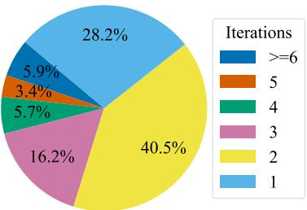
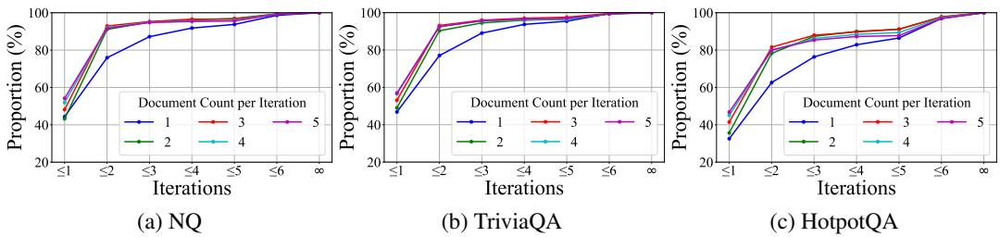
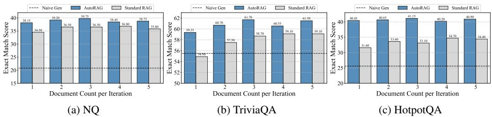
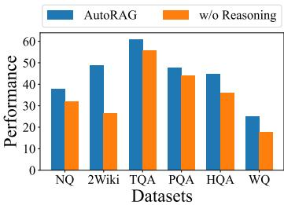
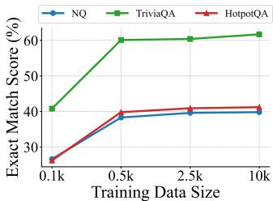
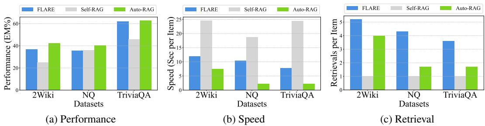
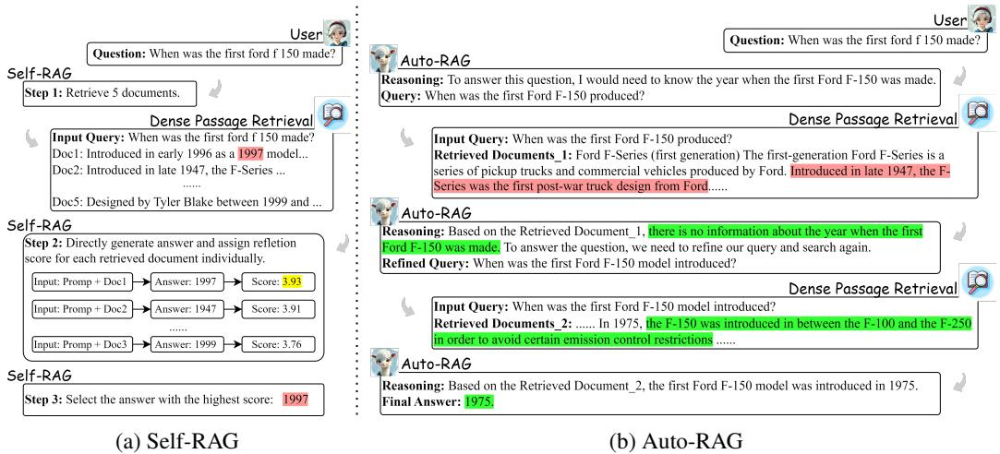

# AUTO-RAG: AUTONOMOUS RETRIEVAL-AUGMENTED GENERATION FOR LARGE LANGUAGE MODELS

Tian $\mathbf { Y } \mathbf { u } ^ { 1 , 3 }$ , Shaolei Zhang1,3, Yang Feng1,2,3 \*∗   
1Key Laboratory of Intelligent Information Processing,   
Institute of Computing Technology, Chinese Academy of Sciences (ICT/CAS)   
2Key Laboratory of AI Safety, Chinese Academy of Sciences   
3University of Chinese Academy of Sciences, Beijing, China   
{yutian23s, zhangshaolei20z, fengyang}@ict.ac.cn

# ABSTRACT

Iterative retrieval refers to the process in which the model continuously queries the retriever during generation to enhance the relevance of the retrieved knowledge, thereby improving the performance of Retrieval-Augmented Generation (RAG). Existing work typically employs few-shot prompting or manually constructed rules to implement iterative retrieval. This introduces additional inference overhead and overlooks the remarkable reasoning capabilities of Large Language Models (LLMs). In this paper, we introduce Auto-RAG, an autonomous iterative retrieval model centered on the LLM’s powerful decision-making capabilities. Auto-RAG engages in multi-turn dialogues with the retriever, systematically planning retrievals and refining queries to acquire valuable knowledge. This process continues until sufficient external information is gathered, at which point the results are presented to the user. To this end, we develop a method for autonomously synthesizing reasoning-based decision-making instructions in iterative retrieval and fine-tuned the latest open-source LLMs. The experimental results indicate that Auto-RAG is capable of autonomous iterative interaction with the retriever, effectively leveraging the remarkable reasoning and decision-making abilities of LLMs, which lead to outstanding performance across six benchmarks. Further analysis reveals that Auto-RAG can autonomously adjust the number of iterations based on the difficulty of the questions and the utility of the retrieved knowledge, without requiring any human intervention. Moreover, Auto-RAG expresses the iterative retrieval process in natural language, enhancing interpretability while providing users with a more intuitive experience1.

# 1 INTRODUCTION

Retrieval-augmented generation (RAG) for Large Language Models (LLMs) is widely employed to tackle knowledge-intensive tasks (Asai et al., 2023; Dubey et al., 2024; Jiang et al., 2023; Feng et al., 2023; Gao et al., 2024), which substantially improves output quality and effectively mitigates hallucinations (Gao et al., 2024; Lewis et al., 2020). However, certain limitations persist, such as noise in retrieved content (Yu et al., 2023) and the challenge of retrieving sufficient knowledge for complex queries in a single attempt (Feng et al., 2023; Chen et al., 2024). These issues ultimately undermine the overall performance of RAG systems and impede their widespread adoption.

To address these limitations, iterative retrieval has been proposed, which consistently updates retrieval results to satisfy the dynamic information needs that arise during the generation process (Feng et al., 2023; Chen et al., 2024; Asai et al., 2023). Existing work often relies on few-shot prompting and manually crafted rules to implement iterative retrieval (Jiang et al., 2023; Feng et al., 2023; Wang et al., 2024a), which involves substantial human effort and additional computational overhead during inference. Moreover, these methods overlook LLMs’ reasoning and decision-making capabilities (Wei et al., 2023), wasting their potential on determining when and what to retrieve.

# User

Question: Where was the place of death of Anastasia Of Serbia's husband

# Auto-RAG

Query: Who is Anastasia Of Serbia's husband and where did he die?

# Dense Passage Retrieval

Input Query: Who is Anastasia Of Serbia's husband and where did he die?   
"Anastasia", after Anastasia of Sirmium. ...

# Auto-RAG

Reig:BasenheRriveDot astas OSerusbnd is Seemn Howver, e death of Stefan Nemanja.

Refined Query:Where did Stefan Nemanja die?

# Dense Passage Retrieval

Input Query:Where did Stefan Nemanja die?   
rriHe Vukanovi dynasty, Nemanja founded ....

# Auto-RAG

Ravt iryT place of death in this document. To answer the question, we need to refine our query and search again. Refined Query: Stefan Nemanja passed away in which location?

Iterate reasoning and retrieval to get enough information.

# Dense Passage Retrieval

[Input Query: Where did Stefan Nemanja pass away?   
[1200. He was buried in the grounds of Hilandar monastery. ...

# Auto-RAG

H place of death of Anastasia Of Serbia's husband is Hilandar monastery.   
Final Answer: Hilandar monastery.

Figure 1: A concrete example of how Auto-RAG addresses complex multi-hop questions. AutoRAG engages in iterative reasoning, strategically plans retrievals, extracts relevant knowledge, precisely identifies information needs, and refines query for the next retrieval, ultimately converging on the final answer. In this example, Auto-RAG terminates after five interactions with the retriever, successfully yielding the correct answer.

To this end, we introduce Auto-RAG, an autonomous iterative retrieval model centered on the LLM’s powerful decision-making capabilities. As shown in Figure 1, Auto-RAG models the interaction between the LLM and the retriever through multi-turn dialogue. During iterative retrieval, Auto-RAG employs reasoning for retrieval planning, extracting valuable external knowledge, identifying information needs, rewriting queries, and continuously querying the retriever for new information until it can adequately answer the user’s question. To empower LLMs with the ability for autonomous decision-making in iterative retrieval, we developed a framework for the automatic synthesis of reasoning-based instructions for autonomous decision-making in iterative retrieval and fine-tuned the latest open-source LLMs, such as Llama-3-8B-Instruct 2 (Dubey et al., 2024).

We conduct experiments on six representative benchmarks, covering both open-domain QA (Kwiatkowski et al., 2019; Joshi et al., 2017; Berant et al., 2013; Mallen et al., 2023) and multi-hop QA (Ho et al., 2020; Yang et al., 2018). Experimental results demonstrate that, even with limited training data, Auto-RAG delivers outstanding performance. Further analysis reveals that Auto-RAG dynamically adjusts the number of iterations based on the complexity of the questions and the relevance of the retrieved knowledge. Moreover, Auto-RAG expresses the iterative retrieval process in natural language, thereby improving interpretability and offering a more intuitive user experience.

# 2 RELATED WORK

Retrieval-Augmented Generation (RAG) To address the challenges of outdated knowledge embedded in model parameters (Zhao et al., 2024) and the inadequate retention of long-tail knowledge by LLMs (Mallen et al., 2023), Retrieval-Augmented Generation (RAG) has been introduced (Lewis et al., 2020; Chu et al., 2024; Yan et al., 2024). The most common RAG approach follows the Retrieve-Read framework (Gao et al., 2024), where retrieved documents are concatenated with the user’s input to provide LLMs with external knowledge. However, retrievers are not without flaws (Gao et al., 2024), and the retrieved content may contain noise, which has been shown to degrade the RAG system’s performance (Yu et al., 2024; 2023; Yoran et al., 2023; Hong et al., 2024). Recent studies have sought to improve RAG by refining query formulation (Ma et al., 2023), enhancing retrievers (Karpukhin et al., 2020; Chen et al., 2023), improving generators (Yoran et al., 2023; Yu et al., 2023), and optimizing post-processing of retrieved documents (Yu et al., 2024; Xu et al., 2023). Nonetheless, these methods overlook the growing difficulty of obtaining sufficient knowledge from a single retrieval attempt as the complexity of tasks increases (Jiang et al., 2023).

Iterative Retrieval Iterative retrieval was introduced to address the evolving knowledge requirements that arise when solving complex problems (Feng et al., 2023; Shao et al., 2023; Jiang et al., 2023; Trivedi et al., 2023). The core principle of iterative retrieval is determining when and what to retrieve (Jiang et al., 2023). For instance, ITER-RETGEN (Shao et al., 2023) concatenates the input question with the generated output from the previous iteration to form a new query for the next. While this method has achieved some success, it merely reflects existing knowledge without explicitly indicating the LLM’s information needs. To address this shortcoming, FLARE (Jiang et al., 2023) uses the next generated sentence as a query, refining the previous sentence based on the retrieval results. Although this method more precisely identifies the LLM’s information needs, its efficacy heavily depends on meticulously crafted few-shot prompts (Brown et al., 2020) and requires continuous retrieval and refinement, leading to substantial manual effort and increased inference costs. Self-RAG (Asai et al., 2023) trains LLMs to reflect on both retrieved and generated content. However, Self-RAG only learns to mechanically predict reflection tokens during training, without cultivating reasoning abilities, which further limits the effectiveness of this approach.

In contrast to the methods mentioned above, Auto-RAG fully releases the LLMs’ potential for reasoning-based autonomous decision-making in the iterative retrieval process. Auto-RAG enables LLMs to autonomously decide when to retrieve and what to retrieve through reasoning. Compared to other iterative retrieval methods, Auto-RAG delivers superior performance and higher efficiency.

# 3 METHOD

To empower LLMs with autonomous decision-making capabilities in iterative retrieval at a minimal cost (Li et al., 2024; Chan et al., 2024), we develop a method for autonomously synthesizing reasoning-based decision-making instructions in iterative retrieval and fine-tuned the latest opensource LLMs. The following subsections will delve into the data construction processes, the training procedures, and the methodologies employed during inference.

# 3.1 REASONING-BASED ITERATIVE RETRIEVAL

We conceptualize the iterative retrieval process as a multi-turn interaction between LLM and retriever. The user’s query initiates a sequence of interactions between the LLM and the retriever, continuing until sufficient knowledge is acquired to generate a final answer. In each iteration, AutoRAG engages in meticulous reasoning based on the current state to ascertain whether additional retrieval is required and what specific information to seek. Once sufficient information is acquired, Auto-RAG ceases to generate new queries and delivers a final answer to the user.

We begin by formally delineating the objectives for reasoning-based instruction synthesis. For each input-output pair $( X , Y )$ in the original dataset $\mathcal { D }$ , our goal is to curate instruction data collection, $\mathcal { D } ^ { \mathrm { { \bar { I } n s t } } }$ , that empowers LLMs to engage in reasoning and query refinement during iterative retrieval, ultimately converging on the correct answer, which can be formally expressed as follows:

$$
( X , Y )  [ X , R _ { 0 } , ( Q _ { t } , D _ { t } , R _ { t } ) _ { 1 \leq i \leq T } , A ] ,
$$

# Algorithm 1 Data Construction for Training Auto-RAG

<table><tr><td></td><td>Input: Dataset D, Language model M, Retriever R, Maximum number of iterations T</td></tr><tr><td colspan="2">Output: Iterative retrieval instruction-tuning dataset DInst</td></tr><tr><td></td><td>1Initialize a list DInst to store the generated data</td></tr><tr><td>2:</td><td>for each input-output pair (X, Y ) in D do</td></tr><tr><td>3:</td><td>M predicts R0 given X</td></tr><tr><td>4:</td><td> = 1</td></tr><tr><td>5:</td><td>while t ≤ T do</td></tr><tr><td>6:</td><td>M generates queries Q gen given X and Rt−1</td></tr><tr><td>7:</td><td>Qt = None, Dt = None</td></tr><tr><td>8:</td><td>for q in Q gen do:</td></tr><tr><td>9:</td><td>R retrieves documents d for q</td></tr><tr><td>10:</td><td>if d contains a sub answer of X then</td></tr><tr><td>11:</td><td>Qt = q, Dt = d, Break</td></tr><tr><td>12:</td><td>if Qt and Dt are None then</td></tr><tr><td>13:</td><td>Select a random q from Q gen as Qt</td></tr><tr><td>14:</td><td>Retrieve documents d for q as Dt</td></tr><tr><td>15:</td><td>M generates Rt given X, R0, (Qi, Di, Ri)1≤i&lt;t, Qt, Dt</td></tr><tr><td>16:</td><td>if no information need in Rt then</td></tr><tr><td>17:</td><td>Break</td></tr><tr><td>18:</td><td>t = t + 1</td></tr><tr><td>19:</td><td>M predicts final answer A given X, R0, (Qi, Di, Ri)1≤i≤t</td></tr><tr><td>20:</td><td>if Á == Y then Append [X, R0, (Qi, Di, Ri)1≤i≤t, A] to DInst</td></tr></table>

Return: $\mathcal { D } ^ { \mathrm { I n s t } }$

where $T$ is the maximum iteration3, $R _ { 0 }$ denotes the reasoning performed when only the user’s input $X$ is present. At the $t { \cdot }$ -th iteration $( 1 \leq t \leq T )$ , if the previous iteration’s reasoning $R _ { t - 1 }$ includes an information need4, the query $Q _ { t }$ will be sampled, and the retriever will provide the document $D _ { t }$ for $Q _ { t }$ . The model will then generate the reasoning $R _ { t }$ for that iteration. If the previous reasoning $R _ { t - 1 }$ does not include an information need, the model is prompted to generate the final answer $A$ .

Next, we will provide the details of how LLM is guided to perform such reasoning and query refinement. Additionally, we will elucidate the methods utilized for data filtering and formatting.

# 3.1.1 REASONING BASED PLANNING AND QUERY REFINEMENT

To optimize efficiency and ensure coherence during iterative processes, it is essential to develop a well-designed reasoning paradigm. Specifically, mirroring the human cognitive process during retrieval, we propose that iterative retrieval should incorporate three distinct types of reasoning: (1) Retrieval Planning, (2) Information Extraction, and (3) Answer Inference.

• (1) Retrieval Planning Upon receiving the user’s question, the LLM should explicitly identify the knowledge necessary to address the query. Furthermore, upon receiving retrieved documents, the LLM must evaluate whether further retrievals are needed and, if so, specify the precise information to be sought next. Maintaining strategic planning throughout the retrieval process is crucial for improving efficiency and mitigating the risk of losing direction midway (Wang et al., 2024a). • (2) Information Extraction Upon receiving retrieved documents, the LLM should adeptly extract relevant information essential for addressing the problem at hand. This human-like summarization process bolsters the LLM’s capacity to filter out irrelevant information, thereby enhancing both its efficiency and accuracy in processing external knowledge(Wei et al., 2023; Xu et al., 2024). • (3) Answer inference Once LLM has gathered all pertinent knowledge required to address the question, it should employ reasoning to formulate the final answer. This process enhances LLM’s ability to generate accurate responses based on available information, thereby mitigating the risk of generating hallucinations (Wei et al., 2023).

These three types of reasoning collectively constitute the Chain-of-Thought utilized during iterative retrieval. To elicit such a reasoning process, we utilize few-shot prompting following Jiang et al. (2023); Brown et al. (2020); Wei et al. (2023). It is noteworthy that steps (2) and (3) are typically omitted upon the initial reception of the user’s question. Furthermore, if the retrieved information is found to be entirely irrelevant, step (2) is also excluded. Such adjustments enable LLMs to make informed judgments based on the actual context, rather than merely imitating demonstrations and generating hallucinations. The prompt used to elicit reasoning is presented in Appendix C.1.

With an appropriate reasoning process, LLM can iteratively refine the query based on the user input and previous retrieval plan, continually adapting to new information requirements. To generate a sufficiently diverse set of queries without being constrained by the query styles present in few-shot prompts, we utilize a more flexible prompting methodology, as shown in Appendix C.5.

# 3.1.2 DATA FILTERING AND FORMATTING

Data filtering The preceding subsections have thoroughly elucidated the methodologies for eliciting reasoning and query refinement in iterative retrieval. Nevertheless, there remains the possibility of reasoning artifacts or suboptimal query quality. Following Yoran et al. (2023); Asai et al. (2023), we undertake filtering for the generated reasoning and queries. In multi-hop question-answering datasets that encompass sub-answers, multiple queries are sampled at each retrieval iteration (Yoran et al., 2023; Ho et al., 2020). Each query is employed to perform the retrieval, and those queries for which the retrieved documents contain a sub-answer are retained. Moreover, to ensure the quality of the entire iterative retrieval process and the coherence of the output answers, data is retained if the final answer $A$ aligns with the reference answer $Y$ provided in the dataset. For greater clarity, we outline the framework of instruction synthesis and filtering in Algorithm 1.

Data formatting We conceptualize the iterative retrieval process as a multi-turn interactive dialogue. At each iteration, the user’s question or retrieved documents serve as inputs, and the LLM’s reasoning, retrieval planning, or final answer constitutes the output. We assume each instance in $\mathcal { D } ^ { \mathrm { I n s t } }$ comprises $T + 1$ iterations, where $T$ varies according to the instance. Specifically, at the 0- th iteration, the user’s input $X$ forms the input instruction $x _ { 0 }$ , while the LLM-generated planning $R _ { 0 }$ , and the query used for the next iteration $Q _ { 1 }$ , serve as the output $y _ { 0 }$ . At $t$ -th iteration (where $1 \leq t < T )$ , retrieved documents $D _ { t }$ serve as the input $x _ { t }$ , while the LLM-generated reasoning $R _ { t }$ and query $Q _ { t + 1 }$ serve as the output $y _ { t }$ . Finally, at $T$ -th iteration, $D _ { T }$ serves as $x _ { T }$ , while $R _ { T }$ and the final answer $A$ serves as $y _ { T }$ . The construction process can be expressed by the following formula:

$$
x _ { t } = { \left\{ \begin{array} { l l } { X } & { { \mathrm { i f ~ } } t = 0 } \\ { D _ { t } } & { { \mathrm { i f ~ } } 0 < t \leq T } \end{array} \right. } , y _ { t } = { \left\{ \begin{array} { l l } { \operatorname { C o n c a t } ( R _ { t } , Q _ { t + 1 } ) } & { { \mathrm { i f ~ } } 0 \leq t < T } \\ { \operatorname { C o n c a t } ( R _ { t } , A ) } & { { \mathrm { i f ~ } } t = T } \end{array} \right. } .
$$

# 3.2 TRAINING

To equip an arbitrary LLM with the capability for autonomous decision-making in iterative retrieval, we adopted a standard supervised fine-tuning strategy following Yoran et al. (2023); Jiang et al. (2024). For each instance containing $( x _ { t } , y _ { t } ) _ { 0 \leq t \leq T }$ , the cross-entropy loss $\mathcal { L }$ can be calculated as:

$$
\mathcal { L } = - \sum _ { 0 \leq t \leq T } \log \mathrm { P r } ( y _ { t } | \boldsymbol { x } _ { \leq t } , y _ { < t } ) ,
$$

where $y _ { t }$ denotes the output at iteration $t$ , $x _ { \leq t }$ represents the input up to the current iteration, and $y _ { < t }$ signifies the outputs from all preceding steps.

# 3.3 INFERENCE

After training, Auto-RAG has acquired the ability to make reasoning-based autonomous decisions during iterative retrieval, effectively discerning both when and what to retrieve. During each iteration, it suffices to provide Auto-RAG with input—whether user inquiries or retrieved documents—and to extract the planned actions designated by Auto-RAG for subsequent steps. Specifically, in the 0-th iteration, Auto-RAG receives the user’s question as input and subsequently generates the reasoning and planning output $y _ { t }$ . In the $t$ -th iteration, if the output from the previous iteration $y _ { t - 1 }$ includes a query $q$ , this query is utilized for retrieval, and the retrieved documents $d _ { t }$

# Algorithm 2 Inference for Auto-RAG

Input: User input $X$ , Language model $\mathcal { M }$ , Retriever $\mathcal { R }$ , Maximum iteration number of retrieval $T$ , Maximum   
iteration number to request parametric knowledge T PK   
Output: Answer $A$ corresponding to $X$   
1: $\mathcal { M }$ predicts $y _ { 0 }$ given $X$   
2: $t = 1$   
3: for $1 \leq t \leq T$ do ▷ Aquiring for external knowledge   
4: if $_ { y _ { t - 1 } }$ contains a query $q$ then   
5: $\mathcal { R }$ retrieves documents $d _ { t }$ for $q$   
6: $\mathcal { M }$ predicts $y _ { t }$ given $X$ , $y _ { < t }$ and $d _ { \leq t }$   
7: $t = \bar { t } + 1$   
8: else if $_ { y _ { t - 1 } }$ contains a final answer $A$ then   
9: Return: $A$   
10: for $T < t \leq T ^ { P K }$ do ▷ Aquiring for parametric knowledge   
11: if $_ { y _ { t - 1 } }$ contains a query $q$ then   
12: $\mathcal { M }$ generates a document $d _ { t }$ for $q$   
13: $\mathcal { M }$ predicts $y _ { t }$ given $X$ , $y _ { < t }$ and $d _ { \leq t }$   
14: $t = t + 1$   
15: else if $_ { y _ { t - 1 } }$ contains a final answer $A$ then   
16: Return: $A$   
17: $\mathcal { M }$ directly predicts answer $A$ for $X$   
18: Return: $\dot { A }$

are then provided to Auto-RAG as input, resulting in the output for that iteration $y _ { t }$ . Conversely, if the output from the previous iteration $y _ { t - 1 }$ does not contain a query but instead presents a final answer, the iteration is concluded, and the final answer is returned to the user.

Utilization of parametric knowledge Due to the limitations of the retriever and the retrieval corpus, Auto-RAG may fail to acquire the necessary knowledge to answer a question, resulting in perpetual iterations. Furthermore, the parametric knowledge of the LLM may not be effectively utilized during this process. To address this issue, we attempted to provide Auto-RAG with self-generated documents or answers. If Auto-RAG has not terminated after interacting with the retriever for $T$ iterations, the generated query is used to prompt itself to create a document, which is subsequently utilized as input for the next iteration. If Auto-RAG continues without termination after an additional $T ^ { P K }$ iterations, we follow Wang et al., 2024a to provide the answer produced by Auto-RAG without retrieval to the user. The prompt used to elicit parametric knowledge is shown in Appendix C.4, the pseudocode representing the inference process is presented in Algorithm 2, and examples of the synthesized instructions can be found in Appendix C.6. The experiments investigating the order of external and parametric knowledge can be found in Appendix A.3.

# 4 EXPERIMENTS

# 4.1 EXPERIMENTAL SETUP

In this paper, we focus on utilizing Auto-RAG to address question-answering (QA) tasks, encompassing both opendomain QA (Kwiatkowski et al., 2019; Joshi et al., 2017; Mallen et al., 2023; Berant et al., 2013) and multi-hop QA (Yang et al., 2018; Ho et al., 2020). To train Auto-RAG, we synthesized 10,000 reasoning-based instructions derived from two representative datasets: Natural Questions (NQ) (Kwiatkowski et al., 2019) and 2WikiMultihopQA (2Wiki) (Ho et al., 2020). We employed Llama-3-8B-Instruct5 (Dubey et al., 2024) to synthesize the reasoning process and utilized Qwen1.5-32B-Chat6 (Bai et al., 2023) for crafting the rewritten queries. Subsequently, we fine-tuned Llama-3-8B-Instruct using the synthesized instructions for five epochs to enhance its capacity for autonomous decision-making during iterative retrieval. The distribution of iteration counts in the training data is illustrated in Figure 2. To evaluate the effectiveness and robustness of Auto-RAG, we conducted assessments across six datasets: NQ, 2Wiki, TriviaQA (TQA) (Joshi et al., 2017), PopQA (PQA) (Mallen et al., 2023), HotpotQA (HQA) (Yang et al., 2018), and WebQuestions (WQ) (Berant et al., 2013). We employed E5-base-v2 (Wang et al., 2024b) as the retriever and utilized the widely used Wikipedia dump from December 2018 as the retrieval corpus (Karpukhin et al., 2020) following Jin et al. (2024). Given the variations in base models, retrievers, and retrieval corpora employed by different RAG methods, performing a fair comparison becomes challenging. Therefore, consistent with Jin et al. (2024), we report results and metrics based on their reproduction under an identical experimental setup. We present Exact Match (EM) for NQ, TQA, and WQ, and F1 scores for 2Wiki, PQA, and HQA, in accordance with Jin et al. (2024). Hyperparameters are detailed in Appendix B.

  
Figure 2: Distribution of iteration counts in the training data.

Table 1: Main results on six benchmarks. Auto-RAG consistently outperforms all baselines.   

<table><tr><td rowspan="2">Methods</td><td>NQ</td><td>2Wiki</td><td>TQA</td><td>PQA</td><td>HQA</td><td>WQ</td><td rowspan="2">AVG</td></tr><tr><td>EM</td><td>F1</td><td>EM</td><td>F1</td><td>F1</td><td>EM</td></tr><tr><td colspan="7">No Retrieval</td><td rowspan="3">30.2</td></tr><tr><td>Naive Gen</td><td>22.6</td><td>33.9</td><td>55.7</td><td>21.7</td><td>28.4</td><td>18.8</td></tr><tr><td colspan="7">Single-time Retrieval</td></tr><tr><td>Standard RAG</td><td colspan="4">35.1 21.0 558.8 56.9</td><td>35.3</td><td>15.7</td><td>33.8</td></tr><tr><td>IRCoT</td><td colspan="3">33.3 32.4</td><td>36.7 45.6</td><td>41.5</td><td>20.7</td><td>38.4</td></tr><tr><td>RREPLUG</td><td colspan="3">28.9 21.1</td><td>27.8</td><td>31.2</td><td>20.2</td><td>31.2</td></tr><tr><td>RECOMP-abstractive</td><td colspan="3">33.1 32.4</td><td>39.9</td><td>37.5</td><td>20.2</td><td>36.6</td></tr><tr><td>Selective-Context</td><td colspan="3">30.5 18.5</td><td>33.5</td><td>34.4</td><td>17.3</td><td>31.6</td></tr><tr><td colspan="7">55.6</td></tr><tr><td></td><td colspan="4">Iterative Retrieval 55.8</td><td>28.0</td><td>20.2</td><td>30.2</td></tr><tr><td>FLARE Self-RAG</td><td colspan="3">22.5 33.9 36.4 25.1</td><td>20.7 32.7</td><td>29.6</td><td>21.9</td><td>30.7</td></tr><tr><td>Iter-RetGen</td><td colspan="3">36.8 21.6</td><td>37.9</td><td>38.3</td><td>18.2</td><td>35.5</td></tr><tr><td colspan="7">60.1</td></tr><tr><td>Auto-RAG</td><td colspan="4">Ours (Autonomous Retrieval) 37.9 48.9 60.9 47.</td><td>44.9</td><td>25.1</td><td>44.3</td></tr></table>

# 4.2 BASELINES

For baselines without retrieval (Naive Gen), we evaluated the performance of Llama-3-8B-Instruct. Following Jin et al. (2024), we adopted a zero-shot setting. We consider Standard RAG for retrievalbased baselines, where models generate answers based on documents retrieved by the user’s input. The prompts used for Naive and Standard RAG are shown in Appendix C.2. For single time retrieval, we compare with RECOMP-abstractive (Xu et al., 2023) and Selective-Context (Li et al., 2023), which optimize on context selection, REPLUG (Shi et al., 2024), which enhances the generator’s performance, and IRCoT (Trivedi et al., 2023), which adopts a Chain-of-Thought (CoT) process when reading and interpreting the retrieved documents. For multiple-time retrieval (iterative retrieval), we compare Auto-RAG with three methods that are most relevant to our approach: FLARE (Jiang et al., 2023), Iter-RetGen (Feng et al., 2023), and Self-RAG (Asai et al., 2023).

# 4.3 MAIN RESULTS

Table 1 shows the main results across six benchmarks, demonstrating that Auto-RAG achieves superior performance across all datasets. Notably, Auto-RAG surpasses other iterative retrieval methods, yielding significantly improved outcomes. While Iter-RetGen (Feng et al., 2023) relies on manually defined retrieval content and the number of iterations, and FLARE (Jiang et al., 2023) determines retrieval timing through predefined rules (e.g., output probabilities), Auto-RAG distinguishes itself by autonomously determining both when and what to retrieve, leading to superior overall performance. Self-RAG (Asai et al., 2023) directly predicts reflection tokens to decide when to retrieve and evaluate the quality of the retrieved results. In contrast, Auto-RAG incorporates a reasoning process at each iteration, enabling it to make more sophisticated and informed decisions. This reasoning mechanism enhances the Auto-RAG’s capacity to optimize retrieval strategies and autonomously navigate complex tasks, resulting in improved performance across six benchmarks. Since variations in base LLMs and different versions of Wikipedia can impact performance (Izacard et al., 2022), to facilitate comparisons in future research, the results from other base models (such as the Llama

  
Figure 3: Auto-RAG’s iteration counts across different document numbers per iteration.

  
Figure 4: QA performance of Auto-RAG with varying document counts provided per iteration.

3.1-8B-Instruct Dubey et al., 2024) and different Wikipedia versions are provided in Appendix A.1.   
Examples of outputs generated by Auto-RAG can be found in Appendix C.7.

# 5 ANALYSIS

# 5.1 STRONG ADAPTABILITY TO QUESTIONS AND RETRIEVERS

In practical applications, the complexity of questions and the length of retrieved documents can vary significantly, highlighting the importance of examining Auto-RAG’s adaptability to these external variations. We analyzed the proportion of iterations and performance for Auto-RAG when the retriever provides different numbers of documents at each iteration across various datasets.

First, as demonstrated in Figure 3, the proportion of terminations after a single iteration is slightly higher for NQ (Figure 3a) and TriviaQA (Figure 3b) compared to HotpotQA (Figure 3c). This difference can be attributed to the fact that NQ and TriviaQA are single-hop QA tasks, whereas HotpotQA involves multiple hops. This observation suggests that Auto-RAG is capable of adaptively adjusting the number of iterations in response to the complexity of the questions posed. Furthermore, as the quantity of documents provided in each round increases, the proportion of terminations after one iteration also rises. This indicates that Auto-RAG flexibly modulates the number of iterations based on the sufficiency of available information. Additionally, as illustrated in Figure 4, providing varying quantities of documents at each iteration has a certain impact on the overall QA performance. In these three tasks, offering three documents per iteration yields superior results, indicating that supplying Auto-RAG with appropriately sized documents is beneficial. We also compared AutoRAG with the no-retrieval approach (Naive Gen) and Standard RAG. Auto-RAG consistently outperformed them across different document counts per iteration. Notably, Auto-RAG exhibited less performance fluctuation than Standard RAG, demonstrating its superior robustness to retrievers.

# 5.2 ABLATION STUDY

We conducted experiments to validate the effectiveness of Auto-RAG’s training process, iterative reasoning, and data construction. Experimental results are shown in Table 5. First, we compared the performance of the trained Auto-RAG to a base model guided by few-shot prompts used for data synthesis (w/o training). Experimental results indicate that the trained Auto-RAG achieves superior performance, eliminating the additional inference overhead associated with the few-shot approach. To investigate the impact of iterative reasoning, we compared Auto-RAG with a base model that generated answers directly based on all documents retrieved by Auto-RAG during iterative retrieval (w/o reasoning). The experimental results are shown in Figure 6, which demonstrate that incorporating a reasoning process into Auto-RAG significantly enhances its effectiveness in solving complex problems, aligning with the conclusions of Wei et al., 2023. Furthermore, to illustrate the advantages of utilizing a zero-shot approach for query rewriting in data synthesis, we compared it with few-shot query refinement (w/o zero-shot refinement). The experimental results reveal that the zero-shot method produces more flexible and diverse queries, enhancing overall performance.

Figure 5: Experimental Results of the Ablation Study.   

<table><tr><td>Methods</td><td>NQ EM</td><td>2Wiki F1</td><td>TQA EM</td><td>PQA F1</td><td>HQA F1</td><td>WQ EM</td><td>AVG</td></tr><tr><td>AutoRAG</td><td>37.9</td><td>48.9</td><td>60.9</td><td>47.8</td><td>44.9</td><td>25.1</td><td>44.3</td></tr><tr><td>w/o training</td><td>32.7</td><td>39.5</td><td>56.4</td><td>42.7</td><td>40.3</td><td>19.1</td><td>38.5</td></tr><tr><td>w/o reasoning</td><td>31.9</td><td>26.6</td><td>55.6</td><td>44.2</td><td>36.00</td><td>117.6</td><td>35.3</td></tr><tr><td>w/o zero-shot refinement</td><td>36.8</td><td>44.0</td><td>60.2</td><td>45.1</td><td>42.9</td><td>22.2</td><td>41.9</td></tr></table>

  
Figure 6: Ablation of reasoning.

Table 2: Performance of Auto-RAG on General Tasks.   

<table><tr><td>Methods</td><td>ARC-e Acc</td><td>ARC-c Acc</td><td>RACE-high Acc</td><td>SWAG Acc_norm</td><td>OpenBookQA Acc_norm</td><td>AVG</td></tr><tr><td>Llama-3-8B-Instruct</td><td>93.3</td><td>82.0</td><td>81.3</td><td>75.3</td><td>43.0</td><td>75.0</td></tr><tr><td>Auto-RAG</td><td>94.2</td><td>84.8</td><td>80.3</td><td>75.9</td><td>42.8</td><td>75.6</td></tr></table>

# 5.3 DATA SCALING

We investigated the performance of Auto-RAG trained on varying amounts of instructions. Specifically, we adjusted the data volume from $0 . 1 \mathrm { k }$ to 10k and evaluated the performance of the trained model on QA tasks. The experimental results are illustrated in Figure 7, indicating that approximately $0 . 5 \mathrm { k }$ of data is sufficient for the model to acquire autonomous retrieval capabilities, while increasing the data volume further enhances performance.

# 5.4 GENERAL TASK PERFORMANCE

To evaluate the performance of Auto-RAG on general tasks, we conducted experiments on several general task evaluation benchmarks, including the AI2 Reasoning Challenge (ARC, Clark et al.,

2018), ReAding Comprehension Dataset From Examinations (RACE, Lai et al., 2017), Situations With Adversarial Generations (SWAG, Zellers et al., 2018, and Open Book Question Answering (OpenBook QA Mihaylov et al., 2018). The experimental results are shown in Table 2. Auto-RAG demonstrates improved performance on ARC and SWAG, indicating that training with synthetic data can enhance LLM’s reasoning abilities and capacity to tackle adversarial tasks.

  
Figure 7: Performance of Auto-RAG under different amounts of training data.

# 5.5 EFFICIENCY

To demonstrate the superior performance of Auto-RAG, we compare its results with those of FLARE (Jiang et al., 2023) and Self-RAG (Asai et al., 2023), as illustrated in Figure 8. FLARE employs manually constructed rules to retrieve and revise low-probability components of the generated content. In contrast, Auto-RAG autonomously determines both when and what to retrieve, showcasing significant advantages in performance, speed, and retrieval counts. Self-RAG performs a single retrieval for short-form QA, generating one answer for each retrieved document individually while engaging in reflection, which is time-consuming and fails to consider the relevance among documents. Additionally, the number of retrievals in Self-RAG is determined by the length of the generated output. In contrast, Auto-RAG adjusts the number of iterations based on the complexity of the question and the relevance of external knowledge, resulting in superior performance and efficiency.

  
Figure 8: Comparison of Auto-RAG with FLARE and Self-RAG. Auto-RAG can autonomously adjust the number of retrievals, resulting in better performance and faster processing speeds.

  
Figure 9: Case Study: Self-RAG vs. Auto-RAG. Self-RAG conducts only a single retrieval. In contrast, Auto-RAG can adaptively adjust the number of retrievals, resulting in a better performance.

# 5.6 CASE STUDY

We conducted a case study to compare Auto-RAG with Self-RAG (Asai et al., 2023), as illustrated in Figure 9. For each retrieved document, Self-RAG independently generates answers and reflects on them by predicting a reflection token, ultimately selecting the highest-scoring answer as the response. This method is not only time-consuming but also fails to account for the relevance among documents. If the existing documents are all irrelevant, Self-RAG is unable to initiate new searches to correct the erroneous answers. In contrast, Auto-RAG relies entirely on its autonomous decisionmaking capabilities to determine when and what to retrieve. When confronted with irrelevant documents, Auto-RAG refrains from providing an answer and continues to retrieve information until it acquires valuable knowledge, subsequently returning the answer to the user. Additionally, AutoRAG articulates its reasoning process in natural language rather than generating reflection tokens, resulting in greater interpretability and a more intuitive user experience.

# 6 CONCLUSION

In this paper, we introduce Auto-RAG, an autonomous iterative retrieval model centered on the LLM’s powerful decision-making capabilities. Auto-RAG interacts with the retriever through multiturn dialogues, systematically planning retrievals and refining queries to acquire valuable knowledge until sufficient external information is obtained, at which point the results are presented to the user. To this end, we develop a method for autonomously synthesizing reasoning-based decisionmaking instructions in iterative retrieval and fine-tuned the latest open-source LLMs. Analysis results demonstrate that Auto-RAG not only achieves outstanding performance but also retains a high degree of interpretability, offering users a more intuitive experience.

# REFERENCES

Akari Asai, Zeqiu Wu, Yizhong Wang, Avirup Sil, and Hannaneh Hajishirzi. Self-RAG: Learning to retrieve, generate, and critique through self-reflection. arXiv preprint arXiv:2310.11511, 2023. URL https://arxiv.org/abs/2310.11511.

Jinze Bai, Shuai Bai, Yunfei Chu, Zeyu Cui, Kai Dang, Xiaodong Deng, Yang Fan, Wenbin Ge, Yu Han, Fei Huang, Binyuan Hui, Luo Ji, Mei Li, Junyang Lin, Runji Lin, Dayiheng Liu, Gao Liu, Chengqiang Lu, Keming Lu, Jianxin Ma, Rui Men, Xingzhang Ren, Xuancheng Ren, Chuanqi Tan, Sinan Tan, Jianhong Tu, Peng Wang, Shijie Wang, Wei Wang, Shengguang Wu, Benfeng Xu, Jin Xu, An Yang, Hao Yang, Jian Yang, Shusheng Yang, Yang Yao, Bowen Yu, Hongyi Yuan, Zheng Yuan, Jianwei Zhang, Xingxuan Zhang, Yichang Zhang, Zhenru Zhang, Chang Zhou, Jingren Zhou, Xiaohuan Zhou, and Tianhang Zhu. Qwen technical report. arXiv preprint arXiv:2309.16609, 2023.

Jonathan Berant, Andrew Chou, Roy Frostig, and Percy Liang. Semantic parsing on Freebase from question-answer pairs. In Proceedings of the 2013 Conference on Empirical Methods in Natural Language Processing, pp. 1533–1544, Seattle, Washington, USA, October 2013. Association for Computational Linguistics. URL https://www.aclweb.org/anthology/D13-1160.

Tom B. Brown, Benjamin Mann, Nick Ryder, Melanie Subbiah, Jared Kaplan, Prafulla Dhariwal, Arvind Neelakantan, Pranav Shyam, Girish Sastry, Amanda Askell, Sandhini Agarwal, Ariel Herbert-Voss, Gretchen Krueger, Tom Henighan, Rewon Child, Aditya Ramesh, Daniel M. Ziegler, Jeffrey Wu, Clemens Winter, Christopher Hesse, Mark Chen, Eric Sigler, Mateusz Litwin, Scott Gray, Benjamin Chess, Jack Clark, Christopher Berner, Sam McCandlish, Alec Radford, Ilya Sutskever, and Dario Amodei. Language models are few-shot learners, 2020. URL https://arxiv.org/abs/2005.14165.

Chi-Min Chan, Chunpu Xu, Ruibin Yuan, Hongyin Luo, Wei Xue, Yike Guo, and Jie Fu. Rq-rag: Learning to refine queries for retrieval augmented generation. arXiv preprint arXiv:2404.00610, 2024.

Jianlv Chen, Shitao Xiao, Peitian Zhang, Kun Luo, Defu Lian, and Zheng Liu. Bge m3-embedding: Multi-lingual, multi-functionality, multi-granularity text embeddings through self-knowledge distillation, 2023.

Zehui Chen, Kuikun Liu, Qiuchen Wang, Jiangning Liu, Wenwei Zhang, Kai Chen, and Feng Zhao. Mindsearch: Mimicking human minds elicits deep ai searcher. arXiv preprint arXiv:2407.20183, 2024.

Zheng Chu, Jingchang Chen, Qianglong Chen, Haotian Wang, Kun Zhu, Xiyuan Du, Weijiang Yu, Ming Liu, and Bing Qin. BeamAggR: Beam aggregation reasoning over multi-source knowledge for multi-hop question answering. In Lun-Wei Ku, Andre Martins, and Vivek Srikumar (eds.), Proceedings of the 62nd Annual Meeting of the Association for Computational Linguistics (Volume 1: Long Papers), pp. 1229–1248, Bangkok, Thailand, August 2024. Association for Computational Linguistics. doi: 10.18653/v1/2024.acl-long.67. URL https: //aclanthology.org/2024.acl-long.67.

Peter Clark, Isaac Cowhey, Oren Etzioni, Tushar Khot, Ashish Sabharwal, Carissa Schoenick, and Oyvind Tafjord. Think you have solved question answering? try arc, the ai2 reasoning challenge. ArXiv, abs/1803.05457, 2018.

Abhimanyu Dubey, Abhinav Jauhri, Abhinav Pandey, Abhishek Kadian, Ahmad Al-Dahle, Aiesha Letman, Akhil Mathur, Alan Schelten, Amy Yang, Angela Fan, Anirudh Goyal, Anthony Hartshorn, Aobo Yang, Archi Mitra, Archie Sravankumar, Artem Korenev, Arthur Hinsvark, Arun Rao, Aston Zhang, Aurelien Rodriguez, Austen Gregerson, Ava Spataru, Baptiste Roziere, Bethany Biron, Binh Tang, Bobbie Chern, Charlotte Caucheteux, Chaya Nayak, Chloe Bi, Chris Marra, Chris McConnell, Christian Keller, Christophe Touret, Chunyang Wu, Corinne Wong, Cristian Canton Ferrer, Cyrus Nikolaidis, Damien Allonsius, Daniel Song, Danielle Pintz, Danny Livshits, David Esiobu, Dhruv Choudhary, Dhruv Mahajan, Diego Garcia-Olano, Diego Perino, Dieuwke Hupkes, Egor Lakomkin, Ehab AlBadawy, Elina Lobanova, Emily Dinan, Eric Michael

Smith, Filip Radenovic, Frank Zhang, Gabriel Synnaeve, Gabrielle Lee, Georgia Lewis Anderson, Graeme Nail, Gregoire Mialon, Guan Pang, Guillem Cucurell, Hailey Nguyen, Hannah Korevaar, Hu Xu, Hugo Touvron, Iliyan Zarov, Imanol Arrieta Ibarra, Isabel Kloumann, Ishan Misra, Ivan Evtimov, Jade Copet, Jaewon Lee, Jan Geffert, Jana Vranes, Jason Park, Jay Mahadeokar, Jeet Shah, Jelmer van der Linde, Jennifer Billock, Jenny Hong, Jenya Lee, Jeremy Fu, Jianfeng Chi, Jianyu Huang, Jiawen Liu, Jie Wang, Jiecao Yu, Joanna Bitton, Joe Spisak, Jongsoo Park, Joseph Rocca, Joshua Johnstun, Joshua Saxe, Junteng Jia, Kalyan Vasuden Alwala, Kartikeya Upasani, Kate Plawiak, Ke Li, Kenneth Heafield, Kevin Stone, Khalid El-Arini, Krithika Iyer, Kshitiz Malik, Kuenley Chiu, Kunal Bhalla, Lauren Rantala-Yeary, Laurens van der Maaten, Lawrence Chen, Liang Tan, Liz Jenkins, Louis Martin, Lovish Madaan, Lubo Malo, Lukas Blecher, Lukas Landzaat, Luke de Oliveira, Madeline Muzzi, Mahesh Pasupuleti, Mannat Singh, Manohar Paluri, Marcin Kardas, Mathew Oldham, Mathieu Rita, Maya Pavlova, Melanie Kambadur, Mike Lewis, Min Si, Mitesh Kumar Singh, Mona Hassan, Naman Goyal, Narjes Torabi, Nikolay Bashlykov, Nikolay Bogoychev, Niladri Chatterji, Olivier Duchenne, Onur Çelebi, Patrick Alrassy, Pengchuan Zhang, Pengwei Li, Petar Vasic, Peter Weng, Prajjwal Bhargava, Pratik Dubal, Praveen Krishnan, Punit Singh Koura, Puxin Xu, Qing He, Qingxiao Dong, Ragavan Srinivasan, Raj Ganapathy, Ramon Calderer, Ricardo Silveira Cabral, Robert Stojnic, Roberta Raileanu, Rohit Girdhar, Rohit Patel, Romain Sauvestre, Ronnie Polidoro, Roshan Sumbaly, Ross Taylor, Ruan Silva, Rui Hou, Rui Wang, Saghar Hosseini, Sahana Chennabasappa, Sanjay Singh, Sean Bell, Seohyun Sonia Kim, Sergey Edunov, Shaoliang Nie, Sharan Narang, Sharath Raparthy, Sheng Shen, Shengye Wan, Shruti Bhosale, Shun Zhang, Simon Vandenhende, Soumya Batra, Spencer Whitman, Sten Sootla, Stephane Collot, Suchin Gururangan, Sydney Borodinsky, Tamar Herman, Tara Fowler, Tarek Sheasha, Thomas Georgiou, Thomas Scialom, Tobias Speckbacher, Todor Mihaylov, Tong Xiao, Ujjwal Karn, Vedanuj Goswami, Vibhor Gupta, Vignesh Ramanathan, Viktor Kerkez, Vincent Gonguet, Virginie Do, Vish Vogeti, Vladan Petrovic, Weiwei Chu, Wenhan Xiong, Wenyin Fu, Whitney Meers, Xavier Martinet, Xiaodong Wang, Xiaoqing Ellen Tan, Xinfeng Xie, Xuchao Jia, Xuewei Wang, Yaelle Goldschlag, Yashesh Gaur, Yasmine Babaei, Yi Wen, Yiwen Song, Yuchen Zhang, Yue Li, Yuning Mao, Zacharie Delpierre Coudert, Zheng Yan, Zhengxing Chen, Zoe Papakipos, Aaditya Singh, Aaron Grattafiori, Abha Jain, Adam Kelsey, Adam Shajnfeld, Adithya Gangidi, Adolfo Victoria, Ahuva Goldstand, Ajay Menon, Ajay Sharma, Alex Boesenberg, Alex Vaughan, Alexei Baevski, Allie Feinstein, Amanda Kallet, Amit Sangani, Anam Yunus, Andrei Lupu, Andres Alvarado, Andrew Caples, Andrew Gu, Andrew Ho, Andrew Poulton, Andrew Ryan, Ankit Ramchandani, Annie Franco, Aparajita Saraf, Arkabandhu Chowdhury, Ashley Gabriel, Ashwin Bharambe, Assaf Eisenman, Azadeh Yazdan, Beau James, Ben Maurer, Benjamin Leonhardi, Bernie Huang, Beth Loyd, Beto De Paola, Bhargavi Paranjape, Bing Liu, Bo Wu, Boyu Ni, Braden Hancock, Bram Wasti, Brandon Spence, Brani Stojkovic, Brian Gamido, Britt Montalvo, Carl Parker, Carly Burton, Catalina Mejia, Changhan Wang, Changkyu Kim, Chao Zhou, Chester Hu, Ching-Hsiang Chu, Chris Cai, Chris Tindal, Christoph Feichtenhofer, Damon Civin, Dana Beaty, Daniel Kreymer, Daniel Li, Danny Wyatt, David Adkins, David Xu, Davide Testuggine, Delia David, Devi Parikh, Diana Liskovich, Didem Foss, Dingkang Wang, Duc Le, Dustin Holland, Edward Dowling, Eissa Jamil, Elaine Montgomery, Eleonora Presani, Emily Hahn, Emily Wood, Erik Brinkman, Esteban Arcaute, Evan Dunbar, Evan Smothers, Fei Sun, Felix Kreuk, Feng Tian, Firat Ozgenel, Francesco Caggioni, Francisco Guzmán, Frank Kanayet, Frank Seide, Gabriela Medina Florez, Gabriella Schwarz, Gada Badeer, Georgia Swee, Gil Halpern, Govind Thattai, Grant Herman, Grigory Sizov, Guangyi, Zhang, Guna Lakshminarayanan, Hamid Shojanazeri, Han Zou, Hannah Wang, Hanwen Zha, Haroun Habeeb, Harrison Rudolph, Helen Suk, Henry Aspegren, Hunter Goldman, Ibrahim Damlaj, Igor Molybog, Igor Tufanov, Irina-Elena Veliche, Itai Gat, Jake Weissman, James Geboski, James Kohli, Japhet Asher, Jean-Baptiste Gaya, Jeff Marcus, Jeff Tang, Jennifer Chan, Jenny Zhen, Jeremy Reizenstein, Jeremy Teboul, Jessica Zhong, Jian Jin, Jingyi Yang, Joe Cummings, Jon Carvill, Jon Shepard, Jonathan McPhie, Jonathan Torres, Josh Ginsburg, Junjie Wang, Kai Wu, Kam Hou U, Karan Saxena, Karthik Prasad, Kartikay Khandelwal, Katayoun Zand, Kathy Matosich, Kaushik Veeraraghavan, Kelly Michelena, Keqian Li, Kun Huang, Kunal Chawla, Kushal Lakhotia, Kyle Huang, Lailin Chen, Lakshya Garg, Lavender A, Leandro Silva, Lee Bell, Lei Zhang, Liangpeng Guo, Licheng Yu, Liron Moshkovich, Luca Wehrstedt, Madian Khabsa, Manav Avalani, Manish Bhatt, Maria Tsimpoukelli, Martynas Mankus, Matan Hasson, Matthew Lennie, Matthias Reso, Maxim Groshev, Maxim Naumov, Maya Lathi, Meghan Keneally, Michael L. Seltzer, Michal Valko, Michelle Restrepo, Mihir Patel, Mik Vyatskov, Mikayel Samvelyan, Mike Clark, Mike Macey, Mike Wang, Miquel Jubert Hermoso, Mo Metanat, Mohammad Rastegari, Munish Bansal, Nandhini Santhanam, Natascha Parks, Natasha White, Navyata Bawa, Nayan Singhal, Nick Egebo, Nicolas Usunier, Nikolay Pavlovich Laptev, Ning Dong, Ning Zhang, Norman Cheng, Oleg Chernoguz, Olivia Hart, Omkar Salpekar, Ozlem Kalinli, Parkin Kent, Parth Parekh, Paul Saab, Pavan Balaji, Pedro Rittner, Philip Bontrager, Pierre Roux, Piotr Dollar, Polina Zvyagina, Prashant Ratanchandani, Pritish Yuvraj, Qian Liang, Rachad Alao, Rachel Rodriguez, Rafi Ayub, Raghotham Murthy, Raghu Nayani, Rahul Mitra, Raymond Li, Rebekkah Hogan, Robin Battey, Rocky Wang, Rohan Maheswari, Russ Howes, Ruty Rinott, Sai Jayesh Bondu, Samyak Datta, Sara Chugh, Sara Hunt, Sargun Dhillon, Sasha Sidorov, Satadru Pan, Saurabh Verma, Seiji Yamamoto, Sharadh Ramaswamy, Shaun Lindsay, Shaun Lindsay, Sheng Feng, Shenghao Lin, Shengxin Cindy Zha, Shiva Shankar, Shuqiang Zhang, Shuqiang Zhang, Sinong Wang, Sneha Agarwal, Soji Sajuyigbe, Soumith Chintala, Stephanie Max, Stephen Chen, Steve Kehoe, Steve Satterfield, Sudarshan Govindaprasad, Sumit Gupta, Sungmin Cho, Sunny Virk, Suraj Subramanian, Sy Choudhury, Sydney Goldman, Tal Remez, Tamar Glaser, Tamara Best, Thilo Kohler, Thomas Robinson, Tianhe Li, Tianjun Zhang, Tim Matthews, Timothy Chou, Tzook Shaked, Varun Vontimitta, Victoria Ajayi, Victoria Montanez, Vijai Mohan, Vinay Satish Kumar, Vishal Mangla, Vítor Albiero, Vlad Ionescu, Vlad Poenaru, Vlad Tiberiu Mihailescu, Vladimir Ivanov, Wei Li, Wenchen Wang, Wenwen Jiang, Wes Bouaziz, Will Constable, Xiaocheng Tang, Xiaofang Wang, Xiaojian Wu, Xiaolan Wang, Xide Xia, Xilun Wu, Xinbo Gao, Yanjun Chen, Ye Hu, Ye Jia, Ye Qi, Yenda Li, Yilin Zhang, Ying Zhang, Yossi Adi, Youngjin Nam, Yu, Wang, Yuchen Hao, Yundi Qian, Yuzi He, Zach Rait, Zachary DeVito, Zef Rosnbrick, Zhaoduo Wen, Zhenyu Yang, and Zhiwei Zhao. The llama 3 herd of models, 2024. URL https://arxiv.org/abs/2407.21783.

Zhangyin Feng, Xiaocheng Feng, Dezhi Zhao, Maojin Yang, and Bing Qin. Retrieval-generation synergy augmented large language models, 2023. URL https://arxiv.org/abs/2310. 05149.

Yunfan Gao, Yun Xiong, Xinyu Gao, Kangxiang Jia, Jinliu Pan, Yuxi Bi, Yi Dai, Jiawei Sun, Qianyu Guo, Meng Wang, and Haofen Wang. Retrieval-augmented generation for large language models: A survey, 2024.

Xanh Ho, Anh-Khoa Duong Nguyen, Saku Sugawara, and Akiko Aizawa. Constructing a multihop QA dataset for comprehensive evaluation of reasoning steps. In Proceedings of the 28th International Conference on Computational Linguistics, pp. 6609–6625, Barcelona, Spain (Online), December 2020. International Committee on Computational Linguistics. URL https: //www.aclweb.org/anthology/2020.coling-main.580.

Giwon Hong, Jeonghwan Kim, Junmo Kang, Sung-Hyon Myaeng, and Joyce Whang. Why so gullible? enhancing the robustness of retrieval-augmented models against counterfactual noise. In Kevin Duh, Helena Gomez, and Steven Bethard (eds.), Findings of the Association for Computational Linguistics: NAACL 2024, pp. 2474–2495, Mexico City, Mexico, June 2024. Association for Computational Linguistics. doi: 10.18653/v1/2024.findings-naacl.159. URL https://aclanthology.org/2024.findings-naacl.159.

Gautier Izacard, Patrick Lewis, Maria Lomeli, Lucas Hosseini, Fabio Petroni, Timo Schick, Jane Dwivedi-Yu, Armand Joulin, Sebastian Riedel, and Edouard Grave. Few-shot Learning with Retrieval Augmented Language Models. 2022. URL http://arxiv.org/abs/2208.03299.

Jinhao Jiang, Kun Zhou, Wayne Xin Zhao, Yang Song, Chen Zhu, Hengshu Zhu, and Ji-Rong Wen. Kg-agent: An efficient autonomous agent framework for complex reasoning over knowledge graph, 2024. URL https://arxiv.org/abs/2402.11163.

Zhengbao Jiang, Frank Xu, Luyu Gao, Zhiqing Sun, Qian Liu, Jane Dwivedi-Yu, Yiming Yang, Jamie Callan, and Graham Neubig. Active retrieval augmented generation. In Houda Bouamor, Juan Pino, and Kalika Bali (eds.), Proceedings of the 2023 Conference on Empirical Methods in Natural Language Processing, pp. 7969–7992, Singapore, December 2023. Association for Computational Linguistics. doi: 10.18653/v1/2023.emnlp-main.495. URL https: //aclanthology.org/2023.emnlp-main.495.

Jiajie Jin, Yutao Zhu, Xinyu Yang, Chenghao Zhang, and Zhicheng Dou. Flashrag: A modular toolkit for efficient retrieval-augmented generation research. CoRR, abs/2405.13576, 2024. URL https://arxiv.org/abs/2405.13576.

Mandar Joshi, Eunsol Choi, Daniel Weld, and Luke Zettlemoyer. TriviaQA: A large scale distantly supervised challenge dataset for reading comprehension. In Regina Barzilay and Min-Yen Kan (eds.), Proceedings of the 55th Annual Meeting of the Association for Computational Linguistics (Volume 1: Long Papers), pp. 1601–1611, Vancouver, Canada, July 2017. Association for Computational Linguistics. doi: 10.18653/v1/P17-1147. URL https://aclanthology.org/ P17-1147.

Vladimir Karpukhin, Barlas Oguz, Sewon Min, Patrick Lewis, Ledell Wu, Sergey Edunov, Danqi Chen, and Wen-tau Yih. Dense passage retrieval for open-domain question answering. In Bonnie Webber, Trevor Cohn, Yulan He, and Yang Liu (eds.), Proceedings of the 2020 Conference on Empirical Methods in Natural Language Processing (EMNLP), pp. 6769–6781, Online, November 2020. Association for Computational Linguistics. doi: 10.18653/v1/2020.emnlp-main.550. URL https://aclanthology.org/2020.emnlp-main.550.

Tom Kwiatkowski, Jennimaria Palomaki, Olivia Redfield, Michael Collins, Ankur Parikh, Chris Alberti, Danielle Epstein, Illia Polosukhin, Jacob Devlin, Kenton Lee, Kristina Toutanova, Llion Jones, Matthew Kelcey, Ming-Wei Chang, Andrew M. Dai, Jakob Uszkoreit, Quoc Le, and Slav Petrov. Natural questions: A benchmark for question answering research. Transactions of the Association for Computational Linguistics, 7:452–466, 2019. doi: 10.1162/tacl_a_00276. URL https://aclanthology.org/Q19-1026.

Guokun Lai, Qizhe Xie, Hanxiao Liu, Yiming Yang, and Eduard Hovy. RACE: Large-scale ReAding comprehension dataset from examinations. In Martha Palmer, Rebecca Hwa, and Sebastian Riedel (eds.), Proceedings of the 2017 Conference on Empirical Methods in Natural Language Processing, pp. 785–794, Copenhagen, Denmark, September 2017. Association for Computational Linguistics. doi: 10.18653/v1/D17-1082. URL https://aclanthology.org/D17-1082.

Patrick Lewis, Ethan Perez, Aleksandra Piktus, Fabio Petroni, Vladimir Karpukhin, Naman Goyal, Heinrich Küttler, Mike Lewis, Wen-tau Yih, Tim Rocktäschel, Sebastian Riedel, and Douwe Kiela. Retrieval-augmented generation for knowledge-intensive nlp tasks. In H. Larochelle, M. Ranzato, R. Hadsell, M.F. Balcan, and H. Lin (eds.), Advances in Neural Information Processing Systems, volume 33, pp. 9459–9474. Curran Associates, Inc., 2020. URL https://proceedings.neurips.cc/paper_files/paper/2020/ file/6b493230205f780e1bc26945df7481e5-Paper.pdf.

Ming Li, Yong Zhang, Zhitao Li, Jiuhai Chen, Lichang Chen, Ning Cheng, Jianzong Wang, Tianyi Zhou, and Jing Xiao. From quantity to quality: Boosting LLM performance with self-guided data selection for instruction tuning. In Kevin Duh, Helena Gomez, and Steven Bethard (eds.), Proceedings of the 2024 Conference of the North American Chapter of the Association for Computational Linguistics: Human Language Technologies (Volume 1: Long Papers), pp. 7602–7635, Mexico City, Mexico, June 2024. Association for Computational Linguistics. doi: 10.18653/v1/ 2024.naacl-long.421. URL https://aclanthology.org/2024.naacl-long.421.

Yucheng Li, Bo Dong, Chenghua Lin, and Frank Guerin. Compressing context to enhance inference efficiency of large language models, 2023.

Xinbei Ma, Yeyun Gong, Pengcheng He, Hai Zhao, and Nan Duan. Query rewriting in retrieval-augmented large language models. In Houda Bouamor, Juan Pino, and Kalika Bali (eds.), Proceedings of the 2023 Conference on Empirical Methods in Natural Language Processing, pp. 5303–5315, Singapore, December 2023. Association for Computational Linguistics. doi: 10.18653/v1/2023.emnlp-main.322. URL https://aclanthology.org/2023. emnlp-main.322.

Alex Mallen, Akari Asai, Victor Zhong, Rajarshi Das, Daniel Khashabi, and Hannaneh Hajishirzi. When not to trust language models: Investigating effectiveness of parametric and non-parametric memories. In Anna Rogers, Jordan Boyd-Graber, and Naoaki Okazaki (eds.), Proceedings of the 61st Annual Meeting of the Association for Computational Linguistics (Volume 1: Long Papers), pp. 9802–9822, Toronto, Canada, July 2023. Association for Computational Linguistics. doi: 10.18653/v1/2023.acl-long.546. URL https://aclanthology.org/2023. acl-long.546.

Todor Mihaylov, Peter Clark, Tushar Khot, and Ashish Sabharwal. Can a suit of armor conduct electricity? a new dataset for open book question answering. In EMNLP, 2018.

Zhihong Shao, Yeyun Gong, Yelong Shen, Minlie Huang, Nan Duan, and Weizhu Chen. Enhancing retrieval-augmented large language models with iterative retrieval-generation synergy. In Houda Bouamor, Juan Pino, and Kalika Bali (eds.), Findings of the Association for Computational Linguistics: EMNLP 2023, pp. 9248–9274, Singapore, December 2023. Association for Computational Linguistics. doi: 10.18653/v1/2023.findings-emnlp.620. URL https: //aclanthology.org/2023.findings-emnlp.620.

Weijia Shi, Sewon Min, Michihiro Yasunaga, Minjoon Seo, Richard James, Mike Lewis, Luke Zettlemoyer, and Wen-tau Yih. REPLUG: Retrieval-augmented black-box language models. In Kevin Duh, Helena Gomez, and Steven Bethard (eds.), Proceedings of the 2024 Conference of the North American Chapter of the Association for Computational Linguistics: Human Language Technologies (Volume 1: Long Papers), pp. 8371–8384, Mexico City, Mexico, June 2024. Association for Computational Linguistics. doi: 10.18653/v1/2024.naacl-long.463. URL https://aclanthology.org/2024.naacl-long.463.

Harsh Trivedi, Niranjan Balasubramanian, Tushar Khot, and Ashish Sabharwal. Interleaving retrieval with chain-of-thought reasoning for knowledge-intensive multi-step questions. In Anna Rogers, Jordan Boyd-Graber, and Naoaki Okazaki (eds.), Proceedings of the 61st Annual Meeting of the Association for Computational Linguistics (Volume 1: Long Papers), pp. 10014–10037, Toronto, Canada, July 2023. Association for Computational Linguistics. doi: 10.18653/v1/2023. acl-long.557. URL https://aclanthology.org/2023.acl-long.557.

Keheng Wang, Feiyu Duan, Peiguang Li, Sirui Wang, and Xunliang Cai. Llms know what they need: Leveraging a missing information guided framework to empower retrieval-augmented generation, 2024a. URL https://arxiv.org/abs/2404.14043.

Liang Wang, Nan Yang, Xiaolong Huang, Binxing Jiao, Linjun Yang, Daxin Jiang, Rangan Majumder, and Furu Wei. Text embeddings by weakly-supervised contrastive pre-training, 2024b. URL https://arxiv.org/abs/2212.03533.

Jason Wei, Xuezhi Wang, Dale Schuurmans, Maarten Bosma, Brian Ichter, Fei Xia, Ed Chi, Quoc Le, and Denny Zhou. Chain-of-thought prompting elicits reasoning in large language models, 2023. URL https://arxiv.org/abs/2201.11903.

Jian Xie, Kai Zhang, Jiangjie Chen, Renze Lou, and Yu Su. Adaptive chameleon or stubborn sloth: Revealing the behavior of large language models in knowledge conflicts. In Proceedings of ICLR, 2024.

Fangyuan Xu, Weijia Shi, and Eunsol Choi. Recomp: Improving retrieval-augmented lms with compression and selective augmentation, 2023. URL https://arxiv.org/abs/2310. 04408.

Zhipeng Xu, Zhenghao Liu, Yibin Liu, Chenyan Xiong, Yukun Yan, Shuo Wang, Shi Yu, Zhiyuan Liu, and Ge Yu. Activerag: Revealing the treasures of knowledge via active learning. arXiv preprint arXiv:2402.13547, 2024.

Shi-Qi Yan, Jia-Chen Gu, Yun Zhu, and Zhen-Hua Ling. Corrective retrieval augmented generation. arXiv preprint arXiv:2401.15884, 2024.

Zhilin Yang, Peng Qi, Saizheng Zhang, Yoshua Bengio, William W. Cohen, Ruslan Salakhutdinov, and Christopher D. Manning. HotpotQA: A dataset for diverse, explainable multi-hop question answering. In Conference on Empirical Methods in Natural Language Processing (EMNLP), 2018.

Ori Yoran, Tomer Wolfson, Ori Ram, and Jonathan Berant. Making retrieval-augmented language models robust to irrelevant context, 2023.

Tian Yu, Shaolei Zhang, and Yang Feng. Truth-aware context selection: Mitigating hallucinations of large language models being misled by untruthful contexts. In Lun-Wei Ku, Andre Martins, and Vivek Srikumar (eds.), Findings of the Association for Computational Linguistics ACL 2024, pp. 10862–10884, Bangkok, Thailand and virtual meeting, August 2024. Association for Computational Linguistics. URL https://aclanthology.org/2024.findings-acl.645.

Wenhao Yu, Hongming Zhang, Xiaoman Pan, Kaixin Ma, Hongwei Wang, and Dong Yu. Chainof-note: Enhancing robustness in retrieval-augmented language models, 2023. URL https: //arxiv.org/abs/2311.09210.

Rowan Zellers, Yonatan Bisk, Roy Schwartz, and Yejin Choi. Swag: A large-scale adversarial dataset for grounded commonsense inference. In Proceedings of the 2018 Conference on Empirical Methods in Natural Language Processing (EMNLP), 2018.

Penghao Zhao, Hailin Zhang, Qinhan Yu, Zhengren Wang, Yunteng Geng, Fangcheng Fu, Ling Yang, Wentao Zhang, Jie Jiang, and Bin Cui. Retrieval-augmented generation for ai-generated content: A survey, 2024. URL https://arxiv.org/abs/2402.19473.

# A ADDITIONAL RESULTS

A.1 EXPERIMENTAL RESULTS USING DIFFERENT MODELS AND VERSIONS OF WIKIPEDIA

Given that different base models and various versions of Wikipedia can impact the results, we present the outcomes from training with the Llama-3.1-8B-Instruct as the base model, as well as the results using different versions of Wikipedia as retrieval corpora.

First, we present the results from training using the Llama-3.1-8B-Instruct as the base model. The training was conducted on the same datasets used in the main experiment (generated mainly based on Llama-3-8B-Instruct). The Wikipedia 2018 dump used in the experiments followed FlashRAG(Jin et al., 2024) and DPR (Karpukhin et al., 2020). As shown in the Table 3, training with a more powerful base model yields superior results compared to those reported in the main experiment. Additionally, we utilized the Wikipedia dumps provided by Atlas (Izacard et al., 2022), which include both the 2018 and 2021 versions. We provide the results using Wikipedia 2018 dumps in Table 4 and Wikipedia 2021 dumps in Table 5.

Table 3: Experimental results for different base models.   

<table><tr><td rowspan="2">Methods</td><td>NQ</td><td>2Wiki</td><td>TQA</td><td>PQA</td><td>HQA</td><td>WQ</td><td rowspan="2">AVG</td></tr><tr><td>EM</td><td>F1</td><td>EM</td><td>F1</td><td>F1</td><td>EM</td></tr><tr><td colspan="9">Llama-3-8B-Instruct</td></tr><tr><td>Naive Gen</td><td>22.6</td><td>33.9</td><td>55.7</td><td>21.7</td><td>28.4</td><td>18.8</td><td>30.2</td></tr><tr><td>Auto-RAG</td><td>37.9</td><td>48.9</td><td>60.9</td><td>47.8</td><td>44.9</td><td>25.1</td><td>44.3</td></tr><tr><td colspan="8">Llama-3.1-8B-Instruct</td></tr><tr><td>Naive Gen</td><td>23.9</td><td>30.3</td><td>56.9</td><td>28.6</td><td>29.0</td><td>16.9</td><td>30.9</td></tr><tr><td>Auto-RAG</td><td>40.5</td><td>51.4</td><td>62.7</td><td>49.3</td><td>48.5</td><td>23.4</td><td>46.0</td></tr></table>

Table 4: Experimental results using Wikipedia Dump 2018 provided by Atlas (Izacard et al., 2022).   

<table><tr><td rowspan="2">Methods</td><td>NQ</td><td>2Wiki</td><td>TQA</td><td>PQA</td><td>HQA</td><td>WQ</td><td rowspan="2">AVG</td></tr><tr><td>EM</td><td>F1</td><td>EM</td><td>F1</td><td>F1</td><td>EM</td></tr><tr><td colspan="9">Llama-3-8B-Instruct</td></tr><tr><td>Naive Gen</td><td>22.6</td><td>33.9</td><td>55.7</td><td>21.7</td><td>28.4</td><td>18.8</td><td>30.2</td></tr><tr><td>Auto-RAG</td><td>38.9</td><td>59.9</td><td>60.6</td><td>52.7</td><td>47.0</td><td>25.1</td><td>47.4</td></tr><tr><td colspan="8">Llama-3.1-8B-Instruct</td></tr><tr><td>Naive Gen</td><td>23.9</td><td>30.3</td><td>56.9</td><td>28.6</td><td>29.0</td><td>16.9</td><td>30.9</td></tr><tr><td>Auto-RAG</td><td>42.0</td><td>62.1</td><td>62.0</td><td>54.7</td><td>51.7</td><td>21.9</td><td>49.1</td></tr></table>

Table 5: Experimental results using Wikipedia Dump 2021 provided by Atlas (Izacard et al., 2022).   

<table><tr><td rowspan="2">Methods</td><td>NQ</td><td>2Wiki</td><td>TQA</td><td>PQA</td><td>HQA</td><td>WQ</td><td rowspan="2">AVG</td></tr><tr><td>EM</td><td>F1</td><td>EM</td><td>F1</td><td>F1</td><td>EM</td></tr><tr><td colspan="9">Llama-3-8B-Instruct</td></tr><tr><td>Naive Gen</td><td>22.6</td><td>33.9</td><td>55.7</td><td>21.7</td><td>28.4</td><td>18.8</td><td>30.2</td></tr><tr><td>AutoRAG</td><td>35.2</td><td>59.2</td><td>60.5</td><td>51.5</td><td>44.7</td><td>25.1</td><td>46.0</td></tr><tr><td colspan="9">Llama-3.1-8B-Instruct</td></tr><tr><td>Naive Gen</td><td>23.9</td><td>30.3</td><td>56.9</td><td>28.6</td><td>29.0</td><td>16.9</td><td>30.9</td></tr><tr><td>AutoRAG</td><td>38.9</td><td>62.3</td><td>62.5</td><td>53.6</td><td>49.3</td><td>21.0</td><td>47.9</td></tr></table>

Table 6: Experimental results of closed-source models.   

<table><tr><td rowspan="2">Method</td><td rowspan="2">Model</td><td>NQ</td><td>2Wiki</td><td>TQA</td><td>PQA</td><td>HQA</td><td>WQ</td><td rowspan="2">AVG</td></tr><tr><td>EM</td><td>F1</td><td>EM</td><td>F1</td><td>F1</td><td>EM</td></tr><tr><td colspan="9">No Retrieval</td></tr><tr><td rowspan="3">Naive-Gen</td><td>gpt-4o-2024-08-06</td><td>16.9</td><td>43.2</td><td>69.1</td><td>48.2</td><td>48.3</td><td>15.1</td><td>40.1</td></tr><tr><td>gpt-40-mini-2024-07-18</td><td>19.2</td><td>31.7</td><td>59.6</td><td>35.1</td><td>37.9</td><td>19.9</td><td>33.9</td></tr><tr><td>Llama-3-8B-Instruct</td><td>20.9</td><td>25.7</td><td>54.0</td><td>26.3</td><td>27.1</td><td>20.1</td><td>29.0</td></tr><tr><td colspan="9">Standard Retrieval</td></tr><tr><td rowspan="3">Standard RAG</td><td>gpt-4o-2024-08-06</td><td>14.0</td><td>36.2</td><td>58.7</td><td>45.6</td><td>46.8</td><td>13.9</td><td>35.9</td></tr><tr><td>gpt-40-mini-2024-07-18</td><td>29.9</td><td>34</td><td>61.3</td><td>49.6</td><td>45.6</td><td>19.5</td><td>40.0</td></tr><tr><td>Llama-3-8B-Instruct</td><td>35.1</td><td>19.1</td><td>56.9</td><td>47.5</td><td>35.6</td><td>16.3</td><td>35.1</td></tr><tr><td colspan="9">Autonomous Retrieval</td></tr><tr><td>Auto-RAG</td><td>Llama-3-8B-Instruct</td><td>34.2</td><td>47.9</td><td>58.6</td><td>48.4</td><td>45.7</td><td>23.4</td><td>43.0</td></tr></table>

Table 7: Experimental results with different knowledge provision orders. "Parametric-External" refers to providing external knowledge first, followed by parametric knowledge, while "ExternalParametric" denotes the reverse order.   

<table><tr><td rowspan="3">Order</td><td>NQ</td><td>2Wiki</td><td>TQA</td><td>HQA</td><td>PQA</td><td>WQ</td><td rowspan="3">AVG</td></tr><tr><td>EM</td><td>F1</td><td>EM</td><td>F1</td><td>F1</td><td>EM</td></tr><tr><td>no-parametric</td><td>37.7</td><td>39.8</td><td>60.1</td><td>42.0</td><td>46.9</td><td>22.6</td><td>41.5</td></tr><tr><td>parametric-external</td><td>26.7</td><td>37.4</td><td>54.3</td><td>33.8</td><td>34.6</td><td>18.2</td><td>34.2</td></tr><tr><td>external-parametric</td><td>37.9</td><td>48.9</td><td>60.9</td><td>47.8</td><td>44.9</td><td>25.1</td><td>44.3</td></tr></table>

# A.2 COMPARISON WITH CLOSED-SOURCE MODELS

To further demonstrate the effectiveness of Auto-RAG, we present results comparing it with closedsource models, such as GPT-4o. Due to budget and time constraints, we sampled 1,000 samples from each dataset and compared the performance of our method with that of closed-source models. The random seed was set to 0. The experimental results are shown in Table 6. Firstly, the average performance of Auto-RAG is the best. Secondly, GPT-4o demonstrated better performance without retrieval, while GPT-4o-mini showed improved performance after retrieval. It indicates that for a well-trained model, the quality of its parametric knowledge may be higher than that of external knowledge. Therefore, providing external knowledge may degrade its performance. Enhancing the model’s ability to resist irrelevant information is crucial. Auto-RAG autonomously adjusts its retrieval strategy based on the availability of external knowledge. When external knowledge is useful, it answers sub-questions, generates new queries, or derives a conclusion. If the external knowledge is not useful, it refuses to answer and re-initiates the search process.

# A.3 IMPACT OF THE ORDER OF EXTERNAL AND PARAMETRIC KNOWLEDGE

As mentioned in Section 3.3, during the first $T$ iterations, external knowledge is provided to the model; in the subsequent $T ^ { P K }$ iterations, parametric knowledge is provided. We will first explain the rationale behind this design and then present experiments to validate it.

The reason we first provide external knowledge to the model and then parameterized knowledge is as follows:

• As shown in the main experiment in Table 1, the model performs better on average when external knowledge is provided (Standard RAG vs Naive Gen). This suggests that, for LLaMA-3-8BInstruct, external knowledge may be more valuable. • The knowledge generated by LLM is highly misleading (Xie et al., 2024). LLMs are capable of generating more coherent yet fabricated knowledge that is convincing to LLMs.

Table 8: Distributions of iteration counts when the external and parametric knowledge are provided in different orders.   

<table><tr><td rowspan="2">Order</td><td colspan="6">Distributions of Iteration Counts</td></tr><tr><td>1</td><td>2</td><td>3</td><td>4</td><td>5</td><td>6</td></tr><tr><td>no-parametric</td><td>44.65%</td><td>47.56%</td><td>2.94%</td><td>0.97%</td><td>0.55%</td><td>0.14%</td></tr><tr><td>parametric-external</td><td>82.08%</td><td>8.98%</td><td>0.50%</td><td>0.30%</td><td>0.28%</td><td>6.70%</td></tr><tr><td>external-parametric</td><td>44.65%</td><td>47.56%</td><td>2.94%</td><td>0.97%</td><td>0.58%</td><td>2.33%</td></tr></table>

Table 9: Comparison between Auto-RAG and Self-RAG. Accuracy is the reported metric   

<table><tr><td>Method</td><td>TriviaQA</td><td>PopQA</td></tr><tr><td>Self-RAG</td><td>69.3</td><td>55.8</td></tr><tr><td>Auto-RAG</td><td>70.2</td><td>59.7</td></tr></table>

Next, we designed experiments to examine the impact of providing parametric knowledge and the order in which parametric and external knowledge are presented. Experimental results are shown in Table 7. To evaluate the effect of providing parametric knowledge on Auto-RAG performance (noparametric), we kept the maximum number of iterations the same and provided only external knowledge. The results (no-parametric vs. external-parametric) show that using only external knowledge yields good performance, and supplementing with parametric knowledge further enhances the results. To assess the impact of the order in which the two types of knowledge are provided, we swapped the sequence of knowledge presentation while keeping all other settings the same. The results (parametric-external vs. external-parametric) indicate that providing external knowledge first, followed by parametric knowledge, leads to better performance. To demonstrate that the modelgenerated parametric knowledge is more relevant and convincing, we analyzed the distribution of iteration counts when different types of knowledge are provided in varying sequences on NQ. The experimental results are shown in Table 8. When parameter knowledge is provided first, Auto-RAG requires fewer iterations. However, the QA performance is suboptimal in this case, suggesting that the LLM may generate plausible yet fabricated knowledge. This conclusion is consistent with the findings of Xie et al. (2024).

# A.4 ADDITIONAL COMPARISON WITH SELF-RAG

Since the evaluation scope and metrics used in the Self-RAG paper differ from those of our main experiments, we conducted experiments following their original setup. Specifically, we use the long-tail subset, consisting of 1,399 rare entity queries whose monthly Wikipedia page views are less than 100 from PopQA. We evaluated the performance using Accuracy (i.e., whether the standard answer appeared in the Final Answer). The results, as shown in Table 9, demonstrate that Auto-RAG consistently outperforms Self-RAG.

# B HYPERPARAMETER SETTINGS

Table 10: Hyperparameters used in main experiments and analysis. $T$ represents the maximum number of interactions with the retriever. $T ^ { P K }$ denotes the max number of times parametric knowledge is requested. "Docs num per iter" refers to the number of documents provided in each iteration.   

<table><tr><td>Hyperparameters</td><td>NQ</td><td>2Wiki</td><td>TriviaQA</td><td>PopQA</td><td>HotpotQA</td><td>WebQA</td></tr><tr><td>T</td><td>5</td><td>10</td><td>5</td><td>5</td><td>5</td><td>5</td></tr><tr><td>T PK</td><td>5</td><td>5</td><td>5</td><td>5</td><td>5</td><td>5</td></tr><tr><td>Doc num per iter</td><td>3</td><td>2</td><td>3</td><td>2</td><td>3</td><td>1</td></tr></table>

Since Auto-RAG can autonomously determine the number of iterations in most cases, we do not need to explore all possible maximum iterations exhaustively. Instead, we set a relatively flexible maximum iteration limit to ensure timely termination when the retriever fails to provide useful knowledge. Additionally, a key hyperparameter for the retriever is the number of documents provided per iteration. Providing more documents per round increases the recall of useful knowledge but also raises the difficulty for the model in extracting relevant information. We tuned the number of documents provided per iteration by sampling 2,000 examples from the validation set. The settings for the above hyperparameters are shown in Table 10, and the same hyperparameters are used for all analysis experiments.

# C PROMPT TEMPLATES AND EXAMPLES

# C.1 PROMPT FOR ELICITING REASONING

We construct few-shot prompts for eliciting reasoning process (Asai et al., 2023; Jiang et al., 2023). As the synthetic data is generated based on 2WikiMultihop and NQ, we developed two distinct prompts accordingly. For 2WikiMultihopQA, we modified the 8-shot examples used by FLARE to create the demonstrations. Due to the length of the examples, we present two from the 8-shot demonstrations and omit the retrieved documents:

Answer the following questions by retrieving external knowledge. Extract useful information from each retrieved document. If the information is insufficient or irrelevant, refine your query and search again until you are able to answer the question:   
###   
Question: Do director of film Coolie No. 1 (1995 Film) and director of film The Sensational Trial have the same nationality?   
Analysis: To answer this question, I would need to know the nationality of the director of the film "Coolie No. 1" (1995) and the nationality of the director of the film "The Sensational Trial".   
Initial Query: Coolie No. 1 (1995 Film)   
Retrieved Document_1: <retrieved_document_1>   
Intermediate Answer_1: Based on the Retrieved Document_1, the director of film Coolie No. 1 (1995 Film) is David Dhawan. However, there is no information about the nationality of David Dhawan in this document. To answer the question, we need to find the nationality of David Dhawan.   
Refined Query: David Dhawan   
Retrieved Document_2: <retrieved_document_2>   
Intermediate Answer_2: Based on the Retrieved Document_2, David Dhawan is an Indian film director. There is no information about the nationality of the director of film The Sensational Trial in this document. To answer the question, we need to find the nationality of the director of film The Sensational Trial.   
Refined Query: The Sensational Trial   
Retrieved Document_3: <retrieved_document_3>   
Intermediate Answer_3: Based on the Retrieved Document_3, there is no information about the director of film The Sensational Trial. The document is about an American doo-wop group, not a film. We need to refine our query and search again.

Refined Query: The Sensational Trial (film)

Retrieved Document_4: <retrieved_document_4>

Intermediate Answer_4: Based on the Retrieved Document_4, there is no information about the director of film The Sensational Trial. The document is about the members of a doo-wop group, not a film. We need to refine our query and search again.

Refined Query: The Sensational Trial (film) director

Retrieved Document_5: <retrieved_document_5>

Intermediate Answer_5: Based on the Retrieved Document_5, the director of film The Sensational Trial is Karl Freund. To answer the question, we need to find Karl Freund’s nationality.

Refined Query: Karl Freund

Retrieved Document_6: <retrieved_document_6>

Intermediate Answer_6: Based on the Retrieved Document_6, Karl Freund was a German Jewish cinematographer and film director. Comparing the nationalities of David Dhawan and Karl Freund, David Dhawan is Indian , while Karl Freund was German Jewish. Therefore, the director of film Coolie No. 1 (1995 Film) and the director of film The Sensational Trial do not have the same nationality.

Final Answer: No.

###

Question: When did the director of film Hypocrite (Film) die?

Analysis: To answer this question, I would need to know the name of the director of the film "Hypocrite" (Film).

Initial Query: Director of film Hypocrite (Film)

Retrieved Document_1: <retrieved_document_1>

Intermediate Answer_1: Based on the Retrieved Document_1, the director of film Hypocrite (Film) is Miguel Morayta. However, there is no information about the date of death of Miguel Morayta in this document. To answer the question, we need to find the date of death of Miguel Morayta.

Refined Query: Miguel Morayta

Retrieved Document_2: <retrieved_document_2>

Intermediate Answer_2: Based on the Retrieved Document_2, Miguel Morayta died on 19 June 2013. Therefore, the director of film Hypocrite (Film ) died on 19 June 2013.

Final Answer: 19 June 2013.

###

# and the prompt for NQ is shown below:

Answer the following questions by retrieving external knowledge. Extract useful information from each retrieved document. If the information is insufficient or irrelevant, refine your query and search again until you are able to answer the question:

###

uestion: Who does the voice of susan in monsters vs aliens?

Analysis: To answer this question, I would need to know the voice actor for the character Susan in the movie Monsters vs. Aliens.

Initial Query: Monsters vs. Aliens

Retrieved Document_1: <retrived_document_1>

Intermediate Answer_1: Based on the Retrieved Document_1, the voice of Susan in Monsters vs. Aliens is Reese Witherspoon.

Final Answer: Reese Witherspoon.

###

Question: Who played jason in mighty morphin power rangers?

Analysis: To answer this question, I would need to know the actor who played Jason in Mighty Morphin Power Rangers.

Initial Query: Mighty Morphin Power Rangers

Retrieved Document_1: <retrieved_document_1>

Intermediate Answer_1: Based on the Retrieved Document_1, there is no information about the actor who played Jason in Mighty Morphin Power Rangers. To answer the question, we need to refine our query and search again.

Refined Query: Mighty Morphin Power Rangers Jason

Retrieved Document_2: <retrieved_document_2> ntermediate Answer_2: Based on the Retrieved Document_2, the actor who played Jason in Mighty Morphin Power Rangers is Austin St. John.

Final Answer: Austin St. John.

###

# C.2 PROMPT TEMPLATE FOR NAIVE GENERATION AND STANDARD RAG

Following Jin et al. (2024), we utilize the prompt template for Naive Generation as follows:

<|begin_of_text $| > < |$ start_header_id $| >$ system $\mid <$ |end_header_id|>

Answer the question based on your own knowledge. Only give me the answer and do not output any other words.<|eot_id $| > < |$ start_header_id|>user<| end_header_id|>

Question: {question} $< |$ eot_id $| > < |$ start_header_id| $>$ assistant<|end_header_id $| >$

# and the prompt template used for Standard RAG is shown below:

$< |$ begin_of_text $| > < |$ start_header_id|>system<|end_header_id|>

Answer the question based on the given document.Only give me the answer and do not output any other words.   
The following are given documents.

Doc {doc_id}(Title: {doc_title}) {doc_text} Doc {doc_id}(Title: {doc_title}) {doc_text} Doc {doc_id}(Title: {doc_title}) {doc_text} Doc {doc_id}(Title: {doc_title}) {doc_text} Doc {doc_id}(Title: {doc_title}) {doc_text} <|eot_id|><|start_header_id|>user<|end_header_id|>

Question: {question}<|eot_id $| > < |$ start_header_id|>assistant<|end_header_id |>

# C.3 PROMPT TEMPLATE FOR FEW–SHOT QUERY REWRITING

# The prompt for few-shot query rewriting on NQ used in Section 5.2 is shown below:

Question: How many episodes in a season of vampire diaries? Model Analysis: To answer this question, I would need to know the number of episodes in a season of The Vampire Diaries.

Query: The Vampire Diaries

###

Question: Who played jason in mighty morphin power rangers?

Model Analysis: Based on the Retrieved Document_1, there is no information about the actor who played Jason in Mighty Morphin Power Rangers. To answer the question, we need to refine our query and search again.

Query: Mighty Morphin Power Rangers Jason

###

Question: Who developed an explanation for the photoelectric effect?

information about who developed an explanation for the photoelectric effect. To answer the question, we need to refine our query and search again.

Query: Photoelectric Effect Explanation

Question: District of maharashtra that are part of red corridor?

information about the districts of Maharashtra that are part of the Red Corridor. To answer the question, we need to refine our query and search again.

Query: Red Corridor in Maharashtra districts ###

# and that for 2WikiMultihopQA is shown below:

Question: When did the director of film Hypocrite (Film) die?   
Model Analysis: To answer this question, I would need to know the name of the director of the film "Hypocrite" (Film).   
Query: Director of film Hypocrite (Film)   
###   
Question: Are both Kurram Garhi and Trojkrsti located in the same country ?   
Model Analysis: Based on the Retrieved Document_1, Kurram Garhi is located in Pakistan. However, there is no information about Trojkrsti in this document. To answer the question, we need to find the location of Trojkrsti.

Query: Trojkrsti

###

Question: Which film has the director died later, The Gal Who Took the West or Twenty Plus Two?

Model Analysis: Based on the Retrieved Document_3, Frederick de Cordova died on September 15, 2001. There is no information about the date of death of the director of film Twenty Plus Two in this document. To answer the question, we need to find the date of death of the director of film Twenty Plus Two.

Query: Twenty Plus Two

Question: Do director of film Coolie No. 1 (1995 Film) and director of film The Sensational Trial have the same nationality?

Model Analysis: Based on the Retrieved Document_2, David Dhawan is an Indian film director. There is no information about the nationality of the director of film The Sensational Trial in this document. To answer the question, we need to find the nationality of the director of film The Sensational Trial.

Query: The Sensational Trial ###

# C.4 PROMPT TEMPLATE FOR ELCITING PARAMETRIC KNOWLEDGE

The prompt template used for eliciting parametric knowledge is shown below:

Your task is to generate one corresponding wikipedia document based on the given query to help the LLM answer questions.

Demostrations:

Origin Question: How many episodes in a season of vampire diaries?

Query: The Vampire Diaries episode count

Document: The Vampire Diaries has a total of 171 episodes over 8 seasons. The show’s first season had 22 episodes, the second season had 22 episodes, the third season had 22 episodes, the fourth season had 23 episodes, the fifth season had 22 episodes, the sixth season had 22 episodes, the seventh season had 22 episodes, and the eighth season had 16 episodes.

###

Origin Question: Who developed an explanation for the photoelectric effect?

Query: Photoelectric Effect Explanation

Document: To make sense of the fact that light can eject electrons even if its intensity is low, Albert Einstein proposed that a beam of light is not a wave propagating through space, but rather a collection of discrete wave packets (photons), each with energy hv. This shed light on Max Planck’s previous discovery of the Planck relation ( $\begin{array} { r l } { \operatorname { E } } & { { } = } \end{array}$ hv) linking energy (E) and frequency (v) as arising from quantization of energy. The factor h is known as the Planck constant. In 1887, Heinrich Hertz discovered that electrodes illuminated with ultraviolet light create electric sparks more easily . In 1900, while studying black-body radiation, the German physicist Max Planck suggested that the energy carried by electromagnetic waves could only be released

###

Origin Question: District of maharashtra that are part of red corridor?

Query: Red Corridor in Maharashtra districts

Document: The Red Corridor in Maharashtra includes the following districts: Chandrapur, Gondia, and Gadchiroli.

###

Origin Question: Who played jason in mighty morphin power rangers?

Query: Mighty Morphin Power Rangers Jason

Document: from Dairanger were featured in the second season while only the Kakuranger mecha was featured in the third season, though the Kakuranger costumes were later used for the mini-series Mighty Morphin Alien Rangers. The series was produced by MMPR Productions and distributed by Saban Entertainment, while the show’s merchandise was produced and distributed by Bandai Entertainment. The series was well known for its campy tone. In 2010, a re-version of Mighty Morphin Power Rangers, with a revised new look of the original 1993 logo, comic book-referenced graphics, and extra alternative visual effects, was broadcast on ABC Kids, and Bandai produced brand new toys to coincide with the series. Only the first 32 of season one’s 60 episodes were remade.

###

Origin Question: {}

Query: {}

Document:

# C.5 PROMPT TEMPLATE FOR ZERO-SHOT QUERY REWRITING

The prompt used for zero-shot query rewriting introduced in Section 3.1.1 is shown below:

Please generate a query based on the problem and the model analysis. The retrieval engine is Dense Passage Retrieval. Please generate a suitable query for this retriever. Please follow the format: Query: your query for Dense Passage Retrieval.

Question: {}

Model Analysis: {}

Query:

# C.6 EXAMPLES OF SYNTHESIZED INSTRUCTIONS

In this section, we provide several examples of constructed training data.

Example 1:

Question: What is the date of birth of the director of film Point Of Betrayal?

Analysis: To answer this question, I would need to know the director of the film "Point Of Betrayal" and his date of birth.\n\nInitial Query: Date of birth of the director of the film "Point Of Betrayal"   
Retrieved Document_1: Point of Betrayal Point of Betrayal is a 1995 film about a man (Rick Johnson) trying to drive his mother (Dina Merrill) insane in order to get her money. The film was directed by Richard Martini and produced by Jonathan D. Krane. A man (Rick Johnson) tries to drive his mother (Dina Merrill) insane in order to get her money. He hires a nurse (Rebecca Broussard) for his mother but faces opposition from his step father (Rod Taylor). At the request of the director, Rod Taylor assisted writing some scenes and helped choreograph a fight between him and Rick Johnson.   
Intermediate Answer_1: Based on the Retrieved Document_1, the director of film Point Of Betrayal is Richard Martini. However, there is no information about the date of birth of Richard Martini in this document. To answer the question, we need to find the date of birth of Richard Martini.\n\nRefined Query: What is the date of birth of Richard Martini, the director of Point Of Betrayal?   
Retrieved Document_2: Point of Betrayal Point of Betrayal is a 1995 film about a man (Rick Johnson) trying to drive his mother (Dina Merrill) insane in order to get her money. The film was directed by Richard Martini and produced by Jonathan D. Krane. A man (Rick Johnson) tries to drive his mother (Dina Merrill) insane in order to get her money. He hires a nurse (Rebecca Broussard) for his mother but faces opposition from his step father (Rod Taylor). At the request of the director, Rod Taylor assisted writing some scenes and helped choreograph a fight between him and Rick Johnson.   
Intermediate Answer_2: Based on the Retrieved Document_2, there is no information about the date of birth of Richard Martini. We need to refine our query and search again.\n\nRefined Query: What is the date of birth of Richard Martini, the director of the film Point Of Betrayal?   
Retrieved Document_3: people no longer on the planet and compares these accounts to the near death experiences and afterlife reports from subjects under hypnosis. Martini has taught film directing at Loyola Marymount University, the Maine Media Workshops, and the John Felice Rome Center. He is married and has two children. The family lives in Santa Monica, California. Richard Martini Richard Martini (born 12 March 1955) is an American film director, producer, screenwriter and freelance journalist. Martini was born in 1955 and grew up in Northbrook, Illinois. He attended local public schools. He graduated "magna cum laude" from Boston University with a degree   
Intermediate Answer_3: Based on the Retrieved Document_3, Richard Martini was born on 12 March 1955. Therefore, the date of birth of the director of film Point Of Betrayal is 12 March 1955.\n\nFinal Answer: 12 March 1955.

Example 2:

Question: What is the award that the director of film Against All Odds (1984 Film) won?   
Analysis: To answer this question, I would need to know the director of the film "Against All Odds" (1984) and the award he won.\n\nInitial Query: Award won by the director of the film "Against All Odds" (1984)   
Retrieved Document_1: Against All Odds (1984 film) Against All Odds is a 1984 American romantic neo-noir thriller film. A remake of "Out of the Past" (1947), the film that currently holds a "Fresh" score of 67 % on review aggregation website Rotten Tomatoes. "Against All Odds" was directed by Taylor Hackford and stars Rachel Ward, Jeff Bridges and James Woods alongside Jane Greer (who had starred in "Out of the Past"), Alex Karras, Richard Widmark and Dorian Harewood. The film revolves around an aging American football star who is hired by a mobster to find his girlfriend. The film\’s soundtrack, nominated for a   
Intermediate Answer_1: Based on the Retrieved Document_1, the director of film Against All Odds (1984) is Taylor Hackford. However, there is no information about the award won by Taylor Hackford in this document. To answer the question, we need to find the award won by Taylor Hackford.\n\nRefined Query: What award did Taylor Hackford win ?   
Retrieved Document_2: Taylor Hackford Taylor Edwin Hackford (born December 31, 1945) is an American film director and former president of the Directors Guild of America. He won the Academy Award for Best Live Action Short Film for "Teenage Father" (1979). Hackford went on to direct a number of highly regarded feature films, most notably "An Officer and a Gentleman" (1982) and "Ray" (2004), the latter of which saw him nominated for the Academy Award for Best Director and Academy Award for Best Picture. Hackford was born in Santa Barbara, California, the son of Mary (nee Taylor), a waitress, and Joseph Hackford. He

Intermediate Answer_2: Based on the Retrieved Document_2, Taylor Hackford won the Academy Award for Best Live Action Short Film for "Teenage Father" (1979).\n\nFinal Answer: Academy Award for Best Live Action Short Film.

# C.7 EXAMPLES OF AUTO-RAG’S OUTPUT

In this section, we present sample outputs from Auto-RAG.

Table 11: Output Example 1   

<table><tr><td>Input Question: When did John V, Prince Of Anhalt-Zerbst&#x27;s father die?</td></tr><tr><td>Output Analysis: To answer this question, I would need to know the name of John V, Prince Of Anhalt-Zerbst&#x27;s father. Initial Query: Who is John V, Prince Of Anhalt-Zerbst&#x27;s father? Input Retrieved Document_1: John V, Prince of Anhalt-Zerbst John V of Anhalt-Zerbst (Dessau, 4 September 1504 - Zerbst, 4 February 1551), was a German prince of the House of Ascania and ruler of the principality of Anhalt-Dessau. From 1544, he assumed rule of the re-created</td></tr><tr><td>Anhalt-Dessau, by his wife Margarete, daughter of Henry I, Duke of Munsterberg-Oels, and granddaughter of George of Podebrady, King of Bohemia. Upon the death of his father in 1516, John and his brothers George III and Joachim I inherited Anhalt-Dessau as co-rulers John VI, Prince of Anhalt-Zerbst John VI of Anhalt-Zerbst (Zerbst, 24 March 1621 - Zerbst, 4 July 1667), was a German prince of the House of Ascania and ruler of the principality of Anhalt-Zerbst. He was the only son of Rudolph, Prince of Anhalt-Zerbst, by his second wife Magdalene, daughter of John VII, Count of Oldenburg. John succeeded his father in Anhalt-Zerbst at only four months of age; during his long minority, his paternal uncle Augustus of Anhalt-Plotzkau acted as regent in the principality. John&#x27;s education was supervised primarily by his mother. Political instability caused by warfare during the Thirty union with the widowed daughter of the Elector of Brandenburg was a high honor for John, and he decided to celebrate the wedding with great pomp. But by that time, he was in poor health; finally, in 1544, he suffered a stroke. His relations with Margarete worsened during the following years; in 1550 John ordered the temporary arrest of his wife, but she fled. John and Margarete had six children: John V, Prince of Anhalt-Zerbst John V of</td></tr><tr><td>Anhalt-Zerbst (Dessau, 4 September 1504 - Zerbst, 4 February 1551), was a German prince of the House of Ascania and ruler of Output Intermediate Answer_1: Based on the Retrieved Document_1, John V, Prince Of Anhalt-Zerbst&#x27;s father is Ernest I, Prince of Anhalt-Dessau. To answer the question, we need to find the date of death of Ernest I, Prince of Anhalt-Dessau. Refined Query: When did Ernest I, Prince of Anhalt-Dessau die?</td></tr></table>

Table 12: Output Example 2   

<table><tr><td>Input Retrieved Document_2: Ernest I, Prince of Anhalt-Dessau Ernest I, Prince of Anhalt-Dessau (died Dessau, 12 June 1516), was a German prince of the House of Ascania and ruler of the principality of Anhalt-Dessau. He was the second son of George I, Prince of Anhalt-Dessau, yet the first born by his fourth wife Anna, daughter of Albert VIII, Count of Lindow-Ruppin. In 1473, after the death of his father, Ernest inherited the principality of Anhalt-Dessau alongside his younger brothers George II, Sigismund II, and Rudolph IV. Following the family law of the House of Ascania, the accession took place without any division of territories. The deaths of Sigismund III in 1487, George II in 1509, and Rudolph IV in 1510 without surviving male issue left Ernest as the sole ruler of Anhalt-Dessau until his death. In Cottbus on 20 January 1494 Ernest married Margarete (b. Breslau, 25 August 1473 - d. Dessau, 28 June 1530), daughter of Henry I, Duke of Munsterberg-Oels, and granddaughter of George of Podebrady, King of Bohemia. They had four sons: Ernest I, Prince of Anhalt-Dessau Ernest I, Prince of Anhalt-Dessau (died Dessau, 12 June 1516), was a German prince of the House of Ascania and ruler of the Prince Joachim Ernest died in Dessau on 6 December 1586. Since succession in the territories of Anhalt was not governed by the rules of primogeniture, Joachim</td></tr><tr><td>Ernest&#x27;s seven sons shared rule of the territories of Anhalt until 1603, when the five surviving sons divided their lands among themselves. Joachim Ernest, Prince of Anhalt Joachim Ernest of Anhalt (21 October 1536 - 6 December 1586), was a German prince of the House of Ascania, ruler of the principality of Anhalt-Zerbst from 1551, and from 1570 sole ruler of all the Anhalt lands. Joachim</td></tr><tr><td>Ernest was born in Dessau on 21 October Output Intermediate Answer_2: Based on the Retrieved Document_2, Ernest I, Prince of</td></tr></table>

<table><tr><td>Input Question: Where was the place of death of Anastasia Of Serbia's husband?</td></tr><tr><td>Output Analysis: To answer this question, I would need to know the name of Anastasia Of Serbia's husband and his place of death. Initial Query: Who is Anastasia Of Serbia's husband and where did he die? Input Retrieved Document_1: Anastasia of Serbia Ana (); 1196-d. June 22, 1200) was the</td></tr><tr><td>princess consort of the Serbian Principality as the wife of Stefan Nemanja (r. 1166-1196). She was of noble descent. Ana took monastic vows in 1196 and was baptized "Anastasia", after Anastasia of Sirmium. She is venerated by the Serbian Orthodox Church as Saint Anastasij with her feast day on June 22 (Julian calendar). Her origins have never been concluded. The oldest source mentioning her origin was Domentijan (c. 1210 - after 1264), who said of her: "a great princess, daughter of the Byzantine Emperor Romanos", only Romanos IV Diogenes ruled 1068-71, making this genealogy impossible. Through the marriage with Stefan Nemanja, they had three sons and three daughters: Anastasia of Serbia Ana (); 1196-d. June 22, 1200) was the princess consort of the Serbian Principality as the wife of Stefan Nemanja (r. 1166-1196). She was of noble descent. Ana took monastic vows in 1196 and was baptized "Anastasia", after Anastasia of Sirmium. She is venerated by the Serbian Orthodox Church as Saint Anastasija with her feast day on June 22 (Julian calendar). Her origins have never been concluded. The oldest source mentioning her origin was Anastasia of Sirmium Saint Anastasia (died 25 December, A.D. 304) is a Christian saint and martyr who died at Sirmium in the Roman province of Pannonia Secunda (modern Serbia). In the Orthodox Church, she is venerated as St. Anastasia the</td></tr><tr><td>save that she died in the persecutions of Diocletian; most stories about her date from several centuries after her death and make her variously a Roman or Sirmian native and a Roman citizen of patrician rank. One legend makes her the daughter of a certain Praetextatus and the Output Intermediate Answer_1: Based on the Retrieved Document_1, Anastasia Of Serbia's</td></tr><tr><td>husband is Stefan Nemanja. However, there is no information about the place of death of Stefan Nemanja in this document. To answer the question, we need to find the place of death of Stefan Nemanja.</td></tr><tr><td>Input Retrieved Document_2: Stefan Nemanja Stefan Nemanja ( ; 1113 - 13 February 1199) was the Grand Prince ("Veliki zupan") of the Serbian Grand Principality (also known as "Rascia") from 1166 to 1196. A member of the Vukanovic dynasty, Nemanja founded the Nemanjic dynasty, and is remembered for his contributions to Serbian culture and history, founding what would evolve into the Serbian Empire, as well as the national church. According to the Serbian Academy of Sciences and Arts, Nemanja is also among the most remarkable Serbs for his literary contributions and altruistic attributes. In 1196, after three decades of warfare Nemanja Nemanja () is a masculine Serbian given name. It is derived from the by-name borne by the founder of the Nemanjic dynasty, Stefan Nemanja (1114-1199), a Serbian grand prince who was venerated as a saint after his death. Etymologically, many think the name most likely derives from a meaning "without possessions", from Serbian "nemati" "to have not", but that is not true. The name origins from "ne manuti" "not to let go" in terms of being persistent and stubborn. Another theory is that the name Nemanja means dragon/demon person. This stems from the two root parts of the name. Byzantine representatives on 14 February 1190 in Adrianople. In 1190, the new Byzantine Emperor Isaac II Angelos prepared a massive and experienced army to strike against Nemanja. The same year, Nemanja finished his magnificent Virgin's Church in the Studenica Monastery out of white marble which later became the Nemanjic dynasty's hallmark. Also in 1190 his brother Miroslav died of old age, so Stefan Nemanja temporarily assigned his pious youngest son Rastko as the new Prince of Zahumlje in Ston. In fall of 1191, the well-prepared Byzantine army, led by the Emperor himself, crushed Nemanja's forces in South Morava. Stefan Nemanja Output Intermediate Answer_2: Based on the Retrieved Document_2, Stefan Nemanja died on 13 February 1199. There is no information about the place of death in this document. To answer the question, we need to refine our query and search again. Refined Query: Where did Stefan Nemanja die? Input Retrieved Document_3: ruined Eastern Orthodox Monastery of Hilandar which the</td></tr><tr><td>Byzantine Emperor had given to the Serbian people and which became the heart of Serbian spirituality. Knowing his death was near in his 86th year, Simeon asked to be placed on a mat in front of the icon of the Virgin Hodegetria with a stone for his pillow. He died in front of his son Sava and other monks, on 13 February 1200. He was buried in the grounds of Hilandar monastery. His last words requested that Sava take his remains to Serbia, "when God permits it, after a certain period of married to a Serb noblewoman by the name of Ana. They had three sons and three daughters: And possibly: Stefan Nemanja founded, restored and reconstructed several monasteries. He also established the Rascian architectural style, that spanned from 1170-1300. Stefan Nemanja Stefan Nemanja (; 1113 - 13 February 1199) was the Grand Prince ("Veliki zupan") of the Serbian Grand Principality (also known as "Rascia") from 1166 to 1196. A member of the Vukanovic dynasty, Nemanja founded the Nemanjic dynasty, and is remembered for his contributions to Serbian culture and history, founding what would evolve into the Serbian Serbian Orthodox Church. The Serbian Orthodox Church canonized Stefan Nemanja shortly after his death under the name Saint Symeon the Myrrh-streaming after numerous miracles. Nemanja was born around the year 1113 AD in Ribnica, Zeta (in the vicinity of present-day Podgorica, the capital of Montenegro). He was the youngest son of Zavida, a Prince of Zahumlje, who after a conflict with his brothers was sent to Ribnica where he had the title of "Lord". Zavida ("Beli Uros") was most probably a son of Uros I or Vukan. Since western Zeta was under Roman Catholic jurisdiction, Nemanja received</td></tr><tr><td>Output Intermediate Answer_3: Based on the Retrieved Document_3, Stefan Nemanja died on 13 February 1199 in Hilandar monastery. Therefore, the place of death of Anastasia Of Serbia's husband is Hilandar monastery. Final Answer: Hilandar monastery.</td></tr></table>

# C.8 CASE STUDY WITH MULTI-HOP QUESTIONS

We provide an additional case study containing multi-hop questions to help readers gain a deeper understanding of the characteristics and effectiveness of Auto-RAG.

Table 13: Question and golden answer for the case study.

Table 14: Retrieval trace for Auto-RAG.   

<table><tr><td rowspan=1 colspan=1>Step 0</td></tr><tr><td rowspan=1 colspan=1>Input When did Edward Cromwell, 3Rd Baron Cromwell&#x27;s father die?Output Analysis: To answer this question, I would need to know the name of Edward Cromwell,3rd Baron Cromwell&#x27;s father, and his death date.Initial Query: Who is the father of Edward Cromwell, 3rd Baron Cromwell?</td></tr><tr><td rowspan=1 colspan=1>Step 1</td></tr><tr><td rowspan=1 colspan=1>Input Retrieved Document_1: Edward Cromwell, 3rd Baron Cromwell Edward Cromwell, 3rdBaron Cromwell (c. 1560  27 April 1607) was an English peer. He was the son of HenryCromwell, 2nd Baron Cromwell by his wife Mary .Output Intermediate Answer_1: Based on the Retrieved Document_1, Edward Cromwell, 3rdBaron Cromwell&#x27;s father is Henry Cromwell, 2nd Baron Cromwell. To answer the question, weneed to find the date of death of Henry Cromwell, 2nd Baron Cromwell.Refined Query: When did Henry Cromwell, 2nd Baron Cromwell die?</td></tr><tr><td rowspan=1 colspan=1>Step 2</td></tr><tr><td rowspan=1 colspan=1>Input Retrieved Document_2: Ughtred, governor of Jersey, by whom she had two children: In1537, three years after death of Anthony Ughtred in October 1534, she married GregoryCromwell, the son of Thomas Cromwell and 1st Baron Cromwell .... (Some irrelavantinformation)Output Intermediate Answer_2: Based on the Retrieved Document_2, there is no informationabout the date of death of Henry Cromwell, 2nd Baron Cromwell. We need to refine our query andsearch again.Refined Query: What was the date of Henry Cromwell, 2nd Baron Cromwell&#x27;s death?</td></tr><tr><td rowspan=1 colspan=1>Step 3</td></tr><tr><td rowspan=1 colspan=1>Input Retrieved Document_3: Cromwell Henry Cromwell, 2nd Baron Cromwell of Oakham(before 21 May 1538  20 November 1592) was an English pe....Output Intermediate Answer_3: Based on the Retrieved Document_3, Henry Cromwell, 2ndBaron Cromwell died on 20 November 1592.Final Answer: 20 November 1592.</td></tr></table>

Table 15: Retrieval trace for FLARE.   

<table><tr><td>Step 1</td></tr><tr><td>Input &lt;8-shot demonstrations with retrieved documents&gt; Search results ranked based on relevance in descending order: [1]: Edward Cromwell, 3rd Baron Cromwell Edward Cromwell, 3rd Baron Cromwell (c. 1560 </td></tr><tr><td>27 April 1607) was an English peer. He was the son of Henry Cromwell, 2nd Baron Cromwell by his wife Mary, daughter of John Paulet ...</td></tr><tr><td>[2]: Down Cathedral, on 24 September 1607. Sir Arthur Chichester, when writing of his death to the council, 29 September 1607, expressed regret at his loss...</td></tr><tr><td>Question: When did Edward Cromwell, 3Rd Baron Cromwell's father die?</td></tr><tr><td></td></tr><tr><td>Answer:</td></tr><tr><td></td></tr><tr><td>Output Edward Cromwell, 3rd Baron Cromwell's father was Henry Cromwell, 2nd Baron</td></tr><tr><td>Input &lt;8-shot demonstrations with retrieved documents&gt; Search results ranked based on relevance in descending order: [1]: presided over the Restoration of 1660. Richard Cromwell subsisted in straitened circumstances after his resignation.. [2]: Oliver Cromwell Oliver Cromwell (25 April 15993 September 1658) was an English military and political leader.. Question: When did Edward Cromwell, 3Rd Baron Cromwell's father die? Answer: Edward Cromwell, 3rd Baron Cromwell's father was Henry Cromwell, 2nd Baron Cromwell.</td></tr><tr><td>Output Henry Cromwell, 2nd Baron Cromwell died in 1658. Step 3</td></tr><tr><td>Input &lt;8-shot demonstrations with retrieved documents&gt; Search results ranked based on relevance in descending order: [1]: Oliver Cromwell Oliver Cromwell (25 April 15993 September 1658)... [2]: presided over the Restoration of 1660. Richard Cromwell subsisted in straitened circumstances after his resignation ...</td></tr></table>

Table 16: Retrieval trace for Self-RAG.   

<table><tr><td rowspan=1 colspan=1>Question When did Edward Cromwell, 3Rd Baron Cromwell&#x27;s father die?</td></tr><tr><td rowspan=1 colspan=1>Whether to retrieve? True</td></tr><tr><td rowspan=1 colspan=1>Generate and reflection based on each retrieved document.</td></tr><tr><td rowspan=1 colspan=1>Document 1 Edward Cromwell, 3rd Baron Cromwell&quot; Edward Cromwell, 3rd Baron CromwellEdward Cromwell, 3rd Baron Cromwell (c. 1560  27 April 1607)....Output [Relevant]27 April 1607[Fully supported][Utility:5] Score: 3.88</td></tr><tr><td rowspan=1 colspan=1>Document 2 .….She died before 30 November 1631. Edward Cromwell&#x27;s son, Thomas visited hisfather&#x27;s former manor of Oakham in 1631 where he partook of the ancient tradition of forfeiting ahorseshoe..Output [Relevant]1631[Fully supported][Utility:5] Score: 3.63</td></tr><tr><td rowspan=1 colspan=1>Document 3 &quot;Richard Cromwell&quot; presided over the Restoration of 1660. Richard Cromwellsubsisted in straitened circumstances after his resignation...Output [Relevant]1658.[Fully supported][Utility:5] Score: 3.66</td></tr><tr><td rowspan=1 colspan=1>Document 4 .... Edward Cromwell, 3rd Baron Cromwell Edward Cromwell, 3rd BaronCromwell (c. 1560  27 April 1607) was an English per.….Output [Relevant]27 April 1607[Fully supported][Utility:5] Score: 3.89</td></tr><tr><td rowspan=1 colspan=1>Document 5 &quot;Edward Cromwell, 3rd Baron Cromwell&quot; Down Cathedral, on 24 September 1607.Sir Arthur Chichester, when writing of his death to the council.Output [Relevant]1607[Fully supported][Utility:5] 3.72</td></tr><tr><td rowspan=1 colspan=1>Final Answer 27 April 1607.</td></tr></table>

Explanation for Auto-RAG For a complex multi-hop reasoning question, "When did Edward Cromwell, 3rd Baron Cromwell’s father die?", the process unfolds as follows:

• Step 0: Auto-RAG begins by conducting retrieval planning, identifying the necessary pieces of information: (1) the identity of Edward Cromwell’s father and (2) the time of his death. It then generates an initial query and decomposes the question into sub-questions, starting with: "Who is Edward Cromwell’s father?"   
• Step 1: From the retrieval results, Auto-RAG successfully identifies Edward Cromwell’s father and formulates a new, more specific query: "When did Henry Cromwell, 2nd Baron Cromwell die?"   
• Step 2: Auto-RAG observes that the retrieved documents lack the required information. Rather than fabricating an answer based on irrelevant documents, it opts to slightly adjust the query, ensuring it remains aligned with the task.   
• Step 3: Auto-RAG successfully retrieves relevant documents, finds sufficient information, and terminates the iterative retrieval process, producing the final answer.

Explanation for FLARE In the first step, FLARE successfully identified Edward Cromwell’s father. However, in the second step, due to the retrieval of irrelevant documents, FLARE generated hallucinatory responses. As a result, the third step produced an incorrect conclusion. Below are explanations of the characteristics of the FLARE method:

• High inference overhead FLARE employs few-shot prompting to facilitate multi-turn retrieval. The standard configuration utilizes 8-shot prompting, where each demonstration comprises two documents, one question, and a chain-of-thought response. While this setup effectively guides the model in reasoning on complex questions, it incurs significant computational overhead and increases the risk of generating hallucinations. Auto-RAG can autonomously manage the retrieval process, achieving lower costs.

• Unable to refuse to answer In the second step, due to the irrelevance of the retrieved documents, the model should have declined to provide an answer. Instead, the presence of few-shot demonstrations compelled the model to imitate the provided examples and produce a forced response, resulting in the model copying an unrelated date from the documents. Auto-RAG is capable of rejecting irrelevant knowledge when answering questions, mitigating hallucination issues.

• The retrieval strategy is not sufficiently flexible FLARE determines whether to refine its output based on the probability distribution of its responses. Nonetheless, irrelevant documents increase the likelihood of hallucinatory outputs, undermining the model’s judgment. Consequently, FLARE ultimately generated a hallucinated response. Auto-RAG employs natural language to articulate its reasoning and decision-making process, resulting in more precise decisions, enhanced interpretability, and better overall performance.

Explanation for Self-RAG The core idea of Self-RAG is to independently generate responses based on multiple retrieved documents and reflect on their relevance through a reflection token, assessing whether the documents support the answer and the answer’s overall utility. First, Self-RAG determines whether retrieval is necessary based on the input question. Then, for each document, SelfRAG generates a response and performs reflection, scoring each path based on the probability of extracting the reflection token. Finally, it selects the highest-scoring answer as the final result. The following are the differences between Self-RAG and Auto-RAG:

• Self-RAG generates a response for each document, regardless of its relevance Generating answers for all documents and selecting the most confident one as the final response may seem reasonable. However, this approach introduces unnecessary overhead and overlooks the relevance between documents. Auto-RAG rejects irrelevant information, resulting in higher efficiency.

• The retrieval strategy of Self-RAG is suboptimal Self-RAG’s retrieval strategy alternates between retrieval and generation. However, when all retrieved documents are irrelevant, the model is forced to generate an answer, leading to hallucinated outputs. Subsequently, the model has no opportunity to correct the generated content, resulting in error accumulation. In contrast, AutoRAG is more flexible in its generation timing, depending on the availability of external knowledge. When external knowledge is unavailable, it continues retrieval rather than forcing a generation, thereby mitigating hallucination issues.

Auto-RAG focuses on leveraging the inherent reasoning and decision-making capabilities of LLMs for iterative retrieval. Auto-RAG autonomously adjusts its retrieval strategy based on the complexity of the question and the availability of external knowledge, achieving improved results.