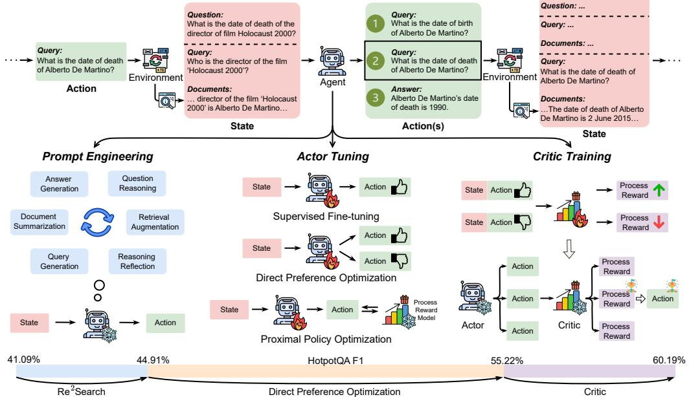
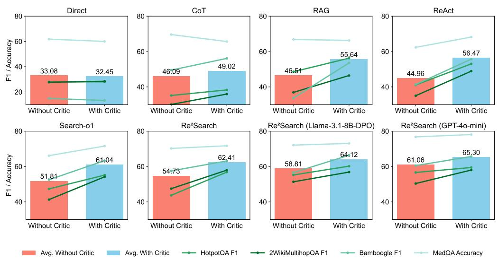
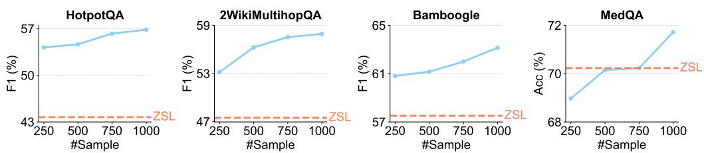
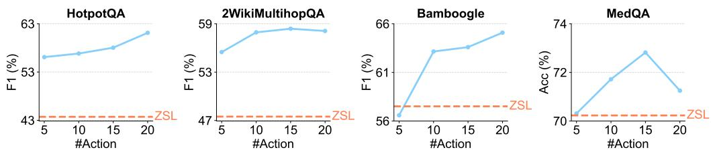
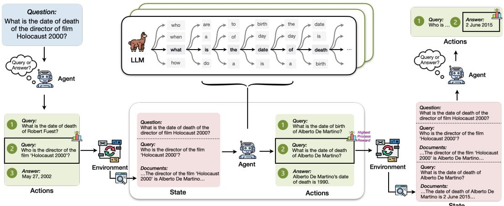
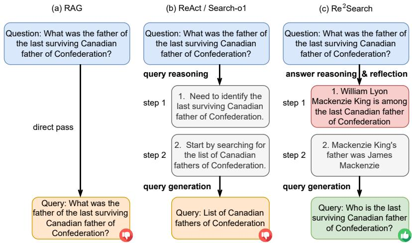
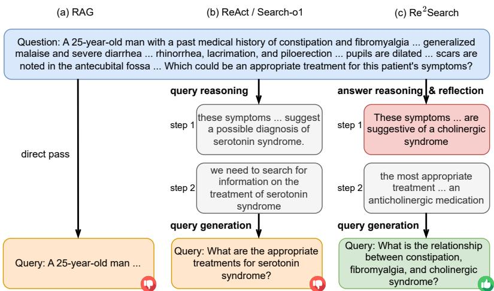

# RAG-Gym: Systematic Optimization of Language Agents for Retrieval-Augmented Generation

Guangzhi $\mathbf { X i o n g ^ { * 1 } }$ , Qiao $\mathbf { J i n } ^ { * 2 }$ , Xiao Wang3, Yin Fang2, Haolin Liu1, Yifan $\mathbf { Y a n g } ^ { 2 }$ , Fangyuan Chen4, Zhixing $\mathbf { S o n g } ^ { 5 }$ , Dengyu Wang6, Minjia Zhang3, Zhiyong ${ \bf L } { \bf u } ^ { \dag 2 }$ , and Aidong Zhang†1

1University of Virginia, 2National Institutes of Health, 3University of Illinois at Urbana Champaign,   
4Dana-Farber Cancer Institute, 5University of Alabama at Birmingham, 6Yale School of Medicine

# Abstract

Retrieval-augmented generation (RAG) has shown great promise for knowledgeintensive tasks and recently advanced with agentic RAG, where language agents engage in multi-round interactions with external knowledge sources for adaptive information retrieval. However, existing agentic RAG methods often depend on ad-hoc prompt engineering and lack a unified optimization framework. We introduce RAG-Gym, a comprehensive platform that systematically explores three optimization dimensions: (1) prompt engineering, (2) actor tuning, and (3) critic training. For prompt engineering, we propose $\mathrm { R e ^ { 2 } }$ Search, a novel agent incorporating reasoning reflection that significantly outperforms standard prompts. In actor tuning, we evaluate three popular post-training algorithms with fine-grained process supervision and identify direct preference optimization as the most effective. We further demonstrate that a trained critic can enhance inference by selecting higherquality intermediate reasoning steps. Together, these findings lead to the optimized $\mathrm { R e ^ { 2 } S e a r c h { + } } +$ agent, which surpasses most recent methods like Search-R1 by a relative increase of $3 . 2 \%$ to $1 1 . 6 \%$ in average F1. Finally, we examine the impact of different reward sources and analyze scaling properties in training and inference, offering practical insights for agentic RAG optimization. The project homepage is available at https://rag-gym.github.io/.

# 1 Introduction

Large language models (LLMs) often struggle with knowledge-intensive questions when lacking sufficient or up-to-date domain knowledge, leading to inaccurate responses or hallucinations [97, 59, 28]. Retrieval-augmented generation (RAG) addresses this by grounding outputs in relevant information from information retrieval (IR) systems, improving both accuracy and verifiability of answers [42, 18]. Agentic pipelines such as ReAct [91] enhances conventional RAG by allowing LLMs to actively generate search queries and interact with IR systems in multiple rounds, which has been shown to be more effective in solving complex tasks that need multi-hop reasoning [91, 4, 65]. However, most existing agentic RAG methods focus on prompt engineering [73, 4, 31, 54], which demands substantial manual effort and often fails to generalize across tasks [40, 70, 2].

Meanwhile, although various LLM post-training algorithms have been developed to enhance downstream performance, they are not directly suited for agentic RAG, where the model must dynamically adjust its token-generation strategy in response to newly retrieved context during the reasoning process. Recent works have adapted reinforcement learning with outcome-based rewards for agentic RAG [69, 33, 8]. However, by overlooking process-level supervision, these approaches risk generating suboptimal intermediate search actions and exhibit limited generalization on unseen data. Given that the retrieval steps fundamentally shape the reasoning trajectory and ultimately influence the final answer, providing fine-grained supervision over these intermediate steps is essential for optimizing agentic RAG. Nevertheless, systematic analyses on how to optimize the language agent and identify best practices for enhancing overall agentic RAG performance are still lacking.

In this work, we present RAG-Gym, a systematic framework that enhances agentic RAG along three dimensions: prompt engineering, actor tuning, and critic training. We review and compare the functional components of existing agentic RAG pipelines (see Table 1) and introduce a novel agent design $ { \mathbf { R e } } ^ { 2 }$ Search that leverages reasoning reflection to improve performance. Our comprehensive experiments across three widely used LLM post-training algorithms reveal that fine-grained, process-level supervision substantially boosts performance, particularly when both positive and negative feedback are integrated. Furthermore, we show that training a critic to evaluate intermediate steps yields additional gains across diverse LLMs. By integrating these insights, our optimized $\mathbf { R e ^ { 2 } S e a r c h { + + } }$ agent achieves superior performance than existing methods on challenging knowledge-intensive tasks $( + 3 . 2 \% \sim 1 1 . 6 \%$ in average F1), especially on unseen datasets $( + 8 . 5 \% \sim 2 4 . 7 \% )$ . We also discuss reward sources as well as the training and inference scaling properties of agentic RAG, providing practical guidelines for future optimization. Our key contributions are summarized as follows:

• We introduce RAG-Gym, a comprehensive framework that integrates advanced prompt engineering, actor tuning, and critic training to enhance agentic RAG.   
• Our extensive experiments uncover best practices across these dimensions and lead to the development of the optimized agent $\mathbf { R e ^ { 2 } S e a r c h { + + } }$ , which consistently outperforms existing methods on challenging knowledge-intensive tasks.   
• We provide a detailed analysis of reward sources as well as training and inference scaling properties, offering actionable insights for future advancements in agentic RAG.

# 2 RAG-Gym Framework

To facilitate fine-grained process-level supervision and systematic evaluation of optimization methods for agentic RAG, we introduce the RAG-Gym framework. RAG-Gym formulates knowledge-intensive question answering as a high-level MDP with well-defined intermediate actions, and provides a modular approach for optimizing language agents across three key components. An overview of RAG-Gym is presented in Figure 1.

# 2.1 Knowledge-intensive Question Answering as Markov Decision Process

While sequential token generation in LLMs can be modeled as an MDP [43, 49, 93], the integration of interactions with the IR environment introduces complex and inconsistent state transitions across agent architectures. To address this, we propose a hierarchical MDP formulation in RAG-Gym that unifies diverse agentic RAG designs. At the high level, agentic RAG is represented as a sequence of reasoning steps that interact with an IR system, while at the low level, each action involves sequential token generation by LLMs. Below, we formally define the components of the high-level MDP.

States. For the agentic RAG process of a given question $\mathcal { Q }$ , we define the state $s _ { t }$ at time step $t$ to be a set consisting of the original question $\mathcal { Q }$ and the information-seeking history $\mathcal { H } _ { t }$ . The information-seeking history is a sequence of search queries $q _ { 1 } , \cdots , q _ { t - 1 }$ and their corresponding sets of retrieved documents $D _ { 1 } , \cdots , D _ { t - 1 }$ , and is used to augment the agent’s knowledge for answering the original question. The initial state is defined as $s _ { 1 } = \mathbf { \bar { ( Q , \mathcal { H } _ { 1 } ) } }$ , where $\mathcal { H } _ { 1 }$ is an empty set.

Actions. Although agents may employ various strategies to reason about the current state and generate different token sequences, RAG-Gym standardizes these outputs by defining a common macro-action space. At each time step $t$ , the action $a _ { t }$ is either a search query or a predicted answer to the original question. While the detailed generated token sequences may differ among agent designs, they must always be semantically equivalent to a designated macro-action within the context of agentic RAG.

Environment. The high-level MDP environment in RAG-Gym is powered by an IR system, which is central to the agentic RAG approach. At each time step $t$ , if the agent’s action $a _ { t }$ is a search query $q _ { t }$ , the IR system returns a corresponding set of documents $D _ { t }$ . The state is then updated from $\bar { s _ { t } } = ( \mathcal { Q } , \mathcal { H } _ { t } ) \bar { }$ to $s _ { t + 1 } = ( \mathcal { Q } , \mathcal { H } _ { t } \cup \bar { \{ ( q _ { t } , D _ { t } ) \} } )$ . Conversely, if $a _ { t }$ predicts an answer to $\mathcal { Q }$ , the episode terminates. To maintain stable and reproducible state transitions, the configuration of the IR system (e.g., the number of returned documents) remains constant throughout.

  
Figure 1: Overview of the RAG-Gym framework. RAG-Gym employs a modular design, comprising prompt engineering, actor tuning, and critic training, to systematically optimize agentic RAG performance. By leveraging all three components, RAG-Gym improves the F1 score of the ReAct agent on HotpotQA from $4 1 . 0 9 \%$ to $6 0 . 1 9 \%$ .

Rewards. For the high-level MDP, the immediate reward for a state-action pair $( s _ { t } , a _ { t } )$ is defined as zero when $a _ { t }$ is a search query, and as the correctness of the predicted answer when $a _ { t }$ is an answer. Moreover, by formulating knowledge-intensive QA as a high-level MDP, we can directly assess the quality of intermediate actions, with process-level rewards derived from various sources (e.g., human annotations, LLM evaluations, or rollouts). This enables both the evaluation of intermediate actions and the fine-grained supervision of language agents through process-level feedback.

# 2.2 Systematic Optimization of Agentic Retrieval-augmented Generation

With the high-level MDP formulation, RAG-Gym optimizes the agentic RAG system through three key components: (1) prompt engineering, which refines the language agent’s structure and operational design; (2) actor tuning, which adjusts the LLM parameters to improve decision-making; and (3) critic training, which develops an external verifier to assess the quality of generated macro-actions.

# 2.2.1 Prompt Engineering

The first aspect of optimizing agentic RAG is crafting effective prompts that guide the language model in generating the appropriate actions. The system prompt defines the agent’s functional capabilities when processing a given state. RAG-Gym summarizes the essential functions into six distinct categories:

• Answer generation: The agent produces a final answer to the question.   
• Question reasoning: The agent outlines reasoning steps before providing the answer.   
• Retrieval augmentation: The agent incorporates retrieved content to enhance its answer.   
• Query generation: The agent formulates queries to search for relevant documents.   
• Document summarization: The agent condenses retrieved content to extract key information.   
• Reasoning reflection: The agent reviews its reasoning to identify any unverified claims.

While the first five components have already been employed in existing agent architectures, the final component reasoning reflection is a novel addition by RAG-Gym. Inspired by recent advancements in reasoning models in which the models can reflect on their own reasoning process for self-correction [19], the newly introduced reasoning reflection directs the agent to scrutinize its reasoning process and identify claims that are unsupported by the information seeking history, thereby linking search query generation to answer reasoning to produce more precise and relevant queries.

Combining reasoning reflection with other existing components, we propose a new agent architecture called $\mathbf { R e } ^ { \tilde { 2 } }$ Search, which stands for Reasoning, Reflection, and Search. A $\mathrm { R e ^ { 2 } }$ Search agent first reasons about all available information to construct an answer to the original question. It then reflects on its reasoning process to identify unverified claims that lack sufficient justification based on available evidence. These unverified claims form the basis for generating the next search query that is designed to retrieve the missing information required for constructing the answer. Table 1 summarizes the presence or absence of these components in several existing agent architectures, including Direct, CoT [81], RAG [42], ReAct [91], Search-o1 [44], and our proposed $\mathrm { R e ^ { 2 } }$ Search, each enabling different LLM capabilities through prompting.

Table 1: A comparative overview of agent architectures based on their functional components.   

<table><tr><td>Component</td><td>Direct</td><td>CoT [81]</td><td>RAG [42]</td><td>ReAct [91]</td><td>Search-01 [44]</td><td>Re2Search</td></tr><tr><td>Answer Generation</td><td></td><td></td><td></td><td></td><td>V</td><td></td></tr><tr><td>Question Reasoning</td><td></td><td></td><td></td><td>JJJ</td><td>v</td><td></td></tr><tr><td>Retrieval Augmentation</td><td></td><td></td><td></td><td></td><td></td><td>JJJ</td></tr><tr><td>Query Generation</td><td></td><td></td><td></td><td>J</td><td>v</td><td>V</td></tr><tr><td>Document Summarization</td><td>Jxxxx</td><td>xx</td><td>JJJXXX</td><td>X</td><td></td><td></td></tr><tr><td>Reasoning Reflection</td><td>X</td><td>X</td><td></td><td>X</td><td>X</td><td></td></tr></table>

# 2.2.2 Actor Tuning

The second aspect of optimizing agentic RAG is tuning LLM parameters to directly enhance reasoning capability. Decomposing knowledge-intensive QA into intermediate steps, the high-level MDP in RAG-Gym enables the targeted optimization of language agents by focusing on the generated action at each step, reducing the task to standard text generation. This streamlines the training process and facilitates the application of various LLM post-training algorithms to enhance agent performance.

Process Reward Data Collection. As discussed in our high-level MDP definition, the process reward for intermediate actions can be derived from multiple sources, including human annotations, LLM evaluations, or rollouts. In our implementation, we focus on collecting process reward data using advanced LLMs such as GPT-4o [1]. Specifically, we sample trajectories from an untuned agent and obtain process reward annotations from GPT-4o, while filtering out trajectories that do not result in a correct final answer using the outcome reward. This strategy enables us to efficiently gather high-quality process reward data, which is subsequently used to optimize the LLMs for agentic RAG. Further details on alternative process reward sources can be found in Section 4.1, with additional information about the data collection pipeline provided in Appendix E.

# Process-based Training Algorithms.

Let $\mathfrak { D }$ denote the process reward dataset, which consists of tuples $( s , a ^ { + } , a ^ { - } )$ , where $s$ is a state, $a ^ { + }$ is a preferred (high-quality) action, and $a ^ { - }$ is a less-preferred (lower-quality) action. Each action is annotated based on the quality of the generated query or predicted answer. We assign the preference label to the entire token sequence produced when reasoning about the state, thereby reducing processbased actor tuning to a standard text generation problem. RAG-Gym implements and compares three widely used LLM post-training algorithms:

• Supervised fine-tuning (SFT) [52]: This method uses high-quality intermediate actions to train language agents by maximizing the log-likelihood of preferred actions $( a ^ { + } )$ conditioned on their respective states $s$ .

• Direct preference optimization (DPO) [56]: This approach employs a contrastive learning framework that utilizes both preferred $( a ^ { + } )$ and unpreferred $( a ^ { - } )$ actions. The DPO objective encourages the agent to increase the likelihood of preferred actions while decreasing that of unpreferred actions.

• Proximal policy optimization (PPO) [60]: This is an online reinforcement learning algorithm for policy optimization. The collected data $\mathfrak { D }$ is first used to train a process reward model $r _ { \phi } ( s , a )$ . PPO then optimizes the agent to maximize the process reward of newly generated actions, while constraining policy updates to ensure stability.

# 2.2.3 Critic Training

The third aspect of optimizing agentic RAG involves training a critic, denoted as $r _ { \phi }$ , to act as an external evaluator of generated actions. The critic is designed to predict process rewards for a given state-action pair $( s , a )$ . Its training objective employs a contrastive loss that distinguishes preferred actions from less-preferred ones, following the preference modeling approach widely used in LLM alignment and reward modeling [47, 52]:

$$
\begin{array} { r } { \mathcal { L } _ { \mathrm { c r i t i c } } ( \phi ) = - \mathbb { E } _ { ( s , a ^ { + } , a ^ { - } ) \sim \mathfrak { D } } \Big [ \log \sigma \big ( r _ { \phi } ( s , a ^ { + } ) - r _ { \phi } ( s , a ^ { - } ) \big ) \Big ] , } \end{array}
$$

where $\sigma$ is the sigmoid function and $\mathfrak { D }$ denotes the process reward dataset containing both preferred $( a ^ { + } )$ and less-preferred $( a ^ { - } )$ actions.

While process reward modeling has been studied in the context of math reasoning [62, 46], its application to agentic RAG for knowledge-intensive question answering remains largely underexplored. In RAG-Gym, our process-level critic is tailored to evaluate intermediate actions such as search queries, rather than only final answers. This approach enables more fine-grained and actionable feedback, facilitating the optimization of agentic RAG systems through process-level supervision. Once trained, the critic provides targeted feedback on generated actions, guiding the language agent to make decisions that are more likely to lead to successful outcomes.

# 3 Main Results

# 3.1 Experimental Settings

To assess the performance of various agents on knowledge-intensive QA tasks and evaluate the benefits of different optimization methods in RAG-Gym, we consider four datasets that are both knowledge- and reasoning-intensive, spanning general and medical domains. Specifically, we use HotpotQA [90], 2WikiMultihopQA [21], and Bamboogle [54], which are popular multi-hop QA datasets constructed from Wikipedia, as well as the MedQA dataset [34], which consists of medical exam questions that require specialized domain knowledge and complex reasoning. Following prior work [61], HotpotQA, 2WikiMultihopQA, and Bamboogle are evaluated using Exact Match (EM) and F1 scores, while the multi-choice MedQA dataset is assessed with accuracy (Acc). We also compute the average EM and F1 scores across different tasks, treating accuracy as equivalent to both metrics in the multi-choice evaluation setting. For actor and critic training in RAG-Gym, 1k questions were sampled from the HotpotQA and MedQA training sets for process reward data collection. To test the generalizability of the tuned agents, 2WikiMultihopQA and Bamboogle were evaluated using LLMs trained on HotpotQA. More implementation details can be found in Appendices C, E, H.

# 3.2 Performance Improvements by Prompt Engineering and Actor Tuning

Table 2 presents a performance comparison of various agents and their tuned versions using different actor tuning algorithms in RAG-Gym. The results indicate that the $\mathrm { R e ^ { 2 } }$ Search agent consistently outperforms other agents in both zero-shot and actor-tuned settings. Furthermore, when comparing Table 2 with Table 1, which details the functional components of each agent, it can be observed that more components generally leads to improved performance. This observation validates the effectiveness of the summarized functions in RAG-Gym, as well as the design of the $\mathrm { R e ^ { 2 } }$ Search agent, which incorporates all identified components, including our newly proposed reasoning reflection. Additional case studies of our proposed $\mathrm { R e ^ { 2 } }$ Search agent are provided in Appendices G.1 and G.2.

By comparing different process supervision approaches for actor tuning, we observe that process supervision consistently enhances agent performance relative to the zero-shot learning (ZSL) baseline. This improvement underscores the critical role of process supervision in refining agentic RAG. Notably, for Direct, CoT, and RAG agents, where tuning focuses solely on answer generation, SFT slightly outperforms both DPO and PPO. In contrast, for ReAct, Search-o1, and $\mathrm { R e ^ { 2 } }$ Search agents, where the tuning process also involves generating high-quality queries, DPO and PPO surpass SFT, with DPO demonstrating a slight edge over PPO on most tasks. These findings highlight the importance of utilizing both positive and negative samples during training, especially for agents that require complex, multi-step reasoning with environmental feedback. Furthermore, the tuned agents tend to generate more search queries during inference, as elaborated in Appendix F.

Table 2: Agent performance with Llama-3.1-8B backbone. Highest scores are bolded.   

<table><tr><td rowspan="2">Method</td><td rowspan="2">Agent</td><td colspan="2">HotpotQA</td><td colspan="2">2Wiki</td><td colspan="2">Bamboogle</td><td rowspan="2">MedQA</td><td colspan="2">Average</td></tr><tr><td>EM</td><td>F1</td><td>EM</td><td>F1</td><td>EM</td><td>F1</td><td>Acc EM</td><td>F1</td></tr><tr><td rowspan="6">Zero-shot Learning</td><td>Direct</td><td>21.10</td><td>27.93</td><td>24.10</td><td>27.68</td><td>9.60</td><td>14.89</td><td>61.82</td><td>29.16</td><td>33.08</td></tr><tr><td>CoT</td><td>27.10</td><td>35.17</td><td>25.70</td><td>30.08</td><td>37.60</td><td>49.50</td><td>69.60</td><td>40.00</td><td>46.09</td></tr><tr><td>RAG</td><td>38.30</td><td>48.57</td><td>32.00</td><td>36.91</td><td>22.40</td><td>33.73</td><td>66.85</td><td>39.89</td><td>46.51</td></tr><tr><td>ReAct</td><td>30.70</td><td>41.09</td><td>28.90</td><td>35.03</td><td>32.00</td><td>41.35</td><td>62.37</td><td>38.49</td><td>44.96</td></tr><tr><td>Search-o1</td><td>35.30</td><td>47.33</td><td>34.00</td><td>41.29</td><td>44.80</td><td>52.50</td><td>66.14</td><td>45.06</td><td>51.82</td></tr><tr><td>Re2Search</td><td>34.00</td><td>44.91</td><td>41.50</td><td>49.06</td><td>44.80</td><td>55.33</td><td>70.31</td><td>47.65</td><td>54.90</td></tr><tr><td rowspan="6">RAG-Gym Supervised Fine-tuning</td><td>Direct</td><td>22.80</td><td>31.67</td><td>28.00</td><td>33.17</td><td>20.00</td><td>27.21</td><td>63.63</td><td>33.61</td><td>38.92</td></tr><tr><td>CoT</td><td>26.50</td><td>35.60</td><td>27.30</td><td>32.10</td><td>42.40</td><td>53.89</td><td>69.68</td><td>41.47</td><td>47.82</td></tr><tr><td>RAG</td><td>41.50</td><td>52.26</td><td>38.00</td><td>42.74</td><td>28.80</td><td>40.76</td><td>67.79</td><td>44.02</td><td>50.89</td></tr><tr><td>ReAct</td><td>35.50</td><td>46.06</td><td>31.00</td><td>36.79</td><td>34.40</td><td>44.17</td><td>66.69</td><td>41.90</td><td>48.43</td></tr><tr><td>Search-o1</td><td>38.20</td><td>50.02</td><td>39.0</td><td>45.91</td><td>46.40</td><td>57.18</td><td>67.64</td><td>47.81</td><td>55.19</td></tr><tr><td>Re2Search</td><td>37.60</td><td>49.16</td><td>44.00</td><td>50.54</td><td>44.80</td><td>56.78</td><td>69.52</td><td>48.98</td><td>56.50</td></tr><tr><td rowspan="6">RAG-Gym Direct Preference Optimization</td><td>Direct</td><td>20.80</td><td>28.79</td><td>25.20</td><td>29.45</td><td>12.00</td><td>20.67</td><td>62.37</td><td>30.09</td><td>35.32</td></tr><tr><td>CoT</td><td>26.30</td><td>35.06</td><td>28.20</td><td>32.84</td><td>40.80</td><td>51.67</td><td>71.33</td><td>41.66</td><td>47.73</td></tr><tr><td>RAG</td><td>38.00</td><td>49.38</td><td>37.60</td><td>42.88</td><td>28.80</td><td>39.57</td><td>67.79</td><td>43.05</td><td>49.91</td></tr><tr><td>ReAct</td><td>33.00</td><td>43.96</td><td>32.20</td><td>39.24</td><td>44.80</td><td>54.35</td><td>68.89</td><td>44.72</td><td>51.61</td></tr><tr><td>Search-o1</td><td>42.20</td><td>54.34</td><td>44.10</td><td>52.66</td><td>42.40</td><td>55.59</td><td>70.23</td><td>49.73</td><td>58.21</td></tr><tr><td>Re{2Search</td><td>42.20</td><td>55.22</td><td>44.30</td><td>51.36</td><td>48.00</td><td>56.57</td><td>72.11</td><td>51.65</td><td>58.82</td></tr><tr><td rowspan="5">RAG-Gym Proximal olicy Optimization</td><td>Direct</td><td>19.20</td><td>26.17</td><td>25.60</td><td>28.84</td><td>7.20</td><td>12.17</td><td>61.12</td><td>28.28</td><td>32.08</td></tr><tr><td>CoT</td><td>25.50</td><td>33.68</td><td>24.20</td><td>29.02</td><td>43.20</td><td>52.54</td><td>68.50</td><td>40.35</td><td>45.94</td></tr><tr><td>RAG</td><td>37.70</td><td>47.60</td><td>32.00</td><td>36.29</td><td>28.80</td><td>40.24</td><td>68.03</td><td>41.63</td><td>41.44</td></tr><tr><td>ReAct</td><td>35.80</td><td>47.56</td><td>33.20</td><td>40.06</td><td>36.80</td><td>46.79</td><td>67.32</td><td>43.28</td><td>50.43</td></tr><tr><td>Search-o1 Re2Search</td><td>38.30 38.40</td><td>50.24 50.30</td><td>32.60 41.40</td><td>39.34 48.06</td><td>50.40 49.60</td><td>59.92 62.06</td><td>70.15 71.72</td><td>47.86 50.28</td><td>54.91 58.04</td></tr></table>

# 3.3 Performance Improvements by Critic Training

Figure 2 illustrates the performance improvements achieved through critic training. The label “With Critic” indicates that an external critic evaluates 10 sampled actions at each step to select the best one. In our experiments, all agents except for “Direct” consistently benefit from critic training. Moreover, these performance gains transfer to actors using different LLMs. As shown in the figure, not only does the original Llama-3.1-8B benefit from the trained critic, but both the DPO-tuned Llama-3.1-8B and GPT-4o-mini also experience significant improvements across all datasets using the same critic. This highlights the potential of employing trained critics as a plug-and-play module to enhance agentic RAG performance, particularly for proprietary LLMs where direct fine-tuning is not feasible. A case study of using trained critics during inference is provided in Appendix G.3.

# 3.4 Comparisons with Outcome Supervision Methods

Combining the findings from previous sections, we introduce $\mathrm { R e ^ { 2 } S e a r c h { + } } +$ , an optimized agent that integrates the best choices from each optimization direction. Built on $\mathrm { R e ^ { 2 } }$ Search and tuned with DPO while utilizing a trained critic for action selection, $\mathrm { R e ^ { 2 } S e a r c h { + } } +$ is evaluated against recent methods such as Search-R1 [33] and R1-Searcher [69], which rely on outcome supervision via reinforcement learning (RL) with over 8k training questions. As these methods primarily focus on general-domain questions, we exclude MedQA from this evaluation for a fair comparison. Table 3 shows that $\bar { \mathrm { R e ^ { 2 } S e a r c h + + } }$ achieves performance comparable to that of the RL-tuned agents on the datasets used for their training (HotpotQA for Search-R1; HotpotQA and 2WikiMultihopQA for R1-Searcher), while significantly outperforming them on unseen datasets and achieving the best performance on average. This result underscores the overfitting issues of RL-based outcome supervision methods and highlights the robustness and generalizability of $\mathrm { R e ^ { 2 } S e a r c h + + }$ through its fine-grained process supervision on intermediate steps.

  
Figure 2: Performance improvements across various agents with critics.

Table 3: Comparison of $\mathrm { R e ^ { 2 } S e a r c h { + } } +$ and other methods. Shading indicates in-domain model performance. CEM represents the “Cover Exact Match” used in [69].   

<table><tr><td rowspan="2">LLM</td><td rowspan="2">Method</td><td colspan="3">HotpotQA</td><td colspan="3">2WikiMultihopQA</td><td colspan="3">Bamboogle</td><td colspan="3">Average</td></tr><tr><td>EM</td><td>CEM</td><td>F1</td><td>EM</td><td>CEM</td><td>F1</td><td>EM</td><td>CEM</td><td>F1</td><td>EM</td><td>CEM</td><td>F1</td></tr><tr><td rowspan="4">Llama -3.1-8B</td><td>ReAct</td><td>30.70</td><td>38.40</td><td>41.09</td><td>28.90</td><td>38.00</td><td>35.03</td><td>32.00</td><td>36.80</td><td>41.35</td><td>30.57</td><td>37.73</td><td>39.16</td></tr><tr><td>Search-ol</td><td>35.30</td><td>43.80</td><td>47.33</td><td>34.00</td><td>45.80</td><td>41.29</td><td>44.80</td><td>48.80</td><td>52.50</td><td>38.03</td><td>46.13</td><td>47.04</td></tr><tr><td>R1-Searcher</td><td>44.90</td><td>50.40</td><td>56.88</td><td>48.70</td><td>51.30</td><td>54.24</td><td>38.40</td><td>40.80</td><td>53.21</td><td>44.00</td><td>47.50</td><td>54.78</td></tr><tr><td>Re2Search++</td><td>46.50</td><td>57.80</td><td>60.19</td><td>48.90</td><td>60.50</td><td>56.85</td><td>55.20</td><td>63.20</td><td>66.37</td><td>50.20</td><td>60.50</td><td>61.14</td></tr><tr><td rowspan="5">Qwen -2.5-7B</td><td>ReAct</td><td>36.00</td><td>40.10</td><td>45.84</td><td>38.60</td><td>44.50</td><td>45.02</td><td>35.20</td><td>38.40</td><td>44.94</td><td>36.60</td><td>41.00</td><td>45.27</td></tr><tr><td>Search-o1</td><td>40.70</td><td>46.60</td><td>52.15</td><td>38.90</td><td>46.20</td><td>45.79</td><td>40.80</td><td>44.80</td><td>52.91</td><td>40.17</td><td>45.87</td><td>50.28</td></tr><tr><td>Seaach-R1</td><td>44.90</td><td>49.40</td><td>57.30</td><td>43.90</td><td>47.80</td><td>50.07</td><td>40.80</td><td>41.60</td><td>51.69</td><td>43.20</td><td>46.27</td><td>53.02</td></tr><tr><td>R1-Searcher</td><td>46.80</td><td>53.70</td><td>59.61</td><td>48.80</td><td>55.00</td><td>55.36</td><td>44.80</td><td>48.00</td><td>54.01</td><td>46.80</td><td>52.23</td><td>56.33</td></tr><tr><td>Re2Search++</td><td>44.40</td><td>50.30</td><td>56.47</td><td>47.00</td><td>56.50</td><td>54.35</td><td>52.94</td><td>56.30</td><td>63.51</td><td>48.11</td><td>54.37</td><td>58.11</td></tr></table>

# 4 Analysis and Discussion

# 4.1 Comparison of Different Reward Sources

As discussed in Section 2, the process reward can be collected from different sources. This section focuses on the evaluation of the effectiveness of these sources in guiding the agent’s action selection toward correct answers, as well as their alignment with human preferences, which are often considered to have the highest quality for process annotation [98]. Specifically, we compare the GPT-4o annotations with Llama-3.1-8B, as well as the rollout-based annotations using Math-Shepherd [77]. We collect process annotations from human experts on MedQA to examine the alignment between the trained reward models and human preferences.

Table 4: Comparison of various reward sources. ORM/PRM denotes the outcome/process reward model. Outcome sources are labeled for PRMs due to the trajectory filtering in RAG-Gym.   

<table><tr><td>Type</td><td>Outcome Source</td><td>Process Source</td><td>HotpotQA (EM/F1)</td><td>2Wiki (EM/F1)</td><td>Bamboogle (EM/F1)</td><td>MedQA (Acc / Agree)</td></tr><tr><td>ORM</td><td>Truth</td><td></td><td>41.10 / 53.35</td><td>47.70 / 55.59</td><td>43.20 / 57.46</td><td>66.77 / —</td></tr><tr><td>PRM (Random)</td><td></td><td></td><td>32.20 / 42.83</td><td>35.70 / 42.00</td><td>38.40 / 47.86</td><td>68.26 / 50.00</td></tr><tr><td>PRM (Rollout)</td><td>Truth</td><td>Rollout</td><td>39.60 / 51.85</td><td>42.94 / 49.57</td><td>48.80 / 56.05</td><td>68.34 / 71.03</td></tr><tr><td>PRM (Llama)</td><td>Truth</td><td>Llama-3.1-8B</td><td>40.30 / 51.74</td><td>40.70 / 48.22</td><td>44.80 / 54.36</td><td>68.50 / 65.99</td></tr><tr><td>PRM (GPT)</td><td>Truth</td><td>GPT-40</td><td>44.10 / 56.84</td><td>50.20 / 57.94</td><td>51.20 / 63.15</td><td>71.96 / 85.85</td></tr></table>

The results are shown in Table 4. The reward model trained with GPT-4o annotations delivers the highest performance across all datasets, effectively providing accurate, fine-grained process rewards for agent optimization. Moreover, it exhibits the best alignment with human preferences, achieving an agreement rate of $8 5 . 8 5 \%$ with human annotators. In contrast, although rollouts and Llama-3.1-8B annotations improve action selection relative to a process reward model with random selections, they are generally less effective than GPT-4o annotations and sometimes even bring inferior outcomes on general-domain questions. This result underscores the limitations of current rollout-based methods, originally designed for math reasoning, in the context of complex reasoning and search tasks, and highlights the need for tailored approaches in agentic RAG.

# 4.2 Training Time Scaling

For the evaluation of training sample size and its impacts on the performance of $\mathrm { R e ^ { 2 } }$ Search agents, we conducted experiments using critics trained on varying numbers of instances, ranging from 250 to 1000 questions. The results, presented in Figure 3, show how the agent’s performance scales with the availability of more training data across four datasets. In general, the performance of $\mathrm { R e ^ { 2 } }$ Search improves with an increasing number of training samples, but the gains tend to converge as the sample size grows. Notably, there is a sharp improvement in F1 scores on HotpotQA, 2WikiMultihopQA, and Bamboogle when comparing the ZSL baseline to process reward models trained on 250 samples, showing that even a small amount of process reward data can yield significant performance gains. However, the improvements become less pronounced on HotpotQA and 2WikiMultihopQA when increasing the training samples from 500 to 1000, indicating diminishing returns as the model approaches a saturation point in its learning from additional data.

  
Figure 3: Performance of $\mathrm { R e ^ { 2 } }$ Search agents with critics trained on different numbers of samples.

For MedQA, which involves complex reasoning and information-seeking tasks requiring domainspecific knowledge, a different trend is observed. With only 250 training samples, the performance slightly drops below the ZSL baseline, highlighting the challenges of capturing intricate domainspecific processes with limited training data. As the sample size increases, however, the performance gradually recovers and eventually surpasses the ZSL baseline, achieving the highest accuracy of $7 1 . 7 2 \%$ with 1000 samples. This underscores the importance of sufficient training data in capturing the nuanced reasoning and query-generation processes required for specialized tasks.

# 4.3 Inference Time Scaling

Since trained critics optimize action-taking by identifying high-quality actions from the generated candidates during inference, we explored how the agent performance changes with the increasing number of sampled actions at each time step. Figure 4 displays the results of our inference time scaling study, with $\mathrm { R e ^ { 2 } }$ Search as the tested agent. We observe a consistent trend across multiple benchmarks, where increasing the number of sampled actions generally improves performance. Specifically, for HotpotQA and Bamboogle, the F1 score continues to rise as more actions are sampled, demonstrating the benefits of expanding the candidate set to enable better action selection at each step. However, performance gains gradually diminish, indicating that the agent reaches a point where additional sampled actions contribute less to improvement. This suggests that while action sampling is beneficial, there is a limit to how much additional sampling enhances decision-making.

  
Figure 4: Performance of $\mathrm { R e ^ { 2 } }$ Search agents with different numbers of actions sampled per step.

# 5 Related Work

# 5.1 Retrieval-Augmented Generation

Retrieval-Augmented Generation (RAG) has emerged as a powerful paradigm for enhancing large language models (LLMs) on knowledge-intensive tasks. A typical RAG framework comprises two core components: a retriever, which selects relevant documents from a large corpus, and a generator, which synthesizes information from these documents to produce coherent and contextually appropriate responses [42, 18, 9]. RAG has demonstrated strong performance across diverse domains, including open-domain question answering [37, 25, 7, 88, 63], fact-checking [78, 66], and summarization [3]. Subsequent research has focused on improving both the retriever’s ability to select relevant documents [95, 51, 89, 30, 32] and the generator’s capacity to effectively utilize retrieved information [15, 82, 80], thereby boosting overall system performance [26, 96, 36, 94]. Nevertheless, most RAG pipelines still rely on a single retrieval step, which can be inadequate for complex queries that require synthesizing information from multiple sources.

# 5.2 Multi-hop Question Answering

Multi-hop question answering (QA) tasks require systems to synthesize information from multiple, diverse sources to produce accurate answers [90, 21]. These tasks highlight the limitations of conventional RAG architectures, where a single retrieval step often fails to capture the comprehensive context needed for complex queries. To address this, language agents such as ReAct [91, 73, 4, 31, 54] have been proposed, interleaving reasoning and retrieval to dynamically accumulate relevant evidence [57, 79, 38, 61], which has shown promise in improving LLM performance [76, 64, 92, 27, 29]. However, most of these methods still rely heavily on prompt engineering, which can be fragile and may not effectively optimize language agents for knowledge-intensive tasks [40, 70, 2]. Recent studies have explored reinforcement learning (RL) to optimize language agents for multi-hop QA [69, 33, 8, 17, 55], but these approaches risk generating suboptimal intermediate search actions and show limited generalization to unseen data, as demonstrated in our experiments. Other concurrent work investigates process-level supervision [22, 12, 45, 71], but typically focuses on specific agent architectures and a narrow set of supervision methods, offering limited insight into the systematic optimization of language agents.

# 5.3 Post-training of Large Language Models

Beyond the foundational knowledge acquired during pre-training, post-training methods are essential for refining Large Language Models (LLMs) and aligning them with specific downstream tasks and desired behaviors. Supervised Fine-Tuning (SFT) adapts models using curated instruction-response pairs to promote task-specific capabilities [52, 10]. While SFT enhances instruction-following, further alignment with nuanced human preferences is often achieved through Reinforcement Learning from Human Feedback (RLHF) [52, 6, 5], typically implemented via Proximal Policy Optimization (PPO) [60]. More recently, critic-free approaches such as Direct Preference Optimization (DPO) have emerged as streamlined alternatives [56, 50, 14, 87], directly optimizing the LLM policy based on reward annotations and bypassing the need for a separately trained reward model. Although these techniques bring strong gains on text generation benchmarks, their integration into agentic RAG pipelines, where models must dynamically interact with retrieval systems and adapt reasoning strategies to evolving contexts, remains underexplored.

# 6 Conclusion

This work presents RAG-Gym as a unified and extensible framework for systematically optimizing agentic RAG along the axes of prompt engineering, actor tuning, and critic training. Through extensive empirical analysis, we demonstrate that integrating reasoning reflection, process-level direct preference optimization, and critic-guided inference yields substantial improvements over existing approaches. We hope RAG-Gym will serve as a foundation for further advances in robust, adaptive, and interpretable retrieval-augmented language agents.

# References

[1] Josh Achiam, Steven Adler, Sandhini Agarwal, Lama Ahmad, Ilge Akkaya, Florencia Leoni Aleman, Diogo Almeida, Janko Altenschmidt, Sam Altman, Shyamal Anadkat, et al. Gpt-4 technical report. arXiv preprint arXiv:2303.08774, 2023.   
[2] Victor Akinwande, Yiding Jiang, Dylan Sam, and J Zico Kolter. Understanding prompt engineering may not require rethinking generalization. arXiv preprint arXiv:2310.03957, 2023.   
[3] Chenxin An, Ming Zhong, Zhichao Geng, Jianqiang Yang, and Xipeng Qiu. Retrievalsum: A retrieval enhanced framework for abstractive summarization. arXiv preprint arXiv:2109.07943, 2021.   
[4] Akari Asai, Zeqiu Wu, Yizhong Wang, Avirup Sil, and Hannaneh Hajishirzi. Self-rag: Learning to retrieve, generate, and critique through self-reflection. In The Twelfth International Conference on Learning Representations, ICLR 2024, Vienna, Austria, May 7-11, 2024. OpenReview.net, 2024. URL https://openreview.net/forum?id=hSyW5go0v8.   
[5] Amanda Askell, Yuntao Bai, Anna Chen, Dawn Drain, Deep Ganguli, Tom Henighan, Andy Jones, Nicholas Joseph, Ben Mann, Nova DasSarma, et al. A general language assistant as a laboratory for alignment. arXiv preprint arXiv:2112.00861, 2021.   
[6] Yuntao Bai, Andy Jones, Kamal Ndousse, Amanda Askell, Anna Chen, Nova DasSarma, Dawn Drain, Stanislav Fort, Deep Ganguli, Tom Henighan, et al. Training a helpful and harmless assistant with reinforcement learning from human feedback. arXiv preprint arXiv:2204.05862, 2022.   
[7] Sebastian Borgeaud, Arthur Mensch, Jordan Hoffmann, Trevor Cai, Eliza Rutherford, Katie Millican, George Bm Van Den Driessche, Jean-Baptiste Lespiau, Bogdan Damoc, Aidan Clark, et al. Improving language models by retrieving from trillions of tokens. In International conference on machine learning, pages 2206–2240. PMLR, 2022.   
[8] Mingyang Chen, Tianpeng Li, Haoze Sun, Yijie Zhou, Chenzheng Zhu, Haofen Wang, Jeff Z Pan, Wen Zhang, Huajun Chen, Fan Yang, et al. Research: Learning to reason with search for llms via reinforcement learning. arXiv preprint arXiv:2503.19470, 2025.   
[9] Mingyue Cheng, Yucong Luo, Jie Ouyang, Qi Liu, Huijie Liu, Li Li, Shuo Yu, Bohou Zhang, Jiawei Cao, Jie Ma, et al. A survey on knowledge-oriented retrieval-augmented generation. arXiv preprint arXiv:2503.10677, 2025.   
[10] Hyung Won Chung, Le Hou, Shayne Longpre, Barret Zoph, Yi Tay, William Fedus, Yunxuan Li, Xuezhi Wang, Mostafa Dehghani, Siddhartha Brahma, et al. Scaling instruction-finetuned language models. Journal of Machine Learning Research, 25(70):1–53, 2024.   
[11] Gordon V Cormack, Charles LA Clarke, and Stefan Buettcher. Reciprocal rank fusion outperforms condorcet and individual rank learning methods. In Proceedings of the 32nd international ACM SIGIR conference on Research and development in information retrieval, pages 758–759, 2009.   
[12] Guanting Dong, Chenghao Zhang, Mengjie Deng, Yutao Zhu, Zhicheng Dou, and Ji-Rong Wen.

Progressive multimodal reasoning via active retrieval. arXiv preprint arXiv:2412.14835, 2024.

[13] Abhimanyu Dubey, Abhinav Jauhri, Abhinav Pandey, Abhishek Kadian, Ahmad Al-Dahle, Aiesha Letman, Akhil Mathur, Alan Schelten, Amy Yang, Angela Fan, et al. The llama 3 herd of models. arXiv preprint arXiv:2407.21783, 2024.

[14] Kawin Ethayarajh, Winnie Xu, Niklas Muennighoff, Dan Jurafsky, and Douwe Kiela. Kto: Model alignment as prospect theoretic optimization. arXiv preprint arXiv:2402.01306, 2024.

[15] Feiteng Fang, Yuelin Bai, Shiwen Ni, Min Yang, Xiaojun Chen, and Ruifeng Xu. Enhancing noise robustness of retrieval-augmented language models with adaptive adversarial training. arXiv preprint arXiv:2405.20978, 2024.

[16] Jiayi Fu, Xuandong Zhao, Chengyuan Yao, Heng Wang, Qi Han, and Yanghua Xiao. Reward shaping to mitigate reward hacking in rlhf. arXiv preprint arXiv:2502.18770, 2025.

[17] Jingsheng Gao, Linxu Li, Weiyuan Li, Yuzhuo Fu, and Bin Dai. Smartrag: Jointly learn rag-related tasks from the environment feedback. arXiv preprint arXiv:2410.18141, 2024.

[18] Yunfan Gao, Yun Xiong, Xinyu Gao, Kangxiang Jia, Jinliu Pan, Yuxi Bi, Yi Dai, Jiawei Sun, and Haofen Wang. Retrieval-augmented generation for large language models: A survey. arXiv preprint arXiv:2312.10997, 2023.

[19] Daya Guo, Dejian Yang, Haowei Zhang, Junxiao Song, Ruoyu Zhang, Runxin Xu, Qihao Zhu, Shirong Ma, Peiyi Wang, Xiao Bi, et al. Deepseek-r1: Incentivizing reasoning capability in llms via reinforcement learning. arXiv preprint arXiv:2501.12948, 2025.

[20] Binglan Han, Teo Susnjak, and Anuradha Mathrani. Automating systematic literature reviews with retrieval-augmented generation: A comprehensive overview. Applied Sciences, 14(19): 9103, 2024.

[21] Xanh Ho, Anh-Khoa Duong Nguyen, Saku Sugawara, and Akiko Aizawa. Constructing a multi-hop qa dataset for comprehensive evaluation of reasoning steps. In Proceedings of the 28th International Conference on Computational Linguistics, pages 6609–6625, 2020.

[22] Sheryl Hsu, Omar Khattab, Chelsea Finn, and Archit Sharma. Grounding by trying: Llms with reinforcement learning-enhanced retrieval. arXiv preprint arXiv:2410.23214, 2024.

[23] Edward J Hu, Yelong Shen, Phillip Wallis, Zeyuan Allen-Zhu, Yuanzhi Li, Shean Wang, Lu Wang, and Weizhu Chen. Lora: Low-rank adaptation of large language models. arXiv preprint arXiv:2106.09685, 2021.

[24] Jian Hu, Xibin Wu, Zilin Zhu, Weixun Wang, Dehao Zhang, Yu Cao, et al. Openrlhf: An easy-to-use, scalable and high-performance rlhf framework. arXiv preprint arXiv:2405.11143, 2024.

[25] Gautier Izacard and Édouard Grave. Leveraging passage retrieval with generative models for open domain question answering. In Proceedings of the 16th Conference of the European Chapter of the Association for Computational Linguistics: Main Volume, pages 874–880, 2021.

[26] Gautier Izacard, Patrick Lewis, Maria Lomeli, Lucas Hosseini, Fabio Petroni, Timo Schick, Jane Dwivedi-Yu, Armand Joulin, Sebastian Riedel, and Edouard Grave. Atlas: Few-shot learning with retrieval augmented language models. Journal of Machine Learning Research, 24(251): 1–43, 2023.

[27] Soyeong Jeong, Jinheon Baek, Sukmin Cho, Sung Ju Hwang, and Jong-Cheol Park. Adaptiverag: Learning to adapt retrieval-augmented large language models through question complexity. In 2024 Conference of the North American Chapter of the Association for Computational Linguistics: Human Language Technologies, pages 7036–7050. Association for Computational Linguistics, 2024.

[28] Ziwei Ji, Nayeon Lee, Rita Frieske, Tiezheng Yu, Dan Su, Yan Xu, Etsuko Ishii, Ye Jin Bang, Andrea Madotto, and Pascale Fung. Survey of hallucination in natural language generation. ACM Computing Surveys, 55(12):1–38, 2023.

[29] Pengcheng Jiang, Lang Cao, Ruike Zhu, Minhao Jiang, Yunyi Zhang, Jimeng Sun, and Jiawei Han. Ras: Retrieval-and-structuring for knowledge-intensive llm generation. arXiv preprint arXiv:2502.10996, 2025.   
[30] Pengcheng Jiang, Jiacheng Lin, Lang Cao, Runchu Tian, SeongKu Kang, Zifeng Wang, Jimeng Sun, and Jiawei Han. Deepretrieval: Hacking real search engines and retrievers with large language models via reinforcement learning. arXiv preprint arXiv:2503.00223, 2025.   
[31] Zhengbao Jiang, Frank F Xu, Luyu Gao, Zhiqing Sun, Qian Liu, Jane Dwivedi-Yu, Yiming Yang, Jamie Callan, and Graham Neubig. Active retrieval augmented generation. In Proceedings of the 2023 Conference on Empirical Methods in Natural Language Processing, pages 7969–7992, 2023.   
[32] Ziyan Jiang, Xueguang Ma, and Wenhu Chen. Longrag: Enhancing retrieval-augmented generation with long-context llms. arXiv preprint arXiv:2406.15319, 2024.   
[33] Bowen Jin, Hansi Zeng, Zhenrui Yue, Jinsung Yoon, Sercan Arik, Dong Wang, Hamed Zamani, and Jiawei Han. Search-r1: Training llms to reason and leverage search engines with reinforcement learning. arXiv preprint arXiv:2503.09516, 2025.   
[34] Di Jin, Eileen Pan, Nassim Oufattole, Wei-Hung Weng, Hanyi Fang, and Peter Szolovits. What disease does this patient have? a large-scale open domain question answering dataset from medical exams. Applied Sciences, 11(14):6421, 2021.   
[35] Qiao Jin, Won Kim, Qingyu Chen, Donald C Comeau, Lana Yeganova, W John Wilbur, and Zhiyong Lu. Medcpt: Contrastive pre-trained transformers with large-scale pubmed search logs for zero-shot biomedical information retrieval. Bioinformatics, 39(11):btad651, 2023.   
[36] Zhuoran Jin, Hongbang Yuan, Tianyi Men, Pengfei Cao, Yubo Chen, Kang Liu, and Jun Zhao. Rag-rewardbench: Benchmarking reward models in retrieval augmented generation for preference alignment. arXiv preprint arXiv:2412.13746, 2024.   
[37] Vladimir Karpukhin, Barlas Oguz, Sewon Min, Patrick Lewis, Ledell Wu, Sergey Edunov, Danqi Chen, and Wen-tau Yih. Dense passage retrieval for open-domain question answering. In Proceedings of the 2020 Conference on Empirical Methods in Natural Language Processing (EMNLP), pages 6769–6781, 2020.   
[38] Tushar Khot, Harsh Trivedi, Matthew Finlayson, Yao Fu, Kyle Richardson, Peter Clark, and Ashish Sabharwal. Decomposed prompting: A modular approach for solving complex tasks. In The Eleventh International Conference on Learning Representations, ICLR 2023, Kigali, Rwanda, May 1-5, 2023. OpenReview.net, 2023. URL https://openreview.net/forum? id=_nGgzQjzaRy.   
[39] Jakub Lála, Odhran O’Donoghue, Aleksandar Shtedritski, Sam Cox, Samuel G Rodriques, and Andrew D White. Paperqa: Retrieval-augmented generative agent for scientific research. arXiv preprint arXiv:2312.07559, 2023.   
[40] Divya Lamba. The role of prompt engineering in improving language understanding and generation. International Journal For Multidisciplinary Research, 2024. URL https://api. semanticscholar.org/CorpusID:274939741.   
[41] Guido Lang and Tan Gürpinar. Ai-powered learning support: A study of retrieval-augmented generation (rag) chatbot effectiveness in an online course. Information Systems Education Journal, 23(2), 2025.   
[42] Patrick Lewis, Ethan Perez, Aleksandra Piktus, Fabio Petroni, Vladimir Karpukhin, Naman Goyal, Heinrich Küttler, Mike Lewis, Wen-tau Yih, Tim Rocktäschel, et al. Retrieval-augmented generation for knowledge-intensive nlp tasks. Advances in Neural Information Processing Systems, 33:9459–9474, 2020.   
[43] Dongheng Li, Yongchang Hao, and Lili Mou. Llmr: Knowledge distillation with a large language model-induced reward. In Proceedings of the 2024 Joint International Conference on Computational Linguistics, Language Resources and Evaluation (LREC-COLING 2024), pages 10657–10664, 2024.

[44] Xiaoxi Li, Guanting Dong, Jiajie Jin, Yuyao Zhang, Yujia Zhou, Yutao Zhu, Peitian Zhang, and Zhicheng Dou. Search-o1: Agentic search-enhanced large reasoning models. arXiv preprint arXiv:2501.05366, 2025.

[45] Xingxuan Li, Weiwen Xu, Ruochen Zhao, Fangkai Jiao, Shafiq Joty, and Lidong Bing. Can we further elicit reasoning in llms? critic-guided planning with retrieval-augmentation for solving challenging tasks. arXiv preprint arXiv:2410.01428, 2024.

[46] Hunter Lightman, Vineet Kosaraju, Yuri Burda, Harrison Edwards, Bowen Baker, Teddy Lee, Jan Leike, John Schulman, Ilya Sutskever, and Karl Cobbe. Let’s verify step by step. In The Twelfth International Conference on Learning Representations, ICLR 2024, Vienna, Austria, May 7-11, 2024. OpenReview.net, 2024. URL https://openreview.net/forum? id=v8L0pN6EOi.

[47] Fei Liu et al. Learning to summarize from human feedback. In Proceedings of the 58th Annual Meeting of the Association for Computational Linguistics, pages 583–592, 2020.

[48] Siru Liu, Allison B McCoy, and Adam Wright. Improving large language model applications in biomedicine with retrieval-augmented generation: a systematic review, meta-analysis, and clinical development guidelines. Journal of the American Medical Informatics Association, page ocaf008, 2025.

[49] Hao Ma, Tianyi Hu, Zhiqiang Pu, Liu Boyin, Xiaolin Ai, Yanyan Liang, and Min Chen. Coevolving with the other you: Fine-tuning llm with sequential cooperative multi-agent reinforcement learning. Advances in Neural Information Processing Systems, 37:15497–15525, 2024.

[50] Yu Meng, Mengzhou Xia, and Danqi Chen. Simpo: Simple preference optimization with a reference-free reward. Advances in Neural Information Processing Systems, 37:124198–124235, 2024.

[51] Thang Nguyen, Peter Chin, and Yu-Wing Tai. Reward-rag: Enhancing rag with reward driven supervision. arXiv preprint arXiv:2410.03780, 2024.

[52] Long Ouyang, Jeffrey Wu, Xu Jiang, Diogo Almeida, Carroll Wainwright, Pamela Mishkin, Chong Zhang, Sandhini Agarwal, Katarina Slama, Alex Ray, et al. Training language models to follow instructions with human feedback. Advances in neural information processing systems, 35:27730–27744, 2022.

[53] Nicholas Pipitone and Ghita Houir Alami. Legalbench-rag: A benchmark for retrievalaugmented generation in the legal domain. arXiv preprint arXiv:2408.10343, 2024.

[54] Ofir Press, Muru Zhang, Sewon Min, Ludwig Schmidt, Noah A Smith, and Mike Lewis. Measuring and narrowing the compositionality gap in language models. In Findings of the Association for Computational Linguistics: EMNLP 2023, pages 5687–5711, 2023.

[55] Cheng Qian, Emre Can Acikgoz, Qi He, Hongru Wang, Xiusi Chen, Dilek Hakkani-Tür, Gokhan Tur, and Heng Ji. Toolrl: Reward is all tool learning needs. arXiv preprint arXiv:2504.13958, 2025.

[56] Rafael Rafailov, Archit Sharma, Eric Mitchell, Christopher D Manning, Stefano Ermon, and Chelsea Finn. Direct preference optimization: Your language model is secretly a reward model. Advances in Neural Information Processing Systems, 36:53728–53741, 2023.

[57] Ori Ram, Yoav Levine, Itay Dalmedigos, Dor Muhlgay, Amnon Shashua, Kevin Leyton-Brown, and Yoav Shoham. In-context retrieval-augmented language models. Transactions of the Association for Computational Linguistics, 11:1316–1331, 2023.

[58] Stephen Robertson, Hugo Zaragoza, et al. The probabilistic relevance framework: Bm25 and beyond. Foundations and Trends® in Information Retrieval, 3(4):333–389, 2009.

[59] Satya S Sahoo, Joseph M Plasek, Hua Xu, Özlem Uzuner, Trevor Cohen, Meliha Yetisgen, Hongfang Liu, Stéphane Meystre, and Yanshan Wang. Large language models for biomedicine: foundations, opportunities, challenges, and best practices. Journal of the American Medical Informatics Association, page ocae074, 2024.

[60] John Schulman, Filip Wolski, Prafulla Dhariwal, Alec Radford, and Oleg Klimov. Proximal policy optimization algorithms. arXiv preprint arXiv:1707.06347, 2017.

[61] Zhihong Shao, Yeyun Gong, Yelong Shen, Minlie Huang, Nan Duan, and Weizhu Chen. Enhancing retrieval-augmented large language models with iterative retrieval-generation synergy. In Findings of the Association for Computational Linguistics: EMNLP 2023, pages 9248–9274, 2023.

[62] Zhihong Shao, Peiyi Wang, Qihao Zhu, Runxin Xu, Junxiao Song, Xiao Bi, Haowei Zhang, Mingchuan Zhang, YK Li, Y Wu, et al. Deepseekmath: Pushing the limits of mathematical reasoning in open language models. arXiv preprint arXiv:2402.03300, 2024.

[63] Yucheng Shi, Tianze Yang, Canyu Chen, Quanzheng Li, Tianming Liu, Xiang Li, and Ninghao Liu. Searchrag: Can search engines be helpful for llm-based medical question answering? arXiv preprint arXiv:2502.13233, 2025.

[64] Zhengliang Shi, Shuo Zhang, Weiwei Sun, Shen Gao, Pengjie Ren, Zhumin Chen, and Zhaochun Ren. Generate-then-ground in retrieval-augmented generation for multi-hop question answering. In Proceedings of the 62nd Annual Meeting of the Association for Computational Linguistics (Volume 1: Long Papers), pages 7339–7353, 2024.

[65] Noah Shinn, Federico Cassano, Ashwin Gopinath, Karthik Narasimhan, and Shunyu Yao. Reflexion: Language agents with verbal reinforcement learning. Advances in Neural Information Processing Systems, 36, 2024.

[66] Kurt Shuster, Spencer Poff, Moya Chen, Douwe Kiela, and Jason Weston. Retrieval augmentation reduces hallucination in conversation. In Findings of the Association for Computational Linguistics: EMNLP 2021, pages 3784–3803, 2021.

[67] Joar Skalse, Nikolaus Howe, Dmitrii Krasheninnikov, and David Krueger. Defining and characterizing reward gaming. Advances in Neural Information Processing Systems, 35:9460– 9471, 2022.

[68] Michael D Skarlinski, Sam Cox, Jon M Laurent, James D Braza, Michaela Hinks, Michael J Hammerling, Manvitha Ponnapati, Samuel G Rodriques, and Andrew D White. Language agents achieve superhuman synthesis of scientific knowledge. arXiv preprint arXiv:2409.13740, 2024.

[69] Huatong Song, Jinhao Jiang, Yingqian Min, Jie Chen, Zhipeng Chen, Wayne Xin Zhao, Lei Fang, and Ji-Rong Wen. R1-searcher: Incentivizing the search capability in llms via reinforcement learning. arXiv preprint arXiv:2503.05592, 2025.

[70] Hari Subramonyam, Divy Thakkar, Andrew Ku, Juergen Dieber, and Anoop K Sinha. Prototyping with prompts: Emerging approaches and challenges in generative ai design for collaborative software teams. In Proceedings of the 2025 CHI Conference on Human Factors in Computing Systems, pages 1–22, 2025.

[71] Zhongxiang Sun, Qipeng Wang, Weijie Yu, Xiaoxue Zang, Kai Zheng, Jun Xu, Xiao Zhang, Song Yang, and Han Li. Rearter: Retrieval-augmented reasoning with trustworthy process rewarding. arXiv preprint arXiv:2501.07861, 2025.

[72] Jakub Swacha and Michał Gracel. Retrieval-augmented generation (rag) chatbots for education: A survey of applications. Applied Sciences, 15(8):4234, 2025.

[73] Harsh Trivedi, Niranjan Balasubramanian, Tushar Khot, and Ashish Sabharwal. Interleaving retrieval with chain-of-thought reasoning for knowledge-intensive multi-step questions. In Proceedings of the 61st Annual Meeting of the Association for Computational Linguistics (Volume 1: Long Papers), pages 10014–10037, 2023.

[74] Ashish Vaswani, Noam Shazeer, Niki Parmar, Jakob Uszkoreit, Llion Jones, Aidan N Gomez, Łukasz Kaiser, and Illia Polosukhin. Attention is all you need. Advances in neural information processing systems, 30, 2017.

[75] Leandro von Werra, Younes Belkada, Lewis Tunstall, Edward Beeching, Tristan Thrush, Nathan Lambert, Shengyi Huang, Kashif Rasul, and Quentin Gallouédec. Trl: Transformer reinforcement learning. https://github.com/huggingface/trl, 2020.

[76] Keheng Wang, Feiyu Duan, Sirui Wang, Peiguang Li, Yunsen Xian, Chuantao Yin, Wenge Rong, and Zhang Xiong. Knowledge-driven cot: Exploring faithful reasoning in llms for knowledge-intensive question answering. arXiv preprint arXiv:2308.13259, 2023.

[77] Peiyi Wang, Lei Li, Zhihong Shao, Runxin Xu, Damai Dai, Yifei Li, Deli Chen, Yu Wu, and Zhifang Sui. Math-shepherd: Verify and reinforce llms step-by-step without human annotations. In Proceedings of the 62nd Annual Meeting of the Association for Computational Linguistics (Volume 1: Long Papers), pages 9426–9439, 2024.

[78] Yuxia Wang, Minghan Wang, Muhammad Arslan Manzoor, Fei Liu, Georgi Georgiev, Rocktim Das, and Preslav Nakov. Factuality of large language models: A survey. In Proceedings of the 2024 Conference on Empirical Methods in Natural Language Processing, pages 19519–19529, 2024.

[79] Zihao Wang, Anji Liu, Haowei Lin, Jiaqi Li, Xiaojian Ma, and Yitao Liang. Rat: Retrieval augmented thoughts elicit context-aware reasoning in long-horizon generation. arXiv preprint arXiv:2403.05313, 2024.

[80] Zilong Wang, Zifeng Wang, Long Le, Huaixiu Steven Zheng, Swaroop Mishra, Vincent Perot, Yuwei Zhang, Anush Mattapalli, Ankur Taly, Jingbo Shang, et al. Speculative rag: Enhancing retrieval augmented generation through drafting. arXiv preprint arXiv:2407.08223, 2024.

[81] Jason Wei, Xuezhi Wang, Dale Schuurmans, Maarten Bosma, Fei Xia, Ed Chi, Quoc V Le, Denny Zhou, et al. Chain-of-thought prompting elicits reasoning in large language models. Advances in neural information processing systems, 35:24824–24837, 2022.

[82] Zhepei Wei, Wei-Lin Chen, and Yu Meng. InstructRAG: Instructing retrieval-augmented generation via self-synthesized rationales. In The Thirteenth International Conference on Learning Representations, 2025. URL https://openreview.net/forum?id $\underset { . } { = }$ P1qhkp8gQT.

[83] Nirmalie Wiratunga, Ramitha Abeyratne, Lasal Jayawardena, Kyle Martin, Stewart Massie, Ikechukwu Nkisi-Orji, Ruvan Weerasinghe, Anne Liret, and Bruno Fleisch. Cbr-rag: casebased reasoning for retrieval augmented generation in llms for legal question answering. In International Conference on Case-Based Reasoning, pages 445–460. Springer, 2024.

[84] Shitao Xiao, Zheng Liu, Peitian Zhang, and Niklas Muennighoff. C-pack: Packaged resources to advance general chinese embedding, 2023.

[85] Guangzhi Xiong, Qiao Jin, Zhiyong Lu, and Aidong Zhang. Benchmarking retrieval-augmented generation for medicine. In Findings of the Association for Computational Linguistics ACL 2024, pages 6233–6251, 2024.

[86] Guangzhi Xiong, Qiao Jin, Xiao Wang, Minjia Zhang, Zhiyong Lu, and Aidong Zhang. Improving retrieval-augmented generation in medicine with iterative follow-up questions. In Biocomputing 2025: Proceedings of the Pacific Symposium, pages 199–214. World Scientific, 2024.

[87] Haoran Xu, Amr Sharaf, Yunmo Chen, Weiting Tan, Lingfeng Shen, Benjamin Van Durme, Kenton Murray, and Young Jin Kim. Contrastive preference optimization: Pushing the boundaries of llm performance in machine translation. In International Conference on Machine Learning, pages 55204–55224. PMLR, 2024.

[88] Ran Xu, Hui Liu, Sreyashi Nag, Zhenwei Dai, Yaochen Xie, Xianfeng Tang, Chen Luo, Yang Li, Joyce C Ho, Carl Yang, et al. Simrag: Self-improving retrieval-augmented generation for adapting large language models to specialized domains. arXiv preprint arXiv:2410.17952, 2024.

[89] Ran Xu, Wenqi Shi, Yue Yu, Yuchen Zhuang, Yanqiao Zhu, May Dongmei Wang, Joyce C. Ho, Chao Zhang, and Carl Yang. BMRetriever: Tuning large language models as better biomedical text retrievers. In Yaser Al-Onaizan, Mohit Bansal, and Yun-Nung Chen, editors, Proceedings of the 2024 Conference on Empirical Methods in Natural Language Processing, pages 22234–22254, Miami, Florida, USA, November 2024. Association for Computational Linguistics. doi: 10.18653/v1/2024.emnlp-main.1241. URL https://aclanthology.org/ 2024.emnlp-main.1241/.

[90] Zhilin Yang, Peng Qi, Saizheng Zhang, Yoshua Bengio, William Cohen, Ruslan Salakhutdinov, and Christopher D. Manning. HotpotQA: A dataset for diverse, explainable multi-hop question answering. In Ellen Riloff, David Chiang, Julia Hockenmaier, and Jun’ichi Tsujii, editors, Proceedings of the 2018 Conference on Empirical Methods in Natural Language Processing, pages 2369–2380, Brussels, Belgium, October-November 2018. Association for Computational Linguistics. doi: 10.18653/v1/D18-1259. URL https://aclanthology.org/D18-1259.

[91] Shunyu Yao, Jeffrey Zhao, Dian Yu, Nan Du, Izhak Shafran, Karthik Narasimhan, and Yuan Cao. React: Synergizing reasoning and acting in language models. In International Conference on Learning Representations (ICLR), 2023.

[92] Tian Yu, Shaolei Zhang, and Yang Feng. Auto-rag: Autonomous retrieval-augmented generation for large language models. 2024. URL https://arxiv.org/abs/2411.19443.

[93] Oussama Zekri, Ambroise Odonnat, Abdelhakim Benechehab, Linus Bleistein, Nicolas Boullé, and Ievgen Redko. Large language models as markov chains. arXiv preprint arXiv:2410.02724, 2024.

[94] Hanning Zhang, Juntong Song, Juno Zhu, Yuanhao Wu, Tong Zhang, and Cheng Niu. Ragreward: Optimizing rag with reward modeling and rlhf. arXiv preprint arXiv:2501.13264, 2025.

[95] Peitian Zhang, Shitao Xiao, Zheng Liu, Zhicheng Dou, and Jian-Yun Nie. Retrieve anything to augment large language models. arXiv preprint arXiv:2310.07554, 2023.

[96] Tianjun Zhang, Shishir G Patil, Naman Jain, Sheng Shen, Matei Zaharia, Ion Stoica, and Joseph E Gonzalez. Raft: Adapting language model to domain specific rag. arXiv preprint arXiv:2403.10131, 2024.

[97] Yue Zhang, Yafu Li, Leyang Cui, Deng Cai, Lemao Liu, Tingchen Fu, Xinting Huang, Enbo Zhao, Yu Zhang, Yulong Chen, et al. Siren’s song in the ai ocean: a survey on hallucination in large language models. arXiv preprint arXiv:2309.01219, 2023.

[98] Zhenru Zhang, Chujie Zheng, Yangzhen Wu, Beichen Zhang, Runji Lin, Bowen Yu, Dayiheng Liu, Jingren Zhou, and Junyang Lin. The lessons of developing process reward models in mathematical reasoning. arXiv preprint arXiv:2501.07301, 2025.

# A Limitations and Future Work

Despite the strengths of RAG-Gym, several limitations remain. First, our framework relies on high-quality process reward judgments to supervise intermediate agent actions. Obtaining such fine-grained annotations for complex reasoning or domain-specific scenarios can be challenging. Second, as with other reward modeling approaches, there is an inherent risk of reward hacking: agents may learn to exploit imperfections or biases in the reward model, optimizing for the reward signal rather than genuine task performance [67, 16]. Third, while our experiments focus on knowledgeintensive question answering, the generalizability of RAG-Gym to other task types (e.g., dialogue, summarization, or planning) remains to be systematically evaluated.

While RAG-Gym serves as a pilot study of when and how process supervision works for agentic RAG, several promising directions remain for future work. First, developing more scalable and cost-effective annotation strategies for process reward modeling is essential, especially for complex or specialized domains. Since existing rollout-based methods such as Math-Shepherd [77] did not yield significant gains in our experiments (Table 4), new approaches are needed to facilitate efficient and high-quality process reward collection. Second, the design and training of process reward judges can be further refined to improve robustness and reduce susceptibility to reward hacking. Third, extending RAG-Gym to a broader range of agentic tasks beyond knowledge-intensive question answering such as dialogue will help assess its generalizability and reveal new challenges, particularly in settings where outcome rewards are ambiguous and process supervision is even more critical.

# B Broader Impacts

RAG-Gym systematically evalutes different optimization approaches for retrieval-augmented language agents, which has the potential for wide-ranging societal benefits and risks. By enabling high-quality intermediate steps with process-level supervsion, our framework can improve the reliability of AI assistants in knowledge-intensive domains such as education [72, 41], healthcare [48, 86], scientific research [20, 39, 68], and legal analysis [83, 53]. Also, process-level actor tuning and critic-guided inference may help reduce hallucinations and increase transparency, supporting more trustworthy AI deployments.

However, these advances also raise important considerations. The reliance on high-quality process reward annotations may introduce biases if the annotation sources are not representative or contain systematic errors. Reward hacking remains a risk, as agents may learn to exploit weaknesses in the reward model, potentially leading to unintended behaviors or misinformation.

# C Dataset Descriptions

In this section, we provide detailed descriptions of the datasets used in our experiments, including HotpotQA [90], 2WikiMultihopQA [21], Bamboogle [54], and MedQA [34].

HotpotQA. HotpotQA is a large-scale, multi-hop question-answering dataset that requires reasoning across multiple documents. It consists of questions that explicitly demand retrieving and synthesizing information from different sources. The dataset provides both distractor and supporting documents, allowing evaluation of models’ ability to filter relevant information effectively. As the answers to the test questions in HotpotQA are not publicly available we took a subsample from its validation set (7,405 instances) as previous research did [91, 44]. The last 1,000 validation questions were selected for the agent evaluation on HotpotQA. The first 1,000 questions were used as the training data for process supervision.

2WikiMultihopQA. 2WikiMultihopQA is another multi-hop question-answering dataset constructed from Wikipedia. 2WikiMultihopQA focuses on high-quality reasoning paths by selecting supporting documents more systematically. The dataset contains questions that require reasoning across different Wikipedia pages, ensuring a diverse range of factual and inferential challenges. The last 1000 questions in the development set (12,576 question in total) were used for agent evaluation.

Bamboogle. Bamboogle is a manually constructed dataset designed to evaluate compositional reasoning and adversarial robustness. It consists of 2-hop questions written by researchers, where both supporting facts exist in Wikipedia but are structured to be challenging for retrieval-based systems. Unlike automatically generated datasets like 2WikiMultihopQA and Musique, Bamboogle questions do not follow fixed templates, increasing their variability. We used the whole test set with 125 questions for the evaluation of agents on Bamboogle.

MedQA. MedQA is a medical question-answering dataset sourced from professional medical exams such as the USMLE (United States Medical Licensing Examination). It requires domainspecific knowledge and reasoning to answer multiple-choice medical questions. We focused on the English split of MedQA with 1,273 USMLE-style test questions. A subset of 1,000 questions was sampled from the training set (10,178 questions) for the optimization of various agents.

# D Baseline Descriptions

Here are the detailed descriptions of various baseline agents that we implemented in the experiments.

Direct. The Direct agent represents the simplest baseline, where the language model is prompted to output the predicted answer immediately, without any explicit intermediate reasoning or search steps. This approach tests the model’s ability to answer questions in a single step, relying solely on its internal knowledge and without leveraging external retrieval or multi-step reasoning.

CoT [81]. The Chain-of-Thought (CoT) agent encourages the model to generate a step-by-step reasoning process before producing the final answer, but still does so in a single iteration. The agent is prompted to articulate its reasoning explicitly, which can help with complex questions by making the model’s thought process transparent and potentially improving answer accuracy. However, CoT does not incorporate external retrieval or iterative search.

RAG [42]. The Retrieval-Augmented Generation (RAG) agent augments the language model with a retrieval step. At the first iteration, the agent issues the original question as a search query to retrieve relevant documents. In the subsequent step, it reasons about the updated state, which includes the retrieved information, and generates a predicted answer. This approach leverages external knowledge but does not perform multi-hop or iterative search.

ReAct [91]. The ReAct agent combines reasoning and acting by allowing the model to interleave natural language reasoning with actions, such as issuing search queries or providing answers. At each step, the agent reasons about the current state and decides whether to search for more information or to answer the question. This enables multi-step, interactive information-seeking and supports more complex reasoning chains.

Search-o1 [44]. The Search-o1 agent extends the ReAct framework by introducing a knowledge summarization step before reasoning. For each search query, the agent reasons about the retrieved documents and briefly summarize the useful information as the direct answer to the search query, forming query-answer pairs that are used as input for subsequent reasoning steps. This approach replaces the use of raw documents with structured summaries, potentially improving reasoning efficiency. Search-o1 can be viewed as a special case of ReAct where retrieval is performed via RAG and the agent operates on summarized knowledge rather than full documents.

# E Implementation Details

In our experiments, we selected Llama-3.1-8B-Instruct [13] as the base LLM for the implementations of various language agents, due to its context length of 128k tokens and its availability of open-source parameters. The critic is also trained based on the same Llama-3.1-8B-Instruct, same as the actor. We involved GPT-4o-mini and Qwen-2.5-7B-Instruct to show the transferability of the trained critic (Figure 2) and the generalizability of RAG-Gym (Table 3) to other LLMs.

# E.1 Details of Process Data Collection

To evaluate intermediate reasoning and search steps in RAG-Gym, we design a process reward function that assesses queries based on three key criteria:

• If the retrieval history already contains sufficient information, answering should be the preferred action instead of searching further.   
• Queries should also be precise, actionable, and foundational to solving the question while avoiding unnecessary details.   
• Queries should introduce new, useful information rather than repeating past searches.

These criteria ensure that queries are efficient, targeted, and contribute meaningfully to constructing the final answer.

The data collection pipeline begins with trajectory sampling, where the language agent generates a sequence of actions based on its current policy. At each step in the trajectory, multiple candidate actions are proposed, and the best action is selected according to predefined evaluation criteria. To streamline the annotation process and ensure consistency, we employ a ranking-based evaluation framework rather than assigning numerical scores. The selected action is then executed, and the trajectory transitions to the next state. This process is repeated iteratively until the trajectory terminates.

To ensure quality, only sampled trajectories that result in a correct final answer are retained, as determined by the outcome reward. This filtering guarantees that the selected actions not only align with the process reward criteria but also contribute to successful task completion. To address the challenges of slow and costly human annotation, we leverage LLMs such as GPT-4o to annotate the sampled trajectories. As demonstrated in our experiments (Table 4), annotations generated by GPT-4o exhibit high reliability, closely aligning with domain expert judgments. This approach enables scalable and efficient data collection, making it feasible to gather high-quality process reward data at scale.

  
Figure 5: Pipeline of the process data collection in RAG-Gym. Process reward data is collected by randomly sampling action candidates at each time step and using an external annotator (e.g., GPT-4o) to select the best one. The episode is terminated when the agent generates a final answer.

For the implementation of the IR environment, we select Wikipedia as the supporting corpus for the retrieval of relevant information for questions from HotpotQA, 2WikiMultihopQA, and Bamboogle. For the environment of solving MedQA questions, we use a combination of medical textbooks and StatPearls which were pre-processed in MedRAG [85]. For all tasks, we used both lexical and semantic retrievers whose results were merged with Reciprocal Rank Fusion [11]. BM25 [58] and BGE-Base [84] were used for HotpotQA, 2WikiMultihopQA, and Bamboogle, while in MedQA, we selected BM25 and MedCPT [35]. A set of 32 documents will be retrieved for each search query.

# E.2 Details of LLM Post-training

For the actor tuning, we employed Low-Rank Adaptation (LoRA) [23] in the implementaion of supervised fine-tuning (SFT) [52] and direct preference optimization (DPO) [56] [60] with $r = 2 5 6$ and $a l p h a = 5 1 2$ on all attention components in the transformers architecture [74]. SFT and DPO were implemented using the TRL package [75]. For proximal policy optimization (PPO), we used the OpenRLHF package [24] with full-parameter tuning. Detailed hyperparameter settings for SFT, DPO, and PPO can be found in our source code. For the tuning of Search-o1 and $\mathrm { R e ^ { 2 } }$ Search agents, only the LLM for action reasoning is trained while the one for history knowledge summarization remains untuned.

# E.3 Details of LLM Inference

All results of zero-shot learning (ZSL), supervised fine-tuning (SFT), direct preference optimization (DPO), and proximal policy optimization (PPO) are generated with a temperature of 0.0. For the evaluation of agents with a critic, we employed a temperature of 1.0 with 10 different actions sampled for each step in the information-seeking trajectory. Algorithm 1 presents our algorithm of using the trained process reward model to guide the action selection during inference. All experiments were conducted on NVIDIA A100 and A6000 GPUs.

# Algorithm 1 PRM-Guided Inference with Best-of-N Selection

1. Input: Original question $Q$ , actor $\pi _ { \theta }$ , critic $r _ { \phi }$ , number of candidate actions $N$ , maximum steps $T$ , information retrieval function IR.

2. Initialize state $S \gets ( Q , H _ { 1 } = \emptyset )$ .

3. For $t = 1$ to $T$ :

(a) Generate $N$ candidate actions: $a _ { q } , \cdot \cdot \cdot , a _ { N } \sim \pi _ { f ( \theta ) } ( \cdot | S )$ .   
(b) Compute process rewards and select the best action: $a ^ { * } \gets \arg \operatorname* { m a x } _ { a \in \{ a _ { 1 } , \cdots , a _ { N } \} } r _ { \phi } ( S , a )$ .   
(c) If $a ^ { * }$ is a search query: i. Retrieve documents: $D \gets \mathrm { I R } ( a ^ { * } )$ . ii. Update state: $S \gets ( Q , H _ { t + 1 } = H _ { t } \cup \{ ( a ^ { * } , D ) \} )$ .   
(d) If $a ^ { * }$ is a final answer: i. Return $a ^ { * }$ and terminate the process.

4. End For

# F Study on the Number of Search Queries

In addition to the results presented in Table 2, we further analyzed the number of search queries generated by $\mathrm { R e ^ { 2 } }$ Search agents across different datasets. Table 5 reports the minimum, maximum, and mean number of search queries issued. The maximum value is capped at 10, reflecting the upper limit of iterations allowed per question in our experiments. The results show that tuned agents (SFT, DPO, and PPO) consistently generate more search queries than the zero-shot agent (ZSL), indicating that fine-tuning encourages more extensive information-seeking behavior, which aligns with their improved performance.

Table 5: Minimum, maximum, and mean number of search queries generated by $\mathrm { R e ^ { 2 } } S$ earch agents for each dataset.   

<table><tr><td rowspan="2"></td><td colspan="3">HotpotQA</td><td colspan="3">2Wiki</td><td colspan="3">Bamboogle</td><td colspan="3">MedQA</td></tr><tr><td>Min</td><td>Max</td><td>Mean</td><td>Min</td><td>Max</td><td>Mean</td><td>Min</td><td>Max</td><td>Mean</td><td>Min</td><td>Max</td><td>Mean</td></tr><tr><td>ZSL</td><td>0.0</td><td>9.0</td><td>1.5</td><td>0.0</td><td>9.0</td><td>3.4</td><td>0.0</td><td>9.0</td><td>1.0</td><td>0.0</td><td>9.0</td><td>0.4</td></tr><tr><td>SFT</td><td>0.0</td><td>9.0</td><td>2.1</td><td>0.0</td><td>9.0</td><td>3.8</td><td>0.0</td><td>9.0</td><td>1.9</td><td>0.0</td><td>9.0</td><td>0.6</td></tr><tr><td>DPO</td><td>0.0</td><td>9.0</td><td>3.2</td><td>0.0</td><td>9.0</td><td>4.5</td><td>0.0</td><td>9.0</td><td>3.4</td><td>0.0</td><td>9.0</td><td>2.2</td></tr><tr><td>PPO</td><td>0.0</td><td>9.0</td><td>4.6</td><td>0.0</td><td>9.0</td><td>5.6</td><td>0.0</td><td>9.0</td><td>2.7</td><td>0.0</td><td>9.0</td><td>5.6</td></tr></table>

# G Case Studies

# G.1 Comparison of Agent Designs on Bamboogle

We analyze the reasoning and search behaviors of RAG, ReAct, Search-o1, and $\mathrm { R e ^ { 2 } }$ Search using an example from the Bamboogle dataset. As shown in Figure 7, given the question “What was the father of the last surviving Canadian father of Confederation?", the three agents show distinct behaviors when generating the first action.

The RAG agent directly passes the question as a search query without decomposition, relying entirely on retrieval to infer the answer. This often leads to ineffective searches that fail to retrieve necessary intermediate facts. ReAct and Search-o1 improve upon this by engaging in stepwise query reasoning, first identifying the need to determine the last surviving Canadian father of Confederation before issuing a search query. However, the generated query, “List of Canadian fathers of Confederation”, retrieves broad information rather than directly resolving the missing knowledge.

In contrast, $\mathrm { R e ^ { 2 } }$ Search explicitly integrates answer reasoning with search. It first constructs a potential answer, identifying an unverified claim that William Lyon Mackenzie King is among the last surviving Canadian fathers of Confederation. Recognizing the missing evidence, it formulates a targeted query, “Who is the last surviving Canadian father of Confederation?”, to resolve the uncertainty. This approach ensures that retrieval is aligned with answer construction, minimizing unnecessary queries and improving information efficiency. The case study illustrates how $\mathrm { R e ^ { 2 } }$ Search effectively refines the search process by linking query generation to specific knowledge gaps.

  
Figure 6: Comparison of different agent architectures in handling a multi-hop question from Bamboogle.

# G.2 Comparison of Agent Designs on MedQA

Similarly, when presented with a complex medical question from MedQA, the distinct approaches of the agents are evident. The RAG agent, as before, directly uses a truncated version of the lengthy input as its search query, which is unlikely to yield specific, actionable information. ReAct and Search-o1 engage in query reasoning, first hypothesizing that these symptoms suggest a possible diagnosis of serotonin syndrome and then deciding to search for information on the treatment of serotonin syndrome. While this is more targeted than RAG, $\mathrm { R e ^ { 2 } }$ Search demonstrates a more refined process by engaging in answer reasoning and reasoning reflection. It posits that the symptoms are suggestive of a cholinergic syndrome. Recognizing the need to confirm the relationship between the patient’s existing conditions and the suspected syndrome, it generates a highly specific query about the relationship between constipation, fibromyalgia, and cholinergic syndrome. This demonstrates $\mathrm { R e ^ { 2 } }$ Search’s ability to align its search strategy with the nuances of constructing a well-supported answer, thereby improving the precision of its information retrieval in a complex diagnostic scenario.

  
Figure 7: Comparison of different agent architectures in handling a multi-hop question from MedQA.

# G.3 Critic-Guided Action Selection in MedQA

To illustrate how the trained critic improves decision-making, we examine a case from the MedQA dataset (Table 6). The model is tasked with identifying the mechanism of action of the most likely anti-diabetic medication for a 60-year-old patient presenting with symptoms indicative of fluid overload.

For the generation of the first action, the agent initially generates a broad and less actionable query about heart failure, which, while relevant, does not directly contribute to identifying the correct medication. Meanwhile, it also provides another candidate action with the query “What are common classes of oral anti-diabetic medications?", which leads to retrieving a structured list of relevant drug categories. The process reward model estimates the quality of these two candidates and identifies the second candidate as the better action.

As the reasoning progresses, the process reward model continues to refine action selection, identifying the best queries to resolve missing information efficiently. The rewarded queries ultimately guide the agent toward correctly inferring that the medication is most likely to be Biguanides (metformin), which acts by increasing gene expression of GLUT-4. This case demonstrates how process reward models enhance decision quality by selecting queries that effectively bridge knowledge gaps, leading to more precise reasoning and higher answer accuracy.

# H Prompt Templates

We provide structured prompt templates for history knowledge summarization and action generation in our proposed $\mathrm { R e ^ { 2 } } ;$ Search agent. The template in Figure 8 ensures that retrieved documents are summarized concisely and factually for follow-up queries. Figure 9 shows the prompt template used by $\mathrm { R e ^ { 2 } }$ Search to align the answer construction with query formulation. The prompt of using GPT-4o for process reward data annotation is presented in Figure 10.

# MedQA Question

Question: A 60-year-old woman presents to a physician for worsening shortness of breath and increasing abdominal distention over the last 3 months. She says that the shortness of breath is worse on exertion and improves with rest. While she could previously walk to the nearby store for her groceries, she now has to drive because she gets ”winded” on the way. The patient was diagnosed with diabetes 5 years ago and is compliant with her medications. The medical history is otherwise unremarkable. The physical examination reveals gross ascites and visibly engorged periumbilical veins. Bilateral pitting edema is noted around the ankles. The finger-prick blood glucose level is $1 0 0 ~ \mathrm { m g / d L }$ . What is the mechanism of action of the anti-diabetic medication this patient is most likely taking? A. Binding to the alpha subunit of the insulin receptor, B. Closure of ATP-sensitive K-channels in the pancreatic beta-cell, C. Increased gene expression of GLUT-4, D. Glucagon-like peptide-1 receptor agonist

Answer (invisible): C

# Action 1

# [Candidate 1 – Reasoning] ...

# [Candidate 1 – Action]

Query: What is the primary concern with the patient’s condition, specifically whether heart failure is confirmed based on symptoms and physical examination findings? $\ O ^ { 8 }$

# [Candidate 2 – Reasoning]

1. The patient presents with worsening shortness of breath, increasing abdominal distention, and gross ascites. These symptoms, along with visibly engorged periumbilical veins and bilateral pitting edema, are indicative of fluid overload and congestive heart failure.

2. The patient’s history of diabetes, which is compliant with medication, suggests that her anti-diabetic medication is likely a type of oral hypoglycemic agent rather than insulin.

3. Considering the patient’s age (60 years) and symptoms, it is unlikely that she is taking a glucagon-like peptide-1 (GLP-1) receptor agonist, which is typically used in younger patients with type 2 diabetes and has a different side-effect profile.

Table 6: An example of how PRM helps identify high-quality actions that lead to correct answers. The unverified claims in the presented example are highlighted.   

<table><tr><td>Action 3</td></tr><tr><td>[Candidate 1  Reasoning] ... [Candidate 1  Action] Answer: B </td></tr><tr><td>[Candidate 2  Reasoning] .. [Candidate 2  Action] Answer: C</td></tr></table>

4. With the remaining options, ’Binding to the alpha subunit of the insulin receptor’ and ’Closure of ATP-sensitive K-channels in the pancreatic beta-cell’, we can narrow down the possibilities. ’Binding to the alpha subunit of the insulin receptor’ is more characteristic of insulin receptor agonists or insulin itself, which is unlikely given the patient’s age and the oral nature of her medication. Therefore, ’Closure of ATP-sensitive K-channels in the pancreatic beta-cell’ is the most plausible mechanism of action.

5. This mechanism is consistent with the sulfonylureas class of medications, which are commonly used in patients with type 2 diabetes.

# [Candidate 2 – Action]

Query: What are common classes of oral anti-diabetic medications? m

# Environment Feedback 1

# $[ +$ Documents]

Common classes of oral anti-diabetic medications include: 1. Sulfonylureas, 2. Dipeptidyl Peptidase IV (DPP IV) inhibitors (gliptins), 3. Thiazolidinediones, 4. Meglitinides, 5. Sodium-glucose co-transporter 2 (SGLT 2) inhibitors, 6. Alpha-glucosidase inhibitors, 7. Biguanides (metformin).

# Action 2

# [Candidate 1 – Reasoning] ...

[Candidate 1 – Action]

Query: Is metformin commonly prescribed for type 2 diabetes and known to cause lactic acidosis as a side effect? l

[Candidate 2 – Reasoning] ... [Candidate 2 – Action]

Query: What is the mechanism of action of Biguanides (metformin)? m

# Environment Feedback 2

# $[ +$ Documents]

The mechanism of action of Biguanides (metformin) is to activate the enzyme AMP-activated protein kinase (AMPK) and reduce hepatic glucose production.

# Prompt template for history knowledge summarization in Search-o1 and Re2Search

You are a helpful assistant tasked with answering a follow-up query using the relevant documents provided.

### Relevant Documents {{documents}}

### Context Original question: {{question}}

### Follow-up Query {{query}}

Answer the follow-up query succinctly, using only the information from the documents. When the documents do not provide sufficient information, explicitly point this out instead of making up facts. Do not include unrelated or excessive details in the response.

Figure 8: Template used for history knowledge summarization in Search-o1 and $\mathrm { R e ^ { 2 } }$ Search.

# Prompt template for generating actions using the Re2Search agent

You are a helpful assistant. Your task is to answer a given question following user instructions.’

### Information-seeking History {{history}}

### Original Question {{question}}

Your output must include three sections:

1. \*\*### Step-by-step Reasoning\*\*: - Think step-by-step and then answer the question.

2. \*\*### Unverified Claim Identification\*\*:   
- Identify if there are claims in the step-by-step reasoning section that are not grounded in the information-seeking history section.   
- If yes, summarize the first piece of missing information as an atomic query to search in an external knowledge base.   
- If no, clearly state that no further query is needed.   
3. \*\*### Structured Output\*\*:   
- Present your predicted answer and generated query (if applicable) in the following JSON   
format:   
“‘json   
{   
“predicted_answer": “Provide a single letter (for multiple-choice questions), digit, word, or   
short phrase here.",   
“generated_query": “Provide an entity, question, or statement to be searched in an external   
knowledge base. Output \“None\" if no query is generated.",   
}   
666

# Prompt template for ranking candidate actions with GPT-4o

You are a decision-evaluation assistant. Your task is to rank the proposed actions from the most appropriate to the least appropriate as the next step in a sequential decision-making process aimed at solving a given question.

### Original Question: {{question}}

### Information-Seeking History: {{curr_history}}

### Proposed Next Actions: {{actions_text}}

### Important Assumption

The agent has no prior knowledge about the subject matter. It must rely solely on the information-seeking history provided to evaluate and answer the original question. Assumptions not explicitly supported by the history must not influence the ranking of proposed actions.

### Evaluation Criteria for Appropriateness

1. \*\*Sufficiency Check\*\*:

- Determine whether the available information is sufficient to directly answer the original question. If not, the proposed action to “Answer” is inappropriate.

- Prioritize queries that gather specific, missing information essential to solving the question. - If the history already contains all necessary information, then “Answer” is the most appropriate action, and the correct answer should be ranked highest.

2. \*\*Utility Check\*\*:

- Queries must be precise, actionable, and directly relevant to solving the question.

- Prioritize foundational queries that establish critical context or general knowledge necessary for more specific follow-ups.

- Rank overly narrow or prematurely specific queries lower if they presume knowledge not yet available.

Avoid irrelevant queries that do not contribute to solving the original question.

3. \*\*Redundancy Check\*\*:

- Queries that duplicate information already covered in the history or repeat previous queries should be ranked lower.   
- Proposed actions must add new value to the decision-making process by seeking new or clarifying missing information.

### Expected Output Format

- Output the indices of the ranked actions in JSON format: “‘json{“ranked_indices”: [list of indices]}”’.

- Rank actions from most appropriate to least appropriate based on the evaluation criteria above.

- Do not provide additional explanations or reasoning.”’