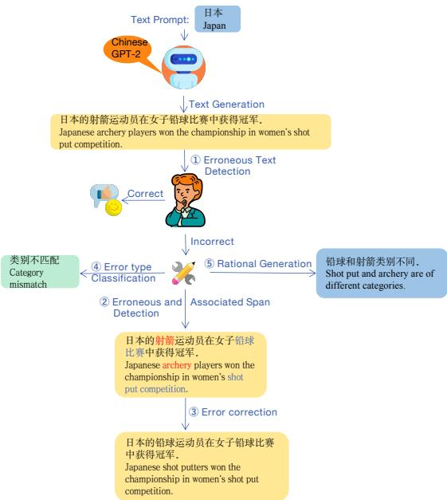
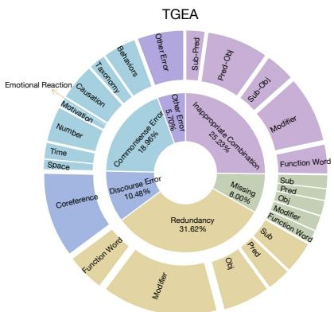

# TGEA: An Error-Annotated Dataset and Benchmark Tasks for Text Generation from Pretrained Language Models

Jie $\mathbf { H e ^ { 1 * } }$ , $\mathbf { B o \ P e n g ^ { 2 * } }$ , Yi Liao2, $\mathbf { Q u n L i u } ^ { 2 }$ , and Deyi Xiong1 1College of Intelligence and Computing, Tianjin University, Tianjin, China 2Huawei Noah’s Ark Lab, Hong Kong, China {jieh, dyxiong}@tju.edu.cn {peng.bo2, liaoyi9, qun.liu}@huawei.com

# Abstract

# 1 Introduction

In order to deeply understand the capability of pretrained language models in text generation and conduct a diagnostic evaluation, we propose TGEA1, an error-annotated dataset with multiple benchmark tasks for text generation from pretrained language models (PLMs). We use carefully selected prompt words to guide GPT-2 to generate candidate sentences, from which we select 47K for error annotation. Crowdsourced workers manually check each of these sentences and detect $1 2 \mathrm { k }$ erroneous sentences. We create an error taxonomy to cover 24 types of errors occurring in these erroneous sentences according to the nature of errors with respect to linguistics and knowledge (e.g., common sense). For each erroneous span in PLM-generated sentences, we also detect another span that is closely associated with it. Each error is hence manually labeled with comprehensive annotations, including the span of the error, the associated span, minimal correction to the error, the type of the error, and rationale behind the error. Apart from the fully annotated dataset, we also present a detailed description of the data collection procedure, statistics and analysis of the dataset. This is the first dataset with comprehensive annotations for PLM-generated texts, which facilitates the diagnostic evaluation of PLM-based text generation. Furthermore, we use TGEA as a benchmark dataset and propose a series of automatic diagnosis tasks, including error detection, error type classification, associated span detection, error rationale generation, to further promote future study on the automatic error detection and correction on texts generated by pretrained language models.

Pretrained language models (Devlin et al., 2019; Liu et al., 2019; Raffel et al., 2020; Brown et al., 2020), which are trained on a huge amount of data via self-supervised learning, have made remarkable progress on both natural language understanding (NLU) (Wang et al., 2018, 2019; Long and Webber, 2022; Long et al., 2024) and natural language generation (NLG) (Liu and Lapata, 2019; Weng et al., 2020; Cao et al., 2020).

On several NLU datasets, PLM-based neural models have gradually achieved human-level performance in terms of automatic evaluation metrics (e.g., accuracy, $\mathrm { F _ { 1 } }$ ) (He et al., 2020; Zhang et al., 2021). In order to deeply understand and analyze the capability of PLMs on NLU, a variety of more challenging NLU datasets have been proposed (Warstadt et al., 2020; Cui et al., 2020a; Jain et al., 2020; Talmor et al., 2020; Long et al., 2020a,b). These datasets can be used not only to obtain knowledge on how PLM-based models work and what they learn, but also to define new NLU tasks and to serve as a benchmark for future progress. For example, evaluating and analyzing PLM-based models on learning document structures with a carefully created benchmark test suite (Chen et al., 2019; He et al., 2022), helps to develop new methods to enhance the capability of these models on discourse modeling (Iter et al., 2020; Long and Webber, 2024). Knowing the weakness of current PLM-based models in commonsense reasoning (Zhou et al., 2020) has inspired people to develop various reasoning datasets (Cui et al., 2020a; Zhang et al., 2020b).

On the other hand, state-of-the-art PLMs are able to generate texts that are even not distinguishable from human-written texts by human evaluators (Radford et al., 2019; Brown et al., 2020). This makes us curious about the capability of PLMs on text generation. Are they really reaching humanlevel performance on text generation? In contrast to the studies of PLMs on NLU, research on the capability of PLMs on NLG is quite limited, especially in dataset building and diagnostic evaluation of text generation errors.

In this paper, in order to recognize the perimeter of text generation capability of PLMs, we propose TGEA, an error-annotated dataset with multiple benchmark tasks for text generation from pretrained language models. The original raw data are collected from texts generated by a Chinese GPT-2 model. The entire data collection and annotation procedure is visualized in Figure 1. The goals and contributions of building TGEA are as follows.

• TGEA, to the best of our knowledge, is the first dataset built on machine-generated texts from state-of-the-art pretrained language models with rich annotations. The key interest of this dataset is detecting and annotating text generation errors from PLMs. Therefore it is different from conventional text generation datasets (e.g., Multi-News (Fabbri et al., 2019), TextCaps (Sidorov et al., 2020)) that are constructed to train models to learn text generation (e.g., generating texts from images or long documents). It is also different from grammatical error correction (GEC) datasets (Zhao et al., 2018; Flachs et al., 2020) that are built from human-written texts usually by second language learners.

• TGEA provides rich semantic information for text generation errors, including error types, associated text spans, error corrections and rationals behind errors, as shown in Figure 1. Marking text spans that are closely related to erroneous words allows us to detect longdistance dependencies of errors or reasoning chains related to errors. Rationales behind errors directly explain why errors are annotated. All these error-centered manual annotations not only increase the interpretability of our dataset, but also facilitate a comprehensive diagnostic evaluation of pretrained language models on text generation.

• We created an error taxonomy for TGEA, which covers 24 error types in a two-level hierarchy. With this error taxonomy, we not only obtain a high agreement on manual error annotation but also recognize the strengths and weaknesses of GPT-2 on text generation by estimating a distribution over these 24 error types. Comparing our dataset with GEC datasets, we find that humans and GPT-2 have a very different error distribution, especially on errors related to commonsense reasoning.

  
Figure 1: The different stages of the annotation process for each machine-generated text according to the prompt in TGEA. Better viewed in color.

• TGEA not only exhibits text generation errors from pretrained language models, but also can serve as a dataset to train various models to automatically detect and correct these errors, like GEC datasets for training models to automatically correct human errors. We define 5 benchmark tasks over our dataset, i.e., erroneous sentence detection, erroneous span and associated span detection, error type classification, error correction and error rationale generation. For all these tasks, we provide experimental results using state-of-the-art models as baselines.

# 2 Related Work

Our work is related to GEC datasets in error annotation and correction (machine vs. human errors). It is also partially related to commonsense reasoning datasets that have been proposed recently in that our dataset includes commonsense reasoning errors and rationales behind these errors. Our dataset is not related to conventional text generation datasets (Vougiouklis et al., 2017; Wiseman et al., 2017;

Table 1: Comparison between our dataset and other datasets.   

<table><tr><td>Dataset</td><td>Task</td><td>Commonsense Reasoning</td><td>Rationales</td><td>Machine-Generated Texts</td><td>Domain</td><td>#Sentences</td><td>Language</td></tr><tr><td>FCE</td><td>GEC</td><td>×</td><td>×</td><td>×</td><td>Essay</td><td>34K</td><td>EN</td></tr><tr><td>AESW</td><td>GEC</td><td>x</td><td>×</td><td>x</td><td>Journal articles</td><td>1.2M</td><td>EN</td></tr><tr><td>JFLEG</td><td>GEC</td><td>x</td><td>×</td><td>x</td><td>TOFEL Exam</td><td>1,511</td><td>EN</td></tr><tr><td>CMEG</td><td>GEC</td><td>×</td><td>x</td><td>×</td><td>Web doc/Essay</td><td>8K</td><td>EN</td></tr><tr><td>CWEB</td><td>GEC</td><td>×</td><td>×</td><td>×</td><td>Web doc</td><td>13K</td><td>EN</td></tr><tr><td>CGEC</td><td>GEC</td><td>×</td><td>x</td><td>×</td><td>Essay</td><td>0.71M</td><td>ZH</td></tr><tr><td>WSC</td><td>Coreference Resolution</td><td>✓</td><td>×</td><td>×</td><td>Open</td><td>273</td><td>EN</td></tr><tr><td>HellaSwag</td><td>Plausible Inference</td><td></td><td>×</td><td>X</td><td>WikiHow articles</td><td>70K</td><td>EN</td></tr><tr><td>Social IQA</td><td>Question Answering</td><td></td><td>×</td><td>x</td><td>Social situations</td><td>38K</td><td>EN</td></tr><tr><td>CosmosQA</td><td>Reading comprehension</td><td></td><td>x</td><td>×</td><td>Narratives</td><td>35K</td><td>EN</td></tr><tr><td>PIQA</td><td>Plausible Inference</td><td></td><td>x</td><td>x</td><td>Physical situations</td><td>21K</td><td>EN</td></tr><tr><td>Abductive NLI</td><td>Plausible Inference</td><td></td><td>x</td><td>x</td><td>ROCStories</td><td>200K</td><td>EN</td></tr><tr><td>WinoWhy</td><td>Reason Explanation</td><td>V</td><td>✓</td><td>x</td><td>Open</td><td>2,865</td><td>EN</td></tr><tr><td>TGEA (ours)</td><td>Multiple tasks</td><td>x</td><td>✓</td><td>✓</td><td>Open</td><td>47K</td><td>ZH</td></tr></table>

Parikh et al., 2020) for training text generation models. A comprehensive comparison to GEC datasets and commonsense reasoning datasets is shown in Table 1.

# 2.1 Grammatical Error Correction Datasets

FCE (Yannakoudakis et al., 2011) is an early largescale English grammatical error correction dataset, where raw texts are produced by English learners taking the First Certificate in English exams. AESW (Daudaravicius et al., 2016) is a GEC dataset from a professional editing company. In addition to common grammatical errors, AESW covers style issues as it contains texts mainly from scholarly papers. JFLEG (Napoles et al., 2017) is a GEC dataset built from TOFEL Exams, which does not force annotators to make minimal edits, preferring holistic fluency rewrites. CMEG (Napoles et al., 2019) is different from general grammatical error correction datasets with texts from second language learners. It uses articles or blogs (e.g., Wiki, Yahoo)) written by native English speakers to explore grammatical error phenomena in different domains. CWEB (Flachs et al., 2020) also uses website texts in English, such as blogs. The difference between CWEB and CMEG is that the percentage of erroneous tokens in the former is smaller than the latter as the purpose of CWEB is to study grammatical error correction in low error density domains. CGEC (Zhao et al., 2018) is a large-scale Chinese grammatical error correction dataset, derived from wrong sentences written by Chinese learners in the process of learning Chinese as a second language.

In addition to the difference in text sources (i.e., human-written vs. machine-generated), other significant differences between our dataset and existing GEC datasets are that our dataset contains commonsense reasoning errors and provides associated text span annotations and rationales for errors, as shown in Table 1.

# 2.2 Commonsense Datasets

A variety of commonsense datasets have been proposed. Roemmele et al. (2011) introduce COPA that focuses on commonsense causal reasoning. Levesque et al. (2012) present Winograd Scheme Challenge (WSC), a dataset testing commonsense reasoning in the form of anaphora resolution. Winogrande, a larger version of WSC, is introduced by Sakaguchi et al. (2020), which contains $\sim 4 4 , 0 0 0$ examples. Winowhy (Zhang et al., 2020a) asks annotators to provide reasons for their decisions to WSC. In this aspect, the differences of our dataset from Winowhy are twofold. First, we provide reasons for errors rather than correct decisions to anaphora. Second, we provide reasons for all text generation errors, rather than only errors related to commonsense reasoning.

In addition to COPA and WSC-style datasets, many large crowdsourced datasets have been also proposed recently. CommonsenseQA (Talmor et al., 2019), a commonsense question answering dataset, has been constructed from ConceptNet. HellaSwag (Zellers et al., 2019b) and Abductive NLI (Bhagavatula et al., 2020) evaluate commonsense reasoning in the form of natural language inference. CosmosQA (Huang et al., 2019) is a dataset with multi-choice questions that require commonsense reading comprehension.

Beyond datasets for evaluating commonsense reasoning, there are other datasets providing commonsense knowledge. PIQA (Bisk et al., 2020) focuses on physical commonsense knowledge while SocialIQA (Sap et al., 2019) on social commonsense knowledge.

Commonsense datasets in multiple languages or languages other than English have also been created recently. XCOPA (Ponti et al., 2020) is a multilingual dataset for causal commonsense reasoning in 11 typologically different languages. Chinese commonsense datasets, such as Mandarinograd (Bernard and Han, 2020) consisting of 154 Chinese Winograd scheme examples and CLUEWSC2020 (Xu et al., 2020) containing 1838 Winograd scheme examples, have been proposed.

Table 2: Examples of level-1 error types in TGEA. Underwaved words are erroneous words while underlined words are associated words. Words in “[]” are corrections to erroneous words.   

<table><tr><td rowspan=1 colspan=1>Level-1 Error Type</td><td rowspan=1 colspan=1>Example</td></tr><tr><td rowspan=1 colspan=1>Inappropriate combination</td><td rowspan=1 colspan=1>The doctor removed Liu Li&#x27;s surgery [tumor] and suggested that the patient be hospitalizedfor observation.</td></tr><tr><td rowspan=1 colspan=1>Missing</td><td rowspan=1 colspan=1>[Here, many journalists and tourists are taking part in_ [activities].</td></tr><tr><td rowspan=1 colspan=1>Redundancy</td><td rowspan=1 colspan=1>10%Some enterprises have reduced staff and increased efficiency[] increased efficiency, makingtheir profits increase by more than 10%.</td></tr><tr><td rowspan=1 colspan=1>Discourse Error</td><td rowspan=1 colspan=1>He said that he likes the country roads in Anyang best, and it is the most beautifulmountain [road].</td></tr><tr><td rowspan=1 colspan=1>Commonsense Error</td><td rowspan=1 colspan=1>In the international market, the higher [lower] the credit rating, the less reassuredinvestors are.</td></tr></table>

In the aspect of commonsense reasoning, our dataset is different from the mentioned commonsense datasets in that we detect and annotate errors in machine-generated texts, which violates common sense, rather than creating examples to examine the commonsense reasoning ability of machines.

# 3 Dataset Creation

# 3.1 Error Taxonomy

Before crowdsourced workers manually annotate errors in machine-generated texts, we need to create an error taxonomy for such error coding. Three principles are used to guide the design of the error taxonomy: coverage, exclusiveness and easiness. The coverage rule requires that the error system can cover almost all different types of errors in machine-generated texts. The exclusiveness requirement indicates that each error type is not overlapping with other error types in the taxonomy. The final easiness principle means that the error coding system is easy to be used by annotators. With these three principles and aid from a linguist, we created an error taxonomy in a two-level hierarchy, which was revised in our pre-annotation stage.

The first level of the error taxonomy includes 5 error types.

• Inappropriate combination. This type of errors suggests that two words/phrases are syntactically or lexically inappropriately combined in a sentence. Such errors include not only lexical collocation errors but also longdistance syntactic constituency combination errors (e.g., inappropriate subject-object combination). This error type is similar to “replacing” error in some GEC datasets (e.g., CWEB (Flachs et al., 2020)) as one element of an inappropriate combination should be usually replaced with other expressions. As we want to find text spans associated with erroneous words/phrases, we term this error type as “inappropriate combination”. We further divide this error type into five subtypes at the second level.

• Missing. Grammatical constituencies or words are missing. 5 subtypes are defined under this error type.

• Redundancy. Words or phrases are unnecessary. 5 subtypes are also defined.

• Discourse Error. This error type is defined for inter-sentential cohesion/coherence errors (e.g., coreference errors, incorrect discourse connectives).

• Commonsense Error. This error code is for errors related to commonsense reasoning. We divide this error type into 8 subtypes according to the type of commonsense knowledge type required (e.g., time, spatial, number).

All other errors that cannot be categorized into the aforementioned error types are grouped into “Other”. Table 2 displays examples for the above defined error types. 24 error subtypes are displayed in Figure 2 and examples of these subtypes are shown in Appendix.

# 3.2 Machine-Generated Text Collection

Raw texts in our dataset are collected from a pretrained Chinese GPT-2 (NEZHA-Gen)2, which generates texts according to a system prompt. NEZHAGen has 12 layers and 12 attention heads and is trained on Chinese Wikipedia and news data (see Appendix for more details on the hyperparameters of NEZHA-Gen). As it is easy for NEZHA-Gen to generate high-quality texts with high-frequency prompt words, we create a list of prompt words according to their frequency to guarantee that there are sufficient erroneous sentences in collected raw texts. By doing so, we have found that GPT has a better chance to generate wrong sentences with such prompts. Specifically, we have randomly sampled 2M sentences from the data used to train NEZHA-Gen. The sampled sentences are then word-segmented and POS-tagged by Baidu LAC $\mathrm { \ t o o l } ^ { 3 }$ (Jiao et al., 2018). We then select and sort nouns in a descending order according to their frequencies in the sampled corpus. Nouns ranking in the range of top $[ 4 0 \% , 6 0 \% ]$ are selected as prompts.

We further filter out noisy texts from texts generated with these selected prompts. Noisy texts are either texts containing no more than 15 characters or texts where Chinese characters account for less $70 \%$ of all characters.

# 3.3 Error Annotation

There are 5 stages in error annotation, as shown in Figure 1. We introduce each of them in this subsection.

(1) Erroneous text detection. Texts generated by NEZHA-Gen with prompt words are present to annotators one by one. The first stage of annotation is hence to detect erroneous texts for subsequent annotations. Corresponding tags are annotated for texts being manually checked.

(2) Erroneous and associated span detection. The next task for annotators is to detect erroneous and associated text spans in detected erroneous texts. For erroneous span detection, as a text may contain several spans that can be edited or the text can be corrected in different ways, which span should be regarded as erroneous is closely related to the way that we correct the text. Therefore, the basic principle that guides the annotation of erroneous spans is also the rule that we use for error correction: making minimal edits, which is also used in GEC datasets (Flachs et al., 2020; Napoles et al., 2017). In addition to the minimal edit principle, we also provide the following specific rules for annotators:

• If annotators feel that a text is ambiguous and that it is difficult to correct the text, the text can be discarded without any further annotations.   
• If there are several spans that can be edited, the first erroneous span is preferred to be edited.   
• If the number of errors to be corrected in a text is larger than 4, the text is removed.

Following these rules, annotators have removed 4,291 texts, which account for only $8 . 3 6 \%$ of all detected erroneous texts in the first stage.

In addition to erroneous span annotation, unlike GEC datasets (Daudaravicius et al., 2016; Zhao et al., 2018), we also detect a text span that is closely related to the already detected erroneous span with respect to the error, and term this span as “associated span”. In Table 2, we show examples with annotated erroneous and associated text spans. For an inappropriate combination, the associated span is usually a span that should not co-occur with the erroneous span.

(3) Error correction. After detecting erroneous spans in a given text, annotators are required to make corrections following the minimal edit principle. Annotators are also required to use common words for error correction to make the corrected text as fluent as possible.

(4) Error type classification. Once annotators detect both erroneous and associated spans as well as provide corrections, they are becoming quite aware of these errors. Hence, we now ask them to categorize the annotated errors into error types defined in our error taxonomy. First, they select the primary type from the level-1 error types. Then, if there are level-2 error subtypes, annotators continue to select a subtype. We observe that errors annotated with “other” only account for $5 . 7 0 \%$ , suggesting that our error taxonomy has good coverage.

Table 3: Inter-annotator agreement results.   

<table><tr><td>Task</td><td>IAA (%)</td><td>Kappa (%)</td></tr><tr><td>Erroneous text detection</td><td>87.5</td><td>62.1</td></tr><tr><td>Erroneous and associated span detection</td><td>51.2</td><td></td></tr><tr><td>Error type classification</td><td>73.3</td><td>55.7</td></tr></table>

(5) Rationale generation. Partially inspired by previous datasets that provide explanations together with corresponding annotations, e.g., e-SNLI (Camburu et al., 2018), Winowhy (Zhang et al., 2020a) and R4C (Inoue et al., 2020), we ask annotators to give a reason for each error to justify their annotations. To the best of our knowledge, no GEC datasets provide explanations for error corrections. We believe that annotated rationales can be used to improve the interpretability of neural models trained on our dataset.

# 3.4 Annotation Quality Control

In order to ensure the quality of error annotations, we have adopted a very strict quality control protocol during annotation. First, we train two reviewers with 1K machine-generated texts. The annotation consistency of the two reviewers on the 1K texts is very high, with an average IAA of $9 2 . 3 \%$ and Cohen’s Kappa (McHugh, 2012) of $8 2 . 6 \%$ across the annotation tasks (1), (2) and (4). For the texts annotated by the two reviewers, we have conducted an evaluation. The average accuracy of all tasks is $9 6 . 3 \%$ and $9 7 . 4 \%$ respectively.

Second, 200 candidate workers participate in a pre-annotation stage. The two reviewers will review annotations from these participants to distinguish whether the annotation is correct or not. Only participants who have reached an accuracy of ${ > } 9 0 \%$ in every tasks can join in the next stage. As a result, 20 participants have passed the training in the pre-annotation stage. We then divide them into two groups and ask them to annotate the same 500 texts. The inter-annotator IAA and Cohen’s Kappa are shown in Table 3, which suggests that the 20 annotators are ready for final annotation.

Third, in order to further ensure annotation quality, we have carried out iterative verification and amendment. The two reviewers will review each annotated text. If they found the annotation is wrong, the unqualified data will be returned for amendment until they are qualified.

Following this strict quality control protocol, we complete the annotation on 47K selected machinegenerated texts. We randomly sample 1K annotated texts. The average accuracy over the three tasks (i.e., (1), (2) and (4)) is $8 9 . 6 \%$ , $8 8 . 5 \%$ , $8 4 . 3 \%$ respectively.

Table 4: Data statistics of TGEA. Avg.t.err/Avg.t.assoc: the average number of tokens in erroneous/associated text spans. Avg.t.rationale: the average number of tokens in rationales. Avg.d.e-a: the average distance between a erroneous span and its associated span.   

<table><tr><td></td><td>Train</td><td>Dev</td><td>Test</td><td>All</td></tr><tr><td>#text</td><td>37,646</td><td>4,706</td><td>4,706</td><td>47,058</td></tr><tr><td>w/ 0 error</td><td>27,906</td><td>3,488</td><td>3,488</td><td>34,882</td></tr><tr><td>w/ 1 error</td><td>8,413</td><td>1,055</td><td>1,052</td><td>10,520</td></tr><tr><td>w/ 2 error</td><td>1,169</td><td>141</td><td>149</td><td>1,459</td></tr><tr><td>w/ 3 error</td><td>141</td><td>18</td><td>15</td><td>174</td></tr><tr><td>w/ 4 error</td><td>17</td><td>4</td><td>2</td><td>23</td></tr><tr><td>Tokens</td><td>966,765</td><td>120,889</td><td>121,065</td><td>1,208,719</td></tr><tr><td>Vocab</td><td>44,598</td><td>16,899</td><td>16,745</td><td>48,547</td></tr><tr><td>Avg. tokens</td><td>25.68</td><td>25.69</td><td>25.73</td><td>25.68</td></tr><tr><td>Avg. t.err</td><td>2.92</td><td>3.09</td><td>2.95</td><td>2.94</td></tr><tr><td>Avg. t.assoc</td><td>4.30</td><td>4.39</td><td>3.89</td><td>4.27</td></tr><tr><td>Avg. d.e-a</td><td>6.99</td><td>7.29</td><td>7.10</td><td>7.03</td></tr><tr><td>Avg. t.rationale</td><td>8.74</td><td>8.72</td><td>8.75</td><td>8.74</td></tr></table>

# 4 Dataset Analysis

# 4.1 Dataset Statistics

Overall statistics. We reshuffle all annotated texts and divide them into the training/dev/test sets with a proportion of 8:1:1. As shown in Table 4, the training set contains 27,096 correct texts and 9,740 erroneous texts. Both the development and test set contain 4,706 texts, among which 1,218 texts are erroneous. Not surprisingly, most erroneous texts contain only one error.

After Chinese word segmentation via Jieba4, there are 1,208,719 tokens in total. On average, there are 25.68 tokens in each text.

Annotation statistics. As shown in Table 4, each erroneous text span contains 2.94 tokens while each associated span is composed of 4.27 tokens. The average distance from an erroneous text span to its associated span is 7.03 tokens, which is about 1/3 of the average text length.

# 4.2 Error Type Distribution

We further show the percentages of both level-1 and level-2 error types in Figure 2. We observe that only $5 . 7 \%$ cases cannot be categorized into our defined error types. The inappropriate combination, missing and redundancy error, which are the main error types in GEC datasets, account for $6 4 . 8 5 \%$ in our dataset. In addition to these errors, we see $1 8 . 9 6 \%$ commonsense errors and $1 0 . 4 8 \%$ discourse errors, which are usually not very common in GEC datasets. However, these two types of errors with high percentages in our dataset suggest that pretrained language models can be further improved on both commonsense reasoning and discourse modeling.

  
Figure 2: Distribution over the level-1 and level-2 error types in TGEA.

# 5 TGEA as a Benchmark

We use our dataset as a benchmark and propose 5 tasks that are defined for errors in texts generated by PLMs. We provide baseline results for these tasks in this section.

We employ three BERT-style Chinese PLMs as baselines in our experiments, namely BERT-wwmext, RoBERTa-wwm-ext-large developed by Cui et al. (2020b) 5 and ALBERT-Chinese-large6. For notational simiplicity, we denote them as $\mathrm { B E R T _ { z h } }$ , $\mathrm { R o B E R T a _ { z h } }$ and $\mathrm { A L B E R T _ { z h } }$ respectively. Please refer to the Appendix for the model hyperparameter settings of each task.

# 5.1 Erroneous Text Detection

Task definition. This is a text classification task to judge whether a given text is erroneous. In order to avoid data imbalance, we use the same number of correct and erroneous texts for training.

Model. The three Chinese PLMs are used with standard text-classification fine-tuning.

Results. All models perform just ${< } 1 4 \%$ better than chance (random guessing), as shown in Table 5. We also provide human performance on this task. The best model $\mathrm { R o B E R T a _ { z h } }$ is worse than human performance by 26 points. This suggests that automatically detecting erroneous texts generated by pretrained language models is very challenging even in the balanced classification scenario.

# 5.2 Erroneous Span and Associated Span Detection

Task definition. We define the detection of the two types of spans as a joint task as they are closely related to each other. The joint task is similar to named entity recognition (NER) (a sequence labeling task) and it requires to recognize the erroneous and associated text spans simultaneously. NERstyle word-level tags are hence annotated for each erroneous text.

Model. The three Chinese PLMs with NER-like fine-tuning are evaluated for this task. Since this is a 3-class token classification task, we report class$\mathrm { F _ { 1 } }$ on erroneous and associated span. The class$\mathrm { F _ { 1 } }$ on class $X$ is calculated like a normal $\mathrm { F _ { 1 } }$ for a binary classification task, by treating the target class $X$ as the positive class and all other classes as negative.

Results. As shown in Table 5, all models are very poor in this task, indicating the difficulty of automatically detecting erroneous and associated spans. However, we have found that models can benefit much from the joint detection over the detection of a single type of span (either erroneous or associated span). Our preliminary experiments on the detection of only erroneous span show that the best model can only achieve $2 6 . 4 2 \%$ erroneous class- $\cdot \mathrm { F } _ { 1 }$ on the test set, while the joint task achieves $2 7 . 6 6 \%$ erroneous class- $\cdot \mathrm { F } _ { 1 }$ on the test set.

# 5.3 Error Type Classification

Task definition. Again this is a text classification task. We only perform classification over level-1 error types in the form of 5-way classification.

Model. We use models similar to the first task.

Results. The overall accuracy and Macro- $\cdot \mathrm { F } _ { 1 }$ (shown in Table 5) are very low. However, we find some error types are easier than others. The accuracy on the classification of redundancy errors is $5 3 . 9 1 \%$ , the highest among all error types.

# 5.4 Error Correction

Task definition. This task is the same as GEC, which transforms an erroneous text into a correct sequence.

Model. we use the state-of-the-art BERT-GEC model (Kaneko et al., 2020) as the baseline for this task, which is an encoder-decoder model using representations learned by PLMs as additional inputs. Following Wang et al. (2020)，we feed representations learned by $\mathrm { B E R T _ { z h } }$ and $\mathrm { R o B E R T a _ { z h } }$ into

Table 5: Performance of benchmark models on the development and test set.   

<table><tr><td>Task</td><td>Model</td><td colspan="2">Dev</td><td colspan="2">Test</td></tr><tr><td rowspan="9">Erroneous</td><td></td><td colspan="2">Accuracy (%)</td><td colspan="2">Accuracy (%)</td></tr><tr><td>Random</td><td>50.00</td><td></td><td colspan="2">50.00</td></tr><tr><td>ALBERTzh BERTzh</td><td colspan="2">63.59</td><td colspan="2">63.30</td></tr><tr><td></td><td colspan="2">65.15</td><td colspan="2">64.94</td></tr><tr><td>RoBERTazh Human</td><td colspan="2">66.67</td><td colspan="2">66.79</td></tr><tr><td></td><td colspan="2">92.35</td><td colspan="2">93.57</td></tr><tr><td></td><td>Erroneous class-F1 (%)</td><td>Associated class-F1 (%)</td><td>Erroneous class-F1 (%)</td><td>Associated class-F1 (%)</td></tr><tr><td>Random</td><td>01.71</td><td>04.23</td><td>01.74</td><td>04.22</td></tr><tr><td>ALBERTzh</td><td>27.36</td><td>27.44</td><td>28.10</td><td>26.24</td></tr><tr><td>BERTzh RoBERTazh</td><td>27.85</td><td>26.93 27.08</td><td>27.66</td><td>25.30 27.12</td></tr><tr><td></td><td colspan="2">28.17 Accuracy (%)</td><td colspan="2">27.75</td></tr><tr><td rowspan="5">Error type classification</td><td></td><td colspan="2"></td><td colspan="2">Accuracy (%)</td></tr><tr><td>Random</td><td>24.25</td><td>20.00</td><td>24.25</td><td>20.00</td></tr><tr><td>ALBERTzh</td><td>34.76</td><td>21.04</td><td>34.38</td><td>20.56</td></tr><tr><td>BERTzh RoBERTazh</td><td>44.35</td><td>33.01 36.10</td><td>41.31</td><td>31.05</td></tr><tr><td></td><td>44.44 R (%)</td><td></td><td>44.16</td><td>37.20</td></tr><tr><td rowspan="3">Error correction</td><td></td><td>P (%)</td><td>F0.5 (%)</td><td>P (%)</td><td>R (%)</td><td>F0.5 (%)</td></tr><tr><td>BERTzh-GEC</td><td>0.62 6.49</td><td>0.76</td><td>0.60</td><td>6.30</td><td>0.74</td></tr><tr><td>RoBERTazh-GEC</td><td>0.78 4.07</td><td>0.93 BERT_Score</td><td>0.82 BLEU</td><td>4.15</td><td>0.98 BERT_Score</td></tr><tr><td>Rationale generation</td><td>NEZHA-Gen</td><td>BLEU 0.06%</td><td>Rouge-L 9.17% 56.58%</td><td>0.06%</td><td>Rouge-L 9.02%</td><td>56.17%</td></tr></table>

the BERT-GEC model.

Results. We report precision, recall and $\mathrm { F _ { 0 . 5 } }$ scores using the official Max-Match tool (Dahlmeier and $\mathrm { N g }$ , 2012). As shown in Table 5, the best $\mathrm { R o B E R T a _ { z h - } }$ GEC model achieves a very low $\mathrm { F _ { 0 . 5 } }$ of $0 . 9 3 \%$ and $0 . 9 8 \%$ on the development and test set respectively. We speculate that the reasons for this are twofold. First, comparing with GEC data on human-written texts, our dataset is relatively small. Second, our dataset contains error types that are very different from those in previous GEC datasets (Zhao et al., 2018; Flachs et al., 2020). Punctuation, spelling and other word-characterlevel errors, which are easy to be corrected, are rare in TGEA although they are quite common in GEC datasets. In contrast, TGEA contains more complicated errors that can only be corrected with knowledge of common sense, long-distance or inter-sentential dependencies, etc.

# 5.5 Rationale Generation

Task definition. This is a text generation task that directly generate an explanation with respect to text generation errors from an erroneous text.

Model. We use NEZHA-Gen as the baseline for this task. We restructure annotated texts in our dataset in the form of $\{ T ,$ 这句话错误的原因是：, $R \}$ ( $\{ T ,$ The reason behind the errors in this sentence is:, $R \}$ ), where $T$ is an erroneous sentence, while $R$ is the error rational provided by annotators. We then fine-tune NEZHA-Gen on the reformatted training set and evaluate the fine-tuned model on the reformatted development and test set. We report BLEU (Papineni et al., 2002), Rouge-L (Lin, 2004) and BERT Score (Zhang et al., 2020c).

Results. It can be expected that results in these metrics will be very low due to the high difficulty of this task. We analyze generated texts from the baseline and find that generated rationales are usually much longer than reference rationales provided by human annotators. This could result in the low BLEU score since long hypotheses are penalized in BLEU computation. We also experiment zero-shot generation on the test set. The results are $\{ \mathrm { B L E U } ~ = ~ 0 . 0 4 \%$ , Rouge- $\mathrm { ~ \cal ~ L ~ } =$ $6 . 8 3 \%$ , BERT Score $= 5 4 . 2 7 \% \}$ , indicating that fine-tuning on the annotated training set can improve this task. We suggest that this generation task could be reformulated as a multi-choice question answering task by providing alternative rationales as distractors, similar to VCR (Zellers et al., 2019a). We leave this to our future work.

# 6 Discussion

Since we use machine-generated texts for error annotation, hyperparameters of models (e.g., sampling strategies, model size), model types (e.g., GPT-2, GPT-3 or other PLMs for text generation), and genres of texts used to train PLMs, etc., all have impacts on generated texts and hence on error types and error distribution.

A straightforward way to mitigate this issue is to collect raw texts from multiple models with different hyperparameters, neural architectures and text genres. This will lead to an expanded dataset with a much larger number of instances to be manually annotated, which is expensive and time-consuming. Yet another issue with this is that it may result in a bunch of data due to inconsistency across different models and difficulty in setting the proportion of each data source.

Instead, we focus on consistently annotating errors for texts generated from a single source. In order to make TGEA as general and representative as possible, we use GPT-2 that is not only currently state of the art in text generation but also easily available. We also adopt standard and widely-used hyperparameters (see Appendix for more details) for NEZHA-Gen to generate texts.

Additionally, we use a random sampling strategy with top $k = 3 0$ . For setting $k$ , we have analyzed 500 examples with different values of $k$ , and found that adjusting $k$ has a reasonable impact on the percentage of redundancy errors. Except for the extreme case of $k = 1$ , the types of errors and the distribution of them do not change significantly. Take commonsense errors as an example, which is the biggest difference from human-written texts. When $k$ varies in a range of $\{ 5 , 1 0 , 2 0 , 3 0 , 5 0 \}$ , the percentage of commonsense errors is $1 8 . 6 \% \pm 5 . 8 \%$ Redundancy errors account for ${ > } 9 5 \%$ when $k = 1$ (while commonsense errors account for $0 . 8 \%$ ), but sharply drop to $3 7 . 4 \%$ as $k = 5$ , and the form of repetition changes from same-word repetition to a mixed repetition of “synonymous/same-word”, suggesting that a simple repetition penalty may not be sufficient to deal with semantic redundancy. When $k \in \{ 1 0 , 2 0 , 3 0 , 5 0 \}$ , the percentage of redundancy errors is very close to the result reported in Figure 2. When $k > 3 0$ , many generated sentences are completely incomprehensible. A larger $k$ will also reduce the generation efficiency. Therefore, we chose a sampling strategy of $k = 3 0$ , which is the trade-off between text quality and generation efficiency.

# 7 Conclusions

In this paper, we have presented TGEA, the first dataset with a variety of manual annotations on errors occurring texts generated by pretrained language models. For each erroneous text generated by a Chinese GPT-2 model, our crowdsourced annotators detect erroneous text spans with their associated text spans and provide error types defined in a two-level hierarchical taxonomy as well as rationales behind detected errors. We elaborate the 5 annotation stages for building TGEA with a strict annotation quality control protocol. We also report baseline results of the 5 benchmark tasks on TGEA. The low results suggest that our dataset is a challenging testbed for future work on automatic detection of erroneous spans and types as well as producing error corrections and rationales for texts generated by PLMs. TGEA is featured with wide error type coverage, rich semantic annotation and functional diversity, which can not only be used for deep diagnostic analysis on the text generation capability of pretrained language models, but also facilitate and promote the research of automatic and interpretable error correction for PLM-generated texts.

# Acknowledgments

The present research was supported by Huawei. We would like to thank the anonymous reviewers for their insightful comments. We also want to thank MindSpore7 for the partial suppoort of this work, which is a new deep learning computing framework. The corresponding author is Deyi Xiong (dyxiong $@$ tju.edu.cn).

# References

Timothee Bernard and Ting Han. 2020.´ Mandarinograd: A chinese collection of winograd schemas. In Proceedings of the 12th Language Resources and Evaluation Conference, pages 21–26. European Language Resources Association.

Chandra Bhagavatula, Ronan Le Bras, Chaitanya Malaviya, Keisuke Sakaguchi, Ari Holtzman, Hannah Rashkin, Doug Downey, Scott Wen-tau Yi, and Yejin Choi. 2020. Abductive commonsense reasoning. International Conference on Learning Representations.

Yonatan Bisk, Rowan Zellers, Ronan LeBras, Jianfeng Gao, and Yejin Choi. 2020. PIQA: Reasoning about physical commonsense in natural language. In AAAI, pages 7432–7439.

Tom Brown, Benjamin Mann, Nick Ryder, Melanie Subbiah, Jared D Kaplan, Prafulla Dhariwal, Arvind Neelakantan, Pranav Shyam, Girish Sastry, Amanda

Askell, Sandhini Agarwal, Ariel Herbert-Voss, Gretchen Krueger, Tom Henighan, Rewon Child, Aditya Ramesh, Daniel Ziegler, Jeffrey Wu, Clemens Winter, Chris Hesse, Mark Chen, Eric Sigler, Mateusz Litwin, Scott Gray, Benjamin Chess, Jack Clark, Christopher Berner, Sam McCandlish, Alec Radford, Ilya Sutskever, and Dario Amodei. 2020. Language models are few-shot learners. In Advances in Neural Information Processing Systems, volume 33, pages 1876–1900. Curran Associates, Inc.

Oana-Maria Camburu, Tim Rocktaschel, Thomas¨ Lukasiewicz, and Phil Blunsom. 2018. e-snli: Natural language inference with natural language explanations. In S. Bengio, H. Wallach, H. Larochelle, K. Grauman, N. Cesa-Bianchi, and R. Garnett, editors, Advances in Neural Information Processing Systems 31, pages 9539–9549. Curran Associates, Inc.

Yu Cao, Wei Bi, Meng Fang, and Dacheng Tao. 2020. Pretrained language models for dialogue generation with multiple input sources. In Findings of the Association for Computational Linguistics: EMNLP 2020, pages 909–917, Online. Association for Computational Linguistics.

Mingda Chen, Zewei Chu, and Kevin Gimpel. 2019. Evaluation benchmarks and learning criteria for discourse-aware sentence representations. In Proceedings of the 2019 Conference on Empirical Methods in Natural Language Processing and the 9th International Joint Conference on Natural Language Processing (EMNLP-IJCNLP), pages 649–662, Hong Kong, China. Association for Computational Linguistics.

Leyang Cui, Yu Wu, Shujie Liu, Yue Zhang, and Ming Zhou. 2020a. MuTual: A dataset for multi-turn dialogue reasoning. In Proceedings of the 58th Annual Meeting of the Association for Computational Linguistics, pages 1406–1416, Online. Association for Computational Linguistics.

Yiming Cui, Wanxiang Che, Ting Liu, Bing Qin, Shijin Wang, and Guoping Hu. 2020b. Revisiting pretrained models for Chinese natural language processing. In Proceedings of the 2020 Conference on Empirical Methods in Natural Language Processing: Findings, pages 657–668, Online. Association for Computational Linguistics.

Daniel Dahlmeier and Hwee Tou Ng. 2012. Better evaluation for grammatical error correction. In Proceedings of the 2012 Conference of the North American Chapter of the Association for Computational Linguistics: Human Language Technologies, pages 568–572, Montreal, Canada. Association for Compu- ´ tational Linguistics.

Vidas Daudaravicius, Rafael E. Banchs, Elena Volodina, and Courtney Napoles. 2016. A report on the automatic evaluation of scientific writing shared task. In Proceedings of the 11th Workshop on Innovative

Use of NLP for Building Educational Applications, pages 53–62, San Diego, CA. Association for Computational Linguistics.

Jacob Devlin, Ming-Wei Chang, Kenton Lee, and Kristina Toutanova. 2019. BERT: Pre-training of deep bidirectional transformers for language understanding. In Proceedings of the 2019 Conference of the North American Chapter of the Association for Computational Linguistics: Human Language Technologies, Volume 1 (Long and Short Papers), pages 4171–4186, Minneapolis, Minnesota. Association for Computational Linguistics.

Alexander Fabbri, Irene Li, Tianwei She, Suyi Li, and Dragomir Radev. 2019. Multi-news: A large-scale multi-document summarization dataset and abstractive hierarchical model. In Proceedings of the 57th Annual Meeting of the Association for Computational Linguistics, pages 1074–1084, Florence, Italy. Association for Computational Linguistics.

Simon Flachs, Ophelie Lacroix, Helen Yannakoudakis,´ Marek Rei, and Anders Søgaard. 2020. Grammatical error correction in low error density domains: A new benchmark and analyses. In Proceedings of the 2020 Conference on Empirical Methods in Natural Language Processing (EMNLP), pages 8467–8478, Online. Association for Computational Linguistics.

Jie He, Wanqiu Long, and Deyi Xiong. 2022. Evaluating discourse cohesion in pre-trained language models. In Proceedings of the 3rd Workshop on Computational Approaches to Discourse, pages 28–34, Gyeongju, Republic of Korea and Online. International Conference on Computational Linguistics.

Pengcheng He, Xiaodong Liu, Jianfeng Gao, and Weizhu Chen. 2020. Deberta: Decoding-enhanced bert with disentangled attention.

Lifu Huang, Ronan Le Bras, Chandra Bhagavatula, and Yejin Choi. 2019. Cosmos QA: Machine reading comprehension with contextual commonsense reasoning. In Proceedings of the 2019 Conference on Empirical Methods in Natural Language Processing and the 9th International Joint Conference on Natural Language Processing (EMNLP-IJCNLP), pages 2391–2401, Hong Kong, China. Association for Computational Linguistics.

Naoya Inoue, Pontus Stenetorp, and Kentaro Inui. 2020. R4C: A benchmark for evaluating RC systems to get the right answer for the right reason. In Proceedings of the 58th Annual Meeting of the Association for Computational Linguistics, pages 6740–6750, Online. Association for Computational Linguistics.

Dan Iter, Kelvin Guu, Larry Lansing, and Dan Jurafsky. 2020. Pretraining with contrastive sentence objectives improves discourse performance of language models. In Proceedings of the 58th Annual Meeting of the Association for Computational Linguistics, pages 4859–4870, Online. Association for Computational Linguistics.

Sarthak Jain, Madeleine van Zuylen, Hannaneh Hajishirzi, and Iz Beltagy. 2020. SciREX: A challenge dataset for document-level information extraction. In Proceedings of the 58th Annual Meeting of the Association for Computational Linguistics, pages 7506– 7516, Online. Association for Computational Linguistics.

Zhenyu Jiao, Shuqi Sun, and Ke Sun. 2018. Chinese lexical analysis with deep bi-gru-crf network. arXiv preprint arXiv:1807.01882.

Masahiro Kaneko, Masato Mita, Shun Kiyono, Jun Suzuki, and Kentaro Inui. 2020. Encoder-decoder models can benefit from pre-trained masked language models in grammatical error correction. In Proceedings of the 58th Annual Meeting of the Association for Computational Linguistics, pages 4248–4254, Online. Association for Computational Linguistics.

Hector J. Levesque, Ernest Davis, and Leora Morgenstern. 2012. The winograd schema challenge. In Proceedings of the Thirteenth International Conference on Principles of Knowledge Representation and Reasoning, KR’12, page 552–561. AAAI Press.

Chin-Yew Lin. 2004. Rouge: A package for automatic evaluation of summaries. In Text summarization branches out, pages 74–81.

Yang Liu and Mirella Lapata. 2019. Text summarization with pretrained encoders. In Proceedings of the 2019 Conference on Empirical Methods in Natural Language Processing and the 9th International Joint Conference on Natural Language Processing (EMNLP-IJCNLP), pages 3730–3740, Hong Kong, China. Association for Computational Linguistics.

Yinhan Liu, Myle Ott, Naman Goyal, Jingfei Du, Mandar Joshi, Danqi Chen, Omer Levy, Mike Lewis, Luke Zettlemoyer, and Veselin Stoyanov. 2019. Roberta: A robustly optimized BERT pretraining approach. CoRR, abs/1907.11692.

Wanqiu Long, Xinyi Cai, James Reid, Bonnie Webber, and Deyi Xiong. 2020a. Shallow discourse annotation for Chinese TED talks. In Proceedings of the Twelfth Language Resources and Evaluation Conference, pages 1025–1032, Marseille, France. European Language Resources Association.

Wanqiu Long, Siddharth N, and Bonnie Webber. 2024. Multi-label classification for implicit discourse relation recognition. In Findings of the Association for Computational Linguistics: ACL 2024, pages 8437– 8451, Bangkok, Thailand. Association for Computational Linguistics.

Wanqiu Long and Bonnie Webber. 2022. Facilitating contrastive learning of discourse relational senses by exploiting the hierarchy of sense relations. In Proceedings of the 2022 Conference on Empirical Methods in Natural Language Processing, pages 10704– 10716, Abu Dhabi, United Arab Emirates. Association for Computational Linguistics.

Wanqiu Long and Bonnie Webber. 2024. Leveraging hierarchical prototypes as the verbalizer for implicit discourse relation recognition.

Wanqiu Long, Bonnie Webber, and Deyi Xiong. 2020b. TED-CDB: A large-scale Chinese discourse relation dataset on TED talks. In Proceedings of the 2020 Conference on Empirical Methods in Natural Language Processing (EMNLP), pages 2793–2803, Online. Association for Computational Linguistics.

Mary McHugh. 2012. Interrater reliability: The kappa statistic. Biochemia medica : casopis Hrvatskogaˇ drustva medicinskih biokemi ˇ cara / HDMB ˇ , 22:276– 82.

Courtney Napoles, Maria Nadejde, and Joel Tetreault. 2019. Enabling robust grammatical error correction in new domains: Datasets, metrics, and analyses. Transactions of the Association for Computational Linguistics, 7(0):551–566.

Courtney Napoles, Keisuke Sakaguchi, and Joel Tetreault. 2017. JFLEG: A fluency corpus and benchmark for grammatical error correction. In Proceedings of the 15th Conference of the European Chapter of the Association for Computational Linguistics: Volume 2, Short Papers, pages 229–234, Valencia, Spain. Association for Computational Linguistics.

Kishore Papineni, Salim Roukos, Todd Ward, and WeiJing Zhu. 2002. Bleu: a method for automatic evaluation of machine translation. In Proceedings of the 40th annual meeting of the Association for Computational Linguistics, pages 311–318.

Ankur Parikh, Xuezhi Wang, Sebastian Gehrmann, Manaal Faruqui, Bhuwan Dhingra, Diyi Yang, and Dipanjan Das. 2020. ToTTo: A controlled table-to-text generation dataset. In Proceedings of the 2020 Conference on Empirical Methods in Natural Language Processing (EMNLP), pages 1173–1186, Online. Association for Computational Linguistics.

Edoardo Maria Ponti, Goran Glavas, Olga Majewska, ˇ Qianchu Liu, Ivan Vulic, and Anna Korhonen. 2020.´ XCOPA: A multilingual dataset for causal commonsense reasoning. In Proceedings of the 2020 Conference on Empirical Methods in Natural Language Processing (EMNLP), pages 2362–2376, Online. Association for Computational Linguistics.

Alec Radford, Jeff Wu, Rewon Child, David Luan, Dario Amodei, and Ilya Sutskever. 2019. Language models are unsupervised multitask learners.

Colin Raffel, Noam Shazeer, Adam Roberts, Katherine Lee, Sharan Narang, Michael Matena, Yanqi Zhou, Wei Li, and Peter J. Liu. 2020. Exploring the limits of transfer learning with a unified text-to-text transformer. Journal of Machine Learning Research, 21(140):1–67.

Melissa Roemmele, Cosmin Adrian Bejan, and Andrew S Gordon. 2011. Choice of plausible alternatives: An evaluation of commonsense causal reasoning. In AAAI spring symposium: logical formalizations of commonsense reasoning, pages 90–95.

Keisuke Sakaguchi, Ronan Le Bras, Chandra Bhagavatula, and Yejin Choi. 2020. WinoGrande: An adversarial winograd schema challenge at scale. In Proceedings of the AAAI Conference on Artificial Intelligence, volume 34, pages 8732–8740. Issue: 05.

Maarten Sap, Hannah Rashkin, Derek Chen, Ronan Le Bras, and Yejin Choi. 2019. Social IQa: Commonsense reasoning about social interactions. In Proceedings of the 2019 Conference on Empirical Methods in Natural Language Processing and the 9th International Joint Conference on Natural Language Processing (EMNLP-IJCNLP), pages 4463– 4473, Hong Kong, China. Association for Computational Linguistics.

Oleksii Sidorov, Ronghang Hu, Marcus Rohrbach, and Amanpreet Singh. 2020. Textcaps: a dataset for image captioning with reading comprehension. CoRR, abs/2003.12462.

Alon Talmor, Yanai Elazar, Yoav Goldberg, and Jonathan Berant. 2020. olmpics-on what language model pre-training captures. Transactions of the Association for Computational Linguistics, 8:743–758.

Alon Talmor, Jonathan Herzig, Nicholas Lourie, and Jonathan Berant. 2019. CommonsenseQA: A question answering challenge targeting commonsense knowledge. In Proceedings of the 2019 Conference of the North American Chapter of the Association for Computational Linguistics: Human Language Technologies, Volume 1 (Long and Short Papers), pages 4149–4158. Association for Computational Linguistics.

Pavlos Vougiouklis, Hady ElSahar, Lucie-Aimee Kaffee, ´ Christophe Gravier, Fred´ erique Laforest, Jonathon S. ´ Hare, and Elena Simperl. 2017. Neural wikipedian: Generating textual summaries from knowledge base triples. CoRR, abs/1711.00155.

Alex Wang, Yada Pruksachatkun, Nikita Nangia, Amanpreet Singh, Julian Michael, Felix Hill, Omer Levy, and Samuel Bowman. 2019. Superglue: A stickier benchmark for general-purpose language understanding systems. In Advances in Neural Information Processing Systems, volume 32, pages 3266–3280. Curran Associates, Inc.

Alex Wang, Amanpreet Singh, Julian Michael, Felix Hill, Omer Levy, and Samuel Bowman. 2018. GLUE: A multi-task benchmark and analysis platform for natural language understanding. In Proceedings of the 2018 EMNLP Workshop BlackboxNLP: Analyzing and Interpreting Neural Networks for NLP, pages 353–355, Brussels, Belgium. Association for Computational Linguistics.

Hongfei Wang, Michiki Kurosawa, Satoru Katsumata, and Mamoru Komachi. 2020. Chinese grammatical correction using BERT-based pre-trained model. In Proceedings of the 1st Conference of the Asia-Pacific Chapter of the Association for Computational Linguistics and the 10th International Joint Conference on Natural Language Processing, pages 163–168, Suzhou, China. Association for Computational Linguistics.

Alex Warstadt, Alicia Parrish, Haokun Liu, Anhad Mohananey, Wei Peng, Sheng-Fu Wang, and Samuel R. Bowman. 2020. BLiMP: The benchmark of linguistic minimal pairs for English. Transactions of the Association for Computational Linguistics, 8:377– 392.

Rongxiang Weng, Heng Yu, Shujian Huang, Shanbo Cheng, and Weihua Luo. 2020. Acquiring knowledge from pre-trained model to neural machine translation. Proceedings of the AAAI Conference on Artificial Intelligence, 34(05):9266–9273.

Sam Wiseman, Stuart Shieber, and Alexander Rush. 2017. Challenges in data-to-document generation. In Proceedings of the 2017 Conference on Empirical Methods in Natural Language Processing, pages 2253–2263, Copenhagen, Denmark. Association for Computational Linguistics.

Liang Xu, Hai Hu, Xuanwei Zhang, Lu Li, Chenjie Cao, Yudong Li, Yechen Xu, Kai Sun, Dian Yu, Cong Yu, Yin Tian, Qianqian Dong, Weitang Liu, Bo Shi, Yiming Cui, Junyi Li, Jun Zeng, Rongzhao Wang, Weijian Xie, Yanting Li, Yina Patterson, Zuoyu Tian, Yiwen Zhang, He Zhou, Shaoweihua Liu, Zhe Zhao, Qipeng Zhao, Cong Yue, Xinrui Zhang, Zhengliang Yang, Kyle Richardson, and Zhenzhong Lan. 2020. CLUE: A Chinese language understanding evaluation benchmark. In Proceedings of the 28th International Conference on Computational Linguistics, pages 4762–4772, Barcelona, Spain (Online). International Committee on Computational Linguistics.

Helen Yannakoudakis, Ted Briscoe, and Ben Medlock. 2011. A new dataset and method for automatically grading ESOL texts. In Proceedings of the 49th Annual Meeting of the Association for Computational Linguistics: Human Language Technologies, pages 180–189, Portland, Oregon, USA. Association for Computational Linguistics.

Rowan Zellers, Yonatan Bisk, Ali Farhadi, and Yejin Choi. 2019a. From recognition to cognition: Visual commonsense reasoning. In Proceedings of the IEEE/CVF Conference on Computer Vision and Pattern Recognition, pages 6720–6731.

Rowan Zellers, Ari Holtzman, Yonatan Bisk, Ali Farhadi, and Yejin Choi. 2019b. HellaSwag: Can a machine really finish your sentence? In Proceedings of the 57th Annual Meeting of the Association for Computational Linguistics, pages 4791–4800, Florence, Italy. Association for Computational Linguistics.

Hongming Zhang, Xinran Zhao, and Yangqiu Song. 2020a. WinoWhy: A deep diagnosis of essential commonsense knowledge for answering Winograd schema challenge. In Proceedings of the 58th Annual Meeting of the Association for Computational Linguistics, pages 5736–5745, Online. Association for Computational Linguistics.

Li Zhang, Qing Lyu, and Chris Callison-Burch. 2020b. Reasoning about goals, steps, and temporal ordering with WikiHow. In Proceedings of the 2020 Conference on Empirical Methods in Natural Language Processing (EMNLP), pages 4630–4639, Online. Association for Computational Linguistics.

Tianyi Zhang, Varsha Kishore, Felix Wu, Kilian Q. Weinberger, and Yoav Artzi. 2020c. Bertscore: Evaluating text generation with bert. In International Conference on Learning Representations.

Zhuosheng Zhang, Junjie Yang, and Hai Zhao. 2021. Retrospective reader for machine reading comprehension. In The Thirty-Fifth AAAI Conference on Artificial Intelligence (AAAI-21).

Yuanyuan Zhao, Nan Jiang, Weiwei Sun, and Xiaojun Wan. 2018. Overview of the NLPCC 2018 Shared Task: Grammatical Error Correction: 7th CCF International Conference, NLPCC 2018, Hohhot, China, August 26–30, 2018, Proceedings, Part II, pages 439– 445.

Xuhui Zhou, Yue Zhang, Leyang Cui, and Dandan Huang. 2020. Evaluating commonsense in pretrained language models. In The Thirty-Fourth AAAI Conference on Artificial Intelligence, AAAI 2020, The Thirty-Second Innovative Applications of Artificial Intelligence Conference, IAAI 2020, The Tenth AAAI Symposium on Educational Advances in Artificial Intelligence, EAAI 2020, New York, NY, USA, February 7-12, 2020, pages 9733–9740. AAAI Press.

# A Appendix

# A.1 NEZHA-Gen Hyperparameters

Table 1 show the configuration of the generative model (NEZHA-Gen).

Table 1: Configuration of NEZHA-Gen.   

<table><tr><td>Model</td><td>NEZHA-Gen</td></tr><tr><td>hidden_size</td><td>768</td></tr><tr><td>num_hidden_layers</td><td>12</td></tr><tr><td>num_attention_heads</td><td>12</td></tr><tr><td>intermediate_size</td><td>3072</td></tr><tr><td>hidden_act</td><td>gelu</td></tr><tr><td>hidden_dropout_prob</td><td>0.1</td></tr><tr><td>attention_probs_dropout_prob</td><td>0.1</td></tr><tr><td>max_position_embeddings</td><td>512</td></tr><tr><td>type_vocab_size</td><td>16</td></tr><tr><td>initializer range</td><td>0.02</td></tr></table>

# A.2 Training Setting

Table 2, 3, 4, 5, 6 show the training settings of the baseline models for each task. In these tables, $\mathrm { A L B E R T _ { z h } }$ , $\mathrm { B E R T _ { z h } }$ , $\mathrm { R o B E R T a _ { z h } }$ represent ALBERT-chinese, RoBerta-wwm-ext and RoBerta-wwm-ext respectively.

Table 2: Training details for the Erroneous Text Detection task.   

<table><tr><td>Model</td><td>ALBERTzh</td><td>BERTzh</td><td>RoBERTazh</td></tr><tr><td>Model size</td><td>large</td><td>base</td><td>large</td></tr><tr><td>Learning rate</td><td></td><td>2 × 10−5</td><td></td></tr><tr><td>Batch size</td><td></td><td>8</td><td></td></tr><tr><td>Optimizer</td><td></td><td>Adam</td><td></td></tr><tr><td>Adam β1</td><td></td><td>0.9</td><td></td></tr><tr><td>Adam β2</td><td></td><td>0.98</td><td></td></tr><tr><td>Adam </td><td></td><td>1 × 10-8</td><td></td></tr><tr><td>Max epochs</td><td></td><td>50</td><td></td></tr><tr><td>Loss function</td><td></td><td>cross-entropy</td><td></td></tr><tr><td>Dropout</td><td></td><td>0.1</td><td></td></tr></table>

Table 3: Training details for the Erroneous and Associated Span Detection task.   

<table><tr><td>Model</td><td>ALBERTzh</td><td>BERTzh</td><td>RoBERTazh</td></tr><tr><td>Model size</td><td>base</td><td>base</td><td>base</td></tr><tr><td>Learning rate</td><td></td><td>2 × 10−5</td><td></td></tr><tr><td>Batch size</td><td></td><td>32</td><td></td></tr><tr><td>Optimizer</td><td></td><td>Adam</td><td></td></tr><tr><td>Adam β1</td><td></td><td>0.9</td><td></td></tr><tr><td>Adam β2</td><td></td><td>0.999</td><td></td></tr><tr><td>Adam </td><td></td><td>1 × 10−6</td><td></td></tr><tr><td>Max epochs</td><td></td><td>5</td><td></td></tr><tr><td>Loss function</td><td></td><td>cross-entropy</td><td></td></tr><tr><td>Dropout</td><td></td><td>0.1</td><td></td></tr></table>

Table 4: Training details for the Error Type Classification task.   

<table><tr><td>Model</td><td>ALBERTzh</td><td>BERTzh</td><td>RoBERTazh</td></tr><tr><td>Model size</td><td>large</td><td>base</td><td>large</td></tr><tr><td>Learning rate</td><td></td><td>2 × 10−5</td><td></td></tr><tr><td>Batch size</td><td></td><td>8</td><td></td></tr><tr><td>Optimizer</td><td></td><td>Adam</td><td></td></tr><tr><td>Adam β1</td><td></td><td>0.9</td><td></td></tr><tr><td>Adam β2</td><td></td><td>0.98</td><td></td></tr><tr><td>Adam </td><td></td><td>1 × 10−8</td><td></td></tr><tr><td>Max epochs</td><td></td><td>50</td><td></td></tr><tr><td>Loss function</td><td></td><td>cross-entropy</td><td></td></tr><tr><td>Dropout</td><td></td><td>0.1</td><td></td></tr></table>

# A.3 Examples of Level-2 Error Types

Table 7 shows examples of level-2 error types in TGEA.

Table 5: Training details for the Error Correction task.   

<table><tr><td></td><td>BERTzh-GEC</td><td>RoBERTazh-GEC</td></tr><tr><td>Model</td><td>BERT-wwm-ext</td><td>RoBERTa-wwm-ext-large</td></tr><tr><td>Architecture</td><td colspan="2">Transformer (big)</td></tr><tr><td>Learning rate</td><td colspan="2">3 × 10-5</td></tr><tr><td>Batch size</td><td colspan="2">16</td></tr><tr><td>Optimizer</td><td colspan="2">Adam</td></tr><tr><td>Adam β1</td><td colspan="2">0.9</td></tr><tr><td>Adam β2</td><td colspan="2">0.98</td></tr><tr><td>Adam €</td><td colspan="2">1 × 10−8</td></tr><tr><td>Max epochs</td><td colspan="2">50</td></tr><tr><td>Loss function</td><td colspan="2">label smoothed cross-entropy (ls = 0.1)</td></tr><tr><td>Dropout</td><td colspan="2">0.3</td></tr></table>

Table 6: Training details for the Rationale Generation task.   

<table><tr><td>Model</td><td>NEZHA-Gen</td></tr><tr><td>Learning rate</td><td>5 × 10−5</td></tr><tr><td>Batch size</td><td>4</td></tr><tr><td>Optimizer</td><td>Adam</td></tr><tr><td>Adam β1</td><td>0.9</td></tr><tr><td>Adamβ2</td><td>0.999</td></tr><tr><td>Adam €</td><td>1 × 10−6</td></tr><tr><td>Max epochs</td><td>3</td></tr><tr><td>Dropout</td><td>0.1</td></tr></table>

<table><tr><td rowspan=1 colspan=1>Level-1 Error Type</td><td rowspan=1 colspan=1>Level-2 Error Type</td><td rowspan=1 colspan=1>Example</td></tr><tr><td rowspan=5 colspan=1>InappropriateCombination</td><td rowspan=1 colspan=1>Subject-Predicate</td><td rowspan=1 colspan=1>, [  —.At present, the city&#x27;s novels [drama] I am a Party member and This is My League Member, Little OldMan Like Me, Little Teacher, A Little Farm Boy are on stage.</td></tr><tr><td rowspan=1 colspan=1>Predicate-Object</td><td rowspan=1 colspan=1>.As a host, I will take you to experience the feel [atmosphere] shown from the theme of the competition.</td></tr><tr><td rowspan=1 colspan=1>Subject-Object</td><td rowspan=1 colspan=1>.Te py sk      l  py he ll e  h  .</td></tr><tr><td rowspan=1 colspan=1>Modifier</td><td rowspan=1 colspan=1>On the herhand, cal entprises e aci thecndictin [problem] o cal mie afey.</td></tr><tr><td rowspan=1 colspan=1>Function Word</td><td rowspan=1 colspan=1>Therefore, to [because of] my own fault, I took my own responsibilty.</td></tr><tr><td rowspan=5 colspan=1>Misssing</td><td rowspan=1 colspan=1>Subject</td><td rowspan=1 colspan=1>,[4]When he returned to the workshop, _ [the place] had been a marked chane</td></tr><tr><td rowspan=1 colspan=1>Predicate</td><td rowspan=1 colspan=1>-.We had a chance to equalise at the beginning, but we didn&#x27;t  [caught] chance.</td></tr><tr><td rowspan=1 colspan=1>Object</td><td rowspan=1 colspan=1>- [].1.Persistig mancipating the min, changingideas and prootingsocialist material civilatand spiritual_ [civilization].</td></tr><tr><td rowspan=1 colspan=1>Modifier</td><td rowspan=1 colspan=1>[T talm BuRe Cinui   ataly[buffalo] to natural conditions and artificial environment.</td></tr><tr><td rowspan=1 colspan=1>Function Word</td><td rowspan=1 colspan=1>His son won champion _ [in] the last Olympic Games and won the gold medal in the World Champi-onship Cup that year.</td></tr><tr><td rowspan=5 colspan=1>Redundancy</td><td rowspan=1 colspan=1>Subject</td><td rowspan=1 colspan=1>However, some foreign banks, especially foreign banks[], stll have many misunderstandings orprejudices about the development of China&#x27;s private economy.</td></tr><tr><td rowspan=1 colspan=1>Predicate</td><td rowspan=1 colspan=1>T.T   </td></tr><tr><td rowspan=1 colspan=1>Object</td><td rowspan=1 colspan=1>8 $\fra{{} $At u lpac[] t c tescole.</td></tr><tr><td rowspan=1 colspan=1>Modifier</td><td rowspan=1 colspan=1>Their fur is so shiny that we can see with naked eyes hardly[].</td></tr><tr><td rowspan=1 colspan=1>Function Word</td><td rowspan=1 colspan=1>TH  where he was intimidated by handcuffs and police dogs.</td></tr><tr><td rowspan=1 colspan=1>DiscourseError</td><td rowspan=1 colspan=1>Coreference</td><td rowspan=1 colspan=1>iIt was painful for her when the marriage got worse. But when she [it] changed, she had to adjust.</td></tr><tr><td rowspan=8 colspan=1>CommonsenseError</td><td rowspan=1 colspan=1>Space</td><td rowspan=1 colspan=1>[.He      cooperation.</td></tr><tr><td rowspan=1 colspan=1>Time</td><td rowspan=1 colspan=1>[-?During the National Day [New Year&#x27;s Day] holiday, how will major auto dealers gree the new year?</td></tr><tr><td rowspan=1 colspan=1>Number</td><td rowspan=1 colspan=1>45[6HIn April, Sinopec, China Merchants Bank, Vanke, SAIC, G Changan and G Tianwei became the mostactive 5 [6] stocks.</td></tr><tr><td rowspan=1 colspan=1>Motivation</td><td rowspan=1 colspan=1>, , I[, ,ELRecently, Lao Li&#x27;s stomac acheis nbearable. He has been workig [resting] for two consutive    .</td></tr><tr><td rowspan=1 colspan=1>Emotional Reactions</td><td rowspan=1 colspan=1>   ,teachers, and other staff.</td></tr><tr><td rowspan=1 colspan=1>Causation</td><td rowspan=1 colspan=1>It is reported that Ziqi is one of the few famous artists that are difficult to invite in China because ofhis low [high] value.&quot;</td></tr><tr><td rowspan=1 colspan=1>Taxonomy</td><td rowspan=1 colspan=1>[,.skin after eating.</td></tr><tr><td rowspan=1 colspan=1>Behaviors</td><td rowspan=1 colspan=1>:[ -], .In the near future, we will work with Russia, China [France] and other countries to further promotethis sriesoactions to ease people&#x27;s cnces about thethreat o teorism,  Chine offcal said.</td></tr></table>

Table 7: Examples of level-2 error types in TGEA. Underwaved words are erroneous words while underlined words are associated words. Words in ”[]” are corrections to erroneous words.