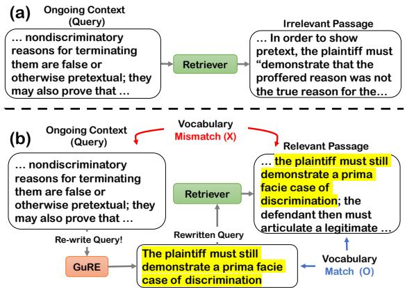
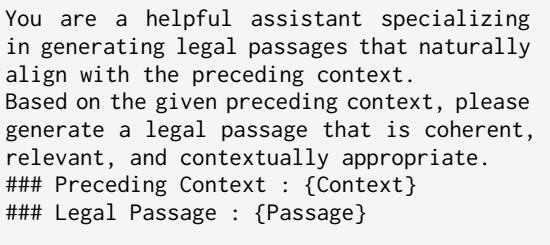
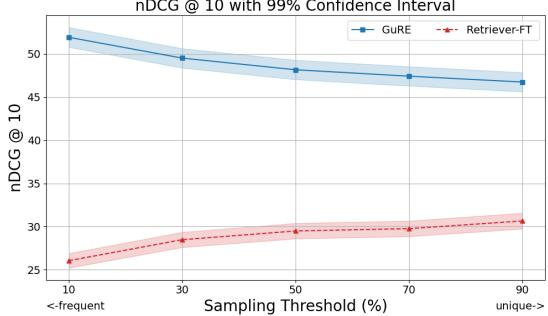
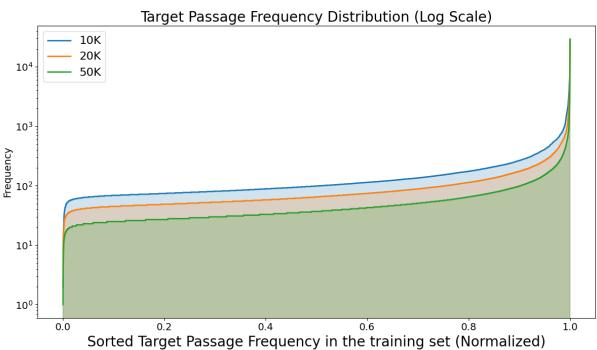
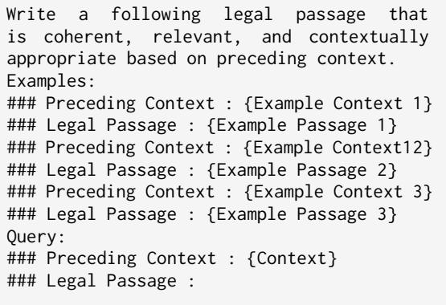
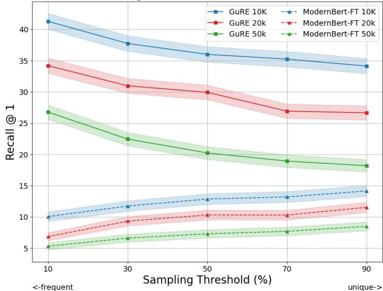
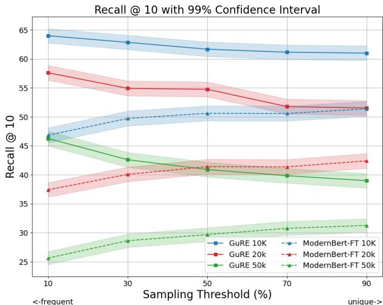
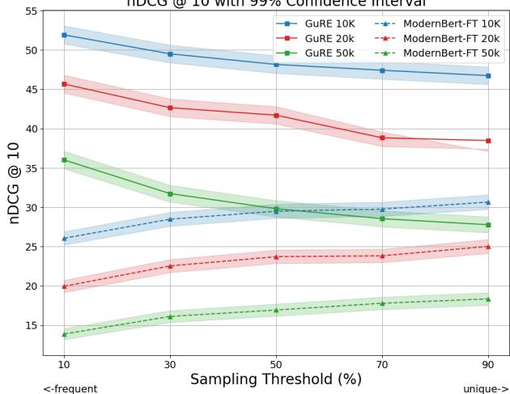

# GuRE:Generative Query REwriter for Legal Passage Retrieval

Daehui $\mathbf { K i m } ^ { 1 , 2 }$ , Deokhyung $\mathbf { K a n g ^ { 1 } }$ , Jonghwi ${ \bf K i m } ^ { 1 }$ , Sangwon Ryu1, Gary Geunbae Lee13

1Graduate School of Artificial Intelligence, POSTECH, Republic of Korea 2AI Future Lab, KT, Republic of Korea   
3Department of Computer Science and Engineering, POSTECH, Republic of Korea   
{andrea0119, deokhk, jonghwi.kim, ryusangwon, gblee}@postech.ac.kr

# Abstract

Legal Passage Retrieval (LPR) systems are crucial as they help practitioners save time when drafting legal arguments. However, it remains an underexplored avenue. One primary reason is the significant vocabulary mismatch between the query and the target passage. To address this, we propose a simple yet effective method, the Generative query REwriter (GuRE). We leverage the generative capabilities of Large Language Models (LLMs) by training the LLM for query rewriting. "Rewritten queries" help retrievers to retrieve target passages by mitigating vocabulary mismatch. Experimental results show that GuRE significantly improves performance in a retriever-agnostic manner, outperforming all baseline methods. Further analysis reveals that different training objectives lead to distinct retrieval behaviors, making GuRE more suitable than direct retriever fine-tuning for real-world applications. Codes are avaiable at github.com/daehuikim/GuRE.

# 1 Introduction

Recent advancements in information retrieval have enhanced legal tasks (Zhu et al., 2024; Lai et al., 2024; Tu et al., 2023). Most studies have focused on retrieving legal cases (Ma et al., 2021; Li et al., 2024; Hou et al., 2024; Deng et al., 2024a,b; Gao et al., 2024) to address the challenge of retrieving relevant cases from the vast amount of documents. While automatic case retrieval systems are advancing, practitioners still spend significant time searching for relevant cases during argument drafting (David-Reischer et al., 2024). One reason for this is that cases frequently address multiple legal issues, so retrieved cases may be relevant overall but not necessarily contain passages that align with the specific argument being drafted. As a result, practitioners often need to manually sift through lengthy documents to locate the specific passages for their argument. Therefore, Legal Passage Retrieval (LPR) is crucial for extracting fine-grained information at the passage level, which helps reduce the time spent on legal research and lowers the costs associated with argument drafting.

  
Figure 1: (a) Retriever fails to retrieve the target passage using an original query. (b) GuRE rewrites the query before retrieval. Overlapping context between the "rewritten query" and the target passage is in yellow.

Despite its importance, however, LPR remains underexplored, showing suboptimal performances even with fine-tuned retrievers (Mahari et al., 2024). One of the primary reasons for this is the significant vocabulary mismatch between the ongoing context (query) and the target passage (Nogueira et al., 2019; Feng et al., 2024; Mahari et al., 2024; Hou et al., 2024). In legal texts, queries frequently use terms that differ from those in the target passage, hindering retrievers from matching relevant passages (Valvoda et al., 2021). Figure 1 provides an example of the impact of vocabulary mismatch.

To address this challenge, we tried to modify the query to mitigate the vocabulary mismatch via the existing query expansion methods (Wang et al., 2023; Jagerman et al., 2023). However, a substantial gap between the query and the target passage remained. To bridge this gap, we propose a simple yet effective method, the Generative query REwriter (GuRE). We aim to enable Large Language models (LLMs) to leverage legal domainspecific knowledge better to rewrite queries with a mitigated vocabulary gap. Specifically, We train LLMs to generate legal passages based on a query, which then serves as the "rewritten query" for retrievers. At retrieval time, we employ a "rewritten query" with lower vocabulary mismatch as the query for the retriever, as shown in (b) of Figure 1.

Experimental results demonstrate that retrieving using "rewritten queries" from GuRE leads to a significant performance improvement in a retrieveragnostic manner, even surpassing direct retriever fine-tuning. Our analysis reveals that adapting GuRE for LPR can be more suitable for real-world applications than direct retriever fine-tuning regarding their different training objectives.

Our contributions include a simple yet effective domain-specific query rewriting method to address the vocabulary mismatch problem in LPR. We also analyze why retriever fine-tuning leads to suboptimal performance in LPR, linking it to its training objective.

# 2 Method: GuRE

We introduce GuRE, a simple yet effective method for mitigating the underlying vocabulary mismatch in LPR. Unlike existing query expansion methods, which add additional information to the query, GuRE is designed to rewrite the query directly. We train the LLM on a dataset of InstructionP romp $\cdot q , p _ { q }$ , where $q$ is {Context} and $p _ { q }$ is {Passage} (Figure 2). Given a sequence of tokens $( t _ { 1 } , . . . , t _ { N } )$ from an InstructionP rompt $\cdot q , p _ { q }$ , the LLM learns to predict each token $t _ { i }$ in auto-regressive manner by optimizing the Cross-Entropy loss:

$$
\mathcal { L } = - \sum _ { i = 1 } ^ { N } \log P ( t _ { i } | t _ { < i } ; \theta )
$$

Where $P ( t _ { i } | t _ { < i } ; \theta )$ is the probability assigned by the model to the token $t _ { i }$ given previous tokens. $\theta$ is the parameters of the LLM. Once trained, GuRE rewrite the queries using the InstructionP romptq excluding the {Passage} from Figure 2.

# 3 Experiments

# 3.1 Task Description

LPR involves retrieving the most relevant passage $p _ { q }$ based on an ongoing context $q$ , where $q$ serves as the query for the retriever. Given a set of candidate passages $P _ { c o l l e c t i o n } = \{ p 1 , . . . , p _ { n } \}$ , our goal is to identify $p _ { q } \in P _ { c o l l e c t i o n }$ that can support $q$ during the legal document drafting.

# Instruction Prompt

  
Figure 2: Instruction prompt for GuRE.

# 3.2 Baselines

Due to the absence of prior research on LPR, we compare GuRE with strong baselines as follows.

Query Expansion. Query2Doc (Q2D) (Wang et al., 2023) generates a pseudo-passage via fewshot prompting and concatenates it with the original query to form an expanded query. Query2DocCoT (Q2D-CoT) (Jagerman et al., 2023) extends Query2Doc by generating reasoning steps while producing the pseudo-passage. We employ GPT4o-mini (OpenAI et al., 2024) for Q2D and Q2DCoT. Detailed settings are in the Appendix C.

Fine-Tuning Since we train the LLM to build GuRE, we include retriever fine-tuning in the baseline to analyze the effectiveness of the training strategy. We train the retrievers using Multiple Negatives Ranking Loss (Henderson et al., 2017) by following Mahari et al., maximizing the model similarity for a positive sample while minimizing similarity for other samples within a batch. Details about baselines are in Appendix A.

# 3.3 Dataset

We use LePaRD (Mahari et al., 2024), a representative large-scale legal passage retrieval dataset for U.S. federal court precedents. It contains metadata along with ongoing context $q$ and its corresponding cited target passage $p _ { q }$ . The dataset includes three versions varying the size of the candidate passage pool, namely 10K, 20K, and 50K. Each version consists of 1.9M, 2.5M, and $3 . 5 \mathbf { M }$ data points, respectively. We use $90 \%$ of each version for finetuning retrievers and training GuRE. To ensure efficiency and reliability given the large scale of the dataset, we sample 10,000 data points three times from the remaining $10 \%$ of the data and report the average over three trials. Details of statistics are in the Appendix B.

<table><tr><td colspan="2"></td><td colspan="3">10K</td><td colspan="3">20K</td><td colspan="3">50K</td></tr><tr><td>Type</td><td>Method</td><td>R @ 1</td><td>R @ 10</td><td>nDCG @ 10</td><td>R @ 1</td><td>R @ 10</td><td>nDCG @ 10</td><td>R @ 1</td><td>R @ 10</td><td>nDCG @ 10</td></tr><tr><td rowspan="4">Sparse</td><td>BM25</td><td>9.91</td><td>28.19</td><td>15.33</td><td>8.81</td><td>24.51</td><td>15.91</td><td>7.37</td><td>20.83</td><td>13.41</td></tr><tr><td>BM25 + Q2D</td><td>10.23</td><td>34.99</td><td>21.15</td><td>8.55</td><td>28.89</td><td>17.46</td><td>6.57</td><td>22.58</td><td>13.63</td></tr><tr><td>BM25 + Q2D-CoT</td><td>11.13</td><td>35.96</td><td>22.22</td><td>9.29</td><td>30.37</td><td>18.59</td><td>7.48</td><td>24.03</td><td>14.81</td></tr><tr><td>BM25 + GuRE</td><td>34.88†</td><td>62.20†</td><td>47.69†</td><td>28.39†</td><td>52.63†</td><td>39.69†</td><td>19.41</td><td>39.20†</td><td>28.46†</td></tr><tr><td rowspan="8">Dense</td><td>DPR</td><td>1.99</td><td>6.39</td><td>3.92</td><td>1.74</td><td>5.49</td><td>3.39</td><td>1.42</td><td>4.36</td><td>2.71</td></tr><tr><td>DPR + Q2D</td><td>1.92</td><td>7.22</td><td>4.22</td><td>1.54</td><td>6.07</td><td>3.46</td><td>1.08</td><td>4.08</td><td>2.39</td></tr><tr><td>DPR + Q2D-CoT</td><td>2.3</td><td>7.98</td><td>4.78</td><td>1.92</td><td>6.84</td><td>4.05</td><td>1.35</td><td>4.86</td><td>2.86</td></tr><tr><td>DPR + GuRE</td><td>32.07†</td><td>49.74</td><td>40.68†</td><td>26.35†</td><td>41.96</td><td>33.77†</td><td>16.47†</td><td>30.63</td><td>23.20†</td></tr><tr><td>DPR-FT</td><td>14.09</td><td>50.97†</td><td>30.31</td><td>11.28</td><td>42.59</td><td>24.90</td><td>8.23</td><td>31.07</td><td>18.13</td></tr><tr><td>ModernBert</td><td>7.11</td><td>22.47</td><td>13.94</td><td>6.04</td><td>19.16</td><td>11.90</td><td>4.94</td><td>15.24</td><td>9.58</td></tr><tr><td>ModernBert + Q2D</td><td>6.67</td><td>24.95</td><td>14.67</td><td>5.65</td><td>20.64</td><td>12.19</td><td>4.09</td><td>15.47</td><td>9.09</td></tr><tr><td>ModernBert + Q2D-CoT</td><td>7.47</td><td>26.46</td><td>15.86</td><td>6.47</td><td>21.99</td><td>13.32</td><td>4.90</td><td>16.96</td><td>10.22</td></tr><tr><td>ModernBert + GuRE</td><td></td><td>33.14</td><td>60.24†</td><td>45.86†</td><td>26.36†</td><td>51.34t</td><td>38.19†</td><td>17.44†</td><td>37.89†</td><td>26.83†</td></tr><tr><td></td><td>ModerBert-FT</td><td>14.12</td><td>51.34</td><td>30.50</td><td>11.51</td><td>42.31</td><td>24.49</td><td>8.75</td><td>31.81</td><td>18.80</td></tr></table>

Table 1: Evaluation results for various retrieval methods with different numbers of target passages $( N \mathbf { k } )$ . The best performance for each retriever, across all metrics, is highlighted in bold. $\dagger$ denotes a statistically significant improvement (paired $t$ -test, $p < 0 . 0 1 $ ) over the best-performing method excluding those marked in bold.

# 3.4 Models

We select SaulLM-7B (Colombo et al., 2024) as the backbone model for GuRE, as it is pre-trained on a legal domain corpora. We also compare Llama3.1- 8B (Grattafiori et al., 2024) and Qwen2.5-7B (Qwen et al., 2025) as backbone models to assess the generalization of our approach across different backbone models. The investigation of backbone model selection is provided in the Appendix D.

We use BM25 (Robertson et al., 2009), DPR (Karpukhin et al., 2020) and ModernBert (Warner et al., 2024) for retrievers. More details about the retrievers are provided in Appendix E.

# 4 Results

Table 1 reveals that adapting GuRE for query rewriting significantly improves retrieval performance across different methods and passage sizes. Notably, applying GuRE to BM25 results in a performance gain of 32.96 ( $1 5 . 3 3  4 7 . 6 9$ ) in $\mathrm { n D C G } @ 1 0$ for the 10K dataset. This significant improvement is consistent across all data versions (10K, 20K, 50K) and retrieval methods, highlighting the retriever-agnostic effectiveness of GuRE.

In contrast, other baseline methods yield suboptimal performance gains, falling short of the improvements by GuRE. Q2D achieves the lowest performance gain, suggesting that the few-shot prompting strategy struggles to address the underlying challenges in tasks requiring domainspecific knowledge. Furthermore, retriever finetuning does not provide retrievers with the same level of performance as GuRE. This indicates that mitigating vocabulary mismatch is significantly more effective than training the retrievers.

<table><tr><td></td><td>BLEU</td><td>ROUGE-L</td><td>BertScore-F</td><td>Words</td></tr><tr><td>Target</td><td>-</td><td>-</td><td>-</td><td>50.21</td></tr><tr><td>Query</td><td>5.75</td><td>18.98</td><td>75.61</td><td>123.99</td></tr><tr><td>Q2D</td><td>8.56</td><td>19.19</td><td>78.6</td><td>88.19</td></tr><tr><td>Q2D-CoT</td><td>11.86</td><td>27.28</td><td>80.1</td><td>36.28</td></tr><tr><td>GuRE</td><td>59.43</td><td>67.62</td><td>90.92</td><td>50.90</td></tr></table>

Table 2: Quantitative evaluation of pseudo-passages (Q2D, Q2D-CoT) and "rewritten query" (GuRE) between target passages on the 10K test set.

# 5 Analyses

# 5.1 Rewritten Query Evaluation

We analyze the generated context using various methods to investigate how effectively vocabulary mismatch is mitigated. Table 2 shows a quantitative evaluation of pseudo-passages (Q2D, Q2DCoT) and "rewritten queries" (GuRE) against target passages on the 10K test set. The highest metric values reflect the high lexical similarity between GuRE’s "rewritten queries" and target passages, while pseudo-passages from Q2D and Q2D-CoT struggle to mitigate the lexical gap.

Additionally, we find that the "rewritten query" generated by GuRE contains semantically similar legal context to the target passage (Table 3). For example, GuRE successfully generates phrases like "action for trademark infringement". In contrast, pseudo-passages from Q2D are mostly irrelevant, and while Q2D-CoT generates some relevant context like "trademark infringement", it also produces irrelevant context such as "defendant’s intent in adopting its mark". These results show that domain-specific training outperforms few-shot prompting in mitigating vocabulary mismatch. More case-studies are in the appendix I.

Table 3: Case study about generated pseudo-passage and "rewritten query". Yellow indicates parts similar to the target passage, while pink marks "distractor" that can mislead retrievers into wrong passages.   
$9 9 \%$   

<table><tr><td rowspan="2">Target Passage</td><td>LTa margemt, is whethe theexist &quot;keliooha  prebeb dinary rudt puha</td></tr><tr><td>[will] be misled, or indeed simply confused, as to the source of the goods in question. See Thompson Medical Co., Inc. v. Pfizer, Inc., 753 F.2d208, 213 (2 Cir.1985) (quoting Mushroom Makers, Inc v.</td></tr><tr><td>Query Q2D</td><td>R.G. Barry Corp., 580 F.2d 44, 47 (2 Cir.1978), cert. denied, 439 U.S. 1116 (1979) ( [</td></tr><tr><td>Q2D-</td><td>sohan scuhar.Thn relying on generalized assertions or conjectures. theanaroablishideme s hethe the lieliousm</td></tr><tr><td>CoT GuRE</td><td> u   u e , similarity of the marks, evidence of actual confusion, and the defendant&#x27;s intent in adopting its mark.</td></tr><tr><td></td><td>I It  a confused, as to the source of the goods in question.</td></tr></table>

Table 4: Retrieval results of GuRE trained under datascarce settings. GuRE with only 10K training examples outperforms retriever fine-tuning approaches that require millions of examples across all retrieval pools.   

<table><tr><td colspan="3">10K Cases</td></tr><tr><td></td><td>R@1</td><td>R@10 nDCG@10</td></tr><tr><td>ModernBert</td><td>7.11</td><td>22.47 13.94</td></tr><tr><td>GuRE (10K) + ModerBert</td><td>16.42 39.02</td><td>26.58</td></tr><tr><td>GuRE (100 K) + ModernBert</td><td>20.62 45.98</td><td>32.31</td></tr><tr><td></td><td>20K Cases</td><td></td></tr><tr><td>ModernBert</td><td>6.04</td><td>19.16 11.9</td></tr><tr><td>GuRE (10K) + ModerBert</td><td>12.06 31.29</td><td>20.81</td></tr><tr><td>GuRE (100 K) + ModernBert</td><td>15.35 37.09</td><td>24.46</td></tr><tr><td></td><td>50K Cases</td><td></td></tr><tr><td>ModernBert</td><td>4.94</td><td>15.24 9.58</td></tr><tr><td>GuRE (10K) + ModerBert</td><td>8.67 23.94</td><td>15.53</td></tr><tr><td>GuRE (100 K) + ModernBert</td><td>10.3 26.66</td><td>17.71</td></tr></table>

# 5.2 Generalizability under Data Constraints

Although GuRE is designed as a plug-and-play, retriever-agnostic approach, it still requires training. To assess its applicability in data-scarce environments, such as legal systems where case law is only partially available, we conducted experiments with varying training sizes. Results show that GuRE trained on only 10K cases already outperforms retriever fine-tuning across all retrieval pool settings. When trained on 100K cases—a scale more realistic for practical deployment—performance further improves. These findings demonstrate that GuRE remains robust under limited-resource conditions and holds strong potential for practical use across diverse legal systems.

  
Figure 3: $\mathrm { n D C G } @ 1 0$ with $9 9 \%$ confidence intervals (shading) for GuRE and a fine-tuned retriever across sampling thresholds. Higher thresholds yield more unique samples, while lower ones favor frequent samples. Retriever for this experiment is ModernBert.

# 5.3 Which Model Should We Train?

Citations in U.S. federal precedents follow a longtailed distribution, with the top $1 \%$ of passages accounting for $18 \%$ of all citations, while $64 \%$ receive only one citation (Mahari et al., 2024). To investigate the impact of this imbalance, we analyze performance changes by varying the frequency thresholds of test samples. We sort test candidates $( 1 0 \% )$ by their frequency in the training set $( 9 0 \% )$ and select from the top $X \%$ most frequent passages $\mathrm { { X } = 1 0 }$ , 30, 50, 70, 90) from test candidates. As X increases, the test set includes more unique passages. We sample 10,000 examples per threshold.

Figure 3 shows that GuRE consistently outperforms fine-tuned retrievers at every threshold. Notably, while the performance of GuRE improves as the samples become frequent, the fine-tuned retriever shows the opposite trend. This tendency seems to arise from the learning objective used in retriever fine-tuning, which treats all samples in the batch, except the current one, as negative. In a long-tail distribution, frequent samples appear more frequently in the batch and should be treated as positive since they refer to identical passages. However, widely used retriever training losses that rely on in-batch negatives treat them as negative samples. This may hinder ideal optimization and lead to suboptimal results. Thus, GuRE may be more suitable for LPR, where frequently cited passages are repeatedly referenced. More analysis about loss functions is in the Appendix H.

# 6 Conclusion

We propose GuRE, a retriever-agnostic query rewriter that mitigates vocabulary mismatch through domain-specific query rewriting. Experimental results show that GuRE outperforms all baseline methods, including fine-tuned retrievers. Our analysis highlights why retriever fine-tuning relying on in-batch negatives leads to suboptimal performance in LPR, linking to its loss function.

# Limitations

Limited Scope Our experiments are limited to a U.S. federal court precedents-based dataset (LePaRD), which is the only publicly available LPR dataset to our knowledge. In the future, we hope to expand this work with more diverse resources, including multilingual and cross-jurisdictional applications.

High Computational Resource Although GuRE significantly outperforms other baseline methods, GuRE also incurs higher computational costs during training, requiring about twice the GPU hours compared to direct retriever training. However, once trained, it can be used as a plug-in for any retriever without further fine-tuning, unlike retrievers that require separate training per model. Details are in Appendix G

work does not involve user-related or private data that is not publicly available.

Intended Use This work introduces a methodology for legal passage retrieval and is not intended for direct use by individuals involved in legal disputes without professional assistance. Our approach aims to advance legal NLP research and could support real-world systems that assist legal professionals. We hope such technologies improve access to legal information.

License of Artifacts This research utilizes Meta Llama 3, licensed under the Meta Llama 3 Community License (Copyright $©$ Meta Platforms, Inc.). All other models and datasets used in this study are publicly available under permissive licenses.

# Acknowledgments

This research was supported by the MSIT(Ministry of Science and ICT), Korea, under the ITRC(Information Technology Research Center) support program(IITP-2025-RS-2020-II201789) supervised by the IITP(Institute for Information & Communications Technology Planning & Evaluation, Contribution Rate: $45 \%$ ). This research was supported by Culture, Sports and Tourism R&D Program through the Korea Creative Content Agency grant funded by the Ministry of Culture, Sports and Tourism in 2025 (Project Name: Development of an AI-Based Korean Diagnostic System for Efficient Korean Speaking Learning by Foreigners, Project Number: RS-2025- 02413038, Contribution Rate: $45 \%$ ). This work was also supported by the Institute of Information & Communications Technology Planning & Evaluation (IITP) grant funded by the Korea government (MSIT) (No. RS-2019-II191906, Artificial Intelligence Graduate School Program (POSTECH), Contribution Rate: $10 \%$ ).

# Ethical Considerations

Offensive Language Warning The dataset used in this study includes publicly available judicial opinions, which may contain offensive or insensitive language. Users should be aware of this when interpreting the results.

Data Privacy The dataset used in this study consists of publicly available textual data provided by Harvard’s Case Law Access Project (CAP). Our

# References

Hiteshwar Kumar Azad, Akshay Deepak, Chinmay Chakraborty, and Kumar Abhishek. 2022. Improving query expansion using pseudo-relevant web knowledge for information retrieval. Pattern Recognition Letters, 158:148–156.

Ilias Chalkidis, Manos Fergadiotis, Prodromos Malakasiotis, Nikolaos Aletras, and Ion Androutsopoulos. 2020. LEGAL-BERT: The muppets straight out of law school. In Findings of the Association for Computational Linguistics: EMNLP 2020, pages 2898–

2904, Online. Association for Computational Linguistics.

Pierre Colombo, Telmo Pessoa Pires, Malik Boudiaf, Dominic Culver, Rui Melo, Caio Corro, Andre FT Martins, Fabrizio Esposito, Vera Lúcia Raposo, Sofia Morgado, et al. 2024. Saullm-7b: A pioneering large language model for law. arXiv preprint arXiv:2403.03883.

David-Reischer et al. 2024. Expert insights: Overcoming legal research challenges for lawyers. https://www.legalsupportworld.com/blog/ legal-research-challenges-experts-opinion.

Chenlong Deng, Zhicheng Dou, Yujia Zhou, Peitian Zhang, and Kelong Mao. 2024a. An element is worth a thousand words: Enhancing legal case retrieval by incorporating legal elements. In Findings of the Association for Computational Linguistics: ACL 2024, pages 2354–2365, Bangkok, Thailand. Association for Computational Linguistics.

Chenlong Deng, Kelong Mao, and Zhicheng Dou. 2024b. Learning interpretable legal case retrieval via knowledge-guided case reformulation. In Proceedings of the 2024 Conference on Empirical Methods in Natural Language Processing, pages 1253–1265, Miami, Florida, USA. Association for Computational Linguistics.

Yi Feng, Chuanyi Li, and Vincent Ng. 2024. Legal case retrieval: A survey of the state of the art. In Proceedings of the 62nd Annual Meeting of the Association for Computational Linguistics (Volume 1: Long Papers), pages 6472–6485, Bangkok, Thailand. Association for Computational Linguistics.

Cheng Gao, Chaojun Xiao, Zhenghao Liu, Huimin Chen, Zhiyuan Liu, and Maosong Sun. 2024. Enhancing legal case retrieval via scaling high-quality synthetic query-candidate pairs. In Proceedings of the 2024 Conference on Empirical Methods in Natural Language Processing, pages 7086–7100, Miami, Florida, USA. Association for Computational Linguistics.

Aaron Grattafiori et al. 2024. The llama 3 herd of models. Preprint, arXiv:2407.21783.

Sylvain Gugger, Lysandre Debut, Thomas Wolf, Philipp Schmid, Zachary Mueller, Sourab Mangrulkar, Marc Sun, and Benjamin Bossan. 2022. Accelerate: Training and inference at scale made simple, efficient and adaptable. https://github.com/huggingface/ accelerate.

Matthew Henderson, Rami Al-Rfou, Brian Strope, YunHsuan Sung, László Lukács, Ruiqi Guo, Sanjiv Kumar, Balint Miklos, and Ray Kurzweil. 2017. Efficient natural language response suggestion for smart reply. arXiv preprint arXiv:1705.00652.

Ari Holtzman, Jan Buys, Li Du, Maxwell Forbes, and Yejin Choi. 2020. The curious case of neural text degeneration. In 8th International Conference on

Learning Representations, ICLR 2020, Addis Ababa, Ethiopia, April 26-30, 2020. OpenReview.net.

Abe Bohan Hou, Orion Weller, Guanghui Qin, Eugene Yang, Dawn Lawrie, Nils Holzenberger, Andrew Blair-Stanek, and Benjamin Van Durme. 2024. Clerc: A dataset for legal case retrieval and retrieval-augmented analysis generation. Preprint, arXiv:2406.17186.

Edward J Hu, yelong shen, Phillip Wallis, Zeyuan AllenZhu, Yuanzhi Li, Shean Wang, Lu Wang, and Weizhu Chen. 2022. LoRA: Low-rank adaptation of large language models. In International Conference on Learning Representations.

Aaron Jaech, Adam Kalai, Adam Lerer, Adam Richardson, Ahmed El-Kishky, Aiden Low, Alec Helyar, Aleksander Madry, Alex Beutel, Alex Carney, et al. 2024. Openai o1 system card. arXiv preprint arXiv:2412.16720.

Rolf Jagerman, Honglei Zhuang, Zhen Qin, Xuanhui Wang, and Michael Bendersky. 2023. Query expansion by prompting large language models. arXiv preprint arXiv:2305.03653.

Vladimir Karpukhin, Barlas Oguz, Sewon Min, Patrick Lewis, Ledell Wu, Sergey Edunov, Danqi Chen, and Wen-tau Yih. 2020. Dense passage retrieval for opendomain question answering. In Proceedings of the 2020 Conference on Empirical Methods in Natural Language Processing (EMNLP), pages 6769–6781, Online. Association for Computational Linguistics.

Woosuk Kwon, Zhuohan Li, Siyuan Zhuang, Ying Sheng, Lianmin Zheng, Cody Hao Yu, Joseph Gonzalez, Hao Zhang, and Ion Stoica. 2023. Efficient memory management for large language model serving with pagedattention. In Proceedings of the 29th Symposium on Operating Systems Principles, SOSP ’23, page 611–626, New York, NY, USA. Association for Computing Machinery.

Jinqi Lai, Wensheng Gan, Jiayang Wu, Zhenlian Qi, and Philip S. Yu. 2024. Large language models in law: A survey. AI Open, 5:181–196.

Haitao Li, Yunqiu Shao, Yueyue Wu, Qingyao Ai, Yixiao Ma, and Yiqun Liu. 2024. Lecardv2: A largescale chinese legal case retrieval dataset. In Proceedings of the 47th International ACM SIGIR Conference on Research and Development in Information Retrieval, SIGIR ’24, page 2251–2260, New York, NY, USA. Association for Computing Machinery.

Chin-Yew Lin. 2004. ROUGE: A package for automatic evaluation of summaries. In Text Summarization Branches Out, pages 74–81, Barcelona, Spain. Association for Computational Linguistics.

Ilya Loshchilov and Frank Hutter. 2019. Decoupled weight decay regularization. In International Conference on Learning Representations.

Xing Han Lù. 2024. Bm25s: Orders of magnitude faster lexical search via eager sparse scoring. Preprint, arXiv:2407.03618.

Yixiao Ma, Yunqiu Shao, Yueyue Wu, Yiqun Liu, Ruizhe Zhang, Min Zhang, and Shaoping Ma. 2021. Lecard: A legal case retrieval dataset for chinese law system. In Proceedings of the 44th International ACM SIGIR Conference on Research and Development in Information Retrieval, SIGIR ’21, page 2342–2348, New York, NY, USA. Association for Computing Machinery.

Robert Mahari, Dominik Stammbach, Elliott Ash, and Alex Pentland. 2024. LePaRD: A large-scale dataset of judicial citations to precedent. In Proceedings of the 62nd Annual Meeting of the Association for Computational Linguistics (Volume 1: Long Papers), pages 9863–9877, Bangkok, Thailand. Association for Computational Linguistics.

Rodrigo Nogueira, Wei Yang, Jimmy Lin, and Kyunghyun Cho. 2019. Document expansion by query prediction. arXiv preprint arXiv:1904.08375.

OpenAI et al. 2024. Gpt-4 technical report. Preprint, arXiv:2303.08774.

Kishore Papineni, Salim Roukos, Todd Ward, and WeiJing Zhu. 2002. Bleu: a method for automatic evaluation of machine translation. In Proceedings of the 40th Annual Meeting of the Association for Computational Linguistics, pages 311–318, Philadelphia, Pennsylvania, USA. Association for Computational Linguistics.

Qwen et al. 2025. Qwen2.5 technical report. Preprint, arXiv:2412.15115.

Jeff Rasley, Samyam Rajbhandari, Olatunji Ruwase, and Yuxiong He. 2020. Deepspeed: System optimizations enable training deep learning models with over 100 billion parameters. In Proceedings of the 26th ACM SIGKDD International Conference on Knowledge Discovery & Data Mining, KDD $^ { , } 2 0$ page 3505–3506, New York, NY, USA. Association for Computing Machinery.

Nils Reimers and Iryna Gurevych. 2019. Sentence-bert: Sentence embeddings using siamese bert-networks. In Proceedings of the 2019 Conference on Empirical Methods in Natural Language Processing. Association for Computational Linguistics.

Stephen Robertson, Hugo Zaragoza, et al. 2009. The probabilistic relevance framework: Bm25 and beyond. Foundations and Trends® in Information Retrieval, 3(4):333–389.

S Sean Tu, Amy Cyphert, and Samuel J Perl. 2023. Artificial intelligence: Legal reasoning, legal research and legal writing. Minn. JL Sci. & Tech., 25:105.

Josef Valvoda, Tiago Pimentel, Niklas Stoehr, Ryan Cotterell, and Simone Teufel. 2021. What about the precedent: An information-theoretic analysis of common law. In Proceedings of the 2021 Conference of the North American Chapter of the Association for Computational Linguistics: Human Language Technologies, pages 2275–2288, Online. Association for Computational Linguistics.

Leandro von Werra, Younes Belkada, Lewis Tunstall, Edward Beeching, Tristan Thrush, Nathan Lambert, Shengyi Huang, Kashif Rasul, and Quentin Gallouédec. 2020. Trl: Transformer reinforcement learning. https://github.com/huggingface/trl.

Liang Wang, Nan Yang, and Furu Wei. 2023. Query2doc: Query expansion with large language models. In Proceedings of the 2023 Conference on Empirical Methods in Natural Language Processing, pages 9414–9423, Singapore. Association for Computational Linguistics.

Benjamin Warner, Antoine Chaffin, Benjamin Clavié, Orion Weller, Oskar Hallström, Said Taghadouini, Alexis Gallagher, Raja Biswas, Faisal Ladhak, Tom Aarsen, Nathan Cooper, Griffin Adams, Jeremy Howard, and Iacopo Poli. 2024. Smarter, better, faster, longer: A modern bidirectional encoder for fast, memory efficient, and long context finetuning and inference. Preprint, arXiv:2412.13663.

Thomas Wolf, Lysandre Debut, Victor Sanh, Julien Chaumond, Clement Delangue, Anthony Moi, Pierric Cistac, Tim Rault, Rémi Louf, Morgan Funtowicz, Joe Davison, Sam Shleifer, Patrick von Platen, Clara Ma, Yacine Jernite, Julien Plu, Canwen Xu, Teven Le Scao, Sylvain Gugger, Mariama Drame, Quentin Lhoest, and Alexander M. Rush. 2020. Transformers: State-of-the-art natural language processing. In Proceedings of the 2020 Conference on Empirical Methods in Natural Language Processing: System Demonstrations, pages 38–45, Online. Association for Computational Linguistics.

Tianyi Zhang\*, Varsha Kishore\*, Felix $\mathrm { { W u ^ { * } } }$ , Kilian Q. Weinberger, and Yoav Artzi. 2020. Bertscore: Evaluating text generation with bert. In International Conference on Learning Representations.

Yutao Zhu, Huaying Yuan, Shuting Wang, Jiongnan Liu, Wenhan Liu, Chenlong Deng, Haonan Chen, Zheng Liu, Zhicheng Dou, and Ji-Rong Wen. 2024. Large language models for information retrieval: A survey. Preprint, arXiv:2308.07107.

# A Details of Baselines

Vanilla Retriever Given an ongoing context $q$ , the retriever retrieves the most relevant passage from the candidate set $P _ { c o l l e c t i o n }$ . This approach directly uses $q$ without any modification.

Query2Doc Query2Doc (Wang et al., 2023) (Q2D) generates a pseudo-passage via few-shot prompting and concatenates it with the original query to form an expanded query. More formally:

$$
q ^ { + } = \mathrm { c o n c a t } ( q , \mathrm { L L M } ( \mathrm { P r o m p t } _ { q } ) )
$$

$\mathrm { L L M } ( \mathrm { P r o m p t } _ { q } )$ represent generated pseudo passage from few-shot Q2D prompt. Q2D uses $q ^ { + }$ to retrieve the most relevant passage.

Query2Doc-CoT Query2Doc-CoT (Jagerman et al., 2023) (Q2D-CoT) extends Query2Doc by generating reasoning steps before producing the pseudo-passage. More formally:

$$
q ^ { + } = \mathrm { c o n c a t } ( q , \mathrm { L L M } ( \mathrm { C o T P r o m p t } _ { q } ) )
$$

$\mathrm { L L M } ( \mathrm { C o T P r o m p t } _ { q } )$ represent generated pseudo passage from few-shot Q2D-CoT prompt. Q2DCoT uses $q ^ { + }$ to retrieve the most relevant passage, similar to the approach used by Q2D.

Retrieval Fine Tuning We directly train retrieval models using Multiple Negatives Ranking Loss (Henderson et al., 2017), where the model is optimized to maximize similarity for positive samples within a batch while minimizing similarity for other negative samples. The loss is defined as:

$$
\mathcal { L } = - \log \frac { e ^ { \sin ( q , p ^ { + } ) } } { e ^ { \sin ( q , p ^ { + } ) } + \sum _ { i = 1 } ^ { N } e ^ { \sin ( q , p _ { i } ^ { - } ) } }
$$

$\sin ( q , p )$ represents the similarity score. Here, $q$ denotes the query, $p ^ { + }$ is the positive passage, and $p ^ { - }$ refers to other passages in the same batch.

# B Detailed Dataset Statistics

LePaRD (Mahari et al., 2024) captures citation relationships in U.S. federal court precedents, reflecting how judges use precedential passages based on millions of decisions. As shown in Table 5, the dataset has three versions, each with a different number of target passages in the retrieval pool. Each data point pairs a passage before a precedent’s citation with its citation.

The dataset follows a long-tailed distribution, where the top $1 \%$ of passages (100, 200, or 500)

account for $1 6 . 2 3 \%$ to $1 6 . 8 6 \%$ of the data, indicating dominance by a small number of heavily cited precedents. This tendency is further evident in the dataset distribution visualized in Figure 4. Despite being plotted on a log scale, the distribution shows a remarkable long-tail pattern, where an extremely small number of passages dominate the dataset.

Table 5: Detailed statistics of LePaRD dataset.   

<table><tr><td>Number of target passages</td><td>Total</td><td>Train (90%)</td><td>Top 1% population</td></tr><tr><td>10,000 (10 K)</td><td>1.92 M</td><td>1.73 M</td><td>16.86 %</td></tr><tr><td>20,000 (20 K)</td><td>2.48 M</td><td>2.23 M</td><td>16.45 %</td></tr><tr><td>50,000 (50 K)</td><td>3.50 M</td><td>3.15 M</td><td>16.23 %</td></tr></table>

  
Figure 4: Target passage frequency distribution across different dataset versions (Log Scale)

# C Query Expansion & Rewriting Details

# C.1 Prompts

# Q2D Prompt

  
Figure 5: Q2D prompt

Q2D Prompt Figure 5 illustrates the prompt used for the Query2Doc(Wang et al., 2023) method in our experiment. As introduced in Query2Doc, we adapt a few-shot prompting paradigm to generate the pseudo-passage, which we adapt to suit legal passage retrieval. We randomly select three data points from the training set for the experiment and employ them as fixed examples in the prompt. Due to the long length of the actual examples, we replace them with placeholders in Figure 5.

# Q2D-CoT Prompt

Write a following legal passage that is coherent, relevant, and contextually appropriate based on preceding context. ### Note: Examples provided below do not include intermediate steps due to sampling constraints.   
### Step 1: Understand the preceding context.   
### Step 2: Identify the key legal elements and principles required for coherence.   
### Step 3: Generate a legal passage that logically follows and aligns with the context.   
### Note: You can generate any intermediate step but, please mark final output with ’<output>’ tag.   
Examples:   
### Preceding Context : {Example Context 1} ### Step1: {Example1:generated step 1}   
### Step2: {Example1:generated step 2}   
### Step3: <output> {Example Passage 1} ### Preceding Context : {Example Context 2} ### Step1: {Example2:generated step 1}   
### Step2: {Example2:generated step 2}   
### Step3: <output> {Example Passage 2} ### Preceding Context : {Example Context 3} ### Step1: {Example3:generated step 1}   
### Step2: {Example3:generated step 3}   
### Step3: <output> {Example Passage 3} Query:   
### Preceding Context : {Context}   
### Legal Passage :

Table 6: Evaluation results on 10,000 samples from 10K dataset by varying in-context example selection methods. $\dagger$ indicates a statistically significant values (paired $t$ -test $p < 0 . 0 1$ )   

<table><tr><td></td><td>R@1</td><td>R@10</td><td>nDCG@10</td></tr><tr><td>Q2D</td><td>6.92†</td><td>24.96</td><td>14.80</td></tr><tr><td>Q2D-TOP3</td><td>6.15</td><td>27.411</td><td>15.44</td></tr></table>

(Azad et al., 2022; Jagerman et al., 2023). To investigate this, we conduct a comparative analysis of in-context example selection methods. We give Top-3 relevant examples retrieved by BM25 using query from training set for Q2D-TOP3.

Table 6 compares in-context example selection methods. While Q2D-TOP3 uses pseudo-relevant examples, its advantage is limited to $\mathbf { R } @ 1 0$ , suggesting that example selection methods do not significantly impact performance. So, we use fixed random examples following (Wang et al., 2023).

# C.2 Decoding

We apply nucleus decoding (Holtzman et al., 2020) for the baselines and GURE, with a temperature of 0 and a top-p value of 0.9. GuRE takes approximately 10 to 12 minutes to generate 10,000 samples using vLLM (Kwon et al., 2023) on an NVIDIA RTX 3090 GPU. This demonstrates that our approach can improve performance with minimal additional latency, under 0.1 seconds per query.

For the Q2D and Q2D-CoT experiments, we utilize an OpenAI API. We employ GPT-4o-mini (OpenAI et al., 2024). The same decoding parameters with GuRE are applied across both methods. The total cost for these experiments is $\$ 52.83$ .

Q2D-CoT Prompt Figure 6 illustrates the prompt used for the Q2D-CoT(Jagerman et al., 2023) method in our experiment. Like Query2Doc, we adapt the few-shot prompting paradigm to suit our task of legal passage retrieval.We randomly select three data points from the training set and use them as fixed examples in the prompt. For the intermediate reasoning steps, we use the zeroshot output from the Q2D-CoT prompt fed into o1 (Jaech et al., 2024), as shown in Figure 6.

In-context Example Selection For the experiment, we randomly select three data points from the training set as fixed examples in the prompt following Wang et al. (2023). However, some studies suggest that providing pseudo-relevant examples as in-context examples can improve performance

D Impact of Backbone Model   
Table 7: Comparison of LPR results on the 10k test set by varying backbone model of GuRE. We employ vanilla ModernBERT as a retriever for GuRE.   

<table><tr><td></td><td>R @ 1</td><td>R @ 10</td><td>nDCG @ 10</td></tr><tr><td>GuRE (SaulLM-7B)</td><td>33.14</td><td>60.24</td><td>45.86</td></tr><tr><td>GuRE (Qwen2.5-7B)</td><td>26.14</td><td>51.88</td><td>38.08</td></tr><tr><td>GuRE (llama3.1-8B)</td><td>22.93</td><td>47.99</td><td>34.47</td></tr><tr><td>LegalBert-FT</td><td>15.35</td><td>56.77</td><td>33.52</td></tr><tr><td>ModernBert-FT</td><td>14.12</td><td>51.34</td><td>30.50</td></tr></table>

Table 7 shows that GuRE performs better with legally pre-trained LLMs than with generally pretrained ones. GuRE (SaulLM-7B) achieves an $\mathbb { R } \ @ 1$ score of 33.14 and nDCG $@ 1 0$ of 45.86, while

GuRE with generally pre-trained LLMs shows suboptimal performance. Although GuRE tends to outperform retriever fine-tuning, a similar trend is observed in retriever fine-tuning, where the legally pre-trained LegalBert outperforms one of the most robust retriever models, ModernBert. This indicates that the performance of training-based methods is impacted by the underlying domainspecific knowledge of the backbone model.

# E Details on Retrievers

Dense retrievers encode queries into embedding vectors and retrieve passages based on their cosine similarity in the embedding space.

BM25 BM25 (Robertson et al., 2009) is a sparse retriever based on term frequency-inverse document frequency (TF-IDF). We use BM25s (Lù, 2024) Python library for indexing and retrieval.

DPR DPR (Karpukhin et al., 2020) is a dense retrieval model that encodes queries and passages into dense vectors. We use DPR1 with Sentence Transformers (Reimers and Gurevych, 2019).

ModernBERT ModernBERT2 (Warner et al., 2024) achieves state-of-the-art performance in single- and multi-vector retrieval across domains. We use it similarly to DPR, encoding text into embeddings for retrieval.

LegalBERT LegalBERT3 (Chalkidis et al., 2020) is trained from scratch on a large corpus of legal documents. Since LegalBert is not pre-trained to produce sentence embedding vectors, we do not use it directly for dense retrieval, instead fine-tune it for downstream tasks.

# F Evaluation Metrics

Retrieval We evaluate the performance of our retrievers using Recall $@ 1$ , Recall@10, $\mathrm { n D C G @ 1 0 }$ Recall@1 measures the proportion of queries for which the correct passage is ranked first in the retrieved list. Recall $\bf \Pi  \ @ 1 0$ extends this by measuring the proportion of queries for which the correct passage appears in the top 10 retrieved passages. It reflects the model’s ability to identify relevant passages within a broader set of candidates. nDCG@10 (Normalized Discounted Cumulative Gain at 10) considers the position of relevant passages, giving higher weight to passages ranked closer to the top.

Generation For quantitative evaluation of generated pseudo passages, we use BLEU (Papineni et al., 2002), ROUGE-L (Lin, 2004) and BertScoreF (Zhang\* et al., 2020). BLEU measures the precision of n-grams between the generated text and the reference text. It evaluates how much of the generated text matches the reference, with a higher score indicating better accuracy of the generated text. ROUGE-L focuses on the longest common subsequence between the generated and reference texts. It emphasizes the recall aspect of the overlap. BertScore-F evaluates the similarity between generated and reference texts using contextual embeddings from BERT. A higher score indicates that the generation closely aligns with the reference’s meaning.

# G Training Details

Retriever For training the dense retrievers, we utilized implemented libraries: the Sentence Transformers(Reimers and Gurevych, 2019) and accelerate (Gugger et al., 2022). The training was conducted with a batch size of 32 per device, over 3 epochs, with a maximum sequence length of 256. The warm-up step ratio was set to 0.1. We utilized the Multiple Negative Ranking Loss function for training as mentioned in the main text. We trained the model using RTX 3090 GPUs. The training time varied depending on the dataset size:20 GPU hours for 10K, 30 GPU hours for 20K, 44 GPU hours for 50K dataset.

GuRE For training GuRE, we utilized transformers (Wolf et al., 2020), Trl (von Werra et al., 2020), deepspeed (Rasley et al., 2020), and accelerate. The model was trained with a LoRA (Hu et al., 2022) rank of 64, a cosine learning rate scheduler, and the AdamW (Loshchilov and Hutter, 2019) optimizer over 1 epoch. The per-device batch size was set to 4, and the learning rate was 5e-5. We used the SFT trainer from Trl for training. We trained the model using RTX A6000 GPUs and RTX 6000ADA GPUs. The training time varied depending on the dataset size: 60 GPU hours for the 10K, 100 GPU hours for the 20K, and 130 GPU hours for the 50K dataset.

While training the GuRE model takes more GPU hours than direct retriever fine-tuning, it offers significant advantages. GuRE can be applied in a retriever-agnostic manner once trained, making it a more efficient solution.

# H Analysis on Training Objectives

We chose Multiple Negative Ranking Loss (MNRL) due to the large dataset scale, where explicit negative sampling is costly. Since each query only matches one positive passage, MNRL was effective in this setup.

However, as seen in Table 5 and Figure 4 , the dataset is dominated by a small number of heavily cited precedents. Frequent samples, though positive, are treated as negative by the model, leading to reduced accuracy in these passages. This is problematic because frequently cited precedents are crucial in legal cases, and lower accuracy on them reduces the system’s practical usefulness.

# H.1 Trade-Off in Reducing In-Batch Negative Sensitivity

To reduce this in-batch negative sensitivity, we experimented with a contrastive loss that is unaffected by in-batch samples.

$$
L = \frac { 1 } { 2 } \left( y \cdot D ^ { 2 } + ( 1 - y ) \cdot \operatorname* { m a x } ( 0 , m - D ) ^ { 2 } \right)
$$

Here, $y$ represents the label, where 1 for positive passages and 0 for negative passages. $D$ is the distance between the query and the passage in the embedding space, and $m$ is the margin. For positive pairs, the loss encourages the distance $D$ to be small, while for negative pairs, the loss pushes the distance $D$ to be larger than the margin $m$ .

For each query, we formed positive and negative triples by pairing the query with its corresponding target passage and a hard negative, which was the highest-ranked passage from the BM25 results that was not the target passage.

<table><tr><td></td><td>R@1</td><td>R@10</td><td>nDCG@10</td><td>GPU hours</td></tr><tr><td>MNRL</td><td>13.28</td><td>48.86</td><td>28.92</td><td>20</td></tr><tr><td>CL</td><td>0.1</td><td>0.65</td><td>0.34</td><td>30</td></tr></table>

Table 8: Retrieval performance on the 10K dataset using ModerBERT trained with Multiple Negative Ranking Loss (MNRL) and Contrastive Loss (CL). CL requires explicit negative samples, increasing GPU training time as the number of negatives grows. In contrast, MNRL relies on in-batch negative samples, making GPU hours dependent on batch size.

However, the model’s performance dropped significantly compared to MNRL, as shown in Table 8.

While MNRL learns from (batchsize - 1) negative samples, contrastive loss only considers a limited number of explicitly labeled hard negative samples. Nevertheless, increasing the number of negative samples for exposing various negative samples like MNRL would require significantly more training time, making it inefficient and impractical for large-scale applications. Therefore, as discussed in Section 5.3, GuRE proves to be more effective for real-world scenarios, offering a more efficient approach.

# H.2 Supplementary Graphs

The Figures (7, 8 ,9) show performance across different frequency thresholds for various data versions, supplementing Figure 3 in the main body. As seen in the figures, the performance trend based on the training objective is consistent across all datasets and metrics. Higher thresholds yield more unique samples, while lower ones favor frequent samples. Retriever for this experiment is ModernBert.

# I Case Studies

We conduct a case study to better understand the impact of the baseline methods and GuRE on the retriever. The following tables show the query and the top 5 retrieval results, varying by method.

Other baseline methods struggle to retrieve the target passage due to vocabulary mismatches between the query and the target passage (Table 9, 12) or because the expanded query includes irrelevant information which may incur hallucination problems mentioned in Introduction (Table 10, 11). However, GuRE generates a query identical to the target passage (Table 13).

  
Figure 7: Recall $@ 1$ with $9 9 \%$ confidence intervals (shading) for GuRE and a fine-tuned retriever across sampling thresholds.

  
Figure 8: Recall $@ 1 0$ with $9 9 \%$ confidence intervals (shading) for GuRE and a fine-tuned retriever across sampling thresholds.

  
nDCG @ 10 with $9 9 \%$ Confidence Interval   
Figure 9: nDCG $@ 1 0$ with $9 9 \%$ confidence intervals (shading) for GuRE and a fine-tuned retriever across sampling thresholds.

<table><tr><td>Query</td><td>Horowitz v. Fed. Kemper Life Assurance Co., 57 F.3d 300, 302 n. If the moving party has demonstrated an absence of material fact,the nonmoving party then &quot;must come forward with &#x27;specific facts showing that there is a genuine issue for trial.</td></tr><tr><td>Target Passage</td><td>In the language of the Rule, the nonmoving party must come forward with &quot;speciic facts showing that there is a genuine issue for trial.</td></tr><tr><td>Rank 1</td><td>Solong theovant as me t l bure era[ig] hesec  nissua fc,&quot; idat 323, 106 S.Ct.at 2553, the nonmovng party the&quot;must set forth specific facts showig that the is a genuine issue for trial.</td></tr><tr><td>Rank 2</td><td>We il ff  e     o vbl  i pr os  genuine issue of material fact texists and that the moving party is entitled to judgment as a matter of law.</td></tr><tr><td>Rank 3</td><td>Once the non-movant demonstrates that there is an absence of evidence to support the non-moving party&#x27;s case, the movant must then set forth specific facts showing that there is an issue for trial.</td></tr><tr><td>Rank 4</td><td>In such a situation, there can be &quot;no genuine issue as to any material fact,&quot; since a complete failure of proof concerning an essential element of the nonmoving party&#x27;s case necessarily renders all other facts immaterial.</td></tr><tr><td>Rank 5</td><td>On the movig party has initally shown &quot;hat there s n abse  evidenc o suport he non-ovin party&#x27;s cause,&quot; Celotex Corp. v. Catrett, 477 U.S. 317, 325, 106 S.Ct. 2548, 91 L.Ed.2d 265 (1986), the non-movant must come forward with &quot;specific facts&quot; showing a genuine factual issue for trial.</td></tr></table>

Table 9: Top-5 Retrieval results using vanilla ModerBert and query without any modification. Cyan indicates the target passage and the correct answer among candidates. Pink indicates potential "distractor" that can mislead retrievers into selecting an irrelevant passage. In this case, the retriever fails to include the correct passage due to the vocabulary mismatch between the query and the target passage.

Table 10: Top-5 Retrieval results using vanilla ModerBert and a pseudo-passage generated through Q2D. Yellow indicates generated context from Q2D. Cyan indicates target passage. Pink indicates potential "distractor" that can mislead retrievers into selecting an irrelevant passage. In this case, the retriever fails to include the correct passage due to the generated irrelevant context.   

<table><tr><td rowspan="3">Query (Query + pseudo-passage)</td><td>(Original query) Horowitz v. Fed. Kemper Life Assurance Co., 57 F.3d 300, 302 n. If .. (skip) + [W]hen evaluain whether  genue issue exits, he court must consider the evidence n theight most avoralet</td></tr><tr><td>the nonmoving party, drawing allreasonable inferences in their favor, while disregarding any evidence that constitutes mere speculation or conjecture. This standard underscores the principle that summary judgment is</td></tr><tr><td>no obes ustiue l urathe  mehani resolsute wheatel are genuinely in contention.</td></tr><tr><td>Target Passage Rank 1</td><td>In the language o the Rule, the nonmoving party must come forward with &quot;speciic facts showing that there is a genuine issue for trial.</td></tr><tr><td></td><td>The court noted that on a motion for summary judgment, once the moving party has proffered facts to show that thereiso en sseas to y mateal nd that hat pary s ne to uments  at        o h h   .</td></tr><tr><td>Rank 2</td><td>We will affrm if the evidence, viewed in the light most favorable to the nonmoving party, shows that no genuine issue of material fact exists and that the moving party is entitled to judgment as a matter of law.</td></tr><tr><td>Rank 3 Rank 4</td><td>[T]e mere existence  ome alleged actual dispue between the part will not defeat n otherwise proprly supported motion for summary judgment; the requirement is that there be no genuine issue of material fact. Summary judgment is appropriate where &quot;there is no genuine issue as to any material fact and... the moving</td></tr><tr><td></td><td>par    ju  ataw,&quot;Fed.R.iv..( i &quot;etake  could ot lead atal  c o dor he on-ovipry.</td></tr><tr><td>Rank 5</td><td>A motion for summary judgment should be granted if, viewing the evidence in the light most favorable to te nonmovig party,&#x27;there is no genuie issue s to any materal factand  the movig party is entit to judgment as a matter of law.</td></tr></table>

Table 11: Top-5 Retrieval results using vanilla ModerBert and a pseudo-passage generated through Q2D-CoT. Yellow indicates generated context from Q2D-CoT. Cyan indicates the target passage and the correct answer among candidates. Pink indicates potential "distractor" that can mislead retrievers into selecting an irrelevant passage. In this case, the entire generated query plays the role of a "distractor".   

<table><tr><td>Query (Query + pseudo-passage)</td><td>(Original query) Horowitz v. Fed. Kemper Life Assurance Co., 57 F.3d 300, 302 n. If . (skip) +the nonmoving party must set forth specific facts demonstrating that genuine issues exist for trial.</td></tr><tr><td>Target Passage</td><td>In the language  the Rule, the nonmovig party must come forward with &quot;speci acts showing that there is a genuine issue for trial.</td></tr><tr><td>Rank 1</td><td>Solon heont as   l bur rat he  s fc,&quot; id. at 323, 106 S.Ct. at 2553, the nonmoving party then&quot;must set forth speciic facts showing that thee</td></tr><tr><td>Rank 2 (Correct)</td><td>is a genuine issue for trial. In the language o the Rule, the nonmoving party must come forward with &quot;speciic facts showig that there is a genuine issue for trial.</td></tr><tr><td>Rank 3</td><td>Aloheov pary bearl bure tihihat thersu fact, once such a showing is made, the non-movant must &quot;st forth specific facts showing that there is a genuine issue for trial.</td></tr><tr><td>Rank 4</td><td>The nonmoving party may not, however, &quot;rest on mere allegations or denials&quot; but must demonstrate on the record the existence of specific facts which create a genuine issue for trial.</td></tr><tr><td>Rank 5</td><td>The court noted that on a motion for summary judgment, once the moving party has proffered facts to show that thers oen sus oyatel nd that hat pary n ojuen s law, &quot;the opposing party must present &#x27;specific facts showing [that] there is a genuine issue for trial.</td></tr></table>

Table 12: Top-5 Retrieval results using fine-tuned ModerBert and query without any modification. Cyan indicates target passage. Pink indicates potential "distractor" that can mislead retrievers into selecting an irrelevant passage.   

<table><tr><td>Query</td><td>Horowitz v. Fed. Kemper Life Assurance Co., 57 F.3d 300, 302 n. If the moving party has demonstrated an absence of material fact, the nonmoving party then &quot;must come forward with &#x27;specific facts showing that there is a genuine issue for trial.</td></tr><tr><td>Target Passage</td><td>In the language of the Rule, the nonmoving party must come forward with &quot;specific facts showing that there is a genuine issue for trial.</td></tr><tr><td>Rank 1</td><td>Oheovant, herethedefendant,atis  ial burendRul  demostatihe s of a genuine issue of material fact, the burden shifts to the nonmovant to &quot;come forward with &#x27;specific facts showing that there is a genuine issue for trial.</td></tr><tr><td>Rank 2</td><td>To do so successfully, the non-moving party must demonstrate more than &quot;some metaphysical doubt as to the material facts,.. [it] must come forward with &#x27;specific facts showing that there is a genuine issue for trial.</td></tr><tr><td>Rank 3</td><td>The nonmovant &quot;must do more than simply show that there is some metaphysical doubt as to the material s,&quot; anmus coe orward with pecacts how that there s  nuessue o il.</td></tr><tr><td>Rank 4 (Correct)</td><td>In the language of the Rule, the nonmovig party must come forward with &quot;speciic facts showing that there is a genuine issue for trial.</td></tr><tr><td>Rank 5</td><td>I tmovant dmostrat bsenca e issumatial ac lm urde product i to the non-movant, who must &quot;demonstrate more than some metaphysical doubt as to the material facts,&quot; and come forward with &quot;specific facts showing that there is a genuine issue for trial.</td></tr></table>

Table 13: Top-5 Retrieval results using vanila ModerBert and "rewritten query" generated from GuRE. Yellow indicates generated context from GuRE. GuRE generated the same context as the target passage. Cyan indicates target passage and the correct answer among candidates. In this case, generated query from GuRE is identical with target passage.   

<table><tr><td>Query (&quot;rewritten query&quot;) Target Passage</td><td>In the language of the Rule, the nonmoving party must come forward with &quot;speciic facts showing that there is a genuine issue for trial.</td></tr><tr><td>Rank 1 (Correct)</td><td>In the language of the Rule, the nonmoving party must come forward with &quot;specific facts showing that there is a genuine issue for trial.</td></tr><tr><td></td><td>In the language o the Rule, the nonmoving party must come forward with &quot;speciic facts showig that there is a genuine issue for trial.</td></tr><tr><td>Rank 2</td><td>The nonmoving party may not, however, &quot;rest on mere allegations or denials&quot; but must demonstrate on the record the existence of specific facts which create a genuine issue for trial.</td></tr><tr><td>Rank 3</td><td>Instd, the nonmoving party must t forth, by afidavi or as otherwise providedin Rule 6, specifact showing that there is a genuine issue for trial.</td></tr><tr><td>Rank 4</td><td>To do so successfully, the non-moving party must demonstrate more than &quot;some metaphysical doubt as to the materal facts, t must com orward wihspecc acts showig that there is a enuie issu or.</td></tr><tr><td>Rank 5</td><td>I temo parymee h brhe o-o pary hehas e ur  rr w facts showg that there is a genue issueo tril as to eement essential o the non-movig partys case.</td></tr></table>