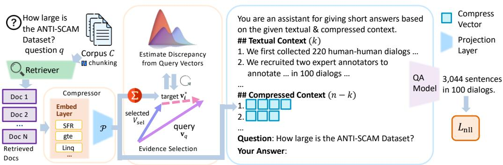
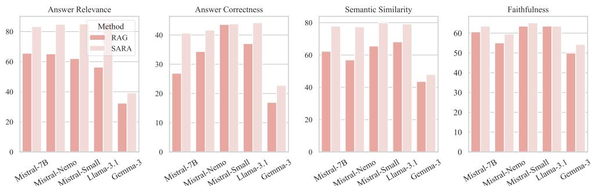
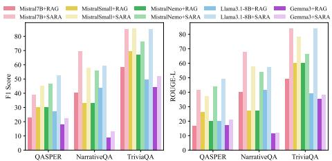
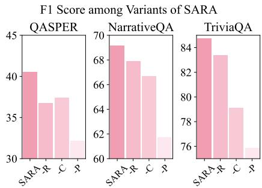
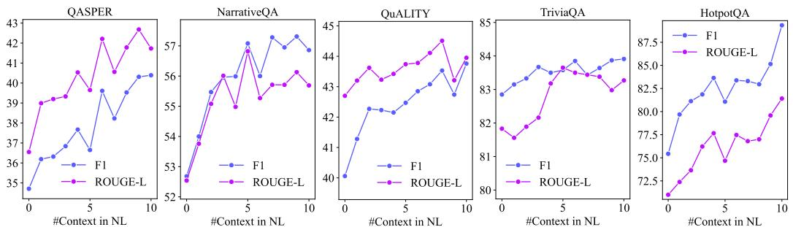
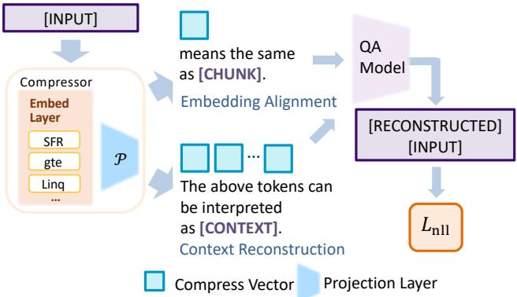
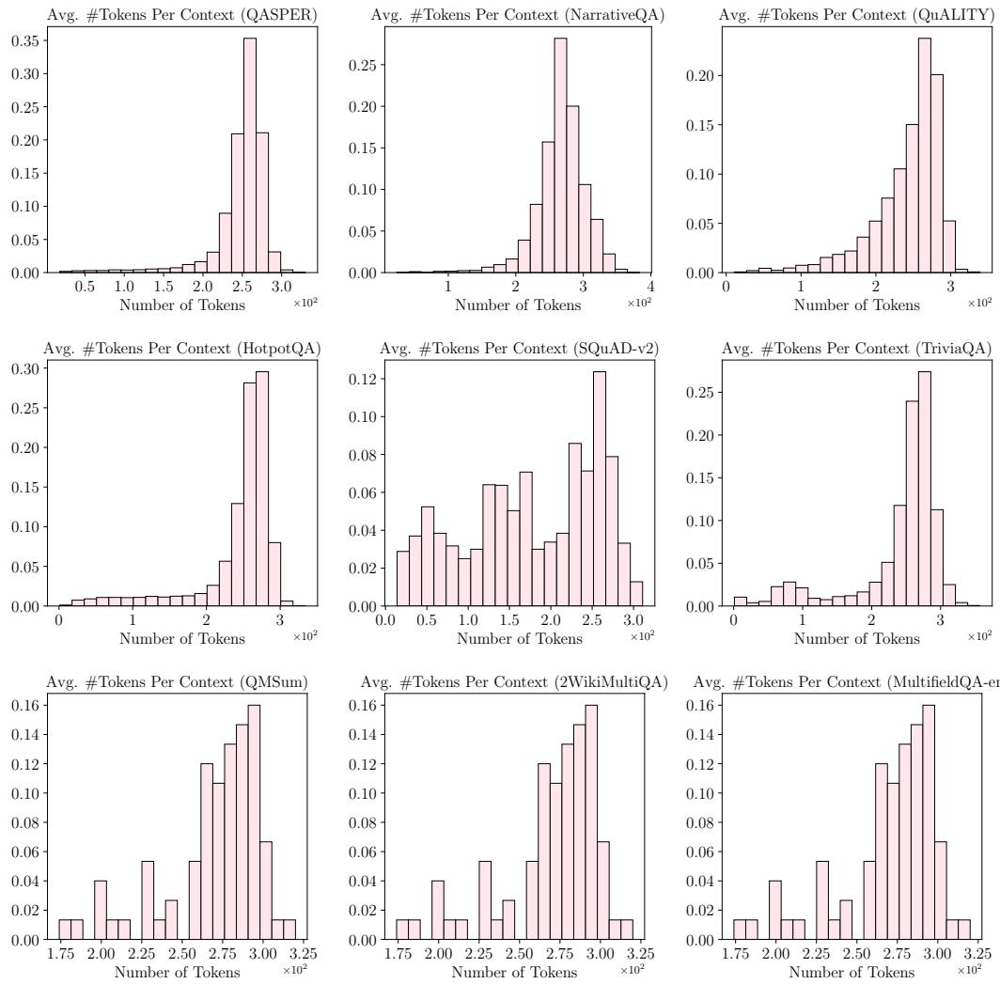
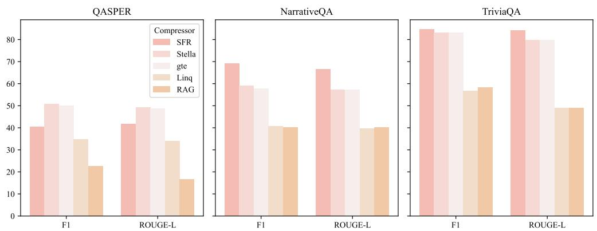
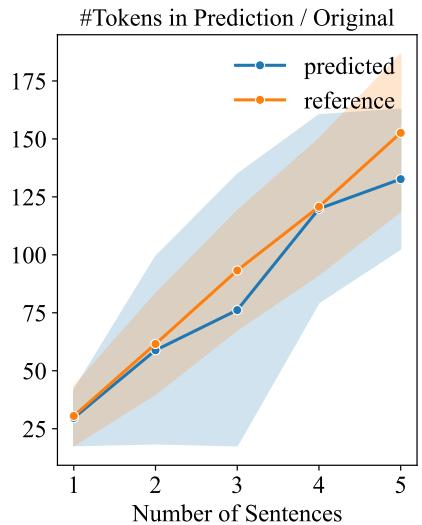
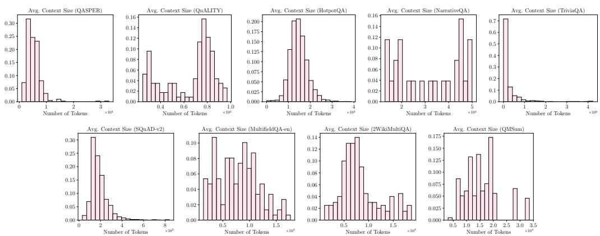

# SARA: Selective and Adaptive Retrieval-augmented Generation with Context Compression

Yiqiao Jin, Kartik Sharma Georgia Institute of Technology {ksartik,yjin328}@gatech.edu

Vineeth Rakesh, Yingtong Dou Visa Research {vinmohan,yidou}@visa.com

Menghai Pan, Mahashweta Das Visa Research {menpan,mahdas}@visa.com

Srijan Kumar Georgia Institute of Technology srijan@gatech.edu

# Abstract

Retrieval-augmented Generation (RAG) extends large language models (LLMs) with external knowledge but faces key challenges: restricted effective context length and redundancy in retrieved documents. Pure compression-based approaches reduce input size but often discard fine-grained details essential for factual accuracy. We propose SARA, a unified RAG framework that balances local precision and global knowledge coverage under tight context budgets. SARA combines naturallanguage text snippets with semantic compression vectors to jointly enhance context efficiency and answer correctness. It represents contexts at two complementary levels: 1) fine-grained natural-language spans that preserve critical entities and numerical values, and 2) compact, interpretable vectors that summarize high-level semantics. An iterative evidence-selection module employs the compression vectors for dynamic reranking of contexts. Across 9 datasets and 5 open-source LLMs spanning 3 model families (Mistral, Llama, and Gemma), SARA consistently improves answer relevance $( + 1 7 . 7 1 )$ , answer correctness $( + 1 3 . 7 2 )$ , and semantic similarity $( + 1 5 . 5 3 )$ , demonstrating the importance of integrating textual and compressed representations for robust, context-efficient RAG.

# 1 Introduction

Large language models (LLMs) have demonstrated remarkable capabilities across various natural language understanding and generation tasks (Xiao et al., 2024a; Zhao et al., 2024). Meanwhile, as LLMs are parametric in nature, their knowledge is inherently constrained by the scope, domain, and recency of their training data (Jin et al., 2024b; Liu et al., 2025). Retrieval-augmented generation (RAG) (Lewis et al., 2020) addresses this by retrieving from external non-parametric knowledge sources, essential for knowledge-intensive tasks.

Challenges. Despite its promise, RAG still faces key challenges in effectively retrieving, selecting, and integrating external evidence. 1) Limited Effective Context. While some LLMs support long inputs, their attention is biased toward earlier tokens (Li et al., 2024b), making them sensitive to input order and prone to overlooking important information near the end of the input (Yu et al., 2024). Extending usable context often requires costly, model-specific architectural changes (Ding et al., 2023). 2) Context Redundancy. Retrieved documents often include redundant or loosely structured content (e.g. transcripts or news articles) (Yu et al., 2024; Ge et al., 2024). Without careful post-processing, duplicate or irrelevant content inflates token usage, distracts the model, degrades answer quality or even leads to hallucinations. 3) Compression-fidelity Trade-off. Existing context compression techniques reduces input length but often sacrifice fine-grained details (e.g. numeric values, organization names, and geographical locations), leading to hallucinated or incomplete responses. While existing methods achieve high compression rates, aggressive compression process risk discarding critical information essential for factual accuracy.

This Work. We present SARA, a unified RAG framework that improves both retrieval and generation stages through structured evidence compression and adaptive selection. From the generation perspective, SARA represents long contexts using a small number of semantically rich, self-contained compression vectors, which act as lightweight abstractive summaries that preserve essential information while significantly reducing input length. Specifically, we leverage state-of-the-art embedding models (Meng et al., 2024; Muennighoff et al., 2023) to encode retrieved documents into multiple, semantically rich compression vectors. These vectors are also explainable and can be interpreted through auto-encoding to reveal their underlying semantics. From the retrieval perspective, SARA introduces an iterative evidence selection mechanism that leverages the compression vectors to dynamically refine the set of top-ranked documents. SARA progressively selects contexts based on the knowledge required to properly address the query and knowledge coverage of existing contexts, minimizing redundancy while maximizing informativeness. SARA is agnostic to the choice of embedding models, open-source LLMs, and retrievers. Our contributions are as follows:

• We propose SARA, a novel RAG framework for long-context tasks. SARA introduces a hybrid compression strategy, balancing local precision using natural language spans and global abstraction via compression vectors, enabling fine-grained reasoning and holistic understanding within strict context budgets.   
• We propose an iterative context refinement mechanism based on the compression vectors to dynamically optimize the retrieved context by reducing redundancy and prioritizing query-relevant content.   
• Comprehensive experiments on 5 LLMs spanning 3 model families, including Mistral-7B, MistralNemo-12B, MistralSmall-24B, Llama-3.1-8B, and Gemma3-4B, demonstrate that SARA consistently improves performance and generalizes well across LLMs (Section 3.3), retrievers (Section 3.4), and embedding models (Appendix B.2).

# 2 Method

# 2.1 Problem Formulation

A retrieval-augmented generation (RAG) pipeline consists of a retriever that fetches relevant evidence from a large-scale corpus based on the input query and a generator that synthesizes the evidence to answer the query. Given a query $q$ and corpus $C$ , the retriever $\mathcal { R } ( \cdot )$ selects the top- $\mathbf { \nabla } \cdot n$ relevant contexts $\nu _ { \mathrm { s e l } } \subseteq C$ . To improve effectiveness, RAG may incorporate a reranking step to reorder the input documents, prioritizing the most relevant ones for answer generation.

# 2.2 Overview

LLMs have limited effective context windows, and performance degrades when key information is buried in long inputs (Jiang et al., 2024). SARA mitigates this by compressing long context into compact vectors while selectively retaining essential evidence in natural language, preserving model capacity for the most relevant content.

SARA follows a two-stage training procedure: During Compression Learning, SARA learns to reconstruct original context from compression vectors. In Instruction-tuning, SARA is adapted to rerank the evidence using the compression vectors and reason over mixed inputs–combining natural language and compressed evidence. Our method is model-agnostic, compatible with any retrievers, embedding models, and open-source LLMs. A lightweight projection layer aligns the embedding space with the LLM space, requiring no significant changes to internal components like the attention mechanism, enabling seamless integration with future embedding models and LLMs. Sample prompts for all stages are provided in Table 9.

# 2.3 Compression Learning

An effective compression mechanism should meet three core principles: 1) Semantic Fidelity– preserving sufficient information for accurate context reconstruction; 2) Token Compatibility– producing compression vectors interpretable by LLMs via prompting; and 3) Scalability–requiring minimal adaptation across retrievers and LLMs.

  
Figure 1: SARA reasons over a mixture of compressed evidence and natural language contexts …to balance local precision and global coverage when generating responses. An iterative evidence reranking step selects contexts for relevance and diversity. The retriever, compressor, and QA model uses a variety of embedding models.

V1To meet these goals, SARA leverages sentence embeddings (Reimers and Gurevych, 2019) aligned KL-Divergencewith the LLM’s token space, enabling compact and interpretable representations that support reasoning under tight context budgets.

Metric1 (novelty):? −1Embedding Alignment. SARA encodes each text chunk into a compression vector that fits within Metric2 (relevance){?'}? = 1a single token’s embedding space (Figure 6). A lightweight compressor–combining a sentence embedding model and an MLP–is trained via an autoencoding task (Liu et al., 2023; Cheng et al., 2024) to align sentence embeddings with the LLM’s token space:

$$
\begin{array} { r } { \mathcal { L } _ { \mathrm { a l i g n } } ( s _ { i } ) = - \log P _ { \boldsymbol { \theta } } \left( s _ { i } \mid \mathrm { E n c } ( s _ { i } ) , x _ { \mathrm { i n s } } \right) . } \end{array}
$$

Here, $s _ { i }$ is a text chunk, $\operatorname { E n c } ( { \mathord { \cdot } } )$ is the compressor, $\theta$ is the model’s parameter, and $x _ { \mathrm { i n s } }$ …  is the decoding instruction such as “The token ${ \tt { C C } }$ …<C> <C> <C>can be interpreted as: [CHUNK].” As one compression vector has limited representation capacity, we segment each document into chunks, and encode each chunk as a separate compression vector. We adopt a curriculum learning strategy (Bengio et al., 2009; Wang et al., 2021) to improve training stability (Appendix A.1).

Context Reconstruction. After learning to decode individual compression vectors, we extend the model to full context reconstruction:

$$
\begin{array} { r } { \mathcal { L } _ { \mathrm { r e c o n s } } ( c ) = - \log P _ { \boldsymbol { \theta } } ( c \mid \{ \mathrm { E n c } ( s _ { i } ) , \forall s _ { i } \in c \} , x _ { \mathrm { i n s } } ) . } \end{array}
$$

Here, $c$ is a document composed of multiple chunks $\left\{ s _ { i } \right\}$ , each encoded as a separate vector. Unlike traditional extractive or abstractive summarization methods $\mathrm { { X u } }$ et al., 2024) that require multiple passes, these vectors naturally serve as high-ratio, parallelizable summaries.

Training Corpus Selection. Since the goal is to align the embedding spaces, the pretraining corpus is domain-agnostic and can be drawn from any natural language dataset. We use the Wikipedia dataset (Izacard et al., 2023), which provides broad topical diversity and diverse narrative styles, and has proven effective for language model pretraining (Gao et al., 2023). In Section B.1 and Tables 5/10, we demonstrate that these compression vectors are able to encode detailed information, such as exact organization names, academic terms, and numeric values.

# 2.4 Instruction-tuning and Inference

Simple ‘retrieve-and-read’ pipelines often implies redundant evidence and overlook interdependencies between previously retrieved and newly needed information (Wang et al., 2024). In long-context understanding, what should be retrieved next hinges on what has already been inferred from previously retrieved evidence (Sarthi et al., 2024; Li et al., 2024a). To address this, SARA leverages a 2-stage context refinement, which interleaves retrieval and reasoning: 1) a coarse retrieval step eliminating irrelevant documents while maintaining computational efficiency; 2) a fine-grained reranking step that iteratively refines contexts for informativeness, relevance, and diversity.

Instruction-tuning. Initially, SARA is instruct-tuned to holistically reason over both formats–the top$k$ passages are input as natural text, while the remaining are passed as compression vectors (Figure 1). For faster training, we instruct-tune the LLM generator on downstream tasks with LoRA (Hu et al., 2021) using top- $\boldsymbol { n }$ contexts retrieved via BM25 (Robertson et al., 2004).

Dynamic Evidence Reranking. Effective RAG requires balancing relevance–which ensures alignment with the user query–and novelty–which introduces new information beyond existing evidence. To achieve this, we adopt an iterative evidence selection method (Algorithm 1) that dynamically selects context based on its incremental value to model understanding.

Embedding-based Novelty ranks candidates based on their contribution to the model’s discrepancy in knowledge, selecting the vector that minimizes the discrepancy between the selected set $\mathcal { V } _ { \mathrm { s e l } }$ with the query representation ${ \bf v } _ { q }$ in the embedding space:

$$
\mathrm { S e l e c t E v i } ( q , \mathcal { V } _ { \mathrm { s e l } } , \mathcal { V } ) = \operatorname * { a r g m i n } _ { \boldsymbol { v } _ { i } \in \mathcal { V } \backslash \mathcal { V } _ { \mathrm { s e l } } } \| { \bf v } _ { q } - \mathrm { A g g r e g a t e } \left( \{ \mathrm { E n c } ( \boldsymbol { v } ) \mid \boldsymbol { v } \in \mathcal { V } _ { \mathrm { s e l } } \cup \{ \boldsymbol { v } _ { i } \} \} \right) \| _ { 2 } .
$$

Since the user query is usually succinct, we supplement the query representation $\mathbf { v } _ { q }$ by aggregating the embeddings of both the question and the top-1 retrieved context: $\mathbf { v } _ { q } = \operatorname { A v g } ( \operatorname { E n c } ( q ) , \operatorname { E n c } ( v _ { 1 } ) )$ .

Conditional Self-information $( C S I )$ . An alternative is to select evidence based on CSI (Shannon, 1948), which quantifies the surprisal of new evidence given previously selected evidence:

$$
\begin{array} { r l } & { \mathrm { S e l e c t E v i } ( q , \mathcal { V } _ { \mathrm { s e l } } , \mathcal { V } ) = \underset { v _ { i } \in V \backslash \mathcal { V } _ { \mathrm { s e l } } } { \mathrm { a r g m a x } } I ( v _ { i } | \mathcal { V } _ { \mathrm { s e l } } ) } \\ & { \qquad I ( v _ { i } | \mathcal { V } _ { \mathrm { s e l } } ) = \displaystyle \frac { 1 } { | v _ { i } | } \sum _ { j = 1 } ^ { | v _ { i } | } - \log P ( w _ { i } ^ { j } \mid v _ { i } \in \mathcal { V } _ { \mathrm { s e l } } , w _ { i } ^ { 1 } , \dots , w _ { i } ^ { j - 1 } ) } \end{array}
$$

where $I ( v _ { i } | \mathcal { V } _ { \mathrm { s e l } } ) = - \log P ( v _ { i } | \mathcal { V } _ { \mathrm { s e l } } )$ is the conditional self-information of context $v _ { j }$ given selected contexts $\mathcal { V } _ { \mathrm { s e l } }$ , estimated using a smaller proxy language model. Higher CSI introduces novel information, while lower CSI suggests redundancy with previously selected content. Filtering low-CSI candidates reduces repetition and enhances context diversity with minimal impact on overall informativeness.

# Algorithm 1 Query Expansion and Novelty-Based Evidence Selection.

Input: Corpus $\mathcal { C } = \{ v _ { i } \} _ { i = 1 } ^ { | c | }$ , query $q$ , number of top contexts $n , k$   
Output: Ranked evidence set $\mathcal { V } _ { \mathrm { s e l } }$   
1: $\mathcal { V } = \mathrm { R e t r i e v e r } ( q , \mathcal { C } )$ $\triangleright$ Retrieve top $n$ contexts.   
2: $\mathbf { v } _ { q } = \operatorname { A v g } ( \operatorname { E n c } ( q ) , \operatorname { E n c } ( v _ { 1 } ) )$ $\triangleright$ Initialize query embedding with top-1 retrieval $v _ { 1 }$ .   
3: $\mathcal { V } _ { \mathrm { s e l } }  \{ v _ { 1 } \}$ $\triangleright$ Initialize the set of selected contexts.   
4: for $j = 2$ to $k$ do   
5: $\hat { \mathbf { v } } = \operatorname { A g g r e g a t e } ( \operatorname { E n c } ( v ) , v \in \mathcal { V } _ { \mathrm { s e l } } )$ ▷ Aggregate embeddings of $\mathcal { V } _ { \mathrm { s e l } }$ .   
6: $v _ { i } ^ { * } = \mathrm { S e l e c t E v i } ( q , \mathcal { V } _ { \mathrm { s e l } } , \mathcal { V } )$ ▷ Evaluate and select context via Eq. 3 or 4.   
7: $\mathcal { V } _ { \mathrm { s e l } }  \mathcal { V } _ { \mathrm { s e l } } \cup \{ v _ { i } ^ { * } \}$ ▷ Update the selected context set.   
8: end for   
9: return $\mathcal { V } _ { \mathrm { s e l } }$

# 3 Evaluation

# 3.1 Experimental Setup

Baselines. We compare our methods with 8 baselines spanning 3 categories: 1) Standard RAG (Lewis et al., 2020), which directly feed retrieved documents to the input prompt; 2) Compression-based methods, which condense input passages before feeding them into the LLM, including LLMLingua (Jiang et al., 2023b), LongLLMLingua (Jiang et al., 2024), ICAE (Ge et al., 2024), and xRAG (Cheng et al., 2024); 3) Summarization-based methods, which generate intermediate summaries over retrieved documents to support more focused reasoning, including Raptor (Sarthi et al., 2024), GraphRAG (Edge et al., 2024), and InstructRAG (Wei et al., 2025). For summarization-based approaches such as Raptor and GraphRAG, which rely on community-level summarization and long-context reasoning, we adopt the more powerful GPT-4o (OpenAI, 2025) as the base model, following prior work (Luo et al., 2025; Li et al., 2025), as open-source models struggle with reasoning over long complex inputs.

Generalizability Experiments. To demonstrate the modularity and robustness of our approach, we evaluate its generalizability across different retrieval, embedding, and generation components. For the retrieval module, we experiment with both sparse and dense retrievers, including BM25 (Robertson et al., 2004), bge-reranker-v2-m3 (Li et al., 2023a) and SFR-Embedding (Meng et al., 2024).

Datasets. We evaluate our approach across diverse datasets spanning different domains, input length, and task types: 1) Short-context question answering, including SQuAD-v2.0 (Rajpurkar et al., 2018) 2) Long-context question answering, which requires responses based on a single long document, including NarrativeQA (Kocisk ˇ y et al., 2018), QASPER (Dasigi et al., 2021), QuALITY (Pang et al., \` 2022), and MultifieldQA-en (Bai et al., 2024); 3) Multi-hop reasoning, which requires multi-hop inference across documents, including HotpotQA (Yang et al., 2018), TriviaQA (Joshi et al., 2017), 2WikiMultihopQA (Ho et al., 2020); 4) Summarization, including QMSum (Zhong et al., 2021). We use SQuAD-v2, NarrativeQA, QASPER, QuALITY, HotpotQA, and TriviaQA for both training and evaluation. MultifieldQA-en, 2WikiMultihopQA, and QMSum are held out for out-of-domain evaluation only. Detailed dataset descriptions and statistics are in Appendix A.2.

<table><tr><td rowspan="2">Dataset Metrics</td><td colspan="2">QASPER</td><td colspan="2">NarrativeQA</td><td colspan="2">TriviaQA</td><td colspan="2">QuALITY</td><td colspan="2">HotpotQA</td></tr><tr><td>F1</td><td>R-L</td><td>F1</td><td>R-L</td><td>F1</td><td>R-L</td><td>F1</td><td>R-L</td><td>F1</td><td>R-L</td></tr><tr><td>RAG</td><td>22.73</td><td>16.71</td><td>40.23</td><td>40.16</td><td>58.43</td><td>49.07</td><td>31.79</td><td>31.63</td><td>48.56</td><td>40.06</td></tr><tr><td>Raptor</td><td>31.77</td><td>25.26</td><td>56.60</td><td>56.91</td><td>70.51</td><td>65.46</td><td>34.27</td><td>34.49</td><td>68.26</td><td>63.14</td></tr><tr><td>GraphRAG</td><td>37.05</td><td>36.66</td><td>64.93</td><td>63.55</td><td>77.52</td><td>72.35</td><td>37.21</td><td>38.15</td><td>73.23</td><td>68.21</td></tr><tr><td>xRAG</td><td>32.36</td><td>33.72</td><td>33.43</td><td>32.15</td><td>43.36</td><td>35.52</td><td>32.65</td><td>33.84</td><td>60.19</td><td>49.56</td></tr><tr><td>InstructRAG</td><td>32.83</td><td>33.92</td><td>41.79</td><td>39.85</td><td>76.47</td><td>72.19</td><td>37.98</td><td>38.30</td><td>66.77</td><td>60.18</td></tr><tr><td>SARA-CSI</td><td>38.83</td><td>41.52</td><td>69.46</td><td>68.02</td><td>85.08</td><td>83.85</td><td>42.78</td><td>44.18</td><td>84.21</td><td>78.16</td></tr><tr><td>SARA-EMB</td><td>40.55</td><td>41.71</td><td>69.15</td><td>66.55</td><td>84.74</td><td>84.17</td><td>42.59</td><td>44.31</td><td>83.77</td><td>76.37</td></tr><tr><td>Impr. %</td><td>9.4%</td><td>13.8%</td><td>7.0%</td><td>7.0%</td><td>9.8%</td><td>16.3%</td><td>12.6%</td><td>15.7%</td><td>15.0%</td><td>14.6%</td></tr></table>

Table 1: Performance of SARA, vanilla RAG, and state-of-the-art summarization-based methods.

Metrics. We adopt standard evaluation protocols consistent with prior work (Asai et al., 2023; Cheng et al., 2024; Sarthi et al., 2024; Edge et al., 2024). For holistic evaluation, we report both traditional lexical metrics–including ROUGE (R-L) (Lin, 2004), F1 match scores–and LLM-based metrics (Es et al., 2024), including response relevance, answer correctness, semantic similarity, and faithfulness. Full metric definitions and implementation details are in Appendix A.3.

<table><tr><td rowspan="2">Model</td><td rowspan="2"></td><td colspan="2">QASPER</td><td rowspan="2">Faith.</td><td rowspan="2">Rele.</td><td colspan="2">QuALITY</td><td rowspan="2">Faith.</td></tr><tr><td>Correct.</td><td>Sim.</td><td>Correct.</td><td>Sim.</td></tr><tr><td>ICAE</td><td>75.45</td><td>24.03</td><td>59.48</td><td>21.72</td><td>63.33</td><td>22.18</td><td>59.84</td><td>31.05</td></tr><tr><td>LLMLingua</td><td>79.83</td><td>23.97</td><td>61.08</td><td>25.31</td><td>85.58</td><td>36.06</td><td>79.61</td><td>41.19</td></tr><tr><td>LongLLMLingua</td><td>82.77</td><td>22.86</td><td>62.17</td><td>29.77</td><td>86.87</td><td>38.90</td><td>83.09</td><td>40.86</td></tr><tr><td>SARA</td><td>85.35</td><td>25.74</td><td>63.99</td><td>31.95</td><td>89.23</td><td>49.71</td><td>83.51</td><td>43.57</td></tr></table>

Table 2: Evaluation results across QASPER and QuALITY with a context length budget of 512 tokens. We report Response Relevance (Rele.), Answer Correctness (Correct.), Semantic Similarity (Sim.), and Faithfulness (Faith.) in percentages. Results on other datasets are in Appendix Table 11.

# 3.2 Overall Performance

Results under Context Constraints. Tables 2 and 3 compare SARA and strong compressionbased methods under strict context length constraints (512 and 1024 tokens). SARA consistently outperforms baselines on both lexical (F1, ROUGE-L) and LLM-based evaluation metrics. Under 512 tokens, SARA improves F1 by $1 9 . 4 \%$ and ROUGE-L by $2 0 . 8 \%$ on average. We observe that the gains are particularly significant on knowledge-intensive tasks like TriviaQA $( + 2 4 . 5 \% )$ and HotpotQA $( + 2 9 . 0 \% )$ , which require facts and reasoning. Improvements on narrative-style tasks (e.g. NarrativeQA) are more modest, particularly under 1024 tokens $( + 6 . 6 \%$ F1 and $6 . 8 \%$ ROUGE-L), likely because chunking and compression can change the narrative flow and obscure subtle discourselevel cues. Unlike factoid questions, narrative questions demand holistic coherence that is harder to retain under chunking and summarization (Ge et al., 2024).

Impact of Context Budgets. Increasing the context budget from 512 to 1024 tokens generally improves performance. Baselines that produce natural language compression (e.g., LongLLMLingua) see substantial gains–up to $+ 1 0 . 6$ F1 on NarrativeQA–as the additional budget reduces the need to truncate or overly compress passages, allowing inputs to better reflect their original structure. SARA retains a clear performance lead, outperforming the strongest baseline by 6-12 F1 on knowledge-intensive tasks such as TriviaQA and HotpotQA.

<table><tr><td rowspan="2">512 tokens</td><td colspan="2">QASPER</td><td colspan="2">NarrativeQA</td><td colspan="2">TriviaQA</td><td colspan="2">QuALITY</td><td colspan="2">HotpotQA</td></tr><tr><td>F1</td><td>R-L</td><td>F1</td><td>R-L</td><td>F1</td><td>R-L</td><td>F1</td><td>R-L</td><td>F1</td><td>R-L</td></tr><tr><td>ICAE</td><td>26.64 23.53</td><td></td><td>37.58</td><td>38.08</td><td>53.47</td><td>49.16</td><td>26.79</td><td>28.20</td><td></td><td>53.18 44.05</td></tr><tr><td>LLMLingua</td><td>31.29</td><td>32.38</td><td>50.26</td><td>48.58</td><td>63.22</td><td>58.95</td><td>30.53</td><td>31.48</td><td>57.36</td><td>49.30</td></tr><tr><td>LongLLMLingua 29.49</td><td></td><td>28.31</td><td>41.90</td><td>39.27</td><td>66.28</td><td>62.76</td><td>36.13</td><td>38.03</td><td>64.34</td><td>60.32</td></tr><tr><td>SARA</td><td>36.23</td><td>39.17</td><td>55.64</td><td>54.90</td><td>82.50</td><td>81.74</td><td>42.27</td><td>43.62</td><td>83.03</td><td>75.56</td></tr><tr><td>Impr. %</td><td>15.8</td><td>21.0</td><td>10.7</td><td>13.0</td><td>24.5</td><td>30.2</td><td>17.0</td><td>14.7</td><td>29.0</td><td>25.3</td></tr><tr><td rowspan="2">1024 tokens</td><td colspan="2">QASPER</td><td colspan="2">NarrativeQA</td><td colspan="2">TriviaQA</td><td colspan="2">QuALITY</td><td colspan="2">HotpotQA</td></tr><tr><td>F1</td><td>R-L</td><td>F1</td><td>R-L</td><td>F1</td><td>R-L</td><td>F1</td><td>R-L</td><td>F1</td><td>R-L</td></tr><tr><td>ICAE</td><td>31.82</td><td>33.32</td><td>36.70</td><td>38.35</td><td>51.07</td><td>49.78</td><td></td><td>28.15 29.88</td><td>64.51</td><td>55.60</td></tr><tr><td>LLMLingua</td><td>33.18</td><td>32.19</td><td>50.09</td><td>52.46</td><td>71.92</td><td>67.01</td><td>33.82</td><td>34.90</td><td>62.80</td><td>60.71</td></tr><tr><td>LongLLMLingua 34.09</td><td></td><td>33.47 52.48</td><td></td><td>51.17</td><td>72.64</td><td>67.47</td><td>36.57</td><td>33.18</td><td>69.21</td><td>67.88</td></tr><tr><td>SARA</td><td>40.37</td><td>42.24</td><td>55.96</td><td>56.01</td><td>83.67</td><td>82.16</td><td>42.40</td><td>44.19</td><td>83.77</td><td>76.37</td></tr><tr><td>Impr. %</td><td>18.4</td><td>26.2</td><td>6.6</td><td>6.8</td><td>15.2</td><td>21.8</td><td>15.9</td><td>26.6</td><td>21.0</td><td>12.5</td></tr></table>

Table 3: Performance of compression methods under context length constraints (512/1024 tokens) in terms of F1 scores and ROUGE-L (R-L). Improvements over the best models are shown with Impr. $\%$ .

As SARA has already captured key content efficiently under a lower context budget using its hybrid compression strategy, it exhibits relatively modest gains on certain datasets (e.g., $+ 4 . 1$ F1 on QASPER).

Balancing Compression Efficiency and Answer Faithfulness. A central challenge in RAG is balancing compression efficiency with faithfulness. Aggressive approaches like xRAG, which compress entire evidence sets into a single dense vector, optimize for efficiency but often at the cost of factuality and hallucination. As shown in Table 1, baselines like xRAG especially struggle on knowledge-intensive tasks, achieving only $4 3 . 4 \ : \mathrm { F 1 }$ and 35.5 ROUGE-L on TriviaQA, in contrast to SARA’s 85.1 F1 and 83.9 ROUGE-L. Qualitative analysis in Table 7 reveals that baselines can hallucinate content, generating answers with fabricated entities or tasks (‘sentiment analysis’ and ‘machine translation’) ungrounded in the original documents. Methods that over-compress inputs (e.g. ICAE) risk discarding critical content. As a result, the model tends to become overly conservative-frequently concluding that the answer is not present. These failures underscore the drawbacks of one-shot compression when multiple facts must be retained. In contrast, SARA can accurately recovers fine-grained content, such as specific task names (e.g. NLI, document and intent classification) prompted in the question) with high fidelity, even under tight context budgets. Thus, SARA’s hybrid approach preserves salient content, simplifying key information while mitigating factual distortion under tight context budgets.

<table><tr><td rowspan="2">Dataset Metrics</td><td>SQuAD-v2</td></tr><tr><td>F-1 R-L</td></tr><tr><td>RAG</td><td>63.65 51.26</td></tr><tr><td>Raptor</td><td>70.69 65.28</td></tr><tr><td>GraphRAG</td><td>74.82 67.36</td></tr><tr><td>xRAG</td><td>60.19 49.56</td></tr><tr><td>InstructRAG</td><td>67.21 57.94</td></tr><tr><td>ICAE</td><td>50.31 40.82</td></tr><tr><td>LLMLingua</td><td>70.24 65.12</td></tr><tr><td>LongLLMLingua</td><td>72.57 67.03</td></tr><tr><td></td><td></td></tr><tr><td>SARA</td><td>76.55 69.22</td></tr></table>

Table 4: Performance comparison on the SQuAD-v2 dataset.

Comparison with Summarization-based methods SARA consistently outperforms standard RAG and state-of-the-art summarization-based baselines, including Raptor and GraphRAG, despite their use of stronger base models like GPT-4o (OpenAI, 2025) for question-answering and summarization. On HotpotQA, which requires multi-hop reasoning, SARA achieves $+ 1 5 \%$ F1 and $+ 1 4 . 6 \%$ ROUGEL. These results highlight the effectiveness of our compression approach in helping the model accommodate and reason over multiple discrete evidence pieces within constrained context windows.

Performance on Short-context QA. SQuAD-v2 presents minimal challenges in context length, as each query is paired with a single passage that fits within the model’s input window in most cases. Accordingly, the performance gap across models narrows. SARA achieves the highest results (76.55 F1, 69.22 ROUGE-L; Table 4), outperforming the strongest baseline by a modest margin $( + 3 . 9 8 \ : \mathrm { F 1 }$ , $+ 2 . 1 9$ ROUGE-L). In contrast, aggressively compressed systems such as xRAG and ICAE perform significantly worse $\leq 6 0 . 1 9 \mathrm { F } 1$ ), likely due to summaries that obscures critical details–such as entity names, numeric values, and specific events–reducing accuracy even when full text fits into the model.

  
Figure 3: Performance of RAG and SARA across different LLMs in terms of LLM-based metrics on QASPER (Dasigi et al., 2021).

# 3.3 Generalization across LLM Architectures & Sizes.

Beyond Mistral-7B, we evaluate SARA on 4 additional models from 3 families–Mistral, Llama, and Gemma–spanning various sizes and architectures: MistralNemo-12B, MistralSmall-24B, Llama3.1- 8B, and Gemma3-4B. As shown in Figures 3 and 2, SARA consistently outperforms the baseline, with up to $+ 4 0$ in Answer Relevance, $+ 1 4$ in Answer Correctness, and $+ 2 1$ in Semantic Similarity. Improvements are particularly pronounced on smaller models. On Mistral-7B, SARA boosts answer relevance by 17.71, answer correctness by 13.72, and semantic similarity by 15.53. These results highlight the method’s ability to optimize context usage under tighter context budgets, making it especially effective for smaller models. In some cases, SARA enables a 7B model to match or surpass much larger ones (e.g., MistralSmall-24B), highlighting that reasoning over mixed-format contexts can close the performance gap without increasing model sizes.

In general, performance gains are more significant when the compressor and LLM share the same architecture (e.g. Mistral). Among the Mistral family, we observe an average boost in Answer Relevance of 20.12 and Answer Correctness of 7.07. MistralNemo and MistralSmall achieve improvements in response relevance of $+ 1 9 . 6 5$ and $+ 2 3 . 0 1 $ , and semantic similarity of $+ 2 0 . 4 4$ and $+ 1 4 . 3 8$ , respectively. This suggests that architectural alignment between the compressors and LLMs enhances semantic compatibility between compressed inputs and answer generation. In contrast, Gemma-3 shows modest gains (e.g. $+ 6 . 8 3$ i n answer relevance and $+ 5 . 8 2$ in answer correctness), likely due to its architectural mismatch.

  
Figure 2: Generalizability across models. We report lexical metrics (F1 score and ROUGEL) on QASPER (Dasigi et al., 2021) before and after applying SARA.

Note that SARA does not aim to directly enhance the QA model’s intrinsic generation capability. Instead, its strength lies in refining and reorganizing retrieved contexts to support finer-grained reasoning. Since both SARA and RAG leverage the same initial retriever, they operate over comparable evidence. As a result, faithfulness–the factual consistency with the retrieved context–shows modest improvements.

# 3.4 Generalization Across Retrievers

We evaluate SARA with dense retrievers like multi-qa-mpnet-base-cos-v1 (Song et al., 2020) and SFR (Meng et al., 2024) in addition to BM25 (Robertson et al., 2004). As shown in Table 12, SARA performs consistently across retrievers, confirming its model-agnostic design. Dense retrievers, especially SFR, yield stronger results–achieving $+ 1 9$ F1 over BM25 on QASPER–highlighting the value of semantically richer base retrievers for complex, multi-hop QA. Overall, SARA remains robust to retriever choice while benefiting from higher-quality evidence.

<table><tr><td rowspan=1 colspan=2>Decoded Text                                       Original Text</td></tr><tr><td rowspan=1 colspan=1>We release the code and the data.</td><td rowspan=1 colspan=1>We release the code and data.</td></tr><tr><td rowspan=1 colspan=1>Also, we build a persuasive dialogue system topersuade people to donate to charity.</td><td rowspan=1 colspan=1>Furthermore, we also build a persuasion dialogsystem to persuade people to donate to charities.</td></tr><tr><td rowspan=1 colspan=1>Rigid templates limit creativity and diversity, re-sulting in loss of user engagement.</td><td rowspan=1 colspan=1>However, rigid templates lead to limited diver-sity, causing the user losing engagement.</td></tr><tr><td rowspan=1 colspan=1>The generation model is good at producing di-verse responses but lacks coherence.</td><td rowspan=1 colspan=1>On the other hand, language generation modelscan generate diverse responses but are bad atbeing coherent.</td></tr><tr><td rowspan=1 colspan=1>Collaborative end-to-end systems have been de-veloped to a great extent for the goal to builda user-friendly system that enables participantsto work together with the system to achieve acommon goal.</td><td rowspan=1 colspan=1>Considerable progress has been made buildingend-to-end dialog systems for collaborative tasksin which users cooperate with the system toachieve a common goal.</td></tr><tr><td rowspan=1 colspan=1>We use a hierarchical annotation scheme. Thisgeneric annotation method can be applied to dif-ferent tasks.</td><td rowspan=1 colspan=1>To handle social content, we introduce a hierar-chical intent annotation scheme, which can begeneralized to different non-collaborative dialogtasks.</td></tr></table>

Table 5: Decoded text from compression vectors using Mistral-7B-Instruct-v0.2 (Jiang et al., 2023a) as the base model. Information omitted from one text but present in the other is underlined. Compared to the original, SARA retains concise semantics and excels at capturing high-level concepts. In some cases, it may lose fine-grained details such as specific entities and numerical values.

# 3.5 Ablation Studies

To quantify the contribution of each major component–compression, reconstruction, and reranking– we evaluate 3 variants of SARA. SARA-C removes the Compression vectors and only process contexts in natural language formats. SARA-P removes the context reconstruction objective during training (Section 2.3). SARA-R skips the adaptive reranking stage, relying solely on initial BM25 retrieval (Section 2.4).

Context Reconstruction is Critical. Removing the reconstruction objective (SARA-P) results in the most substantial performance drop (Figure 4)–7-9 F1 across all datasets. This confirms that learning to reconstruct full contexts from compressed vectors is essential for preserving semantic and leveraging these vectors for accurate answer generation.

Compression Enhances Robustness. Disabling compression (SARA-C) also leads to consistent performance declines, especially on TriviaQA (-5.6 F1) where the longform contexts are potentially noisy or irrelevant. Compression helps filter salient content and suppress redundancy, enhancing answer correctness.

  
Figure 4: Performance of SARA’s variants.

Reranking offers Measurable Gains. Removing reranking (SARA-R) yields modest but consistent drops, confirming that compression-aware reranking improves evidence selection beyond lexical similarity–especially when initial retrieval are suboptimal–at minimal computational cost.

# 3.6 Sensitivity Analysis

We evaluate SARA’s ability to leverage compressed context by fixing the total number of retrieved contexts $N = 1 0$ ) and varying $k$ , the number of top-ranked passages retained in natural language. As shown in Figure 5, performance remains strong even with minimal natural language input (e.g., $k = 1$ $\mathrm { F 1 = 3 8 . 5 4 }$ , ROUGE- $\mathrm { \cdot L = 3 9 . 8 9 }$ ), indicating that compression vectors retain essential information. Performance improves with larger $k$ but plateaus around $k = 8$ $\mathrm { F 1 } = 4 1 . 6$ , ROUGE- $\mathrm { . L = 4 3 . 1 2 } \mathrm { , }$ ), and slightly drops at $k = 9$ , suggesting diminishing returns or noise from excessive natural language content. These results highlight the effectiveness of our hybrid strategy in balancing context utility, informativeness, and efficiency.

  
Figure 5: Sensitivity analysis with total contexts fixed at $N = 1 0$ , varying the number of natural language contexts $k$ . Performance improves as $k$ increases, peaking around $k = 7 { - } 8$ , and slightly declines beyond 8. SARA achieves strong performance by optimally balancing natural language and compressed contexts, effectively minimizing token overhead without sacrificing accuracy.

To further illustrate such effects, Table 8 shows how increasing $k$ within a specific range improves factual specificity. With only compressed context (0/10), the model is able to identify a single entity name (CoNLL-2003), whereas increasing $k = 5$ enables the model to produce answers with high fidelity. Our hybrid approach allows for such precision without overwhelming the context budget.

# 4 Related Work

# 4.1 Retrieval-augmented Generation (RAG)

Retrieval-augmented Generation has become a standard practice for knowledge-intensive tasks. Instead of treating LLMs as knowledge repositories, RAG generates answers using an external knowledge base (Lewis et al., 2020; Sharma et al., 2024). This approach helps them address model knowledge cutoffs and insufficient training coverage. As a common challenge for RAG models, LLMs struggle to process long, chunked retrieved contexts effectively, even with extended context windows (Yu et al., 2024). Recent work such as Raptor (Sarthi et al., 2024), GraphRAG (Edge et al., 2024) and GraphReader (Li et al., 2024a) focus on improving the retrieval and augmentation stages by structuring retrieved content, enhancing RAG through semantic or graph-based organization of knowledge, leading to more relevant and compact inputs for generation.

# 4.2 Context Compression

Context compression is essential for reducing inference costs and maintaining language understanding capabilities in long-context (Pan et al., 2024) or multi-turn scenarios (Kim et al., 2024a). Prior work approach this in two main directions: natural-language (NL)-based compression and representation-level compression. NL-based compression (Zhang et al., 2024b; Chirkova et al., 2025) like ADACOMP (Zhang et al., 2024b), COMPACT (Yoon et al., 2024), and EXIT (Hwang et al., 2024) condense prompts or histories into concise natural language summaries, typically using extractive or abstractive summarization. These methods are generally model-agnostic and applicable across both open-source and proprietary LLMs (Zhu et al., 2025). Representation-based methods (Chevalier et al., 2023; Munkhdalai et al., 2024; Louis et al., 2025b,a), on the other hand, treat the LLM as a white box and modify attention calculation (Munkhdalai et al., 2024), positional encodings (Jin et al., $2 0 2 4 \mathrm { a }$ ; Zhang et al., 2024c), or embeddings (Cheng et al., 2024). Methods such as xRAG (Cheng et al., 2024), GIST (Mu et al., 2023), and ICAE (Ge et al., 2024) project instructions demonstrations, or the context into the language models’ space. While compression improves efficiency, it often introduces a performance trade-off. Our work focuses on leveraging compression to improve retrieval and generation quality in RAG settings.

# 5 Conclusion

We present SARA, a unified and efficient RAG framework that enhances both retrieval and generation through structured evidence compression and adaptive document selection without significant architectural changes to the LLM. Experiments across multiple LLM backbones, retrievers, and embedding models demonstrate that SARA significantly improves answer correctness and relevance.

References   
Akari Asai, Zeqiu Wu, Yizhong Wang, Avirup Sil, and Hannaneh Hajishirzi. Self-rag: Learning to retrieve, generate, and critique through self-reflection. In ICLR, 2023.   
Yushi Bai, Xin Lv, Jiajie Zhang, Hongchang Lyu, Jiankai Tang, Zhidian Huang, Zhengxiao Du, Xiao Liu, Aohan Zeng, Lei Hou, et al. Longbench: A bilingual, multitask benchmark for long context understanding. In ACL, pages 3119–3137, 2024.   
Yoshua Bengio, Jérôme Louradour, Ronan Collobert, and Jason Weston. Curriculum learning. In ICML, pages 41–48, 2009.   
Xin Cheng, Xun Wang, Xingxing Zhang, Tao Ge, Si-Qing Chen, Furu Wei, Huishuai Zhang, and Dongyan Zhao. xrag: Extreme context compression for retrieval-augmented generation with one token. arXiv:2405.13792, 2024.   
Alexis Chevalier, Alexander Wettig, Anirudh Ajith, and Danqi Chen. Adapting language models to compress contexts. In EMNLP, pages 3829–3846, 2023.   
Nadezhda Chirkova, Thibault Formal, Vassilina Nikoulina, and Stéphane Clinchant. Provence: efficient and robust context pruning for retrieval-augmented generation. arXiv:2501.16214, 2025.   
Pradeep Dasigi, Kyle Lo, Iz Beltagy, Arman Cohan, Noah A Smith, and Matt Gardner. A dataset of information-seeking questions and answers anchored in research papers. In NAACL, pages 4599–4610, 2021.   
Jiayu Ding, Shuming Ma, Li Dong, Xingxing Zhang, Shaohan Huang, Wenhui Wang, Nanning Zheng, and Furu Wei. Longnet: Scaling transformers to 1,000,000,000 tokens. arXiv:2307.02486, 2023.   
Darren Edge, Ha Trinh, Newman Cheng, Joshua Bradley, Alex Chao, Apurva Mody, Steven Truitt, and Jonathan Larson. From local to global: A graph rag approach to query-focused summarization. arXiv:2404.16130, 2024.   
Shahul Es, Jithin James, Luis Espinosa Anke, and Steven Schockaert. Ragas: Automated evaluation of retrieval augmented generation. In EACL, pages 150–158, 2024.   
Tianyu Gao, Howard Yen, Jiatong Yu, and Danqi Chen. Enabling large language models to generate text with citations. In EMNLP, pages 6465–6488. ACL, 2023.   
Tao Ge, Hu Jing, Lei Wang, Xun Wang, Si-Qing Chen, and Furu Wei. In-context autoencoder for context compression in a large language model. In ICLR, 2024.   
Xanh Ho, Anh-Khoa Duong Nguyen, Saku Sugawara, and Akiko Aizawa. Constructing a multi-hop qa dataset for comprehensive evaluation of reasoning steps. In COLING, pages 6609–6625, 2020.   
Edward J Hu, Phillip Wallis, Zeyuan Allen-Zhu, Yuanzhi Li, Shean Wang, Lu Wang, Weizhu Chen, et al. Lora: Low-rank adaptation of large language models. In ICLR, 2021.   
Taeho Hwang, Sukmin Cho, Soyeong Jeong, Hoyun Song, SeungYoon Han, and Jong C Park. Exit: Context-aware extractive compression for enhancing retrieval-augmented generation. arXiv:2412.12559, 2024.   
Gautier Izacard, Patrick Lewis, Maria Lomeli, Lucas Hosseini, Fabio Petroni, Timo Schick, Jane Dwivedi-Yu, Armand Joulin, Sebastian Riedel, and Edouard Grave. Atlas: Few-shot learning with retrieval augmented language models. JMLR, 24(251):1–43, 2023.   
Albert Q Jiang, Alexandre Sablayrolles, Arthur Mensch, Chris Bamford, Devendra Singh Chaplot, Diego de las Casas, Florian Bressand, Gianna Lengyel, Guillaume Lample, Lucile Saulnier, et al. Mistral 7b. arXiv preprint arXiv:2310.06825, 2023a.   
Huiqiang Jiang, Qianhui Wu, Chin-Yew Lin, Yuqing Yang, and Lili Qiu. Llmlingua: Compressing prompts for accelerated inference of large language models. In EMNLP, pages 13358–13376, 2023b.

Huiqiang Jiang, Qianhui Wu, Xufang Luo, Dongsheng Li, Chin-Yew Lin, Yuqing Yang, and Lili Qiu. Longllmlingua: Accelerating and enhancing llms in long context scenarios via prompt compression. In ACL, 2024.

Hongye Jin, Xiaotian Han, Jingfeng Yang, Zhimeng Jiang, Zirui Liu, Chia-Yuan Chang, Huiyuan Chen, and Xia Hu. Llm maybe longlm: Selfextend llm context window without tuning. In ICML, pages 22099–22114, 2024a.

Yiqiao Jin, Mohit Chandra, Gaurav Verma, Yibo Hu, Munmun De Choudhury, and Srijan Kumar. Better to ask in english: Cross-lingual evaluation of large language models for healthcare queries. In Web Conference, pages 2627–2638, 2024b.

Mandar Joshi, Eunsol Choi, Daniel S Weld, and Luke Zettlemoyer. Triviaqa: A large scale distantly supervised challenge dataset for reading comprehension. In ACL, pages 1601–1611, 2017.

Jang-Hyun Kim, Junyoung Yeom, Sangdoo Yun, and Hyun Oh Song. Compressed context memory for online language model interaction. In ICLR, 2024a.

Junseong Kim, Seolhwa Lee, Jihoon Kwon, Sangmo Gu, Yejin Kim, Minkyung Cho, Jy-yong Sohn, and Chanyeol Choi. Linq-embed-mistral:elevating text retrieval with improved gpt data through task-specific control and quality refinement. Linq AI Research Blog, 2024b. URL https://getlinq.com/blog/linq-embed-mistral/.

Tomáš Kocisk ˇ y, Jonathan Schwarz, Phil Blunsom, Chris Dyer, Karl Moritz Hermann, Gábor Melis, \` and Edward Grefenstette. The narrativeqa reading comprehension challenge. Transactions of the Association for Computational Linguistics, 6:317–328, 2018.

Patrick Lewis, Ethan Perez, Aleksandra Piktus, Fabio Petroni, Vladimir Karpukhin, Naman Goyal, Heinrich Küttler, Mike Lewis, Wen-tau Yih, Tim Rocktäschel, et al. Retrieval-augmented generation for knowledge-intensive nlp tasks. NeurIPS, 33:9459–9474, 2020.

Chaofan Li, Zheng Liu, Shitao Xiao, and Yingxia Shao. Making large language models a better foundation for dense retrieval. arXiv:2312.15503, 2023a.

Shilong Li, Yancheng He, Hangyu Guo, Xingyuan Bu, Ge Bai, Jie Liu, Jiaheng Liu, Xingwei Qu, Yangguang Li, Wanli Ouyang, et al. Graphreader: Building graph-based agent to enhance long-context abilities of large language models. In EMNLP, pages 12758–12786, 2024a.

Wenyan Li, Jiaang Li, Rita Ramos, Raphael Tang, and Desmond Elliott. Understanding retrieval robustness for retrieval-augmented image captioning. In ACL, pages 9285–9299, 2024b.

Zehan Li, Xin Zhang, Yanzhao Zhang, Dingkun Long, Pengjun Xie, and Meishan Zhang. Towards general text embeddings with multi-stage contrastive learning. arXiv:2308.03281, 2023b.

Ziwen Li, Xiang’Anthony’ Chen, and Youngseung Jeon. Grappi: A retrieve-divide-solve graphrag framework for large-scale protein-protein interaction exploration. In NAACL, 2025.

Chin-Yew Lin. Rouge: A package for automatic evaluation of summaries. In Text summarization branches out, pages 74–81, 2004.

Haotian Liu, Chunyuan Li, Qingyang Wu, and Yong Jae Lee. Visual instruction tuning. NeurIPS, 36: 34892–34916, 2023.

Jerry Liu. LlamaIndex. https://github.com/jerryjliu/llama_index, 11 2022. DOI: 10.5281/zenodo.1234.

Shudong Liu, Yiqiao Jin, Cheng Li, Derek F Wong, Qingsong Wen, Lichao Sun, Haipeng Chen, Xing Xie, and Jindong Wang. Culturevlm: Characterizing and improving cultural understanding of vision-language models for over 100 countries. arXiv:2501.01282, 2025.

Maxime Louis, Hervé Déjean, and Stéphane Clinchant. Pisco: Pretty simple compression for retrieval-augmented generation. arXiv:2501.16075, 2025a.

Maxime Louis, Thibault Formal, Hervé Dejean, and Stéphane Clinchant. Oscar: Online soft compression and reranking. arXiv:2504.07109, 2025b.

Junyu Luo, Xiao Luo, Xiusi Chen, Zhiping Xiao, Wei Ju, and Ming Zhang. Semi-supervised fine-tuning for large language models. In NAACL, pages 2795–2808, 2025.

Rui Meng, Ye Liu, Shafiq Rayhan Joty, Caiming Xiong, Yingbo Zhou, and Semih Yavuz. Sfrembedding-mistral:enhance text retrieval with transfer learning. Salesforce AI Research Blog, 2024. URL https://www.salesforce.com/blog/sfr-embedding/.

Jesse Mu, Xiang Li, and Noah Goodman. Learning to compress prompts with gist tokens. NeurIPS, 36:19327–19352, 2023.

Niklas Muennighoff, Nouamane Tazi, Loic Magne, and Nils Reimers. Mteb: Massive text embedding benchmark. In ACL, pages 2014–2037, 2023.

Tsendsuren Munkhdalai, Manaal Faruqui, and Siddharth Gopal. Leave no context behind: Efficient infinite context transformers with infini-attention. arXiv:2404.07143, 2024.

OpenAI. Gpt-4o, 2025. URL https://chat.openai.com/.

Zhuoshi Pan, Qianhui Wu, Huiqiang Jiang, Menglin Xia, Xufang Luo, Jue Zhang, Qingwei Lin, Victor Rühle, Yuqing Yang, Chin-Yew Lin, et al. Llmlingua-2: Data distillation for efficient and faithful task-agnostic prompt compression. In ACL, pages 963–981, 2024.

Richard Yuanzhe Pang, Alicia Parrish, Nitish Joshi, Nikita Nangia, Jason Phang, Angelica Chen, Vishakh Padmakumar, Johnny Ma, Jana Thompson, He He, et al. Quality: Question answering with long input texts, yes! In NAACL, pages 5336–5358, 2022.

Adam Paszke, Sam Gross, Francisco Massa, Adam Lerer, James Bradbury, Gregory Chanan, Trevor Killeen, Zeming Lin, Natalia Gimelshein, Luca Antiga, et al. Pytorch: An imperative style, high-performance deep learning library. In NeurIPS, volume 32, 2019.

Pranav Rajpurkar, Robin Jia, and Percy Liang. Know what you don’t know: Unanswerable questions for squad. In ACL, pages 784–789, 2018.

Nils Reimers and Iryna Gurevych. Sentence-bert: Sentence embeddings using siamese bert-networks. In EMNLP. Association for Computational Linguistics, 11 2019. URL https://arxiv.org/ abs/1908.10084.

Julian Risch, Timo Möller, Julian Gutsch, and Malte Pietsch. Semantic answer similarity for evaluating question answering models. In Proceedings of the 3rd Workshop on Machine Reading for Question Answering, pages 149–157, 2021.

Stephen Robertson, Hugo Zaragoza, and Michael Taylor. Simple bm25 extension to multiple weighted fields. In CIKM, pages 42–49, 2004.

Parth Sarthi, Salman Abdullah, Aditi Tuli, Shubh Khanna, Anna Goldie, and Christopher D. Manning. Raptor: Recursive abstractive processing for tree-organized retrieval. In ICLR, 2024.

Claude E Shannon. A mathematical theory of communication. The Bell system technical journal, 27 (3):379–423, 1948.

Kartik Sharma, Peeyush Kumar, and Yunqing Li. Og-rag: Ontology-grounded retrieval-augmented generation for large language models. arXiv:2412.15235, 2024.

Kaitao Song, Xu Tan, Tao Qin, Jianfeng Lu, and Tie-Yan Liu. Mpnet: Masked and permuted pre-training for language understanding. NeurIPS, 33:16857–16867, 2020.

Xiaohua Wang, Zhenghua Wang, Xuan Gao, Feiran Zhang, Yixin Wu, Zhibo Xu, Tianyuan Shi, Zhengyuan Wang, Shizheng Li, Qi Qian, et al. Searching for best practices in retrieval-augmented generation. In EMNLP, 2024.

Xin Wang, Yudong Chen, and Wenwu Zhu. A survey on curriculum learning. IEEE transactions on pattern analysis and machine intelligence, 44(9):4555–4576, 2021.

Zhepei Wei, Wei-Lin Chen, and Yu Meng. Instructrag: Instructing retrieval-augmented generation via self-synthesized rationales. In ICLR, 2025.

Thomas Wolf, Lysandre Debut, Victor Sanh, Julien Chaumond, Clement Delangue, Anthony Moi, Pierric Cistac, Tim Rault, Rémi Louf, Morgan Funtowicz, et al. Transformers: State-of-the-art natural language processing. In EMNLP, pages 38–45, 2020.

Yijia Xiao, Yiqiao Jin, Yushi Bai, Yue Wu, Xianjun Yang, Xiao Luo, Wenchao Yu, Xujiang Zhao, Yanchi Liu, Haifeng Chen, et al. Large language models can be good privacy protection learners. In EMNLP, 2024a.

Yijia Xiao, Edward Sun, Yiqiao Jin, Qifan Wang, and Wei Wang. Proteingpt: Multimodal llm for protein property prediction and structure understanding. arXiv preprint arXiv:2408.11363, 2024b.

Fangyuan Xu, Weijia Shi, and Eunsol Choi. Recomp: Improving retrieval-augmented lms with compression and selective augmentation. In ICLR, 2024.

Zhilin Yang, Peng Qi, Saizheng Zhang, Yoshua Bengio, William Cohen, Ruslan Salakhutdinov, and Christopher D Manning. Hotpotqa: A dataset for diverse, explainable multi-hop question answering. In EMNLP, pages 2369–2380, 2018.

Chanwoong Yoon, Taewhoo Lee, Hyeon Hwang, Minbyul Jeong, and Jaewoo Kang. Compact: Compressing retrieved documents actively for question answering. In EMNLP, 2024.

Yue Yu, Wei Ping, Zihan Liu, Boxin Wang, Jiaxuan You, Chao Zhang, Mohammad Shoeybi, and Bryan Catanzaro. Rankrag: Unifying context ranking with retrieval-augmented generation in llms. In NeurIPS, 2024.

Dun Zhang, Jiacheng Li, Ziyang Zeng, and Fulong Wang. Jasper and stella: distillation of sota embedding models. arXiv:2412.19048, 2024a.

Qianchi Zhang, Hainan Zhang, Liang Pang, Hongwei Zheng, and Zhiming Zheng. Adacomp: Extractive context compression with adaptive predictor for retrieval-augmented large language models. arXiv:2409.01579, 2024b.

Zhenyu Zhang, Runjin Chen, Shiwei Liu, Zhewei Yao, Olatunji Ruwase, Beidi Chen, Xiaoxia Wu, and Zhangyang Wang. Found in the middle: How language models use long contexts better via plug-and-play positional encoding. In NeurIPS, 2024c.

Qinlin Zhao, Jindong Wang, Yixuan Zhang, Yiqiao Jin, Kaijie Zhu, Hao Chen, and Xing Xie. Competeai: Understanding the competition behaviors in large language model-based agents. In ICML, 2024.

Ming Zhong, Da Yin, Tao Yu, Ahmad Zaidi, Mutethia Mutuma, Rahul Jha, Ahmed Hassan, Asli Celikyilmaz, Yang Liu, Xipeng Qiu, et al. Qmsum: A new benchmark for query-based multidomain meeting summarization. In NAACL, pages 5905–5921, 2021.

Wenhao Zhu, Pinzhen Chen, Hanxu Hu, Shujian Huang, Fei Yuan, Jiajun Chen, and Alexandra Birch. Generalizing from short to long: Effective data synthesis for long-context instruction tuning. arXiv:2502.15592, 2025.

# A Experimental Details

# A.1 Implementation Details

Our implementation is based on PyTorch (Paszke et al., 2019), transformers (Wolf et al., 2020), and llama-index (Liu, 2022). All models and data use the bfloat16 data type. For LoRA setup, we adopt a rank attention dimension of 16, scaling factor $\alpha = 3 2$ , and dropout of 0.1. For chunking, we set the chunk size to 256. The model processes at most $n = 1 0$ chunks. Our method further selects the top $k = 5$ as natural language evidence, and encode the rest as compression vectors. To reduce the effects of stochasticity, we fix the sampling temperature at 0. Experiments were performed on a Linux server with 6 NVIDIA A100 GPUs.

  
Figure 6: During Compression Learning, SARA learns to reconstruct text from compression vectors.

You are an assistant for giving short aHow large is For embedding alignment (Section 2.3), we adopt a curriculum learning strategy, starting with shorter on the givthe ANTI-SCAM sentences and gradually transition into complex examples. Specifically, we use $\operatorname { s p a C y } ^ { 1 }$ & compressed cfor NER and ## Textual Context (?)Dataset?rank sentences by token count and the number of named entities in categories such as PER, ORG, LOC, Corpus ? Estimate DiscrepancyGPE, Date, Time, and Event. The embedding models we experimented with are in Table 6.

<table><tr><td>Model</td><td>Full Name</td><td>Base LLM</td><td>Size</td></tr><tr><td>SFR (Meng et al., 2024)</td><td>Salesforce/SFR-Embedding-Mistral</td><td>Mistral-7B</td><td>4096</td></tr><tr><td>Linq (Kim et al., 2024b)</td><td>Linq-AI-Research/Linq-Embed-Mistral</td><td>Mistral-7B</td><td>4096</td></tr><tr><td>GTE (Li et al., 2023b)</td><td>Alibaba-NLP/gte-Qwen2-7B-instruct</td><td>Qwen2-7B</td><td>3584</td></tr><tr><td>Stella (Zhang et al., 2024a)</td><td>NovaSearch/stella_en_1.5B_v5</td><td>Qwen2-1.5B</td><td>8960</td></tr></table>

Docs …Table 6: Embedding models used in the compressor and their embedding sizes.

# A.2 Dataset Descriptions

• NarrativeQA (Kocisk ˇ y et al., 2018): question-answering based on books and movie transcripts. \` • QASPER (Dasigi et al., 2021): information seeking over scientific research papers with supporting evidence spans.

• QuALITY (Pang et al., 2022): reading-comprehension benchmark with $\sim 5 0 0 0$ -token passages and unambiguous questions that require consolidating information from multiple text segments.

Metric1 (novelty):? −1• TriviaQA (Joshi et al., 2017): trivia questions paired with web evidence (news, encyclopedia, and blogs).

• HotpotQA (Yang et al., 2018): natural questions that require multi-hop reasoning. The questions are annotated with supporting facts.

• SQuAD- $\mathbf { v } 2 . 0$ Fine-tuning / Inference (Rajpurkar et al., 2018): questions are based on Wikipedia articles, and the answers are text segments from the corresponding reading passage. We select questions that are marked as “answerable”

• QMSum (Zhong et al., 2021): query-focused meeting summarization from dialogue transcripts.

• MultifieldQA-en (Bai et al., 2024) single-doc QA from diverse sources (arXiv, C4, Wikipedia, WuDaoCorpora, etc.)

• 2WikiMultihopQA (Ho et al., 2020): multi-hop QA combining structured and unstructured evidence with reasoning paths.

All corpora are split into 256-token chunks aware of the sentence structures. The token-count distribution is in Figure 7, and the overall statistics is in Figure 10. To improve fine-tuning, we use GPT-4o (OpenAI, 2025) to convert the fine-tuning dataset into instruction-following format, following previous works (Liu et al., 2023; Xiao et al., 2024b).

  
Figure 7: Distribution of number of tokens per chunk in each dataset.

# A.3 Evaluation Metrics

Automatic Evaluation. For free-form answer generation, we report ROUGE-L (R-L) (Lin, 2004) and F1 match scores to measure lexical overlap between predicted and ground-truth answers.

LLM-based Evaluation. To complement traditional lexical scores, we adopt four LLM-based metrics that capture orthogonal dimensions essential for reliable RAG deployment (Es et al., 2024; Risch et al., 2021). Each metric returns a value in $[ 0 , 1 ]$ , with higher values indicating better performance.

• Faithfulness measures whether the generated answer is grounded in the retrieved context. The answer is decomposed into atomic claims with GPT-4o. Each claim is then tested for entailment against the retrieved context. Answers fully supported by the evidence are favored, and hallucinations are penalized.   
• Answer Relevance (Response Relevance) judges how directly the answer addresses the user’s question. Redundant, off-topic, or missing information lowers the score. It does not take factual accuracy into consideration.   
• Factual Correctness uses claim decomposition and natural language inference to verify the model’s claims against reference texts.   
• Semantic Similarity uses a cross-encoder to compute the semantic overlap between the generated answer and the ground-truth reference.

<table><tr><td>Question</td><td>How do they define rumors?</td></tr><tr><td>xRAG LLMLingua LongLLMLingua</td><td>Rumors are false, unverified information that spreads quickly. Rumors are not explicitly defined in the context provided. They define rumors as unverified information spread on social media.</td></tr><tr><td>SARA Ground-truth</td><td>They define rumors as unverified information that spreads rapidly through a population. They define rumors as the presence of rapidly spreading information that is</td></tr><tr><td>Question xRAG</td><td>unconfirmed by official media. What are the five downstream tasks? 1. Named Entity Recognition (NER)</td></tr><tr><td></td><td>2. Dependency Parsing (DP) 3. Sentiment Analysis (SA) 4. Machine Translation (MT) 5. Question Answering (QA)</td></tr><tr><td>LLMLingua</td><td>The five downstream tasks mentioned in the context are: machine translation, question answering, text summarization, sentiment analysis, and named entity recognition.</td></tr><tr><td>LongLLMLingua</td><td>The five downstream tasks related to grammatical error correction are text summarization, sentiment analysis, named entity recognition, question an- swering, and text classification.</td></tr><tr><td>SARA Ground-truth</td><td>The five downstream tasks are text / intent classification, NLI, named entity recognition, and POS tagging.</td></tr><tr><td></td><td>The five downstream tasks we perform using MMTE are three classification tasks: NLI (XNLI dataset), document classification (MLDoc dataset), and intent classification, as well as two sequence tagging tasks: POS tagging</td></tr></table>

Table 7: Comparison of answers generated by different compression methods.

  
Figure 8: Results on different compressors.

# B Additional Experiments

# B.1 Intrinsic Analysis of Compression Vectors

# B.2 Generalization on Additional Embedding Models

Aside from Salesforce/SFR-Embedding-Mistral (SFR), we experimented with additional embeddings, including Linq-AI-Research/Linq-Embed-Mistral (Linq) embedding (Kim et al., 2024b), Alibaba-NLP/gte-Qwen2-7B-instruct (GTE) (Li et al., 2023b), and NovaSearch/stella_en_1.5B_v5 (Stella). The profiles of base sentence embedding models are shown in Table 6. Results are shown in Figure 8.

Table 8: Sample responses when using Llama-3.1-8B-Instruct as the base model with varying numbers of natural language and compressed contexts. ‘2/8’ means using 2 natural language and 8 compressed context. Exact matches with the ground-truth answer is in bold and semantic similar parts are in gray. As the number of natural language contexts increase, the model answers are more detailed.   

<table><tr><td>Question</td><td>Which NER dataset do they use?</td></tr><tr><td rowspan="4">Evidence</td><td>•CoNLL2003 is one of the most evaluated English NER datasets, which contains four different named entities: PERSON, LOCATION, ORGANIZATION, and MISC ...</td></tr><tr><td>•OntoNotes 5.0 is an English NER dataset whose corpus comes from different domains, such as telephone conversation, newswire. We exclude . . .</td></tr><tr><td>. . . OntoNotes 4.0 . . . we use the Chinese part. We adopted the same pre-process</td></tr><tr><td>•The corpus of the Chinese NER dataset MSRA came from news domain . . . Weibo NER was built based on text in Chinese social media Sina Weibo, and it contained 4 kinds of entities . . . Resume NER was annotated by ...</td></tr><tr><td>Ground-truth</td><td>The datasets include CoNLL2003, OntoNotes 5.0, OntoNotes 4.0, the Chinese NER dataset MSRA, Weibo NER, and Resume NER.</td></tr><tr><td>Predictions 0/10 2/8</td><td>They use the CoNLL-2003 NER dataset. The NER dataset they use is CoNLL-2003, OntoNotes-5.0 and data based on</td></tr><tr><td>5/5</td><td>Chinese social media. The NER datasets used are CoNLL-2003, OntoNotes-5.0, MSRA, Weibo, and Resume.</td></tr></table>

<table><tr><td>[Embedding Alignment] &lt;C&gt; means the same as: &lt;Sentence&gt;</td></tr><tr><td>[Context Reconstruction]</td></tr><tr><td>Interpret the following tokens as a single document: &lt;C&gt; &lt;C&gt; . . . &lt;C&gt;: &lt;Paragraph&gt;</td></tr><tr><td>[Instruction-tuning / Inference]</td></tr><tr><td>Using the context and additional context, answer the following question: &lt;quest ion&gt;</td></tr><tr><td>Context: &lt;context&gt;</td></tr><tr><td>Additional Context: 1. &lt;C&gt;, &lt;C&gt;, . .., &lt;C&gt;;</td></tr><tr><td>2. &lt;C&gt;, &lt;C&gt;, ..., &lt;C&gt;;</td></tr><tr><td>Question: &lt;Question&gt;</td></tr><tr><td>Your Answer: &lt;Answer&gt;</td></tr><tr><td>Judgment:</td></tr></table>

Table 9: Prompt for pretraining, instruction-tuning, and inference. ${ < } \complement \setminus$ indicate positions for the compression vectors

# B.3 Generalization on Unseen Datasets

We evaluate generalization by testing the fine-tuned models on three out-of-domain (OOD) datasets from LongBench (Bai et al., 2024): MultiFieldQA-en, 2WikiMultihopQA, and QMSum, which differ substantially in domain and task format from the training data (See Appendix A.2 for details). As shown in Table 13, SARA consistently improves performance across all benchmarks. It boosts RESPONSE RELEVANCE by wide margins– $+ 1 8 . 5$ on QMSum, $+ 4 7 . 7$ on MultifieldQA-en, and $+ 5 5 . 0$ on 2WikiMultiHopQA. These gains highlight the strength of combining natural language spans with compression vectors, which helps leverage more relevant evidence despite domain shifts. The improvements are especially pronounced on QA-style tasks, suggesting that the QA data in the fine-tuning dataset contributes to SARA’s performance on other QA datasets. Improved relevance also leads to cleaner answers, hallucinations and off-topic content, leading to cleaner answers.

Table 10: Reconstruction quality of compression tokens in SARA. Source-aligned spans are shown in bold and errors are underlined. SARA faithfully reproduces most original semantics with only minor hallucinations.   

<table><tr><td rowspan=1 colspan=3>Prediction</td><td rowspan=1 colspan=1>Ground-truth</td></tr><tr><td rowspan=2 colspan=3># Anti-scam datasetCollecting human-human conversationaldata to create a dataset for training and evalu-ating anti-scam models. We collect conver-sations between users and attackers whoaim to gather customer information fromAmazon customer service scam scenarios.We collected 220 anti-scam conversationaldata from Amazon customers through aTurkers&#x27; platform, which are human-humandialogues. The average length of a conver-sation is 11.5 turns and the average lengthis 11 words. 172 out of 220 users success-fully identified attackers, indicating thatthe attackers are well-trained in their scamattack strategy. We recruited two experi-enced annotators to evaluate the quality ofthe annotated data.</td><td rowspan=2 colspan=1>## AntiScam DatasetTo enrich available non-collaborative taskdatasets, we created a corpus of human-human anti-scam dialogs in order to learnhuman elicitation strategies. We chose a popularAmazon customer service scam scenario tocollect dialogs between users and attackerswho aim to collect users information. Weposted a role-playing task on the AmazonMechanical Turk platform and collected atyping conversation dataset named AntiScam.We collected 220 human-human dialogs. Theaverage conversation length is 12.45 turnsand the average utterance length is 11.13words. Only 172 out of 220 users successfullyidentified their partner as an attacker,suggesting that the attackers are well trainedand not too easily identifiable. We recruited twoexpert annotators who have linguistic train-ing to annotate 3,044 sentences in 100 dialogs,achieving a 0.874 averaged weighted kappa value.</td></tr><tr><td rowspan=1 colspan=1>ti-scam</td></tr><tr><td rowspan=1 colspan=3>Exploration of oil in Nigeria beganaround 1900, when oil was discov-ered incommercial quantities in theNiger Delta region.     However, large-quantities was only discovered later in1956 in Oloibiri.</td><td rowspan=1 colspan=1>Although tthe historyo oexplo-ration in Nigeria dates back to 1903,non-commercial quantities of oil  were  notdiscovered there until 1953.  Commercialamounts of crude oil were later discovered inOloibiri, Nigeria in 1956.</td></tr><tr><td rowspan=1 colspan=3>The Great Trek was a series of migra-tions of Dutch-speaking settlers from CapeColony in South Africa, which began in1836 and lasted for several years.</td><td rowspan=1 colspan=1>The Great Trek was an eastward migra-tion of Dutch-speaking settlers who trav-elled by wagon trains from the Cape Colonyinto the interior of modern South Africafrom 1836 onwards.    The exploratorytreks, however, arrived at the bay of Port Natalin February 1835.</td></tr><tr><td rowspan=1 colspan=3>The history of music is the study of musicand its development over time, from pre-historic times to the present day. The old-est known written music is the song &quot;Hymnto the Sun&quot; from the Sumerian civilization,which is believed to be over 3,000 years old.</td><td rowspan=1 colspan=1>The history of music covers the historical de-velopment and evolution of music from pre-historic times to present day. The &quot;oldestknown song&quot; was written in cuneiform, datingto 3400 years ago from Ugarit in Syria. Thefirst piece of unwritten music was made prior tothe Paleolithic age 3.3 million years ago.</td></tr></table>

In contrast, Answer Correctness rises more modestly $( + 0 . 3$ to $+ 2 . 2$ ), suggesting that while retrieval quality generalizes well, reasoning over the retrieved content might be partially domain-dependent. For example, TriviaQA and QASPER (used in training) are based on Wikipedia and academic literature, respectively. MultiFieldQA-en involves answering questions based on articles from multiple domains. In this case, in-domain adaptation or instruction tuning could help further improve this performance.

Table 11: LLM-based evaluation results across four datasets under context constraint of 512 tokens. We report Response Relevance (Rele.), Answer Correctness (Correct.), Semantic Similarity (Sim.), and Faithfulness (Faith.) in percentages.   

<table><tr><td rowspan="2">Model</td><td colspan="4">NarrativeQA</td><td colspan="4">SQuAD-v2</td></tr><tr><td>Rele.</td><td>Correct.</td><td>Sim.</td><td>Faith.</td><td>Rele.</td><td>Correct.</td><td>Sim.</td><td>Faith.</td></tr><tr><td>ICAE_Mistral7B</td><td>52.08</td><td>16.75</td><td>51.27</td><td>21.19</td><td>67.17</td><td>51.93</td><td>75.25</td><td>69.64</td></tr><tr><td>LLMLingua</td><td>84.42</td><td>37.03</td><td>79.95</td><td>39.66</td><td>86.63</td><td>70.66</td><td>89.70</td><td>75.76</td></tr><tr><td>LongLLMLingua</td><td>84.17</td><td>34.38</td><td>76.67</td><td>30.86</td><td>83.73</td><td>67.90</td><td>87.72</td><td>73.98</td></tr><tr><td>SARA</td><td>87.87</td><td>44.09</td><td>82.26</td><td>43.83</td><td>90.66</td><td>77.21</td><td>92.16</td><td>80.12</td></tr><tr><td rowspan="2">Model</td><td colspan="4">TriviaQA</td><td colspan="4">HotpotQA</td></tr><tr><td>Rele.</td><td>Correct.</td><td>Sim.</td><td>Faith.</td><td>Rele.</td><td>Correct.</td><td>Sim.</td><td>Faith.</td></tr><tr><td>ICAE_Mistral7B</td><td>54.70</td><td>36.48</td><td>58.21</td><td>58.05</td><td>47.81</td><td>21.59</td><td>53.19</td><td>39.37</td></tr><tr><td>LLMLingua</td><td>71.95</td><td>68.95</td><td>82.26</td><td>61.58</td><td>61.43</td><td>41.72</td><td>73.63</td><td>75.94</td></tr><tr><td>LongLLMLingua</td><td>70.44</td><td>70.52</td><td>82.67</td><td>72.53</td><td>61.56</td><td>41.97</td><td>74.02</td><td>77.49</td></tr><tr><td>SARA</td><td>88.92</td><td>70.63</td><td>88.14</td><td>76.47</td><td>83.09</td><td>55.55</td><td>86.94</td><td>80.03</td></tr></table>

<table><tr><td rowspan="2">Retriever</td><td colspan="2">QASPER</td><td colspan="2">NarrativeQA</td><td colspan="2">TriviaQA</td></tr><tr><td>F-1</td><td>ROUGE-L</td><td>F-1</td><td>ROUGE-L</td><td>F-1</td><td>ROUGE-L</td></tr><tr><td>SFR</td><td>55.44</td><td>52.93</td><td>58.03</td><td>56.39</td><td>84.13</td><td>83.61</td></tr><tr><td>BGE</td><td>44.47</td><td>45.24</td><td>54.05</td><td>53.98</td><td>85.41</td><td>84.58</td></tr><tr><td>BM25</td><td>36.15</td><td>39.54</td><td>56.79</td><td>55.76</td><td>83.58</td><td>83.65</td></tr></table>

Table 12: Generalizability across different retrievers.

# C Discussion

Extension to New Decoders SARA is designed to be model-agnostic. All components–retriever, compressor, and the QA model–can be replaced with minimal effort. Note that the same decoder must be used across both Compression Learning (Section 2.3), Instruction-tuning, and Generation

Figure 9: Number of words generated from compression vectors when we vary from 1 to 3 sentences.

<table><tr><td>QMSum</td><td>Relevance</td><td>Correctness</td><td>Similarity</td><td>Faithfulness</td></tr><tr><td>Mistral7B</td><td>51.82</td><td>8.97</td><td>52.90</td><td>69.39</td></tr><tr><td>+SARA</td><td>70.37</td><td>11.17</td><td>53.51</td><td>70.68</td></tr><tr><td>MultifieldQA-en</td><td>Relevance</td><td>Correctness</td><td>Similarity</td><td>Faithfulness</td></tr><tr><td>Mistral7B</td><td>42.32</td><td>21.97</td><td>42.09</td><td>31.61</td></tr><tr><td>+SARA</td><td>90.04</td><td>22.24</td><td>45.13</td><td>32.56</td></tr><tr><td>2WikiMultiHopQA</td><td>Relevance</td><td>Correctness</td><td>Similarity</td><td>Faithfulness</td></tr><tr><td>Mistral7B</td><td>31.50</td><td>35.69</td><td>29.91</td><td>42.82</td></tr><tr><td>+SARA</td><td>86.53</td><td>37.87</td><td>31.58</td><td>44.13</td></tr></table>

Table 13: Results on out-of-domain datasets. We report Response Relevance (Relevance), Answer Correctness (Correctness), Semantic Similarity (Similarity), and Faithfulness (Faithfulness).

  
Figure 10: Context Size in terms of number of tokens according to Mistral-7B’s tokenizer. All datasets except SQuAD-v2 focus on long context.

(Section 2.4). This is because the model learns to interpret compression vectors through its own decoder weights.

# D Expressivity of compression vectors

Faithful representation of semantics is pivotal for our compression vectors to serve as reliable contexts. To evaluate this, we decode the compression vectors into natural language and compare the reconstructed evidence with their sources. Representative successes for both chunk-level and paragraph-level reconstructions are shown in Table 5 and 10. We observed that the decoded text are usually shorter and serve as higher level summarizations for the input. In most cases, the decoded text preserves core propositions, causal links, and sentiment. SARA is able to recover key information, such as exact entities (e.g. ‘Amazon customer service’) and numeric values (e.g. ‘220’). Losses are mostly fine-grained–exact dates ( $^ { \cdot } 1 9 0 3 ^ { \cdot }  ^ { \cdot } 1 9 0 0 \mathrm { s } ^ { \cdot } )$ or numeric magnitudes (‘3400 years’ over 3,000 years) may be paraphrased or omitted. When contexts are longer, the risk of recovery failure is higher. This necessitates reasoning over mixed evidence formats.

Crucially, the decoder rarely invents new facts: missing detail is typically dropped rather than hallucinated. This behavior implies that the vectors encode stable, high-level meaning while suppressing fewer specifics–a valuable feature for knowledge-intensive tasks that demand both factual precision and robust hallucination control.