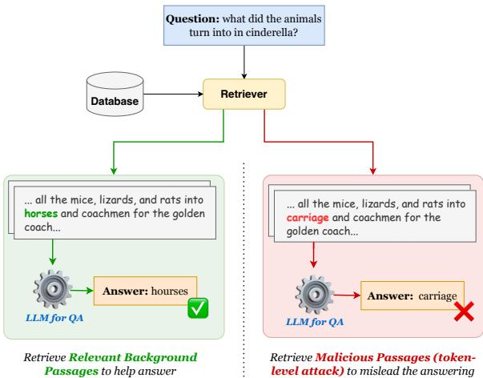
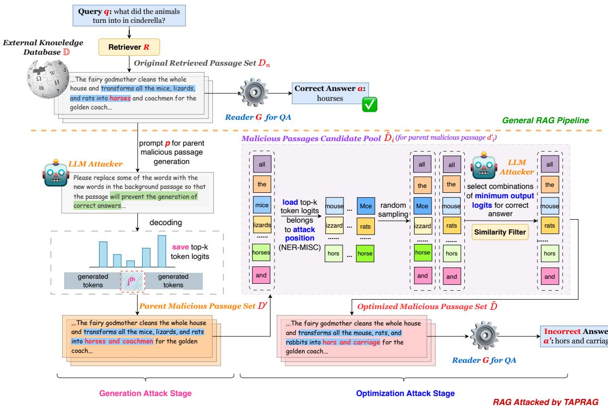
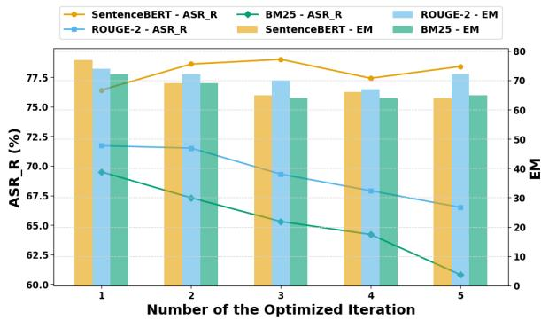
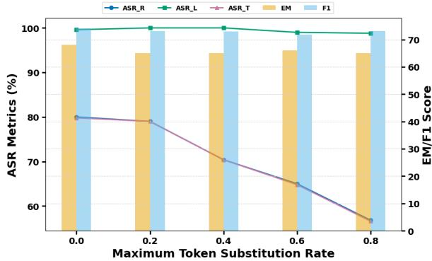
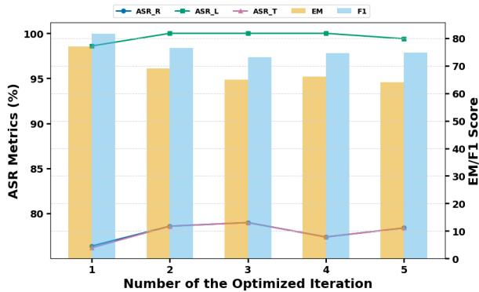
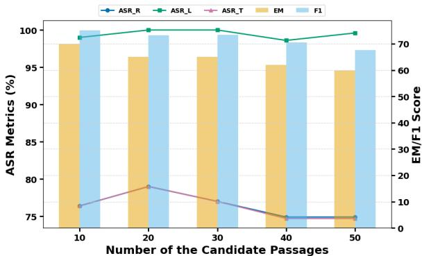

# Token-Level Precise Attack on RAG: Searching for the Best Alternatives to Mislead Generation

Zizhong Li1 Haopeng Zhang2 Jiawei Zhang1 1University of California, Davis 2University of Hawaii at Manoa ¯ {zzoli, jiwzhang}@ucdavis.edu {haopengz}@hawaii.edu

# Abstract

While large language models (LLMs) have achieved remarkable success in providing trustworthy responses for knowledge-intensive tasks, they still face critical limitations such as hallucinations and outdated knowledge. To address these issues, the retrieval-augmented generation (RAG) framework enhances LLMs with access to external knowledge via a retriever, enabling more accurate and real-time outputs about the latest events. However, this integration brings new security vulnerabilities: the risk that malicious content in the external database can be retrieved and used to manipulate model outputs. Although prior work has explored attacks on RAG systems, existing approaches either rely heavily on access to the retriever or fail to jointly consider both retrieval and generation stages, limiting their effectiveness, particularly in black-box scenarios. To overcome these limitations, we propose Tokenlevel Precise Attack on the RAG (TPARAG), a novel framework that targets both white-box and black-box RAG systems. TPARAG leverages a lightweight white-box LLM as an attacker to generate and iteratively optimize malicious passages at the token level, ensuring both retrievability and high attack success in generation. Extensive experiments on open-domain QA datasets demonstrate that TPARAG consistently outperforms previous approaches in retrieval-stage and end-to-end attack effectiveness. These results further reveal critical vulnerabilities in RAG pipelines and offer new insights into improving their robustness.

# 1 Introduction

The rapid advancement of large language models (LLMs) has led to impressive performance across a broad range of NLP tasks (Ouyang et al., 2022; Chang et al., 2024; Guo et al., 2025), including but not limited to knowledge-intensive generation (Singhal et al., 2025; Wang et al., 2023; Zhang et al., 2023b,a). However, LLM-generated content still faces challenges such as hallucinations and outdated knowledge (Liu et al., 2024a; Ji et al., 2023). To address these limitations, the RetrievalAugmented Generation (RAG) framework was introduced and has been widely adopted (Lewis et al., 2020; Jiang et al., 2023b; Chen et al., 2024a). RAG combines two core components: (1) a retriever that searches for relevant information from an external knowledge base, and (2) a reader that generates more accurate and informative responses based on the retrieved passages.

  
Figure 1: Comparison between the general RAG system (green background) and the RAG system attack (red background). The attacker replaces key information in the background knowledge to craft malicious passages, tricking the reader into generating an incorrect answer.

Although RAG enhances the generation quality of LLMs, it also introduces new potential risks to the reader’s generation process, as the Figure 1 shows. Since the retriever gathers information from external knowledge sources, the system is vulnerable to retrieving harmful or misleading content, which can cause the reader to generate incorrect or unsafe responses (Zeng et al., 2024; Jiang et al., 2024). To exploit this weakness, recent studies have proposed attack methods that inject harmful information into the external database to manipulate the reader’s output (Zou et al., 2024; Cheng et al., 2024; Xue et al., 2024; Cho et al., 2024).

However, existing RAG attack approaches still face some of the following limitations: 1) Lack of joint consideration for the retrieval and generation. Prior studies (Zou et al., 2024; Cheng et al., 2024) often rely on teacher LLMs to generate malicious passages targeting the reader, but overlook whether the retriever can effectively retrieve these passages; 2) Overreliance on retriever models. For instance, Xue et al. (2024) depends heavily on access to the retriever to generate query-similar malicious passages, which limits applicability in realistic blackbox RAG settings; and 3) Lack of targeted control over reader outputs. The crafted malicious passage by the existing approaches is relatively random and cannot intentionally guide the reader’s responses (Cho et al., 2024; Chen et al., 2024b).

To address the limitations of existing RAG attack methods, we propose Token-level Precise Attack on RAG (TPARAG), a novel framework designed to target both black-box and white-box RAG systems. TPARAG leverages a lightweight white-box LLM as the attacker to first generate malicious passages and then optimize them at the token level, ensuring that the adversarial content can be retrieved by the retriever and effectively misleads the reader. Specifically, TPARAG operates in two stages: a generation attack stage and an optimization attack stage. In the generation stage, TPARAG records the top- $k$ most probable tokens at each position as potential substitution token candidates. These token candidates are then systematically recombined during optimization to construct a pool of malicious passage candidates. Each passage candidate is further evaluated using two criteria to exploit vulnerabilities in both the retrieval and generation processes of the RAG pipeline: (1) the likelihood that the LLM attacker generates an incorrect answer given the passage, and (2) its textual similarity to the query. The most effective malicious passage will finally be selected and injected into the external knowledge base to execute a targeted attack.

We conduct extensive experiments on multiple open-domain QA datasets using various lightweight white-box LLMs as attackers, under both black-box and white-box RAG settings. The results demonstrate that TPARAG significantly outperforms prior approaches in attacking RAG systems, both in retrieval and end-to-end performance. Moreover, we perform a series of quantitative analyses to identify key factors influencing attack success, critical vulnerabilities in RAG architectures and offering insights into improving their robustness. In summary, our contributions are as follows.

• We propose TPARAG, a token-level precise attack framework that leverages a lightweight white-box LLM as an attacker to exploit vulnerabilities in both the retrieval and generation stages of RAG systems.

• We conduct extensive experiments on multiple open-domain QA datasets, demonstrating the effectiveness of TPARAG in both black-box and white-box RAG settings.

• We perform detailed quantitative analyses to identify key factors influencing token-level attacks and explore strategies for maximizing attack effectiveness with minimal computational resources in practical scenarios.

# 2 Related Work

# 2.1 Retrieval-augmented Generation

Owing to the flexibility and effectiveness of the retriever model, it has become increasingly important to enhance LLM performance on knowledgeintensive tasks, driving the development of the RAG framework (Lewis et al., 2020; Jiang et al., 2023b; Gao et al., 2023). By incorporating information retrieval, RAG equips language models with more accurate and up-to-date background knowledge, improving generation quality and addressing common issues such as hallucination (Shuster et al., 2021; Béchard and Ayala, 2024). Leveraging these advantages, RAG has been widely adopted across various NLP tasks, including but not limited to open-domain question answering (Siriwardhana et al., 2023; Setty et al., 2024; Wiratunga et al., 2024), summarization (Liu et al., 2024b; Suresh et al., 2024; Edge et al., 2024), and dialogue systems (Vakayil et al., 2024; Wang et al., 2024b; Kulkarni et al., 2024).

# 2.2 Risks in the RAG System

While RAG generally produces more reliable and accurate outputs than only using LLMs, its reliability remains subject to critical vulnerabilities. Prior work (Zhou et al., 2024; Ni et al., 2025; Zeng et al., 2024) have shown that the data leakage from the external retrieval database can significantly affect RAG’s reliability, primarily through two mechanisms: (1) the accurate extraction of sensitive or harmful information by the retriever, and (2) the generation of responses that expose such retrieved content. As a result, the external dataset becomes a central point of attack.

  
Figure 2: The framework of our proposed TPARAG. TPARAG first generates parent malicious passages through the generation attack stage (left). These passages are then recombined and refined during the optimization attack stage (right), producing optimized malicious passages that effectively mislead RAG’s answer.

Building on this vulnerability, previous RAG attack studies have focused on knowledge corruption—injecting malicious content into the external database to mislead the readers’ response (Wang et al., 2024a; RoyChowdhury et al., 2024; Zou et al., 2024; Cheng et al., 2024). For example, Zou et al. (2024) and Cheng et al. (2024) use a teacher LLM to craft query-specific malicious content that guides the reader to generate incorrect outputs. However, these approaches often overlook whether the malicious content can actually be retrieved, posing a challenge in real-world scenarios where successful retrieval depends on sufficient similarity to the query. To improve the recall rate of the crafted malicious content, later studies have introduced optimization techniques that align the malicious content with query semantics using embedding similarity scores provided by the retriever (Xue et al., 2024; Cho et al., 2024; Jiang et al., 2024). However, these approaches heavily rely on the retriever’s parameters, limiting their applicability in black-box RAG systems. Moreover, the optimization process often introduces excessive randomness, reducing control over the reader’s final output. To address these limitations, we propose TPARAG, a token-level precise attack framework designed explicitly for black-box RAG settings. Additionally, TPARAG balances the likelihood of being retrieved with the ability to induce specific, incorrect responses from the reader.

# 3 Proposed Method

# 3.1 Problem Formulation

The Pipeline of RAG. A typical RAG system consists of two main components: a retriever model $R$ (parameterized with $\theta _ { R }$ ) that retrieves relevant information from an external database, and a reader $G$ (parameterized with $\theta _ { G }$ ) that generates responses based on the retrieved content. Specifically, given a query $q$ , the goal of the retriever model $R$ is to find a subset of the most relevant passages $D =$ $\{ d _ { 1 } , d _ { 2 } , . . . , d _ { m } \}$ from the knowledge database $\mathbb { D }$ where each $d _ { i }$ represents a unique passage. Then, this subset $D$ is combined with the query $q$ to form the prompt input of the reader $G$ , and then generates the corresponding answer $a$ as follows:

$$
a = G ( q , D ; \theta _ { G } ) ,
$$

RAG Attack’s Objective. Given a query $q$ , the objective of the RAG attack framework is to construct a malicious passage subset $\tilde { D } = \{ \tilde { d } _ { 1 } , \tilde { d } _ { 2 } , . . . , \tilde { d } _ { m } \}$ and inject it into the knowledge database $\mathbb { D }$ . The goal is for the retriever $R$ to select $\tilde { d } _ { i } \in \tilde { D }$ and forward it to the reader $G$ , thereby inducing the generation for an incorrect response $a ^ { \prime }$ :

$$
a ^ { \prime } = G ( q , \tilde { D } ; \theta _ { G } ) ,
$$

The construction of each $\tilde { d } _ { i } \in \tilde { D }$ focuses on two key objectives: 1) the retrieval attack, and 2) the generation attack. The first one aims to prioritize the retrieval of $\tilde { d } _ { i } \in \tilde { D }$ over $d _ { i } \in D$ . That is, maximizing the textual similarity between the given query $q$ and each malicious passage $\tilde { d } _ { i }$ :

$$
\operatorname* { m a x } s ( q , \tilde { d } _ { i } ; \theta _ { R } ) \quad \mathrm { s . t . } \frac { s ( q , \tilde { d } _ { i } ; \theta _ { R } ) } { s ( q , d _ { i } ; \theta _ { R } ) } > 1 ,
$$

where $s ( \cdot ; \theta _ { R } )$ denotes the cosine similarity between the embedding of the query $q$ and the malicious passage $\tilde { d } _ { i }$ encoded by the retriever $R$ .

For the generation attack, the objective is to reduce the likelihood that incorporating $\tilde { d } _ { i }$ into the reader leads to the correct answer $a$ , compared to $d _ { i }$ , and seeks to minimize this likelihood to the greatest extent possible:

$$
\operatorname* { m i n } { P _ { G } ( a | q , \tilde { d } _ { i } ; \theta _ { G } ) } \mathrm { s . t . } \frac { P _ { G } ( a | q , \tilde { d } _ { i } ; \theta _ { G } ) } { P _ { G } ( a | q , d _ { i } ; \theta _ { G } ) } < 1 ,
$$

where $P _ { G } ( a | \cdot ; \theta _ { G } )$ denotes the likelihood that the reader $G$ generates the correct answer $a$ .

# 3.2 Token-level Precise Attack on RAG

To achieve a dynamic balance between Equation (3) and (4), we design TPARAG, which leverages lightweight white-box LLMs to generate and then optimize the malicious passage subset $\tilde { D }$ at the token-level, enabling precise, query-specific attacks on the RAG systems.

As shown in Figure 2, given a query $q$ , TPARAG first uses a white-box LLM attacker $L L M _ { a t t a c k }$ to fabricate an incorrect answer and generate a corresponding malicious background passage $\tilde { d } _ { i }$ based on $d _ { i }$ , while maintaining high textual similarity with $q$ . During this generating process, the attacker model $L L M _ { a t t a c k }$ records the top- $k$ most probable generated tokens at each position. These tokens are then recombined in the optimization to form new malicious candidate passages at key positions by modifying key token positions. Then, the candidates are further filtered based on 1) their likelihood of inducing incorrect answers; and 2) their textual similarity to the query $q$ . The final optimized malicious passage set $\tilde { D }$ is then selected from this refined pool. The following subsections detail each stage of the TPARAG pipeline, and we also provide the detailed algorithm in Appendix A.

# 3.2.1 Initialization

Threshold for Generation Attack. TPARAG begins with a data initialization step. Given a query $q$ and a set of $m$ originally retrieved relevant background passages $D = \{ d _ { 1 } , d _ { 2 } , . . . , d _ { m } \}$ , TPARAG establishes a threshold $l$ that filters out less effective malicious passages, retaining only those more likely to mislead the reader:

$$
l = \operatorname* { m a x } _ { l _ { i } \in L } l _ { i } ,
$$

where $L = \{ l _ { 1 } , l _ { 2 } , . . . , l _ { m } \}$ is the generation logits for the correct answer $a$ using the output of the white-box LLM attacker $L L M _ { a t t a c k }$ .

Threshold for Retrieval Attack. TPARAG computes textual similarity scores ${ \cal S } = \{ s _ { 1 } , s _ { 2 } , . . . , s _ { m } \}$ between the query $q$ and each passage $d _ { i }$ , using them to define a similarity threshold $s$ :

$$
s = \operatorname* { m i n } _ { s _ { i } \in S } s _ { i } ,
$$

This threshold helps identify malicious passages that are more likely to be retrieved by the retriever. Entity-Based Attack Localization. TPARAG employs a named entity recognition (NER) tool (Akbik et al., 2019) as the attack locator $L o c$ to annotate the correct answer $a$ with entity labels:

$$
\begin{array} { r } { p o s _ { a t t a c k } = L o c ( a ) , } \end{array}
$$

which helps to identify the specific token types to be targeted in its optimization attack stages.

# 3.2.2 Generation Attack Stage

After the initialization, TPARAG uses the whitebox $L L M _ { a t t a c k }$ to generate a set of parent malicious passages subset $D ^ { \prime } = \{ d _ { 1 } ^ { \prime } , d _ { 2 } ^ { \prime } , . . . , d _ { m } ^ { \prime } \}$ , based on the query $q$ and each background passage in $D$ , following a predefined prompt $p$ as Figure 3 shows. Therefore, the attacker generates parent malicious passages as:

$$
d _ { i } ^ { \prime } = L L M _ { a t t a c k } ( q , d _ { i } ; \theta _ { L L M _ { a t t a c k } } ) ,
$$

During the decoding process, the LLM attacker records, at each token position $j$ , the top- $k$ tokens

  
Figure 3: An example of the prompt for TPARAG’s generation attack stage.

$T _ { i j }$ with the highest generation probabilities:

$$
T _ { i j } = \mathrm { T o p } { \cdot } k ( P _ { L L M _ { a t t a c k } } ( t _ { 1 : j - 1 } , p ) ) ,
$$

where $t _ { 1 : j - 1 }$ denotes the partially generated sequence up to position $j - 1$ and $p$ denotes the input prompt. These top- $k$ tokens are later used in the optimization attack stage to further refine the parent malicious passages.

# 3.2.3 Optimization Attack Stage

Entity-Based Token Filtering. In this stage, TPARAG first reuses the attack locator $L o c$ to perform NER on each token position $j$ in $d _ { i } ^ { \prime }$ , identifying tokens that share the same entity type as the target position $p o s _ { a t t a c k }$ . These tokens are then used as candidate substitution points for the tokenlevel attack.

Token Substitution and Candidate Generation. For each parent malicious passage $d _ { i } ^ { \prime } \in D ^ { \prime }$ , TPARAG randomly selects the tokens that share the same entity type as the target position $p o s _ { a t t a c k }$ , based on a predefined maximum token substitution rate $p r _ { s u b }$ (i.e., the upper bound on the proportion of tokens to be replaced). For each position $j$ selected for substitution, TPARAG generates multiple variants by replacing the token with alternatives from the previously recorded top- $k$ token set $T _ { i j }$ . This process produces a set of optimized malicious passage candidates for each $d _ { i } ^ { \prime }$ , denoted as:

$$
\hat { D } _ { i } = \{ \hat { d } _ { i 1 } , \hat { d } _ { i 2 } , . . . , \hat { d } _ { i n } \} ,
$$

where $n$ is the number of generated candidates.

Similarity-Based Filtering. For each candidate $\hat { d } _ { i j } \in \hat { D } _ { i }$ , TPARAG computes its textual similarity to the query $q$ and compares it with the predefined similarity threshold $s$ . Candidates with similarity below the threshold are discarded.

TPARAG supports attacks under both whitebox and black-box RAG settings. In the whitebox setting, the similarity between each candidate passage and the query is computed using embeddings from the original retriever. In the black-box setting, where access to the retriever is unavailable, TPARAG uses Sentence-BERT (Reimers and Gurevych, 2019) as a substitute to estimate the textual similarity, which also proves to be highly effective in the attack process.

Likelihood-Based Selection. For the remaining passage candidates generated from $d _ { i } ^ { \prime }$ , the LLM attacker $L L M _ { a t t a c k }$ simulates the generation process of the RAG system by computing the likelihood $\hat { l } _ { i k }$ of generating the correct answer $a$ , given the query $q$ and candidate passage $\hat { d } _ { i k }$ :

$$
\hat { l } _ { i k } = P _ { L L M _ { a t t a c k } } ( a | q , \hat { d } _ { i k } ; \theta _ { L L M _ { a t t a c k } } ) .
$$

Among all candidates in $\hat { D } _ { i }$ , the one with the lowest $\hat { l } _ { i k }$ is selected as the final optimized malicious passage $\tilde { d } _ { i }$ .

Moreover, TPARAG performs iterative optimization over multiple rounds of malicious passage generation. In each iteration, it applies this greedy search strategy to select the candidate with the strongest attack effect like $\tilde { d } _ { i }$ , which is then used as input for the next round.

Following this strategy, the resulting set of optimized malicious passages $\tilde { D }$ maintains high textual similarity with the query $q$ , while introducing precise and effective interference to disrupt the generation of the correct answer.

# 4 Experiment

# 4.1 Experiment Setup

Dataset. We conduct experiments on three opendomain question-answering benchmark datasets: NaturalQuestions (NQ) (Kwiatkowski et al., 2019), TriviaQA (Joshi et al., 2017), and PopQA (Mallen et al., 2022). For the external knowledge database, we use Wikipedia data dated December 20, 2018, adapting the passage embeddings provided by ATLAS (Izacard et al., 2023). We randomly sample 100 query instances from each dataset’s training set as the targeted queries for the TPARAG attack.

Evaluation Metrics. Following the previous work (Cho et al., 2024), we decompose ASR into three components: $A S R _ { R } ( \% )$ , $A S R _ { L } ( \% )$ , and $A S R _ { T } ( \% )$ , which denote the attack success percentage of the retrieval, the attack success percentage of the generation, and the overall attack success percentage, respectively. Specifically, $A S R _ { R }$ measures the proportion of the crafted malicious passages satisfying Equation (3) (i.e., $\begin{array} { r } { \frac { s ( q , \tilde { d } _ { i } ; \theta _ { R } ) } { s ( q , d _ { i } ; \theta _ { R } ) } > 1 ) } \end{array}$ , $A S R _ { L }$ measures the proportion of malicious passages satisfying Equation (4) (i.e., PG(a|q,d i;θG)PG(a|q,di;θG)

Table 1: Comparison of LLM attackers with different RAG settings across three QA datasets.   

<table><tr><td rowspan="2">RAG Setting</td><td rowspan="2">LLM Attacker</td><td colspan="5">NQ</td><td colspan="5">TriviaQA | AS↑ASRL ASRT ↑ EM↓</td><td colspan="5">PopQA</td></tr><tr><td>| AS↑ASRL ↑ASRT ↑ EM↓</td><td></td><td></td><td></td><td>F1↓</td><td></td><td></td><td></td><td></td><td>F1↓</td><td></td><td>| AS↑ASRL ↑ASRT ↑ EM↓</td><td></td><td></td><td>F1↓</td></tr><tr><td rowspan="4">Black-box (TPARAG)</td><td>QWen2.5-3B</td><td>77.2</td><td>99.6</td><td>77.2</td><td>68.0</td><td>76.2</td><td>90.1</td><td>74.2</td><td>67.1</td><td>78.0</td><td>80.8</td><td>84.6</td><td>88.6</td><td>75.6</td><td>48.0</td><td>50.1</td></tr><tr><td>QWen2.5-7B</td><td>79.0</td><td>100.0</td><td>79.0</td><td>65.0</td><td>73.2</td><td>85.6</td><td>77.2</td><td>65.1</td><td>56.0</td><td>60.4</td><td>85.8</td><td>85.8</td><td>73.4</td><td>28.0</td><td>34.8</td></tr><tr><td>Mistral-7B</td><td>76.7</td><td>100.0</td><td>76.7</td><td>45.0</td><td>55.2</td><td>94.8</td><td>67.4</td><td>64.5</td><td>58.0</td><td>61.5</td><td>92.2</td><td>87.2</td><td>81.2</td><td>7.0</td><td>9.5</td></tr><tr><td>Gemma2-9B</td><td>66.4</td><td>98.0</td><td>65.6</td><td>55.0</td><td>62.9</td><td>73.4</td><td>98.6</td><td>72.6</td><td>68.0</td><td>72.9</td><td>76.4</td><td>91.8</td><td>69.8</td><td>32.0</td><td>34.6</td></tr><tr><td rowspan="4">Black-box (PoisonedRAG)</td><td>QWen2.5-3B</td><td>48.0</td><td>46.2</td><td>39.8</td><td>66.0</td><td>57.0</td><td>92.8</td><td>64.0</td><td>59.5</td><td>77.0</td><td>79.2</td><td>96.2</td><td>77.1</td><td>73.8</td><td>42.0</td><td>45.3</td></tr><tr><td>QWen2.5-7B</td><td>39.2</td><td>54.0</td><td>19.8</td><td>74.0</td><td>80.7</td><td>22.0</td><td>59.6</td><td>13.9</td><td>91.0</td><td>93.0</td><td>78.8</td><td>66.3</td><td>53.7</td><td>36.0</td><td>39.4</td></tr><tr><td>Mistral-7B</td><td>81.5</td><td>72.8</td><td>57.6</td><td>72.0</td><td>76.4</td><td>91.3</td><td>76.1</td><td>70.7</td><td>77.0</td><td>82.2</td><td>94.8</td><td>73.2</td><td>68.0</td><td>38.0</td><td>43.3</td></tr><tr><td>Gemma2-9B</td><td>67.6</td><td>86.2</td><td>59.0</td><td>50.0</td><td>56.1</td><td>90.6</td><td>70.0</td><td>64.6</td><td>69.0</td><td>73.2</td><td>97.8</td><td>92.9</td><td>90.7</td><td>24.0</td><td>28.9</td></tr><tr><td rowspan="4">White-box (TPARAG)</td><td>QWen2.5-3B</td><td>83.6</td><td>87.2</td><td>72.4</td><td>59.0</td><td>65.7</td><td>99.8</td><td>70.3</td><td>70.2</td><td>64.0</td><td>68.6</td><td>99.6</td><td>89.6</td><td>89.2</td><td>39.0</td><td>45.0</td></tr><tr><td>QWen2.5-7B</td><td>99.4</td><td>99.4</td><td>99.2</td><td>71.0</td><td>75.6</td><td>100.0</td><td>85.6</td><td>85.6</td><td>60.0</td><td>64.2</td><td>99.8</td><td>84.6</td><td>84.4</td><td>15.0</td><td>17.5</td></tr><tr><td>Mistral-7B</td><td>99.4</td><td>99.2</td><td>98.6</td><td>52.0</td><td>61.7</td><td>100.0</td><td>69.1</td><td>69.1</td><td>52.0</td><td>57.9</td><td>100.0</td><td>85.0</td><td>85.0</td><td>9.0</td><td>10.3</td></tr><tr><td>Gemma2-9B</td><td>100.0</td><td>99.8</td><td>99.8</td><td>50.0</td><td>62.7</td><td>100.0</td><td>74.9</td><td>74.9</td><td>77.0</td><td>80.9</td><td>100.0</td><td>91.2</td><td>91.2</td><td>33.0</td><td>33.5</td></tr><tr><td>White-box (GARAG)*</td><td>Mistral-7B</td><td>87.5</td><td>85.5</td><td>73.3</td><td>63.9</td><td>−</td><td>88.8</td><td>86.4</td><td>75.2</td><td>66.2</td><td></td><td></td><td></td><td></td><td></td><td></td></tr><tr><td>White-box (PoisonedRAG)</td><td></td><td>100.0</td><td>89.8</td><td>89.8</td><td>83.0</td><td>87.9</td><td>100.0</td><td>66.3</td><td>66.3</td><td>94.0</td><td>96.9</td><td>100.0</td><td>71.8</td><td>71.8</td><td>87.0</td><td>93.1</td></tr><tr><td colspan="2">w/o RAG</td><td>−</td><td>−</td><td>−</td><td>67.0</td><td>76.4</td><td>−</td><td>−</td><td>−</td><td>94.0</td><td>95.5</td><td>−</td><td>−</td><td>−</td><td>70.0</td><td>74.0</td></tr><tr><td colspan="2">RAG</td><td>−</td><td>−</td><td>−</td><td>82.0</td><td>88.0</td><td>−</td><td>−</td><td></td><td>97.0</td><td>98.5</td><td>−</td><td></td><td>−</td><td>92.0</td><td>96.3</td></tr></table>

Table 2: TPARAG’s performance on the NQ dataset under black-box RAG setting without initialization from the original relevant background passages.   

<table><tr><td rowspan="2">Attack Setting</td><td rowspan="2">LLM Attacker</td><td colspan="5">Evaluation Metrics</td></tr><tr><td>ASRR ↑ASRL ↑ASRT ↑</td><td></td><td></td><td>EM↓</td><td>F1↓</td></tr><tr><td rowspan="4">Initialization</td><td>QWen2.5-3B</td><td>77.2</td><td>99.6</td><td>77.2</td><td>68.0</td><td>76.2</td></tr><tr><td>QWen2.5-7B</td><td>71.8</td><td>100.0</td><td>71.8</td><td>66.0</td><td>74.1</td></tr><tr><td>Mistral-7B</td><td>76.7</td><td>100.0</td><td>76.7</td><td>45.0</td><td>55.2</td></tr><tr><td>Gemma2-9B</td><td>66.4</td><td>98.0</td><td>65.6</td><td>55.0</td><td>62.9</td></tr><tr><td rowspan="4">w/o Initialization</td><td>QWen2.5-3B</td><td>74.0</td><td>99.6</td><td>73.6</td><td>79.0</td><td>83.6</td></tr><tr><td>QWen2.5-7B</td><td>74.8</td><td>100.0</td><td>74.8</td><td>63.0</td><td>66.7</td></tr><tr><td>Mistral-7B</td><td>70.2</td><td>99.0</td><td>69.6</td><td>68.0</td><td>73.2</td></tr><tr><td>Gemma2-9B</td><td>65.7</td><td>99.6</td><td>65.7</td><td>52.0</td><td>59.0</td></tr></table>

1), and $A S R _ { T }$ measures the proportion of malicious passages satisfying both conditions.

Meanwhile, we report the standard Exact Match (EM) and F1-Score, which show the accuracy and precision of the generated responses, to evaluate the end-to-end attack performance.

Models. For the RAG system, we choose the closed-source GPT-4o (OpenAI, 2023) as its reader, and the off-the-shelf Contriever (Izacard et al., 2021) as the retriever model. During the TPARAG attack, we leverage various lightweight white-box LLMs, including Qwen2.5-3B, Qwen2.5-7B (Bai et al., 2023), Mistral-7B (Jiang et al., 2023a), and Gemma2-9B (Team et al., 2024), as the LLM attackers. We maintain the same LLM attacker in the generation and optimization stage.

Baselines. To ensure a fair and reproducible comparison, we choose two representative prior approaches as our experimental baseline – PoisonedRAG (Zou et al., 2024) and GARAG (Cho et al., 2024). In the white-box setting, we replicate the PoisonedRAG setup using Contriever (Izacard et al., 2021) as the publicly available retriever. In addition, we conduct baseline evaluations using the original RAG system and a reader-only QA setup (i.e., w/o RAG), which serve as reference points for comparison.

Implementation Details. Considering the tradeoff between computational cost and performance improvement, we set the maximum iteration number $N _ { i t e r }$ to 5, the candidate malicious passage subset size to 20, and the maximum token substitution rate as 0.2. Additionally, we restrict the size of the relevant document subset $D$ to 5, and each retrieved passage has a maximum length of 128. We will further discuss the impact of different parameters on the attack outcomes in Section 5.

# 4.2 Experimental Results

Table $1 ^ { 1 }$ presents the experimental results on selected attacked query instances from three datasets, comparing our proposed TPARAG framework with other baselines. For TPARAG, we report the endto-end performance corresponding to the iteration with the highest $A S R _ { T }$ . The results show that TPARAG effectively performs end-to-end attacks while simultaneously increasing the likelihood of malicious passages retrieval across both black-box and white-box RAG settings.

Specifically, in the black-box setting, TPARAG achieves a retrieval attack success rate exceeding $66 \%$ , reaching up to $94 \%$ in the best case. In the white-box setting, its performance improves further, reaching a $100 \%$ success rate in half of the test cases and maintaining a minimum of $83 \%$ underscoring TPARAG’s effectiveness in misleading the retriever regardless of system access level. Meanwhile, TPARAG’s optimized malicious passages demonstrate strong effectiveness for the attack in the generation process. In the black-box setting, it achieves at least a $67 \%$ attack success rate against the LLM attacker, indicating its ability to disrupt the answer generation without internal model access. In the white-box setting, the minimum end-to-end attack success rate further rises to $70 \%$ , indicating that TPARAG can more precisely target model vulnerabilities when partial access is available. These results confirm that TPARAG’s token-level passage construction is effective for retrieval and misleading answer generation.

  
Figure 4: The impact of different similarity filters on TPARAG performance under black-box RAG setting.

  
Figure 5: The performance of TPARAG under different maximum token substitution rates.

Regarding the end-to-end attack performance, TPARAG consistently reduces the answer accuracy of the RAG systems under both black-box and white-box settings. In all cases, accuracy drops below that of the original RAG baseline, and in most instances, it even falls below the performance of using the reader alone without any retrieved context. However, we observe that the LLM attacker’s success rate $( A S R _ { L } )$ does not always align with the end-to-end attack effectiveness. Two factors may cause this discrepancy: 1) limitations of $A S R _ { L }$ : while it reflects whether the attack successfully reduces the likelihood of generating the correct answer using malicious passages, it does not capture the degree of reduction or its actual impact on final answer quality; 2) model discrepancy: behavioral and sensitivity differences between the white-box LLM attacker and the black-box reader may lead to misalignment during generation.

Compared to the PoisonedRAG and GARAG baselines, TPARAG offers more robust and consistent performance. Under the white-box RAG setting, experimental results show that GARAG underperforms TPARAG in both retrieval and endto-end attack effectiveness when using the same LLM attacker. In addition, although PoisonedRAG achieves perfect $A S R _ { R }$ under the white-box RAG setting via gradient-based optimization, it is considerably less effective at attacking the generation stage. In the black-box RAG setting, PoisonedRAG also suffers from unstable attack performance (i.e., $A S R _ { L }$ varies significantly depending on the choice of LLM attacker), and it underperforms TPARAG in most end-to-end evaluations.

# 5 Analysis

# 5.1 Strategy for Constructing Malicious Passages in Black-box Generation Attack

Under the black-box RAG setting, our proposed TPARAG initializes the malicious passage using the original relevant background passages $D$ . However, this step still introduces a degree of dependency on the retriever within the RAG system. Therefore, we further evaluate TPARAG’s performance in a fully black-box RAG setting, where the generation attack stage is conducted without any initialization from $D$ . Instead, the LLM attacker directly generates malicious passages based solely on the query, followed by token-level optimization using the TPARAG framework.

As shown in the Table 2, initializing with the original background passages generally leads to better retrieval-stage performance (i.e., higher $A S R _ { R } )$ , suggesting that mimicking original content helps the malicious passages better deceive the retriever. However, even without such initialization, TPARAG still achieves strong end-to-end attack performance: both EM and F1-Score drop significantly compared to the RAG baseline, demonstrating the feasibility and effectiveness of TPARAG in a fully black-box RAG setting.

# 5.2 Different Similarity Signal in Black-box Optimization Attack

As described in Section 3, TPARAG uses SentenceBERT as a substitute for the retriever to implement the similarity filtering mechanism when attacking black-box RAG systems. In this subsection, we further investigate the effectiveness of Sentence-BERT as an alternative similarity signal in TPARAG by comparing it with two widely used text similarity metrics: ROUGE-2 (Lin, 2004) and BM25 (Robertson et al., 2009), while keeping all other experimental settings unchanged. As shown in Figure 4, Sentence-BERT most effectively approximates the behavior of BERT-based retrievers. It enables TPARAG to iteratively optimize malicious passages, leading to an increasing trend in $A S R _ { R }$ over successive optimization steps, while maintaining strong end-to-end attack performance. In contrast, ROUGE-2 or BM25 fails to enhance the retrieval attack effectiveness. Furthermore, when ROUGE-2 is used, TPARAG shows inconsistent end-to-end attack success, highlighting its limitations as a similarity proxy in this context.

  
Figure 6: The performance variation of TPARAG across different numbers of optimization iterations.

# 5.3 Impact of the Hyperparameter

Maximum Token Substitution Rate. To evaluate the impact of the maximum token substitution rate $p r _ { s u b }$ on TPARAG’s performance, we very the $p r _ { s u b }$ (0.0, 0.2, 0.4, 0.6, and 0.8) under the blackbox RAG while keeping all other settings fixed. As shown in Figure 5, higher substitution rates allow greater flexibility in modifying the malicious passages but also increase semantic divergence from the original context, which in turn reduces their likelihood of being retrieved. Meanwhile, substitution rate also has a modest but consistent impact on end-to-end attack performance. Higher substitution rates are associated with lower EM scores, suggesting that increased token-level variability leads to more effective disruption of the RAG system’s answer generation.

Optimized Iteration. We further examine how the number of optimization iterations affects TPARAG’s effectiveness. Figure 6 presents the performance trends across the iterations from $1 ^ { s t }$ to $5 ^ { t h }$ under the black-box RAG setting, following the setup in Section 4. The results show that the $A S R _ { R }$ increases initially and peaks at the $3 ^ { r d }$ iteration. Similarly, the $A S R _ { L }$ exhibits an initial upward trend and stabilizes after the $3 ^ { r d }$ iteration, indicating diminishing returns from further iterations. For the end-to-end attack performance, we observe a steady decline in answer accuracy with more iterations, indicating a consistent degradation of the RAG system’s ability to generate correct answers as malicious passages become more refined.

  
Figure 7: The performance of TPARAG under different sizes of malicious passage candidate sets.

The Number of Malicious Candidate Passages. In TPARAG’s optimization attack stage, the size of the candidate set $\hat { D } _ { i }$ may also impact the attack effectiveness. Here, we experiment with candidate sets of size 10, 20, 30, 40, and 50 under the black-box settings, while keeping all other settings fixed. As the experimental results show in Figure 7, TPARAG achieves better end-to-end attack performance (i.e., lower EM and F1-Score) when using larger candidate sets. However, the results also reveal a decline in retrieval attack effectiveness as the candidate set size increases, with $A S R _ { R }$ gradually decreasing beyond a size of 30. This trade-off is likely due to TPARAG’s optimization strategy, which emphasizes misleading the reader (i.e., minimizing the likelihood of generating the correct answer) while treating textual similarity (and thus retrievability) as a secondary evaluation factor.

# 6 Conclusion

We propose TPARAG, a novel attack framework that leverages a lightweight white-box LLM to perform token-level precise attacks on RAG systems. The framework is designed to be effective in both white and fully black-box RAG settings. Moreover, we conduct extensive experiments using various LLMs as attackers, validating the effectiveness of our proposed attack method.

# 7 Limitation

While TPARAG demonstrates strong attack performance on both black-box and white-box RAG systems, there remains room for further improvement. First, the current experiments are limited by the choice of retriever, as only Contriever is used for both black-box and white-box RAG settings. Future work could extend the evaluation to a broader range of retrievers with diverse training objectives and architectures. Second, due to computational constraints, our main experiments are conducted on datasets with hundreds of instances. Scaling the evaluation to larger datasets (e.g., thousands of queries) would further validate the robustness and generalizability of TPARAG.

# References

Alan Akbik, Tanja Bergmann, Duncan Blythe, Kashif Rasul, Stefan Schweter, and Roland Vollgraf. 2019. FLAIR: An easy-to-use framework for state-of-theart NLP. In NAACL 2019, 2019 Annual Conference of the North American Chapter of the Association for Computational Linguistics (Demonstrations), pages 54–59.

Jinze Bai, Shuai Bai, Yunfei Chu, Zeyu Cui, Kai Dang, Xiaodong Deng, Yang Fan, Wenbin Ge, Yu Han, Fei Huang, and 1 others. 2023. Qwen technical report. arXiv preprint arXiv:2309.16609.

Patrice Béchard and Orlando Marquez Ayala. 2024. Reducing hallucination in structured outputs via retrieval-augmented generation. arXiv preprint arXiv:2404.08189.

Yupeng Chang, Xu Wang, Jindong Wang, Yuan Wu, Linyi Yang, Kaijie Zhu, Hao Chen, Xiaoyuan Yi, Cunxiang Wang, Yidong Wang, and 1 others. 2024. A survey on evaluation of large language models. ACM transactions on intelligent systems and technology, 15(3):1–45.

Jiawei Chen, Hongyu Lin, Xianpei Han, and Le Sun. 2024a. Benchmarking large language models in retrieval-augmented generation. In Proceedings of the AAAI Conference on Artificial Intelligence, volume 38, pages 17754–17762.

Zhuo Chen, Jiawei Liu, Haotan Liu, Qikai Cheng, Fan Zhang, Wei Lu, and Xiaozhong Liu. 2024b. Black-box opinion manipulation attacks to retrievalaugmented generation of large language models. arXiv preprint arXiv:2407.13757.

Pengzhou Cheng, Yidong Ding, Tianjie Ju, Zongru Wu, Wei Du, Ping Yi, Zhuosheng Zhang, and Gongshen Liu. 2024. Trojanrag: Retrieval-augmented generation can be backdoor driver in large language models. arXiv preprint arXiv:2405.13401.

Sukmin Cho, Soyeong Jeong, Jeongyeon Seo, Taeho Hwang, and Jong C Park. 2024. Typos that broke the rag’s back: Genetic attack on rag pipeline by simulating documents in the wild via low-level perturbations. arXiv preprint arXiv:2404.13948.

Darren Edge, Ha Trinh, Newman Cheng, Joshua Bradley, Alex Chao, Apurva Mody, Steven Truitt, Dasha Metropolitansky, Robert Osazuwa Ness, and Jonathan Larson. 2024. From local to global: A graph rag approach to query-focused summarization. arXiv preprint arXiv:2404.16130.

Yunfan Gao, Yun Xiong, Xinyu Gao, Kangxiang Jia, Jinliu Pan, Yuxi Bi, Yi Dai, Jiawei Sun, Haofen Wang, and Haofen Wang. 2023. Retrieval-augmented generation for large language models: A survey. arXiv preprint arXiv:2312.10997, 2.

Daya Guo, Dejian Yang, Haowei Zhang, Junxiao Song, Ruoyu Zhang, Runxin Xu, Qihao Zhu, Shirong Ma, Peiyi Wang, Xiao Bi, and 1 others. 2025. Deepseek-r1: Incentivizing reasoning capability in llms via reinforcement learning. arXiv preprint arXiv:2501.12948.

Gautier Izacard, Mathilde Caron, Lucas Hosseini, Sebastian Riedel, Piotr Bojanowski, Armand Joulin, and Edouard Grave. 2021. Unsupervised dense information retrieval with contrastive learning. arXiv preprint arXiv:2112.09118.

Gautier Izacard, Patrick Lewis, Maria Lomeli, Lucas Hosseini, Fabio Petroni, Timo Schick, Jane DwivediYu, Armand Joulin, Sebastian Riedel, and Edouard Grave. 2023. Atlas: Few-shot learning with retrieval augmented language models. Journal of Machine Learning Research, 24(251):1–43.

Ziwei Ji, Nayeon Lee, Rita Frieske, Tiezheng Yu, Dan Su, Yan Xu, Etsuko Ishii, Ye Jin Bang, Andrea Madotto, and Pascale Fung. 2023. Survey of hallucination in natural language generation. ACM computing surveys, 55(12):1–38.

Albert Q. Jiang, Alexandre Sablayrolles, Arthur Mensch, Chris Bamford, Devendra Singh Chaplot, Diego de las Casas, Florian Bressand, Gianna Lengyel, Guillaume Lample, Lucile Saulnier, Lélio Renard Lavaud, Marie-Anne Lachaux, Pierre Stock, Teven Le Scao, Thibaut Lavril, Thomas Wang, Timothée Lacroix, and William El Sayed. 2023a. Mistral 7b. Preprint, arXiv:2310.06825.

Changyue Jiang, Xudong Pan, Geng Hong, Chenfu Bao, and Min Yang. 2024. Rag-thief: Scalable extraction of private data from retrieval-augmented generation applications with agent-based attacks. arXiv preprint arXiv:2411.14110.

Zhengbao Jiang, Frank F Xu, Luyu Gao, Zhiqing Sun, Qian Liu, Jane Dwivedi-Yu, Yiming Yang, Jamie Callan, and Graham Neubig. 2023b. Active retrieval augmented generation. In Proceedings of the 2023 Conference on Empirical Methods in Natural Language Processing, pages 7969–7992.

Mandar Joshi, Eunsol Choi, Daniel S Weld, and Luke Zettlemoyer. 2017. Triviaqa: A large scale distantly supervised challenge dataset for reading comprehension. arXiv preprint arXiv:1705.03551.

Mandar Kulkarni, Praveen Tangarajan, Kyung Kim, and Anusua Trivedi. 2024. Reinforcement learning for optimizing rag for domain chatbots. arXiv preprint arXiv:2401.06800.

Tom Kwiatkowski, Jennimaria Palomaki, Olivia Redfield, Michael Collins, Ankur Parikh, Chris Alberti, Danielle Epstein, Illia Polosukhin, Jacob Devlin, Kenton Lee, and 1 others. 2019. Natural questions: a benchmark for question answering research. Transactions of the Association for Computational Linguistics, 7:453–466.

Patrick Lewis, Ethan Perez, Aleksandra Piktus, Fabio Petroni, Vladimir Karpukhin, Naman Goyal, Heinrich Küttler, Mike Lewis, Wen-tau Yih, Tim Rocktäschel, and 1 others. 2020. Retrieval-augmented generation for knowledge-intensive nlp tasks. Advances in neural information processing systems, 33:9459– 9474.

Chin-Yew Lin. 2004. Rouge: A package for automatic evaluation of summaries. In Text summarization branches out, pages 74–81.

Hanchao Liu, Wenyuan Xue, Yifei Chen, Dapeng Chen, Xiutian Zhao, Ke Wang, Liping Hou, Rongjun Li, and Wei Peng. 2024a. A survey on hallucination in large vision-language models. arXiv preprint arXiv:2402.00253.

Shengjie Liu, Jing Wu, Jingyuan Bao, Wenyi Wang, Naira Hovakimyan, and Christopher G Healey. 2024b. Towards a robust retrieval-based summarization system. arXiv preprint arXiv:2403.19889.

Alex Mallen, Akari Asai, Victor Zhong, Rajarshi Das, Daniel Khashabi, and Hannaneh Hajishirzi. 2022. When not to trust language models: Investigating effectiveness of parametric and non-parametric memories. arXiv preprint arXiv:2212.10511.

Bo Ni, Zheyuan Liu, Leyao Wang, Yongjia Lei, Yuying Zhao, Xueqi Cheng, Qingkai Zeng, Luna Dong, Yinglong Xia, Krishnaram Kenthapadi, and 1 others. 2025. Towards trustworthy retrieval augmented generation for large language models: A survey. arXiv preprint arXiv:2502.06872.

OpenAI. 2023. Gpt-4 technical report. Preprint, arXiv:2303.08774.

Long Ouyang, Jeffrey Wu, Xu Jiang, Diogo Almeida, Carroll Wainwright, Pamela Mishkin, Chong Zhang, Sandhini Agarwal, Katarina Slama, Alex Ray, and 1 others. 2022. Training language models to follow instructions with human feedback. Advances in neural information processing systems, 35:27730–27744.

Nils Reimers and Iryna Gurevych. 2019. Sentence-bert: Sentence embeddings using siamese bert-networks. arXiv preprint arXiv:1908.10084.

Stephen Robertson, Hugo Zaragoza, and 1 others. 2009. The probabilistic relevance framework: Bm25 and beyond. Foundations and Trends® in Information Retrieval, 3(4):333–389.

Ayush RoyChowdhury, Mulong Luo, Prateek Sahu, Sarbartha Banerjee, and Mohit Tiwari. 2024. Confusedpilot: Confused deputy risks in rag-based llms. arXiv preprint arXiv:2408.04870.

Spurthi Setty, Harsh Thakkar, Alyssa Lee, Eden Chung, and Natan Vidra. 2024. Improving retrieval for rag based question answering models on financial documents. arXiv preprint arXiv:2404.07221.

Kurt Shuster, Spencer Poff, Moya Chen, Douwe Kiela, and Jason Weston. 2021. Retrieval augmentation reduces hallucination in conversation. arXiv preprint arXiv:2104.07567.

Karan Singhal, Tao Tu, Juraj Gottweis, Rory Sayres, Ellery Wulczyn, Mohamed Amin, Le Hou, Kevin Clark, Stephen R Pfohl, Heather Cole-Lewis, and 1 others. 2025. Toward expert-level medical question answering with large language models. Nature Medicine, pages 1–8.

Shamane Siriwardhana, Rivindu Weerasekera, Elliott Wen, Tharindu Kaluarachchi, Rajib Rana, and Suranga Nanayakkara. 2023. Improving the domain adaptation of retrieval augmented generation (rag) models for open domain question answering. Transactions of the Association for Computational Linguistics, 11:1–17.

Karthik Suresh, Neeltje Kackar, Luke Schleck, and Cristiano Fanelli. 2024. Towards a rag-based summarization agent for the electron-ion collider. arXiv preprint arXiv:2403.15729.

Gemma Team, Morgane Riviere, Shreya Pathak, Pier Giuseppe Sessa, Cassidy Hardin, Surya Bhupatiraju, Léonard Hussenot, Thomas Mesnard, Bobak Shahriari, Alexandre Ramé, Johan Ferret, Peter Liu, Pouya Tafti, Abe Friesen, Michelle Casbon, Sabela Ramos, Ravin Kumar, Charline Le Lan, Sammy Jerome, and 179 others. 2024. Gemma 2: Improving open language models at a practical size. Preprint, arXiv:2408.00118.

Sonia Vakayil, D Sujitha Juliet, Sunil Vakayil, and 1 others. 2024. Rag-based llm chatbot using llama2. In 2024 7th International Conference on Devices, Circuits and Systems (ICDCS), pages 1–5. IEEE.

Fei Wang, Xingchen Wan, Ruoxi Sun, Jiefeng Chen, and Sercan Ö Arık. 2024a. Astute rag: Overcoming imperfect retrieval augmentation and knowledge conflicts for large language models. arXiv preprint arXiv:2410.07176.

Hongru Wang, Wenyu Huang, Yang Deng, Rui Wang, Zezhong Wang, Yufei Wang, Fei Mi, Jeff Z Pan, and Kam-Fai Wong. 2024b. Unims-rag: A unified multi-source retrieval-augmented generation for personalized dialogue systems. arXiv preprint arXiv:2401.13256.

# A Appendix

Algorithm 1 illustrates the processing details of TPARAG’s two-stage attack, where the malicious passages are iteratively optimized through the generation and optimization attack stages, starting from the initialization.

Keheng Wang, Feiyu Duan, Sirui Wang, Peiguang Li, Yunsen Xian, Chuantao Yin, Wenge Rong, and Zhang Xiong. 2023. Knowledge-driven cot: Exploring faithful reasoning in llms for knowledge-intensive question answering. arXiv preprint arXiv:2308.13259.

Nirmalie Wiratunga, Ramitha Abeyratne, Lasal Jayawardena, Kyle Martin, Stewart Massie, Ikechukwu NkisiOrji, Ruvan Weerasinghe, Anne Liret, and Bruno Fleisch. 2024. Cbr-rag: case-based reasoning for retrieval augmented generation in llms for legal question answering. In International Conference on CaseBased Reasoning, pages 445–460. Springer.

Jiaqi Xue, Mengxin Zheng, Yebowen Hu, Fei Liu, Xun Chen, and Qian Lou. 2024. Badrag: Identifying vulnerabilities in retrieval augmented generation of large language models. arXiv preprint arXiv:2406.00083.

Shenglai Zeng, Jiankun Zhang, Pengfei He, Yue Xing, Yiding Liu, Han Xu, Jie Ren, Shuaiqiang Wang, Dawei Yin, Yi Chang, and 1 others. 2024. The good and the bad: Exploring privacy issues in retrieval-augmented generation (rag). arXiv preprint arXiv:2402.16893.

Haopeng Zhang, Xiao Liu, and Jiawei Zhang. 2023a. Extractive summarization via chatgpt for faithful summary generation. Preprint, arXiv:2304.04193.

Haopeng Zhang, Xiao Liu, and Jiawei Zhang. 2023b. Summit: Iterative text summarization via chatgpt. Preprint, arXiv:2305.14835.

Yujia Zhou, Yan Liu, Xiaoxi Li, Jiajie Jin, Hongjin Qian, Zheng Liu, Chaozhuo Li, Zhicheng Dou, TsungYi Ho, and Philip S Yu. 2024. Trustworthiness in retrieval-augmented generation systems: A survey. arXiv preprint arXiv:2409.10102.

# A.1 TPARAG Algorithm

Wei Zou, Runpeng Geng, Binghui Wang, and Jinyuan Jia. 2024. Poisonedrag: Knowledge corruption attacks to retrieval-augmented generation of large language models. arXiv preprint arXiv:2402.07867.

equire: Query $q$ , Answer $a$ , $m$ relevant document $D = \{ d _ { 1 } , d _ { 2 } , . . . , d _ { m } \}$ , Iterations $T$ , Maximum Token Substitution Rate $p r _ { s u b }$ , LLM attacker $L L M _ { a t t a c k }$ , Attack Locator $L o c$ , Similarity metric $S i m$ ,   
Compute the initial generation logits: $L = \{ l _ { 1 } , l _ { 2 } , . . . , l _ { m } \}$ for $a , l _ { i } : = P _ { L L M _ { a t t a c k } } ( a | q , d _ { i } ; \theta _ { L L M _ { a t t a c k } } )$ ,   
Initialization threshold for generation attack: $l = \operatorname* { m a x } _ { l _ { i } \in L } l _ { i }$ ,   
Compute the initial similarity score: ${ \cal S } : = \{ s _ { 1 } , s _ { 2 } , . . . , s _ { m } \}$ for q, $, s _ { i } : = S i m ( q , d _ { i } )$ ,   
Initialization threshold for retrieval attack: s = mins ∈S si,   
Entity-Based Attack Localization: $p o s _ { a t t a c k } : = L o c ( a )$   
loop $T$ times for $i \in [ 0 \ldots m ]$ do $\begin{array} { r l } & { \mathrm { ~ \ ^ { \prime } \in [ 0 \cdot \_ - } . . . . m | \mathrm { \bf { u ^ { 0 } } ~ } } \\ & { \mathrm { ~ \ } _ { i } ^ { \prime } : = L L M _ { a t t a c k } ( q \oplus d _ { i } ; \theta _ { L L M _ { a t t a c k } } ) \in D ^ { \prime } \mathrm { \bf { s } } G e n e r a t e ~ p a r e n t ~ m a l i c i o u s ~ p a s s a g e ~ s e t ~ D ^ { \prime } ~ \nu i a } \\ & { L L M _ { a t t a c k } } \\ & { \mathrm { \ ~ \ f a r ~ j \in [ 0 \cdot \ . ~ . ~ } . l e n g t h ( d _ { i } ^ { \prime } ) ] ~ \mathrm { \bf { d o } } } \\ & { \mathrm { \ ~ \ } T _ { i j } : = \mathrm { T o p } { \cdot } k ( P _ { L L M _ { a t t a c k } } ( t _ { 1 : j - 1 } , q , d _ { i } ) ) \mathrm { \ } \mathrm { \setminus \ } C o m p u t e / S a v e ~ t o p { - } k ~ t o k e n ~ s u b s t i t u t i o n ~ c a n d i - }  \end{array}$ dates for each generated token $t _ { i j }$ for $i \in [ 0 \ldots m ]$ do for $j \in [ 0 \ldots l e n g t h ( d _ { i } ^ { \prime } ) ] \ : ,$ do Generate prrand if $t _ { i j } \in p o s _ { a t t a c k }$ and $p r _ { r a n d } < p r _ { s u b }$ then $\hat { t } _ { i j } : = R a n d o m ( T _ { i j } )$ ▷ Random select the replacement token else D˜ $\begin{array} { r l } & { \quad \quad \Big \lfloor \begin{array} { l } { \phantom { - } \hat { t } _ { i j } : = t _ { i j } } \\ { \phantom { - } \hat { d } _ { i } : = \hat { t } _ { 1 : t e n g t h } ( d _ { i } ^ { \prime } ) } \end{array} \qquad \triangleright R e c o n s t r u c t e d m a l i c i o u s p a s s a g e \ c a n d i d a t e \ \hat { d } _ { i } } \\ & { \quad \hat { s } _ { i } : = S i m ( \hat { d } _ { i } , q ) , \hat { l } _ { i } : = P _ { L L M _ { a t t a c k } } ( a | q , \hat { d } _ { i } ; \theta _ { L L M _ { a t t a c k } } ) } \\ & { = \{ \tilde { d } _ { i } \ | \ i \in \mathrm { T o p - } m _ { \mathrm { a s c e n d i n g } } ( \hat { l } _ { 1 } , \dots , \hat { l } _ { m } ) , S i m ( q , \hat { d } _ { i } ) > s , \hat { l } _ { i } < l \} \triangleright S o r t a n d j i n d m o p t i m a l \ m a l i . } \end{array}$ cious passages   
return: Optimal malicious passage set $\tilde { D }$ for query $q$