# MULTIMODAL ITERATIVE RAG FOR KNOWLEDGEINTENSIVE VISUAL QUESTION ANSWERING

Changin Choi1,3, Wonseok Lee1, Jungmin $\mathbf { K _ { 0 } } ^ { 1 }$ , Wonjong Rhee1,2

1Interdisciplinary Program in Artificial Intelligence   
2Department of Intelligence and Information, Republic of Korea, Seoul National University   
3Samsung Electronics Co., Ltd, Suwon, Republic of Korea   
{ci2015.choi, dnjstjr1017, jungminko, wrhee}@snu.ac.kr

# ABSTRACT

Recent advances in Multimodal Large Language Models (MLLMs) have significantly enhanced the ability of these models in multimodal understanding and reasoning. However, the performance of MLLMs for knowledge-intensive visual questions, which require external knowledge beyond the visual content of an image, still remains limited. While Retrieval-Augmented Generation (RAG) has become a promising solution to provide models with external knowledge, its conventional single-pass framework often fails to gather sufficient knowledge. To overcome this limitation, we propose MI-RAG, a Multimodal Iterative RAG framework that leverages reasoning to enhance retrieval and incorporates knowledge synthesis to refine its understanding. At each iteration, the model formulates a reasoning-guided multi-query to explore multiple facets of knowledge. Subsequently, these queries drive a joint search across heterogeneous knowledge bases, retrieving diverse knowledge. This retrieved knowledge is then synthesized to enrich the reasoning record, progressively deepening the model’s understanding. Experiments on challenging benchmarks, including Encyclopedic VQA, InfoSeek, and OK-VQA, show that MI-RAG significantly improves both retrieval recall and answer accuracy, establishing a scalable approach for compositional reasoning in knowledge-intensive VQA.

# 1 INTRODUCTION

The emergence of Multimodal Large Language Models has driven significant progress in multimodal understanding and reasoning. Nonetheless, the performance of MLLMs remains constrained in knowledge-intensive Visual Question Answering (VQA) tasks, which require external knowledge beyond the visual content in the image. Answering such questions is particularly challenging as it involves: (1) grounding visual entities in the image to the textual question, (2) collecting text knowledge relevant to both the entities and the question, and (3) synthesizing the visual entities and corresponding textual knowledge to derive the answer.

To address this challenge, multimodal Retrieval-Augmented Generation has emerged as a promising solution. The conventional retrieve-then-read process starts with a retriever using the input image and question to find relevant image-text pairs from a knowledge base (KB). A reader model then synthesizes this information to create the final answer. Research on optimizing this single-step process has largely advanced along two fronts: improving initial retrieval with high-quality embeddings Lin et al. (2024); Wei et al. (2024); Jiang et al. (2025); Lin et al. (2025); Jiang et al. (2024b); Zhang et al. (2024b), and refining retrieval results by selection and reranking Cocchi et al. (2025); Zhang et al. (2024a); Ling et al. (2025); Chen et al. (2024); Liu et al. (2024b); Yan & Xie (2024); Yang et al. (2025).

Although prior work has achieved notable improvements within the retrieve-then-read process, the process itself has inherent limitations for knowledge-intensive VQA. A single retrieval step with an initial query is often insufficient, as imperfect retrievers may fail to gather all necessary knowledge at once Shi et al. (2023); Zhang et al. (2023); Cuconasu et al. (2024). Furthermore, a single reasoning step to ground visual entities and synthesize knowledge is problematic, as distracting or irrelevant

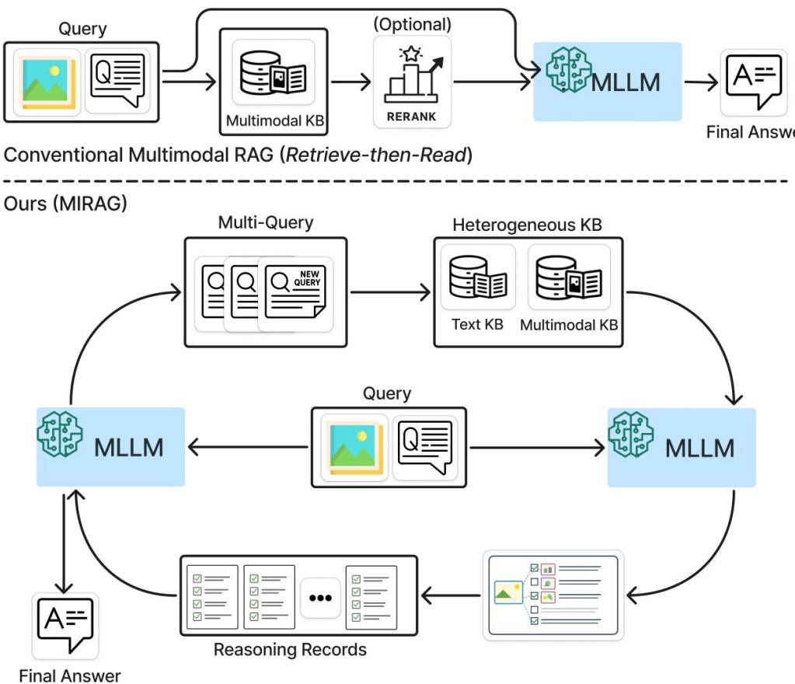  
Figure 1: An overview of conventional multimodal RAG and our MI-RAG framework. Conventional multimodal RAG employs a retrieve-then-read process using only a multimodal KB. In contrast, MI-RAG utilizes an iterative framework that cyclically refines its query and reasoning. At each iteration, MI-RAG formulates a multi-query with accumulated reasoning records and retrieves diverse knowledge from heterogeneous KBs. It then performs compositional reasoning to synthesize newly acquired knowledge into a reasoning record and appends it to the reasoning records to improve the subsequent iteration.

content can mislead synthesis and influence the final answer Petroni et al. (2020); Wu et al. (2024);   
Amiraz et al. (2025); Huang et al. (2025); Wu et al. (2025).

Motivated by these limitations, the text domain has shifted to iterative RAG, a paradigm that leverages an LLM’s reasoning through multiple rounds of retrieval and reasoning. In this iterative cycle, the model leverages its reasoning to guide intermediate steps, which transform queries to collect more relevant knowledge and synthesize newly retrieved knowledge to progressively update the reasoning itself. Shao et al. (2023); Trivedi et al. (2022); Xiong et al. (2024); Liu et al. (2024a); Yue et al. (2025); Gao et al. (2025). While previous work has shown promise with this approach in the text-only domain, it has largely focused on refining a single subquery of decomposing multi-hop questions at each step. Extending this to the more complex multimodal domain remains an open challenge.

This challenge arises because a naive adaptation of the iterative $R A G$ is insufficient for the multimodal domain, which introduces two distinct considerations: (i) it requires retrieving diverse knowledge by exploring multiple facets of a visually grounded entity and its related textual knowledge across modalities, and (ii) it demands compositional reasoning to synthesize the visual entity with its corresponding knowledge by integrating a diverse set of visual-to-visual, visual-to-text, and textto-text factual links. This highlights the need for a more specialized approach that can effectively handle the complexities of both visual and textual knowledge.

In response to these multimodal domain considerations, we propose Multimodal Iterative RetrievalAugmented Generation (MI-RAG). As illustrated in Figure 1, MI-RAG is an iterative framework that cyclically refines its query and reasoning by alternately performing reasoning-guided query transformation and retrieval-augmented reasoning. Our framework makes two primary contributions. First, we employ a reasoning-guided multi-query that dynamically searches multiple facets across modalities. Second, these queries drive a joint search across heterogeneous KBs to find a diverse set of factual links, allowing MI-RAG to compose visually-grounded knowledge and related textual knowledge. Through the synergy of multi-query and heterogeneous KBs, MI-RAG is able to retrieve sufficient knowledge and enable robust compositional reasoning over diverse knowledge across modalities. Through iterations, MI-RAG collects diverse knowledge progressively with accumulating a reasoning record, where each record is the result of compositional reasoning over newly retrieved knowledge, thereby refining the model’s understanding to guide the subsequent iteration step.

# 2 RELATED WORK

# 2.1 MULTIMODAL RAG FOR KNOWLEDGE-INTENSIVE VQA

The dominant paradigm for multimodal RAG follows the retrieve-then-read process. Initial work focused on enhancing the retrieval phase, primarily by learning more effective multimodal embeddings. Pioneering approaches aligned queries and text documents using contrastive learning Luo et al. (2023), while others fused similarity scores from pretrained CLIP Wei et al. (2024). To improve retrieval, subsequent methods employed fine-grained late interaction between visual and textual tokens Lin et al. (2023; 2024) or leveraged MLLMs with instruction tuning to produce multimodal embeddings Jiang et al. (2025); Liu et al. (2024b); Zhang et al. (2024b). A separate line of research has explored generative retrieval, using document identifiers Long et al. (2024) or enhancing generative retrieval via reinforcement learning Long et al. (2025).

Another line of research improves the read phase, typically by reranking or refining the retrieved candidates. Hierarchical systems first perform a coarse, image-based search and then refine the results with text-based or multimodal rerankers Caffagni et al. (2024); Yan & Xie (2024); Yang et al. (2025). Others leverage the reasoning capabilities of MLLMs to self-reflect on retrieval needs and evaluate relevance Cocchi et al. (2025), generate semantic tags for consistency and reranking based on relevance scores Ling et al. (2025). While effective, these methods largely adhere to the retrieve-then-read process. In contrast, MI-RAG introduces a dynamic loop that iterates between reasoning-guided query refinement and retrieval-augmented reasoning to progressively solve knowledge-intensive VQA tasks.

# 2.2 ITERATIVE RAG

When single-step retrieval is insufficient for complex, multi-hop questions, iterative RAG has emerged as a powerful paradigm in the text-only domain. These methods typically use an iterative loop to refine queries and retrieve new knowledge to improve subsequent iterations. Query transformation techniques are central to this process and include query expansion, which uses pseudoanswers to formulate richer queries Shao et al. (2023); Wang et al. (2024); query generation, which decomposes complex questions into simpler, answerable sub-queries Zhang et al. (2025); Liu et al. (2024a); and query planning, where a model strategically decides when and what to retrieve Trivedi et al. (2022); Yu et al. (2024).

To guide the subsequent query transformation, the LLM performs retrieval-augmented reasoning. This involves synthesizing newly retrieved information into a reasoning record. Common strategies include summarizing retrieved passages Jiang et al. (2024c); Zhang et al. (2025), extracting direct evidence snippets Yu et al. (2024), or generating pseudo-answers for intermediate sub-queries, often with chain-of-thought prompting Shao et al. (2023); Trivedi et al. (2022). However, these text-based iterative methods are primarily designed for multi-hop question decomposition, where the goal is to build a linear reasoning chain. Our work addresses knowledge-intensive VQA, which requires the composition of diverse knowledge across modalities.

# 3 METHOD

3.1 FRAMEWORK OF MULTIMODAL ITERATIVE RAG

# Algorithm 1 MI-RAG

Require: $I , Q , \mathrm { K B _ { T } , K B _ { M } , M L L M } , N$ Ensure: Final answer A

1: $D \gets \mathrm { M L L M } ( Q , I )$   
2: $Q _ { 0 } ^ { E } \gets \mathrm { E x p a n d } ( Q , D )$   
3: $K _ { \mathrm { T } }  \mathrm { R e t } ( \mathrm { K B _ { \mathrm { T } } } , Q _ { 0 } ^ { E } )$   
4: $K _ { \mathrm { M } } \gets \mathrm { R e t } ( \mathrm { K B _ { M } } , I , Q _ { 0 } ^ { E } )$   
5: $R _ { 0 } \gets \mathrm { R e a s o n i n g } ( \mathrm { M L L M } , Q , I , K _ { \mathrm { T } } , K _ { \mathrm { M } } , D )$   
6: fo $\begin{array} { r l } & { \mathrm { { \Phi } } _ { t } ^ { \mathrm { { ' } } } = 1 { \mathrm { \bf ~ t o } } N { \mathrm { \bf ~ d o } } } \\ & { \mathrm { { \Phi } } _ { Q _ { t } ^ { \mathrm { { ' } } } } ^ { \mathrm { { ' } } }  \mathrm { { E x p a n d } } \big ( Q , R _ { i - 1 } \big ) } \\ & { Q _ { i } ^ { G }  \mathrm { { G e n e r a t e } } \big ( \mathrm { M L M } , Q , R _ { 0 } , \dots , R _ { i - 1 } \big ) } \\ & { { \cal K } _ { \mathrm { T } }  \mathrm { { R e t } } ( { \mathrm { K B } } _ { \mathrm { T } } , Q _ { t } ^ { E } ) } \\ & { { \cal K } _ { \mathrm { T } }  { \cal K } _ { \mathrm { T } } \cup \mathrm { { R e t } } ( { \mathrm { K B } } _ { \mathrm { T } } , Q _ { i } ^ { G } ) } \\ & { { \cal K } _ { \mathrm { M } }  \mathrm { { R e t } } ( { \mathrm { K B } } _ { \mathrm { M } } , I , Q _ { t } ^ { G } ) } \\ & { { \cal K } _ { \mathrm { M } }  \mathrm { { \cal K } } _ { \mathrm { M } } \cup \mathrm { { \ R e t } } ( { \mathrm { K B } } _ { \mathrm { M } } , I , Q _ { i } ^ { G } ) } \\ & { { \cal R } _ { i }  \mathrm { { R e a s o n i n g } } \big ( \mathrm { M L L M } , Q , I , K _ { \mathrm { t e x t } } , K _ { \mathrm { n m } } \big ) } \end{array}$   
7:   
8:   
9:   
10:   
11:   
12:   
13:   
14: end for   
15: $A \ \gets \ \mathrm { M L L M } \big ( Q , I , \{ R _ { 0 } , R _ { 1 } , \dots , R _ { N } \} \big )$   
16: return $A$

As detailed in Algorithm 1, the MI-RAG framework processes multimodal queries (an image I and question Q), through iterative retrieval and reasoning. For conciseness in the pseudocode, we use the following abbreviations: $\mathrm { K B _ { T } }$ for text KB, $\mathrm { K B _ { M } }$ for multimodal KB, $\mathrm { K } _ { \mathrm { T } }$ for text passages, $\mathrm { K } _ { \mathrm { M } }$ for image-text pairs, Ret for Retrieve, $D$ for image description, $Q ^ { E }$ for expanded query, $Q ^ { G }$ for generated sub-query, $R$ for reasoning record and $N$ for iteration counts. This iterative process begins with the generation of initial reasoning records (Lines 1–5; Section 3.2). Subsequently, in each iteration, MI-RAG leverages the accumulated reasoning record to formulate the multi-query (Lines $^ { 7 - }$ 8; Section 3.3) and perform a joint search using the multi-query across heterogeneous KBs (Lines 9–12; Section 3.4), thereby dynamically gathering diverse and relevant knowledge. Following retrieval, MI-RAG updates the reasoning record by summarizing newly acquired

knowledge about the queries (Line 13; Section 3.5). Finally, the model derives the final answer over the accumulated records (Line 15; Section 3.6).

# 3.2 INITIAL REASONING RECORD GENERATION

The initial reasoning record is generated by leveraging the retrieved knowledge with internal MLLM knowledge. Specifically, given a multimodal query, the MLLM generates an image description $D$ corresponding to the question. We perform query expansion, yielding expanded query $Q _ { 0 } ^ { E } = [ Q , D ]$ . This query $\bar { Q } _ { 0 } ^ { E }$ is then used to retrieve knowledge from our heterogeneous KBs, collecting both text passages and image-text pairs. Finally, the model synthesizes retrieved diverse knowledge and descriptions into a reasoning record. This initial process generates the first reasoning record to bootstrap our iterative framework.

# 3.3 REASONING-GUIDED MULTI-QUERY TRANSFORMATION

MI-RAG employs a reasoning-guided multi-query transformation that leverages the MLLM’s intermediate reasoning steps to dynamically reformulate the query. This process uses the accumulated reasoning records to dynamically generate a set of complementary queries, ensuring a comprehensive search for multifaceted knowledge across modalities:

Query Expansion: This method leverages the latest reasoning record to expand the original query. The resulting query is designed to reflect the model’s latest reasoning, which enhances retrieval performance while preserving the original question’s intent.

Query Generation: This method produces a set of sub-queries designed to explore alternative reasoning paths, resolve ambiguities, or explicitly seek out missing facts identified during the analysis of the reasoning record.

We provide details of the prompt templates used to guide this transformation in Appendix C.

# 3.4 JOINT SEARCH ACROSS HETEROGENEOUS KBS

To enhance compositional reasoning, it is crucial to retrieve diverse knowledge across modalities. To acquire the a diverse set of factual knowledge, we perform a joint search over two heterogeneous KBs: a multimodal KB and a textual KB. The multimodal KB provides image-text pairs for visual grounding of entities, while the textual KB offers broad knowledge that extends beyond these pairs. Each query from the multi-query is used to retrieve candidates from both KBs simultaneously. To balance the token budget with broad knowledge coverage, our strategy retrieves twice as many text passages as image-text pairs, collecting up to 20 passages and 10 image-text pairs per iteration. The implementation details for multimodal retrieval are provided in Appendix D.

Retrieval from textual KB: The textual KB is queried using the multi-query. A text embedding model is used to retrieve the top-k passages based on semantic similarity.

Retrieval from multimodal KB: In contrast to prior methods that often rely on large, specialized retrievers, MI-RAG employs a lightweight retrieval strategy. We utilize a multimodal similarity scoring approach Changin et al. (2025) to support query transformation. For each candidate image-text pair, the similarity score is the average of two components: (1) a text-to-text similarity between the candidate’s text and the transformed query; and (2) a fixed image-to-image similarity between the candidate’s image and the input query image, which maintains constant visual relevance across iterations.

# 3.5 GENERATE REASONING RECORD WITH KNOWLEDGE

At each iteration, a reasoning record is generated by summarizing the newly retrieved knowledge. The MLLM synthesizes relevant evidence from visual entities and related text knowledge. This process utilizes the MLLM’s compositional reasoning to generate a reasoning record that captures relevant evidence. By iteratively enriching its understanding with these reasoning records, the model maintains a coherent reasoning path and enables more precise query transformations in subsequent steps. We provide details of the prompt in Appendix C.

# 3.6 FINAL ANSWER GENERATION

Upon completion of the $N$ iterative cycles, MI-RAG generates the final answer. In this stage, MLLM synthesizes the original question $Q$ , the input image $I$ , and the accumulated reasoning records $\{ R _ { 0 } , \ldots , R _ { N } \}$ to produce an evidence-based answer.

# 4 EXPERIMENTS

# 4.1 EXPERIMENT SETUP

Datasets: Our evaluation is conducted on three diverse knowledge-intensive VQA benchmarks: validation split of InfoSeek Chen et al. (2023), validation split of OK-VQA Marino et al. (2019), and test split of Encyclopedic VQA Mensink et al. (2023). For InfoSeek, we follow the setup of PreFLMR Lin et al. (2024) and utilize the validation split provided by the M2KR benchmark.

Knowledge Bases: To provide the necessary external knowledge, our framework retrieves text passages and image-text pairs from heterogeneous KBs, which are held constant across all experiments: a Wikipedia text corpus provided by FlashRAG Jin et al. (2024) for text KB and a 2M image-text pairs from Encyclopedic VQA for multimodal KB.

Models: To assess how performance scales with reasoning ability, we primarily use two model variants: Gemma-3 Team et al. (2025) and Gemini-2.5-Flash Comanici et al. (2025). Our framework employs lightweight retrievers. For the multimodal retrieval of image-text pairs, we compute a multimodal similarity score using image embeddings from SigLIP2-SO-400m Tschannen et al. (2025) and text embeddings from ModernBERT Warner et al. (2024). For the retrieval of text passages, we use E5-base-v2 Wang et al. (2022), following the setup in FlashRAG Jin et al. (2024).

Evaluation Metrics: We evaluate MI-RAG using standard metrics for each benchmark to evaluate accuracy and retrieval recall. For accuracy, we report the BERT matching score (BEM) Bulian et al. (2022) on Encyclopedic VQA. On the InfoSeek dataset, we measure Exact Match (EM) accuracy. To constrain the model’s answer to a single exact entity for this metric, we employ a 4-shot prompting strategy using examples from the training split. The full prompt template and further details are available in Appendix E. For OK-VQA, we use the standard VQA-score Marino et al. (2019) and a Cover Exact Match (Cover EM) Jiang et al. (2024a); Yue et al. (2025), which checks if the groundtruth answer is contained within the response. To assess retrieval performance, we use two metrics based on ground-truth annotation availability. Retrieval quality is measured using Recall of groundtruth entities where available, and Pseudo-Relevance Recall (PRR) otherwise Luo et al. (2021).

# 4.2 RETRIEVAL PERFORMANCE ON VQA BENCHMARKS

Table 1: Recall comparison on the InfoSeek and Encyclopedic VQA. The FT column with ✓indicates methods fine-tuned on the target dataset. Methods marked with $\dagger$ employ a reranking step after retrieval. Our vanilla method $( \ddagger )$ uses a single query with expansion to retrieve $K$ pairs from the multimodal KB, reporting average recall across iterations for fair comparison. Our full framework $( ^ { * } )$ reports the cumulative recall after 4 iterations. We report it on $\mathbf { R } @ 5$ , as each query retrieves fewer than five pairs on average. The best and second-best overall accuracies are highlighted in bold and with an underline, respectively.

<table><tr><td>FT</td><td>Method</td><td colspan="3">InfoSeek Validation</td><td colspan="3">Encyclopedic VQA</td></tr><tr><td></td><td></td><td>R@5</td><td>R@10</td><td>R@20</td><td>R@5</td><td>R@10</td><td>R@20</td></tr><tr><td>×</td><td>CLIP ViT-L/14 Radford et al. (2021)</td><td>54.0</td><td>61.6</td><td>68.6</td><td>7.7</td><td>12.1</td><td>16.5</td></tr><tr><td>×</td><td>SigLIP2-So400m Tschannen et al. (2025)</td><td>52.5</td><td>60.2</td><td>68.3</td><td>30.8</td><td>36.6</td><td>41.9</td></tr><tr><td>×</td><td>EVA-CLIP-8B Sun et al. (2023)</td><td>67.1</td><td>73.0</td><td>77.9</td><td>31.3</td><td>41.0</td><td>48.8</td></tr><tr><td>✓</td><td>Wiki-LLaVA Caffagni et al. (2024)</td><td>-</td><td>66.1</td><td>71.9</td><td>-</td><td>9.9</td><td>13.2</td></tr><tr><td>✓</td><td>LLM-RA Jian et al. (2024)</td><td>53.8</td><td></td><td></td><td>-</td><td>-</td><td>-</td></tr><tr><td></td><td>mR²AG† Zhang et al. (2024a)</td><td>-</td><td>65.0</td><td>71.0</td><td>-</td><td>-</td><td>-</td></tr><tr><td></td><td>ReflectiVA† Cocchi et al. (2025)</td><td>77.6</td><td>-</td><td>86.4</td><td>36.1</td><td>-</td><td>49.8</td></tr><tr><td></td><td>EchoSight† Yan &amp; Xie (2024)</td><td>74.0</td><td>77.4</td><td>77.9</td><td>47.9</td><td>48.8</td><td>48.8</td></tr><tr><td></td><td>OMGM Yang et al. (2025)</td><td>73.9</td><td>80.0</td><td>84.8</td><td>41.2</td><td>49.8</td><td>58.7</td></tr><tr><td>✓</td><td>OMGM† Yang et al. (2025)</td><td>80.8</td><td>83.6</td><td>84.8</td><td>55.7</td><td>58.1</td><td>58.7</td></tr><tr><td>×</td><td>ReAuSE Long et al. (2025)</td><td>59.5</td><td>-</td><td>-</td><td>-</td><td>-</td><td>-</td></tr><tr><td>×</td><td>Ours (Gemma-3-4B)‡</td><td>80.8</td><td>85.6</td><td>89.7</td><td>39.1</td><td>44.3</td><td>49.8</td></tr><tr><td>×</td><td>Ours (Gemma-3-4B)*</td><td>88.0</td><td>-</td><td>-</td><td>53.6</td><td>-</td><td>-</td></tr><tr><td>×</td><td>Ours (Gemini-Flash-2.5)*</td><td>92.1</td><td>-</td><td>-</td><td>62.4</td><td>-</td><td>-</td></tr></table>

As shown in Table 1, our MI-RAG framework demonstrates effective retrieval without any taskspecific fine-tuning. We analyze its performance by highlighting three key findings: the effectiveness of reasoning-guided queries in a lightweight setup, MI-RAG’s performance boost from the iterative process, and the framework’s inherent synergy with larger MLLMs.

To evaluate our reasoning-guided query transformation, we provide a vanilla method $( \ddagger )$ , which uses a single query with a multimodal KB, a small 4B MLLM, and a lightweight retriever for fair comparison. This contrasts with approaches that employ larger retrievers and use MLLM for reranking. Even under these constraints, our method is highly effective, achieving a top $\mathbf { R } @ 2 0$ score of $8 9 . 7 \%$ on InfoSeek and the second-highest ${ \sf R @ 2 0 }$ on Encyclopedic VQA.

Our full framework $( ^ { * } )$ performs multiple rounds of multi-query searches across heterogeneous KBs to progressively accumulate multifaceted knowledge across modalities. The results show significant gains in cumulative recall, reaching $8 8 . 0 \%$ $( + 7 . 2 \% )$ on InfoSeek and $5 3 . 6 \%$ $( + 1 4 . 5 \% )$ on Encyclopedic VQA.

Finally, we analyze MI-RAG’s scalability by evaluating its two core components: the MLLM and the retriever. As shown in Table 1, scaling the MLLM from Gemma-3-4B to Gemini-Flash-2.5 consistently improves performance. This result confirms that a more capable MLLM enhances both query transformation and compositional reasoning. In Section 6.2, we demonstrate that scaling the retriever provides a further performance boost.

On the OK-VQA benchmark, MI-RAG demonstrates strong retrieval performance, as detailed in Table 2. Our vanilla method $( \ddagger )$ , despite its lightweight setup, shows competitive performance. Enabling the full MI-RAG provides a substantial boost to $9 5 . 2 \%$ $( 1 8 . 1 \% )$ for the same 4B model. A more powerful MLLM with stronger reasoning achieves $9 7 . 1 \%$ recall, outperforming all prior work.

This robust performance contrasts sharply with prior methods, which often exhibit a performance trade-off across different benchmarks. For instance, ReAuSE excels in its trained knowledge domain (OK-VQA) but fails to generalize to InfoSeek, whereas OMGM shows the reverse pattern. In contrast, our method shows high performance across all benchmarks.

Table 3: Accuracy comparison on the Encyclopedic VQA benchmark. A checkmark $( \checkmark )$ indicates fine-tuning, a dagger $( \dag )$ denotes MLLM-based reranking, and an asterisk $( ^ { * } )$ marks the use of ReflectiVA checkpoints. Our framework’s Gemma-series models generate their own reasoning records, whereas other models use records provided by Gemini-2.5-Flash.   

<table><tr><td>Google Lens</td><td>FT</td><td>Method</td><td>Model</td><td>Single-hop</td><td>All</td></tr><tr><td rowspan="10">×</td><td>✓</td><td>Wiki-LLaVA Caffagni et al. (2024)</td><td>LLaVA-v1.5-7B</td><td>21.8</td><td></td></tr><tr><td></td><td>EchoSight† Yan &amp; Xie (2024)</td><td>Mistral-7B</td><td>35.5</td><td></td></tr><tr><td></td><td>ReflectiVA† Cocchi et al. (2025)</td><td>LLaVA-MORE-8B</td><td>35.5</td><td></td></tr><tr><td></td><td>MMKB-RAG† Ling et al. (2025)</td><td>Qwen2-VL-7B</td><td>39.7</td><td>35.9</td></tr><tr><td></td><td>OMGM† Yang et al. (2025)</td><td>LLaVA-v1.5-7B</td><td>50.2</td><td></td></tr><tr><td></td><td>OMGM† Yang et al. (2025)</td><td>GPT-40</td><td>51.2</td><td>-</td></tr><tr><td>✓</td><td>Ours</td><td>LLaVA-MORE-8B*</td><td>50.4</td><td>49.2</td></tr><tr><td>×</td><td>Ours</td><td>Gemma-3-4B</td><td>48.4</td><td>52.4</td></tr><tr><td>×</td><td>Ours</td><td>Gemini-2.5-Flash</td><td>61.4</td><td>62.9</td></tr><tr><td>×</td><td></td><td>PaLI-X</td><td></td><td></td></tr><tr><td rowspan="5"></td><td></td><td>HAMMR Castrejon et al. (2024)</td><td></td><td>47.8</td><td></td></tr><tr><td>× ✓</td><td>LVLM cascade Alazraki et al. (2023)</td><td>PaLM, GPT-3, PaLI</td><td>53.4</td><td></td></tr><tr><td>×</td><td>mR²AG† Zhang et al. (2024a)</td><td>LLaVA-v1.5-7B</td><td>55.9</td><td>51.8</td></tr><tr><td></td><td>Ours</td><td>Gemma-3-4B</td><td>62.8</td><td>63.7</td></tr><tr><td>×</td><td>Ours</td><td>Gemini-2.5-Flash</td><td>75.5</td><td>70.8</td></tr></table>

# 4.3 ACCURACY ON VQA BENCHMARKS

As demonstrated in Table 3, our MI-RAG framework establishes a new state-of-the-art on the Encyclopedic VQA benchmark. To isolate the contribution of our iterative reasoning, we first evaluate a setting with a strong initial retrieval provided by Google Lens. This configuration reveals that performance scales directly with the MLLM’s reasoning capacity: accuracy improves from a competitive $6 2 . 8 \%$ with Gemma-3-4B to a state-of-the-art $7 5 . 5 \%$ with Gemini-2.5-Flash. This highlights the synergy between a high-quality initial retrieval and the model’s ability to iteratively refine it, an analysis further explored in Section 6.2.

Table 2: Recall comparison on the OK-VQA benchmark when utilizing Wikipedia as the knowledge source. Symbols denote: fine-tuning $( \checkmark )$ ; reranking $( \dag )$ ; our vanilla baseline $( \ddagger )$ ; and our MI-RAG framework $( ^ { * } )$ . The best and secondbest overall accuracies are highlighted in bold and with an underline, respectively.   

<table><tr><td rowspan="2">FT</td><td rowspan="2">Methods</td><td colspan="3">OK-VQA</td></tr><tr><td>PRR@5</td><td>PRR@10</td><td>PRR@20</td></tr><tr><td>✓</td><td>ReViz-ICT</td><td>61.9</td><td>72.6</td><td>81.1</td></tr><tr><td>✓</td><td>GeMKR</td><td>70.8</td><td>79.1</td><td>-</td></tr><tr><td>✓</td><td>FLMR</td><td>68.1</td><td>78.0</td><td></td></tr><tr><td>√</td><td>Pre-FLMR</td><td>68.6</td><td>-</td><td></td></tr><tr><td>✓</td><td>ReAuSE</td><td>88.0</td><td>91.3</td><td></td></tr><tr><td>×</td><td>OMGM†</td><td>73.4</td><td>-</td><td></td></tr><tr><td>×</td><td>Ours (Gemma-3-4B)‡</td><td>77.1</td><td>85.4</td><td>91.2</td></tr><tr><td>×</td><td>Ours (Gemma-3-4B)*</td><td>95.2</td><td>-</td><td>-</td></tr><tr><td>×</td><td>Ours (Gemini-Flash-2.5)*</td><td>97.1</td><td>-</td><td></td></tr></table>

setup. When these records are applied to LLaVA-MORE-8B checkpoint from ReflectiVA as the answerer, our framework achieves a competitive accuracy of $5 0 . 4 \%$ . When Gemini-2.5-Flash is used as the answerer, our method achieves $6 1 . 4 \%$ accuracy.

In the more challenging setting without Google Lens, we use reasoning records generated by Gemini-2.5-Flash with our lightweight retriever

On the InfoSeek benchmark, MI-RAG translates its strong retrieval performance into state-of-the-art accuracy, as detailed in Table 4. Our method achieves $4 8 . 0 \%$ accuracy with Gemini-2.5-Flash and improves to $5 1 . 7 \%$ with GPT-4o as the answerer, outperforming all prior work. This is driven by our iterative process, where accumulated reasoning records enable robust compositional reasoning over multifaceted, diverse knowledge. The strength of this iterative reasoning is further demonstrated by its ability to improve ReflectiVA’s LLaVA-MORE-8B checkpoint to $4 5 . 1 \%$ .

Recent MLLMs generate detailed, free-form responses by leveraging multi-stage post-training to better align with human preferences, making strict exact match (EM) an inadequate metric for a comprehensive evaluation, as noted in prior work Shao et al. (2023); Cocchi et al. (2025). Consequently, metrics like Cover EM (CEM), which verify the inclusion of the ground-truth answer within a longer response, are increasingly used Jiang et al. (2024a); Yue et al. (2025); Wang et al. (2025). This gap arises when MLLM is not explicitly fine-tuned to produce a strict single-entity answer. The MLLM’s tendency to generate a rationale before the final answer results in penalties under the EM metric.

Table 4: Accuracy comparison on the InfoSeek benchmark: the top section evaluates the full validation set, while the bottom section assesses a 5K validation split. A checkmark $( \checkmark )$ in the FT column indicates fine-tuning, a dagger $( \dag )$ denotes a reranking step, and an asterisk $( ^ { * } )$ marks the use of checkpoints from ReflectiVA. Our framework’s Gemma-series models generate their own reasoning records, whereas other models use records provided by Gemini-2.5-Flash.   

<table><tr><td>FT</td><td>Method</td><td>Retriever</td><td>Model</td><td>Acc</td></tr><tr><td>✓</td><td>Wiki-LLaVA Caffagni et al. (2024)</td><td>CLIP-ViT-L</td><td>LLaVA-1.5-7B</td><td>28.9</td></tr><tr><td></td><td>EchoSight† Yan &amp; Xie (2024)</td><td>EVA-CLIP-8B</td><td>LLaMA3-8B</td><td>31.3</td></tr><tr><td></td><td>mR²AG† Zhang et al. (2024a)</td><td>CLIP-ViT-L</td><td>LLaVA-1.5-7B</td><td>40.2</td></tr><tr><td></td><td>ReflectiVA† Cocchi et al. (2025)</td><td>EVA-CLIP-8B</td><td>LLaVA-MORE-8B</td><td>40.1</td></tr><tr><td></td><td>MMKB-RAG† Ling et al. (2025)</td><td>PreFLMR ViT-G</td><td>Qwen2-VL-7B</td><td>36.7</td></tr><tr><td></td><td>OMGM† Yang et al. (2025)</td><td>EVA-CLIP-8B</td><td>LLaVA-1.5-7B</td><td>43.5</td></tr><tr><td></td><td>OMGM† Yang et al. (2025)</td><td>EVA-CLIP-8B</td><td>GPT-40</td><td>42.1</td></tr><tr><td></td><td>RA-VQA-v2 Lin et al. (2024)</td><td>PreFLMR ViT-G</td><td>BLIP2-Flan-T5-XL</td><td>30.7</td></tr><tr><td></td><td>MMKB-RAG Ling et al. (2025)</td><td>PreFLMR ViT-G</td><td>Qwen2-VL-7B</td><td>34.7</td></tr><tr><td></td><td>MUKA Deng et al. (2025)</td><td>MUKA</td><td>VILA-13B</td><td>42.5</td></tr><tr><td></td><td></td><td></td><td>LLaVA-MORE-8B*</td><td>45.1</td></tr><tr><td>×</td><td></td><td></td><td>Gemma-3-4B</td><td>33.1</td></tr><tr><td></td><td>Ours</td><td>SigLIP2-SO-400m</td><td>Gemini-2.5-Flash</td><td></td></tr><tr><td>×</td><td></td><td></td><td></td><td>48.0</td></tr><tr><td>×</td><td></td><td></td><td>GPT-40</td><td>51.7</td></tr></table>

# 5 ABLATIONS

Table 5: Comparison of accuracy based on two metrics: Cover EM, which checks if the groundtruth answer is included in the response, and Exact Match, which requires the response to match the ground-truth answer exactly.   

<table><tr><td>Model</td><td colspan="2">InfoSeek Validation</td><td colspan="2">InfoSeek Human</td><td colspan="2">OK-VQA</td></tr><tr><td></td><td>EM</td><td>CEM</td><td>EM</td><td>CEM</td><td>EM</td><td>CEM</td></tr><tr><td>Gemma-3-4B</td><td>33.1</td><td>50.4</td><td>32.3</td><td>39.3</td><td>43.3</td><td>68.8</td></tr><tr><td>Gemini-2.5-Flash</td><td>48.0</td><td>61.3</td><td>40.5</td><td>44.9</td><td>57.3</td><td>71.0</td></tr></table>

across both single-query and multi-query. We report performance using cumulative recall, along with CoverEM on InfoSeek and BEM on Encyclopedic VQA. We provide details of the downsampling algorithm in Appendix G.

We conducted ablation studies to evaluate MIRAG’s core components. For efficiency, all experiments are performed on downsampled subsets of InfoSeek and Encyclopedic VQA using Gemini-2.5-Flash as the MLLM. We strictly controlled the retrieval budget to ensure a fair comparison. For our default heterogeneous KB setting, we retrieve 20 text passages and 10 image-text pairs. To maintain a comparable budget for multimodal KB, we retrieve 20 pairs. This total retrieval budget is held constant

# 5.1 ABLATION OF COMPONENTS

Table 6: Ablation of MIRAG on the InfoSeek validation subset and Encyclopedic VQA test subset.   

<table><tr><td colspan="3">Components</td><td colspan="2">InfoSeek</td><td colspan="2">Encyclopedic VQA</td></tr><tr><td>Multi Query</td><td>Hetero. KB</td><td>Iter.</td><td>Acc</td><td>Recall</td><td>Acc</td><td>Recall</td></tr><tr><td>×</td><td>×</td><td>×</td><td>46.70</td><td>87.28</td><td>50.78</td><td>47.06</td></tr><tr><td>✓</td><td>×</td><td>×</td><td>49.44</td><td>90.34</td><td>52.94</td><td>49.02</td></tr><tr><td>×</td><td>✓</td><td>×</td><td>49.21</td><td>88.08</td><td>51.18</td><td>52.75</td></tr><tr><td>✓</td><td>✓</td><td>×</td><td>54.11</td><td>91.43</td><td>56.67</td><td>57.25</td></tr><tr><td>✓</td><td>✓</td><td>✓</td><td>61.84</td><td>94.36</td><td>63.33</td><td>67.25</td></tr></table>

Our ablation analysis in Table 6 reveals the impact of each component. We establish a strong baseline using a vanilla RAG system over a multimodal KB, enhanced with our initial query expansion, which integrates the MLLM’s knowledge. Introducing the reasoning-guided multi-query yields a substantial accuracy gain by gathering the multifaceted knowledge. Moreover, employing our heterogeneous KB is crucial for compositional reasoning, as it en

ables the model to compose visually-grounded knowledge with the broad textual knowledge. Combining these two components creates a crucial synergy for compositional reasoning. However, the iterative process delivers the most significant improvement across all datasets.

# 5.2 IMPACT OF ITERATIVE REFINEMENT

Table 7: Performance over iterations on the InfoSeek and Encyclopedic VQA.   

<table><tr><td>Iter.</td><td colspan="2">InfoSeek</td><td colspan="2">Encyclopedic VQA</td></tr><tr><td></td><td>Acc</td><td>Recall</td><td>Acc</td><td>Recall</td></tr><tr><td>1</td><td>55.72</td><td>92.13</td><td>58.46</td><td>65.10</td></tr><tr><td>2</td><td>59.10</td><td>92.95</td><td>60.86</td><td>66.27</td></tr><tr><td>3</td><td>61.41</td><td>93.44</td><td>61.96</td><td>66.86</td></tr><tr><td>4</td><td>61.84</td><td>94.36</td><td>63.33</td><td>67.25</td></tr></table>

To further investigate the benefits of iterative refinement, we analyze performance across multiple iterations, with results presented in Table 7. The study confirms that iterative processing is a primary driver of accuracy, and performance consistently improves over the vanilla baseline across all datasets. The most substantial gains are typically observed within the first two iterations, validating the efficacy of the core refinement loop. As visualized in Figure 2, these gains gradually saturate.

# 5.3 IMPACT OF HETEROGENEOUS KB

Table 8: Ablation on the KB configuration, showing performance after 4 iterations. Heterogeneous KB refers to the use of both KBs, while Multimodal restricts retrieval to the multimodal KB only.   

<table><tr><td></td><td colspan="2">InfoSeek</td><td colspan="2">Encyclopedic VQA</td></tr><tr><td>KB Config.</td><td>Acc</td><td>Recall</td><td>Acc</td><td>Recall</td></tr><tr><td>Multimodal</td><td>57.49</td><td>91.79</td><td>56.86</td><td>58.63</td></tr><tr><td>Heterogenous</td><td>61.84</td><td>94.36</td><td>63.33</td><td>67.25</td></tr></table>

soning more effectively, leveraging diverse and relevant evidence to refine its search and generate more accurate reasoning records for the final answer.

As shown in Table 8, we evaluate the impact of heterogeneous KB. Applying our reasoning-guided multi-query approach to the multimodal KB alone yields high recall, demonstrating its ability to retrieve visually grounded information. However, its precision remains limited, indicating that relying solely on visually grounded knowledge is often insufficient for compositional reasoning. By combining heterogeneous sources, MI-RAG enables the model to perform compositional rea

# 6 ANALYSIS

# 6.1 ANALYSIS OF ITERATIVE PERFORMANCE

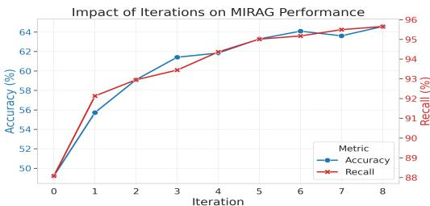  
Figure 2: Accuracy and recall of MI-RAG on InfoSeek subset across 9 iterations.

We analyze how iterative refinement impacts MI-RAG’s performance by measuring accuracy and recall across iterations. As shown in Figure 2, performance improves consistently with each step. The initial iterations deliver significant gains. Although the rate of improvement moderates in later steps, the model continues to achieve substantial gains in accuracy and recall. This performance improvement comes with an associated computational cost for each iteration, which we detail in Appendix F.

# 6.2 SCALING RETRIEVERS

Building upon the established benefits of scaling MLLMs, we now investigate the impact of scaling the retriever. We investigated this by employing a larger vision encoder (SigLIP2-g) and a text embedding model (Qwen3-Embedding-0.6B). On the InfoSeek validation split, when using Gemini2.5-Flash for MI-RAG, this enhanced retrieval improves accuracy to $6 6 . 7 \%$ $( + 6 . 4 \% )$ and cumulative recall to $9 5 . 2 \%$ $( + 3 . 1 \% )$ . Similarly, on the Encyclopedic VQA test split, the scaled retriever paired with the Gemma-3-4B enhances accuracy to $5 0 . 2 \%$ $( + 1 . 9 \% )$ and cumulative recall to $6 5 . 7 \%$ $( + 1 2 . 1 \% )$ . These findings confirm that improving retrieval capability provides significant benefits for MI-RAG’s performance, validating the synergistic design.

# 6.3 TOP-K SENSITIVITY ANALYSIS

Table 9: Top-k sensitivity analysis on the InfoSeek validation subset. $k$ indicates the number of retrieved image-text pairs.   

<table><tr><td>Model</td><td>Metric</td><td>k = 10</td><td>k = 20</td></tr><tr><td rowspan="2">Gemma-3-4B</td><td>Acc</td><td>52.66</td><td>48.95</td></tr><tr><td>Recall</td><td>90.82</td><td>94.52</td></tr><tr><td rowspan="2">Gemini-2.5-Flash</td><td>Acc</td><td>61.84</td><td>65.70</td></tr><tr><td>Recall</td><td>94.36</td><td>95.97</td></tr></table>

Our sensitivity analysis on the InfoSeek validation subset (Table 9) reveals that the benefit of a larger retrieval budget is only beneficial if the MLLM is capable enough to handle the additional context. As shown in Table 9, the results reveal that simply increasing the retrieval budget is not always beneficial. For instance, Gemma-3-4B shows a degradation in accuracy when $k$ is increased from 10 to 20, suggesting that the additional context may potentially distract, hindering its ability to gather the correct ev

idence.

# 7 CONCLUSION

In this work, we introduce MI-RAG, a novel multimodal iterative RAG framework that addresses key challenges in knowledge-intensive VQA. MI-RAG employs a reasoning-guided multi-query transformation that dynamically explores multiple facets of an entity and its related textual knowledge across modalities. To facilitate compositional reasoning, its iterative process uses this retrieved evidence to progressively synthesize visual entities and corresponding textual knowledge, effectively integrating a diverse set of factual links. Our results demonstrate that MI-RAG is an effective and scalable paradigm for advancing compositional reasoning in knowledge-intensive VQA. Furthermore, our analysis indicates clear pathways for future work, such as scaling components by integrating web-scale search or dynamically adjusting the retrieval budget based on model capability.

# 8 ETHICS STATEMENT

Our work introduces new methods for multimodal retrieval-augmented generation for knowledgeintensive visual question answering, and we acknowledge the associated ethical implications. Potential risks include the propagation of biases from the underlying knowledge bases, which can lead to the generation of inaccurate or misleading information. To mitigate these concerns, our framework is intended for research purposes and requires careful evaluation before any deployment. Our approach uses only publicly available datasets and knowledge bases and does not involve private or personally identifiable information. We advocate for continued research on methods for bias detection and mitigation to ensure responsible development of these technologies.

# 9 REPRODUCIBILITY STATEMENT

To ensure full reproducibility, we provide the main algorithm code for MI-RAG in the supplementary materials. This includes comprehensive scripts for preparing the evaluation data, constructing the knowledge bases, and executing the main experiments. All implementation details, including our core algorithm, are described in Section 3 and detailed in Algorithm 1. The experimental setup, including datasets, knowledge bases, model variants, and evaluation metrics, is thoroughly outlined in Section 4.1.

# REFERENCES

Lisa Alazraki, Lluis Castrejon, Mostafa Dehghani, Fantine Huot, Jasper Uijlings, and Thomas Mensink. How (not) to ensemble lvlms for vqa. In Proceedings on, pp. 1–20. PMLR, 2023.

Chen Amiraz, Florin Cuconasu, Simone Filice, and Zohar Karnin. The distracting effect: Understanding irrelevant passages in rag. arXiv preprint arXiv:2505.06914, 2025.

Jannis Bulian, Christian Buck, Wojciech Gajewski, Benjamin Borschinger, and Tal Schuster. ¨ Tomayto, tomahto. beyond token-level answer equivalence for question answering evaluation. In Yoav Goldberg, Zornitsa Kozareva, and Yue Zhang (eds.), Proceedings of the 2022 Conference on Empirical Methods in Natural Language Processing, pp. 291–305, Abu Dhabi, United Arab Emirates, December 2022. Association for Computational Linguistics. doi: 10.18653/v1/2022. emnlp-main.20. URL https://aclanthology.org/2022.emnlp-main.20/.

Davide Caffagni, Federico Cocchi, Nicholas Moratelli, Sara Sarto, Marcella Cornia, Lorenzo Baraldi, and Rita Cucchiara. Wiki-llava: Hierarchical retrieval-augmented generation for multimodal llms. In Proceedings of the IEEE/CVF Conference on Computer Vision and Pattern Recognition, pp. 1818–1826, 2024.

Lluis Castrejon, Thomas Mensink, Howard Zhou, Vittorio Ferrari, Andre Araujo, and Jasper Uijlings. Hammr: Hierarchical multimodal react agents for generic vqa. arXiv preprint arXiv:2404.05465, 2024.

Choi Changin, Lim Sungjun, and Rhee Wonjong. Enhancing retrieval-augmented audio captioning with generation-assisted multimodal querying and progressive learning, 2025. URL https: //arxiv.org/abs/2410.10913.

Yang Chen, Hexiang Hu, Yi Luan, Haitian Sun, Soravit Changpinyo, Alan Ritter, and Ming-Wei Chang. Can pre-trained vision and language models answer visual information-seeking questions? In Houda Bouamor, Juan Pino, and Kalika Bali (eds.), Proceedings of the 2023 Conference on Empirical Methods in Natural Language Processing, pp. 14948–14968, Singapore, December 2023. Association for Computational Linguistics. doi: 10.18653/v1/2023.emnlp-main.925. URL https://aclanthology.org/2023.emnlp-main.925/.

Zhanpeng Chen, Chengjin Xu, Yiyan Qi, and Jian Guo. Mllm is a strong reranker: Advancing multimodal retrieval-augmented generation via knowledge-enhanced reranking and noise-injected training. arXiv preprint arXiv:2407.21439, 2024.

Federico Cocchi, Nicholas Moratelli, Marcella Cornia, Lorenzo Baraldi, and Rita Cucchiara. Augmenting Multimodal LLMs with Self-Reflective Tokens for Knowledge-based Visual Question Answering. In Proceedings of the IEEE/CVF Conference on Computer Vision and Pattern Recognition, 2025.

Gheorghe Comanici, Eric Bieber, Mike Schaekermann, Ice Pasupat, Noveen Sachdeva, Inderjit Dhillon, Marcel Blistein, Ori Ram, Dan Zhang, Evan Rosen, et al. Gemini 2.5: Pushing the frontier with advanced reasoning, multimodality, long context, and next generation agentic capabilities. arXiv preprint arXiv:2507.06261, 2025.

Florin Cuconasu, Giovanni Trappolini, F. Siciliano, Simone Filice, Cesare Campagnano, Yoelle Maarek, Nicola Tonellotto, and Fabrizio Silvestri. The power of noise: Redefining retrieval for rag systems. In Annual International ACM SIGIR Conference on Research and Development in Information Retrieval, 2024. URL https://api.semanticscholar.org/CorpusID: 267301416.

Lianghao Deng, Yuchong Sun, Shizhe Chen, Ning Yang, Yunfeng Wang, and Ruihua Song. Muka: Multimodal knowledge augmented visual information-seeking. In Proceedings of the 31st International Conference on Computational Linguistics, pp. 9675–9686, 2025.

Yunfan Gao, Yun Xiong, Yijie Zhong, Yuxi Bi, Ming Xue, and Haofen Wang. Synergizing rag and reasoning: A systematic review. arXiv preprint arXiv:2504.15909, 2025.

Wenyu Huang, Pavlos Vougiouklis, Mirella Lapata, and Jeff Z Pan. Masking in multi-hop qa: An analysis of how language models perform with context permutation. arXiv preprint arXiv:2505.11754, 2025.

Pu Jian, Donglei Yu, and Jiajun Zhang. Large language models know what is key visual entity: An llm-assisted multimodal retrieval for vqa. In Proceedings of the 2024 Conference on Empirical Methods in Natural Language Processing, pp. 10939–10956, 2024.

Jinhao Jiang, Jiayi Chen, Junyi Li, Ruiyang Ren, Shijie Wang, Wayne Xin Zhao, Yang Song, and Tao Zhang. Rag-star: Enhancing deliberative reasoning with retrieval augmented verification and refinement. arXiv preprint arXiv:2412.12881, 2024a.

Ting Jiang, Minghui Song, Zihan Zhang, Haizhen Huang, Weiwei Deng, Feng Sun, Qi Zhang, Deqing Wang, and Fuzhen Zhuang. E5-v: Universal embeddings with multimodal large language models. arXiv preprint arXiv:2407.12580, 2024b.

Zhouyu Jiang, Mengshu Sun, Lei Liang, and Zhiqiang Zhang. Retrieve, summarize, plan: Advancing multi-hop question answering with an iterative approach. arXiv preprint arXiv:2407.13101, 2024c.

Ziyan Jiang, Rui Meng, Xinyi Yang, Semih Yavuz, Yingbo Zhou, and Wenhu Chen. VLM2vec: Training vision-language models for massive multimodal embedding tasks. In The Thirteenth International Conference on Learning Representations, 2025. URL https://openreview. net/forum?id ${ . } = { }$ TE0KOzWYAF.

Jiajie Jin, Yutao Zhu, Guanting Dong, Yuyao Zhang, Xinyu Yang, Chenghao Zhang, Tong Zhao, Zhao Yang, Zhicheng Dou, and Ji-Rong Wen. Flashrag: A modular toolkit for efficient retrievalaugmented generation research. arXiv preprint arXiv:2405.13576, 2024.

Sheng-Chieh Lin, Chankyu Lee, Mohammad Shoeybi, Jimmy Lin, Bryan Catanzaro, and Wei Ping. MM-EMBED: UNIVERSAL MULTIMODAL RETRIEVAL WITH MULTIMODAL LLMS. In The Thirteenth International Conference on Learning Representations, 2025. URL https:// openreview.net/forum?id ${ \mathop = } \dot { \beth }$ 45NQb2iKO.

Weizhe Lin, Jinghong Chen, Jingbiao Mei, Alexandru Coca, and Bill Byrne. Fine-grained late-interaction multi-modal retrieval for retrieval augmented visual question answering. In Thirty-seventh Conference on Neural Information Processing Systems, 2023. URL https: //openreview.net/forum?id ${ . } = { }$ IWWWulAX7g.

Weizhe Lin, Jingbiao Mei, Jinghong Chen, and Bill Byrne. PreFLMR: Scaling up fine-grained lateinteraction multi-modal retrievers. In Lun-Wei Ku, Andre Martins, and Vivek Srikumar (eds.), Proceedings of the 62nd Annual Meeting of the Association for Computational Linguistics (Volume 1: Long Papers), pp. 5294–5316, Bangkok, Thailand, August 2024. Association for Computational Linguistics. URL https://aclanthology.org/2024.acl-long.289.

Zihan Ling, Zhiyao Guo, Yixuan Huang, Yi An, Shuai Xiao, Jinsong Lan, Xiaoyong Zhu, and Bo Zheng. Mmkb-rag: A multi-modal knowledge-based retrieval-augmented generation framework. arXiv preprint arXiv:2504.10074, 2025.

Yanming Liu, Xinyue Peng, Xuhong Zhang, Weihao Liu, Jianwei Yin, Jiannan Cao, and Tianyu Du. RA-ISF: Learning to answer and understand from retrieval augmentation via iterative selffeedback. In Lun-Wei Ku, Andre Martins, and Vivek Srikumar (eds.), Findings of the Association for Computational Linguistics: ACL 2024, pp. 4730–4749, Bangkok, Thailand, August 2024a. Association for Computational Linguistics. doi: 10.18653/v1/2024.findings-acl.281. URL https://aclanthology.org/2024.findings-acl.281/.

Yikun Liu, Pingan Chen, Jiayin Cai, Xiaolong Jiang, Yao Hu, Jiangchao Yao, Yanfeng Wang, and Weidi Xie. Lamra: Large multimodal model as your advanced retrieval assistant. arXiv preprint arXiv:2412.01720, 2024b.

Xinwei Long, Jiali Zeng, Fandong Meng, Zhiyuan Ma, Kaiyan Zhang, Bowen Zhou, and Jie Zhou. Generative multi-modal knowledge retrieval with large language models. In Proceedings of the AAAI Conference on Artificial Intelligence, volume 38, pp. 18733–18741, 2024.

Xinwei Long, Zhiyuan Ma, Ermo Hua, Kaiyan Zhang, Biqing Qi, and Bowen Zhou. Retrievalaugmented visual question answering via built-in autoregressive search engines. In Proceedings of the AAAI Conference on Artificial Intelligence, volume 39, pp. 24723–24731, 2025.

Man Luo, Yankai Zeng, Pratyay Banerjee, and Chitta Baral. Weakly-supervised visual-retrieverreader for knowledge-based question answering. In Marie-Francine Moens, Xuanjing Huang, Lucia Specia, and Scott Wen-tau Yih (eds.), Proceedings of the 2021 Conference on Empirical

Methods in Natural Language Processing, pp. 6417–6431, Online and Punta Cana, Dominican Republic, November 2021. Association for Computational Linguistics. doi: 10.18653/v1/2021. emnlp-main.517. URL https://aclanthology.org/2021.emnlp-main.517/.

Man Luo, Zhiyuan Fang, Tejas Gokhale, Yezhou Yang, and Chitta Baral. End-to-end knowledge retrieval with multi-modal queries. arXiv preprint arXiv:2306.00424, 2023.

Kenneth Marino, Mohammad Rastegari, Ali Farhadi, and Roozbeh Mottaghi. Ok-vqa: A visual question answering benchmark requiring external knowledge. In Proceedings of the IEEE/cvf conference on computer vision and pattern recognition, pp. 3195–3204, 2019.

Thomas Mensink, Jasper Uijlings, Lluis Castrejon, Arushi Goel, Felipe Cadar, Howard Zhou, Fei Sha, Andre Araujo, and Vittorio Ferrari. Encyclopedic vqa: Visual questions about detailed prop- ´ erties of fine-grained categories. In Proceedings of the IEEE/CVF International Conference on Computer Vision, pp. 3113–3124, 2023.

OpenRouter. Openrouter api, 2025. URL https://openrouter.ai/docs/ api-reference. Accessed: 2025-05-21.

Fabio Petroni, Patrick Lewis, Aleksandra Piktus, Tim Rocktaschel, Yuxiang Wu, Alexander H. ¨ Miller, and Sebastian Riedel. How context affects language models’ factual predictions. In Automated Knowledge Base Construction, 2020. URL https://openreview.net/forum? $\mathtt { i d } { = } 0 2 5 \mathtt { X } 0 \mathtt { z } \mathtt { P } \mathtt { f r }$ n.

Alec Radford, Jong Wook Kim, Chris Hallacy, Aditya Ramesh, Gabriel Goh, Sandhini Agarwal, Girish Sastry, Amanda Askell, Pamela Mishkin, Jack Clark, et al. Learning transferable visual models from natural language supervision. In International conference on machine learning, pp. 8748–8763. PmLR, 2021.

Zhihong Shao, Yeyun Gong, Yelong Shen, Minlie Huang, Nan Duan, and Weizhu Chen. Enhancing retrieval-augmented large language models with iterative retrieval-generation synergy. In Houda Bouamor, Juan Pino, and Kalika Bali (eds.), Findings of the Association for Computational Linguistics: EMNLP 2023, pp. 9248–9274, Singapore, December 2023. Association for Computational Linguistics. doi: 10.18653/v1/2023.findings-emnlp.620. URL https: //aclanthology.org/2023.findings-emnlp.620/.

Freda Shi, Xinyun Chen, Kanishka Misra, Nathan Scales, David Dohan, Ed H Chi, Nathanael Scharli, and Denny Zhou. Large language models can be easily distracted by irrelevant context. ¨ In International Conference on Machine Learning, pp. 31210–31227. PMLR, 2023.

Quan Sun, Yuxin Fang, Ledell Wu, Xinlong Wang, and Yue Cao. Eva-clip: Improved training techniques for clip at scale. arXiv preprint arXiv:2303.15389, 2023.

Gemma Team, Aishwarya Kamath, Johan Ferret, Shreya Pathak, Nino Vieillard, Ramona Merhej, Sarah Perrin, Tatiana Matejovicova, Alexandre Rame, Morgane Rivi ´ ere, et al. Gemma 3 technical \` report. arXiv preprint arXiv:2503.19786, 2025.

Harsh Trivedi, Niranjan Balasubramanian, Tushar Khot, and Ashish Sabharwal. Interleaving retrieval with chain-of-thought reasoning for knowledge-intensive multi-step questions. arXiv preprint arXiv:2212.10509, 2022.

Michael Tschannen, Alexey Gritsenko, Xiao Wang, Muhammad Ferjad Naeem, Ibrahim Alabdulmohsin, Nikhil Parthasarathy, Talfan Evans, Lucas Beyer, Ye Xia, Basil Mustafa, et al. Siglip 2: Multilingual vision-language encoders with improved semantic understanding, localization, and dense features. arXiv preprint arXiv:2502.14786, 2025.

Fei Wang, Xingchen Wan, Ruoxi Sun, Jiefeng Chen, and Sercan O. Arık. Astute rag: Overcoming ¨ imperfect retrieval augmentation and knowledge conflicts for large language models, 2025. URL https://arxiv.org/abs/2410.07176.

Liang Wang, Nan Yang, Xiaolong Huang, Binxing Jiao, Linjun Yang, Daxin Jiang, Rangan Majumder, and Furu Wei. Text embeddings by weakly-supervised contrastive pre-training. arXiv preprint arXiv:2212.03533, 2022.

Zihao Wang, Anji Liu, Haowei Lin, Jiaqi Li, Xiaojian Ma, and Yitao Liang. Rat: Retrieval augmented thoughts elicit context-aware reasoning in long-horizon generation. arXiv preprint arXiv:2403.05313, 2024.   
Benjamin Warner, Antoine Chaffin, Benjamin Clavie, Orion Weller, Oskar Hallstr ´ om, Said ¨ Taghadouini, Alexis Gallagher, Raja Biswas, Faisal Ladhak, Tom Aarsen, et al. Smarter, better, faster, longer: A modern bidirectional encoder for fast, memory efficient, and long context finetuning and inference. arXiv preprint arXiv:2412.13663, 2024.   
Cong Wei, Yang Chen, Haonan Chen, Hexiang Hu, Ge Zhang, Jie Fu, Alan Ritter, and Wenhu Chen. Uniir: Training and benchmarking universal multimodal information retrievers. In European Conference on Computer Vision, pp. 387–404. Springer, 2024.   
Di Wu, Hongwei Wang, Wenhao Yu, Yuwei Zhang, Kai-Wei Chang, and Dong Yu. Longmemeval: Benchmarking chat assistants on long-term interactive memory. In The Thirteenth International Conference on Learning Representations, 2025. URL https://openreview.net/forum? id=pZiyCaVuti.   
Siye Wu, Jian Xie, Jiangjie Chen, Tinghui Zhu, Kai Zhang, and Yanghua Xiao. How easily do irrelevant inputs skew the responses of large language models? ArXiv, abs/2404.03302, 2024. URL https://api.semanticscholar.org/CorpusID:268889623.   
Guangzhi Xiong, Qiao Jin, Xiao Wang, Minjia Zhang, Zhiyong Lu, and Aidong Zhang. Improving retrieval-augmented generation in medicine with iterative follow-up questions. In Biocomputing 2025: Proceedings of the Pacific Symposium, pp. 199–214. World Scientific, 2024.   
Yibin Yan and Weidi Xie. EchoSight: Advancing visual-language models with Wiki knowledge. In Yaser Al-Onaizan, Mohit Bansal, and Yun-Nung Chen (eds.), Findings of the Association for Computational Linguistics: EMNLP 2024, pp. 1538–1551, Miami, Florida, USA, November 2024. Association for Computational Linguistics. doi: 10.18653/v1/2024.findings-emnlp.83. URL https://aclanthology.org/2024.findings-emnlp.83/.   
Wei Yang, Jingjing Fu, Rui Wang, Jinyu Wang, Lei Song, and Jiang Bian. Omgm: Orchestrate multiple granularities and modalities for efficient multimodal retrieval. arXiv preprint arXiv:2505.07879, 2025.   
Michihiro Yasunaga, Armen Aghajanyan, Weijia Shi, Rich James, Jure Leskovec, Percy Liang, Mike Lewis, Luke Zettlemoyer, and Wen-tau Yih. Retrieval-augmented multimodal language modeling. In Proceedings of the 40th International Conference on Machine Learning, ICML’23. JMLR.org, 2023.   
Tian Yu, Shaolei Zhang, and Yang Feng. Auto-rag: Autonomous retrieval-augmented generation for large language models. arXiv preprint arXiv:2411.19443, 2024.   
Zhenrui Yue, Honglei Zhuang, Aijun Bai, Kai Hui, Rolf Jagerman, Hansi Zeng, Zhen Qin, Dong Wang, Xuanhui Wang, and Michael Bendersky. Inference scaling for long-context retrieval augmented generation. In The Thirteenth International Conference on Learning Representations, 2025. URL https://openreview.net/forum?id $=$ FSjIrOm1vz.   
Tao Zhang, Ziqi Zhang, Zongyang Ma, Yuxin Chen, Zhongang Qi, Chunfeng Yuan, Bing Li, Junfu Pu, Yuxuan Zhao, Zehua Xie, Jin Ma, Ying Shan, and Weiming Hu. $\mathrm { m r ^ { 2 } a g }$ : Multimodal retrievalreflection-augmented generation for knowledge-based vqa. arXiv preprint arXiv:2411.15041, 2024a. URL https://arxiv.org/abs/2411.15041.   
Xin Zhang, Yanzhao Zhang, Wen Xie, Mingxin Li, Ziqi Dai, Dingkun Long, Pengjun Xie, Meishan Zhang, Wenjie Li, and Min Zhang. Gme: Improving universal multimodal retrieval by multimodal llms. arXiv preprint arXiv:2412.16855, 2024b.   
Yue Zhang, Yafu Li, Leyang Cui, Deng Cai, Lemao Liu, Tingchen Fu, Xinting Huang, Enbo Zhao, Yu Zhang, Yulong Chen, et al. Siren’s song in the ai ocean: a survey on hallucination in large language models. arXiv preprint arXiv:2309.01219, 2023.   
Zhuocheng Zhang, Yang Feng, and Min Zhang. Levelrag: Enhancing retrieval-augmented generation with multi-hop logic planning over rewriting augmented searchers. arXiv preprint arXiv:2502.18139, 2025.

# A QUALITATIVE EXAMPLES

This section presents a qualitative case study illustrating how MI-RAG constructs reasoning records at each iteration and arrives at the final answer. All examples are drawn from the InfoSeek validation set using MI-RAG with Gemini-2.5-Flash. Figures A1–A10 adopt the same layout described below.

• Upper-left panel: The text question and the input image. A descriptive caption about its entity is shown to the right of the image for demonstration only.   
• Lower-left panel: This panel shows MI-RAG’s final prediction, the ground-truth answer, and the evaluation result. Correct predictions are highlighted in green, while incorrect predictions are in red.   
• Right panel: This panel presents a four-iteration summary of the MI-RAG reasoning process. The color of each step indicates its reasoning quality with respect to the available evidence: green signifies correct reasoning, yellow is for partially valid or inconclusive steps, red marks an error, and blue is used for emphasis only. Furthermore, any steps following an incorrect one are shaded gray to show they are built upon a previous error.

# A.1 SUCCESSFUL CASE ANALYSIS

We present several successful cases that demonstrate the strengths of our MI-RAG framework. These examples illustrate how the iterative process of reasoning-guided retrieval and retrieval-augmented reasoning enables the model to correctly answer knowledge-intensive visual questions.

Successful Visual Identification. A common success pattern begins with accurate recognition of visual entities, followed by a search for related cultural and historical knowledge. In Figure A1, the entity is first identified as a submarine sandwich. MI-RAG then attributes its cultural origins to Italian-American communities and identifies its historical emergence in the Northeastern United St

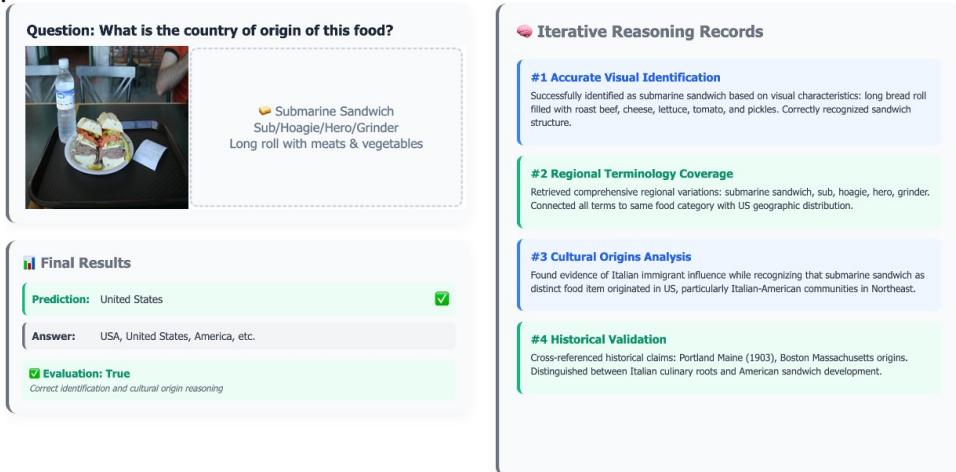  
Figure A1: An initial correct visual entity leads to the retrieval of its corresponding knowledge.

Compositional Reasoning with Heterogeneous Knowledge. MI-RAG demonstrates compositional reasoning by integrating visual grounding with textual knowledge. As shown in the Amrum Lighthouse example (Figure A2), it first performs a visual analysis, identifying a lighthouse on an elevated landform. Through iterative retrieval, it grounds the specific entity as the ”Amrum Lighthouse” and retrieves textual evidence from the knowledge base stating the structure is built ”atop a 25 metres high dune”. The final compositional reasoning step involves synthesizing the visual evidence of an ”elevated landform” with this specific textual fact to correctly identify the feature as a dune.

Progressive Reasoning from Generic to Specific. This case demonstrates the model’s ability to progressively refine its understanding through iterative refinement. When asked for the creator of the object in Figure A3, the model’s initial reasoning record correctly notes that a specific creator of the telescope cannot be determined from the image alone. However, it successfully classifies the object as a Newtonian telescope in subsequent iterations. This crucial intermediate step enables a subsequent query generation focused on the inventor. This refined query retrieves the correct historical fact, showcasing how MI-RAG leverages reasoning records to guide the progression from a generic classification to a specific answer.

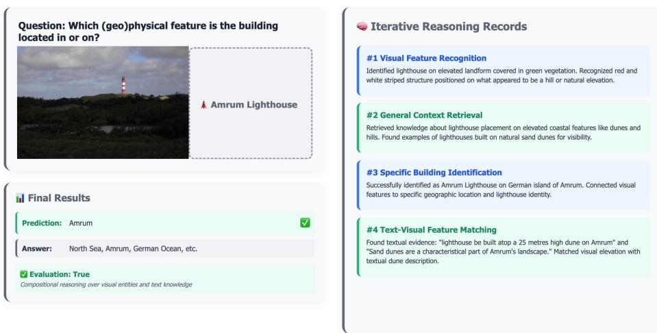  
Figure A2: A visual entity is linked with corresponding textual knowledge.

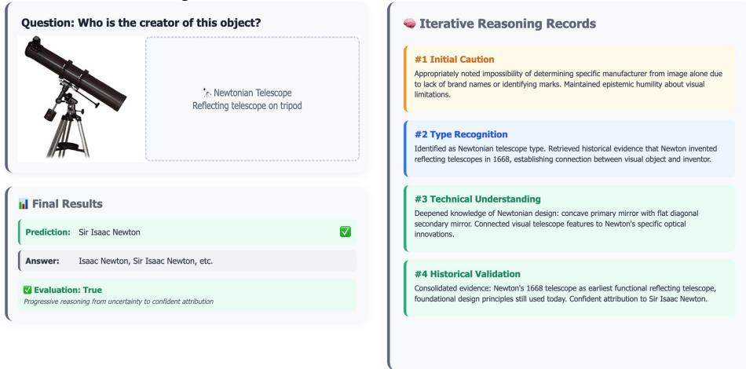  
Figure A3: Progressively refine its understanding from generic object recognition (Telescope) to specific knowledge of an entity (Newtonian telescope, which was invented by Newton).

Compose Multi-Faceted Knowledge. This case demonstrates how MI-RAG answers questions that require linking multiple facets of knowledge. In Figure A4, it identifies architectural details (Russian Orthodox), the specific building’s identity (Vysokopetrovsky Monastery), and historical facts about its founder through iterations. MI-RAG then performs compositional reasoning over this diverse evidence, correctly synthesizing the facts to conclude that the monastery is dedicated to Saint Peter of Moscow.

# A.2 FAILURE CASE ANALYSIS

To better understand the limitations of our model, we present a qualitative analysis of representative failure cases. Each case provides insights into areas for future improvement by pairing the visual example directly with its analysis.

Intent Misinterpretation. A primary failure mode involves misunderstanding the user’s query, even with correct evidence. In Figure A5, the model is asked for the ”closest parent taxonomy” of a peccary. Despite correctly identifying the animal and its full taxonomic hierarchy, it misinterprets the query’s intent, providing the suborder (Suina) rather than the more immediate genus (Pecari).

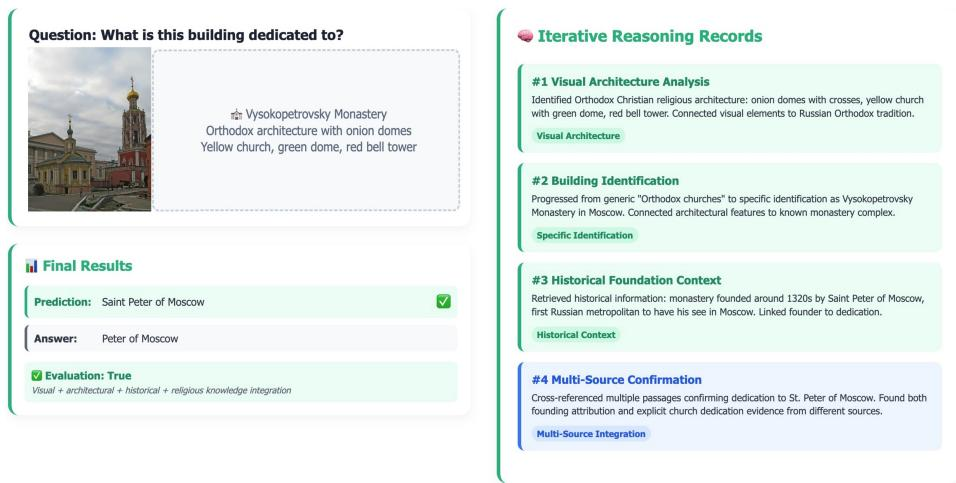  
Figure A4: Multi-Faceted Knowledge Synthesis: Diverse aspects of knowledge, including architectural and historical facts, are retrieved and synthesized to answer.

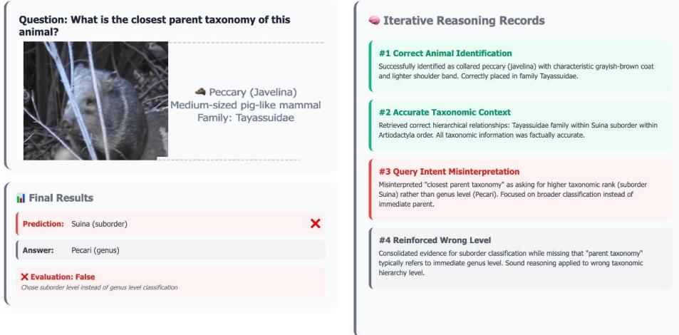  
Figure A5: Intent Misinterpretation: The model misunderstands the required taxonomic specificity.

Entity Misidentification. Failures can also arise from the initial visual analysis stage, such as incorrectly identifying the primary subject. In Figure A6, the model correctly identifies the general scene as a Swiss lake, but incorrectly identifies the specific body of water as Lake Walen instead of Lake Lucerne. This initial error leads to a wrong subsequent retrieval and concludes with wrong answer.

Subject Selection Error. Another form of visual grounding error occurs when the model focuses on a non-primary subject in the scene. Figure A7 shows a scene with two aircraft. The model correctly identifies both but erroneously selects the second aircraft as the subject of the query, derailing the entire subsequent reasoning process.

Incomplete Knowledge Retrieval. This class of errors arises from limitations in the knowledge base or the retrieval process. In Figure A8, the model identifies a bird as a New World Oriole but fails to retrieve knowledge on the specific genus (Pitangus). Its final answer is therefore based on incomplete evidence, leading to an incorrect conclusion.

Insufficient Visual Evidence. Sometimes, a query is unanswerable from the image, since it provides generic entities. The image in Figure A9 shows a generic classroom, which lacks sufficient visual features to determine a specific location. The model correctly identifies the generic context but fails to recognize the query’s unanswerable nature, producing a non-specific answer.

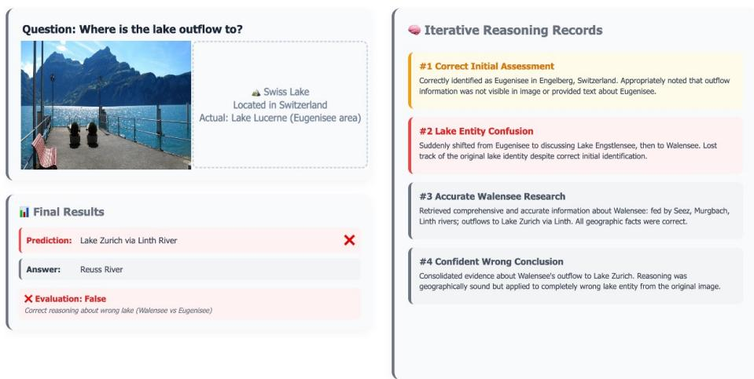  
Figure A6: Entity Misidentification: An initial, incorrect identification of the primary subject.

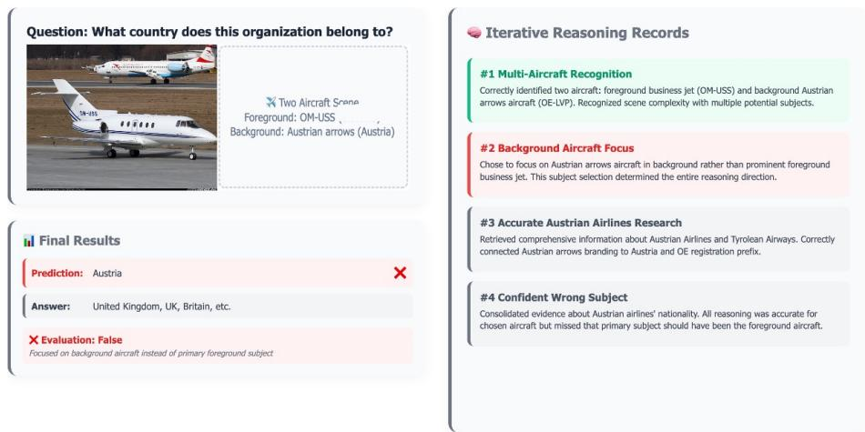  
Figure A7: Subject Selection Error: The model focuses on a background subject instead of the primary subject.

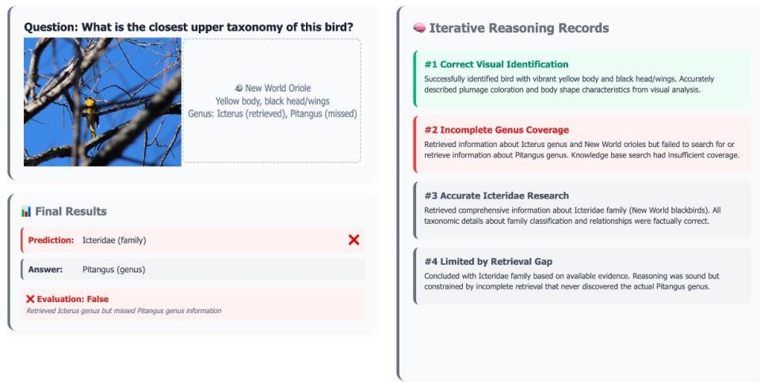  
Figure A8: Incomplete Knowledge Retrieval: Fails to retrieve knowledge about the correct entity.

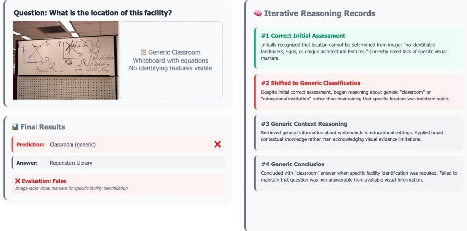  
Figure A9: Insufficient Visual Evidence: The query is unanswerable from the image provided.

Reasoning-Answer Discrepancy. Finally, some failures occur when the reasoning is sufficient, but the final answer does not align with the expected format. In Figure A10, the model correctly deduces that the Hawker 800 is a development of the British Aerospace 125. However, its prediction is marked as incorrect because the ground truth expects a different but related entity name, highlighting a format mismatch issue rather than a fundamental reasoning error.

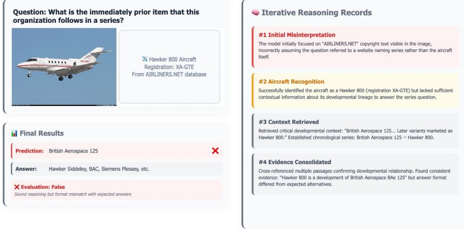  
Figure A10: Format Mismatch: The model’s reasoning is sufficient, but the output format differs from the expected answer.

# B THE USE OF LARGE LANGUAGE MODELS

In accordance with ICLR 2026 policy, we disclose the use of a large language model (LLM) as an assistive tool in the preparation of this manuscript. The LLM’s role was confined to that of a writing and formatting assistant. Specific tasks included improving grammar, clarity, and style, as well as providing support for formatting LaTeX code, such as adjusting the layout and style of figures and captions. All conceptual contributions, research ideation, experimental design, data analysis, and the final written conclusions were generated exclusively by the human authors. The authors take full responsibility for all content presented in this paper, including its scientific accuracy and integrity.

# C PROMPT TEMPLATES FOR MI-RAG

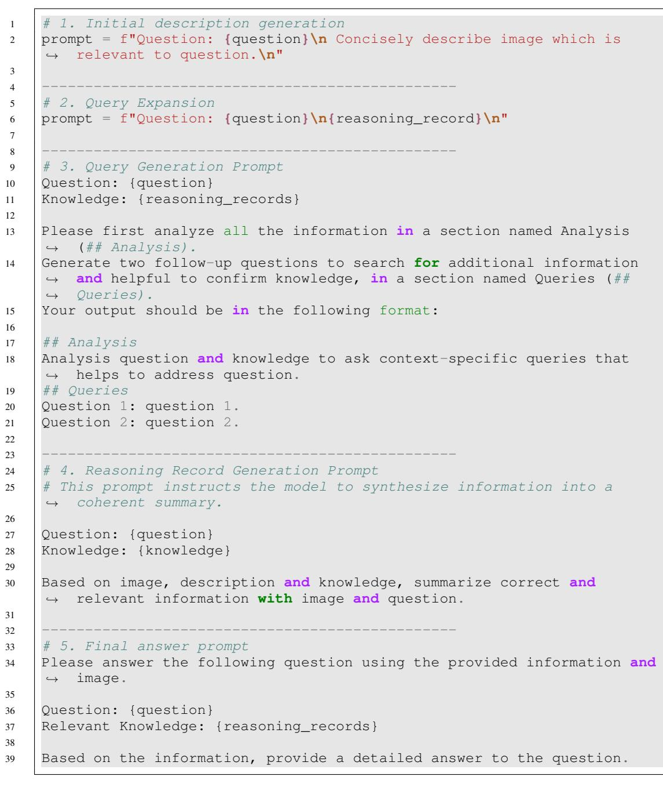  
Figure A11: Pseudo-code for prompt templates used in our MI-RAG framework. The Query Generation prompt drives the iterative retrieval process, while the Reasoning Record Generation prompt synthesizes information at each step.

Our Multimodal Iterative RAG (MI-RAG) framework employs structured prompts to dynamically refine its understanding and gather relevant knowledge. To generate initial reasoning records, we use a query-focused description of the input image to retrieve an initial set of knowledge. The core iterative loop then utilizes two prompts. First, the query generation component of multi-query uses the prompt to instruct the model to analyze the accumulated reasoning records and generate two questions. This step is crucial for progressively searching for more specific and helpful information. For the query expansion component of multi-query, we simply concatenate the query with the previous reasoning record. Second, the reasoning record generation prompt directs the model to synthesize the image and newly retrieved knowledge into a query-focused summarization. This reasoning record is the result of compositional reasoning and improves subsequent retrieval iterations, and is used to derive the final answer.

# D MULTIMODAL RETRIEVAL IMPLEMENTATIONS

To build our knowledge base, we processed the Wikipedia dataset from the Encyclopedic VQA benchmarks, which contains 2 million image-section pairs. The construction process involves generating a multimodal embedding for each pair and indexing them for efficient retrieval. For each sample, we extracted a normalized image embedding using a pretrained SigLIP model and a normalized text embedding using a pretrained ModernBert model, which is trained with the GTE method. These two vectors are then concatenated to form a multimodal embedding. Finally, all embeddings are indexed using FAISS with an IndexFlatIP (Inner Product) to create a knowledge base. A corresponding metadata file was also created to map the index entries back to their original image paths and Wikipedia text sections. When encoding the text embedding, we use a summary of each Wikipedia section. For the large retriever configuration of SigLIP2- $\mathbf { g }$ and Qwen3-Embedding-0.6B, we employ the image-to-mixture similarity proposed in RA-CM3 Yasunaga et al. (2023) and encode mixed embedding instead of image embedding.

At query time, we encode the input image and refined text query into the same multimodal embedding space as our knowledge base. We first generate normalized embeddings for the image and the text query separately. These vectors are then concatenated to form a single multimodal query vector. Finally, we perform a maximum inner product search against the knowledge base to retrieve the top-k entries with the highest mutlimodal similarity.

Table A1: Performance analysis of multimodal similarity on the InfoSeek validation split and Encyclopedia test split.

<table><tr><td>Retriever</td><td>Dataset</td><td>Query Modality</td><td>R@1</td><td>R@5</td><td>R@10</td></tr><tr><td rowspan="2">SigLIP2-SO400m+ ModernBert-GTE</td><td>InfoSeek</td><td>image image+text</td><td>52.5 57.8</td><td>60.2 65.3</td><td>68.3 72.3</td></tr><tr><td>Encyclopedia</td><td>image image+text</td><td>30.8 34.9</td><td>36.6 40.5</td><td>41.8 45.3</td></tr><tr><td rowspan="2">SigLIP2-g+ Qwen3-Embedding-0.6B</td><td>InfoSeek</td><td>image image+text</td><td>66.7 69.4</td><td>72.7 76.2</td><td>77.5</td></tr><tr><td>Encyclopedia</td><td>image image+text</td><td>36.2 43.1</td><td>41.9 48.7</td><td>81.1 46.4 54.5</td></tr></table>

As shown in Table A1, we evaluated the retriever performance on the InfoSeek validation and Encyclopedia test splits. The results confirm two key points. First, using a multimodal query (image+text) that considers both visual and textual similarity consistently yields higher recall than using a unimodal (image) query alone. Second, we observed that our scaled retriever configuration (SigLIP2- $\mathbf { g }$ $^ +$ Qwen3-Embedding-0.6B) performs better than the more lightweight setup $\mathrm { ( S i g L I P 2 - S O 4 0 0 m + }$ ModernBert-GTE). Despite the performance gap, we used the lightweight setup for our main experiments. This choice ensures a fair comparison and emphasizes that our framework’s primary improvements stem from its iterative reasoning process, not from relying on a stronger base retriever.

# E FEW-SHOT PROMPTING FOR ANSWER EXTRACTION

To evaluate performance on the Exact Match metric for the InfoSeek dataset, we employed a fewshot prompting strategy to guide the model toward generating an exact answer. For each question in the validation set, we provided the model with three demonstrations drawn from the training split, selected based on question similarity. These demonstrations consist of an image, a context of reasoning records, a question, and the ground-truth answer. By presenting these structured examples, we condition the model to generate responses in a specific format, which minimizes extraneous text and focuses on producing the exact entity or fact required by the question. This in-context learning approach helps to align the model’s output with the strict requirements of the EM metric.

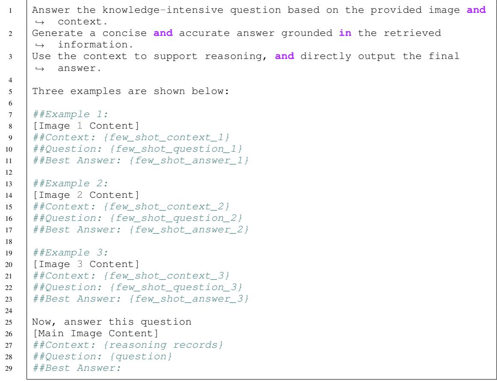  
Figure A12: The few-shot prompt template used to guide the model for the Exact Match evaluation.

F COMPUTATIONAL COST ANALYSIS Table A2: Computational cost per sample for each iteration of the MIRAG framework   

<table><tr><td>Iteration</td><td>API Time (s)</td><td>Retrieval Time (s)</td></tr><tr><td>Iteration 0</td><td>7.96</td><td>15.23</td></tr><tr><td>Iteration 1</td><td>19.89</td><td>46.36</td></tr><tr><td>Iteration 2</td><td>32.29</td><td>79.74</td></tr><tr><td>Iteration 3</td><td>41.71</td><td>105.384</td></tr></table>

We analyze the per-sample computational cost of MI-RAG on a commodity server (NVIDIA RTX 3090, Intel Xeon Gold 6248R), performing retrieval locally and using the OpenRouter API OpenRouter (2025) for MLLM inference. As detailed in Table A2, both API and retrieval times scale linearly with each iteration, an expected characteristic of our design. Specifically, API time may increase as accumulated reasoning records lengthen the context for query generation, while retrieval time grows due to the increased processing required to encode these context-enriched queries. Crucially, this latency is not a fundamental limitation of our framework. The overhead stems primarily from the serialized execution of queries using vanilla index configurations and network overhead from successive API calls with multiple images and texts.

# G SUBSET DOWNSAMPLING PROCEDURES

To support an efficient analysis and design of our model, MI-RAG, we perform ablation studies on a compact and diverse subset of each dataset. We generate this subset using the iterative downsampling procedure detailed in Figure A13, which aims to eliminate redundancy.

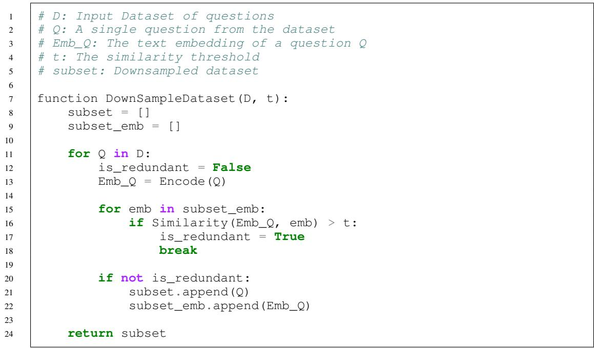  
Figure A13: Pseudo-code for downsampling: discard questions whose similarity to any in the subset exceeds threshold, yielding a non-redundant subset.

The algorithm greedily constructs a subset by adding a new question $Q$ from the original dataset $D$ only if it is sufficiently dissimilar to all questions already selected. Specifically, a question is considered redundant and discarded if the similarity of its embedding, $\operatorname { E m b } _ { Q }$ , exceeds a predefined threshold with any embedding already in the subset. This threshold is adjusted for each dataset to yield a final subset containing approximately 500 diverse question-answer pairs.

# H QUERY STRATEGY ANALYSIS

Table A3: Analysis of each query formulation’s contributions to retrieval recall from each KB on the InfoSeek validation subset.   

<table><tr><td>Method</td><td>Multimodal KB Recall (%)</td><td>Textual KB Recall (%)</td><td>Hetero. KB Recall (%)</td></tr><tr><td>Query Expansion</td><td>90.02</td><td>87.44</td><td>93.08</td></tr><tr><td>Query Generation</td><td>88.24</td><td>80.03</td><td>90.80</td></tr><tr><td>Multi-Query</td><td>90.50</td><td>90.02</td><td>94.36</td></tr></table>

In this section, we analyze the contributions of each query strategy to retrieval performance on the heterogeneous KB. Query expansion proves highly effective at retrieving directly related information, achieving $9 3 . 0 8 \%$ recall. In contrast, query generation is designed to explore complementary reasoning paths. Because its retrieval budget is divided between two generated sub-queries, its recall is slightly lower than that of the query expansion. However, its primary value lies in finding a diverse set of factual links that a direct expansion might overlook.

# I QUERY TRANSFORMATION VS. REASONING

To assess which component of our framework benefits from increased model capacity, we performed an analysis by switching a lightweight model (Gemma-3-4B) and a large model (Gemini-2.5-Flash) between query transformation and reasoning generation. As shown in Table A4, allocating a more capable model to query transformation yields higher recall, likely due to improved query precision and diversity. However, assigning the large model to reasoning records generation results in higher overall accuracy, indicating that this configuration provides a benefit to the final accuracy.

Table A4: Impact of allocating a larger model (Gemini-2.5-Flash) to either the query transformation or reasoning records generation, while a lighter model (Gemma-3-4B) handles the other. Evaluated on the InfoSeek validation subset.   

<table><tr><td>Query Transformation</td><td>Reasoning Generation</td><td>Acc (%)</td><td>Recall (%)</td></tr><tr><td>Gemma-3-4B</td><td>Gemini-2.5-Flash</td><td>56.36</td><td>91.63</td></tr><tr><td>Gemini-2.5-Flash</td><td>Gemma-3-4B</td><td>54.59</td><td>93.56</td></tr></table>