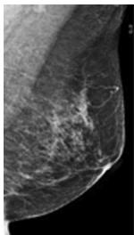
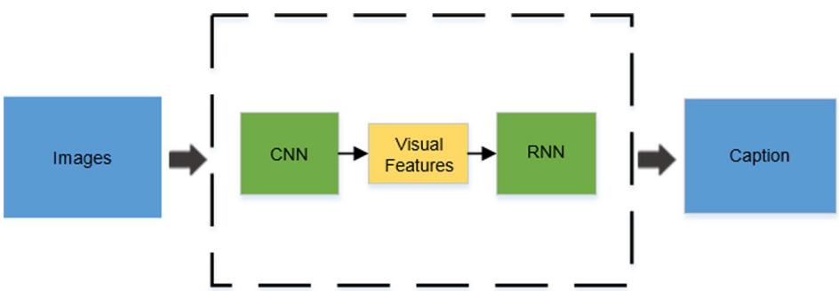
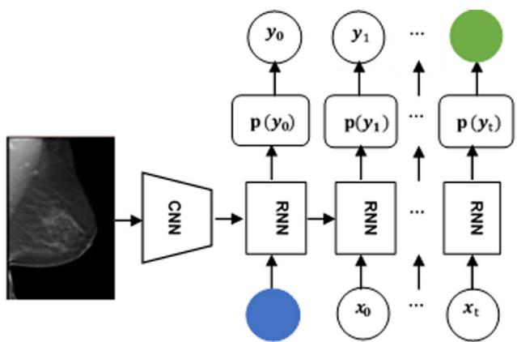
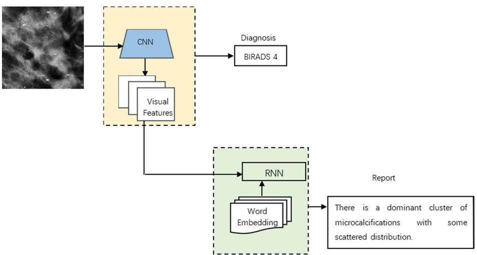
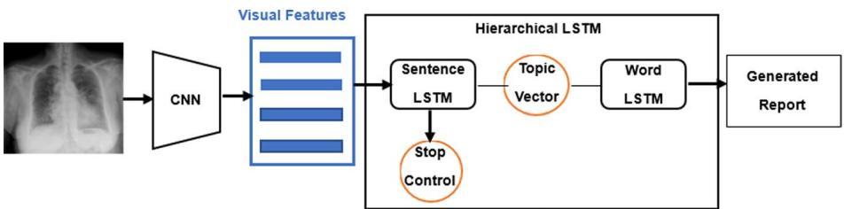
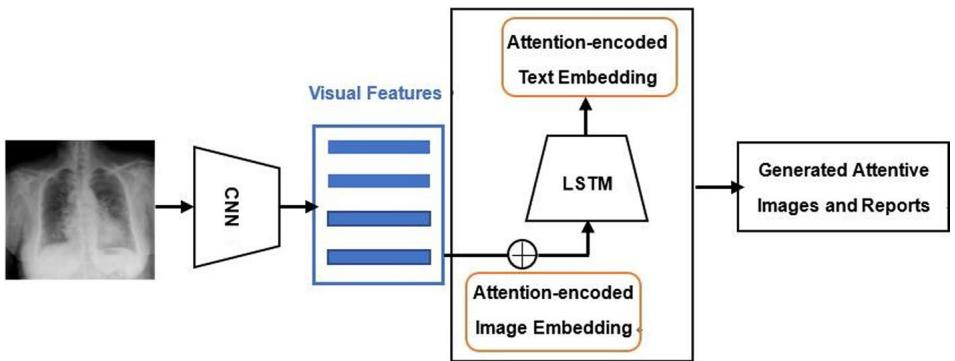
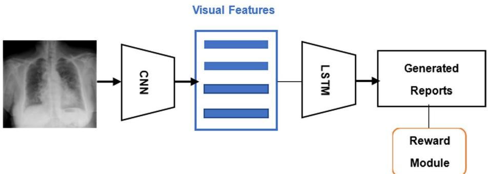

# A survey on automatic generation of medical imaging reports based on deep learning

Ting Pang1\*, Peigao Li1 and Lijie Zhao1

\*Correspondence: pt@xxmu.edu.cn

# Abstract

1 Center of Network and Information, Xinxiang Medical University, Xinxiang 453000, China

Recent advances in deep learning have shown great potential for the automatic generation of medical imaging reports. Deep learning techniques, inspired by image captioning, have made signifcant progress in the feld of diagnostic report generation. This paper provides a comprehensive overview of recent research eforts in deep learning-based medical imaging report generation and proposes future directions in this feld. First, we summarize and analyze the data set, architecture, application, and evaluation of deep learning-based medical imaging report generation. Specially, we survey the deep learning architectures used in diagnostic report generation, including hierarchical RNN-based frameworks, attention-based frameworks, and reinforcement learning-based frameworks. In addition, we identify potential challenges and suggest future research directions to support clinical applications and decision-making using medical imaging report generation systems.

Keywords: Medical imaging reports, Automatic generation, Image captioning, Deep learning

# Introduction

As we all know, a detailed explanation of medical images such as CT (computed tomography), ultrasound, MRI (magnetic resonance imaging), or pathological imaging must be conducted by professional physicians or pathologists who write a diagnostic report for each patient. An example of such a report can be seen in Fig. 1. Although one report may seem simple, containing only indications, fndings and impression, there are many patients with unforeseen abnormal medical images. Terefore, analyzing and depicting textual reports, which require skilled experience, can be a time-consuming and stressful task for professionals. Automatic diagnostic report generation from medical images is an indispensable trend to reduce this workload. In addition, while deep learning, with its advantage of end-to-end processing, has emerged on a large scale in recent medical diagnosis studies, the non-interpretable network and non-standardized evaluation make deep learning like a black box. Teaching machines to automatically write diagnostic reports is a semantic and efective way to support the interpretability of deep learning models [1]. Hence, it is essential to explore the automatic diagnosis of images and the generation of reports to improve the interpretability of deep learning.

Indication: High risk inherited family.

Findings:Breast density category:BlRADSc.No masses,significant clustered or pleomorphic microcalcifications and new areasof architecturaldistortion.

  
Fig. 1 One simple example of mammography report

Impression: Normal mammogram, BIRADS1.

  
Fig. 2 Illustration of the CNN–RNN-based image captioning framework

Te automatic generation of diagnostic reports is inspired by image captioning [2], which combines computer vison (CV) and natural language processing (NLP) to provide a comprehensive understanding of medical images. Traditionally, image captioning was achieved through report retrieval [3] and template-based generation [4]. However, these conventional methods are limited in their ability to produce fexible and comprehensive textual descriptions that can be applied to new images. Recent progress in deep learning has led to signifcant advancements in image captioning. In this research, we focus on medical report generation based on deep learning. Essentially, the paradigm follows a typical encoder–decoder architecture [5–7]. It leverages visual features obtained from Convolution Neural Network (CNN, encoder) to generate descriptions of given images through Recurrent Neural Network (RNN, decoder) [8], as shown in Fig. 2.

However, generating diagnostic reports is a challenging task due to the complexity and diversity of objects in medical images. In practice, the values obtained via the activation function at one suitable layer of the objects recognition CNN are considered as the visual feature vector [9]. Moreover, variations of RNN, such as long–short-term memory (LSTM) [10] and gated recurrent unit (GRU) [11], that contain diferent controlling gates capable of learning information from a long time ago, are frequently employed in efectively capturing the semantics of image captioning tasks. In addition, more recent works focus on generating long-form text instead of single sentences [12, 13]. Attention mechanisms that focus on salient parts have been widely used in image captioning to provide visual explanations for the rationale of deep learning networks [14–17]. Reinforcement Learning [18] (RL) and Generative Adversarial Networks [19] (GAN) have also been widely proposed in image captioning [20] due to their recent success.

To date, some scholars have explored the automatic generation of medical reports using image captioning methods move forward, see the basic framework in Fig. 3. Te frst application of deep learning in medical imaging report generation was conducted by Shin et al. [21] in 2016. Tey developed a CNN–RNN network that efectively predicted only annotated tags (e.g., location, severity and afected organs) from chest X-ray images. Tey tested both LSTM and GRU and improved the results by considering joint image/text contexts using account using a recurrent neural cascade model. LSTM has been more widely used and studied in the literature, and has achieved state-of-the-art results in many tasks. However, GRU is gaining popularity due to its simpler architecture and faster training time compared to LSTM. Subsequently, in further research on medical image captioning, LSTM will be used as the core framework of RNN.

Te primary aim of this manuscript is to present a systematic review of studies on deep learning-based medical imaging reports generation. Te survey provides readers with a comprehensive understanding of the feld of deep learning in automatic diagnostic reports generation, and to ofer clinical treatment management suggestions for medical imaging reports generation exploiting deep learning. Te survey also lays the foundation for innovation to increase the richness of this feld. To summarize, this work contributes in three ways: (1) it focuses on the clinical value of deep learning-based diagnostic reports generation, providing suggestions for clinical decision making and reducing the workload of radiologists; (2) it organizes and explains the current works in detail, proving that automatic writing diagnostic reports can improve the interpretability of deep learning in medical imaging area; and (3) it provides comprehensive references and identifes new trends for researchers in this feld. Tis paper is the frst overview of medical report generation based on deep learning, with a focus on improving interpretability of deep learning and its clinical value.

Tis paper is structured as follows: in "Overview and analysis" section, we provide a comprehensive summary and analysis of the current state of deep learning applied in medical imaging reports generation, covering aspects, such as data sets, architectures, applications and evaluations based on the retrieved studies. In "Discussion and future"

  
Fig. 3 Illustration of the CNN–RNN-based framework for diagnostic report generation. The variable "t" represents time, $" \chi "$ denotes the input layer, "y" represents the output layer, and $" p ( y ) "$ denotes the probability of output

section, we discuss potential challenges and future directions to serve as a reference for further studies in this feld. Finally, in "Conclusion" section, we provide brief conclusions.

# Overview and analysis

Te encoder–decoder framework, which combines image-text embedding models with multimodal neural language models, was frst introduced by [22]. Te framework encodes visual data, projecting it into the embedded space composed of RNN hidden states that encode text data by optimizing the pairwise sorting loss. In the embedding space, a structure-content neural language model is used to decode the visual features, based on the feature vectors of context words, to form sentences. An example of the whole framework can be seen in Fig. 4.

Within the framework described above, image captioning is defned as the probability of generating a sentence based on an input image (Eq. 1):

$$
S ^ { * } = s ^ { a r g m a x } \prod P ( S _ { t } | I , S _ { 0 } , . . . , S _ { t - 1 } ; \theta )
$$

where $I$ is the input image, $\theta$ is the model parameter. A sentence $S$ equals to a sequence of words $S _ { 0 } , . . . , S _ { t - 1 }$ .

Vinyals et al. use a LSTM neural network [8] to model $P ( S _ { t } | I , S _ { 0 } , . . . , S _ { t - 1 } ; \theta )$ as hidden state $h _ { t }$ , which can be updated as (Eq. 2)

$$
h _ { t + 1 } = f ( h _ { t } , x _ { t } )
$$

where $x _ { t }$ is the input to the LSTM neural network. In the frst unit, $x _ { t }$ is an image feature, while in other units $x _ { t }$ is a feature of previously predicated context words. Te model parameter $\theta$ is obtained by maximizing the likelihood of sentence-image pairs in the training set. Trough the training model, the possible output word sequences can be predicted by sampling or beam search.

To generate descriptions closely related to image contents, Jia et al. (2016) extracted semantic information from images and added it to each unit of the LSTM in the process of sentence generation [23]. Te original forms of the memory unit and gate of an LSTM unit [24] are defned as (Eqs. 3, 4, 5, 6, 7)

  
Fig. 4 Medical report generation example of the encoder–decoder framework

$$
\begin{array} { r l } & { i _ { l } = \mathcal { O } ( W _ { i x } x _ { l } + W _ { i m } m _ { l - 1 } ) } \\ & { } \\ & { f _ { l } = \sigma ( W _ { f x } x _ { l } + W _ { f m } m _ { l - 1 } ) } \\ & { } \\ & { o _ { l } = \sigma ( W _ { o x } x _ { l } + W _ { o m } m _ { l - 1 } ) } \\ & { } \\ & { c _ { l } = f _ { l } \odot c _ { l - 1 } + i _ { l } \odot h ( W _ { c x } x _ { l } + W _ { c m } m _ { l - 1 } ) } \\ & { m _ { l } = o _ { l } \odot c _ { l } } \end{array}
$$

where variables $i _ { l } , f _ { l }$ and $o _ { l } ,$ respectively, denotes input gate, forget gate, output gate of a LSTM cell, $c _ { l }$ and $m _ { l }$ denotes the state and hidden state of the memory cell unit, $\sigma ( \cdot )$ and $h ( \cdot )$ are non-linear functions, $x _ { l }$ is the input, $W$ are model parameters, and $\odot$ stands for an elementwise multiplication operation.

Aiming to utilize high-level semantic information for image captioning, Qi et al. (2016) incorporate a set of semantic attributes from the training sentences which are seen as visual concepts into the encoder–decoder framework [25]. In the region-based multilabel classifcation framework [26], a CNN-based multi-classifer is trained for each attribute. By training the semantic attribute classifers, the image $I$ can be encoded as a prediction vector $V _ { a t t } ( I )$ giving the probability of each attribute appearing in the image. Ten, a LSTM is deployed as decoder to generate a sentence describing the contents of the image based on the representation. In this case, the image captioning problem can be rephrased as (Eq. 8)

$$
S ^ { * } = s ^ { a r g m a x } P ( S | V _ { a t t } ( I ) ; \theta )
$$

where $I$ is the input image, $\theta$ is the model parameter, $S$ is a sentence.

# Data sets

Te automatic generation of medical imaging reports based on deep learning requires a large data set for training. In this section, we introduce frequently used public data sets and some typical private data sets.

Te current public data sets have greatly contributed to the development of deep learning for medical imaging report generation. Te most commonly used databases consist of images and reports from the United States and Europe, with chest radiographs being the predominant data set. Some examples of these data sets include Indiana University Chest XRay (IU X-Ray) [27], ChestX-ray14 [28], CheXpert [29], MIMIC Chest X-ray (MIMIC-CXR) [30], CX-CHR [31], PadChest [32], as shown in Table 1.

Te IU X-Ray is a set of chest X-ray images paired with their corresponding diagnostic reports. Te data set contains 7470 images (6470:500:500) and 3955 report. Each report consists of the following sections: impression, fndings, tags, comparison, and indication. On average, each image is associated with 2.2 tags, 5.7 sentences, and each sentence contains 6.5 words. About $7 0 \%$ of the automatic report generation work are from these public data sets, where IU X-Ray takes up the biggest fraction due to its large numbers and comprehensive annotation.

Table 1 Common data set of medical imaging report generation   

<table><tr><td>Data set</td><td>Description</td><td>Image</td><td>Report</td><td>Link</td></tr><tr><td>IU X-Ray</td><td>Chest X-ray images of lung diseases</td><td>7470</td><td>3955</td><td>http://openi.nlm.nih.gov/</td></tr><tr><td></td><td>ChestX-ray14 14 kinds of lung diseases</td><td>112,120-</td><td></td><td>https://nihcc.app.box.com/v/Chest Xray-NIHCC</td></tr><tr><td>CheXpert</td><td>Chest radiographs of 65,240 patients224,316- with lung diseases</td><td></td><td></td><td>https://stanfordmlgroup.github.io/ competitions/chexpert/</td></tr><tr><td>MIMIC-CXR</td><td>227,835 radiographic studies in DICOM format</td><td>377,110 227,835</td><td></td><td>https://physionet.org/content/mimic- cxr/2.0.0/</td></tr><tr><td>CX-CHR</td><td>Chest X-ray images with Chinese reports of 35,609 patients</td><td>45,598</td><td></td><td></td></tr><tr><td>PadChest</td><td>Chest X-ray data set obtained from 67,000 patients</td><td></td><td>160,000 109,931</td><td>https://bimcv.cipf.es/bimcv-projects/ padchest/</td></tr><tr><td>PEIR Gross</td><td>Radiology teaching images</td><td>4,000</td><td>4000</td><td>https://peir.path.uab.edu/library/index. php?/category/106</td></tr><tr><td>DDSM</td><td>Normal,benign,and malignant mammography studies</td><td>2620</td><td></td><td>http://marathon.csee.usf.edu/Mammo graphy/Database.html</td></tr></table>

ChestX-ray14 is provided by the national institute of health (NIH). It comprises 112,120 frontal-view X-ray images of 30,805 (collected from the year of 1992 to 2015) unique patients with the common disease labels, mined from the text radiological reports. Te database contains 14 kinds of lung diseases (atelectasis, consolidation, infltration, pneumothorax, edema, emphysema, fbrosis, efusion, pneumonia, pleural thickening, cardiac hypertrophy, nodules, swelling and hernia).

Te CheXpert data set contains 224,316 chest radiographs of 65,240 patients with both frontal and lateral views available. Te task is to do automated chest X-ray interpretation, which features uncertainty labels and radiologist-labeled reference standard evaluation sets.

MIMIC-CXR is a large publicly available data set of chest radiographs in DICOM format with free-text radiology reports. Te data set contains 377,110 images corresponding to 227,835 radiographic studies performed at the Beth Israel Deaconess Medical Center in Boston. Te data set is intended to support a wide body of research in medicine including image understanding, natural language processing, and decision support.

CX-CHR is a proprietary internal data set of chest X-ray images with Chinese reports collected from a professional medical institution for health checking. Te data set consists of 35,609 patients and 45,598 images. Each patient has one or multiple chest X-ray images in diferent views, such as poster anterior and lateral, and a corresponding Chinese report.

PadChest is a labeled large-scale, high resolution chest X-ray data set for the automated exploration of medical images along with their associated reports. Tis data set includes more than 160,000 images obtained from 67,000 patients that were interpreted and reported by radiologists at Hospital San Juan Hospital (Spain) from 2009 to 2017, covering six diferent position views and additional information on image acquisition and patient demography. Te reports were labeled with 174 diferent radiographic fndings, 19 diferential diagnoses and 104 anatomic locations organized as a hierarchical taxonomy and mapped onto standard Unifed Medical Language System (UMLS) terminology.

Apart from the chest radiographs, there are some other medical images. Such as PEIR Gross, Digital Database for Screening Mammography (DDSM) [33], etc. PEIR Gross is a collection of over 4,000 curated radiology teaching images, which are created by the University of Alabama for medical education. It contains sentence-level descriptions of 20 diferent body parts, including the abdomen, adrenal, aorta, breast, chest, head, kidneys, etc. DDSM contains 2620 scanned flms of normal, benign, and malignant mammography studies with verifed pathology information. It is supported by the University of South Florida and it has been widely used by researchers due to its scale and ground truth validation. Moreover, researchers have trained their deep learning frameworks on several privately owned data sets.

However, private medical imaging data sets are less common. Collecting private medical images can be difcult due to patient confdentiality and data privacy concerns, as well as the laborious efort required for properly indexing, storing, and annotating the images. In addition, image attributes such as cropped image size, format, data source, and number of samples for training and testing can greatly impact the fnal results [27] [28].

# Methods

# Hierarchical RNN‑based framework

As illustrated in Fig. 5, a medical imaging report typically consists of at least one paragraph consisting of several sentences, which can be much longer for abnormal diseases. To address this challenge, Jing et al. proposed a hierarchical LSTM consisting of a sentence LSTM and a word LSTM for generating long chest X-ray reports, inspired by the hierarchical RNN for image captioning proposed by Krause et al. [12]. Te single-layer sentence LSTM determines the number of sentences for medical reports using visual features as inputs and generates the topic vector for each sentence, which is then passed to the two-layer word LSTM. Te word LSTM generates fne-grained words and descriptions based on the topics for each sentence, which are concatenated to form the fnal medical report paragraph (see the hierarchical LSTM report generation model in Fig. 5). Harzig et al. also employed hierarchical LSTM to produce diagnostic reports for chest X-ray, and to address data bias, they innovatively proposed dual word LSTMs, including an abnormal word LSTM and a normal word LSTM, which are trained when the label is abnormal and normal [35]. Tey also set an abnormal sentence predictor to determine whether to use the sentences generated by the dual word LSTM. To address the limited availability of pairs of medical images and reports, Yuan et  al. synthesized visual features by taking advantage of multi-view chest X-ray images at the sentence-level LSTM to ensure cross-view consistency [36]. Furthermore, medical concepts based on reports were extracted and merged with respective decoding steps by the word-level LSTM.

  
Fig. 5 Hierarchical RNN-based framework for medical report generation

# Attention‑based framework

Recently, attention-based medical image captioning frameworks have been used to provide meaningful embeddings and improve the interpretability of deep learning processes for report generation (Fig.  6). Zhang et  al. built a MDNet for bladder cancer diagnosis that combines an image model and a language model, using an improved attention mechanism to enhance image alignment and generate sharper joint image/report attention maps [37]. Wang et  al. proposed TieNet, a multi-level attention mechanism that fuses visual attention and text-based attention into a CNN–RNN model to highlight important report and image representations of chest X-ray patients [38]. Lee et al. designed a justifcation generator to explain the diagnostic decision of breast masses, utilizing attention to obtain visual pointing maps and an LSTM to generate diagnostic sentences [39]. Li et al. adopted an attentive LSTM that takes either the original chest X-ray image or the cropped abnormal ROI as input and generates the entire report [40].

# Reinforcement learning‑based framework

Motivated by the successful application of reinforcement learning in deep learning, some researchers have attempted to employ RL for optimizing medical imaging report generation, as shown in the basic framework in Fig. 7. RL is formed by agents that learn an optimal policy for better decision-making by receiving rewards from the environment at a given state. Jing et al. proposed a novel Cooperative Multi-Agent System (CMAS) consisting of Planner (PL), Abnormality Writer (AW), and Normality Writer (NW) with one reward module to capture the bias between normality and abnormality for generating more accurate chest X-ray reports [41]. PL determines whether the area has lesions, and AW or NW generates a sentence based on the result given by PL. Similarly, Liu et al. used a fnal fne-tuned RL containing natural language generation reward and clinically coherent reward to optimize a hierarchical CNN–RNN-based model for clinical accuracy and readability of chest X-ray reports [42].

  
Fig. 6 Attention-based framework for medical report generation

  
Fig. 7 Reinforcement learning-based framework for medical report generation

# Other‑related works

Labeling pairs of medical images and reports is a tedious task for professionals. To address this issue, Han et  al. proposed a weakly supervised framework that combines symbolic program synthesis theory and deep learning. Tis framework uses object-level annotations, without requiring radiologist-level report annotations, to generate unifed reports [43]. Similarly, Xue et  al. developed a recurrent image captioning model that generates the fndings of a medical report sentence by sentence, where each successive sentence is based on multimodal inputs, including the original images and the previous sentence [44]. Zeng et al. introduced a coarse-to-fne ultrasound image captioning ensemble model that helps doctors automatically generate high-quality annotated ultrasound reports [45].

# Applications

Te application of automatic generation of medical imaging reports has a wide range of potential benefts beyond assisting diagnosis and lightening workload. For instance, generating accurate and comprehensive reports can improve patient care by providing more informed treatment decisions. In addition, the vast amounts of data generated by medical imaging can be utilized for medical research and advancements in the feld. However, efcient and accurate annotation and labeling is required, which can be facilitated by automatic report generation. In summary, the use of deep learning for automatic generation of medical imaging reports has signifcant potential to greatly beneft the healthcare industry.

# Assisting diagnosis

Some studies have employed a combination of language models (such as LSTM) and image models (such as CNN) to improve the accuracy of diagnostic conclusions. Tese models leverage the semantic knowledge of medical images obtained from diagnostic reports to provide an interpretable prediction mechanism. To ensure the reliability of the machine learning system’s decisions, it is important to open the black box of deep learning and increase understanding of the reasoning behind the decisions [46]. All the studies reviewed attempt to present semantically and visually interpretable results during the diagnosis process [46–49].

# Lighten workload

In addition to these modalities and categories of diseases, automatic generation of medical imaging reports has also been explored in other areas such as MRI, CT scans, and PET scans for various diseases such as lung cancer, brain tumors, and cardiovascular diseases. Te tedious process of preparing reports can be a signifcant burden on radiologists and can lead to errors or delays in patient care. By automating this process, radiologists can focus on more complex tasks and improve patient outcomes. Furthermore, the generated reports can provide valuable insights for medical research and contribute to the development of new treatment options.

# Evaluations

BLEU [50], ROUGE [51], METEOR [52] and CIDER [53] are commonly used evaluation metrics for medical image report generation, which are adapted from machine translation and text summarization.

BLEU (Bilingual Evaluation Understudy) measures the similarity between the generated report and the ground truth report by calculating the overlap of word n-grams. BLEU-1 measures the overlap of unigrams (i.e., single words), while BLEU-2, -3, and -4 consider bigrams, trigrams, and quadrigrams, respectively. To account for short generated reports, a penalty is added to the score. BLEU is easy to calculate and interpret, and it has been shown to correlate well with human judgments of text quality. However, BLEU only considers surface-level similarities between the generated and reference texts, and it does not take into account the semantic content or coherence of the generated text.

METEOR (Metric for Evaluation of Translation with Explicit ORdering) extends BLEU-1 by adopting F-score of precision and recall, with a bias towards recall, and utilizing Porter stemmer and WordNet. To account for longer subsequences, it includes a penalty of up to $5 0 \%$ when there are no common n-grams between machine-generated descriptions and references. METEOR takes into account both surface-level and semantic similarities between the generated and reference texts. It also has a built-in mechanism for handling synonyms and paraphrases. Like BLEU, METEOR does not account for the coherence or overall quality of the generated text.

ROUGE-L (Recall-Oriented Understudy for Gisting Evaluation—Longest Common Subsequence) measures the longest common subsequence between the machine-generated description and the reference human description, and calculates its ratio to the reference size (ROUGE-L recall), generated description (ROUGE-L precision), or a combination of the two (ROUGE-L F-measure). ROUGE-L takes into account the semantic content and coherence of the generated text, and it has been shown to correlate well with human judgments of text quality. However, ROUGE-L only considers a single metric, the longest common subsequence, and it may not capture all aspects of text quality.

CIDER (Consensus-based Image Description Evaluation) measures the cosine similarity between n-gram TF–IDF (Term Frequency–Inverse Document Frequency) representations of the generated report and the reference report (words are also stemmed). Te calculation is done from single gram to ${ 4 \ : \mathrm { g } }$ and the average is returned as the fnal evaluation score. Te rationale behind using TF–IDF is to reward frequent words and penalize common words (such as stop words). CIDER takes into account both surface-level and semantic similarities between the generated and reference texts. It also has been shown to correlate well with human judgments of text quality for image captioning tasks. However, CIDER may not be suitable for tasks other than image captioning, and it is computationally more expensive than other evaluation metrics.

Automatic generation of medical reports using deep learning is still an emerging area with many challenges. We conducted a search of 31 relevant papers and compiled detailed implementation information in Table 2.

# Discussion and future

Despite the signifcant progress made in medical imaging report generation based on deep learning, this section aims to highlight the unresolved issues and present future research directions in this area for further development.

# Balanced data set

Deep learning has shown great potential in big data analytics, but in the feld of medical imaging report generation, there are still many challenges to be addressed. One major issue is the imbalanced nature of available data sets. Tere is a lack of public databases that include a variety of image modalities, such as pathology, ultrasound, and magnetic resonance imaging (MRI). In addition, private data sets are often arbitrary in terms of number, size, and format, which makes it difcult to compare results across studies. Another challenge for both private and public data set is the annotation of images, as clinical radiologists may not always be available due to the labor-intensive and time-consuming nature of the task. Te use of imbalanced data sets for training neural networks can lead to biased diagnostic report generation. To address these challenges, we need to establish public databases with a variety of image modalities, as well as develop private data sets to address the limitations of medical images and complex annotations. Private data sets can be useful for clinical practice, such as combining diferent imaging modalities and diagnostic reports from various sources.

# Clinical application

Clinical decision-making is critical in patient management and care, and errors in medical imaging reporting can lead to serious consequences. Terefore, improving the accuracy of medical reports is crucial. While deep learning has shown great potential in this feld, there is still a signifcant research gap in the domain of diagnostic report generation. Many studies focus on improving the fnal performance, but we should also pay attention to the deep features obtained by deep learning and consider the unique characteristics of diferent diseases for accurate report generation. By doing so, we can enhance the practical application value of deep learning in clinical decision-making.

# Unifed evaluation

In many studies, the technical details of experiments were not described in sufcient detail. Te selection of measurement indicators and baseline methods was often arbitrary, resulting in a lack of standardization in the evaluation process. Most researchers focused on metrics, such as BLEU, ROUGE, METEOR, and CIDER, which are commonly used in natural image evaluation but may not be appropriate for medical imaging reports. To improve the evaluation process, it is necessary to design more specifc metrics in the medical domain to better evaluate the accuracy and interpretability of the generated reports.

Table 2 Studies conducted for medical report generation based on deep learning   

<table><tr><td rowspan=1 colspan=12>References Data (Images,  ArchitectureBLEU-1 BLEU-2 BLEU-3 BLEU-4 MET-EOR ROU-GE CIDErreports)</td></tr><tr><td rowspan=1 colspan=2>Shin et al.   Openl (7470,</td><td rowspan=1 colspan=1>CNN-RNN</td><td rowspan=1 colspan=1>0.972</td><td rowspan=3 colspan=8>0.671  0.149   0.028     二0.829 0.75   0.677    0.396     0.701   0.0204</td></tr><tr><td rowspan=1 colspan=1>2016[21]</td><td rowspan=1 colspan=1>3955)</td><td rowspan=1 colspan=1></td><td rowspan=1 colspan=1></td></tr><tr><td rowspan=1 colspan=1>Zhang et al.</td><td rowspan=1 colspan=1>Bladder Cancer</td><td rowspan=1 colspan=1>CNN-LSTM-</td><td rowspan=1 colspan=1>0.912</td><td rowspan=2 colspan=1>0.829</td><td rowspan=2 colspan=4>0.75   0.677</td></tr><tr><td rowspan=1 colspan=1>2017[37]</td><td rowspan=1 colspan=1>(1000,5000)</td><td rowspan=1 colspan=1>ATT</td><td rowspan=1 colspan=1></td><td></td><td></td><td></td></tr><tr><td rowspan=2 colspan=1>Jing</td><td rowspan=2 colspan=1>IU X-Ray (7470,</td><td rowspan=2 colspan=1>CNN-HLSTM-</td><td rowspan=2 colspan=1>0.517</td><td rowspan=6 colspan=1>0.3860.1597</td><td></td><td></td><td></td><td></td><td></td><td></td><td></td></tr><tr><td rowspan=5 colspan=6>0.306  0.247   0.217    0.4470.1038  0.0736   0.1076    0.2263</td><td rowspan=5 colspan=1>0.327</td></tr><tr><td rowspan=1 colspan=1>et al.2017</td><td rowspan=1 colspan=1>7470)</td><td rowspan=1 colspan=1>ATT</td><td rowspan=1 colspan=1></td></tr><tr><td rowspan=1 colspan=1>[34]</td><td rowspan=1 colspan=1></td><td rowspan=1 colspan=1></td><td rowspan=2 colspan=1>0.2860</td></tr><tr><td rowspan=1 colspan=1>Wang et al.</td><td rowspan=1 colspan=1>ChestX-ray14</td><td rowspan=1 colspan=1>CNN-LSTM-</td></tr><tr><td rowspan=1 colspan=1>2018[38]</td><td rowspan=1 colspan=1>(-,-)</td><td rowspan=1 colspan=1>ATT</td><td rowspan=1 colspan=1></td></tr><tr><td rowspan=1 colspan=1> Xue et al.</td><td rowspan=1 colspan=1>IU X-Ray (7470,</td><td rowspan=1 colspan=1>Recurrent</td><td rowspan=1 colspan=1>0.464</td><td rowspan=1 colspan=1>0.358</td><td rowspan=3 colspan=6>0.270  0.195    0.274    0.366</td><td rowspan=3 colspan=1></td></tr><tr><td rowspan=1 colspan=1>2018[44]</td><td rowspan=1 colspan=1>7470)</td><td rowspan=1 colspan=1>CNN-LSTM-</td><td rowspan=1 colspan=1></td><td rowspan=2 colspan=1></td></tr><tr><td rowspan=1 colspan=1></td><td rowspan=1 colspan=1></td><td rowspan=1 colspan=1>ATT</td><td rowspan=1 colspan=1></td></tr><tr><td rowspan=1 colspan=1>Han et al.</td><td rowspan=1 colspan=1>Lumbar Spinal</td><td rowspan=1 colspan=1>Weakly</td><td rowspan=1 colspan=1></td><td rowspan=2 colspan=1></td><td rowspan=2 colspan=1></td><td rowspan=3 colspan=5></td><td rowspan=4 colspan=1></td></tr><tr><td rowspan=1 colspan=1>2018[43]</td><td rowspan=1 colspan=1>MRI (253,253)</td><td rowspan=1 colspan=1>Supervised</td><td rowspan=1 colspan=1></td></tr><tr><td rowspan=1 colspan=1></td><td rowspan=1 colspan=1></td><td rowspan=1 colspan=1>CNN-LSTM</td><td rowspan=1 colspan=1></td><td rowspan=1 colspan=1></td><td rowspan=1 colspan=1></td><td rowspan=1 colspan=2></td></tr><tr><td rowspan=1 colspan=1>Tian et al.</td><td rowspan=2 colspan=1>CT(-,-)</td><td rowspan=2 colspan=1>CNN-LSTM</td><td rowspan=2 colspan=1></td><td rowspan=2 colspan=1></td><td rowspan=2 colspan=1></td><td rowspan=2 colspan=2>0.766</td><td rowspan=2 colspan=2></td><td rowspan=1 colspan=1></td></tr><tr><td rowspan=1 colspan=1>2018 [54]</td><td></td><td></td></tr><tr><td rowspan=1 colspan=1>Zeng et al.2018[45]</td><td rowspan=1 colspan=1>UltrasoundImage (-,-)</td><td rowspan=1 colspan=1>CNN-LSTM</td><td rowspan=1 colspan=1>0.22</td><td rowspan=1 colspan=1>0.13</td><td rowspan=1 colspan=1>0.09</td><td rowspan=1 colspan=2></td><td rowspan=1 colspan=2>0.10</td><td rowspan=1 colspan=1>0.39</td><td rowspan=1 colspan=1>0.90</td></tr><tr><td rowspan=1 colspan=1>Ma et al.</td><td rowspan=1 colspan=1>Pathology(-,-） CNN-LSTM</td><td rowspan=2 colspan=1>Pathology(-,-） CNN-LSTM</td><td rowspan=2 colspan=1></td><td rowspan=2 colspan=1></td><td rowspan=2 colspan=1></td><td rowspan=2 colspan=2></td><td rowspan=2 colspan=2>=</td><td rowspan=2 colspan=1>1</td><td rowspan=2 colspan=1>1</td></tr><tr><td rowspan=1 colspan=1>2018 [55]</td><td rowspan=1 colspan=1></td></tr><tr><td rowspan=1 colspan=1>Harzig et al.</td><td rowspan=1 colspan=1>IU X-Ray (7470,</td><td rowspan=1 colspan=1>CNN-HLSTM-</td><td rowspan=1 colspan=1>0.373</td><td rowspan=1 colspan=1>0.246</td><td rowspan=3 colspan=1>0.175</td><td rowspan=3 colspan=2>0.126</td><td rowspan=7 colspan=2>0.1630.343</td><td rowspan=7 colspan=1>0.3150.453</td><td rowspan=7 colspan=1>0.359</td></tr><tr><td rowspan=1 colspan=1>2019 [35]</td><td rowspan=1 colspan=1>3955)</td><td rowspan=1 colspan=1>DualLSTM-</td><td rowspan=1 colspan=1></td><td rowspan=1 colspan=1></td></tr><tr><td rowspan=1 colspan=1></td><td rowspan=1 colspan=1></td><td rowspan=1 colspan=1>ATT</td><td rowspan=1 colspan=1></td><td rowspan=1 colspan=1></td></tr><tr><td rowspan=1 colspan=1>Yuan et al.</td><td rowspan=1 colspan=1>CheXpert</td><td rowspan=1 colspan=1>Muti-view</td><td rowspan=1 colspan=1>0.529</td><td rowspan=1 colspan=1>0.372</td><td rowspan=3 colspan=1>0.315</td><td rowspan=3 colspan=2>0.255</td></tr><tr><td rowspan=1 colspan=1>2019 [36]</td><td rowspan=1 colspan=1>(6248,-)</td><td rowspan=1 colspan=1>CNN-LSTM-</td><td rowspan=1 colspan=1></td><td rowspan=1 colspan=1></td></tr><tr><td rowspan=1 colspan=1></td><td rowspan=1 colspan=1></td><td rowspan=1 colspan=1>ATT-Medical</td><td rowspan=1 colspan=1></td><td rowspan=1 colspan=1></td></tr><tr><td rowspan=1 colspan=1></td><td rowspan=1 colspan=1></td><td rowspan=1 colspan=1>Concepts</td><td rowspan=1 colspan=1></td><td rowspan=1 colspan=1></td><td rowspan=1 colspan=1></td><td rowspan=1 colspan=2></td></tr><tr><td rowspan=1 colspan=1>Lee et al.2019 [39]</td><td rowspan=1 colspan=1>DDSM FFDM2.0(605,605)</td><td rowspan=1 colspan=1>CNN-LSTM-ATT</td><td rowspan=1 colspan=1>0.4070</td><td rowspan=1 colspan=1>0.2296</td><td rowspan=1 colspan=1>0.1354</td><td rowspan=1 colspan=2>0.0871</td><td rowspan=1 colspan=2></td><td rowspan=1 colspan=1>0.2650</td><td rowspan=1 colspan=1>0.1366</td></tr><tr><td rowspan=1 colspan=1>Liu et al. 2019</td><td rowspan=1 colspan=1>MIMIC-</td><td rowspan=1 colspan=1>CNN-HLSTM-</td><td rowspan=1 colspan=1>0.313</td><td rowspan=1 colspan=1>0.206</td><td rowspan=1 colspan=1>0.146</td><td rowspan=2 colspan=2>0.103</td><td rowspan=2 colspan=2>0.146</td><td rowspan=2 colspan=1>0.306</td><td rowspan=2 colspan=1>1.046</td></tr><tr><td rowspan=1 colspan=1>[42]</td><td rowspan=1 colspan=1>CXR(327,281,</td><td rowspan=1 colspan=1>RL</td><td rowspan=1 colspan=1></td><td rowspan=1 colspan=1></td><td rowspan=1 colspan=1></td></tr><tr><td rowspan=1 colspan=1></td><td rowspan=1 colspan=1>141,783)</td><td rowspan=1 colspan=1></td><td rowspan=1 colspan=1></td><td rowspan=1 colspan=1></td><td rowspan=1 colspan=1></td><td rowspan=1 colspan=2></td><td rowspan=1 colspan=2></td><td rowspan=2 colspan=1>0.504</td><td rowspan=2 colspan=1>2.968</td></tr><tr><td rowspan=1 colspan=1>Jing et al.2019[41]</td><td rowspan=1 colspan=1>CX-CHR (-,-)</td><td rowspan=1 colspan=1>CMAS-RL</td><td rowspan=1 colspan=1>0.428</td><td rowspan=1 colspan=1>0.361</td><td rowspan=1 colspan=1>0.323</td><td rowspan=1 colspan=2>0.290</td><td rowspan=1 colspan=2></td></tr><tr><td rowspan=1 colspan=1>Gale et al.</td><td rowspan=1 colspan=1>Frontal Pelvic</td><td rowspan=1 colspan=1>CNN-LSTM-</td><td rowspan=1 colspan=1>0.919</td><td rowspan=1 colspan=1>0.838</td><td rowspan=1 colspan=1>0.761</td><td rowspan=1 colspan=2>0.677</td><td rowspan=1 colspan=2></td><td rowspan=1 colspan=1></td><td rowspan=1 colspan=1></td></tr><tr><td rowspan=1 colspan=1>2019 [56]</td><td rowspan=1 colspan=1>X-rays (50,363,-)</td><td rowspan=1 colspan=1>ATT</td><td rowspan=1 colspan=1></td><td rowspan=1 colspan=1></td><td></td><td></td><td></td><td></td><td></td><td></td><td></td></tr><tr><td rowspan=2 colspan=1>Hasan et al.</td><td rowspan=2 colspan=1>Biomedical</td><td rowspan=2 colspan=1>CNN-LSTM</td><td rowspan=2 colspan=1>0.3211</td><td rowspan=2 colspan=1></td><td rowspan=2 colspan=1></td><td></td><td></td><td></td><td></td><td></td><td></td></tr><tr><td rowspan=4 colspan=2></td><td rowspan=5 colspan=2></td><td rowspan=5 colspan=1></td><td rowspan=5 colspan=1></td></tr><tr><td rowspan=1 colspan=1>2019 [57]</td><td rowspan=1 colspan=1>Images(164,614,</td><td rowspan=1 colspan=1></td><td rowspan=1 colspan=1></td><td rowspan=1 colspan=1></td><td rowspan=1 colspan=1></td></tr><tr><td rowspan=1 colspan=1></td><td rowspan=1 colspan=1>-)</td><td rowspan=1 colspan=1></td><td rowspan=1 colspan=1></td><td rowspan=1 colspan=1></td><td rowspan=1 colspan=1></td></tr><tr><td rowspan=1 colspan=1>Sun et al.</td><td rowspan=1 colspan=1>INbreast (-,-)</td><td rowspan=1 colspan=1>CNN-LSTM</td><td rowspan=1 colspan=1></td><td rowspan=2 colspan=1></td><td rowspan=2 colspan=1></td><td rowspan=1 colspan=1></td></tr><tr><td rowspan=1 colspan=1>2019 [58]</td><td rowspan=1 colspan=1></td><td rowspan=1 colspan=1></td><td rowspan=1 colspan=1></td><td></td><td></td></tr><tr><td rowspan=1 colspan=1>Xie et al.</td><td rowspan=1 colspan=1></td><td rowspan=1 colspan=1>CNN-LSTM-</td><td rowspan=2 colspan=1>-</td><td rowspan=2 colspan=1></td><td rowspan=2 colspan=1></td><td rowspan=2 colspan=2></td><td rowspan=2 colspan=2></td><td rowspan=2 colspan=1></td><td rowspan=2 colspan=1></td></tr><tr><td rowspan=1 colspan=1>2019 [59]</td><td rowspan=1 colspan=1></td><td rowspan=1 colspan=1>ATT</td></tr><tr><td rowspan=1 colspan=1>Li et al. 2019</td><td rowspan=1 colspan=1>IU X-Ray (7470,7470)</td><td rowspan=1 colspan=1>CNN-LSTM-ATT</td><td rowspan=1 colspan=1>0.419</td><td rowspan=1 colspan=1>0.280</td><td rowspan=1 colspan=1>0.201</td><td rowspan=2 colspan=2>0.150</td><td rowspan=2 colspan=2></td><td rowspan=2 colspan=1>0.371</td><td rowspan=2 colspan=1>0.553</td></tr><tr><td rowspan=1 colspan=1>[40]</td><td rowspan=1 colspan=1>7470)</td><td rowspan=1 colspan=1>ATT</td><td></td><td></td><td></td></tr><tr><td rowspan=2 colspan=1>Yin et al.</td><td rowspan=2 colspan=1>Two image-</td><td rowspan=2 colspan=1>Hierarchical</td><td rowspan=3 colspan=1>二</td><td rowspan=3 colspan=1></td><td rowspan=3 colspan=1>二</td><td rowspan=3 colspan=2></td><td rowspan=3 colspan=2></td><td></td><td></td></tr><tr><td rowspan=2 colspan=1>二</td><td rowspan=2 colspan=1>二</td></tr><tr><td rowspan=1 colspan=1>2020 [60]</td><td rowspan=1 colspan=1>paragraph pairdata sets</td><td rowspan=1 colspan=1>RNN</td></tr><tr><td rowspan=1 colspan=1></td><td></td><td></td><td></td><td></td><td></td><td></td><td></td><td></td><td></td><td></td><td></td></tr><tr><td rowspan=2 colspan=1>Pino et al.</td><td rowspan=2 colspan=1>IU X-Ray (7470,</td><td rowspan=2 colspan=1>CNN-LSTM-</td><td rowspan=2 colspan=1>0.361</td><td rowspan=2 colspan=1>0.226</td><td></td><td></td><td></td><td></td><td></td><td></td><td></td></tr><tr><td rowspan=2 colspan=1>0.152</td><td rowspan=4 colspan=2>0.106</td><td rowspan=4 colspan=2></td><td rowspan=4 colspan=1>0.3141</td><td rowspan=4 colspan=1>0.1871</td></tr><tr><td rowspan=1 colspan=1>2020 [61]</td><td rowspan=1 colspan=1>7470)</td><td rowspan=1 colspan=1>ATT</td><td rowspan=1 colspan=1></td><td rowspan=1 colspan=1></td></tr><tr><td rowspan=1 colspan=1>Zeng et al.</td><td rowspan=1 colspan=1>Ultrasound</td><td rowspan=2 colspan=1>CNN-LSTM</td><td rowspan=2 colspan=1>二</td><td rowspan=2 colspan=1></td><td rowspan=2 colspan=1>二</td></tr><tr><td rowspan=1 colspan=1>2020 [62]</td><td rowspan=1 colspan=1>image</td></tr><tr><td rowspan=1 colspan=1>Xu et al.2020</td><td rowspan=1 colspan=1>IU X-Ray (7470,</td><td rowspan=1 colspan=1>Reinforce</td><td rowspan=1 colspan=1>0.412</td><td rowspan=1 colspan=1>0.279</td><td rowspan=2 colspan=1>0.206</td><td rowspan=2 colspan=2>0.157</td><td rowspan=2 colspan=2>0.179</td><td rowspan=2 colspan=1>0.342</td><td rowspan=2 colspan=1>0.411</td></tr><tr><td rowspan=1 colspan=1>[63]</td><td rowspan=1 colspan=1>7470)and</td><td rowspan=1 colspan=1>CNN-LSTM</td><td rowspan=1 colspan=1></td><td rowspan=1 colspan=1></td><td rowspan=1 colspan=1></td></tr><tr><td rowspan=1 colspan=1></td><td rowspan=1 colspan=1>MIMIC-CXR</td><td rowspan=1 colspan=1></td><td rowspan=1 colspan=1></td><td rowspan=1 colspan=1></td><td rowspan=1 colspan=1></td><td rowspan=1 colspan=2></td><td rowspan=3 colspan=2>11.11</td><td rowspan=3 colspan=1>23.15</td><td rowspan=7 colspan=1>19.78</td></tr><tr><td rowspan=1 colspan=1>Singh et al.</td><td rowspan=1 colspan=1>IU X-Ray(-,-)</td><td rowspan=1 colspan=1>CNN-LSTM-</td><td rowspan=1 colspan=1>23.07</td><td rowspan=1 colspan=1>11.86</td><td rowspan=1 colspan=1>7.05</td><td rowspan=1 colspan=2>4.75</td></tr><tr><td rowspan=1 colspan=1>2021[64]</td><td rowspan=1 colspan=1></td><td rowspan=1 colspan=1></td><td rowspan=1 colspan=1></td><td rowspan=1 colspan=1></td><td rowspan=1 colspan=1></td><td></td><td></td></tr><tr><td rowspan=2 colspan=1>Yang et al.</td><td rowspan=2 colspan=1>Ultrasound</td><td rowspan=2 colspan=1>Adaptive</td><td rowspan=2 colspan=1></td><td rowspan=3 colspan=1></td><td rowspan=3 colspan=1></td><td></td><td></td><td></td><td></td><td></td></tr><tr><td rowspan=3 colspan=2></td><td rowspan=3 colspan=2></td><td rowspan=3 colspan=1></td></tr><tr><td rowspan=1 colspan=1>2021) [65]</td><td rowspan=1 colspan=1>image</td><td rowspan=1 colspan=1>Multimo-dal</td><td rowspan=1 colspan=1></td></tr><tr><td rowspan=1 colspan=1></td><td rowspan=1 colspan=1></td><td rowspan=1 colspan=1>ATT</td><td rowspan=1 colspan=1></td><td rowspan=1 colspan=1></td><td rowspan=1 colspan=1></td></tr></table>

Table 2 (continued)   

<table><tr><td rowspan=1 colspan=4>References  Data (lmages,  Architecture BLEU-1  BLEU-2 BLEU-3 BLEU-4 MET-EOR  ROU-GE  CIDErreports)</td></tr><tr><td rowspan=1 colspan=2>Najdenkoska IU X-Ray (7470,</td><td rowspan=1 colspan=1>CNN-LSTM-</td><td rowspan=1 colspan=1></td></tr><tr><td rowspan=1 colspan=2>et al.2021   7470)and</td><td rowspan=1 colspan=1>ATT</td><td rowspan=1 colspan=1></td></tr><tr><td rowspan=1 colspan=2>[66]        MIMIC-CXR</td><td rowspan=1 colspan=1></td><td rowspan=1 colspan=1></td></tr><tr><td rowspan=1 colspan=1>Oa et al.2021</td><td rowspan=1 colspan=1>IU X-Ray (7470,</td><td rowspan=1 colspan=1>Condition</td><td rowspan=1 colspan=1>0.387</td></tr><tr><td rowspan=1 colspan=1>[67]</td><td rowspan=1 colspan=1>7470)</td><td rowspan=1 colspan=1>GPT2</td><td rowspan=1 colspan=1></td></tr><tr><td rowspan=1 colspan=1>Liu et al.2021</td><td rowspan=1 colspan=1>COVID-19 cases</td><td rowspan=1 colspan=1>Medical visual</td><td rowspan=1 colspan=1></td></tr><tr><td rowspan=1 colspan=1>[68]</td><td rowspan=1 colspan=1>(1104,368)</td><td rowspan=1 colspan=1>language</td><td rowspan=1 colspan=1></td></tr><tr><td rowspan=1 colspan=1></td><td rowspan=1 colspan=1></td><td rowspan=1 colspan=1>BERT</td><td rowspan=1 colspan=1></td></tr><tr><td rowspan=1 colspan=1>Han et al.</td><td rowspan=1 colspan=1>spinal image</td><td rowspan=1 colspan=1>Neural-</td><td rowspan=1 colspan=1></td></tr><tr><td rowspan=1 colspan=1>2021[69]</td><td rowspan=1 colspan=1>data set</td><td rowspan=1 colspan=1>symbolic</td><td rowspan=1 colspan=1></td></tr><tr><td rowspan=1 colspan=1></td><td rowspan=1 colspan=1></td><td rowspan=1 colspan=1>learning (NSL)</td><td rowspan=1 colspan=1></td></tr><tr><td rowspan=1 colspan=1></td><td rowspan=1 colspan=2>framework</td><td rowspan=2 colspan=1></td></tr><tr><td rowspan=1 colspan=1>Wu et al.</td><td rowspan=1 colspan=2>skin pathologicalCNN-LSTM-</td></tr><tr><td rowspan=1 colspan=1>2022[70]</td><td rowspan=1 colspan=2>image data set  ATT</td><td></td></tr><tr><td rowspan=1 colspan=1></td><td rowspan=1 colspan=2>(1147, 1147)</td><td rowspan=1 colspan=1></td></tr><tr><td rowspan=1 colspan=1>Chang et al.</td><td rowspan=1 colspan=2>lung CT scans</td><td rowspan=1 colspan=1></td></tr></table>

ATT Attention

# Interdisciplinary background

Te progress in deep learning for medical imaging report generation is hindered by the lack of collaboration between experts from diferent felds. Many medical professionals lack the technical expertise to design and code deep learning models, while engineering and computer science specialists may not have sufcient knowledge of medical imaging and complex clinical applications. Better communication and a closer working relationship between these felds are essential to advance deep learning for clinically useful applications in medical imaging report generation.

# Conclusion

Automatic generation of diagnostic reports from medical images can signifcantly reduce the workload of report writing. In addition, using semantic information to express visual features can improve the interpretability of deep learning-based models. Tis paper presents a survey of recent studies on deep learning-based medical imaging report generation, organized into four sections: data set, architecture, application, and evaluation. Te focus is on frameworks, such as the hierarchical RNN-based framework, attentionbased framework, reinforcement learning-based framework, and related works. Te paper also discusses potential challenges and future directions for further studies in this area. With the analyzed potential directions for deep learning-based report generation, there are vast opportunities for developments in research and clinical applications. To gain a more specifc understanding of the automatic diagnostic report generation procedure, we plan to conduct further studies on private data sets. Specifcally, we aim to establish a radiomics-reporting network to improve the interpretability of deep learning and propose text attention to enhance the readability of medical reports.

# Author contributions

TP and PL wrote the main manuscript text and LZ prepared fgures and tables. All authors read and approved the fnal manuscript.

Funding This work was supported by the Key Scientifc Research Project of Universities in Henan Province (China) (23A413002).

Availability of data and materials Not applicable.

# Declarations

Ethics approval and consent to participate Not applicable.

Consent for publication Not applicable.

# Competing interests

The authors declare that they have no competing interests.

Received: 19 February 2023 Accepted: 9 May 2023   
Published online:18 May 2023

# References

1. Monshi MMA, Poon J, Chung V. Deep learning in generating radiology reports: a survey. Artif Intell Med. 2020;106:   
101878.   
2. Hossain MD, Sohel F, Shiratuddin MF, Laga H. A comprehensive survey of deep learning for image captioning. ACM Comput Surveys (CSUR). 2019;51(6):118. https://doi.org/10.1145/3295748.   
3. Li Y, Liang X, Hu Z, Xing EP. Hybrid retrieval-generation reinforced agent for medical image report generation. In Advances in Neural Information Processing Systems, 2018, pp. 1530–1540.   
4. Pavlopoulos J, Kougia V, Androutsopoulos I. A survey on biomedical image captioning. In: Proceedings of the Second Workshop on Shortcomings in Vision and Language, 2019; pp. 26–36.   
5. Vinyals, $\mathrm { O } _ { \cdot \cdot }$ Toshev, A., Bengio, S., & Erhan, D. (2015). Show and tell: A neural image caption generator. In Proceedings of the IEEE conference on computer vision and pattern recognition (pp. 3156–3164).   
6. Liang HR, Jiang M, Liang RH, Zhao Q. CapVis: toward better understanding of visual-verbal saliency consistency. ACM Trans Intell Syst Technol. 2019;10(1):23.   
7. Yao T, Pan Y, Li Y, Qiu Z, Mei T. Boosting image captioning with attributes. In: Proceedings of the IEEE International Conference on Computer Vision 2017, pp. 4894–4902.   
8. Vinyals O, Toshev A, Bengio S, Erhan D. Show and tell: A neural image caption generator. In Proceedings of the IEEE conference on computer vision and pattern recognition 2015, pp. 3156–3164. https://www.cv-foundation.org/ openaccess/content_cvpr_2015/html/Vinyals_Show_and_Tell_2015_CVPR_paper.html.   
9. He XD, Deng L. Deep learning for image-to-text generation a technical overview. IEEE Signal Process Mag.   
2017;34(6):109–16. https://doi.org/10.1109/MSP.2017.2741510.   
10. Hochreiter S, Schmidhuber J. Long short-term memory. Neural Comput. 1997;9(8):1735–80. https://doi.org/10.1162/ neco.1997.9.8.1735.   
11. Chung J, Gulcehre C, Cho K, Bengio Y. Gated feedback recurrent neural networks. In: Proceed of International Conference Machine Learning. 2015.   
12. Jonathan Krause, Justin Johnson, Ranjay Krishna, and Li Fei-Fei. A hierarchical approach for generating descriptive image paragraphs. In the IEEE Conference on Computer Vision and Pattern Recognition, 2017.   
13. Guo J, Lu S, Cai H, Zhang W, Yu Y, Wang J. Long text generation via adversarial training with leaked information. In: Thirty-Second AAAI Conference on Artifcial Intelligence. 2018   
14. Xu K, Ba J, Kiros R, Cho K, Courville A, Salakhudinov R, Bengio Y. Show, attend and tell: Neural image caption generation with visual attention. In: International conference on machine learning 2015, pp. 2048–2057.   
15. Li LH, Tang S, Zhang YD, Deng LX, Tian Q. GLA: global-local attention for image description. IEEE Trans Multimedia. 2018;20(3):726–37.   
16. He XW, Yang Y, Shi BG, Bai X. VD-SAN: visual-densely semantic attention network for image caption generation. Neurocomputing. 2019;328:48–55.   
17. Huang FR, Zhang XM, Zhao ZH, Li ZJ. Bi-directional spatial-semantic attention networks for image-text matching. IEEE Trans Image Process. 2019;28(4):2008–20.   
1613/jair.301.   
19. Goodfellow I, Pouget-Abadie J, Mirza M, Xu B, Warde-Farley D, Ozair S, Courville A, Bengio Y. Generative adversarial nets. Advances in Neural Information Processing Systems, 2014; pp. 2672–2680. http://papers.nips.cc/ paper/5423-generative-adversarial-nets.pdf.   
20. Yan S, Wu F, Smith JS, Lu W, Zhang B. Image captioning using adversarial networks and reinforcement learning. In: 2018 24th International Conference on Pattern Recognition (ICPR) 2018, pp. 248–253.   
21. Shin HC, Roberts K, Lu L, Demner-Fushman D, Yao J, Summers RM. Learning to read chest x-rays: Recurrent neural cascade model for automated image annotation. In: Proceedings of the IEEE conference on computer vision and pattern recognition 2016, pp. 2497–2506.   
22. Kiros R, Salakhutdinov R, Zemel RS. Unifying visual-semantic embeddings with multimodal neural language models. 2014. arXiv preprint arXiv:1411.2539.   
23. Jia X, Gavves E, Fernando B, Tuytelaars T. Guiding the long-short term memory model for image caption generation. In: IEEE in ternational Conference on Computer Vision, 2016, pp. 2407–2415. https://doi.org/10.1109/ICCV.   
2015.277.   
24. Gref K, Srivastava RK, Koutník J, Steunebrink BR, Schmidhuber J. Lstm: a search space odyssey. 2015. arXiv:   
1503.04069v2.   
25. Qi W, Shen C, Liu L, Dick A, Hengel A. What value do explicit high level concepts have in vision to language problems? In: 2016 IEEE Conference on Computer Vision and Pattern Recognition (CVPR), 2016, pp. 203–212.   
26. Wei Y, Xia W, Huang J, Ni B, Dong J, Zhao Y, et al. Cnn: single-label to multi-label. 2014. arXiv:1406.5726v3.   
27. Dina DF, Kohli MD, Rosenman MB, Shooshan SE, Laritza R, Sameer A, et al. Preparing a collection of radiology examinations for distribution and retrieval. JAMIA. 2015;2:2.   
28. Wang X, Peng Y, Lu L, Lu Z, Bagheri M, Summers RM. ChestX-Ray8: hospital-scale chest x-ray database and benchmarks on weakly-supervised classifcation and localization of common thorax diseases. IEEE Conf CVPR.   
2017;2017:3462–71. https://doi.org/10.1109/CVPR.2017.369.   
29. Irvin J, Rajpurkar P, Ko M, Yu Y, Ciurea-Ilcus S, Chute C, et al. CheXpert: A large chest radiograph dataset with uncertainty labels and expert comparison. In: National Conference on Artifcial Intelligence. Association for the Advancement of Artifcial Intelligence (AAAI). 2019.   
30. Johnson AEW, Pollard TJ, Berkowitz SJ, et al. MIMIC-CXR, a de-identifed publicly available database of chest radiographs with free-text reports. Sci Data. 2019;6:317. https://doi.org/10.1038/s41597-019-0322-0.   
31. Li Y, Liang X, Hu Z, Xing EP. Hybrid retrieval-generation reinforced agent for medical image report generation. Advances in neural information processing systems, 2018:31.   
32. Bustos A, Pertusa A, Salinas JM, Iglesia-Vayá MD. PadChest: a large chest $\mathsf { X } ^ { \prime }$ -ray image dataset with multi-label annotated reports. Med Image Anal. 2020;66: 101797.   
33. Heath M, Bowyer K, Kopans D, Moore R, Kegelmeyer W. The digital database for screening mammography. In Proceedings of the 5th international workshop on digital mammography. Medical Physics Publishing. 2001, pp.   
212-218. https://www3.nd.edu/kwb/Heath_EtAl_IWDM_2000.pdf.   
34. Jing B, Xie P, Xing E. On the automatic generation of medical imaging reports. 2017. arXiv preprint arXiv:1711.   
08195.   
35. Harzig P, Chen YY, Chen F, Lienhart R. Addressing data bias problems for chest x-ray image report generation. 2019. arXiv preprint arXiv:1908.02123.   
36. Yuan J, Liao H, Luo R, Luo J. Automatic radiology report generation based on multi-view image fusion and medical concept enrichment. 2019. arXiv preprint arXiv:1907.09085.   
37. Zhang Z, Xie Y, Xing F, McGough M, Yang L. Mdnet: A semantically and visually interpretable medical image diagnosis network. In: Proceedings of the IEEE conference on computer vision and pattern recognition 2017, pp.   
6428–6436.   
38. Wang X, Peng Y, Lu L, Lu Z, Summers RM. Tienet: Text-image embedding network for common thorax disease classifcation and reporting in chest x-rays. In Proceedings of the IEEE conference on computer vision and pattern recognition 2018, pp. 9049–9058.   
39. Lee H, Kim ST, Ro YM. Generation of multimodal justifcation using visual word constraint model for explainable computer-aided diagnosis. 2019. arXiv preprint arXiv:1906.03922.   
40. Li X, Cao R, Zhu D. Vispi: automatic visual perception and interpretation of chest x-rays. 2019. arXiv preprint arXiv:   
1906.05190.   
41. Jing B, Wang Z, Xing E. Show, describe and conclude: on exploiting the structure information of chest x-ray reports. In: Proceedings of the 57th Annual Meeting of the Association for Computational Linguistics 2019, pp. 6570–6580.   
42. Liu G, Hsu TMH, McDermott M, Boag W., Weng WH, Szolovits P, Ghassemi M. Clinically accurate chest x-ray report generation. 2019. arXiv preprint arXiv:1904.02633.   
43. Han, Z., Wei, B., Leung, S., Chung, J., & Li, S. (2018, September). Towards automatic report generation in spine radiology using weakly supervised framework. In International Conference on Medical Image Computing and ComputerAssisted Intervention (pp. 185–193).   
44. Xue, Y., Xu, T., Long, L. R., Xue, Z., Antani, S., Thoma, G. R., & Huang, X. (2018). Multimodal recurrent model with attention for automated radiology report generation. In International Conference on Medical Image Computing and Computer-Assisted Intervention (pp. 457–466).   
45. Zeng XH, Liu BG, Zhou M. Understanding and generating ultrasound image description. J Comput Sci Technol.   
2018;33(5):1086–100.   
46. Hicks SA, Pogorelov K, Lange TD, Lux M, Jeppsson, M, Randel KR, et al. Comprehensible reasoning and automated reporting of medical examinations based on deep learning analysis. Acm Multimedia Systems Conference, ACM,   
2018, (pp.490–493).   
47. Qiao P, Zhang Y, Chen D, Xu G. Character-based convolutional grid neural network for breast cancer classifcation. In: International Conference on Green Informatics. IEEE Computer Society. 2017   
48. Zhang Z, Chen P, Sapkota M, Yang L. TandemNet: distilling knowledge from medical images using diagnostic reports as optional semantic references. Cham: Springer; 2017.   
49. Ma K, Wu K, Cheng H, Gu C, Xu R, Guan X. A pathology image diagnosis network with visual interpretability and structured diagnostic report. Cham: Springer; 2018.   
50. Papineni K, Roukos S, Ward T, Zhu WJ. BLEU: a method for automatic evaluation of machine translation. In: Proceedings of the 40th annual meeting on association for computational linguistics. Association for Computational Linguistics, 2002, pp. 311–318.   
51. Lin CY. Rouge: A package for automatic evaluation of summaries. In: Text summarization branches out: Proceedings of the ACL-04 workshop, Vol. 8. Barcelona, Spain, 2004.   
52. Banerjee S, Lavie A. METEOR: an automatic metric for MT evaluation with improved correlation with human judgments. In: Proceedings of the acl workshop on intrinsic and extrinsic evaluation measures for machine translation and/or summarization, vol. 29, 2005, pp. 65-72.   
53. Vedantam R, Zitnick CL, Parikh D. Cider: consensus-based image description evaluation. In Proceedings of the IEEE conference on computer vision and pattern recognition, 2015, pp. 4566–4575.   
54. Tian J, Li C, Shi Z, Xu F. A diagnostic report generator from CT volumes on liver tumor with semi-supervised attention mechanism. In: International Conference on Medical Image Computing and Computer-Assisted Intervention 2018, pp. 702–710.   
55. Ma K, Wu K, Cheng H, Gu C, Xu R, Guan X. A pathology image diagnosis network with visual interpretability and structured diagnostic report. In: International Conference on Neural Information Processing 2018, pp. 282–293.   
56. Gale, W., Oakden-Rayner, $\mathsf { L } _ { * } ,$ Carneiro, G., Bradley, A. P., & Palmer, L. J. (2018). Producing radiologist-quality reports for interpretable artifcial intelligence. 2018. arXiv preprint, arXiv:1806.00340.   
57. Hasan SA, Ling Y, Liu J, Sreenivasan R, Anand S, Arora TR, Farri O. Attention-based medical caption generation with image modality classifcation and clinical concept mapping. In: International Conference of the Cross-Language Evaluation Forum for European Languages, 2018; pp. 224–230.   
58. Sun L, Wang W, Li J, Lin J. Study on medical image report generation based on improved encoding-decoding method. In: International Conference on Intelligent Computing, 2019, pp. 686–696.   
59. Xie X., Xiong Y, Philip SY, Li K, Zhang S, Zhu Y. Attention-based abnormal-aware gusion network for radiology report generation. In: International Conference on Database Systems for Advanced Applications, 2019, pp. 448–452.   
60. Yin C, Qian B, Wei J, Li X., Zhang X., Li Y., et al. Automatic generation of medical imaging diagnostic report with hierarchical recurrent neural network. In: 2019 IEEE International Conference on Data Mining (ICDM)., 2020, pp. 728–737. https://doi.org/10.1109/ICDM.2019.00083.   
61. Pino P, Parra D, Messina P, Besa $\subsetneq$ Uribe S. Inspecting state of the art performance and NLP metrics in image-based medical report generation. 2020. arXiv:2011.09257v2.   
62. Zeng X, Wen L, Liu B, Qi X. Deep learning for ultrasound image caption generation based on object detection. Neurocomputing. 2020;392:132–41. https://doi.org/10.1016/j.neucom.2018.11.114.   
63. Xu W, Qi C, Xu Z, Lukasiewicz T. Reinforced medical report generation with x-linear attention and repetition penalty. 2020. arXiv:2011.07680v1.   
64. Singh S, Karimi S, Ho-Shon K, Hamey L. Show, tell and summarise: learning to generate and summarise radiology fndings from medical images. Neural Comput Appl. 2021;33(13):7441–65. https://doi.org/10.1007/ s00521-021-05943-6.   
65. Yang S, Niu J, Wu J, Wang Y, Li Q. Automatic ultrasound image report generation with adaptive multimodal attention mechanism. Neurocomputing. 2020;427(8):40–9. https://doi.org/10.1016/j.neucom.2020.09.084.   
66. Najdenkoska I, Zhen X, Worring M, Shao L. Variational topic inference for chest x-ray report generation. 2021. arXiv: 2107.07314.   
67. Oa A, Rk B, Ae A, Mh B, Af A. Automated radiology report generation using conditioned transformers. Inform Med Unlocked. 2021;2021(24):100557. https://doi.org/10.1016/j.imu.2021.100557.   
68. Liu G, Liao Y, Wang F, Zhang B, Zhang L, Liang X, Wan X, Li S, Li Z, Zhang S, Cui S. Medical-vlbert: Medical visual language bert for covid-19 ct report generation with alternate learning. IEEE Trans Neural Netw Learn Syst. 2021;32(9):3786–97.   
69. Han Z, Wei B, Xi X, Chen B, Yin Y, Li S. Unifying neural learning and symbolic reasoning for spinal medical report generation. Med Image Anal. 2021;67:101872.   
70. Wu F, Yang H, Peng L, Lian Z, Li M, Qu G, Jiang S, Han Y. AGNet: Automatic generation network for skin imaging reports. Comput Biol Med. 2022;141:105037.   
71. Chang YC, Hsing YC, Chiu YW, Shih CC, Lin JH, Hsiao SH, Chen CY. Deep multi-objective learning from low-dose CT for automatic lung-RADS report generation. JPM. 2022;12(3):417.

# Publisher’s Note

Springer Nature remains neutral with regard to jurisdictional claims in published maps and institutional afliations.